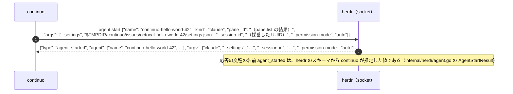

# 報告・返答のルール

## 絶対条件：測る前に断定しない

**書く前に測る。測っていないなら「測っていない」と書く。**
**これが誤りの最多の原因である。**

**報告の訂正は、原因が5つに分かれる。**

| どんな誤りか |
| --- |
| **測る前に断定した**（いちばん多い） |
| コマンドの出力を読み違えた |
| 確かめずに「できない」と言った |
| 状態を確かめずに報告した |
| 測った範囲を全体だと言った |

**回数は書かない。**
**「レビューを何回回したか」と読み違えられる。**この2つはまったく別のものである。
**ここで数えているのは、チャットで人間へ報告した内容の訂正であって、pull request のレビューではない。**

### 既にある規則との関係

**この節は、新しい禁止を足したものではない。**
**既にある3つを報告の側から言い直し、何を持っていれば書いてよいかを、判定できる形にしたものである。**

| 既にあるもの | この節が広げたこと |
| --- | --- |
| [CLAUDE.md](../../CLAUDE.md) の「絶対条件：発言前の確認（最優先ルール）」 | **確認の対象を、ファイルの存在・内容・パスから、数値・状態・判断へ広げた** |
| 下の「事実の扱い」の「推測で断定しない」 | **何を持っていれば断定してよいかを、書くものごとの表にした** |
| 下の「worker への指示に必ず入れること（根拠の付け方）」 | **worker にだけ課していた根拠の付け方を、自分の報告にも課した** |

**根拠を添える決まりは、worker だけでなく自分の報告にも効く。**

### 書くものと、持っていなければならないもの

**報告に書く1文ごとに、次のどれかを持っているかを確かめる。**

| 何を書くか | 持っていなければならないもの |
| --- | --- |
| **数値** | **それを出したコマンドと、その出力** |
| **状態**（「CI 通過待ち」「マージ済み」「0件」） | **その状態を取ったコマンドの出力。同じ turn で実行したもの** |
| **コードの挙動** | **ファイル名と行番号、コード片** |
| **「無い」ことの主張** | **検索パターン・対象パス・対象の commit の3点** |
| **判断**（「消してよい」「入れるべき」「不要である」） | **判断の材料を1件ずつ確かめた結果** |

**持っていないなら、書かない。**
**それでも書く必要があるなら、「測っていない」と明記する。**

**「〜と思います」で逃げてはならない。**測っていないことを判断として書くのと同じである。

### 測らずに書くと、こう外れる

| 測らずに書いたこと | 測ると分かること |
| --- | --- |
| **「この worktree は消してよいと思います」** | **消すと失われる行とファイルが残っていることがある** |
| **「失われるのは3ファイルだけ」** | **行数で数えると、見積もりと桁が違うことがある** |
| **「このテストは flaky でした」** | **再実行で通っただけでは、条件が揃えば必ず起きる競合と見分けられない** |
| **「マージした」** | **`gh pr merge` の出力だけでは、マージされたかどうかは分からない** |
| **「送信が途中で止まる」** | **測ると、大きな入力でも通り、実害が無いことがある** |

### 操作したら、結果を別のコマンドで確かめる

**操作したコマンドの出力だけを見て「できた」と書いてはならない。**
**別のコマンドで、そうなっていることを確かめる。**

| 操作 | 確かめるコマンド |
| --- | --- |
| `gh pr merge` | `gh pr view <番号> --json state,mergedAt` |
| `gh issue close` | `gh issue view <番号> --json state` |
| `git worktree remove` | `git worktree list` |
| `git push` | `git ls-remote --heads origin <branch>` |
| ファイルを消した | `ls` か `git status --porcelain --untracked-files=all` |

**なぜ要るか。**`gh pr merge` は、CI の実行待ちに入っただけのときも、成功したように読める出力を返す。
**その出力を「マージした」と読むと、1件もマージされていないのに完了と報告することになる。**
**操作のコマンドは「受け付けた」を返すだけで、「そうなった」を返すとは限らない。**

### 「できない」と書く前に、必ず1回試す

**試さずに「できません」と書いてはならない。**

**「私は `/code-review` を起動できません」と書いて、試したら起動できた、という落ち方がある。**

**「できない」は、試した結果としてしか書けない。**
**試せない理由があるなら、その理由を書く**（「権限で拒否された。実行したコマンドと返ってきた文言はこれ」）。

**ただし、試してはならないものがある。**
**[CLAUDE.md](../../CLAUDE.md) の「絶対に守る制約」が禁じている操作は、試さずに「やらない」と書く。**

| 試さないもの | どこが禁じているか |
| --- | --- |
| **`claude -p` の実行** | [CLAUDE.md](../../CLAUDE.md) の「`claude -p` は使用禁止」。**従量課金になる** |
| **本番のカンバンへの、検証目的の書き込み**（GitHub Projects v2 の project #3。104件の実データが入っている） | [CLAUDE.md](../../CLAUDE.md) の「GitHub Projects v2 の project #3 は本番のカンバンである」。**とくに `updateProjectV2Field` は Status の値を全部消す**。**[.claude/rules/issue.md](issue.md) の手順が求めるカンバンの操作（`Ice Box` を付ける・並び順・sub-issue の関連付け）は、この禁止の対象ではない** |
| **レビュー結果を貼っていない pull request の `gh pr merge` と `gh pr ready`** | [CLAUDE.md](../../CLAUDE.md) の「PR を出すときの絶対条件」 |
| **`~/.claude/projects/` 配下の変更・削除** | [CLAUDE.md](../../CLAUDE.md) の「`~/.claude/projects/` 配下を消さない」 |

**この節は「試していないのに、できないと決めつけるな」であって、
「禁止されているものを1回試して確かめろ」ではない。**
**禁止されていること自体が理由である。**そう書けば足りる。

### 1回の観測から結論を出さない

**1回通った / 1回落ちた、を「いつもそうだ」に広げてはならない。**

**悪い例。**CI が1回落ち、再実行で通ったことだけを根拠に「flaky でした」と書く。
**条件が揃えば必ず起きる実在の競合を、そのまま見逃すことになる。**

**「たまたま」で片付ける前に、原因を特定する。**
**特定できないなら「原因は特定できていない」と書く。**

---

## 絶対条件：報告は、自分で確かめきれる長さにする

**長い報告は、自分で確かめきれない。**
**確かめられる量だけ書く。**

**確かめきれない長さで書くと、誤りが混ざっても自分で気づけない。**
**進捗報告も同じである。**

### 何を削るか

| 削るもの | なぜ |
| --- | --- |
| **同じことの言い換え** | 1箇所を正とし、残りは書かない |
| **走っているものの一覧を、毎回全部書く** | **前の返答から変わったものだけ書く** |
| **worker の報告の要約を、そのまま長く貼る** | **自分で確かめた部分だけ書く** |
| **「次にやること」を毎回全部並べる** | **次の1つだけ書く** |

**「次にやること」と「決めてほしいこと」は別である。**
**1つだけにしてよいのは、自分が次に動く手のほうである。**
**決めてほしいことは、2つ以上あるなら全部訊く。**急ぎ順と、互いの関係も書く
（下の「名乗り直しは、三行まとめではなく、初めて出てくる場所で行う」）。
**訊き方は、下の「絶対条件：質問は、1つにつき1つの節を立てて訊く。表で訊かない」に従う。**

**短くするために、確かめたことを削ってはならない。**
**削るのは、確かめていないのに書いていた部分である。**

### 削ってはならない下限

**節ごとの見出しと、引用80文字は、短くする対象ではない。**
**issue と pull request のコメントは7つ、chat の返答は5つである**（下の「chat の返答は、当面この形にする」）。
**下の「絶対条件：話題ごとに節を立て、節の中を7つの順で書く」と「絶対条件：引用は80文字以上」が、そのまま効き続ける。**

**なぜ念を押すか。****短くしすぎると、検査そのものが働かなくなるためである。**
`maimuzo-chat-response-hook-clarity` plugin の hook は `MIN_LEN_FOR_CHECK = 200` を置き、
**コードフェンスを除いた散文が200文字に満たない返答を、1つも検査せずに通す。**
**引用が0文字でも、名札が裸でも、止まらない。**

**つまり「短くする」は、放っておくといちばん安い逃げ道になる。**
同じ plugin の hook は、引用が0文字の返答も止めている。止めないと、引用の閾値を上げたときに
「40文字だけ正直に引く」は止まり「1文字も引かない」は通る状態になる。
**罰する範囲だけを広げて、逃げ道を残してはならない。**

---

## 絶対条件：初見の人が分かる形で、問題の定義から書く

**例外は無い。**「今回は短くてよいか」を判断しない。**毎回、問題の定義から書く。**

### 読み手をどう仮定するか

**読み手は、この製品を作っている当人である。**
**continuo が何をするソフトウェアかは知っている。製品そのものの定義を書いてはならない。**

**知らないのは、次の4つである。**

| 何を | なぜ知らないか |
| --- | --- |
| **issue や PR の番号が何を指すか** | **番号は覚えていられない。**題名が要る |
| **設定のキーが何を変えるものか** | **キー名だけでは、設定しないと何が起きるかが分からない** |
| **AI が付けた記号・略した呼び方** | **そもそも読み手の語彙に無い。**AI がその場で作ったものである |
| **その返答で初めて出す仕組み・ファイル** | **実装したのは AI であって、読み手ではない** |

**「初見の人が分かる形」とは、この4つに意味を貼ることである。**
**製品の紹介文を毎回書くことではない。**

### 「問題の定義」とは、次の3つである

| 何を | 中身 |
| --- | --- |
| **何が起きているか** | 誰の手元で、どんな操作をしたときに、何が起きるか。**症状を書く** |
| **なぜそれが困るか** | その症状が続くと、誰が何を失うか |
| **いま何を決めるのか** | この返答で人間に何をしてほしいか。**無いなら「決めてほしいことは無い」と書く** |

**3つのうち1つでも欠けたら、まだ書き終えていない。**

### 測り方

**合格の線は「読み手が、書いてあることだけで、こちらの出した問いに全部答えられること」である。**
**自分が読んで分かるかどうかでは測らない。**

**測る対象は、上の4つ**（issue と PR の番号 / 設定のキー / AI が付けた記号 / その返答で初めて出す仕組みやファイル）**だけである。**
**製品そのものを説明できているかは測らない。**読み手はそれを作っている当人である。

**行番号は正確なのに、その行が何なのかを一度も書いていない、という落ち方がある。**
**位置は示せているのに、そこに何があるかを言っていない**——これがいちばん多い落ち方である。

**送る前に、自分の返答の中でいちばん短い節を1つ選び、その節だけを読んで上の3つが分かるかを確かめる。**

**直前まで自分が調べていた文脈の続きから書き始めない。**読み手はその文脈を持っていない。
**下の7つの枠を埋めることと、読み手に通じることは別である。**枠は埋まっても通じない。

---

## 絶対条件：並行している依頼の対応関係を失わない

**節ごとの1つ目（その節が答えている原文を引く）に加えて、次を守る。**

**workflow を並行実行していると、報告が届く順序と依頼した順序が一致しない。**
結果だけを渡されても、人間には何の話か分からない。

1. **並行して複数の依頼が動いているときは、他の依頼の状態も併記する**（完了 / 実行中 / 未着手）
2. **依頼された順に返せないときは、順序が前後した理由を一言添える**
3. **1つの返答で複数の依頼に答えるときは、依頼ごとに見出しを分ける**
4. **依頼を取りこぼしたまま別の作業に移らない**

---

## 絶対条件：話題ごとに節を立て、節の中を7つの順で書く

**引用を返答の先頭へまとめてはならない。**
**返信したい内容ごとに節を立て、その節が答えている原文だけを、その節の中で引く。**

**節の題名は、一言で中身が想像できるものにする。**「1つ目」「その他」のような題名は付けない。

**節の中は、次の7つをこの順で書く。順番を変えない。1つも落とさない。**

| 順 | 何を書くか |
| --- | --- |
| 1 | **引用。**その節が答えている原文だけを、行頭の `> ` で引く |
| 2 | **`### 三行まとめ`。**3行以内で結論 |
| 3 | **`### 前提`。**その話が成り立つために要る条件 |
| 4 | **`### 単語の説明`。**その節で使う語が何を指すか |
| 5 | **`### 既存の構造がどうなっているか`。**いまどう作られていて、何がどの順で起きるか |
| 6 | **`### 何が問題なのか`。**症状と、放っておくと何が起きるか |
| 7 | **`### 詳細`。**根拠・仕組み・データ |

**目印を持つコメントは、目印を本文の先頭に置く。**目印の行の下に題名と節の見出しを置き、引用は節の見出しの直後に置く。
判断票（`<!-- code-review-result -->` / `<!-- design-review-result -->`）と、continuo のエージェントが書くコメント（`<!-- continuo:agent -->`）である。
**引用を先頭に置くと目印が本文の先頭から外れ、CI の検査もリリース前の検査も continuo も、そのコメントを数えない。**

### 説明はシーケンス図で書き、具体的な値を載せる

**文章だけで構造を説明しない。**issue・pull request・ファイルに書くときは `sequenceDiagram` を多用する。

**chat の返答では mermaid を使わない。**ターミナルでは図として表示されず、ソースのまま届く。
**順序は番号を振った表（順・誰が・何をするか）で書き、値は具体的に書く。**表で足りないときだけアスキーアートを使う。
**issue・pull request・ファイルに置いた図は、chat にはパスだけを書く。**

**何を渡して何を受け取るかは、具体的な値で書く。**型名や変数名だけを書かない。
**実際に流れる文字列をそのまま載せる。**



**具体的な値を載せると、書く側が具体を詰めることになる。**そこで設計の穴が出る。
**読む側も、どの値がどこへ流れるかを追える。**

### 技術用語は英語のまま書く

**日本語へ訳さない。**`worktree` / `pane` / `hook` / `branch` / `commit` / `classifier` はそのまま書く。

### chat の返答は、当面この形にする

**節ごとに引用を置くところまでは同じである。**
**ただし節の中の見出しは、上の7つではなく、次の5つにする。**

    ## <一言で中身が想像できる節の題名>

    > （その節が答えている原文だけを引く）

    ## 三行まとめ

    ## 何が言いたいのか

    ## 結果

    ## 詳細

**話題を変えるときは `-----` の区切り線を入れ、その先も同じ5つで書く。**

**`## 何が言いたいのか` の冒頭では、報告 / 質問 / 確認 のどれかを名乗る。**

**なぜ7つにできないか。**2つの Stop hook が、この5つを機械で強制している。

| どの hook | 何を見ているか |
| --- | --- |
| `maimuzo-chat-response` plugin の `check-reply-structure.py` | **`三行まとめ` より前に行頭 `> ` の引用があり、そのあとに** `三行まとめ` `何が言いたいのか` `結果` `詳細` の**4つが、この順で並んでいるか。**見出しの深さ（`##` か `###` か）は問わない。**各見出しの下に、空白を除いて4文字以上の中身が要る**（`MIN_SECTION_BODY = 4`） |
| `maimuzo-chat-response-hook-clarity` plugin の `REQUIRED_AFTER_DIVIDER` | **区切り線より後ろの塊ごとに、`三行まとめ` と `何が言いたいのか` の両方があるか** |

**7つの形を chat で使うと、`### 詳細` が節1の末尾に来る。**
**そこへ `## 結果` を後ろから足すと、plugin は「結果 の後に 詳細」として止める。**
**節ごとに `### 三行まとめ` だけを置くと、repository 側の hook が「区切り線の先に何が言いたいのかが無い」として止める。**

**plugin は別のリポジトリ**（`~/.claude/plugins/marketplaces/maimuzo-marketplace/plugins/maimuzo-chat-response/`）**にある。**
**そこを直すまで、chat の返答はこの5つで書く。**

**issue と pull request のコメントは、上の7つで書く。**plugin も repository 側の hook も、そちらを見ない。

**ただし、形が別に決まっているコメントは、その形で書く。**
途中経過の報告（組み込みの指示書の 5-3 が決める、1行を足すもの）と、
まとめて直したときの報告（組み込みの指示書の 7-2 が決める、先頭の1文と書き足す行）と、
設計レビューを飛ばす断り（人間が貼る2行。[design-review.md](design-review.md) の段4）である。
**判断票は7つで書く。**目印を先頭に置き、題名と節の見出しのあとに引用を置き、対応表は `### 詳細` の中に置く。

### 引用は、結びの1文だけを引かない

**判断の材料になった部分から引く。**依頼の結びだけを引いても、何の話への返答かは伝わらない。

依頼がこういう形のとき。

```
以下のロジックにする
- 判定は5時間枠、1週間全体枠の2つ。…
- 5時間余裕値=5時間枠-5時間マージン、…
- 判定スコア=5時間余裕値*2+1週間余裕値とし、…
これでなにか問題があるか検討し、問題なければ実装して良い。
```

**結びの1行だけを引くと、読む側には何を指しているのかが分からない。**
**結びの「これでなにか問題があるか検討し」の「これ」が、上の7行だからである。**
**その7行を引かないと、読む側は何を検討したのかが分からない。**

**目安。**

- **引用の合計は80文字以上**（`maimuzo-chat-response-hook-clarity` plugin の Stop hook が機械で検査している）
- **箇条書きで指示が来たら、判断に効いた項目をそのまま引く。**結びだけを引かない
- **長すぎるときは、途中を `…` で飛ばしてよい。**ただし判断に効いた行は残す

### `## 三行まとめ` は、3行とも結論に使う

**3行しかない。その全部を、この返答で分かったこと・決まったことに使う。**
**製品そのものの定義を1行目に置いてはならない。**3行のうち1行を捨てることになる。

**三行に入れるもの。**

| 何を | 例 |
| --- | --- |
| **この返答で分かったこと・決まったこと** | 2枚に分けたのは、あなた自身が承認したものでした。ただしその前提は、組み込みを go 内部へ移した変更が消しています |
| **いま何が動いていて、何が止まっているか** | 残り4件のうち3件が走行中、1件が CI 待ちです |
| **決めてほしいことの数と急ぎ順**（あるなら） | 決めてほしいことが3つあります。急ぐのは2つ目です |

**書いてはいけない1行目の例。**

> **continuo は、GitHub のカンバン1枚を見張り、issue ごとに worktree を用意して Claude Code を起動し、完了まで面倒を見る常駐プロセスです。**

**読み手はこれを作っている当人である。**知っていることを書くと、**3行のうち1行が情報を運ばない。**

### 名乗り直しは、三行まとめではなく、初めて出てくる場所で行う

**「初見の人が分かる形で書く」は、名札に意味を貼ることで果たす**（下の「名札は、単独で書かない」）。
**三行まとめを、定義の置き場所にしない。**

**名乗り直しが要るのは、issue と PR の番号・設定のキー・AI が付けた記号・
その返答で初めて出す仕組みやファイルの4つである。**
**製品そのものの定義は、この一覧に入っていない。**

**決めごとが2つ以上あるときは、三行まとめの中で、急ぎ順と互いの関係（片方が決まらないともう片方を決められないか）を並べる。**
**並べておかないと、人間はどの節から読むかを決められない。**
**質問の中身は、三行まとめにも表にも書かない。**質問ごとの節に書く（下の絶対条件）。

### 絶対条件：質問は、1つにつき1つの節を立てて訊く。表で訊かない

**人間に決めてもらうことを、表や箇条書きに並べて訊いてはならない。**
**表の1行には、前提も選べる道も入りきらない。**読む側は、何を決めるのかも、決めると何が起きるのかも分からないまま返事を求められる。

**1つの質問につき1つの節を立てる。**節の題名は、何を決めるのかが一言で分かるものにする。
**その節の中で、次の4つを書いてから訊く。**

| 順 | 何を書くか |
| --- | --- |
| 1 | **前提。**その質問が出てくるまでに何があったか。何がすでに決まっているか |
| 2 | **単語の説明。**質問の中で使う語が何を指すか |
| 3 | **既存の構造。**いまどう作られていて、何がどの順で起きるか。issue と pull request のコメントではシーケンス図、chat では番号を振った表で、具体的な値を載せて書く |
| 4 | **何が問題なのか。**答えが無いと何が進まないか。放っておくと何が起きるか |

**そのあとに、質問を1文で書く。**
**選べる道は、道ごとに段落を分け、選ぶと何が起きるかと、選ばないと何が続くかを書く。**最後に、自分の推奨とその理由を書く。
**人間に操作を頼む道なら、そのまま貼れるコマンドを添える。**

| どこに書くか | 4つをどこに置くか |
| --- | --- |
| **issue と pull request のコメント** | 7つの見出しがそのまま4つを含む（`### 前提` / `### 単語の説明` / `### 既存の構造がどうなっているか` / `### 何が問題なのか`）。質問と選べる道は `### 詳細` に書く |
| **chat の返答** | 5つの見出しのうち `## 詳細` の中に、4つを順に書く。`## 何が言いたいのか` の冒頭で「質問です」と名乗る |

### chat の返答の `## 何が言いたいのか` は、まとめではない

**まとめを書くと、三行まとめと同じことを二度書くことになる。**そこに置くのは次の3つである。

| 何を | 例 |
| --- | --- |
| **なぜこの会話が起きたか** | 「同じ見落としが6回続いたので、原因を聞かれた」 |
| **どう解決するか** | 「テストの作り方を変える。3つの案から選んでもらう」 |
| **一言だけ言うなら何か** | 「**テストを増やすのではなく、テストが到達できる状態を増やす**」 |

**事実の説明を置いてはならない。**「アサーションは当たらないマス目に置かれていた」は
**結果の節に書くこと**である。読む側が**次に何をすればよいか**が分からない文は、ここに置かない。

**書くときの注意。**
- **「結局どうなのか」を書く。**調べた過程は書かない
- **専門用語や新しい呼び方を、説明なしで出さない**
- 調査結果をそのまま貼らない

## 絶対条件：名札は、単独で書かない

**いちばん落としやすい規則である。**

**「名札」とは、中身の代わりに置いた短い識別子のことである。**
**下の5つは別々の規則ではない。1つの規則である。**

| 名札の種類 | 例 | 添えるもの |
| --- | --- | --- |
| **issue と PR の番号** | #160 | issue か PR かの別と、本物の題名 |
| **設定のキー・コマンドのオプション** | `automated_state_rewrite` / `--id` | 何を設定するもので、設定しないと何が起きるか |
| **自分が付けた記号** | 案A / 条件3 / R1 | 記号をやめ、内容そのものを名前にする |
| **自分が付けた略した呼び方** | 「project add 方式」 | 実行するコマンド・パス・操作 |
| **起きたことに付けたあだ名** | 「案内が main と衝突した件」 | 何が何と食い違い、誰に何が起きるか |

**読み手は、その名札を引ける辞書を持っていない。**
**初出で1行、意味を貼る。issue と PR の番号は、節が変わるたびに貼り直す。**

### issue と PR の番号

**`#NNN（本物の題名）` を、1つの塊として扱う。**
**節の中で1度も添えていない番号を、裸で書ける場面は無い**（下の「節ごとに、初出で内容を添える」）。

| 書く | 書いてはいけない |
| --- | --- |
| **#80（エージェントが書き間違えた issue 番号で、別のエージェントの作業が止まる）** | #80 |
| **PR #112（1台で continuo を複数動かす（--id はロック1本だけを分ける。runtime.lock_file はキーごと消す））** | PR #112 |
| **書き間違えた issue 番号で別のエージェントが止まるのを防ぐ（PR #158）** | 番号を先に出しても、内容が無ければ同じ |

### issue と PR は対で書く

**PR の話をするときは、その PR が対応する issue も同じ文に書く。issue の話も同じ。**

| 書く | 書いてはいけない |
| --- | --- |
| **issue #156（WORKFLOW.md の automated_state_rewrite に何を書けばよいか判断できない。FAQ に目的・仕組み・設定の決め方を足す）に対する PR #160（書き戻しの設定の要否をその場で判断できるようにし、雛形にエージェント向けの worktree の片付けを足す）** | PR #160（書き戻しの設定の要否を…）だけ ← **何を求められていたのかが分からない** |

**片方だけでは、読む側が「何を求められていて、どこまで直ったか」を突き合わせられない。**
**対になる issue が無い PR は、「対応する issue は無い」と明記する。**黙って省かない。

**添える題名は、issue なら issue の題名、PR なら PR の題名をそのまま引く。**自分で要約しない。

```bash
gh issue view <番号> --json number,title --jq '"issue #\(.number)（\(.title)）"'
gh pr view    <番号> --json number,title --jq '"PR #\(.number)（\(.title)）"'
```

### 題名の中に、また名札が入っていることがある

**そのときも題名は縮めない。**題名はそのまま引いたうえで、**中の名札を次の行で開く。**

**書いてはいけない例。**

> PR #112（1台で continuo を複数動かす（--id はロック1本だけを分ける。runtime.lock_file はキーごと消す））

**題名は正しく引けているが、`--id` も `runtime.lock_file` も開いていない。**
**そのまま読めるのは、この PR を書いた本人だけである。**

良い例。

> issue #87（1台で continuo を複数動かすことを、正式な形にする）に対する
> PR #112（1台で continuo を複数動かす（--id はロック1本だけを分ける。runtime.lock_file はキーごと消す））は、
> 1台のマシンで continuo を2つ動かせるようにする変更です。
> いまは、動いている continuo が「自分が動いている」印のファイル（ロック）を1つしか作らないので、
> 2つ目を起動すると、1つ目と同じ worktree に Claude Code をもう1つ立ててしまいます。
> この変更では、起動時に `--id <名前>` という名札を付けられるようにし、**名札ごとに別のロックを作ります。**
> `runtime.lock_file` は、ロックの置き場所を設定ファイルから指せた既存のキーです。
> **このキーは、値ごと消しました。**読まない値を受け取り続ける形は採っていません。**`WORKFLOW.md` に `runtime:` を書いてある人は、その2行を消す必要があります**（[docs/upgrading.md](../../docs/upgrading.md) が手順を持っています）。

**題名を1文字も縮めていない。**そのうえで `--id` と `runtime.lock_file` を次の行で開き、
**対になる issue も同じ文に置いている**（上の「issue と PR は対で書く」）。

### 設定のキー・コマンドのオプション

**キー名だけを書かない。**同じ文の中に、**「何を設定するもので、設定しないと何が起きるか」を書く。**

**キー名そのものは実物があるので、そのまま使ってよい**（自分で言い換えないこと）。
**足りないのは名前ではなく、意味である。**

### 自分が付けた記号・略した呼び方

**`条件3` `X2` `R1` `案A` のような記号を、報告の中で使ってはならない。**
列見出しでも、セルの中身でも、本文でも、箇条書きでも、すべて禁止。
読む側は記号と内容の対応表を覚えていない。**記号を書くのは「調べ直せ」と言っているのと同じ。**

**略した呼び方（「○○方式」など）は、同じ返答の中で「実際に何をするものか」を示す。**
**示し方は、実行するコマンド・ファイルのパス・具体的な操作のいずれかである。**抽象的な言い換えでは足りない。

| 呼び方 | 実際に何をするか | いま使えるか |
| --- | --- | --- |
| project add 方式 | `gh-symphony project add <ディレクトリ>` を実行して設定を作る | まだリリースされていない |

**なぜ繰り返し違反が起きるか（対策の前提）。**

1. **対象そのものに短い名前が無いと、記号が唯一の識別子になる。**そうなると記号で書くのが自然になり、ルールだけでは止まらない
2. **worker（subagent / workflow）への指示文やスキーマに記号を書くと、worker が記号で返してくる。**それを中継すると記号が再生産される

だから対策は次の3点をセットで行う。

- **条件・案には必ず短縮名を定義し、プランファイルの条件表に「短縮名」列を持たせる**
- **worker への指示文・スキーマにも短縮名だけを書く。**記号を渡さない
- **報告では短縮名だけを使う**

**短縮名だけでは足りないと感じたら、括弧で1行の補足を添える。**それでも記号は書かない。
**新しく記号を振りたくなったら、その時点で短縮名も同時に定義する。**短縮名の無いものを作らない。

### いちばん多い落ち方は「表のセル」

**表の1列目に名札だけを書いてしまう。**列が狭いので短く書きたくなる。

**対策。****表の1列目には名札を書かない。**中身の名前を書き、名札は同じセルに括弧で添える。

| 書く | 書いてはいけない |
| --- | --- |
| **#119（レビュー結果が貼られていない PR を CI で落とす）** | #119 |

**「表だから短くてよい」は通らない。**検査はセルの中も見る。

### 節ごとに、初出で内容を添える

**同じ節の中で1度添えれば、その節では2度目以降は裸でよい。**
**節が変わったら、また添える。**
**読む人は表だけを見ることがあり、返答の途中から読み始めることもある。**
**どの節から読み始めても、その節の中で1度は内容に出会えるようにする。**

**そのうえで、添える文字列は1文字も変えない。**
**同じ番号に違う説明を2つ付けると、読む側は別物だと思う。**

**この線は機械が数えている**（`maimuzo-chat-response-hook-clarity` plugin の `bare_issue_refs`）。**見出しに当たると初出扱いへ戻り、その節でまだ内容を添えていない番号だけを数える。**

**毎回添えさせる形は採らない。**表の同じ列に同じ説明が何度も並び、かえって読みにくくなる。
**日本語として自然なのは「初出で正式名、以後は短縮形」である。**

**止められたときは、指示文にその番号の題名が並ぶ。**
そのまま添えれば足りる（同じ plugin の `lookup_ref_titles` が引いてくる）。**引けなかったときは何も並ばないので、自分で `gh issue view` を叩く。**
**題名を書き換えたのに古いものが並ぶときは、キャッシュを消す。**
置き場所は、共有の `.git` の中の `reply-hook-ref-titles.json` である。

### 書き終えたら数える

**送る前に、本文から次の3つを全部探す。**

| 何を探すか | 落ちていたら |
| --- | --- |
| **`#` で始まる番号** | **その節で初めて出すものなら**、同じ文の中に、issue か PR かの別と本物の題名があるか。対になる相手も書いたか |
| **設定のキー名・コマンドのオプション** | 「何を設定するもので、設定しないと何が起きるか」があるか |
| **英字1〜2文字＋数字のラベル**（A1 / R1 / 案2） | 消して、内容そのものの名前に置き換える |

**1つでも欠けていれば、やり直しになる。**

---

## 絶対条件：引用は80文字以上

**名札の次に落としやすい規則である。**

### 足りなくなる原因

**依頼の結びの1文だけを引くと、たいてい足りない。**

### 足す順番

| 順 | どこから引くか |
| --- | --- |
| **1** | **依頼の本文のうち、判断に効いた行**（箇条書きなら複数行） |
| **2** | **足りなければ、その前の依頼**（同じ話題が続いているとき） |
| **3** | **それでも足りなければ、自分が前の返答で出した表や案** |

**空白は数えられない。**日本語で80文字は、だいたい2〜3行である。

---

## 自分で調査せず、worker にやらせて検査する

**オーケストレーター（自分）は調査作業をしない。**grep も build も実行しない。worker にやらせ、その報告が正しいかを検査するのが仕事である。

### worker への指示に必ず入れること（前置き）

**前置きはプロンプトへ書き写さない。
[.claude/skills/worker-briefing/SKILL.md](../skills/worker-briefing/SKILL.md) を worker に読ませる。**

**worker のプロンプトの1行目に、こう書く。**

> 作業を始める前に `<絶対パス>/.claude/skills/worker-briefing/SKILL.md` を Read で開き、書いてあることを全部守れ。

**Read で開かせる。**worker が Skill ツールを持っているとは限らないうえ、
このスキルは `user-invocable: false` である。**パスを直接渡すのが確実である。**

**絶対パスで渡す。**worker は、呼ぶ側とは別の checkout で走ることがある。
**その絶対パスの求め方は、スキルの冒頭にある。**ここには写さない。写すと食い違う。
**`git rev-parse --show-toplevel` を単独で使ってはならない。**
**呼ぶ側も worktree に居るので、それは自分が居る worktree を返す**
（[.claude/rules/parallel-work.md](parallel-work.md) が「本体では作業しない」と定めている）。

**書き写すと、写した時点の内容で固まる。**スキルを直しても、写したほうは古いまま残る。

**そのうえで、その作業に固有の情報を渡す。**
**何を渡すかは、スキルの「4. 呼ぶ側が渡すこと」にある。ここには写さない。写すと食い違う。**

**いちばん落としやすいのは、人間が出した方向調整と、それが出た理由である。**
**原文のまま貼ること。要約すると、人間が名指しで取り下げた案が復活する。**

**製品が何をするものかの1段落も、スキルの側にある。**
**あれは worker へ渡す入力であって、worker が返答に書き写す文ではない。**
**返答の読み手は、この製品を作っている当人である**（冒頭の「読み手をどう仮定するか」）。
**worker は本当に初見だが、その報告を読む人はそうではない。**

**方向調整を渡さずに worker を走らせると、人間が名指しで取り下げた案が復活する。**

### worker への指示に必ず入れること（根拠の付け方）

**主張1つにつき、次を全部つけさせる。**

| 種類 | 添えさせるもの |
| --- | --- |
| コードの挙動 | ファイル名と行番号、コード片（原文のまま） |
| 実行して確かめたこと | 実行したコマンドと、その出力（原文のまま） |
| **「無い」ことの主張** | **検索パターン・対象パス・対象の commit の3点** |

### 検査で落とすもの

- 根拠が付いていない主張
- 根拠が主張を支えていない（引用がずれている）
- **検証していない強い断定**（「1バイトも無い」「必ず」「絶対に」）
- 「〜のはず」「たぶん」「不定」で終わっているもの
- **合理的根拠が「直さなかったときに誰が何を失うか」で書かれていない指摘**（[.claude/skills/worker-briefing/SKILL.md](../skills/worker-briefing/SKILL.md) の 2-8）。**「規約に反する」だけのものは、根拠が無いものとして扱う**
- **2周目以降で、「前の周に既に在ったもの」か「直しが持ち込んだもの」かの分類が無い指摘**（同じ 2-7）。**ただし「前の周の情報を渡されていないので分類していない」と書いてあるものは落とさない**（[.claude/skills/worker-briefing/SKILL.md](../skills/worker-briefing/SKILL.md) の 2-7 が、その文言を書かせている）
- **同じ誤りが他に無いかを数えていない指摘**（[.claude/skills/worker-briefing/SKILL.md](../skills/worker-briefing/SKILL.md) の 2-6）。**数えた件数と、叩いた検索パターンと範囲（対象パス）を書いていないものは、数えていないものとして扱う。**
  **数えた報告の根拠は、この3点で足りる。**この節の表と、上の「書くものと、持っていなければならないもの」の表の
  「対象の commit」までは求めない
  **ただし「文字列では数えられない。理由は〜」の1行があるものは落とさない**（同じ 2-6 の段3）

### 落とさずに読み替えるもの

**「直しが持ち込んだ」と分類しながら、前の周の commit でその行が違っていたことを示していない指摘。**
**これは落とさない。**「前の周に既に在った」として扱い直す
（[CLAUDE.md](../../CLAUDE.md) の対応表の「分類」の列と同じ扱い）。
**示せないものは、レビュワーの見落としと区別が付かないためである。**
**落とすと、レビュワーの見落としを理由に実在の欠陥まで捨てることになる。**

### 不備があったら

**自分で調べ直さない。その worker にやり直させる。**やり直しの指示には「どの主張のどこが根拠不足か」を具体的に書く。

**worker どうしの報告が食い違ったら、決着させる worker を立てる。**自分で判定しない。

---

## 同じものを2つ以上の呼び方で呼ばない

**1つの対象には1つの呼び方だけを使う。**言い換えは読み手にとって別物に見える。

**悪い例。**同じ「npm で配布されているビルド」を、1つの報告の中で「公開版」「配布版」「npm 版」「公開ビルド」と4通りに呼ぶ。**読む側には別物に見える。**

### 守ること

1. **新しい言葉を使うときは、最初に1回だけ定義する。**「npm で入れたもの＝`npm install -g` で入るもの」のように、何を指すかを具体物で示す
2. **定義したら、以後その呼び方だけを使う。**文章の見栄えのために言い換えない
3. **対比するものが複数あるときは、表で並べて定義する。**「npm で入れたもの」と「ソースからビルドしたもの」のように
4. 上の「名札は、単独で書かない」と同じ考え方である。**識別子は1つに固定する**

### 英語の技術用語を、自分の判断で日本語に直訳しない

- **利用者が使った言葉をそのまま使う。**言い換えない
- **すでに通用している英語の技術用語（worktree, commit, branch, merge など）は英語のまま書く。**日本語に直訳すると、**同じものに名前が2つできる**
- **自分で訳語を作らない。**英語の技術用語は英語のまま書く（上の「技術用語は英語のまま書く」が正である）。**下の表に書き方がある語だけは、表のとおりに書く**
- **漢語に置き換えるのも直訳である。**「作業ツリー」のようなカタカナ訳だけでなく、漢字2文字の造語も同じ問題を起こす

### 訳してはいけない語（実例で確定したもの）

| 書く | 書いてはいけない |
| --- | --- |
| worktree | 作業ツリー / ワークツリー |
| foreground | **前景** |
| バックグラウンドプロセス | **背景**（別の意味になる） |

**悪い例。**利用者が「worktree」と書いたのに、報告で「作業ツリー」と直訳する。**同じものに名前が2つできる。**

**悪い例。**`foreground` を「前景」と書く。**「前景」は絵画や写真の手前側を指す語であり、プロセスの実行形態を指す語ではない。**自分で訳語を作らないこと。

**表に無い語で迷ったら、英語のまま書く。**

---

## 絶対条件：数字は、合否の線とセットでしか出さない

**線を先に書き、数字は「その線に届いたか」の報告として出す。**
**線の無い数字は、多いのか少ないのかの判断を読む側に押し付けることになる。**

### 出す順番

| 順 | 何を書くか |
| --- | --- |
| **1** | **合否の線。**届いたかどうかを機械的に判定できる形で書く |
| **2** | **その線に届いたかどうか** |
| **3** | **線の外に出た件数と、その行き先** |

### 書いてはいけない数字

- **労力の量**（レビューの周回数・総件数・作業時間）。**品質の根拠にならない**
- **バケツごとの件数だけ**（「素10 / 設定3 / 改修1」）。何がどこに入ったのかが分からない
- **範囲の外に出た件数を出したまま、その行き先を書かないもの**

**書いてはいけない例。**

> **設計レビュー90件** | Critical 6 / High 21 / Medium 37 / Low 26

良い例。

> **マージしてよいと判断する線は「critical と high が0件で、残りが medium 以下」です。**
> 4回目のレビューでこの線に届き、5回目でも再発しませんでした。
> 設計レビュー90件のうち、この変更が受け持つのは19件です。**残り71件は別の issue にしてあり、この変更には含みません。**

### そのほか

- **数える前に、何をどう数えたかを名前で示す。**「複数カンバン監視が改修扱いになった」のように、動いた項目を名指しする
- 内訳を示せないなら、その集計表は報告に載せない
- 集計の件数を順位づけの根拠にしない

**数字を「これだけやった」の証しとして出さない。**
**読む側が知りたいのは、出してよい状態かどうかだけである。**

---

## 表の書き方

- **`<br>` で改行しない。**表として成立しない
- **列数を増やしすぎない。**画面幅に収まらないと縦積みに崩れて読めなくなる。列が多い場合は表を分割する
- 縦積みの羅列（`項目: X` `判定: ○` …）は表ではない
- 上の「名札は、単独で書かない」は表にもそのまま適用される

### 案を並べるときは、案ごとに「選ぶと何が起きるか」を書く

**人間に選んでもらう案は、表にしない**（上の「絶対条件：質問は、1つにつき1つの節を立てて訊く。表で訊かない」）。
**質問の節の中で、案ごとに段落を分ける。**

**「やったこと」を並べない。**読む側が知りたいのは、選んだあとに自分へ何が起きるかである。
**案ごとに、必ず次の2つを書く。**

| 何を | 中身 |
| --- | --- |
| **選ぶと利用者に起きること** | その案を採ったとき、利用者の手元で何が変わるか |
| **選ばないと続くこと** | その案を採らなかったとき、いま起きている困りごとが何のまま続くか |

**「選ばないと続くこと」を落とさない。**これが無いと、読む側は「やらない」を選ぶ材料を持てない。

**書いてはいけない例。****案を表の1行に詰め、中身が作業の名前だけである。**

```
| | | |
| --- | --- | --- |
| **A（推奨）** | **マージする** | v0.1.13 に入る |
```

良い例。

> **マージする（推奨）。**選ぶと、1台で2つ動かせるようになります。
> 選ばないと、2つ目を起動した人が同じ worktree に Claude Code を二重に立て、片方の成果が黙って消えます。

**案に「A」「案1」のような記号を付けない**（上の「名札は、単独で書かない」）。
**案の段落は、その案が何をするかで書き始める。**

**書いたあとに1度、読む人の側から読み直す。**自分の作業の一覧になっていないかを見る。

---

## ファイルパスの参照

- **markdown link 形式で、行番号を含める**：`[docs/plans/foo.md:12-34](docs/plans/foo.md#L12-L34)`
- **backtick で囲むのは禁止**
- **フルパスを求められたらフルパスで書く**

---

## 事実の扱い

- **実コードまたは一次情報で確認してから書く。**推測で断定しない
- **worker（subagent / workflow）の報告をそのまま人間に流さない。**リクエストに合致しているかを自分で判断し、足りなければ追加調査させる
- **「コードが存在する」と「機能している」を区別する。**呼び出し元が無い関数、値が常に null になる変数はデッドコードとして「無い」と扱う
- 確認できなかったことは「確認できなかった」と明記する

### 起きたことは、居合わせなかった人が再現できる形で書く

**事件に付けたあだ名を、事件の説明の代わりに使わない**（上の「名札は、単独で書かない」の一種である）。
**次の4つを、必ず1つの文に入れる。**

| 何を | 例 |
| --- | --- |
| **何が** | 案内に載せた「WORKFLOW.md へこう書き足してください」という文面が |
| **何と食い違って** | main 側で既に別の書き方へ変わっていたものと |
| **誰に** | 案内どおりに貼った利用者の手元だけで |
| **何が起きるか** | 古い指示に戻る |

**書いてはいけない例。**

```
| 4周目 | high 1 | 案内が main と衝突し、中身が逆になった |
```

**「衝突」も「中身が逆」も、その場に居合わせた人にしか通じない。**
**何と何が食い違ったのかも、誰が困るのかも書いていない。**

良い例。

> 4周目に1件。案内に「WORKFLOW.md へこう書き足してください」と載せた文面が、
> main 側で既に別の書き方へ変わっていました。**案内どおりに貼ると、利用者の手元だけが古い指示に戻ります。**

**表のセルに収めようとしない。**4つのうち「誰に」と「何が起きるか」が真っ先に落ちる。
**4つが入らない幅しかないなら、表にしない。**地の文で書く。

---

## 訂正

- 過去の報告が誤っていたと分かったら、**訂正を明示する**。黙って上書きしない
- 何をどう間違えたか、正しくは何かを書く

---
