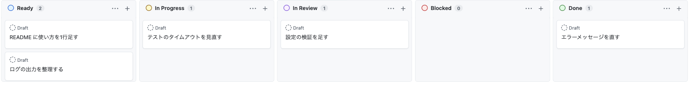

# continuo

[](https://github.com/maimuzo/continuo/actions/workflows/ci.yml)

**[日本語](README.ja.md)**

continuo turns a GitHub Projects v2 kanban board into a work queue for coding agents. Drop an issue into `Ready` — from any of your repositories — and continuo picks it up, prepares a git worktree, and runs Claude Code on it inside a [herdr](https://github.com/herdrdev/herdr) pane. When the agent is done, the result comes back to the kanban board as a Status change.

It is written in Go and implements the [openai/symphony](https://github.com/openai/symphony) service specification. You watch the work happen in a real terminal, on your usual Claude subscription.

---

## How the kanban board drives it

Put your task in an issue, move it to `Ready`, and continuo takes it from there. If it lands in `Blocked`, the agent needs something from you — answer in an issue comment. If it lands in `In Review`, the work is done and waiting for you to look at it.



| Status | Who moves it | What is happening |
| --- | --- | --- |
| `Ready` | **You** | continuo picks these up in kanban board order and starts them in herdr |
| `In Progress` | continuo | Work has started. A feature branch and a git worktree exist for this issue |
| `In Review` | continuo | The agent finished. Open the issue and check the result — **moving it to `Done` is yours to decide** |
| `Blocked` | continuo | The agent got stuck or needs an answer. Reply in an issue comment, then move it back to `Ready` |
| `Done` | **You** | continuo removes the worktree and the branch |

**Your Status names do not have to match.** `Ready` or `Todo`, `In Review` or `Needs review` — you map your own option names to these five roles once, with `continuo setup`.

## You can see what it is doing

Claude Code runs **in interactive mode, in a herdr pane** — not hidden in the background. Open herdr and watch it work, or read the pane from another terminal:

```bash
herdr agent read continuo-hello-world-188 --source recent-unwrapped --lines 40
```

**No metered API calls.** continuo never uses `claude -p`, the Agent SDK, or the HTTP API. It keeps one interactive session per issue and sends follow-up turns into it, so context accumulates across turns the same way it does when you drive Claude Code yourself.

Start it with `continuo --port 8080` and you get a plain list of what is running at `http://localhost:8080`.

## One kanban board, many repositories

A single kanban board can hold issues from as many repositories as you like. continuo creates a worktree per issue, under the repository it belongs to:

```
~/worktrees/github.com/octocat/hello-world/continuo-octocat-hello-world-188/
~/worktrees/github.com/octocat/sample-app/continuo-octocat-sample-app-42/
```

How many issues run at once is a setting (two by default).

## Before you start

**The agent edits your repository, commits, and pushes.** continuo starts Claude Code with permission prompts turned off and allows `Bash` without argument restrictions. Nothing will stop and ask you.

**Issue text is agent instructions.** The default brief tells the agent to read the issue body and every comment **as JSON**, so GitHub's own `authorAssociation` arrives beside the text instead of inside it, and to obey instructions only from `OWNER` / `MEMBER` / `COLLABORATOR`. Anything else is read as a report. **That narrows the hole; it does not close it.** The agent still runs `Bash` with no prompt, so whatever it decides to run, runs.

**On a public repository, that text is written by other people.** Anyone can open an issue or leave a comment. **If it says "delete this repository", that is what runs.**

| Mitigation | What to do |
| --- | --- |
| **Only advance issues you wrote** | A human moves things into `Ready`. Do not move an issue you did not read |
| **Filter by label** | Set `tracker.required_labels` so only issues carrying your marker are eligible |
| **Isolate it** | Run it under a dedicated account, or on a machine or container you can discard |

**Try it on a repository you can throw away.** Do not point it at production work on day one.

**Agent teams are not supported.** They are an experimental Claude Code feature, disabled by default.
**With them enabled, issues fail.** [docs/FAQ.md](docs/FAQ.md) has the symptom and the fix (Japanese).

## Requirements

| | |
| --- | --- |
| OS | macOS or Linux. **No native Windows** — use WSL2 |
| [herdr](https://github.com/herdrdev/herdr) | The daemon that owns the panes and worktrees. continuo drives Claude Code through it. **Verified against 0.8.0** (it refuses to start on a socket protocol mismatch) |
| [Claude Code](https://claude.com/claude-code) | Used on a **subscription plan**. Verified against 2.1.233 |
| [`gh`](https://cli.github.com/) | Signed in with `gh auth login -s project`. Verified against 2.97.0 |
| [`git`](https://git-scm.com/) and [`ghq`](https://github.com/x-motemen/ghq) | Creating worktrees, and resolving where a clone lives |
| [Go](https://go.dev/dl/) 1.26+ | Only if you build from source |

**Your kanban board needs five Status options.** GitHub gives you three by default (`Todo`, `In Progress`, `Done`), so **add the missing two from the GitHub UI**: open the kanban board's `Settings`, pick `Status` under `Custom fields`, then `Add option...`. The names are up to you — `continuo setup` maps them to roles afterwards.

`continuo doctor` runs fifteen checks: config, cleanup states, **settings missing from your `WORKFLOW.md`**, Claude Code, **the hook socket location**, the Claude settings directory, the worktree root, herdr, `gh` auth, kanban board, Status names, the rewrite table's keys, clones, trust, and credentials (used to read your plan's usage window). It does **not** check your OS or Go version — that part is on you.

**A `✗` means the exit code is 1; a `!` on its own leaves it at 0.**
Exit code 0 is not the same as "continuo will start", though. **Failing to read the kanban board**
(rate limiting, or the check running out of time) **also shows up as `!`**, and continuo performs
the same read every time it starts — so while that `!` is there, it will not start.
Wait a while and run `continuo doctor` again.

## Install

```bash
curl -fsSL https://raw.githubusercontent.com/maimuzo/continuo/main/install.sh | sh
```

The installer detects your OS and architecture, pulls the matching binary from [releases](https://github.com/maimuzo/continuo/releases), verifies its checksum, and puts it in `~/.local/bin/continuo`. If `git`, `gh`, or `ghq` is missing, it asks you one at a time and shows the exact command it would run. **It never installs `herdr` or `claude`** — both have their own distribution and sign-in flows, so it points you at them instead.

| Option | Effect |
| --- | --- |
| `--yes` | Answer yes to every prompt, including package installs |
| `--no-deps` | Install nothing but continuo; just list what is missing |
| `--dir DIR` | Install somewhere else (default `~/.local/bin`) |
| `--version V` | Install a specific release instead of the latest |
| `--repo O/R` | Install from a fork. **Using it prints a warning** |

**It stops if it cannot verify the checksum.** Pass `--insecure-no-checksum` to go ahead anyway.

**A checksum alone does not detect tampering** — it ships from the same release as the archive, so anyone who can replace one can replace both. **GitHub's signed build provenance is the stronger check**, and the installer runs it automatically when `gh` is available. To check it yourself:

```bash
gh attestation verify continuo_darwin_arm64.tar.gz --repo maimuzo/continuo
```

Prefer to build it yourself? You need Go 1.26:

```bash
git clone https://github.com/maimuzo/continuo.git
cd continuo
mise trust && mise install                       # if you manage Go with mise
go build -o ~/.local/bin/continuo ./cmd/continuo
sh scripts/test-like-ci.sh                       # run the tests (~3 min, optional)
```

## Use

**continuo does not create a kanban board.** It attaches to the one you already use.

```bash
mkdir -p ~/continuo-work && cd ~/continuo-work

continuo init      # writes WORKFLOW.md; owner and kanban board number come from gh
```

**Open `WORKFLOW.md` before you go further.** `trust.repositories` lists every repository it found on the kanban board. Delete the lines you do not want — otherwise Claude Code gets trusted access to repositories that have nothing to do with this.

```bash
continuo setup                    # map your Status options to the five roles (interactive)
continuo trust --dry-run          # show what would be trusted, without doing it
continuo trust                    # trust those repositories; clone them if needed
continuo allow-keychain-access    # macOS only, once — lets continuo read your plan's usage
continuo doctor                   # check that everything is in place

continuo                          # start the daemon
```

From here on, moving an issue to `Ready` is all it takes.

If something does not work, [docs/FAQ.md](docs/FAQ.md) lists the symptoms you are likely to hit and the exact command that fixes each one (written in Japanese).

**`Ctrl+C` stops it.** It stops polling and unwinds its turn loops, but **it does not close the panes** — Claude Code keeps running, and the next start picks those panes back up and continues.

**Flags go before or after the positional arguments**, the way `git` and `gh` take them: `continuo trust ~/continuo-work --dry-run` and `continuo trust --dry-run ~/continuo-work` do the same thing. **Everything after `--` is a positional argument**, even when it starts with `-`. A flag it does not know is still an error, wherever you put it.

### Undoing a start

Started the wrong issue? **`continuo abandon` puts it back the way it was before it started** — the worktree, the pane, the herdr workspace and the branch all go away together.

```bash
continuo abandon --dry-run https://github.com/octocat/hello-world/issues/42   # show what would be deleted
continuo abandon https://github.com/octocat/hello-world/issues/42              # delete it
```

**Run `--dry-run` first.** Before deleting anything it prints the issue's Status, the worktree path, the branch, the herdr pane, **how many files have uncommitted changes**, and **how many commits are not pushed**.

**`--dry-run` writes nothing at all.** It does not touch the kanban board and it does not make continuo let go of the issue — it only tells you which Status the real run would park it at.

**A Status it cannot write is caught before anything is deleted.** `--to` and the park target are checked against the kanban board's own Status options first, and `--park` is refused outright if it names a working state — parking there would not make continuo let go, and the pane would never close. **If no worktree matches, `--to` is not applied**: the command says so instead of dropping it silently, because a URL with a typo would otherwise move some other issue's Status.

**If there is anything to lose, it deletes nothing and stops.** Add `--force` if you want it gone anyway.

**A leftover branch is cleaned up even when the worktree is gone.** If starting the issue failed part-way,
**the branch can be all that is left**. `abandon` builds the branch name from `herdr.worktree.branch_template`
and the URL you gave it, and reports the name, the repository, the tip commit and **how many of its
commits are on no remote** if it is still there.
**Deleting it needs `--force`** — with no worktree there is no way to tell whether uncommitted edits were left behind.
When it is deleted you get the command to bring it back (`git -C <clone> branch <name> <sha>`).

**If git refuses because a worktree is using the branch, it stops there.** continuo never runs
`git worktree prune` on your behalf: **the directory that registration points at may have been moved,
not deleted.** You are told where the registration points and how to clean it up
(`git -C <clone> worktree prune`) before trying again.

**A branch that never existed is never reported as "left behind".** If the branch was never created,
you are told there was nothing to delete. **Only when the repository cannot be named** — so existence
cannot be checked — is it reported as a leftover, as before.

**A broken worktree is still cleanable.** A worktree's `.git` is a one-line file, and if it is emptied, overwritten or removed, every `git` command inside that worktree fails. **`abandon` does not stop there** — that is exactly the state you wanted it for. It shows what it *can* see, lists what it could not work out and why, and **never claims there is nothing to lose**. Since it cannot see inside, **the real run asks for `--force`**, and with it the worktree directory, the branch and the herdr workspace all go away without git's help.

**The same applies when herdr does not answer.** Without `--force` it still refuses to delete while it cannot check for a live pane; with `--force` it says out loud that it skipped the check. **The one thing it never degrades on is a worktree whose `.git` points at a *different* repository** — that is a sign of tampering, not of breakage, so it deletes nothing at all.

**You can run it while continuo is running.** It makes continuo let go of the issue first: if the issue is still in a working state, it parks the Status at `tracker.failure_state` (`Blocked` by default; use `--park` to send it somewhere else), then waits for the pane to close before deleting anything. **If the pane does not close, nothing is deleted.**

**If it stops after parking, the Status stays at the parked value.** continuo does not move it back — the value it came from is a working state, so restoring it could have continuo pick the issue up again on the spot. **It tells you so in one line**; whether to move it back is your call on the kanban board.

**If continuo is not running, it still checks the panes before deleting.** The lock file's location depends on your environment (`CONTINUO_RUNTIME_DIR`, `XDG_RUNTIME_DIR`, `TMPDIR`), so a daemon started by launchd and an `abandon` typed into a terminal can disagree about it. **A live pane on that worktree stops the deletion**, whatever the lock file says.

**It leaves the Status where it is.** continuo cannot tell whether you are dropping the issue for good or rewriting it and filing it again, so **that call is yours to make on the kanban board.** If you already know, pass it: `--to "Ice Box"`.

**You cannot undo a start from the kanban board alone** — which is why this command exists.

| What you would reach for | What actually happens |
| --- | --- |
| Move it back to `Ready` | **Nothing stops.** `Ready` is one of the working states, so continuo carries right on — and since it is also the state issues are picked up from, **the issue can simply be started again** |
| Move it to `Done` | **Claude Code gets restarted.** Before cleaning up, continuo checks that the run left a comment on the issue; if there is none, it resumes the session and asks the agent to write one. **An issue you started by mistake has no work to report** |

### Configuration

`continuo init` writes `WORKFLOW.md`. That single file is both the config and the brief you send to the agent.

The front matter at the top is the configuration. These four are the ones you will actually touch:

```yaml
tracker:
  provider:
    owner: octocat                # your GitHub account
    project_number: 3             # the kanban board number
agent:
  max_concurrent_agents: 2        # issues running at once
claude:
  turn_timeout_ms: 3600000        # give up after this long with no change on screen
```

`turn_timeout_ms` is **not** a cap on how long a turn may take. As long as the pane keeps changing, a single instruction can run for hours.

Everything below the front matter is the first prompt sent to Claude Code — "write `CONTINUO-STATUS: review` when you are done", "commit and push before that", and so on. **Rewrite it to match how your project works.**

Restart continuo after editing it. It does not reload while running.

## How it works

continuo asks herdr to send a prompt and wait; herdr watches the pane and returns once the agent goes `idle`, `done`, or `blocked`. It talks to herdr over its socket directly, in JSON — it does not shell out to the `herdr` command.

1. continuo starts an issue and sets its Status to `In Progress`
2. It creates a worktree, starts Claude Code in a herdr pane, and sends the prompt
3. **herdr reports that the agent has settled**
4. **Claude Code's `Stop` hook confirms it.** The turn is over once `background_tasks` is empty and nothing new starts for a few seconds
5. continuo reads the transcript; a `CONTINUO-STATUS:` line moves the Status
6. If the issue is still in a working state, it sends the next turn (up to `agent.max_dispatch_turns`, 20 by default)

**The kanban board is the only source of truth.** An agent saying it is finished means nothing until the Status has actually moved.

## Project status

**One issue has now been driven end to end on real hardware** — picked up from `Ready`, worked on in a herdr pane, moved to `Done`, and the worktree and branch cleaned up. The walkthrough for trying it yourself is in [docs/trying_it_out.md](docs/trying_it_out.md).

**While it is on v0.x, the configuration format may change.** The front matter in `WORKFLOW.md` rejects unknown keys, so **removing or renaming one will stop older config files from starting.** Any such change goes in the release notes.

**Everything except this file is in Japanese** — the installer, the CLI output, `continuo doctor`, the error messages, and all documentation. There is no English UI yet, and a half-translated one would be worse than none: you would get English and Japanese in the same screen. If you do not read Japanese, this is not usable for you today.

## Learn more

| | |
| --- | --- |
| **Why it is built this way** (start here) | [docs/plans/continuo_design_slim.md](docs/plans/continuo_design_slim.md) (634 lines) |
| The full record: reasoning, measurements, rejected alternatives | [docs/plans/continuo_design.md](docs/plans/continuo_design.md) (nearly 4,800 lines) |
| Use case specifications (RUCM) | [docs/spec/usecases/](docs/spec/usecases/) |
| **How one issue is driven end to end** | [docs/agent_life_cycle.md](docs/agent_life_cycle.md) — the status transitions, how the agent gets its previous conversation back, and how a status taken over by GitHub automation is put back (Japanese, with diagrams) |
| **Problems that come from the shape of the design** (read before changing code) | [docs/bug_details.md](docs/bug_details.md) — the seven that keep biting, and what to watch for when you touch them (Japanese) |
| **When it does not work** | [docs/FAQ.md](docs/FAQ.md) — look up the message you saw (Japanese) |
| **After upgrading to a new version** | [docs/upgrading.md](docs/upgrading.md) — which settings were added, what happens if you leave them out, and how to check (Japanese) |
| **Development and testing** | [CONTRIBUTING.md](CONTRIBUTING.md) |
| Third-party software in the binary | [THIRD_PARTY_NOTICES.md](THIRD_PARTY_NOTICES.md) |

## The specification it follows

symphony is OpenAI's published specification for coding agent orchestrators (Apache-2.0). continuo implements it. The text lives at [SPEC.md](https://github.com/openai/symphony/blob/main/SPEC.md) and is **not vendored into this repository**.

The specification assumes an orchestrator talking to Codex's app-server over stdio. continuo substitutes Claude Code running in a herdr pane. The `MUST` clauses it cannot honour, and what it does instead, are listed under "8. symphony の仕様と異なるところ" in [docs/plans/continuo_design.md](docs/plans/continuo_design.md).

## License

**MIT** — see [LICENSE](LICENSE).
