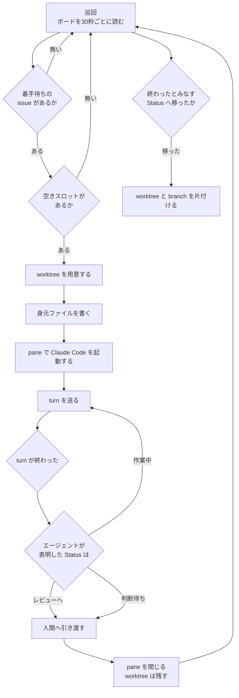
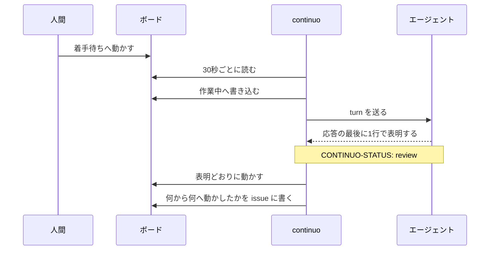
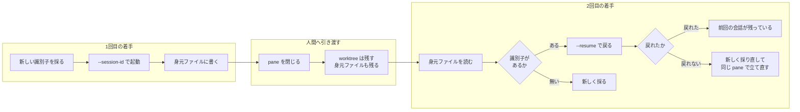
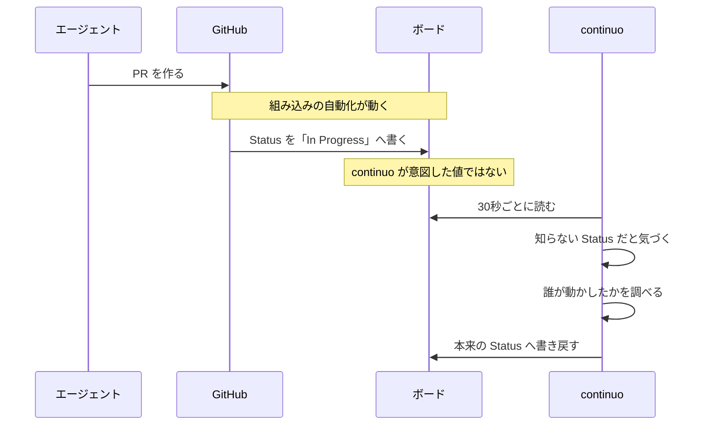
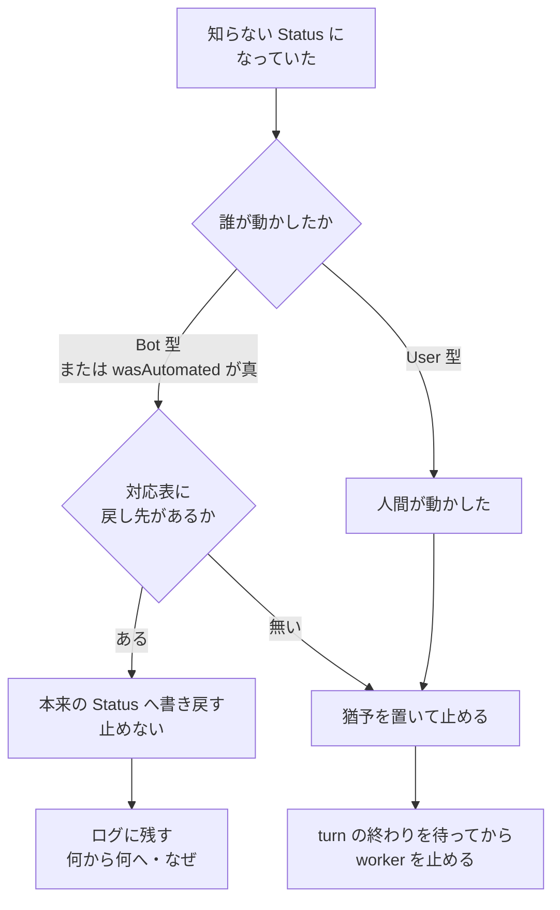

# エージェントの一生

**この文書が答えること。**

- **continuo は issue 1件を、どの順で・どこまで面倒を見るのか**
- **一度止まったエージェントが、前回の会話をどうやって取り戻すのか**
- **ボードの Status が自動化に横取りされたとき、どう戻すのか**

**読む前に知っておくこと。**continuo は**ボードを看板として使う。**
issue の Status が「いま何が起きているか」を表す唯一の共有された印である。

---

## 登場するもの

| 呼び方 | 実体 |
| --- | --- |
| **ボード** | GitHub Projects v2 のプロジェクト1枚 |
| **Status** | ボードの単一選択フィールド。**進み具合を表す** |
| **worktree** | issue ごとに作る作業用のディレクトリ |
| **pane** | herdr の画面の区画。**ここで Claude Code が動く** |
| **身元ファイル** | worktree の中に置く `.continuo.json`。**誰の worktree かを書き残す** |
| **turn** | continuo がエージェントに1回指示を送り、返ってくるまで |

**身元ファイルの中身**（`<worktree>/.continuo.json`）。

```json
{
  "issue_url": "https://github.com/octocat/hello-world/issues/42",
  "issue_identifier": "octocat/hello-world#42",
  "project_item_id": "PVTI_xxxxxxxx",
  "branch": "continuo/octocat/hello-world/42",
  "herdr_workspace_id": "wA1",
  "settings_path": "/path/to/settings.json",
  "session_uuid": "3f2504e0-4f89-41d3-9a0c-0305e82c3301",
  "agent_name": "hello-world-42",
  "created_at": "2026-08-27T09:00:00+09:00",
  "takeover_count": 0
}
```

**`session_uuid` が、この文書の後半でいちばん効いてくる。**

---

## 全体の流れ



**要点は3つ。**

1. **worktree はすぐには消さない。**人間へ引き渡しても残す。**片付けるのは終わったとみなす Status へ移ったときだけ**である
2. **pane は閉じる。**画面を占有し続けないため
3. **`session_uuid` は身元ファイルに残る。**pane を閉じても残る

---

## Status ごとの振る舞い

**どの Status のときに何をするかは、`WORKFLOW.md` の設定で決まる。**

```yaml
tracker:
  active_states: ["Ready", "In Progress"]   # 対象にする Status
  terminal_states: ["Done"]                 # 終わったとみなす Status
  running_state: "In Progress"              # 起動したときに書き込む Status
  dispatch_state: "Ready"                   # 着手待ちの Status
  failure_state: "Blocked"                  # 打ち切ったとき・失敗したときに落とす Status
```

| Status | continuo は何をするか | worktree | pane |
| --- | --- | --- | --- |
| **着手待ち** | **拾って着手する** | 作る（初回）／再利用（2回目以降） | 開く |
| **作業中** | **turn を送り続ける** | ある | ある |
| **レビュー待ち** | **何もしない。**人間を待つ | **残す** | 閉じる |
| **判断待ち** | **何もしない。**人間を待つ | **残す** | 閉じる |
| **終わり** | **片付ける** | **消す** | 無い |
| **上に無い Status** | **猶予を置いてから止める** | 残す | 閉じる |

**「上に無い Status」の扱いが、この文書の後半の主題である。**

---

## Status を動かすのは誰か



**エージェントは自分でボードを触らない。**応答の最後に1行だけ書く。

```
CONTINUO-STATUS: review
```

**その値と Status の対応は設定で決まる。**

```yaml
tracker:
  status_signal_prefix: "CONTINUO-STATUS:"
  status_signal_map:
    review: "In Review"     # 作業が終わり、人間のレビューに回してよいとき
    blocked: "Blocked"      # 判断を仰ぎたいとき、または失敗したとき
    working: null           # まだ続きがあるとき。null なので Status は動かさない
```

**書き込む出口は1本に絞ってある。**二重に書かないためである。

---

## 会話を引き継ぐ仕組み

**問題。**pane を閉じると、Claude Code のプロセスは終わる。
**次に同じ issue を着手したとき、何も覚えていない状態から始まってしまう。**

**残るものと消えるものを分けて見る。**

| どこにあるか | 何 | 引き継げるか |
| --- | --- | --- |
| GitHub | issue のコメント | **引き継げる** |
| GitHub | push した branch と commit | **引き継げる** |
| その機械のディスク | **worktree の中のファイル** | **同じ機械なら引き継げる** |
| その機械のディスク | **Claude Code の会話の記録** | **同じ機械なら引き継げる** |

**会話の記録は、セッションの識別子で引ける。**それを身元ファイルに書いてある。



**確かめたこと**（Claude Code 2.1.246、2026-08-26 実測）。

| 何 | 結果 |
| --- | --- |
| `--resume` で戻ると識別子は変わるか | **変わらない。**hook が名乗る値も記録ファイルの場所も同じ |
| 前の turn の内容を覚えているか | **覚えている** |
| 存在しない識別子を渡すと | **`No conversation found with session ID: …` を出して終了する** |
| そのあと同じ pane で立て直せるか | **立て直せる。**pane はシェルのプロンプトへ戻る |

**戻れても、1回目の本文をもう一度送る。**

**理由。**レビュー待ちから戻される場面では、**人間が PR にレビューを書いている。**
1回目の本文には「issue を読むこと」「紐づく PR も読むこと」が入っているが、
**続きの指示には入っていない。**続きの指示だけを送ると、**新しく付いたレビューを読まないまま進む。**

**トークンの集計は作り直さない。**戻った先の記録ファイルは同じものなので、
作り直すと**同じ中身をもう一度足して2倍に見せることになる。**

---

## 自動化に Status を横取りされたとき

**何が起きるか。**GitHub Projects には組み込みの自動化がある。

| 自動化 | 何をするか |
| --- | --- |
| `Item added to project` | ボードに載った issue に Status を書く |
| **`Pull request linked to issue`** | **PR を issue に紐づけると Status を書く** |
| `Pull request merged` | PR をマージすると Status を書く |

**新しく作ったボードは、これらが全部有効な状態で作られる。**

**そのため、こういうことが起きる。**



**継ぎ目は「誰が動かしたか」を見分けられるかである。**

### 見分け方

**GitHub は、Status が変わった記録を返す。**その中に実行者が入っている。

| 誰が動かしたか | `actor.__typename` | `wasAutomated` |
| --- | --- | --- |
| **組み込みの自動化** | **`Bot`** | **`false`** |
| **continuo 自身** | `User` | `false` |
| **人間** | `User` | `false` |

> **`wasAutomated` は、自動化が動かしても偽である。**項目としては存在するが、単独では区別に使えない
> （2026-08-26 実測。捨ててよいボードを作り、組み込みの自動化を実際に動かして確認した）。

**したがって、判定はこうする。**

```
自動化が動かした = (actor.__typename == "Bot") || wasAutomated
```

**`wasAutomated` も混ぜてあるのは、同じ応答に既に入っていて、ただで済むからである。**
**GitHub が将来これを直せば、自動で効くようになる。**

### 戻し先の決め方

**戻し先はボードごとに違うので、設定で持つ。**

```yaml
tracker:
  automated_state_rewrite:
    "In Progress": "AI In Progress"
    "In Review":   "AI In Review"
    "Done":        "AI Done"
    "Blocked":     "AI Blocked"
```

**既定は空である。**書かなければ、いままでどおり猶予を置いて止まる。

### 判定と行き先



**人間が動かしたときは、いままでどおり止まる。**
**人間が「止めろ」の意味で Status を動かす操作を、書き戻しで打ち消してはならない。**

**なぜ書き戻すのか。****ボードを見た人間が違和感を持たないようにするためである。**
止めないだけでは、**ボードには意図しない Status が表示されたまま残る。**
人間はボードを見て状況を判断するので、そこがずれていると読み違える。

---

## 気をつけること

| 何 | 中身 |
| --- | --- |
| **1つの issue が2枚のボードに載っていると** | **両方の記録が同じ配列で返る。**ボードの番号で絞ること |
| **書き戻しが失敗しても止めない** | 次の巡回で拾い直す |
| **同じ Status へ何度も書き戻さない** | 1つの issue につき上限を置く |
| **`Bot` 型で見ると、組み込み以外の GitHub App も自動化に入る** | 名前の一覧で見る案より、綴りに依存しないことを優先した |

---

## 関連する文書

- 設計の判断は [docs/plans/continuo_design.md](plans/continuo_design.md) にある
- 作りの形からくる問題は [docs/bug_details.md](bug_details.md) にある
- 画面のメッセージから引ける説明は [docs/FAQ.md](FAQ.md) にある
