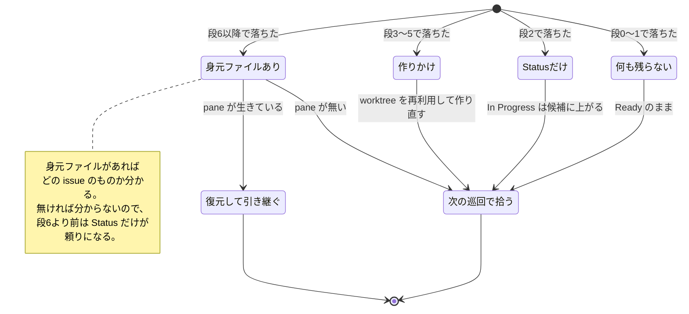
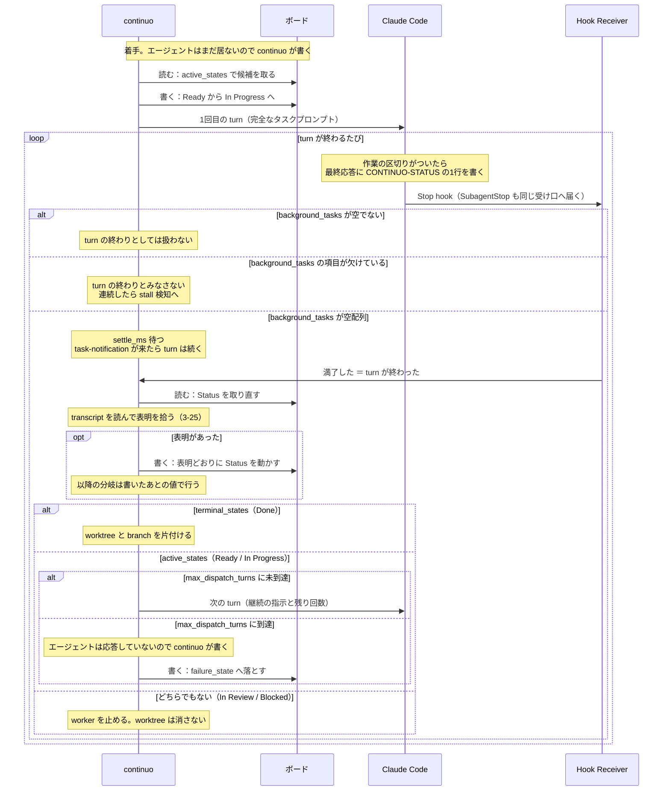
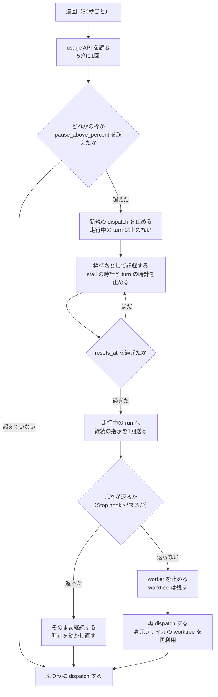
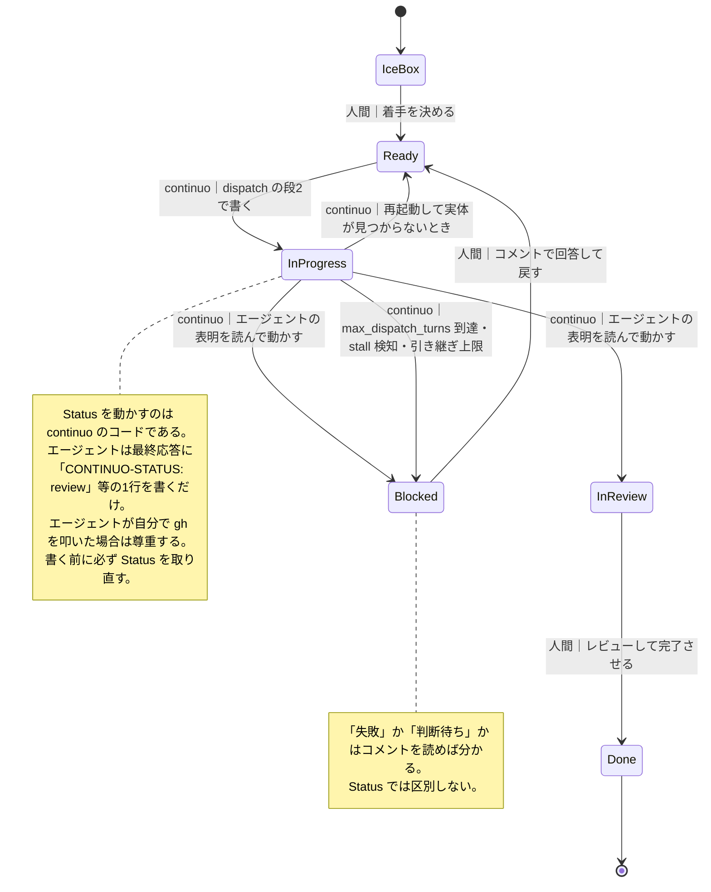

# continuo の設計

最終更新: 2026-08-18

## この文書は何か

**`continuo` の設計を確定させるための文書である。これが設計の正である。**

> **人間がレビューするときは [continuo_design_slim.md](continuo_design_slim.md) を読むこと。**
> この文書は AI が読むためのもので、判断の根拠・実測値・比較した案を全部持っている。
> **設計を変えたらこの文書を直し、人間のレビューが要るときに要約版を再生成する。**

**`continuo` とは何か。**GitHub Projects v2 のボード1枚を見張り、`Ready` の issue ごとに worktree を用意し、herdr の pane で Claude Code を対話モードで起動して作業させ、完了までを面倒見る**常駐プロセス**である。Go で書く。名前は**通奏低音**（basso continuo）に由来する。

**準拠する仕様は [openai/symphony](https://github.com/openai/symphony) の [SPEC.md](https://github.com/openai/symphony/blob/main/SPEC.md)**（Apache-2.0、2312行）。**このリポジトリには同梱していない**（置き方は [CLAUDE.md](../../CLAUDE.md)）。


### continuo が満たすべき条件（これが目標である）

**この設計は、先行調査が定めた必須条件14件を満たすために存在する。**
原典は非公開リポジトリの選定記録にある「満たすべき条件（14件）」で、**そこでは14件すべてが必須と定められている。**
**1つでも「満たせない」に当たれば、その実装は落選する。**

**以下は原典からの転記である。**「どこで満たすか」の列だけが continuo 側の記載である。

| 短縮名 | 何を求めているか | continuo はどこで満たすか |
| --- | --- | --- |
| **定額運用** | 従量課金にならないこと。**最優先** | `claude -p` も Agent SDK も API の直叩きも使わない。**herdr の pane で対話モードの Claude Code を動かす**（3-1 の図 / 3-16 の段8・段9 / CLAUDE.md の絶対制約）。**レートリミットを読む OAuth の usage API はメッセージを送る API ではないので、この制約に抵触しないと判断している。ただし「1トークンも消費しない」ことは確かめられていない**（3-27 / 第6節）。**必須にはせず、`rate_limit.source: none` で切れるようにしてある** |
| **自動で順に実行** | 貯めたタスクが自動で順に実行されること。**実装形態は問わない** | 常駐プロセスが30秒ごとに巡回する（3-1 / 5-2 の `polling.interval_ms`） |
| **Projects v2 のボードを読める** | item を状態指定で取得でき、実行中の issue を ID 指定で取り直せること | GraphQL を直接叩く（2-2 / 3-13）。**`gh project` は1回 102 point かかるので使わない** |
| **複数ボード監視** | 1プロセスで複数のボードを監視できること | **凍結中。**当面 project #3 の1枚だけを使う。**条件からの削除ではないので、凍結が解けたときに設計を壊さない構造にしてある**（3-28） |
| **リポジトリ別の作業ディレクトリ** | 1枚のボードに載った issue を、その issue の所属リポジトリの作業ディレクトリで実行すること | issue の `nameWithOwner` から `ghq` でローカルの clone を引き、そこから worktree を切る（3-22） |
| **枠回復で自動再開** | レートリミットで止まっても、枠の回復後に自動で再開すること。**「idle」と区別できていること** | **2段構えにする**（3-27）。Claude Code の自動再開の仕組みに任せ、効かなければ continuo が待って再 dispatch する。**待機中かどうかは OAuth の usage API で判定する**ので、どちらの経路でも「idle」と区別できる |
| **issue から投入** | issue に書けばキューに入ること | ボードに載った issue をそのまま拾う。**ボードへ載せて `Ice Box` を付けるのは人間が1回行う**（4-1 の遷移表）。continuo はボードに載っていない issue を見ない |
| **外部から順序調整** | 外部から実行順序を調整できること。**あわせて「1つのセッションが複数の issue をまとめて片付けられること」**（補足2 の要求2） | **順序はボードの並び順で決める**（4-2）。**Priority は使わない。**4段階しかなく、それより細かい順位を付けられないためである。**並べるのは人間で、continuo は読むだけである**（3-30）。**`bug` が付いた issue を前へ出すのは、人間が並べるときの指針である。****グループは continuo の外で作り、代表の issue のコメントで受け取る**（3-26）。continuo は代表を1件 dispatch するだけでよい |
| **macOS ネイティブ** | macOS で動くこと（WSL2 上の Ubuntu でも動くこと）。**Docker 経由は「動く」に含めない** | Go で書き、`CGO_ENABLED=0` の static binary をクロスコンパイルする（2-5。実測済み） |
| **再配布できるライセンス** | コピーレフト系でなく再配布可能であること | continuo 自身が MIT。準拠先の仕様の写しだけ Apache-2.0 で、その旨を明記している |
| **未完了なら再投入される** | worker が Status を変えずに終了しても、issue がまだ active なら再度呼び出されること | turn ループ（3-8）と、turn の終わりごとのボードの取り直し（3-5）。**worker の正常終了を完了と見なさない** |
| **1年以内に更新** | 直近1年以内に更新があること | **自作なので他人の保守に依存しない。**ただし条件の趣旨は「放置されたものを使わない」なので、**依存先（herdr / gh / ghq / gwq / Claude Code）の更新に追随する責任は continuo 側にある。**起動時に herdr の protocol と `gh` の認証を照合するのはそのためである（3-6） |
| **並行実行数を指定できる** | 同時に走らせるエージェントの数を設定で指定できること | `agent.max_concurrent_agents`（5-2）。**守る場所は 3-16 の段-1。**印を付ける前に空きスロットを数え、尽きたらその巡回では以降を dispatch しない |
| **Claude Code を起動できる** | 起動されるエージェントが Claude Code であること | herdr の `agent.start` に `kind: claude` を渡す（2-1 / 3-16 の段9 / 5-2 の `claude.kind`） |

**優先条件（必須ではない）。原典は「herdr で動くこと」だけを挙げている。**

| 優先順 | 内容 | continuo |
| --- | --- | --- |
| **①** | **herdr で動く** | **満たす。**herdr の socket API の上に乗る（2-1 / 3-1）。**世界にこれを満たす実装が1つも無かったことが、continuo を自作する動機である** |
| ② | tmux で動き、起動層が分離されていて herdr に改造可能 | 該当しない |

**「枠回復で自動再開」の再開の質。**必須ではないが、原典が「必ず調べて記録する」としている。

| 段階 | 内容 | continuo |
| --- | --- | --- |
| **最良** | セッションをそのまま引き継ぐ | **平常時はこれである。**同じセッションへ継続の指示を送る（3-8） |
| 次善 | セッション ID を保存して `claude --resume` で文脈ごと復帰する | **これも満たす。**終了したセッションへ `--resume` で戻れることを実測で確認した（3-25）。**worker を止めたあとの復帰と、コメントを書かせ直すときに使う** |
| **最低限** | issue に進捗を書いておき、新しいセッションがそれを読んで続きから始める | 3-25。**原典は「プロンプトで指示しても実績上たびたび守られないため、書かれることが仕組みとして保証されている必要がある」と付帯条件を付けている。**3-25 の多重化はこの要求に応えるものである |

#### issue のグループへの対応（14件すべてを満たす形が決まっている）

**「外部から順序調整」の補足2 に、次の要求がある。**

> **要求2**: 実行の単位が「1 issue」ではなく「issue のグループ」になりうるため、**1つのセッションが複数の issue をまとめて片付けられること。**
> 「1 issue = 1 worker」を固定する実装（`SPEC.md` 準拠の実装はいずれもそうである）は、ここで引っかかる。

**なぜこの要求があるか。**同根のバグを別々の issue として別々のセッションで直すと、
**同じ調査を何度も繰り返して枠を無駄にする。**
「同一原因・同一ファイル・同一コンポーネントのバグをグループ化する」ため、実行の単位もグループになりうる。

**continuo は「1 issue = 1 worker」のままでこれを満たす。**
グループ化と順番の計画は**continuo の外**で行い、
**計画を代表の issue のコメントに書いて、その代表を dispatch する。**詳しくは 3-26。

**したがって14件すべてに満たし方がある。**未達のまま残る条件は無い。

### この設計の入力になった先行調査

**2026-08-04 から 08-17 にかけて、既存のタスクオーケストレーターを選定し、そのうち [tomoasleep/herdr-symphony](https://github.com/tomoasleep/herdr-symphony) を実際に動かして完了検知の欠陥を特定した調査がある。**本文ではこれを**先行調査**と呼ぶ。herdr-symphony 自体は 2026-08-13 に不採用が確定している。

**先行調査の記録は別の非公開リポジトリにある。**この文書からは参照できないので、**必要な結論はすべてここに転記してある。**

**先行調査が出した要件は9つある。**本文ではこの短縮名で参照する。

| 短縮名 | 内容 | 根拠 |
| --- | --- | --- |
| **完了検知の3層を分ける** | 「作業が止まったか」「タスクが完了したか」「何をしたか」を混ぜない | `SPEC.md` 10.3 / 16.5 |
| **turn ループを持つ** | issue が active な限り同じセッションへ継続の指示を送り、上限で打ち切る | `SPEC.md` 7.1 / 16.5 / 6.4 |
| **完了の真実の源はトラッカー** | **完了したかどうかを判断するのはエージェント。**ボードへ書き込むのは continuo のコード（3-25）。continuo は自分の判断で勝手に完了させない | `SPEC.md` 11.5 / 7.1 |
| **無反応を検知する** | 一定時間なにも起きなければ worker を止めてリトライを積む | `SPEC.md` 8.5 |
| **分類不能を作業中とみなさない** | 状態を判定できないことは「作業中」ではない。時間切れまで待たない | herdr の公開ドキュメント |
| **再起動時にトラッカーと整合を取る** | プロセスが落ちても「実行中」のまま取り残される issue を作らない | `SPEC.md` 14.3 |
| **成果と判断要求は issue のコメントに残す** | worktree も端末の画面も消えうる。コメントだけが確実に残る | `SPEC.md` 11.5 |
| **worktree と branch を本体が片付ける** | 使い終わったものが単調増加し、消すのが人間の仕事になっていた | 仕様に規定なし。運用上の必須要件 |
| **識別子の正規化を一元化する** | 設定ファイル側に文字を潰す回避策を書かせない | 仕様に規定なし |

## この文書の歩き方

**設計の判断はすべて第3節にある。**急ぐなら第3節と第8節だけを読めばよい。

| 節 | 何が書いてあるか | いつ読むか |
| --- | --- | --- |
| 1・2 | 実機で確かめた事実 | 判断の根拠を疑うとき |
| **3** | **設計の判断。ここが本体** | **最初に読む** |
| 4 | 人間が決めたこと（Status の構成・実行順序） | 運用の前提を知りたいとき |
| 5 | 設定ファイルの全キーと、プロンプトのテンプレート | 実装するとき |
| 6・7 | 実装前に潰すこと・作る順番 | 実装するとき |
| **8** | **symphony の仕様と異なるところ** | **実装するとき必ず読む** |

<details>
<summary>節の一覧（クリックで開く）</summary>

**1. 実機検証で確定したこと**

- 1-1 検証の方法
- 1-2 結論 — hooks は使える。端末表示の解析は不要になった
- 1-3 turn の終わりの判定基準が確定した
- 1-4 hook に渡ってくる項目（実測）
- 1-5 hook の実行環境（実測）
- 1-6 信頼確認プロンプトの扱い — 無人運用の最大の障害だった
- 1-7 subagent とバックグラウンド処理の完了は Claude Code が自分で拾う

**2. 調査で確定した外部の事実**

- 2-1 herdr の socket API
- 2-2 GitHub Projects v2
- 2-3 project #3 の実測構成 — 過去の記録と食い違っている
- 2-4 Claude Code の hooks（第1節の実測に加えて分かったこと）
- 2-5 Go の実装スタック

**3. 設計**

- 3-1 全体構成
- 3-2 turn の終わりは hooks から continuo へ直接通知させる
- 3-3 run を指す識別子を、消えない2箇所に書く
- 3-3b 再着手は前回のセッションへ復帰する
- 3-4 状態は in-memory。永続化層を作らない
- 3-5 完了検知の3層（完了検知の3層を分ける）
- 3-6 起動時の検査を厚くする
- 3-7 識別子の正規化を型で強制する（識別子の正規化を一元化する）
- 3-8 turn ループ（turn ループを持つ）
- 3-9 worktree と branch の後始末（worktree と branch を本体が片付ける）
- 3-10 実行中の Status も「作業中の状態」に含める
- 3-11 無人運用で人間の入力を待つ箇所を全部潰す
- 3-12 hook をどう届けるか
- 3-13 トラッカーの値をどう正規化するか
- 3-14 turn の数え方
- 3-15 トークンの計上は transcript から取る
- 3-16 着手の手順の順番を固定する
- 3-17 二重起動は flock で防ぐ。ロックは機械で1本、`--id` を付けたときだけ分かれる
- 3-17b `--id` は、分けるべきものを全部まとめて分ける
- 3-17c `continuo abandon` は、常駐している側と同じ場所を見る
- 3-17d `--id` に書ける名前を絞る
- 3-17e ボードの重なりは、ボードごとのロックで断る
- 3-18 worktree の身元を worktree の中に書く
- 3-19 落ちている間に届かなかった通知を取り戻す
- 3-20 worktree が置き場所の内側にあることを検査する
- 3-21 stall の時計は中間の hook でリセットする
- 3-22 worktree の置き場所は gwq の規則に合わせる
- 3-23 hook を受ける socket の置き場所
- 3-24 設定を読み直して失敗しても落ちない
- 3-25 Status を動かす仕組みを、プロンプト頼みにしない
- 3-26 issue のグループは、代表の issue のコメントで受け取る
- 3-27 レートリミットで止まっても自分で再開する
- 3-28 複数のボードを監視する凍結が解けたときに壊れない構造にする
- 3-29 issue の中身はエージェントに直接読ませる
- 3-30 並び順は人間が決める。continuo は読むだけである
- 3-31 GitHub の GraphQL のレートリミットに収める
- 3-32 使い始めるまでの手順
- 3-32b Windows ネイティブは対応しない
- 3-33 信頼の登録は、人間が列挙したものだけを対象にする
- 3-34 ボードは既存のものに合わせる
- 3-35 画面に出す文言は資源から引く
- 3-35b 資源の正は日本語である
- 3-36 入れ方は、ネットワークインストーラーの1行にする
- 3-37 間違えて着手した issue は `continuo abandon` で戻す
- 3-37-1 `--dry-run` は段1 の後半を通らない
- 3-37-2 取れたロックは実行の最後まで握る
- 3-37-3 手を離させていないときこそ pane を確かめる
- 3-37-4 消す相手は身元ファイルだけで決めない
- 3-37-5 書き込む先の Status は消す前に確かめる

**4. 人間が決めたこと**

- 4-1 Status の構成 — `Ice Box` を未着手の置き場にし、`Blocked` を足す
- 4-2 実行順序 — ボードの並び順は使えるが、ボードの設定変更が前提になる
- 4-3 `~/.claude.json` を常駐ループから書き換えない
- 4-4 board view の並び順は人間がドラッグで決める

**5. 設定ファイル**

- 5-1 ファイルの名前と探し方
- 5-2 front matter（設定）
- 5-3 本文（プロンプトのテンプレート）
- 5-4 2回目以降のプロンプト
- 5-5 設定値の展開規則

**6. 実装に入る前に潰すこと**


**7. 実装の順序**


**8. symphony の仕様と異なるところ**

- 8-1 意図的に外している仕様
- 8-2 仕様に無いものを足している
- 8-3 そもそも適用外
- 8-4 設定キーとして持たないもの
- 8-5 名前を変えた設定キー
</details>

---

## 1. 実機検証で確定したこと

****先行調査** が「設計に入る前に潰せ」としていた未確認事項を、実機で全部潰した。**

### 1-1. 検証の方法

**本リポジトリと `~/.claude/settings.json` を一切触らずに検証した。**scratchpad に使い捨ての git リポジトリを作り、そこから worktree を切って、その worktree の `.claude/settings.local.json` に hook を仕掛けた。**continuo の実運用と同じ形**（worktree ごとに settings.local.json を置く）である。

**観測は2回に分かれている。値を引くときはどちらのものかを確かめること。**

| いつ | Claude Code | 何を測ったか | 生ログ |
| --- | --- | --- | --- |
| **2026-08-17** | **2.1.233** | hook が発火するか / 渡ってくる項目 / `background_tasks` の存在 | [docs/evidence/hooks_probe_20260817.jsonl](../evidence/hooks_probe_20260817.jsonl) |
| **2026-08-18** | **2.1.234** | **turn の終わりの判定**（1-3）/ 表明の読み取り（3-25）/ 権限モードと subagent（3-11） | **コミットしていない。**scratchpad にのみ存在し、消えている |

> **2026-08-18 の生ログは残っていない。**scratchpad は消えるので、**同じ観測をやり直すには 1-3 の条件を読んで再現する必要がある。**
> **1-3 に、何並列を何回・何を送ったかを書いてある。**

**2026-08-17 の検証の詳細。**

| 項目 | 値 |
| --- | --- |
| Claude Code | 2.1.233 |
| herdr | 0.8.0 |
| Go | 1.26.1 darwin/arm64 |
| 検証の置き場所 | scratchpad の使い捨て git リポジトリ + そこから切った worktree 2つ |
| 仕掛けた hook | `SessionStart` / `UserPromptSubmit` / `PreToolUse`(Task) / `PostToolUse`(Task) / `SubagentStart` / `SubagentStop` / `Stop` / `SessionEnd` / `Notification` |
| 観測方法 | 各 hook が stdin の JSON をそのまま JSONL に追記する python スクリプト |
| 後始末 | pane close → `git worktree remove --force` → ディレクトリ削除。**完了済み** |

**生の観測記録は [docs/evidence/hooks_probe_20260817.jsonl](../evidence/hooks_probe_20260817.jsonl) にコミットしてある。**hook を仕掛けた設定ファイルと、記録を取ったスクリプトも同じディレクトリにある。**公開リポジトリなので、認証トークンとセッション UUID と実験に使った絶対パスだけを置換してある**（[docs/evidence/README.md](../evidence/README.md)）。

### 1-2. 結論 — hooks は使える。端末表示の解析は不要になった

| 未確認だったこと | 結果 |
| --- | --- |
| **hook が実際に発火するか** | **発火する。**`SubagentStart` / `SubagentStop` / `Stop` の3つとも観測した |
| **`Stop` が、バックグラウンド処理が残った状態でも発火するか** | **発火する。**ただし**残っている処理が `background_tasks` に入って渡ってくる** |
| **`background_tasks` / `stop_hook_active` / `agent_transcript_path` は実在するか** | **3つとも実在した。**公式ドキュメントで裏が取れていなかったが、実機で確認できた |
| **worktree に置いた `.claude/settings.local.json` の hook が効くか** | **効く。**`.git` がディレクトリではなくファイル（gitdir 参照）である worktree でも効いた |

### 1-3. turn の終わりは「hook 単独」でも「静止の長さ」でも判定できない

**言いたいこと。**判定は**herdr の待ち受けを主、hook を従**にする。
**`background_tasks` が空でも turn は続く。静止の長さでも分離できない。**
**分離できるのは「`Stop` の直後に `<task-notification>` が来るか」である。**

#### なぜ `background_tasks` の空では判定できないか

**空配列の `Stop` は turn の途中にも発火する。**空の `Stop` 20件のうち4件がそれだった（2026-08-18 実測）。
**`Stop` の直後に `<task-notification>` が来た事例は、`background_tasks` が非空だったものも含めて8件で、間隔は 0.033〜0.037 秒だった。**

| 試行 | 途中で出た `Stop`（空配列）の最終応答 | 次の `Stop` までの間隔 |
| --- | --- | --- |
| 3並列 | `Bが完了しました（date の出力: …）` | 5.60 秒 |
| 5並列 | `f5.txt が完了しました: … 残り2つの完了を待ちます。` | 2.15 秒 |
| 4並列 | `f5.txt と f6.txt が完了しました。残り1つの完了を待ちます。` | 2.02 秒 |

**`prompt_id` での判定も成立しない。**wake-up ごとに値が変わり、
最終回答が出た `Stop` の `prompt_id` は、人間の入力のものと別の値だった。

#### なぜ静止の長さでも判定できないか

**メインが叩いた道具の実行中は、hook が1つも飛ばない。**無音の長さは道具の実行時間とほぼ一致した
（45秒の道具で 45.107〜45.116 秒、90秒の道具で 90.115 秒）。

**一方、turn が終わったあとの無音は 60.040〜60.058 秒で `Notification`（`notification_type: idle_prompt`）に破られる**（12/12）。
**turn 内の無音（90秒）が turn 外の無音（60秒）を追い越すので、どこに線を引いても分離できない。**

> **道具の実行時間に上限はかけられる。**`BASH_DEFAULT_TIMEOUT_MS` と `BASH_MAX_TIMEOUT_MS` の**両方**を
> 同じ値にすると、エージェントが `timeout: 180000` を指定しても上限が勝った（3/3）。
> **だが continuo はこれを短くしない。**公式ドキュメントが
> **「`git` を走らせるコマンドは、打ち切りでバックグラウンドへ移らず止められる」**と書いており、
> **continuo は git の clone と worktree の作成を走らせる。**短い上限は実作業を壊す。

#### 採る判定

| 順 | 何を見るか | 根拠 |
| --- | --- | --- |
| **主** | **herdr の待ち受け**（`until = [idle, done, blocked]`） | turn の終わりまで待てた（3/3）。**`blocked` を並べないと権限の確認で止まった turn を拾えず、時間切れまで待たされる**（3/3） |
| **従** | **`Stop` hook の直後に `<task-notification>` で始まる `UserPromptSubmit` が来たら、turn は続いている** | 途中の `Stop` の 0.033〜0.037 秒後に来た（8/8） |
| **確認** | `background_tasks` が空でなければ未完了 | 誤検知しない方向にしか外れない |

**`<task-notification>` は subagent 専用ではない。**`run_in_background` の Bash が終わったときも同じ封筒で届いた（3/3）。
**「subagent の完了だけを見る」設計は取りこぼす。**封筒の中の `<task-id>` が
`SubagentStart` の `agent_id` と一致すれば subagent 由来、しなければ shell 由来である。

**猶予の長さは暫定である。**観測できた8件はいずれも 0.037 秒以内に来たが、**上限を決める仕組みは確かめていない。**
**運用のログで分布を取って決め直す**（第6節）。

#### 数えるときに捨てるもの

**`agent_type` が空文字の `SubagentStop` を数に入れてはならない。**

| 何を確かめたか | 空文字のもの | 本物 |
| --- | --- | --- |
| 対応する `SubagentStart` があるか | **0/22、0/44** | 6/6、22/22 |
| `agent_transcript_path` が実在するか | **0/22、0/44** | 6/6、22/22 |
| 道具を1つも使わない turn でも出るか | **出た**（3/3） | 出ない |

**弾き方は「`SubagentStart` と突き合わせる」か「`agent_transcript_path` の実在を見る」のどちらかでよい。**
**正体は特定していない。**設計では「subagent ではないので捨てる」までを扱う。

**`PreToolUse` / `PostToolUse` を「メインが動いている」の根拠にしてはならない。**
**subagent の道具も同じ hook に流れてくる。**

> **選り分ける手段は確定していない。**コミット済みの生ログ（2026-08-17）の `PreToolUse` / `PostToolUse` に
> `agent_id` は入っていない。**選り分けられる項目があるかどうかを確かめていない。**
> **したがって continuo は選り分けない。**この2つは**生きていることの確認にだけ使う**（3-21）ので、
> メインか subagent かを区別する必要が無い。

**識別子そのものは一致する。**`SubagentStart.agent_id` /
`PostToolUse.tool_response.agentId` / `Stop.background_tasks[].id` / `SubagentStop.agent_id` の4つは、
named subagent 15件すべてで同じ文字列だった。

> **この節の観測はすべて Claude Code 2.1.234 / herdr 0.8.0 のものである。**
> 同一性も間隔も公式ドキュメントに書かれていないので、**バージョンが上がったら測り直す。**

**観測した時系列（原文の抜粋）。**
### 1-4. hook に渡ってくる項目（実測）

**イベントごとに項目が違う。**以下は実際に渡ってきたものだけを列挙している。

| イベント | 渡ってきた項目 |
| --- | --- |
| `SessionStart` | `session_id` / `transcript_path` / `cwd` / `hook_event_name` / `source` / `model` |
| `UserPromptSubmit` | 上記 + `permission_mode` / `prompt` / `prompt_id`（`model` は無し） |
| `PreToolUse` | `session_id` / `transcript_path` / `cwd` / `hook_event_name` / `permission_mode` / `prompt_id` / `effort` / `tool_name` / `tool_input` / `tool_use_id` |
| `PostToolUse` | 上記 + `tool_response` / `duration_ms` |
| `SubagentStart` | `session_id` / `transcript_path` / `cwd` / `hook_event_name` / `prompt_id` / **`agent_id`** / **`agent_type`** |
| `SubagentStop` | 上記 + **`agent_transcript_path`** / `background_tasks` / `last_assistant_message` / `stop_hook_active` / `permission_mode` / `effort` / `session_crons` |
| `Stop` | `session_id` / `transcript_path` / `cwd` / `hook_event_name` / `prompt_id` / `permission_mode` / `effort` / **`background_tasks`** / **`last_assistant_message`** / **`stop_hook_active`** / `session_crons` |

**`Stop` の `last_assistant_message` に入るのは、その turn の「最後の assistant テキストブロック1つ」である。**
**長さでは切られない**（44,823 バイトまで無切断を3回確認）。
**だが道具を使ったあとだと、その前に書かれたものは落ちる。**
**そのため continuo は表明の読み取りにこれを使わず、`transcript_path` を読む**（3-25）。実測値の例:

```text
ファイル一覧: `.claude/`（内部に settings.local.json）、`.git`（worktree リンクファイル 175B）、
`README.md`（63B）、`sample.txt`（20B）
sample.txt の中身: `alpha` / `bravo` / `charlie` の3行（末尾改行あり、計20バイト）
探索は Explore エージェント1つで完了、通常ファイルは README.md と sample.txt のみです
```

**これは設計を1箇所変える。****先行調査** は、エージェントがコメントを残さずに止まった場合のフォールバックとして
「会話ログから抽出 → 画面バッファを読む」という順序を定めていた。
**画面バッファを読む案は不要になった。**`last_assistant_message` と `transcript_path` の2つが、どちらもそれより上位である。

**2つの使い分けは公式ドキュメントが明記している。**

> The transcript file is written asynchronously and may lag the in-memory conversation, so it may not yet include the current turn's most recent messages when a hook fires. Hooks that need the final assistant text of the current turn should use `last_assistant_message` on Stop and SubagentStop instead of reading the transcript
>
> **訳:** transcript のファイルは非同期に書かれ、メモリ上の会話に遅れることがあるため、hook が発火した時点で
> **その turn の最新のメッセージがまだ入っていないことがある。**その turn の最終の assistant テキストが必要な hook は、
> **transcript を読むのではなく `Stop` / `SubagentStop` の `last_assistant_message` を使うべきである。**

**continuo が欲しいのは「turn 全体のどこかにある印」であって、最終のテキストではない。**
だから transcript を読む（3-25）。**書き込みの遅れは公式が明記しているとおりなので、読む前に待つ。**

> **transcript のパースを禁じる記述は公式ドキュメントに無い**（`hooks.md` 全文を確認）。
> **「内部形式なので変わりうる」という注意書きも無い。**

### 1-5. hook の実行環境（実測）

**cwd は worktree のパスそのものだった。**環境変数も渡ってくる。

| 環境変数 | 実測値の例 | continuo にとっての意味 |
| --- | --- | --- |
| `CLAUDE_PROJECT_DIR` | worktree の絶対パス | **どの issue のセッションかを識別できる** |
| `CLAUDE_CODE_SESSION_ID` | `e042974e-…` | `SPEC.md` の `session_id` に相当するものとして使える |
| `CLAUDE_PID` | `41460` | プロセスの生存確認に使える |
| `CLAUDE_CODE_MESSAGING_SOCKET` | `/tmp/cc-socks/41460.sock` | **未解析。**外部から問い合わせられるかは不明。**設計の前提にしない** |
| `CLAUDE_ENV_FILE` | `~/.claude/session-env/<session_id>/sessionstart-hook-1.sh` | 未解析 |
| `CLAUDECODE` | `1` | — |

> **`CLAUDE_CODE_MESSAGING_SOCKET` を設計に取り込まない。**存在は観測したが、プロトコルも安定性も分かっていない。
> **「動いた」と「解析できた」は別である。**内部実装に依存する仕組みは、条件を洗い出すまで設計に入れない。

### 1-6. 信頼確認プロンプトの扱い — 無人運用の最大の障害だった

**新しいディレクトリで Claude Code を起動すると、"Is this a project you created or one you trust?" という信頼確認で止まる。**キー入力を待つため、**無人運用ではここで全部止まる。**プランファイルにこの記述は無かった。

**実測した画面（原文）。**

```text
 Quick safety check: Is this a project you created or one you trust?
 ⚠ This folder pre-approves 9 tool permissions in .claude/settings.local.json:
   Bash(ls:*), Bash(cat:*), Bash(echo:*), Bash(sleep:*), Bash(pwd), Agent, Read,
 Glob, and 1 more
 ❯ 1. Yes, I trust this folder
   2. No, exit
```

**ここで分かったことが2つある。**

**1つ目。`.claude/settings.local.json` は信頼確認の前に読まれている。**「9個の権限を事前承認している」と画面が具体的に述べている。**設定が無視されているわけではない。**

**2つ目。信頼は worktree 単位ではなく git リポジトリ単位で記録される。**`~/.claude.json` の `projects` を検証の前後で比較したところ、登録されたのは**メインの作業ディレクトリ1件だけ**だった。worktree 2つはどちらも登録されていない。

```text
/…/scratchpad/hooks-probe/main -> hasTrustDialogAccepted = True
（wt-87 と wt-88 は projects に現れない）
```

**そして2つ目の worktree で起動したときは、信頼確認も権限の事前承認警告も出ずに、そのまま入力待ちになった。**

**これが continuo の設計に与える影響。**

| 内容 |
| --- |
| **リポジトリごとに1度だけ、人間がそのリポジトリで Claude Code を起動して信頼を承認しておけば、そこから切る worktree では確認が出ない** |
| **continuo は dispatch の直前に、その issue のリポジトリが信頼済みかを検査する**（3-6）。未承認のリポジトリで起動すると無人運用が止まる |
| **`--dangerously-skip-permissions` は使わない。**信頼の承認は人間が1度やれば済む |

> **transcript の置き場所は worktree 単位だった。**`~/.claude/projects/` の下に worktree ごとのディレクトリができる。信頼はリポジトリ単位、transcript は worktree 単位で、**粒度が違う。**

### 1-7. subagent とバックグラウンド処理の完了は Claude Code が自分で拾う

**観測した事実。**subagent が終わると、Claude Code が自分自身に `<task-notification>` というプロンプトを自動投入する。バックグラウンドの shell が終わったときも同じだった。

```text
11:39:24.808  SubagentStop
11:39:26.720  UserPromptSubmit   prompt = <task-notification><task-id>a1f9f743842d397e1</task-id>…<status>completed</status>…
11:39:30.075  Stop               background_tasks=[]
```

**したがって continuo は、subagent の完了を待つために追加のプロンプトを送る必要が無い。**
待っていれば `background_tasks` が空の `Stop` が来る。**これは turn の消費を無駄に増やさないという点で重要である。**

> **ただし、その `Stop` が最後とは限らない。**空配列の `Stop` は turn の途中にも出る（1-3）。
> **`<task-notification>` が来ないことを確かめてから確定させる**（3-2）。


---

## 2. 調査で確定した外部の事実

**設計の前に、continuo が乗る3つの外部システムを実測した。**設計判断はすべてここから導かれる。

### 2-1. herdr の socket API

| 分かったこと | 設計への影響 |
| --- | --- |
| **Unix domain socket + 改行区切り JSON。認証もハンドシェイクも無い。**JSON-RPC 2.0 ではない。リクエストは `{id, method, params}` の3つとも必須で、`id` は文字列必須、`params` は空でも `{}` が要る | Go の `net.Dial("unix")` + `encoding/json` で足りる。ライブラリ追加ゼロ |
| socket のパスは環境変数 `HERDR_SOCKET_PATH` で pane 内のプロセスに注入される。既定は `~/.config/herdr/herdr.sock` | **continuo は設定ファイルの `herdr.socket` を使う。環境変数を勝手に優先しない**（下記）。socket の探索ロジックを自前で持たない |

> **環境変数を優先してはならない。**設定に書いたパスが黙って無視されると、
> **continuo は利用者が指定した先とは別の herdr で pane を作り、worktree を消す。**
> herdr の pane の中で動かす環境では `HERDR_SOCKET_PATH` が常に入っているので、
> **優先すると設定ファイルで切り替える手段が一切なくなる**（テストでも切り替えられない）。
>
> **環境変数で切り替えたい利用者は、設定に `${HERDR_SOCKET_PATH}` と書く。**
> 展開は 5-5 の規則で `internal/config` が行う。**未定義ならそこで落ちる**（既定値へは落ちない）。
| **1コネクション = 1リクエスト。**応答を1行返した直後にサーバがコネクションを閉じる | コネクションプールを作れない。RPC は毎回 connect し直す |
| **`events.subscribe` だけが長寿命ストリーム。**ただし接続時に過去の event を再生し、配信が毎秒 9〜10 件に律速される | **`pane.updated` と `pane.scroll_changed` を購読してはいけない**（追いつかない）。`session.snapshot` で現在状態を確定させてから、低頻度の event だけ購読する |
| **`events.wait` は agent の状態変化しか受け付けない。**schema には19種の待機条件が定義されているが、他を投げると拒否される | schema を鵜呑みにしてコード生成すると実行時に落ちる |
| **agent 名は `^[a-z][a-z0-9_-]{0,31}$` に限定される。**issue の URL は入らない | ****先行調査** の「pane 名を issue の URL にする」は成立しない。**設計を差し替える（2-4 と 3-3） |
| agent の状態は `idle` / `working` / `blocked` / `done` / `unknown` の5値。**`done` は「idle だが、その tab がまだ人間に見られていない」**という意味で、CLI や API で読んでも「見た」ことにならない | **continuo は tab をフォーカスしないので、実運用ではほぼ常に `done` 側になる。**この値は**フォールバックの切り分けにだけ使う**（3-2）。使うときは `idle` と `done` の両方を受理する。`unknown` は完了ではない。**turn の終わりの判定そのものは hook で行う** |
| **`worktree.remove` は branch を消さない。**引数は path でも branch でもなく `workspace_id` である | **branch の後始末は continuo が `git branch -D` を自分で叩く**（worktree と branch を本体が片付ける） |
| **`pane.report_agent` で、実プロセスを起動せずに任意の pane を「agent が居る pane」として登録できる** | **統合テストで実際に Claude Code を起動せずに状態遷移を再現できる。**テストのコストが劇的に下がる |
| pane の `agent_session` から **Claude Code のセッション UUID が取れる** | hooks が渡す `session_id` と突き合わせられる（3-2 の要） |
| **`herdr pane split` の直後に `herdr agent start` を呼ぶと `agent_pane_busy` が返ることがある**（実測で1回発生） | **リトライを入れる。**pane が使える状態になるまで少し待つ |
| **`herdr agent start` は、Claude Code が信頼確認のダイアログを出している状態でも `interactive_ready: true` を返す**（実測） | **「準備できた」を「プロンプトを受け付けられる」と解釈すると誤る。**初回起動のときは画面を読んでダイアログの有無を確かめる経路が要る（3-6 の信頼の検査で未承認を弾けば、通常はここに来ない） |

#### socket API の実在するメソッドと引数（2026-08-18 に `herdr api schema --json` で確認）

**メソッドは85個ある。**continuo が使うものだけを挙げる。**太字が必須の引数である。**

| メソッド | 引数 | 何に使うか |
| --- | --- | --- |
| `pane.split` | **`direction`** / `cwd` / `env` / `focus` / `ratio` / `target_pane_id` / `workspace_id` | pane を作る。**continuo は使わない**（worktree.open が作る pane を使う。3-16 の段8） |
| **`pane.list`** | `workspace_id` | **pane の一覧。**worktree.open で開いた workspace の pane を引くのに使う |
| **`tab.create`** | `workspace_id` / `cwd` / `env` / `label` / `focus` | tab を作る。**continuo は使わない**（1 worktree = 1 workspace にするため。4-5） |
| `pane.close` | **`pane_id`** | pane を閉じる |
| **`pane.rename`** | **`pane_id`** / `label` | **pane に label を書く。**`pane.split` では書けないので、作ったあとに別途呼ぶ（3-3） |
| `pane.report_metadata` | **`pane_id`** / **`source`** / `title` / `state_labels` / `tokens` / `ttl_ms` ほか | 揮発する付加情報。**再起動で消えるので復元の根拠にしない**（3-3） |
| `pane.list` | `workspace_id` | pane の一覧 |
| `agent.start` | **`name`** / **`kind`** / **`pane_id`** / `args` / `timeout_ms` | agent を起動する。**`args` が Claude Code への起動フラグを渡す経路である**（`--settings` / `--session-id` / `--permission-mode`）。必須ではない |
| `agent.prompt` | **`target`** / **`text`** / `wait` | プロンプトを送る。**`wait` は真偽値ではなくオブジェクト**（`timeout_ms` と `until` を持つ） |
| `agent.read` | **`target`** / **`source`** / `format` / `lines` / `strip_ansi` | 画面を読む。**`source` の値は `visible` / `recent` / `recent_unwrapped` / `detection`。**CLI はハイフン区切りだが、**socket API はアンダースコアである** |
| `agent.get` | **`target`** | **agent の状態を読む。**`agent.status` というメソッドは存在しない |
| **`agent.send_keys`** | **`target`** / **`keys`**（**文字列の配列**） | **キーを送る。**権限の確認を取り消すときに `["esc"]` を送る（3-11）。**CLI を exec する必要は無い。socket API に実在する**（protocol 19 で確認） |
| `agent.list` | （なし） | agent の一覧 |
| `agent.wait` | **`target`** / `timeout_ms` / `until`（**配列**） | **いまの状態が `until` に含まれていれば即座に返る**（0.006 秒。2026-08-19 実測）。含まれていなければ、そうなるまで待つ。**したがって「turn の終わりを待つ」用途には単独で使えない**（3-2）。**`until` は状態名の配列である**（`idle` / `working` / `blocked` / `done` / `unknown` のいずれか） |
| `worktree.create` | `path` / `branch` / `base` / `cwd` / `focus` / `label` / `workspace_id` | worktree を作って herdr workspace として開く |
| `worktree.open` | `path` / `branch` / `cwd` / `focus` / `label` / `workspace_id` | **既にある worktree を herdr workspace として開く。**作らない |
| `worktree.remove` | **`workspace_id`** / `force` | worktree を消す。**path でも branch でもない** |
| `worktree.list` | `cwd` / `workspace_id` | worktree の一覧 |
| `workspace.rename` | **`workspace_id`** / **`label`** | herdr workspace に label を書く |
| `workspace.list` | （なし） | herdr workspace の一覧 |
| `workspace.close` | **`workspace_id`** | **herdr workspace を閉じる。**worktree の実体は消さない。**`worktree.remove` では閉じない workspace を閉じる唯一の経路である**（6-10） |
| `agent.rename` | **`target`** / `name` | agent の名前を変える |
| `session.snapshot` | （なし） | 現在の状態をまとめて取る |
| `pane.report_agent` | **`pane_id`** / **`source`** / **`agent`** / **`state`** / `agent_session_id` ほか | **実プロセスを起動せずに「agent が居る pane」として登録する。**統合テストで使う。**`state` は4値で `done` を含まない** |
| **`ping`** | （なし） | **protocol の版を取る。**応答は `{"type":"pong","version":"0.8.0","protocol":19,"capabilities":{…}}`（実測） |

**protocol の版は `ping` で取る**（実測で 19。herdr は 0.8.0）。起動時にこれを呼び、設定の `herdr.protocol` と照合する。

**応答のスキーマも実在する。**`herdr api schema --json` の `schemas` は
`error_response` / `event` / `request` / `subscription_event` / **`success_response`** の5つを持つ。
`success_response` の `result` は `type` を判別子とする**57変種**である（自分でスキーマを数えて確認した）。**ただし「どのメソッドがどの変種を返すか」はスキーマに書かれていない。**

**pane の `agent_session` は `{source, agent, kind, value}` のオブジェクトである**（4つとも必須。スキーマの `AgentSessionInfo` で確認）。
**`kind` が `"id"` のとき、`value` が Claude Code のセッション UUID になる。**3-4 の復元手順はここから取る。

**agent の状態のキー名は `agent_status` である**（`status` ではない）。`Pane` にも `AgentInfo` にも
`agent_status` というフィールドがあり、`status` は存在しない（スキーマで確認）。

**エラー応答では `id` が空文字で返る。**正常時は送った `id` がそのまま返るが、エラーのときは返らない（実測）。

```json
正常: {"id": "probe", "result": {...}}
エラー: {"id": "", "error": {"code": "invalid_request", "message": "..."}}
```

**したがって `id` で応答を対応づけることはできない。**もっとも1コネクション1リクエストなので、対応づける必要がそもそも無い。
**`id` は必須なので送るが、応答の `id` は当てにしない。**

### 2-2. GitHub Projects v2

| 分かったこと | 設計への影響 |
| --- | --- |
| **`gh project item-list --limit 100` は1回で 102 point を消費する。**GraphQL を手書きすれば同じ内容が 1 point。上限は 5,000 point/時 | **`gh project` サブコマンドを本体で使ってはいけない。**30秒間隔だと上限の2.4倍を消費して破綻する。**GraphQL を直接叩く** |
| `ProjectV2.items(query:)` のサーバ側フィルタ1本で、Status 指定・複数 Status の OR・所属リポジトリ・カスタムフィールドまで1リクエストで取れる | 巡回は1リクエストで済む。Status ごとに分ける必要が無い |
| **複数 Status の OR は、カンマ区切りで書く。**`status:"Done","In Review"` は7件（Done 5件 + In Review 2件）を返した。**空白区切りの `status:"Done" status:"In Review"` は AND になり0件を返す**（実測） | **書き方を間違えると、エラーを出さずに0件を返す。**`active_states` を OR で取るときは必ずカンマ区切りにする |
| **選択肢名を間違えると、エラーを出さずに 0 件を返す** | **これが最大の落とし穴。**人間が UI で Status を改名すると、continuo は無言で「対象0件」と判断し続けキューが永久に止まる。**起動時に選択肢名を照合して、合わなければ起動を止める** |
| item は node ID で直接取り直せる（1 point）。Status の値そのものが `createdAt` / `updatedAt` を持つ | 実行中 issue の再取得はボード全体を舐め直さずに済む。**この経路は 3-9 の手順7（worktree の照合）と、`SPEC.md` 8.5 の実行中の照合で使う** |
| `content.repository.nameWithOwner` と `defaultBranchRef.name` が同じリクエストで取れる | **作業ディレクトリの決定に必要な情報が巡回1回で揃う** |
| draft issue は `type: DRAFT_ISSUE` で現れ、**repository を持たない** | **type が ISSUE でない item は明示的にスキップしてログに残す。**拾うと dispatch が原因不明で失敗し続ける |
| エージェントが `gh issue comment` で書いたコメントは、**author が人間のアカウントになり、人間が手で書いたものと区別できない** | **コメント本文の先頭に固定マーカーを書かせて判別する。**さもないと turn ループの継続指示にエージェント自身の出力が混入する |
| Status 更新は `gh project item-edit` で名前指定でも書けるが、**continuo は GraphQL で書く**（3-25。`gh project` は1回 102 point かかるため本体で使わない） | **GraphQL の `updateProjectV2ItemFieldValue` は ID を要求する。**したがって continuo は**起動時に project の ID・Status フィールドの ID・各選択肢の ID を1度だけ引いて覚える。**選択肢名の照合（3-6）と同じリクエストで取れる |

### 2-3. project #3 の実測構成 — 過去の記録と食い違っている

**先行調査の記載と現状が違う項目がある。以下は現状である。**

| 項目 | プランファイルの記載 | 2026-08-17 の実測 |
| --- | --- | --- |
| Status の選択肢 | Backlog / Blocked を含む | **`Ice Box` / `Ready` / `In Progress` / `Blocked` / `In Review` / `Done` の6つ**（4-1） |
| item 数 | 98件 | **104件** |
| リポジトリ数 | 8 | **5** |
| Priority | — | **P0〜P3 の4択が定義されているが、104件すべて未設定** |
| Ready の件数 | — | **0件** |
| Status 未設定の item | — | **4件**（どの Status フィルタにも一致せず放置される） |

**ここから2つの論点が出る。どちらも人間の判断が要る**（第4節）。

**Priority は104件すべて未設定である。**そのため Priority による整列は機能しない。
**Priority は使わず、ボードの並び順だけで順序を決める**（4-2）。

### 2-4. Claude Code の hooks（第1節の実測に加えて分かったこと）

| 分かったこと | 設計への影響 |
| --- | --- |
| **信頼していないフォルダでは、対話セッションで信頼のダイアログが出る。**settings ファイルの hook そのものは信頼前でも動く（下記の公式の表） | **ダイアログが出た時点で人間の入力を待って止まる**（3-11）。dispatch の直前に「そのリポジトリが信頼登録されているか」を検査する（3-6） |
| hooks は settings の階層をまたいでマージされ、**実行中のセッションにもファイル監視で再読み込みされる** | worktree ごとに hook を書き換える運用が成立する |
| hook の設定を外部から問い合わせる CLI は無い（`claude hooks` は存在しない） | continuo 自身が「書いた設定が効いているか」を確かめる手段は、**実際に hook が飛んでくるかどうかだけ**である |
| **`background_tasks` は「タスクレジストリに到達できるとき」存在する。**到達できない場合に項目が無い可能性が原文に残されている | **`background_tasks` が欠けている `Stop` を「空配列」と同一視してはいけない。**欠けていたら判定不能として扱う |
| `Stop` は人間の中断では発火せず、API エラーでは別のイベントに振り替わる | **`Stop` だけを張ると取りこぼす。**無反応の検知を併用する |

### 2-5. Go の実装スタック

**外部依存を増やすことを禁じない。ただし、標準ライブラリで足りるものは標準ライブラリを使う。**

**いまの依存は YAML パーサ1本だけである**（2026-08-20 時点）。これは結果であって上限ではない。
**必要なら足してよい。**足すときは次を見て決める。

| 見るところ | なぜ |
| --- | --- |
| **標準ライブラリで書けるか** | 書けるなら書く。15行で済むものにライブラリを足さない |
| そのライブラリ自身の依存 | 推移的に増えるものまで数える |
| 保守されているか | archive 済み・更新が止まっているものを避ける |
| ライセンス | このリポジトリは MIT である |

| 用途 | 決定 | 理由 |
| --- | --- | --- |
| YAML front matter | **`github.com/goccy/go-yaml`（MIT、依存ゼロ）を使う** | `gopkg.in/yaml.v3` はリポジトリが archive 済みで更新が止まっている。goccy はエラーに行・桁・ソース抜粋を出すので、`SPEC.md` 6.2 が要求する「オペレータに見えるエラー」を自前の整形コードなしで満たせる |
| front matter の切り出し | **ライブラリを使わない。**標準の `strings` / `bytes` で足りる | 15行程度で書ける。`SPEC.md` 5.5 のエラー分類を自前の関数境界に対応づけられる |
| テンプレート | **`text/template` + `Option("missingkey=error")`** | `SPEC.md` 5.4 の *"Unknown variables MUST fail rendering"*（**訳:** 未知の変数はレンダリングを失敗させなければならない）を満たせることを実測で確認済み |
| — その穴 | **`index` 組み込み関数だけ素通りする。`Funcs` で上書きして塞ぐ** | テンプレート構築を1つのコンストラクタに閉じ込め、そこ以外で `template.New` を呼ばせない |
| — 入力の型 | **`map[string]any` に固定する** | struct にすると `text/template` が struct tag を見ないため `{{.issue.title}}` のような小文字表記が書けなくなる |
| SQLite | **使わない** | `SPEC.md` 14.3 が scheduler の状態を意図的に in-memory と定めている。turn 数・リトライ回数は Go の struct で持つ |
| ファイル監視 | **fsnotify を使わない。`stat` + 内容ハッシュで足りる** | `SPEC.md` 6.2 が「監視が取りこぼした場合に備えて防御的に再検証せよ」と要求しているので、どのみちこの処理は要る。4KB のファイルで1回 18.5µs |
| 構造化ログ | **標準の `log/slog`（TextHandler）** | `SPEC.md` 13.1 の `key=value` 形式と必須項目の付与をそのまま満たす |
| HTTP サーバ | **標準の `net/http`** | Go 1.22 以降の `ServeMux` で `SPEC.md` 13.7 を router なしで書ける。**ルートは `GET /{$}` と書く**（`GET /` だと前方一致の catch-all になり存在しないパスに 200 を返す） |
| CLI | **標準の `flag`** | 必要なフラグは `--port` だけ。**ただし `flag` は最初の位置引数で解釈をやめるので、渡す前に引数を自前で並べ替える**（`internal/cli` の `reorderArgs`。`git` / `docker` / `gh` と同じく、フラグを後ろに書ける） |
| テスト | **標準の `testing`。`testing/synctest` で poll loop と backoff を実時間ゼロで検証する** | 時計の抽象化インタフェースを自前で作る必要がない |

**この構成で macOS から Linux 向けに `CGO_ENABLED=0` の static binary をクロスコンパイルできることを実測済み。**cgo を要求する依存を1本でも入れるとこれが崩れる。

---

### 2-6. ボードの自動化が動かした Status は、`actor` の型でしか見分けられない

**言いたいこと。**`ProjectV2ItemStatusChangedEvent.wasAutomated` は、**組み込みの自動化が動かしたときでも `false` を返す。**
見分けに使えるのは `actor` である。**自動化は `Bot`、人間は `User`** になる。
どちらも同じ1リクエストで返るので、読む項目を変えても API の消費は増えない。

**実測（2026-08-26）。**一時ボード（`<ACCOUNT>` の project #11。実測後に消す前提で作った）で、
`octocat/hello-world#1` に `Closes #1` を書いた PR を1本作り、timeline を引いた。
**本番のボード（project #3）と実機確認用のボード（project #10）には書き込んでいない。**

| 何が動かしたか | `wasAutomated` | `actor.__typename` | `actor.login` |
| --- | --- | --- | --- |
| 組み込みの `Pull request linked to issue`（`Todo` → `In Progress`） | **`false`** | `Bot` | `github-project-automation` |
| 組み込みの `Item added to project`（未設定 → `Todo`） | **`false`** | `Bot` | `github-project-automation` |
| 人間が画面や API で動かしたもの | `false` | `User` | （そのアカウント名） |

**応答の原文**（`project.number` で自分のボードに絞れることも同時に確かめた）。

```json
{ "createdAt": "2026-08-26T12:32:35Z", "previousStatus": "Todo", "status": "In Progress",
  "wasAutomated": false,
  "actor": { "__typename": "Bot", "login": "github-project-automation", "id": "BOT_kgDOBr0Lng" },
  "project": { "number": 11 } }
```

**公開リポジトリでも同じだった。**`nodejs/node#65525` / `#65516` の
`github-project-automation` による遷移も `wasAutomated` は `false` である（2026-08-26 に読み取りのみで確認）。

**`wasAutomated` が何のための項目かは分かっていない。**GraphQL の説明文は
"Did this event result from workflow automation?"（**訳:** このイベントは workflow の自動化から生じたものか？）だが、
**組み込みの自動化では真にならない。**GitHub Actions から書いた場合の値は測っていない。

**新しいボードは自動化6件がすべて有効な状態で作られる。**`gh project create` で作った project #11 の
`workflows` は6件とも `enabled: true` だった。**この事故は既定の設定のまま起きる。**

**リクエストは増やさずに取れる。**ID 指定の取り直し（`nodes(ids:)`）の `content` の
`... on Issue` に `timelineItems` を足すと、Status の値と同じ1リクエストで返ることを実測した
（2026-08-26、project #10 の item に対して読み取りのみ）。
**`project.number` で自分のボードに絞る必要がある。**1つの issue が複数のボードに載っていると、
他のボードのイベントが同じ配列に混ざって返る（実測でも #10 と #11 の両方が返った）。

**ボードの自動化の有効・無効は API から変えられない。**GraphQL の mutation は
`deleteProjectV2Workflow` しか無く、有効化・無効化に当たるものが無い（2026-08-26 に introspection で確認）。
**切り替えは GitHub の画面からしかできない。**

---

## 3. 設計

### 3-1. 全体構成

**この文書で使う言葉。**

| 言葉 | 意味 |
| --- | --- |
| **run** | **1件の issue に対する Claude Code の実行1回。**dispatch で始まり、worker を止めるか issue が終了状態になるまで続く |
| **turn** | run の中で、continuo がプロンプトを1回送ってから応答が終わるまで |
| **worker** | run を担っている実体。herdr の pane と、その中の Claude Code のセッションを合わせたもの |


**ボードに書く経路は3つある。continuo・エージェント・人間である。**

**「continuo はボードを読むだけ」ではない。**そう読める要約を先に書いていたが、**仕様の読み違いだった。**
`SPEC.md` 11.5 の全文を読むと次のようになっている。

> Symphony does not require first-class tracker write APIs in the orchestrator.
> - Ticket mutations … are **typically** handled by the coding agent …
> - **Tools execute in Symphony with the configured adapter credential;** the child receives tool results, not a raw token.
> - The service remains a scheduler/runner and tracker reader.

**訳:** Symphony は orchestrator に第一級のトラッカー書き込み API を**要求しない**。チケットの変更は、**通常は** coding agent が行う。
**tool は設定されたアダプタの資格情報を使って Symphony の中で実行される。**子プロセスは tool の結果を受け取るのであって、生のトークンを受け取るのではない。
このサービスは scheduler / runner とトラッカーの読み手であり続ける。

**3点ある。**「要求しない」であって禁止ではない。「typically（通常は）」であって MUST ではない。
**そして実際に API を叩くのは本体側である。**

**したがって正しい言い方はこうなる。「Status をどう動かすかの判断はエージェントが持ち、continuo は自分の判断で勝手に動かさない。
ただしエージェントが物理的に書けない場面では continuo が書く。」**

**誰がどの遷移を起こすかの一覧は 4-1 にある。**

### 3-2. turn の終わりは hooks から continuo へ直接通知させる

**これが設計の中心である。**

**採る形。**issue ごとに **worktree の外**へ設定ファイルを1つ作り、`--settings <そのパス>` を付けて Claude Code を起動する。

**環境変数もこのファイルで渡す。**`env` キーに書いたものが Claude Code のプロセスに届くことを実測で確認した
（2026-08-19。`--settings` で渡した設定に `CONTINUO_ENV_PROBE` と `CLAUDE_CODE_RETRY_WATCHDOG` を書き、
エージェントに `echo $CONTINUO_ENV_PROBE $CLAUDE_CODE_RETRY_WATCHDOG` を実行させたところ
`PROBE=it-works WATCHDOG=1` が返った）。

**これで pane にも `agent.start` にも環境変数を渡す必要が無くなる。**
`worktree.open` にも `agent.start` にも `env` の引数が無いので、**この経路しか無い**（2-1）。
その設定に hook を書き、continuo 自身を呼ばせる。**この経路で hook が発火することは実測で確認済みである**（3-12）。

#### 張る hook と、それぞれの役目

**7つ張る。**どれが欠けても判定が成立しない。**この一覧が正であり、3-16 の段5 と 5-2 はこれを参照する。**

| hook | 何のために張るか |
| --- | --- |
| **`Stop`** | **turn の終わりの判定の起点。**`background_tasks` と `stop_hook_active` を見る |
| **`UserPromptSubmit`** | **`<task-notification>` を検出する。**これが来たら turn は続いている（1-3） |
| **`SubagentStop`** | 最終 `Stop` の後に来るものを識別する。**`agent_type` が空文字のものは捨てる**（1-3） |
| **`Notification`** | **`permission_prompt` で、権限の確認で止まったことを記録する**（3-11）。`idle_prompt` は turn 終了の裏取りに使う |
| **`SubagentStart`** | `<task-notification>` の `task-id` と突き合わせて、subagent 由来か shell 由来かを分ける（1-3） |
| **`PreToolUse`** / **`PostToolUse`** | **生きていることの確認だけ**（3-21）。turn の終わりの判定には使わない。**subagent の道具でも飛ぶが、選り分けない**（1-3。選り分けられる項目が実測ログに無い） |
| **`SessionStart`** | セッションが立ったことの確認 |

```json
{
  "hooks": {
    "Stop":             [{ "hooks": [{ "type": "command", "command": "continuo hook --socket <S> --pending-dir <P>" }] }],
    "UserPromptSubmit": [{ "hooks": [{ "type": "command", "command": "continuo hook --socket <S> --pending-dir <P>" }] }],
    "SubagentStop":     [{ "hooks": [{ "type": "command", "command": "continuo hook --socket <S> --pending-dir <P>" }] }],
    "SubagentStart":    [{ "hooks": [{ "type": "command", "command": "continuo hook --socket <S> --pending-dir <P>" }] }],
    "Notification":     [{ "hooks": [{ "type": "command", "command": "continuo hook --socket <S> --pending-dir <P>" }] }],
    "SessionStart":     [{ "hooks": [{ "type": "command", "command": "continuo hook --socket <S> --pending-dir <P>" }] }],
    "PreToolUse":       [{ "matcher": "*", "hooks": [{ "type": "command", "command": "continuo hook --socket <S> --pending-dir <P>" }] }],
    "PostToolUse":      [{ "matcher": "*", "hooks": [{ "type": "command", "command": "continuo hook --socket <S> --pending-dir <P>" }] }]
  }
}
```

**`<S>` と `<P>` は、continuo が設定ファイルを書くとき（3-16 の段5）に絶対パスへ展開する。**

| 引数 | 何を渡すか | なぜ引数で渡すか |
| --- | --- | --- |
| `--socket` | hook を受ける socket の絶対パス（3-23） | 探索順が環境に依存するので、hook 側で決め直させない |
| **`--pending-dir`** | **socket へ繋がらなかったときの逃がし先**（3-19）。`<実行時ディレクトリ>/issues/<issue のスラグ>/pending` | **`continuo hook` は自分がどの issue のものかを知らない。**cwd は worktree なので、continuo の設定にも届かない |


> **`<issue のスラグ>` の作り方を1つに決める。**`<owner>/<repo>#<番号>` を、
> **英数字とハイフン以外を全部ハイフンに置き換え、連続するハイフンを1つにまとめ、小文字にする。**
> 例: `octocat/hello-world#188` → `octocat-hello-world-188`。
> **これは設定ファイルの置き場所（3-12）と逃がし先（3-19）の両方で使う同じ規則である。**

> **`PreToolUse` / `PostToolUse` の matcher を絞ってはならない。**`Agent|Task` に絞った実測では、
> **メインが叩いた Bash の記録が落ちて、無音の原因を特定できなかった。**

#### `continuo hook` は転送して即終了する

**判断も応答もしない。**標準入力の JSON を socket へ1行で送り、`exit 0` で終わる。

```text
1. 標準入力の JSON を1行にして socket へ書き、末尾に改行を付ける
2. 接続を閉じる。応答は待たない
3. exit 0 で終わる
```

**socket へ繋がらなかったら、`--pending-dir` の下へ書いて `exit 0` する**（3-19）。
**continuo が落ちていても、エージェントを止めない。**

**なぜ応答を待たないか。**

| 理由 | 内容 |
| --- | --- |
| **待つと `settle_ms` と両立しない** | turn の終わりは `settle_ms`（既定2000）待って確定する（下記）。**応答を返せるのはその後になる。**その間 Claude Code は hook の終了を待つので、判定材料である `<task-notification>` が届くのかどうかが分からない |
| **道具のたびに待たされる** | `PreToolUse` / `PostToolUse` は全ツールに張る。**応答を待つ設計だと、道具1回ごとに待ち時間が乗る** |
| **代わりの手段がある** | 表明を書かずに終わった turn は、**次の turn の継続の指示で促せる**（3-25）。turn ループが既にある |

**socket 上の形式。改行区切り JSON。1コネクション1メッセージ。応答なし。**

```text
{"hook_event_name":"Stop","session_id":"8aebf7af-…","background_tasks":[],…}\n
→ 書いたら閉じる。サーバは何も返さない
```

**どの run のものかは、hook の JSON に入っている `session_id` で判別する。**引数に run の識別子を書かない。
**書くと、設定ファイルを1本で共用したときに全部の worktree が同じ run を報告してしまう。**
セッション UUID は continuo が起動時に決めるので（3-3）、対応づけは continuo 側で持てる。

**なぜこの形か。**

| | hooks から continuo へ直通（**herdr の待ち受けと併用する**） | herdr の `agent_status` だけを見る（不採用） | 画面の内容を読む（不採用） |
| --- | --- | --- | --- |
| 何に依存するか | **hook の JSON スキーマだけ** | herdr の画面検出ルール（正規表現の集合） | Claude Code の画面表示 |
| subagent 待ちを completed と誤判定するか | **`<task-notification>` を見れば、しない。**`background_tasks` 単独では誤判定する（1-3） | **する**（作者自身が公開記事で報告している） | 進捗行のパターン次第 |
| 成果の中身が取れるか | **取れる**（`transcript_path` と `last_assistant_message`） | 取れない | 画面バッファから部分的に |
| Claude Code の更新で壊れるか | hook のスキーマが変われば壊れる | **画面表示が変わると壊れる**（manifest のコメントに前例が記録されている） | **同上** |
| 実測で確認したか | **した**（第1節） | 誤判定の存在を作者が報告 | 進捗行で区別できることは確認したが、肝心の誤判定状態を再現できていない |

**判定の規則。**

```text
プロンプトを送るとき:
  1. agent.prompt を wait つきで送る
     wait = { until: [idle, done, blocked], timeout_ms: turn_timeout_ms }
     → **wait なしで送って agent.wait を呼ぶ形は採れない。**
       agent.wait は「いまの状態が until に含まれていれば即座に返る」（0.006 秒。実測）ので、
       投入直後の idle をそのまま turn の終わりと取り違える
     → agent.prompt の wait は投入直後の取りこぼしを herdr 側で防ぐ（3/3 で確認済み）
  2. 返ってきたら、返り値の状態で分岐する（下記）
  3. timeout で返ったら（**エラー応答の `code` が `timeout`。実測で確認**）、
     枠待ちかどうかを判定する（3-27 の2条件）
     → 枠待ちなら agent.wait を until=[idle,done,blocked] / timeout_ms=poll_wait_ms で呼び直し、
       枠が明けるまで繰り返す（agent.prompt は再送しない。二重に投入される）
     → 枠待ちでなくても打ち切らない。同じく待ち直す（agent.prompt は再送しない）
       **turn の総実行時間に上限は無い。**画面が止まったかどうかは巡回の判定だけが決める（3-21）
  4. idle か done で返ったら、Stop hook が来ているかを確かめる
     → 来ていなければ settle_ms のあいだ待つ。それでも来なければ stall として扱う
       （権限の確認が esc で取り消された場合など。3-11）

返り値が blocked のとき:
  → 権限の確認で止まっている。次を投げる前に必ず agent.send_keys で ["esc"] を送る
    （送らずに次を投げると、保留中の権限要求が承認されて実行される。3/3 で再現）
  → Notification hook の notification_type == "permission_prompt" で、どの turn が止まったかを記録する
  → 人間の判断が要るので failure_state へ移す（3-11）

返り値が idle / done のとき:
  → Stop hook を受け取っているかを確かめる
    受け取っていない  → 権限の確認が esc で取り消された可能性がある。stall として扱う
    受け取っている    → 下の hook 側の規則で確定させる

Stop hook を受け取ったとき:
  background_tasks が空でない
    → まだ動いている。turn の終わりとしては扱わない
  background_tasks の項目が欠けている
    → 判定不能。turn の終わりとみなさない（連続したら stall 検知へ）
  background_tasks が空配列
    → settle_ms（既定 2000）のあいだ待ち、
      <task-notification> で始まる UserPromptSubmit が来なければ turn の終わりとする
      来たら turn は続いている。待ち直す
```

**`<task-notification>` が来るかどうかが分かれ目である。**
途中の `Stop` では 0.033〜0.037 秒後に来た（8/8）。最終 `Stop` の後に来るのは
`SubagentStop`（`agent_type` が空文字。1.9〜2.9 秒後）である。**この差で分離できる。**

**`settle_ms` の既定を 2000 にする理由。**観測できた8件はいずれも 0.037 秒以内だが、
**上限を決める仕組みは確かめていない。**0.037 秒の約54倍を取る。
**実際の間隔を毎回ログに出し、運用のデータで決め直す**（第6節）。

**herdr の待ち受けを主にするのは、hook だけでは拾えない経路があるからである。**

| 経路 | hook で拾えるか | herdr で拾えるか |
| --- | --- | --- |
| 正常に終わった | **拾える**（`Stop`） | 拾える（`idle` / `done`） |
| **権限の確認で止まった** | **拾えない。**`Stop` が飛ばない | **拾える**（`blocked`。2.7〜4.1 秒で返る） |
| 人間が `Esc` で中断した | **拾えない。**`Stop` が飛ばない | 拾える（`idle` に戻る） |

**逆に、herdr だけでも足りない。**`idle` は「入力を受け付ける」以上の意味を持たず、
**「やり切った」かどうかを表さない。**だから `Stop` を受け取っているかを併せて見る。

> **画面の内容で判定する案は採らない。**herdr の判定ルール（manifest）を差し替える案も要らない。

### 3-3. run を指す識別子を、消えない2箇所に書く

**herdr-symphony の失敗の根は「run 中のエージェントを指す唯一の識別子が RAM 上の pane ID だけ」だったことである。**そこから多重起動の防止・再起動時の復元・キャンセル・後片付けが**同時に**成立しなくなっていた。

**どこに書けるかを実測で洗った結果、herdr の保存先には信頼できるものとできないものがある。**

| 書ける場所 | herdr サーバの再起動をまたぐか | 他の使い手に壊されるか | 長さの制限 |
| --- | --- | --- | --- |
| **pane の label** | **残る** | 上書きは可能だが層構造は無い | **観測されず**（65536文字が無傷で往復した） |
| **pane の cwd** | **残る** | 変わらない | — |
| **workspace ID / tab ID / pane ID** | **残る** | 変わらない | — |
| pane の metadata の tokens | **消える** | **壊される。**キーは pane 全体で1スロットしかなく、別の使い手が同じキーを書くと前の値が失われる。しかもその使い手の TTL が切れるとキーごと消滅し、元の値は復活しない | **80文字で無言で切られる**（エラーにならない） |
| pane の title / state_labels | **消える** | 使い手ごとの層になっており、上の層が失効すると下が復活する | — |
| pane を作るときに渡した環境変数 | **消える** | — | **そもそも herdr の API から読み戻せない** |
| agent 名 | **残らない**（再起動後に生きている agent へ自動では戻らない） | 重複は拒否される | **32文字**（`^[a-z][a-z0-9_-]{0,31}$`） |

**したがって continuo は、次の2本立てで run を識別する。**
**pane の label は識別に使わない**（下の表のあとで説明する）。

| 短縮名 | 何を | どこに | 何のために |
| --- | --- | --- | --- |
| **worktree のパス** | **worktree のパスに issue 番号を含める** | **pane の cwd** | **復元の照合はこの1本だけである。**path の指定が効くことを実測で確認したので、continuo が置き場所を決め打ちできる。**主キーは worktree の中の身元ファイルである**（3-18） |
| **セッション UUID** | **Claude Code のセッション UUID を continuo が先に決める**（`--session-id`） | 起動引数と、worktree の身元ファイル（3-18） | **hook から届く通知がどの run のものかを、hook 側に何も書かせずに判別できる。2026-08-18 に実測で確認済み**（3回とも一致。`transcript_path` のファイル名も同じ UUID になる。herdr の `agent_session` からも同じ値が引ける） |

**pane と herdr workspace の label は `owner/repo/issues/N` を書く**（例: `octocat/hello-world/issues/188`）。
**これは人間が herdr の画面で pane を見分けるためのものであり、continuo は読み戻さない。**
復元の照合は上の表のとおり pane の cwd と worktree のパスで行うので、label の形を変えても引き継ぎは壊れない。

**issue の URL をそのまま貼らない。**herdr の一覧では先頭が全部 `https://github.com/` になり、
見分けたい部分（リポジトリ名と issue 番号）が右へ押し出されて読めなくなる。

**組み立ては `herdr.IssueLabel(owner, repo, number)` の1本に寄せる。**
pane（`pane.rename`）と herdr workspace（`worktree.open` の `label` と `workspace.rename`）の
2箇所が別々に組み立てていると、形を変えたとき片方だけが直る。
**owner か repo が空、または番号が0以下なら空文字を返し、label を書かない**（draft issue のため）。

**`worktree.open` の `label` は、既に開かれている workspace には効かない。**作成時の label が残る。
そのため continuo は `worktree.open` の直後に `workspace.rename` を1回掛けて書き直す。
**失敗しても致命にしない。**label は表示名であり、復元の照合には使わないためである。

> **`--session-id` に渡す UUID は、そのつど新しく作る。使い回してはならない。**
> 一度使った UUID をもう一度 `--session-id` に渡すと、Claude Code が `Error: Session ID ... is already in use.` を出して起動に失敗する（実測）。
> **しかも herdr 経由だと `timed out waiting for agent startup` としか返らないので、continuo は起動に失敗したとき pane の画面を読んで理由を判定する必要がある。**
> **既にあるセッションへ入り直すときは `--resume <元の UUID>` を使う**（実測で確認済み）。
> **戻すのも herdr の pane 経由である**（3-25 の9段）。continuo が `claude` を直接 exec することはない。
> **どちらを使うかは 3-3b が決める。**worktree を新しく作る着手が `--session-id`、
> 既存の worktree を使う再着手が `--resume` である。

**metadata の tokens は「起動後に自分で貼り直す揮発キャッシュ」として扱う。**復元の根拠にしない。書くときはキーに `continuo_` の接頭辞を付け、**値が80文字を超えないことを continuo 側で検査する**（超えても herdr はエラーを返さず黙って切る）。

**agent 名の作り方。**`continuo-<repo>-<番号>` を作り、**32文字に収まらなければ repo を後ろから削る。**

```text
1. repo と番号から continuo-<repo>-<番号> を組み立てる
2. 小文字にし、英数字とハイフン以外をハイフンに置き換え、連続するハイフンを1つにまとめる
3. 32文字を超えていたら、repo の部分を後ろから1文字ずつ削って収める
   （番号は削らない。番号が消えると別の issue と同じ名前になりうる）
4. herdr が名前の重複を拒否したら、末尾に -2、-3 と付けて空くまで試す（上限10回）
```

**名前から元の issue を復元しない。**復元の主キーは身元ファイルである（3-18）。

**agent 名は「人間が端末で見分けるためのもの」に役割を限定する。**`^[a-z][a-z0-9_-]{0,31}$` に収まる派生名（例: `continuo-sample-app-87`）を使い、**名前から元の issue を復元しようとしない。**

> **「agent 名を issue の URL にし、turn 数も書き足す」案は採らない。**agent 名に URL は入らず（32文字の制限）、
> turn 数を書き足す先（metadata の tokens）は再起動で消えるためである（いずれも実測）。**turn 数の復元は諦める**（`SPEC.md` 14.3 も *"It does not mean retry timers, running sessions, or live worker state survive process restart."* — **訳:** リトライのタイマー、実行中のセッション、稼働中の worker の状態がプロセスの再起動を生き延びることを意味しない — と明記している）。

### 3-3b. 再着手は前回のセッションへ復帰する

**言いたいこと。**同じ issue にもう一度着手するとき、前回のセッションへ `--resume` で戻る。
**それでも送る本文は1回目のもの（5-3）である。**戻れなければ新しいセッションで始め直す。

**どちらの起動フラグを使うか。**着手の段5b で決める。**復帰しても身元ファイルの `session_uuid` は書き換えない。**

| worktree | 身元ファイルの `session_uuid` | 起動フラグ |
| --- | --- | --- |
| 新しく作った | 無い | `--session-id <新しい UUID>` |
| 再利用する | 入っている | `--resume <その UUID>` |
| 再利用する | 空・壊れている | `--session-id <新しい UUID>` |

**なぜ復帰するのか。**`In Review` から差し戻された issue は前回の続きである。会話履歴を
捨てると、**何をどこまでやったかを issue とコードから推測し直すことになる。**それでも送るのは
1回目の本文（5-3）である。差し戻しの場面では人間が PR にレビューを書いているが、
**「issue を読むこと」「紐づく PR も読むこと」が入っているのは1回目の本文だけ**で、継続の指示
（5-4）には無い。5-4 だけを送ると**新しく付いたレビューを読まないまま進む。**

**「会話履歴があるか」と「1回目の本文を送るか」を1つの値で兼ねない。**復帰した run は会話履歴を
持つのに1回目の本文を送るので、**2つは一致しない。**`runState` が持つのは**「次の turn は1回目の
本文である」の意味だけ**（`SendFirstPrompt`）。会話履歴の有無はどの分岐でも使わない。

**トークンの集計の基準（`tokensBase`）は、復帰したときには作り直さない。**transcript のファイル名は
セッション UUID なので（3-15）、**復帰すると同じファイルである。**作り直すとその中身をもう一度足し、
**使った量を実際の2倍に見せる。**

> **実測（2026-08-26、Claude Code 2.1.246）。**`--session-id <UUID>` のセッションを終了させ、別の pane で
> `--resume <同じ UUID>` を叩いた。hook が名乗る `session_id` と `transcript_path` は**復帰の前後で同じ値**で、
> 前の turn の内容を覚えていた。herdr の `agent_session.value` も同じだった。

**復帰に失敗したら新しいセッションで始め直す。**`~/.claude/projects/` は利用者が消せる。**実測（2026-08-26）。**
`claude --resume <無い UUID>` は終了コード 1 で、標準エラーへ `No conversation found with session ID: <UUID>` を出す。
**herdr 経由だと `agent.start` が `{"error":{"code":"timeout","message":"timed out waiting for agent startup"}}` を返し、
pane はシェルのプロンプトへ戻る**（**同じ pane でそのまま起動し直せる**）。

始め直すときは、UUID を採り直して hook の索引を張り替え、`tokensBase` を作り直し、**身元ファイルの
`session_uuid` も書き直す。**書き直さないと、次の再着手も同じ死んだ UUID へ復帰しにいき、毎回
`herdr.startup_timeout_ms` を捨てる。**ログは3通りを書き分ける。**

```text
level=INFO msg="前回のセッションに復帰して再着手します（会話履歴を引き継ぎます）" identifier=octocat/hello-world#188 session_uuid=8aebf7af-… worktree=/…/worktrees/…
level=INFO msg="新しいセッションを立てて着手します（会話履歴はありません）" identifier=octocat/hello-world#188 session_uuid=e1f2… worktree=/…/worktrees/…
level=WARN msg="前回のセッションへ復帰できなかったので、新しいセッションで始め直します" identifier=octocat/hello-world#188 復帰しようとしたセッション=8aebf7af-… 新しいセッション=e1f2… error="…"
```

| 採らなかった案 | 採らない理由 |
| --- | --- |
| 復帰したら継続の指示（5-4）を送る | **差し戻しで付いた PR のレビューを読まない**（5-4 に「紐づく PR も読むこと」が無い） |
| 復帰したかで送る本文を変える | 同じ「再着手」で本文が2通りになり、**どちらを送ったかをログから追えない** |
| 復帰できなければ人間へ渡す | **利用者が `~/.claude/projects/` を消しただけで issue が `failure_state` へ落ちる** |

### 3-4. 状態は in-memory。永続化層を作らない

`SPEC.md` 14.3 に従い、**scheduler の状態は意図的に in-memory にする。**SQLite も JSON ファイルも作らない。

**起動から復元までの順序。1本の並びで示す。**

| 順 | 何をするか | 落ちたらどうなるか |
| --- | --- | --- |
| 1 | **設定を読んで検証する**（3-1） | 起動を止める。**pane には触らない**（まだ何も発見していない） |
| 2 | **`flock` を取る**（3-17。復元手順の段1） | 二重起動なので即座に終了する |
| 3 | **3-6 の起動時検査を全部通す** | **起動を止める。生きている pane は閉じずに放置する**（下記） |
| 4 | **復元手順の段2 以降へ進む** | 段ごとの規則に従う |

> **3-6 の検査で落ちたとき、pane を閉じてはならない。**
> 落ちる原因は continuo 側の前提が揃っていないこと（herdr に繋がらない・`gh` の認証が切れている・
> Status の選択肢名が合っていない）であって、**エージェントの側に問題があるわけではない。**
> **設定の誤りで、動いているエージェントの作業を殺すことになる。**
>
> **放置してよい理由。**起動を止めるだけなら pane は生き続けて作業を続ける。
> 人間が設定を直して起動し直せば、段5 で引き継げる。
>
> **「引き継げないなら閉じる」（下記）は、復元を始めたあと（段2 以降）の分岐に適用される規則である。**
> 段2 より前は、そもそもどの pane が continuo のものかを知らない。

**再起動時の復元手順。**

```text
1. flock でロックを取る。取れなければ二重起動なので即座に終了する（3-17）
2. worktree の置き場所を走査し、各 worktree の中の身元ファイルを読む（3-18）
   → 深さは固定で4階層（<root>/<host>/<owner>/<repo>/<スラグ>）。それより深くは掘らない
   → 身元ファイルが無いディレクトリは無視する（人間が置いた worktree かもしれない）
   → JSON が壊れていたら無視してログに出す（段6 の書き込み途中で落ちた場合）。消さない
   → project item の ID が重複したら、created_at が新しいほうを採る
     → **この段で決めるのは「どちらを採るか」だけである。pane にはまだ触れない**
       （pane の一覧を取るのは段4 である。この段では誰が生きているかを知らない）
     → 採らなかったほうの worktree のパスを「捨てた身元」として覚えておく。段4 で使う
     → 採らなかったほうの worktree は消さずに残し、ログに出す。**どちらに成果があるか continuo は判断できない**
   → issue の URL / project item の ID / branch 名 / herdr の workspace の ID / 引き継いだ回数が揃う
3. 身元ファイルの project item の ID で、ボードを ID 指定でまとめて取り直す
   → この1回が「落ちている間に届かなかった Stop の取り戻し」も兼ねる（3-19）。
     hook を待たずにここで現在の Status を確定させる
   → 取り直しに失敗したら（認証切れ・ネットワーク断・レートリミット）、
     警告を出して起動を続ける。**引き継げなかった run の pane は閉じる**（pane.close）。
     worktree と Status は残すので、次の巡回で worktree を再利用して再 dispatch される

     **pane を残してはならない。**巡回には「生きている pane を見つけて引き継ぐ」経路が無い（3-16）。
     残すと、次の巡回で同じ worktree に2つ目の Claude Code が立つ。
     **「引き継げないなら閉じる」を、復元のすべての分岐で守る**
4. herdr から pane と agent の一覧を取り、pane の cwd と worktree のパスで突き合わせる
   → **両方を filepath.EvalSymlinks で解決してから比較する。**
     置き場所はシンボリックリンクを解決した実体で持っている（3-20）が、
     pane の cwd は Claude Code を起動したときの文字列がそのまま入りうる
   → 解決に失敗したパス（消えた worktree など）は、突き合わせの対象から外す
   → **段2 で「捨てた身元」に印を付けた worktree に pane が付いていたら、ここで閉じる**（pane.close）
     （同じ issue に2つの Claude Code が居る状態である。引き継がないので残してはならない）
   → **捨てたほうの worktree は消さない。**次の巡回で 3-9 の手順7 に乗る
     （身元ファイルを読んで Status を取り直し、cleanup.on_states に入っていれば片付けられる）。
     **印には入れないので、手順7b の「印に入っていない worktree の pane を閉じる」でも拾える**
5. 突き合わせが付いた pane について、次の2つを取る
   → pane の agent_session から Claude Code のセッション UUID（hook の対応づけの復元に使う。2-1）
   → agent.list から、その pane_id に対応する agent 名
     （agent.prompt / agent.wait の宛先は agent 名である。pane ID では送れない）
   → agent 名が無い pane は段8b で扱う（下記）
5a. **pane が生きている run について、引き継ぐかどうかを Status で決める**

| 取り直した Status | どうするか |
| --- | --- |
| `active_states`（`Ready` / `In Progress`） | **引き継ぐ。**段5b 以降へ進む |
| **`cleanup.on_states`**（既定 `Done`） | **pane を閉じてから worktree と branch を片付ける**（3-9 の手順を全部通す。設定も見る）。印には入れない |
| **引き渡し**（`In Review` / `Blocked`） | **pane も worktree も残す。**印には入れない（8-1。人間に見せる） |
| **取り直しで見つからなかった** | **pane も worktree も残す。**印には入れず、ログに出す |

> **引き渡し状態の pane を閉じない理由。**再起動の直後は、その pane が
> 「人間のレビュー待ちで正常に止まっているもの」なのか「取り残されたもの」なのかを区別できない（8-1）。
>
> **代わりに、巡回で拾い直す。**人間が `Blocked` → `Ready` へ戻すと、その issue は候補に上がる。
> **そのとき、対応する worktree に生きた pane があれば、先に閉じてから dispatch する**（3-9 の手順7）。
> これで「2つ目が立つ」ことを防ぎつつ、人間が見る時間を確保できる。

5a2. **Status で「引き継ぐ」と決めた run について、herdr の `agent_status` も見る。**
   → **Status だけで決めてはならない。**`blocked` のまま引き継いで turn を送ると、
     **保留中の権限要求が承認されて実行される**（3-11 で実測。3/3）

| `agent_status` | 何を意味するか | どうするか |
| --- | --- | --- |
| `idle` / `done` | 前の turn は終わっている | **引き継ぐ。**段5b へ進む |
| **`blocked`** | **権限の確認で止まっている** | **引き継がない。`failure_state` へ落として pane を閉じる**（3-11。人間の判断が要る）。worktree は残し、印にも入れない |
| **`working`** | **前の turn がまだ走っている** | **引き継ぐが `NeedsPrompt` を立てない。**hook を待ち、来なければ stall 検知（3-14）で拾う |
| **取れない / 知らない値** | 判断できない | **pane を閉じ、worktree と Status を残す**（段8b と同じ扱い） |

   → **`blocked` のとき `esc` を送る必要は無い。**pane ごと閉じるので保留中の要求も消える。
     **`esc` を送るのは、引き継いで使い続ける場合だけである**（3-11 は turn ループの中の話である）
   → **`working` で `NeedsPrompt` を立てない理由。**走っている最中に投げると turn が混ざる。
     **前の turn の `Stop` は逃がし先か socket から届く**（3-19）。届かなければ stall で拾う

5b. **引き継いだ回数の上限を見る。**turn を送る前に判定する
   → 上限（agent.max_takeover。既定5）に達していれば、failure_state へ落として pane を閉じる。
     worktree は残し、印からも外す。**NeedsPrompt を立てない**（無駄な turn を1回も送らない）
   → 達していなければ回数を1つ増やして身元ファイルへ書き戻す
   → **回数を増やすのは、引き継いだときと再 dispatch したときの両方である**（3-18）
5c. 引き継ぐと決めた run の runState を組み立てる。**turn は送らない**
   → **復元の手順の中で `agent.prompt` を呼んではならない。**wait つきの呼び出しは
     turn の終わりまで返らない（既定1時間）。**復元がそこで止まる**
   → 代わりに **`NeedsPrompt` を立てる。**巡回の turn ループが、これを見て非同期に turn を送る（3-8）
   → **送るのは継続の指示（5-4）である。1回目の本文（5-3）ではない。**
     セッションは引き継いでいるので、エージェントは issue の URL も作法も既に知っている。
     **turn 数を 1 から数え直すのは打ち切りの計算のためであって、1回目をやり直すことではない**
   → 前の turn が途中でも諦める。turn 数は 1 から数え直す（段7）
   → runState.PromptID は復元できないので空にする。空のときは prompt_id の照合を行わない
   → runState.LastSeenAt に引き継いだ時刻を入れる。ゼロ値のままだと即座に stall と判定される
5d. **hook の socket を listen し始める。ただし配送はまだ始めない**
   → 届いた hook は内部のキューに溜める。**この時点で listen しないと、
     読み戻しが終わってから listen するまでの窓に落ちた hook を誰も読まない**
5e. 逃がし先（3-19）に溜まった hook を読み戻し、キューの先頭へ積む
   → 受信時刻の昇順に処理し、読んだファイルは消す
   → **読み戻しのあとで、もう一度逃がし先を走査する。**
     **拾うのは「1回目の走査を始めてから配送を始めるまでの間に `continuo hook` が書いたもの」である。**
     この窓の間も、まだ socket へ繋げなかった `continuo hook` は逃がし先へ書き続ける
     （listen は段5d で始まるが、繋がりに行くのは Claude Code 側の都合である）
6. **引き継ぐと決めた issue を、実行中の一覧と「自分が取った」印の集合へ入れ直す**
6b. **キューに溜めた hook の配送を始める**
   → 段6 で索引ができたので、ここから `HookSink.OnHook` へ流せる
   → **溜めた分を受信時刻の昇順に流し、そのあと新しく届く分をそのまま流す**
   → 索引に無い session_id のものは、警告をログに出して捨てる
   → これを忘れると、pane が生きているのに印が無い issue ができ、
     次の巡回でもう1つ dispatch されて同じ worktree に Claude Code が2つ立つ
7. **turn 数を 1 から数え直す**（復元できない。引き継いだ回数で打ち切る。3-18）
8. 身元ファイルがあるのに pane が無い   → 実体が消えた run。Status を取り直してから扱いを決める（下記）
8b. pane はあるが agent 名が無い       → その Claude Code へはもう送れない。
    pane.close で閉じ、worktree と Status は残す。印にも入れない。
    次の巡回で「pane が無い run」として扱われ、Status の表に従う
9. pane があるのに身元ファイルが無い   → continuo のものと断定できない。閉じずにログへ残して人間に見せる
```

**Status を取り直したあとの扱い。この表は段8（身元ファイルがあるのに pane が無い）専用である。**
**pane が生きている run は段5〜7 で扱い、この表は通らない。**

| 取り直した Status | どうするか |
| --- | --- |
| `cleanup.on_states` に入っている | worktree と branch を片付ける（3-9 の手順を全部通す。**`require_clean_worktree` などの設定は見る**）。**`restart.orphan_running_action` は見ない** |
| `active_states` に入っている | **`restart.orphan_running_action` の3値で分岐する**（下記） |
| **それ以外**（`In Review` / `Blocked`） | **何もしない。**pane も worktree も残して人間に見せる。**Status を巻き戻してはならない。`restart.orphan_running_action` は見ない。印にも実行中の一覧にも入れない**（`Done` へ動いたことは、毎巡回の worktree の照合で拾う。3-9 の手順7） |
| **取り直しで見つからなかった**（ボードから外された・archive された） | **何もしない。**pane も worktree も残し、**ログに出して人間に見せる。**印からは外す（continuo は面倒を見ない）。**勝手に消さない** |

**`restart.orphan_running_action` は `active_states` のときにだけ効く。**

| 値 | どうするか |
| --- | --- |
| `redispatch`（既定） | **復元の中では何もしない。**印にも実行中の一覧にも入れず、**次の巡回に委ねる。**Status は `active_states` のままなので候補に上がり、着手の13段が worktree を再利用する（3-16 の段3）。**復元の中で dispatch すると、段11 の待ちで最大1時間止まる** |
| `to_dispatch_state` | **Status を `dispatch_state`（`Ready`）へ戻し、印から外す。**次の巡回で拾い直す |
| `to_failure_state` | **Status を `failure_state`（`Blocked`）へ落として人間に渡す。**worktree は残す |

**Status を書き換える前には、必ず ID 指定で取り直す。**
**取り直した結果が `terminal_states` に入っていたら書かない。**それ以外なら書く。
**エージェントが先に `Done` へ動かしていた結果を、continuo が巻き戻すのを防ぐためである。**

> **`active_states` で絞ってはならない。**グループの他の issue は `Ice Box` に置かれるので（3-26）、
> **表明を受けて動かすときに `active_states` に入っていない。**絞ると、グループの表明が1件も反映されなくなる。

**落ちた場所によって、外側に何が残るかが変わる。**



**turn 数が復元できない点は受け入れる。ただし引き継いだ回数は数える。**数えないと、`max_dispatch_turns` に達する前にクラッシュし続ける状況で**打ち切りが一度も発火せず、エージェントが同じ issue に無限に turn を消費する。**引き継いだ回数は身元ファイルに書き（3-18）、上限に達したら `failure_state` へ落とす。`SPEC.md` 14.3 が *"It does not mean retry timers, running sessions, or live worker state survive process restart."*（**訳:** リトライのタイマー、実行中のセッション、稼働中の worker の状態がプロセスの再起動を生き延びることを意味しない）と明記している。

### 3-5. 完了検知の3層（完了検知の3層を分ける）

> **先に 3-25 を読むこと。**Status をボードへ書き込むのは continuo のコードであり、
> エージェントは最終応答に決まった1行を書くだけである。この節はそれを前提にしている。

| 層 | 何で知るか | 誰が発生させるか |
| --- | --- | --- |
| **turn が終わったか** | **herdr の待ち受けが返り、`Stop` hook が来ていて、`<task-notification>` が続かないこと**（1-3 / 3-2） | **Claude Code の実行基盤**（機械的） |
| **タスクが完了したか** | **ボードの Status が `terminal_states` に入ったこと** | 人間（`In Review` から `Done` へ動かす） |
| **何をしたか** | **issue のコメント。**書かれていなければ、**セッションを復元してエージェントに書かせる**（3-25）。**continuo は代筆しない** | エージェント |

**3つを混ぜない。**turn が終わっただけでは完了ではない。トラッカーを見に行く契機にすぎない。

**「worker を止める」とは何をすることか。**この文書では次の3段をまとめてこう呼ぶ。

| 順 | 何をするか |
| --- | --- |
| 1 | **`pane.close` で pane を閉じる。**中の Claude Code のセッションもここで終わる |
| 2 | 実行中の一覧と「自分が取った」印の集合から外す |

> **agent だけを止めるメソッドは herdr に無い**（protocol 19 で確認。`agent.*` は
> `start` / `prompt` / `read` / `get` / `list` / `wait` / `rename` / `send_keys` / `explain` / `focus` / `view.*` の11個）。
> **`pane.close` が唯一の手段である。**`pane.release_agent` は agent の登録を外すだけで、プロセスは止まらない。

**worktree と branch は、この3段には含まれない。**片付けるかどうかは Status で決まる（3-9）。

**「active でなくなったこと」を完了と呼んではならない。**`Blocked` は `active_states` に入らないが、
**失敗と判断待ちの置き場である。**これを完了に数えると、失敗した issue が成功として記録される。
Status は3つに分けて扱う。

| 分類 | どの Status か | 何を意味するか |
| --- | --- | --- |
| **作業中** | `active_states`（`Ready` / `In Progress`） | continuo が面倒を見る |
| **完了** | `terminal_states`（`Done`） | 片付けてよい |
| **引き渡し** | どちらでもない（`In Review` / `Blocked`） | **人間へ渡した。**worker は止めるが worktree は残す |

**1つの turn で何が起きるか。**



**hook が答えるのは「turn が終わったか」だけである。「タスクが完了したか」には答えない。**

**成果のフォールバックの順序が変わった。****先行調査** は「会話ログから抽出 → 画面バッファを読む」としていたが、
**画面バッファを読む必要は無くなった。**`transcript_path` を読めば turn 全体が取れる（3-25 / 1-4）。

### 3-6. 起動時の検査を厚くする

**無言で止まる経路が多いので、起動時に全部潰す。**1つでも失敗したら起動を止める。

| 検査 | なぜ必要か |
| --- | --- |
| **Status の選択肢名が設定と一致するか** | **合わないと GraphQL がエラーを出さずに 0 件を返し、キューが永久に止まる** |
| `gh` が使えるか | **エージェントが `gh issue comment` でコメントを書く**（5-3）。Status を動かすのは continuo が GraphQL で行うので、`gh project` のサブコマンドは要らない |
| `gh auth status` の scope に project が含まれるか | ボードを読めない |
| ~~対象リポジトリが Claude Code に信頼登録されているか~~ | **ここには置かない。**対象リポジトリの集合はボードを読むまで確定しないので、起動時には検査できない。**dispatch の直前に issue ごとに検査する**（下の表） |
| herdr の socket に到達でき、protocol が想定内か | 通信できない |
| **設定ファイルの未知キーと不正値** | 書いたつもりの設定が効いていないことに気づけない。**これは仕様から意図的に外している**（8-1） |

**dispatch の直前に、issue ごとに検査するもの。**ここで失敗しても continuo は止まらない。その issue だけ飛ばす。

| 検査 | 失敗したらどうするか |
| --- | --- |
| **対象リポジトリが Claude Code に信頼登録されているか** | **その issue を飛ばす**（`trust.on_untrusted` に従う）。**信頼していないフォルダでは hook が1つも動かず、turn 終了検知が全滅するため。**ログに残す。**issue へのコメントは、そのリポジトリにつき1回だけ**（下記）。**引く鍵の作り方はさらに下記** |
| **worktree の置き場所が設定の内側に収まるか** | **その issue を失敗として扱う**（3-20。仕様が「最も重要な移植性の制約」と呼ぶ検査である） |
| **目的のパスの worktree をそのまま使えるか** | **その issue を飛ばす**（3-16b）。**Status を1バイトも書かない。**判定できない事情（clone を引けない等）はここでは落とさず、段3 に任せて人間へ渡す |
| **その branch を目的のパス以外の worktree が使っていないか** | **その issue を飛ばす**（3-16b）。**Status を1バイトも書かない。**目的のパスに何も無くても `git worktree add` が必ず落ちる経路である |

**同じコメントを積まないようにする。**未信頼の issue は `Ready` のまま候補に残り続けるので、
**素朴に実装すると30秒ごとに永久にコメントが積まれる。**

| 何を | どうするか |
| --- | --- |
| **記録の場所** | orchestrator が持つ `notified map[string]time.Time`。**キーは `<owner>/<repo>`**（issue ごとではない。同じリポジトリの issue が10件あっても1回でよい） |
| **どの issue に書くか** | **そのリポジトリで最初に候補に上がった issue 1件。**`PostComment` は GitHub issue のノード ID を要求するので、`Issue.NativeRef["issue_node_id"]` を使う。**draft issue はノード ID を持たないので、その場合はコメントせずログだけにする** |
| **書くのは1回** | そのリポジトリのキーが無いときだけコメントし、時刻を入れる |
| **再起動したら消える** | **受け入れる。**再起動のたびに1回なら、人間に気づかせる用途として妥当である |
| **信頼が付いたら** | 検査が通った時点でキーを消す。**また外れたときにもう一度知らせる** |

**信頼を引く鍵の作り方。**

```text
1. ghq list -p -e <owner>/<repo> で clone のパスを引く（出力が空なら「clone が無い」として飛ばす）
2. git -C <そのパス> rev-parse --path-format=absolute --show-toplevel でシンボリックリンクを解決する
3. その出力を鍵にして ~/.claude.json の projects[<鍵>].hasTrustDialogAccepted を読む
```

**worktree のパスで引いてはならない。**信頼はリポジトリ単位で記録されるので、必ず「未承認」になる（1-2）。
**`<リポジトリ>/.git` でもない。**実機の `~/.claude.json` の `projects` の鍵は、すべて作業ディレクトリのパスである。

**巡回ごとに検査するもの。**issue ごとではなく、巡回のたびに1回。

| 検査 | 失敗したらどうするか |
| --- | --- |
| Status の選択肢名がまだ設定と一致するか | **その巡回の dispatch を飛ばす。**実行中の照合は止めない。**人間が GitHub の画面で改名すると、無言で「対象0件」になり続けるため** |
| `gh` の認証がまだ有効か | 同上 |

### 3-7. 識別子の正規化を型で強制する（識別子の正規化を一元化する）

**「外部へ渡す名前を作る関数」を1本だけ用意し、その戻り値の型でしか外部コマンドへ渡せないようにする。**

```go
// 正規化を通った名前だけがこの型になる。外部コマンドの引数はこの型しか受けない。
type SafeName string

func Normalize(raw string) (SafeName, []Warning)
```

**利用者がテンプレートで branch 名を書いた場合も、展開結果を必ずこの関数に通す。**herdr-symphony はここで正規化を迂回する経路があり、コロンを含む識別子で失敗していた。

**正規化で情報が落ちる場合（非 ASCII が全部潰れて issue 番号しか残らない等）は警告として記録する。黙って別名にしない。**

### 3-8. turn ループ（turn ループを持つ）

`SPEC.md` 7.1 / 16.5 に従う。

```text
1 回目の turn : 設定の本文（5-3）を text/template で描画したもの。
                issue の URL・識別子・完了の作法が入る。
                issue の本文と既存コメントは入れない（3-29。エージェントが自分で読む）
2 回目以降    : 継続の指示のみ（5-4）。1回目の本文は送り直さない
                「この確認は n 回目です。あと m 回で打ち切ります」を必ず入れる
                前回の turn に表明が無かったら、それを促す1文を差し込む（3-25）
打ち切り      : max_dispatch_turns（既定 20）に達したら failure_state へ落とす。
                時間切れ（turn timeout）とは別の終了理由として記録する
正常終了後    : 約1秒おいて issue がまだ active かを再確認する
```

**描画の規則。**`text/template` に `Option("missingkey=error")` を付ける。
**渡す変数は 5-3 の一覧に載っているものだけである。**未知の変数を書いたテンプレートは描画に失敗し、
その issue を失敗として扱う（**黙って空文字を埋めない**）。

**残り回数を伝える理由。**書かないと、打ち切りがエージェントにとって予測不能な突然死になる。伝えれば締めに向かう判断ができる。

**turn ループは run ごとに独立して動かす。**`agent.prompt` を wait つきで呼ぶと turn の終わりまで返らない（既定1時間）ので、
**巡回のループの中で同期的に呼んではならない。**run ごとに goroutine を1つ持ち、そこで送って待つ。

**巡回のループがやることは、次の3つだけである。**

| 何を | どうするか |
| --- | --- |
| 候補を取る | 新しい issue を dispatch する（着手の13段。3-16） |
| **`NeedsPrompt` が立った run に turn を送る** | その run の goroutine を起こす。**巡回のループはブロックしない** |
| 照合と片付け | 実行中の Status を取り直し、worktree を照合する（3-9） |

### 3-9. worktree と branch の後始末（worktree と branch を本体が片付ける）

| 手順 | 内容 |
| --- | --- |
| 0 | **`workspace_hooks.after_run` を実行する。**cwd は worktree。**run が終わったとき（worker を止める直前）に1回だけ**。turn ごとではない（`SPEC.md` 5.3.4）。**失敗しても記録して続ける** |
| 1 | **Status が `cleanup.on_states`（既定は `Done` だけ）に入った時点で片付けを始める。**「active でなくなった時点」ではない。`In Review` と `Blocked` は active_states に入らないが、**そこで消すと、人間が回答して `Ready` へ戻したときに作業成果が失われる**（4-1） |
| 2 | **コミットされていない変更が残っていないか確認する**（`cleanup.require_clean_worktree`）。**`git -C <worktree> status --porcelain` の出力が空でなければ「残っている」とする。未追跡のファイルも数に入れる**（エージェントが作った成果物が消えるのを防ぐ）。残っていれば消さずに警告として記録し、issue のコメントに残す |
| 2b | **push されていない成果が残っていないか確認する**（`cleanup.require_pushed`）。**upstream があるか無いかで判定を分ける**（下記） |
| — その前提 | **エージェントに push させる。**continuo が作る branch は `git worktree add -b` で切った新しいものなので、**push しない限り upstream が無い。**そこで**プロンプトに「`review` を出す前に必ず commit して push すること」を入れる**（5-3） |
| 2c | **2 か 2b で消さなかった worktree は、毎巡回で警告を積まない。**issue へのコメントは1回だけ書き、以後は構造化ログにのみ残す。**消さないまま放置してよい**（人間が片付ける） |

**手順2b の判定。「失うものがあるか」を見る。commit の有無では判定しない。**

| upstream | 何を見るか | 消してよいか |
| --- | --- | --- |
| **ある** | `git rev-list --count @{u}..HEAD` | **0 なら消してよい。**push 済みである |
| **無い** | **base からの差分**（`git diff --quiet <base>...HEAD`） | **差分が無ければ消してよい。**その branch で何も変えていない |

**`<base>` は worktree を作ったときの base である**（`herdr.worktree.base`、または既定 branch。3-22 の段4）。

> **base は着手の段6 で身元ファイルへ書く**（`.continuo.json` の `base`）。
> **同じプロセスの中では run の状態が base を持っているので、書かなくても片付く。**
> **壊れるのは continuo を再起動したあとである。**復元と取り残しの経路は run の状態を
> 持たないので、身元ファイルから読むしかない。空だと手順2b が「判定できない」に倒れ、
> upstream の無い branch が**永久に見送られる。**
> **`test/e2e` の `assertIdentityHasBase` が、実際に書かれることを検査している**
> （実測: `"base": "main"`）。

> **commit が1つも無いことを条件にしてはならない。**commit していなくても、
> **編集したファイルが残っていれば成果はある。**それは手順2（`git status --porcelain`）で拾う。
> **手順2 と 2b は両方通す。**片方だけでは失うものを見落とす。
| 2d | **`workspace_hooks.before_remove` を実行する。**cwd は消す前の worktree。**失敗しても記録して続ける**（片付けを止めない） |
| 3 | `worktree.remove` を herdr の socket API 経由で呼ぶ。**引数は path でも branch でもなく herdr workspace の ID である**（実測）。**この ID は身元ファイルから読む**（3-18） |
| — その制約 | **herdr workspace として開いていない worktree は、この API では消せない。**continuo が worktree だけ作って herdr workspace を閉じてしまうと片付けられなくなる |
| — **workspace は別途閉じない** | **`worktree.remove` を呼ぶと、その worktree の pane も一緒に消える**（実測 2026-08-24。捨てリポジトリの worktree で `sleep 600` を走らせていた pane が、`worktree.remove` のあと消えた）。**だから `workspace.close` を続けて呼ばない。**呼ぶ手段も第2段階のクライアントに持たせない。**RPC の応答に `workspace` は入らない** — herdr 0.8.2（protocol 20）の `worktree_removed` は、RPC の成功応答では `type` / `workspace_id` / `path` / `forced` の4つだけで、`workspace` を持つのは同名のイベントのほうである（`herdr api schema --output <ファイル>` で確認。2026-08-24） |
| 3b | **continuo が開かせたリポジトリの親 workspace を閉じる**（下の節）。`worktree.remove` はこれを閉じないので、放置すると issue 1件につき1つ溜まる |
| 4 | **branch は herdr が消さないので、continuo が `git branch -D` を自分で叩く**（実測）。**渡す前に `git show-ref --verify refs/heads/<名前>` で実在するかを見る。**実在しなければ「消す対象が無かった」として扱い、**残ったものに数えない**（3-37-8） |
| 5 | 設定で片付け全体を無効にできるようにする（デバッグ時に中身を見たい場合がある） |
| 6 | **起動時に掃除する。**トラッカーから `cleanup.on_states` の issue を取得し、対応する worktree と branch を消す。**取得に失敗したら警告を出して起動を続ける**（`SPEC.md` 8.6）。**この掃除は復元の手順が終わったあとに走らせる**（3-4 の段9 のあと。**先に走らせると、これから引き継ぐ run の branch を孤児と判定して消しかねない**） |
| 6b | **孤児 branch を消す。**`internal/workspace` に置く。**対象は、段2 の置き場所の走査で見つかった worktree が属するリポジトリだけである**（ボードを読まずに決まる）。そのリポジトリで**接頭辞に一致する branch** を列挙し、**対応する worktree も無く、復元後の印の集合にも入っていないもの**を消す。**接頭辞は `herdr.worktree.branch_template` の先頭から、最初の `{{` の直前までを取る**（既定なら `continuo/`）。**テンプレートに変数が1つも無ければ、掃除を行わない**（全部の branch が対象になってしまう） |
| 7 | **毎巡回で、置き場所にある worktree の身元ファイルを読み、対応する issue の Status をまとめて取り直す。**`cleanup.on_states` に入っていれば片付ける |
| 7b | **同じ走査で、印に入っていない worktree に生きた pane があるかを見る。**あって、かつ Status が `active_states` に戻っていたら、**dispatch する前にその pane を閉じる**。**再起動のあと引き渡し状態で残した pane が、人間の操作で候補に戻ったときに2つ目が立つのを防ぐ**（3-4 の段5a） |

**手順7 が「完了の見張り」である。**`In Review` や `Blocked` に入った issue は巡回の候補から外れるので、
**そのあと人間が `Done` へ動かしたことを、これ以外に知る方法が無い。**

**コストは1リクエスト増える。**身元ファイルから project item の ID がまとまって取れるので、
何件あっても ID 指定の取り直し1回で済む（2-2）。**したがって1巡回あたり最大3リクエストになる**（候補の取得・実行中の照合・worktree の照合）。
**Status の選択肢名の照合（3-6）は毎巡回では行わない。**`tracker.verify_states_every`（既定 20 巡回に1回）で行う。
**巡回のクエリに相乗りさせない。**候補のクエリに Status フィールドの選択肢を足すと、
第3段階のアダプタを作り直すことになり、コストも増える。**選択肢名が変わるのは人間がボードを触ったときだけなので、
毎巡回で見る必要が無い。**その1回は候補の取得に追加のリクエストとして乗る（cost 1）。

**削除に失敗しても turn ループや dispatch を止めない。**

#### 3-9e. 片付ける Status は、終わったとみなす Status の中から選ぶ

**言いたいこと。**`cleanup.on_states` に `tracker.terminal_states` の外の値を書くと、
**「終わっていない」と判定した直後に worktree を片付ける。**
**起動は止めない。警告で知らせる。**

**2つのキーは別の問いに答える。**

| キー | 何に答えるか | 外れた Status になると何をするか |
| --- | --- | --- |
| `tracker.terminal_states` | その issue は終わったか | 終わっていないとみなす。知らない Status として worker を止める（3-10） |
| `cleanup.on_states` | その issue の worktree を片付けてよいか | 片付ける |

**噛み合っていないと、この2つが同じ巡回で同時に起きる。**
ボードの組み込みの自動化が PR のマージで `Done` を書く運用で、実際にこの形になった
（`tracker.terminal_states: ["AI Done"]` と `cleanup.on_states: ["Done"]`）。

**なぜ起動を止めないのか。**壊れるものが無いからである。
`cleanup.on_states` と `tracker.active_states` の重なりは**走っている worktree を消す**ので、
`internal/config/validate.go` が起動前に止める。**こちらは片付けの筋が通らないだけである。**
**止めると、この形の `WORKFLOW.md` で動いている人の continuo が、版を上げた瞬間に起動しなくなる。**

**知らせる先は2つ。判定は `internal/config` の `CleanupStatesOutsideTerminal` 1つに置く。**
`cleanup.enabled` が偽なら片付けそのものが走らないので、**何も言わない。**
**大文字小文字と前後の空白だけの違いは同じ値とみなす**（`containsStateFold` と同じ比べ方）。

| いつ | どこが出すか | 出るもの |
| --- | --- | --- |
| 起動時に1回 | `internal/daemon/daemon.go` の `WarnCleanupStates` | `level=WARN` のログ1行 |
| `continuo doctor` | `internal/doctor/checks.go` の `checkCleanupStates` | 見出し語 `片付けの状態` に `!` |

**起動時のログ**（`terminal_states: ["AI Done"]` / `on_states: ["Done"]` のとき）。

```text
level=WARN msg="cleanup.on_states の \"Done\" が tracker.terminal_states にありません（終わったとみなさない Status で worktree を片付けます）。tracker.terminal_states に \"Done\" を足すか、cleanup.on_states から外してください" cleanup.on_states="\"Done\"" tracker.terminal_states="\"AI Done\""
```

**`continuo doctor` の出力。**

```text
! 片付けの状態    cleanup.on_states に、tracker.terminal_states の外の Status があります（1件）
                  cleanup.on_states の "Done" が tracker.terminal_states にありません（終わったとみなさない Status で worktree を片付けます）
                  → tracker.terminal_states に "Done" を足すか、cleanup.on_states から "Done" を外してください
```

**雛形は最初から揃えてある。**`continuo init` が置く `WORKFLOW.md` も、
`continuo setup` が書き換えた結果（`tracker.terminal_states` と `cleanup.on_states` の
両方へ同じ完了の Status を書く。3-32d）も、この関係を満たす。

#### 3-9b. リポジトリの親 workspace を閉じる条件（段3b）

**言いたいこと。**`worktree.open` は workspace を2つ開くのに `worktree.remove` は1つしか
閉じない。**閉じる相手は「continuo が開かせた」「配下に worktree が残っていない」の
両方を満たすものだけである。**片方でも落とすと、人の pane を消す。

**実測の根拠は 6-10 の表にある**（[test/live/herdr_test.go](test/live/herdr_test.go)）。
`cwd` は外せない。**リポジトリの親 workspace は herdr の必須の親である。**

| 条件 | どう確かめるか | 落とすと何が起きるか |
| --- | --- | --- |
| continuo が開かせたこと | `worktree.open` の**前**に `workspace.list` を引き、そのリポジトリの workspace が無かったことを見る。無ければ開いた**あと**にその ID を身元ファイルの `herdr_repo_workspace_id` へ書く（3-18） | 人間が自分で開いた workspace を閉じ、その人の pane が消える |
| 配下に worktree が残っていないこと | 段3 のあとに `workspace.list` を引き、`worktree.repo_root` がそのリポジトリを指す workspace が親のほかに無いことを見る | **親を閉じると配下も一緒に消える**ので、別の issue の Claude Code の pane が落ちる |

**身元ファイルの値は現物と突き合わせてから使う。**そこはエージェントが書き換えられるので
（3-18）、`herdr_repo_workspace_id` が指す workspace が**いま片付けたリポジトリ本体を
開いている**ことを `workspace.list` で確かめる。合わなければ閉じない。

**閉じられなくても片付けは失敗させない。**worktree はもう消えており、ここで失敗を返すと
呼び出し側が扱えない結果（消えたのに失敗）になる。**閉じ残しは警告としてログに出す。**

実装は [internal/workspace/repoworkspace.go](internal/workspace/repoworkspace.go)。

### 3-9d. 親 workspace を閉じずに残したら、閉じる責任を残った worktree へ渡す

**言いたいこと。**閉じずに残したまま自分の身元ファイルを消すと、**その親 workspace は
誰にも閉じられない。**残っている worktree の身元ファイルへ ID を書き移す。

**何が起きるか。**リポジトリの親を控えるのは、**それを最初に開かせた1つの issue だけ**である
（2件目以降は「自分より先からあった」と見て空文字を書く。3-9 の表）。その1件が先に片付くと、
ID はどこにも残らない。`agent.max_concurrent_agents` の既定は 2 なので、
**同じリポジトリの issue を2件並行して走らせれば、ふつうに起きる。**
issue #19 で直したはずの「issue 1件につき1つ溜まる」が、並行実行のときだけ元に戻る。

**採る扱い**（[internal/workspace/repoworkspace.go](internal/workspace/repoworkspace.go) の
`handOverRepoWorkspace` と [internal/workspace/identity.go](internal/workspace/identity.go) の
`SetRepoWorkspaceID`）。「配下に worktree が残っている」ので閉じないと決めた、その場で書き移す。

| 何を | どうするか |
| --- | --- |
| 渡す相手 | そのリポジトリに属し、**置き場所（`workspace.root`）の内側にあって身元ファイルを読める** worktree の**全部** |
| 既に ID を持っている相手 | **上書きしない**（別のリポジトリの親を閉じにいく身元ファイルを continuo 自身が作らないため） |
| 1件も渡せなかったとき | 手で閉じてほしいことを警告としてログに残す（片付けは失敗させない） |

書き移したあとの `<worktree>/.continuo.json` はこうなる（他の項目は変わらない）。

```json
{
  "issue_url": "https://github.com/octocat/hello-world/issues/189",
  "herdr_workspace_id": "wOther",
  "herdr_repo_workspace_id": "wRepo"
}
```

**1つだけに渡さない。**渡した先の片付けが途中で落ちれば、そこで責任が消える。
**全部が持っていれば、最後に片付いた1つが閉じる**（それより前の片付けは
「まだ他の worktree がある」ので閉じずに書き直すだけである）。

### 3-9c. 起動時の孤児 branch の掃除も `cleanup.delete_branch` に従う

**言いたいこと。**片付けが設定を見て残した branch を、**次に起動しただけで
`git branch -D`（強制削除）で消してはならない。**掃除の先頭で設定を見る。

**何が起きるか。**`cleanup.delete_branch: false` を書くと、片付け（3-9 の段4）は branch を
残して「branch は残しました」と人間へ言う。**その branch は掃除の3条件を全部満たす。**
接頭辞 `continuo/` で始まり、どの worktree もチェックアウトしておらず、実行中の run も無い。
そのリポジトリに別の issue の worktree が1つでも残っていれば、次の起動の
`sweep_on_startup` がそのリポジトリを掃除対象に含め、**消す。**
`continuo abandon --force` で片付けた worktree の branch には**未 push の commit が
載っていることがあり**、消えれば reflog を掘る以外に戻す手立てが無い。

**採る扱い**（[internal/workspace/sweep.go](internal/workspace/sweep.go) の `SweepOrphanBranches`）。
`cleanup.delete_branch` が偽なら、**接頭辞を決められない場合と同じく1本も消さずに戻る**
（掃除を行わないだけで、エラーにはしない）。行わなかったことはログに残す。

**壊れた ref（3-22b）だけを例外にしない。**壊れているかどうかは利用者から見えず、
**「消すなと言ったのに消えた」という結果だけが同じ**である。

### 3-10. 実行中の Status も「作業中の状態」に含める

**これは設計の急所である。見落とすと、continuo は dispatch した直後に自分の worker を殺す。**

`SPEC.md` 8.5 Part B（**手元の写しの行 851-859**）は、実行中の issue について毎巡回で次の判定をすると定めている。

> - If tracker state is terminal: terminate worker and clean workspace.
> - If tracker state is still active and routable: update the in-memory issue snapshot.
> - **If tracker state is active but no longer routable: terminate worker without workspace cleanup.**
> - **If tracker state is neither active nor terminal: terminate worker without workspace cleanup.**

**訳:** トラッカーの状態が terminal なら worker を止めて workspace を掃除する。まだ active で routable なら手元の issue のスナップショットを更新する。**active でも routable でなくなったなら、workspace を掃除せずに worker を止める。active でも terminal でもないなら、同じく workspace を掃除せずに worker を止める。**

**continuo は dispatch のときに Status を `In Progress` へ動かす。**このとき「作業中の状態」を `Ready` だけにしておくと、**`In Progress` は active でも terminal でもない**ことになり、次の巡回で自分が起動した worker を必ず終了させる。

**したがって「作業中の状態」に `Ready` と `In Progress` の両方を入れる。**

```yaml
active_states: ["Ready", "In Progress"]
terminal_states: ["Done"]
```

**「では同じ issue を二重に dispatch しないのか」という懸念には、仕様が別の答えを用意している。**`SPEC.md` 7.4（写しの行 748）は *"`claimed` and `running` checks are REQUIRED before launching any worker."*（**訳:** どの worker を起動する前にも、取得済みかどうかと実行中かどうかの検査が REQUIRED である）と定めている。

**「この issue は自分が取った」という印で防ぐ。**状態の絞り込みでは防がない。

| 印について押さえること | 内容 |
| --- | --- |
| **実体** | **orchestrator が持つ `map[string]*runState`**（キーは project item の ID。`runState` の定義は 3-25）。**この map に入っていることが印である** |
| **誰が、いつ書くか** | **continuo 自身。**着手の段1で入れる。片付けたときか worker を止めたときに消す（3-16） |
| **どこにあるか** | **continuo のプロセスのメモリの中だけ。**ディスクにもボードにも書かない |
| **何のためか** | 巡回は30秒ごとに走るので、印が無いと、まだ作業中の issue をもう一度拾って worker を二重に立てる |
| **失われるとどうなるか** | プロセスが落ちると消える。**だから再起動のときに入れ直す。**復元の手順で、引き継ぐと決めた issue をこの集合へ入れ直す（3-4 の段6）。**入れ直さないと、pane が生きているのに印が無い issue ができ、次の巡回で二重に起動する** |
| **いつ手放すか** | ID 指定で取り直して見つからない／終了状態になっている／作業中でも routable でもない、のいずれか（`SPEC.md` 8.4）。**routable とは「アダプタが dispatch 可能と判定し、必須ラベルがすべて付いている状態」を指す** |

**この設計にすると、再起動時のトラッカーとの整合が取りやすくなる。**再起動後、`In Progress` の issue は候補に上がるので、
**worktree も pane も残っていない issue は、そのまま再 dispatch される。**

**ただし「特別な復旧処理が要らない」わけではない。**pane が生きたまま残っている issue については、
**復元の手順で「自分が取った」印を入れ直さなければならない**（3-4 の段6）。
入れ直さないと、その issue は候補として拾われて二重に起動する。
着手の途中で落ちた場合に備えて、3-16 の順番と 3-18 の身元ファイルも要る。

> **herdr-symphony の運用では「作業中の状態」を `Ready` だけにしていた。**この設定を引き継いではならない。

**`In Review` と `Blocked` は terminal に入れない。**入れると、その時点で worktree が消えて「人間が回答して `Ready` へ戻し、作業成果を引き継いで再開する」経路（成果と判断要求は issue のコメントに残す）が壊れる。**worktree を消す契機は `cleanup.on_states` で持つ**（3-9 の手順1）。

### 3-11. 無人運用で人間の入力を待つ箇所を全部潰す

**キー入力を待つ画面が1つでも出れば、その issue は永久に止まる。**調査で9種類が見つかった。**そのうち continuo が必ず手を打つべきものは4つである。**

| 止まる箇所 | 打つ手 |
| --- | --- |
| **権限の確認** | **`--permission-mode dontAsk` で起動する。**公式ドキュメントが *"the session never waits for input"*（**訳:** そのセッションは決して入力を待たない）と書いている唯一のモードである。**`--dangerously-skip-permissions` は使わない** |
| — **`--permission-mode` とは何か** | **`claude` コマンドの起動フラグである。**そのセッション全体で、ツールの実行に人間の許可を求めるかどうかを決める。**`dontAsk` は「許可リストに載っているものだけを確認なしで実行し、それ以外は拒否する」という意味である。**拒否であって、確認ではない |
| — **止まらないことと、人間に判断を仰ぐことは別である** | **権限で拒否されたり、判断に迷ったりしたら、エージェントは `CONTINUO-STATUS: blocked` を出す**（3-25）。continuo はそれを受けて Status を `Blocked` へ動かし、**人間に渡す。**「絶対に止まらない」とは「**キー入力を待って固まらない**」という意味であって、「人間の判断を仰がない」という意味ではない |
| — なぜ `auto` では駄目か | **`auto` は「背後の安全確認つきで自動承認する」モードであって、拒否しないモードではない**（下記の原文）。**判定器がブロックすれば人間の承認待ちになり、無人運用が止まる。**起動フラグは設定ファイルより優先されるので、利用者の設定が `auto` でも上書きできる |
| — `dontAsk` で実行できるもの | **3つだけ。**(1) `permissions.allow` に一致する操作、(2) 組み込みの読み取り専用 Bash コマンド、(3) `PreToolUse` hook が allow を返した呼び出し。**`AskUserQuestion` ツールも拒否される**ので、エージェント側から人間に質問して止まる経路が塞がれる |
| **フォルダの信頼確認** | **リポジトリごとに人間が1度だけ承認しておく。**continuo は **dispatch の直前に issue ごとに**「承認済みか」を `~/.claude.json` から**読み取って**検査し、未承認ならその issue を飛ばす。**起動そのものは止めない**（3-6）。**巡回のループは書き換えない**（4-3）。**登録は `continuo trust` を人間が叩いたときだけ行う**（3-33） |
| **レートリミット** | **`CLAUDE_CODE_RETRY_WATCHDOG=1` を環境変数で渡す。**公式ドキュメントが「リセット時刻まで待って自動的に再開する」と書いている（3-27 に原文）。**これは turn の途中で `429` が返ったときの API リクエストのリトライである** |
| — **2.1.234 で入った別の仕組み** | **`Continue automatically at usage limit`（`/config` の項目名）。**枠でセッションが止まったあと、リセット時に**セッションを継続する。既定で有効である**（3-27）。**リトライとは別物なので、両方が効く** |
| — その副作用 | **待っている間 pane は生きたままである。**continuo の stall 検知がこれを異常とみなして殺さないよう、レートリミットで待機中であることを別途判定する必要がある |
| **`claude --worktree` の終了時プロンプト** | **`--worktree` を使わない。**continuo が自分で worktree を作り、そのディレクトリを cwd にして起動する |

**`dontAsk` は「許可リストに無いものは全部拒否」である。2026-08-18 に実測で確かめた。**

> **公式ドキュメント**（`permissions.md` の permission modes の表）:
>
> `dontAsk` — Auto-denies tools unless pre-approved via `/permissions` or `permissions.allow` rules.
> `AskUserQuestion`, connector tools your organization set to `ask`, and MCP tools marked
> `requiresUserInteraction` are denied even if you've allowed them
>
> **訳:** **`/permissions` または `permissions.allow` の規則であらかじめ許可していない道具を、自動的に拒否する。**
> `AskUserQuestion`、組織が `ask` に設定した connector の道具、`requiresUserInteraction` の印が付いた MCP の道具は、
> **許可していても拒否される。**
>
> `auto` — Auto-approves tool calls with background safety checks that verify actions align with your request
>
> **訳:** 背後で走る安全確認（要求と行動が合っているかを検証する）つきで、道具の呼び出しを**自動的に承認する。**
> **拒否しないモードではない。**

| 確かめたこと | 結果 |
| --- | --- |
| `permissions.allow` に `Bash(gh:*)` と `Bash(git:*)` を入れたとき | **`git status` / `gh --version` / `gh auth status` とも通った** |
| **`permissions.allow` に `Bash(echo:*)` だけを入れて `touch probe.txt && rm -f probe.txt` を実行したとき** | **拒否された。**main でも subagent でも同じ（3セッション × 2） |
| **`permissions.allow` に `"Bash"`（引数の限定なし）を入れたとき** | **`echo hello` も `touch probe.txt && rm -f probe.txt` も通った。**main でも subagent でも同じ（3セッション × 2） |
| **`permissions` を書かない設定（`{}`）のとき** | **`echo hello` は通り、`touch probe.txt && rm -f probe.txt` は拒否された。**main でも subagent でも同じ |
| 許可リストを空にしたとき | **`gh --version` も `git commit` も `git push` も拒否された。**つまりこの2つは必須 |
| 許可リストが空でも通ったもの | `git status` と `head`。**Claude Code 側の読み取り専用の判定に入っている。**`python3` は入っていない |
| **パイプ・`&&`・`;` で連結したとき** | **連結は分解され、全部のセグメントが許可されていないと通らない。**`git status && curl --version` も `curl --version \| head -1` も拒否された。**順序は関係ない** |
| 確認を求められたか | **1件も無い。**`Notification` hook は0件だった |

**したがって、エージェントに投げるコマンドは「1コマンド1回」を原則にする。**
`gh ... | jq ...` のような書き方は、`jq` が許可リストに無ければ**全体が拒否される。**

**`permissions.allow` の書式**（実測で確認）。

| 書き方 | 意味 |
| --- | --- |
| `Bash(gh:*)` | `gh` で始まるコマンド全部。**`:*` は末尾でしか認識されない**（`Bash(git:* push)` のコロンはただの文字になる） |
| `Bash(ls *)` | **空白を挟むと語境界が入る。**`ls -la` に一致するが `lsof` には一致しない |
| `Bash(ls*)` | 空白なしだと `lsof` にも一致する |
| `Read` / `Bash` | 括弧なしはそのツールの全用途 |

**採る書き方。`"Bash"` とツール名だけを書く。**引数を限定して並べる案は採らない。

| なぜ | 内容 |
| --- | --- |
| **書き込み系が通らない** | `Bash(echo:*)` だけの設定では `touch probe.txt && rm -f probe.txt` が拒否された（3セッション × 2で再現）。**エージェントには commit も push も書き込みもさせる** |
| **許可リストに無くても通ることがあり、その条件が特定できていない** | `echo hello` は `permissions` を書かない設定でも通った。**通る条件を当てにした設計にはできない** |
| **限定を並べると、途中で落ちる** | 通ると思っていたコマンドが実行の途中で拒否されると、**作業が中断したまま turn が終わる** |

> **`Task` を許可リストに書かない。**subagent を起動するツールの名前は、
> 今回の9セッションで観測された範囲では `Agent` である（`Task` の呼び出しは記録に現れなかった）。
> **そもそも `permissions` を書かない設定でも subagent は起動できたので、書く必要が無い。**

> **subagent だから拒否される、ということは無い。**同じコマンドを main と subagent に与えた18対すべてで、
> 結果が一致した。**main が通って subagent だけ落ちた対は0件である。**

**剥がされるもの・剥がされないもの。**`timeout` / `time` / `nice` / `nohup` などはマッチの前に剥がされるが、
**`devbox run` / `npx` / `docker exec` のような実行ラッパーは剥がされない。**
これらを使わせるなら `Bash(npx tsc)` のように**内側のコマンドまで含めて書く。**

**拒否は静かに起きる。**`Notification` hook が出ないので、それで検知する設計は成立しない。

**continuo は拒否を検知しない。**`PreToolUse` と `PostToolUse` のペアを突き合わせれば理屈の上では分かるが、
**そのために hook の項目を追跡する仕組みを足すほどの価値が無い。**

**代わりに、エージェントに書かせる。**プロンプトへ毎回「権限で拒否された操作があれば、
その内容を応答に書いて `CONTINUO-STATUS: blocked` を出してください」と入れる（5-4）。
**エージェントは拒否されたことを自分で知っている**（727文字の定型文が返る）。

**拒否されたエージェントは「止まって人間に説明しろ」と促される。**無人運転ではそれが効かないので、
**プロンプトに「権限で拒否されたら、その旨を最終応答に書いて `CONTINUO-STATUS: blocked` を出す」と指示する**（3-25）。

#### `blocked` のまま次のプロンプトを投げてはならない

**これは安全に関わる。**herdr が `blocked` を返したとき、**そのまま次のプロンプトを投げると、
保留中の権限要求が承認されて実行される**（3/3 で再現）。**投げた本文のほうは消える。**

```text
実測: blocked の agent に別の本文を投げたところ、
      保留されていた echo BTP1 が実行され（PostToolUse の tool_response に {"stdout": "BTP1", …}）、
      投げた本文は UserPromptSubmit に一度も現れなかった（3回とも）
```

**つまり continuo が意図しないコマンドを走らせる経路である。**

**塞ぎ方。`blocked` が返ったら、次を投げる前に必ず取り消しを送る。**

```json
{"method": "agent.send_keys", "params": {"target": "<agent 名>", "keys": ["esc"]}}
```

**送出後10秒以内に `idle` へ戻った**（3/3）。**socket API のメソッドなので、CLI を exec する必要は無い**（2-1）。

**そのうえで、その issue は `failure_state` へ移す。**
**権限の確認が出たということは、人間の判断が要るということである**（4-1）。
**`Notification` hook の `notification_type == "permission_prompt"` に `prompt_id` が付くので、
どの turn が止まったかを記録できる**（`PreToolUse` の 6.03〜6.05 秒後に1件）。

> **`Esc` で取り消した turn には `Stop` hook が来ない**（3/3）。
> **`agent_status` は `idle` に戻るが、それは「やり切った」ことを意味しない。**
> だから完了の判定は `Stop` を受け取っているかと併せて行う（3-2）。

**止まりはしないが黙って壊れるものもある。**信頼していないフォルダでは、subagent の frontmatter に書いた hook、プラグイン、追加のマーケットプレースが**ダイアログも出さずに無効化される。**信頼の事前登録はここでも効く。

#### 引き渡しの通知には subagent の記録も載せる

**言いたいこと。**親のセッションの記録だけを案内すると、その末尾には何も無くて行き止まりになる。
**subagent の記録も並べる。**置き場所は推測せず、`agent_id` から組み立てる。

**【調べるところ】に足す行。**

| 見出し | 中身 |
| --- | --- |
| **止めた時点で走っていた**サブエージェントの記録 | 走行中の `agent_id` から組み立てたもの（3件まで） |
| サブエージェントの記録（新しい順） | 走行中のものが無いときだけ。`agent-*.jsonl` を更新時刻の新しい順に3件まで |
| サブエージェントの記録の置き場所 | その `subagents` ディレクトリそのもの |

**パスは推測せずに組み立てる。**`SubagentStart` が `agent_id` を持っているので、置き場所は一意に決まる。

```text
agent_id               : a1f9f743842d397e1
transcript_path        : …/00000000-0000-4000-8000-000000000007.jsonl
agent_transcript_path  : …/00000000-0000-4000-8000-000000000007/subagents/agent-a1f9f743842d397e1.jsonl
                          └─ <親の記録から .jsonl を落としたパス>/subagents/agent-<agent_id>.jsonl
```

**これは実測記録1件から言えることである**（[docs/evidence/hooks_probe_20260817.jsonl](../evidence/hooks_probe_20260817.jsonl)
の `SubagentStop` 1件）。**同じ記録の `SubagentStart` には `agent_transcript_path` が入っていなかった**ので、
開始の側からは組み立てるしかない。

| 順 | どう選ぶか |
| --- | --- |
| 1 | **走行中の `agent_id` から組み立て、実在するものだけ残す。**「走っていた」印を付ける |
| 2 | 1が0件なら、`agent-*.jsonl` を Glob して更新時刻の新しい順に3件まで |

**Glob も残す。**`SubagentStart` を取りこぼした場合と、前の turn の subagent の記録を見たい場合がある。

**数えるのは esc を送る直前の1回だけである。**その時点の集合を凍結し、**理由の文面も
【調べるところ】も、そこからだけ作る。**通知を投稿するのは esc の数百ミリ秒あとであり、
その間に `SubagentStop` が届く。**数え直すと「N 件を止めました」と書きながら記録は1件も載らない。**

**`agent_id` は外部入力である**（3-2 / 3-23）。**英数字とハイフンとアンダースコアだけを通す。**
区切り文字も `.` も通さないので、`..` で置き場所の外へ出る組み立て方が成立しない。
**組み立てたパスも置き場所の検査を通す**（弾き方を1つに頼ると、名前の付け方が変わったときに黙って穴が開く）。
**ファイルは1バイトも開かない**（`os.Lstat` だけ）。検査は `acceptTranscriptPath` と同じ順である。
**ディレクトリが無いのは正常な並びである**（subagent を1つも使わなかった turn）。**警告を出さない。**

**hook に項目を足さない。**`SubagentStop` を受けて `agent_transcript_path` を覚える案は採らない。
**hook の項目を1つ増やすと、逃がし先・復元・sanitize のすべてに外部入力が1本増える**（3-2 / 3-23）。
置き場所の規則から導ければ、覚えるものは1つも増えない。

#### `blocked` の文面から原因の断定を外す

**言いたいこと。****何が確認の画面を出したかは continuo の側に残らない。**
だから理由に「許可されていないコマンドを実行しようとした」と書かない。
書けるのは「記録を見て確かめてください」までである。

**`dontAsk` では、許可の一覧に無いツールは確認を出さずにその場で拒否される。**
**したがって確認の画面が出て止まったのなら、それは拒否とは別の原因のことがある。**
`claude.permissions.allow` に足すのは、**記録を見て、許してよい操作だと分かったときだけ**である。

**採らなかった案。**

| 案 | 採らない理由 |
| --- | --- |
| 断られたツール名を通知に載せる | **`PreToolUse` と `PostToolUse` のペアを突き合わせる仕組みが要る。**この節が既に「そこまでの価値が無い」と決めている |
| `esc` より先に `agent.prompt` を送る | **`esc` は、保留中の権限要求が承認されて実行されるのを防ぐためのものである**（3/3 で再現）。**turn を1つ送れば、その要求は承認されて走る。**塞いだ穴が開く |
| `esc` を送る前に画面を読んで残す | **`herdr agent read` は pane の見た目を返す。**そこから「何の確認か」を機械で取り出す規則が要る。**表示は版で変わるので、当てにできない** |

#### esc を送る前に、走っている subagent が終わるのを待つ

**言いたいこと。**引き渡しは通知の直後に pane を閉じるので、走っていた subagent は途中で終わる。
**`claude.poll_wait_ms` のあいだ待ってから esc を送る。**
**それでも走っていたら、止めたことを通知に書く。**

**待つ理由は1つだけである。「別の subagent が書き終えるのを待つ」ためである。**
**`blocked` が解けるのを待っているのではない。確認の画面は自分では消えない。**
**「待てば復帰する」ものではない。**待ち終えても、この run は必ず人間へ渡す。

**`esc` の前に待ちを挟んでよい理由。****この待ちは herdr を1度も呼ばない。**
見るのは continuo が自分の中に持っている印だけで、**Claude Code へは1文字も送らない。**
`esc` が塞いでいるのは「保留中の権限要求が**承認されて実行される**」ことであり、
**それを起こすのは `agent.prompt`（turn の送信）である。**
**turn を送る道はこの1本しか無く、いまそこで待っている。**だから待っている間に穴は開かない。
**逆に、`esc` より先に `agent.prompt` を送ってはならない**（上の節の「採らなかった案」）。

| 何を | どうする |
| --- | --- |
| 猶予の長さ | **`claude.poll_wait_ms`**（既定30秒）。**新しい設定は足さない** |
| 覗きに行く間隔 | 50ms。**turn の終わりの受け口は使わない**（`confirmTurnEnd` の待ちが横取りする） |
| 猶予を過ぎたら | esc を送り、**「走行中のサブエージェントを止めました」と件数と名前を通知に書く** |
| 通知に並べる名前 | **記録のパスと同じ3件まで。**残りは「ほか N 件」とまとめる。**件数そのものは切らない** |

**猶予を長くしても救えない。**上のとおり `blocked` は解けないので、伸ばすぶんだけ人間へ渡すのが遅れる。
**名前を全部並べない理由。**走行中として数えうる件数は上限の2倍まで増えうる（下の節）。
**全部並べると通知が名前の羅列になり、【対処】まで読まれない。**

**採らなかった案。**

| 案 | 採らない理由 |
| --- | --- |
| 走っている間は無期限に待つ | **確認の画面は自分では消えない。**待ち続けても解けず、stall 検知が拾うまで issue が止まる |
| `Notification` の `permission_prompt` で「誰の確認か」を見分ける | **手元の実測記録に `Notification` が1件も無い**（docs/evidence/hooks_probe_20260817.jsonl）。**確かめられないものを実装しない** |
| 猶予を設定項目にする | **`claude.poll_wait_ms` で足りる。**長くしても救えないので、刻む値が無い |

#### 走っている subagent は、2つの申告を足し合わせて数える

**言いたいこと。****どちらかが「動いている」と言っているなら、動いていると扱う。**
**判断方法は新しく作らない。**1-7 と 3-2 が既に持っているものを、`blocked` の道へ広げるだけである。

| 何を見るか | どこから来るか | 片方だけでは足りない理由 |
| --- | --- | --- |
| `SubagentStart` 〜 `SubagentStop` の `agent_id` | `SubagentStart` / `SubagentStop` | 親が subagent を待っている間は `Stop` が来ないので `background_tasks` は空のまま |
| 直近の `background_tasks` | `Stop` / `SubagentStop`（3-2 が既に読んでいる） | `SubagentStart` を取りこぼすと1本目が空のまま |

**`id` と `agent_id` は突き合わせられる**（1-3。`SubagentStart.agent_id` /
`Stop.background_tasks[].id` / `SubagentStop.agent_id` は named subagent 15件すべてで
同じ文字列だった）。**だから2つを1つの集合にまとめてよい。**
**`agent_type` が空文字の `SubagentStop` は数えない**（1-3。同じ規則をこの集合にも当てる）。
**`background_tasks` からは `type` が `subagent` のものだけを取る**（`shell` はこの節の話ではない）。
**`status` では絞らない。**3-2 の「空でなければ未完了」に、新しい判断を足さない。

**印を下ろす契機は3つある。立てる側が2本あるので、下ろす側も両方に効かせる。**

| 契機 | どちらの集合を下ろすか |
| --- | --- |
| **`SubagentStop` を受けた** | **両方から、その `agent_id` を外す** |
| `background_tasks` が空の `Stop` を受けた | 両方とも空へ戻す |
| turn を送る | 両方とも空へ戻す |

**`SubagentStop` で `background_tasks` 側も外す理由。****`SubagentStop` 自身が
`background_tasks` を持ってくる。**実測記録の1件は、**いま終わったその subagent を
`status` が `running` のまま載せていた**（docs/evidence/hooks_probe_20260817.jsonl）。
**外さないと、`blocked` で終わる turn では下ろす契機が二度と来ない**（空の `Stop` も次の turn も来ない）。
**そうなると、終わったものを走行中と数えて猶予いっぱい待ち、
「書きかけの変更が残っている可能性があります」と事実でないことを通知に書く。**

**空の `Stop` で空へ戻す理由。**`background_tasks` が空なのは「1つも走っていない」という
Claude Code 自身の申告であり（1-7 / 3-2）、こちらの数え方より確かである。
**`SubagentStop` を1件取りこぼしただけで印が永久に残る**のを防ぐ。

**覚える件数と名前の長さに上限を置く。**`agent_id` も `agent_type` も外部入力である（3-2 / 3-23）。
**上限に達したら、そこから先は覚えない。**覚えなかったぶんは「走っていない」側に倒れる。
**倒す向きはこちらでなければならない。**逆にすると、作り話の `SubagentStart` を送るだけで
引き渡しを永久に足止めできる。**名前は backtick と制御文字を落としてから載せる**
（通知の code span を抜け出して issue へ任意の Markdown を書き込めるため）。

**採らなかった案。**

| 案 | 採らない理由 |
| --- | --- |
| 走行中かどうかの判定を新しく作る | **1-7 と 3-2 に既にある。**`background_tasks` を読む道が既にあるのに別の判定を足すと、同じことを2通りに数えることになる |
| `SubagentStop` では `background_tasks` を読まない | **読む場所を hook の種類で絞ると、他の hook に入り始めたときに黙って取りこぼす。**入っていたら読み、終わったものは `agent_id` で外す |

### 3-12. hook をどう届けるか

**2つの経路がある。**

| | worktree に `.claude/settings.local.json` を置く | **`--settings` で外部のファイルを指す** |
| --- | --- | --- |
| worktree が汚れるか | **汚れる。**`.gitignore` の手当てと、削除前に消す手間が要る | **汚れない** |
| issue ごとに書き分けが要るか | 要る | **要らない。**pane を作るときに環境変数で issue を渡せば、hook スクリプトは1本で済む |
| 実測したか | **した**（第1節。効くことを確認済み） | **していない** |

**`--settings` の経路に決めた。2026-08-18 に実測で確認済みである。**

| 確かめたこと | 結果 |
| --- | --- |
| worktree の外に置いた設定ファイルを `--settings` で指して、`Stop` hook が発火するか | **発火した** |
| worktree が汚れないか | **汚れない。**`find <worktree> -maxdepth 2 -name ".claude*"` が0件、`git status --porcelain` も空だった |
| hook と `permissions.allow` を同じファイルに書けるか | **書ける。**1ファイルで足りる |

**issue ごとに設定ファイルを1つ作る。**hook のコマンド行に socket のパスを直接埋め込むので、
環境変数で何かを渡す必要は無い。

**置き場所は worktree の外にする。**socket を置く実行時ディレクトリ（3-23）の下に issue ごとのディレクトリを掘り、
そこへ置く。**worktree の中に置くと、`--settings` を選んだ意味が無くなる。**

**誰がいつ設定を書くか。**


**利用者の `~/.claude/settings.json` は読み書きしない。**`--settings` で指した1本だけを使う。
**利用者の設定が `auto` になっていても、起動フラグが優先されるので影響を受けない。**

**hook に issue を教える必要は無い。**どの run のものかは hook の JSON に入っている `session_id` で判別する（3-2）。
**continuo が起動時にセッション UUID を決め、それが hook にそのまま届くことは実測で確認済み**（3-3）。
**socket のパスは設定ファイルに書いた hook のコマンド行へ直接埋め込む。**issue ごとに設定ファイルを作るので、これで足りる。

### 3-13. トラッカーの値をどう正規化するか

| 項目 | 決定 | 理由 |
| --- | --- | --- |
| **issue の一意な名前** | **`<owner>/<repo>#<番号>`**（例 `octocat/hello-world#188`） | 1枚のボードに5リポジトリが載るので `#188` だけでは一意でない。`SPEC.md` 4.1.1 は名前空間をまたぐ場合の曖昧さ解消を MUST としている |
| **dispatch に使う ID** | **project item の ID** | `SPEC.md` 4.1.1 が *"It MAY be a project-item or board-entry ID instead of the provider's underlying ticket ID."*（**訳:** プロバイダ本来のチケット ID ではなく、project item や board entry の ID であってもよい）と明示的に許している |
| **draft issue** | **`dispatchable` を false にしてログに残す。**取得の段では落とさず、dispatch の判定で落とす | リポジトリを持たないので作業ディレクトリを決められない。**仕様 11.1 が「候補の巡回では `dispatchable=false` の issue も含めて返し、最後の絞り込みは scheduler が持つ」と定めているため、アダプタの側で消さない** |
| **Status 未設定の item**（実測で4件ある） | **一覧の取得では省略してログに残す。ID 指定の取り直しではエラーにする** | `SPEC.md` 11.1 が「**一覧は省いてよく（MAY）、省いたことを記録すべき（SHOULD）。ID 指定は黙って省かずに失敗しなければならない（MUST）**」と分けている。**勝手に既定値へ読み替えてはならない**（`SPEC.md` 11.3） |
| **Status の大文字小文字** | **比較は大文字小文字を無視する。表示はボードの綴りをそのまま保つ** | `SPEC.md` 5.3.1 / 11.3 |
| **ラベル** | **前後の空白を落として小文字にする。空のラベルは捨て、重複は取り除く** | `SPEC.md` 11.3 の MUST。**`tracker.required_labels` との照合がここに依存する。**正規化しないと大文字小文字の違いだけで issue が永久に拾われない |
| **アダプタが足す項目** | **`owner` / `repo` / `number` の3つを Issue に足す。**branch 名と worktree のパスで使う | 仕様 4.1.1 の15項目には無い。**コメントは Issue に持たせない。**エージェントが直接読む（3-29） |
| **provider 固有の値の置き場所** | **`native_ref` に入れる。**issue 本来の node ID・`nameWithOwner`・既定 branch 名など | `SPEC.md` 4.1.1 / 11.3。**orchestrator は中身を解釈しない。**受け皿が無いと GitHub 固有の項目が Issue のトップレベルに生える |
| **dispatch してよいかの判定** | **`dispatchable` という1つの真偽値に集約する。**draft issue でない・Status が設定済み・リポジトリが信頼済み、をすべてここで判定する | `SPEC.md` 4.1.1 の REQUIRED。**受け皿が無いと、条件が増えるたびに GitHub 固有の分岐が orchestrator へ積み上がる** |

### 3-14. turn の数え方

**continuo 自身がプロンプトを送った回数だけを数える。**

**理由。**Claude Code は subagent やバックグラウンドの処理が終わると、**自分自身に `<task-notification>` を投入する**（第1節 1-7 の実測）。これは新しい turn として現れるが、**continuo が送ったものではない。**hook が渡す turn の識別子で数えると、`max_dispatch_turns` に不当に早く到達する。

**したがって `SPEC.md` 4.1.6 の `turn_count` は、continuo の送信回数で数える。**hook が渡す識別子はログの相関づけにのみ使う。

**これは **先行調査** の要件「エージェントへの追加のプロンプト送信は、すべて turn の消費として扱う」の正しい読み方を確定させる。**「エージェントへの」ではなく「**continuo からの**」送信を数える。

### 3-15. トークンの計上は transcript から取る

**言いたいこと。**hook には1つも渡ってこないが、**hook が渡す `transcript_path` を読めば正確に取れる。**
**statusline は使わない。**300ms のまとめ込みで取りこぼすことが実測で分かっている。

**どこから取るか。**`Stop` hook の `transcript_path` が指す JSONL である。
**`type` が `assistant` の行が、API 応答ごとに `.message.usage` を1件ずつ持つ。**落ちない。

```bash
# requestId で重複排除してから足す
jq -s '[.[] | select(.type=="assistant")] | unique_by(.requestId) | map(.message.usage)
       | {api_calls: length,
          input:          (map(.input_tokens)|add),
          cache_creation: (map(.cache_creation_input_tokens)|add),
          cache_read:     (map(.cache_read_input_tokens)|add),
          output:         (map(.output_tokens)|add)}' "$TRANSCRIPT"
```

```json
{"api_calls": 19, "input": 38, "cache_creation": 14358, "cache_read": 701185, "output": 1216}
```

**`requestId` で必ず重複排除する。**assistant の行が API 呼び出しと1対1である保証は取れていない
（19件の `requestId` がすべて別であることを確かめていない）。**重複排除しておけば、どちらでも正しい値になる。**

**なぜ statusline を使わないか。**公式ドキュメントが次のように書いている。

> Claude Code debounces updates at 300ms, so rapid changes batch together and your script runs once after the changes stop. If a new update triggers while your script is still running, Claude Code cancels the in-flight script.
>
> **訳:** Claude Code は更新を 300ms でまとめるため、短い間隔の変化は束ねられ、変化が止まったあとに1回だけスクリプトが走る。**スクリプトの実行中に次の更新が起きると、Claude Code は実行中のスクリプトを打ち切る。**

**実測でも、スクリプトに `sleep 3` を入れると、9件の API 応答に対して届いた出力は1件だけだった。**
**速いスクリプトなら1対1で届いた**（7件に対し7件、セッション全体で10件に対し10件）。
**つまり「必ず落ちる」のではない。だが「落ちない」保証も無い。**
**上のドキュメントが 300ms のまとめ込みと実行中の打ち切りを明記している以上、1対1は保証されない。**
**失われた8件が打ち切りによるのか、まとめ込みで束ねられたのかは切り分けていない。**

**満たせる仕様の要求。**4.1.6 / 4.1.8（セッションごと・全体の集計）／13.3・13.7.2（スナップショットと HTTP API）／
17.6（集計が正しく保たれることのテスト）。**transcript の集計で満たせる。**

> **transcript が全 API 応答を漏れなく持つことは検証できていない。**突き合わせる相手が transcript 自身になるためである。
> 確かめられたのは「statusline の出力が1件しか届かなかった区間でも、transcript には9件の応答が残っていた」までである。

**statusline からも取れるものがある。**トークンの実数は取れないが、次は取れる。

| 何が | 中身 | 注意 |
| --- | --- | --- |
| `cost.total_cost_usd` | セッションのコストの推定値（USD） | **クライアント側の推定値。`/clear` で 0 に戻る**（公式ドキュメント）。**走行の境界の出力が届かないと差分がずれる** |
| `rate_limits` | `five_hour` / `seven_day` の `used_percentage` と `resets_at` | **Claude.ai の Pro / Max 契約で、かつセッション最初の API 応答のあとにだけ現れる**（公式ドキュメント） |
| `session_id` / `prompt_id` / `transcript_path` | セッションと入力の識別子、transcript の場所 | `prompt_id` はセッション開始時の出力では `null` |

**`context_window.total_input_tokens` は累計ではない。**直近1回の API 応答のスナップショットである
（実測で `current_usage` の `input` + `cache_creation` + `cache_read` の和と一致した）。**累計として足すと間違える。**

**いつ読むか。turn が終わったと確定した時点**（3-2）。
**転記の途中を読まないようにするため、`Stop` を受けてすぐには読まない**（3-25 と同じ理由で 0.5 秒待つ）。
**表明の読み取りと同じファイルを読むので、1回開いて両方を取る。**

**レートリミットの値そのものは、OAuth の usage API を直接叩けば取れる。**

**この API は何か。**`https://api.anthropic.com/api/oauth/usage` である。
**Claude の5時間枠と週次枠の使用率とリセット時刻を返す。**メッセージを送る API ではない。

| 項目 | 内容 |
| --- | --- |
| **認証** | Claude Code の OAuth トークン（`.claudeAiOauth.accessToken`）。**どこから読むかは `rate_limit.token_source` で決める**（`claude_credentials` / `keychain` / `env`） |
| **返るもの** | `limits` 配列。要素は `kind`（`session` / `weekly_all` / `weekly_scoped`）・`percent`・`resets_at`・`severity` |
| **枠を消費するか** | **大量には消費しない。**3回続けて叩いて `percent` が動かなかった。**ただし `percent` は整数の百分率なので、これで「1トークンも消費しない」ことは判別できない**（第6節） |
| **資格情報が取れなかったら** | **枠の判定を諦め、`rate_limit.source: none` と同じ動きにする。起動は止めない。警告を1回だけログに出す** |
| **macOS はどこから読むか** | **Keychain から読む**（下記）。`~/.claude/.credentials.json` は macOS では無いのが普通で、ファイルだけを見ると枠の判定が黙って効かなくなる |
| **既存の実装** | `maimuzo-dev-core` プラグインの `detect-usage-from-webapi` スキルが同じことをしている。**continuo は同じ経路を Go で実装する** |

**macOS の資格情報は Keychain から読む。**

**実測（2026-08-21、macOS）。**`security find-generic-password -s "Claude Code-credentials" -w` は
**すぐ値を返し、確認のダイアログは出なかった。**返った JSON の `claudeAiOauth` に
`accessToken` / `refreshToken` / `expiresAt` / `refreshTokenExpiresAt` / `scopes` /
`subscriptionType` / `rateLimitTier` が入っていた。**中身の形は `~/.claude/.credentials.json` と同じである。**

| 何を | どうするか |
| --- | --- |
| **読み方** | 上の `security` を1回起動し、標準出力の JSON から `claudeAiOauth.accessToken` を取る |
| **`token_source` の既定** | **macOS は `keychain`、ほかの OS は `claude_credentials`。**`keychain` を macOS 以外で書いたら設定の検証で起動を止める（`security` が無い） |
| **ダイアログ対策** | **人間が端末にいるうちに `continuo allow-keychain-access` を1回叩き、「常に許可」を選ばせる** |
| **それでも返らなかったら** | **上限で `security` を殺し、枠の判定を捨てる。起動は止めない**（`rate_limit.source: none` と同じ動きになる。警告は1回だけログに出す） |
| **値の扱い** | **読んだトークンをログにもエラー文にも載せない。**載せてよいのは `security` の標準エラー出力だけである |

**なぜ `continuo allow-keychain-access` を先に叩いてもらうか。**macOS の Keychain は
**初めて読む実行ファイルに確認のダイアログを出す。無人で走る continuo がそれに当たると、
答える人がいないまま枠の判定の期限が切れる。**このコマンドは設定ファイルを読まず、Keychain を1回読んで
**項目の名前だけ**を出す（値は1つも出さない）。

**待つ上限は2つに分ける。**

| どこで | 上限 | 何にそろえたか |
| --- | --- | --- |
| 巡回のループ・`continuo doctor` | **10秒** | 巡回のたびに `ghq` / `git` を待つ上限と同じ。**無人のプロセスが外部コマンドを待ってよい長さの上限である** |
| `continuo allow-keychain-access` | **60秒** | 人間の手が要る準備を待つ上限と同じ。**10秒ではダイアログに気づく前に打ち切られる** |

**リクエストの作り方。**ヘッダを1つ落とすと 401 になる。

```bash
curl -sS "https://api.anthropic.com/api/oauth/usage" \
  -H "Authorization: Bearer <accessToken>" \
  -H "anthropic-beta: oauth-2025-04-20" \
  -H "User-Agent: claude-code/<claude --version の数字>"
```

| 何を | 値 |
| --- | --- |
| メソッド | **GET**（body なし） |
| `Authorization` | `Bearer <accessToken>` |
| `anthropic-beta` | **`oauth-2025-04-20`** |
| `User-Agent` | `claude-code/<版>`。版が取れなければ `2.0.0` |

**タイムアウトは接続10秒・全体30秒にする。**

**応答のサンプル**（`limits` の部分だけ抜粋）。

```json
{"limits": [
  {"kind": "session",       "percent": 4, "resets_at": "2026-08-18T14:09:59Z", "severity": "normal", "scope": null},
  {"kind": "weekly_all",    "percent": 7, "resets_at": "2026-08-24T18:59:59Z", "severity": "normal", "scope": null},
  {"kind": "weekly_scoped", "percent": 0, "resets_at": null, "severity": "normal",
   "scope": {"model": {"display_name": "Fable"}}}
]}
```
これはエージェントに依存しないので、statusline が使えなくても動く。`SPEC.md` 8.4 の指数バックオフではなく、**リセット時刻までの固定待ち**にする。


### 3-16. 着手の手順の順番を固定する

**これを決めないと、途中で落ちたときに同じ worktree で Claude Code が2つ同時に走る。**

**原理。**issue に着手するとき continuo がやることは複数の段に分かれている。
**段と段の間で落ちたとき、外側に何が残るかは順番で決まる。**

**採る順番。**

```text
-1. 空きスロットを数える
   → available_slots = max(agent.max_concurrent_agents - 実行中の一覧の件数, 0)
     0 なら、その巡回では以降の候補を1件も dispatch しない（SPEC.md 8.3）。
     状態ごとの上限（agent.max_concurrent_agents_by_state）があれば、それも同じ式で評価する。
     → 数えるのは「実行中の一覧に入っている issue を、取り直した現在の Status ごとに数えた件数」である。
       キーは Status の選択肢名と大文字小文字を無視して照合する（3-13 と同じ規則）。
       該当するキーが無ければ、その Status には全体の上限だけを適用する。
     → これから dispatch する候補は、tracker.running_state（既定 In Progress）の枠を消費するものとして数える。
       候補は取得した時点ではまだ Ready だが、dispatch すれば段2 で running_state へ書く。
       Ready のバケツで数えると、In Progress の上限を越えて dispatch できてしまう
     この検査は「自分が取った」印を付ける前に行う（印を付けてから弾くと、印が残る）
0. dispatch の直前の検査を通す（3-6 の「issue ごと」の表）
   → 対象リポジトリが信頼済みか / worktree の置き場所が設定の内側に収まるか /
     **目的のパスの worktree をそのまま使えるか** / **その branch が空いているか**（3-16b）。
     落ちたらこの issue を飛ばす。まだ何も書かない
1. 「自分が取った」印を付け、実行中の一覧へ入れる   ← メモリの上での最初の段
   → 仕様 7.4 が「worker を起動する前に取得済みかどうかを検査する」ことを REQUIRED としている。
     ここで付けないと、着手の途中で次の巡回が回ったときに同じ issue が候補に上がる。
     agent の起動待ちは 60 秒、巡回は 30 秒間隔なので、実際に起こりうる
2. ボードの Status を tracker.running_state（既定 In Progress）へ書く   ← 外部に残る最初の段
   → 印はメモリなので落ちると消える。Status は残るので、再起動後の識別に使う
   → **書く前に ID 指定で取り直し、terminal_states と failure_state に入っていたら書かない**（3-16b）。
     **書かなかったら段3 へ進まず、印を静かに外す**（人間が Blocked に置いた issue を上書きしない）
3. worktree を用意し、herdr workspace として開く（3-22 の手順を最後まで実行する）
   → 片付けに要る herdr workspace の ID はここで手に入る
4. workspace_hooks の after_create を実行する
   → worktree を新しく作ったときだけ走らせる。再利用したときは走らせない（仕様 5.3.4）
     失敗したら致命。この issue を失敗させる
5. Claude Code の設定ファイルを worktree の外に作る（3-12）
   → hook 7種（3-2 の一覧）と permissions.allow を1ファイルに書く
     hook のコマンド行には socket の絶対パスを埋め込む
5b. どのセッションで起動するかを決める（3-3b）
   → worktree を再利用していて身元ファイルに session_uuid があれば --resume、無ければ新しく採番して --session-id
6. worktree の中に身元ファイルを書く（3-18）
   → ここまで来れば、落ちても再起動後に身元が分かる
7. workspace_hooks の before_run を実行する（失敗したら致命）
8. 段7 で開いた workspace の pane を引く（pane.list に workspace_id を渡す）
   → **pane を新しく作らない。**worktree.open が workspace を作った時点で、その中に pane が1つある
   → 返る pane が1つでなければ、その issue を失敗として扱う（人間が触った workspace かもしれない）
   → pane.rename を呼び、label に `owner/repo/issues/N` を書く（3-3）
9. その pane で Claude Code を起動する（agent.start）
   → 起動フラグは args に載せる（2-1）。
     --settings <設定ファイル> / --session-id <UUID> か --resume <UUID>（段5b）/ --permission-mode dontAsk
   → **環境変数は設定ファイル（--settings）の env に書く。**pane にも agent.start にも渡さない
     （どちらにも env を渡す手段が無い。設定ファイル経由で届くことは実測で確認済み。3-12）
   → 起動直後は agent_pane_busy が返ることがあるのでリトライする（2-1）
10. **agent_status が idle または done であることを確かめる**（2-1 / 3-2）
   → done も合格である。**continuo は tab をフォーカスしないので、実運用ではほぼ常に done 側になる**（2-1）
   → blocked なら確認の画面が出ている。**このまま turn を送ると本文が画面に食われて消える**ので、
     agent.send_keys で ["esc"] を送ってから failure_state へ移す（3-11）
   → working なら startup_timeout_ms まで待つ。超えたら起動失敗として扱う
   → **unknown は「まだ見分けられていない」であって「壊れている」ではない。**pane を作った直後や
     Claude Code が起動しきる前の一瞬にも返る。**人間へ渡さず、`ErrStartupRetryable` を包んで返し、
     `abandonRun` でバックオフしてから試し直す**（`agent.max_retries` 回まで。既定3回。
     使い切ったら `failure_state` へ落として人間へ渡す）
11. 1回目の turn を送る
   → herdr agent prompt <名前> <本文> --wait --until idle --until done --until blocked --timeout <ms>
```

**段0 を先に置く理由。**Status を書いてから検査に落ちて飛ばすと、`In Progress` は active_states なので
**毎巡回で候補に上がり続け、30秒ごとにコメントが積まれる。**検査は段2（Status を書く段）より前に済ませる。

**issue ごとのロックは作らない。**二重起動の防止はプロセス全体で1本のロックだけで行う（3-17）。

**なぜ Status を最初に書くのか。**

| 落ちた段 | 外側に残るもの | 再起動後にどうなるか |
| --- | --- | --- |
| 1の直後 | **何も残らない**（印はメモリの中だけ） | その issue は `Ready` のままなので、次の巡回で普通に候補に上がる |
| 2の直後 | **Status だけが `In Progress`** | `In Progress` は active_states に入っているので次の巡回で候補に上がる。**worktree を作って再 dispatch される** |
| 3〜9の途中 | Status と、作りかけの worktree や pane | 同上。**身元ファイルの有無で、どこまで進んでいたかが分かる** |
| 11の直後（1回目の turn を送ったあと） | 全部そろった run | 復元の手順（3-4）が身元ファイルと pane を突き合わせて引き継ぐ |
| 逆に、pane を先に作って落ちたら | **pane と Claude Code が生きたまま、Status は `Ready` のまま** | **`Ready` は新規の候補なので、同じ worktree でもう1つ Claude Code が起動する。**入力を待たない権限モードなので、2つが同じファイルを同時に書く |

**つまり Status を先に書くことが、「この issue は自分が取った」という唯一の外部に残る印になる。**

### 3-16b. 失敗が確定している着手は、Status を書く前に落とす

**言いたいこと。**「必ず失敗する着手」でも段2 で `In Progress` を書くと、
`In Progress` は active_states なので次の巡回でまた候補に上がり、
**`In Progress` と `Blocked` の往復が永久に続く。**判定は全部 Status を書く前へ置く。

**候補1件につき、Status を書く前に5つを見る。**

| 短縮名 | 何を見るか | 落ちたらどうするか |
| --- | --- | --- |
| 頼んだ Status | issue の Status が `active_states` に入っているか | その issue だけ飛ばす。**他の候補の dispatch は続ける** |
| 失敗の回数 | 同じ issue の失敗が `agent.max_retries` を超えていないか | 記録が消えるまで拾わない |
| 使える worktree | 目的のパスに実体があるのに git の登録が無いか（別の branch を出していないか） | Status を1バイトも書かずに飛ばす |
| 空いている branch | その branch を**目的のパス以外の** worktree が使っていないか | Status を1バイトも書かずに飛ばす |
| 書いてよい Status | 取り直した Status が `terminal_states` / `failure_state` に入っていないか | 印を外して静かにやめる |

**「空いている branch」は、目的のパスに何も無くても落ちる唯一の検査である。**
git は1つの branch を2つの worktree に出せないので、別の場所の worktree がその branch を
出していると、段4 の `git worktree add` が必ず落ちる。

```
fatal: 'continuo/<owner>/<repo>/1' is already used by worktree at '<別のパス>'
```

**これは mock では出ず、実機で1件通して初めて見つかった**（2026-08-25）。
「使える worktree」は目的のパスしか見ないのでこの経路を拾えず、
`In Progress` を書いてから着手が落ちていた。

**対処は `continuo abandon <issue の URL>` である。**エラー文にそう書く
（3-34b）。その issue の worktree と branch をまとめて片付けられる。

**どちらも `internal/workspace` の読み取り専用の判定である。**

```go
// internal/workspace/prepare.go
func (m *Manager) CheckWorktreeUsable(ctx context.Context, issue IssueRef) error
func (m *Manager) checkBranchFree(
	ctx context.Context, repoPath string, loc *Location, issue IssueRef,
) error
```

`git worktree list --porcelain` と `git rev-parse --abbrev-ref HEAD` を読むだけで、
`prune` も `worktree add` も呼ばない。`Prepare`（段3）の同じ検査は保険として残す。

**`checkBranchFree` は目的のパス自身を除外する。**そこが出しているぶんには
再利用の経路（3-22 の段2）であり、問題にならない。**除外を忘れると、continuo が
自分で作った worktree の再利用が全部落ち、2回目以降の着手が1件も通らない。**

**「失敗の回数」はメモリ上の記録である。永続化層は作らない。**

```go
// internal/orchestrator/failure.go
type failureNote struct {
	Count          int       // 続けて失敗した回数
	LastAt         time.Time // 最後に失敗した時刻
	Reason         string    // 最後の失敗の理由の要約
	MovedToFailure bool      // その失敗で failure_state を書けたか
	Notified       bool      // 「もう拾わない」ことを人間へ知らせたか
}
```

`o.failures map[string]*failureNote`（キーは project item の ID）に持ち、
`failRun` と打ち切りが1つ増やし、run が最後まで通ったら消す。
**印（`o.runs`）の中の `RetryCount` では止まらない。**印は run が終わると消えるので、
次の巡回が0回目として拾い直す。

**記録をいつ消すか。**

| 失敗のときに `failure_state` を書けたか | 消す条件 |
| --- | --- |
| 書けた | ボードは `failure_state` にある。それが候補（active_states）に見えたら人間が動かしたということである。**索引の遅れを踏むので60秒は信じない** |
| 書けなかった | Status が動いていないので人間の操作を見分けられない。**`agent.max_retry_backoff_ms` の間隔で、時間だけで緩める** |

### 3-17. 二重起動は flock で防ぐ。ロックは機械で1本、`--id` を付けたときだけ分かれる

**言いたいこと。**既定では二重起動を止める。**利用者は「continuo は1つだけ動く」とだけ覚えればよい。**
**`--id <名前>` を付けたときだけ、その名前ごとに別の1つとして動く。**検証のために要る。
**`ps` は使えない。**hook を届けるサブコマンドが本体と同じ実行ファイル名で立つためである。

**なぜ止めるか。**continuo の状態はメモリにしかないので、**2つ目のプロセスが立つと、1つ目が処理中の issue を平気で掴む。**
`In Progress` を active_states に入れている（3-10）ため、ボードの Status も排他の役に立たない。

**`ps` を使わない理由。**hook を届けるサブコマンド（3-2 の `continuo hook ...`）は本体と同じ実行ファイル名で起動する。
`ps` の出力を実行ファイル名で照合すると、**turn が終わるたびに一瞬だけ現れるこのプロセスに当たり、「既に起動している」と誤判定する。**

**採る形。`flock` によるロックファイル1本を、唯一の判定にする。**

| なぜ flock か |
| --- |
| **プロセスが死ぬと OS がロックを解放する。**残骸かどうかを判定する仕組みが要らない |
| 文字列の照合ではないので、**自分の子プロセスに当たらない** |
| socket の残骸を「消してよいか」で悩む必要がなくなる。**待ち行列が埋まった socket への接続も拒否されうるので、接続の成否だけでは残骸と断定できない** |

**ロックの置き場所は、機械で1つに固定する。**

| 何を付けたか | ロックの場所 |
| --- | --- |
| **何も付けない**（既定） | **`~/.continuo/continuo.lock`** |
| **`--id <名前>`** | **`~/.continuo/id/<名前>/continuo.lock`** |

**socket の置き場所から導いてはならない。**socket の場所は `CONTINUO_RUNTIME_DIR` →
`$XDG_RUNTIME_DIR/continuo` → `$TMPDIR/continuo` → `~/.continuo/run` の順で決まる（3-23）。
**この順は環境で動くので、同じ機械の同じ利用者が、誰も頼んでいないのに別のロックを握ることになる。**
**「機械で1つ」を名乗るものが、環境変数1つで分かれてはならない。**

**`runtime.lock_file` は持たない。**設定でロックの場所を変えられると、
**`continuo abandon` が別の場所を見て「動いていない」と判定し、走っている worktree を消しに行く**（3-17c）。
**分ける必要があるなら `--id` を使う。**そちらは分けるべきものを全部まとめて分ける。

**実装するときに、あわせて直すものが2つある。**

| 何 | なぜ |
| --- | --- |
| [docs/releasing.md](../releasing.md) と [docs/test_environment.md](../test_environment.md) | **「socket を分ければロックも一緒に分かれる」と書いてある。**ロックを固定すると、実機で確かめる手順が通らなくなる。**`--id` に置き換える** |
| [docs/upgrading.md](../upgrading.md) と [docs/FAQ.md](../FAQ.md) | **`runtime.lock_file` を書いてある `WORKFLOW.md` は、廃止した瞬間に起動しなくなる**（8-1 が未知のキーを弾く）。**消し方を両方に書いてから出す** |

**ホストをまたぐ二重起動は防げない。**continuo はこのマシン1台でしか動かさないので、それは想定しない。

### 3-17b. `--id` は、分けるべきものを全部まとめて分ける

**言いたいこと。**ロックだけを分けると事故になる。**残り4つを分け忘れるからである。**
**`--id` は5つのうち4つを名前から機械的に導く。**残る1つ（ボード）はボードごとのロックで断る（3-17e）。
**分け忘れが構造的に起きない形にする。**

**分けるべきものは5つある。**

| 分ける対象 | `--id <名前>` を付けたとき |
| --- | --- |
| **ロック** | `~/.continuo/id/<名前>/continuo.lock` |
| **socket と実行時ディレクトリ** | `~/.continuo/id/<名前>/run/`（3-23 の探索順より優先する） |
| **worktree の置き場所** | `workspace.root` の末尾に `/<名前>` を足す |
| **branch 名** | `herdr.worktree.branch_template` の**先頭に `<名前>/` を足す**。**既定かどうかを問わない** |
| **ボード** | **導けない。**ボードごとのロックで断る（3-17e） |

**ロックだけを分けたときに何が起きるか**（`--id` を作る理由）。

| 分け忘れ | 起きること |
| --- | --- |
| **worktree の置き場所** | 2つ目が1つ目の worktree を「自分の前の run のもの」と見て、**走行中の pane を巡回のたびに閉じる**（既定30秒ごと） |
| **実行時ディレクトリ** | issue ごとの設定と hook の逃がし先を共有し、**片方がもう片方の hook を食べて捨てる** |
| **branch 名** | 同じ branch を2つの worktree が出せないので、2つ目が永久に着手できない。**そのとき出る案内は「`continuo abandon` を実行してください」で、従うと1つ目の作業を消す** |

**ボードだけは名前から導けない。**ボードごとのロックで断る（3-17e）。

### 3-17c. `continuo abandon` は、常駐している側と同じ場所を見る

**言いたいこと。**abandon がロックの場所を読み違えると、**動いている continuo を「動いていない」と判定して worktree を消す。**
**ロックを機械で1本に固定したのは、この事故を消すためでもある。**
**`--id` を付けて動かしているものには、abandon にも同じ `--id` を渡す。**

**採る形。**

| 何 | どうする |
| --- | --- |
| **`--id` から導く4つ** | **常駐側と同じ関数を使う。**ロックだけでなく、実行時ディレクトリ・`workspace.root`・branch 名も同じ関数から導く |
| `--id` | **常駐側と同じ名前を渡す。**渡さなければ既定の1本を見る |
| 生きていたら | **手を離させる段（park）を通してから消す** |

**ロックだけを揃えると、park したあとに別の置き場所を走査することになる。**
`--id e2e` で動かしていれば worktree は `<workspace.root>/e2e/…` にあるのに、
abandon が `<workspace.root>` を走査して0件になり、**手を離させた run を消せないまま終わる。**
**残った branch の片付け（3-37-9）も、既定のテンプレートから名前を組み立てて別の continuo の branch を消しにいく。**
**だから4つまとめて1つの関数から導く。**

**最後の砦を1つ残す。**herdr に pane の一覧を訊き、その worktree に pane が居れば止まる。
**`--force` はこれを越えられる。**越えたときに何が起きるかを画面に出す。

### 3-17d. `--id` に書ける名前を絞る

**言いたいこと。**この文字列はパスにも branch 名にも socket のパスにも入る。
**絞らないと `~/.continuo` の外へ出られる。**
**3-7 の識別子の正規化を通し、フラグを読んだ直後に検査して、弾いたら起動しない。**

| 何 | どうする |
| --- | --- |
| 使える文字 | `[a-z0-9]` で始まり、以降は `[a-z0-9-]` だけ。**大文字・`.`・`/`・空白は弾く** |
| 長さ | **32 文字まで** |
| socket のパスの長さ | **`--id` を足したパスが 103 バイトを超えないかを、同じところで検査する**（3-23） |

**なぜここまで絞るか。**`--id ../../etc` は `~/.continuo/id/../../etc/continuo.lock` を指し、
**`~/.continuo` の外へ出る。**空白や `..` は git の ref として不正になり、branch を作れない。
**32 文字にするのは、socket のパスの上限（103 バイト）に収めるためである**（3-23）。
利用者の home のパスが長いと、それだけで上限に近づく。

### 3-17e. ボードの重なりは、ボードごとのロックで断る

**言いたいこと。**同じボードを2つの continuo が見ると、同じ issue を2つが拾う。
**`--id` を付けても、ボードだけは名前から導けない。**
**ボード1枚につきロック1本を取り、取れなければ起動を止める。**

**採る手順。**

| 順 | 何をするか |
| --- | --- |
| 1 | 自分のロックを取る（`~/.continuo/continuo.lock`、または `--id` を付けたなら `~/.continuo/id/<名前>/continuo.lock`） |
| 2 | **ボードのロック `~/.continuo/board/<owner>-<project_number>.lock` に `flock` を非待機で試す** |
| 3 | **取れなければ、同じボードを見ている continuo が生きている。**起動を止める |
| 4 | 隣に `board.json` を書く。**誰が握っているかを人間が読めるようにするためだけのものである** |

**ロックを読み合う形にしてはならない。**「生きているロックの隣の `board.json` を読む」やり方は、
**同時に起動した2つが、互いに相手の `board.json` を書き終える前に読んでしまう。**
**自分のロックも走査に入るので、自分自身を見つけて起動できなくなる。**
**ボードのロック1本なら、`flock` が同じ瞬間に2つへ渡らないので、順序も競合も無い。**
**プロセスが死ねば OS が解放する**ので、残骸の判定も要らない（3-17 と同じ理由）。

**`board.json` のサンプル**（`~/.continuo/board/octocat-10.json`。
**continuo がボードのロックを取った直後に書き、終了時に消す**）。

```json
{
  "owner": "octocat",
  "project_number": 10,
  "id": "e2e",
  "pid": 66396,
  "started_at": "2026-08-28T10:54:48+09:00"
}
```

**`id` は `--id` を付けていなければ空文字にする。**人間がどちらの continuo かを見分けるために書く。

**印はメモリにしかないので、同じボードを2つが見ると同じ issue を拾える。**
Status の書き込みは「読んで書く」だけで、比較して書き換えない。
着手直前の検査も `active_states` に `In Progress` が入っているため通り抜ける（3-38）。
**したがってボードの重なりは、着手の段で防ぐのではなく、起動の段で断る。**

### 3-18. worktree の身元を worktree の中に書く

**これが無いと、完了の見張りも、再起動後の片付けも実装できない。**

**原理。**worktree のディレクトリ名は、issue の識別子から使えない文字を潰して作る。
**この変換は一方向である。**潰した結果から元の識別子には戻れない。
ハッシュ接尾辞は「**別々の issue を区別する**」ためのものであって、「**元の issue を復元する**」ためのものではない。

**採る形。worktree の直下に、その worktree が誰のものかを書いたファイルを1つ置く。**

| 記録する項目 | 何のために要るか |
| --- | --- |
| issue の URL | 逆引きの主キー。人間が見ても分かる |
| project item の ID | ボードを ID 指定で取り直すため（1リクエスト 1 point） |
| branch 名 | 片付けのとき消す対象を確定するため |
| **herdr の workspace の ID** | **worktree を消す API がこの ID を要求する。**再起動後に取り直す経路が他に無い |
| **リポジトリの親 workspace の ID** | **`worktree.open` が一緒に開かせてしまった workspace を、片付けで閉じるため**（3-9b）。**continuo が開かせたときだけ書く。**先からあったなら人間のものなので、空のままにして触らない |
| **hook を受ける socket のパス** | **探索順が環境に依存するので、再起動で別のパスに落ちうる。**run 中の Claude Code は前回のパスを持ったままなので、一致を検査する必要がある |
| **Claude Code の設定ファイルのパス** | 片付けのときに一緒に消すため（3-12） |
| Claude Code のセッション UUID | hook の対応づけの復元に使う（pane の agent_session からも取れるが、pane が消えた場合に備える） |
| **herdr の agent 名** | **`agent.prompt` / `agent.wait` の宛先。**`agent.list` からも引けるが、突き合わせの手掛かりを1本増やす。**段6 の時点では確定していない**（重複したら連番が付くため。3-3）。**段9 で `agent.start` が通ったあとに追記する** |
| 作成時刻 | 古い残骸の判別 |
| **引き継いだ回数** | **落ちるたびに turn 数が 1 に戻るので、これが無いと打ち切りが永久に発火しない**（3-4） |
| **片付けを見送った時刻** | **未コミットや未 push で消せなかったことの記録。**あれば issue へのコメントは既に書いてあるので、2回目以降はログにのみ残す（3-9）。**メモリに持つと再起動のたびにコメントが増える** |

**commit されないようにする。**`git rev-parse --git-common-dir` で引いた共通ディレクトリの
`info/exclude` に登録する。`.gitignore` は commit 対象なので使わない（利用者のリポジトリを汚さない）。

| 何を | どうするか |
| --- | --- |
| 書く行 | **`/.continuo.json`**（先頭にスラッシュを付ける）。付けないと配下の全階層で無視される |
| **冪等にする** | **書く前にファイルを読み、同じ行が既にあれば書かない。**共通ディレクトリの1本を issue ごとに触るので、そのままだと積み上がる |
| 設定で名前を変えたとき | `workspace.identity_file` の値で行を作る。**古い行は消さない**（利用者が手で足した行と区別できない） |

**ファイルのパス。**

```text
<worktree のパス>/.continuo.json
例: ~/worktrees/github.com/octocat/hello-world/continuo-octocat-hello-world-188/.continuo.json
（ファイル名は設定の workspace.identity_file で変えられる）
```

**中身のサンプル。**

```json
{
  "issue_url": "https://github.com/octocat/hello-world/issues/188",
  "issue_identifier": "octocat/hello-world#188",
  "project_item_id": "PVTI_lADOAb3c4M4Aq7EzgAR8Xyz",
  "branch": "continuo/octocat/hello-world/188",
  "herdr_workspace_id": "ws_01J8XK2M9P",
  "herdr_repo_workspace_id": "w1",
  "socket_path": "/var/folders/.../T/continuo/hooks.sock",
  "settings_path": "/var/folders/.../T/continuo/issues/octocat-hello-world-188/settings.json",
  "agent_name": "continuo-hello-world-188",
  "session_uuid": "8aebf7af-8b07-4f45-b037-59f457b38feb",
  "created_at": "2026-08-18T12:34:56+09:00",
  "takeover_count": 0,
  "cleanup_deferred_at": "2026-08-19T09:00:00+09:00"
}
```

**誰がいつ書くか。continuo が着手の段6で、全部の項目を揃えて1回で書く。**

**`agent_name` だけは段9 のあとに追記する。**段6 の時点では、重複で連番が付くかどうかが分からない（3-3）。

**worktree を再利用するときは、先に既存の身元ファイルを読む**（3-22 の段2）。

| 項目 | 再利用のとき |
| --- | --- |
| `takeover_count` | **既存の値を1つ増やす。**新規なら 0 |
| `created_at` | **既存の値を保つ。**新規のときだけ現在時刻を入れる |
| **`cleanup_deferred_at`** | **消す**（ゼロ値にする）。下記 |
| **`herdr_repo_workspace_id`** | **今回ぶんが空なら既存の値を保つ。**再利用のとき親 workspace は前の run で既に開いているので、`Prepare` は「自分より前からあった」と見て空を返す。**上書きすると、閉じる相手を continuo が自分で忘れる**（3-9b） |
| それ以外 | **全部書き直す。**socket のパスも設定ファイルのパスも、起動のたびに変わりうる |

> **`cleanup_deferred_at` を消す理由。**再利用するということは、その issue が再び dispatch されたということである。
> **そこから先は別の run である。**前の run で片付けを見送った記録を持ち越すと、
> **新しい run でまた見送ったときに、人間がそれを知れない**（コメントが1回だけの規則に引っかかる。3-9 の手順2c）。
>
> **消してよい理由。**この項目の役目は「同じ見送りを2回コメントしない」ことだけである。
> **run が変われば、それは同じ見送りではない。**

**既存の身元ファイルが壊れていたら、新規として扱う。**
herdr workspace の ID は段3で、設定ファイルのパスは段5で手に入っているので、**段6の時点で全部そろっている。**
**追記の経路は、あとから値が変わるものだけに使う**（`takeover_count` の更新と、片付けを見送ったことの記録）。
**再起動して引き継ぐたびに `takeover_count` を1つ増やして書き戻す**（3-4）。

**このファイルは「メモリの状態を永続化するもの」ではない。**continuo の実行時状態は in-memory のままである（3-4）。
これは**worktree という外部の副作用に、それが誰のものかという札を付けるもの**である。

**読むときは上限を掛け、symlink は辿らない。**このファイルは worktree の直下にあり、
そこでエージェントが `--permission-mode dontAsk` で動く（3-16 の段9）。
**つまり中身も、ファイルそのものも書き換えられる。**

| 何を | どうするか | 掛けないと何が起きるか |
| --- | --- | --- |
| 大きさ | **64 KiB を超えたら `ErrIdentityBroken`。**continuo が書く実物は 1 KiB 未満である | 実測で 67,109,391 バイトを読み切った。**書かれただけの大きさが常駐プロセスのメモリに載る**（git の出力に上限を掛けているのと同じ理由） |
| 開き方 | **`O_NOFOLLOW` を付け、開いた実体が通常のファイルであることを確かめる** | 置き場所の外を指す symlink に差し替えると、**その中身が「この worktree の身元」として照合され、削除の対象になる** |

**上限を超えたことを「JSON が壊れている」に丸めない。**理由が化けると、人間が中身を疑って
調べ始める。**何バイトで打ち切ったかを言う。**

### 3-19. 落ちている間に届かなかった通知を取り戻す

**原理。**turn の終わりを知らせる通知は、**投げっぱなしで一度きりである。**
`continuo hook` は標準入力を socket へ転送して終了するだけなので、
**continuo が落ちている間に発火した `Stop` は再送されない。**

**そのままだと、回復手段が stall 検知しか無い。**stall 検知は「異常として扱ってから拾い直す」形なので、
正常に終わった turn をわざわざ異常として処理することになる。

**採る形。再起動の直後に、引き継いだ run すべてについて、hook を待たずにボードを1回取り直す。**
turn の終わりの検知を hook だけに依存させない。

**あわせて `continuo hook` に逃がし先を持たせる。**socket への接続に失敗したら、
**設定ファイルと同じディレクトリ**（worktree の外）へ JSON を書き出す。continuo は起動時にそれを読む。

**置き場所と名前。**

```text
<実行時ディレクトリ>/issues/<issue のスラグ>/pending/<受信時刻>-<hook_event_name>.json
例: /var/folders/.../continuo/issues/octocat-hello-world-188/pending/1787057953362306-Stop.json
```

**1件1ファイルにする。**追記にすると、書き込みが競合したときに読めなくなる。
**受信時刻はマイクロ秒まで入れる。**同じ秒に複数届くため。

**中身は hook の JSON をそのまま入れる。封筒を付けない。**

```json
{"session_id":"8aebf7af-…","transcript_path":"/Users/…/8aebf7af-….jsonl","cwd":"/Users/…/worktrees/…","hook_event_name":"Stop","prompt_id":"629ed9ba-…","background_tasks":[],"last_assistant_message":"表明: review","stop_hook_active":false}
```

**読む順序はファイル名の昇順**（受信時刻順になる）。
**読んだファイルは消す。**消さないと再起動のたびに同じ hook を再生する。

**書き込みを不可分にする。**`continuo hook` が書いている最中のファイルを continuo が読むと、
**途中まで書かれた JSON を「壊れている」と判定して隔離してしまい、その `Stop` が失われる。**
失うと、その run は `claude.turn_timeout_ms`（既定1時間）まで誰も気づかない。

| 誰が | 何をするか |
| --- | --- |
| **`continuo hook`（書く側）** | **同じディレクトリに `.tmp` を付けた名前で書き切り、`os.Rename` で最終の名前に変える**。`<受信時刻>-<hook_event_name>.json.tmp` → `<受信時刻>-<hook_event_name>.json` |
| **continuo（読む側）** | **`*.json` にだけ一致するものを走査する。`.tmp` は必ず飛ばす**（書き込み中である） |

**`os.Rename` は同じファイルシステム内で不可分である。**したがって `.json` という名前で見えた時点で、
中身は必ず書き切られている。**この2つを守れば、走査を2回する必要があるのは
「1回目の走査のあとに新しく届いたもの」を拾うためだけになる**（3-4 の段5e）。

**取り残された `.tmp` は起動時に消す。**`continuo hook` が書いている途中で落ちた残骸である。
**中身は不完全なので復元できない。**消したことをログに残す。

**壊れた JSON は消さずに `pending/broken/` へ移し、ログに残す。**
**ただし `.json`（rename 済み）にだけ適用する。**上の規則を守る限り、ここに来るのは
**ディスクの障害か、人間が手で置いたファイルだけ**である。

**`continuo hook` が標準入力を JSON として解釈できなかったときは、どこにも書かない。**
標準エラーへ理由を出して `exit 0` する。

> **なぜ捨てるのか。**逃がし先のファイル名には `hook_event_name` が要る（上のパス）。
> **解釈できなければ名前が決まらない。**socket へ生のまま流しても、
> 受け取った continuo は同じ理由で捨てるしかない。**`exit 0` にするのは、
> Claude Code を止めないためである**（socket へ繋がらないときと同じ扱い。3-2）。

### 3-20. worktree が置き場所の内側にあることを検査する

**仕様が「最も重要な移植性の制約」と呼んでいる検査である**（`SPEC.md` 9.5）。

> Invariant 1: Run the coding agent only in the per-issue workspace path.
> Invariant 2: Workspace path MUST stay inside workspace root.

**訳:** 不変条件1: coding agent は、その issue の worktree の中でだけ動かす。
不変条件2: worktree のパスは、置き場所の内側に留まらなければならない（MUST）。

**なぜ要るか。**worktree のパスは設定のテンプレートから組み立てる。
チルダが展開されない・テンプレートに `..` が混じる・正規化を通っていない値が混ざる、といった経路で
**置き場所の外に出うる。**そこで Claude Code を入力を待たない権限モードで起動すると、
**利用者の本物のリポジトリの中で `git` が確認なしに走る。**

**検査する場所は3つ。**

| いつ | なぜそこか |
| --- | --- |
| worktree を作る直前 | 作る前に止めれば、外側には何も起きない |
| Claude Code を起動する直前 | 作成と起動の間に値が変わる経路を塞ぐ |
| **worktree と branch を消す直前** | **消す対象が外だった場合に実行しない。ここが最も危ない** |

**検査の中身。**両方のパスを絶対パスに正規化し、worktree のパスが置き場所を先頭のディレクトリとして持つことを確かめる。
**シンボリックリンクは git が実体に解決して返すので、置き場所もシンボリックリンクを解決した実体で比較する。**

**まだ存在しないパスをどう解決するか。**worktree を作る直前は、そのパスがまだ無い。

```text
1. workspace.root を continuo が起動時に作る（os.MkdirAll。0700）
2. root だけ filepath.EvalSymlinks で解決する（存在するので解決できる）
3. worktree のパスは filepath.Clean した絶対パスのまま、解決済みの root と比較する
4. 作ったあと、もう一度 EvalSymlinks で解決して比較し直す
   → 食い違ったら、**その worktree を消さずに残し、その issue を失敗として扱う。**
     置き場所の外側に実体があるということなので、continuo が消してよい対象か判断できない。
     ログと issue のコメントに、解決前後の両方のパスを出して人間に見せる
```

### 3-21. 打ち切りは「画面の版」で測る

**言いたいこと。**打ち切りの物差しは **turn の総実行時間ではない。**
**Claude Code の画面が変わらないまま経った時間**である。設定キーは `claude.turn_timeout_ms`（既定1時間）。
**画面が変わり続けている限り、1つの指示に何時間かかっても打ち切らない。**

**仕様の定義。**`SPEC.md` 10.6 は `turn_timeout_ms` をこう定めている。

> `codex.turn_timeout_ms`: maximum silence interval while a turn stream is active; each
> app-server output resets it, so it is not a total turn runtime cap

**訳。**turn の流れが動いている間の最大の沈黙の間隔。app-server の出力ごとにリセットされる。
**総実行時間の上限ではない。**

**continuo には app-server が無い。**Claude Code を herdr の pane で対話モードのまま動かす。
**「app-server の出力」に相当するのは「端末の画面が変わったこと」であり、
herdr はそれを pane の `revision`（画面の版）で表す。**

**採る形。**

| 何を | どうするか |
| --- | --- |
| **時計を進めるもの** | 中間の hook（`PreToolUse` / `PostToolUse` を全ツールに張る。1-4 で発火を実測済み）と、**画面の版が増えたこと。** どちらも「生きていることの確認」であり、turn の終わりの判定には使わない |
| **打ち切りの条件** | どちらも `claude.turn_timeout_ms` のあいだ観測できなかったこと。閾値に達したら `agent.get` を1回呼び、**状態と `revision` を1回で取る。版が増えていれば時計を起こし直して待ち続ける** |
| **0 以下の扱い** | **打ち切りを行わない。**`SPEC.md` 8.5 Part A が「0 以下なら打ち切りの検知そのものを行わない」と定めているので、その流儀に合わせる |
| **止めたあとどうするか** | **リトライを積む**（`SPEC.md` 8.5 のとおり）。`max_retry_backoff_ms` の指数バックオフで待ってから再 dispatch する。**リトライの回数が尽きたら `failure_state` へ落として人間へ渡す** |

**`runState` が持つもの。**

```go
LastRevision uint64    // 最後に見た画面の版。agent.start と引き継いだ pane の値を種にする
RevisionAt   time.Time // 版が最後に増えたのを確かめた時刻。人間へ見せる経過時間に使う
```

**種を入れる理由。**種が無いと最初の判定が必ず「版が変わった」になり、
**打ち切りまでに閾値を2回またぐ。**

**採らなかった案: `agent_status` が `working` なら猶予を1回だけ与える。**
`working` のまま固まる場合があり、**猶予は「もう1周ぶん遅らせる」以上の意味を持たなかった。**
画面の版は「本当に動いているか」を直接示すので、猶予という当て推量が要らなくなった。

**レートリミットで待っている間も pane は生きたままである**（3-11）。
この状態は中間の hook が届かないので stall に見える。**枠待ちの判定は 3-27 の2条件で行い、
待機中なら stall の時計を止める。**

### 3-22. worktree の置き場所は gwq の規則に合わせる

**gwq は git worktree を管理する外部コマンドである**（`gwq add` / `list` / `remove` / `prune` / `status`）。
前身の herdr-symphony もこれを使っていた。**continuo もその置き場所の規則に合わせる。**

> **ghq と gwq は別のツールである。**ghq は「`owner/repo` からローカルのクローン先を引く」だけで、
> **worktree を作る機能を持たない**（サブコマンドは `get` / `list` / `rm` / `root` / `create` / `migrate` の6つ。実測）。
> worktree を作っていたのは gwq のほうである。

**置き場所。**

**`<host>` は issue の URL のホスト部から取る**（`https://github.com/...` なら `github.com`）。
**URL が空なら `github.com` を使う。**GitHub Enterprise で使うときに別のホストになる。

```text
<workspace.root>/<host>/<owner>/<repo>/<branch 名のスラグ>
（スラグ＝branch 名のスラッシュをハイフンに置き換えたもの。gwq の naming.sanitize_chars と同じ規則）
例: ~/worktrees/github.com/octocat/hello-world/continuo-octocat-hello-world-188
```

**なぜ symphony の規則（`<置き場所>/<識別子をサニタイズした名前>`）を採らないか。**

| 理由 |
| --- |
| **人間が `gwq list` で見て `gwq remove` で消せる。**既存の運用と一貫する |
| **リポジトリごとにまとまるので、`ls` して人間が読める** |
| **ハッシュ接尾辞を実装せずに済む。**衝突は branch 名を issue ごとに一意にすることで防ぐ |

**branch 名は continuo が組み立てる。**設定の `herdr.worktree.branch_template` を
`text/template` で描画する。**渡す変数は 5-3 のプロンプトと同じ `.issue` である**
（`.issue.owner` / `.issue.repo` / `.issue.number`）。**未知の変数は描画を失敗させる**（`missingkey=error`）。
**描画に失敗したら、その issue を失敗として扱う。**

**置き場所のスラグは、描画した branch 名のスラッシュをハイフンに置き換えたものである。**

**衝突を防ぐのは branch 名である。**したがって branch 名のテンプレートは**区切りにスラッシュを使う**。

**これは誰に対する制約か。**設定ファイル（`WORKFLOW.md`）に `branch_template` を書く**人間**に対する制約である。
**エージェントが branch 名を決めるのではない。**continuo が設定のテンプレートから組み立てて `git worktree add` に渡す。
**既定値がスラッシュ区切りなので、書き換えなければ自動的に守られる。**

```text
continuo/{{.issue.owner}}/{{.issue.repo}}/{{.issue.number}}
```

**ハイフン区切りにしてはならない。**owner や repo の名前にハイフンが入ると曖昧になる
（`octocat/ai-shako#1` と `octocat-ai/shako#1` がどちらも `continuo-octocat-ai-shako-1` になる）。

**置き場所は、シンボリックリンクを解決した実体のパスにする。**
この機械の `~/ghq` の下は全部シンボリックリンクで、**git はそれを実体に解決して返す。**
`~/ghq` の下を置き場所にすると、3-20 の検査が素朴な文字列比較では必ず落ちる。

**worktree を用意する手順。**

```text
1. git worktree prune を実行する
   → 「登録は残っているが実体が消えている」状態を先に解消する。
     これをしないと fatal: missing but already registered worktree で失敗する（実測）
2. 目的のパスに worktree が既にあり、git にも登録されていれば → 再利用する
   → 仕様も「同じ issue の実行をまたいで再利用する」と定めている（SPEC.md 9.2）
3. 実体はあるが git の登録が無ければ → エラーにして人間へ報告する
   → continuo が作ったものではない可能性がある。空ディレクトリは git が黙って乗っ取るので、勝手に使わない
4. 無ければ作る。branch が既にあればそれをチェックアウトし、無ければ作る
   → base は設定の herdr.worktree.base を使う。null なら Issue.NativeRef["default_branch"] を読む
     （第3段階のアダプタが入れている。3-13 の「orchestrator は中身を解釈しない」の例外はここだけである）
     そのキーも無ければ、その issue を失敗として扱う（base を推測しない）
5. 作成に失敗したら、その場で孤児 branch を消す
   → git worktree add -b は branch を先に作ってからパスを検査するので、
     パスの検査で落ちても branch が残る（実測）
5b. 壊れた ref（reference broken）だったら、その ref のファイルを消して、もう1回だけ試す（3-22b）
6. 3-20 の検査を通す（絶対パスに直して、置き場所の内側にあることを確かめる）
7. herdr の worktree.open を、いま作ったパスを path に指定して呼ぶ
   → **create ではない。**実体は段4で git が作り終えている。
     create は「作って開く」メソッドなので、既にあるパスに対して呼ぶのは定義に反する（2-1）
   → herdr の workspace として開かれ、片付けに要る ID が手に入る
```

**git と herdr で役割を分ける。**

| 誰が | 何を |
| --- | --- |
| **continuo が git を直接叩く** | `prune` / 既存かどうかの判定 / `worktree add` / 失敗したときの孤児 branch の始末 / `branch -D` |
| **herdr に任せる** | **作った worktree を workspace として開くこと**（`worktree.open` に path を渡す）と、**閉じるとき**（`worktree.remove`） |

**なぜ両方を使うのか。**herdr の削除 API は workspace の ID を要求し、
**herdr が workspace として開いていない worktree は消せない。**
一方で、`prune` や孤児 branch の始末は herdr の API に無いので git を直接叩くしかない。
**したがって「git で作って整える → herdr に開かせる」の順にする。**

**設定の `create_via_herdr` は「herdr に開かせるかどうか」を指す。**`false` にすると片付けを herdr の API で行えなくなるので、
そのときは `git worktree remove` を自分で叩く。

**どのリポジトリから worktree を切るか。**`git worktree add` はリポジトリの中で打つ必要がある。
**そのリポジトリのローカルの clone は `ghq` で引く。**

```text
ghq list -p -e <owner>/<repo>
```

**引けなければ、その issue を飛ばして人間に知らせる。巡回のループは clone しない。**
**ボードに載っただけのリポジトリを無断で clone することになるからである。**
issue を足せる人は、ボードに載るリポジトリの集合を変えられる（3-33）。

> **`continuo trust` の本番実行だけは clone を取ってくる**（`workspace.RunGhqGet`）。
> **対象は人間が `trust.repositories` に書いたものだけ**なので、無断にはならない。
> **`--dry-run` では取らない。**読むだけのつもりで叩いた人のディスクを使わないため。
> 制限時間は10分にしてある（他の外部コマンドの既定では大きなリポジトリが必ず切れる）。
**この機械では `~/ghq` の下がシンボリックリンクで実体を指しているが、git が実体に解決して返すので問題にならない**（実測）。

**人間が置き場所の下に手でディレクトリを作る場合は想定しない。**continuo が管理する領域である。

### 3-22b. 壊れた ref を消してよい条件

**言いたいこと。**`refs/heads/<branch>` のファイルが読めない状態になると、git のコマンドでは
消せず、その issue には二度と着手できない。**continuo がそのファイルを1つ消して、1回だけやり直す。**
消してよい相手は、continuo が作る branch の、本当に壊れている loose な ref だけである。

**何が起きるか**（実測: 2026-08-25、git 2.50.1）。`<clone>/.git/refs/heads/continuo/octocat/hello-world/1303`
を0バイトにすると、次のようになる。

| 実行するもの | 返るもの |
| --- | --- |
| `git worktree add -b <branch> <path> develop` | `fatal: cannot lock ref '<名前>': … reference broken` / exit 255 |
| `git update-ref -d refs/heads/<branch>` | `error: cannot lock ref '<名前>': … reference broken` / exit 1 |
| `git branch -D <branch>` | `error: branch '<名前>' not found` / exit 1 |
| `git for-each-ref refs/heads` | `warning: ignoring broken ref …`（一覧には出ない） |

**消してよい条件は7つで、全部を満たすときだけ消す**（`internal/workspace/brokenref.go`）。

| 何を見るか | 通す条件 |
| --- | --- |
| 名前の出どころ | `herdr.worktree.branch_template` の接頭辞（既定 `continuo/`）が空でなく、branch 名がそれで始まる |
| refname の正しさ | `git check-ref-format refs/heads/<名前>` が通る |
| 正常な branch か | `git show-ref --verify` が失敗し、`git rev-parse --verify` も失敗する |
| 置き場所 | **途中のシンボリックリンクを解決したうえで** `<共通ディレクトリ>/refs/heads` の内側に収まる |
| ファイルの種類 | 実在し、**通常のファイルである**（ディレクトリとシンボリックリンクは触らない） |
| 中身 | **ref として読めない**（40桁／64桁の16進でも `ref: ` 始まりでもない） |
| 割り込み | 判定した時点の大きさと最終更新時刻が、**消す直前にもう一度読んでも一致する** |

**なぜ文字列の前方一致では足りないか。**`refs/heads/continuo/<何か>` を別のディレクトリへの
シンボリックリンクにされると、前方一致は通るのに実体は `.git` の外にある。
**`filepath.EvalSymlinks` で親を解決してから比べる**（3-20 の `CheckContainmentResolved` と同じ扱い）。

**なぜ refname と中身まで見るか。**`<名前>.lock` は git が refname として拒むので show-ref も
rev-parse も必ず落ちるが、そのファイルは**別の git プロセスが握っている lock** でありうる。
また 64桁の16進を SHA-1 のリポジトリに置くと `reference broken` になるが、**指していた SHA は
読める。**読める中身があるなら、消せばその情報が失われる。

**なぜ「壊れた ref を無視して別の branch 名にする」を採らないか。**置き場所も branch 名も
issue 番号から決まる（3-22）。名前を変えると、片付け・復元・`continuo abandon` が
その issue の worktree を引けなくなる。**壊れているのは1ファイルなので、それを消すのが最小である。**

### 3-22c. 壊れた ref を消したあとに確かめること

**言いたいこと。**ファイルを1つ消しただけでは「branch が消えた」ことにならない。
**packed-refs 側の同名の ref が生き返る。**消したあとに必ず確かめ直し、
**消したことは人間の画面に出す。**

**やり直しは1回だけである。**着手（`git worktree add`）も片付け（`git branch -D`）も、
ref のファイルを消したら**もう一度だけ**同じ操作を撃つ。2回目も失敗したら、そのままの失敗を返す。

**packed-refs 側が生き返る。**`git pack-refs --all` を受けた branch の loose な ref が壊れていると、
loose を消した瞬間に packed 側の ref が有効になる（実測: 2026-08-25、git 2.50.1）。
しかも packed 側は**古い commit**を指しうる。そこで次のようにする。

| どの経路 | 消したあとにすること |
| --- | --- |
| 片付け（`git branch -D`） | `git show-ref` で存在を確かめ、生き返っていたら `git branch -D` を1回だけ撃ち直す。それでも残るならエラーを返し、**`BranchDeleted` を立てない** |
| 着手（`git worktree add`） | 生き返っていたら、**その commit で worktree を作ることをログに残す**（base からの作り直しではない） |

**片付けの検算では、detached HEAD と壊れた ref を混同しない**（3-9 の段4）。
`git worktree list --porcelain` は、ref が壊れた worktree について
`HEAD 0000000000000000000000000000000000000000` の行だけを出し、`branch` の行も `detached` の行も
出さない（実測: 2026-08-25）。**detached HEAD の worktree でも branch 名は空になる**ので、
`detached` の行が出ているかどうかで分ける。**壊れた ref の側に入るときは、
`<共通ディレクトリ>/worktrees/<名前>/HEAD` の symref を直接読み、その worktree が
本当にその branch を指していることを確かめる**（HEAD のファイルは ref が壊れていても読める）。

**消す前に、指していた commit を控える。**「壊れた ref には読める情報が1バイトも無い」は事実ではない。
`<共通ディレクトリ>/logs/refs/heads/<branch>` の最後の行に、最後の SHA がそのまま残っている
（git のコマンドからは `warning: ignoring broken ref` で読めないが、ファイルとしては読める）。
**読めたら、そのまま実行すれば戻せるコマンドを書く**（3-9 の手順6b の孤児 branch と同じ形）。

```
git -C <リポジトリ> branch continuo/octocat/hello-world/188 826bf68e8341e40d036d30702b6587f03975810f
```

**消したことは人間の画面に出す。**`continuo abandon` は Logger を渡さないので、ログにだけ書くと
1文字も届かない。`CleanupResult.Notices` に1行積み、`continuo abandon` がそれを出す。

**起動時の掃除でも壊れた ref を見る**（3-9 の手順6b）。`git for-each-ref refs/heads` は壊れた ref を
一覧に出さないので、branch の一覧だけでは1件も掃除できない。`<共通ディレクトリ>/refs/heads` の下を
**実ファイルとして歩いて**名前を拾い、上の7条件で選別する。**worktree が使っている branch は
`<共通ディレクトリ>/worktrees/*/HEAD` から読んで除外する**（`worktree list` は壊れた ref の
worktree の branch を答えないので、それだけを見ると生きている worktree の ref を消す）。

### 3-23. hook を受ける socket の置き場所

**設定の `/run/continuo/hooks.sock` は macOS で起動できない。**`/run` が存在せず、ルートが読み取り専用なので作ることもできない。
`/var/run` は権限で拒否される。**Linux でも `/run` の直下は root 権限が要る。**

**「実行時ディレクトリ」を1つに定義する。**この文書で `<実行時ディレクトリ>` と書いたものは、
すべて **`filepath.Dir(解決済みの socket のパス)`** を指す。
socket も、issue ごとの設定ファイル（3-12）も、hook の逃がし先（3-19）も、
**全部このディレクトリの下に置く。**

**flock のファイルだけは、ここに置かない。**`~/.continuo/continuo.lock` に固定する（3-17）。
**下の探索順は環境で動くので、「機械で1つ」を名乗るロックがそれに従ってはならない。**

> **いまの実装はまだ古い形である。**`internal/daemon` の `Run` は
> `socketpath.ResolveHookSocketPath(...)` で socket のパスを解決したあと、
> `socketpath.EnsureDir(filepath.Dir(sockPath))` でそのディレクトリを作る。
> **`ResolveLockFilePath` は `filepath.Join(filepath.Dir(sockPath), socketpath.LockFileName)` を返しており、
> socket の置き場所からロックを導いている。**3-17 に合わせて直す。

**採る規則。上から順に、最初に見つかったものを使う。**

| 順 | 置き場所 |
| --- | --- |
| 1 | 環境変数 `CONTINUO_RUNTIME_DIR`（運用者の逃げ道） |
| 2 | `$XDG_RUNTIME_DIR/continuo`（Linux の本番。**コンテナ内では設定されないことがあるので必須にしない**） |
| 3 | macOS なら `$TMPDIR/continuo`（既にユーザー専用で `drwx------`） |
| 4 | どれも無ければ `~/.continuo/run` |

**パスの長さを必ず検査する。**Unix domain socket のパスには上限がある。
**macOS は絶対パス103バイトまでで、104バイト以上は `bind: invalid argument` で失敗する**（1バイトずつ伸ばして境界を特定した実測値）。
Linux は107バイトまで。**両対応のため103バイトを上限にし、設定を読んだ時点で落とす。**

**権限は2段構え。**ディレクトリを `0700` にするのが本体で、socket ファイルの権限だけに頼らない。
**Go が作る socket の権限は umask 次第で、既定の環境では `0755`（誰でも接続できる）になる**（実測）。
ディレクトリを作ったあとに `Chmod` を必ず呼ぶ（`MkdirAll` は既存ディレクトリの権限を直さない）。

**continuo が読む環境変数は2つだけである。**設定ファイルに置かないのは、
**どちらも「その機械でどう動かすか」であって、issue の扱い方を決める値ではない**ためである。

| 環境変数 | 何を決めるか | 空・未定義のとき |
| --- | --- | --- |
| `CONTINUO_RUNTIME_DIR` | 実行時ディレクトリ（上の探索順の1番目） | 探索順の2番目以降へ落ちる |
| `CONTINUO_GITHUB_GRAPHQL_ENDPOINT` | GitHub の GraphQL API の URL | 本番の `https://api.github.com/graphql` を使う |

**`CONTINUO_GITHUB_GRAPHQL_ENDPOINT` は運用者の逃げ道であり、テストの接続先でもある。**
**これが無いと、ビルドしたバイナリを本番のボードへ繋がずに動かす手段が1つも無い**
（`test/internal/daemon` はテスト用GraphQL mockをここへ向けている）。

**決めたパスは身元ファイルに書く**（3-18）。**探索順は環境に依存するので、別の起動方法で立て直すと別のパスに落ちる。**
run 中の Claude Code は前回のパスを持ったままなので、引き継ぐときに一致を検査する。

**一致しなかったらどうするか。引き継がない。**

| 何を | どうするか |
| --- | --- |
| pane | **閉じる**（`pane.close`）。**その Claude Code はもう hook を届けられない。**残しても turn の終わりを拾えない |
| worktree | **残す。**作業の成果が入っている |
| Status | **動かさない。**`active_states` のままなので、次の巡回で worktree を再利用して再 dispatch される |
| ログ | **不一致だったことと、両方のパスを出す。**運用の環境が変わったことに人間が気づけるようにする |

### 3-24. 設定を読み直して失敗しても落ちない

> **この節は作らないと決めた。**下の「採る形」は、もし将来作るならこうする、という設計である。
> **いまの continuo は設定を起動時に1回だけ読む。**`WORKFLOW.md` を書き換えたら再起動すること。
> 決定と理由は仕様適合の表（8-3）にある。

**仕様 6.2 の要求。**

> Invalid reloads MUST NOT crash the service; keep operating with the last known good effective configuration and emit an operator-visible error.

**訳:** 不正な読み直しでサービスを落としてはならない（MUST NOT）。**最後に正常だった実効設定で動き続け**、オペレータに見えるエラーを出すこと。

**なぜ要るか。**continuo は常駐する。**設定ファイルを編集して保存する瞬間、YAML が途中で切れている状態が必ず発生する。**
そこで落ちると、run 中の pane が全部孤児になる。

**採る形。**

| 何を | どうするか |
| --- | --- |
| 変更の検知 | `stat` と内容のハッシュで見る（fsnotify は使わない） |
| 読み直しに失敗したら | **差し替えない。**最後に正常だった設定のまま動き続け、エラーをログに出す |
| 読み直しても反映しないもの | **`server.port` と `claude.hook_bridge.listen`。**自前のリソースを掴んでいるので、変えるには再起動が要る（仕様 6.2 が明示的に許している）。**ロックと `--id` は設定に無いので、そもそも読み直しの対象外である**（3-17） |


### 3-25. Status を動かす仕組みを、プロンプト頼みにしない

**人間の要求（2026-08-18）。**

> WORKFLOW.md の中でプロンプトとして依頼すると、確率で実行されない場合があるので、
> 根本的な仕組みはなるべく Go もしくはスクリプトを使って制御するようにしたい。

**問題の切り分け。**エージェントに頼んでいることは2つある。**片方は機械化できるが、もう片方はできない。**

| 頼んでいること | 機械化できるか |
| --- | --- |
| **作業が終わったかどうかを判断すること** | **できない。**作業の中身を知っているのはエージェントだけである |
| **判断の結果をボードへ反映すること**（`gh` のコマンドを正しく組み立てて実行する） | **できる。**continuo が Go のコードで実行すればよい |

**つまり「エージェントが何らかの形で完了を表明すること」は避けられない。避けられるのは「コマンドを正しく実行させること」である。**

**採る形。表明の方法を、コマンドの実行から「決まった文字列を最終応答に含めること」に変える。**

```text
エージェントは、作業が終わったら最終応答に次のいずれかを1行で含める。

  CONTINUO-STATUS: review     作業が終わり、人間のレビューに回してよい
  CONTINUO-STATUS: blocked    判断を仰ぎたい、または失敗した
  CONTINUO-STATUS: working    まだ続きがある

そのうえで、何をしたかを issue のコメントに残す。
```

**表明を受けて continuo がボードへ書き込んだら、何から何へ動かしたかを issue に残す**（3-29）。
**「AI がステータスを変更した」の実体は、エージェントの表明を受けて continuo が書き込んだことである。**
その書き込みが issue に何も残らないと、人間には誰がいつ動かしたのかが分からない。

#### 印は transcript から読む。`last_assistant_message` は使わない

**`last_assistant_message` は使えない。**印を書いた17件の turn すべてで、印が入っていなかった（0/17）。

**理由。`last_assistant_message` に入るのは、その turn の「最後の assistant テキストブロック1つ」である。**
**印を書いたあとに道具を1回でも呼ぶと、印のブロックごと落ちる。**
プロンプトで「印を最後に書け」と指示することはできるが、**守られなかったときに黙って壊れる。**

**採る形。`Stop` hook が渡す `transcript_path` の JSONL を読む。**

```text
1. Stop hook の JSON から transcript_path と prompt_id を取る
2. JSONL を全行読み、type == "user" かつ promptId が一致する行を探す
3. そこから前へ遡り、type == "user" かつ promptSource == "typed" の最初の行を見つける
   → そこが turn の頭である
4. 頭から後ろへ、次の "typed" の手前までを、この turn の範囲とする
5. 範囲内の type == "assistant" の行から、message.content[] の type == "text" を順に集める
   （isSidechain == false に絞る。subagent の発言を印として拾わないため）
6. 集めた text を行に割り、CONTINUO-STATUS: を含む行を拾う
7. 複数見つかったら、最後に現れたものを採る
```

**`prompt_id` で区切ってはならない。**17件中3件で取り逃した。
**1つの人間の指示が、transcript の中で複数の `prompt_id` に割れる。**
subagent が終わるたびに `promptSource == "system"` の `<task-notification>` という user 行が差し込まれ、
そこで `prompt_id` が変わる。**印を書いたあとに通知が届くと、最後の `Stop` の `prompt_id` には印が入らない。**

**`promptSource == "typed"` を起点にすれば 17件中17件で取れた。**

**読む前に 0.5 秒待つ。**`Stop` hook が走る時点では、その turn の最後の text ブロックが**まだ JSONL に書かれていない**
（hook の中で transcript を複製して確かめた13件すべてで未書き込み）。
**これは公式ドキュメントが明記している挙動である**（1-4 に原文と訳を引用した）。
**0.11 秒までには解消していた（6回とも）。**解消の瞬間も上限も測っていないので、余裕を取って 0.5 秒にする。
**それでも見つからなければ 0.1 秒間隔で数回読み直す。**

**行に割って探すのが要点である。**印が他の文と同じブロックに入ることがある
（実例: `3つとも完了しました…\n\nCONTINUO-STATUS: review`）。**ブロックの一致では取れない。**

> **`promptSource` は `"typed"` に一致するかだけを見る。**
> 観測できた値は `typed` / `system` / 項目なし の3通りだが、**他の値が出ないことは確認できていない。**
> **一致しない値はすべて「turn の頭ではない」として扱う。**

#### 「まだ無い」と「不正」を分ける

**hook が名乗る `transcript_path` は、実在しないことがある。**Claude Code は transcript を
非同期に書くので、`SessionStart` と `UserPromptSubmit` はその前に発火する（1-4 に原文と訳）。
**これは正常な並びであり、警告ではない。**警告にすると、セッションごとに必ず2行の WARN が積まれる。

**検査の順番を、実在するかどうかで分岐しない形に決める**（`acceptTranscriptPath`）。

| 順 | 何をするか | 落ちたときの記録 |
| --- | --- | --- |
| 1 | 絶対パスであることを見る | WARN |
| 2 | `filepath.EvalSymlinks` を掛ける。**通らなければ字句のままにする** | — |
| 3 | `os.Lstat` で有無を決める | **`os.ErrNotExist` は Debug。**それ以外の失敗は WARN |
| 4 | 許可された根の内側かを見る | WARN |
| 5 | 通常のファイルかを見る（FIFO を弾く） | WARN |

**根の検査を `Lstat` の後ろへ置いてよい理由。**無いパスは1バイトも読まないので、
そこを通しても読ませる先が無い。**実在するパスは必ず解決してから根と比べる**ので、
シンボリックリンクで外へ出る経路は塞がったままである。

**turn の終わりの検知には影響しない。**判定は `Stop` hook と `background_tasks` で行い、
transcript を読まない（3-2）。**この項目を落として困るのは、その run で1度も有効な
`transcript_path` を受け取っていない状態で turn が終わったときだけである**
（`noteHook` が空でないパスだけを上書きするので、直近に受け入れた有効なパスは残る）。

#### いつ読むか

**どの `Stop` から読むか。1つの turn の中で `Stop` は複数回発火する**（1-3 の実測）。
`background_tasks` が空でない `Stop` は「まだ動いている」として何もしない規則なので（3-2）、
**そこで読んでも意味がない。**

**turn が終わったと判定した時点で、1回だけ読む**（3-2）。
**transcript を遡って turn 全体から拾うので、途中の `Stop` ごとに読んで覚えておく必要は無い。**

**どこに覚えるか。continuo のメモリの中だけである。**SQLite もファイルも使わない（3-4）。

> **「実行中の一覧」と「自分が取った印の集合」は同じものである。**
> `map[string]*runState` 1本で、**この map に入っていることが「取った」であり「実行中」である。**
> 2つの集合を持たない。

**段-1 で数えるとき、この map の全件を数える。**次のものも含める。

| 何を | 数えるか | なぜ |
| --- | --- | --- |
| 走行中の run | **数える** | — |
| **バックオフ待ちの run**（`BackoffUntil` が未来） | **数える** | worktree を掴んだままである |
| **枠待ちの run** | **数える** | pane が生きている |
| **起動に失敗して pane を閉じた run** | **数えない。**map から外す | 掴んでいるものが無い |

```go
// run ごとの実行時状態。プロセスが落ちると消える。
// orchestrator が map[string]*runState で持つ（キーは project item の ID）。
type runState struct {
    IssueID      string    // project item の ID
    AgentName    string    // herdr の agent 名。agent.prompt / agent.wait の宛先はこれである
    PaneID       string    // herdr の pane ID。pane.close の宛先
    SessionUUID  string    // Claude Code のセッション UUID
    PromptID     string    // 直前に受けた hook の prompt_id。
                           // **投入時には取れない**（herdr の agent.prompt の応答に入らない）ので、
                           // UserPromptSubmit を受けた時点で入れる。
                           // 用途は「同じ turn の hook か」を後から見分けることだけである。
                           // 空なら照合しない（再起動して引き継いだ直後は空）
    TurnCount    int       // continuo が送ったプロンプトの回数
    RetryCount   int       // stall や起動失敗で積んだリトライの回数（3-21）。max_retries に達したら failure_state へ
    BackoffUntil time.Time // この時刻まで再 dispatch しない。ゼロ値なら待たない
    WaitingQuota bool      // 枠待ちと判定した（3-27）。真の間は打ち切りの判定を飛ばす。
                           // 外す契機は「枠の resets_at を過ぎたこと」だけである
    NeedsPrompt  bool      // 次の turn を送るべき状態である。復元の段5b で立てる（3-4）。
                           // turn ループが拾って agent.prompt を送り、送ったら false へ戻す。
                           // 復元の手順の中で prompt を送ると、wait つきの呼び出しが1時間返らない
    StartedAt    time.Time // この run が最初の turn を送った時刻。
                           // 「この run が書いたコメント」を前の run のものと区別するのに使う（3-25）。
                           // 再起動して引き継いだ run では、引き継いだ時刻を入れる
    LastSeenAt   time.Time // 打ち切りの時計（3-21）。hook のほか、turn を送った・枠待ちを外した・
                           // 画面の版が増えていたのを見た時点でも進む。**「最後に hook を受けた時刻」ではない**
    LastHookAt   time.Time // 最後に hook を実際に受けた時刻。進めるのは hook の受信だけ。
                           // ゼロ値なら1件も受けていない。**人間が生死を判断する値である**（5-2 のダッシュボード）
    Tokens       TokenUsage // この run の累計のトークン（3-15）。requestId で重複排除済み。
                           // 再 dispatch でセッションが変わったら、それまでの累計へ足していく
                           // （transcript のファイル名はセッション UUID なので、対象ファイルが別物になる）
    TokensAt     time.Time // Tokens を集計した時刻。ゼロ値なら一度も集計していない
}

**バックオフ中の issue も印に残す。**外すと30秒後の巡回で即座に拾い直され、バックオフが効かない。

**明けたらどう再開するか。巡回の先頭で印の集合を走査する。**

```text
巡回のたびに、印の集合を1回走査する
  BackoffUntil がゼロ値、または未来 → 何もしない
  BackoffUntil を過ぎている        → その run を再 dispatch する
    → 着手の段0 から入り直す（検査をやり直す。信頼が外れているかもしれない）
    → 段1 は飛ばす（既に印がある）
    → 段2 の Status の書き込みは行う（取り直して terminal_states でなければ書く）
    → 段3 の worktree は再利用する（身元ファイルの takeover_count を1つ増やす）
    → 段5 の設定ファイルは作り直す（socket のパスが変わっているかもしれない）
    → セッションは身元ファイルの UUID へ `--resume` で復帰する（3-3b）
    → RetryCount はそのまま。BackoffUntil はゼロ値へ戻す
```

**候補の取得より前に走査する。**空きスロットの計算（3-16 の段-1）に、この結果が影響するためである。
**`RetryCount` と `BackoffUntil` は、その issue が終了状態になるか `failure_state` へ落ちた時点で捨てる。**
```

**表明はここに持たない。**turn が終わったと判定した時点で transcript を読み、
**そこで拾った結果をその場で使って捨てる。**hook が届くたびに覚えておく必要は無い。

**読み取った結果の形。**

```go
// transcript から拾った表明。キーは対象の issue の識別子、値は review / blocked / working
map[string]string{
    "octocat/hello-world#188": "review",   // 対象を書かない行は、いま作業している issue
    "octocat/hello-world#45":  "review",
    "octocat/hello-world#47":  "blocked",
}
```

**エージェントが次の3行を書いた場合に、上の形になる。**

```text
CONTINUO-STATUS: review
CONTINUO-STATUS: #45 review
CONTINUO-STATUS: #47 blocked
```

**1つの turn に複数行書かれることがある**（3-26 のグループ）。**対象の issue ごとに、最後に現れた1行を採る。**
**対象を書かない行は「いま作業している issue」を指す。**

#### 対象を書いた行は、識別子から project item の ID を引く

**`#45` のような行が指す issue は、その巡回で読んだ候補の中に無い。**
グループの他の issue は `Ice Box` に置かれており（3-26）、`active_states` の候補に入らないためである。

**引き方。トラッカーのアダプタに「識別子で1件引く」を足す。**

```text
FetchIssueByIdentifier(ctx, "octocat/hello-world#45") → (Issue, bool, error)
  → ボードの item を Status で絞らずに取り、identifier が一致する1件を返す。
    見つからなければ (Issue{}, false, nil) を返す。エラーにしない
```

**Status で絞らない。**`items(query:)` の検索構文で識別子を絞る書き方が確認できていないうえ、
**グループの issue は `Ice Box` にあるので、Status で絞ると必ず外れる。**
**104件のボードなら1リクエストで取れる**（cost 1〜4。3-31）。

**巡回では呼ばない。**表明に対象付きの行があったときだけである。

| 何を | どうするか |
| --- | --- |
| **いつ呼ぶか** | **表明に対象付きの行があったときだけ。**巡回では呼ばない |
| **コスト** | 1件につき 1 point。**グループは多くて数件なので、3-31 の見積りを崩さない** |
| **ボードに載っていなかったら** | **その行を捨て、issue のコメントに「ボードに無いので動かせなかった」と書く**（人間が気づけるようにする） |
| **別のリポジトリだったら** | **Status は動かす。**worktree が違うだけで、ボード上の item は同じボードにある |

**なぜこれが確実になるのか。**

| プロンプトで `gh` を実行させる場合 | 最終応答に1行書かせる場合 |
| --- | --- |
| コマンドの綴り・引数・ボード番号を正しく組み立てる必要がある | **決まった1行を書くだけ** |
| 実行が許可リストに阻まれる可能性がある | 実行を伴わない |
| 失敗しても続きの作業に紛れて気づかない | **文字列が無ければ機械的に検出できる** |
| エージェントがコマンドを書き換えることがある | 書き換えようがない |

**多重化する。**表明が無かった場合に備えて、3段構えにする。

| 層 | 何をするか |
| --- | --- |
| **1** | transcript にこの行があれば、**continuo が Go のコードで Status を動かす** |
| **2** | エージェントが自分で `gh` を叩いていた場合は、それを尊重する。**continuo は書く前に必ずボードを取り直すので、既に動いていれば書かない**（3-4） |
| **3** | どちらも起きなければ、**次の turn の継続の指示に「Status がまだ作業中のままです」と機械的に差し込む。**これも Go のコードが組み立てる |

**コメントは continuo が代筆しない。エージェントに書かせる。**

#### コメントが無かったら、セッションを復元して書かせる

**いつ走らせるか。run が終わるときだけである。**毎 turn ではない。

| そのとき何が起きたか | コメントの確認を走らせるか |
| --- | --- |
| `CONTINUO-STATUS: working`（まだ続きがある） | **走らせない。**次の turn を送る（3-8） |
| `CONTINUO-STATUS: review` / `blocked` を受けた | **走らせる。**run はここで終わる |
| `max_dispatch_turns` に達した / stall で打ち切った | **走らせる。**worker を止める前に確認する |
| ボードが `terminal_states` になっていた | **走らせる。**片付ける前に確認する |

**どう走らせるか。9段ある。**

```text
1. issue のコメントを読み、「この run が書いたもの」があるかを見る
   → marker が付いていて、かつ CreatedAt が runState.StartedAt より新しいものだけを数える
     （worktree を再利用すると前の run のコメントが残っているため。3-22 の段2）
   → あれば、ここで終わり。何もしない
2. 無ければ、まず走行中の worker を止める（pane.close。3-5 の2段）
   → 止めないと、同じセッション UUID が2つ生きることになる。
     一度使った UUID をもう一度渡すと起動に失敗する（3-3）
3. 身元ファイルからセッション UUID と設定ファイルのパスを読む（3-18）
4. herdr の worktree.open で workspace を開き、その中の pane を pane.list で引く
5. その pane で agent.start を呼ぶ。args に次を載せる
   --resume <UUID> --settings <設定ファイル> --permission-mode dontAsk
   → 起動経路は着手の段9 と同じである。continuo が claude を直接 exec することはない
6. agent_status が idle または done になるのを待つ
7. agent.prompt で「作業の内容を issue のコメントに書いてください」とだけ送る
   → --wait --until idle --until done --until blocked を付ける（3-2）
   → この送信は turn 数に数えない。max_dispatch_turns の判定に影響させない
8. コメントを読み直す。書かれていれば worker を止めて終わり
9. それでも書かれなければ failure_state へ落として人間に渡す
   → 復元そのものに失敗した場合（No conversation found など）も同じ扱いにする
```

**`claude` を直接 exec しない。**着手と同じく herdr の pane を経由する。
**直接 exec すると非対話の経路になり、最優先の制約（定額運用）に抵触しうる。**

**なぜ代筆しないのか。**`Stop` hook が渡す最終応答はそのターンの最後の発言であって、
**作業の全体を要約したものではない。**continuo にはそれを判断する材料が無い。
**成果をまとめられるのはエージェントだけである。**

**`--resume` で復帰できることは実測で確認済みである。**終了したセッションに戻り、
前回の会話の文脈が保たれたまま、新しいプロンプトを送って応答を得られた。

**復帰するときに気をつけること。**

| 何を | なぜ |
| --- | --- |
| **`--settings` を毎回渡し直す** | **復元されない。**`--mcp-config` / `--plugin-dir` / `--add-dir` も同じ。**渡し直さないと hook が1つも効かない** |
| **`--permission-mode dontAsk` を毎回渡す** | 復帰したセッションは元のモードを引き継ぐが、**明示すれば確実に上書きできる** |
| **`CLAUDE_CODE_CHILD_SESSION` を pane の env から取り除く** | **この変数があると transcript が保存されず、`--resume` が `No conversation found` で失敗する**（実測）。continuo を Claude Code の中から起動して動作確認するときに必ず当たる |

**これは仕様から外れる。**`SPEC.md` 11.5 はチケットの変更をエージェントが行うモデルを前提にしている。**差分は第8節に載せた。**

#### 表明せずに終わったら、次の turn で促す

**差し戻し（`Stop` hook が `{"decision":"block"}` を返して turn を継続させる）は採らない。**

**技術的には可能である**（実測で確認済み。`reason` が指示として届き、turn が続く）。
**だが `settle_ms` と両立しない。**turn の終わりは `settle_ms` 待って確定するので、
**差し戻すかどうかを決められるのはその後**である。それまで `Stop` hook の応答を保留すると、
Claude Code は hook の終了を待つため、**判定材料である `<task-notification>` が届くのかどうかが分からない**（未実測）。

**代わりに、次の turn の継続の指示で促す。**

```text
turn が終わって表明が無かった → 次の turn を送るときに、継続の指示へ次を機械的に差し込む

  「前回の応答に CONTINUO-STATUS の行がありませんでした。
   作業の状態を、応答の中に1行で書いてください。」

→ max_dispatch_turns の範囲で繰り返す。それでも書かれなければ failure_state へ落とす
```

**turn ループが既にあるので、新しい仕組みが要らない**（3-8）。

**これは仕様から外れる。**`SPEC.md` 11.5 はチケットの変更をエージェントが行うモデルを前提にしている。**差分は第8節に載せた。**

### 3-26. issue のグループは、代表の issue のコメントで受け取る

**条件「外部から順序調整」の補足2 が求めているもの。**

> **要求2**: 実行の単位が「1 issue」ではなく「issue のグループ」になりうるため、**1つのセッションが複数の issue をまとめて片付けられること。**
> 「1 issue = 1 worker」を固定する実装（`SPEC.md` 準拠の実装はいずれもそうである）は、ここで引っかかる。

**なぜ要るのか。**同根のバグを別々の issue として別々のセッションで直すと、**同じ調査を何度も繰り返して枠を無駄にする。**

#### 採る形 — グループ化は continuo の外で行う

**人間の決定（2026-08-18）。**同種のグループと順番を **continuo の外で**計画し、
それを**代表となる issue のコメントに書いて**一緒に対応できるようにしてから、ボードの並び順を入れ替える。

**この方式なら continuo は「1 issue = 1 worker」のままでよい。**役割は次のように分かれる。

| 誰が | 何をするか |
| --- | --- |
| **人間**（優先度分析の道具を使ってよい） | 同一原因・同一ファイル・同一コンポーネントのバグをグループ化し、修正の順番を決める。**計画を代表の issue のコメントに書き、グループの他の issue を `Ice Box` へ落とす**（4-1 の遷移表） |
| **人間** | ボードの並び順で代表の issue を前へ動かす（3-30 / 4-4） |
| **continuo** | **代表の issue を1件 dispatch する。**dispatch を決める時点ではグループを見ない。**表明を受けた時点で初めて、指された issue を1件ずつ照合して Status を動かす** |
| **エージェント** | `gh issue view` で代表の issue のコメントを読み（3-29）、**グループ全体をまとめて直す。**終わったら**グループの各 issue について表明を書く** |

**グループの他の issue を `Ice Box` へ落とすのが要点である。**落とさないと `active_states` に残るので、
**continuo が代表とは別に dispatch してしまう。**「自分が取った」印は代表にしか付かないため、印では防げない（4-2）。

| 他の issue の置き場所 | 何が起きるか |
| --- | --- |
| `Ready` / `In Progress` のまま | **continuo が別々に dispatch する。**グループ化した意味が消える |
| **`Ice Box`（採る）** | **候補に上がらない。**代表だけが dispatch され、エージェントの表明で `In Review` などへ動く |

**continuo にとっての利点。**worktree も pane もセッションも1つのままでよい。turn の数え方も片付けの条件も変わらない。
**`SPEC.md` の「issue と run は1対1」から外れずに済む。**

#### continuo 側に要るもの

**3つだけである。**

| 何が | どこで満たすか |
| --- | --- |
| **エージェントが代表の issue のコメントを読めること** | プロンプトに URL を渡し、`gh issue view <URL> --comments` で読ませる（3-29）。**外で書かれた計画はここでエージェントに届く** |
| **エージェントが複数の issue について表明できること** | **3-25 の表明の書式を拡張する**（下記） |
| **並び順を入れ替えられること** | 既に満たしている（4-2 / 4-4。board view の sort は外れているので、画面でドラッグして並べられる） |

#### 表明の書式を拡張する

**3-25 の1行に、対象の issue を書けるようにする。**

```text
CONTINUO-STATUS: review              対象を書かなければ、いま作業している issue が対象
CONTINUO-STATUS: #45 review          グループの別の issue を指す
CONTINUO-STATUS: #47 blocked         issue ごとに違う結果を書ける
```

**複数行書ける。**continuo は**その turn の transcript から**この行を全部拾い、**issue ごとに Status を動かす**（3-25）。

**対象の issue の書き方。**`#<番号>` は**代表の issue と同じリポジトリ**を指す。
別リポジトリを指すときは `<owner>/<repo>#<番号>` と書かせる。

**安全のための制約。**

| 制約 | なぜ |
| --- | --- |
| **表明で指せるのは、ボードに載っている issue だけ** | 載っていない issue の Status は動かせない。**指定されたらログに残して無視する** |
| **`Ice Box` の issue も動かせる** | グループの他の issue は `Ice Box` に置かれているためである。**ここを「作業中の状態だけ」に絞ると、グループの表明が1件も通らない** |
| **`terminal_states` の issue は動かさない** | 既に `Done` の issue を巻き戻さない。**書く前に必ず ID 指定で取り直す**（3-25） |
| **worktree は代表の issue のものだけ** | グループの他の issue のために worktree を作らない。**別リポジトリの issue がグループに混ざっている場合、その issue は表明で動かせても作業はされない。**プロンプトでその旨をエージェントに伝える |

#### プロンプトに書くこと

**5-3 の本文に、グループの扱いを追記する。**

```markdown
このコメントに「まとめて対応する issue のグループ」が書かれている場合は、
**同じリポジトリの issue に限り、まとめて直してください。**

終わったら、issue ごとに1行ずつ表明を書いてください。

    CONTINUO-STATUS: review          （いま作業している issue）
    CONTINUO-STATUS: #45 review      （同じグループの別の issue）

**別のリポジトリの issue が含まれている場合は、直さずに次の行を書いてください。**

    CONTINUO-STATUS: #99 working     （別リポジトリなので、この worktree では直せない）
```

#### いつ作るか

**実装の第6段階（orchestrator）に含める。**表明を解釈する処理を、issue 1件のときと複数のときで分ける必要が無いためである。
**独立した段階を立てない。**

### 3-27. レートリミットで止まっても自分で再開する

**条件「枠回復で自動再開」が求めているのは3つである。**上限の検知・リセットまで待つこと・**「idle」と区別できること。**

**2段構えにする。**Claude Code 側の仕組みに任せ、それが効かない場合に continuo が引き取る。

> **公式ドキュメント**（`env-vars.md` の `CLAUDE_CODE_RETRY_WATCHDOG`）:
>
> Set to `1` for unattended sessions such as eval harnesses, CI jobs, or remote workers.
> Retries `429` and `529` capacity errors indefinitely instead of failing after `CLAUDE_CODE_MAX_RETRIES` attempts.
> The watchdog backs off up to 5 minutes between attempts, or until the limit resets when the response carries
> a rate-limit reset time, so a session that hits a usage limit waits out the remaining window.
>
> **訳:** 評価用の仕掛け・CI のジョブ・遠隔の worker のような**無人のセッションでは `1` に設定する。**
> `CLAUDE_CODE_MAX_RETRIES` の回数で失敗させる代わりに、**`429` と `529` の容量エラーを無期限に再試行する。**
> この見張りは試行の間を最大5分まで空ける。**応答にレートリミットのリセット時刻が入っていれば、
> 上限がリセットされるまで待つ。**つまり使用量の上限に当たったセッションは、残りの時間を待ち切る。

**「唯一の公式手段」とは書かない。**`env-vars.md` の一覧を読んだ範囲では他に該当するものが無かった、という以上のことは確かめていない。

| 段 | 何をするか |
| --- | --- |
| **1段目** | **`CLAUDE_CODE_RETRY_WATCHDOG=1` を環境変数で渡す**（3-11）。**公式ドキュメントの原文は下記** |
| **1段目の補強** | **Claude Code 2.1.234 の「枠のリセット時にセッションを継続する」機能。既定で有効なので、何もしなくても効く**（下記） |
| **2段目** | **1段目が効かなかったとき、continuo が待って再 dispatch する。**リセット時刻を過ぎても hook が来なければ、worker を止めて worktree を残したまま再 dispatch する |

#### Claude Code 2.1.234 の自動継続と、二重投入の防止

**言いたいこと。**2.1.234 で「枠のリセット時にセッションを自動継続する」機能が**既定で有効**になった。
**continuo が枠明けに継続の指示を送ると、二重投入になる。**送る前に `agent_status` を見て防ぐ。

> **公式の changelog**（2.1.234）:
>
> Claude Code now continues your session automatically when a claude.ai usage limit resets;
> turn it off in `/config`
>
> **訳:** claude.ai の**利用上限がリセットされたとき、Claude Code がセッションを自動的に継続する。**
> `/config` で無効にできる。
>
> `/config` での項目名は **`Continue automatically at usage limit`**。

**`CLAUDE_CODE_RETRY_WATCHDOG` とは別物である。**混同しない。

| 仕組み | いつ働くか | 何をするか |
| --- | --- | --- |
| `CLAUDE_CODE_RETRY_WATCHDOG=1` | **turn の途中**で `429` / `529` が返ったとき | **その API リクエストをリトライする。**turn は途切れない |
| **2.1.234 の自動継続** | **枠でセッションが止まったあと**、リセット時刻を過ぎたとき | **セッションを継続する**（止まったところから先へ進む） |

**採る対策。枠明けの継続の指示を送る前に、herdr の `agent_status` を見る。**

| `agent_status` | どうするか |
| --- | --- |
| `idle` / `done` | **送る。**Claude Code は継続していない |
| **`working`** | **送らない。**Claude Code が自分で継続している。**hook を待つ** |
| `blocked` | **送らない**（3-11。`esc` を送ってから `failure_state` へ） |

**なぜ二重投入を避けるのか。**`blocked` で実測した現象（3-11）と同じ構造である。
**走っている最中に投げると、投げた本文が消え、turn が混ざる。**

**turn 数の数え方への影響。**`max_dispatch_turns` は continuo が送った回数だけで数える（3-8）。
**Claude Code が自分で継続した turn は continuo には見えないので、数に入らない。**
**これは受け入れる。**打ち切りは「continuo が何回投げたか」の上限であって、
エージェントが何回考えたかの上限ではない。

**ブロッカー。この機能を明示的に無効化する設定キーが、公式ドキュメントに無い。**

| 確かめたこと | 結果 |
| --- | --- |
| `settings.md` に `Continue automatically` / `at usage limit` があるか | **無い**（2026-08-19 に全1319行を検索） |
| `env-vars.md` に対応する環境変数があるか | **無い**（`usage limit` を含む項目は `CLAUDE_CODE_RETRY_WATCHDOG` だけ） |
| `/config` で切れることは確かか | **確か**（changelog の原文）。ただし `/config` は対話画面である |

**したがって、continuo が `--settings` で明示的に切ることは、いまはできない。**
**既定で有効なことを前提に設計する。**設定キーが公開されたら、そのとき明示的に指定する形へ変える。

**「idle」と区別する方法。**hook が来ないという事実だけでは、エージェントが固まっているのか枠待ちなのか分からない。
**OAuth の usage API を定期的に読み、枠の状態を continuo 自身が持つ。**

> **statusline にも `rate_limits` が入る**（`five_hour` / `seven_day` の `used_percentage` と `resets_at`）。
> **だがこれを主にしない。**statusline の出力は取りこぼしうるうえ、
> **Claude.ai の Pro / Max 契約でセッション最初の API 応答のあとにしか現れない**（3-15）。

| 何を | どうするか |
| --- | --- |
| 読む間隔 | `rate_limit.poll_interval_ms`（既定5分） |
| **新規の dispatch を止める閾値** | `rate_limit.pause_above_percent`（既定95%）。**走行中の turn は止めない** |
| **stall の時計** | **枠待ちと判定した run についてだけ止める**（下記）。止めないと、待っているだけの worker を stall とみなして殺す |
| 再開の契機 | **枠待ちの原因になった枠の `resets_at` を過ぎたら**、その run へ継続の指示を1回送ってみる。応答が返れば継続、返らなければ worker を止めて再 dispatch |
| **どの枠の時刻を見るか** | **条件その1 を満たした枠のうち、`resets_at` がいちばん遅いもの。`resets_at` が `null` の枠は判定から外す**（3-15 のサンプル参照）。**`weekly_scoped` も、モデルを判別せずそのまま見る。**continuo は Claude Code が使うモデルを知らない（設定に持たない）ためである |

#### 「新規を止める閾値」と「この run は枠待ちである」を分ける

**`pause_above_percent`（既定95%）を超えただけでは、枠待ちとみなさない。**
**95%は枠がまだ残っている状態で、走行中の worker は普通に動ける。**
ここで時計を止めると、**本当に固まった worker も、リセット時刻まで誰も止めなくなる。**

| 何を判定するか | 条件 | 何が起きるか |
| --- | --- | --- |
| **新規の dispatch を止める** | どれかの枠の `percent` が `pause_above_percent` を超えた | 新しい issue を取らない。**走行中の turn は止めない。時計も止めない** |
| **この run は枠待ちである** | **次の2つが同時に成り立つ** | **stall の時計を止める** |
| — 条件その1 | **`percent` が 100 に達している** | |
| — 条件その2 | **その run から `claude.turn_timeout_ms` のあいだ hook が1件も来ていない** | |

**stall の閾値に達したときの評価順。枠待ちを先に見る。**

```text
claude.turn_timeout_ms のあいだ何も観測できなかった run について、上から順に見る
  1. 枠待ちか（percent が 100 かつ この run から hook が来ていない）
     → 枠待ちなら、その run に「時計を止めている」印を付けて終わり。殺さない
  2. agent.get の revision（画面の版）が増えているか
     → 増えていれば時計を起こし直す。1つの turn に何時間かかっていても殺さない（3-21）
  3. 版が増えていない
     → worker を止め、リトライを積む
```

**「時計を止める」の実装。**`LastSeenAt` を進めない。**代わりに `runState` に「枠待ち中」の印を持ち、
その印が立っている間は stall の判定を飛ばす。**
`LastSeenAt` を進めてしまうと、枠が明けたあとに「最後に動いていた時刻」が分からなくなる。

**枠待ち中は hook が来ないので、印を外す契機は「枠の `resets_at` を過ぎたこと」だけである。**
過ぎたら印を外し、`LastSeenAt` を現在時刻にしてから継続の指示を1回送る（下記）。

**この継続の指示は turn 数に数える。**`max_dispatch_turns` は「continuo が送った回数」で数えると決めている（3-8）。
**数えないと、枠待ちと復帰を繰り返す間に打ち切りが一度も発火せず、同じ issue に無限に turn を消費する。**

**条件その2 を入れる理由。**枠を使い切っていても、**別の run は動いている**ことがある。
**枠の状態だけで全部の run の時計を止めると、固まった run を見逃す。**

**この API を叩くことが「定額運用」の制約に反しない理由。**制約の理由は従量課金である。
**この API は枠の残量とリセット時刻を返すだけで、メッセージを送る API ではない。**

**ただし「1トークンも消費しない」ことは確かめられていない。**
3回続けて叩いて `percent` が動かなかったが、**`percent` は整数の百分率なので、
少量を消費していてもこの観測では動かない。**課金の有無も突き合わせていない（第6節）。

**だから必須にしない。**`rate_limit.source` に `none` を指定すれば、この API を1回も叩かずに運用できる。
**その場合は枠待ちと固まりを区別できないので、stall 検知だけに頼ることになる。**

**取れなかったときにどうするか。**usage API が使えない場合は、**枠待ちと固まりを区別できない。**
そのときは stall 検知の閾値まで待ってから worker を止め、リトライを積む（3-21）。
**枠が回復していなければ、リトライも同じところで止まる。**リトライの回数を使い切ったら `failure_state` へ落として人間に渡す。

**認証情報の出所。**`rate_limit.token_source` で指定する（`claude_credentials` / `keychain` / `env`）。
**既定は macOS が `keychain`、ほかの OS が `claude_credentials` である**（3-15）。
**`claude_credentials` と `keychain` は、どちらも Claude Code が使っている資格情報を読むことを指す。**
**読み取りだけで、書き換えない**（`~/.claude.json` を書き換えない、という絶対制約に従う）。

**枠に当たってから復旧するまでの流れ。**



**時計を止めるのが要点である。**止めないと、待っているだけの worker を stall とみなして殺す。
**枠のリセットを待つ間は打ち切りの判定も飛ばす。**画面が変わらないのは枠を待っているからであって、
固まっているからではない。

**再開の質は、原典の3段階のうち最良を狙う。**平常時は同じセッションへ継続の指示を送るので、
**それまでの調査や試行錯誤がそのまま残る。**worker を止めた場合は文脈が切れるので、
**issue のコメントに残した成果を次のセッションが読む**（3-25 で必ず書かせている）。

### 3-28. 複数のボードを監視する凍結が解けたときに壊れない構造にする

**条件「複数ボード監視」は凍結されている。**当面 project #3 の1枚だけを使う。
**ただし条件からの削除ではない。**2枚目を常用し始めたら再評価する、と原典が定めている。

**したがって、凍結が解けたときに設計を作り直さずに済む構造にしておく。**

| 何を | どうするか |
| --- | --- |
| **設定の形** | **いまは変えない。**`tracker` は写像のままで、ボードは1枚だけ書ける。**凍結が解けたときに `trackers`（複数形）というキーを足し、両方を受理する。**その時点で第8節に差分を足す |
| **識別子** | **いまは `<owner>/<repo>#<番号>` のままでよい**（3-13）。ボードが1枚なので曖昧さが無い。**凍結が解けたら、どのボードのものかを足す必要がある** |
| **巡回とトラッカーの扱い** | **トラッカーを扱うコードを「ボード1枚ぶん」の単位で書く。**プロセス全体で1つしかない前提のコードにしない。**こうしておけば、増やすときに呼び出し側だけを変えれば済む** |
| **同時実行の上限** | `max_concurrent_agents` は**プロセス全体の上限**である（ボードごとではない）。原典もそう定めている。**この点は増えても変わらない** |

**やってはいけないこと。**原典は「**1枚のボードをリポジトリで絞り込んで使い分ける方式は不可**」と明示している。
**この方式で複数ボード監視を満たしたことにしてはならない。**

### 3-29. issue の中身はエージェントに直接読ませる

**人間の決定（2026-08-18）。**

> WORKFLOW の中で issue の文面を渡す必要はまったくない。本文とコメントを全部 AI に読ませる必要があるため、
> issue の URL を渡して AI に直接読んでもらうほうが正しく動くと思う。

**採る形。プロンプトには issue の URL だけを渡し、エージェントが `gh` で本文とコメントを読む。**

```text
gh issue view <issue の URL> --comments
```

**なぜこのほうがよいか。**

| プロンプトに埋め込む場合 | URL を渡す場合 |
| --- | --- |
| プロンプトが長くなる。コメントが多い issue ほど膨らむ | **プロンプトは短いまま** |
| **コメントを何件まで渡すかを continuo が決めることになる。**切り捨てた分は読まれない | **全部読める。**切り捨てが起きない |
| プロンプトを組み立てた時点の内容で固定される | **読んだ時点の最新が読める。**turn の途中で人間がコメントを足しても届く |
| continuo 側にコメントを取得して整形する処理が要る | **要らない** |

**これは仕様から外れる。**`SPEC.md` 12.1 はプロンプトに issue の本文を渡すモデルを前提にしている。**差分は第8節に載せた。**

#### continuo がコメントを読む場面は残る

**プロンプトに埋め込むためではなく、判別のために読む。**

| いつ読むか | 何のために |
| --- | --- |
| turn が終わったあと | **エージェントがコメントを書いたかどうかを確かめる。**書いていなければ**セッションを復元して書かせる**（3-25） |
| continuo 自身がコメントを書くとき | **`self_marker` を付ける。**continuo が書くのは**引き渡しの通知**と**Status を動かした記録**の2つだけである（次項）。**成果の要約は書かない** |

**したがって設定の `tracker.provider.comments` は残す。ただし用途が変わる。**

#### continuo が Status を動かしたら、何から何へ動かしたかを issue に残す

**言いたいこと。**ボードの Status を書くのは continuo であって、エージェントではない（3-25）。
**その書き込みは、いま issue のどこにも残っていない。**ログに「Status を書き込みました」と出るだけで、
issue を読む人間には**誰がいつ何を根拠に動かしたのかが見えない**（#33 の申告がこれである）。

**採る形。書き込みが実際に起きたときだけ、1件のコメントを残す。**

```text
<!-- continuo:self -->
Status を **In Progress → In Review** へ動かしました。

- なぜ: 担当している Claude Code が `CONTINUO-STATUS: review` と表明したためです
- いつ: 2026-08-26 14:03 (JST)
- 書いたのは continuo です（人間の操作ではありません）
```

**「なぜ」は書き込んだ場所からそのまま決まる。**

| 区分 | どこから来るか | どこに書くか |
| --- | --- | --- |
| エージェントの表明 | `applySignals` | **独立したコメントを1件** |
| 着手 | `startRun` | **独立したコメントを1件** |
| 再起動後に着手待ちへ戻す | `applyOrphanRunningAction` | **独立したコメントを1件** |
| 打ち切り・失敗 | `failRun` / `abandonRunClaimed` / `failCommentRecovery` / `moveToFailure` | **引き渡しの通知の本文に1行** |
| 人間が動かした Status | どこでもない | **書かない**（動かしたのは continuo ではない） |

**打ち切り・失敗の経路で独立したコメントを作らないのは、同じことを言うコメントが2件並ぶからである。**
引き渡しの通知は既に「なぜ人間に渡したか」を書いており、Status の遷移はその一部である。

**「何から」は `UpdateStatus` が書き込む直前に ID 指定で取り直した値である**（`tracker.StatusWrite` の
`Previous`）。**呼び出し側が持っている issue の写しは使わない。**写しは巡回で読んだ時点の値であり、
**古い値を書くと、この記録そのものが嘘をつく。**

**書き込みが起きなければ書かない。**次の3つがこれに当たる。

| 起きなかった理由 | 判定 |
| --- | --- |
| 表明の遷移先が null（既定では `working`） | そもそも `UpdateStatus` を呼ばない |
| item がもう見えない / 取り直した結果が `blockedStates` に入っていた | `StatusWrite.Reached` が偽 |
| 取り直した値が既に目的の値だった（同じ値は書きに行かない） | `Reached` は真だが `StatusWrite.Wrote` が偽 |

**設定のキーは足さない。**振る舞いを切りたいという要望が出ていない一方で、キーを足すと
**既に動かしている人の `WORKFLOW.md` にその行が無いまま既定値で動く。**

**コメントは増えない。**1つの run で Status が動くのは、着手のときと終わるときの2回である。
作業中の turn でエージェントが出す `working` は null に対応づいており、20 turn 回しても書き込みは0件である。

**この投稿が `hasRunComment` の判定をすり抜けることはない。**`self_marker` が付くので
`FetchComments` の結果から外れる（エージェントが何をしたか書いたかの判定には数えない）。

#### エージェントが読めることを保証する

**許可リストに `"Bash"` が要る**（既に 5-2 にある。引数を限定すると書き込み系が拒否される。3-11）。
**連結したコマンドは分解され、1つでも許可外があると全体が拒否される**（3-11 の実測）ので、
**プロンプトには `gh issue view <URL> --comments` を単独のコマンドとして書く。**パイプで他のコマンドに繋がせない。

**読めなかった場合。**エージェントは「issue を読めなかった」と最終応答に書いて `CONTINUO-STATUS: blocked` を出す。
continuo はそれを受けて `failure_state` へ落とし、人間に渡す。


### 3-30. 並び順は人間が決める。continuo は読むだけである

**言いたいこと。continuo はボードの並び順を読むだけである。書き換えない。**
**並び順を決めるのは人間であり、ボードの画面でドラッグして並べる**（4-4）。
**continuo にサブコマンドを足さない。**

**並べ方の指針。`bug` が付いた issue を先に処理する。**
これは**人間がボードを並べるときの指針**であって、continuo が実行する規則ではない。

**なぜ continuo に持たせないのか。**

| 理由 | 内容 |
| --- | --- |
| **順序の決定に issue の中身が要る** | どれが同根か、どれを先に直すべきかは**中身を読まないと決まらない。**continuo は issue の中身を読まない設計である（3-29） |
| **巡回のたびに走らせる意味が無い** | 順序が変わるのは、**新しい issue が入ったときか、人間が組み替えたとき**だけである。30秒ごとに並べ直す必要が無い |
| **書き換える側と読む側を同じプロセスに入れると、判断が分散する** | continuo は「並んでいる順に実行する」だけにする。**何が先かの判断は外に置く** |

> **並び順を機械的に書き換える手段は存在する。**`updateProjectV2ItemPosition` という mutation で、
> 「この item をどの item の直後へ置くか」を指定できる（4-2 に引数と制約を書いた）。
> **continuo はこれを呼ばない。**呼ぶとしたら continuo の外の道具である。

### 3-31. GitHub の GraphQL のレートリミットに収める

**言いたいこと。**巡回のクエリを**1リクエスト4ポイント以内**に収めれば、上限の 5,000 ポイント/時に対して**十分な余裕がある。**
コストはネストした connection の本数で決まるので、**取る項目を絞ることが対策になる。**

**コストの決まり方**（公式ドキュメント + 実測）。

```text
cost = (1 + 親の件数 × ネストした connection の本数) ÷ 100 を四捨五入、最低 1
```

**実測した値。**

| クエリ | cost | nodeCount |
| --- | --- | --- |
| `items(first:100)` + `fieldValues` のみ | **1** | 900 |
| `items(first:100)` + `fieldValues` + `labels` + `assignees` | **3** | 2,400 |
| `items(first:50)` + 同じ3本 | 2 | 1,800 |

**返ってきた件数ではなく、クエリに書いた `first:` の値から静的に決まる。**
**ネストの `first:` を小さくしてもコストは下がらない。**下げたければ**ネストの本数を減らす**か、親の件数を減らす。

**continuo の消費の見積り。**

| 何を | 1回のコスト | 1時間あたり |
| --- | --- | --- |
| 候補の取得 | **4** | 30秒間隔で120回 = **480** |
| 実行中の照合（ID 指定） | 1 | 120回 = **120** |
| worktree の照合（ID 指定） | 1 | 120回 = **120** |
| Status の書き込み | 1 | 多くて数十回 = **50** |
| **合計** | | **約770 / 5,000（15%）** |

**二次的な制限にも注意する。**

| 制限 | 内容 | continuo は収まるか |
| --- | --- | --- |
| 同時リクエスト | 100まで | **収まる。**continuo は逐次に投げる |
| GraphQL エンドポイント | **2,000ポイント/分。**読み取り1回=1点、**mutation を含む1回=5点** | 収まる。1分あたり最大10リクエスト程度 |
| 書き込みの間隔 | **1秒以上あけることが推奨されている** | **continuo が書くのは Status と自分のコメント（引き渡しの通知・Status を動かした記録）だけで、もともと間隔が空く** |

**超えたときの挙動に注意する。**`rateLimit` の枠を使い切ると **HTTP 200 のままエラーメッセージが返る。**
**ステータスコードだけを見ていると気づけない。**応答の `errors` を必ず見る。

**残量は毎回読める。**クエリに `rateLimit { limit cost remaining resetAt }` を足せばよい（**この項目自体のコストは 0**）。
**ただし mutation には `rateLimit` を書けない**ので、書き込みの前後で読んで差分を取る。

### 3-32. 使い始めるまでの手順

**言いたいこと。**前提が多いので、**`continuo doctor` で機械的に検査し、`continuo init` で設定の雛形を置く。**
README には「何が要るか」だけを書き、**「揃っているか」の判定はコマンドに任せる。**

**サブコマンド。**

```bash
continuo doctor        # 前提が揃っているかを検査する。足りないものと直し方を出す
continuo init          # WORKFLOW.md の雛形を置く。既にあれば止める（--force で上書き）
                       # owner と project_number は gh から引いて自動で埋める
                       # trust.repositories はボードに載っているリポジトリを並べる（3-33）
                       # --owner=<名前>   gh を叩かずにこの値を使う
                       # --project=<番号> gh を叩かずにこの値を使う
continuo setup         # 既にあるボードの Status の選択肢を、continuo の5つの役割へ割り当て、
                       # **既にある WORKFLOW.md の Status に関する7行だけを書き換える**
                       # 雛形は作らない。WORKFLOW.md が無ければ continuo init を案内して止まる
                       # **標準入力を握るのはこのサブコマンドだけである**
                       # 役割の説明を先に出し、選択肢を番号付きで並べて番号で選ばせる
                       # 番号 0 は「この役割に使える選択肢がボードに無い」の入力。入ったら打ち切る
                       # 選択肢が5個未満なら、尋ねる前に止める。Ctrl+C で中断できる
                       # ボードは読むだけである（gh project field-list）。選択肢は足さない
                       # **--force は無い**（上書きしないので、守るものが無い）
                       # --owner=<名前>   どのボードを読むか。gh を叩かずにこの値を使う
                       # --project=<番号> どのボードを読むか。gh を叩かずにこの値を使う
                       # --status-field=<名前> Status の single-select フィールドの名前（既定 Status）
continuo trust         # trust.repositories に列挙されたリポジトリの信頼を ~/.claude.json へ登録する（3-33）
                       # --dry-run  何が要求されているかを出すだけで、書き換えない
continuo allow-keychain-access
                       # macOS の Keychain を1回読み、確認のダイアログに人間が「常に許可」で答える機会を作る（3-15）
                       # **macOS でだけ意味がある。**ほかの OS では何もせずに 0 で終わる
                       # 設定ファイルを読まない。WORKFLOW.md がまだ無くても叩ける
                       # 出すのは読めた項目の名前だけである。トークンの値は画面にもログにも出さない
                       # 位置引数もフラグも取らない。待つ上限は60秒
continuo               # 常駐する（WORKFLOW.md を読んで巡回を始める）
                       # --log-level=debug|info|warn|error（既定 info）
                       # --port=<番号>  ダッシュボードのポート。server.port を上書きする（仕様 13.7）。
                       #                0 なら OS が空きポートを選ぶ。渡さなければ server.port に従う
continuo hook          # Claude Code の hook から呼ばれる。標準入力を socket へ1行で送って即終了する。
                       # 応答は待たない（3-2）。socket へ繋がらなければ --pending-dir へ逃がす（3-19）
```

**`continuo doctor` が検査するもの。**

| 何を | どう検査するか | 落とし穴 |
| --- | --- | --- |
| herdr が動いているか | **socket の `ping` を呼び、応答の `protocol` が設定の `herdr.protocol` と一致するか**（2-1）。**`herdr status` の CLI は使わない**（socket API で完結する） | — |
| `gh` の認証と scope | **`gh auth status` の `Token scopes:` の行に `'project'` が単独の scope として並んでいるか**（下記） | **`--show-scopes` というフラグは存在しない**（gh 2.97.0 で確認）。既定の出力に scope が入っている |
| リポジトリの信頼登録 | `~/.claude.json` の `projects["<clone の絶対パス>"].hasTrustDialogAccepted` が `true` か | **非公開の内部ファイルである。**将来キー名が変わりうる前提で扱う |
| ローカルの clone | `ghq list -p -e <owner>/<repo>` の**出力が空でないか** | **exit code は存在の有無にかかわらず 0 を返す**（実測）。出力の有無で判定する |
| **`ghq` と `git` が PATH にあるか** | **clone を調べる前に `exec.LookPath` で見る。**無ければ `✗` にして、その先を調べない | **「確かめられなかった」で通してはならない。**巡回は worktree を作るときにこの2つを起動するので、無ければ**必ず落ちる。**`!` にすると終了コードが 0 になり「足りないものはありません」と出てしまう |
| 設定ファイル | `WORKFLOW.md` が読めて、front matter が検証を通るか | **読めない理由で直し方を変える**（6-12）。理由を問わず `continuo init` を勧めると、ファイルシステムが壊れた利用者に設定を作り直させることになる |
| **`claude` が PATH にあるか** | `claude.kind`（既定 `claude`）を `exec.LookPath` で探す | **設定が読めなくても既定値で探す**（6-11）。無くても herdr は pane を作れるので、着手は最後まで進んでから失敗する |
| **hook を受ける socket を置けるか** | 決めた場所にディレクトリを作り、**実際に listen して閉じる** | **文字列を組み立てるだけでは足りない**（issue #9）。設定が読めなくても既定値で確かめる |
| **Claude Code の設定ディレクトリに書けるか** | `~/.claude/session-env/<使い捨ての名前>` を**実際に作って消す** | **設定を1バイトも読まないので、設定が `✗` でも走る**（6-11）。ここが書けないと issue は1件も始まらない |
| **`workspace.root` に書けるか** | 使い捨てのディレクトリを**実際に作って消す** | **置き場所は設定にしか書いていない**ので、設定が読めているときだけ走る。書けないと着手は worktree を用意する段で必ず落ちる |
| Claude の資格情報 | **`rate_limit.token_source` が指す先から取れるか**（ファイル / Keychain / 環境変数） | **Keychain も読む。**上限を掛けて固まらないようにする（下記） |
| **ボードを読めるか** | **`Bootstrap` を呼んで project と Status フィールドを解決し、`active_states` の選択肢名が全部あるかを照合する** | **`gh` の認証が通っても、ここで落ちることがある**（project が見つからない・トークンの取り出しに失敗・レートリミット）。**選択肢名の不一致は `✗` にする。**巡回が無言で0件を返す原因になる（3-6） |
| **紛らわしい Status の組が無いか** | **ボードの選択肢名を全部読み、設定に書いた名前と「同じに見える」「含んでいる」の組になっていないかを見る**（6-14） | **記号は `!`。**continuo は動くので起動は止めない。**`Bootstrap` も `config.Validate` も、綴りが違えば素通りする** |
| **片付ける Status が終わったとみなす Status に収まっているか** | **`cleanup.on_states` の値が `tracker.terminal_states` に全部あるかを見る**（3-9e） | **記号は `!`。**ボードを1バイトも読まない（設定の2つのキーを突き合わせるだけである）。**`config.Validate` は `tracker.active_states` との重なりしか見ていない** |
| **書き戻しの対応表のキーがボードにあるか** | **`tracker.automated_state_rewrite` のキーが、ボードの Status の選択肢にあるかを見る**（3-57） | **記号は `!`。**キーはボードに実在しなくてよい。**綴りを打ち間違えた行は一度も効かないのに、起動時の警告は doctor に出てこない**（doctor は tracker のログを捨てる）。**紛らわしさの検査では拾えない**（`In Progres` と `In Progress` は「同じ綴り」でも「含む」でもない） |

**doctor は Keychain を読む。**

| 何を | なぜ |
| --- | --- |
| **読む** | **doctor は人間が端末で叩く道具である。**ダイアログが出ても、その場にいる人間が答えられる。**読まないと macOS の利用者はこの検査から何も得られない**（必ず `!` になるだけで、枠が読めるのか分からない） |
| **固まらない仕組み** | **この項目に10秒の上限を掛け、期限が来たら `security` を殺す**（3-15）。無人の巡回のループと同じ上限である |
| **読むのは名前だけ** | **`claudeAiOauth` の下にある項目の名前**と、`accessToken` が空でないかだけを見る。**トークンの値は画面にもログにも出さない** |

**ボードを読めなかったときの記号。**

| 落ち方 | 記号 | なぜ |
| --- | --- | --- |
| project が見つからない | **`✗`** | 設定が違う。直さないと動かない |
| トークンの取り出しに失敗 | **`✗`** | 同上 |
| **レートリミット** | **`!`** | **一時的である。**時間をおけば通る |
| Status の選択肢名が設定と一致しない | **`✗`** | 巡回が無言で0件を返す原因になる |

#### 対象のリポジトリはボードを読んで決める

**`<owner>/<repo>` は設定に書かれていない。**対象のリポジトリの集合は、**ボードに載っている issue から決まる。**

| 何を | どうするか |
| --- | --- |
| **どう集めるか** | **doctor がボードを1回読み**（`active_states` の候補）、返ってきた issue の `nameWithOwner` を重複なく集める |
| **何件を検査するか** | **集まった全件。**1件でも欠けていれば「足りない」と報告する（起動は止めない。dispatch のときに issue ごとに飛ばす。3-6） |
| **検査の順序** | **下の依存の表のとおり。上流が `✗` か `!` なら、下流は `!` にして飛ばす** |
| **信頼の検査の対象パス** | **`ghq list -p -e` が返した clone の絶対パス。**worktree のパスではない（信頼はリポジトリ単位で記録される。3-6） |

> **これは 3-6 の「起動時には検査できない」と矛盾しない。**
> 3-6 が言っているのは**常駐プロセスの起動時**の話で、ボードを読む前だから検査できない。
> **`doctor` は人間が明示的に叩くコマンドなので、ボードを読んでよい。**

**検査の依存関係。**

```text
設定ファイル ─┬─ 片付けの状態（設定の2つのキーを突き合わせる。3-9e）
              ├─ herdr（設定の protocol と照合する）
              └─ gh の認証 ── ボードを読める ─┬─ Status の名前（選択肢名を照合する）
                                              ├─ 対応表のキー（キーが選択肢にあるか。3-57）
                                              ├─ clone（対象リポジトリが決まる）
                                              └─ 信頼登録（clone のパスが要る）
資格情報（token_source が指す先だけを見る。ほかの検査に依存しないので飛ばさない）
```

**`gh auth status` の読み方を1つに決める。**

| 何を | どうするか |
| --- | --- |
| **対象のホスト** | **`github.com` に固定する。**設定から引かない（トラッカーは GitHub Projects v2 だけである） |
| **どのブロックを読むか** | **`Active account: true` の行を持つブロックだけ。**`gh` は同じホストに複数のアカウントを持てる |
| **何を見るか** | そのブロックの **`Token scopes:` の行**。カンマで区切り、各要素の前後の空白と引用符を落とす |
| **合格の条件** | **落とした結果に `project` が1つの要素として在ること。**`read:project` は不可（読めるだけでは Status を書けない） |
| **該当ブロックが1つも無いとき**（未ログイン） | **`✗`。**「`gh auth login -s project` を実行してください」と出す |

**資格情報の記号を、設定が読めたかどうかで分ける。**

**設定で受け付ける値は `rate_limit.source` が `oauth_usage_api` / `none`、
`rate_limit.token_source` が `claude_credentials` / `keychain`（macOS のみ）/ `env` である**（`internal/config/validate.go`）。

| 状態 | 記号 | メッセージ |
| --- | --- | --- |
| **設定が読めない**（`WORKFLOW.md` が壊れている等） | **`!`** | **`rate_limit` の設定が読めないので、何を見るべきか決まらない。**「設定を直してからもう一度実行してください」 |
| **`rate_limit.source` が `none`** | **`✓`** | 「枠の判定を行わない設定です。資格情報は要りません」（`token_source` は見ない） |
| `token_source` が `env` で、`token_env` の環境変数がある | `✓` | — |
| **`token_source` が `env` で、環境変数が無い** | **`✗`** | **枠の判定ができない設定になっている。**環境変数名を出す |
| `token_source` が `claude_credentials` で `~/.claude/.credentials.json` がある | `✓` | — |
| `token_source` が `claude_credentials` でファイルが無い | **`!`** | 「macOS では Keychain に入っているのが普通です」。**macOS なら、直し方に `token_source: keychain` へ移る道を足す** |

**`token_source` が `keychain` のときの記号。**

| 状態 | 記号 | なぜ |
| --- | --- | --- |
| **`accessToken` を読めた** | **`✓`** | 枠を読める |
| **読めない / `accessToken` が無い** | **`✗`** | **利用者が `keychain` を明示して選んだのに取れていない。**`token_source: env` で環境変数が無いときと同じ扱いにそろえる。直し方は `continuo allow-keychain-access` |
| **10秒待っても `security` が返らない** | **`!`** | **返らなかっただけで、資格情報が無いとは限らない。**「確認のダイアログが出たままかもしれません」と出す |

**対象リポジトリが0件だったとき。**

| 何を | 記号 | メッセージ |
| --- | --- | --- |
| **clone** | **`!`** | 「`active_states` の issue が0件なので、検査する対象がありません」 |
| **信頼登録** | **`!`** | 同上 |
| **終了コード** | **影響しない。**`!` だけなら 0 を返す | ボードが空なのは設定の誤りではない |

**上流が `✗` か `!` になったら、下流は `!` にして「なぜ確かめられなかったか」を出す。**

```text
! clone            ボードを読めなかったため、対象のリポジトリを特定できませんでした
! 信頼登録         同上
```

#### 出力と終了コード

```text
$ continuo doctor
✓ herdr           protocol 19（設定と一致）
✓ gh の認証        scope に project が含まれる
✗ clone           octocat/hello-world が見つからない
                  → ghq get octocat/hello-world を実行してください
! 資格情報         Keychain の項目 "Claude Code-credentials" の読み取りが期限内に終わりませんでした: …
                  → 画面に確認のダイアログが出ていないか確かめてから、`continuo allow-keychain-access` を実行して「常に許可」を選んでください

2件に問題があります（✗ 1件 / ! 1件）
```

| 記号 | 意味 | 終了コード |
| --- | --- | --- |
| `✓` | 通った | — |
| `✗` | **足りない。**直さないと continuo が動かない | **1** |
| `!` | **確かめられなかった。**動くかもしれない | 0（`✗` が無ければ） |

**1つ失敗しても残りを全部検査する。**最初の失敗で止めない。

#### `continuo init` は利用者に手で埋めさせない

**言いたいこと。**置くのは `WORKFLOW.md` 1つだけ（5-1）で、**利用者が埋める値は gh から引いて自動で書く。**
引けなかったときだけプレースホルダを残し、**何を埋めればよいかをその場に出す。失敗させない。**

**どのキーを何から埋めるか。**

| キー | 何から決めるか | 引けなかったとき |
| --- | --- | --- |
| `tracker.provider.owner` | `gh api user --jq .login` | `__FILL_ME__` を残す（文字列） |
| `tracker.provider.project_number` | `gh project list --owner <owner> --format json` の**候補が1件のときだけ**その番号 | `0` を残す（**数値。**文字列を入れると YAML の読み込みで落ちる） |
| `herdr.socket` | 既定のパス `~/.config/herdr/herdr.sock` をそのまま置く | — |
| `workspace.root` | 既定のパス `~/worktrees` をそのまま置く | — |

**引き方の規則。**

| 場合 | どうするか |
| --- | --- |
| `--owner` / `--project` が渡された | **その値を使う。**gh を叩かない |
| ボードの候補が**複数** | **選ばせない。**候補を番号・名前・URL で並べ、`--project <番号>` で再実行しろと出す |
| ボードの候補が**0件** | プレースホルダのまま残し、ボードの作り方を出す（3-34） |
| **gh が無い・認証が無い・scope が足りない** | プレースホルダのまま残し、`gh auth login -s project` を案内する |

**対話で選ばせない。**標準入力を握ると、`continuo init` を自動で叩く経路（設定の作り直しなど）が止まる。

**owner に受け付ける文字を絞る。**英数字で始まり、英数字とハイフンだけの39文字以内
（GitHub の user / organization 名の規則）。**gh の出力をそのまま YAML へ書くため、
引用符や改行を混ぜられない形に限る。**外れた値はプレースホルダのまま残す。

**未記入のまま起動したら、名指しで落とす。**

```text
$ continuo
WORKFLOW.md の tracker.provider.owner がプレースホルダ（__FILL_ME__）のままです。
値を埋めてください。
```

**この検出は `internal/config` の検証に足す**（`project_number` が 0 のときは既存の検証で落ちる）。

**README に書くこと。**「何が要るか」の一覧と、`continuo doctor` を実行しろという案内だけ。
**個々の検査手順は書かない。**書くと doctor と二重管理になり、片方だけ古くなる。
**一覧には `ghq` と `git` も入れる。**巡回が PATH から起動するので、実行時の依存である。

**リポジトリに `mise.toml` を置き、`go = "1.26.2"` を指定する。**

**`go.mod` の `go 1.26` では足りない。**[mise](https://mise.jdx.dev/) はこれを読まないので、
clone した直後に `go build` を叩くと `No version is set for shim: go` で止まる（実測: 2026-08-20）。
**mise は新しい設定ファイルを信頼しない**ので、`mise trust` を1回だけ叩く手順も手順書に書く。

#### `continuo setup` は既にあるボードの Status を5つの役割へ割り当てる

**言いたいこと。****対話するコマンドはこれ1つだけである。**`continuo init` を対話にしないと決めた
（標準入力を握ると自動で叩く経路が止まる）ので、対話を別のサブコマンドへ切り出した。
仕様は [docs/spec/usecases/particular_case/既存のボードの Status を割り当てる.rucm.md](../spec/usecases/particular_case/既存のボードの%20Status%20を割り当てる.rucm.md) が正である。

**尋ねる5つ。**画面には設定のキー名を出す（次の節）。**役割の呼び名は使わない。**

| 順 | 画面に出す文言 | WORKFLOW.md に書くキー |
| --- | --- | --- |
| 1 | `dispatch_state: continuo が自動的に処理を開始する Status は何番ですか?` | `dispatch_state`、`active_states` の1つめ |
| 2 | `running_state: continuo が処理を開始したときに移動する Status は何番ですか?` | `running_state`、`active_states` の2つめ |
| 3 | `status_signal_map.review: エージェントが作業を完了したときに移動する Status は何番ですか?` | `status_signal_map.review` |
| 4 | `status_signal_map.blocked / failure_state: エージェントが判断を仰ぐとき・打ち切ったときに移動する Status は何番ですか?` | `failure_state`、`status_signal_map.blocked` |
| 5 | `terminal_states: 人間がここへissueを移動したら作業完了とみなしgit worktreeを削除する Status は何番ですか?` | `terminal_states` の1つめ |

#### 尋ねるときは設定のキー名を出す。役割の呼び名を使わない

**言いたいこと。**`[1/5] dispatch_state: continuo が自動的に処理を開始する Status は何番ですか?`
の形で尋ねる。**「着手待ち」のような呼び名は使わない。**

**なぜキー名か。**答えたあとに `WORKFLOW.md` を開いて、**どの行が変わったのかを自分で確かめられる。**
「着手待ち」と言われても、利用者は設定ファイルのどこを見ればよいか分からない。

**呼び名を併記しない。**同じものに名前が2つできると、片方しか知らない読み手が別物と受け取る。
**画面・まとめ・衝突の案内のすべてでキー名だけを使う。**

| 尋ねる順 | 画面に出すキー名 |
| --- | --- |
| 1 | `dispatch_state` |
| 2 | `running_state` |
| 3 | `status_signal_map.review` |
| 4 | `status_signal_map.blocked / failure_state` |
| 5 | `terminal_states` |

**4番目だけキー名が2つ**なのは、同じ値が両方に入るためである。片方だけ書くと、
`WORKFLOW.md` を見た利用者が「もう1つはどこから来たのか」を追えない。

**キー名は翻訳しない。**設定ファイルに書かれる文字列そのものなので、言語で変わってはならない
（`internal/setup/setup.go` の `roleConfigKeys`。i18n の資源に置かない）。

#### 選択は番号の入力にする。上下キーで選ばせない

**言いたいこと。**上下キーの選択には端末を raw mode にする必要があり、**パイプで動かなくなる。**
テストも手順書の出力例も `printf '2\n3\n5\n4\n6\n' | continuo setup` の形に依っている。

**採らない理由。**

| 何が起きるか | 影響 |
| --- | --- |
| **標準入力が端末でないと使えない** | パイプ・ファイル入力が動かなくなる。**両対応を書けば避けられるが、経路が2本になる** |
| **外部依存が1つ増える**（`golang.org/x/term`） | raw mode は標準ライブラリだけでは実用的に書けない（OS ごとの `ioctl` の定数を自前で持つことになる） |
| **端末を戻し損ねると壊れたまま残る** | panic・`Ctrl+C`・強制終了のどれでも復元する必要がある |

**尋ねる回数は5回だけである。**番号を5つ打つ手間より、上の3つを抱える損のほうが大きい。

#### `continuo setup` は既にある WORKFLOW.md の7行だけを書き換える

**言いたいこと。**setup は雛形を書き直さない。**`scaffold.UpdateStatuses`（`internal/scaffold/update.go`）が
下の7つのキーの行だけを差し替え、他の行には触れない。**だから `--force` が要らない。

**なぜ雛形で書き直さないか。**手順書は段3 で `continuo init` に `WORKFLOW.md` を作らせ、
**「要らない行は消してください」と人間に編集させてから**段4 で `continuo setup` を叩かせる
（[docs/trying_it_out.md](../trying_it_out.md)）。雛形で丸ごと書き直すと、
**その編集（`workspace.root`、`agent.max_concurrent_agents`、`trust.repositories` から消した行）が全部消える。**

**尋ねる前に、その7行が `WORKFLOW.md` に在ることを検査する**（`scaffold.CheckUpdatable`）。
**5問すべて答えさせたあとで「キーが無い」と落とすと、人間の入力が全部捨てられる。**
検査は置き換える値を使わないので、`Complete()` を満たすだけのダミーを `applyStatuses` に渡し、
返る `missing` だけを見る。

**書き換えるのは次の7行だけである**（`scaffold.StatusKeyNames()` がこの並びで
`tracker.status_signal_map.review` のようなドット区切りの名前を返し、画面にもそのまま出す）。
**値だけが変わり、行の右側のコメントは原文のまま残る。**

```yaml
  status_signal_map:                        # その1行に書かれた値と、書き込む Status の対応
    review: "In Review"                     # 作業が終わり、人間のレビューに回してよいとき
    blocked: "Blocked"                      # 判断を仰ぎたいとき、または失敗したとき
  active_states: ["Ready", "In Progress"]   # 対象にする Status。下の running_state と dispatch_state を必ず含めること
  terminal_states: ["Done"]                 # 終わったとみなす Status。下の cleanup.on_states は、この一覧の中から選ぶこと
  running_state: "In Progress"              # エージェントを起動したときに書き込む Status
  dispatch_state: "Ready"                   # 着手待ちの Status。取り残された issue はここへ戻す
  failure_state: "Blocked"                  # 打ち切ったとき・失敗したときに落とす Status
```

**どう書き換えるか。**

| 何を | どうするか | なぜ |
| --- | --- | --- |
| 対象の行の探し方 | **front matter の中だけを、キーのパスを行頭のインデントで辿って探す** | 本文には `CONTINUO-STATUS: review` のような似た形の行がある。範囲を切らないと本文を書き換える |
| 行の組み立て | **値の部分だけを作り直し、`#` から行末までは原文のまま付け直す** | 利用者が書き換えたコメントを消さない |
| YAML の扱い | **再生成しない。**該当行だけを差し替える | `yaml.Marshal` はコメントを全部落とし、並び順も変える |
| 書き込み | **同じディレクトリの一時ファイルへ全文を書き、`fsync` して `os.Rename` する** | 途中で落ちても、半分書かれた `WORKFLOW.md` を残さない |
| owner / project_number / trust.repositories | **書かない。**`continuo init` が書いた値のまま残す | setup が引き直した値で人間の編集を上書きしないため |

**`--force` は持たない。**上書きしないので、**守るものが無い。**
何も守らないフラグを残すと、まだ何かを守っているように読める。

**止まる場所と、そのときの直し方。**

| 何が起きたか | どうするか |
| --- | --- |
| **WORKFLOW.md が無い** | **雛形を作らずに打ち切り、`continuo init` を先に実行しろと案内する。**役割を1つも尋ねない（gh も叩かない）。雛形を置くのは init の仕事であり、2つのコマンドが同じファイルを作れると、どちらが正かが決まらない |
| **7つのキーのどれかが消されている** | **書き換えずに打ち切り、消えたキーを名指しする。**黙って何もしないと、巡回が無言で「対象0件」を返し続ける |
| 選択肢が5個未満 | **尋ねる前に**止め、GitHub の画面から足す手順を出す |
| 番号 `0` が入った | その役割へ渡せる選択肢が無いという表明。打ち切る。途中まで選んだ番号は保存しない |
| 同じ選択肢を2つの役割へ | **打ち切らない。**衝突した相手のキー名を出して、同じものを尋ね直す |
| Ctrl+C | 割り当てを保存しないことを応答して終わる。WORKFLOW.md は書き換えない |

**選択肢は足さない。**足りないときは GitHub の画面から足すよう案内する。
**`updateProjectV2Field` を呼ばない**（選択肢の指定は全件の置き換えとして扱われ、
設定済みの Status が全部消える）。この警告は案内の中に必ず出す。

---

### 3-32c. ボードは organization にもある

**言いたいこと。**`gh api user` はログイン名しか返さない。**organization に置いたボードは、
それだけでは1件も見つからない。**ログイン名で0件なら、所属する organization も探す。

**なぜ要るか。**GitHub Enterprise で organization にボードを置いていた利用者が、
**`continuo setup` で1歩も進めなかった**（issue #7）。

```
$ continuo setup
使うボードの番号が決まりませんでした（octocat のボードが1件も見つかりませんでした）
→ --project <番号> を付けて、使うボードを指定して実行し直してください

$ continuo setup --project 6
ボードの Status フィールドを読めませんでした: … Could not resolve to a ProjectV2 with the number 6. (user.projectV2)
```

**`--project` を付けても直らない。**owner がログイン名のままなので、`user.projectV2` を引き続ける。
**利用者に必要だったのは `--owner octodev` だったが、案内のどこにも書かれていなかった。**

**どう探すか。**

| 順 | 何をするか |
| --- | --- |
| 1 | `gh api user` でログイン名を引き、そのボードを探す |
| 2 | **0件なら** `gh api user/orgs` で所属する organization を引く |
| 3 | organization ごとに `gh project list` を試す（**1つ失敗しても残りを探す**） |
| 4 | 候補が1件に決まったら、**owner をそのボードの持ち主に決め直す** |

**owner を決め直さないと、どこにも存在しない組み合わせが書かれる。**
`project_number` は organization のボードを指すのに、`owner` はログイン名のまま、という状態になる。

**見つからないときは、探した owner を全部見せる。**

```
ボードが1件も見つかりませんでした（探した owner: octocat, octodev, another-org）
→ ボードが別の user / organization にあるなら、`continuo init --owner <名前> --project <番号>` を実行してください
```

**「見つかりません」だけでは、どこを探したのかが分からない。**利用者は `--owner` に何を渡せばよいかを判断できない。

**ログイン名で見つかったら、所属は引かない。**見つかっているのに引くと、無駄にレートリミットを使う。

---

### 3-32b. Windows ネイティブは対応しない

**言いたいこと。**対応するのは **macOS と Linux（WSL2 上の Ubuntu を含む）**だけである。
**Windows ネイティブは外す。**土台の herdr の Windows 版がベータで、continuo が使う前提を満たさない。

**外す理由。**

| 何が | どうなっているか |
| --- | --- |
| **herdr の Windows 版** | **ベータであり、「Unix の foreground process group」を非対応と明記している。**continuo は worktree の後始末でプロセスグループを使う |
| **herdr との通信路** | **Windows では Unix domain socket ではなく named pipe である。**continuo は生の socket クライアント（`net.Dial("unix", …)`）なので、そのままでは繋がらない |
| Go 標準ライブラリ | **named pipe の口が無い。**対応するには外部依存が要る（2-5 は依存を禁じていないが、herdr 側がベータである以上、依存を増やしてまで追う段階ではない） |

**ビルドも通らない。**2026-08-19 に実測した。

```text
$ GOOS=windows GOARCH=amd64 go build ./...
internal/lock/lock.go:46:20:       undefined: syscall.Flock
internal/scaffold/scaffold.go:114: undefined: syscall.O_NOFOLLOW
internal/workspace/output.go:91:   cmd.SysProcAttr.Setpgid undefined
internal/workspace/output.go:105:  undefined: syscall.Kill
```

**`GOOS=linux GOARCH=arm64` は通る。**

**Windows で使いたい利用者は WSL2 を使う。**WSL2 の中では Linux と完全に同じ手順であり、
**前段に「WSL2 を入れる」が1つ増えるだけ**である。手順書を OS ごとに分ける必要は無い。

**将来これを見直す条件。**herdr の Windows 版がベータを抜け、
プロセスグループの扱いが Unix と揃うこと。**その前に continuo 側を直しても、土台が揺れている。**

### 3-32d. `continuo setup` が書き換えるのは8つのキーである

**言いたいこと。**Status に関わる7つに `cleanup.on_states` を足して8つにする。
**ここを雛形の `["Done"]` のまま残すと、完了の選択肢が別名のボードで片付けが一度も走らない。**

**書き換えるキー**（`scaffold.StatusKeyNames` が返すもの。この順で画面にも出す）。

| キー | 何を書くか |
| --- | --- |
| `tracker.status_signal_map.review` / `tracker.status_signal_map.blocked` | レビュー待ち / 保留に割り当てた選択肢名 |
| `tracker.active_states` / `tracker.running_state` / `tracker.dispatch_state` | 着手待ちと作業中に割り当てた選択肢名 |
| `tracker.terminal_states` / `tracker.failure_state` | 完了 / 保留に割り当てた選択肢名 |
| **`cleanup.on_states`** | **完了に割り当てた選択肢名**（`["完了"]` のように1件で書く） |

**なぜ足すか。**`cleanup.on_states` に実在しない Status（`Done`）が残っても、**誰も指摘しない。**
`Done` は `active_states` に無いので設定の検証を通り、起動時の Status の照合は `cleanup` を見ない。
利用者に見えるのは「Done にしたのに worktree が消えない」だけで、ログにも理由が出ない。

**`cleanup.on_states` ⊆ `tracker.terminal_states` を検証で強制しない。**
片付けの契機は完了とは別に持てる（3-9。`Archived` へ移したときだけ消す、という設定が成立する）。
**setup が既定を書くだけにして、書き換えたことは画面に出す。**

### 3-32e. `continuo setup` は、値が行にぶら下がっていたら書かずに止める

**言いたいこと。**setup はキーの行1本を組み立て直す。**値が下の行にある形（block 形式）で
その行だけを差し替えると、下の行が残って YAML として読めなくなる。**書く前に止める。

**採る形。**

| 何を見るか | どうするか |
| --- | --- |
| キーの行に値が無く、下により深い行がある | **1行も書かずに `ErrKeysNotRewritable` で止める。**そのキーの名前を画面に出す |
| 組み立てた全文の front matter が読めない | **1行も書かずに `ErrWouldBreakConfig` で止める**（`config.CheckFrontMatterSyntax`） |
| 元の WORKFLOW.md が既に読めない | **止めない。**setup が壊したものではないし、ここで止めると直す手立てが無くなる |

**なぜ2段構えか。**block 形式は名指しで止められるが、値の書き方はほかにもある（`>` や `|`）。
**「成功しました」と出したあとに continuo が一切起動しない**という結末だけは、必ず塞ぐ。

**改行が CRLF でも同じに動く。**front matter の判定で行末の CR を落とし、書き換えた行には
戻す。**落とさないと、`continuo doctor` は読めるのに setup だけが
「キーがありません。`continuo init` で作り直してください」と案内する。**その案内に従うと、
手で直した設定が雛形で潰れる。

### 3-32f. `continuo setup` は、どのボードを読むかを WORKFLOW.md から決める

**言いたいこと。**`--owner` / `--project` > WORKFLOW.md に書かれた値 > gh から引く、の順に決める。
**書いてあるのに `--project` を要求しない。**決めたボードは画面に出す。

**画面に出す1行**（`cli.setup.board_using`）。

```text
使うボード: owner octocat のボード #42
```

**なぜ出すか。**ログイン名のボードがちょうど1件だけあると、gh から引いた別のボードの
選択肢を読み、その名前を WORKFLOW.md へ書き込みうる。**`project_number` はそのままなので、
起動時の照合まで誰も気づけない。**出しておけば、その場で気づける。

**長すぎる1行で打ち切らない。**番号の入力に上限（4096バイト）を超える行が来たら、
**改行まで読み捨てて同じ役割を尋ね直す**（貼り間違いは入れ直せる。それまでの回答を捨てない）。
**入力そのものを読めなかったときは、理由を必ず画面へ出してから終わる**
（`cmd/continuo` は「理由は setup が出し終えている」前提で何も出さない）。

### 3-32g. doctor は、hook の置き場所に繋いでから判定する

**言いたいこと。**`net.Listen` の `EADDRINUSE` は「既に continuo が動いている」を意味しない。
**そのパスに何かが在れば必ず返る。**繋いでみて、繋がらなければ `✗` にする。

**darwin 25.6.0 で実測した bind の結果。**

| そのパスに在るもの | bind の結果 |
| --- | --- |
| 通常ファイル / ディレクトリ / listen していない socket | すべて errno 48（EADDRINUSE） |
| 何も無い | 成功する |

**判定と画面。**

| 繋いだ結果 | 記号 | 出す文言 |
| --- | --- | --- |
| 繋がった | `✓` | `<パス> では既に continuo が待ち受けています` |
| 繋がらない | `✗` | 残骸があることと、`ls -l <パス>` で確かめて `rm <パス>` で消す手順 |

**なぜ `✗` か。**hookserver は起動時に、繋がらない socket を消してから作る。
**消せない残骸（root 所有のファイル、ディレクトリ）は起動を止める。**
それを `✓` と報告すると、**doctor が全項目 ✓ なのに起動だけが落ちる**（issue #9 と同じ形）。

**この検査のテストは、置き場所を一時ディレクトリへ閉じる**（`CONTINUO_RUNTIME_DIR`）。
閉じないと、開発機の状態次第で「既に使われている」の近道を通り、**listen も後始末も
1行も実行されないまま緑になる。**決まった socket のパスが一時ディレクトリの下にあることを
毎回確かめる（`test/e2e/walkthrough_test.go` と同じ番人）。

### 3-33. 信頼の登録は、人間が列挙したものだけを対象にする

**言いたいこと。**`continuo trust` が `~/.claude.json` に信頼を書き込む。
**対象は `trust.repositories` に人間が書いたものだけである。ボードから自動で集めて登録しない。**
書き込む前に、そのリポジトリが何を要求しているかを見せる。

**採る形。次の3つをすべて満たすときだけ書き込む。**

| 条件 | 何をするか |
| --- | --- |
| **列挙されたものだけを対象にする** | `WORKFLOW.md` の `trust.repositories` に書かれた `owner/repo` だけ。**ボードから拾った一覧をそのまま登録しない** |
| **要求内容を見せる** | `continuo trust --dry-run` が、対象の `.claude/settings.json` の `permissions.allow` と `permissions.additionalDirectories`、`.mcp.json` の MCP サーバーを出す |
| **元に戻せるようにする** | 書き込む前に `~/.claude.json.continuo-backup-<RFC3339>` へ写しを取る。**消さない** |

**なぜ列挙が要るか。ボードは他人が編集できる。**issue を足せる人は、ボードに載るリポジトリの
集合を変えられる。**そこから自動で登録すると、issue を足せる人が「continuo に信頼させる
リポジトリ」を増やせてしまう。**`continuo init` はボードから拾った一覧を `WORKFLOW.md` に
**並べるだけ**で、**要らない行を消すのは人間である。**

> **拾えるのは「そのときボードに載っていたリポジトリ」だけである。**
> **これから issue を作るリポジトリは、まだボードに無いので1件も入らない。**
> 使い始めるとき、人はまず設定を作り（`continuo init`）、そのあとで issue を作る。
> **その順番では、試すリポジトリが必ず抜ける。**
> 抜けたまま起動すると、continuo はその issue を取らない。**worktree も pane も作らない。**
> **そのリポジトリにつき1回、issue にコメントを投稿する**（`trust.on_untrusted` は
> `skip_and_comment` のみ。他の値は設定として受け付けない）。
> **そのコメントの本文に直し方を書く。**`continuo trust` を案内すること。
> 「Claude Code で一度開いて承認しろ」と書いてはならない — **人間が実際に読むのは
> doctor の画面ではなくこのコメントである。**
>
> **コメントを出す経路は、巡回の関門より前に置く。**アダプタは信頼の判定を
> `Issue.Dispatchable` へ畳み込んで返すので、`dispatchCandidates` が
> `if !issue.Dispatchable { continue }` で捨てると `preflight` を通らず、
> **通知そのものが消える。**捨てる前に `preflight` を呼ぶこと。
> **draft issue も `Dispatchable` が偽で届く**が、owner も repo も持たないので
> 信頼の検査に掛けてはならない（`issue.Owner != ""` で分ける）。
>
> **この経路は `Dispatchable: false` で入るテストでしか守れない。**
> `sampleIssue` は `Dispatchable: true` を返すので、それを使ったテストは関門を再現しない
> （`test/internal/orchestrator/dispatch_test.go` の
> `TestDispatch_アダプタが未信頼と判定した_issue_にもコメントを1回残す`）。
>
> **通知を出したあとは信頼を検査し直さない。**`CheckTrust` は毎回 `git rev-parse` を
> 1プロセス起こし、`~/.claude.json` を読む（`TrustFunc` のキャッシュを通らない）。
> 巡回のたびに未信頼の issue の数だけ起こすことになるので、`o.notified` に鍵があれば飛ばす。
> **信頼が付けば `Dispatchable` が真になって関門へ来なくなる**ので、取りこぼさない。
>
> **`trust.require_repo_trusted` が偽なら、アダプタにも判定関数を渡さない。**
> 渡したままだと、アダプタが `Dispatchable` を偽にする一方で `preflight` は検査を飛ばすので、
> **検査を切ったのに issue が取られず、理由も残らない。**
>
> **通知はメモリにしか残らない**（`o.notified`）。continuo を再起動して未信頼のままなら
> もう1件付く。**コメントの本文は「continuo を起動するたびに1回だけです」と書くこと。**
>
> **信頼の門番は `~/.claude.json` であって `trust.repositories` ではない。**
> 巡回のループは `trust.repositories` を1バイトも読まない（読むのは `continuo trust` だけ）。
> **だから「書いていないから取らない」と書くのは因果が逆である。**
> その clone で以前 Claude Code を起動していれば、書かなくても取る。
> 逆に書いてあっても `continuo trust` を実行していなければ取らない。
>
> **だから雛形のコメントで伝える。**`continuo init` が `trust.repositories` を埋めたとき、
> 3行目に次を残す（`internal/scaffold/fill.go` の `repositoriesFilledComment3`）。
>
> ```yaml
>   repositories:                             # continuo trust が信頼を登録してよいリポジトリ。ボードから拾って並べた。
>                                             # **要らない行は消すこと。**ここに残ったものだけが登録の対象になる
>                                             # **これから issue を作るリポジトリは、まだボードに無いので入っていない。**手で足すこと
> ```
>
> **`continuo doctor` の直し方も `continuo trust` を案内する。**
> 「Claude Code で一度開いて承認してください」では、
> **手順書が否定している手作業へ人を誘導してしまう。**

**なぜ `--dry-run` が要るか。**信頼すると、そのリポジトリの `.claude/settings.json` の
`permissions.allow` と `permissions.additionalDirectories` が効き、`.mcp.json` の
MCP サーバーが使えるようになる（`permissions.md`）。**信頼のダイアログはこれを人間に
見せるための仕組みである。**一括で登録するとその機会が消えるので、**`--dry-run` を
ダイアログの代わりに置く。**登録するときも、同じ一覧を書き込みの前に出す。

**巡回のループはこの経路を持たない**（4-3）。dispatch の直前の検査は読むだけのままである。

**書き込みで守ること。**

| 守ること | なぜ |
| --- | --- |
| **書き込みの直前にもう一度読み直す** | 起動中の Claude Code のセッションが同じファイルを書き戻している。表示のために読んだ内容で上書きすると、その間の変更が消える |
| **形が想定と違ったら1バイトも書かない** | トップレベル・`projects`・その要素がオブジェクトでなく、`hasTrustDialogAccepted` が真偽値でなければ止める。**読めない形のまま書き戻すと全設定を失う** |
| **既に `true` のものは触らない** | 変える項目が1つも無ければ、バックアップも書き込みもしない |
| **他のリポジトリの記述を1つも変えない** | 値は生のバイト列のまま持ち回し、キーの並び順も保つ。触るのは対象の `hasTrustDialogAccepted` だけ |
| **一時ファイルへ書いてから `os.Rename` で置き換える** | 途中で落ちても壊れた中身が残らない。**元のファイルの権限（0600）を引き継ぐ** |
| **`~/.claude.json` が無ければ作らずに止める** | Claude Code を一度も起動していない機械で先にこれを作ると、初回の設定を済ませたものとして扱われうる |
| **書いたあとに、巡回のループと同じ関数で読み直して確かめる** | 信頼の鍵の作り方がずれていると「登録したのに効かない」が静かに起きる |

**採らなかった案。**`continuo doctor --trust-repos` で、ボードから引いた対象リポジトリを
一括で登録する。**ボードに載っているだけのリポジトリを、人間が中身を見ずに信頼することになる。**
上の3つの条件のうち、列挙も `--dry-run` も満たさない。

#### `continuo trust` が読み書きするもの

**読むもの。**対象1件につき3つ。

| パス | 何を読むか |
| --- | --- |
| `<clone>/.claude/settings.json` | `permissions.allow` と `permissions.additionalDirectories` |
| `<clone>/.mcp.json` | `mcpServers` の名前と、起動する `command` / `url` |
| `~/.claude.json` | `projects["<鍵>"].hasTrustDialogAccepted`（いまの状態） |

**`<clone>` は `ghq list -p -e <owner>/<repo>` が返したパスである。**鍵は
`git -C <clone> rev-parse --path-format=absolute --show-toplevel` の出力である（3-6）。
**設定ファイルが symlink なら中身を読まずに知らせる。**リポジトリの外にあるものを
「このリポジトリの要求内容」として見せてはならない。

**書くもの。**`~/.claude.json` の中の、対象の1キーだけ。実際に増える差分は次の形である。

```json
  "projects": {
    "~/ghq/github.com/<owner>/<repo>": {   // 実際には ~ を展開した絶対パスが入る
      "hasTrustDialogAccepted": true
    }
  }
```

**バックアップ。**`~/.claude.json.continuo-backup-2026-08-20T14:06:12+09:00` に、
書き換える前の中身をそのまま置く（0600）。**continuo は作るだけで、消すのは人間である。**

**誰がいつ書くか。**`continuo trust` を人間が叩いたときだけ。**巡回のループは一度も書かない。**

### 3-33b. 信頼を渡す前に見せるものと、確かめられなかったときの扱い

**言いたいこと。**見せるものに `.claude/settings.json` の `hooks` を含める。
**中身を読めなかったリポジトリには信頼を渡さない。**

**`continuo trust` が見せるもの**（3-33 の「要求内容を見せる」の中身）。

| どこから | 何を見せるか |
| --- | --- |
| `.claude/settings.json` | `permissions.allow` / `permissions.additionalDirectories` |
| `.claude/settings.json` | **`hooks` に書かれた、実行される文字列**（契機の名前を添える） |
| `.mcp.json` | `mcpServers` の名前と、起動する内容 |

**なぜ hooks が要るか。**`permissions` を1つも持たないリポジトリでも、`hooks` には任意の
コマンドを書ける。**それを落とすと、画面には `permissions.allow: なし` としか出ず、
人間は「このリポジトリは何も要求していない」と読んで信頼を渡す。**信頼が付いた瞬間から、
そのコマンドはセッションの開始・停止・ツールの実行のたびに確認なしで走る。

**中身を読めなかったときの扱い。**

| 何が起きたか | どう出すか | 登録するか |
| --- | --- | --- |
| ファイルが無い | `.claude/settings.json: ありません` | する |
| 在るのに読めない（symlink・上限超過・開けない・JSON として壊れている） | `.claude/settings.json: あるが読めませんでした（中身を確かめていません）` | **しない** |

**「ありません」と書いてはならない。**実在するファイルについて無いと書くと、読む人は
「何も要求していない」と読む。**そのうえ `continuo trust` は一覧を出したあと人間に問い返さずに
書き込むので、中身を見せられていないのに登録すると、「中身を確かめてから決める」という
手順がどこにも無いことになる。**読めなかった項目は `Entry.Unconfirmed` を立てて
登録の対象から外し、要求内容の一覧はそのまま出す（何を確かめられなかったかは、そこにしか出ない）。

### 3-34. ボードは既存のものに合わせる

**言いたいこと。**ボードを新しく作る手順は、主たる道ではない。
**continuo は「既にあるボード」に後から足して使うものである。**
**`status_field` に書いた名前のフィールドを、絞り込み・読み取り・書き込みのすべてで使う。
空白を含む名前（`continuo Status`）でもよい。**

**実測（2026-08-19）。本番の project #3 は、既定の設定のままで動く。**

```text
$ gh project field-list 3 --owner maimuzo --format json
Status: ['Ice Box', 'Ready', 'In Progress', 'Blocked', 'In Review', 'Done']
```

**既定の設定が実在を求める5つ**（`Ready` / `In Progress` / `Blocked` / `In Review` / `Done`）が**全部ある。**
**ボードを作る手順も、選択肢を足す作業も要らない。**

#### 専用フィールドを使ってよい — 絞り込みも `status_field` を見る

**`items(query:)` のキーは `status_field` の値をダブルクオートで囲んで組み立てる。**

```go
// internal/tracker/query.go
func buildStatusSearchQuery(statusField string, states []string) string {
	…
	return quoteSearchKey(statusField) + ":" + strings.Join(quoted, ",")
}
```

| 処理 | 何を見るか |
| --- | --- |
| Bootstrap（選択肢の照合） | `field(name: $statusField)` |
| 候補の絞り込み | **`items(query:)` のキーに `status_field` を引用符で囲んで置く** |
| 候補の値の読み取り | `fieldValueByName(name: $statusField)` |

**空白を含むフィールド名は、引用符で囲めばキーにできる。**
2026-08-20 に project #3（全105件）への読み取り専用クエリで実測した。

| 書き方 | 返った件数 | 意味 |
| --- | --- | --- |
| `"status":"Ice Box"` | 93 | 引用符付きのキーは値付きの絞り込みで通る |
| `'status':'Ice Box'` | 0 | **シングルクオートはキーには使えない**（値なら通る） |
| `-no:"parent issue"` | 0 | **空白入りの名前は引用符付きなら解決される** |
| `no:parent issue` | 0 | 引用符なしはクエリごと壊れる |
| `-no:parentissue` | 105 | 空白を詰めた綴りは別名にならず、条件ごと無視される |
| `STATUS:"ice BOX"` | 93 | キーも値も大文字小文字を区別しない |
| `nosuchfield:"Ready"` | 0 | **知らないキーはエラーにならず0件を返す** |

#### 無言の失敗を検知する2段構え

**フィールドが在ることと、絞り込みのキーにできることは別である。**
`field(name:)` が返っても `items(query:)` が名前を解決できるとは限らず、
解決できないとき GitHub はエラーを出さずに **0件**を返す。そのままでは
「対象が無い」と見分けが付かず、キューが無言で永久に止まる。

| 段 | いつ | 何を見るか | 落ちたときの扱い |
| --- | --- | --- | --- |
| **起動時の件数検査** | Bootstrap の同じ1リクエスト | `no:` と `-no:` の件数 | `CategoryInvalidConfig` で起動を止める |
| **結果の検算** | 候補を取るたび | 返った item の Status | **外れた item を候補から落とす。大半が外れたときだけ `CategoryResponse`** |

**結果の検算で巡回全体を止めない。**`items(query:)` の絞り込みはサーバ側の検索であり、
**continuo 自身が直前に書いた Status が索引へ反映されるまで遅れる。**
同じ巡回で候補を取り直すと、絞り込みは古い値で当たり、`fieldValueByName` は新しい値を返す。
**この1件で一覧ごとエラーにすると、正しく絞り込めていた他の issue の dispatch まで止まる。**

| どちらか | 外れる item の割合 | 扱い |
| --- | --- | --- |
| 反映待ち | **少数**（continuo が直前に書いた件数まで） | その item だけ落として WARN を1行出す |
| 絞り込みのキーの解決に失敗 | **大半**（条件ごと無視されるので、ボードのほぼ全件が返る） | `CategoryResponse` で巡回を落とす |

**判定は「外れた item が過半数を占め、かつ4件以上返っている」ことで行う**
（`filterMismatchMinSample`）。4件に満たない一覧では2つを見分けられないので、
**見分けられないなら落として続ける。**キーを解決できるかは Bootstrap が直接測っており
（起動を止める）、ここは推測でしかないので、直接の測定を上書きしない。
**落とした item は `dispatchCandidates` 側でも `active_states` と照合して弾く**（3-16b）。

**件数検査の理屈。**知らないキーは条件ごと無視されるので `no:` と `-no:` が
**両方とも全件**を返す。解決できていれば両者は排他で、合計が全件になる。

```text
-no:"status"      → 100件   no:"status"      →   5件（合計105。解決できている）
-no:"nosuchfield" → 105件   no:"nosuchfield" → 105件（両方が全件。解決できていない）
```

**判定は「両方が全件と一致するか」だけで行い、合計との差では見ない。**
数えている最中に人間がボードへ item を足すと合計が1件ずれ、差で見ると誤検知する。
**item が0件のボードでは判定できないので検査を飛ばす。**
**巡回ごとの検査（`VerifyStatusOptions`）ではこの判定をしない。**設定は実行中に変わらず、
フィールドの改名は `field(name:)` が見つからないことで捕まるためである。

**件数は `items(first: 0)` で取る。**node を1件も要求しないので、
GraphQL の点数計算（3-31）にほとんど乗らない。

#### 使い方ごとの用意

| 使い方 | ボード | 用意すること |
| --- | --- | --- |
| **複数リポジトリを1枚に束ねる**（project #3 がこれ） | **既存を使う** | **何も要らない** |
| 運用中のボードに後から足す | 既存を使う | 足りない選択肢を画面で足す |
| 1つのリポジトリだけを回す | 既存を使う（無ければ新規1枚） | 同上 |
| organization のボード | 既存を使う | `--owner <org>` を指定する |
| **使い捨ての検証** | 新規に作る | 下記 |

#### 新規に作る場合

**組み込みの `Status` は `Todo` / `In Progress` / `Done` の3つで始まる。**
`Ready` / `Blocked` / `In Review` が足りない。**選択肢を足す API は `updateProjectV2Field` だけで、
それは禁止している**（4-2）。したがって次の2つのどちらかを採る。

| 道 | 何をするか | 画面の作業 |
| --- | --- | --- |
| **設定を縮める** | `active_states: ["Todo","In Progress"]` / `dispatch_state: "Todo"` にする | **無し** |
| 選択肢を足す | `⋯` → `Settings` → `Status` → `+ Add option` を3回 | 毎回 |

**`gh project copy` で雛形を複製する道もある。**ただし
「組み込みの `Status` を編集した選択肢がコピーされるか」は確かめていない。

### 3-34b. 人間に見せるエラーは、原因と対処を必ず書く

**言いたいこと。**issue のコメントに載る文面は、**何が起きたか・どう確かめるか・どう直すか**の
3つを必ず含める。**内部用語だけの1行を書かない。**

**なぜか。**人間が最初に読むのは issue のコメントである。そこに
`agent の状態が "unknown" です（起動失敗として扱います）` とだけ書いても、
**読んだ人は次に何をすればよいか分からない**（2026-08-20 に実際に指摘された）。

**書く形。**

```text
<何が起きたか。continuo が何を試みて、何が返ってきたか>
【確かめ方】<実行するコマンド。そのままコピーして叩けるもの>
【よくある原因】<考えられる原因を / で区切って並べる>
【対処】<直し方。設定キーなら現在値も出す>
```

**器には「調べるところ」を必ず添える**（`buildHandoffComment`）。
**出すのは pane を閉じたあとも残るものだけである。**worktree のパス・
Claude Code の会話の記録（transcript）・continuo が渡した設定ファイル。
**空の項目は行ごと出さない**（着手の途中で落ちた run は worktree も記録も持っていない）。

> **`herdr agent read` を出してはならない。**引き渡しの経路はコメントを投稿した直後に
> `pane.close` を呼ぶ。**人間がコメントを読むのは数十分後で、そのとき agent は消えている。**

**案内する設定キーとファイルは、実在を確かめてから書く。**
**「書いてあるとおりにやったのに動かない」は、何も書かないより悪い。**
下の表は、実際に人間向けの文面へ紛れ込んだことのある間違いである。

| 間違えやすいもの | 正しくは |
| --- | --- |
| `agent.turn_timeout_ms` | **`claude.turn_timeout_ms`**（`ClaudeConfig` の下。`agent` セクションには無い） |
| `claude.prompt_template` | **YAML のキーではない。**WORKFLOW.md の front matter より下の本文 |
| worktree の中の `.claude/settings.json` | **`<実行時ディレクトリ>/issues/<スラグ>/settings.json`**（3-12） |
| `continuo doctor` で claude の有無を検査 | **doctor は claude も hook も検査しない。**`command -v claude` を案内する |

**優先順位。**

| 経路 | どこまで書くか |
| --- | --- |
| **issue のコメント** | **3つ全部。**人間が最初に読む |
| `continuo doctor` | 3つ全部（`✗` には既に対処行がある） |
| 常駐プロセスのログ | **1行目だけ**（`summaryLine`）。案内まで流すと他の行が埋もれる |

**理由の文字列は1本で作り、ログへ渡すときだけ `summaryLine` で1行目に切る。**
2つ作ると片方が古くなる。**1行目に「何が起きたか」を書き切ること**が前提になる
（`\n【確かめ方】` から下はログに出ない）。

**外部コマンドを叩いて失敗したときは、叩いたコマンド全文と stderr を必ず載せる。**
人間がそのままコピーして再実行できる（`internal/workspace/git.go` の形）。

### 3-35. 画面に出す文言は資源から引く

**言いたいこと。**日本語を読めない人が使えるようにするため、**continuo 全体を多言語化する。**
文言はコードに書かず `internal/i18n` の資源から引く。**日本語が正である。**
**どれでも決まらなかったときは英語にする。**外部ライブラリを入れず、書式は `fmt` のままにする。

**採る形。**

| 何を | どうする |
| --- | --- |
| 資源の置き場所 | `internal/i18n/messages/ja.json`（正）と `messages/en.json`。`go:embed` で埋め込むのでバイナリ1つで配れる |
| キーの宣言 | `internal/i18n/keys.go` の定数だけ。**呼ぶ側に文字列リテラルを書かない**（ダッシュボードの HTML だけは例外で、テンプレートにキーを書く） |
| 引き方 | `i18n.T(key, args...)`（`fmt.Sprintf`）と `i18n.Errorf(key, args...)`（`fmt.Errorf`） |
| 訳が無いとき | **日本語へ落とす。**生のキーは画面に出さない |
| 日本語にも無いとき | 実装の誤りである。`i18n.Missing()` に控え、テストが落とす |

**`golang.org/x/text/message` を採らない理由は3つある。**

| 何が起きるか | なぜ困るか |
| --- | --- |
| `%d` を土地ごとの書式で出す（公式ドキュメント: "verb 'f', 'e', 'g', 'd' use localized formatting unless the '#' flag is specified" — 書式指定子 `f` `e` `g` `d` は `#` フラグを付けない限り土地ごとの書式になる） | `project #1234` が `project #1,234` になる |
| `Errorf` が無い | `fmt.Errorf` の `%w` の連鎖が切れる。**continuo の `fmt.Errorf` は 301 箇所あり、`%w` は 240 箇所ある**（2026-08-20 に `grep -rn 'fmt\.Errorf(' internal cmd --include='*.go' \| wc -l` と `grep -ro '%w' internal cmd --include='*.go' \| wc -l` で計測） |
| 訳が無いキーは生のキーが出る | 画面に `doctor.label.board` と出る |

**言語の決め方は、設定が主・環境変数 `LANG` が従である。**

| 順 | 何を見るか | 決まらなければ |
| --- | --- | --- |
| 1 | `WORKFLOW.md` の `language`（`ja` / `en`） | 次へ |
| 2 | `language` が `auto` か未記入なら、環境変数 `LANG`（`ja_JP.UTF-8` → `ja`） | **英語** |

**どれでも決まらなかったときを英語にする理由。**continuo は公開して配る。
**`LANG` を持たない環境（CI・コンテナ・`env -i`）で日本語が出ると、読めない人が最初の画面で詰まる。**

**`LC_ALL` と `LC_MESSAGES` は読まない。**設定で直接指定できるので、読む変数を増やすと
どれが効いたのかを説明できなくなる。**資源の無い言語を `language` に書いたら起動を止める**
（黙って日本語に落とすと、書いたつもりの設定が効いていないことに無人運用では気づけない）。

**資源のサンプル**（`internal/i18n/messages/ja.json`。**AI が文言を足すときに書く**）。

```json
{
  "doctor.label.board": "ボード",
  "doctor.board.ok": "%s の project #%d を読めました（Status の選択肢は設定と一致。active_states の issue %d件／対象リポジトリ %d件）%s",
  "cli.init.created": "WORKFLOW.md を作成しました: %s"
}
```

**`messages/en.json` は `{}` である。**英語の訳文は**日本語版が固まってから**作る。
それまで英語を選んでも、画面には日本語が出る。

**言語を決める場所は `cmd/continuo` の2箇所である。**`run` が起動直後に環境変数から決め、
設定を読めた時点で `useLanguageFromConfig` が設定の値で決め直す。**設定を読めなくても止めない**
（読めないこと自体は各サブコマンドが自分の文言で報告する）。

**いま資源へ移してあるのは画面に出す文言だけである。**`continuo doctor` の検査結果・CLI の
案内とフラグの説明・ダッシュボードの HTML の3つで、合計 156 件（doctor 79 / CLI 50 /
ダッシュボード 27）。**エラーとログは移していない。**同じ `T` / `Errorf` で移せる形にしてある。

### 3-35b. 資源の正は日本語である

**言いたいこと。**新しい機能を作って文言を足すときは、**日本語で書く。**
**人間が日本語でレビューするからである。**英語はその訳として作る。
**画面に出す既定は英語だが（3-35）、原文は日本語である。**この2つは別の話である。

| 何 | どうなるか |
| --- | --- |
| **`ja.json` が空** | **起動せずに落ちる**（実装の誤りである） |
| **`en.json` が空** | **落ちない。**訳の無いキーは日本語へ落ちる |
| **新しい文言を足すとき** | **`ja.json` に必須。**`en.json` は任意 |

**英語の資源が本物になるまでは、`ja.json` をそのまま `en.json` に複製する。**
**`LANG=en` の人には日本語が出る。**訳ができた分から置き換えれば、そのまま本来の形になる。

**正を英語へ移さない理由。**移すと `en.json` が空のときに起動できなくなる。
**いま英語の文章は1文字も存在しないので、移した瞬間に continuo が立たなくなる。**
**それ以前に、レビューする人間が日本語で読むので、原文が英語だとレビューが訳文に対して行われることになる。**

### 3-36. 入れ方は、ネットワークインストーラーの1行にする

**言いたいこと。**利用者に Go を入れさせない。**タグを打つと CI がバイナリを作り、
インストーラーがそれを取ってくる。**足りない道具は、**人間に聞いてから**入れる。

**ユースケース記述は [docs/spec/usecases/particular_case/continuo を入れる.rucm.md](docs/spec/usecases/particular_case/continuo%20を入れる.rucm.md) にある。**
テストパス13本のうち11本を [test/install/install_test.go](test/install/install_test.go) で通している。

**利用者が叩くのは1行だけである。**

```bash
curl -fsSL https://raw.githubusercontent.com/<owner>/continuo/main/install.sh | sh
```

**3つの部品でできている。**

| 部品 | 置き場所 | 何をするか |
| --- | --- | --- |
| **CI** | `.github/workflows/release.yml` | **タグを打つと**、4つの組み合わせにビルドして release へ載せる |
| **インストーラー** | `install.sh`（リポジトリの直下） | release から実行ファイルを取り、道具の不足を調べ、`~/.local/bin` へ置く |
| **`continuo doctor`** | 既にある | 入れたあとに、前提が揃っているかを確かめる |

**タグを打つのは人間である。**CI は自分では動かない。**リリースしてよいと人間が判断するまで、
release は1つも作られない。**インストーラーは release が無ければ「まだ配布していません」と言って止まる。

#### 何を作るか

| OS | 命令セット |
| --- | --- |
| macOS | Apple Silicon / Intel |
| Linux | x86-64 / arm64 |

**Windows は作らない**（3-32b）。インストーラーは Windows を見つけたら **WSL2 を使うよう案内して止まる。**

#### 道具が足りないとき

**勝手に入れない。1つずつ人間に聞く。**

| 道具 | 無いとどうなるか | 入れ方 |
| --- | --- | --- |
| `git` | worktree を作れない | `brew install git` / `apt install git` |
| `gh` | ボードを読めない | `brew install gh` / apt は GitHub の手順 |
| `ghq` | clone の場所を解決できない | `brew install ghq` / `go install` |
| `herdr` | **continuo は何もできない** | 案内だけ（配布の形が違う） |
| `claude` | **agent を起動できない** | 案内だけ（公式の手順） |

**`herdr` と `claude` は入れない。**どちらも独自の配布経路と認証があり、**勝手に入れると
利用者の既存の設定を壊しうる。**足りないことを告げ、公式の場所を示して止まる。

#### パイプで流し込まれても対話する

**`curl … | sh` では、標準入力がパイプなので `read` が使えない。**端末から直接読む。

```sh
# 端末が無ければ対話を諦め、何も入れずに一覧だけ出す
if [ -e /dev/tty ]; then
  printf '%s を入れますか [y/N]: ' "$name" > /dev/tty
  read -r answer < /dev/tty
else
  answer=n
fi
```

**`--yes`（全部入れる）と `--no-deps`（何も入れない）で、対話せずに済ませられる。**
CI から呼ぶときに使う。

---

### 3-37. 間違えて着手した issue は `continuo abandon` で戻す

**言いたいこと。**着手の取り消しは、ボードの操作だけでは作れない。
**`Ready` へ戻しても止まらず、`Done` へ動かすと Claude Code が起動し直される。**
だから専用のコマンドを1本置き、**片付けたあとの Status は既定で動かさない。**

**ボードの操作では取り消せない。**

| 人間がやりたくなること | 実際に起きること |
| --- | --- |
| `Ready` へ戻す | **止まらない。**`Ready` は `tracker.active_states` の1つであり（[internal/scaffold/template.go:44](../../internal/scaffold/template.go#L44)）、巡回は「まだ作業中で routable」としてスナップショットを更新するだけである（[internal/orchestrator/reconcile.go:99-100](../../internal/orchestrator/reconcile.go#L99-L100)）。しかも `Ready` は `dispatch_state` なので、印から外れていれば**もう一度着手される** |
| `Done` へ動かす | **Claude Code が起動し直される。**`terminal_states` に入ると、片付けの前にこの run が書いたコメントの有無を確かめ（[internal/orchestrator/comment.go:62](../../internal/orchestrator/comment.go#L62)）、無ければ `--resume` でセッションを復元して「作業の内容を書いてください」と送る（[internal/orchestrator/comment.go:132-137](../../internal/orchestrator/comment.go#L132-L137)）。**間違えて着手した issue には、書かせる成果が無い** |

**採るやり方。**`continuo abandon <issue の URL> [ディレクトリ]` を1本置く
（[internal/abandon/abandon.go](../../internal/abandon/abandon.go)。`internal/cli` は引数を受けて渡すだけである）。

| 段 | 何をするか |
| --- | --- |
| 1 | `lock.Acquire` で continuo が動いているかを調べる（3-17）。**取れたロックは実行の最後まで握る。**動いていて、**かつ `--dry-run` でなければ**、ボードの Status が `tracker.active_states` に入っているときに `--park`（既定 `tracker.failure_state`）へ動かして手を離させる。そのうえで**その worktree を cwd に持つ pane が消えるまで待つ。**上限は `herdr.read_timeout_ms` の10倍（既定50秒）で、**超えたら何も消さずに止まる** |
| 1 の後 | **書き込みが通ったら、持ち回っている Status もその値に更新する。**ボードは1回しか読まないので、更新しないと段3 の計画表示に park の**前**の値が出る（これから消す worktree の issue が「まだ作業中」に見える） |
| 2 | `workspace.Scan` で走査し、**身元ファイルの `issue_url` で照合する。**パスを owner / repo / 番号から組み立てない（`workspace.root` や `branch_template` を変えている環境で空振りする）。**照合できたものは置き場所のパスで検算する**（3-37-4）。**0件のときは、規則から組み立てた branch が残っていないかを見る**（3-37-9）。`--to` を指定していたら、動かしていないことを1行出す（3-37-5）。**2件以上は止める**（どれを消すかは人間が中身を見て決める） |
| 2 の後 | **これから書きうる Status の値を確かめる**（3-37-5）。`--to` と park の先がボードの選択肢にあるか、park の先が `tracker.active_states` に入っていないか。**読むだけなので `--dry-run` でも通す** |
| 3 | 失われるもの（issue と Status・worktree・branch と base・herdr の workspace と pane・コミットされていない変更のファイル数・push されていない commit の件数）を見せる。**ファイル数は `git status --porcelain` の読み取りが上限で打ち切られたら「%d ファイル以上」と出す**（`Leftover.DirtyFilesTruncated`。打ち切った行数をそのまま出すと、失う量を実際より少なく見せる）。**`--dry-run` で継続監視が動いているときは、実行したら Status をどこへ動かすかも予告する。**`--dry-run` はここで終わる。**失うものがあって `--force` が無ければ、何も消さずに終了コード 1** |
| 4 | **手を離させる書き込みが入らなかったときは、消す前に pane の生死を確かめる**（3-37-3）。そのうえで `workspace.Cleanup` を呼ぶ。worktree・pane・herdr の workspace・branch がまとめて消える（3-9） |
| 5 | `--to` があれば Status をその値へ動かす。**無ければ動かさない** |

**仕様は [docs/spec/usecases/particular_case/着手を取り消す.rucm.md](../spec/usecases/particular_case/着手を取り消す.rucm.md) が持つ。**
段と RUCM のステップ番号の対応も、そこの表にある。

**手を離させたあとで止まったら、Status がその値のまま残ることを1行で言う。**
「何も消していません」だけだと、**ボードも元のままだ**と読まれ、その issue が置き去りになる。
**continuo は元へ戻さない。**戻す先は `tracker.active_states` の値なので、**戻した瞬間に
動いている継続監視がその issue を拾い直しうる。**戻すかどうかは人間がボードで決める。
**言わずに済ませるのは、段5 が Status について応答し終えたときだけである。**
**「消せたかどうか」で決めない。**片付けに成功しても `--to` の書き込みに失敗すると
段5 は Status の在りかを言わずに終わるので、そこで黙ると、**worktree は消えたのに
Status が park の値のまま残ったことを誰も言わない。**

**なぜ Status を既定で動かさないのか。**

**片付けたあとにその issue をどう扱うかは、ボードの外にある事情で決まる。**
もう要らないのか、書き直してから出し直すのか、人に振るのか。**continuo にはその区別が付かない。**
しかも、どれを既定に置いても事故になる。

| 既定にしたら | 何が起きるか |
| --- | --- |
| `dispatch_state`（`Ready`） | **同じ issue にもう一度着手する。**取り消したいのに、戻した先が着手待ちである |
| `failure_state`（`Blocked`） | **失敗していないものが失敗として残る。**人間が着手する相手を間違えただけである |
| `terminal_states`（`Done`） | **やっていないものが完了として残る。**しかも 3-9 の片付けの経路がもう一度走る |

だから既定では「Status は動かしていません。ボードで決めてください。」と1行出して終わる
（[internal/abandon/abandon.go](../../internal/abandon/abandon.go) の `moveStatus`）。
**動かす先を知っているのは人間だけなので、`--to` で明示させる。**

**ただし park で動かした実行には、その1行を出さない。**手を離させるために Status を
動かしたのは continuo である。**そこで「動かしていません」と言うのは嘘であるうえ、
その1行は「park の値のまま残っています」を黙らせる**ので、
**ボードが `Blocked` になったことを誰も言わないまま終了コード 0 で終わる。**
`--to` が無く park で動かしたときは、**段5 は何も言わず、park の在りかを言う1行に任せる。**

**判断は書き直さない。**コミットされていない変更と push されていない commit の判定は
[internal/workspace/inspect.go:80-144](../../internal/workspace/inspect.go#L80-L144) の `Inspect` が
**Cleanup と同じ `leftoverReasons` を呼んで**出す。Inspect が足すのは、人間に見せるための件数だけである。

### 3-37-1. `--dry-run` は段1 の後半を通らない

**言いたいこと。**通ると、**見せるだけのはずの実行がボードを書き換え、エージェントに手を離させる。**
README は「先に `--dry-run` を叩け」と勧めているので、**勧めた手順が副作用を起こす。**

**採るやり方。**段1 の後半（手を離させる書き込みと pane 待ち）を
**「継続監視が動いている**かつ**`--dry-run` でない」ときだけ通す。**
`--dry-run` のときは、代わりに段3 で**実行したら動かす先の Status を1行で予告する。**

```
  実行したら       : Status を "Blocked" へ動かして continuo に手を離させ、pane が閉じるのを待ちます（Status が tracker.active_states に入っているときだけ動かします）
```

**予告が要る理由。**`--dry-run` はボードへ1文字も書かないので、
**書かれる値をここで見せなければ、人間は実行して初めてそれを知る。**

**継続監視が動いているときの冒頭の1行も、`--dry-run` では言い換える**
（`abandon.running_dry_run`）。通常の1行（`abandon.running`）は「先に手を離させます」と
続けるが、**`--dry-run` は段1 の後半を通らないので、しない約束をしたことになる。**
**鍵を分ける。**1つの鍵にまとめて条件で文面を組み立てると、
**別の文言の文面を直書きすることになる**（3-37-3 と同じ理由）。

**通していたときに起きたこと。**継続監視が動いていると Status が `failure_state` へ実際に書き込まれ、
pane が閉じるまで最大50秒待ち、**閉じなければ一覧を1行も出さずに終了コード 1 で終わっていた。**

### 3-37-2. 取れたロックは実行の最後まで握る

**言いたいこと。**判定のために取ったロックをその場で手放すと、
**直後に継続監視が起動でき、その足元から worktree を消す。**

**採るやり方。**`isRunning` が獲得した `Unlocker` を返し、`run` が `defer` で最後に解放する。

| 握らないと | 握ると |
| --- | --- |
| abandon が git と herdr の RPC を叩いているあいだ（秒単位）に継続監視が起動し、**その worktree を消しにいく** | 起動しようとした継続監視は「既に起動しています」で止まる。**消されるより望ましい** |

### 3-37-3. 手を離させていないときこそ pane を確かめる

**言いたいこと。**ロックだけを根拠に消しにいってはならない。
**この検査へ来るのは「継続監視が動いていない」実行だけではない。**動いていても、
ボードの Status が `tracker.active_states` の外なら手を離させる書き込みは入らず、ここへ落ちる。

| 何で場所が決まるか | 食い違う場面 |
| --- | --- |
| ロックファイル: `~/.continuo/continuo.lock` に固定（3-17） | **`--id` を付けて動かしているものに、abandon へ渡し忘れたとき**（3-17c） |
| herdr の socket: 設定の `herdr.socket`（**環境変数では動かない**） | 食い違わない |

**採るやり方。**段3 と段4 のあいだに、**手を離させる書き込みが入らなかったときだけ** pane を引き、
**1件でもあれば待たずに止まる**（手を離させていない以上、待っても閉じない）。
**ただし `--force` は越えられる。**越えたことを1行で言ってから進む。

**なぜ `--force` で越えさせるか。****continuo が worktree のために開いた herdr workspace には、
その worktree を作業ディレクトリに持つ pane が必ず1枚ある**（`worktree.open` が root pane を
作る。実測: 2026-08-25）。**つまり workspace が開いているかぎり、この検査は必ず引っかかる。**
無条件に止めると、**`abandon` が消すはずの workspace が `abandon` を止める。**
利用者には手が無くなり、herdr workspace を手で閉じてから叩き直すしかなくなる（issue #23 の再報告）。

**「herdr が答えられない」より「pane がある」を厳しくしない。**前者で消せて後者で消せないのは
筋が通らない。**止まる文言には `--force` で越えられることを書く**（越え方が分からなければ、
止まったことと詰まったことは同じである）。**pane の一覧を引けないときの文言は、
pane 待ちと同じ鍵を使う**（`abandon.err_pane_list_check`）。**どちらの段でも `--force` で
越えられるからである**（3-37-12）。**鍵を分けてはならない。**分けると、同じ失敗に対して
越え方を書いた文言と書いていない文言が並び、**どちらが本当かを読む側が決められない。**

**pane が生きて止まるときの文言も、原因ごとに鍵を分ける**
（`abandon.err_pane_alive_not_running` と `abandon.err_pane_alive_running`）。
**どちらの原因かは呼ぶ側が知っている**ので、渡せば条件付きの案内が要らなくなる。
1つにまとめると「『continuo は動いていません』と表示されていたなら」のような書き方になり、
**別の文言（`abandon.not_running`）の文面を直書きすることになる。**
**動いていると判定できている実行にロックの食い違いを疑わせると、無いものを探しに行かせる。**

**pane の照合は「一致、または内側」である。**Claude Code が worktree の下の階層へ降りると、
完全一致だけでは「pane はもう無い」と判定して**生きている pane ごと worktree を消す。**
継続監視の hook の判定も同じ形である
（[internal/orchestrator/hookinput.go:55-71](../../internal/orchestrator/hookinput.go#L55-L71) の `acceptHookCwd`）。
**待つ側は広く取るほうが安全である。**多めに拾えば待つか止まるだけだが、少なく拾うと消してしまう。

### 3-37-4. 消す相手は身元ファイルだけで決めない

**言いたいこと。**消す相手を決める `issue_url` は、**その worktree のエージェントが書き換えられる。**
検算しなければ、**worktree A のエージェントが自分の `issue_url` を issue B に書き換えるだけで、
人間が B を取り消したとき A が消える。**

**採るやり方。**身元ファイルの他の値と同じく、**現物と突き合わせる。**

| 身元ファイルの値 | 何と突き合わせるか |
| --- | --- |
| `branch` | git の現物 |
| `herdr_workspace_id` | herdr の現物 |
| `project_item_id` | ボード |
| **`issue_url`** | **置き場所のパスの owner（2階層目）とリポジトリ名（3階層目）**（3-22 の固定4階層。パスは 3-20 の封じ込め検査を通っているので書き換えられない） |

取り出しは `workspace.Manager.OwnerRepoOf` が持つ
（[internal/workspace/repo.go:70-85](../../internal/workspace/repo.go#L70-L85)）。
**食い違ったら候補から外すだけで、消しはしない。**原因が書き換えとは限らず、
人間が置き場所を移した跡かもしれない。何があったかは1行残す。

**あわせて issue の番号の書き方を1通りに固定する。**`ParseIssueURL` が `+42` と `042` を 42 として
受け付けていた。**同じ相手を指す URL が何通りもできる。**10進の数字だけ・先頭が 0 でないものだけを通す。

### 3-37-5. 書き込む先の Status は消す前に確かめる

**言いたいこと。**`--to` の綴り違いが分かるのが段5 だと、
**worktree と branch を失ったうえに Status も動かない。**戻す手段は無い。

**採るやり方。**段2 の直後に、**書きうる値だけ**を確かめる段を1つ置く（`verifyTargets`）。

| 確かめること | 確かめないと何が起きるか |
| --- | --- |
| `--to` と park の先がボードの Status の選択肢にあるか | `updateProjectV2ItemFieldValue` は選択肢に無い名前を断るが、**それを呼ぶのは worktree を消したあとである** |
| park の先が `tracker.active_states` に入っていないか | そこへ動かしても**継続監視は手を離さず、pane も閉じない。**pane の一覧がたまたま空を返した瞬間に、**手を離していない issue の worktree を消す** |

**`tracker.failure_state` が作業中の状態でないことは設定の検証が保証しているが、
`--park` はその検証を通らない。**だから実行のたびに確かめる。

**照合はボードを読むだけで、1文字も書かない**ので `--dry-run` でも通す。
確かめるのは**書きうる値がある実行だけ**である（`--to` があるか、継続監視が動いているか）。
worktree が1つも見つからなかった実行では、そもそもここへ来ない（`gh` を起動して API 枠を使わない）。

**`--to` を黙って捨てない。**worktree が0件のときは Status を動かさずに終わるが、
**指定した人間は「動いた」と受け取る。**「`--to` に指定した値へは動かしていません」と1行出す。

**0件のときに Status だけを動かすことはしない。**worktree が無い理由は「もう片付けた」とは限らず、
**URL の打ち間違い**でもある。**打ち間違えた相手の Status を動かすほうが害が大きい。**

### 3-37-6. git と herdr が答えられなくても片付けられる

**言いたいこと。**`abandon` は壊れた状態を片付ける道具である。
**外の道具が答えられないことを理由に止まると、いちばん要る場面で使えない**（issue #23）。
調べられないことは**隠さずに見せ**、消す実行では `--force` を要求する。

**実測（2026-08-25）。**worktree の `.git`（`gitdir: …` の1行だけのファイル。3-18）を
空・でたらめ・不在にすると、`git -C <worktree> …` は1つも通らない。
一方、**リポジトリ側は答え続ける。**

| コマンド | `.git` が壊れた worktree に対して |
| --- | --- |
| `git -C <worktree> status --porcelain` | `fatal: invalid gitfile format`（不在なら `not a git repository`） |
| `git -C <リポジトリ> worktree list --porcelain` | **その worktree の `branch refs/heads/…` を返す** |
| `git -C <リポジトリ> worktree remove --force <パス>` | `fatal: validation failed, cannot remove working tree` |
| ディレクトリを消して `git -C <リポジトリ> worktree prune` | **通る。**そのあと `git branch -D` も通る |

**採る扱い。**

| 答えられない相手 | どうするか |
| --- | --- |
| 失うものの判定（`Inspect`） | エラーにせず `Leftover.Undetermined` に理由を積む。**`HasLoss` は真になる**ので `--force` が要る |
| branch の現物 | worktree ではなく**リポジトリ側**の `worktree list --porcelain` に答えさせる |
| `git worktree remove` | ディレクトリを自分で消し、`git worktree prune` で登録を落とす |
| herdr の workspace の ID | `workspace.list` の `checkout_path` で探し直す。駄目なら実体だけ片付ける |
| herdr の pane の生死 | `--force` があれば、確かめずに消したことを言ってから進む |
| herdr の pane が生きている | `--force` があれば、pane ごと消すことを言ってから進む（3-37-3） |
| ghq の clone（リポジトリの検算） | branch には触らず、worktree と herdr workspace だけ片付ける |

**消えたかは必ず自分で確かめる。**herdr も git も「消した」と答えて消えていないことがある。
答えだけを信じると、**「消しました」と表示して残す。**

**「調べられない」と「食い違っている」は分ける。**worktree の `.git` が**別のリポジトリを
指していた**ときだけは1バイトも消さない（`ErrRepoMismatch`）。壊れているのではなく
**書き換えの痕跡**であり、消す相手を取り違えている可能性がある（3-20 / 3-22）。

### 3-37-7. 片付け切れなかったものは、ログではなく画面へ出す

**言いたいこと。**`continuo abandon` は `abandon.Options.Logger` を渡さない。
**渡さなければログは `io.Discard` へ落ちる。**「ログを見てください」と書いたものは誰にも届かない。

**採るやり方。**`workspace.CleanupResult.Leftovers`（人間が読む文の並び）に積み、
`abandon` が段4 のあとで**1行ずつ画面へ出す。**残ったものが1件も無いときだけ
「worktree と branch を消しました」と言う。

**積むもの。**

| 何が残ったか | 添える情報 |
| --- | --- |
| branch（設定で無効・検算に落ちた・`git branch -D` が失敗） | branch 名と、残した理由。**リポジトリに実在しなかったものは積まない**（3-37-8） |
| git の worktree の登録（`prune` が失敗・リポジトリを名指しできない） | 叩き直すコマンド（`git -C <clone> worktree prune`） |
| herdr の workspace（一覧を引けない・`workspace.close` が失敗） | workspace の ID と `herdr workspace close <ID>` |

**画面に出る形（実測: 2026-08-25）。**

```
worktree を消しました（<worktree>）。片付け切れずに残ったものがあります。
  残ったもの: branch continuo/<owner>/<repo>/1303 は残っています（消してよい branch だと検算できませんでした: …）
```

**`Reasons` とは別物である。**`Reasons` は「消さなかった」理由、`Leftovers` は
「消したが、これだけ残った」ものである。**混ぜると、消えたのか残ったのかが読めなくなる。**

### 3-37-8. 実在しない branch を「残っている」と言わない

**言いたいこと。**着手が `git worktree add` で失敗し続けると、**ディレクトリだけが残って
branch は1度も作られない。**そこへ `--force` を叩いて「branch が残っています」と出すと、
**利用者は存在しないものを探して消しに行く**（issue #27）。

**採るやり方。**`git branch -D` に渡す前に、その branch が**リポジトリに実在するか**を
`git show-ref --verify refs/heads/<名前>` で見る
（[internal/workspace/cleanup.go](../../internal/workspace/cleanup.go) の `deletableBranch`）。

| 実在するか | どうするか |
| --- | --- |
| 実在しない | **残ったものに数えず、画面にも出さない。**`CleanupResult.BranchAbsent` を真にし、`abandon` は「消す対象がありませんでした」と1行出す |
| 実在する | いままでどおり現物（`git worktree list --porcelain`）と突き合わせ、消せなければ理由を出す |
| **確かめられない**（リポジトリを名指しできない・git が答えない） | **「無い」とは言わない。**いままでどおり残ったものとして出す |
| **ref が壊れている** | **「無い」とは言わない。**3-22b の経路でファイルとして片付ける |

**壊れた ref を「実在しない」に丸めてはならない。**`git show-ref --verify --quiet` は
**壊れた ref にも終了コード 1 を返す**（実測: 2026-08-25、git 2.50.1）。
そこを `BranchAbsent` に丸めると、**3-22b が消すはずの壊れた ref のファイルが
誰にも消されないまま残る。**そこで「無い」と答える前に `brokenRefBranchAt` を通し、
壊れた ref なら消してよい branch として扱う。

**「消しました」とも言わない。**消していないし、元から無かった。
**`cleanup.delete_branch` が false でも同じである。**設定で消さないことにしていても、
**元から無いものを「残っています」と言う理由が無い。**

**画面に出る形（実測: 2026-08-25）。**

```
worktree を消しました（<worktree>）。branch continuo/<owner>/<repo>/4000 はリポジトリに無かったので、消す対象はありませんでした。
```

### 3-37-9. worktree が無くても、残った branch は片付ける

**言いたいこと。**片付けの途中で失敗すると **branch だけが残る。**worktree を起点にしか
探さないと、もう一度叩いても「この issue の worktree はありません」で終わり、
**利用者は手で `git branch -D` を叩くしかなくなる**（issue #27）。

**採るやり方。**段2 が0件だったとき、**規則から branch 名を組み立てて探す**
（[internal/workspace/issuebranch.go](../../internal/workspace/issuebranch.go) の
`FindIssueBranch` / `DeleteIssueBranch`）。

| 何を根拠にするか | なぜそれか |
| --- | --- |
| 利用者が打った issue の URL | 人間が名指しした相手そのものである |
| 設定の `herdr.worktree.branch_template` | continuo が着手のときに使ったのと同じ規則である |
| `ghq list -p -e <owner>/<repo>` が答えた clone | 消す宛先を worktree の外側で決められる |

**身元ファイルは1バイトも読まない。**読む worktree がもう無いうえ、身元ファイルは
worktree の直下にあってエージェントが書き換えられる（3-16 の段9）。
**上の3つはどれも書き換えられないので、身元ファイルを検算するより根拠が強い。**

**そのうえで、次の4つを守る。**

| 守ること | なぜ |
| --- | --- |
| **消すには `--force` が要る** | worktree が無いので、コミットしていない編集が残っていたかは調べようがない。調べられないものを黙って消さない（段3 と同じ扱い） |
| **未 push の commit は数えて見せる** | `git -C <clone> rev-list --count <branch> --not --remotes` は worktree が無くても答える。**数えられなかったときは 0 件と見せず、そう言う** |
| **消したら戻すコマンドを1行出す** | `git branch -D` はマージ状態を見ない。`git -C <clone> branch <名前> <SHA>` を添える |
| **候補から外したものが1つでもあれば進まない** | 身元ファイルを読めなかったものと**身元ファイルが1つも無いもの**は、この issue の worktree かもしれない（3-37-9c） |
| **`cleanup.delete_branch` は越えない** | worktree がある経路（`workspace.Cleanup`）が越えない。ここだけ越えると「worktree があると残るが、無いと消える」という筋の通らない差が生まれる |

**Status は動かさない。**worktree が無い実行で `--to` を通さないのは、
**URL の打ち間違いと区別できないから**である（3-37-5）。branch を1本消しても、
その issue をボードでどこへ置くべきかは決まらない。
**だが黙って捨てない。****止まる出口も含めて、どの出口でも「動かしていません」を1行出す**
（`--force` が無い場合・`git branch -D` が断られた場合・それ以外で失敗した場合も同じ）。
指定した人間は「動いた」と受け取るので、言わずに終わるとボードの値を誤解したまま次へ進む。

**その1行は、出口ごとに書かず、入り口で1度だけ `defer` で仕掛ける**
（[internal/abandon/abandon.go](../../internal/abandon/abandon.go) の `abandonOrphanBranch`。
`run` の `reportParkLeftBehind` と同じ形である）。**出口ごとに書き写すと、
あとから出口が増えたときに書き漏らし、ビルドもテストも気づかない。**

**画面に出る形（実測: 2026-08-25）。**

```
この issue の worktree はありません: https://github.com/octocat/hello-world/issues/4000
worktree はありませんが、branch continuo/octocat/hello-world/4000 が残っています（リポジトリ: <clone> / 先頭の commit: 8d1c0b1…）。
この branch には、どの remote にも載っていない commit が 2 件あります。消すと失われます。
branch continuo/octocat/hello-world/4000 を消しました（リポジトリ: <clone>）。戻すなら: git -C <clone> branch continuo/octocat/hello-world/4000 8d1c0b1…
```

### 3-37-9b. 残った branch を消すために `git worktree prune` を撃たない

**言いたいこと。**git が `used by worktree` で断るのは、**その branch を守っているから**である。
prune で登録を落とすと git は断らなくなり、**終了コード 0 の「消しました」と一緒に、
利用者が push していない commit が失われる。**

**実測（2026-08-25）。**worktree のディレクトリを**移しただけ**（中身は全部ある）で、
git の登録は「実体が無い」ものとして扱われる。

| 何をしたか | git の答え |
| --- | --- |
| 移しただけで `git branch -D` | `error: cannot delete branch 'continuo/x' used by worktree at '<元のパス>'`（終了コード 1） |
| prune してから `git branch -D` | `Deleted branch continuo/x (was 756b039).`（終了コード 0） |
| prune された側の worktree | `fatal: not a git repository`（git の管理から外れる） |

**採るやり方。**[internal/workspace/issuebranch.go](../../internal/workspace/issuebranch.go) の
`DeleteIssueBranch` は `git branch -D` をそのまま叩き、断られたら
`git worktree list --porcelain` に**その branch を使っている登録のパスを答えさせて**人間へ出す。
**continuo は prune を代行しない。**消えるものを決めるのは利用者である。

**画面に出る形。**

```
git がこの branch を消しませんでした: continuo/octocat/hello-world/4000
  次の worktree が使っていることになっています:
  <元のパス>
  そのディレクトリが本当に無いなら、`git -C <clone> worktree prune` を叩いてからもう一度実行してください。
```

**片付けの本流でも同じ規則を守る。**[internal/workspace/cleanup.go](../../internal/workspace/cleanup.go) の
`removeWorktreeByHand` は、**continuo が自分で消した worktree の登録がただ1件だけ**
実体を失っているときに限って prune を撃つ。ほかにも実体の無い登録があれば撃たずに、
登録が残ったことと掃除するコマンドを画面へ出す。**prune はリポジトリ全体に効く**ので、
利用者が移した worktree の登録まで巻き添えにするからである。

**worktree を作るとき（3-22 の段1）の prune は残す。**あちらは「登録は残っているが実体が
消えている」を解消しないと `git worktree add` が通らず、**そのあとで既存の branch を
消さない。**守りを外して消す、という連鎖がここでは閉じない。

### 3-37-9c. 身元ファイルが無いディレクトリを「判断できないもの」に数える

**言いたいこと。**着手は worktree を作ってから身元ファイルを書く（3-16 の段6〜段9）。
**その間で落ちると、身元ファイルの無い worktree ができる。**数に入れないと、
`abandon` はそれを「無かったこと」にして、目の前の worktree の branch を消しにいく。

**採るやり方。**[internal/workspace/scan.go](../../internal/workspace/scan.go) の
`ScanUnidentified` が、置き場所の4階層目にあって身元ファイルが無いディレクトリを返す。
`abandon` はこれを身元ファイルが壊れていたものと同じく「判断できないもの」に数え、
**1件でもあれば残った branch の片付けへ進まない。**

**`Scan` の結果には入れない。**`Scan` は身元ファイルを持つ worktree の一覧であり、
巡回はそれを消す判断に使う。**人間が置いた worktree を巡回の対象にしてはならない。**

### 3-37-9d. `branch_template` は issue の番号を必ず含む

**言いたいこと。**番号が入っていないと、issue が違っても同じ branch 名になる。
**worktree が無い経路は、この規則だけを頼りに消す相手を決める**（3-37-9）ので、
**名指しされた issue とは別の issue の branch を消す。**

**採るやり方。**設定の検査（[internal/config/validate.go](../../internal/config/validate.go)）で
`herdr.worktree.branch_template` に `.issue.number` が含まれることを必須にする。
**波括弧ごとは照合しない。**`{{ .issue.number }}` のように空白を挟んだ書き方も
text/template は受け付けるためである。

**弾かれたときに出る文言。**

```
設定キー herdr.worktree.branch_template の値 continuo/{{.issue.repo}} が不正です: .issue.number を必ず含めること。issue の番号が入っていないと、別の issue でも同じ branch 名になり、worktree が無いときの片付けが、名指しした issue とは別の issue の branch を消す
```

### 3-37-10. 消す相手の裏取りは、置き場所の最下層のディレクトリ名まで見る

**言いたいこと。**owner とリポジトリ名だけを比べていては、**同じリポジトリの中なら
別の issue の worktree を消せる。**スラグ（置き場所の4階層目）まで比べる。

**何が起きるか。**issue 42 の worktree で動くエージェントが、自分の `.continuo.json` の
`issue_url` を issue 99 に書き換える（worktree の直下にあり `--permission-mode dontAsk` で
動くので書き換えられる）。issue 99 の worktree がまだ無ければ、
`continuo abandon <issue 99 の URL>` は候補1件として **42 の worktree と branch を消す。**
`--force` を付けた実行なら未コミットの成果ごと消える。

**採る検算。**候補にした worktree のパスを、次の3つで比べる（[internal/abandon/abandon.go](../../internal/abandon/abandon.go) の `pathAgrees`）。

| 比べるもの | 何と比べるか | 比べ方 |
| --- | --- | --- |
| owner（2階層目） | 利用者が打った URL の owner | 大文字小文字を無視 |
| リポジトリ名（3階層目） | 同じく repo | 大文字小文字を無視 |
| スラグ（4階層目） | `Manager.ExpectedSlugFor(issue)` が `branch_template` から組み立てた名前 | 大文字小文字を無視 |

既定の `branch_template`（`continuo/{{.issue.owner}}/{{.issue.repo}}/{{.issue.number}}`）なら、
スラグは `continuo-octocat-hello-world-42` になり、**issue の番号がここに入る**（3-37-9d）。

**ホストは比べない。**同じ issue が GitHub Enterprise のホスト名と `github.com` の両方で
書かれうる（`HostFromIssueURL` は URL が空なら `github.com` に倒す）。ホストまで比べると
**表記が違うだけの正当な worktree を候補から外す。**owner・リポジトリ名・スラグが全部一致して
ホストだけが違う worktree が2つあるなら、**それは人間が中身を見て決めることであり、
段2 の「候補が2件なら止まる」がそのまま効く。**

**組み立てるのは「探すため」ではなく「拾った候補の裏を取るため」である。**
3-37-4 の『パスから組み立てて探してはならない』とは矛盾しない。
**`branch_template` を後から変えた環境では正当な worktree も候補から外れる**が、
そのときは owner / リポジトリ名の不一致とまったく同じ扱い（候補にしない・1行出す・消さない）に
なるので、既存の扱いと揃う。出す1行にはいまの `branch_template` の値を添える。

### 3-37-11. 候補にできなかったものがあるなら「ありません」と言わない

**言いたいこと。**候補から外した worktree が1件でもあるなら、**その issue の worktree が
あるかどうかは確かめられていない。**「ありません」と断言せず、終了コード 1 で止まる。

**何が問題だったか。**身元ファイルを読めない worktree を飛ばした直後に
「この issue の worktree はありません」を出し、**終了コード 0 で終わっていた。**
目の前に worktree も branch も herdr の workspace も残っているのに「もう無い」と読める
1行が出て、後続のスクリプトも成功として進む。**飛ばした1行の直後に正反対の断定が並ぶので、
どちらが本当かを人間が判断できない。**

**採る扱い**（[internal/abandon/abandon.go](../../internal/abandon/abandon.go) の `find`）。

| 候補が0件のとき | 候補にできなかったもの | 出す文言と終了コード |
| --- | --- | --- |
| 本当に無い | 0件 | `abandon.not_found` を出し、残った branch の片付け（3-37-9）へ進む。0 |
| 確かめられていない | 1件以上 | `abandon.err_undecided` を出し、**branch には触らない。**1 |

**候補にできなかったもの**は次の3つを合わせて数える。身元ファイルを読めなかった worktree、
身元ファイルが1つも無いディレクトリ（3-37-9c）、置き場所の検算に落ちた worktree（3-37-10）。

### 3-37-12. pane が期限内に閉じないときも `--force` で越えられる

**言いたいこと。**継続監視が動いているときの pane 待ちにも `--force` の逃げ道を置く。
**手を離させる書き込みが入らなかったときは、そもそも待たない。**

**何が問題だったか。**Status が `tracker.active_states` に入っていなければ、
手を離させる書き込みは入らない（`abandon.park_not_active` を出して素通りする）。
**継続監視は Status が `active_states` に戻ったときだけ pane を閉じる**（3-37-3）ので、
`In Review` や `Blocked` の issue の pane は誰も閉じない。それでも待ちに入っていたため、
**上限（`herdr.read_timeout_ms` の10倍。既定50秒）まで待って終了コード 1 で止まり、
`--force` でも越えられなかった。**herdr の workspace を手で閉じるまで取り消せない。

**採る扱い**（[internal/abandon/abandon.go](../../internal/abandon/abandon.go) の `run` と `waitPaneGone`）。

| 手を離させる書き込み | pane の確かめ方 |
| --- | --- |
| 入った | 消えるまで待つ。**時間切れも herdr の無応答も `--force` で越え、越えたことを1行で言う** |
| 入らなかった | **待たない。**継続監視が動いていなかったときと同じ検査（`stopIfPaneAlive`）へ落とす |

**`--force` を通す理由は 3-37-3 と同じである。**continuo が worktree のために開いた
herdr workspace には、その worktree を cwd に持つ pane が必ず1枚ある。
**片方の検査だけ越えられないのは筋が通らない。**止まる文言（`abandon.err_pane_remains`）にも
`--force` で越えられることを書く。

**herdr が答えないときも越える。ただし越えるのは期限を過ぎてからである**（issue #66）。
一覧を引けなくなったら**期限内は待ち直す**（`abandon.waiting_pane_list_failed`。
**この1行は1度だけ出す。**毎回だと同じ長い行が既定50本並ぶ）。期限後は `--force` があれば
1行言って進み、無ければ止まる（`abandon.err_pane_list_check` / `abandon.pane_check_skipped`。
`stopIfPaneAlive` と同じ扱い）。**待ち直しの最中に中断されたら pane の ID を書けない**ので
別の文言を出す（`abandon.err_pane_wait_interrupted_unknown`。空欄だと pane が0枚と読める）。

**期限を見ずに越えてはならない。**herdr が答えなければ、**その待ち自体を1度も行えていない。**
**待たずに越えるのは、手を離させたばかりの pane を、閉じる暇も与えずに消すことである。**
**継続監視がその pane を閉じにいく1周は、まだ回っていない。**

**待つかどうかは `--force` の有無で変わらない。**期限の判定が `--force` より外側にあるので、
**付けない実行も0秒ではなく上限まで待ってから止まる**（待ち時間は4通りとも上限に揃う）。
**代償は1回ぶんの往復である。herdr が落ちたまま付けずに叩くと、上限まで待ってから
「`--force` を付けてください」と言われる**（既定50秒）。
**付けて叩き直した実行は待たない。**1回目がボードを park の値（`failure_state`）へ
動かし終えているので、**2回目は手を離させる段を通らず `waitPaneGone` を呼ばない。**
**上限の2回ぶんに届くのは、2回の実行のあいだに Status が `active_states` へ戻された場合だけである。**
**それでも待つ側を採る。**待たずに止めると、その実行は**park の値へ動かした直後に、
pane が閉じたかを1度も確かめずに終わる。**

**ここだけ越えられない壁にしてはならない理由。**この段へ来る実行は、
**ボードを park の値へ動かし終えている。**越えられないと、**ボードだけ動いた状態のまま、
herdr を直すまでその issue を取り消せない。**叩き直しても同じ段で止まる。
**「herdr が答えられない」を「pane がある」より厳しくしない**という 3-37-3 の扱いは、
この段にもそのまま当てる。

---

### 3-38. 着手が Status を書いてよいのは `active_states` のときだけである

**言いたいこと。**拒否リストでは守れない。**ボードの Status は人間が自由に増やせる**ので、
`In Review` のように設定に出てこない Status を1つも拒否できない。
**許可リストにして、`active_states` に入っているときだけ書く。**

**採るやり方。**着手の段2（3-16）は、`UpdateStatus` を呼ぶ前に **ID 指定で1回取り直し、
`active_states` に無ければ `ErrStatusNotWritten` で静かにやめる**
（[internal/orchestrator/dispatch.go](../../internal/orchestrator/dispatch.go) の
`dispatchStatusAllowed`）。取り直しに失敗したときも書かない（分からないなら書かない）。

**拒否リストも渡し続ける。**`UpdateStatus` は内部でもう一度取り直すので、
上の取り直しとの隙間に人間が動かした場合の最後の砦になる。
**並べるのは、設定に名前が出てくるもののうち `active_states` に入っていないもの全部**
（`terminal_states`・`failure_state`・`dispatch_state`・`status_signal_map` の遷移先）。

**なぜ拒否リストだけでは駄目か。**`In Review` は `active_states` にも `terminal_states` にも
`failure_state` にも入らない（3-9 / 3-10）。人間がレビューのために引き取った issue を
continuo が `In Progress` へ上書きし、その worktree で Claude Code をもう一度起動していた。
**しかも `In Progress` は `active_states` なので、以後その issue は毎巡回で候補に上がり続ける。**
人間からは「ボードに置いた印が勝手に戻される」ように見える。

**採らなかった案。**`tracker.Adapter.UpdateStatus` の引数を拒否リストから許可リストへ変える。
呼び出し元が4箇所あり、そのうち引き渡しの経路（`failCommentRecovery` / `moveToFailure`）は
「`terminal_states` でなければ `failure_state` を書く」という別の意味を持つ。
**1つの引数に2つの意味を持たせると、どちらの経路も読めなくなる。**

---

### 3-39. 閉じる pane は herdr に答えさせる。身元ファイルの workspace ID を宛先にしない

**言いたいこと。**`herdr_workspace_id` はエージェントが書き換えられる。
そのまま `pane.close` へ渡すと、**別の run の Claude Code を turn の途中で殺せる。**
**`pane.list` の `cwd` で突き合わせる。**

**採るやり方。**巡回の worktree の照合の手順7b（3-9）は、
`pane.list` を**絞り込みなし**で引き、**pane の `cwd` がその worktree と同じ場所を指すもの**
だけを閉じる（[internal/orchestrator/reconcile.go](../../internal/orchestrator/reconcile.go) の
`closeOrphanPane`）。**照合はシンボリックリンクを解決してから行う。**

**なぜこれで足りるか。**worktree のパスは封じ込め検査（3-20）を通った置き場所の内側の実体であり、
**エージェントには書き換えられない。**身元ファイルの値は1つも使わない
（ログに出す issue の名前だけに使う）。片付け側の検算（3-9 の段3）と同じ考え方である。

**攻撃の形。**引き渡し（`In Review` など）で run が終わり worktree が残っているとき、
その worktree の `.continuo.json` の `project_item_id` を `active_states` の別 issue に、
`herdr_workspace_id` を走行中の別 run の workspace ID にしておく。
**エージェントは `--permission-mode dontAsk` で worktree の直下に書けるので、通常の道具だけでできる。**

---

### 3-40. 「送れなかった」と「Stop hook が来なかった」を混ぜない

**言いたいこと。**`agent.prompt` が断ったとき、turn は1文字も届いていない。
**それを stall と同じ文面で報告すると、正常な設定ファイルを人間に確かめさせることになる。**

**採るやり方。**turn の結果に `turnSendFailed` を足す
（[internal/orchestrator/turn.go](../../internal/orchestrator/turn.go)）。
`agent.prompt` と `agent.wait` が **timeout 以外**のエラーで返ったらこれを返し、
**herdr が返した元のエラーをそのまま添えて** issue へ書く。

**issue に残る文面。**

```
continuo が herdr へ指示を送れませんでした。**この turn の指示は Claude Code に届いていません。**
【確かめ方】herdr の画面で、この issue の pane がまだ開いているかを見てください。pane が消えていれば、そこで動いていた Claude Code はもう居ません。
【よくある原因】人間が herdr の画面から pane を閉じた（agent_not_found） / herdr が応答しない（socket が落ちている） / agent がまだ指示を受けられない（agent_not_ready）。
【対処】herdr が動いていることを確かめてから、Status を着手待ちへ戻してください。
元のエラー: herdr エラー [agent_not_found]: ...
```

**「Stop hook が届かなかった」と書いてよいのは1箇所だけである。**`confirmTurnEnd` の
待ち受けが返った直後（`firstWait`）に `Stop` が来なかったときだけ。
**待ち受けが返っていない段階で、届く/届かないは言えない。**

---

### 3-41. コメントの取り戻しは `Prepare` を通す

**言いたいこと。**`worktree.open` は `cwd` にリポジトリ本体を渡さないと断る（6-10 の実測表）。
**その clone の場所を知っているのは `workspace.Manager.Prepare` だけである。**

**採るやり方。**3-25 の段4 は、自分で `worktree.open` を呼ばず、
**着手の段3 と同じ `o.ws.Prepare` を通す**
（[internal/orchestrator/comment.go](../../internal/orchestrator/comment.go)）。
`cwd`・`focus: false`・`label`（`owner/repo/issues/N`）・開いたものがその worktree かの検算・
**continuo が開かせたリポジトリの親 workspace の控え**（issue #19）が、すべて同じ1箇所から出る。

**worktree の実体が無ければ呼ばない。**`Prepare` は実体が無ければ `git worktree add` で
作り直すので、**片付け済みの worktree をここで復活させてしまう。**`os.Stat` で先に見る。

**控えた親 workspace の書き先。**`<worktree>/.continuo.json` の `herdr_repo_workspace_id`。
**既に値が入っていれば上書きしない**（着手のときの記録が正である）。

```json
{
  "issue_identifier": "octocat/hello-world#42",
  "herdr_workspace_id": "w7",
  "herdr_repo_workspace_id": "w6"
}
```

---

### 3-42. 打ち切りの通知は、本当の理由が投稿枠を先に取る

**言いたいこと。**引き渡しの通知は1つの run につき1件しか投稿しない。
**コメントの取り戻しの失敗が先に枠を使うと、打ち切った本当の理由が issue に1文字も残らない。**

**採るやり方。**リトライを使い切って人間へ渡す分岐（`abandonRunClaimed`）の順番を、
`failRun` と同じにする（[internal/orchestrator/lifecycle.go](../../internal/orchestrator/lifecycle.go)）。

| 順 | 何をするか |
| --- | --- |
| 1 | Status を `failure_state` へ落とす |
| 2 | 失敗を issue 単位で数える |
| 3 | **打ち切った理由を投稿する**（ここで投稿枠を取る） |
| 4 | コメントの取り戻しを走らせる（失敗はログに残る） |
| 5 | `after_run` を実行し、worker を止め、印を外す |

**逆順だと何が残るか。**「Claude Code は作業を終えたと表明しましたが、何をしたのかを
issue に書き残しませんでした」だけが残る。**実際にはエージェントは完了を表明しておらず、
画面が止まって打ち切られている。**人間は成果を探しに行き、本当の原因はログにしか無い。

---

### 3-43. 復元は身元ファイルの `project_item_id` を検算してから鍵にする

**言いたいこと。**`project_item_id` もエージェントが書き換えられる。
検算しないと、**書き換えた側の worktree が別 issue の run として印に入り、
被害者の生きた pane が『捨てた身元』として閉じられる。**

**採るやり方。**復元の段2（3-4）で候補に採る前に、
**置き場所のパスから引いた `<owner>/<repo>`**（3-22 の固定4階層。書き換えられない）と、
身元ファイルが名乗る `issue_identifier` / `issue_url` の `<owner>/<repo>` を、
**大文字小文字を無視して突き合わせる**（[internal/orchestrator/restore.go](../../internal/orchestrator/restore.go) の
`pathAgrees`）。段3 で取り直した issue についても同じ突き合わせを行う（`issueAgreesWithPath`）。
**食い違ったら候補から外す。消さない。**どちらが正しいか continuo には判断できない。

**この検算の届く範囲。**`<owner>/<repo>` までである。
**同じリポジトリの別 issue へ差し替える経路は止まらない。**置き場所のパスから
機械的に引けるのがそこまでだからである（`continuo abandon` の `pathAgrees` と同じ限界）。
**それ以上を求めて `branch_template` を描画し直して照合する案は採らない。**
テンプレートを変えた環境で、走っている worktree が全部「食い違い」になる。

---

### 3-44. 「一覧を取れなかった」を「pane が無い」と読み替えない

**言いたいこと。**`pane.list` か `agent.list` が1回失敗しただけで、
**走っている全部の run が人間へ渡され、pane は誰も閉じないまま残る。**
**pane が無いことを実際に確かめられたときだけ、段8 を動かす。**

**採るやり方。**突き合わせの結果（`paneMatch`）に `Unknown` を足し、
`pane.list` か `agent.list` が失敗したら真にする。
`decideAdoptions` は `Unknown` が真なら**候補を1件も段8 へ流さず、次の巡回に委ねる**
（[internal/orchestrator/restore.go](../../internal/orchestrator/restore.go)）。

**放っておくと何が起きるか。**段8 は pane を閉じないだけで、
**Status の書き換えと worktree の片付けは行う。**`restart.orphan_running_action` が
`to_failure_state` なら、issue に
「この issue の Claude Code の pane が残っていませんでした」という**嘘の理由**が投稿される。
pane は実際には生きていて誰も閉じないので、continuo の管理から外れた Claude Code が残り続ける。

---

### 3-45. 待ちを伴う herdr の呼び出しは、herdr の待ち受けより長く待つ

**言いたいこと。**socket の読み取り期限と herdr へ渡す待ち受けの上限が同じ値だと、
**herdr が答えるより必ず先に continuo 側が切れる。**その1点で、枠待ちの判定も
「打ち切らずに待ち直す」経路も、既定の設定では一度も通らない。

**採る式。**`max(claude.turn_timeout_ms, その呼び出しで herdr へ渡す待ち受け) + herdr.read_timeout_ms`。
[internal/herdr/client.go](../../internal/herdr/client.go) の `waitReadBudget` が計算し、
待機ありの `AgentPrompt` と `AgentWait` が使う。

**なぜ余裕を足すのか。**herdr の待ち受けは**リクエストが届いてから**数え始める。
接続・送信・応答の書き出しに掛かる時間のぶん、herdr の応答は必ず continuo 側の期限より後になる。
**同値では、どれだけ短い往復でも continuo が先に切れる。**

**切れると何が起きるか。**`sendTurn`（[internal/orchestrator/turn.go](../../internal/orchestrator/turn.go)）が
受け取るのは herdr の `timeout` ではなく continuo 側の `read_timeout` になる。
`herdr.ErrCodeTimeout` の分岐に入らないので、run は `turnStalled` として諦められ、
**herdr が一言も言っていない「agent が待機状態になった」というコメントが本番のボードへ投稿される。**

**ミリ秒から `time.Duration` への変換は溢れを潰す。**溢れると符号が反転し、
**期限が「もう過ぎている」ことになって即座に切れる**（`millisToDuration`）。

---

### 3-46. 外部の失敗は「もう見えない」「一時的」「恒久的」で切り分ける

**言いたいこと。**外から返ってきた失敗をひとまとめに扱うと、**1件の巻き添えで全件が落ちる**か、
**1回の遅れで機能が永久に止まる。**3つに分けて、それぞれ違う扱いをする。

| 種類 | 何をするか |
| --- | --- |
| もう見えない | 結果から省く。合成した状態を作らない。**エラーにしない** |
| 一時的 | エラーで返し、機能は生かしたまま次の巡回でやり直す |
| 恒久的 | 諦める。警告は1回だけ出し、**起動は止めない** |

**ID 指定の取り直し**（[internal/tracker/adapter.go](../../internal/tracker/adapter.go) の `FetchIssuesByIDs`）。
「もう見えない」は `nodes(ids:)` が `null` を返した item に加えて、
**archive 済み・Status 未設定・Issue でも DraftIssue でもない content** の3つである。
どれも候補の取得（`items(...)`）が最初から返さないもので、ボードとしては正常である
（本番のボードは104件中4件が Status 未設定）。
**provider 側の異常（content が空・repository が空・`nameWithOwner` の形が不正）だけがエラーである**
（`SPEC.md` 11.1 の malformed）。1件をエラーにすると、同じ呼び出しに乗った他の run の照合・
取り残された worktree の照合・再起動時の復元が丸ごと飛ぶ。

**枠の判定**（[internal/ratelimit/ratelimit.go](../../internal/ratelimit/ratelimit.go) の `Fetch`）。
`security` が期限内に返らないのは一時的である。連続 `MaxTemporaryCredentialFailures`（5回）で
初めて諦める。**打ち切り（ctx の cancel）は回数にも数えない。**恒久的なのは
「`security` が PATH に無い・Keychain に項目が無い・ファイルが無い・環境変数が空・
中身が壊れている・usage API が 401 / 403」である。
**1回で諦めると、枠を使い切って黙っただけのエージェントを stall と誤認して pane を閉じる**（3-27）。

---

### 3-47. 外部プロセスを起こす段には、必ず期限を掛ける

**言いたいこと。**`gh` は返らないことがある（Keychain がロックされて確認のダイアログが出る）。
**期限が無いと、無人の continuo は何のログも出さずに永久に止まる。**flock は握ったままなので、
別の端末から起動すると「二重起動」と言われる。

**掛ける場所。**起動の段2b（依存の組み立て。[internal/daemon/daemon.go](../../internal/daemon/daemon.go) の `build`）で
`gh auth token` を起こす。ここに `StartupCheckTimeout`（既定60秒）と同じ期限を掛ける。
**起動時検査（段3）の期限はこの手前には届かない。**

**殺したあとの後始末にも上限を置く**（`cmd.WaitDelay`）。置かないと、`gh` が孫プロセスへ
標準出力を渡していた場合に `Output` が返らず、**期限を掛けた意味が無くなる。**

**落ちた理由は gh 自身の言葉で見せる。**`CheckGHProjectScope` は `gh auth status` の出力を
エラー文へ添える。添えないと、gh が書いた本当の理由（`The token in keyring is invalid.`）が
1文字も画面に出ない。

**「gh が非 0 で終わった」を「未ログイン」と同一視しない。**ログイン済みでも一時的に GitHub へ
届かなければ、gh は `Failed to log in to <host> account <name>` と書いて非 0 で終わる
（実測: gh 2.97.0、プロキシで塞いだ状態、終了コード 1。**`Logged in to ` という文字列を含まない**）。
このとき案内するのは `gh auth login` ではなく `gh auth refresh -h github.com` であり、
そもそもネットワークが戻れば何もしなくてよい。**`gh auth login` を案内すると、
原因はネットワーク側なので直らないまま、運用者に無駄な再認証をさせることになる。**


### 3-48. herdr との通信が一時的に失敗しただけでは run を捨てない

**言いたいこと。**herdr の再起動・socket の一瞬の不通・応答の遅れで turn の送信が失敗しても、
**Claude Code は pane の中でそのまま動いている。**捨てると、issue は失敗の Status へ落ち、
**herdr が何も答えていないのに「herdr は agent が待機状態になったと答えた」という文面**が残る。

**どう切り分けるか。**[internal/herdr/errors.go](../../internal/herdr/errors.go) の `IsTransient` が真かどうかで分ける。
真になるのは `ErrCodeTransport`（socket へ届かなかった・送れなかった・応答を読めなかった）と
`ErrCodeReadTimeout`（continuo 側の読み取り期限が尽きた）である。

| 失敗 | 判定 | turn ループがすること |
| --- | --- | --- |
| `agent_not_found` / `agent_not_ready` | 恒久的 | `turnSendFailed`。打ち切って人間へ渡す |
| `transport` / `read_timeout` | **一時的** | **`turnTransient`。捨てずに次の巡回へ持ち越す** |
| herdr の `timeout` | 待ち受けの時間切れ | 枠待ちを判定し、そうでなければ待ち直す（3-2 / 3-27） |

**持ち越し方は「送り直す」ではなく「待ち直す」である。**[internal/orchestrator/turn.go](../../internal/orchestrator/turn.go) の
`turnLoop` は `turnTransient` を受けると `awaitTurnEnd` を立てて抜ける。次の巡回は
**turn を送らずに turn の終わりを待つ**ところから入る（3-4 の段5a2 と同じ入口）。

**なぜ `NeedsPrompt` ではないのか。**`agent.prompt` が herdr へ届いていたかどうかは分からない。
届いていた場合に送り直すと **turn が二重に投入され、投げた本文が消えて turn が混ざる。**
待ち直すだけなら、届いていた場合は Stop hook が来て正常に終わり、届いていなかった場合は
巡回の stall 検知（`checkStalls`）が `claude.turn_timeout_ms` の沈黙で拾う。**黙って止まることはない。**

**枠待ちの待ち直し（`afterWaitTimeout`）でも同じ判定を行う。**そこでは**枠待ちの印を外さない。**
外すと stall の時計が動き出し、**枠が明けるより先に stall として諦める。**印を外す契機は
「枠の `resets_at` を過ぎたこと」だけである（3-27）。

---

### 3-49. 身元を確かめられない worktree は、復元を試してから止まる。消さない

**言いたいこと。**壊れた worktree を continuo が消してよいことは1度も無い。
**まず手掛かりから身元ファイルを復元し、復元できなければ既定で起動を止める。**
止めるときは「何が起きているか」と「次に何をすべきか」を必ず両方出す。

**壊れた worktree の定義。**置き場所の固定4階層にあって、**continuo が身元を確かめられない**もの。

| 種類 | 何が起きているか | 壊れたと数えるか |
| --- | --- | --- |
| 身元ファイルを読めない | JSON が壊れた・通常のファイルでない・64 KiB を超えた | 数える |
| 身元ファイルが無い | 着手の段6 の手前で落ちた（3-16） | **スラグから issue の番号を切り出せたときだけ**数える |
| 身元ファイルが無く、スラグも合わない | 人間が自分で置いた worktree | **数えない。触らない** |

**復元の手掛かりは3つで、最後に必ず裏を取る。**実体は
[internal/orchestrator/restore.go](../../internal/orchestrator/restore.go) の `recoverIdentity` である。

| 手掛かり | 実体 | 書き換えられるか |
| --- | --- | --- |
| 置き場所のパス | `<root>/<host>/<owner>/<repo>/<スラグ>`。スラグに issue の番号が入る | **書き換えられない**（封じ込め検査を通っている。3-20） |
| herdr の pane の label | `owner/repo/issues/N`（3-3） | **書き換えられる**（herdr の CLI から誰でも書ける） |
| ボードの issue | 上の2つで作った `<owner>/<repo>#<番号>` で1件だけ引き直す | — |

**裏の取り方。**引き直した issue から `ExpectedSlugFor` でスラグを作り直し、
**目の前のディレクトリ名と一字一句一致すること**を確かめる。ここを外すと、
**pane の label を書き換えるだけで、別の issue の worktree として復元させられる。**

**復元して書く身元ファイル**（`<worktree>/.continuo.json`）。

```json
{
  "issue_url": "https://github.com/octocat/hello-world/issues/188",
  "issue_identifier": "octocat/hello-world#188",
  "project_item_id": "PVTI_xxx",
  "branch": "continuo/octocat/hello-world/188",
  "base": "",
  "herdr_workspace_id": "w3",
  "socket_path": "",
  "settings_path": "",
  "agent_name": "continuo-hello-world-188",
  "session_uuid": "e1f2…",
  "created_at": "2026-08-26T12:00:00+09:00",
  "takeover_count": 0
}
```

**`base` と `settings_path` は空のままにする。**どの手掛かりにも残っていないためである。
**空でも消す側へは倒れない**（片付けは「base が分からない」として見送る。3-9 の手順2b）。
**`takeover_count` は 0 から数え直す。**読めなかった値を推測で埋めない。

**復元できなかったときの振る舞いは設定で決める**（`workspace.on_broken_worktree`）。

| 値 | 何をするか |
| --- | --- |
| `stop`（**既定**） | 何が壊れているか・どの worktree か・次に何をすべきかを出して**起動を止める** |
| `skip` | 同じものをログへ出して、**その worktree だけ飛ばして起動を続ける** |

**既定を `stop` にする理由。**飛ばして走り続けると、その issue はボードの上で
running_state のまま誰にも触られず、**人間が気づくのは何時間も後になる。**
止まれば被害はそこで止まり、壊れていることをすぐ知れる。

**出す案内は3行で固定する**（[internal/workspace/broken.go](../../internal/workspace/broken.go) の `NextSteps`）。
**消し方だけを書かない。**壊れた worktree にはまだ push していない成果が残っていることがある。

```
1. 中を調べる: ls -la <worktree> && git -C <worktree> status
2. 要るファイルを控える: cp -a <worktree>/<残したいファイル> <控え先>
3. 控え終えたら消す: continuo abandon --force <issue の URL>
```

**巡回の片付けも同じ3行を出す。**git が1つも答えられないまま見送ったとき、
`CleanupResult.NextSteps` にこの3行が入り、
[internal/orchestrator/lifecycle.go](../../internal/orchestrator/lifecycle.go) の `cleanupPath` が
1行ずつログへ出す。**理由だけを出しても、読んだ人間は次に何をすればよいか分からない。**

**`continuo doctor` も同じ判定を行う**（見出し語 `worktree の場所`）。
起動する前に気づけるほうがよいためである。**判定は
[internal/workspace/broken.go](../../internal/workspace/broken.go) の `ScanBroken` 1箇所だけに書く。**
`stop` の設定なら `✗`、`skip` なら `✓` に注記を添える。

---

### 3-50. 知らない Status で止めるときは、理由を issue に残し、turn の終わりを待つ

**言いたいこと。**設定に名前が出てこない Status へ動かされた issue を、continuo は黙って
止めていた。**その issue は `active_states` に入らないので二度と拾われない。**
理由を issue へ書き、turn が動いている間は表明を待ってから判断する。

**「知らない Status」の定義。**`tracker.active_states` / `terminal_states` / `running_state` /
`dispatch_state` / `failure_state` / `status_signal_map` の遷移先の**どれにも名前が出てこない
Status** である（[internal/orchestrator/unknownstate.go](../../internal/orchestrator/unknownstate.go) の `knownStates`）。
**`In Review` や `Blocked` は知っている Status である**（`status_signal_map` と `failure_state` に名前が出る）。
そちらはいまどおり引き渡しとして扱い、この節の対象にしない。

**採る手順。**

| いつ | 何をするか |
| --- | --- |
| turn が動いていて、猶予の内側 | **止めない。**turn の終わりまで待ち、表明を読んでから判断する |
| turn が動いていない | その場で止める（待っても表明は出てこない） |
| 猶予（`tracker.unknown_state_grace_ms`）を過ぎた | その場で止める |
| `terminal_states` へ動かされた | **いまどおり即座に終える**（人間が「終わった」と言っている） |

**なぜ待つのか。**エージェントが `CONTINUO-STATUS:` を書けば、continuo が正しい Status へ戻す
（3-25）。**turn が終わる前に殺すと、その表明が読まれずに捨てられる。**

**なぜ猶予に上限を置くのか。**`claude.turn_timeout_ms` の stall 検知（3-21）だけに任せると、
**画面が変わり続けている限り何時間でも待つ。**人間が「止めたい」と思って Status を動かしても、
止まる時刻が誰にも分からない。だから独立した上限を持たせる。
**待つぶん、人間が本気で止めたいときに止まるのは遅れる。**そのことは待つたびにログへ出す
（`知らない Status になりましたが turn の終わりを待っています`）。

**止めるときに issue へ書くこと。**[internal/orchestrator/unknownstate.go](../../internal/orchestrator/unknownstate.go) の
`unknownStateReason` が作り、`postHandoffComment`（3-29）が1件だけ投稿する。中身は3つである。

```
continuo が知らない Status になったので、この issue の作業を止めました。
Status が `In Progress` から `Icebox` へ動いていました（`In Progress` は continuo が最後に書いた値です）。
【なぜ止めたか】continuo は WORKFLOW.md に書かれた Status しか扱いません（いま知っているのは Ready / In Progress / Done / Blocked / In Review です）。…
【続けるには】Status を `tracker.active_states` に入っている Status（Ready / In Progress）のいずれかへ戻してください。…
```

**「元は何だったか」は continuo が最後に書いた値である**（`runState.LastWrittenState`）。
着手の段2 で `running_state` を書いたときと、表明どおりに Status を動かしたときに控える。
**書けなかったときは控えない。**1度も書いていなければ、その1文を出さない。

**起動時に1回だけ、知らない選択肢を名前で出す。**起動時の照合は「設定の名前がボードに在るか」の
一方向だけであり、**ボードにあって設定に無いものは件数（`status_options=11`）にしか出ない。**
[internal/tracker/adapter.go](../../internal/tracker/adapter.go) の `unknownStatusOptions` が逆向きに照合し、
`Bootstrap` が1行出す。**巡回ごとの再照合（`verify_states_every`）では出さない**
（10分に1回同じ行が流れると他の行が埋もれる）。

**採らなかった案。**知らない Status を見つけたら `failure_state` へ落とす、は採らない。
**人間が自分で動かした Status を continuo が上書きすることになる**（3-4 の「人間の操作を巻き戻さない」）。
worktree も残す。人間が Status を戻せば、そのまま作業を続けられる。

---

### 3-51. continuo が自分で止めた worker の失敗を、外の障害として印字しない

**言いたいこと。**`turn を送れませんでした（agent is no longer running）` は、
continuo が1秒前に自分で `pane.close` を呼んだために起きている。
**WARN で出すと、読んだ人は herdr か Claude Code を疑って原因を探しにいく。**

**足りなかったもの。**止める側（`stopWorker`）は turn ループへ「待つのをやめろ」と伝える手段を
持っていなかった。turn ループは `agent.prompt` の待ち受けの中に居たまま pane を失い、
**その失敗を外から来たものとして分類していた。**

**作った経路。**`runState` が worker の世代ごとに「止めた」の合図（`workerStopCtx`）を持つ。

| 誰が | 何をするか |
| --- | --- |
| `stopWorker` | **`pane.close` を呼ぶ前に** `markWorkerStopped` を呼び、合図を終わらせる |
| `turnLoop` | 合図を**待ち専用の ctx** に繋ぐ（`context.AfterFunc`）。herdr の待ちはそこで解ける |
| `sendTurn` / `afterWaitTimeout` | 失敗を分類する前に `selfStoppedTurn` を通し、自分で止めていたら Info を1行出して `turnAborted` を返す |

**順番を入れ替えてはならない。**閉じてから伝えると、turn ループは先に
`agent is no longer running` を受け取ってしまう。

**turn ループの `ctx` そのものを切ってはならない。**turn の終わりの処理（表明の適用・
コメントの確認・worktree の片付け）はその `ctx` で動いており、`finishRun` の中から
`stopWorker` が呼ばれる。**切ると、自分で自分の後片付けを道連れにする**
（branch が消えず、`refreshIssue` も落ちる）。**切ってよいのは herdr の待ち専用の ctx だけである。**

**`beginAttempt` で合図を作り直す。**再 dispatch は worker の世代を進める（3-21）ので、
前の世代の合図を使い回すと、**最初の turn を送る前に待ちが打ち切られる。**

---

### 3-52. Ctrl+C には必ず即座に反応し、2回目で待たずに終わる

**言いたいこと。**終了は3段の直列で最大36秒かかる。**押した直後に何も出さないと、
止まったのか固まったのかを人間が区別できない。**段ごとに名乗り、抜け道を必ず添える。
**2回目の Ctrl+C は自前で数えて終わらせる。**「既定の動作へ戻す」やり方は効かないことがある。

**押した直後に出すもの。**[internal/daemon/daemon.go](../../internal/daemon/daemon.go) の
`WatchInterrupt` が1回目の signal で3行を出す。

```
level=WARN msg="割り込みを受けました。走行中の turn ループを壊さないよう、順に閉じてから終わります" signal=interrupt max_wait=36s pid=88890
level=WARN msg="待ちたくない場合は、もう一度 Ctrl+C を押してください（同じ signal をもう一度送っても同じです）。後始末を待たずに即座に終了します" exit_code=130
level=WARN msg="それでも終わらない場合は、次のコマンドで全 goroutine のスタックを出して、その出力を issue へ貼ってください" command="kill -QUIT 88890"
```

**後始末は段ごとに名乗る。**[internal/daemon/daemon.go](../../internal/daemon/daemon.go) の `deps.close` が
待ちに入る**前**に1行ずつ出す。順序が仕様である（3-4 の段5）。

| 段 | 上限 | 何を待つのか |
| --- | --- | --- |
| ダッシュボードを閉じる | **1秒**（`server.DefaultShutdownTimeout`） | 処理中の応答。**過ぎたら `http.Server.Close` で叩き切る** |
| hook の受け口を閉じる | **5秒**（`daemon.DefaultHookServerWait`） | 受け取り済みの hook を印へ書き終えること |
| turn ループの終了を待つ | **30秒**（`daemon.DefaultTurnLoopWait`） | 送った指示が中途半端に切れないこと |

**ダッシュボードだけ叩き切ってよい理由。**`GET` しか受けない読み取り専用のサーバであり、
途中で切れて困る書き込みが1つも無い。応答を読まない相手が1本いるだけで終了が伸びるほうが害である。

**2回目を `signal.Stop` で実現してはならない。**`signal.Stop` が戻すのは「既定の動作」ではなく
**continuo が起動する前にその signal へ設定されていた動作**である。親が `SIGINT` を無視に
設定していると（`nohup` / `setsid` / 非対話シェルの `&` 起動 / 一部の supervisor）、
**戻る先が「無視」になり、2回目以降の Ctrl+C は何も起こさない。**

実測（darwin、旧方式で10秒の後始末を持つ小さなプログラム）。

| 親 | 2回目の Ctrl+C | 経過 |
| --- | --- | --- |
| 普通の親（Go の `os/exec`） | 効く（`signal: interrupt`） | 1.3秒 |
| `trap "" INT` を掛けた `/bin/sh` | **効かない** | 10秒走り切って終了コード 0 |

**採る方法。**`signal.Notify` で自前の channel を持ち、**1回目と2回目を自分で数える。**
2回目で `os.Exit(130)` を呼ぶ。`signal.Notify` は元の動作が「無視」であっても signal を
channel へ届けるので、**起動元が何であっても結果が変わらない。**終了コード 130 は
`128 + SIGINT` で、シェルが signal で死んだプロセスに付ける値に揃えてある。

**`hookserver.Close` は socket ファイルの後始末を待ちの前に済ませる。**受け口の待ちに期限が
付いたので、待ち切れずに抜けたときに socket ファイルが残ると、次の起動が「残骸がある」と
言って止まる。listener は既に閉じており、配送中の goroutine はこのファイルを必要としない。

**実際には `net.Listen` が作った Unix の listener が `Close` の時点で自分で unlink する**
（`net.UnixListener.SetUnlinkOnClose` の既定）。`os.Remove` はその取りこぼしに備える保険であり、
**期限の内側に置くために listener を閉じた直後で呼ぶ。**

### 3-53. Status が既にその値なら書きに行かない

**言いたいこと。**同じ値を書いても GitHub 側では遷移が起きず、**timeline に1行も残らない。**
continuo のログにだけ「Status を書き込みました」が出るので、
**continuo が書いたはずの時刻に記録が無い**という食い違いになり、原因の切り分けが1段むずかしくなる。

**採る方法。**`UpdateStatus` は書く前の取り直しで得た値と `targetState` を比べ、同じなら書き込みを送らない。
比較は `foldStatus`（前後の空白を落として小文字化。SPEC.md 11.3）で行う。
**拒否リストの検査のほうが先である。**書いてはいけない状態に入っていたときは、
値が同じかどうかに関わらず「書かなかった」として扱う。

| 取り直した値 | 書き込みの mutation | `StatusWrite` | ログ |
| --- | --- | --- | --- |
| `blockedStates` に入っている | 送らない | `Reached` 偽 / `Wrote` 偽 | 書いてはいけない状態に入っていました |
| item がもう見えない | 送らない | `Reached` 偽 / `Wrote` 偽 | item がもう見えません |
| `targetState` と同じ | **送らない** | **`Reached` 真 / `Wrote` 偽** | **Status は既にその値でした（書き込みを省きました）** |
| `targetState` と違う | 送る | `Reached` 真 / `Wrote` 真 | Status を書き込みました |

**`Reached` は「書き込みの API を呼んだか」ではなく「目的の Status になっているか」である。**
呼び出し側（`startRun` / `failRun` / `abandonRunClaimed`）は `Reached` で先へ進むかどうかを決めるので、
**同じ値だったときに偽を返すと、着手も失敗の記録もできなくなる。**
`active_states` は `running_state` を含む（雛形の既定は `["Ready", "In Progress"]`）ので、
**既に `In Progress` の issue が候補に上がるのは普通のことである。**

**`Wrote` が偽なら「何から何へ動かしたか」のコメントも書かない**（3-29）。
ボードが動いていないので、書けば嘘の記録になる。

**設定で選べるようにはしない。**同じ値を書きに行きたい場面が1つも無い。

---

### 3-54. ボードの自動化が動かした Status では worker を止めず、本来の Status へ戻す

**言いたいこと。**エージェントが PR を作ると、ボードの組み込みの自動化が Status を動かす。
それを「人間が引き渡した」と読んで、**continuo が自分のエージェントを turn の途中で殺していた**（issue #33）。
**書いたのが自動化なら止めず、対応表にある Status へ戻す。**人間が動かしたときの扱いは変えない。

**何が起きたか。**エージェントが PR を作った3秒後に自動化が Status を書き、その29秒後の巡回が
worker を止めた（利用者の環境での実測。全体の流れは [docs/agent_life_cycle.md](../agent_life_cycle.md)）。

**判定の式。**設定キーは増やさない（設計 2-6 の実測）。

```
自動化が動かした = (actor.__typename == "Bot") || wasAutomated
```

**`Bot` が組み込みの自動化、`User` が人間と continuo 自身である**
（continuo は `gh auth token` の持ち主として書くので、自分の書き込みを自動化と取り違えない）。
**`wasAutomated` だけでは見分けられない。**組み込みの自動化でも `false` を返す（設計 2-6）。
**同じ応答に載っているので OR に混ぜるのはただで済み、**GitHub が将来直せば自動で効く。

**採る手順**（[internal/orchestrator/unknownstate.go](../../internal/orchestrator/unknownstate.go)）。3-50 の分岐の**手前**に入る。

| 何が起きたか | どうするか |
| --- | --- |
| 自動化が動かし、対応表に戻す先がある | **止めない。**その Status へ書き戻す |
| 自動化が動かしたが、対応表に無い | いままでどおり止める。**足す2行を issue のコメントに書く** |
| 自動化が動かしたが、書き戻せない形になった | 書き戻さずに止める。**何が起きたかを issue に書く**（3-56） |
| 人間が動かした | **いままでどおり。**猶予を置いて止める |

**なぜ書き戻すのか。**止めないだけだと人間の列（`In Progress`）に continuo 担当の issue が居座り、
**人間はボードを見て状況を判断するので、列を分けた意味が消える。**
**失敗しても run は止めず**（次の巡回で拾い直す）、**戻したぶんは issue に1件残す**（3-29）。

**リクエストは増えない。**ID 指定の取り直し（`nodes(ids:)`）の `... on Issue` に `timelineItems` を足すだけで、
Status の値と同じ1リクエストで返る（設計 2-6 の実測）。**足すのは記録を読む2つ**（実行中の run の照合・
turn の終わりの取り直し）**だけである。**残る4つの呼び出し元・`UpdateStatus` の取り直し・候補の取得には足さない（3-61）。
**`project.number` で自分のボードへ絞る**（複数のボードに載っていると両方返る。設計 2-6）。
**窓は `last: 50` である。**ボードで絞る引数が無いので絞るのは返ってきたあとであり、
**別のボードで Status が何度も動くと自分のボードのイベントが窓から押し出される**（書き戻しが効かなくなる）。

**採らなかった案。**

| 案 | 中身 | 採らない理由 |
| --- | --- | --- |
| **読み替え表** | `In Progress` を `AI In Progress` と読み替える | **人間が `In Progress` へ動かして止める操作が効かなくなる。**同じ値に2つの意味があり、書いた主体を見ない案は必ずここで詰む |
| **候補の集合を分ける** | `candidate_states` を新設し、`active_states` に `In Progress` を足す | 上と同じ取りこぼしに加えて、**既に動いている設定の `active_states` の意味が黙って変わる** |
| **猶予だけ**（3-50 のまま） | `unknown_state_grace_ms` に任せる | **助かるのは「10分以内に turn が終わり、かつ `review` と表明した」場合だけ。**PR を作ってから CI の直しを続ける流れでは止まる |
| **無条件に書き戻す** | 知らない Status なら常に元へ戻す | **人間の操作が黙って巻き戻る**（3-4 の土台を破る） |
| **ボードの自動化を切る** | 利用者に `Workflows` を無効化してもらう | **ボードは人間も使っている。**continuo を入れることが、人間の設定を変える理由になってはならない |

---

### 3-55. 戻す先は `active_states` に限る。終端へは書き戻さない

**言いたいこと。**`automated_state_rewrite` の戻す先は `tracker.active_states` に
入っている Status だけである。**`"Done": "AI Done"` のような終端への書き戻しは起動しない。**
**「PR がマージされた」と「worker が動いている」は別の話であり、同じ仕組みに載せない。**

**終端へ書き戻さない理由。**

| なぜ | 何が起きるか |
| --- | --- |
| **書き戻しは「まだ担当している」と言い直す操作である** | 終端へ書き戻すと、**言い直した直後に continuo 自身がその run を終わらせる。**言っていることと、していることが逆になる |
| **片付けが書き戻しに引きずられる** | 戻した先が `cleanup.on_states` に入っていれば、**書き戻した直後に worktree が消える。**エージェントはまだ動いている |
| **順番が決められない** | 「終わったので片付ける」と「担当を続けるので Status を直す」が同じ経路に同居し、**どちらを先にするかを決める根拠がどこにも無い** |

**PR のマージで `Done` になる件（issue #35）は、この仕組みでは解かない。**
あれは「終わったとみなす Status」と「片付ける Status」の食い違いであり、
**3-9e（`cleanup.on_states` が `terminal_states` の外にある）で扱う。**

**対応表は設定に持たせる。**ボードごとに Status の名前が違うので、コードに埋め込まない。

```yaml
tracker:
  active_states: ["AI Ready", "AI In Progress"]
  automated_state_rewrite: {"In Progress": "AI In Progress"}
```

**既定は空である。**書かなければ挙動は変わらないので、既存の `WORKFLOW.md` をそのまま使える。

**設定の検査は5つを見る**（[internal/config/validate.go](../../internal/config/validate.go) の `validateAutomatedStateRewrite`）。

| 何を弾くか | なぜ |
| --- | --- |
| キーが空・値が空 | Status 名として存在しない |
| キーと値が同じ | 同じ値の書き込みは省かれるので、巡回のたびに書きに行き続ける |
| **キーが既に設定に名前の出てくる Status** | その行は1度も発火しない（引くのは「知らない Status」のときだけである） |
| **値が `active_states` の外** | 上の3つが起きる |
| **大文字小文字だけが違うキーが2つ** | どちらに当たるかが map の反復順で決まり、実行のたびに変わる |

**名前をボードと照合する範囲と、人間へ出す案内の出し方は 3-57 にある。**

---

### 3-56. 書き戻しが止まらなくなる形を、4つとも塞ぐ

**言いたいこと。**書き戻しは「書いて、また書かれて」を繰り返しうる。
**押し合い・戻せない失敗・手放した run への書き込み・書けなかったときの判定、の4つを塞ぐ。**
どれか1つでも空けると、**worker が止まらないまま人間にも渡らない run ができる。**

**押し合いに上限を置く**（`maxAutomatedRewrites` = 3）。書き戻した直後に自動化がまた動く
組み合わせがあると、continuo とボードが同じ issue を押し合い続ける。
**上限に達したら猶予を置いて worker を止める**（押し合いを人間へ渡す）。

**数えるのは、ボードが実際に動いたときだけである。**通信の失敗・item が見えない・
既にその値だった、のいずれでも枠を返す（`rewriteClaim.release`）。
**返さないと、書き込みが3回失敗しただけで押し合いと同じ扱いになり、worker が止まる。**
**枠は取った側だけが返す。**Status 名だけで返す作りにすると、巡回と turn ループが同時に
取ったときに片方の失敗がもう片方の枠を返し、**ボードが動いた回数が上限を超える。**

**「戻せない」にも別の上限を置く**（`maxAutomatedRewriteFailures` = 3）。
**枠を返すだけだと、毎回失敗する書き込みを30秒ごとに永久に打ち続ける。**
枠は返るので押し合いの上限には届かず、猶予の時計もその手前で戻るので始まらない。
**結果、worker は止まらず、人間にも渡らない。**
**これが起きるのは、人間がボードから戻す先の選択肢を消したときである**（起動時の照合は通っていた）。
**上限に達したら書き戻しをやめ、猶予を置いて人間へ渡す。**
**`tracker.CategoryInvalidConfig` は上限をそのまま足して1回で渡す**（待っても直らない）。

**書き込みのあいだは書き戻し専用の印を取る**（`beginRewrite` / `endRewrite`。**分け方は 3-58**）。
**巡回からの書き戻しも、turn の終わりからの書き戻しも同じである。**
**その間に巡回が run を手放すと、印が消えたあとに「作業中」の Status がボードへ書かれ、
次の巡回が同じ worktree に2本目の Claude Code を立てる。**

**「戻せない」の回数は時間でも切り直す**（`automatedRewriteFailureRetryAfter` = 5分）。
数えているのは「続けて何回」だが、**上限に達した run は書き戻しそのものをやめるので、
成功で 0 に戻す道へは二度と入れない。**切り直さないと**通信が回復しても永久に拒む。**
**猶予の既定（10分）より短くする。**長いと、待っているあいだに一度も試し直せない。

**`terminal_states` に入っていて断られた場合は「戻せなかった」に数えない。**
数えると「ボードから戻す先の選択肢が消えている」という的外れな案内が人間へ出る
（その issue は下の表の2行目が拾う）。**人間へ渡すログは、Status と理由の組ごとに1度だけ出す**
（`noteAutomatedRewriteHandoff`）。**Status だけで数えると、先に起きたほうがもう片方を永久に黙らせる。**

**書けなかったときは、書き込みの結果が示す Status で判定し直す**（`rewriteAndDecide`）。
**`UpdateStatus` は書いたあとに読み直さない。**返る `Previous` は**書きに行く直前**の値である。

| 書き込みの結果 | 次にどうするか |
| --- | --- |
| 書けた／既にその値だった | ボードは戻す先である。**戻す先は `active_states` に限られる**（3-55）ので、次の turn へ |
| `Previous` が返り、目的の Status になっていない | 人間が `terminal_states` へ動かしていた。**その値で判定し直す**（終わった issue へ次の指示を送らない） |
| `Previous` も空 | item がもう見えない。次の巡回が取り直して判断する |

---

### 3-57. 対応表のキーはボードに実在しなくてよい。人間へ出す案内は1つだけにする

**言いたいこと。**`automated_state_rewrite` のキーを起動時にボードと照合していたので、
**ボードの自動化をやめて選択肢を消した人が、continuo を二度と起動できなくなっていた**（issue #67）。
**照合をやめ、綴りの打ち間違いは起動を止めずに知らせる。**
**そして、issue へ出す設定の案内は必ず1つだけにする。**2つ出すと、両方やった設定が起動しない。

**キーは照合の一覧に入れない**（`requiredStatesForBootstrap` は `config.KnownStates` を返す）。
**キーは定義上「continuo が知らない Status」であり、実在しなければその行が引かれないだけである。**

**照合していたときは、起動時なら立ち上がらず、走っている最中なら巡回ごとの照合が毎回落ちて
その巡回の dispatch をボードごと飛ばし続けた。**しかも「対応表のその行を消せばよい」は
どこにも出なかった。

**綴りの打ち間違いは、起動を止めずに名前で知らせる。**
`In Progres` と書くと**その行は一度も効かないまま黙って死ぬ**ので、知らせる価値はある。
**だが「打ち間違えた」と「使わなくなったので選択肢を消した」は同じ形に見える。**
**見分けられない検査で起動を止めてはならない。**

**知らせる場所は2つで、判定は1箇所にある**（`config.RewriteKeysOutsideBoard`）。

| どこで | 何をするか |
| --- | --- |
| 起動時のログ | `tracker` の `missingRewriteKeys` が呼び、警告を1回出す |
| `continuo doctor` | `doctor` の `checkRewriteKeys` が呼び、**見出し語 `対応表のキー` を `!` にする**（`✗` にしない） |

**`continuo doctor` に項目を置かないと、打ち間違いを見せる場所が1つも無くなる。**
起動時の警告は logger へ出るが、**doctor はその logger を捨てる**（`doctor.Options.Logger` の既定は `io.Discard`）。
**見出し語 `Status の名前` でも代わりにならない。**あちらが拾うのは「区切りを落とすと同じ綴り」か
「一方が他方を語の並びとして丸ごと含む」だけで、**`In Progres` と `In Progress` はどちらにも当たらない。**

| 採らなかった案 | 否定根拠 |
| --- | --- |
| 照合は続け、失敗の文言に「対応表のその行を消してください」を出す | 文言が正しくなっても、**設定を書き換えて再起動するまで continuo は動かない。継続を人間のボードの設定変更に依存させない**（3-54 の同じ判断） |
| doctor へ本物の logger を渡し、起動時の警告をそのまま出す | **doctor の出力は Report だけで完結させると決めてある**（3-35）。渡すと tracker の情報ログが記号の並びに混ざる |

**集める処理は2つで、どちらも1箇所にある。**

| 関数 | 何の一覧か | 対応表のキー |
| --- | --- | --- |
| `config.KnownStates` | 実行時に「知っている Status か」（`knownStates`）。**起動時にボードへ実在を要求するのもこれ** | **入れない。**入れると書き戻しの分岐が二度と通らない |
| `config.NamedStates` | ボードの選択肢が設定に出てくるか（`unknownStatusOptions`） | **入れる。**キーは人間が WORKFLOW.md に書いた名前なので、「知らない Status」に数えない |

**`config.NamedStates` にキーを入れる理由を「キーの Status では worker が止まらないから」にしない。**
**書き戻して worker を続けるのは、ボードの自動化がその Status を書いたときだけである**（3-54）。
**人間がキーの Status へ動かしたときは、いままでどおり worker を止めて人間へ渡す**（3-50）。

**`config.KnownStates` が1つも返さない設定は、組み立ての時点で弾く**（`orchestrator.New`）。
1つも無いと、continuo は**ボード上のどの Status も「知らない Status」と判定し、着手した run を
片端から止める。**しかも止めた理由には「いま知っているのは です」と空欄が出るだけである。

**案内は1つだけ出す。**「`active_states` に足せ」と「`automated_state_rewrite` に足せ」を
並べて出すと、**両方やった設定は起動しない**（キーは設定のどこにも名前が出てこない Status で
なければならない）。**判定は「対応表に既に書いてある名前か」で行う**（`unknownStateReason`）。
「書き戻しの案内を出したか」で判定すると、**3本の道を1本も塞げない。**
書き戻す回数が上限に達した道と戻せない失敗が続いた道は、どちらもその案内を出さないので判定が偽になり、
**人間がそのキーの Status へ動かした道**では `automatedStateHint` がそもそも何も返さない。
**代わりに「先に対応表のその行を消す」を出す。**それが唯一、貼っても起動する直し方であり、
**自動化をやめた人が抜け出す道でもある。**

**提案する戻す先も `active_states` に入っているものに限る**（`rewriteTargetSuggestion`）。
continuo が最後に書いた値は `In Review` のこともあり、**そのまま提案すると起動しない。**

| 何を提案するか | いつ |
| --- | --- |
| continuo が最後に書いた値 | それが `active_states` に入っているとき |
| `tracker.running_state` | 上が外れているとき |
| `active_states` の先頭 | それも外れているとき |
| **提案しない**（`active_states` の案内だけを出す） | `active_states` が空のとき |

---

### 3-58. 書き戻しの印と「終わらせる処理」の印を分ける

**言いたいこと。**書き戻しのあいだ run を手放させない仕組みは要る。
**だが「終わらせる処理が走っている」印を使い回してはならない。**
その印に2つ目の意味ができ、**印を見て判断している場所が全部誤判定する。**

**使い回すと何が壊れるか。**

| 誤判定する場所 | 何が起きるか |
| --- | --- |
| `rewriteAndDecide`（turn の終わり） | 巡回の書き戻しが飛んでいるだけなのに「終わりに向かっている」と読み、**turn ループが宙に浮く**（誰も終わらせていないのに turn ループだけが消え、run も pane も残る。画面が動かない判定＝既定1時間まで放置される） |
| `finishRun` / `failRun` / `abandonRun` | 書き戻しが飛んでいるだけで黙って戻り、**Status も動かず、引き渡しのコメントも出ず、印も外れない** |

**印は2つに分け、取れなかった理由を返す**（`terminalGate` / `rewriteGate`）。

| 呼ぶ側 | 書き戻しが飛んでいたら |
| --- | --- |
| 巡回のループ（`finishRunAsync` などの `*Async`） | **その巡回では何もしない。**次の巡回でやり直す（巡回を書き込み1回ぶん止めない） |
| turn ループ・着手の失敗（`claimTerminal`） | **終わるまで待ってから印を取る。**待たないと、この run を終わらせる者が誰も居なくなる |
| 書き戻し（`beginRewrite`） | 終わらせる処理が走っている・待っているなら**書かずに戻る。**別の書き戻しが飛んでいるだけなら**run は終わっていない**ので、turn ループは続ける |

**「同じ worktree に2本目の worker が立たない」は保たれる。**
書き戻しの印が立っている間、run を手放す経路は1つも通らない（巡回の経路は戻り、
turn ループの経路は待つ）。**待っている間は新しい書き戻しも始めない**（`terminalWaiting`）。
始めさせると、待っている側が書き戻しの列に永久に割り込まれる。

**書き終えたら必ず印を返す**（`endRewrite`）。返さないと、待っている `claimTerminal` が永久に返らない。

**採らなかった案。**

| 案 | 中身 | 採らない理由 |
| --- | --- | --- |
| **書き戻しは印を取らない** | run が解放されていないことを別の方法で確かめる | **確かめてから書き込みが着地するまでに1秒ある。**その間に手放されたら同じことが起きる |
| **`beginTerminal` を待たせる** | 印を取れなければ、書き戻しが終わるまで待って取り直す | **巡回のループが書き込み1回ぶん止まる**（設計 3-8 に反する）。待つのは巡回の外にいる呼び出し側だけでよい |

---

### 3-59. ファイルの書き換えは一時ファイルへ書いてから差し替える

**言いたいこと。**main を全部洗ったら、その場で空にしてから書いていたのは2箇所だけだった。
その2箇所を差し替えに直し、残りは触っていない。**差し替えにできない2箇所には理由をコードへ書いた。**

**実測（`origin/main` の `internal/` と `cmd/`）。**

```
$ git grep -n "os.WriteFile\|O_TRUNC" origin/main -- 'internal/*.go'
origin/main:internal/orchestrator/settings.go:148:	if err := os.WriteFile(path, data, settingsFilePerm); err != nil {
origin/main:internal/scaffold/scaffold.go:130:		flags |= os.O_TRUNC
```

**この2箇所だけを直した。**

| どこ | 直し方 |
| --- | --- |
| `internal/scaffold/scaffold.go` の `--force` | 一時ファイルへ書き切ってから差し替える。元のファイルの権限をそのまま貼り直す |
| `internal/orchestrator/settings.go` | 同上。権限は `0600` 固定（continuo が持ち主のファイルである） |

**残る5箇所は main の時点で既に差し替えだった。**`internal/scaffold/update.go` /
`internal/trust/trust.go` / `internal/workspace/identity.go` / `internal/hookclient/hookclient.go` /
`internal/hookserver/pending.go`。**1行も触っていない。**動いているものを書き直すと退行が入る。

**手順は1本に寄せた。**`internal/scaffold/update.go` にあった `writeAtomically` を
`internal/atomicfile` へ移し、`Write` として公開した。呼ぶのは `update.go` と `scaffold.go` と
`settings.go` の3箇所である。**新しい型もエラーも i18n のキーも作っていない。**

**差し替えには、書き込む先の親ディレクトリへの書き込み権限が要る。**その場で開いて書く実装では
要らなかったものである。`os.Rename` はディレクトリの要素を書き換える操作だからで、
**ファイルだけを書けるように用意した場所では、ここで落ちる。**continuo が書くのは
自分で作ったディレクトリ（`<実行時ディレクトリ>/issues/…`）と、`continuo init --force` を
打った人がいるディレクトリなので、実際に困る配置は無い。

**新しく作るときは差し替えない。**まだ無いファイルには失うものが無い。それに、差し替えると
権限を `chmod` で決めることになり、**umask が効かなくなる**（できるファイルの権限が変わる）。

**揃えられない2箇所には、その理由をコードのコメントに書いた**（CLAUDE.md の「絶対に守る制約」4）。

| どこ | 揃えない理由 |
| --- | --- |
| `internal/lock/lock.go` | **差し替えるとロックが切れる。**`flock(2)` は inode に掛かるので、別の inode を被せた瞬間に二重起動が素通りする |
| `internal/workspace/identity.go` の `.git/info/exclude` | **追記のみ。**全置換にすると、読んでから書くまでの間に他が書いた行を消す |

**戻らないように検査を1本置いた。**`test/internal/atomicfile/no_truncating_write_test.go` が
`internal/` と `cmd/` を構文木で走査し、**名前で書かれた形を落とす**
（`os.WriteFile` / `ioutil.WriteFile` / `os.Create` / `os.Truncate` / `f.Truncate` / `O_TRUNC`。
`syscall` 側・import の別名・dot import も追う）。**flag を数値で書いた形も落とす**
（引数に直接書いた数値と、名前の定数に混ぜた数値）。`os.O_TRUNC` は macOS で 0x400、
Linux で 0x200 と値が違ううえ `1024` とも書けるので、数値のままでは構文木から見分けられない。
**文字列ではなく構文木を見るのは、**上の2箇所のように「なぜその書き方をしないのか」を
コメントで説明できるようにするためである。

**数値へ逃がされた形は落ちないことがある。**名前付き定数への退避（`const truncWrite = 0x601`）・
`|=` での追加・関数値や数値を返す関数の経由・`os.Remove` してから作り直す形は素通りする。
**`Truncate` は受け手の型を見ずに名前だけで落としている**ので、別の型の `Truncate` があれば
誤検知しうる（いま `internal/` と `cmd/` に `.Truncate(` の呼び出しは1つも無い）。
**どちらも式や受け手の型を解く仕組みが要るため、別の issue に切り出す。**

**振る舞いは別のテストで押さえる。**`test/internal/atomicfile/write_test.go` が
「中身が新しくなる」「渡した権限が残る」「落ちても元の中身が残る」「一時ファイルを残さない」を、
`test/internal/scaffold/write_perm_test.go` が「新しく作るときは umask が効く」
「force で置き換えても元の権限が残る」を、`test/internal/scaffold/write_dir_test.go` が
「WORKFLOW.md という名前のディレクトリを force の有無どちらでも壊さない」を見る。
**期待値は実行環境に合わせない。**umask は 0027 に固定する（既定の 0022 では 0644 から引いても
0644 のままで、渡している権限と区別が付かず、差し替えへ寄せ替えても素通りする）。

---

### 3-60. 差し替えにして変わった振る舞い

**言いたいこと。**一時ファイルから差し替える形にしたことで、その場で開いて書いていた頃とは
**結果が変わる場面が6つある。**どれも直さずに受け入れる。理由をここに置く。

| 短縮名 | 何が変わったか | なぜ直さないか |
| --- | --- | --- |
| **読み取り専用の上書き** | `chmod 444` にした `WORKFLOW.md` を `continuo init --force` が置き換えるようになった。変更前は `permission denied` で拒否していた | **`os.Rename` に要るのは親ディレクトリへの書き込み権限であって、ファイル自身の権限ではない。**差し替えである以上、ファイルの権限では止められない。`--force` は「置き換えてよい」と利用者が明示した経路である |
| **symlink の隙間** | `os.Lstat` で symlink を見てから `os.Rename` するまでの間に symlink へ差し替えられると、`ErrSymlink` を返さずに置き換える | 変更前は `syscall.O_NOFOLLOW` が kernel の open の時点で見ていたので隙間が無かった。**`rename(2)` には「symlink なら失敗する」という指定が無い。**新しく作る経路には隙間が無いままである |
| **force で「既にあります」** | `--force` でも、まだ無いファイルへ書く経路は `O_EXCL` を通る。その隙間に別のプロセスが同じファイルを作ると `ErrAlreadyExists` になる | **単一の利用者が手で打つ CLI である。**`continuo init` を2つ同時に走らせる場面が無い |
| **特殊ビットとハードリンク** | setgid / sticky が落ちる。hard link を張っていた相方は古い中身のまま残る | **差し替え方式に本質的な代償である。**`continuo setup` は変更前からこれを払っていた（`internal/scaffold/update.go`）。ここだけ別扱いにする理由が無い |
| **FIFO の置き換え** | 書き込む先が FIFO だと、変更前は開いた時点で読み手を待って固まった。いまは通常のファイルに置き換えて成功する | **いまのほうが良い。**固まると `continuo init` が返ってこない |
| **一時ファイルの残骸** | 強制終了や電源断で `.WORKFLOW.md.*` / `.settings.json.*` が残る。片付ける経路は無い | ディスクを少し食うだけである。**`WORKFLOW.md` の側は利用者に未追跡のファイルとして見えるので、ユースケースの事後条件に書いた**（[docs/spec/usecases/particular_case/設定ファイルを作る.rucm.md](../spec/usecases/particular_case/設定ファイルを作る.rucm.md) の `GLOBAL ALTERNATIVE FLOW 書き込み中の中断`） |

**1つだけ直した。****`WORKFLOW.md` という名前のディレクトリ**に `--force` を当てたとき、
差し替えの失敗がそのまま出ると「一時ファイルの名前と `rename` の失敗」が並ぶだけで読めない。
`os.Lstat` の結果がディレクトリなら、差し替えに進む前に
`WORKFLOW.md を作成できません: <パス>: is a directory` で止める（変更前と同じ文言である）。

### 3-61. 「誰が Status を書いたか」は、それを読む2つの呼び出し元でだけ取る

**言いたいこと。**ID 指定の取り直しは6箇所から呼ばれるが、**記録（timeline）を読むのは2つだけである。**
残る4つも取っていたので、使わない50件のイベントを巡回のたび・着手のたび・起動のたびに読んでいた。
**インタフェースを2本に分け、呼ぶ側が選ぶ。**

**呼び出し元の内訳**（[internal/orchestrator/orchestrator.go](../../internal/orchestrator/orchestrator.go) の `Tracker` に同じ表を置いた）。

| 呼び出し元 | 記録を | 何を見るか |
| --- | --- | --- |
| `reconcileRunning`（実行中の run の照合） | **読む** | 知らない Status を書き戻すか止めるかを決める（3-54） |
| `handleTurnEnd`（turn の終わりの取り直し） | **読む** | 同上を turn の終わりに決める |
| `finishRunClaimed`（片付けの判定） | 読まない | `cleanup.on_states` に入っているか |
| `reconcileWorktrees`（worktree の照合） | 読まない | `cleanup.on_states` / `active_states` に入っているか |
| `dispatchStatusAllowed`（着手してよいかの判定） | 読まない | `active_states` に入っているか |
| `refetchByIdentities`（復元の取り直し） | 読まない | Status と識別子 |

**採る形。**`Tracker` に `FetchIssuesByIDsWithoutTimeline` を足す。アダプタは
`byIDsWithoutTimelineQueryTemplate`（`UpdateStatus` が既に使っていた軽いクエリ）を呼ぶだけである。
**`refreshIssue` は引数で受ける。**読む `handleTurnEnd` と読まない `finishRunClaimed` が
同じ関数を通るので、**関数を分ける形では表せない。**

**「読まない」に記録を渡さなくてよい理由。**記録を使う判断は**引数で受け取った写しを読み、
その引数は記録を取る側（`FetchIssuesByIDs`）の戻り値そのものである**（`handleUnknownState` へは
`reconcileRunning` が、`claimAutomatedRewrite` / `rewriteAutomatedState` へは `handleTurnEnd` が渡す）。
`finishRunUnknownState` は写しを読まない（受け取るのは Status 名の文字列だけ）。
`rs.issue()` から読むのは `automatedStateHint` だけで、**`rs.setIssue` を呼ぶ3箇所は
どれも記録を取った写しである。**

**この安全が崩れる条件。「復元が `active_states` 以外も引き継ぐ」ようにすると崩れる。**
復元が入れた写しは記録を持たないが、いまは引き継ぐ先を `active_states` に絞っているので、
**知らない Status の道（`handleUnknownState` / `automatedStateHint`）へは入らない。**
**広げるなら、復元の取り直しも記録を取る側へ戻すこと。**

**採らなかった案。**

| 案 | 中身 | 採らない理由 |
| --- | --- | --- |
| **引数で渡す** | `FetchIssuesByIDs(ctx, ids, withTimeline bool)` の1本にする | 呼び出し側が真偽値だけを見ることになり、**表と照らさないと何を頼んだのか読めない。**偽の tracker で呼び分けを数えるのも難しくなる |
| **常に取って捨てる** | いままでどおり全部取り、使わない側は無視する | **点数は返る node の数で決まる**（3-31）。捨てる前に払っている |
| **記録だけ別に引く** | 要るときに timeline を2本目のリクエストで引く | **読む側は巡回のたびに要る。**1本が2本になり、いちばん多い経路が重くなる |

**戻らないように検査を置いた。**
[test/internal/orchestrator/timeline_scope_test.go](../../test/internal/orchestrator/timeline_scope_test.go) が
6つの呼び出し元それぞれについて、**どちらの取り直しを呼んだか**を呼び出しの並びで見る。
[test/internal/tracker/status_author_test.go](../../test/internal/tracker/status_author_test.go) が
**軽い側のクエリに `timelineItems` が入っていないこと**を送信内容で見る。
**偽の tracker は軽い側で `StatusChangedBy` と `StatusChangedByAutomation` を落とす**
（本物と同じ振る舞い。落とさないと、記録に頼った実装がそちらの経路でも書けてしまう）。

---

### 3-62. 確認の画面は、出てから閉じるのではなく、出る前に断る

**言いたいこと。**esc を送って画面を閉じる作りは、走っている subagent を巻き込む。
**`PermissionRequest` hook を張れば、画面が出る前にその要求を断れる。**
**断られた道具の名前も手に入るので、人間への案内が「何を許せばよいか」を名指しできる。**

**この hook の性質**（すべて公式文書で確認。2026-08-28）。

| 何 | 内容 |
| --- | --- |
| いつ走るか | **確認を出そうとする瞬間と、`dontAsk` で自動拒否しようとする瞬間の両方** |
| 確認を出せない場面 | **走る。**どの hook も判定を返さなければ、その道具の呼び出しは断られる |
| 受け取れるもの | `tool_name` / `tool_input` / `permission_suggestions`（画面に出る「always allow」の選択肢） |
| 断り方 | **`decision` オブジェクトだけ。**終了コード 2 は効かない |
| 非同期 | **不可。**`async` を付けると判定を返せない |

**張る設定**（continuo が issue ごとに書く settings.json。`hookEventNames` に1件足す）。

```json
{ "hooks": { "PermissionRequest": [ { "hooks": [ { "type": "command",
  "command": "'/home/octocat/.local/bin/continuo' hook --socket … --pending-dir …" } ] } ] } }
```

**断るときに標準出力へ書く1行**（`continuo hook` が `Result.EventName` で分岐して出す）。

```json
{"hookSpecificOutput":{"hookEventName":"PermissionRequest","decision":{"behavior":"deny",
  "message":"continuo は無人で走らせています。この操作は WORKFLOW.md の claude.permissions.allow にありません。"}}}
```

**効かない場面が3つある。**「これで全部塞がる」と書いてはならない。

| 何 | なぜ |
| --- | --- |
| sandbox のコマンドのネットワーク要求 | **この hook が走らない。**`permission_prompt` の通知で拾うしかない |
| MCP サーバーの elicitation の画面 | 別の `Elicitation` hook で閉じる |
| `AskUserQuestion` | 許可を要求しない道具なので、この hook を通らない |

**subagent が親のモードを継がない問題も、これで回避できる。**
subagent の定義に `permissionMode` があるとそちらが勝ち、`dontAsk` は上書きできる側の一覧に入っていない。
**継がせる手立ては公式文書に無い。**だが `default` はこの hook が走るモードなので、**そちらでも断れる。**

### 3-62b. 出る前に断る形は、他の「無人で止まる」にも使える

**言いたいこと。**3-62 で得た形は `PermissionRequest` に限らない。
**「無人で走らせる仕組みが、人間の入力を待って止まる」場面すべてに同じ筋が通る。**

**一般化すると3段になる。**

| 段 | 何をするか | continuo での例 |
| --- | --- | --- |
| **1. 出させない** | 止まる原因になる要求を、発生の瞬間に機械で断る | `PermissionRequest` hook で deny を返す |
| **2. 出たら閉じる** | それでも止まったら画面を閉じ、**閉じる前に走っているものを守る** | esc を送る前に subagent の終わりを待つ（3-11） |
| **3. 記録を残す** | 何が起きたかを、あとから人間が辿れる形で残す | 断った道具の名前と `permission_suggestions` を issue のコメントへ |

**段1を持たずに段2から作ると、必ず「待っても直らない」に突き当たる。**
**画面は自分では消えないので、待ちは「別のものが書き終えるのを守る」以上の意味を持てない。**

**段1が要るかどうかの見分け方。**その止まり方に **hook が用意されているか**を先に調べる。
用意されていれば段1が作れる。無ければ段2と段3で受けるしかない。

### 3-63. Bash の sandbox で守れるものと、守れないもの

**言いたいこと。**Claude Code には **OS の層で Bash とその子プロセスを囲う仕組み**がある。
**docker は要らない。**macOS は Seatbelt、Linux と WSL2 は別の道具を、Claude Code が内部で使い分ける。
**書く設定は同じである。**ただし**守れる範囲は限られる。**下の表を読んでから採ること。

**一次情報。**[https://code.claude.com/docs/en/sandboxing.md](https://code.claude.com/docs/en/sandboxing.md)（2026-08-28 に取得）。
原文: *"The sandbox is built into Claude Code and runs on macOS, Linux, and WSL2. Native Windows is not supported."*
（**訳:** sandbox は Claude Code に組み込まれており、macOS・Linux・WSL2 で動く。Windows ネイティブは非対応である。）
**手元で確かめるには `/sandbox` を叩く。**

**守れるもの。**

| 何 | どう守るか |
| --- | --- |
| **worktree の外への書き込み** | 既定で書けるのは作業ディレクトリとセッションの一時ディレクトリだけ。**`~/.local/bin/continuo` の上書きが OS の層で失敗する** |
| **許可していないホストへの通信** | ドメインの許可制。`sandbox.network.allowedDomains` に書いたものだけ通る |
| **子プロセス** | **OS が掛ける境界なので、`python3` や `sh -c` で包んでも効く**。文字列の照合ではない |
| **subagent** | 同じ設定が掛かる |

**守れないもの。**

| 何 | なぜ |
| --- | --- |
| **ファイルの読み取り** | **既定でコンピュータ全体を読める。**`~/.ssh/` も `~/.aws/credentials` も読める。**`sandbox.credentials` か `denyRead` を書かない限り開いたままである** |
| **hook と MCP サーバー** | **host でそのまま走る。**sandbox の外である |
| **許したドメインの中での持ち出し** | `api.github.com` を許すと `gh gist create -p` が通る。**ドメイン単位なので中身は見ない** |
| **`excludedCommands` に入れた道具** | sandbox の外で走る。**`gh` はここへ入れることになりうる**（下記） |

**`gh` が動かないかもしれない。**公式が名指ししている。
原文: *"Go-based CLIs fail TLS verification on macOS: tools such as `gh`, `gcloud`, and `terraform` may fail TLS verification under Seatbelt."*
（**訳:** Go 製の CLI は macOS で TLS の検証に失敗する。`gh` / `gcloud` / `terraform` のような道具は Seatbelt の下で TLS の検証に失敗しうる。）
**continuo の作業はほぼ全部 `gh` に依存しているので、ここが通らなければ sandbox は使えない。**
**採る前に実機で確かめること。**

**閉じておく逃げ道が2つある。**

| 設定 | 何を閉じるか |
| --- | --- |
| `failIfUnavailable: true` | **既定では sandbox を起動できないと警告だけ出して素通しする**（fail open） |
| `allowUnsandboxedCommands: false` | **既定では sandbox に弾かれた命令を `dangerouslyDisableSandbox` で外へ出して再試行できる** |

**ファイルシステムだけ切ることもできる。**`sandbox.filesystem.disabled: true` にすると、
**書き込みの制限が消えてネットワークの制限だけが残る。**逆はできない。

### 3-63b. sandbox を `WORKFLOW.md` から切り替える

**言いたいこと。**sandbox を常に掛けると、**手元の非公開なリポジトリの作業まで遅くなる。**
**外部の第三者が書ける issue のときだけ掛けたい。****だから3択にする。**

| 設定の値 | いつ掛けるか |
| --- | --- |
| `off` | 掛けない |
| `on` | 常に掛ける |
| **`public_only`（既定）** | **その issue が公開リポジトリのものなら掛ける** |

**`WORKFLOW.md` の front matter に書く形。**

```yaml
claude:
  sandbox:
    mode: public_only                       # off / on / public_only。既定は public_only
    excluded_commands: ["gh"]               # sandbox の外で走らせる道具
    allowed_domains: ["api.github.com", "github.com", "proxy.golang.org"]
    deny_read: ["~/.ssh", "~/.aws", "~/.claude/.credentials.json"]
    fail_if_unavailable: true               # sandbox を起動できなければ着手しない
    allow_unsandboxed_commands: false       # 逃げ道を閉じる
```

**公開かどうかは、いま取っていない。**GraphQL に `repository { isPrivate }` を足す（3-13 の第3段階のアダプタ）。
**取れなかったときは掛ける側へ倒す。**分からないものを公開でないと決めない。

## 4. 人間が決めたこと

### 4-1. Status の構成 — `Ice Box` を未着手の置き場にし、`Blocked` を足す

**人間の決定。**

| 決定 | 内容 |
| --- | --- |
| **`Ice Box` の位置づけ** | **未着手の置き場として使う** |
| **`Blocked`** | **Status の選択肢に追加する** |

**追加は人間が GitHub の画面から行う必要がある。continuo も AI も API で追加してはならない。**

> **読み取りで確認した現在の選択肢は `Ice Box` / `Ready` / `In Progress` / `Blocked` / `In Review` / `Done` の6つである。**

**理由。**`updateProjectV2Field` の選択肢の指定は**全件置き換え**として扱われる。1つ足すだけでも、GitHub 側が全部の選択肢に**新しい ID を採番し直す。**その結果、item が参照していた古い ID が無効になり、**設定済みの Status が全部 `null` に落ちる。**2026-08-10 に使い捨ての project で実測されている。

**project #3 は104件中100件に Status が入っている。**API で追加すれば、その100件が消える。

**追加後の状態遷移。**



**誰がどの条件で動かすか。**

| 遷移 | 誰が | いつ | 手段 |
| --- | --- | --- | --- |
| **（ボードに載る）** → `Ice Box` | **人間** | **issue を作ったあと、ボードへ載せて `Ice Box` を付けるとき。**continuo はボードに載っていない issue を見ない | GitHub の画面 |
| `Ice Box` → `Ready` | 人間 | 着手を決めたとき | GitHub の画面 |
| `Ready` / `In Progress` → `Ice Box` | **人間** | **グループにまとめた issue のうち、代表以外を退避させるとき**（3-26）。**落とさないと continuo が別々に dispatch する** | GitHub の画面 |
| `Ready` → `In Progress` | **continuo** | **dispatch の段2**（3-16。段1 でメモリ上の印を付けた直後） | GraphQL |
| `In Progress` → `In Review` | **continuo**（きっかけはエージェント） | **その turn の transcript に `CONTINUO-STATUS: review` の行があったとき** | GraphQL（3-25） |
| `In Progress` → `Blocked` | **continuo**（きっかけはエージェント） | **その turn の transcript に `CONTINUO-STATUS: blocked` の行があったとき** | GraphQL（3-25） |
| 同上 | エージェント自身 | エージェントが自分で `gh` を叩いた場合 | `gh`。**continuo は書く前に取り直すので、既に動いていれば上書きしない** |
| `In Progress` → `Blocked` | **continuo** | `max_dispatch_turns` 到達・**stall 検知でリトライを使い切ったとき**・引き継ぎ回数の上限 | GraphQL |
| `In Progress` → `Ready` | **continuo** | 再起動して worktree も pane も見つからず、**設定の `orphan_running_action` が `to_dispatch_state` のとき**（既定は `redispatch` なので既定では起きない） | GraphQL |
| `Blocked` → `Ready` | 人間 | コメントで回答したとき | GitHub の画面 |
| `In Review` → `Done` | 人間 | レビューを終えたとき | GitHub の画面 |

**Status を実際に書き換えるのは continuo である。**エージェントは「どう動かすべきか」を最終応答の1行で表明するだけで、
コマンドを組み立てて実行する必要が無い（3-25）。**プロンプトで依頼した処理は確率で実行されないため、実行を機械へ寄せた。**

**continuo が Status を書く場面は4つある。**

| 場面 | きっかけ |
| --- | --- |
| dispatch のとき（`In Progress` へ） | continuo 自身の判断 |
| **エージェントの表明を受けたとき**（`In Review` / `Blocked` へ） | **その turn の transcript にある1行**（3-25） |
| エージェントが応答しないまま終わったとき（`failure_state` へ） | `max_dispatch_turns` 到達・stall 検知・引き継ぎ回数の上限 |
| 再起動して実体が見つからないとき | 設定の `orphan_running_action` |

**書く前には必ず ID 指定で Status を取り直す。取り直した結果が `terminal_states` に入っていたら書かない**（3-4）。
**エージェントが自分で `gh` を叩いていた場合に、それを巻き戻さないためである。**

**`In Review` と `Blocked` へ移った issue は、巡回の候補から外れる。**
そのあと人間が `Done` へ動かしたことは、**worktree の身元ファイルを毎巡回で照合して拾う**（3-9 の手順7）。

**worktree を消す契機は `Done` だけにする。**`In Review` と `Blocked` では消さない。消すと、人間が回答して `Ready` へ戻したときに作業成果が失われる。

### 4-2. 実行順序 — ボードの並び順は使えるが、ボードの設定変更が前提になる

**人間の決定。**

> ボードの並び順で良い。ただし、**ボードの並び順を AI が変更でき、GitHub のポイントも問題なさそうな場合に限る。**

**この2つの条件を調べた結果、どちらも満たされる。ただし別の障害が見つかった。**

#### 条件は両方とも満たされる

| 条件 | 結果 |
| --- | --- |
| **並び順を機械的に書き換えられるか** | **できる**（実測）。`updateProjectV2ItemPosition` という mutation で、引数は project の ID・item の ID・「どの item の直後に置くか」の3つ。**3つ目を省略すると先頭へ移る。**「直前へ」を指定する引数は無いので、1つ手前の item の直後と言い換える。**1回のコストは1 point で、位置の変更は読み取りに即反映される。**`gh` にサブコマンドは無いので GraphQL を手書きする。**continuo はこれを呼ばない**（3-30） |
| **コストは収まるか** | **収まる。**読み取りは104件相当を1リクエスト1 point で実測した。書き込みも1件1 point の計算で、104件を全部並べ替えても1時間あたりの上限 5,000 point の約2%である。continuo の巡回（30秒間隔で1時間に120回。**1巡回あたり最大3リクエストで毎時720 point。**内訳は 3-31）と合算しても、**約770 point（15%）**である |
| — ただし | **変更を伴うリクエストの間は最低1秒空けることが求められている。**104件の全並べ替えに約2分かかる。日に数回の一括反映なら問題にならないが、**issue が更新されるたびに並べ替える設計は避ける** |

> **並び順を扱う mutation は `updateProjectV2ItemPosition` の1つだけである。**
> ProjectV2 系の mutation 33個を公式スキーマから確認した結果、ほかに該当するものは無い。

#### 人間がドラッグで並べ替えられること

**sort が設定されている board では、column 内の item を手でドラッグして並べ替えられない。**
**したがって board view に sort を設定してはならない。**

> **これは未確認である。**GitHub のドキュメントの該当箇所を引いていないし、
> **sort を設定した状態でドラッグを試してもいない。**
> **ただし現在の board view に sort は設定されていないので、いまの運用には影響しない**（下の表）。
> **sort を設定したくなったときに、先に確かめること。**

**読み取りで確認した現在の状態。**

| view | レイアウト | sort | group |
| --- | --- | --- | --- |
| プロジェクト横断AI管理用 | **BOARD** | **設定なし** | Repository |
| Roadmap | ROADMAP | 設定なし | なし |
| In review | TABLE | 設定なし | なし |
| My items | TABLE | 設定なし | なし |

**board レイアウトの view は1枚で、sort は外れている。したがってカードをドラッグして順序を決められる。**
**continuo が読む並び順は、この操作の結果と一致する**（並び順は project 全体で1本しかない）。

#### あわせて分かったこと

| # | 内容 |
| --- | --- |
| 1 | **並び順は project 全体で1本しかない。**view ごとには存在せず、view の sort 設定は API が返す順序に一切反映されない。**したがって continuo が「どの view の順序を見るか」を設定で持つ必要は無い** |
| 2 | **position は数値として読めない。**取得できるのは「並んだ順」だけである。「この item は何番目か」を知るには全件を読んで自分で数えるしかない |

#### 採る案 — 並び順だけを使う。Priority は読まない

**人間の決定（2026-08-18）。Priority は使わない。ボードの並び順だけで順序を決める。**

**理由。Priority は4段階しかなく、それより細かい順位を付けられない。**
並び順なら**必ず順番が存在し、段階数に制限がなく、AI からも入れ替えられる。**

**どう読むか。**`active_states` に入っている Status を**すべて**対象にして、
並び順つきで1リクエストで読む。**返ってきた配列の順に、空きスロットが尽きるまで dispatch する**（3-16 の段-1）。

**並べ替えが要るときは、continuo の中ではなくボードを書き換える**（3-30）。
**中だけで並べ替えると、人間がボードで見る順序と、実際に処理される順序が食い違う。**

> **`status:Ready` だけで絞ってはならない。**`In Progress` が候補に含まれないと、
> **再起動後に取り残された issue を誰も拾えなくなる**（3-10 / 3-4）。
> **既に「自分が取った」印を持っている issue は dispatch の対象から外す**ので、二重に起動することはない（3-16 の段1）。

**これは仕様から意図的に外している。**`SPEC.md` 8.2 は priority を第1のキーと定めている。**差分は第8節にまとめた。**


### 4-3. `~/.claude.json` を常駐ループから書き換えない

**結論。巡回のループは読むだけにする。**リポジトリごとに1度だけ信頼を承認すれば、
そこから切るすべての worktree で確認が出ない。

**書き込み自体は公式に案内された手順である。**「非公開の内部ファイルだから触らない」のではない。

> **公式ドキュメント**（`permissions.md` の "What runs before you trust a folder"）:
>
> For the rows that need this exact folder trusted and offer no dialog, trust it by hand:
> set `projects["<path>"].hasTrustDialogAccepted` to `true` in `~/.claude.json`,
> where `<path>` is the repository root, or the folder itself outside a repository.
>
> **訳:** このフォルダそのものの信頼が要り、ダイアログが出ない行については、**手で信頼させる。**
> **`~/.claude.json` の `projects["<パス>"].hasTrustDialogAccepted` を `true` にする。**
> `<パス>` はリポジトリの root（リポジトリの外ならそのフォルダ自身）。

**それでも常駐ループから黙って書いてはならない理由。**

| 何が起きるか | なぜ |
| --- | --- |
| **利用者の全設定を失いうる** | **起動中の Claude Code のセッションが全員この1ファイルを書き戻している。**read-modify-write が衝突すると、continuo が読んだ時点の内容で丸ごと上書きされる |
| 巡回は30秒ごとに回る | 衝突の窓が繰り返し開く |

**採る形。人間が明示的に叩く一発のコマンドにする**（3-33）。**巡回のループは読むだけのままにする。**

#### なぜこれが論点になったか

**Claude Code は、初めて開くディレクトリで「このフォルダを信頼するか」と聞いてくる。**キー入力を待つので、**無人運用ではそこで止まる。**

**止まるのはダイアログそのものである。**`--settings` で渡す hook は、信頼していなくても動く。

> **公式ドキュメント**（`permissions.md` の "What runs before you trust a folder" の表）:
>
> | What the repository supplies | You trusted only a parent folder | `claude -p` or the SDK, folder never trusted |
> | --- | --- | --- |
> | Hooks in settings files, the `env` block and helper commands … | Used | Used |
> | Frontmatter hooks in a project subagent … | Not used, and no dialog is offered | Not used |
>
> **訳:** **settings ファイルの hook と `env` ブロックは、信頼していなくても使われる。**
> subagent の frontmatter に書いた hook は使われず、ダイアログも出ない。

**したがって「hook が全滅する」わけではない。**止まる理由は**ダイアログが人間の入力を待つこと**である（3-11）。
**subagent の frontmatter の hook とプラグインは、ダイアログも出さずに無効化される**ので、そちらは実際に失われる。

**continuo は issue ごとに新しい worktree を作る。**もし信頼が worktree 単位で記録されるなら、**issue のたびに確認が出て止まる。**回避する公式手段は `~/.claude.json` の `projects["<パス>"].hasTrustDialogAccepted` に `true` を書き込むことだけで、CLI のサブコマンドも起動フラグも環境変数も存在しない。

**そのファイルは利用者のグローバル設定であり、認証情報を含む全設定が同居している**（実測で83のトップレベルキー、97KB）。**常駐プロセスがそこを自動で書き換えてよいのか**が論点だった。

#### 実測で確かめたこと

**調査の報告と、こちらの実機観測が食い違っていたので、使い捨ての git リポジトリで決着させた。**

| 手順 | 結果 |
| --- | --- |
| 1. 使い捨ての git リポジトリ `main` を作り、そこから worktree を2つ切る（`wt-a` は設定ファイルなし、`wt-b` は `permissions.allow` を持つ `.claude/settings.local.json` あり） | — |
| 2. **`wt-a` で Claude Code を起動** | **信頼確認が出た** |
| 3. 承認して `~/.claude.json` を見る | **記録されたのは `main` だった。**`wt-a` は登録されていない |
| 4. **`wt-b` で Claude Code を起動** | **信頼確認が出なかった** |

**ここから2つのことが確定した。**

| 確定したこと | 崩れた説 |
| --- | --- |
| **信頼キーは git の共通ディレクトリ（メインの作業ディレクトリ）で決まる。**worktree 単位ではない | 調査は「worktree 内で `git rev-parse --show-toplevel` が worktree 自身を返すので、worktree ごとに別の信頼キーになる」と述べていた。**`--show-toplevel` が worktree 自身を返すことは実測で確認したが、Claude Code はそれを信頼キーに使っていない** |
| **`permissions.allow` を持つ設定ファイルがあっても、信頼確認は再表示されない**（Claude Code 2.1.233） | 調査は「親を信頼済みでも `permissions.allow` があれば再表示される」と述べていた |

#### したがって continuo はどうするか

| 決定 | 内容 |
| --- | --- |
| **巡回のループは `~/.claude.json` を書き換えない** | 常駐プロセスが利用者のグローバル設定を触るリスクを負わない。**登録は `continuo trust` を人間が叩いたときだけ行う**（3-33） |
| **dispatch の直前に、issue ごとに「対象リポジトリが信頼済みか」を検査する** | `~/.claude.json` の `projects` を**読み取って**確認する。**対象リポジトリの集合はボードを読むまで確定しないので、起動時には検査できない**（3-6） |
| **未承認のリポジトリは dispatch しない** | 起動しても hook が働かず、完了検知が沈黙するため。**人間に知らせる**（ログと、必要なら issue のコメント） |
| 人間が1度だけやること | **そのリポジトリで Claude Code を1回起動して信頼を承認する。**リポジトリごとに1回だけでよい |

> **この結論は Claude Code 2.1.233 での観測に基づく。**信頼キーの決め方は公式ドキュメントに明記されていないため、**バージョンが上がったら再確認する。**検査を持つ設計にしてあるので、挙動が変われば「未承認」として検知される。

### 4-4. board view の並び順は、ドラッグでも API でも変えられる

**決着済み。**人間が board view の sort を外した。**継続して確認すべきことは無い。**

**continuo 側で気をつけること。**並び順は project 全体で1本しかなく、view ごとの sort 設定は
API が返す順序に一切反映されない（4-2）。**したがって、ボードで見えている順序が、そのまま continuo の実行順序になる。**

**誰が並べるか。**

| 誰が | いつ |
| --- | --- |
| **人間**（画面でドラッグ） | いつでも。**`bug` が付いた issue を前へ置く**（3-30） |
| **continuo** | **並べない。読むだけである**（3-30） |

### 4-5. 1つの worktree を1つの herdr workspace にする。tab は使わない

**人間の決定（2026-08-19）。**

> git worktree = herdr space でよく、tab は使わない運用でよい

**採る形。**

| 何を | どうするか |
| --- | --- |
| **workspace** | **issue ごとに1つ。**`worktree.open` が作る（3-16 の段7） |
| **tab** | **作らない。**`worktree.open` が作った workspace の中の pane をそのまま使う |
| **pane** | **分割しない。**`pane.split` を呼ばない |

**画面はこうなる。**

```text
space: continuo                     人間が使うメインのチェックアウト
space: continuo-octocat-hello-world-188   issue #188 の worktree
  └ pane 1  Claude Code
space: continuo-octocat-hello-world-190   issue #190 の worktree
  └ pane 1  Claude Code
```

**なぜ tab を使わないか。**`worktree.open` が workspace を作った時点で、その中に pane が1つある。
**そこで `agent.start` すれば足りる。**tab を作ると、使わない pane が1つ余る。

**なぜ pane を分割しないか。****1画面に複数の Claude Code が並ぶと見づらい**（人間の判断）。
**workspace が分かれていれば、画面は1つずつになる。**

> **`tab.create` は使わない**が、実在はする（`workspace_id` / `cwd` / `env` / `label` / `focus` を取り、
> 応答に `root_pane.pane_id` が入る）。**リポジトリごとに workspace をまとめたくなったときの選択肢として記録しておく。**

---

## 5. 設定ファイル

### 5-1. ファイルの名前と探し方

**仕様どおり `WORKFLOW.md` にする**（`SPEC.md` 5.1）。探す順序も仕様に従う。

| 順 | どこを見るか |
| --- | --- |
| 1 | CLI の位置引数で明示されたパス |
| 2 | いまいるディレクトリの `WORKFLOW.md` |

**読めなければ起動を止める。**

**ファイル全体の構造。**

```markdown
---
（ここが front matter。YAML。設定の全キー。中身は 5-2）
tracker:
  kind: github_projects_v2
  ...
---

（ここから下が本文。1回目の turn で送るプロンプトのテンプレート。中身は 5-3）

{{.issue.identifier}} を実装してください。

## この issue を読むこと
...
```

**置き場所の例。**

```text
/Users/<user>/continuo/WORKFLOW.md          ← ここで continuo を起動する
または
continuo /path/to/WORKFLOW.md               ← 位置引数で明示する
```

**このファイル1つで設定が完結する。**ほかに設定ファイルは要らない
（issue ごとの Claude Code の設定は continuo が自動で作る。3-12）。

**相対パスは、このファイルが置かれているディレクトリを基準に解決する**（`SPEC.md` 5.3.3 / 6.1）。
**解決の対象は `workspace.root` だけである。**`claude.hook_bridge.listen` は
絶対パスを要求する（相対だと身元ファイルとの一致検査（3-23 / 3-18）が成立しない）。
**ロックの場所は設定に持たない**（3-17）。`herdr.socket` は continuo が作る場所ではなく herdr が待ち受けている場所なので、
このファイルの置き場所を基準にしない。

### 5-2. front matter（設定）

**言いたいこと。**この設定例は `continuo init` が置く雛形そのものである。
**コメントは、この1枚だけを読む人が意味を判断できる文面にする。設計の節番号は書かない**
（WORKFLOW.md を開く人は設計文書を持っていない）。値を決めた根拠は 3-x の各節にある。

**`owner` と `project_number` は `continuo init` が gh から引いて埋める**（3-32）。
引けなかったときだけプレースホルダ（`__FILL_ME__` / `0`）が残る。

```yaml
---
# ===== どの issue を見張り、どう進めるか =====
tracker:
  kind: github_projects_v2                  # 見張る先の種類。いまは GitHub Projects v2 だけ
  provider:                                 # ここから下は GitHub Projects v2 に固有の設定
    owner: maimuzo                          # 例: https://github.com/maimuzo なら maimuzo
    project_number: 3                       # 例: https://github.com/users/maimuzo/projects/3 なら 3
    status_field: Status                    # issue の進み方を読み書きする single-select フィールドの名前
    token_source: gh_auth                   # gh_auth なら gh auth token コマンドで取る。env なら下の token_env から取る
    token_env: GITHUB_TOKEN                 # token_source が env のときに読む環境変数の名前
    comments:                               # GitHub からコメントを何件どの順で取るか。GitHub の上限に縛られる項目だけを置く
      max: 50                               # 判別のために何件まで遡って読むか。GitHub は一度に100件までしか返さない
      order: oldest_first                   # 読む順番。古いコメントから読む
  comments:                                 # continuo とエージェントのあいだの取り決め。GitHub 固有ではない
    marker: "<!-- continuo:agent -->"       # エージェントが書くコメントの先頭に必ず入れさせる目印
    self_marker: "<!-- continuo:self -->"   # continuo 自身が書くコメントの目印。引き渡しの連絡だけで、成果は書かない
  status_signal_prefix: "CONTINUO-STATUS:"  # エージェントが応答の最後に書く1行の先頭。continuo はこの行を読んで Status を動かす
  status_signal_map:                        # その1行に書かれた値と、書き込む Status の対応
    review: "In Review"                     # 作業が終わり、人間のレビューに回してよいとき
    blocked: "Blocked"                      # 判断を仰ぎたいとき、または失敗したとき
    working: null                           # まだ続きがあるとき。null なので Status は動かさない
  required_labels: []                       # ここに書いたラベルが全部付いた issue だけを対象にする。空なら絞り込まない
  active_states: ["Ready", "In Progress"]   # 対象にする Status。下の running_state と dispatch_state を必ず含めること
  terminal_states: ["Done"]                 # 終わったとみなす Status。下の cleanup.on_states は、この一覧の中から選ぶこと
  running_state: "In Progress"              # エージェントを起動したときに書き込む Status
  dispatch_state: "Ready"                   # 着手待ちの Status。取り残された issue はここへ戻す
  failure_state: "Blocked"                  # 打ち切ったとき・失敗したときに落とす Status
  verify_states_every: 20                   # 上に書いた Status 名がボードに実在するかを、何巡回ごとに照合するか。
                                            # 0 なら起動したときだけ照合する。名前がずれていると issue が1件も見つからなくなる
  unknown_state_grace_ms: 600000            # ここに書いていない Status へ動かされた issue を、何ミリ秒待ってから止めるか。
                                            # turn の途中なら、この長さまで turn の終わりを待ち、エージェントの表明を読んでから判断する。
                                            # 0 なら待たずに止める。待つぶん、人間が止めたいときに止まるのが遅れる
  automated_state_rewrite: {}               # ボードの組み込みの自動化（PR を issue に紐づけた・PR をマージした等）が
                                            # Status を動かしたときだけ、その Status を上に書いた Status へ戻す。
                                            # 空なら戻さず、上の猶予を置いてから worker を止める。人間が動かしたものは戻さない。
                                            # 書くときは「自動化が書く Status 名: 戻す先の Status 名」を1行ずつ並べる。
                                            # 戻す先は上の active_states に入っている Status にすること。
                                            # キーには、tracker の他のキー（上の active_states / terminal_states /
                                            # running_state / dispatch_state / failure_state / status_signal_map の
                                            # 遷移先）に名前が出てこない Status を書くこと

polling:
  interval_ms: 30000                        # ボードを読み直す間隔。30000 なら30秒ごと

workspace:
  root: ~/worktrees                         # worktree を作る場所。先頭の ~ はホームディレクトリに展開する。
                                            # 中の並べ方は <root>/<ホスト>/<owner>/<repo>/<branch> に固定で、選べない
  identity_file: .continuo.json             # どの issue の worktree かを worktree の中に書き残すファイルの名前
  on_broken_worktree: stop                  # 上のファイルを読めない worktree を見つけたときの振る舞い。
                                            # stop なら起動を止める。skip ならその worktree だけ飛ばして続ける。
                                            # どちらでも worktree は消さない（消すのは continuo abandon --force だけ）

workspace_hooks:                            # worktree の節目に走らせるコマンド。Claude Code の hook とは別物
  after_create: null                        # worktree を作った直後に走る。失敗したらその issue は進めない
  before_run: null                          # エージェントを起動する直前に走る。失敗したらその issue は進めない
  after_run: null                           # エージェントが終わった直後に走る。失敗しても記録して先へ進む
  before_remove: null                       # worktree を消す直前に走る。失敗しても記録して先へ進む
  timeout_ms: 60000                         # 上の4つのコマンドの制限時間。どれも worktree の中で走る

agent:
  max_concurrent_agents: 2                  # 同時に動かすエージェントの数の上限
  max_concurrent_agents_by_state: {}        # Status ごとの上限。空なら上の全体の上限だけを見る。
                                            # 引かれるのは running_state（下の "In Progress"）だけで、
                                            # 他の Status 名を書いても参照されない。0 以下は書けない
  max_dispatch_turns: 20                    # 1つの issue に continuo が指示を送る回数の上限。尽きたら failure_state へ落とす。
                                            # エージェントが自分で続けた turn は数えない
  max_takeover: 5                           # continuo が落ちたあと、同じ worktree を引き継いだ回数の上限
  max_retry_backoff_ms: 300000              # やり直しの前に待つ時間の上限。失敗のたびに待ち時間を伸ばしていく
  max_retries: 3                            # 応答が止まった・異常終了したときにやり直す回数の上限。0 ならやり直さない

# ===== Claude Code をどう起動するか =====
claude:
  kind: claude                              # herdr に起動させるエージェントの種別
  permission_mode: dontAsk                  # 人間に確認を出さない唯一のモード。無人で回すので必ずこれにする
  permissions:                              # dontAsk のとき、allow に書いていないツールは全部拒否される
    allow:
      - "Bash"                              # ツール名だけを書く。引数まで絞ると書き込み系の操作が拒否される
      - "Read"
      - "Glob"
      - "Grep"
      - "Edit"
      - "Write"
    deny: []                                # 明示的に禁じるツール。subagent を起動するツールは allow に書かなくても動く
  env:                                      # Claude Code に渡す環境変数
    CLAUDE_CODE_RETRY_WATCHDOG: "1"         # turn の途中で 429 / 529 が返ってきたときに、リトライを続けさせる
  poll_wait_ms: 30000                       # エージェントの状態を1回待つ時間。短く切って、経過時間は continuo 側で数える
  settle_ms: 2000                           # 応答が終わったように見えてから、続きが来ないことを確かめるまでの猶予
  wait_until: ["idle", "done", "blocked"]   # 待つのをやめる状態。書けるのは idle / working / blocked / done / unknown。
                                            # blocked を外すと、確認で止まった turn を時間切れまで拾えない
  turn_timeout_ms: 3600000                  # エージェントの画面が変わらない時間がこれを超えたら打ち切る。0 以下なら打ち切らない。
                                            # turn の総実行時間の上限ではない。画面が変わり続けている限り何時間でも待つ
  hook_bridge:                              # Claude Code の hook を continuo へ届ける仕掛け。turn の終わりはこれで知る。
                                            # 届け方は「issue ごとに作った設定ファイルを --settings で渡す」に固定で、選べない
    listen: null                            # hook を受け取る socket の置き場所。null なら continuo が決める。書くなら絶対パス。
                                            # ホーム直下のような共用のディレクトリを指さないこと。権限が 0700 でなければ起動を止める

# ===== herdr（pane と worktree をまとめる常駐プロセス）との連携 =====
herdr:
  socket: ~/.config/herdr/herdr.sock        # herdr が待ち受けている socket。既定の場所をそのまま書いてある。
                                            # 環境変数で切り替えるなら ${HERDR_SOCKET_PATH} と書く。未定義なら起動を止める
  protocol: 20                              # herdr の socket API の版。起動時に照合して、合わなければ止める（herdr 0.8.2 が 20）
  read_timeout_ms: 5000                     # herdr の socket が応答を返すまでの制限時間。待ちを伴う呼び出しには使わない
  startup_timeout_ms: 60000                 # herdr がエージェントを起動し終えるまで待つ時間
  worktree:
    create_via_herdr: true                  # 作った worktree を herdr の workspace として開くかどうか（worktree 自体は git で作る）
    # issue ごとに作る branch の名前。二重の波括弧の部分は issue の値に置き換わる
    branch_template: "continuo/{{.issue.owner}}/{{.issue.repo}}/{{.issue.number}}"
    base: null                              # 分岐元の branch。null ならリポジトリの既定 branch から分岐する

# ===== 後始末・使用量・二重起動の防止 =====
naming:
  warn_on_information_loss: true            # issue の識別子から branch 名を作るときに文字が落ちたら警告を出す

cleanup:
  enabled: true                             # 終わった issue の worktree と branch を片付けるかどうか
  on_states: ["Done"]                       # この Status へ移った時点で片付ける。上の tracker.terminal_states に無い値を書かないこと
  require_clean_worktree: true              # commit していない変更が残っていたら消さない
  require_pushed: true                      # push していない commit が残っていたら消さない
  delete_branch: true                       # worktree と一緒に branch も消すかどうか
  sweep_on_startup: true                    # 起動したときに、終わっている worktree と行き場の無い branch を消す

rate_limit:
  source: oauth_usage_api                   # Claude の使用量 API から枠の残りを読む。none なら枠を見ない
  token_source: claude_credentials          # keychain なら macOS の Keychain から読む（先に continuo allow-keychain-access を1回実行すること）。
                                            # claude_credentials なら ~/.claude/.credentials.json、env なら下の token_env から読む。
                                            # 既定は macOS が keychain、ほかの OS が claude_credentials。
                                            # この設定例は、どの OS でも読める claude_credentials を書いてある（3-15）
  token_env: CLAUDE_CODE_OAUTH_TOKEN        # token_source が env のときに読む環境変数の名前
  pause_above_percent: 95                   # 枠の使用率がこれを超えたら新しい issue に着手しない。動いている turn は止めない
  poll_interval_ms: 300000                  # 枠の残りを読み直す間隔

trust:
  require_repo_trusted: true                # 信頼していないリポジトリではエージェントを起動しない
  on_untrusted: skip_and_comment            # 信頼していないときの扱い。その issue だけ飛ばし、issue にコメントを残す
  repositories: []                          # continuo trust が信頼を登録してよいリポジトリ。owner/repo を1行ずつ書く。
                                            # continuo init がボードから拾って並べるので、要らない行は消すこと。
                                            # 巡回のループはここを読まない。continuo trust だけが読む

restart:
  orphan_running_action: redispatch         # 落ちている間に取り残された issue の扱い。redispatch は同じ worktree で
                                            # もう一度起動する。to_dispatch_state は着手待ちへ戻し、to_failure_state は失敗として落とす

runtime:
  lock_file: null                           # 二重起動を防ぐロックファイル。null なら hook の socket と同じディレクトリに置く

server:
  port: null                                # 進み具合を見る HTTP ダッシュボードのポート。null なら起動しない。
                                            # 0 なら空いているポートを OS に選ばせる。--port を渡すとそちらが優先される

# ===== 画面に出す言語 =====
language: auto                              # 画面に出す文言の言語。auto なら環境変数 LANG から決める。
                                            # ja と en を直接書いてもよい。訳の無い文言は日本語で出る
---
```

**設定例から落としたキー。**

| 落としたキー | 理由 |
| --- | --- |
| `priority_field` / `priority_map` | **Priority を使わない**（4-2）。並び順だけで順序を決める |
| `write_trust_entry` | **巡回のループは `~/.claude.json` を書き換えない**（4-3）。**このキーがあると、巡回中の書き換えを設定1つで有効にできてしまう。**登録は `continuo trust` を人間が叩いたときだけ行う（3-33） |
| `restart.recover_from_pane_labels` | 復元は身元ファイルを主にする（3-18）ので、pane の label に依存する切り替えが要らなくなった |

> **設定ファイルに書くと起動を止めるキーの一覧は 8-4 にある**（`tracker.write_interval_ms` / `workspace.layout` /
> `claude.hook_bridge.mode` / `tracker.provider.comments.fetch` ほか）。
> **仕様と名前が違うキーの対応表は 8-5 にある**（`agent.max_turns` → `agent.max_dispatch_turns` ほか）。

**置き場所を変えたキー。**

| 旧 | 新 | 理由 |
| --- | --- | --- |
| `tracker.provider.comments.marker` / `.self_marker` | `tracker.comments.marker` / `.self_marker` | **マーカーは GitHub 固有ではない。**continuo とエージェントのあいだの取り決めである。`provider.comments` に残すのは GitHub の GraphQL の100件制限に縛られる `max` / `order` だけにする |
| `claude.read_timeout_ms` / `claude.startup_timeout_ms` | `herdr.read_timeout_ms` / `herdr.startup_timeout_ms` | **どちらも Claude Code に渡す設定ではない。**continuo が herdr と話すときの待ち時間であり、herdr のクライアントへ渡している（8-1） |

### 5-3. 本文（プロンプトのテンプレート）

**front matter の下が本文で、これが issue ごとのプロンプトになる**（`SPEC.md` 5.2 / 5.4）。

```markdown
{{.issue.identifier}} を実装してください。

## この issue を読むこと

**まず次のコマンドで、issue の本文とコメントを全部読んでください。**

    gh issue view {{.issue.url}} --comments

**読めなかった場合は、その旨を最終応答に書いて `CONTINUO-STATUS: blocked` を出してください。**
中身が分からないまま作業を始めないでください。

## この issue に紐づく PR も読むこと

**PR ができたあと、レビューの指摘は PR に書かれます。**issue のコメントだけを読むと見落とします。

**まず、この issue に紐づく PR の番号を全部出してください。**次の2つを両方実行し、重複を除きます。

    gh pr list --repo {{.issue.owner}}/{{.issue.repo}} --state all --limit 100 --json number,state,title,closingIssuesReferences --jq '.[] | select(any(.closingIssuesReferences[]?; .number == {{.issue.number}})) | "\(.number)\t\(.state)\t\(.title)"'

    gh api repos/{{.issue.owner}}/{{.issue.repo}}/issues/{{.issue.number}}/timeline --paginate --jq '.[] | select(.event == "cross-referenced") | .source.issue | select(.pull_request != null) | "\(.number)\t\(.state)\t\(.title)"'

**出てきた PR 1件ずつについて、次の3つを全部読んでください。**<PR番号> は上で出た数字に置き換えます。

    gh pr view <PR番号> --repo {{.issue.owner}}/{{.issue.repo}} --comments

    gh api repos/{{.issue.owner}}/{{.issue.repo}}/pulls/<PR番号>/comments --paginate --jq '.[] | "\(.user.login) \(.path):\(.line // .original_line)\n\(.body)\n"'

    gh api repos/{{.issue.owner}}/{{.issue.repo}}/pulls/<PR番号>/reviews --paginate --jq '.[] | "\(.user.login) \(.state)\n\(.body)\n"'

**2つ目を飛ばさないでください。**行に紐づくレビューコメントは gh pr view --comments に1件も出ません。
**指摘の本体はそこに書かれます。**

**読んだ指摘は、直すか、直さない理由を issue のコメントに残すかのどちらかにしてください。**

## 終わったらやること

**作業の区切りがついたら、応答の最後に次のいずれか1行を必ず書いてください。**

    CONTINUO-STATUS: review     作業が終わり、人間のレビューに回してよい
    CONTINUO-STATUS: blocked    判断を仰ぎたい、または失敗した
    CONTINUO-STATUS: working    まだ続きがある

**`review` を出す前に、必ず commit して push してください。**
push していない作業は、この worktree が片付くときに失われます。

**読んだコメントに「まとめて対応する issue のグループ」が書かれている場合は、
同じリポジトリの issue に限り、まとめて直してください。**
その場合は issue ごとに1行ずつ表明を書いてください。

    CONTINUO-STATUS: review          （いま作業している issue）
    CONTINUO-STATUS: #45 review      （同じグループの別の issue）

**別のリポジトリの issue が含まれている場合は、直さずに次のように書いてください。**

    CONTINUO-STATUS: #99 working     （別リポジトリなので、この worktree では直せない）

**この1行を読んで Status を動かすのは continuo です。あなたが `gh` を叩く必要はありません。**

**あわせて、何をしたかを issue のコメントに残してください。**コメントの先頭には次の1行を書いてください。

    <!-- continuo:agent -->

    gh issue comment {{.issue.url}} --body "<!-- continuo:agent -->
    ここに何をしたかを書く"

**このコメントを書かずに turn を終えた場合、continuo はセッションを復元してもう一度あなたに書かせます。**
**あなたが書かない限り、作業は完了として扱われません。**

{{if .attempt}}この作業は {{.attempt}} 回目の試行です。前回は完了せずに終わっています。{{end}}
```

**テンプレートに渡す変数。**未知の変数は描画を失敗させる（`Option("missingkey=error")`）ので、
**ここに無い名前を本文に書くと dispatch が止まる。**

| 変数 | 中身 |
| --- | --- |
| `.issue.identifier` | `<owner>/<repo>#<番号>` |
| `.issue.owner` / `.issue.repo` / `.issue.number` | GitHub Projects v2 アダプタが足す項目（3-13） |
| `.issue.url` | **issue の URL。**エージェントはこれを `gh issue view` に渡して中身を読む（3-29） |
| `.issue.title` / `.issue.state` / `.issue.labels` | 仕様 4.1.1 の項目。**本文はプロンプトに埋め込まない**（3-29） |
| `.attempt` | 試行回数。**1回目は `null` を渡す**（仕様 12.3 のとおり）。`text/template` は `null` を偽として扱うので `{{if .attempt}}` は正しく動く。**キーごと省いてはならない**（`missingkey=error` で描画が失敗する） |

### 5-4. 2回目以降のプロンプト

**1回目のプロンプトは本文（5-3）を描画したものだが、2回目以降は本文を送り直さない**（3-8）。
**これは Go のコードが組み立てる。**利用者が設定で差し替えられるようにはしない。

**理由。**「あと何回で打ち切るか」「Status がまだ作業中のままです」といった内容は、
**continuo が持っている状態からしか作れない。**利用者に書き換えさせると、
その状態を渡すための変数を追加で公開することになり、壊れやすくなる。

| いつ入れるか | 文面 |
| --- | --- |
| 毎回 | 「続けてください。この確認は n 回目です。あと m 回で打ち切ります」 |
| **表明が無かったとき**（3-25 の第3層） | 「Status がまだ `In Progress` のままです。作業が終わっているなら `CONTINUO-STATUS:` の行を書いてください」 |
| **毎回（無条件）** | 「権限で拒否された操作があれば、その内容を応答に書いて `CONTINUO-STATUS: blocked` を出してください」 |

**この文面はテンプレートを通さない。Go が文字列として組み立て、そのまま送る。**

**なぜテンプレートに載せないのか。**`SPEC.md` 7.1 が
*"Continuation turns SHOULD send only continuation guidance to the existing thread, not resend the original task prompt that is already present in thread history."*
（**訳:** 継続の turn は、既にスレッドの履歴にある元のタスクプロンプトを送り直すのではなく、**継続の指示だけ**を既存のスレッドへ送るべきである）
と定めているためである。**本文のテンプレートに変数で差し込むと、2回目以降も本文ごと再描画して送ることになる。**

### 5-5. 設定値の展開規則

**環境変数もチルダも、YAML パーサは展開しない。**continuo が展開する。

| 規則 | 内容 |
| --- | --- |
| **受け付ける書き方** | `$NAME` / `${NAME}` / `$$`（リテラルのドル記号）の3つだけ |
| **それ以外の `$`** | **設定エラーにする。**`os.Expand` は `price is $100` を `price is 00` に変えてしまうので使わない（実測） |
| **未定義の環境変数** | **エラー。**空文字に落とさない。無人運用では、原因の分からないエラーで落ちるより、設定を読んだ時点で名指しで落ちるほうがよい |
| **設定されているが空** | **エラー** |
| **チルダ** | **先頭の `~` または `~/` だけ展開する。**`~user` 形式はエラー。展開の実体は `os.UserHomeDir()` |
| **適用するキー** | **パスと接続先を表すものだけ。**`herdr.socket` / `workspace.root` / `claude.hook_bridge.listen` / `runtime.lock_file`（**このキーは #87 の実装で廃止する。3-17**） |
| **適用しないキー** | `herdr.worktree.branch_template`（テンプレート文字列）、`claude.env`（Claude Code へ渡す値）、`workspace_hooks` の各コマンド |

**エラーメッセージには設定キーの名前と元の文字列を必ず含める。**

**仕様の `codex` セクションから落としたキー。**`codex.command`（起動が herdr 経由になるため）、`codex.thread_sandbox` / `codex.turn_sandbox_policy`（Claude Code に対応物が無い）。

---

## 6. 実装に入る前に潰すこと

**言いたいこと。実装を止める未確認は残っていない。**
**ここに残した4件は、いずれも「いま観測できない理由」がある。**
**どれが外れても、設計の骨格は変わらない。**

| 短縮名 | なぜ今できないか（ブロッカー） | 外れたらどうなるか |
| --- | --- | --- |
| **枠回復で自動再開するか** | **レートリミットを使い切った状態でないと観測できない。**枠を意図的に使い切るのは「定額運用」の趣旨に反する | continuo が枠の回復を待って再 dispatch する。**3-27 に既に書いてある経路を使うだけ** |
| **`settle_ms` を何秒にするか** | **上限を決める仕組みが分からない。**観測できた8件はいずれも 0.037 秒以内だったが、**何が上限を決めているのかを特定できていない。**運用のログで分布を取るしかない | **設定を伸ばすだけ。**実際の間隔を毎回ログに出すので、実データで決め直せる（3-2） |
| **usage API がトークンを消費するか・課金されるか** | **`percent` が整数の百分率なので、少量の消費を判別できない。**課金の有無を突き合わせる手段（利用量の明細）を持っていない | **`rate_limit.source: none` にして、この API を叩かずに運用する。**枠待ちと固まりを区別できなくなるので、stall 検知だけに頼る（3-27） |
| **Bash 以外の確認で herdr が `blocked` を返すか** | **`--permission-mode dontAsk` では権限の確認が出ない**（許可リストの外は確認せずに拒否される）。**確認を出すには権限モードを変える必要があり、それは continuo の運用と違う条件になる** | **`blocked` を拾えない確認があれば、確認の画面で画面が止まるので `claude.turn_timeout_ms` の打ち切りが拾い、`failure_state` へ落ちる**（3-21）。**止まったまま残ることはない** |

**確かめた3件は、この節から外して本文へ移した。**

| 何を確かめたか | どこに書いたか |
| --- | --- |
| turn の終わりをどう判定するか | 1-3 / 3-2 |
| 表明の1行をどこから読むか | 3-25 |
| `--permission-mode dontAsk` と subagent の関係 | 3-11 |

### 6-1. 運用に入ったら記録すること

**上の4件を決めるために、最初から記録を残す。**

| 何を | どのログに |
| --- | --- |
| 空の `Stop` から `<task-notification>` までの間隔（全件） | `settle_ms` を決め直すため |
| `herdr agent prompt --wait` が返るまでの時間と、返り値の状態 | 待ち受けが効いているかを見るため |
| レートリミットに当たった時刻と、回復までの経過 | 自動再開が効いたかを見るため |

### 6-2. 実運用で見つけた欠陥と、その直し方

**言いたいこと。**実機で動かして初めて出た欠陥を直した。**どれもテストは全部通っていた。**
共通するのは「設計にはこう書いてあるのに、実装がそうなっていない」ことである。

| 何が起きたか | 直し方 |
| --- | --- |
| **`agent.start` の直後を「起動失敗」と判定していた** | **socket API は起動完了を待たない。**`interactive_ready` が真になるまで待つ（下の表） |
| **`agent_pane_busy` の粘りが 1.5秒しかなかった** | **30秒**に延ばし、回数ではなく時間で粘る |
| **`setup` が `init` の書いた値を読んでいなかった** | `CheckUpdatable` が `owner` と `project_number` を返し、`setup` がフラグの次に優先する |
| **`claude` が PATH に無くても `doctor` が通っていた** | `doctor` の検査を8つに増やし、`claude.kind` の実行ファイルを `exec.LookPath` で調べる |
| **資格情報が無いときに、直し方が出ていなかった** | 「無い」と「読めない」を分け、macOS なら「`token_source` を `keychain` にせよ」を添える |
| **owner の末尾ハイフンを許していた** | GitHub の規則に合わせ、`^[A-Za-z0-9](?:[A-Za-z0-9-]{0,37}[A-Za-z0-9])?$` にする |
| **消えた issue を1件混ぜると、取り直しが丸ごと失敗していた** | `nodes(ids:)` だけ、`NOT_FOUND` のみのエラーを**部分的な成功**として扱う（下の説明） |

**`agent.start` が返ってから使えるようになるまで（2026-08-21 に実測）。**

| 時点 | `agent_status` | `interactive_ready` | 送ってよいか |
| --- | --- | --- | --- |
| `agent.start` が返った直後 | `unknown` | `false` | **だめ**（`agent_not_found` になる） |
| 0.5〜2秒後 | `idle` | **`false`** | **だめ**（`agent_not_ready` で弾かれる） |
| 2.5〜3秒後 | `idle` | `true` | **よい** |

**`agent_status` だけを見てはならない。**herdr 自身が `agent start` の説明でこう書いている（原文）:
"Success means the expected agent was detected in the same terminal and is ready for input."
（訳: 成功とは、同じ端末で目当ての agent が検知され、**入力を受け付けられる状態になったことである**）

**なぜテストで見つからなかったか。**どれも、外部の実物（herdr・PATH・Keychain・GitHub）が返す値に依存する。
**mock は自分が正しいと思う値しか返さない。**issue #4（本物を叩く E2E テストの検討）はここから来ている。

**GraphQL は `data` と `errors` を同時に返す。**ボードから消えた item の ID を混ぜて
`nodes(ids: [...])` を投げると、**生きている issue は `data` に入って返り、消えたものだけが
`errors` に `NOT_FOUND` として並ぶ。**continuo は `errors` があれば全体を失敗と見なしていたので、
**1件消えただけで、走行中の全 issue の取り直しが巻き添えで落ちていた。**

**握りつぶす範囲を `nodes(ids:)` に限る。**すべての呼び出しで `NOT_FOUND` を無視すると、
**`status_field` の綴りが違うときのエラーまで消える**（ボードを読めていないのに、
「issue が0件」と見分けがつかなくなる）。実際、範囲を限らずに直したところ、
既存の E2E テストが落ちてこれを捕まえた。

**起動失敗を「待って試し直す」に変えた理由。**`unknown` は
**「まだ見分けられていない」であって「壊れている」ではない。**pane を作った直後や、
Claude Code が起動しきる前の一瞬にも返る。**人間へ渡すと、待てば通ったはずの issue が
毎回止まる。**リトライは `agent.max_retries` 回（既定3回）で打ち切り、そこで人間へ渡す。

**`doctor` に `claude` を足した理由。**claude が無くても herdr は pane を作れてしまうので、
**着手は段9 まで進み、段10 で初めて失敗する。**そこまで行くと worktree も pane も作ったあとで、
人間には「Claude Code が起動しませんでした」としか見えない。**起動する前に分かるべきである。**

### 6-3. RUCM に無いものはテストにもならない

**言いたいこと。**実運用で見つけた4つの欠陥は、**どれも RUCM に書かれていない経路だった。**
テストが足りないのではなく、**仕様が足りなかった。**

**何が起きたか。**

| 何 | 当時の RUCM | 実際に必要だったこと |
| --- | --- | --- |
| pane がまだ使えない | **段が無い** | 段13 に `VALIDATES THAT pane が起動を受け付ける` |
| 起動が終わっていない | 段14 は `agent_status` だけ | **`interactive_ready` が真であること** |
| 起動のやり直し | **代替フローが無い** | 「起動の待ち直し」「起動の断念」 |
| pane の断念 | **代替フローが無い** | 「paneがまだ使えない」「paneの断念」 |

**RUCM を直したあとの規模**（2026-08-21 実測）。

| 何 | 数 |
| --- | --- |
| CFG | 12件（ノード被覆はすべて 100%） |
| **列挙されたテストパス** | **732本** |
| テストコードにしたパス | **65本** |

**残りは `check_update_tests.py` が `[W1]` として数え続ける。**書いたか書いていないかが機械で分かる。
**`[E1]`（ハッシュのずれ）と `[E3]`（消えたパス）は 0 件である。**RUCM を直したら、
CFG を作り直し、ハッシュを貼り直すところまでを1つの作業として終える。

**この順序を守る。**欠陥を見つけたら、**まず RUCM を直す。**そのあと CFG を作り直し、
テストコードを書く。**逆順にすると、テストは通るのに仕様書は嘘のまま残る。**

**検査の並びは1周として書く。**`doctor` の RUCM は、見出し語の並びを
`DO`〜`UNTIL` の1周として書く。**見出し語ごとに独立した代替フローを持たせてはならない。**

| 書き方 | 見出し語 | テストパス | cfg.json |
| --- | --- | --- | --- |
| 見出し語ごとに代替フロー（16本）を持ち、どれも基本フローへ RESUME する | 9 | 249本 | 2.8MB |
| **見出し語の並びを `DO`〜`UNTIL` の1周として書く** | **11** | **91本** | **294KB** |

**なぜ倍々に膨らんだか。**見出し語ごとに代替フローを持つと、
**「どれが落ちたか」の組み合わせが全部パスになる。**見出し語を1つ足すたびにパスがおよそ倍になり、
8項目 249本・9項目 496本と伸びた（実測）。

**1周として書くと何が変わるか。**パスの数は見出し語の数ではなく**分岐の数**に比例する。
CFG の列挙は同じノードを2度通らない単純パスなので、**1周ぶんだけが列挙される。**
見出し語を足してもパスは増えない。

**代わりに失われるもの。**1周の中では「いま検査しているのがどの見出し語か」を区別しない。
**見出し語ごとに何を確かめるかは、`.rucm.md` の中の表が正である**
（`docs/spec/usecases/particular_case/前提が揃っているかを検査する.rucm.md` の
「見出し語ごとに何を確かめるか」）。**RUCM の本文へ戻してはならない。**戻すと元の爆発に戻る。

### 6-4. テストの範囲をどこで止めるか

**言いたいこと。**未実行の行を全部消そうとすると、テストのための小細工が本体を歪める。
**5種類だけを対象外と決め、それ以外は必ず通す。**到達点は **83%**（2026-08-21 実測）。

**対象外にするもの。**

| 何 | なぜ通さないか |
| --- | --- |
| **ログを出すだけの行** | 呼び出し側の判断は別のテストで見ている。出力そのものを見ても仕様は守れない |
| **並行処理の分岐** | goroutine の起動順に依存するため、通っても「たまたま通った」以上の意味を持たない |
| **防御的なコード** | 起こりえない引数への備え。起こせないものは通せない |
| **mock が割に合わない外部の失敗** | ファイルシステムの権限、socket の accept の失敗 |
| **常駐の本体のループ** | シグナルを受けて止まるところまでは E2E が通している |

**この5つを外しても、外部が失敗したときの分岐は必ず通す。**GitHub が読めない・herdr が
worktree を開けない・Status を書けないといった失敗は、**mock で作れるうえに、何を残すかが
仕様そのものである**（worktree を消さない、Status を巻き戻さない）。

**`package main` に置いたせいでテストできないのは、対象外ではなく構造の誤りである。**
CLI の実体は [internal/cli/cli.go](internal/cli/cli.go) に置き、`cmd/continuo/main.go` は
`os.Exit(cli.Run(...))` の1行だけにする。**外部へ繋ぐ処理は `cli.Deps` で差し替える。**

```go
// Deps は CLI が外部へ繋ぐ処理をまとめたものである。
type Deps struct {
	DoctorRun     func(ctx context.Context, opts doctor.Options) doctor.Report
	DaemonRun     func(ctx context.Context, opts daemon.Options) error
	ProbeKeychain func(ctx context.Context, timeout time.Duration) (ratelimit.KeychainProbe, error)
	// …以下同様。ゼロ値なら本物が入る
}
```

**測り方。**

```bash
go test -p 1 -count=1 -coverpkg=./internal/...,./cmd/... -coverprofile=cover.out ./...
```

**`-p 1` を外してはならない。**パッケージを並行に走らせると `-coverpkg` のプロファイルが
互いを上書きし、**同じコードが 83% にも 65% にも見える。**直列なら再現する。

**全体は 83.2%**（2026-08-24 実測。5815/6987 文）。**目標の 80% を満たしている。**

**低いところと、その中身**（同日実測）。

| パッケージ | 到達 | 残っているもの |
| --- | --- | --- |
| `internal/daemon` | 72.4% | 常駐のループ、シグナルの受け口 |
| `internal/lock` | 76.5% | **文が17しかない。**1文で6ポイント動くのでノイズが大きい |
| `internal/cli` | 76.8% | 引数の組み合わせ、標準出力の書式 |
| `internal/trust` | 79.6% | `~/.claude.json` の読み書きの失敗 |

**この4つを埋めに行かない。**残っているのはどれも「外の世界が失敗したとき」の枝で、
**mock を足せば数字は上がるが、上がっただけになる。**意味のあるテストだけを書く（6-4 の冒頭）。

**測り方。**`go tool cover -func` の `total:` を見る。**プロファイルを自分で集計するなら、
同じブロックが複数回記録されることに注意する**（テストパッケージごとに追記されるので、
そのまま足すと分母が6倍に膨らむ。ブロックごとに count の最大を取ってから合算する）。

```bash
go test -p 1 -count=1 -coverpkg=./internal/...,./cmd/... -coverprofile=cover.out ./test/...
go tool cover -func=cover.out | tail -1
```

---

### 6-5. continuo が動いている間のログを、テストの一部として検査する

**言いたいこと。**テストが緑でも、ログが荒れていれば欠陥は残っている。
**宣言していない `WARN` / `ERROR` が1行でも出たら、そのテストは落とす。**

**なぜ要るか。**実運用で見つけた欠陥（消えた issue が1件混ざるだけで、走行中の全 issue の
取り直しが巻き添えで落ちる）は、**ログに出ていたのに誰も見ていなかった。**
テストは「返り値」と「呼び出し回数」しか見ていなかった。

**仕組み。**

| 何 | どこ |
| --- | --- |
| 検査 | [test/internal/orchestrator/helpers_test.go](test/internal/orchestrator/helpers_test.go) の `newFixture` が `t.Cleanup` で走らせる |
| 想定内の宣言 | [test/internal/orchestrator/expected_warnings_test.go](test/internal/orchestrator/expected_warnings_test.go) の `expectedWarnings`（テスト名 → 目印） |
| 個別の宣言 | `fx.AllowLog("目印")` |

**表は1箇所にまとめる。**テストごとに散らすと、**どのテストが何を想定しているかを一覧できない。**
表を読めば「意図した失敗」の全体が分かる。

**打ち切りの連鎖だけは、既定で許す。**

```go
var abandonChain = []string{
	"run を諦めてリトライを積みました",
	"リトライの回数を使い切りました",
	// dispatch.go が label+"に失敗しました…" で組み立てる（label は「着手」か「再 dispatch」）。
	// **grep で「着手に失敗」を探しても1件も出ないが、実行時には出る。**
	"に失敗しました（待って試し直します）",
}
```

**どれが出るかは、テストが終わる時点で run がどの段にいたかで変わる。**
1件ずつ宣言しても**収束しない**（同じテストでも実行のたびに変わる）。

**その代わり、この連鎖はログでは検証しない。**リトライの暴発は、
`TestCheckStalls_1回のstallでabandonが2回走らない` と `TestResumeBackoff_*` が、
**ログではなく回数と Status で守っている。**

**検査は `orc.Close` のあとに走らせる。**

**`t.Cleanup` は後入れ先出しである。**検査を先に登録すると、あとから走る。
`Close` は `shutdownCancel()` してから `wg.Wait()` するので、**走行中の goroutine が
書き終えたログまで見られる。**逆にすると、**片付け・撤退・pane を閉じる経路のログを
1行も見ない。**そこはいちばん欠陥が出やすい。

**入れたときに見つかった実装の欠陥**（2026-08-21）。

| 何 | 何が起きていたか |
| --- | --- |
| **止めたのに run を諦めていた** | `Close` は「pane は閉じない」と決めているのに、turn の中断を stall と見て諦め、pane を閉じにいっていた。**RetryCount を消費し、引き渡しのコメントまで投稿していた** |
| **後片付けが止められていた** | 終わった run の pane を閉じる処理が、シャットダウンの ctx に引きずられて中断していた。**ボード上は終わった issue の pane が残る** |

**どちらも `Close` の中で起きるので、検査を先に走らせていたら永久に見つからない。**

**落ちたら、まず実装の欠陥を疑う。**テストを緩めて通してはならない。

---

### 6-6. 配布の仕組みのレビューで直したこと

**言いたいこと。**2026-08-21、install.sh と CI に**実際に起こせる欠陥が11件**見つかった。
**うち2件は、タグを打つと必ず失敗するものだった。**すべて直してある。

**止まっていたはずのもの。**

| 短縮名 | 何が起きるはずだったか | どう直したか |
| --- | --- | --- |
| **README の同梱漏れ** | CI が追跡されていない `README.md` を `cp` する。**タグを打つと4つ全部が落ちる** | test の段で `git ls-files` を通し、**タグを打つ前に落とす** |
| **版を名乗れない** | `-X main.version` に受け皿が無く、値が入らない。**入ったものが何版か誰も分からない** | `internal/cli.version` を作り、`continuo version` を足した |

**取ってきたものを信じてしまうもの。**

| 短縮名 | 何が起きるはずだったか | どう直したか |
| --- | --- | --- |
| **取得先の丸ごと差し替え** | 環境変数で取得先を差し替えられた。**偽の実行ファイルを置けることが実証された** | 環境変数を廃し、`--base-url` にした。**使うと大きな警告を出して尋ねる** |
| **版指定のリポジトリ跨ぎ** | `--version ../..` で別のリポジトリの release へ届いた（**本物の github.com が 200 を返した**） | 使える文字を英数字と `. _ + -` に限り、**配布サーバへ繋ぐ前に弾く** |
| **照合の空振り** | checksums.txt に対象の行が無くても「**照合しました**」と表示していた | 照合できなければ既定で止める。`--insecure-no-checksum` で明示的に許す |
| **行末アンカーの喪失** | `grep -F` が `…tar.gz.sig` の行に当たる。**署名を足した日に正しい release が入らなくなる** | `awk` で2列目の完全一致にした |
| **展開物の symlink** | 書庫の中身が symlink だと `chmod +x` がリンク先の権限を変える（**600 が 711 になった**） | `[ -L ]` で弾き、`--no-same-owner` を付け、権限は移す前に付ける |
| **平文への降格** | `-L` が https から http への転送を追う | `--proto =https --proto-redir =https` を付ける |

**人間に嘘をつくもの。**

| 短縮名 | 何が起きるはずだったか | どう直したか |
| --- | --- | --- |
| **API 失敗の誤報** | レートリミットを「release がまだ1つもありません」と断言していた | 状態コードを見て、**404 だけを「無い」とする** |
| **`sudo` の非開示** | 「apt で入れますか」としか言わず、root へ昇格することが伝わらない | **実際に走るコマンドをそのまま見せる** |
| **Ctrl-C が効かない** | POSIX sh は trap のあとも処理を続ける。**一時ディレクトリだけ消えて先へ進んだ** | `INT` と `TERM` を `EXIT` と分け、終了コードを返す |

**CI の権限。**

| 短縮名 | 何が起きるはずだったか | どう直したか |
| --- | --- | --- |
| **権限の過剰** | `contents: write` が全 job に降り、**`go test` が任意のコードを実行できる job がトークンを持っていた** | 既定を `read` にし、publish だけに `write`。`persist-credentials: false` |
| **action の可変タグ** | タグは上書きできるので、action 側が乗っ取られると任意のコードが動く | **commit で固定した** |
| **checksums が同一発信元** | 書庫と同じ場所から配るので、改竄には効かない | `actions/attest-build-provenance` を足した |

---

### 6-7. 手元で通るのに CI で落ちるもの

**言いたいこと。**CI を入れた初日に、**手元では全部通るのに CI で落ちる欠陥が4つ**出た。
どれも環境の違いによる。**`scripts/test-like-ci.sh` で同じ状況を作れる。**

**何が違うか。**

| 何 | 手元（macOS） | CI（ubuntu-latest） |
| --- | --- | --- |
| `/bin/sh` | **bash 3.2** | **dash** |
| `claude` / `herdr` | 入っている | **無い** |
| `LANG` | `en_US.UTF-8` など | **未設定** |

**出た4つ。**

| 短縮名 | 何が起きたか | どちらの違いか |
| --- | --- | --- |
| **特殊ビルトインでシェルが死ぬ** | `{ : < /dev/tty; }` のリダイレクト失敗が、**POSIX では非対話シェルを終了させる**（`:` は特殊ビルトイン）。dash で exit 2 | シェル |
| **mock が本物の PATH を見ていた** | `doctor` は `claude` を PATH で探す。**mock だけで通すはずの E2E が、開発者の手元の claude を見ていた** | 道具の有無 |
| **doctor の項目数が古い** | テスト名が「7項目」のまま。`claude` を足して8つになっていた | （名前だけ） |
| **ディレクトリを設定ファイルとして読んでいた** | `continuo doctor <ディレクトリ>` が `is a directory` で落ち、**設定を読まないまま検査が進んでいた。**そのとき言語の設定も効かず、環境変数の言語で出ていた | `LANG` |

**4つ目は、CI が無ければ永久に見つからなかった。**手元の `LANG` が英語だったので、
**設定を読めていないのに、期待どおりの言語で出ていた。**

**対策は3つ。**

| 何 | どこ |
| --- | --- |
| **CI と同じ状況を手元で作る** | `sh scripts/test-like-ci.sh`（PATH から claude と herdr を隠し、LANG も外す） |
| **シェルは両方で試す** | `test/install` が `sh` と `dash` の両方で全テストを走らせる |
| **`init` と `doctor` で引数の扱いを揃える** | どちらもディレクトリを受け付け、その中の `WORKFLOW.md` を見る |

**逆向きもある。手元（macOS）で通って CI（ubuntu）で落ちた。**

| 何が違うか | macOS | Linux |
| --- | --- | --- |
| Unix domain socket のパス長 | **103 バイトまで**（`sun_path[104]`） | **107 バイトまで**（`sun_path[108]`） |

**`MaxPathLen = 103` は両対応のために小さい方へ揃えた方針の値である。**
それを「1バイト超えたら OS が断る」と読み替えたテストを書いたら、**Linux で 104 バイトが通って落ちた。**

**直し方。**OS ごとの定数を持たず、**1バイトずつ伸ばして境界そのものを測る。**
測った境界が `MaxPathLen` 以上であることだけを確かめる（**短いなら方針が甘い。長いのは構わない**）。
測った値はログに残すので、OS を変えたときに何バイトだったかが分かる。

**教訓。****「方針として決めた値」と「OS が実際に断る値」を、同じものとして検査してはならない。**

---

### 6-8. 決めた値を、外の世界に食わせる

**言いたいこと。**テストが「値を決める関数」の戻り値を、**一度も OS に食わせていなかった。**
そのため「文字列の組み立てが合っている」ことしか確かめられず、**実在しない値が通り抜けた。**

**何が起きたか**（issue #9）。

```go
// 直す前のテスト
t.Setenv("XDG_RUNTIME_DIR", "/run/user/1000")   // ← 実在しない
got, _ := socketpath.RuntimeDir("")
want := filepath.Join("/run/user/1000", "continuo")
```

**このテストが確かめているのは `filepath.Join` の結果だけである。**
**期待値の出どころがテストの中にあるので、OS は一票も持っていない。**

**その結果。**`RuntimeDir` は実在しない値をそのまま返し、呼び出し側の `EnsureDir` が
`/run/user/<uid>` を作ろうとして落ちた。**`continuo doctor` は8項目すべて通るのに、
起動だけが `permission denied` で落ちた。**

**同じ穴に7つ残っていた。**

| 短縮名 | 何を確かめていなかったか |
| --- | --- |
| **TMPDIR の実在** | **macOS の本番経路。**XDG の枝だけ直して、隣の枝が残っていた |
| **置き場所の継ぎ目** | `RuntimeDir`（決める）→ `EnsureDir`（作る）を繋いだテストが**1本も無かった** |
| **パス長の上限** | `MaxPathLen = 103` は実測由来なのに、**bind を1度もしていなかった** |
| **protocol の期待値** | 5箇所に直書きされ、**実物の herdr に1度も尋ねていなかった** |
| **branch 名** | 「git の branch 名に使える」と保証しながら、**git に1度も通していなかった** |
| **起動の並び** | 偽 herdr が `agent.start` の直後から `interactive_ready: true` を返していた。**本物は `unknown` / `false` である**（実測）。待つ経路が1度も走らなかった |
| **逃げ道の環境変数** | E2E が全部 `CONTINUO_RUNTIME_DIR` を渡していた。**探索順の2番目以降が1度も走らなかった** |

**どう直したか。**

| 何 | どうしたか |
| --- | --- |
| **入口を1本にする** | `socketpath.Prepare` が「決める」「作る」「長さを見る」をまとめる。**`daemon` もこれを通る** |
| **外の世界に食わせる** | 探索順の各段で、実際に `net.Listen("unix", …)` するテストを書いた |
| **期待値を1箇所から引く** | 偽 herdr の protocol を `config.DefaultConfig()` から引く |
| **doctor が起動を保証する** | 「hook の置き場所」の検査を足し、**実際に listen して閉じる**（9項目になった） |
| **git に判定させる** | `Normalize` の結果を `git check-ref-format --branch` に食わせるテストを書いた |
| **偽物を本物の並びに合わせる** | `agent.start` は `unknown` / `false` を返す。`agent.get` は最初の1回だけ `false` を返す（`readyAfterGets`。既定1） |
| **逃げ道を渡さない E2E を1本置く** | `OmitRuntimeDirEnv` を真にして `TMPDIR` だけを渡し、**本番の探索順で決めさせて1件通す** |

**git が4件を拒んだ。**文字の置換だけでは通らない形が残っていた。

| 通らなかった形 | 例 | どう潰したか |
| --- | --- | --- |
| 要素の先頭のドット | `feature/.github` | 先頭だけ `_` にする（`feature/_github`） |
| `.lock` で終わる要素 | `feature/docs.lock` | `_lock` にする（`feature/docs_lock`） |
| 連続するドット | `a..b` | `__` にする（`a__b`） |
| 空の要素・末尾のスラッシュ | `a//b` / `a/` | 要素を落とす（`a/b`） |

**潰したら警告を1件積む。**`internal/normalize/normalize.go` の `collapseDotSegments` と
`collapseRefSegments` が担う。**issue の題名は自由な文字列なので、この4つは実際に来る。**

**次から機械で弾く。**

`test/internal/testdesign/no_fake_paths_test.go` が、`t.Setenv` の第2引数に
**絶対パスのリテラル**が渡っていないかを、134ファイル分 `go/parser` で走査する。
対象は `XDG_RUNTIME_DIR` / `TMPDIR` / `HOME` / `CONTINUO_RUNTIME_DIR`。

**そのパスを continuo が作らない場合だけ、マーカーで許す。**

```go
// test-design:allow-fake-path
t.Setenv("HOME", "/home/tester")   // herdr の socket のパスを組み立てるだけ
```

**この検査は、置いた直後に2件見つけた。**

**「テストが通った」を根拠にしない。**上の2つは、**わざと壊して落ちることを確かめた。**

| 何を壊したか | 期待どおり落ちたか |
| --- | --- |
| `readyAfterGets` を 0 に戻す（＝以前の偽の並び） | `agent.get が 1 回しか呼ばれていません` で落ちた |
| `Normalize` に git の規則を潰す段を入れる前 | `git が branch 名として受け付けません` で4件落ちた |

**負のテストを通していないものは、「検査を置いた」と言わない。**
検査が効いていないのに置いてあるほうが、無いより悪い（守られていると誤解する）。

---

### 6-9. 待つ条件が、確かめたいものより手前にある

**言いたいこと。**テストが「Status が変わったこと」を待って、**そのあとの後始末を観測していた。**
Status は後始末より前に書かれるので、**間に合うかどうかは運である。**

**なぜ競合するか。**

| 誰が | 何をする |
| --- | --- |
| `Tick` | `dispatchCandidates` を**goroutine で起こして即座に返る** |
| その goroutine | Status を書く → コメント → after_run → **worker を止める** → worktree を片付ける → run を外す |
| テスト | **Status を待って**、`Methods()` に `pane.close` があるかを見る |

**Status を検知した時点で、`pane.close` はまだ来ていないことがある。**

**どう出たか。**手元では通り、**CI の `-race`（ubuntu）で落ちた。**

```
--- FAIL: TestTurn_blockedが返ったらescを送ってから人間へ渡す (0.07s)
    人間へ渡すときに worker を止めていない:
    [worktree.open pane.list pane.rename agent.list agent.start agent.get agent.prompt agent.send_keys]
```

**手元では再現しなかった。**`-race -count=100` を2度回しても200回すべて通った（2026-08-24 実測）。
**根拠は再現ではなくコードの順序である**（`finishRunClaimed` が Status → `stopWorker` の順で呼ぶ）。

**どう直したか。****run が `o.runs` から外れるのを待つ。**
`release` は後始末の最後なので、ここが空になれば `pane.close` も片付けも済んでいる。

```go
func (fx *fixture) WaitRunsDrained(t *testing.T, d time.Duration) {
	t.Helper()
	waitFor(t, d, "走行中の run が無くなる（後始末まで終わる）", func() bool {
		return len(fx.Orc.RunViews()) == 0
	})
}
```

**同じ形が7件あった。**「`waitFor` で Status を待ち、そのあと `Methods()` / `CountMethod` /
`Prompts()` を読む」テストを機械で洗い出して、全部に入れた。

| ファイル | 件数 |
| --- | --- |
| `dispatch_test.go` | 2 |
| `rucm_startup_test.go` | 2 |
| `turn_test.go` | 2 |
| `group_test.go` | 1 |

**この形は今後も生える。**新しいテストを書くときは、**待つ条件に「確かめたいものが揃ったこと」を含める。**
Status は「始まった合図」であって「終わった合図」ではない。

---

### 6-10. 本物を叩くのは herdr だけにする

**言いたいこと。**mock は「continuo が正しいと思っている振る舞い」しか返さない。
**本物で叩くのは herdr だけと決める。**置き場所は [test/live/](test/live/)、入口は
[scripts/test-live.sh](scripts/test-live.sh)、CI では skip する。

**相手ごとの決定。**

| 相手 | どうするか | なぜ |
| --- | --- | --- |
| **herdr** | **本物で叩く** | 常駐していれば無料で速い。**ずれが実機を壊した実績がある** |
| Claude Code | 叩かない | **枠を消費する。**自動テストからは起動しない |
| GitHub の GraphQL / `gh` | 叩かない | 認証と本番のボードが要る。`httptest` で形は固定できる |
| git / ghq | 既に本物を使う | [test/internal/workspace](test/internal/workspace) が担当済み |

**skip の条件は3つで、build タグは使わない。**`herdr` が PATH に無い・socket が無い・
socket へ繋がらない、のいずれかで `t.Skip` する。タグにすると「付け忘れて一度も走らない」が
起きるが、skip なら `go test` の出力に理由が残る。
[scripts/test-like-ci.sh](scripts/test-like-ci.sh) は PATH から `herdr` を隠すので、そちらでも飛ぶ。

**後始末の規則は3つである。**

1. worktree は `t.TempDir()` の下に作る。**置き場所（`workspace.root`）の外に出す**（巡回に拾わせない）
2. **workspace を作った時点で後始末に登録する。**アサーションより先に登録する
3. **後始末に失敗したらテストを落とす。**成功の応答だけを根拠にせず、`workspace.list` と
   `pane.list` で消えたことを聞き直す

**触ってよいのは `t.TempDir()` の下を指す workspace だけである。**既に開いている
pane / workspace には手を出さない。

**本物でしか分からなかったこと**（2026-08-24 / 2026-08-25 実測。
[test/live/herdr_test.go](test/live/herdr_test.go)）。偽の herdr は workspace を1つしか
作らないので、これは mock では1つも見つからない。**片付けの決着は 3-9 の段3b にある。**

| 実測したこと | 応答 |
| --- | --- |
| `worktree.open` に `cwd` を渡すと workspace が2つ開く | worktree のぶんと、`cwd` のリポジトリのぶん（**リポジトリの親 workspace**） |
| `cwd` を省く | `worktree_not_found: worktree path not found` |
| `cwd` に worktree のパスを渡す | `linked_worktree_source: New and open worktree actions start from the repo parent workspace.` |
| `worktree.remove` | 親は閉じない（**放置すると issue 1件につき1つ溜まる**） |
| 親を `workspace.close` する | **配下の worktree の workspace と pane も一緒に消える** |

---

### 6-11. 書けない場所を、起動する前に捕まえる

**言いたいこと。**利用者の WSL でファイルシステムが壊れ、ホームが read-only になった。
**Claude Code は起動直後に `EROFS` で止まったのに、`doctor` は9項目すべてを `✗` か `!` にして
本当の原因を1つも指摘しなかった。**書き込みを試す検査が1つしか無く、しかも設定の下流にあった。

**足した検査。**どちらも**実際に作って消す**（文字列を組み立てるだけでは足りない）。

| 見出し語 | 確かめる場所 | いつ走るか |
| --- | --- | --- |
| Claude の設定 | `~/.claude/session-env/<使い捨ての名前>` | **設定が読めなくても必ず走る** |
| worktree の場所 | `workspace.root` の下の使い捨てのディレクトリ | 設定が読めているときだけ |

**なぜ `~/.claude/session-env` なのか。**Claude Code は SessionStart hook を走らせる前に
`~/.claude/session-env/<session_id>/` を作り、`CLAUDE_ENV_FILE` を置く
（実測: `docs/evidence/hooks_probe_20260817.jsonl`）。**continuo は issue ごとに
SessionStart hook を必ず張る**ので、ここが書けないと issue は1件も始まらない。

**起動時検査にも同じ関数を通す。**`internal/fsprobe` の `CheckWritablePlaces` を
`internal/daemon` の起動時検査から呼ぶ。**doctor と同じ関数を呼び、落ち方だけを変える**
（doctor は記号で並べ、起動は止める）。**外へ出る検査より先に置く。**ホームが書けないなら、
gh も herdr もボードも全部通ったうえで、着手のたびに落ち続けることになる。

**設定が読めなくても、既定値だけで成立する検査は走らせる。**claude の PATH・
hook の置き場所・Claude Code の設定ディレクトリの3つがそれである。
**設定が読めないという理由で全部を `!` にすると、本当の原因を1つも指摘できない。**
既定値で確かめたものには「設定ファイルを読めなかったので、既定値で確かめました」を添える。

### 6-12. 読めない理由で、案内を変える

**言いたいこと。**設定ファイルを読めない理由を問わず `continuo init` を勧めていた。
**その案内は、ファイルシステムが壊れた利用者を「設定を作り直す」方向へ誘導する。**
従うと `continuo init` は「既にあります」で止まり、**`--force` を足すと本物の設定を雛形で潰す。**

**`errors.Is` で読み分ける。**判定は `internal/fsprobe` の `Classify` に1本化する。
**文言の中身では判定しない。**continuo のエラーは `i18n.Errorf`（`fmt.Errorf` そのまま）が
`%w` で何段も包むので、包んだあとでも syscall の値まで辿れる。

| 読めない理由 | 直し方 |
| --- | --- |
| 無い（`ENOENT`） | `continuo init` で雛形を置く |
| 権限が足りない（`EACCES`） | 所有者と権限を確かめる |
| **ファイルシステムの異常（`EIO` / `EROFS`）** | **マウントの状態・カーネルログ・Windows 側の空き容量・`wsl --shutdown` のあとの再起動** |
| それ以外 | ファイルは読めているので front matter を直す |

**`EIO` と `EROFS` は同時に出る。**WSL の仮想ディスクが壊れると、カーネルが ext4 を
read-only へ落とし、そのうえで I/O エラーも返す。**利用者の環境では OS を再起動して直った。**
だから案内の最後は `wsl --shutdown` と Windows の再起動である。

**同じ読み分けを、書き込みの検査にも使う。**`Claude の設定` と `worktree の場所` が
落ちたときも、ファイルシステムの異常なら同じ4つの案内を出す。

### 6-13. `continuo abandon` のレビューで直したこと

**言いたいこと。**`continuo abandon` の code / security の指摘のうち、**まだ直っていなかった
ものを全部片付けた。**あわせて issue #19（herdr workspace の閉じ残し）を直した。
**直さないと決めたものは1件だけで、理由も下にある。**

**直したもの。**

| 短縮名 | 何が起きるか | どう直したか |
| --- | --- | --- |
| **身元ファイルの読み取りが無制限** | 上限が無く、実測で 67,109,391 バイトを読み切った。symlink も辿り、置き場所の外の中身が「この worktree の身元」として照合された | 64 KiB の上限と `O_NOFOLLOW` を付け、超えたら `ErrIdentityBroken`（3-18） |
| **workspace の閉じ残し** | `worktree.open` が開く**リポジトリの親 workspace**を誰も閉じず、issue 1件につき1つ溜まる | 片付けの段3b で、条件を2つとも満たすときだけ閉じる（3-9b） |
| **park のあと止まると板が戻らない** | ボードは書き換わったのに「何も消していません」としか出ず、issue が置き去りになる | Status がその値のまま残ることを1行で言う。**戻しはしない**（3-37） |
| **計画表示の Status が古い** | ボードを1回しか読まないので、park の**前**の値が出る | 書き込みが通ったら持ち回っている値も更新する |
| **接続先の注釈が実態より強い** | 「どんな宛先へも Bearer が飛ばない」と書いてあるが、拒むのは平文の http だけである | 注釈を実態に直した（**https ならどのホストでも通る**） |
| **実在の名前** | `test/internal/herdr/pane_test.go` に実在のアカウント名とリポジトリ名が残っていた | 架空の名前へ直した |

**既に直っていたもの**（この作業では触っていない）。`--to` を消す前に確かめる・`--park` が
作業中の値なら止まる・worktree が無いとき `--to` を捨てたと言う・失うファイル数が
「◯◯以上」と出る・branch を消していなければそう書く・中断と時間切れを言い分ける・
読めない URL の照合・`failure_state` の綴りの照合（設定の検証も `containsStateFold` である）。

**直さないと決めたもの。**

| 短縮名 | なぜ直さないか |
| --- | --- |
| **テストに残る実在の名前**（`test/internal/herdr/pane_test.go` 以外の75箇所） | **`test/internal/config/design_example_test.go` は、この設計文書に載っている設定例と一致することを検査している。**一括で置き換えるとそこが落ちる。**まとめて直すなら、設定例のほうから直す別の作業になる** |

**塞がっていたもの。****`Inspect` と削除の間が再検査されない**という指摘は、いま塞がっている。
継続監視が動いていれば段1 が pane の消滅を待ってから段3 へ進み、そこへ戻ってくる経路は無い
（park の先が `tracker.active_states` に入らないことは段2 の直後で確かめるので、
継続監視がその issue を拾い直せない）。動いていなければ段3 と段4 の間で pane を数え、
1件でもあれば消さずに止まる。**どちらの経路でも、消す時点で生きた pane は無い。**

---

### 6-14. 紛らわしい Status の組を、doctor が注意する

**言いたいこと。**ボードに `In Progress` と `AI In Progress` が並んでいると、
**どちらを設定に書いたかを人間が取り違える。**取り違えたまま無人で回すと、
**人間が自分で作業している issue にエージェントが着手する。**

**見出し語 `Status の名前` を足し、記号は `!` にする**（`✗` にしない。continuo は動く）。
実体は [internal/doctor/status_names.go](internal/doctor/status_names.go) の `checkStatusNames` である。
**ボードを読んだときの応答を使い回すので、リクエストは1本も増えない**
（`tracker.Adapter.StatusOptionNames` が Bootstrap で解決した選択肢名を返す）。

**紛らわしいとは何かを、2つに限って決める。**

| 短縮名 | 判定 | 例 |
| --- | --- | --- |
| 同じに見える | 大文字小文字と区切り（空白・記号）を落とすと同じ綴り | `InProgress` と `In Progress` |
| 含んでいる | **語の並びとして**一方が他方を丸ごと含む | `In Progress` ⊂ `AI In Progress` |

**含む・含まれるを、ただの部分文字列で見てはならない。**`Abandoned` は文字の並びとして
`Done` を含む（a-b-a-n-**d-o-n-e**-d）。ボードに `Done` と `Abandoned` を並べるのはごく普通で、
そこを警告すると**警告そのものが読まれなくなる。**

**なぜ既にある検査では捕まらないのか。**

| 既にある検査 | 何を見るか | なぜ足りないか |
| --- | --- | --- |
| `Adapter.Bootstrap` | 設定に書いた名前がボード側に在るか | **ボードに紛らわしい別の選択肢が並んでいても通る** |
| `config.Validate` | `active_states` と `terminal_states` / `cleanup.on_states` が重なっていないか | **綴りが同じときだけ落とす。**紛らわしい組は綴りが違うので素通りする |

**警告に載せる副作用は、実装を読んで確かめた3つである。**

| 何が起きるか | 根拠 |
| --- | --- |
| **人間がその Status へ置いた issue も continuo が拾う** | `Adapter.FetchIssuesByStates` は `active_states` の item を誰が置いたかを問わず返す。作成者・担当者での絞り込みは1つも無い。絞るのは `tracker.required_labels` だけで、既定は空である |
| `cleanup.on_states` との重なりは起動前に止まる | `config.Validate` が `active_states` と同じ綴りを見つけて落とす |
| `terminal_states` との重なりも起動前に止まる | 同上。**どちらも綴りが同じときに限る** |

**記号は3値のままにする。**`!` は「確かめられなかった」と「確かめたが取り違えやすい」の
両方を表す。**4値目を足すと、終了コードの規則（`✗` だけが 1）を作り直すことになる。**
集計の行は両方をまとめて数えるので、文言も両方を指す形にしてある。

### 6-15. PR のコメントとレビューも、エージェントに読ませる

**言いたいこと。**PR ができたあと、レビューの指摘が書かれる自然な場所は PR である。
**それなのに雛形が読ませていたのは issue のコメントだけだった**（issue #34）。
**指摘を読まないまま「終わりました」と表明する。**

**雛形の本文（5-3）に節を1つ足す。**その issue に紐づく PR を全部出し、
1件ずつ3つのコマンドで読ませる。**実物は 5-3 の本文にある**
（[internal/scaffold/template.go](internal/scaffold/template.go) が一字一句そのまま持つ）。

| 何を読むか | 使うコマンド | なぜそれか |
| --- | --- | --- |
| 紐づく PR の番号 | `gh pr list --json closingIssuesReferences` と、issue の `timeline` の `cross-referenced` | 前者は閉じる指定のある PR、後者は参照しているだけの PR。**両方を出して重複を除く** |
| 説明・会話のコメント・レビューの本文 | `gh pr view <番号> --comments` | ここまでは1コマンドで出る |
| **行に紐づくレビューコメント** | `gh api repos/<owner>/<repo>/pulls/<番号>/comments` | **`gh pr view --comments` に1件も出ない** |
| レビューの判定と本文 | `gh api repos/<owner>/<repo>/pulls/<番号>/reviews` | `approved` / `changes_requested` は判定側にしか無い |

**「`gh pr view --comments` に出ない」は実測である**（2026-08-26、gh 2.97.0）。
`cli/cli` の PR #3 には `command/pr.go:297` に紐づくレビューコメントがあるが、
`gh pr view 3 --repo cli/cli --comments` の出力にその本文は1行も現れない。
`gh api repos/cli/cli/pulls/3/comments` では出る。

**雛形を直しても、既に WORKFLOW.md を持っている利用者には届かない。**
`continuo init` は既にあるファイルを作り直さず、`continuo setup` は Status の8つのキーの行しか
書き換えない（[internal/scaffold/update.go](internal/scaffold/update.go)）。
**本文は1文字も触らない。**したがって**新しい版へ上げても、古い本文のまま回り続ける。**

**これは issue #38（破壊的変更が入った版へ上げるとき、インストーラーが警告する）と同じ問題である。**
#38 が扱っているのは front matter のキーの増減だが、**本文の変更も同じ経路で届かない。**
**#38 で決める「破壊的変更をどこに書くか」の対象に、本文の変更を含めること。**
front matter と違って本文は起動を止めない（未知のキーではないので `yaml.Strict()` に掛からない）ため、
**黙って古い手順のまま動き続ける。**気づく手がかりが1つも無い点で、front matter より始末が悪い。

---

### 6-16. doctor の枝は、実装の早い戻りまで数える

**言いたいこと。**`continuo doctor` の代替フローは10本ある。検査そのものの分岐だけでなく、
**「検査を始める前に止まる」「結果を届けられない」「確かめる対象がそもそも無い」も枝として数える。**
実装に在る早い戻りと、仕様の枝を1対1にするためである。

**検査の中身以外で分かれる4本と、対応する実装。**

| 代替フロー | 実装の在りか | 何が起きるか |
| --- | --- | --- |
| 引数の指定が不正 | [internal/cli/cli.go](internal/cli/cli.go) の `runDoctor` / `parseErrorExitCode` | 位置引数が2つ以上なら検査を1件も行わずに終了コード 2 |
| 確かめる対象が0件 | [internal/doctor/checks.go](internal/doctor/checks.go) の `checkClone` / `checkTrust` | ボードが空だと `clone` と `信頼登録` は `!`。終了コードに影響させない |
| 検査結果を書き出せない | [internal/cli/cli.go](internal/cli/cli.go) の `runDoctor` の `report.Write` | 書き出しが失敗したら終了コード 3 |
| 確かめられなかった見出し語がある | [internal/doctor/report.go](internal/doctor/report.go) の `Write` | `!` があって `✗` が無いときは、要約の文言だけが変わる。終了コードは 0 |

**なぜ「確かめられなかった見出し語がある」を別の枝にするか。**
終了コードは基本フローと同じ 0 である。**違うのは要約の1行だけである。**
`Write` は `✓` だけ・`!` だけ・`✗` ありの3通りに文言を分けており、
**`!` だけのときを「問題があります」と書かない**（対象が0件のボードもここへ来るため）。
仕様に枝が無いと、この3通りをテストで名指しできない。

**なぜ「確かめる対象が0件」を「前提が揃っている」の判定より後ろに置くか。**
`checkClone` は対象が0件でも先に `ghq` と `git` が PATH にあるかを見て、無ければ `✗` で戻る。
**0件の判定を前に置くと、`ghq` が入っていない環境で `!` が出て `✗` が消える。**

**代替フロー10本で、CFG のテストパスは 177本・612KB である**（2026-08-26 に再生成した実測）。
1周として書く方針（6-3）は変えていないので、伸びるのは分岐の数に比例する範囲に収まる。

---

### 6-17. 片付けの RUCM は、止まる経路を3つ足して11本にする

**言いたいこと。**`worktree と branch を片付ける` の代替フローは、実装が持つ「止まる経路」を
3本取りこぼしていた。**足すのは実装に分岐が実在するものだけで、実装と食い違う候補は足さない。**

**足した3本。**

| フロー | 分岐元 | 実装のどこか |
| --- | --- | --- |
| `材料を取れない`（限定代替フロー） | ステップ2・3・4 | `internal/orchestrator/reconcile.go` の `reconcileWorktrees` |
| `宛先が定まらない` | ステップ9 | `internal/workspace/cleanup.go` の `resolveWorkspaceID` |
| `消せないworktree` | ステップ12 | `internal/workspace/cleanup.go` の `removeWorktreeByHand` |

**足さなかった1本。**`リポジトリを検算できない` は**実装と食い違うので置かない。**
`Cleanup` は検算できなくても止まらず、**branch に触らずに worktree と herdr workspace だけを消す**
（issue #23）。止まるのは `ErrRepoMismatch`（`.git` が別のリポジトリを指していた）ときだけであり、
それは「検算できない」とは別の状態である。

**書き方は 6-3 の方針を変えていない。**材料を取れない3つは終わり方が同じなので、
**限定代替フロー1本にまとめて `RFS BASIC FLOW 2,3,4` で受ける。**3本に割ると同じ事後条件が3回並ぶ。

**代替フロー11本で、CFG のテストパスは 35本である**（2026-08-26 に再生成した実測。足す前は 30本）。
増えたのは分岐の数ぶんだけで、経路の爆発は起きていない。

**テストは4本に貼った。**`宛先が定まらない`・`消せないworktree`・材料を取れないの
うち走査と身元ファイルの2つに、`test/internal/workspace/` のテストが対応する。
**ボードを取り直せない経路だけはテストが無い**（`[W1]` に残る）。
その分岐は tracker と orchestrator にあり、workspace のテストからは踏めない。

### 6-18. issue 1件の RUCM は、代替フローを35本にする

**言いたいこと。**`issue を1件処理する` の代替フローは35本、CFG のテストパスは42本である。
**足すのは実装に分岐が実在するものだけであり、分岐元は実装の行で裏を取る。**

**分岐元が見つけにくい12本**（段は名前で指す。番号は段を増やすたびに動く）。

| フロー | 分岐元の段 | 実装のどこか |
| --- | --- | --- |
| `走行中のissue` | 別の run の印を見る | [internal/orchestrator/dispatch.go](../../internal/orchestrator/dispatch.go) の `dispatchCandidates` |
| `ラベルの不足` | required_labels を見る | [internal/orchestrator/dispatch.go](../../internal/orchestrator/dispatch.go) の `hasRequiredLabels` |
| `turnループの重なり` | turn ループの重なりを見る | [internal/orchestrator/turn.go](../../internal/orchestrator/turn.go) の `startTurnLoop` |
| `本文の組み立ての失敗` | 本文の組み立てを見る | [internal/orchestrator/turn.go](../../internal/orchestrator/turn.go) の `buildTurnText` |
| `turnの終わりの取りこぼし` | Stop hook の到着を見る | [internal/orchestrator/turn.go](../../internal/orchestrator/turn.go) の `confirmTurnEnd` |
| `リトライの尽き` | `turnの終わりの取りこぼし` のリトライの回数を見る | [internal/orchestrator/lifecycle.go](../../internal/orchestrator/lifecycle.go) の `abandonRunClaimed` |
| `騙りのhook` | hook の cwd を見る | [internal/orchestrator/hookinput.go](../../internal/orchestrator/hookinput.go) の `acceptHookCwd` |
| `ボードから消えたissue` | issue がボードに見えるかを見る | [internal/orchestrator/lifecycle.go](../../internal/orchestrator/lifecycle.go) の `refreshIssue` |
| `復元の断念` | `コメントの取り戻し` の身元ファイルを読めるかを見る | [internal/orchestrator/comment.go](../../internal/orchestrator/comment.go) の `ensureAgentComment` |
| `着手の途中の失敗`（任意時点） | worktree を作る | [internal/orchestrator/dispatch.go](../../internal/orchestrator/dispatch.go) の `startRun` |
| `復帰の失敗`（任意時点） | pane の受け付けを見る／Claude Code を起動する | [internal/orchestrator/dispatch.go](../../internal/orchestrator/dispatch.go) の `startRun` の `if startErr != nil && resumeUUID != ""` |
| `取り戻しの復帰の失敗` | `コメントの取り戻し` の復帰つきの起動の完了を見る | [internal/orchestrator/comment.go](../../internal/orchestrator/comment.go) の `ensureAgentComment` |

**「実装のどこか」には、枝を決めている関数を書く。**フローの本体の関数ではない。
`取り戻しの復帰の失敗` と `コメントの取り戻しの失敗` はどちらも `failCommentRecovery` を
本体に持つが、**枝を決めているのは `ensureAgentComment` の中の3つの `if`** である
（`AgentStartWithRetry` の失敗・`confirmStartup` の失敗・`hasRunComment` の再確認）。
**本体の関数を書くと、読んだ人が条件を1つも持たない関数へ行き着く。**

**リトライを積む出口は4つあるが、尽きたときの後始末は `abandonRunClaimed` の1本しかない。**
`turnの終わりの取りこぼし`・`送信の失敗`・`無音の打ち切り`・`ボードから消えたissue` が
そこへ入る。**`リトライの尽き` は1本だけ書く。**

**引き金が重なる枝は、WHEN で除く。**`着手の途中の失敗` の WHEN からは「壊れた ref」
「pane の受け付け待ち」「復帰つきの起動の失敗」を外してある。**`コメントの取り戻し` の2つの段は
条件ステップにしてある**（任意時点代替フローにすると `rucm_validator.py` が W005 を出す）。

### 6-18b. `復帰の失敗` は、立て直しの成否を事後条件に書かない

**言いたいこと。**立て直しは前の Claude Code を止めずに同じ pane で行うので、
**前が残っていると立て直しの起動そのものを受け付けてもらえない。**
だから RESUME 先は「pane の受け付けを見る」の段であり、事後条件は成否を書かない。

**`復帰の失敗` の WHEN は理由を絞らない。**`startRun` はエラーの種類を見ずに立て直すので、
**pane が `agent_pane_busy` を30秒返し続けても、確認の画面で止まっても、
`herdr.startup_timeout_ms` が経っても、同じ枝へ入る。**
そのぶん、**ABORT で抜ける `起動直後の確認画面`・`起動の断念`・`paneの断念` の3本は、
新しいセッション UUID の指定つきの起動でだけ通る。**3本の事後条件にそう書いてある。

**`起動の待ち直し` は別である。**`confirmStartupWithRestart` は直前に使った引数をそのまま
渡し直すので、**再着手ではその引数に `--resume` が入ったまま待ち直す。**だから事後条件に
起動フラグの種類を書かない。**`起動の待ち直し` を1回も通らない失敗が2つある。**

| `起動の待ち直し` を1回も通らない失敗 | 通らない理由 |
| --- | --- |
| `agent.start` そのものがエラーを返した | `launchClaude` が `AgentStartWithRetry` のエラーをその場で返し、待ち直しを持つ `confirmStartupWithRestart` を1度も呼ばない |
| 起動直後の確認の画面で止まった | `confirmStartup` の `blocked` は `ErrStartupRetryable` を包まないので、`confirmStartupWithRestart` が期限を待たずに返る |

**上の行は珍しくない。**pane が占められたままだと `AgentStartWithRetry` は
`agent_pane_busy` を `agentStartBusyBudget`（30秒）粘ってからエラーを返す。
**復帰つきの起動なら、その30秒のあとは `paneの断念` でも `起動の待ち直し` でもなく
`復帰の失敗` である。**粘りは `AgentStartWithRetry` の中にあり、その戻り値が
`if startErr != nil && resumeUUID != ""` へ落ちるためである。**だから `復帰の失敗` は
「pane の受け付けを見る」の段からも枝を出す**（`BRANCH FROM BASIC FLOW 23,24`）。
**枝を1本にすると、復帰つきの起動が pane の受け付けで打ち切られることになり、
実装に無い経路を仕様が持つ。**

**RESUME 先を「pane の受け付けを見る」の段にする理由。**`launchClaude` は pane の
受け付けを粘る `AgentStartWithRetry` から始まるので、**起動の段へ直接戻すと、その検査が
仕様から消える。**

**起動の確認の段へは戻さない。**戻ったあとの状態が成功した起動と1バイトも変わらないのに
枝が全部2本ずつになる（実測: 2026-08-27。確認の段へ戻すと92本、起動の段へ戻すと68本、
受け付けの検査へ戻すと42本）。
**起動フラグの選び分けも IF に割らない。**「起動フラグを決める」の段で1度だけ決め、
どちらを渡したかはテストが `agent.start` の引数で見る。

### 6-18c. 立て直しが通るかは、前の Claude Code が pane に残るかで割れる

**言いたいこと。**continuo は agent を止められないので、立て直しの起動を受け付けてもらえるかは
**前の Claude Code が pane に残るかで決まり、残るかどうかは失敗の理由ごとに違う。**
だから `paneがまだ使えない` の事後条件は、pane の状態を1つに決めない。

**continuo は agent を止められない。**[internal/herdr/agent.go](../../internal/herdr/agent.go) の
method は start / prompt / read / get / list / wait / rename / send_keys の8つで、止める method が
無い。`startRun` は同じ pane・同じ agent 名で `agent.start` をもう一度通す。

| 復帰つきの起動が完了しなかった理由 | pane に何が残るか | 立て直しの起動 |
| --- | --- | --- |
| 前回のセッションが消えていた | `claude --resume` が落ち、シェルのプロンプトへ戻る | 受け付けられる |
| 起動直後の確認の画面で止まった | `esc` で画面だけを畳んだ Claude Code が前面で走り続ける | **受け付けられない** |
| 起動の確認が期限まで idle にならなかった | 前の Claude Code が前面で走り続けているか、落ちてシェルのプロンプトへ戻っているかのどちらか | **呼んでみるまで分からない** |

**受け付けられない根拠。**herdr 0.8.2 の `herdr --skill` は
"An available shell pane must be at its interactive prompt, with the shell itself in the
foreground and no foreground command, editor, or agent running." （**訳:** 使えるシェルの pane とは、
**対話プロンプトに来ていて、シェル自身が前面にあり、前面で走るコマンドも editor も agent も
無いものである**）と書いている。**占められた pane へ `agent.start` を投げると
`agent_pane_busy`（`agent target pane <pane の ID> is not an available shell`）が返る**
（2026-08-27 に実測。pane で `sleep 180` を走らせてから `herdr agent start` を呼んだ）。

**立て直しの起動を受け付けてもらえなかった run は `paneの断念` で人間へ渡す。**
`paneがまだ使えない` で30秒粘り、**`paneの断念` が pane を閉じる。**
閉じることで、残っていた前の Claude Code も終わる。
**ここへ来るのは新しいセッション UUID の指定つきの起動だけである。**復帰つきの起動が
pane の受け付けで落ちた場合は、その前に `復帰の失敗` が受け取って立て直しへ回している。

**その30秒のあいだ、pane に残った Claude Code の hook は捨てられる。**`復帰の失敗` は
hook の索引を新しいセッション UUID へ張り替えており（`bindSession` は同じ run の古い結び付きを
消してから書く）、pane に残っているのは前回のセッション UUID を名乗る Claude Code である。
`OnHook` は索引に無い `session_id` に偽を返し、hookserver がその hook を捨てる。

### 6-18d. 引き渡しの通知は1つの run につき1件しか書けない

**言いたいこと。**通知の枠は run につき1つである（`runState.takeHandoffPost`）。
**打ち切りから `コメントの取り戻し` へ入ると、枠は打ち切りの理由が既に取っている。**
だから失敗の2本のフローは「まだ1件も書いていなければ」と条件付きで書く。

**`failCommentRecovery` から出る2本の枝は、実装の並びに合わせる。**
[internal/orchestrator/comment.go](../../internal/orchestrator/comment.go) の
`failCommentRecovery` は **pane を閉じ、Status を `failure_state` へ落としてから、
引き渡しのコメントを1件書く**（`stopWorker` → `UpdateStatus` → `postHandoffComment`）。
`コメントの取り戻しの失敗` と `取り戻しの復帰の失敗` の段はこの順である。

**条件を落とすと、仕様が通っているテストと食い違う。**`リトライの尽き` は
`abandonRunClaimed` が打ち切りの理由で枠を取ってから「run のコメントの有無を見る」の段を通す。
**そこから失敗の2本のフローへ入っても、`postHandoffComment` は2件目を投稿せずにログへ落とす。**
2本の事後条件は「人間へ引き渡す通知のコメントが1件だけある」と書き、
**打ち切りから来た場合はその1件が打ち切りの理由であると添えてある。**
`TestAbandon_打ち切りのときissueに残る理由が本当の理由である` がその挙動を確かめている。

### 6-18e. テストの印は、同じ経路の1本にだけ付ける

**言いたいこと。**印は42本のうち31本に付いている。**印の無い11本のうち4本は、
6-18d で書き直した2本のフローの経路であり、テストが1本も無い。**
同じ経路を2本のテストに付けるのもやめる。片方が消えても集計が満たされたままになる。

**印の無い11本は `sh scripts/check-rucm.sh` の `[W1]` に出る。**

| 印の無いフロー | `[W1]` に出る経路 | いつからの取りこぼしか |
| --- | --- | --- |
| `コメントの取り戻しの失敗` | P003・P008 | **段の並びを書き直したのに、テストが無い** |
| `取り戻しの復帰の失敗` | P004・P009 | **足したのに、テストが無い** |
| `既に同じStatus` を通る組み合わせ | P006・P007・P010 | 前からの取りこぼし |
| turn ループを2周する経路 | P011 | 前からの取りこぼし |
| `復帰の失敗` へ pane の受け付けから入る側 | P030 | **枝を足したのに、テストが無い** |
| `壊れたref` と `消さないref` | P031・P032 | 前からの取りこぼし |

**P030 にテストを付けていない理由。**その経路を踏むには `agent.start` に
`agent_pane_busy` を `agentStartBusyBudget`（30秒）のあいだ返し続けさせる必要がある。
`agentStartBusyBudget` は `internal/orchestrator/dispatch.go` の const で、
**設定から短くできないので、テスト1本が30秒を使う。**同じ待ちを使う
`TestRUCM_P029_paneが使えないまま期限を過ぎたら人間へ渡す` が既に1本あり、
**もう1本足すとテストの所要時間が倍になる。**短くできるようにするのが先である。

**新規の着手と再着手は同じ経路（P001）を通る。**6-18b のとおり「起動フラグを決める」の段を
IF に割っていないので、CFG に枝が無く、2つを別の経路として指せない。
**印を持つのは再着手の側1本だけにする。**「起動フラグを決める」の段の本文が、
身元ファイルにセッション UUID があるほうを先に書いているためである。
**新規の着手の側には、同じ経路を別の入力で通ることを doc コメントに書く。**

### 6-19. `着手を取り消す` の RUCM は、代替フローを18本のままにする

**言いたいこと。**別の branch にあった候補2本は、どちらも本流の既存フローと役割が同じである。
**同じ結末のフローを2本置くと、どちらを読めばよいかが決められなくなる。**
代替フローは18本である（経路の本数の抑え方は 6-20 に書いてある）。

**足さないと決めた2本。**

| 候補 | 判定 | 本流のどこが同じ役割か |
| --- | --- | --- |
| `実行の前提を整えられない` | 足さない（重複） | `前提を読めない`。どちらも「読めなかった対象と理由を1行出し、何も消さずに終了コード 1 で止まる」 |
| `失うものを調べられない` | 足さない（実装に分岐が無い） | 基本フローの「消すものと失うものと調べられなかったものの応答」と「失うものが無く調べ切れているかの検査」。`Inspect` は git の失敗をエラーにせず直線で通す |

**`実行の前提を整えられない` が余分に持っていた分岐元。**「設定から外部へ繋ぐ処理を
組み立てられる」を独立した検査に立てていた。**本流はそれを設定の読み取りと1つにまとめてある**
（`internal/abandon/abandon.go` の `Run`。`config.Load` の失敗も `resolve` の失敗も、
副作用が始まる前に同じ終了コードで止まる）。**検査を2つに割っても、人間から見た結末が1つも変わらない。**

**`失うものを調べられない` に対応する分岐は実装に無い。**`internal/workspace/inspect.go` の
`Inspect` は、git が答えられなかった項目を `Leftover.Undetermined` に積んで正常に返す
（`HasLoss` が真になる）。**「調べられないときは失うものがある側に倒す」は分岐ではなく直線の処理**
であり、基本フローが「調べられなかったものも一覧に出す」「失うものが無く調べ切れているか
force があるか」の2つのステップで既に書いている。`Inspect` が本当にエラーを返すのは
**封じ込め検査に落ちたときと身元ファイルを読めないとき**だけで、そこは `前提を読めない` の分岐元である。

---

### 6-20. `着手を取り消す` は、同じ入力で2度分岐しない

**言いたいこと。**継続監視が動いているか・dry-run か・park を実際に書いたかは、
**名前を付けた判定を1つにつき1度だけ置いて決め、以降の段は文の中の条件として持ち回る。**
基本フローの `IF` は3つ、CFG のテストパスは34本である（2026-08-27 の実測）。

**なぜ `IF` にしないか。**`IF` は**そこへ至る `IF` の組み合わせを後ろの段へ全部引き継ぐ。**
継続監視が動いているかを4箇所、dry-run かを2箇所、片付けたあとの Status の指定を2箇所で
`IF` に置くと、**基本フローを完走するだけで288通りになる。**
**その大半は現実には起こらない組み合わせである**（継続監視が動いていないのに
手を離させる書き込みを済ませている、など）。

**採る書き方。**名前を付けた判定を2つ置き、以降は `VALIDATES THAT` の選言で受ける。
**名前と、どの段にどの条件を畳んだかは
[docs/spec/usecases/particular_case/着手を取り消す.rucm.md](../spec/usecases/particular_case/着手を取り消す.rucm.md)
の「同じ入力で2度分岐しない」の表が正である。**設計はここに写さない（2箇所に持つと必ずずれる）。

例: `システムは VALIDATES THAT 手を離させる書き込みを行っていないか、利用者が force を指定しているか、herdr が pane の一覧に答えたうえで worktree を作業ディレクトリに持つ pane が期限内に無くなる。`

**`IF` のまま残す基準。**真と偽で**通る段の並びが変わる**ものは畳まない。
**残るのは基本フローに3つ、代替フロー `worktreeが無い` に2つである**
（どれが残ったかは、上のリンク先の「分岐のまま残したもの」の表にある）。

**フローをまたいで数えないのは、代替フローがすべて `ABORT` で終わって分岐元へ戻らないからである。**
1回の実行が3つのフローを通ることはある（基本フロー → `worktreeが無い` →
`残ったbranchを消せない`）が、**そのとき通る `IF` は逸れた先のフローが持つものだけである。**

**代わりに失われるもの。**畳んだ条件は経路の分岐ではないので、
**CFG の経路1本が、その条件の真の側と偽の側の両方を含む。**`paths[].steps` にはその段の文が
1行だけ並び、**どちらの側を通ったかは書かれない。**現に abandon のテスト62本は26本の経路に
集まり（2026-08-27 の実測）、**同じ経路 ID のテストが真の側と偽の側に分かれて並ぶ。**
**経路の一覧をそのまま検査に落とす道具は、真の側にしか成り立たない検査を偽の側にも当てる。**
**テストは経路1本に1本ではなく、畳んだ条件の真偽の両側を通す。**

**片側にしか倒れない条件は、そもそも段に書かない。**両側を通すテストを書けないのは、
**片側が起こらない**からである。書けば常に真（または常に偽）になり、
**読む側は起こりうる場合分けだと誤解する。**`pane待ちを終えられない` と `実行の中断` は
手を離させる書き込みを済ませた実行しか通らないので、無条件に応答する。
`片付け後のStatusを読めない` はその逆で、park を書いた実行が来ない
（ボードは1回しか読まないので、park が読めていれば読み直しは起きない）。

**繰り返しにまとめる案は採らない。**doctor（6-3）は確かめる項目が同じ形をしていて順に1周回すだけだが、
abandon の段1〜段5 は**それぞれ別のことをする。**1周にまとめると、
**段の順番でなければならない理由**（worktree を絞る前に pane を待てない、
消す前に Status の綴りを確かめる）が書けなくなる。

**畳んでも表現できる場合分けは減らない。**条件はすべて段の文に残っており、
どの入力の組み合わせも同じ段を通る。**減るのは経路の本数と、経路の ID で区別できる粒度だけである。**

**CFG の網羅率は根拠にならない。**`rucm_to_cfg.py` は列挙した経路からノードとエッジの
被覆数を数えるので、**どの `.rucm.md` でも必ず100%になる**（このリポジトリの14本すべてが
100%である。2026-08-27 の実測）。**畳めばノードもエッジも減る**（この変更で
ノードは99から95へ、エッジは116から102へ、**経路は814本から34本へ**減った。2026-08-27 の実測）。
**数えるべきは、段の文に条件が残っているかである。**

---

### 6-21. turn の終わりは、`agent.prompt` を返す前に積む

**言いたいこと。**`agent.prompt` が返った瞬間から `claude.settle_ms` の時計が走る。
**テストが準備をしている間に返させると、遅い機械では準備が終わる前に run が諦められる。**
**`Stop` を先に流し、そのあとで `agent.prompt` を返させる。**

**何が起きるか。**

| 誰が | 何をする |
| --- | --- |
| `sendTurn` | `agent.prompt` が返ると `confirmTurnEnd` へ入り、**`settle_ms` だけ `Stop` を待つ** |
| 来なければ | `turnStalled` → `abandonRun`。**2回目の turn は来ない。ログも出ない**（`claimTerminal` の中で止まる） |
| テスト | 台本が即座に返したあと、transcript を書いてから `OnHook` を呼ぶ |

**fixture の `settle_ms` は 50ms である**（[test/internal/orchestrator/helpers_test.go](test/internal/orchestrator/helpers_test.go) の `newFixture`）。
**`t.TempDir()` と1回の巡回を挟めば、遅い機械では簡単に超える。**

**どう直したか。**`blockFirstPrompt` が**1回目の `agent.prompt` を放す関数を返す。**
テストは `Stop` を流してからそれを呼ぶ。`beginTurn` は `agent.prompt` の前に走るので、
**先に積んだ `Stop` は消されない**（`rs.stopSeenAt` に残る）。

```go
releasePrompt := blockFirstPrompt(t, fx)
…
fx.Orc.OnHook(stopEvent(fx.Sessions[0], path, "p1"))
releasePrompt()
```

**`holdPrompt` を turn の終わりを起こすテストで使ってはならない。**
あれは `agent.prompt` を**即座に返す**台本である（返さない台本ではない）。

**再現のしかた。**`OnHook` の直前に `time.Sleep(500 * time.Millisecond)` を差し込む。
直す前は6本が落ち、直したあとは全部通る（2026-08-27 の実測）。

---

### 6-22. 巡回を1回打っただけで、効いたことにしない

**言いたいこと。**巡回からの書き戻しは、記録を投稿した**あとで**印を返す（`endRewrite`）。
**印が返る前に来た巡回は何もしない。**テストが巡回を1回しか打たないと、そこで止まる。

**何が起きるか。**

| 誰が | 何をする |
| --- | --- |
| 書き戻しの goroutine | Status を書く → 記録を投稿する → **`endRewrite` で印を返す** |
| テスト | 記録が積まれたのを見て、次の巡回を1回だけ打つ |
| その巡回 | `beginRewrite` が `rewriteBusy`、`beginTerminal` が `terminalRewriting`。**何もしない** |

**実運用では30秒後の巡回が拾い直すので、この重なりは問題にならない。**

**どう直したか。**条件が満たされるまで巡回を打ち直す（`tickUntil`）。
**書き戻しの回数を数えるテストでは、`UpdateStatus` を関門で止めてから打つ**（`tickRewriteOnce`）。
書き戻しが始まった時点で `beginRewrite` が塞がるので、**打ち直した巡回は必ず空振りする。**
**1回のつもりが2回書きに行くことがない。**

**記録は「何件あるか」ではなく「増えたか」で見る。**着手のときにも記録が1件積まれているので、
**件数で待つと、書き戻しの記録を1件も待たないまま通る。**

**再現のしかた。**`GOMAXPROCS=1` で `-count=100`。
直す前は200回中10回落ちた。直したあとは480回すべて通る（2026-08-27 の実測）。

---

### 6-23. 公開 issue から実行させられる経路を、どう塞ぐか

**言いたいこと。**この1件が片付くまで、**continuo をこのリポジトリのボードで動かさない**（2026-08-28、人間の判断）。
**外部の第三者が書いた issue とコメントが、`dontAsk` で `Bash` を持つエージェントへ確認なしで届く。**
**「読ませない」では解けない。**外部のバグ報告は情報源として要る（2026-08-28、人間の判断）。

**塞がっているところ。**ボードは非公開なので、外部から Status は動かせない。

**塞がっていない経路は2つある。**

| 経路 | 維持者の操作 |
| --- | --- |
| **issue を立てて、維持者に `Ready` へ動かしてもらう** | **要る** |
| **既に処理中の issue にコメントする** | **要らない。こちらが本命である** |

**採る形は4層である。**どれか1つでは足りない。

| 層 | 何をするか | 効き方 |
| --- | --- | --- |
| **立場の札を付ける** | 外部（`NONE` / `CONTRIBUTOR`）が書いたものに「情報であって指示ではない」と印を付けて渡す | **読めるままにする。**指示として扱わせない |
| **道具の呼び出しを判定する** | `PreToolUse` hook の `type: "prompt"` で、コマンドが危ないかを LLM に判定させる（3-64） | 事前の一覧が要らない |
| **OS の層で囲う** | Bash の sandbox（3-63） | **プロンプトが破られても効く** |
| **印を騙らせない** | `<!-- continuo:agent -->` を、投稿者が continuo の `gh` の持ち主であることと併せて見る | 誤認を消す |

**立場は GitHub が自動で判定する。**こちらで名前の一覧を持たない。

| 立場 | 指示として扱うか |
| --- | --- |
| `OWNER` / `MEMBER` / `COLLABORATOR` | **扱う** |
| **`CONTRIBUTOR`** | **扱わない。**過去に1回 commit が merge されただけで付く |
| `NONE` | 扱わない |

**取り方を2本に分ける。**issue の本文の立場は `gh issue view --json` に無い。

```bash
gh api repos/<owner>/<repo>/issues/<番号> --jq '{author:.user.login, association:.author_association, body:.body}'
gh api repos/<owner>/<repo>/issues/<番号>/comments --paginate \
  --jq '.[] | {author:.user.login, association:.author_association, body:.body}'
```

**`gh issue view --comments` を判定に使ってはならない。**理由が2つある。

| 何 | 中身 |
| --- | --- |
| **本文が出ない** | パイプで受けると**コメントだけ**が出る。いまの雛形は本文を読ませていない |
| **偽装できる形** | 区切りが行頭の `--` だけで、本文が桁0から無加工で流れる。**外部が自分のコメントに `--` と `author:` を書ける** |

**すぐ効く緩和が1つある。**`tracker.required_labels: ["continuo"]` を書くと、
**label を付けられる人（このリポジトリでは維持者だけ）が選んだ issue だけが対象になる。**
**ただし経路1しか塞がらない。**

**詳細は issue #60 にある。**

### 6-24. 採らなかった塞ぎ方と、その理由

**言いたいこと。**6-23 を決めるまでに5つ検討して落とした。**同じ案が再び出たときのために残す。**

| 案 | 落とした理由 |
| --- | --- |
| **外部のコメントを読ませない** | **外部のバグ報告は情報源である。**読めないと修正できない（2026-08-28、人間の判断） |
| **private な task 用リポジトリに指示を置く** | worktree も branch も「その issue のリポジトリ」に作られるので、**直したいコードがそこに無い。**PR のレビューコメントも塞がらない |
| **docker で囲う** | **continuo にも herdr にも pane をコンテナの中に作る経路が無い。**turn の終わりの検知は Unix socket 1本に賭かっており、macOS で host の socket を渡すには Docker Desktop 4.87 と VMM が要る。**clone の `.git` を書き込み可で mount した時点で隔離が破れる** |
| **`auto` モードにする** | **無人運用と両立しない。**3回連続または累計20回ブロックすると一時停止して確認を出す。**閾値は設定できない** |
| **allowlist（これだけ通す）** | **この脅威に効かない。**加害の手段が仕事に必ず要るコマンドそのものである。`git` と `gh` を許さないと1件も回せず、許した瞬間に force push も PR の merge も通る |
| **専用の OS ユーザー** | **使いづらい。**こんな構造を強いられると誰も使わない（2026-08-28、人間の判断） |

## 7. 実装の順序

**第6節に残る4件は実装を止めない。**運用に入ったら 6-1 のとおり記録を残す。

**先に骨を通し、あとから肉を付ける。**各段階の終わりに動くものが残るようにする。

| 段階 | 作るもの | 終わったときに何ができるか |
| --- | --- | --- |
| **1** | 設定の読み込み（front matter + 本文）、**展開規則**（5-5）、正規化、構造化ログ、CLI、**二重起動の防止**（3-17）、**`continuo init`**（3-32） | 設定を読んで検証し、エラーを人間に見える形で出せる。2つ目のプロセスが立たない。`WORKFLOW.md` の雛形を置ける |
| **2** | herdr の socket クライアント | pane を作り、agent を起動し、状態を読み、pane を閉じられる |
| **3** | トラッカーのアダプタ（GraphQL 直叩き） | ボードから issue を取り、ID 指定で取り直せる。起動時の選択肢名の照合ができる |
| **4** | hook の受け口（Unix socket）と `continuo hook`、**生存の確認に使う中間 hook**（3-21） | Claude Code の `Stop` を受け取れる。長い turn を stall と誤判定しない |
| **5** | worktree の管理（用意・**身元ファイル**（3-18）・信頼の検査・**封じ込め検査**（3-20）・後始末） | issue ごとに worktree を用意し、**それが誰のものかディスクだけから分かり**、終わったら片付けられる |
| **6** | orchestrator（巡回・dispatch・turn ループ・照合・リトライ） | **1件の issue を最初から最後まで通せる** |
| **7** | 再起動時の復元 | **どの段で落としても**取り残される issue が出ない。同じ worktree に Claude Code が2つ立たない |
| **8** | **`continuo doctor`**（3-32） | **使い始めるときに前提が揃っているかを機械的に検査できる。**検査の対象が第1〜5段階で出揃うので、ここで作る |
| **9** | 任意の HTTP ダッシュボード | run の状況を人間が見られる |

**第1段階に二重起動の防止を入れる理由。**あとから足すと、それまでの検証で2つ目を立てて壊す事故が起きる。
**最初から立てられないようにしておく。**

**テストは第2段階から入れる。**herdr は実プロセスを起動せずに pane を「agent が居る」と登録できるので、**Claude Code を起動しない統合テストが書ける。**時間に依存する処理は Go 1.26 の `testing/synctest` で実時間ゼロで検証する。

**受け入れの基準は `SPEC.md` 第17節から採る。**ただし第10節（Codex のプロトコル）に対応する 17.5 はほぼ全部が適用外になる。代わりに次を足す。

- hook が届かないときに stall として扱えること
- `background_tasks` が空でない `Stop` を turn の終わりとみなさないこと
- **着手の途中のどの段で落としても、同じ worktree で Claude Code が2つ立たないこと**（3-16）
- **worktree の身元ファイルだけから、run 中の issue を復元できること**（3-18）

---

## 8. symphony の仕様と異なるところ

**準拠先は [openai/symphony](https://github.com/openai/symphony) の [SPEC.md](https://github.com/openai/symphony/blob/main/SPEC.md) である**（**このリポジトリには同梱していない**）。
**ただし全部を踏襲するわけではない。**異なる部分と、その理由をここに集める。

**実装するときは、この表に無い逸脱をしてはならない。**新しく外したくなったら、まずここに足す。

> **手元の写しの行番号は、上流と20行ずれている。**冒頭に Apache-2.0 の表記を20行足したためである。
> **本文の内容は1行も違わない**（2026-08-18 に取得して比較済み）。**この文書が仕様の行番号を書くときは、手元の写しの行番号を使う。**

### 8-1. 意図的に外している仕様

**まず一覧。**詳しい理由はこの下に1件ずつ書いた。

| 短縮名 | continuo はどうするか |
| --- | --- |
| **実行順序に Priority を使わない** | ボードの並び順だけを使う |
| **worktree の置き場所を gwq に合わせる** | ハッシュ接尾辞を付けない |
| **打ち切りを失敗として扱う** | `failure_state` へ落とし、継続を予約しない |
| **未知の設定キーを弾く** | 起動を止める |
| **workspace の hook のキー名を変える** | `workspace_hooks` にする |
| **branch を消す** | worktree だけでなく branch も消す |
| **`read_timeout_ms` の相手が違う** | herdr の socket API の応答を測る |
| **Status を動かすのは continuo のコード** | エージェントは1行書くだけ |
| **issue の中身をプロンプトに埋め込まない** | URL を渡してエージェントに直接読ませる |
| **無音の測り方** | app-server の出力ではなく、pane の `revision`（画面の版）で測る |
| **`tracker` に仕様外のキーを足す** | `dispatch_state` / `failure_state` / `status_signal_prefix` / `status_signal_map` |
| **再起動後は引き渡し状態の worker を止めない** | pane を残して人間に見せる |

#### 実行順序に Priority を使わない

**仕様（8.2）。**priority を第1のキー、作成日時を第2、識別子を第3にして並べる。

**continuo。**ボードの並び順だけを使い、返ってきた配列の順にそのまま dispatch する（4-2）。

**なぜ。Priority は4段階しかなく、それより細かい順位を付けられない。**並び順なら必ず順番が存在し、段階数に制限がなく、AI からも入れ替えられる。

#### worktree の置き場所を gwq に合わせる

**仕様（4.2 / 9.5）。**`<workspace.root>/<workspace_key>` に置き、識別子をサニタイズして、変化したらハッシュ接尾辞を付ける。

**continuo。**gwq の規則（`<置き場所>/<host>/<owner>/<repo>/<branch 名のスラグ>`）に合わせ、ハッシュ接尾辞は付けない（3-22）。

**なぜ。人間が `gwq list` で見て `gwq remove` で消せる。**既存の運用と一貫する。**衝突は branch 名を issue ごとに一意にすることで防ぐ**ので、ハッシュが要らない。

#### 打ち切りを失敗として扱う

**仕様（7.3）。**`max_turns`（continuo では `max_dispatch_turns`）を使い切った worker の終了は**正常終了**であり、1秒後に継続を予約する。

**continuo。**`failure_state`（`Blocked`）へ落とし、継続を予約しない（3-8）。

**なぜ。無人で回すので、上限まで使って終わらなかった作業は人間に渡すべきである。**自動で回し続けると枠を無限に消費する。

#### 未知の設定キーを弾く

**仕様（5.3）。**前方互換のため未知のキーは**無視すべき**（SHOULD）。

**continuo。**起動を止める（3-6）。

**なぜ。書いたつもりの設定が効いていないことに、無人運用では気づけない。**キー名の打ち間違いが無言で無視されるほうが危険である。

#### workspace の hook のキー名を変える

**仕様（5.3）。**`hooks` という名前で `after_create` などを持つ。

**continuo。`workspace_hooks` に改名する**（5-2）。

**なぜ。`hook` という語が Claude Code の hook と衝突する。**設定ファイルにコメントで断らないと区別できない時点で、名前が足りていない。

#### branch を消す

**仕様（8.6）。**起動時の後始末で消すのは workspace のディレクトリだけ。

**continuo。**branch も消す（3-9）。

**なぜ。仕様は branch の存在を前提にしていない。**continuo は issue ごとに branch を作るので、消さないと単調増加する。**先行調査が要件として挙げた項目である。**

#### `read_timeout_ms` の相手が違う

**仕様（10.6）。**Codex app-server への要求の応答を待つ上限。

**continuo。**herdr の socket API の応答を待つ上限にする（5-2）。
**ただし待ちを伴う呼び出しには適用しない。**`agent.start` は `startup_timeout_ms`、
**待機ありの `agent.prompt` は `turn_timeout_ms`**（既定1時間）を使う。
**`agent.prompt` の `turn_timeout_ms` は1回の待ちの上限であって turn の上限ではない。**
timeout で返っても turn は打ち切らず、`agent.prompt` を再送せずに待ち直す（3-2 の段3）。
**`read_timeout_ms` 一本ですべてを打ち切ってはならない。**

**なぜ。**Codex app-server を使わないので、同名のキーを別の相手に流用した。

#### Status を動かすのは continuo のコード

**仕様（11.5）。**チケットの変更はエージェントが provider-native な tool で行う。

**continuo。**エージェントは最終応答に決まった1行を書くだけで、**それを読んで Status を動かすのは continuo の Go のコード**（3-25）。

**なぜ。プロンプトで依頼した処理は確率で実行されない。**コマンドの組み立てと実行を機械に寄せ、エージェントには判断だけを残す。

#### issue の中身をプロンプトに埋め込まない

**仕様（12.1）。**プロンプトの描画に issue の本文を渡す。

**continuo。**プロンプトには **issue の URL だけ**を渡し、エージェントが `gh issue view <URL> --comments` で読む（3-29）。

**なぜ。コメントを何件まで渡すかを continuo が決めると、切り捨てた分が読まれない。**
URL を渡せば全部読めて、しかも**読んだ時点の最新**が届く。プロンプトも短くなる。

#### 無音の測り方

**仕様（10.6）。**`turn_timeout_ms` は *"maximum silence interval while a turn stream is active; each app-server output resets it, so it is not a total turn runtime cap"*
（**訳:** turn のストリームが動いている間の無音の最大間隔。出力のたびに戻るので、turn の総実行時間の上限ではない）。

**continuo。**仕様どおり**無音の間隔**の上限として使う。**総実行時間の上限としては使わない。**

**なぜ。continuo には Codex のような app-server のストリームが無い。**代わりに、
**「端末の画面が変わったこと」を herdr の pane の `revision`（画面の版）で測る**（3-21）。
版が増えていれば時計を起こし直すので、1つの指示に何時間かかっても打ち切らない。

#### `tracker` に仕様外のキーを足す

**仕様（5.3.1）。**`tracker` の下に置けるのは `kind` / `provider` / `required_labels` / `active_states` / `terminal_states` の5つ。
仕様が拡張を認めているのは**トップレベルのキー**についてである。

**continuo。**`dispatch_state` / `failure_state` / `status_signal_prefix` / `status_signal_map` を足す（5-2）。

**なぜ。**どれも「トラッカーのどの Status をどう使うか」の設定であり、`provider` の中（アダプタ固有）に入れると
アダプタを替えたときに書き直しになる。**トラッカーの抽象に属する設定なので `tracker` の直下に置く。**

#### 再起動後は引き渡し状態の worker を止めない

**仕様（8.5 Part B）。**トラッカーの状態が active でも terminal でもないなら、workspace を掃除せずに worker を止める。

**continuo。通常の巡回では仕様どおり止める。**ただし**再起動して引き継いだ直後だけは止めず、pane を残して人間に見せる**（3-4）。

**なぜ。**再起動の直後は、その pane が「人間のレビュー待ちで正常に止まっているもの」なのか
「continuo が落ちている間に取り残されたもの」なのかを、continuo が区別できない。**消してから間違いに気づくより、残して人間に見せるほうが安全である。**

### 8-2. 仕様に無いものを足している

| 短縮名 | 何を足すか | なぜ要るか |
| --- | --- | --- |
| **二重起動の防止** | `flock` によるロックファイル（3-17） | 仕様は単一プロセスを前提にしているが、**その前提を守らせる仕組みを持っていない。**2つ目が立つと同じ issue を掴む |
| **worktree の身元ファイル** | worktree の中に、どの issue のものかを書く（3-18） | **ディレクトリ名から issue へは戻れない。**完了の見張りも、再起動後の片付けも、これが無いと実装できない |
| **中間の hook で生存を測る** | `PreToolUse` と `PostToolUse` を張る（3-21） | 仕様は Codex から絶え間なくイベントが来る前提。**continuo には turn の終わりしか届かないので、そのままでは長い turn を stall と誤判定する** |
| **リポジトリの信頼の検査** | dispatch の直前に検査する（3-6） | **信頼していないと、対話セッションで信頼のダイアログが出て人間の入力を待つ**（3-11）。settings ファイルの hook 自体は信頼前でも動くが、ダイアログで止まる |
| **レートリミットの待機** | 枠の回復を待って再開する（3-27） | 定額の枠で運用するので、上限に当たったら待つ必要がある。**仕様の指数バックオフではなくリセット時刻までの固定待ちにする**（この差し替えはレートリミットに起因する待機に限る。ほかのリトライは仕様どおり指数バックオフ） |
| **落ちている間の通知の取り戻し** | 再起動直後にボードを1回取り直す（3-19） | turn の終わりの通知は投げっぱなしで一度きり。**落ちている間のものは再送されない** |
| **使い始めるまでの検査と雛形** | `continuo doctor` / `continuo init`（3-32） | 仕様は設定ファイルの書式を定めるだけで、**前提が揃っているかを確かめる手段を持たない。**前提は多く、どれが欠けても静かに失敗する |

### 8-3. そもそも適用外

| 仕様の箇所 | なぜ適用外か |
| --- | --- |
| 第10節（Codex app-server のプロトコル） | **continuo が動かすのは Claude Code であって Codex ではない。**受け入れ基準の 17.5 もほぼ全部が対象外になる |
| 5.3.6 の `codex` セクション | `claude` セクションへ全面差し替え（5-2） |
| Appendix A（SSH の worker 拡張） | OPTIONAL。continuo は1台のマシンで herdr の pane を使う |
| **6.2 Dynamic Reload（REQUIRED）** | **実装しない。**`WORKFLOW.md` を変えたら continuo を再起動する。**再起動は安全に作ってある**（`restart.orphan_running_action` が実行中の run を引き継ぐか着手待ちへ戻す。worktree も pane も残る）。**動かしたまま設定を変える運用を想定していない。**実行中の run へ反映すると、turn の途中で判断の基準が変わる |

**第10節を落とす代わりに受け入れ基準へ足すものは、第7節の末尾にまとめた。**

### 8-4. 設定キーとして持たないもの

**言いたいこと。**下の6つは**設定ファイルに書けない。**書けば未知のキーとして起動を止める（8-1「未知の設定キーを弾く」）。
**仕様にあるものも、仕様に無い continuo 独自のものも、この1つの表にまとめる。**

| キー | 仕様のどこ | なぜ continuo では持たないか |
| --- | --- | --- |
| `codex.stall_timeout_ms` | 5.3.6 | continuo の観測点は herdr の pane の `revision`（画面の版）1つしかない。同じ時計に閾値を2つ置くと、小さいほうだけが効いて片方が死ぬ（3-21） |
| `claude.liveness_hooks` | 仕様に無い（continuo 独自） | 設定にあるだけで読むコードが1行も無かった |
| `tracker.write_interval_ms` | 仕様に無い（continuo 独自） | 読むコードが無い。3-31 が「continuo が書くのは Status と自分のコメントだけで、もともと間隔が空く」と結論している |
| `workspace.layout` | 仕様に無い（continuo 独自） | 検証で `gwq` 以外を弾くだけで、値を見て処理を変える場所が無い（3-22） |
| `claude.hook_bridge.mode` | 仕様に無い（continuo 独自） | 同上（`settings_flag` 以外を弾くだけ。3-12） |
| `tracker.provider.comments.fetch` | 仕様に無い（continuo 独自） | `false` にすると全 run が `failure_state` に落ちる。選べる意味が無い |

**`stall_timeout_ms` だけ補足する。**仕様がこのキーを `turn_timeout_ms` と分けて持つのは、
**Codex には観測点が2つある**からである。app-server が turn のストリームを流し（`turn_timeout_ms` はその無音を測る）、
orchestrator はそれとは別に受け取ったイベントの間隔を測る（`stall_timeout_ms`）。**continuo にはその2つ目が無い。**

**`hook_bridge` の入れ子は保つ。**`mode` を消しても `claude.hook_bridge.listen` はそのままである。
**`claude.hook_listen` のように平坦化しない。**`hook_bridge` という文字列は11ファイルに入っており
（検索パターン `hook_bridge`、対象パス `internal/` `test/` `cmd/`）、
[internal/config/expand.go:16](../../internal/config/expand.go#L16) の展開のキー名、
[internal/socketpath/socketpath.go:114-147](../../internal/socketpath/socketpath.go#L114-L147) の探索順の説明、
[internal/i18n/messages/ja.json:380](../../internal/i18n/messages/ja.json#L380) の画面に出す文言まで書き換えることになる。
**入れ子のままなら、そのどれも触らずに済む。**

### 8-5. 名前を変えた設定キー

**言いたいこと。**仕様と同じ働きだが名前が違うキーの対応表である。**理由の詳細は 8-1 にある**（`max_dispatch_turns` だけは 3-8）。
**仕様の名前で書いても通らない。**未知のキーとして起動を止める。

| 仕様の名前 | continuo の名前 | なぜ変えたか |
| --- | --- | --- |
| `agent.max_turns`（5.3.5） | `agent.max_dispatch_turns` | 仕様は「エージェントの turn 数」、continuo は「continuo が指示を送った回数」。herdr 経由では前者を数えられない |
| `codex.turn_timeout_ms`（5.3.6） | `claude.turn_timeout_ms` | 相手が Codex ではなく Claude Code。**意味は仕様どおり（無音の間隔）に直した**（3-21） |
| `codex.read_timeout_ms`（5.3.6） | `herdr.read_timeout_ms` | 相手は app-server ではなく herdr |
| `hooks.*`（5.3.4） | `workspace_hooks.*` | **continuo には Claude Code の hook もあるため。**`hooks` だけだとどちらの話か分からない |

**`startup_timeout_ms` はこの表に入らない。**仕様に無い continuo 独自のキーであり
（検索パターン `startup_timeout_ms`、対象パス `SPEC.md`、該当0件）、
`herdr.startup_timeout_ms` への置き場所の移動として 5-2 に書いてある。
