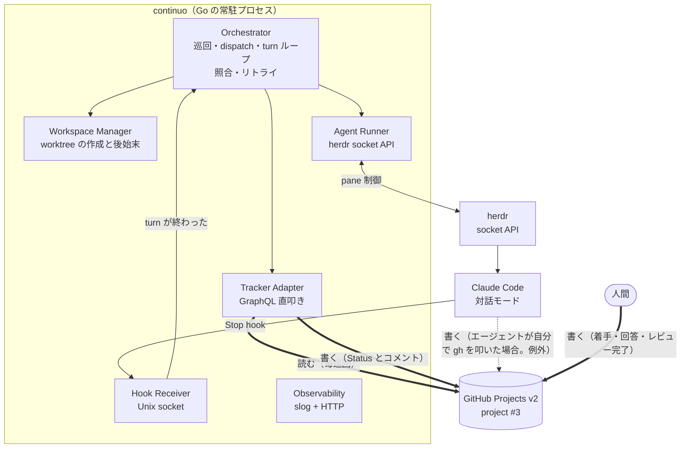
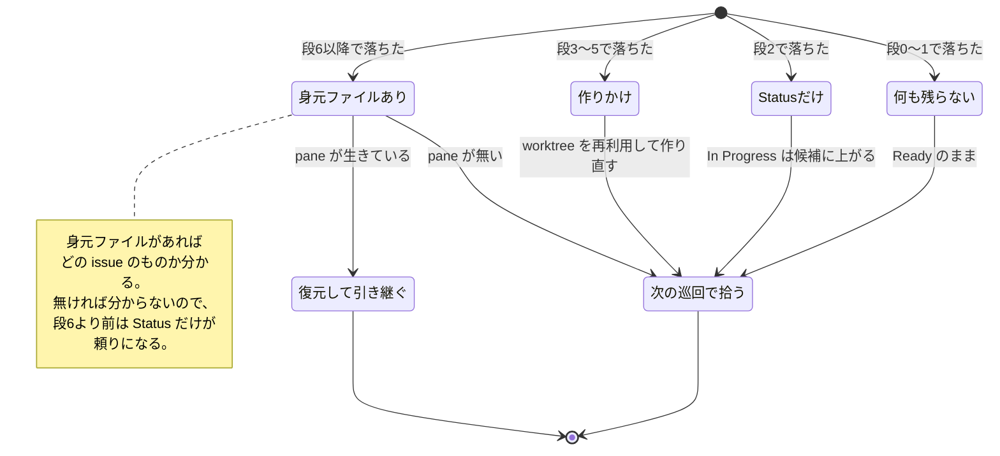
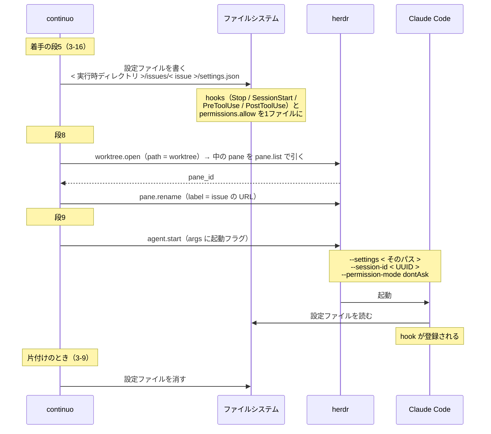
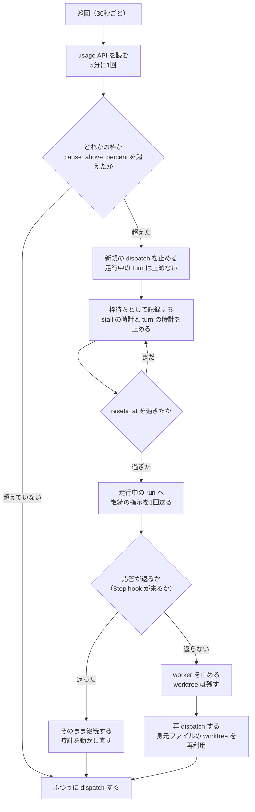

<!-- 目的: continuo（symphony 仕様準拠のタスクオーケストレーター、Go 実装）の具体設計 -->

# continuo の設計

最終更新: 2026-08-18

## この文書は何か

**`continuo` の設計を確定させるための文書である。これが設計の正である。**

> **人間がレビューするときは [continuo_design_slim.md](continuo_design_slim.md) を読むこと。**
> この文書は AI が読むためのもので、判断の根拠・実測値・比較した案を全部持っている。
> **設計を変えたらこの文書を直し、人間のレビューが要るときに要約版を再生成する。**

**`continuo` とは何か。**GitHub Projects v2 のボード1枚を見張り、`Ready` の issue ごとに worktree を用意し、herdr の pane で Claude Code を対話モードで起動して作業させ、完了までを面倒見る**常駐プロセス**である。Go で書く。名前は**通奏低音**（basso continuo）に由来する（[docs/naming.md](../naming.md)）。

**準拠する仕様は [openai/symphony](https://github.com/openai/symphony) の `SPEC.md`**（Apache-2.0、2312行。手元の写しは [docs/spec/symphony/SPEC.md](../spec/symphony/SPEC.md)）。


### continuo が満たすべき条件（これが目標である）

**この設計は、先行調査が定めた必須条件14件を満たすために存在する。**
原典は非公開リポジトリの選定記録にある「満たすべき条件（14件）」で、**そこでは14件すべてが必須と定められている。**
**1つでも「満たせない」に当たれば、その実装は落選する。**

**以下は原典からの転記である。**「どこで満たすか」の列だけが continuo 側の記載である。

| 短縮名 | 何を求めているか | continuo はどこで満たすか |
| --- | --- | --- |
| **定額運用** | 従量課金にならないこと。**最優先** | `claude -p` も Agent SDK も API の直叩きも使わない。**herdr の pane で対話モードの Claude Code を動かす**（3-1 の図 / 3-16 の段8・段9 / CLAUDE.md の絶対制約）。**レートリミットを読む OAuth の usage API はメッセージを送る API ではないので、この制約に抵触しないと判断している。ただし「1トークンも消費しない」ことは確かめられていない**（3-27 / 第6節）。**必須にはせず、`rate_limit.source: none` で切れるようにしてある** |
| **自動で順に実行** | 貯めたタスクが自動で順に実行されること。**実装形態は問わない** | 常駐プロセスが30秒ごとに巡回する（3-1 / 5-2 の `polling.interval_ms`） |
| **Projects v2 のボードを読める** | item を状態指定で取得でき、実行中の issue を ID 指定で取り直せること | GraphQL を直接叩く（2-2 / 3-13）。**`gh project` は1回 102 point かかるので使わない** |
| **複数ボード監視** | 1プロセスで複数のボードを監視できること | **凍結中。**当面 project #3 の1枚だけを使う。**条件からの削除ではないので、凍結が解けたときに設計を壊さない構造にしてある**（3-28） |
| **リポジトリ別の作業ディレクトリ** | 1枚のボードに載った issue を、その issue の所属リポジトリの作業ディレクトリで実行すること | issue の `nameWithOwner` から `ghq` でローカルの clone を引き、そこから worktree を切る（3-22） |
| **枠回復で自動再開** | レートリミットで止まっても、枠の回復後に自動で再開すること。**「idle」と区別できていること** | **2段構えにする**（3-27）。Claude Code の自動再開の仕組みに任せ、効かなければ continuo が待って再 dispatch する。**待機中かどうかは OAuth の usage API で判定する**ので、どちらの経路でも「idle」と区別できる |
| **issue から投入** | issue に書けばキューに入ること | ボードに載った issue をそのまま拾う。**ボードへ載せて `Ice Box` を付けるのは人間が1回行う**（4-1 の遷移表）。continuo はボードに載っていない issue を見ない |
| **外部から順序調整** | 外部から実行順序を調整できること。**あわせて「1つのセッションが複数の issue をまとめて片付けられること」**（補足2 の要求2） | **順序はボードの並び順で決める**（4-2）。**Priority は使わない。**4段階しかなく、それより細かい順位を付けられないためである。**並べるのは人間で、continuo は読むだけである**（3-30）。**`bug` が付いた issue を前へ出すのは、人間が並べるときの指針である。****グループは continuo の外で作り、代表の issue のコメントで受け取る**（3-26）。continuo は代表を1件 dispatch するだけでよい |
| **macOS ネイティブ** | macOS で動くこと（WSL2 上の Ubuntu でも動くこと）。**Docker 経由は「動く」に含めない** | Go で書き、`CGO_ENABLED=0` の static binary をクロスコンパイルする（2-5。実測済み） |
| **再配布できるライセンス** | コピーレフト系でなく再配布可能であること | continuo 自身が MIT。準拠先の仕様の写しだけ Apache-2.0 で、その旨を明記している |
| **未完了なら再投入される** | worker が Status を変えずに終了しても、issue がまだ active なら再度呼び出されること | turn ループ（3-8）と、turn の終わりごとのボードの取り直し（3-5）。**worker の正常終了を完了と見なさない** |
| **1年以内に更新** | 直近1年以内に更新があること | **自作なので他人の保守に依存しない。**ただし条件の趣旨は「放置されたものを使わない」なので、**依存先（herdr / gh / ghq / gwq / Claude Code）の更新に追随する責任は continuo 側にある。**起動時に herdr の protocol と `gh` の認証を照合するのはそのためである（3-6） |
| **並行実行数を指定できる** | 同時に走らせるエージェントの数を設定で指定できること | `agent.max_concurrent_agents`（5-2）。**守る場所は 3-16 の段-1。**印を付ける前に空きスロットを数え、尽きたらその巡回では以降を dispatch しない |
| **Claude Code を起動できる** | 起動されるエージェントが Claude Code であること | herdr の `agent.start` に `kind: claude` を渡す（2-1 / 3-16 の段9 / 5-2 の `claude.kind`） |

**優先条件（必須ではない）。原典は「herdr で動くこと」だけを挙げている。**

| 優先順 | 内容 | continuo |
| --- | --- | --- |
| **①** | **herdr で動く** | **満たす。**herdr の socket API の上に乗る（2-1 / 3-1）。**世界にこれを満たす実装が1つも無かったことが、continuo を自作する動機である** |
| ② | tmux で動き、起動層が分離されていて herdr に改造可能 | 該当しない |

**「枠回復で自動再開」の再開の質。**必須ではないが、原典が「必ず調べて記録する」としている。

| 段階 | 内容 | continuo |
| --- | --- | --- |
| **最良** | セッションをそのまま引き継ぐ | **平常時はこれである。**同じセッションへ継続の指示を送る（3-8） |
| 次善 | セッション ID を保存して `claude --resume` で文脈ごと復帰する | **これも満たす。**終了したセッションへ `--resume` で戻れることを実測で確認した（3-25）。**worker を止めたあとの復帰と、コメントを書かせ直すときに使う** |
| **最低限** | issue に進捗を書いておき、新しいセッションがそれを読んで続きから始める | 3-25。**原典は「プロンプトで指示しても実績上たびたび守られないため、書かれることが仕組みとして保証されている必要がある」と付帯条件を付けている。**3-25 の多重化はこの要求に応えるものである |

#### issue のグループへの対応（14件すべてを満たす形が決まっている）

**「外部から順序調整」の補足2 に、次の要求がある。**

> **要求2**: 実行の単位が「1 issue」ではなく「issue のグループ」になりうるため、**1つのセッションが複数の issue をまとめて片付けられること。**
> 「1 issue = 1 worker」を固定する実装（`SPEC.md` 準拠の実装はいずれもそうである）は、ここで引っかかる。

**なぜこの要求があるか。**同根のバグを別々の issue として別々のセッションで直すと、
**同じ調査を何度も繰り返して枠を無駄にする。**
「同一原因・同一ファイル・同一コンポーネントのバグをグループ化する」ため、実行の単位もグループになりうる。

**continuo は「1 issue = 1 worker」のままでこれを満たす。**
グループ化と順番の計画は**continuo の外**で行い、
**計画を代表の issue のコメントに書いて、その代表を dispatch する。**詳しくは 3-26。

**したがって14件すべてに満たし方がある。**未達のまま残る条件は無い。

### この設計の入力になった先行調査

**2026-08-04 から 08-17 にかけて、既存のタスクオーケストレーターを選定し、そのうち [tomoasleep/herdr-symphony](https://github.com/tomoasleep/herdr-symphony) を実際に動かして完了検知の欠陥を特定した調査がある。**本文ではこれを**先行調査**と呼ぶ。herdr-symphony 自体は 2026-08-13 に不採用が確定している。

**先行調査の記録は別の非公開リポジトリにある。**この文書からは参照できないので、**必要な結論はすべてここに転記してある。**

**先行調査が出した要件は9つある。**本文ではこの短縮名で参照する。

| 短縮名 | 内容 | 根拠 |
| --- | --- | --- |
| **完了検知の3層を分ける** | 「作業が止まったか」「タスクが完了したか」「何をしたか」を混ぜない | `SPEC.md` 10.3 / 16.5 |
| **turn ループを持つ** | issue が active な限り同じセッションへ継続の指示を送り、上限で打ち切る | `SPEC.md` 7.1 / 16.5 / 6.4 |
| **完了の真実の源はトラッカー** | **完了したかどうかを判断するのはエージェント。**ボードへ書き込むのは continuo のコード（3-25）。continuo は自分の判断で勝手に完了させない | `SPEC.md` 11.5 / 7.1 |
| **無反応を検知する** | 一定時間なにも起きなければ worker を止めてリトライを積む | `SPEC.md` 8.5 |
| **分類不能を作業中とみなさない** | 状態を判定できないことは「作業中」ではない。時間切れまで待たない | herdr の公開ドキュメント |
| **再起動時にトラッカーと整合を取る** | プロセスが落ちても「実行中」のまま取り残される issue を作らない | `SPEC.md` 14.3 |
| **成果と判断要求は issue のコメントに残す** | worktree も端末の画面も消えうる。コメントだけが確実に残る | `SPEC.md` 11.5 |
| **worktree と branch を本体が片付ける** | 使い終わったものが単調増加し、消すのが人間の仕事になっていた | 仕様に規定なし。運用上の必須要件 |
| **識別子の正規化を一元化する** | 設定ファイル側に文字を潰す回避策を書かせない | 仕様に規定なし |

## この文書の歩き方

**設計の判断はすべて第3節にある。**急ぐなら第3節と第8節だけを読めばよい。

| 節 | 何が書いてあるか | いつ読むか |
| --- | --- | --- |
| 1・2 | 実機で確かめた事実 | 判断の根拠を疑うとき |
| **3** | **設計の判断。ここが本体** | **最初に読む** |
| 4 | 人間が決めたこと（Status の構成・実行順序） | 運用の前提を知りたいとき |
| 5 | 設定ファイルの全キーと、プロンプトのテンプレート | 実装するとき |
| 6・7 | 実装前に潰すこと・作る順番 | 実装するとき |
| **8** | **symphony の仕様と異なるところ** | **実装するとき必ず読む** |

<details>
<summary>節の一覧（クリックで開く）</summary>

**1. 実機検証で確定したこと**

- 1-1 検証の方法
- 1-2 結論 — hooks は使える。端末表示の解析は不要になった
- 1-3 turn の終わりの判定基準が確定した
- 1-4 hook に渡ってくる項目（実測）
- 1-5 hook の実行環境（実測）
- 1-6 信頼確認プロンプトの扱い — 無人運用の最大の障害だった
- 1-7 subagent とバックグラウンド処理の完了は Claude Code が自分で拾う

**2. 調査で確定した外部の事実**

- 2-1 herdr の socket API
- 2-2 GitHub Projects v2
- 2-3 project #3 の実測構成 — 過去の記録と食い違っている
- 2-4 Claude Code の hooks（第1節の実測に加えて分かったこと）
- 2-5 Go の実装スタック

**3. 設計**

- 3-1 全体構成
- 3-2 turn の終わりは hooks から continuo へ直接通知させる
- 3-3 run を指す識別子を、消えない3箇所に書く
- 3-4 状態は in-memory。永続化層を作らない
- 3-5 完了検知の3層（完了検知の3層を分ける）
- 3-6 起動時の検査を厚くする
- 3-7 識別子の正規化を型で強制する（識別子の正規化を一元化する）
- 3-8 turn ループ（turn ループを持つ）
- 3-9 worktree と branch の後始末（worktree と branch を本体が片付ける）
- 3-10 実行中の Status も「作業中の状態」に含める
- 3-11 無人運用で人間の入力を待つ箇所を全部潰す
- 3-12 hook をどう届けるか
- 3-13 トラッカーの値をどう正規化するか
- 3-14 turn の数え方
- 3-15 トークンの計上は transcript から取る
- 3-16 着手の手順の順番を固定する
- 3-17 二重起動は flock で防ぐ。`ps` は使わない
- 3-18 worktree の身元を worktree の中に書く
- 3-19 落ちている間に届かなかった通知を取り戻す
- 3-20 worktree が置き場所の内側にあることを検査する
- 3-21 stall の時計は中間の hook でリセットする
- 3-22 worktree の置き場所は gwq の規則に合わせる
- 3-23 hook を受ける socket の置き場所
- 3-24 設定を読み直して失敗しても落ちない
- 3-25 Status を動かす仕組みを、プロンプト頼みにしない
- 3-26 issue のグループは、代表の issue のコメントで受け取る
- 3-27 レートリミットで止まっても自分で再開する
- 3-28 複数のボードを監視する凍結が解けたときに壊れない構造にする
- 3-29 issue の中身はエージェントに直接読ませる
- 3-30 並び順は人間が決める。continuo は読むだけである
- 3-31 GitHub の GraphQL のレートリミットに収める
- 3-32 使い始めるまでの手順
- 3-32b Windows ネイティブは対応しない
- 3-33 信頼の登録は、人間が列挙したものだけを対象にする
- 3-34 ボードは既存のものに合わせる
- 3-35 画面に出す文言は資源から引く

**4. 人間が決めたこと**

- 4-1 Status の構成 — `Ice Box` を未着手の置き場にし、`Blocked` を足す
- 4-2 実行順序 — ボードの並び順は使えるが、ボードの設定変更が前提になる
- 4-3 `~/.claude.json` を常駐ループから書き換えない
- 4-4 board view の並び順は人間がドラッグで決める

**5. 設定ファイル**

- 5-1 ファイルの名前と探し方
- 5-2 front matter（設定）
- 5-3 本文（プロンプトのテンプレート）
- 5-4 2回目以降のプロンプト
- 5-5 設定値の展開規則

**6. 実装に入る前に潰すこと**


**7. 実装の順序**


**8. symphony の仕様と異なるところ**

- 8-1 意図的に外している仕様
- 8-2 仕様に無いものを足している
- 8-3 そもそも適用外
</details>

---

## 1. 実機検証で確定したこと

****先行調査** が「設計に入る前に潰せ」としていた未確認事項を、実機で全部潰した。**

### 1-1. 検証の方法

**本リポジトリと `~/.claude/settings.json` を一切触らずに検証した。**scratchpad に使い捨ての git リポジトリを作り、そこから worktree を切って、その worktree の `.claude/settings.local.json` に hook を仕掛けた。**continuo の実運用と同じ形**（worktree ごとに settings.local.json を置く）である。

**観測は2回に分かれている。値を引くときはどちらのものかを確かめること。**

| いつ | Claude Code | 何を測ったか | 生ログ |
| --- | --- | --- | --- |
| **2026-08-17** | **2.1.233** | hook が発火するか / 渡ってくる項目 / `background_tasks` の存在 | [docs/evidence/hooks_probe_20260817.jsonl](../evidence/hooks_probe_20260817.jsonl) |
| **2026-08-18** | **2.1.234** | **turn の終わりの判定**（1-3）/ 表明の読み取り（3-25）/ 権限モードと subagent（3-11） | **コミットしていない。**scratchpad にのみ存在し、消えている |

> **2026-08-18 の生ログは残っていない。**scratchpad は消えるので、**同じ観測をやり直すには 1-3 の条件を読んで再現する必要がある。**
> **1-3 に、何並列を何回・何を送ったかを書いてある。**

**2026-08-17 の検証の詳細。**

| 項目 | 値 |
| --- | --- |
| Claude Code | 2.1.233 |
| herdr | 0.8.0 |
| Go | 1.26.1 darwin/arm64 |
| 検証の置き場所 | scratchpad の使い捨て git リポジトリ + そこから切った worktree 2つ |
| 仕掛けた hook | `SessionStart` / `UserPromptSubmit` / `PreToolUse`(Task) / `PostToolUse`(Task) / `SubagentStart` / `SubagentStop` / `Stop` / `SessionEnd` / `Notification` |
| 観測方法 | 各 hook が stdin の JSON をそのまま JSONL に追記する python スクリプト |
| 後始末 | pane close → `git worktree remove --force` → ディレクトリ削除。**完了済み** |

**生の観測記録は [docs/evidence/hooks_probe_20260817.jsonl](../evidence/hooks_probe_20260817.jsonl) にコミットしてある。**hook を仕掛けた設定ファイルと、記録を取ったスクリプトも同じディレクトリにある。**公開リポジトリなので、認証トークンとセッション UUID と実験に使った絶対パスだけを置換してある**（[docs/evidence/README.md](../evidence/README.md)）。

### 1-2. 結論 — hooks は使える。端末表示の解析は不要になった

| 未確認だったこと | 結果 |
| --- | --- |
| **hook が実際に発火するか** | **発火する。**`SubagentStart` / `SubagentStop` / `Stop` の3つとも観測した |
| **`Stop` が、バックグラウンド処理が残った状態でも発火するか** | **発火する。**ただし**残っている処理が `background_tasks` に入って渡ってくる** |
| **`background_tasks` / `stop_hook_active` / `agent_transcript_path` は実在するか** | **3つとも実在した。**公式ドキュメントで裏が取れていなかったが、実機で確認できた |
| **worktree に置いた `.claude/settings.local.json` の hook が効くか** | **効く。**`.git` がディレクトリではなくファイル（gitdir 参照）である worktree でも効いた |

### 1-3. turn の終わりは「hook 単独」でも「静止の長さ」でも判定できない

**言いたいこと。**判定は**herdr の待ち受けを主、hook を従**にする。
**`background_tasks` が空でも turn は続く。静止の長さでも分離できない。**
**分離できるのは「`Stop` の直後に `<task-notification>` が来るか」である。**

#### なぜ `background_tasks` の空では判定できないか

**空配列の `Stop` は turn の途中にも発火する。**空の `Stop` 20件のうち4件がそれだった（2026-08-18 実測）。
**`Stop` の直後に `<task-notification>` が来た事例は、`background_tasks` が非空だったものも含めて8件で、間隔は 0.033〜0.037 秒だった。**

| 試行 | 途中で出た `Stop`（空配列）の最終応答 | 次の `Stop` までの間隔 |
| --- | --- | --- |
| 3並列 | `Bが完了しました（date の出力: …）` | 5.60 秒 |
| 5並列 | `f5.txt が完了しました: … 残り2つの完了を待ちます。` | 2.15 秒 |
| 4並列 | `f5.txt と f6.txt が完了しました。残り1つの完了を待ちます。` | 2.02 秒 |

**`prompt_id` での判定も成立しない。**wake-up ごとに値が変わり、
最終回答が出た `Stop` の `prompt_id` は、人間の入力のものと別の値だった。

#### なぜ静止の長さでも判定できないか

**メインが叩いた道具の実行中は、hook が1つも飛ばない。**無音の長さは道具の実行時間とほぼ一致した
（45秒の道具で 45.107〜45.116 秒、90秒の道具で 90.115 秒）。

**一方、turn が終わったあとの無音は 60.040〜60.058 秒で `Notification`（`notification_type: idle_prompt`）に破られる**（12/12）。
**turn 内の無音（90秒）が turn 外の無音（60秒）を追い越すので、どこに線を引いても分離できない。**

> **道具の実行時間に上限はかけられる。**`BASH_DEFAULT_TIMEOUT_MS` と `BASH_MAX_TIMEOUT_MS` の**両方**を
> 同じ値にすると、エージェントが `timeout: 180000` を指定しても上限が勝った（3/3）。
> **だが continuo はこれを短くしない。**公式ドキュメントが
> **「`git` を走らせるコマンドは、打ち切りでバックグラウンドへ移らず止められる」**と書いており、
> **continuo は git の clone と worktree の作成を走らせる。**短い上限は実作業を壊す。

#### 採る判定

| 順 | 何を見るか | 根拠 |
| --- | --- | --- |
| **主** | **herdr の待ち受け**（`until = [idle, done, blocked]`） | turn の終わりまで待てた（3/3）。**`blocked` を並べないと権限の確認で止まった turn を拾えず、時間切れまで待たされる**（3/3） |
| **従** | **`Stop` hook の直後に `<task-notification>` で始まる `UserPromptSubmit` が来たら、turn は続いている** | 途中の `Stop` の 0.033〜0.037 秒後に来た（8/8） |
| **確認** | `background_tasks` が空でなければ未完了 | 誤検知しない方向にしか外れない |

**`<task-notification>` は subagent 専用ではない。**`run_in_background` の Bash が終わったときも同じ封筒で届いた（3/3）。
**「subagent の完了だけを見る」設計は取りこぼす。**封筒の中の `<task-id>` が
`SubagentStart` の `agent_id` と一致すれば subagent 由来、しなければ shell 由来である。

**猶予の長さは暫定である。**観測できた8件はいずれも 0.037 秒以内に来たが、**上限を決める仕組みは確かめていない。**
**運用のログで分布を取って決め直す**（第6節）。

#### 数えるときに捨てるもの

**`agent_type` が空文字の `SubagentStop` を数に入れてはならない。**

| 何を確かめたか | 空文字のもの | 本物 |
| --- | --- | --- |
| 対応する `SubagentStart` があるか | **0/22、0/44** | 6/6、22/22 |
| `agent_transcript_path` が実在するか | **0/22、0/44** | 6/6、22/22 |
| 道具を1つも使わない turn でも出るか | **出た**（3/3） | 出ない |

**弾き方は「`SubagentStart` と突き合わせる」か「`agent_transcript_path` の実在を見る」のどちらかでよい。**
**正体は特定していない。**設計では「subagent ではないので捨てる」までを扱う。

**`PreToolUse` / `PostToolUse` を「メインが動いている」の根拠にしてはならない。**
**subagent の道具も同じ hook に流れてくる。**

> **選り分ける手段は確定していない。**コミット済みの生ログ（2026-08-17）の `PreToolUse` / `PostToolUse` に
> `agent_id` は入っていない。**選り分けられる項目があるかどうかを確かめていない。**
> **したがって continuo は選り分けない。**この2つは**生きていることの確認にだけ使う**（3-21）ので、
> メインか subagent かを区別する必要が無い。

**識別子そのものは一致する。**`SubagentStart.agent_id` /
`PostToolUse.tool_response.agentId` / `Stop.background_tasks[].id` / `SubagentStop.agent_id` の4つは、
named subagent 15件すべてで同じ文字列だった。

> **この節の観測はすべて Claude Code 2.1.234 / herdr 0.8.0 のものである。**
> 同一性も間隔も公式ドキュメントに書かれていないので、**バージョンが上がったら測り直す。**

**観測した時系列（原文の抜粋）。**
### 1-4. hook に渡ってくる項目（実測）

**イベントごとに項目が違う。**以下は実際に渡ってきたものだけを列挙している。

| イベント | 渡ってきた項目 |
| --- | --- |
| `SessionStart` | `session_id` / `transcript_path` / `cwd` / `hook_event_name` / `source` / `model` |
| `UserPromptSubmit` | 上記 + `permission_mode` / `prompt` / `prompt_id`（`model` は無し） |
| `PreToolUse` | `session_id` / `transcript_path` / `cwd` / `hook_event_name` / `permission_mode` / `prompt_id` / `effort` / `tool_name` / `tool_input` / `tool_use_id` |
| `PostToolUse` | 上記 + `tool_response` / `duration_ms` |
| `SubagentStart` | `session_id` / `transcript_path` / `cwd` / `hook_event_name` / `prompt_id` / **`agent_id`** / **`agent_type`** |
| `SubagentStop` | 上記 + **`agent_transcript_path`** / `background_tasks` / `last_assistant_message` / `stop_hook_active` / `permission_mode` / `effort` / `session_crons` |
| `Stop` | `session_id` / `transcript_path` / `cwd` / `hook_event_name` / `prompt_id` / `permission_mode` / `effort` / **`background_tasks`** / **`last_assistant_message`** / **`stop_hook_active`** / `session_crons` |

**`Stop` の `last_assistant_message` に入るのは、その turn の「最後の assistant テキストブロック1つ」である。**
**長さでは切られない**（44,823 バイトまで無切断を3回確認）。
**だが道具を使ったあとだと、その前に書かれたものは落ちる。**
**そのため continuo は表明の読み取りにこれを使わず、`transcript_path` を読む**（3-25）。実測値の例:

```text
ファイル一覧: `.claude/`（内部に settings.local.json）、`.git`（worktree リンクファイル 175B）、
`README.md`（63B）、`sample.txt`（20B）
sample.txt の中身: `alpha` / `bravo` / `charlie` の3行（末尾改行あり、計20バイト）
探索は Explore エージェント1つで完了、通常ファイルは README.md と sample.txt のみです
```

**これは設計を1箇所変える。****先行調査** は、エージェントがコメントを残さずに止まった場合のフォールバックとして
「会話ログから抽出 → 画面バッファを読む」という順序を定めていた。
**画面バッファを読む案は不要になった。**`last_assistant_message` と `transcript_path` の2つが、どちらもそれより上位である。

**2つの使い分けは公式ドキュメントが明記している。**

> The transcript file is written asynchronously and may lag the in-memory conversation, so it may not yet include the current turn's most recent messages when a hook fires. Hooks that need the final assistant text of the current turn should use `last_assistant_message` on Stop and SubagentStop instead of reading the transcript
>
> **訳:** transcript のファイルは非同期に書かれ、メモリ上の会話に遅れることがあるため、hook が発火した時点で
> **その turn の最新のメッセージがまだ入っていないことがある。**その turn の最終の assistant テキストが必要な hook は、
> **transcript を読むのではなく `Stop` / `SubagentStop` の `last_assistant_message` を使うべきである。**

**continuo が欲しいのは「turn 全体のどこかにある印」であって、最終のテキストではない。**
だから transcript を読む（3-25）。**書き込みの遅れは公式が明記しているとおりなので、読む前に待つ。**

> **transcript のパースを禁じる記述は公式ドキュメントに無い**（`hooks.md` 全文を確認）。
> **「内部形式なので変わりうる」という注意書きも無い。**

### 1-5. hook の実行環境（実測）

**cwd は worktree のパスそのものだった。**環境変数も渡ってくる。

| 環境変数 | 実測値の例 | continuo にとっての意味 |
| --- | --- | --- |
| `CLAUDE_PROJECT_DIR` | worktree の絶対パス | **どの issue のセッションかを識別できる** |
| `CLAUDE_CODE_SESSION_ID` | `e042974e-…` | `SPEC.md` の `session_id` に相当するものとして使える |
| `CLAUDE_PID` | `41460` | プロセスの生存確認に使える |
| `CLAUDE_CODE_MESSAGING_SOCKET` | `/tmp/cc-socks/41460.sock` | **未解析。**外部から問い合わせられるかは不明。**設計の前提にしない** |
| `CLAUDE_ENV_FILE` | `~/.claude/session-env/<session_id>/sessionstart-hook-1.sh` | 未解析 |
| `CLAUDECODE` | `1` | — |

> **`CLAUDE_CODE_MESSAGING_SOCKET` を設計に取り込まない。**存在は観測したが、プロトコルも安定性も分かっていない。
> **「動いた」と「解析できた」は別である。**内部実装に依存する仕組みは、条件を洗い出すまで設計に入れない。

### 1-6. 信頼確認プロンプトの扱い — 無人運用の最大の障害だった

**新しいディレクトリで Claude Code を起動すると、"Is this a project you created or one you trust?" という信頼確認で止まる。**キー入力を待つため、**無人運用ではここで全部止まる。**プランファイルにこの記述は無かった。

**実測した画面（原文）。**

```text
 Quick safety check: Is this a project you created or one you trust?
 ⚠ This folder pre-approves 9 tool permissions in .claude/settings.local.json:
   Bash(ls:*), Bash(cat:*), Bash(echo:*), Bash(sleep:*), Bash(pwd), Agent, Read,
 Glob, and 1 more
 ❯ 1. Yes, I trust this folder
   2. No, exit
```

**ここで分かったことが2つある。**

**1つ目。`.claude/settings.local.json` は信頼確認の前に読まれている。**「9個の権限を事前承認している」と画面が具体的に述べている。**設定が無視されているわけではない。**

**2つ目。信頼は worktree 単位ではなく git リポジトリ単位で記録される。**`~/.claude.json` の `projects` を検証の前後で比較したところ、登録されたのは**メインの作業ディレクトリ1件だけ**だった。worktree 2つはどちらも登録されていない。

```text
/…/scratchpad/hooks-probe/main -> hasTrustDialogAccepted = True
（wt-87 と wt-88 は projects に現れない）
```

**そして2つ目の worktree で起動したときは、信頼確認も権限の事前承認警告も出ずに、そのまま入力待ちになった。**

**これが continuo の設計に与える影響。**

| 内容 |
| --- |
| **リポジトリごとに1度だけ、人間がそのリポジトリで Claude Code を起動して信頼を承認しておけば、そこから切る worktree では確認が出ない** |
| **continuo は dispatch の直前に、その issue のリポジトリが信頼済みかを検査する**（3-6）。未承認のリポジトリで起動すると無人運用が止まる |
| **`--dangerously-skip-permissions` は使わない。**信頼の承認は人間が1度やれば済む |

> **transcript の置き場所は worktree 単位だった。**`~/.claude/projects/` の下に worktree ごとのディレクトリができる。信頼はリポジトリ単位、transcript は worktree 単位で、**粒度が違う。**

### 1-7. subagent とバックグラウンド処理の完了は Claude Code が自分で拾う

**観測した事実。**subagent が終わると、Claude Code が自分自身に `<task-notification>` というプロンプトを自動投入する。バックグラウンドの shell が終わったときも同じだった。

```text
11:39:24.808  SubagentStop
11:39:26.720  UserPromptSubmit   prompt = <task-notification><task-id>a1f9f743842d397e1</task-id>…<status>completed</status>…
11:39:30.075  Stop               background_tasks=[]
```

**したがって continuo は、subagent の完了を待つために追加のプロンプトを送る必要が無い。**
待っていれば `background_tasks` が空の `Stop` が来る。**これは turn の消費を無駄に増やさないという点で重要である。**

> **ただし、その `Stop` が最後とは限らない。**空配列の `Stop` は turn の途中にも出る（1-3）。
> **`<task-notification>` が来ないことを確かめてから確定させる**（3-2）。


---

## 2. 調査で確定した外部の事実

**設計の前に、continuo が乗る3つの外部システムを実測した。**設計判断はすべてここから導かれる。

### 2-1. herdr の socket API

| 分かったこと | 設計への影響 |
| --- | --- |
| **Unix domain socket + 改行区切り JSON。認証もハンドシェイクも無い。**JSON-RPC 2.0 ではない。リクエストは `{id, method, params}` の3つとも必須で、`id` は文字列必須、`params` は空でも `{}` が要る | Go の `net.Dial("unix")` + `encoding/json` で足りる。ライブラリ追加ゼロ |
| socket のパスは環境変数 `HERDR_SOCKET_PATH` で pane 内のプロセスに注入される。既定は `~/.config/herdr/herdr.sock` | **continuo は設定ファイルの `herdr.socket` を使う。環境変数を勝手に優先しない**（下記）。socket の探索ロジックを自前で持たない |

> **環境変数を優先してはならない。**設定に書いたパスが黙って無視されると、
> **continuo は利用者が指定した先とは別の herdr で pane を作り、worktree を消す。**
> herdr の pane の中で動かす環境では `HERDR_SOCKET_PATH` が常に入っているので、
> **優先すると設定ファイルで切り替える手段が一切なくなる**（テストでも切り替えられない）。
>
> **環境変数で切り替えたい利用者は、設定に `${HERDR_SOCKET_PATH}` と書く。**
> 展開は 5-5 の規則で `internal/config` が行う。**未定義ならそこで落ちる**（既定値へは落ちない）。
| **1コネクション = 1リクエスト。**応答を1行返した直後にサーバがコネクションを閉じる | コネクションプールを作れない。RPC は毎回 connect し直す |
| **`events.subscribe` だけが長寿命ストリーム。**ただし接続時に過去の event を再生し、配信が毎秒 9〜10 件に律速される | **`pane.updated` と `pane.scroll_changed` を購読してはいけない**（追いつかない）。`session.snapshot` で現在状態を確定させてから、低頻度の event だけ購読する |
| **`events.wait` は agent の状態変化しか受け付けない。**schema には19種の待機条件が定義されているが、他を投げると拒否される | schema を鵜呑みにしてコード生成すると実行時に落ちる |
| **agent 名は `^[a-z][a-z0-9_-]{0,31}$` に限定される。**issue の URL は入らない | ****先行調査** の「pane 名を issue の URL にする」は成立しない。**設計を差し替える（2-4 と 3-3） |
| agent の状態は `idle` / `working` / `blocked` / `done` / `unknown` の5値。**`done` は「idle だが、その tab がまだ人間に見られていない」**という意味で、CLI や API で読んでも「見た」ことにならない | **continuo は tab をフォーカスしないので、実運用ではほぼ常に `done` 側になる。**この値は**フォールバックの切り分けにだけ使う**（3-2）。使うときは `idle` と `done` の両方を受理する。`unknown` は完了ではない。**turn の終わりの判定そのものは hook で行う** |
| **`worktree.remove` は branch を消さない。**引数は path でも branch でもなく `workspace_id` である | **branch の後始末は continuo が `git branch -D` を自分で叩く**（worktree と branch を本体が片付ける） |
| **`pane.report_agent` で、実プロセスを起動せずに任意の pane を「agent が居る pane」として登録できる** | **統合テストで実際に Claude Code を起動せずに状態遷移を再現できる。**テストのコストが劇的に下がる |
| pane の `agent_session` から **Claude Code のセッション UUID が取れる** | hooks が渡す `session_id` と突き合わせられる（3-2 の要） |
| **`herdr pane split` の直後に `herdr agent start` を呼ぶと `agent_pane_busy` が返ることがある**（実測で1回発生） | **リトライを入れる。**pane が使える状態になるまで少し待つ |
| **`herdr agent start` は、Claude Code が信頼確認のダイアログを出している状態でも `interactive_ready: true` を返す**（実測） | **「準備できた」を「プロンプトを受け付けられる」と解釈すると誤る。**初回起動のときは画面を読んでダイアログの有無を確かめる経路が要る（3-6 の信頼の検査で未承認を弾けば、通常はここに来ない） |

#### socket API の実在するメソッドと引数（2026-08-18 に `herdr api schema --json` で確認）

**メソッドは85個ある。**continuo が使うものだけを挙げる。**太字が必須の引数である。**

| メソッド | 引数 | 何に使うか |
| --- | --- | --- |
| `pane.split` | **`direction`** / `cwd` / `env` / `focus` / `ratio` / `target_pane_id` / `workspace_id` | pane を作る。**continuo は使わない**（worktree.open が作る pane を使う。3-16 の段8） |
| **`pane.list`** | `workspace_id` | **pane の一覧。**worktree.open で開いた workspace の pane を引くのに使う |
| **`tab.create`** | `workspace_id` / `cwd` / `env` / `label` / `focus` | tab を作る。**continuo は使わない**（1 worktree = 1 workspace にするため。4-5） |
| `pane.close` | **`pane_id`** | pane を閉じる |
| **`pane.rename`** | **`pane_id`** / `label` | **pane に label を書く。**`pane.split` では書けないので、作ったあとに別途呼ぶ（3-3） |
| `pane.report_metadata` | **`pane_id`** / **`source`** / `title` / `state_labels` / `tokens` / `ttl_ms` ほか | 揮発する付加情報。**再起動で消えるので復元の根拠にしない**（3-3） |
| `pane.list` | `workspace_id` | pane の一覧 |
| `agent.start` | **`name`** / **`kind`** / **`pane_id`** / `args` / `timeout_ms` | agent を起動する。**`args` が Claude Code への起動フラグを渡す経路である**（`--settings` / `--session-id` / `--permission-mode`）。必須ではない |
| `agent.prompt` | **`target`** / **`text`** / `wait` | プロンプトを送る。**`wait` は真偽値ではなくオブジェクト**（`timeout_ms` と `until` を持つ） |
| `agent.read` | **`target`** / **`source`** / `format` / `lines` / `strip_ansi` | 画面を読む。**`source` の値は `visible` / `recent` / `recent_unwrapped` / `detection`。**CLI はハイフン区切りだが、**socket API はアンダースコアである** |
| `agent.get` | **`target`** | **agent の状態を読む。**`agent.status` というメソッドは存在しない |
| **`agent.send_keys`** | **`target`** / **`keys`**（**文字列の配列**） | **キーを送る。**権限の確認を取り消すときに `["esc"]` を送る（3-11）。**CLI を exec する必要は無い。socket API に実在する**（protocol 19 で確認） |
| `agent.list` | （なし） | agent の一覧 |
| `agent.wait` | **`target`** / `timeout_ms` / `until`（**配列**） | **いまの状態が `until` に含まれていれば即座に返る**（0.006 秒。2026-08-19 実測）。含まれていなければ、そうなるまで待つ。**したがって「turn の終わりを待つ」用途には単独で使えない**（3-2）。**`until` は状態名の配列である**（`idle` / `working` / `blocked` / `done` / `unknown` のいずれか） |
| `worktree.create` | `path` / `branch` / `base` / `cwd` / `focus` / `label` / `workspace_id` | worktree を作って herdr workspace として開く |
| `worktree.open` | `path` / `branch` / `cwd` / `focus` / `label` / `workspace_id` | **既にある worktree を herdr workspace として開く。**作らない |
| `worktree.remove` | **`workspace_id`** / `force` | worktree を消す。**path でも branch でもない** |
| `worktree.list` | `cwd` / `workspace_id` | worktree の一覧 |
| `workspace.rename` | **`workspace_id`** / **`label`** | herdr workspace に label を書く |
| `agent.rename` | **`target`** / `name` | agent の名前を変える |
| `session.snapshot` | （なし） | 現在の状態をまとめて取る |
| `pane.report_agent` | **`pane_id`** / **`source`** / **`agent`** / **`state`** / `agent_session_id` ほか | **実プロセスを起動せずに「agent が居る pane」として登録する。**統合テストで使う。**`state` は4値で `done` を含まない** |
| **`ping`** | （なし） | **protocol の版を取る。**応答は `{"type":"pong","version":"0.8.0","protocol":19,"capabilities":{…}}`（実測） |

**protocol の版は `ping` で取る**（実測で 19。herdr は 0.8.0）。起動時にこれを呼び、設定の `herdr.protocol` と照合する。

**応答のスキーマも実在する。**`herdr api schema --json` の `schemas` は
`error_response` / `event` / `request` / `subscription_event` / **`success_response`** の5つを持つ。
`success_response` の `result` は `type` を判別子とする**57変種**である（自分でスキーマを数えて確認した）。**ただし「どのメソッドがどの変種を返すか」はスキーマに書かれていない。**

**pane の `agent_session` は `{source, agent, kind, value}` のオブジェクトである**（4つとも必須。スキーマの `AgentSessionInfo` で確認）。
**`kind` が `"id"` のとき、`value` が Claude Code のセッション UUID になる。**3-4 の復元手順はここから取る。

**agent の状態のキー名は `agent_status` である**（`status` ではない）。`Pane` にも `AgentInfo` にも
`agent_status` というフィールドがあり、`status` は存在しない（スキーマで確認）。

**エラー応答では `id` が空文字で返る。**正常時は送った `id` がそのまま返るが、エラーのときは返らない（実測）。

```json
正常: {"id": "probe", "result": {...}}
エラー: {"id": "", "error": {"code": "invalid_request", "message": "..."}}
```

**したがって `id` で応答を対応づけることはできない。**もっとも1コネクション1リクエストなので、対応づける必要がそもそも無い。
**`id` は必須なので送るが、応答の `id` は当てにしない。**

### 2-2. GitHub Projects v2

| 分かったこと | 設計への影響 |
| --- | --- |
| **`gh project item-list --limit 100` は1回で 102 point を消費する。**GraphQL を手書きすれば同じ内容が 1 point。上限は 5,000 point/時 | **`gh project` サブコマンドを本体で使ってはいけない。**30秒間隔だと上限の2.4倍を消費して破綻する。**GraphQL を直接叩く** |
| `ProjectV2.items(query:)` のサーバ側フィルタ1本で、Status 指定・複数 Status の OR・所属リポジトリ・カスタムフィールドまで1リクエストで取れる | 巡回は1リクエストで済む。Status ごとに分ける必要が無い |
| **複数 Status の OR は、カンマ区切りで書く。**`status:"Done","In Review"` は7件（Done 5件 + In Review 2件）を返した。**空白区切りの `status:"Done" status:"In Review"` は AND になり0件を返す**（実測） | **書き方を間違えると、エラーを出さずに0件を返す。**`active_states` を OR で取るときは必ずカンマ区切りにする |
| **選択肢名を間違えると、エラーを出さずに 0 件を返す** | **これが最大の落とし穴。**人間が UI で Status を改名すると、continuo は無言で「対象0件」と判断し続けキューが永久に止まる。**起動時に選択肢名を照合して、合わなければ起動を止める** |
| item は node ID で直接取り直せる（1 point）。Status の値そのものが `createdAt` / `updatedAt` を持つ | 実行中 issue の再取得はボード全体を舐め直さずに済む。**この経路は 3-9 の手順7（worktree の照合）と、`SPEC.md` 8.5 の実行中の照合で使う** |
| `content.repository.nameWithOwner` と `defaultBranchRef.name` が同じリクエストで取れる | **作業ディレクトリの決定に必要な情報が巡回1回で揃う** |
| draft issue は `type: DRAFT_ISSUE` で現れ、**repository を持たない** | **type が ISSUE でない item は明示的にスキップしてログに残す。**拾うと dispatch が原因不明で失敗し続ける |
| エージェントが `gh issue comment` で書いたコメントは、**author が人間のアカウントになり、人間が手で書いたものと区別できない** | **コメント本文の先頭に固定マーカーを書かせて判別する。**さもないと turn ループの継続指示にエージェント自身の出力が混入する |
| Status 更新は `gh project item-edit` で名前指定でも書けるが、**continuo は GraphQL で書く**（3-25。`gh project` は1回 102 point かかるため本体で使わない） | **GraphQL の `updateProjectV2ItemFieldValue` は ID を要求する。**したがって continuo は**起動時に project の ID・Status フィールドの ID・各選択肢の ID を1度だけ引いて覚える。**選択肢名の照合（3-6）と同じリクエストで取れる |

### 2-3. project #3 の実測構成 — 過去の記録と食い違っている

**先行調査の記載と現状が違う項目がある。以下は現状である。**

| 項目 | プランファイルの記載 | 2026-08-17 の実測 |
| --- | --- | --- |
| Status の選択肢 | Backlog / Blocked を含む | **`Ice Box` / `Ready` / `In Progress` / `Blocked` / `In Review` / `Done` の6つ**（4-1） |
| item 数 | 98件 | **104件** |
| リポジトリ数 | 8 | **5** |
| Priority | — | **P0〜P3 の4択が定義されているが、104件すべて未設定** |
| Ready の件数 | — | **0件** |
| Status 未設定の item | — | **4件**（どの Status フィルタにも一致せず放置される） |

**ここから2つの論点が出る。どちらも人間の判断が要る**（第4節）。

**Priority は104件すべて未設定である。**そのため Priority による整列は機能しない。
**Priority は使わず、ボードの並び順だけで順序を決める**（4-2）。

### 2-4. Claude Code の hooks（第1節の実測に加えて分かったこと）

| 分かったこと | 設計への影響 |
| --- | --- |
| **信頼していないフォルダでは、対話セッションで信頼のダイアログが出る。**settings ファイルの hook そのものは信頼前でも動く（下記の公式の表） | **ダイアログが出た時点で人間の入力を待って止まる**（3-11）。dispatch の直前に「そのリポジトリが信頼登録されているか」を検査する（3-6） |
| hooks は settings の階層をまたいでマージされ、**実行中のセッションにもファイル監視で再読み込みされる** | worktree ごとに hook を書き換える運用が成立する |
| hook の設定を外部から問い合わせる CLI は無い（`claude hooks` は存在しない） | continuo 自身が「書いた設定が効いているか」を確かめる手段は、**実際に hook が飛んでくるかどうかだけ**である |
| **`background_tasks` は「タスクレジストリに到達できるとき」存在する。**到達できない場合に項目が無い可能性が原文に残されている | **`background_tasks` が欠けている `Stop` を「空配列」と同一視してはいけない。**欠けていたら判定不能として扱う |
| `Stop` は人間の中断では発火せず、API エラーでは別のイベントに振り替わる | **`Stop` だけを張ると取りこぼす。**無反応の検知を併用する |

### 2-5. Go の実装スタック

**外部依存を増やすことを禁じない。ただし、標準ライブラリで足りるものは標準ライブラリを使う。**

**いまの依存は YAML パーサ1本だけである**（2026-08-20 時点）。これは結果であって上限ではない。
**必要なら足してよい。**足すときは次を見て決める。

| 見るところ | なぜ |
| --- | --- |
| **標準ライブラリで書けるか** | 書けるなら書く。15行で済むものにライブラリを足さない |
| そのライブラリ自身の依存 | 推移的に増えるものまで数える |
| 保守されているか | archive 済み・更新が止まっているものを避ける |
| ライセンス | このリポジトリは MIT である |

| 用途 | 決定 | 理由 |
| --- | --- | --- |
| YAML front matter | **`github.com/goccy/go-yaml`（MIT、依存ゼロ）を使う** | `gopkg.in/yaml.v3` はリポジトリが archive 済みで更新が止まっている。goccy はエラーに行・桁・ソース抜粋を出すので、`SPEC.md` 6.2 が要求する「オペレータに見えるエラー」を自前の整形コードなしで満たせる |
| front matter の切り出し | **ライブラリを使わない。**標準の `strings` / `bytes` で足りる | 15行程度で書ける。`SPEC.md` 5.5 のエラー分類を自前の関数境界に対応づけられる |
| テンプレート | **`text/template` + `Option("missingkey=error")`** | `SPEC.md` 5.4 の *"Unknown variables MUST fail rendering"*（**訳:** 未知の変数はレンダリングを失敗させなければならない）を満たせることを実測で確認済み |
| — その穴 | **`index` 組み込み関数だけ素通りする。`Funcs` で上書きして塞ぐ** | テンプレート構築を1つのコンストラクタに閉じ込め、そこ以外で `template.New` を呼ばせない |
| — 入力の型 | **`map[string]any` に固定する** | struct にすると `text/template` が struct tag を見ないため `{{.issue.title}}` のような小文字表記が書けなくなる |
| SQLite | **使わない** | `SPEC.md` 14.3 が scheduler の状態を意図的に in-memory と定めている。turn 数・リトライ回数は Go の struct で持つ |
| ファイル監視 | **fsnotify を使わない。`stat` + 内容ハッシュで足りる** | `SPEC.md` 6.2 が「監視が取りこぼした場合に備えて防御的に再検証せよ」と要求しているので、どのみちこの処理は要る。4KB のファイルで1回 18.5µs |
| 構造化ログ | **標準の `log/slog`（TextHandler）** | `SPEC.md` 13.1 の `key=value` 形式と必須項目の付与をそのまま満たす |
| HTTP サーバ | **標準の `net/http`** | Go 1.22 以降の `ServeMux` で `SPEC.md` 13.7 を router なしで書ける。**ルートは `GET /{$}` と書く**（`GET /` だと前方一致の catch-all になり存在しないパスに 200 を返す） |
| CLI | **標準の `flag`** | 必要なフラグは `--port` だけ。**ただし位置引数のあとのフラグを `flag` が黙って無視するので、残余引数の検査を自前で入れる** |
| テスト | **標準の `testing`。`testing/synctest` で poll loop と backoff を実時間ゼロで検証する** | 時計の抽象化インタフェースを自前で作る必要がない |

**この構成で macOS から Linux 向けに `CGO_ENABLED=0` の static binary をクロスコンパイルできることを実測済み。**cgo を要求する依存を1本でも入れるとこれが崩れる。

---

## 3. 設計

### 3-1. 全体構成

**この文書で使う言葉。**

| 言葉 | 意味 |
| --- | --- |
| **run** | **1件の issue に対する Claude Code の実行1回。**dispatch で始まり、worker を止めるか issue が終了状態になるまで続く |
| **turn** | run の中で、continuo がプロンプトを1回送ってから応答が終わるまで |
| **worker** | run を担っている実体。herdr の pane と、その中の Claude Code のセッションを合わせたもの |




**ボードに書く経路は3つある。continuo・エージェント・人間である。**

**「continuo はボードを読むだけ」ではない。**そう読める要約を先に書いていたが、**仕様の読み違いだった。**
`SPEC.md` 11.5 の全文を読むと次のようになっている。

> Symphony does not require first-class tracker write APIs in the orchestrator.
> - Ticket mutations … are **typically** handled by the coding agent …
> - **Tools execute in Symphony with the configured adapter credential;** the child receives tool results, not a raw token.
> - The service remains a scheduler/runner and tracker reader.

**訳:** Symphony は orchestrator に第一級のトラッカー書き込み API を**要求しない**。チケットの変更は、**通常は** coding agent が行う。
**tool は設定されたアダプタの資格情報を使って Symphony の中で実行される。**子プロセスは tool の結果を受け取るのであって、生のトークンを受け取るのではない。
このサービスは scheduler / runner とトラッカーの読み手であり続ける。

**3点ある。**「要求しない」であって禁止ではない。「typically（通常は）」であって MUST ではない。
**そして実際に API を叩くのは本体側である。**

**したがって正しい言い方はこうなる。「Status をどう動かすかの判断はエージェントが持ち、continuo は自分の判断で勝手に動かさない。
ただしエージェントが物理的に書けない場面では continuo が書く。」**

**誰がどの遷移を起こすかの一覧は 4-1 にある。**

### 3-2. turn の終わりは hooks から continuo へ直接通知させる

**これが設計の中心である。**

**採る形。**issue ごとに **worktree の外**へ設定ファイルを1つ作り、`--settings <そのパス>` を付けて Claude Code を起動する。

**環境変数もこのファイルで渡す。**`env` キーに書いたものが Claude Code のプロセスに届くことを実測で確認した
（2026-08-19。`--settings` で渡した設定に `CONTINUO_ENV_PROBE` と `CLAUDE_CODE_RETRY_WATCHDOG` を書き、
エージェントに `echo $CONTINUO_ENV_PROBE $CLAUDE_CODE_RETRY_WATCHDOG` を実行させたところ
`PROBE=it-works WATCHDOG=1` が返った）。

**これで pane にも `agent.start` にも環境変数を渡す必要が無くなる。**
`worktree.open` にも `agent.start` にも `env` の引数が無いので、**この経路しか無い**（2-1）。
その設定に hook を書き、continuo 自身を呼ばせる。**この経路で hook が発火することは実測で確認済みである**（3-12）。

#### 張る hook と、それぞれの役目

**7つ張る。**どれが欠けても判定が成立しない。**この一覧が正であり、3-16 の段5 と 5-2 はこれを参照する。**

| hook | 何のために張るか |
| --- | --- |
| **`Stop`** | **turn の終わりの判定の起点。**`background_tasks` と `stop_hook_active` を見る |
| **`UserPromptSubmit`** | **`<task-notification>` を検出する。**これが来たら turn は続いている（1-3） |
| **`SubagentStop`** | 最終 `Stop` の後に来るものを識別する。**`agent_type` が空文字のものは捨てる**（1-3） |
| **`Notification`** | **`permission_prompt` で、権限の確認で止まったことを記録する**（3-11）。`idle_prompt` は turn 終了の裏取りに使う |
| **`SubagentStart`** | `<task-notification>` の `task-id` と突き合わせて、subagent 由来か shell 由来かを分ける（1-3） |
| **`PreToolUse`** / **`PostToolUse`** | **生きていることの確認だけ**（3-21）。turn の終わりの判定には使わない。**subagent の道具でも飛ぶが、選り分けない**（1-3。選り分けられる項目が実測ログに無い） |
| **`SessionStart`** | セッションが立ったことの確認 |

```json
{
  "hooks": {
    "Stop":             [{ "hooks": [{ "type": "command", "command": "continuo hook --socket <S> --pending-dir <P>" }] }],
    "UserPromptSubmit": [{ "hooks": [{ "type": "command", "command": "continuo hook --socket <S> --pending-dir <P>" }] }],
    "SubagentStop":     [{ "hooks": [{ "type": "command", "command": "continuo hook --socket <S> --pending-dir <P>" }] }],
    "SubagentStart":    [{ "hooks": [{ "type": "command", "command": "continuo hook --socket <S> --pending-dir <P>" }] }],
    "Notification":     [{ "hooks": [{ "type": "command", "command": "continuo hook --socket <S> --pending-dir <P>" }] }],
    "SessionStart":     [{ "hooks": [{ "type": "command", "command": "continuo hook --socket <S> --pending-dir <P>" }] }],
    "PreToolUse":       [{ "matcher": "*", "hooks": [{ "type": "command", "command": "continuo hook --socket <S> --pending-dir <P>" }] }],
    "PostToolUse":      [{ "matcher": "*", "hooks": [{ "type": "command", "command": "continuo hook --socket <S> --pending-dir <P>" }] }]
  }
}
```

**`<S>` と `<P>` は、continuo が設定ファイルを書くとき（3-16 の段5）に絶対パスへ展開する。**

| 引数 | 何を渡すか | なぜ引数で渡すか |
| --- | --- | --- |
| `--socket` | hook を受ける socket の絶対パス（3-23） | 探索順が環境に依存するので、hook 側で決め直させない |
| **`--pending-dir`** | **socket へ繋がらなかったときの逃がし先**（3-19）。`<実行時ディレクトリ>/issues/<issue のスラグ>/pending` | **`continuo hook` は自分がどの issue のものかを知らない。**cwd は worktree なので、continuo の設定にも届かない |


> **`<issue のスラグ>` の作り方を1つに決める。**`<owner>/<repo>#<番号>` を、
> **英数字とハイフン以外を全部ハイフンに置き換え、連続するハイフンを1つにまとめ、小文字にする。**
> 例: `maimuzo/koetsumugi#188` → `maimuzo-koetsumugi-188`。
> **これは設定ファイルの置き場所（3-12）と逃がし先（3-19）の両方で使う同じ規則である。**

> **`PreToolUse` / `PostToolUse` の matcher を絞ってはならない。**`Agent|Task` に絞った実測では、
> **メインが叩いた Bash の記録が落ちて、無音の原因を特定できなかった。**

#### `continuo hook` は転送して即終了する

**判断も応答もしない。**標準入力の JSON を socket へ1行で送り、`exit 0` で終わる。

```text
1. 標準入力の JSON を1行にして socket へ書き、末尾に改行を付ける
2. 接続を閉じる。応答は待たない
3. exit 0 で終わる
```

**socket へ繋がらなかったら、`--pending-dir` の下へ書いて `exit 0` する**（3-19）。
**continuo が落ちていても、エージェントを止めない。**

**なぜ応答を待たないか。**

| 理由 | 内容 |
| --- | --- |
| **待つと `settle_ms` と両立しない** | turn の終わりは `settle_ms`（既定2000）待って確定する（下記）。**応答を返せるのはその後になる。**その間 Claude Code は hook の終了を待つので、判定材料である `<task-notification>` が届くのかどうかが分からない |
| **道具のたびに待たされる** | `PreToolUse` / `PostToolUse` は全ツールに張る。**応答を待つ設計だと、道具1回ごとに待ち時間が乗る** |
| **代わりの手段がある** | 表明を書かずに終わった turn は、**次の turn の継続の指示で促せる**（3-25）。turn ループが既にある |

**socket 上の形式。改行区切り JSON。1コネクション1メッセージ。応答なし。**

```text
{"hook_event_name":"Stop","session_id":"8aebf7af-…","background_tasks":[],…}\n
→ 書いたら閉じる。サーバは何も返さない
```

**どの run のものかは、hook の JSON に入っている `session_id` で判別する。**引数に run の識別子を書かない。
**書くと、設定ファイルを1本で共用したときに全部の worktree が同じ run を報告してしまう。**
セッション UUID は continuo が起動時に決めるので（3-3）、対応づけは continuo 側で持てる。

**なぜこの形か。**

| | hooks から continuo へ直通（**herdr の待ち受けと併用する**） | herdr の `agent_status` だけを見る（不採用） | 画面の内容を読む（不採用） |
| --- | --- | --- | --- |
| 何に依存するか | **hook の JSON スキーマだけ** | herdr の画面検出ルール（正規表現の集合） | Claude Code の画面表示 |
| subagent 待ちを completed と誤判定するか | **`<task-notification>` を見れば、しない。**`background_tasks` 単独では誤判定する（1-3） | **する**（作者自身が公開記事で報告している） | 進捗行のパターン次第 |
| 成果の中身が取れるか | **取れる**（`transcript_path` と `last_assistant_message`） | 取れない | 画面バッファから部分的に |
| Claude Code の更新で壊れるか | hook のスキーマが変われば壊れる | **画面表示が変わると壊れる**（manifest のコメントに前例が記録されている） | **同上** |
| 実測で確認したか | **した**（第1節） | 誤判定の存在を作者が報告 | 進捗行で区別できることは確認したが、肝心の誤判定状態を再現できていない |

**判定の規則。**

```text
プロンプトを送るとき:
  1. agent.prompt を wait つきで送る
     wait = { until: [idle, done, blocked], timeout_ms: turn_timeout_ms }
     → **wait なしで送って agent.wait を呼ぶ形は採れない。**
       agent.wait は「いまの状態が until に含まれていれば即座に返る」（0.006 秒。実測）ので、
       投入直後の idle をそのまま turn の終わりと取り違える
     → agent.prompt の wait は投入直後の取りこぼしを herdr 側で防ぐ（3/3 で確認済み）
  2. 返ってきたら、返り値の状態で分岐する（下記）
  3. timeout で返ったら（**エラー応答の `code` が `timeout`。実測で確認**）、
     枠待ちかどうかを判定する（3-27 の2条件）
     → 枠待ちなら agent.wait を until=[idle,done,blocked] / timeout_ms=poll_wait_ms で呼び直し、
       枠が明けるまで繰り返す（agent.prompt は再送しない。二重に投入される）
     → 枠待ちでなければ turn の時間切れとして打ち切る
  4. idle か done で返ったら、Stop hook が来ているかを確かめる
     → 来ていなければ settle_ms のあいだ待つ。それでも来なければ stall として扱う
       （権限の確認が esc で取り消された場合など。3-11）

返り値が blocked のとき:
  → 権限の確認で止まっている。次を投げる前に必ず agent.send_keys で ["esc"] を送る
    （送らずに次を投げると、保留中の権限要求が承認されて実行される。3/3 で再現）
  → Notification hook の notification_type == "permission_prompt" で、どの turn が止まったかを記録する
  → 人間の判断が要るので failure_state へ移す（3-11）

返り値が idle / done のとき:
  → Stop hook を受け取っているかを確かめる
    受け取っていない  → 権限の確認が esc で取り消された可能性がある。stall として扱う
    受け取っている    → 下の hook 側の規則で確定させる

Stop hook を受け取ったとき:
  background_tasks が空でない
    → まだ動いている。turn の終わりとしては扱わない
  background_tasks の項目が欠けている
    → 判定不能。turn の終わりとみなさない（連続したら stall 検知へ）
  background_tasks が空配列
    → settle_ms（既定 2000）のあいだ待ち、
      <task-notification> で始まる UserPromptSubmit が来なければ turn の終わりとする
      来たら turn は続いている。待ち直す
```

**`<task-notification>` が来るかどうかが分かれ目である。**
途中の `Stop` では 0.033〜0.037 秒後に来た（8/8）。最終 `Stop` の後に来るのは
`SubagentStop`（`agent_type` が空文字。1.9〜2.9 秒後）である。**この差で分離できる。**

**`settle_ms` の既定を 2000 にする理由。**観測できた8件はいずれも 0.037 秒以内だが、
**上限を決める仕組みは確かめていない。**0.037 秒の約54倍を取る。
**実際の間隔を毎回ログに出し、運用のデータで決め直す**（第6節）。

**herdr の待ち受けを主にするのは、hook だけでは拾えない経路があるからである。**

| 経路 | hook で拾えるか | herdr で拾えるか |
| --- | --- | --- |
| 正常に終わった | **拾える**（`Stop`） | 拾える（`idle` / `done`） |
| **権限の確認で止まった** | **拾えない。**`Stop` が飛ばない | **拾える**（`blocked`。2.7〜4.1 秒で返る） |
| 人間が `Esc` で中断した | **拾えない。**`Stop` が飛ばない | 拾える（`idle` に戻る） |

**逆に、herdr だけでも足りない。**`idle` は「入力を受け付ける」以上の意味を持たず、
**「やり切った」かどうかを表さない。**だから `Stop` を受け取っているかを併せて見る。

> **画面の内容で判定する案は採らない。**herdr の判定ルール（manifest）を差し替える案も要らない。

### 3-3. run を指す識別子を、消えない3箇所に書く

**herdr-symphony の失敗の根は「run 中のエージェントを指す唯一の識別子が RAM 上の pane ID だけ」だったことである。**そこから多重起動の防止・再起動時の復元・キャンセル・後片付けが**同時に**成立しなくなっていた。

**どこに書けるかを実測で洗った結果、herdr の保存先には信頼できるものとできないものがある。**

| 書ける場所 | herdr サーバの再起動をまたぐか | 他の使い手に壊されるか | 長さの制限 |
| --- | --- | --- | --- |
| **pane の label** | **残る** | 上書きは可能だが層構造は無い | **観測されず**（65536文字が無傷で往復した） |
| **pane の cwd** | **残る** | 変わらない | — |
| **workspace ID / tab ID / pane ID** | **残る** | 変わらない | — |
| pane の metadata の tokens | **消える** | **壊される。**キーは pane 全体で1スロットしかなく、別の使い手が同じキーを書くと前の値が失われる。しかもその使い手の TTL が切れるとキーごと消滅し、元の値は復活しない | **80文字で無言で切られる**（エラーにならない） |
| pane の title / state_labels | **消える** | 使い手ごとの層になっており、上の層が失効すると下が復活する | — |
| pane を作るときに渡した環境変数 | **消える** | — | **そもそも herdr の API から読み戻せない** |
| agent 名 | **残らない**（再起動後に生きている agent へ自動では戻らない） | 重複は拒否される | **32文字**（`^[a-z][a-z0-9_-]{0,31}$`） |

**したがって continuo は、次の3本立てで run を識別する。**

| 短縮名 | 何を | どこに | 何のために |
| --- | --- | --- | --- |
| **pane の label** | **issue の URL** | **pane の label**（`pane.rename` で書く） | **復元の第2の経路。**長さ制限が無く、herdr の再起動をまたいで残る唯一の自由文字列である。**主キーは worktree の中の身元ファイルである**（3-18）。label は、身元ファイルが読めないときの手掛かりとして残す |
| **worktree のパス** | **worktree のパスに issue 番号を含める** | **pane の cwd** | **label と独立した第2の経路。**path の指定が効くことを実測で確認したので、continuo が置き場所を決め打ちできる |
| **セッション UUID** | **Claude Code のセッション UUID を continuo が先に決める**（`--session-id`） | 起動引数と、worktree の身元ファイル（3-18） | **hook から届く通知がどの run のものかを、hook 側に何も書かせずに判別できる。2026-08-18 に実測で確認済み**（3回とも一致。`transcript_path` のファイル名も同じ UUID になる。herdr の `agent_session` からも同じ値が引ける） |

> **セッション UUID は起動のたびに新しく作る。使い回してはならない。**
> 一度使った UUID をもう一度渡すと、Claude Code が `Error: Session ID ... is already in use.` を出して起動に失敗する（実測）。
> **しかも herdr 経由だと `timed out waiting for agent startup` としか返らないので、continuo は起動に失敗したとき pane の画面を読んで理由を判定する必要がある。**
> 再起動して run を引き継ぐときは、**`--resume <元の UUID>` で戻る**（実測で確認済み）。
> **戻すのも herdr の pane 経由である**（3-25 の9段）。continuo が `claude` を直接 exec することはない。
> **新しい turn を始めるために新規のセッションを立てる場合だけ、新しい UUID を作る。**

**metadata の tokens は「起動後に自分で貼り直す揮発キャッシュ」として扱う。**復元の根拠にしない。書くときはキーに `continuo_` の接頭辞を付け、**値が80文字を超えないことを continuo 側で検査する**（超えても herdr はエラーを返さず黙って切る）。

**agent 名の作り方。**`continuo-<repo>-<番号>` を作り、**32文字に収まらなければ repo を後ろから削る。**

```text
1. repo と番号から continuo-<repo>-<番号> を組み立てる
2. 小文字にし、英数字とハイフン以外をハイフンに置き換え、連続するハイフンを1つにまとめる
3. 32文字を超えていたら、repo の部分を後ろから1文字ずつ削って収める
   （番号は削らない。番号が消えると別の issue と同じ名前になりうる）
4. herdr が名前の重複を拒否したら、末尾に -2、-3 と付けて空くまで試す（上限10回）
```

**名前から元の issue を復元しない。**復元の主キーは身元ファイルである（3-18）。

**agent 名は「人間が端末で見分けるためのもの」に役割を限定する。**`^[a-z][a-z0-9_-]{0,31}$` に収まる派生名（例: `continuo-yukikaki-87`）を使い、**名前から元の issue を復元しようとしない。**

> **「agent 名を issue の URL にし、turn 数も書き足す」案は採らない。**agent 名に URL は入らず（32文字の制限）、
> turn 数を書き足す先（metadata の tokens）は再起動で消えるためである（いずれも実測）。**turn 数の復元は諦める**（`SPEC.md` 14.3 も *"It does not mean retry timers, running sessions, or live worker state survive process restart."* — **訳:** リトライのタイマー、実行中のセッション、稼働中の worker の状態がプロセスの再起動を生き延びることを意味しない — と明記している）。

### 3-4. 状態は in-memory。永続化層を作らない

`SPEC.md` 14.3 に従い、**scheduler の状態は意図的に in-memory にする。**SQLite も JSON ファイルも作らない。

**起動から復元までの順序。1本の並びで示す。**

| 順 | 何をするか | 落ちたらどうなるか |
| --- | --- | --- |
| 1 | **設定を読んで検証する**（3-1） | 起動を止める。**pane には触らない**（まだ何も発見していない） |
| 2 | **`flock` を取る**（3-17。復元手順の段1） | 二重起動なので即座に終了する |
| 3 | **3-6 の起動時検査を全部通す** | **起動を止める。生きている pane は閉じずに放置する**（下記） |
| 4 | **復元手順の段2 以降へ進む** | 段ごとの規則に従う |

> **3-6 の検査で落ちたとき、pane を閉じてはならない。**
> 落ちる原因は continuo 側の前提が揃っていないこと（herdr に繋がらない・`gh` の認証が切れている・
> Status の選択肢名が合っていない）であって、**エージェントの側に問題があるわけではない。**
> **設定の誤りで、動いているエージェントの作業を殺すことになる。**
>
> **放置してよい理由。**起動を止めるだけなら pane は生き続けて作業を続ける。
> 人間が設定を直して起動し直せば、段5 で引き継げる。
>
> **「引き継げないなら閉じる」（下記）は、復元を始めたあと（段2 以降）の分岐に適用される規則である。**
> 段2 より前は、そもそもどの pane が continuo のものかを知らない。

**再起動時の復元手順。**

```text
1. flock でロックを取る。取れなければ二重起動なので即座に終了する（3-17）
2. worktree の置き場所を走査し、各 worktree の中の身元ファイルを読む（3-18）
   → 深さは固定で4階層（<root>/<host>/<owner>/<repo>/<スラグ>）。それより深くは掘らない
   → 身元ファイルが無いディレクトリは無視する（人間が置いた worktree かもしれない）
   → JSON が壊れていたら無視してログに出す（段6 の書き込み途中で落ちた場合）。消さない
   → project item の ID が重複したら、created_at が新しいほうを採る
     → **この段で決めるのは「どちらを採るか」だけである。pane にはまだ触れない**
       （pane の一覧を取るのは段4 である。この段では誰が生きているかを知らない）
     → 採らなかったほうの worktree のパスを「捨てた身元」として覚えておく。段4 で使う
     → 採らなかったほうの worktree は消さずに残し、ログに出す。**どちらに成果があるか continuo は判断できない**
   → issue の URL / project item の ID / branch 名 / herdr の workspace の ID / 引き継いだ回数が揃う
3. 身元ファイルの project item の ID で、ボードを ID 指定でまとめて取り直す
   → この1回が「落ちている間に届かなかった Stop の取り戻し」も兼ねる（3-19）。
     hook を待たずにここで現在の Status を確定させる
   → 取り直しに失敗したら（認証切れ・ネットワーク断・レートリミット）、
     警告を出して起動を続ける。**引き継げなかった run の pane は閉じる**（pane.close）。
     worktree と Status は残すので、次の巡回で worktree を再利用して再 dispatch される

     **pane を残してはならない。**巡回には「生きている pane を見つけて引き継ぐ」経路が無い（3-16）。
     残すと、次の巡回で同じ worktree に2つ目の Claude Code が立つ。
     **「引き継げないなら閉じる」を、復元のすべての分岐で守る**
4. herdr から pane と agent の一覧を取り、pane の cwd と worktree のパスで突き合わせる
   → **両方を filepath.EvalSymlinks で解決してから比較する。**
     置き場所はシンボリックリンクを解決した実体で持っている（3-20）が、
     pane の cwd は Claude Code を起動したときの文字列がそのまま入りうる
   → 解決に失敗したパス（消えた worktree など）は、突き合わせの対象から外す
   → **段2 で「捨てた身元」に印を付けた worktree に pane が付いていたら、ここで閉じる**（pane.close）
     （同じ issue に2つの Claude Code が居る状態である。引き継がないので残してはならない）
   → **捨てたほうの worktree は消さない。**次の巡回で 3-9 の手順7 に乗る
     （身元ファイルを読んで Status を取り直し、cleanup.on_states に入っていれば片付けられる）。
     **印には入れないので、手順7b の「印に入っていない worktree の pane を閉じる」でも拾える**
5. 突き合わせが付いた pane について、次の2つを取る
   → pane の agent_session から Claude Code のセッション UUID（hook の対応づけの復元に使う。2-1）
   → agent.list から、その pane_id に対応する agent 名
     （agent.prompt / agent.wait の宛先は agent 名である。pane ID では送れない）
   → agent 名が無い pane は段8b で扱う（下記）
5a. **pane が生きている run について、引き継ぐかどうかを Status で決める**

| 取り直した Status | どうするか |
| --- | --- |
| `active_states`（`Ready` / `In Progress`） | **引き継ぐ。**段5b 以降へ進む |
| **`cleanup.on_states`**（既定 `Done`） | **pane を閉じてから worktree と branch を片付ける**（3-9 の手順を全部通す。設定も見る）。印には入れない |
| **引き渡し**（`In Review` / `Blocked`） | **pane も worktree も残す。**印には入れない（8-1。人間に見せる） |
| **取り直しで見つからなかった** | **pane も worktree も残す。**印には入れず、ログに出す |

> **引き渡し状態の pane を閉じない理由。**再起動の直後は、その pane が
> 「人間のレビュー待ちで正常に止まっているもの」なのか「取り残されたもの」なのかを区別できない（8-1）。
>
> **代わりに、巡回で拾い直す。**人間が `Blocked` → `Ready` へ戻すと、その issue は候補に上がる。
> **そのとき、対応する worktree に生きた pane があれば、先に閉じてから dispatch する**（3-9 の手順7）。
> これで「2つ目が立つ」ことを防ぎつつ、人間が見る時間を確保できる。

5a2. **Status で「引き継ぐ」と決めた run について、herdr の `agent_status` も見る。**
   → **Status だけで決めてはならない。**`blocked` のまま引き継いで turn を送ると、
     **保留中の権限要求が承認されて実行される**（3-11 で実測。3/3）

| `agent_status` | 何を意味するか | どうするか |
| --- | --- | --- |
| `idle` / `done` | 前の turn は終わっている | **引き継ぐ。**段5b へ進む |
| **`blocked`** | **権限の確認で止まっている** | **引き継がない。`failure_state` へ落として pane を閉じる**（3-11。人間の判断が要る）。worktree は残し、印にも入れない |
| **`working`** | **前の turn がまだ走っている** | **引き継ぐが `NeedsPrompt` を立てない。**hook を待ち、来なければ stall 検知（3-14）で拾う |
| **取れない / 知らない値** | 判断できない | **pane を閉じ、worktree と Status を残す**（段8b と同じ扱い） |

   → **`blocked` のとき `esc` を送る必要は無い。**pane ごと閉じるので保留中の要求も消える。
     **`esc` を送るのは、引き継いで使い続ける場合だけである**（3-11 は turn ループの中の話である）
   → **`working` で `NeedsPrompt` を立てない理由。**走っている最中に投げると turn が混ざる。
     **前の turn の `Stop` は逃がし先か socket から届く**（3-19）。届かなければ stall で拾う

5b. **引き継いだ回数の上限を見る。**turn を送る前に判定する
   → 上限（agent.max_takeover。既定5）に達していれば、failure_state へ落として pane を閉じる。
     worktree は残し、印からも外す。**NeedsPrompt を立てない**（無駄な turn を1回も送らない）
   → 達していなければ回数を1つ増やして身元ファイルへ書き戻す
   → **回数を増やすのは、引き継いだときと再 dispatch したときの両方である**（3-18）
5c. 引き継ぐと決めた run の runState を組み立てる。**turn は送らない**
   → **復元の手順の中で `agent.prompt` を呼んではならない。**wait つきの呼び出しは
     turn の終わりまで返らない（既定1時間）。**復元がそこで止まる**
   → 代わりに **`NeedsPrompt` を立てる。**巡回の turn ループが、これを見て非同期に turn を送る（3-8）
   → **送るのは継続の指示（5-4）である。1回目の本文（5-3）ではない。**
     セッションは引き継いでいるので、エージェントは issue の URL も作法も既に知っている。
     **turn 数を 1 から数え直すのは打ち切りの計算のためであって、1回目をやり直すことではない**
   → 前の turn が途中でも諦める。turn 数は 1 から数え直す（段7）
   → runState.PromptID は復元できないので空にする。空のときは prompt_id の照合を行わない
   → runState.LastSeenAt に引き継いだ時刻を入れる。ゼロ値のままだと即座に stall と判定される
5d. **hook の socket を listen し始める。ただし配送はまだ始めない**
   → 届いた hook は内部のキューに溜める。**この時点で listen しないと、
     読み戻しが終わってから listen するまでの窓に落ちた hook を誰も読まない**
5e. 逃がし先（3-19）に溜まった hook を読み戻し、キューの先頭へ積む
   → 受信時刻の昇順に処理し、読んだファイルは消す
   → **読み戻しのあとで、もう一度逃がし先を走査する。**
     **拾うのは「1回目の走査を始めてから配送を始めるまでの間に `continuo hook` が書いたもの」である。**
     この窓の間も、まだ socket へ繋げなかった `continuo hook` は逃がし先へ書き続ける
     （listen は段5d で始まるが、繋がりに行くのは Claude Code 側の都合である）
6. **引き継ぐと決めた issue を、実行中の一覧と「自分が取った」印の集合へ入れ直す**
6b. **キューに溜めた hook の配送を始める**
   → 段6 で索引ができたので、ここから `HookSink.OnHook` へ流せる
   → **溜めた分を受信時刻の昇順に流し、そのあと新しく届く分をそのまま流す**
   → 索引に無い session_id のものは、警告をログに出して捨てる
   → これを忘れると、pane が生きているのに印が無い issue ができ、
     次の巡回でもう1つ dispatch されて同じ worktree に Claude Code が2つ立つ
7. **turn 数を 1 から数え直す**（復元できない。引き継いだ回数で打ち切る。3-18）
8. 身元ファイルがあるのに pane が無い   → 実体が消えた run。Status を取り直してから扱いを決める（下記）
8b. pane はあるが agent 名が無い       → その Claude Code へはもう送れない。
    pane.close で閉じ、worktree と Status は残す。印にも入れない。
    次の巡回で「pane が無い run」として扱われ、Status の表に従う
9. pane があるのに身元ファイルが無い   → continuo のものと断定できない。閉じずにログへ残して人間に見せる
```

**Status を取り直したあとの扱い。この表は段8（身元ファイルがあるのに pane が無い）専用である。**
**pane が生きている run は段5〜7 で扱い、この表は通らない。**

| 取り直した Status | どうするか |
| --- | --- |
| `cleanup.on_states` に入っている | worktree と branch を片付ける（3-9 の手順を全部通す。**`require_clean_worktree` などの設定は見る**）。**`restart.orphan_running_action` は見ない** |
| `active_states` に入っている | **`restart.orphan_running_action` の3値で分岐する**（下記） |
| **それ以外**（`In Review` / `Blocked`） | **何もしない。**pane も worktree も残して人間に見せる。**Status を巻き戻してはならない。`restart.orphan_running_action` は見ない。印にも実行中の一覧にも入れない**（`Done` へ動いたことは、毎巡回の worktree の照合で拾う。3-9 の手順7） |
| **取り直しで見つからなかった**（ボードから外された・archive された） | **何もしない。**pane も worktree も残し、**ログに出して人間に見せる。**印からは外す（continuo は面倒を見ない）。**勝手に消さない** |

**`restart.orphan_running_action` は `active_states` のときにだけ効く。**

| 値 | どうするか |
| --- | --- |
| `redispatch`（既定） | **復元の中では何もしない。**印にも実行中の一覧にも入れず、**次の巡回に委ねる。**Status は `active_states` のままなので候補に上がり、着手の13段が worktree を再利用する（3-16 の段3）。**復元の中で dispatch すると、段11 の待ちで最大1時間止まる** |
| `to_dispatch_state` | **Status を `dispatch_state`（`Ready`）へ戻し、印から外す。**次の巡回で拾い直す |
| `to_failure_state` | **Status を `failure_state`（`Blocked`）へ落として人間に渡す。**worktree は残す |

**Status を書き換える前には、必ず ID 指定で取り直す。**
**取り直した結果が `terminal_states` に入っていたら書かない。**それ以外なら書く。
**エージェントが先に `Done` へ動かしていた結果を、continuo が巻き戻すのを防ぐためである。**

> **`active_states` で絞ってはならない。**グループの他の issue は `Ice Box` に置かれるので（3-26）、
> **表明を受けて動かすときに `active_states` に入っていない。**絞ると、グループの表明が1件も反映されなくなる。

**落ちた場所によって、外側に何が残るかが変わる。**



**turn 数が復元できない点は受け入れる。ただし引き継いだ回数は数える。**数えないと、`max_turns` に達する前にクラッシュし続ける状況で**打ち切りが一度も発火せず、エージェントが同じ issue に無限に turn を消費する。**引き継いだ回数は身元ファイルに書き（3-18）、上限に達したら `failure_state` へ落とす。`SPEC.md` 14.3 が *"It does not mean retry timers, running sessions, or live worker state survive process restart."*（**訳:** リトライのタイマー、実行中のセッション、稼働中の worker の状態がプロセスの再起動を生き延びることを意味しない）と明記している。

### 3-5. 完了検知の3層（完了検知の3層を分ける）

> **先に 3-25 を読むこと。**Status をボードへ書き込むのは continuo のコードであり、
> エージェントは最終応答に決まった1行を書くだけである。この節はそれを前提にしている。

| 層 | 何で知るか | 誰が発生させるか |
| --- | --- | --- |
| **turn が終わったか** | **herdr の待ち受けが返り、`Stop` hook が来ていて、`<task-notification>` が続かないこと**（1-3 / 3-2） | **Claude Code の実行基盤**（機械的） |
| **タスクが完了したか** | **ボードの Status が `terminal_states` に入ったこと** | 人間（`In Review` から `Done` へ動かす） |
| **何をしたか** | **issue のコメント。**書かれていなければ、**セッションを復元してエージェントに書かせる**（3-25）。**continuo は代筆しない** | エージェント |

**3つを混ぜない。**turn が終わっただけでは完了ではない。トラッカーを見に行く契機にすぎない。

**「worker を止める」とは何をすることか。**この文書では次の3段をまとめてこう呼ぶ。

| 順 | 何をするか |
| --- | --- |
| 1 | **`pane.close` で pane を閉じる。**中の Claude Code のセッションもここで終わる |
| 2 | 実行中の一覧と「自分が取った」印の集合から外す |

> **agent だけを止めるメソッドは herdr に無い**（protocol 19 で確認。`agent.*` は
> `start` / `prompt` / `read` / `get` / `list` / `wait` / `rename` / `send_keys` / `explain` / `focus` / `view.*` の11個）。
> **`pane.close` が唯一の手段である。**`pane.release_agent` は agent の登録を外すだけで、プロセスは止まらない。

**worktree と branch は、この3段には含まれない。**片付けるかどうかは Status で決まる（3-9）。

**「active でなくなったこと」を完了と呼んではならない。**`Blocked` は `active_states` に入らないが、
**失敗と判断待ちの置き場である。**これを完了に数えると、失敗した issue が成功として記録される。
Status は3つに分けて扱う。

| 分類 | どの Status か | 何を意味するか |
| --- | --- | --- |
| **作業中** | `active_states`（`Ready` / `In Progress`） | continuo が面倒を見る |
| **完了** | `terminal_states`（`Done`） | 片付けてよい |
| **引き渡し** | どちらでもない（`In Review` / `Blocked`） | **人間へ渡した。**worker は止めるが worktree は残す |

**1つの turn で何が起きるか。**


**hook が答えるのは「turn が終わったか」だけである。「タスクが完了したか」には答えない。**

**成果のフォールバックの順序が変わった。****先行調査** は「会話ログから抽出 → 画面バッファを読む」としていたが、
**画面バッファを読む必要は無くなった。**`transcript_path` を読めば turn 全体が取れる（3-25 / 1-4）。

### 3-6. 起動時の検査を厚くする

**無言で止まる経路が多いので、起動時に全部潰す。**1つでも失敗したら起動を止める。

| 検査 | なぜ必要か |
| --- | --- |
| **Status の選択肢名が設定と一致するか** | **合わないと GraphQL がエラーを出さずに 0 件を返し、キューが永久に止まる** |
| `gh` が使えるか | **エージェントが `gh issue comment` でコメントを書く**（5-3）。Status を動かすのは continuo が GraphQL で行うので、`gh project` のサブコマンドは要らない |
| `gh auth status` の scope に project が含まれるか | ボードを読めない |
| ~~対象リポジトリが Claude Code に信頼登録されているか~~ | **ここには置かない。**対象リポジトリの集合はボードを読むまで確定しないので、起動時には検査できない。**dispatch の直前に issue ごとに検査する**（下の表） |
| herdr の socket に到達でき、protocol が想定内か | 通信できない |
| **設定ファイルの未知キーと不正値** | 書いたつもりの設定が効いていないことに気づけない。**これは仕様から意図的に外している**（8-1） |

**dispatch の直前に、issue ごとに検査するもの。**ここで失敗しても continuo は止まらない。その issue だけ飛ばす。

| 検査 | 失敗したらどうするか |
| --- | --- |
| **対象リポジトリが Claude Code に信頼登録されているか** | **その issue を飛ばす**（`trust.on_untrusted` に従う）。**信頼していないフォルダでは hook が1つも動かず、turn 終了検知が全滅するため。**ログに残す。**issue へのコメントは、そのリポジトリにつき1回だけ**（下記）。**引く鍵の作り方はさらに下記** |
| **worktree の置き場所が設定の内側に収まるか** | **その issue を失敗として扱う**（3-20。仕様が「最も重要な移植性の制約」と呼ぶ検査である） |

**同じコメントを積まないようにする。**未信頼の issue は `Ready` のまま候補に残り続けるので、
**素朴に実装すると30秒ごとに永久にコメントが積まれる。**

| 何を | どうするか |
| --- | --- |
| **記録の場所** | orchestrator が持つ `notified map[string]time.Time`。**キーは `<owner>/<repo>`**（issue ごとではない。同じリポジトリの issue が10件あっても1回でよい） |
| **どの issue に書くか** | **そのリポジトリで最初に候補に上がった issue 1件。**`PostComment` は GitHub issue のノード ID を要求するので、`Issue.NativeRef["issue_node_id"]` を使う。**draft issue はノード ID を持たないので、その場合はコメントせずログだけにする** |
| **書くのは1回** | そのリポジトリのキーが無いときだけコメントし、時刻を入れる |
| **再起動したら消える** | **受け入れる。**再起動のたびに1回なら、人間に気づかせる用途として妥当である |
| **信頼が付いたら** | 検査が通った時点でキーを消す。**また外れたときにもう一度知らせる** |

**信頼を引く鍵の作り方。**

```text
1. ghq list -p -e <owner>/<repo> で clone のパスを引く（出力が空なら「clone が無い」として飛ばす）
2. git -C <そのパス> rev-parse --path-format=absolute --show-toplevel でシンボリックリンクを解決する
3. その出力を鍵にして ~/.claude.json の projects[<鍵>].hasTrustDialogAccepted を読む
```

**worktree のパスで引いてはならない。**信頼はリポジトリ単位で記録されるので、必ず「未承認」になる（1-2）。
**`<リポジトリ>/.git` でもない。**実機の `~/.claude.json` の `projects` の鍵は、すべて作業ディレクトリのパスである。

**巡回ごとに検査するもの。**issue ごとではなく、巡回のたびに1回。

| 検査 | 失敗したらどうするか |
| --- | --- |
| Status の選択肢名がまだ設定と一致するか | **その巡回の dispatch を飛ばす。**実行中の照合は止めない。**人間が GitHub の画面で改名すると、無言で「対象0件」になり続けるため** |
| `gh` の認証がまだ有効か | 同上 |

### 3-7. 識別子の正規化を型で強制する（識別子の正規化を一元化する）

**「外部へ渡す名前を作る関数」を1本だけ用意し、その戻り値の型でしか外部コマンドへ渡せないようにする。**

```go
// 正規化を通った名前だけがこの型になる。外部コマンドの引数はこの型しか受けない。
type SafeName string

func Normalize(raw string) (SafeName, []Warning)
```

**利用者がテンプレートで branch 名を書いた場合も、展開結果を必ずこの関数に通す。**herdr-symphony はここで正規化を迂回する経路があり、コロンを含む識別子で失敗していた。

**正規化で情報が落ちる場合（非 ASCII が全部潰れて issue 番号しか残らない等）は警告として記録する。黙って別名にしない。**

### 3-8. turn ループ（turn ループを持つ）

`SPEC.md` 7.1 / 16.5 に従う。

```text
1 回目の turn : 設定の本文（5-3）を text/template で描画したもの。
                issue の URL・識別子・完了の作法が入る。
                issue の本文と既存コメントは入れない（3-29。エージェントが自分で読む）
2 回目以降    : 継続の指示のみ（5-4）。1回目の本文は送り直さない
                「この確認は n 回目です。あと m 回で打ち切ります」を必ず入れる
                前回の turn に表明が無かったら、それを促す1文を差し込む（3-25）
打ち切り      : max_turns（既定 20）に達したら failure_state へ落とす。
                時間切れ（turn timeout）とは別の終了理由として記録する
正常終了後    : 約1秒おいて issue がまだ active かを再確認する
```

**描画の規則。**`text/template` に `Option("missingkey=error")` を付ける。
**渡す変数は 5-3 の一覧に載っているものだけである。**未知の変数を書いたテンプレートは描画に失敗し、
その issue を失敗として扱う（**黙って空文字を埋めない**）。

**残り回数を伝える理由。**書かないと、打ち切りがエージェントにとって予測不能な突然死になる。伝えれば締めに向かう判断ができる。

**turn ループは run ごとに独立して動かす。**`agent.prompt` を wait つきで呼ぶと turn の終わりまで返らない（既定1時間）ので、
**巡回のループの中で同期的に呼んではならない。**run ごとに goroutine を1つ持ち、そこで送って待つ。

**巡回のループがやることは、次の3つだけである。**

| 何を | どうするか |
| --- | --- |
| 候補を取る | 新しい issue を dispatch する（着手の13段。3-16） |
| **`NeedsPrompt` が立った run に turn を送る** | その run の goroutine を起こす。**巡回のループはブロックしない** |
| 照合と片付け | 実行中の Status を取り直し、worktree を照合する（3-9） |

### 3-9. worktree と branch の後始末（worktree と branch を本体が片付ける）

| 手順 | 内容 |
| --- | --- |
| 0 | **`workspace_hooks.after_run` を実行する。**cwd は worktree。**run が終わったとき（worker を止める直前）に1回だけ**。turn ごとではない（`SPEC.md` 5.3.4）。**失敗しても記録して続ける** |
| 1 | **Status が `cleanup.on_states`（既定は `Done` だけ）に入った時点で片付けを始める。**「active でなくなった時点」ではない。`In Review` と `Blocked` は active_states に入らないが、**そこで消すと、人間が回答して `Ready` へ戻したときに作業成果が失われる**（4-1） |
| 2 | **コミットされていない変更が残っていないか確認する**（`cleanup.require_clean_worktree`）。**`git -C <worktree> status --porcelain` の出力が空でなければ「残っている」とする。未追跡のファイルも数に入れる**（エージェントが作った成果物が消えるのを防ぐ）。残っていれば消さずに警告として記録し、issue のコメントに残す |
| 2b | **push されていない成果が残っていないか確認する**（`cleanup.require_pushed`）。**upstream があるか無いかで判定を分ける**（下記） |
| — その前提 | **エージェントに push させる。**continuo が作る branch は `git worktree add -b` で切った新しいものなので、**push しない限り upstream が無い。**そこで**プロンプトに「`review` を出す前に必ず commit して push すること」を入れる**（5-3） |
| 2c | **2 か 2b で消さなかった worktree は、毎巡回で警告を積まない。**issue へのコメントは1回だけ書き、以後は構造化ログにのみ残す。**消さないまま放置してよい**（人間が片付ける） |

**手順2b の判定。「失うものがあるか」を見る。commit の有無では判定しない。**

| upstream | 何を見るか | 消してよいか |
| --- | --- | --- |
| **ある** | `git rev-list --count @{u}..HEAD` | **0 なら消してよい。**push 済みである |
| **無い** | **base からの差分**（`git diff --quiet <base>...HEAD`） | **差分が無ければ消してよい。**その branch で何も変えていない |

**`<base>` は worktree を作ったときの base である**（`herdr.worktree.base`、または既定 branch。3-22 の段4）。

> **base は着手の段6 で身元ファイルへ書く**（`.continuo.json` の `base`）。
> **同じプロセスの中では run の状態が base を持っているので、書かなくても片付く。**
> **壊れるのは continuo を再起動したあとである。**復元と取り残しの経路は run の状態を
> 持たないので、身元ファイルから読むしかない。空だと手順2b が「判定できない」に倒れ、
> upstream の無い branch が**永久に見送られる。**
> **`test/e2e` の `assertIdentityHasBase` が、実際に書かれることを検査している**
> （実測: `"base": "main"`）。

> **commit が1つも無いことを条件にしてはならない。**commit していなくても、
> **編集したファイルが残っていれば成果はある。**それは手順2（`git status --porcelain`）で拾う。
> **手順2 と 2b は両方通す。**片方だけでは失うものを見落とす。
| 2d | **`workspace_hooks.before_remove` を実行する。**cwd は消す前の worktree。**失敗しても記録して続ける**（片付けを止めない） |
| 3 | `worktree.remove` を herdr の socket API 経由で呼ぶ。**引数は path でも branch でもなく herdr workspace の ID である**（実測）。**この ID は身元ファイルから読む**（3-18） |
| — その制約 | **herdr workspace として開いていない worktree は、この API では消せない。**continuo が worktree だけ作って herdr workspace を閉じてしまうと片付けられなくなる |
| — **workspace は別途閉じない** | **`worktree.remove` の応答に `workspace` が入る**（protocol 19 の `worktree_removed`）。**workspace ごと閉じられるので、`workspace.close` を続けて呼ばない。**呼ぶ手段も第2段階のクライアントに持たせない |
| 4 | **branch は herdr が消さないので、continuo が `git branch -D` を自分で叩く**（実測） |
| 5 | 設定で片付け全体を無効にできるようにする（デバッグ時に中身を見たい場合がある） |
| 6 | **起動時に掃除する。**トラッカーから `cleanup.on_states` の issue を取得し、対応する worktree と branch を消す。**取得に失敗したら警告を出して起動を続ける**（`SPEC.md` 8.6）。**この掃除は復元の手順が終わったあとに走らせる**（3-4 の段9 のあと。**先に走らせると、これから引き継ぐ run の branch を孤児と判定して消しかねない**） |
| 6b | **孤児 branch を消す。**`internal/workspace` に置く。**対象は、段2 の置き場所の走査で見つかった worktree が属するリポジトリだけである**（ボードを読まずに決まる）。そのリポジトリで**接頭辞に一致する branch** を列挙し、**対応する worktree も無く、復元後の印の集合にも入っていないもの**を消す。**接頭辞は `herdr.worktree.branch_template` の先頭から、最初の `{{` の直前までを取る**（既定なら `continuo/`）。**テンプレートに変数が1つも無ければ、掃除を行わない**（全部の branch が対象になってしまう） |
| 7 | **毎巡回で、置き場所にある worktree の身元ファイルを読み、対応する issue の Status をまとめて取り直す。**`cleanup.on_states` に入っていれば片付ける |
| 7b | **同じ走査で、印に入っていない worktree に生きた pane があるかを見る。**あって、かつ Status が `active_states` に戻っていたら、**dispatch する前にその pane を閉じる**。**再起動のあと引き渡し状態で残した pane が、人間の操作で候補に戻ったときに2つ目が立つのを防ぐ**（3-4 の段5a） |

**手順7 が「完了の見張り」である。**`In Review` や `Blocked` に入った issue は巡回の候補から外れるので、
**そのあと人間が `Done` へ動かしたことを、これ以外に知る方法が無い。**

**コストは1リクエスト増える。**身元ファイルから project item の ID がまとまって取れるので、
何件あっても ID 指定の取り直し1回で済む（2-2）。**したがって1巡回あたり最大3リクエストになる**（候補の取得・実行中の照合・worktree の照合）。
**Status の選択肢名の照合（3-6）は毎巡回では行わない。**`tracker.verify_states_every`（既定 20 巡回に1回）で行う。
**巡回のクエリに相乗りさせない。**候補のクエリに Status フィールドの選択肢を足すと、
第3段階のアダプタを作り直すことになり、コストも増える。**選択肢名が変わるのは人間がボードを触ったときだけなので、
毎巡回で見る必要が無い。**その1回は候補の取得に追加のリクエストとして乗る（cost 1）。

**削除に失敗しても turn ループや dispatch を止めない。**

### 3-10. 実行中の Status も「作業中の状態」に含める

**これは設計の急所である。見落とすと、continuo は dispatch した直後に自分の worker を殺す。**

`SPEC.md` 8.5 Part B（**手元の写しの行 851-859**）は、実行中の issue について毎巡回で次の判定をすると定めている。

> - If tracker state is terminal: terminate worker and clean workspace.
> - If tracker state is still active and routable: update the in-memory issue snapshot.
> - **If tracker state is active but no longer routable: terminate worker without workspace cleanup.**
> - **If tracker state is neither active nor terminal: terminate worker without workspace cleanup.**

**訳:** トラッカーの状態が terminal なら worker を止めて workspace を掃除する。まだ active で routable なら手元の issue のスナップショットを更新する。**active でも routable でなくなったなら、workspace を掃除せずに worker を止める。active でも terminal でもないなら、同じく workspace を掃除せずに worker を止める。**

**continuo は dispatch のときに Status を `In Progress` へ動かす。**このとき「作業中の状態」を `Ready` だけにしておくと、**`In Progress` は active でも terminal でもない**ことになり、次の巡回で自分が起動した worker を必ず終了させる。

**したがって「作業中の状態」に `Ready` と `In Progress` の両方を入れる。**

```yaml
active_states: ["Ready", "In Progress"]
terminal_states: ["Done"]
```

**「では同じ issue を二重に dispatch しないのか」という懸念には、仕様が別の答えを用意している。**`SPEC.md` 7.4（写しの行 748）は *"`claimed` and `running` checks are REQUIRED before launching any worker."*（**訳:** どの worker を起動する前にも、取得済みかどうかと実行中かどうかの検査が REQUIRED である）と定めている。

**「この issue は自分が取った」という印で防ぐ。**状態の絞り込みでは防がない。

| 印について押さえること | 内容 |
| --- | --- |
| **実体** | **orchestrator が持つ `map[string]*runState`**（キーは project item の ID。`runState` の定義は 3-25）。**この map に入っていることが印である** |
| **誰が、いつ書くか** | **continuo 自身。**着手の段1で入れる。片付けたときか worker を止めたときに消す（3-16） |
| **どこにあるか** | **continuo のプロセスのメモリの中だけ。**ディスクにもボードにも書かない |
| **何のためか** | 巡回は30秒ごとに走るので、印が無いと、まだ作業中の issue をもう一度拾って worker を二重に立てる |
| **失われるとどうなるか** | プロセスが落ちると消える。**だから再起動のときに入れ直す。**復元の手順で、引き継ぐと決めた issue をこの集合へ入れ直す（3-4 の段6）。**入れ直さないと、pane が生きているのに印が無い issue ができ、次の巡回で二重に起動する** |
| **いつ手放すか** | ID 指定で取り直して見つからない／終了状態になっている／作業中でも routable でもない、のいずれか（`SPEC.md` 8.4）。**routable とは「アダプタが dispatch 可能と判定し、必須ラベルがすべて付いている状態」を指す** |

**この設計にすると、再起動時のトラッカーとの整合が取りやすくなる。**再起動後、`In Progress` の issue は候補に上がるので、
**worktree も pane も残っていない issue は、そのまま再 dispatch される。**

**ただし「特別な復旧処理が要らない」わけではない。**pane が生きたまま残っている issue については、
**復元の手順で「自分が取った」印を入れ直さなければならない**（3-4 の段6）。
入れ直さないと、その issue は候補として拾われて二重に起動する。
着手の途中で落ちた場合に備えて、3-16 の順番と 3-18 の身元ファイルも要る。

> **herdr-symphony の運用では「作業中の状態」を `Ready` だけにしていた。**この設定を引き継いではならない。

**`In Review` と `Blocked` は terminal に入れない。**入れると、その時点で worktree が消えて「人間が回答して `Ready` へ戻し、作業成果を引き継いで再開する」経路（成果と判断要求は issue のコメントに残す）が壊れる。**worktree を消す契機は `cleanup.on_states` で持つ**（3-9 の手順1）。

### 3-11. 無人運用で人間の入力を待つ箇所を全部潰す

**キー入力を待つ画面が1つでも出れば、その issue は永久に止まる。**調査で9種類が見つかった。**そのうち continuo が必ず手を打つべきものは4つである。**

| 止まる箇所 | 打つ手 |
| --- | --- |
| **権限の確認** | **`--permission-mode dontAsk` で起動する。**公式ドキュメントが *"the session never waits for input"*（**訳:** そのセッションは決して入力を待たない）と書いている唯一のモードである。**`--dangerously-skip-permissions` は使わない** |
| — **`--permission-mode` とは何か** | **`claude` コマンドの起動フラグである。**そのセッション全体で、ツールの実行に人間の許可を求めるかどうかを決める。**`dontAsk` は「許可リストに載っているものだけを確認なしで実行し、それ以外は拒否する」という意味である。**拒否であって、確認ではない |
| — **止まらないことと、人間に判断を仰ぐことは別である** | **権限で拒否されたり、判断に迷ったりしたら、エージェントは `CONTINUO-STATUS: blocked` を出す**（3-25）。continuo はそれを受けて Status を `Blocked` へ動かし、**人間に渡す。**「絶対に止まらない」とは「**キー入力を待って固まらない**」という意味であって、「人間の判断を仰がない」という意味ではない |
| — なぜ `auto` では駄目か | **`auto` は「背後の安全確認つきで自動承認する」モードであって、拒否しないモードではない**（下記の原文）。**判定器がブロックすれば人間の承認待ちになり、無人運用が止まる。**起動フラグは設定ファイルより優先されるので、利用者の設定が `auto` でも上書きできる |
| — `dontAsk` で実行できるもの | **3つだけ。**(1) `permissions.allow` に一致する操作、(2) 組み込みの読み取り専用 Bash コマンド、(3) `PreToolUse` hook が allow を返した呼び出し。**`AskUserQuestion` ツールも拒否される**ので、エージェント側から人間に質問して止まる経路が塞がれる |
| **フォルダの信頼確認** | **リポジトリごとに人間が1度だけ承認しておく。**continuo は **dispatch の直前に issue ごとに**「承認済みか」を `~/.claude.json` から**読み取って**検査し、未承認ならその issue を飛ばす。**起動そのものは止めない**（3-6）。**巡回のループは書き換えない**（4-3）。**登録は `continuo trust` を人間が叩いたときだけ行う**（3-33） |
| **レートリミット** | **`CLAUDE_CODE_RETRY_WATCHDOG=1` を環境変数で渡す。**公式ドキュメントが「リセット時刻まで待って自動的に再開する」と書いている（3-27 に原文）。**これは turn の途中で `429` が返ったときの API リクエストのリトライである** |
| — **2.1.234 で入った別の仕組み** | **`Continue automatically at usage limit`（`/config` の項目名）。**枠でセッションが止まったあと、リセット時に**セッションを継続する。既定で有効である**（3-27）。**リトライとは別物なので、両方が効く** |
| — その副作用 | **待っている間 pane は生きたままである。**continuo の stall 検知がこれを異常とみなして殺さないよう、レートリミットで待機中であることを別途判定する必要がある |
| **`claude --worktree` の終了時プロンプト** | **`--worktree` を使わない。**continuo が自分で worktree を作り、そのディレクトリを cwd にして起動する |

**`dontAsk` は「許可リストに無いものは全部拒否」である。2026-08-18 に実測で確かめた。**

> **公式ドキュメント**（`permissions.md` の permission modes の表）:
>
> `dontAsk` — Auto-denies tools unless pre-approved via `/permissions` or `permissions.allow` rules.
> `AskUserQuestion`, connector tools your organization set to `ask`, and MCP tools marked
> `requiresUserInteraction` are denied even if you've allowed them
>
> **訳:** **`/permissions` または `permissions.allow` の規則であらかじめ許可していない道具を、自動的に拒否する。**
> `AskUserQuestion`、組織が `ask` に設定した connector の道具、`requiresUserInteraction` の印が付いた MCP の道具は、
> **許可していても拒否される。**
>
> `auto` — Auto-approves tool calls with background safety checks that verify actions align with your request
>
> **訳:** 背後で走る安全確認（要求と行動が合っているかを検証する）つきで、道具の呼び出しを**自動的に承認する。**
> **拒否しないモードではない。**

| 確かめたこと | 結果 |
| --- | --- |
| `permissions.allow` に `Bash(gh:*)` と `Bash(git:*)` を入れたとき | **`git status` / `gh --version` / `gh auth status` とも通った** |
| **`permissions.allow` に `Bash(echo:*)` だけを入れて `touch probe.txt && rm -f probe.txt` を実行したとき** | **拒否された。**main でも subagent でも同じ（3セッション × 2） |
| **`permissions.allow` に `"Bash"`（引数の限定なし）を入れたとき** | **`echo hello` も `touch probe.txt && rm -f probe.txt` も通った。**main でも subagent でも同じ（3セッション × 2） |
| **`permissions` を書かない設定（`{}`）のとき** | **`echo hello` は通り、`touch probe.txt && rm -f probe.txt` は拒否された。**main でも subagent でも同じ |
| 許可リストを空にしたとき | **`gh --version` も `git commit` も `git push` も拒否された。**つまりこの2つは必須 |
| 許可リストが空でも通ったもの | `git status` と `head`。**Claude Code 側の読み取り専用の判定に入っている。**`python3` は入っていない |
| **パイプ・`&&`・`;` で連結したとき** | **連結は分解され、全部のセグメントが許可されていないと通らない。**`git status && curl --version` も `curl --version \| head -1` も拒否された。**順序は関係ない** |
| 確認を求められたか | **1件も無い。**`Notification` hook は0件だった |

**したがって、エージェントに投げるコマンドは「1コマンド1回」を原則にする。**
`gh ... | jq ...` のような書き方は、`jq` が許可リストに無ければ**全体が拒否される。**

**`permissions.allow` の書式**（実測で確認）。

| 書き方 | 意味 |
| --- | --- |
| `Bash(gh:*)` | `gh` で始まるコマンド全部。**`:*` は末尾でしか認識されない**（`Bash(git:* push)` のコロンはただの文字になる） |
| `Bash(ls *)` | **空白を挟むと語境界が入る。**`ls -la` に一致するが `lsof` には一致しない |
| `Bash(ls*)` | 空白なしだと `lsof` にも一致する |
| `Read` / `Bash` | 括弧なしはそのツールの全用途 |

**採る書き方。`"Bash"` とツール名だけを書く。**引数を限定して並べる案は採らない。

| なぜ | 内容 |
| --- | --- |
| **書き込み系が通らない** | `Bash(echo:*)` だけの設定では `touch probe.txt && rm -f probe.txt` が拒否された（3セッション × 2で再現）。**エージェントには commit も push も書き込みもさせる** |
| **許可リストに無くても通ることがあり、その条件が特定できていない** | `echo hello` は `permissions` を書かない設定でも通った。**通る条件を当てにした設計にはできない** |
| **限定を並べると、途中で落ちる** | 通ると思っていたコマンドが実行の途中で拒否されると、**作業が中断したまま turn が終わる** |

> **`Task` を許可リストに書かない。**subagent を起動するツールの名前は、
> 今回の9セッションで観測された範囲では `Agent` である（`Task` の呼び出しは記録に現れなかった）。
> **そもそも `permissions` を書かない設定でも subagent は起動できたので、書く必要が無い。**

> **subagent だから拒否される、ということは無い。**同じコマンドを main と subagent に与えた18対すべてで、
> 結果が一致した。**main が通って subagent だけ落ちた対は0件である。**

**剥がされるもの・剥がされないもの。**`timeout` / `time` / `nice` / `nohup` などはマッチの前に剥がされるが、
**`devbox run` / `npx` / `docker exec` のような実行ラッパーは剥がされない。**
これらを使わせるなら `Bash(npx tsc)` のように**内側のコマンドまで含めて書く。**

**拒否は静かに起きる。**`Notification` hook が出ないので、それで検知する設計は成立しない。

**continuo は拒否を検知しない。**`PreToolUse` と `PostToolUse` のペアを突き合わせれば理屈の上では分かるが、
**そのために hook の項目を追跡する仕組みを足すほどの価値が無い。**

**代わりに、エージェントに書かせる。**プロンプトへ毎回「権限で拒否された操作があれば、
その内容を応答に書いて `CONTINUO-STATUS: blocked` を出してください」と入れる（5-4）。
**エージェントは拒否されたことを自分で知っている**（727文字の定型文が返る）。

**拒否されたエージェントは「止まって人間に説明しろ」と促される。**無人運転ではそれが効かないので、
**プロンプトに「権限で拒否されたら、その旨を最終応答に書いて `CONTINUO-STATUS: blocked` を出す」と指示する**（3-25）。

#### `blocked` のまま次のプロンプトを投げてはならない

**これは安全に関わる。**herdr が `blocked` を返したとき、**そのまま次のプロンプトを投げると、
保留中の権限要求が承認されて実行される**（3/3 で再現）。**投げた本文のほうは消える。**

```text
実測: blocked の agent に別の本文を投げたところ、
      保留されていた echo BTP1 が実行され（PostToolUse の tool_response に {"stdout": "BTP1", …}）、
      投げた本文は UserPromptSubmit に一度も現れなかった（3回とも）
```

**つまり continuo が意図しないコマンドを走らせる経路である。**

**塞ぎ方。`blocked` が返ったら、次を投げる前に必ず取り消しを送る。**

```json
{"method": "agent.send_keys", "params": {"target": "<agent 名>", "keys": ["esc"]}}
```

**送出後10秒以内に `idle` へ戻った**（3/3）。**socket API のメソッドなので、CLI を exec する必要は無い**（2-1）。

**そのうえで、その issue は `failure_state` へ移す。**
**権限の確認が出たということは、人間の判断が要るということである**（4-1）。
**`Notification` hook の `notification_type == "permission_prompt"` に `prompt_id` が付くので、
どの turn が止まったかを記録できる**（`PreToolUse` の 6.03〜6.05 秒後に1件）。

> **`Esc` で取り消した turn には `Stop` hook が来ない**（3/3）。
> **`agent_status` は `idle` に戻るが、それは「やり切った」ことを意味しない。**
> だから完了の判定は `Stop` を受け取っているかと併せて行う（3-2）。

**止まりはしないが黙って壊れるものもある。**信頼していないフォルダでは、subagent の frontmatter に書いた hook、プラグイン、追加のマーケットプレースが**ダイアログも出さずに無効化される。**信頼の事前登録はここでも効く。

### 3-12. hook をどう届けるか

**2つの経路がある。**

| | worktree に `.claude/settings.local.json` を置く | **`--settings` で外部のファイルを指す** |
| --- | --- | --- |
| worktree が汚れるか | **汚れる。**`.gitignore` の手当てと、削除前に消す手間が要る | **汚れない** |
| issue ごとに書き分けが要るか | 要る | **要らない。**pane を作るときに環境変数で issue を渡せば、hook スクリプトは1本で済む |
| 実測したか | **した**（第1節。効くことを確認済み） | **していない** |

**`--settings` の経路に決めた。2026-08-18 に実測で確認済みである。**

| 確かめたこと | 結果 |
| --- | --- |
| worktree の外に置いた設定ファイルを `--settings` で指して、`Stop` hook が発火するか | **発火した** |
| worktree が汚れないか | **汚れない。**`find <worktree> -maxdepth 2 -name ".claude*"` が0件、`git status --porcelain` も空だった |
| hook と `permissions.allow` を同じファイルに書けるか | **書ける。**1ファイルで足りる |

**issue ごとに設定ファイルを1つ作る。**hook のコマンド行に socket のパスを直接埋め込むので、
環境変数で何かを渡す必要は無い。

**置き場所は worktree の外にする。**socket を置く実行時ディレクトリ（3-23）の下に issue ごとのディレクトリを掘り、
そこへ置く。**worktree の中に置くと、`--settings` を選んだ意味が無くなる。**

**誰がいつ設定を書くか。**



**利用者の `~/.claude/settings.json` は読み書きしない。**`--settings` で指した1本だけを使う。
**利用者の設定が `auto` になっていても、起動フラグが優先されるので影響を受けない。**

**hook に issue を教える必要は無い。**どの run のものかは hook の JSON に入っている `session_id` で判別する（3-2）。
**continuo が起動時にセッション UUID を決め、それが hook にそのまま届くことは実測で確認済み**（3-3）。
**socket のパスは設定ファイルに書いた hook のコマンド行へ直接埋め込む。**issue ごとに設定ファイルを作るので、これで足りる。

### 3-13. トラッカーの値をどう正規化するか

| 項目 | 決定 | 理由 |
| --- | --- | --- |
| **issue の一意な名前** | **`<owner>/<repo>#<番号>`**（例 `maimuzo/koetsumugi#188`） | 1枚のボードに5リポジトリが載るので `#188` だけでは一意でない。`SPEC.md` 4.1.1 は名前空間をまたぐ場合の曖昧さ解消を MUST としている |
| **dispatch に使う ID** | **project item の ID** | `SPEC.md` 4.1.1 が *"It MAY be a project-item or board-entry ID instead of the provider's underlying ticket ID."*（**訳:** プロバイダ本来のチケット ID ではなく、project item や board entry の ID であってもよい）と明示的に許している |
| **draft issue** | **`dispatchable` を false にしてログに残す。**取得の段では落とさず、dispatch の判定で落とす | リポジトリを持たないので作業ディレクトリを決められない。**仕様 11.1 が「候補の巡回では `dispatchable=false` の issue も含めて返し、最後の絞り込みは scheduler が持つ」と定めているため、アダプタの側で消さない** |
| **Status 未設定の item**（実測で4件ある） | **一覧の取得では省略してログに残す。ID 指定の取り直しではエラーにする** | `SPEC.md` 11.1 が「**一覧は省いてよく（MAY）、省いたことを記録すべき（SHOULD）。ID 指定は黙って省かずに失敗しなければならない（MUST）**」と分けている。**勝手に既定値へ読み替えてはならない**（`SPEC.md` 11.3） |
| **Status の大文字小文字** | **比較は大文字小文字を無視する。表示はボードの綴りをそのまま保つ** | `SPEC.md` 5.3.1 / 11.3 |
| **ラベル** | **前後の空白を落として小文字にする。空のラベルは捨て、重複は取り除く** | `SPEC.md` 11.3 の MUST。**`tracker.required_labels` との照合がここに依存する。**正規化しないと大文字小文字の違いだけで issue が永久に拾われない |
| **アダプタが足す項目** | **`owner` / `repo` / `number` の3つを Issue に足す。**branch 名と worktree のパスで使う | 仕様 4.1.1 の15項目には無い。**コメントは Issue に持たせない。**エージェントが直接読む（3-29） |
| **provider 固有の値の置き場所** | **`native_ref` に入れる。**issue 本来の node ID・`nameWithOwner`・既定 branch 名など | `SPEC.md` 4.1.1 / 11.3。**orchestrator は中身を解釈しない。**受け皿が無いと GitHub 固有の項目が Issue のトップレベルに生える |
| **dispatch してよいかの判定** | **`dispatchable` という1つの真偽値に集約する。**draft issue でない・Status が設定済み・リポジトリが信頼済み、をすべてここで判定する | `SPEC.md` 4.1.1 の REQUIRED。**受け皿が無いと、条件が増えるたびに GitHub 固有の分岐が orchestrator へ積み上がる** |

### 3-14. turn の数え方

**continuo 自身がプロンプトを送った回数だけを数える。**

**理由。**Claude Code は subagent やバックグラウンドの処理が終わると、**自分自身に `<task-notification>` を投入する**（第1節 1-7 の実測）。これは新しい turn として現れるが、**continuo が送ったものではない。**hook が渡す turn の識別子で数えると、`max_turns` に不当に早く到達する。

**したがって `SPEC.md` 4.1.6 の `turn_count` は、continuo の送信回数で数える。**hook が渡す識別子はログの相関づけにのみ使う。

**これは **先行調査** の要件「エージェントへの追加のプロンプト送信は、すべて turn の消費として扱う」の正しい読み方を確定させる。**「エージェントへの」ではなく「**continuo からの**」送信を数える。

### 3-15. トークンの計上は transcript から取る

**言いたいこと。**hook には1つも渡ってこないが、**hook が渡す `transcript_path` を読めば正確に取れる。**
**statusline は使わない。**300ms のまとめ込みで取りこぼすことが実測で分かっている。

**どこから取るか。**`Stop` hook の `transcript_path` が指す JSONL である。
**`type` が `assistant` の行が、API 応答ごとに `.message.usage` を1件ずつ持つ。**落ちない。

```bash
# requestId で重複排除してから足す
jq -s '[.[] | select(.type=="assistant")] | unique_by(.requestId) | map(.message.usage)
       | {api_calls: length,
          input:          (map(.input_tokens)|add),
          cache_creation: (map(.cache_creation_input_tokens)|add),
          cache_read:     (map(.cache_read_input_tokens)|add),
          output:         (map(.output_tokens)|add)}' "$TRANSCRIPT"
```

```json
{"api_calls": 19, "input": 38, "cache_creation": 14358, "cache_read": 701185, "output": 1216}
```

**`requestId` で必ず重複排除する。**assistant の行が API 呼び出しと1対1である保証は取れていない
（19件の `requestId` がすべて別であることを確かめていない）。**重複排除しておけば、どちらでも正しい値になる。**

**なぜ statusline を使わないか。**公式ドキュメントが次のように書いている。

> Claude Code debounces updates at 300ms, so rapid changes batch together and your script runs once after the changes stop. If a new update triggers while your script is still running, Claude Code cancels the in-flight script.
>
> **訳:** Claude Code は更新を 300ms でまとめるため、短い間隔の変化は束ねられ、変化が止まったあとに1回だけスクリプトが走る。**スクリプトの実行中に次の更新が起きると、Claude Code は実行中のスクリプトを打ち切る。**

**実測でも、スクリプトに `sleep 3` を入れると、9件の API 応答に対して届いた出力は1件だけだった。**
**速いスクリプトなら1対1で届いた**（7件に対し7件、セッション全体で10件に対し10件）。
**つまり「必ず落ちる」のではない。だが「落ちない」保証も無い。**
**上のドキュメントが 300ms のまとめ込みと実行中の打ち切りを明記している以上、1対1は保証されない。**
**失われた8件が打ち切りによるのか、まとめ込みで束ねられたのかは切り分けていない。**

**満たせる仕様の要求。**4.1.6 / 4.1.8（セッションごと・全体の集計）／13.3・13.7.2（スナップショットと HTTP API）／
17.6（集計が正しく保たれることのテスト）。**transcript の集計で満たせる。**

> **transcript が全 API 応答を漏れなく持つことは検証できていない。**突き合わせる相手が transcript 自身になるためである。
> 確かめられたのは「statusline の出力が1件しか届かなかった区間でも、transcript には9件の応答が残っていた」までである。

**statusline からも取れるものがある。**トークンの実数は取れないが、次は取れる。

| 何が | 中身 | 注意 |
| --- | --- | --- |
| `cost.total_cost_usd` | セッションのコストの推定値（USD） | **クライアント側の推定値。`/clear` で 0 に戻る**（公式ドキュメント）。**走行の境界の出力が届かないと差分がずれる** |
| `rate_limits` | `five_hour` / `seven_day` の `used_percentage` と `resets_at` | **Claude.ai の Pro / Max 契約で、かつセッション最初の API 応答のあとにだけ現れる**（公式ドキュメント） |
| `session_id` / `prompt_id` / `transcript_path` | セッションと入力の識別子、transcript の場所 | `prompt_id` はセッション開始時の出力では `null` |

**`context_window.total_input_tokens` は累計ではない。**直近1回の API 応答のスナップショットである
（実測で `current_usage` の `input` + `cache_creation` + `cache_read` の和と一致した）。**累計として足すと間違える。**

**いつ読むか。turn が終わったと確定した時点**（3-2）。
**転記の途中を読まないようにするため、`Stop` を受けてすぐには読まない**（3-25 と同じ理由で 0.5 秒待つ）。
**表明の読み取りと同じファイルを読むので、1回開いて両方を取る。**

**レートリミットの値そのものは、OAuth の usage API を直接叩けば取れる。**

**この API は何か。**`https://api.anthropic.com/api/oauth/usage` である。
**Claude の5時間枠と週次枠の使用率とリセット時刻を返す。**メッセージを送る API ではない。

| 項目 | 内容 |
| --- | --- |
| **認証** | Claude Code の OAuth トークン（`.claudeAiOauth.accessToken`）。**`~/.claude/.credentials.json` からだけ読む。Keychain は読まない**（下記） |
| **返るもの** | `limits` 配列。要素は `kind`（`session` / `weekly_all` / `weekly_scoped`）・`percent`・`resets_at`・`severity` |
| **枠を消費するか** | **大量には消費しない。**3回続けて叩いて `percent` が動かなかった。**ただし `percent` は整数の百分率なので、これで「1トークンも消費しない」ことは判別できない**（第6節） |
| **資格情報が取れなかったら** | **枠の判定を諦め、`rate_limit.source: none` と同じ動きにする。起動は止めない。警告を1回だけログに出す** |
| **なぜ Keychain を読まないか** | **読むと確認の画面が出ることがあり、無人のプロセスが固まる**（3-32 の doctor と同じ判断）。**macOS では `~/.claude/.credentials.json` が無いのが普通なので、macOS では枠の判定が効かないことを受け入れる。**枠待ちと固まりを区別できなくなるが、stall 検知は動く |
| **既存の実装** | `maimuzo-dev-core` プラグインの `detect-usage-from-webapi` スキルが同じことをしている。**continuo は同じ経路を Go で実装する** |

**リクエストの作り方。**ヘッダを1つ落とすと 401 になる。

```bash
curl -sS "https://api.anthropic.com/api/oauth/usage" \
  -H "Authorization: Bearer <accessToken>" \
  -H "anthropic-beta: oauth-2025-04-20" \
  -H "User-Agent: claude-code/<claude --version の数字>"
```

| 何を | 値 |
| --- | --- |
| メソッド | **GET**（body なし） |
| `Authorization` | `Bearer <accessToken>` |
| `anthropic-beta` | **`oauth-2025-04-20`** |
| `User-Agent` | `claude-code/<版>`。版が取れなければ `2.0.0` |

**タイムアウトは接続10秒・全体30秒にする。**

**応答のサンプル**（`limits` の部分だけ抜粋）。

```json
{"limits": [
  {"kind": "session",       "percent": 4, "resets_at": "2026-08-18T14:09:59Z", "severity": "normal", "scope": null},
  {"kind": "weekly_all",    "percent": 7, "resets_at": "2026-08-24T18:59:59Z", "severity": "normal", "scope": null},
  {"kind": "weekly_scoped", "percent": 0, "resets_at": null, "severity": "normal",
   "scope": {"model": {"display_name": "Fable"}}}
]}
```
これはエージェントに依存しないので、statusline が使えなくても動く。`SPEC.md` 8.4 の指数バックオフではなく、**リセット時刻までの固定待ち**にする。


### 3-16. 着手の手順の順番を固定する

**これを決めないと、途中で落ちたときに同じ worktree で Claude Code が2つ同時に走る。**

**原理。**issue に着手するとき continuo がやることは複数の段に分かれている。
**段と段の間で落ちたとき、外側に何が残るかは順番で決まる。**

**採る順番。**

```text
-1. 空きスロットを数える
   → available_slots = max(agent.max_concurrent_agents - 実行中の一覧の件数, 0)
     0 なら、その巡回では以降の候補を1件も dispatch しない（SPEC.md 8.3）。
     状態ごとの上限（agent.max_concurrent_agents_by_state）があれば、それも同じ式で評価する。
     → 数えるのは「実行中の一覧に入っている issue を、取り直した現在の Status ごとに数えた件数」である。
       キーは Status の選択肢名と大文字小文字を無視して照合する（3-13 と同じ規則）。
       該当するキーが無ければ、その Status には全体の上限だけを適用する。
     → これから dispatch する候補は、tracker.running_state（既定 In Progress）の枠を消費するものとして数える。
       候補は取得した時点ではまだ Ready だが、dispatch すれば段2 で running_state へ書く。
       Ready のバケツで数えると、In Progress の上限を越えて dispatch できてしまう
     この検査は「自分が取った」印を付ける前に行う（印を付けてから弾くと、印が残る）
0. dispatch の直前の検査を通す（3-6 の「issue ごと」の表）
   → 対象リポジトリが信頼済みか / worktree の置き場所が設定の内側に収まるか。
     落ちたらこの issue を飛ばす。まだ何も書かない
1. 「自分が取った」印を付け、実行中の一覧へ入れる   ← メモリの上での最初の段
   → 仕様 7.4 が「worker を起動する前に取得済みかどうかを検査する」ことを REQUIRED としている。
     ここで付けないと、着手の途中で次の巡回が回ったときに同じ issue が候補に上がる。
     agent の起動待ちは 60 秒、巡回は 30 秒間隔なので、実際に起こりうる
2. ボードの Status を tracker.running_state（既定 In Progress）へ書く   ← 外部に残る最初の段
   → 印はメモリなので落ちると消える。Status は残るので、再起動後の識別に使う
3. worktree を用意し、herdr workspace として開く（3-22 の手順を最後まで実行する）
   → 片付けに要る herdr workspace の ID はここで手に入る
4. workspace_hooks の after_create を実行する
   → worktree を新しく作ったときだけ走らせる。再利用したときは走らせない（仕様 5.3.4）
     失敗したら致命。この issue を失敗させる
5. Claude Code の設定ファイルを worktree の外に作る（3-12）
   → hook 7種（3-2 の一覧）と permissions.allow を1ファイルに書く
     hook のコマンド行には socket の絶対パスを埋め込む
6. worktree の中に身元ファイルを書く（3-18）
   → ここまで来れば、落ちても再起動後に身元が分かる
7. workspace_hooks の before_run を実行する（失敗したら致命）
8. 段7 で開いた workspace の pane を引く（pane.list に workspace_id を渡す）
   → **pane を新しく作らない。**worktree.open が workspace を作った時点で、その中に pane が1つある
   → 返る pane が1つでなければ、その issue を失敗として扱う（人間が触った workspace かもしれない）
   → pane.rename を呼び、label に issue の URL を書く（3-3）
9. その pane で Claude Code を起動する（agent.start）
   → 起動フラグは args に載せる（2-1）。
     --settings <設定ファイル> / --session-id <UUID> / --permission-mode dontAsk
   → **環境変数は設定ファイル（--settings）の env に書く。**pane にも agent.start にも渡さない
     （どちらにも env を渡す手段が無い。設定ファイル経由で届くことは実測で確認済み。3-12）
   → 起動直後は agent_pane_busy が返ることがあるのでリトライする（2-1）
10. **agent_status が idle または done であることを確かめる**（2-1 / 3-2）
   → done も合格である。**continuo は tab をフォーカスしないので、実運用ではほぼ常に done 側になる**（2-1）
   → blocked なら確認の画面が出ている。**このまま turn を送ると本文が画面に食われて消える**ので、
     agent.send_keys で ["esc"] を送ってから failure_state へ移す（3-11）
   → working なら startup_timeout_ms まで待つ。超えたら起動失敗として扱う
   → unknown、または pane が消えていれば起動失敗として扱い、worktree を残して次の巡回に委ねる
11. 1回目の turn を送る
   → herdr agent prompt <名前> <本文> --wait --until idle --until done --until blocked --timeout <ms>
```

**段0 を先に置く理由。**Status を書いてから検査に落ちて飛ばすと、`In Progress` は active_states なので
**毎巡回で候補に上がり続け、30秒ごとにコメントが積まれる。**検査は段2（Status を書く段）より前に済ませる。

**issue ごとのロックは作らない。**二重起動の防止はプロセス全体で1本のロックだけで行う（3-17）。

**なぜ Status を最初に書くのか。**

| 落ちた段 | 外側に残るもの | 再起動後にどうなるか |
| --- | --- | --- |
| 1の直後 | **何も残らない**（印はメモリの中だけ） | その issue は `Ready` のままなので、次の巡回で普通に候補に上がる |
| 2の直後 | **Status だけが `In Progress`** | `In Progress` は active_states に入っているので次の巡回で候補に上がる。**worktree を作って再 dispatch される** |
| 3〜9の途中 | Status と、作りかけの worktree や pane | 同上。**身元ファイルの有無で、どこまで進んでいたかが分かる** |
| 11の直後（1回目の turn を送ったあと） | 全部そろった run | 復元の手順（3-4）が身元ファイルと pane を突き合わせて引き継ぐ |
| 逆に、pane を先に作って落ちたら | **pane と Claude Code が生きたまま、Status は `Ready` のまま** | **`Ready` は新規の候補なので、同じ worktree でもう1つ Claude Code が起動する。**入力を待たない権限モードなので、2つが同じファイルを同時に書く |

**つまり Status を先に書くことが、「この issue は自分が取った」という唯一の外部に残る印になる。**

### 3-17. 二重起動は flock で防ぐ。`ps` は使わない

**原理。**continuo の状態はメモリにしかないので、**2つ目のプロセスが立つと、1つ目が処理中の issue を平気で掴む。**
`In Progress` を active_states に入れている（3-10）ため、ボードの Status も排他の役に立たない。

**`ps` で自分を探す方法は使えない。**hook を届けるサブコマンドが**本体と同じ実行ファイル名で起動する**ためである
（3-2 の `continuo hook ...`）。`ps` の出力を実行ファイル名で照合すると、
**turn が終わるたびに一瞬だけ現れるこのプロセスに当たり、「既に起動している」と誤判定する。**

**採る形。`flock` によるロックファイル1本を、唯一の判定にする。**

| なぜこれか |
| --- |
| **プロセスが死ぬと OS がロックを解放する。**残骸かどうかを判定する仕組みが要らない |
| 文字列の照合ではないので、**自分の子プロセスに当たらない** |
| socket の残骸を「消してよいか」で悩む必要がなくなる。**待ち行列が埋まった socket への接続も拒否されうるので、接続の成否だけでは残骸と断定できない** |

**ホストをまたぐ二重起動は防げない。**continuo はこのマシン1台でしか動かさないので、それは想定しない。

### 3-18. worktree の身元を worktree の中に書く

**これが無いと、完了の見張りも、再起動後の片付けも実装できない。**

**原理。**worktree のディレクトリ名は、issue の識別子から使えない文字を潰して作る。
**この変換は一方向である。**潰した結果から元の識別子には戻れない。
ハッシュ接尾辞は「**別々の issue を区別する**」ためのものであって、「**元の issue を復元する**」ためのものではない。

**採る形。worktree の直下に、その worktree が誰のものかを書いたファイルを1つ置く。**

| 記録する項目 | 何のために要るか |
| --- | --- |
| issue の URL | 逆引きの主キー。人間が見ても分かる |
| project item の ID | ボードを ID 指定で取り直すため（1リクエスト 1 point） |
| branch 名 | 片付けのとき消す対象を確定するため |
| **herdr の workspace の ID** | **worktree を消す API がこの ID を要求する。**再起動後に取り直す経路が他に無い |
| **hook を受ける socket のパス** | **探索順が環境に依存するので、再起動で別のパスに落ちうる。**run 中の Claude Code は前回のパスを持ったままなので、一致を検査する必要がある |
| **Claude Code の設定ファイルのパス** | 片付けのときに一緒に消すため（3-12） |
| Claude Code のセッション UUID | hook の対応づけの復元に使う（pane の agent_session からも取れるが、pane が消えた場合に備える） |
| **herdr の agent 名** | **`agent.prompt` / `agent.wait` の宛先。**`agent.list` からも引けるが、突き合わせの手掛かりを1本増やす。**段6 の時点では確定していない**（重複したら連番が付くため。3-3）。**段9 で `agent.start` が通ったあとに追記する** |
| 作成時刻 | 古い残骸の判別 |
| **引き継いだ回数** | **落ちるたびに turn 数が 1 に戻るので、これが無いと打ち切りが永久に発火しない**（3-4） |
| **片付けを見送った時刻** | **未コミットや未 push で消せなかったことの記録。**あれば issue へのコメントは既に書いてあるので、2回目以降はログにのみ残す（3-9）。**メモリに持つと再起動のたびにコメントが増える** |

**commit されないようにする。**`git rev-parse --git-common-dir` で引いた共通ディレクトリの
`info/exclude` に登録する。`.gitignore` は commit 対象なので使わない（利用者のリポジトリを汚さない）。

| 何を | どうするか |
| --- | --- |
| 書く行 | **`/.continuo.json`**（先頭にスラッシュを付ける）。付けないと配下の全階層で無視される |
| **冪等にする** | **書く前にファイルを読み、同じ行が既にあれば書かない。**共通ディレクトリの1本を issue ごとに触るので、そのままだと積み上がる |
| 設定で名前を変えたとき | `workspace.identity_file` の値で行を作る。**古い行は消さない**（利用者が手で足した行と区別できない） |

**ファイルのパス。**

```text
<worktree のパス>/.continuo.json
例: ~/worktrees/github.com/maimuzo/koetsumugi/continuo-maimuzo-koetsumugi-188/.continuo.json
（ファイル名は設定の workspace.identity_file で変えられる）
```

**中身のサンプル。**

```json
{
  "issue_url": "https://github.com/maimuzo/koetsumugi/issues/188",
  "issue_identifier": "maimuzo/koetsumugi#188",
  "project_item_id": "PVTI_lADOAb3c4M4Aq7EzgAR8Xyz",
  "branch": "continuo/maimuzo/koetsumugi/188",
  "herdr_workspace_id": "ws_01J8XK2M9P",
  "socket_path": "/var/folders/5v/8995nvts4692rk0gtk122lkw0000gn/T/continuo/hooks.sock",
  "settings_path": "/var/folders/5v/8995nvts4692rk0gtk122lkw0000gn/T/continuo/issues/maimuzo-koetsumugi-188/settings.json",
  "agent_name": "continuo-koetsumugi-188",
  "session_uuid": "8aebf7af-8b07-4f45-b037-59f457b38feb",
  "created_at": "2026-08-18T12:34:56+09:00",
  "takeover_count": 0,
  "cleanup_deferred_at": "2026-08-19T09:00:00+09:00"
}
```

**誰がいつ書くか。continuo が着手の段6で、全部の項目を揃えて1回で書く。**

**`agent_name` だけは段9 のあとに追記する。**段6 の時点では、重複で連番が付くかどうかが分からない（3-3）。

**worktree を再利用するときは、先に既存の身元ファイルを読む**（3-22 の段2）。

| 項目 | 再利用のとき |
| --- | --- |
| `takeover_count` | **既存の値を1つ増やす。**新規なら 0 |
| `created_at` | **既存の値を保つ。**新規のときだけ現在時刻を入れる |
| **`cleanup_deferred_at`** | **消す**（ゼロ値にする）。下記 |
| それ以外 | **全部書き直す。**socket のパスも設定ファイルのパスも、起動のたびに変わりうる |

> **`cleanup_deferred_at` を消す理由。**再利用するということは、その issue が再び dispatch されたということである。
> **そこから先は別の run である。**前の run で片付けを見送った記録を持ち越すと、
> **新しい run でまた見送ったときに、人間がそれを知れない**（コメントが1回だけの規則に引っかかる。3-9 の手順2c）。
>
> **消してよい理由。**この項目の役目は「同じ見送りを2回コメントしない」ことだけである。
> **run が変われば、それは同じ見送りではない。**

**既存の身元ファイルが壊れていたら、新規として扱う。**
herdr workspace の ID は段3で、設定ファイルのパスは段5で手に入っているので、**段6の時点で全部そろっている。**
**追記の経路は、あとから値が変わるものだけに使う**（`takeover_count` の更新と、片付けを見送ったことの記録）。
**再起動して引き継ぐたびに `takeover_count` を1つ増やして書き戻す**（3-4）。

**このファイルは「メモリの状態を永続化するもの」ではない。**continuo の実行時状態は in-memory のままである（3-4）。
これは**worktree という外部の副作用に、それが誰のものかという札を付けるもの**である。

### 3-19. 落ちている間に届かなかった通知を取り戻す

**原理。**turn の終わりを知らせる通知は、**投げっぱなしで一度きりである。**
`continuo hook` は標準入力を socket へ転送して終了するだけなので、
**continuo が落ちている間に発火した `Stop` は再送されない。**

**そのままだと、回復手段が stall 検知しか無い。**stall 検知は「異常として扱ってから拾い直す」形なので、
正常に終わった turn をわざわざ異常として処理することになる。

**採る形。再起動の直後に、引き継いだ run すべてについて、hook を待たずにボードを1回取り直す。**
turn の終わりの検知を hook だけに依存させない。

**あわせて `continuo hook` に逃がし先を持たせる。**socket への接続に失敗したら、
**設定ファイルと同じディレクトリ**（worktree の外）へ JSON を書き出す。continuo は起動時にそれを読む。

**置き場所と名前。**

```text
<実行時ディレクトリ>/issues/<issue のスラグ>/pending/<受信時刻>-<hook_event_name>.json
例: /var/folders/.../continuo/issues/maimuzo-koetsumugi-188/pending/1787057953362306-Stop.json
```

**1件1ファイルにする。**追記にすると、書き込みが競合したときに読めなくなる。
**受信時刻はマイクロ秒まで入れる。**同じ秒に複数届くため。

**中身は hook の JSON をそのまま入れる。封筒を付けない。**

```json
{"session_id":"8aebf7af-…","transcript_path":"/Users/…/8aebf7af-….jsonl","cwd":"/Users/…/worktrees/…","hook_event_name":"Stop","prompt_id":"629ed9ba-…","background_tasks":[],"last_assistant_message":"表明: review","stop_hook_active":false}
```

**読む順序はファイル名の昇順**（受信時刻順になる）。
**読んだファイルは消す。**消さないと再起動のたびに同じ hook を再生する。

**書き込みを不可分にする。**`continuo hook` が書いている最中のファイルを continuo が読むと、
**途中まで書かれた JSON を「壊れている」と判定して隔離してしまい、その `Stop` が失われる。**
失うと、その run は `stall_timeout_ms`（既定30分）まで誰も気づかない。

| 誰が | 何をするか |
| --- | --- |
| **`continuo hook`（書く側）** | **同じディレクトリに `.tmp` を付けた名前で書き切り、`os.Rename` で最終の名前に変える**。`<受信時刻>-<hook_event_name>.json.tmp` → `<受信時刻>-<hook_event_name>.json` |
| **continuo（読む側）** | **`*.json` にだけ一致するものを走査する。`.tmp` は必ず飛ばす**（書き込み中である） |

**`os.Rename` は同じファイルシステム内で不可分である。**したがって `.json` という名前で見えた時点で、
中身は必ず書き切られている。**この2つを守れば、走査を2回する必要があるのは
「1回目の走査のあとに新しく届いたもの」を拾うためだけになる**（3-4 の段5e）。

**取り残された `.tmp` は起動時に消す。**`continuo hook` が書いている途中で落ちた残骸である。
**中身は不完全なので復元できない。**消したことをログに残す。

**壊れた JSON は消さずに `pending/broken/` へ移し、ログに残す。**
**ただし `.json`（rename 済み）にだけ適用する。**上の規則を守る限り、ここに来るのは
**ディスクの障害か、人間が手で置いたファイルだけ**である。

**`continuo hook` が標準入力を JSON として解釈できなかったときは、どこにも書かない。**
標準エラーへ理由を出して `exit 0` する。

> **なぜ捨てるのか。**逃がし先のファイル名には `hook_event_name` が要る（上のパス）。
> **解釈できなければ名前が決まらない。**socket へ生のまま流しても、
> 受け取った continuo は同じ理由で捨てるしかない。**`exit 0` にするのは、
> Claude Code を止めないためである**（socket へ繋がらないときと同じ扱い。3-2）。

### 3-20. worktree が置き場所の内側にあることを検査する

**仕様が「最も重要な移植性の制約」と呼んでいる検査である**（`SPEC.md` 9.5）。

> Invariant 1: Run the coding agent only in the per-issue workspace path.
> Invariant 2: Workspace path MUST stay inside workspace root.

**訳:** 不変条件1: coding agent は、その issue の worktree の中でだけ動かす。
不変条件2: worktree のパスは、置き場所の内側に留まらなければならない（MUST）。

**なぜ要るか。**worktree のパスは設定のテンプレートから組み立てる。
チルダが展開されない・テンプレートに `..` が混じる・正規化を通っていない値が混ざる、といった経路で
**置き場所の外に出うる。**そこで Claude Code を入力を待たない権限モードで起動すると、
**利用者の本物のリポジトリの中で `git` が確認なしに走る。**

**検査する場所は3つ。**

| いつ | なぜそこか |
| --- | --- |
| worktree を作る直前 | 作る前に止めれば、外側には何も起きない |
| Claude Code を起動する直前 | 作成と起動の間に値が変わる経路を塞ぐ |
| **worktree と branch を消す直前** | **消す対象が外だった場合に実行しない。ここが最も危ない** |

**検査の中身。**両方のパスを絶対パスに正規化し、worktree のパスが置き場所を先頭のディレクトリとして持つことを確かめる。
**シンボリックリンクは git が実体に解決して返すので、置き場所もシンボリックリンクを解決した実体で比較する。**

**まだ存在しないパスをどう解決するか。**worktree を作る直前は、そのパスがまだ無い。

```text
1. workspace.root を continuo が起動時に作る（os.MkdirAll。0700）
2. root だけ filepath.EvalSymlinks で解決する（存在するので解決できる）
3. worktree のパスは filepath.Clean した絶対パスのまま、解決済みの root と比較する
4. 作ったあと、もう一度 EvalSymlinks で解決して比較し直す
   → 食い違ったら、**その worktree を消さずに残し、その issue を失敗として扱う。**
     置き場所の外側に実体があるということなので、continuo が消してよい対象か判断できない。
     ログと issue のコメントに、解決前後の両方のパスを出して人間に見せる
```

### 3-21. stall の時計は中間の hook でリセットする

**原理。**stall 検知は「**最後にイベントを見てからの経過時間**」で測る。
準拠元の symphony は Codex から絶え間なくイベントが流れてくる前提だが、**continuo にはそれが無い。**

**`Stop` だけを張ると、1つの turn が閾値を超えただけで殺される。**
実際のコーディング作業で5分を超える turn はまれではない。

**採る形。**

| 何を | どうするか |
| --- | --- |
| **張る hook を増やす** | `Stop` と `SessionStart` に加えて、**`PreToolUse` と `PostToolUse` を全ツールに張る**（実測で発火を確認済み。1-4）。届くたびに時計をリセットする。**turn の終わりの判定には使わない。生きていることの確認だけに使う** |
| **閾値を上げる** | 既定を30分にする。**中間の hook が届かない状況**（1つのコマンドが長時間かかっている等）**でも殺さないため。turn の長さの分布は測っていない。安全側に大きく取った暫定値であり、6-1 のログ（`agent.prompt` の待ちが返るまでの時間）で決め直す** |
| **殺す前にもう1段見る** | 閾値を超えたら、herdr の `agent_status` を読む。`working` なら猶予を1回だけ与える。`unknown` や pane が消えていれば止める |
| **止めたあとどうするか** | **リトライを積む**（`SPEC.md` 8.5 のとおり）。`max_retry_backoff_ms` の指数バックオフで待ってから再 dispatch する。**リトライの回数が尽きたら `failure_state` へ落として人間へ渡す** |

**レートリミットで待っている間も pane は生きたままである**（3-11）。
この状態は中間の hook が届かないので stall に見える。**枠待ちの判定は 3-27 の2条件で行い、
待機中なら stall の時計を止める。**

### 3-22. worktree の置き場所は gwq の規則に合わせる

**gwq は git worktree を管理する外部コマンドである**（`gwq add` / `list` / `remove` / `prune` / `status`）。
前身の herdr-symphony もこれを使っていた。**continuo もその置き場所の規則に合わせる。**

> **ghq と gwq は別のツールである。**ghq は「`owner/repo` からローカルのクローン先を引く」だけで、
> **worktree を作る機能を持たない**（サブコマンドは `get` / `list` / `rm` / `root` / `create` / `migrate` の6つ。実測）。
> worktree を作っていたのは gwq のほうである。

**置き場所。**

**`<host>` は issue の URL のホスト部から取る**（`https://github.com/...` なら `github.com`）。
**URL が空なら `github.com` を使う。**GitHub Enterprise で使うときに別のホストになる。

```text
<workspace.root>/<host>/<owner>/<repo>/<branch 名のスラグ>
（スラグ＝branch 名のスラッシュをハイフンに置き換えたもの。gwq の naming.sanitize_chars と同じ規則）
例: ~/worktrees/github.com/maimuzo/koetsumugi/continuo-maimuzo-koetsumugi-188
```

**なぜ symphony の規則（`<置き場所>/<識別子をサニタイズした名前>`）を採らないか。**

| 理由 |
| --- |
| **人間が `gwq list` で見て `gwq remove` で消せる。**既存の運用と一貫する |
| **リポジトリごとにまとまるので、`ls` して人間が読める** |
| **ハッシュ接尾辞を実装せずに済む。**衝突は branch 名を issue ごとに一意にすることで防ぐ |

**branch 名は continuo が組み立てる。**設定の `herdr.worktree.branch_template` を
`text/template` で描画する。**渡す変数は 5-3 のプロンプトと同じ `.issue` である**
（`.issue.owner` / `.issue.repo` / `.issue.number`）。**未知の変数は描画を失敗させる**（`missingkey=error`）。
**描画に失敗したら、その issue を失敗として扱う。**

**置き場所のスラグは、描画した branch 名のスラッシュをハイフンに置き換えたものである。**

**衝突を防ぐのは branch 名である。**したがって branch 名のテンプレートは**区切りにスラッシュを使う**。

**これは誰に対する制約か。**設定ファイル（`WORKFLOW.md`）に `branch_template` を書く**人間**に対する制約である。
**エージェントが branch 名を決めるのではない。**continuo が設定のテンプレートから組み立てて `git worktree add` に渡す。
**既定値がスラッシュ区切りなので、書き換えなければ自動的に守られる。**

```text
continuo/{{.issue.owner}}/{{.issue.repo}}/{{.issue.number}}
```

**ハイフン区切りにしてはならない。**owner や repo の名前にハイフンが入ると曖昧になる
（`maimuzo/ai-shako#1` と `maimuzo-ai/shako#1` がどちらも `continuo-maimuzo-ai-shako-1` になる）。

**置き場所は、シンボリックリンクを解決した実体のパスにする。**
この機械の `~/ghq` の下は全部シンボリックリンクで、**git はそれを実体に解決して返す。**
`~/ghq` の下を置き場所にすると、3-20 の検査が素朴な文字列比較では必ず落ちる。

**worktree を用意する手順。**

```text
1. git worktree prune を実行する
   → 「登録は残っているが実体が消えている」状態を先に解消する。
     これをしないと fatal: missing but already registered worktree で失敗する（実測）
2. 目的のパスに worktree が既にあり、git にも登録されていれば → 再利用する
   → 仕様も「同じ issue の実行をまたいで再利用する」と定めている（SPEC.md 9.2）
3. 実体はあるが git の登録が無ければ → エラーにして人間へ報告する
   → continuo が作ったものではない可能性がある。空ディレクトリは git が黙って乗っ取るので、勝手に使わない
4. 無ければ作る。branch が既にあればそれをチェックアウトし、無ければ作る
   → base は設定の herdr.worktree.base を使う。null なら Issue.NativeRef["default_branch"] を読む
     （第3段階のアダプタが入れている。3-13 の「orchestrator は中身を解釈しない」の例外はここだけである）
     そのキーも無ければ、その issue を失敗として扱う（base を推測しない）
5. 作成に失敗したら、その場で孤児 branch を消す
   → git worktree add -b は branch を先に作ってからパスを検査するので、
     パスの検査で落ちても branch が残る（実測）
6. 3-20 の検査を通す（絶対パスに直して、置き場所の内側にあることを確かめる）
7. herdr の worktree.open を、いま作ったパスを path に指定して呼ぶ
   → **create ではない。**実体は段4で git が作り終えている。
     create は「作って開く」メソッドなので、既にあるパスに対して呼ぶのは定義に反する（2-1）
   → herdr の workspace として開かれ、片付けに要る ID が手に入る
```

**git と herdr で役割を分ける。**

| 誰が | 何を |
| --- | --- |
| **continuo が git を直接叩く** | `prune` / 既存かどうかの判定 / `worktree add` / 失敗したときの孤児 branch の始末 / `branch -D` |
| **herdr に任せる** | **作った worktree を workspace として開くこと**（`worktree.open` に path を渡す）と、**閉じるとき**（`worktree.remove`） |

**なぜ両方を使うのか。**herdr の削除 API は workspace の ID を要求し、
**herdr が workspace として開いていない worktree は消せない。**
一方で、`prune` や孤児 branch の始末は herdr の API に無いので git を直接叩くしかない。
**したがって「git で作って整える → herdr に開かせる」の順にする。**

**設定の `create_via_herdr` は「herdr に開かせるかどうか」を指す。**`false` にすると片付けを herdr の API で行えなくなるので、
そのときは `git worktree remove` を自分で叩く。

**どのリポジトリから worktree を切るか。**`git worktree add` はリポジトリの中で打つ必要がある。
**そのリポジトリのローカルの clone は `ghq` で引く。**

```text
ghq list -p -e <owner>/<repo>
```

**引けなければ、その issue を飛ばして人間に知らせる。巡回のループは clone しない。**
**ボードに載っただけのリポジトリを無断で clone することになるからである。**
issue を足せる人は、ボードに載るリポジトリの集合を変えられる（3-33）。

> **`continuo trust` の本番実行だけは clone を取ってくる**（`workspace.RunGhqGet`）。
> **対象は人間が `trust.repositories` に書いたものだけ**なので、無断にはならない。
> **`--dry-run` では取らない。**読むだけのつもりで叩いた人のディスクを使わないため。
> 制限時間は10分にしてある（他の外部コマンドの既定では大きなリポジトリが必ず切れる）。
**この機械では `~/ghq` の下がシンボリックリンクで実体を指しているが、git が実体に解決して返すので問題にならない**（実測）。

**人間が置き場所の下に手でディレクトリを作る場合は想定しない。**continuo が管理する領域である。

### 3-23. hook を受ける socket の置き場所

**設定の `/run/continuo/hooks.sock` は macOS で起動できない。**`/run` が存在せず、ルートが読み取り専用なので作ることもできない。
`/var/run` は権限で拒否される。**Linux でも `/run` の直下は root 権限が要る。**

**「実行時ディレクトリ」を1つに定義する。**この文書で `<実行時ディレクトリ>` と書いたものは、
すべて **`filepath.Dir(解決済みの socket のパス)`** を指す。
socket も、issue ごとの設定ファイル（3-12）も、hook の逃がし先（3-19）も、flock のファイル（3-17）も、
**全部このディレクトリの下に置く。**

> **既存の実装と一致している。**`internal/daemon` の `Run` は
> `socketpath.ResolveHookSocketPath(...)` で socket のパスを解決したあと、
> `socketpath.EnsureDir(filepath.Dir(sockPath))` でそのディレクトリを作り、
> `ResolveLockFilePath` も `filepath.Join(filepath.Dir(sockPath), socketpath.LockFileName)` を返している。
> `cmd/continuo` はこれを呼ぶだけである。

**採る規則。上から順に、最初に見つかったものを使う。**

| 順 | 置き場所 |
| --- | --- |
| 1 | 環境変数 `CONTINUO_RUNTIME_DIR`（運用者の逃げ道） |
| 2 | `$XDG_RUNTIME_DIR/continuo`（Linux の本番。**コンテナ内では設定されないことがあるので必須にしない**） |
| 3 | macOS なら `$TMPDIR/continuo`（既にユーザー専用で `drwx------`） |
| 4 | どれも無ければ `~/.continuo/run` |

**パスの長さを必ず検査する。**Unix domain socket のパスには上限がある。
**macOS は絶対パス103バイトまでで、104バイト以上は `bind: invalid argument` で失敗する**（1バイトずつ伸ばして境界を特定した実測値）。
Linux は107バイトまで。**両対応のため103バイトを上限にし、設定を読んだ時点で落とす。**

**権限は2段構え。**ディレクトリを `0700` にするのが本体で、socket ファイルの権限だけに頼らない。
**Go が作る socket の権限は umask 次第で、既定の環境では `0755`（誰でも接続できる）になる**（実測）。
ディレクトリを作ったあとに `Chmod` を必ず呼ぶ（`MkdirAll` は既存ディレクトリの権限を直さない）。

**continuo が読む環境変数は2つだけである。**設定ファイルに置かないのは、
**どちらも「その機械でどう動かすか」であって、issue の扱い方を決める値ではない**ためである。

| 環境変数 | 何を決めるか | 空・未定義のとき |
| --- | --- | --- |
| `CONTINUO_RUNTIME_DIR` | 実行時ディレクトリ（上の探索順の1番目） | 探索順の2番目以降へ落ちる |
| `CONTINUO_GITHUB_GRAPHQL_ENDPOINT` | GitHub の GraphQL API の URL | 本番の `https://api.github.com/graphql` を使う |

**`CONTINUO_GITHUB_GRAPHQL_ENDPOINT` は運用者の逃げ道であり、テストの接続先でもある。**
**これが無いと、ビルドしたバイナリを本番のボードへ繋がずに動かす手段が1つも無い**
（`test/internal/daemon` は偽の GraphQL サーバをここへ向けている）。

**決めたパスは身元ファイルに書く**（3-18）。**探索順は環境に依存するので、別の起動方法で立て直すと別のパスに落ちる。**
run 中の Claude Code は前回のパスを持ったままなので、引き継ぐときに一致を検査する。

**一致しなかったらどうするか。引き継がない。**

| 何を | どうするか |
| --- | --- |
| pane | **閉じる**（`pane.close`）。**その Claude Code はもう hook を届けられない。**残しても turn の終わりを拾えない |
| worktree | **残す。**作業の成果が入っている |
| Status | **動かさない。**`active_states` のままなので、次の巡回で worktree を再利用して再 dispatch される |
| ログ | **不一致だったことと、両方のパスを出す。**運用の環境が変わったことに人間が気づけるようにする |

### 3-24. 設定を読み直して失敗しても落ちない

**仕様 6.2 の要求。**

> Invalid reloads MUST NOT crash the service; keep operating with the last known good effective configuration and emit an operator-visible error.

**訳:** 不正な読み直しでサービスを落としてはならない（MUST NOT）。**最後に正常だった実効設定で動き続け**、オペレータに見えるエラーを出すこと。

**なぜ要るか。**continuo は常駐する。**設定ファイルを編集して保存する瞬間、YAML が途中で切れている状態が必ず発生する。**
そこで落ちると、run 中の pane が全部孤児になる。

**採る形。**

| 何を | どうするか |
| --- | --- |
| 変更の検知 | `stat` と内容のハッシュで見る（fsnotify は使わない） |
| 読み直しに失敗したら | **差し替えない。**最後に正常だった設定のまま動き続け、エラーをログに出す |
| 読み直しても反映しないもの | **`server.port` と `claude.hook_bridge.listen` と `runtime.lock_file`。**自前のリソースを掴んでいるので、変えるには再起動が要る（仕様 6.2 が明示的に許している） |


### 3-25. Status を動かす仕組みを、プロンプト頼みにしない

**人間の要求（2026-08-18）。**

> WORKFLOW.md の中でプロンプトとして依頼すると、確率で実行されない場合があるので、
> 根本的な仕組みはなるべく Go もしくはスクリプトを使って制御するようにしたい。

**問題の切り分け。**エージェントに頼んでいることは2つある。**片方は機械化できるが、もう片方はできない。**

| 頼んでいること | 機械化できるか |
| --- | --- |
| **作業が終わったかどうかを判断すること** | **できない。**作業の中身を知っているのはエージェントだけである |
| **判断の結果をボードへ反映すること**（`gh` のコマンドを正しく組み立てて実行する） | **できる。**continuo が Go のコードで実行すればよい |

**つまり「エージェントが何らかの形で完了を表明すること」は避けられない。避けられるのは「コマンドを正しく実行させること」である。**

**採る形。表明の方法を、コマンドの実行から「決まった文字列を最終応答に含めること」に変える。**

```text
エージェントは、作業が終わったら最終応答に次のいずれかを1行で含める。

  CONTINUO-STATUS: review     作業が終わり、人間のレビューに回してよい
  CONTINUO-STATUS: blocked    判断を仰ぎたい、または失敗した
  CONTINUO-STATUS: working    まだ続きがある

そのうえで、何をしたかを issue のコメントに残す。
```

#### 印は transcript から読む。`last_assistant_message` は使わない

**`last_assistant_message` は使えない。**印を書いた17件の turn すべてで、印が入っていなかった（0/17）。

**理由。`last_assistant_message` に入るのは、その turn の「最後の assistant テキストブロック1つ」である。**
**印を書いたあとに道具を1回でも呼ぶと、印のブロックごと落ちる。**
プロンプトで「印を最後に書け」と指示することはできるが、**守られなかったときに黙って壊れる。**

**採る形。`Stop` hook が渡す `transcript_path` の JSONL を読む。**

```text
1. Stop hook の JSON から transcript_path と prompt_id を取る
2. JSONL を全行読み、type == "user" かつ promptId が一致する行を探す
3. そこから前へ遡り、type == "user" かつ promptSource == "typed" の最初の行を見つける
   → そこが turn の頭である
4. 頭から後ろへ、次の "typed" の手前までを、この turn の範囲とする
5. 範囲内の type == "assistant" の行から、message.content[] の type == "text" を順に集める
   （isSidechain == false に絞る。subagent の発言を印として拾わないため）
6. 集めた text を行に割り、CONTINUO-STATUS: を含む行を拾う
7. 複数見つかったら、最後に現れたものを採る
```

**`prompt_id` で区切ってはならない。**17件中3件で取り逃した。
**1つの人間の指示が、transcript の中で複数の `prompt_id` に割れる。**
subagent が終わるたびに `promptSource == "system"` の `<task-notification>` という user 行が差し込まれ、
そこで `prompt_id` が変わる。**印を書いたあとに通知が届くと、最後の `Stop` の `prompt_id` には印が入らない。**

**`promptSource == "typed"` を起点にすれば 17件中17件で取れた。**

**読む前に 0.5 秒待つ。**`Stop` hook が走る時点では、その turn の最後の text ブロックが**まだ JSONL に書かれていない**
（hook の中で transcript を複製して確かめた13件すべてで未書き込み）。
**これは公式ドキュメントが明記している挙動である**（1-4 に原文と訳を引用した）。
**0.11 秒までには解消していた（6回とも）。**解消の瞬間も上限も測っていないので、余裕を取って 0.5 秒にする。
**それでも見つからなければ 0.1 秒間隔で数回読み直す。**

**行に割って探すのが要点である。**印が他の文と同じブロックに入ることがある
（実例: `3つとも完了しました…\n\nCONTINUO-STATUS: review`）。**ブロックの一致では取れない。**

> **`promptSource` は `"typed"` に一致するかだけを見る。**
> 観測できた値は `typed` / `system` / 項目なし の3通りだが、**他の値が出ないことは確認できていない。**
> **一致しない値はすべて「turn の頭ではない」として扱う。**

#### いつ読むか

**どの `Stop` から読むか。1つの turn の中で `Stop` は複数回発火する**（1-3 の実測）。
`background_tasks` が空でない `Stop` は「まだ動いている」として何もしない規則なので（3-2）、
**そこで読んでも意味がない。**

**turn が終わったと判定した時点で、1回だけ読む**（3-2）。
**transcript を遡って turn 全体から拾うので、途中の `Stop` ごとに読んで覚えておく必要は無い。**

**どこに覚えるか。continuo のメモリの中だけである。**SQLite もファイルも使わない（3-4）。

> **「実行中の一覧」と「自分が取った印の集合」は同じものである。**
> `map[string]*runState` 1本で、**この map に入っていることが「取った」であり「実行中」である。**
> 2つの集合を持たない。

**段-1 で数えるとき、この map の全件を数える。**次のものも含める。

| 何を | 数えるか | なぜ |
| --- | --- | --- |
| 走行中の run | **数える** | — |
| **バックオフ待ちの run**（`BackoffUntil` が未来） | **数える** | worktree を掴んだままである |
| **枠待ちの run** | **数える** | pane が生きている |
| **起動に失敗して pane を閉じた run** | **数えない。**map から外す | 掴んでいるものが無い |

```go
// run ごとの実行時状態。プロセスが落ちると消える。
// orchestrator が map[string]*runState で持つ（キーは project item の ID）。
type runState struct {
    IssueID      string    // project item の ID
    AgentName    string    // herdr の agent 名。agent.prompt / agent.wait の宛先はこれである
    PaneID       string    // herdr の pane ID。pane.close の宛先
    SessionUUID  string    // Claude Code のセッション UUID
    PromptID     string    // 直前に受けた hook の prompt_id。
                           // **投入時には取れない**（herdr の agent.prompt の応答に入らない）ので、
                           // UserPromptSubmit を受けた時点で入れる。
                           // 用途は「同じ turn の hook か」を後から見分けることだけである。
                           // 空なら照合しない（再起動して引き継いだ直後は空）
    TurnCount    int       // continuo が送ったプロンプトの回数
    RetryCount   int       // stall や起動失敗で積んだリトライの回数（3-21）。max_retries に達したら failure_state へ
    BackoffUntil time.Time // この時刻まで再 dispatch しない。ゼロ値なら待たない
    WaitingQuota bool      // 枠待ちと判定した（3-27）。真の間は stall と turn_timeout の判定を飛ばす。
                           // 外す契機は「枠の resets_at を過ぎたこと」だけである
    NeedsPrompt  bool      // 次の turn を送るべき状態である。復元の段5b で立てる（3-4）。
                           // turn ループが拾って agent.prompt を送り、送ったら false へ戻す。
                           // 復元の手順の中で prompt を送ると、wait つきの呼び出しが1時間返らない
    StartedAt    time.Time // この run が最初の turn を送った時刻。
                           // 「この run が書いたコメント」を前の run のものと区別するのに使う（3-25）。
                           // 再起動して引き継いだ run では、引き継いだ時刻を入れる
    LastSeenAt   time.Time // stall の時計（3-21）。hook のほか、turn を送った・枠待ちを外した・
                           // 猶予を与えた時点でも進む。**「最後に hook を受けた時刻」ではない**
    LastHookAt   time.Time // 最後に hook を実際に受けた時刻。進めるのは hook の受信だけ。
                           // ゼロ値なら1件も受けていない。**人間が生死を判断する値である**（5-2 のダッシュボード）
    Tokens       TokenUsage // この run の累計のトークン（3-15）。requestId で重複排除済み。
                           // 再 dispatch でセッションが変わったら、それまでの累計へ足していく
                           // （transcript のファイル名はセッション UUID なので、対象ファイルが別物になる）
    TokensAt     time.Time // Tokens を集計した時刻。ゼロ値なら一度も集計していない
}

**バックオフ中の issue も印に残す。**外すと30秒後の巡回で即座に拾い直され、バックオフが効かない。

**明けたらどう再開するか。巡回の先頭で印の集合を走査する。**

```text
巡回のたびに、印の集合を1回走査する
  BackoffUntil がゼロ値、または未来 → 何もしない
  BackoffUntil を過ぎている        → その run を再 dispatch する
    → 着手の段0 から入り直す（検査をやり直す。信頼が外れているかもしれない）
    → 段1 は飛ばす（既に印がある）
    → 段2 の Status の書き込みは行う（取り直して terminal_states でなければ書く）
    → 段3 の worktree は再利用する（身元ファイルの takeover_count を1つ増やす）
    → 段5 の設定ファイルは作り直す（socket のパスが変わっているかもしれない）
    → セッション UUID は新しく採番する（一度使った UUID は再利用できない。3-3）
    → RetryCount はそのまま。BackoffUntil はゼロ値へ戻す
```

**候補の取得より前に走査する。**空きスロットの計算（3-16 の段-1）に、この結果が影響するためである。
**`RetryCount` と `BackoffUntil` は、その issue が終了状態になるか `failure_state` へ落ちた時点で捨てる。**
```

**表明はここに持たない。**turn が終わったと判定した時点で transcript を読み、
**そこで拾った結果をその場で使って捨てる。**hook が届くたびに覚えておく必要は無い。

**読み取った結果の形。**

```go
// transcript から拾った表明。キーは対象の issue の識別子、値は review / blocked / working
map[string]string{
    "maimuzo/koetsumugi#188": "review",   // 対象を書かない行は、いま作業している issue
    "maimuzo/koetsumugi#45":  "review",
    "maimuzo/koetsumugi#47":  "blocked",
}
```

**エージェントが次の3行を書いた場合に、上の形になる。**

```text
CONTINUO-STATUS: review
CONTINUO-STATUS: #45 review
CONTINUO-STATUS: #47 blocked
```

**1つの turn に複数行書かれることがある**（3-26 のグループ）。**対象の issue ごとに、最後に現れた1行を採る。**
**対象を書かない行は「いま作業している issue」を指す。**

#### 対象を書いた行は、識別子から project item の ID を引く

**`#45` のような行が指す issue は、その巡回で読んだ候補の中に無い。**
グループの他の issue は `Ice Box` に置かれており（3-26）、`active_states` の候補に入らないためである。

**引き方。トラッカーのアダプタに「識別子で1件引く」を足す。**

```text
FetchIssueByIdentifier(ctx, "maimuzo/koetsumugi#45") → (Issue, bool, error)
  → ボードの item を Status で絞らずに取り、identifier が一致する1件を返す。
    見つからなければ (Issue{}, false, nil) を返す。エラーにしない
```

**Status で絞らない。**`items(query:)` の検索構文で識別子を絞る書き方が確認できていないうえ、
**グループの issue は `Ice Box` にあるので、Status で絞ると必ず外れる。**
**104件のボードなら1リクエストで取れる**（cost 1〜4。3-31）。

**巡回では呼ばない。**表明に対象付きの行があったときだけである。

| 何を | どうするか |
| --- | --- |
| **いつ呼ぶか** | **表明に対象付きの行があったときだけ。**巡回では呼ばない |
| **コスト** | 1件につき 1 point。**グループは多くて数件なので、3-31 の見積りを崩さない** |
| **ボードに載っていなかったら** | **その行を捨て、issue のコメントに「ボードに無いので動かせなかった」と書く**（人間が気づけるようにする） |
| **別のリポジトリだったら** | **Status は動かす。**worktree が違うだけで、ボード上の item は同じボードにある |

**なぜこれが確実になるのか。**

| プロンプトで `gh` を実行させる場合 | 最終応答に1行書かせる場合 |
| --- | --- |
| コマンドの綴り・引数・ボード番号を正しく組み立てる必要がある | **決まった1行を書くだけ** |
| 実行が許可リストに阻まれる可能性がある | 実行を伴わない |
| 失敗しても続きの作業に紛れて気づかない | **文字列が無ければ機械的に検出できる** |
| エージェントがコマンドを書き換えることがある | 書き換えようがない |

**多重化する。**表明が無かった場合に備えて、3段構えにする。

| 層 | 何をするか |
| --- | --- |
| **1** | transcript にこの行があれば、**continuo が Go のコードで Status を動かす** |
| **2** | エージェントが自分で `gh` を叩いていた場合は、それを尊重する。**continuo は書く前に必ずボードを取り直すので、既に動いていれば書かない**（3-4） |
| **3** | どちらも起きなければ、**次の turn の継続の指示に「Status がまだ作業中のままです」と機械的に差し込む。**これも Go のコードが組み立てる |

**コメントは continuo が代筆しない。エージェントに書かせる。**

#### コメントが無かったら、セッションを復元して書かせる

**いつ走らせるか。run が終わるときだけである。**毎 turn ではない。

| そのとき何が起きたか | コメントの確認を走らせるか |
| --- | --- |
| `CONTINUO-STATUS: working`（まだ続きがある） | **走らせない。**次の turn を送る（3-8） |
| `CONTINUO-STATUS: review` / `blocked` を受けた | **走らせる。**run はここで終わる |
| `max_turns` に達した / stall で打ち切った | **走らせる。**worker を止める前に確認する |
| ボードが `terminal_states` になっていた | **走らせる。**片付ける前に確認する |

**どう走らせるか。9段ある。**

```text
1. issue のコメントを読み、「この run が書いたもの」があるかを見る
   → marker が付いていて、かつ CreatedAt が runState.StartedAt より新しいものだけを数える
     （worktree を再利用すると前の run のコメントが残っているため。3-22 の段2）
   → あれば、ここで終わり。何もしない
2. 無ければ、まず走行中の worker を止める（pane.close。3-5 の2段）
   → 止めないと、同じセッション UUID が2つ生きることになる。
     一度使った UUID をもう一度渡すと起動に失敗する（3-3）
3. 身元ファイルからセッション UUID と設定ファイルのパスを読む（3-18）
4. herdr の worktree.open で workspace を開き、その中の pane を pane.list で引く
5. その pane で agent.start を呼ぶ。args に次を載せる
   --resume <UUID> --settings <設定ファイル> --permission-mode dontAsk
   → 起動経路は着手の段9 と同じである。continuo が claude を直接 exec することはない
6. agent_status が idle または done になるのを待つ
7. agent.prompt で「作業の内容を issue のコメントに書いてください」とだけ送る
   → --wait --until idle --until done --until blocked を付ける（3-2）
   → この送信は turn 数に数えない。max_turns の判定に影響させない
8. コメントを読み直す。書かれていれば worker を止めて終わり
9. それでも書かれなければ failure_state へ落として人間に渡す
   → 復元そのものに失敗した場合（No conversation found など）も同じ扱いにする
```

**`claude` を直接 exec しない。**着手と同じく herdr の pane を経由する。
**直接 exec すると非対話の経路になり、最優先の制約（定額運用）に抵触しうる。**

**なぜ代筆しないのか。**`Stop` hook が渡す最終応答はそのターンの最後の発言であって、
**作業の全体を要約したものではない。**continuo にはそれを判断する材料が無い。
**成果をまとめられるのはエージェントだけである。**

**`--resume` で復帰できることは実測で確認済みである。**終了したセッションに戻り、
前回の会話の文脈が保たれたまま、新しいプロンプトを送って応答を得られた。

**復帰するときに気をつけること。**

| 何を | なぜ |
| --- | --- |
| **`--settings` を毎回渡し直す** | **復元されない。**`--mcp-config` / `--plugin-dir` / `--add-dir` も同じ。**渡し直さないと hook が1つも効かない** |
| **`--permission-mode dontAsk` を毎回渡す** | 復帰したセッションは元のモードを引き継ぐが、**明示すれば確実に上書きできる** |
| **`CLAUDE_CODE_CHILD_SESSION` を pane の env から取り除く** | **この変数があると transcript が保存されず、`--resume` が `No conversation found` で失敗する**（実測）。continuo を Claude Code の中から起動して動作確認するときに必ず当たる |

**これは仕様から外れる。**`SPEC.md` 11.5 はチケットの変更をエージェントが行うモデルを前提にしている。**差分は第8節に載せた。**

#### 表明せずに終わったら、次の turn で促す

**差し戻し（`Stop` hook が `{"decision":"block"}` を返して turn を継続させる）は採らない。**

**技術的には可能である**（実測で確認済み。`reason` が指示として届き、turn が続く）。
**だが `settle_ms` と両立しない。**turn の終わりは `settle_ms` 待って確定するので、
**差し戻すかどうかを決められるのはその後**である。それまで `Stop` hook の応答を保留すると、
Claude Code は hook の終了を待つため、**判定材料である `<task-notification>` が届くのかどうかが分からない**（未実測）。

**代わりに、次の turn の継続の指示で促す。**

```text
turn が終わって表明が無かった → 次の turn を送るときに、継続の指示へ次を機械的に差し込む

  「前回の応答に CONTINUO-STATUS の行がありませんでした。
   作業の状態を、応答の中に1行で書いてください。」

→ max_turns の範囲で繰り返す。それでも書かれなければ failure_state へ落とす
```

**turn ループが既にあるので、新しい仕組みが要らない**（3-8）。

**これは仕様から外れる。**`SPEC.md` 11.5 はチケットの変更をエージェントが行うモデルを前提にしている。**差分は第8節に載せた。**

### 3-26. issue のグループは、代表の issue のコメントで受け取る

**条件「外部から順序調整」の補足2 が求めているもの。**

> **要求2**: 実行の単位が「1 issue」ではなく「issue のグループ」になりうるため、**1つのセッションが複数の issue をまとめて片付けられること。**
> 「1 issue = 1 worker」を固定する実装（`SPEC.md` 準拠の実装はいずれもそうである）は、ここで引っかかる。

**なぜ要るのか。**同根のバグを別々の issue として別々のセッションで直すと、**同じ調査を何度も繰り返して枠を無駄にする。**

#### 採る形 — グループ化は continuo の外で行う

**人間の決定（2026-08-18）。**同種のグループと順番を **continuo の外で**計画し、
それを**代表となる issue のコメントに書いて**一緒に対応できるようにしてから、ボードの並び順を入れ替える。

**この方式なら continuo は「1 issue = 1 worker」のままでよい。**役割は次のように分かれる。

| 誰が | 何をするか |
| --- | --- |
| **人間**（優先度分析の道具を使ってよい） | 同一原因・同一ファイル・同一コンポーネントのバグをグループ化し、修正の順番を決める。**計画を代表の issue のコメントに書き、グループの他の issue を `Ice Box` へ落とす**（4-1 の遷移表） |
| **人間** | ボードの並び順で代表の issue を前へ動かす（3-30 / 4-4） |
| **continuo** | **代表の issue を1件 dispatch する。**dispatch を決める時点ではグループを見ない。**表明を受けた時点で初めて、指された issue を1件ずつ照合して Status を動かす** |
| **エージェント** | `gh issue view` で代表の issue のコメントを読み（3-29）、**グループ全体をまとめて直す。**終わったら**グループの各 issue について表明を書く** |

**グループの他の issue を `Ice Box` へ落とすのが要点である。**落とさないと `active_states` に残るので、
**continuo が代表とは別に dispatch してしまう。**「自分が取った」印は代表にしか付かないため、印では防げない（4-2）。

| 他の issue の置き場所 | 何が起きるか |
| --- | --- |
| `Ready` / `In Progress` のまま | **continuo が別々に dispatch する。**グループ化した意味が消える |
| **`Ice Box`（採る）** | **候補に上がらない。**代表だけが dispatch され、エージェントの表明で `In Review` などへ動く |

**continuo にとっての利点。**worktree も pane もセッションも1つのままでよい。turn の数え方も片付けの条件も変わらない。
**`SPEC.md` の「issue と run は1対1」から外れずに済む。**

#### continuo 側に要るもの

**3つだけである。**

| 何が | どこで満たすか |
| --- | --- |
| **エージェントが代表の issue のコメントを読めること** | プロンプトに URL を渡し、`gh issue view <URL> --comments` で読ませる（3-29）。**外で書かれた計画はここでエージェントに届く** |
| **エージェントが複数の issue について表明できること** | **3-25 の表明の書式を拡張する**（下記） |
| **並び順を入れ替えられること** | 既に満たしている（4-2 / 4-4。board view の sort は外れているので、画面でドラッグして並べられる） |

#### 表明の書式を拡張する

**3-25 の1行に、対象の issue を書けるようにする。**

```text
CONTINUO-STATUS: review              対象を書かなければ、いま作業している issue が対象
CONTINUO-STATUS: #45 review          グループの別の issue を指す
CONTINUO-STATUS: #47 blocked         issue ごとに違う結果を書ける
```

**複数行書ける。**continuo は**その turn の transcript から**この行を全部拾い、**issue ごとに Status を動かす**（3-25）。

**対象の issue の書き方。**`#<番号>` は**代表の issue と同じリポジトリ**を指す。
別リポジトリを指すときは `<owner>/<repo>#<番号>` と書かせる。

**安全のための制約。**

| 制約 | なぜ |
| --- | --- |
| **表明で指せるのは、ボードに載っている issue だけ** | 載っていない issue の Status は動かせない。**指定されたらログに残して無視する** |
| **`Ice Box` の issue も動かせる** | グループの他の issue は `Ice Box` に置かれているためである。**ここを「作業中の状態だけ」に絞ると、グループの表明が1件も通らない** |
| **`terminal_states` の issue は動かさない** | 既に `Done` の issue を巻き戻さない。**書く前に必ず ID 指定で取り直す**（3-25） |
| **worktree は代表の issue のものだけ** | グループの他の issue のために worktree を作らない。**別リポジトリの issue がグループに混ざっている場合、その issue は表明で動かせても作業はされない。**プロンプトでその旨をエージェントに伝える |

#### プロンプトに書くこと

**5-3 の本文に、グループの扱いを追記する。**

```markdown
このコメントに「まとめて対応する issue のグループ」が書かれている場合は、
**同じリポジトリの issue に限り、まとめて直してください。**

終わったら、issue ごとに1行ずつ表明を書いてください。

    CONTINUO-STATUS: review          （いま作業している issue）
    CONTINUO-STATUS: #45 review      （同じグループの別の issue）

**別のリポジトリの issue が含まれている場合は、直さずに次の行を書いてください。**

    CONTINUO-STATUS: #99 working     （別リポジトリなので、この worktree では直せない）
```

#### いつ作るか

**実装の第6段階（orchestrator）に含める。**表明を解釈する処理を、issue 1件のときと複数のときで分ける必要が無いためである。
**独立した段階を立てない。**

### 3-27. レートリミットで止まっても自分で再開する

**条件「枠回復で自動再開」が求めているのは3つである。**上限の検知・リセットまで待つこと・**「idle」と区別できること。**

**2段構えにする。**Claude Code 側の仕組みに任せ、それが効かない場合に continuo が引き取る。

> **公式ドキュメント**（`env-vars.md` の `CLAUDE_CODE_RETRY_WATCHDOG`）:
>
> Set to `1` for unattended sessions such as eval harnesses, CI jobs, or remote workers.
> Retries `429` and `529` capacity errors indefinitely instead of failing after `CLAUDE_CODE_MAX_RETRIES` attempts.
> The watchdog backs off up to 5 minutes between attempts, or until the limit resets when the response carries
> a rate-limit reset time, so a session that hits a usage limit waits out the remaining window.
>
> **訳:** 評価用の仕掛け・CI のジョブ・遠隔の worker のような**無人のセッションでは `1` に設定する。**
> `CLAUDE_CODE_MAX_RETRIES` の回数で失敗させる代わりに、**`429` と `529` の容量エラーを無期限に再試行する。**
> この見張りは試行の間を最大5分まで空ける。**応答にレートリミットのリセット時刻が入っていれば、
> 上限がリセットされるまで待つ。**つまり使用量の上限に当たったセッションは、残りの時間を待ち切る。

**「唯一の公式手段」とは書かない。**`env-vars.md` の一覧を読んだ範囲では他に該当するものが無かった、という以上のことは確かめていない。

| 段 | 何をするか |
| --- | --- |
| **1段目** | **`CLAUDE_CODE_RETRY_WATCHDOG=1` を環境変数で渡す**（3-11）。**公式ドキュメントの原文は下記** |
| **1段目の補強** | **Claude Code 2.1.234 の「枠のリセット時にセッションを継続する」機能。既定で有効なので、何もしなくても効く**（下記） |
| **2段目** | **1段目が効かなかったとき、continuo が待って再 dispatch する。**リセット時刻を過ぎても hook が来なければ、worker を止めて worktree を残したまま再 dispatch する |

#### Claude Code 2.1.234 の自動継続と、二重投入の防止

**言いたいこと。**2.1.234 で「枠のリセット時にセッションを自動継続する」機能が**既定で有効**になった。
**continuo が枠明けに継続の指示を送ると、二重投入になる。**送る前に `agent_status` を見て防ぐ。

> **公式の changelog**（2.1.234）:
>
> Claude Code now continues your session automatically when a claude.ai usage limit resets;
> turn it off in `/config`
>
> **訳:** claude.ai の**利用上限がリセットされたとき、Claude Code がセッションを自動的に継続する。**
> `/config` で無効にできる。
>
> `/config` での項目名は **`Continue automatically at usage limit`**。

**`CLAUDE_CODE_RETRY_WATCHDOG` とは別物である。**混同しない。

| 仕組み | いつ働くか | 何をするか |
| --- | --- | --- |
| `CLAUDE_CODE_RETRY_WATCHDOG=1` | **turn の途中**で `429` / `529` が返ったとき | **その API リクエストをリトライする。**turn は途切れない |
| **2.1.234 の自動継続** | **枠でセッションが止まったあと**、リセット時刻を過ぎたとき | **セッションを継続する**（止まったところから先へ進む） |

**採る対策。枠明けの継続の指示を送る前に、herdr の `agent_status` を見る。**

| `agent_status` | どうするか |
| --- | --- |
| `idle` / `done` | **送る。**Claude Code は継続していない |
| **`working`** | **送らない。**Claude Code が自分で継続している。**hook を待つ** |
| `blocked` | **送らない**（3-11。`esc` を送ってから `failure_state` へ） |

**なぜ二重投入を避けるのか。**`blocked` で実測した現象（3-11）と同じ構造である。
**走っている最中に投げると、投げた本文が消え、turn が混ざる。**

**turn 数の数え方への影響。**`max_turns` は continuo が送った回数だけで数える（3-8）。
**Claude Code が自分で継続した turn は continuo には見えないので、数に入らない。**
**これは受け入れる。**打ち切りは「continuo が何回投げたか」の上限であって、
エージェントが何回考えたかの上限ではない。

**ブロッカー。この機能を明示的に無効化する設定キーが、公式ドキュメントに無い。**

| 確かめたこと | 結果 |
| --- | --- |
| `settings.md` に `Continue automatically` / `at usage limit` があるか | **無い**（2026-08-19 に全1319行を検索） |
| `env-vars.md` に対応する環境変数があるか | **無い**（`usage limit` を含む項目は `CLAUDE_CODE_RETRY_WATCHDOG` だけ） |
| `/config` で切れることは確かか | **確か**（changelog の原文）。ただし `/config` は対話画面である |

**したがって、continuo が `--settings` で明示的に切ることは、いまはできない。**
**既定で有効なことを前提に設計する。**設定キーが公開されたら、そのとき明示的に指定する形へ変える。

**「idle」と区別する方法。**hook が来ないという事実だけでは、エージェントが固まっているのか枠待ちなのか分からない。
**OAuth の usage API を定期的に読み、枠の状態を continuo 自身が持つ。**

> **statusline にも `rate_limits` が入る**（`five_hour` / `seven_day` の `used_percentage` と `resets_at`）。
> **だがこれを主にしない。**statusline の出力は取りこぼしうるうえ、
> **Claude.ai の Pro / Max 契約でセッション最初の API 応答のあとにしか現れない**（3-15）。

| 何を | どうするか |
| --- | --- |
| 読む間隔 | `rate_limit.poll_interval_ms`（既定5分） |
| **新規の dispatch を止める閾値** | `rate_limit.pause_above_percent`（既定95%）。**走行中の turn は止めない** |
| **stall の時計** | **枠待ちと判定した run についてだけ止める**（下記）。止めないと、待っているだけの worker を stall とみなして殺す |
| **`turn_timeout_ms` の時計** | **同じく枠待ちと判定した run についてだけ止める。**この値は turn の総時間を測る（8-1）ので、**枠のリセットが1時間より先だと、待ち切る前に時間切れになる** |
| 再開の契機 | **枠待ちの原因になった枠の `resets_at` を過ぎたら**、その run へ継続の指示を1回送ってみる。応答が返れば継続、返らなければ worker を止めて再 dispatch |
| **どの枠の時刻を見るか** | **条件その1 を満たした枠のうち、`resets_at` がいちばん遅いもの。`resets_at` が `null` の枠は判定から外す**（3-15 のサンプル参照）。**`weekly_scoped` も、モデルを判別せずそのまま見る。**continuo は Claude Code が使うモデルを知らない（設定に持たない）ためである |

#### 「新規を止める閾値」と「この run は枠待ちである」を分ける

**`pause_above_percent`（既定95%）を超えただけでは、枠待ちとみなさない。**
**95%は枠がまだ残っている状態で、走行中の worker は普通に動ける。**
ここで時計を止めると、**本当に固まった worker も、リセット時刻まで誰も止めなくなる。**

| 何を判定するか | 条件 | 何が起きるか |
| --- | --- | --- |
| **新規の dispatch を止める** | どれかの枠の `percent` が `pause_above_percent` を超えた | 新しい issue を取らない。**走行中の turn は止めない。時計も止めない** |
| **この run は枠待ちである** | **次の2つが同時に成り立つ** | **stall の時計と `turn_timeout_ms` を止める** |
| — 条件その1 | **`percent` が 100 に達している** | |
| — 条件その2 | **その run から `stall_timeout_ms` のあいだ hook が1件も来ていない** | |

**stall の閾値に達したときの評価順。枠待ちを先に見る。**

```text
stall_timeout_ms に達した run について、上から順に見る
  1. 枠待ちか（percent が 100 かつ この run から hook が来ていない）
     → 枠待ちなら、その run に「時計を止めている」印を付けて終わり。殺さない
  2. herdr の agent_status が working か
     → working なら猶予を1回だけ与える（3-21）。2回目は殺す
  3. どちらでもない
     → worker を止め、リトライを積む
```

**「時計を止める」の実装。**`LastSeenAt` を進めない。**代わりに `runState` に「枠待ち中」の印を持ち、
その印が立っている間は stall の判定と `turn_timeout_ms` の判定をどちらも飛ばす。**
`LastSeenAt` を進めてしまうと、枠が明けたあとに「最後に動いていた時刻」が分からなくなる。

**枠待ち中は hook が来ないので、印を外す契機は「枠の `resets_at` を過ぎたこと」だけである。**
過ぎたら印を外し、`LastSeenAt` を現在時刻にしてから継続の指示を1回送る（下記）。

**この継続の指示は turn 数に数える。**`max_turns` は「continuo が送った回数」で数えると決めている（3-8）。
**数えないと、枠待ちと復帰を繰り返す間に打ち切りが一度も発火せず、同じ issue に無限に turn を消費する。**

**「猶予を1回だけ与える」の中身。**`LastSeenAt` を現在時刻にして、**もう一度 `stall_timeout_ms` だけ待つ。**
**猶予を与えたことを `runState` に記録し、2回目は与えない**（`working` のまま固まっている場合があるため）。

**条件その2 を入れる理由。**枠を使い切っていても、**別の run は動いている**ことがある。
**枠の状態だけで全部の run の時計を止めると、固まった run を見逃す。**

**この API を叩くことが「定額運用」の制約に反しない理由。**制約の理由は従量課金である。
**この API は枠の残量とリセット時刻を返すだけで、メッセージを送る API ではない。**

**ただし「1トークンも消費しない」ことは確かめられていない。**
3回続けて叩いて `percent` が動かなかったが、**`percent` は整数の百分率なので、
少量を消費していてもこの観測では動かない。**課金の有無も突き合わせていない（第6節）。

**だから必須にしない。**`rate_limit.source` に `none` を指定すれば、この API を1回も叩かずに運用できる。
**その場合は枠待ちと固まりを区別できないので、stall 検知だけに頼ることになる。**

**取れなかったときにどうするか。**usage API が使えない場合は、**枠待ちと固まりを区別できない。**
そのときは stall 検知の閾値まで待ってから worker を止め、リトライを積む（3-21）。
**枠が回復していなければ、リトライも同じところで止まる。**リトライの回数を使い切ったら `failure_state` へ落として人間に渡す。

**認証情報の出所。**`rate_limit.token_source` で指定する（`claude_credentials` か `env`）。
**`claude_credentials` は、Claude Code が使っている資格情報を読むことを指す。**
**読み取りだけで、書き換えない**（`~/.claude.json` を書き換えない、という絶対制約に従う）。

**枠に当たってから復旧するまでの流れ。**



**時計を止めるのが要点である。**止めないと、待っているだけの worker を stall とみなして殺す。
**`turn_timeout_ms` も止める。**枠のリセットが1時間より先だと、待ち切る前に時間切れになるためである。

**再開の質は、原典の3段階のうち最良を狙う。**平常時は同じセッションへ継続の指示を送るので、
**それまでの調査や試行錯誤がそのまま残る。**worker を止めた場合は文脈が切れるので、
**issue のコメントに残した成果を次のセッションが読む**（3-25 で必ず書かせている）。

### 3-28. 複数のボードを監視する凍結が解けたときに壊れない構造にする

**条件「複数ボード監視」は凍結されている。**当面 project #3 の1枚だけを使う。
**ただし条件からの削除ではない。**2枚目を常用し始めたら再評価する、と原典が定めている。

**したがって、凍結が解けたときに設計を作り直さずに済む構造にしておく。**

| 何を | どうするか |
| --- | --- |
| **設定の形** | **いまは変えない。**`tracker` は写像のままで、ボードは1枚だけ書ける。**凍結が解けたときに `trackers`（複数形）というキーを足し、両方を受理する。**その時点で第8節に差分を足す |
| **識別子** | **いまは `<owner>/<repo>#<番号>` のままでよい**（3-13）。ボードが1枚なので曖昧さが無い。**凍結が解けたら、どのボードのものかを足す必要がある** |
| **巡回とトラッカーの扱い** | **トラッカーを扱うコードを「ボード1枚ぶん」の単位で書く。**プロセス全体で1つしかない前提のコードにしない。**こうしておけば、増やすときに呼び出し側だけを変えれば済む** |
| **同時実行の上限** | `max_concurrent_agents` は**プロセス全体の上限**である（ボードごとではない）。原典もそう定めている。**この点は増えても変わらない** |

**やってはいけないこと。**原典は「**1枚のボードをリポジトリで絞り込んで使い分ける方式は不可**」と明示している。
**この方式で複数ボード監視を満たしたことにしてはならない。**

### 3-29. issue の中身はエージェントに直接読ませる

**人間の決定（2026-08-18）。**

> WORKFLOW の中で issue の文面を渡す必要はまったくない。本文とコメントを全部 AI に読ませる必要があるため、
> issue の URL を渡して AI に直接読んでもらうほうが正しく動くと思う。

**採る形。プロンプトには issue の URL だけを渡し、エージェントが `gh` で本文とコメントを読む。**

```text
gh issue view <issue の URL> --comments
```

**なぜこのほうがよいか。**

| プロンプトに埋め込む場合 | URL を渡す場合 |
| --- | --- |
| プロンプトが長くなる。コメントが多い issue ほど膨らむ | **プロンプトは短いまま** |
| **コメントを何件まで渡すかを continuo が決めることになる。**切り捨てた分は読まれない | **全部読める。**切り捨てが起きない |
| プロンプトを組み立てた時点の内容で固定される | **読んだ時点の最新が読める。**turn の途中で人間がコメントを足しても届く |
| continuo 側にコメントを取得して整形する処理が要る | **要らない** |

**これは仕様から外れる。**`SPEC.md` 12.1 はプロンプトに issue の本文を渡すモデルを前提にしている。**差分は第8節に載せた。**

#### continuo がコメントを読む場面は残る

**プロンプトに埋め込むためではなく、判別のために読む。**

| いつ読むか | 何のために |
| --- | --- |
| turn が終わったあと | **エージェントがコメントを書いたかどうかを確かめる。**書いていなければ**セッションを復元して書かせる**（3-25） |
| continuo 自身がコメントを書くとき | **`self_marker` を付ける。**continuo がコメントを書くのは**人間へ引き渡すときの通知だけ**である（打ち切り・stall・信頼が無い）。**成果の要約は書かない** |

**したがって設定の `tracker.provider.comments` は残す。ただし用途が変わる。**

#### エージェントが読めることを保証する

**許可リストに `"Bash"` が要る**（既に 5-2 にある。引数を限定すると書き込み系が拒否される。3-11）。
**連結したコマンドは分解され、1つでも許可外があると全体が拒否される**（3-11 の実測）ので、
**プロンプトには `gh issue view <URL> --comments` を単独のコマンドとして書く。**パイプで他のコマンドに繋がせない。

**読めなかった場合。**エージェントは「issue を読めなかった」と最終応答に書いて `CONTINUO-STATUS: blocked` を出す。
continuo はそれを受けて `failure_state` へ落とし、人間に渡す。


### 3-30. 並び順は人間が決める。continuo は読むだけである

**言いたいこと。continuo はボードの並び順を読むだけである。書き換えない。**
**並び順を決めるのは人間であり、ボードの画面でドラッグして並べる**（4-4）。
**continuo にサブコマンドを足さない。**

**並べ方の指針。`bug` が付いた issue を先に処理する。**
これは**人間がボードを並べるときの指針**であって、continuo が実行する規則ではない。

**なぜ continuo に持たせないのか。**

| 理由 | 内容 |
| --- | --- |
| **順序の決定に issue の中身が要る** | どれが同根か、どれを先に直すべきかは**中身を読まないと決まらない。**continuo は issue の中身を読まない設計である（3-29） |
| **巡回のたびに走らせる意味が無い** | 順序が変わるのは、**新しい issue が入ったときか、人間が組み替えたとき**だけである。30秒ごとに並べ直す必要が無い |
| **書き換える側と読む側を同じプロセスに入れると、判断が分散する** | continuo は「並んでいる順に実行する」だけにする。**何が先かの判断は外に置く** |

> **並び順を機械的に書き換える手段は存在する。**`updateProjectV2ItemPosition` という mutation で、
> 「この item をどの item の直後へ置くか」を指定できる（4-2 に引数と制約を書いた）。
> **continuo はこれを呼ばない。**呼ぶとしたら continuo の外の道具である。

### 3-31. GitHub の GraphQL のレートリミットに収める

**言いたいこと。**巡回のクエリを**1リクエスト4ポイント以内**に収めれば、上限の 5,000 ポイント/時に対して**十分な余裕がある。**
コストはネストした connection の本数で決まるので、**取る項目を絞ることが対策になる。**

**コストの決まり方**（公式ドキュメント + 実測）。

```text
cost = (1 + 親の件数 × ネストした connection の本数) ÷ 100 を四捨五入、最低 1
```

**実測した値。**

| クエリ | cost | nodeCount |
| --- | --- | --- |
| `items(first:100)` + `fieldValues` のみ | **1** | 900 |
| `items(first:100)` + `fieldValues` + `labels` + `assignees` | **3** | 2,400 |
| `items(first:50)` + 同じ3本 | 2 | 1,800 |

**返ってきた件数ではなく、クエリに書いた `first:` の値から静的に決まる。**
**ネストの `first:` を小さくしてもコストは下がらない。**下げたければ**ネストの本数を減らす**か、親の件数を減らす。

**continuo の消費の見積り。**

| 何を | 1回のコスト | 1時間あたり |
| --- | --- | --- |
| 候補の取得 | **4** | 30秒間隔で120回 = **480** |
| 実行中の照合（ID 指定） | 1 | 120回 = **120** |
| worktree の照合（ID 指定） | 1 | 120回 = **120** |
| Status の書き込み | 1 | 多くて数十回 = **50** |
| **合計** | | **約770 / 5,000（15%）** |

**二次的な制限にも注意する。**

| 制限 | 内容 | continuo は収まるか |
| --- | --- | --- |
| 同時リクエスト | 100まで | **収まる。**continuo は逐次に投げる |
| GraphQL エンドポイント | **2,000ポイント/分。**読み取り1回=1点、**mutation を含む1回=5点** | 収まる。1分あたり最大10リクエスト程度 |
| 書き込みの間隔 | **1秒以上あけることが推奨されている** | **continuo が書くのは Status と引き渡しの通知だけで、もともと間隔が空く** |

**超えたときの挙動に注意する。**`rateLimit` の枠を使い切ると **HTTP 200 のままエラーメッセージが返る。**
**ステータスコードだけを見ていると気づけない。**応答の `errors` を必ず見る。

**残量は毎回読める。**クエリに `rateLimit { limit cost remaining resetAt }` を足せばよい（**この項目自体のコストは 0**）。
**ただし mutation には `rateLimit` を書けない**ので、書き込みの前後で読んで差分を取る。

### 3-32. 使い始めるまでの手順

**言いたいこと。**前提が多いので、**`continuo doctor` で機械的に検査し、`continuo init` で設定の雛形を置く。**
README には「何が要るか」だけを書き、**「揃っているか」の判定はコマンドに任せる。**

**サブコマンド。**

```bash
continuo doctor        # 前提が揃っているかを検査する。足りないものと直し方を出す
continuo init          # WORKFLOW.md の雛形を置く。既にあれば止める（--force で上書き）
                       # owner と project_number は gh から引いて自動で埋める
                       # trust.repositories はボードに載っているリポジトリを並べる（3-33）
                       # --owner=<名前>   gh を叩かずにこの値を使う
                       # --project=<番号> gh を叩かずにこの値を使う
continuo setup         # 既にあるボードの Status の選択肢を、continuo の5つの役割へ割り当て、
                       # **既にある WORKFLOW.md の Status に関する7行だけを書き換える**
                       # 雛形は作らない。WORKFLOW.md が無ければ continuo init を案内して止まる
                       # **標準入力を握るのはこのサブコマンドだけである**
                       # 役割の説明を先に出し、選択肢を番号付きで並べて番号で選ばせる
                       # 番号 0 は「この役割に使える選択肢がボードに無い」の入力。入ったら打ち切る
                       # 選択肢が5個未満なら、尋ねる前に止める。Ctrl+C で中断できる
                       # ボードは読むだけである（gh project field-list）。選択肢は足さない
                       # **--force は無い**（上書きしないので、守るものが無い）
                       # --owner=<名前>   どのボードを読むか。gh を叩かずにこの値を使う
                       # --project=<番号> どのボードを読むか。gh を叩かずにこの値を使う
                       # --status-field=<名前> Status の single-select フィールドの名前（既定 Status）
continuo trust         # trust.repositories に列挙されたリポジトリの信頼を ~/.claude.json へ登録する（3-33）
                       # --dry-run  何が要求されているかを出すだけで、書き換えない
continuo               # 常駐する（WORKFLOW.md を読んで巡回を始める）
                       # --log-level=debug|info|warn|error（既定 info）
                       # --port=<番号>  ダッシュボードのポート。server.port を上書きする（仕様 13.7）。
                       #                0 なら OS が空きポートを選ぶ。渡さなければ server.port に従う
continuo hook          # Claude Code の hook から呼ばれる。標準入力を socket へ1行で送って即終了する。
                       # 応答は待たない（3-2）。socket へ繋がらなければ --pending-dir へ逃がす（3-19）
```

**`continuo doctor` が検査するもの。**

| 何を | どう検査するか | 落とし穴 |
| --- | --- | --- |
| herdr が動いているか | **socket の `ping` を呼び、応答の `protocol` が設定の `herdr.protocol` と一致するか**（2-1）。**`herdr status` の CLI は使わない**（socket API で完結する） | — |
| `gh` の認証と scope | **`gh auth status` の `Token scopes:` の行に `'project'` が単独の scope として並んでいるか**（下記） | **`--show-scopes` というフラグは存在しない**（gh 2.97.0 で確認）。既定の出力に scope が入っている |
| リポジトリの信頼登録 | `~/.claude.json` の `projects["<clone の絶対パス>"].hasTrustDialogAccepted` が `true` か | **非公開の内部ファイルである。**将来キー名が変わりうる前提で扱う |
| ローカルの clone | `ghq list --exact <owner>/<repo>` の**出力が空でないか** | **exit code は存在の有無にかかわらず 0 を返す**（実測）。出力の有無で判定する |
| **`ghq` と `git` が PATH にあるか** | **clone を調べる前に `exec.LookPath` で見る。**無ければ `✗` にして、その先を調べない | **「確かめられなかった」で通してはならない。**巡回は worktree を作るときにこの2つを起動するので、無ければ**必ず落ちる。**`!` にすると終了コードが 0 になり「足りないものはありません」と出てしまう |
| 設定ファイル | `WORKFLOW.md` が読めて、front matter が検証を通るか | — |
| Claude の資格情報 | `~/.claude/.credentials.json` があるか。**無ければ、その先は確かめない** | **Keychain を読まない**（下記） |
| **ボードを読めるか** | **`Bootstrap` を呼んで project と Status フィールドを解決し、`active_states` の選択肢名が全部あるかを照合する** | **`gh` の認証が通っても、ここで落ちることがある**（project が見つからない・トークンの取り出しに失敗・レートリミット）。**選択肢名の不一致は `✗` にする。**巡回が無言で0件を返す原因になる（3-6） |

**doctor は Keychain を触らない。**

| 何を | なぜ |
| --- | --- |
| **`~/.claude/.credentials.json` があれば `✓`** | Linux / WSL2 の標準の置き場所であり、読むだけで判定できる |
| **無ければ `!`（確かめられなかった）** | **macOS では Keychain にあるが、読むと確認の画面が出ることがある。**人間が操作していないタイミングで固まる |
| メッセージ | 「macOS では Keychain に入っています。`continuo` の起動には影響しません」と出す |

**ボードを読めなかったときの記号。**

| 落ち方 | 記号 | なぜ |
| --- | --- | --- |
| project が見つからない | **`✗`** | 設定が違う。直さないと動かない |
| トークンの取り出しに失敗 | **`✗`** | 同上 |
| **レートリミット** | **`!`** | **一時的である。**時間をおけば通る |
| Status の選択肢名が設定と一致しない | **`✗`** | 巡回が無言で0件を返す原因になる |

#### 対象のリポジトリはボードを読んで決める

**`<owner>/<repo>` は設定に書かれていない。**対象のリポジトリの集合は、**ボードに載っている issue から決まる。**

| 何を | どうするか |
| --- | --- |
| **どう集めるか** | **doctor がボードを1回読み**（`active_states` の候補）、返ってきた issue の `nameWithOwner` を重複なく集める |
| **何件を検査するか** | **集まった全件。**1件でも欠けていれば「足りない」と報告する（起動は止めない。dispatch のときに issue ごとに飛ばす。3-6） |
| **検査の順序** | **下の依存の表のとおり。上流が `✗` か `!` なら、下流は `!` にして飛ばす** |
| **信頼の検査の対象パス** | **`ghq list --exact` が返した clone の絶対パス。**worktree のパスではない（信頼はリポジトリ単位で記録される。3-6） |

> **これは 3-6 の「起動時には検査できない」と矛盾しない。**
> 3-6 が言っているのは**常駐プロセスの起動時**の話で、ボードを読む前だから検査できない。
> **`doctor` は人間が明示的に叩くコマンドなので、ボードを読んでよい。**

**検査の依存関係。**

```text
設定ファイル ─┬─ herdr（設定の protocol と照合する）
              └─ gh の認証 ── ボードを読める ─┬─ clone（対象リポジトリが決まる）
                                              └─ 信頼登録（clone のパスが要る）
資格情報（token_source が env なら「環境変数があるか」を見る。飛ばさない）
```

**`gh auth status` の読み方を1つに決める。**

| 何を | どうするか |
| --- | --- |
| **対象のホスト** | **`github.com` に固定する。**設定から引かない（トラッカーは GitHub Projects v2 だけである） |
| **どのブロックを読むか** | **`Active account: true` の行を持つブロックだけ。**`gh` は同じホストに複数のアカウントを持てる |
| **何を見るか** | そのブロックの **`Token scopes:` の行**。カンマで区切り、各要素の前後の空白と引用符を落とす |
| **合格の条件** | **落とした結果に `project` が1つの要素として在ること。**`read:project` は不可（読めるだけでは Status を書けない） |
| **該当ブロックが1つも無いとき**（未ログイン） | **`✗`。**「`gh auth login -s project` を実行してください」と出す |

**資格情報の記号を、設定が読めたかどうかで分ける。**

**設定で受け付ける値は `rate_limit.source` が `oauth_usage_api` / `none`、
`rate_limit.token_source` が `claude_credentials` / `env` である**（`internal/config/validate.go`）。

| 状態 | 記号 | メッセージ |
| --- | --- | --- |
| **設定が読めない**（`WORKFLOW.md` が壊れている等） | **`!`** | **`rate_limit` の設定が読めないので、何を見るべきか決まらない。**「設定を直してからもう一度実行してください」 |
| **`rate_limit.source` が `none`** | **`✓`** | 「枠の判定を行わない設定です。資格情報は要りません」（`token_source` は見ない） |
| `token_source` が `env` で、`token_env` の環境変数がある | `✓` | — |
| **`token_source` が `env` で、環境変数が無い** | **`✗`** | **枠の判定ができない設定になっている。**環境変数名を出す |
| `token_source` が `claude_credentials` で `~/.claude/.credentials.json` がある | `✓` | — |
| `token_source` が `claude_credentials` でファイルが無い | **`!`** | 「macOS では Keychain に入っています。`continuo` の起動には影響しません」 |

**対象リポジトリが0件だったとき。**

| 何を | 記号 | メッセージ |
| --- | --- | --- |
| **clone** | **`!`** | 「`active_states` の issue が0件なので、検査する対象がありません」 |
| **信頼登録** | **`!`** | 同上 |
| **終了コード** | **影響しない。**`!` だけなら 0 を返す | ボードが空なのは設定の誤りではない |

**上流が `✗` か `!` になったら、下流は `!` にして「なぜ確かめられなかったか」を出す。**

```text
! clone            ボードを読めなかったため、対象のリポジトリを特定できませんでした
! 信頼登録         同上
```

#### 出力と終了コード

```text
$ continuo doctor
✓ herdr           protocol 19（設定と一致）
✓ gh の認証        scope に project が含まれる
✗ clone           maimuzo/koetsumugi が見つからない
                  → ghq get maimuzo/koetsumugi を実行してください
! 資格情報         Keychain から取得できませんでした（確認の画面が出た可能性があります）
                  → 判定を飛ばしました。continuo の起動には影響しません

2件に問題があります（✗ 1件 / ! 1件）
```

| 記号 | 意味 | 終了コード |
| --- | --- | --- |
| `✓` | 通った | — |
| `✗` | **足りない。**直さないと continuo が動かない | **1** |
| `!` | **確かめられなかった。**動くかもしれない | 0（`✗` が無ければ） |

**1つ失敗しても残りを全部検査する。**最初の失敗で止めない。

#### `continuo init` は利用者に手で埋めさせない

**言いたいこと。**置くのは `WORKFLOW.md` 1つだけ（5-1）で、**利用者が埋める値は gh から引いて自動で書く。**
引けなかったときだけプレースホルダを残し、**何を埋めればよいかをその場に出す。失敗させない。**

**どのキーを何から埋めるか。**

| キー | 何から決めるか | 引けなかったとき |
| --- | --- | --- |
| `tracker.provider.owner` | `gh api user --jq .login` | `__FILL_ME__` を残す（文字列） |
| `tracker.provider.project_number` | `gh project list --owner <owner> --format json` の**候補が1件のときだけ**その番号 | `0` を残す（**数値。**文字列を入れると YAML の読み込みで落ちる） |
| `herdr.socket` | 既定のパス `~/.config/herdr/herdr.sock` をそのまま置く | — |
| `workspace.root` | 既定のパス `~/worktrees` をそのまま置く | — |

**引き方の規則。**

| 場合 | どうするか |
| --- | --- |
| `--owner` / `--project` が渡された | **その値を使う。**gh を叩かない |
| ボードの候補が**複数** | **選ばせない。**候補を番号・名前・URL で並べ、`--project <番号>` で再実行しろと出す |
| ボードの候補が**0件** | プレースホルダのまま残し、ボードの作り方を出す（3-34） |
| **gh が無い・認証が無い・scope が足りない** | プレースホルダのまま残し、`gh auth login -s project` を案内する |

**対話で選ばせない。**標準入力を握ると、`continuo init` を自動で叩く経路（設定の作り直しなど）が止まる。

**owner に受け付ける文字を絞る。**英数字で始まり、英数字とハイフンだけの39文字以内
（GitHub の user / organization 名の規則）。**gh の出力をそのまま YAML へ書くため、
引用符や改行を混ぜられない形に限る。**外れた値はプレースホルダのまま残す。

**未記入のまま起動したら、名指しで落とす。**

```text
$ continuo
WORKFLOW.md の tracker.provider.owner がプレースホルダ（__FILL_ME__）のままです。
値を埋めてください。
```

**この検出は `internal/config` の検証に足す**（`project_number` が 0 のときは既存の検証で落ちる）。

**README に書くこと。**「何が要るか」の一覧と、`continuo doctor` を実行しろという案内だけ。
**個々の検査手順は書かない。**書くと doctor と二重管理になり、片方だけ古くなる。
**一覧には `ghq` と `git` も入れる。**巡回が PATH から起動するので、実行時の依存である。

**リポジトリに `mise.toml` を置き、`go = "1.26.2"` を指定する。**

**`go.mod` の `go 1.26` では足りない。**[mise](https://mise.jdx.dev/) はこれを読まないので、
clone した直後に `go build` を叩くと `No version is set for shim: go` で止まる（実測: 2026-08-20）。
**mise は新しい設定ファイルを信頼しない**ので、`mise trust` を1回だけ叩く手順も手順書に書く。

#### `continuo setup` は既にあるボードの Status を5つの役割へ割り当てる

**言いたいこと。****対話するコマンドはこれ1つだけである。**`continuo init` を対話にしないと決めた
（標準入力を握ると自動で叩く経路が止まる）ので、対話を別のサブコマンドへ切り出した。
仕様は [docs/spec/usecases/particular_case/既存のボードの Status を割り当てる.rucm.md](../spec/usecases/particular_case/既存のボードの%20Status%20を割り当てる.rucm.md) が正である。

**尋ねる5つの役割。****役割の名前より先に「continuo がその Status で何をするか」を出す。**
初見の利用者は、どの Status がどの役割かを知らない。

| 役割 | 画面に出す説明 | WORKFLOW.md に書くキー |
| --- | --- | --- |
| 着手待ち | continuo はここから issue を取ります | `dispatch_state`、`active_states` の1つめ |
| 作業中 | continuo は issue を取ったときにここへ動かします | `running_state`、`active_states` の2つめ |
| レビュー待ち | エージェントが終わったと表明したらここへ動かします | `status_signal_map.review` |
| 保留 | エージェントが判断を仰ぐとき、打ち切ったときにここへ動かします | `failure_state`、`status_signal_map.blocked` |
| 完了 | 人間がここへ動かすと continuo が worktree と branch を片付けます | `terminal_states` の1つめ |

#### 尋ねるときは設定のキー名を出す。役割の呼び名を使わない

**言いたいこと。**`[1/5] dispatch_state: continuo が自動的に処理を開始する State は何番ですか?`
の形で尋ねる。**「着手待ち」のような呼び名は使わない。**

**なぜキー名か。**答えたあとに `WORKFLOW.md` を開いて、**どの行が変わったのかを自分で確かめられる。**
「着手待ち」と言われても、利用者は設定ファイルのどこを見ればよいか分からない。

**呼び名を併記しない。**同じものに名前が2つできると、片方しか知らない読み手が別物と受け取る。
**画面・まとめ・衝突の案内のすべてでキー名だけを使う。**

| 尋ねる順 | 画面に出すキー名 |
| --- | --- |
| 1 | `dispatch_state` |
| 2 | `running_state` |
| 3 | `status_signal_map.review` |
| 4 | `status_signal_map.blocked / failure_state` |
| 5 | `terminal_states` |

**4番目だけキー名が2つ**なのは、同じ値が両方に入るためである。片方だけ書くと、
`WORKFLOW.md` を見た利用者が「もう1つはどこから来たのか」を追えない。

**キー名は翻訳しない。**設定ファイルに書かれる文字列そのものなので、言語で変わってはならない
（`internal/setup/setup.go` の `roleConfigKeys`。i18n の資源に置かない）。

#### 選択は番号の入力にする。上下キーで選ばせない

**言いたいこと。**上下キーの選択には端末を raw mode にする必要があり、**パイプで動かなくなる。**
テストも手順書の出力例も `printf '2\n3\n5\n4\n6\n' | continuo setup` の形に依っている。

**採らない理由。**

| 何が起きるか | 影響 |
| --- | --- |
| **標準入力が端末でないと使えない** | パイプ・ファイル入力が動かなくなる。**両対応を書けば避けられるが、経路が2本になる** |
| **外部依存が1つ増える**（`golang.org/x/term`） | raw mode は標準ライブラリだけでは実用的に書けない（OS ごとの `ioctl` の定数を自前で持つことになる） |
| **端末を戻し損ねると壊れたまま残る** | panic・`Ctrl+C`・強制終了のどれでも復元する必要がある |

**尋ねる回数は5回だけである。**番号を5つ打つ手間より、上の3つを抱える損のほうが大きい。

#### `continuo setup` は既にある WORKFLOW.md の7行だけを書き換える

**言いたいこと。**setup は雛形を書き直さない。**`scaffold.UpdateStatuses`（`internal/scaffold/update.go`）が
下の7つのキーの行だけを差し替え、他の行には触れない。**だから `--force` が要らない。

**なぜ雛形で書き直さないか。**手順書は段3 で `continuo init` に `WORKFLOW.md` を作らせ、
**「要らない行は消してください」と人間に編集させてから**段4 で `continuo setup` を叩かせる
（[docs/trying_it_out.md](../trying_it_out.md)）。雛形で丸ごと書き直すと、
**その編集（`workspace.root`、`agent.max_concurrent_agents`、`trust.repositories` から消した行）が全部消える。**

**尋ねる前に、その7行が `WORKFLOW.md` に在ることを検査する**（`scaffold.CheckUpdatable`）。
**5問すべて答えさせたあとで「キーが無い」と落とすと、人間の入力が全部捨てられる。**
検査は置き換える値を使わないので、`Complete()` を満たすだけのダミーを `applyStatuses` に渡し、
返る `missing` だけを見る。

**書き換えるのは次の7行だけである**（`scaffold.StatusKeyNames()` がこの並びで
`tracker.status_signal_map.review` のようなドット区切りの名前を返し、画面にもそのまま出す）。
**値だけが変わり、行の右側のコメントは原文のまま残る。**

```yaml
  status_signal_map:                        # その1行に書かれた値と、書き込む Status の対応
    review: "In Review"                     # 作業が終わり、人間のレビューに回してよいとき
    blocked: "Blocked"                      # 判断を仰ぎたいとき、または失敗したとき
  active_states: ["Ready", "In Progress"]   # 対象にする Status。下の running_state と dispatch_state を必ず含めること
  terminal_states: ["Done"]                 # 終わったとみなす Status。ここへ移った issue の worktree を片付ける
  running_state: "In Progress"              # エージェントを起動したときに書き込む Status
  dispatch_state: "Ready"                   # 着手待ちの Status。取り残された issue はここへ戻す
  failure_state: "Blocked"                  # 打ち切ったとき・失敗したときに落とす Status
```

**どう書き換えるか。**

| 何を | どうするか | なぜ |
| --- | --- | --- |
| 対象の行の探し方 | **front matter の中だけを、キーのパスを行頭のインデントで辿って探す** | 本文には `CONTINUO-STATUS: review` のような似た形の行がある。範囲を切らないと本文を書き換える |
| 行の組み立て | **値の部分だけを作り直し、`#` から行末までは原文のまま付け直す** | 利用者が書き換えたコメントを消さない |
| YAML の扱い | **再生成しない。**該当行だけを差し替える | `yaml.Marshal` はコメントを全部落とし、並び順も変える |
| 書き込み | **同じディレクトリの一時ファイルへ全文を書き、`fsync` して `os.Rename` する** | 途中で落ちても、半分書かれた `WORKFLOW.md` を残さない |
| owner / project_number / trust.repositories | **書かない。**`continuo init` が書いた値のまま残す | setup が引き直した値で人間の編集を上書きしないため |

**`--force` は持たない。**上書きしないので、**守るものが無い。**
何も守らないフラグを残すと、まだ何かを守っているように読める。

**止まる場所と、そのときの直し方。**

| 何が起きたか | どうするか |
| --- | --- |
| **WORKFLOW.md が無い** | **雛形を作らずに打ち切り、`continuo init` を先に実行しろと案内する。**役割を1つも尋ねない（gh も叩かない）。雛形を置くのは init の仕事であり、2つのコマンドが同じファイルを作れると、どちらが正かが決まらない |
| **7つのキーのどれかが消されている** | **書き換えずに打ち切り、消えたキーを名指しする。**黙って何もしないと、巡回が無言で「対象0件」を返し続ける |
| 選択肢が5個未満 | **尋ねる前に**止め、GitHub の画面から足す手順を出す |
| 番号 `0` が入った | その役割へ渡せる選択肢が無いという表明。打ち切る。途中まで選んだ番号は保存しない |
| 同じ選択肢を2つの役割へ | **打ち切らない。**衝突した役割の名前を出して、同じ役割を尋ね直す |
| Ctrl+C | 割り当てを保存しないことを応答して終わる。WORKFLOW.md は書き換えない |

**選択肢は足さない。**足りないときは GitHub の画面から足すよう案内する。
**`updateProjectV2Field` を呼ばない**（選択肢の指定は全件の置き換えとして扱われ、
設定済みの Status が全部消える）。この警告は案内の中に必ず出す。

---

### 3-32b. Windows ネイティブは対応しない

**言いたいこと。**対応するのは **macOS と Linux（WSL2 上の Ubuntu を含む）**だけである。
**Windows ネイティブは外す。**土台の herdr の Windows 版がベータで、continuo が使う前提を満たさない。

**外す理由。**

| 何が | どうなっているか |
| --- | --- |
| **herdr の Windows 版** | **ベータであり、「Unix の foreground process group」を非対応と明記している。**continuo は worktree の後始末でプロセスグループを使う |
| **herdr との通信路** | **Windows では Unix domain socket ではなく named pipe である。**continuo は生の socket クライアント（`net.Dial("unix", …)`）なので、そのままでは繋がらない |
| Go 標準ライブラリ | **named pipe の口が無い。**対応するには外部依存が要る（2-5 は依存を禁じていないが、herdr 側がベータである以上、依存を増やしてまで追う段階ではない） |

**ビルドも通らない。**2026-08-19 に実測した。

```text
$ GOOS=windows GOARCH=amd64 go build ./...
internal/lock/lock.go:46:20:       undefined: syscall.Flock
internal/scaffold/scaffold.go:114: undefined: syscall.O_NOFOLLOW
internal/workspace/output.go:91:   cmd.SysProcAttr.Setpgid undefined
internal/workspace/output.go:105:  undefined: syscall.Kill
```

**`GOOS=linux GOARCH=arm64` は通る。**

**Windows で使いたい利用者は WSL2 を使う。**WSL2 の中では Linux と完全に同じ手順であり、
**前段に「WSL2 を入れる」が1つ増えるだけ**である。手順書を OS ごとに分ける必要は無い。

**将来これを見直す条件。**herdr の Windows 版がベータを抜け、
プロセスグループの扱いが Unix と揃うこと。**その前に continuo 側を直しても、土台が揺れている。**

### 3-33. 信頼の登録は、人間が列挙したものだけを対象にする

**言いたいこと。**`continuo trust` が `~/.claude.json` に信頼を書き込む。
**対象は `trust.repositories` に人間が書いたものだけである。ボードから自動で集めて登録しない。**
書き込む前に、そのリポジトリが何を要求しているかを見せる。

**採る形。次の3つをすべて満たすときだけ書き込む。**

| 条件 | 何をするか |
| --- | --- |
| **列挙されたものだけを対象にする** | `WORKFLOW.md` の `trust.repositories` に書かれた `owner/repo` だけ。**ボードから拾った一覧をそのまま登録しない** |
| **要求内容を見せる** | `continuo trust --dry-run` が、対象の `.claude/settings.json` の `permissions.allow` と `permissions.additionalDirectories`、`.mcp.json` の MCP サーバーを出す |
| **元に戻せるようにする** | 書き込む前に `~/.claude.json.continuo-backup-<RFC3339>` へ写しを取る。**消さない** |

**なぜ列挙が要るか。ボードは他人が編集できる。**issue を足せる人は、ボードに載るリポジトリの
集合を変えられる。**そこから自動で登録すると、issue を足せる人が「continuo に信頼させる
リポジトリ」を増やせてしまう。**`continuo init` はボードから拾った一覧を `WORKFLOW.md` に
**並べるだけ**で、**要らない行を消すのは人間である。**

> **拾えるのは「そのときボードに載っていたリポジトリ」だけである。**
> **これから issue を作るリポジトリは、まだボードに無いので1件も入らない。**
> 使い始めるとき、人はまず設定を作り（`continuo init`）、そのあとで issue を作る。
> **その順番では、試すリポジトリが必ず抜ける。**
> 抜けたまま起動すると、continuo はその issue を取らない。**worktree も pane も作らない。**
> **そのリポジトリにつき1回、issue にコメントを投稿する**（`trust.on_untrusted` は
> `skip_and_comment` のみ。他の値は設定として受け付けない）。
> **そのコメントの本文に直し方を書く。**`continuo trust` を案内すること。
> 「Claude Code で一度開いて承認しろ」と書いてはならない — **人間が実際に読むのは
> doctor の画面ではなくこのコメントである。**
>
> **コメントを出す経路は、巡回の関門より前に置く。**アダプタは信頼の判定を
> `Issue.Dispatchable` へ畳み込んで返すので、`dispatchCandidates` が
> `if !issue.Dispatchable { continue }` で捨てると `preflight` を通らず、
> **通知そのものが消える。**捨てる前に `preflight` を呼ぶこと。
> **draft issue も `Dispatchable` が偽で届く**が、owner も repo も持たないので
> 信頼の検査に掛けてはならない（`issue.Owner != ""` で分ける）。
>
> **この経路は `Dispatchable: false` で入るテストでしか守れない。**
> `sampleIssue` は `Dispatchable: true` を返すので、それを使ったテストは関門を再現しない
> （`test/internal/orchestrator/dispatch_test.go` の
> `TestDispatch_アダプタが未信頼と判定した_issue_にもコメントを1回残す`）。
>
> **通知を出したあとは信頼を検査し直さない。**`CheckTrust` は毎回 `git rev-parse` を
> 1プロセス起こし、`~/.claude.json` を読む（`TrustFunc` のキャッシュを通らない）。
> 巡回のたびに未信頼の issue の数だけ起こすことになるので、`o.notified` に鍵があれば飛ばす。
> **信頼が付けば `Dispatchable` が真になって関門へ来なくなる**ので、取りこぼさない。
>
> **`trust.require_repo_trusted` が偽なら、アダプタにも判定関数を渡さない。**
> 渡したままだと、アダプタが `Dispatchable` を偽にする一方で `preflight` は検査を飛ばすので、
> **検査を切ったのに issue が取られず、理由も残らない。**
>
> **通知はメモリにしか残らない**（`o.notified`）。continuo を再起動して未信頼のままなら
> もう1件付く。**コメントの本文は「continuo を起動するたびに1回だけです」と書くこと。**
>
> **信頼の門番は `~/.claude.json` であって `trust.repositories` ではない。**
> 巡回のループは `trust.repositories` を1バイトも読まない（読むのは `continuo trust` だけ）。
> **だから「書いていないから取らない」と書くのは因果が逆である。**
> その clone で以前 Claude Code を起動していれば、書かなくても取る。
> 逆に書いてあっても `continuo trust` を実行していなければ取らない。
>
> **だから雛形のコメントで伝える。**`continuo init` が `trust.repositories` を埋めたとき、
> 3行目に次を残す（`internal/scaffold/fill.go` の `repositoriesFilledComment3`）。
>
> ```yaml
>   repositories:                             # continuo trust が信頼を登録してよいリポジトリ。ボードから拾って並べた。
>                                             # **要らない行は消すこと。**ここに残ったものだけが登録の対象になる
>                                             # **これから issue を作るリポジトリは、まだボードに無いので入っていない。**手で足すこと
> ```
>
> **`continuo doctor` の直し方も `continuo trust` を案内する。**
> 「Claude Code で一度開いて承認してください」では、
> **手順書が否定している手作業へ人を誘導してしまう。**

**なぜ `--dry-run` が要るか。**信頼すると、そのリポジトリの `.claude/settings.json` の
`permissions.allow` と `permissions.additionalDirectories` が効き、`.mcp.json` の
MCP サーバーが使えるようになる（`permissions.md`）。**信頼のダイアログはこれを人間に
見せるための仕組みである。**一括で登録するとその機会が消えるので、**`--dry-run` を
ダイアログの代わりに置く。**登録するときも、同じ一覧を書き込みの前に出す。

**巡回のループはこの経路を持たない**（4-3）。dispatch の直前の検査は読むだけのままである。

**書き込みで守ること。**

| 守ること | なぜ |
| --- | --- |
| **書き込みの直前にもう一度読み直す** | 起動中の Claude Code のセッションが同じファイルを書き戻している。表示のために読んだ内容で上書きすると、その間の変更が消える |
| **形が想定と違ったら1バイトも書かない** | トップレベル・`projects`・その要素がオブジェクトでなく、`hasTrustDialogAccepted` が真偽値でなければ止める。**読めない形のまま書き戻すと全設定を失う** |
| **既に `true` のものは触らない** | 変える項目が1つも無ければ、バックアップも書き込みもしない |
| **他のリポジトリの記述を1つも変えない** | 値は生のバイト列のまま持ち回し、キーの並び順も保つ。触るのは対象の `hasTrustDialogAccepted` だけ |
| **一時ファイルへ書いてから `os.Rename` で置き換える** | 途中で落ちても壊れた中身が残らない。**元のファイルの権限（0600）を引き継ぐ** |
| **`~/.claude.json` が無ければ作らずに止める** | Claude Code を一度も起動していない機械で先にこれを作ると、初回の設定を済ませたものとして扱われうる |
| **書いたあとに、巡回のループと同じ関数で読み直して確かめる** | 信頼の鍵の作り方がずれていると「登録したのに効かない」が静かに起きる |

**採らなかった案。**`continuo doctor --trust-repos` で、ボードから引いた対象リポジトリを
一括で登録する。**ボードに載っているだけのリポジトリを、人間が中身を見ずに信頼することになる。**
上の3つの条件のうち、列挙も `--dry-run` も満たさない。

#### `continuo trust` が読み書きするもの

**読むもの。**対象1件につき3つ。

| パス | 何を読むか |
| --- | --- |
| `<clone>/.claude/settings.json` | `permissions.allow` と `permissions.additionalDirectories` |
| `<clone>/.mcp.json` | `mcpServers` の名前と、起動する `command` / `url` |
| `~/.claude.json` | `projects["<鍵>"].hasTrustDialogAccepted`（いまの状態） |

**`<clone>` は `ghq list -p -e <owner>/<repo>` が返したパスである。**鍵は
`git -C <clone> rev-parse --path-format=absolute --show-toplevel` の出力である（3-6）。
**設定ファイルが symlink なら中身を読まずに知らせる。**リポジトリの外にあるものを
「このリポジトリの要求内容」として見せてはならない。

**書くもの。**`~/.claude.json` の中の、対象の1キーだけ。実際に増える差分は次の形である。

```json
  "projects": {
    "~/ghq/github.com/<owner>/<repo>": {   // 実際には ~ を展開した絶対パスが入る
      "hasTrustDialogAccepted": true
    }
  }
```

**バックアップ。**`~/.claude.json.continuo-backup-2026-08-20T14:06:12+09:00` に、
書き換える前の中身をそのまま置く（0600）。**continuo は作るだけで、消すのは人間である。**

**誰がいつ書くか。**`continuo trust` を人間が叩いたときだけ。**巡回のループは一度も書かない。**

### 3-34. ボードは既存のものに合わせる

**言いたいこと。**ボードを新しく作る手順は、主たる道ではない。
**continuo は「既にあるボード」に後から足して使うものである。**
**`status_field` に書いた名前のフィールドを、絞り込み・読み取り・書き込みのすべてで使う。
空白を含む名前（`continuo Status`）でもよい。**

**実測（2026-08-19）。本番の project #3 は、既定の設定のままで動く。**

```text
$ gh project field-list 3 --owner maimuzo --format json
Status: ['Ice Box', 'Ready', 'In Progress', 'Blocked', 'In Review', 'Done']
```

**既定の設定が実在を求める5つ**（`Ready` / `In Progress` / `Blocked` / `In Review` / `Done`）が**全部ある。**
**ボードを作る手順も、選択肢を足す作業も要らない。**

#### 専用フィールドを使ってよい — 絞り込みも `status_field` を見る

**`items(query:)` のキーは `status_field` の値をダブルクオートで囲んで組み立てる。**

```go
// internal/tracker/query.go
func buildStatusSearchQuery(statusField string, states []string) string {
	…
	return quoteSearchKey(statusField) + ":" + strings.Join(quoted, ",")
}
```

| 処理 | 何を見るか |
| --- | --- |
| Bootstrap（選択肢の照合） | `field(name: $statusField)` |
| 候補の絞り込み | **`items(query:)` のキーに `status_field` を引用符で囲んで置く** |
| 候補の値の読み取り | `fieldValueByName(name: $statusField)` |

**空白を含むフィールド名は、引用符で囲めばキーにできる。**
2026-08-20 に project #3（全105件）への読み取り専用クエリで実測した。

| 書き方 | 返った件数 | 意味 |
| --- | --- | --- |
| `"status":"Ice Box"` | 93 | 引用符付きのキーは値付きの絞り込みで通る |
| `'status':'Ice Box'` | 0 | **シングルクオートはキーには使えない**（値なら通る） |
| `-no:"parent issue"` | 0 | **空白入りの名前は引用符付きなら解決される** |
| `no:parent issue` | 0 | 引用符なしはクエリごと壊れる |
| `-no:parentissue` | 105 | 空白を詰めた綴りは別名にならず、条件ごと無視される |
| `STATUS:"ice BOX"` | 93 | キーも値も大文字小文字を区別しない |
| `nosuchfield:"Ready"` | 0 | **知らないキーはエラーにならず0件を返す** |

#### 無言の失敗を検知する2段構え

**フィールドが在ることと、絞り込みのキーにできることは別である。**
`field(name:)` が返っても `items(query:)` が名前を解決できるとは限らず、
解決できないとき GitHub はエラーを出さずに **0件**を返す。そのままでは
「対象が無い」と見分けが付かず、キューが無言で永久に止まる。

| 段 | いつ | 何を見るか | 落ちたときの扱い |
| --- | --- | --- | --- |
| **起動時の件数検査** | Bootstrap の同じ1リクエスト | `no:` と `-no:` の件数 | `CategoryInvalidConfig` で起動を止める |
| **結果の検算** | 候補を取るたび | 返った item の Status | `CategoryResponse` でその巡回を落とす |

**件数検査の理屈。**知らないキーは条件ごと無視されるので `no:` と `-no:` が
**両方とも全件**を返す。解決できていれば両者は排他で、合計が全件になる。

```text
-no:"status"      → 100件   no:"status"      →   5件（合計105。解決できている）
-no:"nosuchfield" → 105件   no:"nosuchfield" → 105件（両方が全件。解決できていない）
```

**判定は「両方が全件と一致するか」だけで行い、合計との差では見ない。**
数えている最中に人間がボードへ item を足すと合計が1件ずれ、差で見ると誤検知する。
**item が0件のボードでは判定できないので検査を飛ばす。**
**巡回ごとの検査（`VerifyStatusOptions`）ではこの判定をしない。**設定は実行中に変わらず、
フィールドの改名は `field(name:)` が見つからないことで捕まるためである。

**件数は `items(first: 0)` で取る。**node を1件も要求しないので、
GraphQL の点数計算（3-31）にほとんど乗らない。

#### 使い方ごとの用意

| 使い方 | ボード | 用意すること |
| --- | --- | --- |
| **複数リポジトリを1枚に束ねる**（project #3 がこれ） | **既存を使う** | **何も要らない** |
| 運用中のボードに後から足す | 既存を使う | 足りない選択肢を画面で足す |
| 1つのリポジトリだけを回す | 既存を使う（無ければ新規1枚） | 同上 |
| organization のボード | 既存を使う | `--owner <org>` を指定する |
| **使い捨ての検証** | 新規に作る | 下記 |

#### 新規に作る場合

**組み込みの `Status` は `Todo` / `In Progress` / `Done` の3つで始まる。**
`Ready` / `Blocked` / `In Review` が足りない。**選択肢を足す API は `updateProjectV2Field` だけで、
それは禁止している**（4-2）。したがって次の2つのどちらかを採る。

| 道 | 何をするか | 画面の作業 |
| --- | --- | --- |
| **設定を縮める** | `active_states: ["Todo","In Progress"]` / `dispatch_state: "Todo"` にする | **無し** |
| 選択肢を足す | `⋯` → `Settings` → `Status` → `+ Add option` を3回 | 毎回 |

**`gh project copy` で雛形を複製する道もある。**ただし
「組み込みの `Status` を編集した選択肢がコピーされるか」は確かめていない。

### 3-35. 画面に出す文言は資源から引く

**言いたいこと。**日本語を読めない人が使えるようにするため、**continuo 全体を多言語化する。**
文言はコードに書かず `internal/i18n` の資源から引く。**日本語が正で、訳の無いキーは日本語へ落とす。**
**外部ライブラリを入れず、書式は `fmt` のままにする。**

**採る形。**

| 何を | どうする |
| --- | --- |
| 資源の置き場所 | `internal/i18n/messages/ja.json`（正）と `messages/en.json`（**いまは空**）。`go:embed` で埋め込むのでバイナリ1つで配れる |
| キーの宣言 | `internal/i18n/keys.go` の定数だけ。**呼ぶ側に文字列リテラルを書かない**（ダッシュボードの HTML だけは例外で、テンプレートにキーを書く） |
| 引き方 | `i18n.T(key, args...)`（`fmt.Sprintf`）と `i18n.Errorf(key, args...)`（`fmt.Errorf`） |
| 訳が無いとき | **日本語へ落とす。**生のキーは画面に出さない |
| 日本語にも無いとき | 実装の誤りである。`i18n.Missing()` に控え、テストが落とす |

**`golang.org/x/text/message` を採らない理由は3つある。**

| 何が起きるか | なぜ困るか |
| --- | --- |
| `%d` を土地ごとの書式で出す（公式ドキュメント: "verb 'f', 'e', 'g', 'd' use localized formatting unless the '#' flag is specified" — 書式指定子 `f` `e` `g` `d` は `#` フラグを付けない限り土地ごとの書式になる） | `project #1234` が `project #1,234` になる |
| `Errorf` が無い | `fmt.Errorf` の `%w` の連鎖が切れる。**continuo の `fmt.Errorf` は 301 箇所あり、`%w` は 240 箇所ある**（2026-08-20 に `grep -rn 'fmt\.Errorf(' internal cmd --include='*.go' \| wc -l` と `grep -ro '%w' internal cmd --include='*.go' \| wc -l` で計測） |
| 訳が無いキーは生のキーが出る | 画面に `doctor.label.board` と出る |

**言語の決め方は、設定が主・環境変数 `LANG` が従である。**

| 順 | 何を見るか | 決まらなければ |
| --- | --- | --- |
| 1 | `WORKFLOW.md` の `language`（`ja` / `en`） | 次へ |
| 2 | `language` が `auto` か未記入なら、環境変数 `LANG`（`ja_JP.UTF-8` → `ja`） | 日本語 |

**`LC_ALL` と `LC_MESSAGES` は読まない。**設定で直接指定できるので、読む変数を増やすと
どれが効いたのかを説明できなくなる。**資源の無い言語を `language` に書いたら起動を止める**
（黙って日本語に落とすと、書いたつもりの設定が効いていないことに無人運用では気づけない）。

**資源のサンプル**（`internal/i18n/messages/ja.json`。**AI が文言を足すときに書く**）。

```json
{
  "doctor.label.board": "ボード",
  "doctor.board.ok": "%s の project #%d を読めました（Status の選択肢は設定と一致。active_states の issue %d件／対象リポジトリ %d件）%s",
  "cli.init.created": "WORKFLOW.md を作成しました: %s"
}
```

**`messages/en.json` は `{}` である。**英語の訳文は**日本語版が固まってから**作る。
それまで英語を選んでも、画面には日本語が出る。

**言語を決める場所は `cmd/continuo` の2箇所である。**`run` が起動直後に環境変数から決め、
設定を読めた時点で `useLanguageFromConfig` が設定の値で決め直す。**設定を読めなくても止めない**
（読めないこと自体は各サブコマンドが自分の文言で報告する）。

**いま資源へ移してあるのは画面に出す文言だけである。**`continuo doctor` の検査結果・CLI の
案内とフラグの説明・ダッシュボードの HTML の3つで、合計 156 件（doctor 79 / CLI 50 /
ダッシュボード 27）。**エラーとログは移していない。**同じ `T` / `Errorf` で移せる形にしてある。

## 4. 人間が決めたこと

### 4-1. Status の構成 — `Ice Box` を未着手の置き場にし、`Blocked` を足す

**人間の決定。**

| 決定 | 内容 |
| --- | --- |
| **`Ice Box` の位置づけ** | **未着手の置き場として使う** |
| **`Blocked`** | **Status の選択肢に追加する** |

**追加は人間が GitHub の画面から行う必要がある。continuo も AI も API で追加してはならない。**

> **読み取りで確認した現在の選択肢は `Ice Box` / `Ready` / `In Progress` / `Blocked` / `In Review` / `Done` の6つである。**

**理由。**`updateProjectV2Field` の選択肢の指定は**全件置き換え**として扱われる。1つ足すだけでも、GitHub 側が全部の選択肢に**新しい ID を採番し直す。**その結果、item が参照していた古い ID が無効になり、**設定済みの Status が全部 `null` に落ちる。**2026-08-10 に使い捨ての project で実測されている。

**project #3 は104件中100件に Status が入っている。**API で追加すれば、その100件が消える。

**追加後の状態遷移。**


**誰がどの条件で動かすか。**

| 遷移 | 誰が | いつ | 手段 |
| --- | --- | --- | --- |
| **（ボードに載る）** → `Ice Box` | **人間** | **issue を作ったあと、ボードへ載せて `Ice Box` を付けるとき。**continuo はボードに載っていない issue を見ない | GitHub の画面 |
| `Ice Box` → `Ready` | 人間 | 着手を決めたとき | GitHub の画面 |
| `Ready` / `In Progress` → `Ice Box` | **人間** | **グループにまとめた issue のうち、代表以外を退避させるとき**（3-26）。**落とさないと continuo が別々に dispatch する** | GitHub の画面 |
| `Ready` → `In Progress` | **continuo** | **dispatch の段2**（3-16。段1 でメモリ上の印を付けた直後） | GraphQL |
| `In Progress` → `In Review` | **continuo**（きっかけはエージェント） | **その turn の transcript に `CONTINUO-STATUS: review` の行があったとき** | GraphQL（3-25） |
| `In Progress` → `Blocked` | **continuo**（きっかけはエージェント） | **その turn の transcript に `CONTINUO-STATUS: blocked` の行があったとき** | GraphQL（3-25） |
| 同上 | エージェント自身 | エージェントが自分で `gh` を叩いた場合 | `gh`。**continuo は書く前に取り直すので、既に動いていれば上書きしない** |
| `In Progress` → `Blocked` | **continuo** | `max_turns` 到達・**stall 検知でリトライを使い切ったとき**・引き継ぎ回数の上限 | GraphQL |
| `In Progress` → `Ready` | **continuo** | 再起動して worktree も pane も見つからず、**設定の `orphan_running_action` が `to_dispatch_state` のとき**（既定は `redispatch` なので既定では起きない） | GraphQL |
| `Blocked` → `Ready` | 人間 | コメントで回答したとき | GitHub の画面 |
| `In Review` → `Done` | 人間 | レビューを終えたとき | GitHub の画面 |

**Status を実際に書き換えるのは continuo である。**エージェントは「どう動かすべきか」を最終応答の1行で表明するだけで、
コマンドを組み立てて実行する必要が無い（3-25）。**プロンプトで依頼した処理は確率で実行されないため、実行を機械へ寄せた。**

**continuo が Status を書く場面は4つある。**

| 場面 | きっかけ |
| --- | --- |
| dispatch のとき（`In Progress` へ） | continuo 自身の判断 |
| **エージェントの表明を受けたとき**（`In Review` / `Blocked` へ） | **その turn の transcript にある1行**（3-25） |
| エージェントが応答しないまま終わったとき（`failure_state` へ） | `max_turns` 到達・stall 検知・引き継ぎ回数の上限 |
| 再起動して実体が見つからないとき | 設定の `orphan_running_action` |

**書く前には必ず ID 指定で Status を取り直す。取り直した結果が `terminal_states` に入っていたら書かない**（3-4）。
**エージェントが自分で `gh` を叩いていた場合に、それを巻き戻さないためである。**

**`In Review` と `Blocked` へ移った issue は、巡回の候補から外れる。**
そのあと人間が `Done` へ動かしたことは、**worktree の身元ファイルを毎巡回で照合して拾う**（3-9 の手順7）。

**worktree を消す契機は `Done` だけにする。**`In Review` と `Blocked` では消さない。消すと、人間が回答して `Ready` へ戻したときに作業成果が失われる。

### 4-2. 実行順序 — ボードの並び順は使えるが、ボードの設定変更が前提になる

**人間の決定。**

> ボードの並び順で良い。ただし、**ボードの並び順を AI が変更でき、GitHub のポイントも問題なさそうな場合に限る。**

**この2つの条件を調べた結果、どちらも満たされる。ただし別の障害が見つかった。**

#### 条件は両方とも満たされる

| 条件 | 結果 |
| --- | --- |
| **並び順を機械的に書き換えられるか** | **できる**（実測）。`updateProjectV2ItemPosition` という mutation で、引数は project の ID・item の ID・「どの item の直後に置くか」の3つ。**3つ目を省略すると先頭へ移る。**「直前へ」を指定する引数は無いので、1つ手前の item の直後と言い換える。**1回のコストは1 point で、位置の変更は読み取りに即反映される。**`gh` にサブコマンドは無いので GraphQL を手書きする。**continuo はこれを呼ばない**（3-30） |
| **コストは収まるか** | **収まる。**読み取りは104件相当を1リクエスト1 point で実測した。書き込みも1件1 point の計算で、104件を全部並べ替えても1時間あたりの上限 5,000 point の約2%である。continuo の巡回（30秒間隔で1時間に120回。**1巡回あたり最大3リクエストで毎時720 point。**内訳は 3-31）と合算しても、**約770 point（15%）**である |
| — ただし | **変更を伴うリクエストの間は最低1秒空けることが求められている。**104件の全並べ替えに約2分かかる。日に数回の一括反映なら問題にならないが、**issue が更新されるたびに並べ替える設計は避ける** |

> **並び順を扱う mutation は `updateProjectV2ItemPosition` の1つだけである。**
> ProjectV2 系の mutation 33個を公式スキーマから確認した結果、ほかに該当するものは無い。

#### 人間がドラッグで並べ替えられること

**sort が設定されている board では、column 内の item を手でドラッグして並べ替えられない。**
**したがって board view に sort を設定してはならない。**

> **これは未確認である。**GitHub のドキュメントの該当箇所を引いていないし、
> **sort を設定した状態でドラッグを試してもいない。**
> **ただし現在の board view に sort は設定されていないので、いまの運用には影響しない**（下の表）。
> **sort を設定したくなったときに、先に確かめること。**

**読み取りで確認した現在の状態。**

| view | レイアウト | sort | group |
| --- | --- | --- | --- |
| プロジェクト横断AI管理用 | **BOARD** | **設定なし** | Repository |
| Roadmap | ROADMAP | 設定なし | なし |
| In review | TABLE | 設定なし | なし |
| My items | TABLE | 設定なし | なし |

**board レイアウトの view は1枚で、sort は外れている。したがってカードをドラッグして順序を決められる。**
**continuo が読む並び順は、この操作の結果と一致する**（並び順は project 全体で1本しかない）。

#### あわせて分かったこと

| # | 内容 |
| --- | --- |
| 1 | **並び順は project 全体で1本しかない。**view ごとには存在せず、view の sort 設定は API が返す順序に一切反映されない。**したがって continuo が「どの view の順序を見るか」を設定で持つ必要は無い** |
| 2 | **position は数値として読めない。**取得できるのは「並んだ順」だけである。「この item は何番目か」を知るには全件を読んで自分で数えるしかない |

#### 採る案 — 並び順だけを使う。Priority は読まない

**人間の決定（2026-08-18）。Priority は使わない。ボードの並び順だけで順序を決める。**

**理由。Priority は4段階しかなく、それより細かい順位を付けられない。**
並び順なら**必ず順番が存在し、段階数に制限がなく、AI からも入れ替えられる。**

**どう読むか。**`active_states` に入っている Status を**すべて**対象にして、
並び順つきで1リクエストで読む。**返ってきた配列の順に、空きスロットが尽きるまで dispatch する**（3-16 の段-1）。

**並べ替えが要るときは、continuo の中ではなくボードを書き換える**（3-30）。
**中だけで並べ替えると、人間がボードで見る順序と、実際に処理される順序が食い違う。**

> **`status:Ready` だけで絞ってはならない。**`In Progress` が候補に含まれないと、
> **再起動後に取り残された issue を誰も拾えなくなる**（3-10 / 3-4）。
> **既に「自分が取った」印を持っている issue は dispatch の対象から外す**ので、二重に起動することはない（3-16 の段1）。

**これは仕様から意図的に外している。**`SPEC.md` 8.2 は priority を第1のキーと定めている。**差分は第8節にまとめた。**


### 4-3. `~/.claude.json` を常駐ループから書き換えない

**結論。巡回のループは読むだけにする。**リポジトリごとに1度だけ信頼を承認すれば、
そこから切るすべての worktree で確認が出ない。

**書き込み自体は公式に案内された手順である。**「非公開の内部ファイルだから触らない」のではない。

> **公式ドキュメント**（`permissions.md` の "What runs before you trust a folder"）:
>
> For the rows that need this exact folder trusted and offer no dialog, trust it by hand:
> set `projects["<path>"].hasTrustDialogAccepted` to `true` in `~/.claude.json`,
> where `<path>` is the repository root, or the folder itself outside a repository.
>
> **訳:** このフォルダそのものの信頼が要り、ダイアログが出ない行については、**手で信頼させる。**
> **`~/.claude.json` の `projects["<パス>"].hasTrustDialogAccepted` を `true` にする。**
> `<パス>` はリポジトリの root（リポジトリの外ならそのフォルダ自身）。

**それでも常駐ループから黙って書いてはならない理由。**

| 何が起きるか | なぜ |
| --- | --- |
| **利用者の全設定を失いうる** | **起動中の Claude Code のセッションが全員この1ファイルを書き戻している。**read-modify-write が衝突すると、continuo が読んだ時点の内容で丸ごと上書きされる |
| 巡回は30秒ごとに回る | 衝突の窓が繰り返し開く |

**採る形。人間が明示的に叩く一発のコマンドにする**（3-33）。**巡回のループは読むだけのままにする。**

#### なぜこれが論点になったか

**Claude Code は、初めて開くディレクトリで「このフォルダを信頼するか」と聞いてくる。**キー入力を待つので、**無人運用ではそこで止まる。**

**止まるのはダイアログそのものである。**`--settings` で渡す hook は、信頼していなくても動く。

> **公式ドキュメント**（`permissions.md` の "What runs before you trust a folder" の表）:
>
> | What the repository supplies | You trusted only a parent folder | `claude -p` or the SDK, folder never trusted |
> | --- | --- | --- |
> | Hooks in settings files, the `env` block and helper commands … | Used | Used |
> | Frontmatter hooks in a project subagent … | Not used, and no dialog is offered | Not used |
>
> **訳:** **settings ファイルの hook と `env` ブロックは、信頼していなくても使われる。**
> subagent の frontmatter に書いた hook は使われず、ダイアログも出ない。

**したがって「hook が全滅する」わけではない。**止まる理由は**ダイアログが人間の入力を待つこと**である（3-11）。
**subagent の frontmatter の hook とプラグインは、ダイアログも出さずに無効化される**ので、そちらは実際に失われる。

**continuo は issue ごとに新しい worktree を作る。**もし信頼が worktree 単位で記録されるなら、**issue のたびに確認が出て止まる。**回避する公式手段は `~/.claude.json` の `projects["<パス>"].hasTrustDialogAccepted` に `true` を書き込むことだけで、CLI のサブコマンドも起動フラグも環境変数も存在しない。

**そのファイルは利用者のグローバル設定であり、認証情報を含む全設定が同居している**（実測で83のトップレベルキー、97KB）。**常駐プロセスがそこを自動で書き換えてよいのか**が論点だった。

#### 実測で確かめたこと

**調査の報告と、こちらの実機観測が食い違っていたので、使い捨ての git リポジトリで決着させた。**

| 手順 | 結果 |
| --- | --- |
| 1. 使い捨ての git リポジトリ `main` を作り、そこから worktree を2つ切る（`wt-a` は設定ファイルなし、`wt-b` は `permissions.allow` を持つ `.claude/settings.local.json` あり） | — |
| 2. **`wt-a` で Claude Code を起動** | **信頼確認が出た** |
| 3. 承認して `~/.claude.json` を見る | **記録されたのは `main` だった。**`wt-a` は登録されていない |
| 4. **`wt-b` で Claude Code を起動** | **信頼確認が出なかった** |

**ここから2つのことが確定した。**

| 確定したこと | 崩れた説 |
| --- | --- |
| **信頼キーは git の共通ディレクトリ（メインの作業ディレクトリ）で決まる。**worktree 単位ではない | 調査は「worktree 内で `git rev-parse --show-toplevel` が worktree 自身を返すので、worktree ごとに別の信頼キーになる」と述べていた。**`--show-toplevel` が worktree 自身を返すことは実測で確認したが、Claude Code はそれを信頼キーに使っていない** |
| **`permissions.allow` を持つ設定ファイルがあっても、信頼確認は再表示されない**（Claude Code 2.1.233） | 調査は「親を信頼済みでも `permissions.allow` があれば再表示される」と述べていた |

#### したがって continuo はどうするか

| 決定 | 内容 |
| --- | --- |
| **巡回のループは `~/.claude.json` を書き換えない** | 常駐プロセスが利用者のグローバル設定を触るリスクを負わない。**登録は `continuo trust` を人間が叩いたときだけ行う**（3-33） |
| **dispatch の直前に、issue ごとに「対象リポジトリが信頼済みか」を検査する** | `~/.claude.json` の `projects` を**読み取って**確認する。**対象リポジトリの集合はボードを読むまで確定しないので、起動時には検査できない**（3-6） |
| **未承認のリポジトリは dispatch しない** | 起動しても hook が働かず、完了検知が沈黙するため。**人間に知らせる**（ログと、必要なら issue のコメント） |
| 人間が1度だけやること | **そのリポジトリで Claude Code を1回起動して信頼を承認する。**リポジトリごとに1回だけでよい |

> **この結論は Claude Code 2.1.233 での観測に基づく。**信頼キーの決め方は公式ドキュメントに明記されていないため、**バージョンが上がったら再確認する。**検査を持つ設計にしてあるので、挙動が変われば「未承認」として検知される。

### 4-4. board view の並び順は、ドラッグでも API でも変えられる

**決着済み。**人間が board view の sort を外した。**継続して確認すべきことは無い。**

**continuo 側で気をつけること。**並び順は project 全体で1本しかなく、view ごとの sort 設定は
API が返す順序に一切反映されない（4-2）。**したがって、ボードで見えている順序が、そのまま continuo の実行順序になる。**

**誰が並べるか。**

| 誰が | いつ |
| --- | --- |
| **人間**（画面でドラッグ） | いつでも。**`bug` が付いた issue を前へ置く**（3-30） |
| **continuo** | **並べない。読むだけである**（3-30） |

### 4-5. 1つの worktree を1つの herdr workspace にする。tab は使わない

**人間の決定（2026-08-19）。**

> git worktree = herdr space でよく、tab は使わない運用でよい

**採る形。**

| 何を | どうするか |
| --- | --- |
| **workspace** | **issue ごとに1つ。**`worktree.open` が作る（3-16 の段7） |
| **tab** | **作らない。**`worktree.open` が作った workspace の中の pane をそのまま使う |
| **pane** | **分割しない。**`pane.split` を呼ばない |

**画面はこうなる。**

```text
space: continuo                     人間が使うメインのチェックアウト
space: continuo-maimuzo-koetsumugi-188   issue #188 の worktree
  └ pane 1  Claude Code
space: continuo-maimuzo-koetsumugi-190   issue #190 の worktree
  └ pane 1  Claude Code
```

**なぜ tab を使わないか。**`worktree.open` が workspace を作った時点で、その中に pane が1つある。
**そこで `agent.start` すれば足りる。**tab を作ると、使わない pane が1つ余る。

**なぜ pane を分割しないか。****1画面に複数の Claude Code が並ぶと見づらい**（人間の判断）。
**workspace が分かれていれば、画面は1つずつになる。**

> **`tab.create` は使わない**が、実在はする（`workspace_id` / `cwd` / `env` / `label` / `focus` を取り、
> 応答に `root_pane.pane_id` が入る）。**リポジトリごとに workspace をまとめたくなったときの選択肢として記録しておく。**

---

## 5. 設定ファイル

### 5-1. ファイルの名前と探し方

**仕様どおり `WORKFLOW.md` にする**（`SPEC.md` 5.1）。探す順序も仕様に従う。

| 順 | どこを見るか |
| --- | --- |
| 1 | CLI の位置引数で明示されたパス |
| 2 | いまいるディレクトリの `WORKFLOW.md` |

**読めなければ起動を止める。**

**ファイル全体の構造。**

```markdown
---
（ここが front matter。YAML。設定の全キー。中身は 5-2）
tracker:
  kind: github_projects_v2
  ...
---

（ここから下が本文。1回目の turn で送るプロンプトのテンプレート。中身は 5-3）

{{.issue.identifier}} を実装してください。

## この issue を読むこと
...
```

**置き場所の例。**

```text
/Users/<user>/continuo/WORKFLOW.md          ← ここで continuo を起動する
または
continuo /path/to/WORKFLOW.md               ← 位置引数で明示する
```

**このファイル1つで設定が完結する。**ほかに設定ファイルは要らない
（issue ごとの Claude Code の設定は continuo が自動で作る。3-12）。

**相対パスは、このファイルが置かれているディレクトリを基準に解決する**（`SPEC.md` 5.3.3 / 6.1）。
**解決の対象は `workspace.root` だけである。**`claude.hook_bridge.listen` と `runtime.lock_file` は
絶対パスを要求する（相対だと身元ファイルとの一致検査（3-23 / 3-18）と flock の排他（3-17）が
成立しない）。`herdr.socket` は continuo が作る場所ではなく herdr が待ち受けている場所なので、
このファイルの置き場所を基準にしない。

### 5-2. front matter（設定）

**言いたいこと。**この設定例は `continuo init` が置く雛形そのものである。
**コメントは、この1枚だけを読む人が意味を判断できる文面にする。設計の節番号は書かない**
（WORKFLOW.md を開く人は設計文書を持っていない）。値を決めた根拠は 3-x の各節にある。

**`owner` と `project_number` は `continuo init` が gh から引いて埋める**（3-32）。
引けなかったときだけプレースホルダ（`__FILL_ME__` / `0`）が残る。

```yaml
---
# ===== どの issue を見張り、どう進めるか =====
tracker:
  kind: github_projects_v2                  # 見張る先の種類。いまは GitHub Projects v2 だけ
  provider:                                 # ここから下は GitHub Projects v2 に固有の設定
    owner: maimuzo                          # 例: https://github.com/maimuzo なら maimuzo
    project_number: 3                       # 例: https://github.com/users/maimuzo/projects/3 なら 3
    status_field: Status                    # issue の進み方を読み書きする single-select フィールドの名前
    token_source: gh_auth                   # gh_auth なら gh auth token コマンドで取る。env なら下の token_env から取る
    token_env: GITHUB_TOKEN                 # token_source が env のときに読む環境変数の名前
    comments:                               # issue のコメントは、誰が書いたかの判別にだけ使う。プロンプトには入れない
      fetch: true                           # エージェントが作業内容のコメントを書いたかを確かめるために読むかどうか
      max: 50                               # 判別のために何件まで遡って読むか
      order: oldest_first                   # 読む順番。古いコメントから読む
      marker: "<!-- continuo:agent -->"     # エージェントが書くコメントの先頭に必ず入れさせる目印
      self_marker: "<!-- continuo:self -->" # continuo 自身が書くコメントの目印。引き渡しの連絡だけで、成果は書かない
  status_signal_prefix: "CONTINUO-STATUS:"  # エージェントが応答の最後に書く1行の先頭。continuo はこの行を読んで Status を動かす
  status_signal_map:                        # その1行に書かれた値と、書き込む Status の対応
    review: "In Review"                     # 作業が終わり、人間のレビューに回してよいとき
    blocked: "Blocked"                      # 判断を仰ぎたいとき、または失敗したとき
    working: null                           # まだ続きがあるとき。null なので Status は動かさない
  required_labels: []                       # ここに書いたラベルが全部付いた issue だけを対象にする。空なら絞り込まない
  active_states: ["Ready", "In Progress"]   # 対象にする Status。下の running_state と dispatch_state を必ず含めること
  terminal_states: ["Done"]                 # 終わったとみなす Status。ここへ移った issue の worktree を片付ける
  running_state: "In Progress"              # エージェントを起動したときに書き込む Status
  dispatch_state: "Ready"                   # 着手待ちの Status。取り残された issue はここへ戻す
  failure_state: "Blocked"                  # 打ち切ったとき・失敗したときに落とす Status
  write_interval_ms: 1000                   # Status を続けて書き込むときにあける間隔。GitHub が1秒以上を勧めている
  verify_states_every: 20                   # 上に書いた Status 名がボードに実在するかを、何巡回ごとに照合するか。
                                            # 0 なら起動したときだけ照合する。名前がずれていると issue が1件も見つからなくなる

polling:
  interval_ms: 30000                        # ボードを読み直す間隔。30000 なら30秒ごと

workspace:
  root: ~/worktrees                         # worktree を作る場所。先頭の ~ はホームディレクトリに展開する
  layout: gwq                               # worktree の並べ方。gwq なら <root>/<ホスト>/<owner>/<repo>/<branch>
  identity_file: .continuo.json             # どの issue の worktree かを worktree の中に書き残すファイルの名前

workspace_hooks:                            # worktree の節目に走らせるコマンド。Claude Code の hook とは別物
  after_create: null                        # worktree を作った直後に走る。失敗したらその issue は進めない
  before_run: null                          # エージェントを起動する直前に走る。失敗したらその issue は進めない
  after_run: null                           # エージェントが終わった直後に走る。失敗しても記録して先へ進む
  before_remove: null                       # worktree を消す直前に走る。失敗しても記録して先へ進む
  timeout_ms: 60000                         # 上の4つのコマンドの制限時間。どれも worktree の中で走る

agent:
  max_concurrent_agents: 2                  # 同時に動かすエージェントの数の上限
  max_concurrent_agents_by_state: {}        # Status ごとの上限。空なら上の全体の上限だけを見る
  max_turns: 20                             # 1つの issue に continuo が送る turn の数の上限。尽きたら failure_state へ落とす
  max_takeover: 5                           # continuo が落ちたあと、同じ worktree を引き継いだ回数の上限
  max_retry_backoff_ms: 300000              # やり直しの前に待つ時間の上限。失敗のたびに待ち時間を伸ばしていく
  max_retries: 3                            # 応答が止まった・異常終了したときにやり直す回数の上限。0 ならやり直さない

# ===== Claude Code をどう起動するか =====
claude:
  kind: claude                              # herdr に起動させるエージェントの種別
  permission_mode: dontAsk                  # 人間に確認を出さない唯一のモード。無人で回すので必ずこれにする
  permissions:                              # dontAsk のとき、allow に書いていないツールは全部拒否される
    allow:
      - "Bash"                              # ツール名だけを書く。引数まで絞ると書き込み系の操作が拒否される
      - "Read"
      - "Glob"
      - "Grep"
      - "Edit"
      - "Write"
    deny: []                                # 明示的に禁じるツール。subagent を起動するツールは allow に書かなくても動く
  env:                                      # Claude Code に渡す環境変数
    CLAUDE_CODE_RETRY_WATCHDOG: "1"         # turn の途中で 429 / 529 が返ってきたときに、リトライを続けさせる
  poll_wait_ms: 30000                       # エージェントの状態を1回待つ時間。短く切って、経過時間は continuo 側で数える
  settle_ms: 2000                           # 応答が終わったように見えてから、続きが来ないことを確かめるまでの猶予
  wait_until: ["idle", "done", "blocked"]   # 待つのをやめる状態。blocked を外すと、確認で止まった turn を時間切れまで拾えない
  turn_timeout_ms: 3600000                  # 1つの turn の制限時間。turn を送ってから応答が終わるまでを測る
  read_timeout_ms: 5000                     # herdr の socket が応答を返すまでの制限時間。待ちを伴う呼び出しには使わない
  stall_timeout_ms: 1800000                 # エージェントから何も届かない時間がこれを超えたら打ち切る。0 以下で無効
  startup_timeout_ms: 60000                 # herdr がエージェントを起動し終えるまで待つ時間
  hook_bridge:                              # Claude Code の hook を continuo へ届ける仕掛け。turn の終わりはこれで知る
    mode: settings_flag                     # settings_flag のみ。issue ごとに作った設定ファイルを --settings で渡す
    listen: null                            # hook を受け取る socket の置き場所。null なら continuo が決める。書くなら絶対パス。
                                            # ホーム直下のような共用のディレクトリを指さないこと。権限が 0700 でなければ起動を止める
    liveness_hooks: ["PreToolUse", "PostToolUse"]   # エージェントが生きていることの確認だけに使う hook

# ===== herdr（pane と worktree をまとめる常駐プロセス）との連携 =====
herdr:
  socket: ~/.config/herdr/herdr.sock        # herdr が待ち受けている socket。既定の場所をそのまま書いてある。
                                            # 環境変数で切り替えるなら ${HERDR_SOCKET_PATH} と書く。未定義なら起動を止める
  protocol: 19                              # herdr の socket API の版。起動時に照合して、合わなければ止める
  worktree:
    create_via_herdr: true                  # 作った worktree を herdr の workspace として開くかどうか（worktree 自体は git で作る）
    # issue ごとに作る branch の名前。二重の波括弧の部分は issue の値に置き換わる
    branch_template: "continuo/{{.issue.owner}}/{{.issue.repo}}/{{.issue.number}}"
    base: null                              # 分岐元の branch。null ならリポジトリの既定 branch から分岐する

# ===== 後始末・使用量・二重起動の防止 =====
naming:
  warn_on_information_loss: true            # issue の識別子から branch 名を作るときに文字が落ちたら警告を出す

cleanup:
  enabled: true                             # 終わった issue の worktree と branch を片付けるかどうか
  on_states: ["Done"]                       # この Status へ移った時点で片付ける
  require_clean_worktree: true              # commit していない変更が残っていたら消さない
  require_pushed: true                      # push していない commit が残っていたら消さない
  delete_branch: true                       # worktree と一緒に branch も消すかどうか
  sweep_on_startup: true                    # 起動したときに、終わっている worktree と行き場の無い branch を消す

rate_limit:
  source: oauth_usage_api                   # Claude の使用量 API から枠の残りを読む。none なら枠を見ない
  token_source: claude_credentials          # ~/.claude/.credentials.json から読む。env なら下の token_env から読む
  token_env: CLAUDE_CODE_OAUTH_TOKEN        # token_source が env のときに読む環境変数の名前
  pause_above_percent: 95                   # 枠の使用率がこれを超えたら新しい issue に着手しない。動いている turn は止めない
  poll_interval_ms: 300000                  # 枠の残りを読み直す間隔

trust:
  require_repo_trusted: true                # 信頼していないリポジトリではエージェントを起動しない
  on_untrusted: skip_and_comment            # 信頼していないときの扱い。その issue だけ飛ばし、issue にコメントを残す
  repositories: []                          # continuo trust が信頼を登録してよいリポジトリ。owner/repo を1行ずつ書く。
                                            # continuo init がボードから拾って並べるので、要らない行は消すこと。
                                            # 巡回のループはここを読まない。continuo trust だけが読む

restart:
  orphan_running_action: redispatch         # 落ちている間に取り残された issue の扱い。redispatch は同じ worktree で
                                            # もう一度起動する。to_dispatch_state は着手待ちへ戻し、to_failure_state は失敗として落とす

runtime:
  lock_file: null                           # 二重起動を防ぐロックファイル。null なら hook の socket と同じディレクトリに置く

server:
  port: null                                # 進み具合を見る HTTP ダッシュボードのポート。null なら起動しない。
                                            # 0 なら空いているポートを OS に選ばせる。--port を渡すとそちらが優先される

# ===== 画面に出す言語 =====
language: auto                              # 画面に出す文言の言語。auto なら環境変数 LANG から決める。
                                            # ja と en を直接書いてもよい。訳の無い文言は日本語で出る
---
```

**設定例から落としたキー。**

| 落としたキー | 理由 |
| --- | --- |
| `priority_field` / `priority_map` | **Priority を使わない**（4-2）。並び順だけで順序を決める |
| `write_trust_entry` | **巡回のループは `~/.claude.json` を書き換えない**（4-3）。**このキーがあると、巡回中の書き換えを設定1つで有効にできてしまう。**登録は `continuo trust` を人間が叩いたときだけ行う（3-33） |
| `restart.recover_from_pane_labels` | 復元は身元ファイルを主にする（3-18）ので、pane の label に依存する切り替えが要らなくなった |

### 5-3. 本文（プロンプトのテンプレート）

**front matter の下が本文で、これが issue ごとのプロンプトになる**（`SPEC.md` 5.2 / 5.4）。

```markdown
{{.issue.identifier}} を実装してください。

## この issue を読むこと

**まず次のコマンドで、issue の本文とコメントを全部読んでください。**

    gh issue view {{.issue.url}} --comments

**読めなかった場合は、その旨を最終応答に書いて `CONTINUO-STATUS: blocked` を出してください。**
中身が分からないまま作業を始めないでください。

## 終わったらやること

**作業の区切りがついたら、応答の最後に次のいずれか1行を必ず書いてください。**

    CONTINUO-STATUS: review     作業が終わり、人間のレビューに回してよい
    CONTINUO-STATUS: blocked    判断を仰ぎたい、または失敗した
    CONTINUO-STATUS: working    まだ続きがある

**`review` を出す前に、必ず commit して push してください。**
push していない作業は、この worktree が片付くときに失われます。

**読んだコメントに「まとめて対応する issue のグループ」が書かれている場合は、
同じリポジトリの issue に限り、まとめて直してください。**
その場合は issue ごとに1行ずつ表明を書いてください。

    CONTINUO-STATUS: review          （いま作業している issue）
    CONTINUO-STATUS: #45 review      （同じグループの別の issue）

**別のリポジトリの issue が含まれている場合は、直さずに次のように書いてください。**

    CONTINUO-STATUS: #99 working     （別リポジトリなので、この worktree では直せない）

**この1行を読んで Status を動かすのは continuo です。あなたが `gh` を叩く必要はありません。**

**あわせて、何をしたかを issue のコメントに残してください。**コメントの先頭には次の1行を書いてください。

    <!-- continuo:agent -->

    gh issue comment {{.issue.url}} --body "<!-- continuo:agent -->
    ここに何をしたかを書く"

**このコメントを書かずに turn を終えた場合、continuo はセッションを復元してもう一度あなたに書かせます。**
**あなたが書かない限り、作業は完了として扱われません。**

{{if .attempt}}この作業は {{.attempt}} 回目の試行です。前回は完了せずに終わっています。{{end}}
```

**テンプレートに渡す変数。**未知の変数は描画を失敗させる（`Option("missingkey=error")`）ので、
**ここに無い名前を本文に書くと dispatch が止まる。**

| 変数 | 中身 |
| --- | --- |
| `.issue.identifier` | `<owner>/<repo>#<番号>` |
| `.issue.owner` / `.issue.repo` / `.issue.number` | GitHub Projects v2 アダプタが足す項目（3-13） |
| `.issue.url` | **issue の URL。**エージェントはこれを `gh issue view` に渡して中身を読む（3-29） |
| `.issue.title` / `.issue.state` / `.issue.labels` | 仕様 4.1.1 の項目。**本文はプロンプトに埋め込まない**（3-29） |
| `.attempt` | 試行回数。**1回目は `null` を渡す**（仕様 12.3 のとおり）。`text/template` は `null` を偽として扱うので `{{if .attempt}}` は正しく動く。**キーごと省いてはならない**（`missingkey=error` で描画が失敗する） |

### 5-4. 2回目以降のプロンプト

**1回目のプロンプトは本文（5-3）を描画したものだが、2回目以降は本文を送り直さない**（3-8）。
**これは Go のコードが組み立てる。**利用者が設定で差し替えられるようにはしない。

**理由。**「あと何回で打ち切るか」「Status がまだ作業中のままです」といった内容は、
**continuo が持っている状態からしか作れない。**利用者に書き換えさせると、
その状態を渡すための変数を追加で公開することになり、壊れやすくなる。

| いつ入れるか | 文面 |
| --- | --- |
| 毎回 | 「続けてください。この確認は n 回目です。あと m 回で打ち切ります」 |
| **表明が無かったとき**（3-25 の第3層） | 「Status がまだ `In Progress` のままです。作業が終わっているなら `CONTINUO-STATUS:` の行を書いてください」 |
| **毎回（無条件）** | 「権限で拒否された操作があれば、その内容を応答に書いて `CONTINUO-STATUS: blocked` を出してください」 |

**この文面はテンプレートを通さない。Go が文字列として組み立て、そのまま送る。**

**なぜテンプレートに載せないのか。**`SPEC.md` 7.1 が
*"Continuation turns SHOULD send only continuation guidance to the existing thread, not resend the original task prompt that is already present in thread history."*
（**訳:** 継続の turn は、既にスレッドの履歴にある元のタスクプロンプトを送り直すのではなく、**継続の指示だけ**を既存のスレッドへ送るべきである）
と定めているためである。**本文のテンプレートに変数で差し込むと、2回目以降も本文ごと再描画して送ることになる。**

### 5-5. 設定値の展開規則

**環境変数もチルダも、YAML パーサは展開しない。**continuo が展開する。

| 規則 | 内容 |
| --- | --- |
| **受け付ける書き方** | `$NAME` / `${NAME}` / `$$`（リテラルのドル記号）の3つだけ |
| **それ以外の `$`** | **設定エラーにする。**`os.Expand` は `price is $100` を `price is 00` に変えてしまうので使わない（実測） |
| **未定義の環境変数** | **エラー。**空文字に落とさない。無人運用では、原因の分からないエラーで落ちるより、設定を読んだ時点で名指しで落ちるほうがよい |
| **設定されているが空** | **エラー** |
| **チルダ** | **先頭の `~` または `~/` だけ展開する。**`~user` 形式はエラー。展開の実体は `os.UserHomeDir()` |
| **適用するキー** | **パスと接続先を表すものだけ。**`herdr.socket` / `workspace.root` / `claude.hook_bridge.listen` / `runtime.lock_file` |
| **適用しないキー** | `herdr.worktree.branch_template`（テンプレート文字列）、`claude.env`（Claude Code へ渡す値）、`workspace_hooks` の各コマンド |

**エラーメッセージには設定キーの名前と元の文字列を必ず含める。**

**仕様の `codex` セクションから落としたキー。**`codex.command`（起動が herdr 経由になるため）、`codex.thread_sandbox` / `codex.turn_sandbox_policy`（Claude Code に対応物が無い）。

---

## 6. 実装に入る前に潰すこと

**言いたいこと。実装を止める未確認は残っていない。**
**ここに残した4件は、いずれも「いま観測できない理由」がある。**
**どれが外れても、設計の骨格は変わらない。**

| 短縮名 | なぜ今できないか（ブロッカー） | 外れたらどうなるか |
| --- | --- | --- |
| **枠回復で自動再開するか** | **レートリミットを使い切った状態でないと観測できない。**枠を意図的に使い切るのは「定額運用」の趣旨に反する | continuo が枠の回復を待って再 dispatch する。**3-27 に既に書いてある経路を使うだけ** |
| **`settle_ms` を何秒にするか** | **上限を決める仕組みが分からない。**観測できた8件はいずれも 0.037 秒以内だったが、**何が上限を決めているのかを特定できていない。**運用のログで分布を取るしかない | **設定を伸ばすだけ。**実際の間隔を毎回ログに出すので、実データで決め直せる（3-2） |
| **usage API がトークンを消費するか・課金されるか** | **`percent` が整数の百分率なので、少量の消費を判別できない。**課金の有無を突き合わせる手段（利用量の明細）を持っていない | **`rate_limit.source: none` にして、この API を叩かずに運用する。**枠待ちと固まりを区別できなくなるので、stall 検知だけに頼る（3-27） |
| **Bash 以外の確認で herdr が `blocked` を返すか** | **`--permission-mode dontAsk` では権限の確認が出ない**（許可リストの外は確認せずに拒否される）。**確認を出すには権限モードを変える必要があり、それは continuo の運用と違う条件になる** | **`blocked` を拾えない確認があれば、その turn は `turn_timeout_ms` で時間切れになり `failure_state` へ落ちる。**止まったまま残ることはない |

**確かめた3件は、この節から外して本文へ移した。**

| 何を確かめたか | どこに書いたか |
| --- | --- |
| turn の終わりをどう判定するか | 1-3 / 3-2 |
| 表明の1行をどこから読むか | 3-25 |
| `--permission-mode dontAsk` と subagent の関係 | 3-11 |

### 6-1. 運用に入ったら記録すること

**上の4件を決めるために、最初から記録を残す。**

| 何を | どのログに |
| --- | --- |
| 空の `Stop` から `<task-notification>` までの間隔（全件） | `settle_ms` を決め直すため |
| `herdr agent prompt --wait` が返るまでの時間と、返り値の状態 | 待ち受けが効いているかを見るため |
| レートリミットに当たった時刻と、回復までの経過 | 自動再開が効いたかを見るため |

## 7. 実装の順序

**第6節に残る4件は実装を止めない。**運用に入ったら 6-1 のとおり記録を残す。

**先に骨を通し、あとから肉を付ける。**各段階の終わりに動くものが残るようにする。

| 段階 | 作るもの | 終わったときに何ができるか |
| --- | --- | --- |
| **1** | 設定の読み込み（front matter + 本文）、**展開規則**（5-5）、正規化、構造化ログ、CLI、**二重起動の防止**（3-17）、**`continuo init`**（3-32） | 設定を読んで検証し、エラーを人間に見える形で出せる。2つ目のプロセスが立たない。`WORKFLOW.md` の雛形を置ける |
| **2** | herdr の socket クライアント | pane を作り、agent を起動し、状態を読み、pane を閉じられる |
| **3** | トラッカーのアダプタ（GraphQL 直叩き） | ボードから issue を取り、ID 指定で取り直せる。起動時の選択肢名の照合ができる |
| **4** | hook の受け口（Unix socket）と `continuo hook`、**生存の確認に使う中間 hook**（3-21） | Claude Code の `Stop` を受け取れる。長い turn を stall と誤判定しない |
| **5** | worktree の管理（用意・**身元ファイル**（3-18）・信頼の検査・**封じ込め検査**（3-20）・後始末） | issue ごとに worktree を用意し、**それが誰のものかディスクだけから分かり**、終わったら片付けられる |
| **6** | orchestrator（巡回・dispatch・turn ループ・照合・リトライ） | **1件の issue を最初から最後まで通せる** |
| **7** | 再起動時の復元 | **どの段で落としても**取り残される issue が出ない。同じ worktree に Claude Code が2つ立たない |
| **8** | **`continuo doctor`**（3-32） | **使い始めるときに前提が揃っているかを機械的に検査できる。**検査の対象が第1〜5段階で出揃うので、ここで作る |
| **9** | 任意の HTTP ダッシュボード | run の状況を人間が見られる |

**第1段階に二重起動の防止を入れる理由。**あとから足すと、それまでの検証で2つ目を立てて壊す事故が起きる。
**最初から立てられないようにしておく。**

**テストは第2段階から入れる。**herdr は実プロセスを起動せずに pane を「agent が居る」と登録できるので、**Claude Code を起動しない統合テストが書ける。**時間に依存する処理は Go 1.26 の `testing/synctest` で実時間ゼロで検証する。

**受け入れの基準は `SPEC.md` 第17節から採る。**ただし第10節（Codex のプロトコル）に対応する 17.5 はほぼ全部が適用外になる。代わりに次を足す。

- hook が届かないときに stall として扱えること
- `background_tasks` が空でない `Stop` を turn の終わりとみなさないこと
- **着手の途中のどの段で落としても、同じ worktree で Claude Code が2つ立たないこと**（3-16）
- **worktree の身元ファイルだけから、run 中の issue を復元できること**（3-18）

---

## 8. symphony の仕様と異なるところ

**準拠先は [openai/symphony](https://github.com/openai/symphony) の `SPEC.md` である**（手元の写しは [docs/spec/symphony/SPEC.md](../spec/symphony/SPEC.md)）。
**ただし全部を踏襲するわけではない。**異なる部分と、その理由をここに集める。

**実装するときは、この表に無い逸脱をしてはならない。**新しく外したくなったら、まずここに足す。

> **手元の写しの行番号は、上流と20行ずれている。**冒頭に Apache-2.0 の表記を20行足したためである。
> **本文の内容は1行も違わない**（2026-08-18 に取得して比較済み）。**この文書が仕様の行番号を書くときは、手元の写しの行番号を使う。**

### 8-1. 意図的に外している仕様

**まず一覧。**詳しい理由はこの下に1件ずつ書いた。

| 短縮名 | continuo はどうするか |
| --- | --- |
| **実行順序に Priority を使わない** | ボードの並び順だけを使う |
| **worktree の置き場所を gwq に合わせる** | ハッシュ接尾辞を付けない |
| **打ち切りを失敗として扱う** | `failure_state` へ落とし、継続を予約しない |
| **未知の設定キーを弾く** | 起動を止める |
| **workspace の hook のキー名を変える** | `workspace_hooks` にする |
| **branch を消す** | worktree だけでなく branch も消す |
| **`read_timeout_ms` の相手が違う** | herdr の socket API の応答を測る |
| **Status を動かすのは continuo のコード** | エージェントは1行書くだけ |
| **issue の中身をプロンプトに埋め込まない** | URL を渡してエージェントに直接読ませる |
| **turn の時間切れの測り方** | 無音の間隔ではなく turn の総時間を測る |
| **`tracker` に仕様外のキーを足す** | `dispatch_state` / `failure_state` / `status_signal_prefix` / `status_signal_map` |
| **再起動後は引き渡し状態の worker を止めない** | pane を残して人間に見せる |

#### 実行順序に Priority を使わない

**仕様（8.2）。**priority を第1のキー、作成日時を第2、識別子を第3にして並べる。

**continuo。**ボードの並び順だけを使い、返ってきた配列の順にそのまま dispatch する（4-2）。

**なぜ。Priority は4段階しかなく、それより細かい順位を付けられない。**並び順なら必ず順番が存在し、段階数に制限がなく、AI からも入れ替えられる。

#### worktree の置き場所を gwq に合わせる

**仕様（4.2 / 9.5）。**`<workspace.root>/<workspace_key>` に置き、識別子をサニタイズして、変化したらハッシュ接尾辞を付ける。

**continuo。**gwq の規則（`<置き場所>/<host>/<owner>/<repo>/<branch 名のスラグ>`）に合わせ、ハッシュ接尾辞は付けない（3-22）。

**なぜ。人間が `gwq list` で見て `gwq remove` で消せる。**既存の運用と一貫する。**衝突は branch 名を issue ごとに一意にすることで防ぐ**ので、ハッシュが要らない。

#### 打ち切りを失敗として扱う

**仕様（7.3）。**`max_turns` を使い切った worker の終了は**正常終了**であり、1秒後に継続を予約する。

**continuo。**`failure_state`（`Blocked`）へ落とし、継続を予約しない（3-8）。

**なぜ。無人で回すので、上限まで使って終わらなかった作業は人間に渡すべきである。**自動で回し続けると枠を無限に消費する。

#### 未知の設定キーを弾く

**仕様（5.3）。**前方互換のため未知のキーは**無視すべき**（SHOULD）。

**continuo。**起動を止める（3-6）。

**なぜ。書いたつもりの設定が効いていないことに、無人運用では気づけない。**キー名の打ち間違いが無言で無視されるほうが危険である。

#### workspace の hook のキー名を変える

**仕様（5.3）。**`hooks` という名前で `after_create` などを持つ。

**continuo。`workspace_hooks` に改名する**（5-2）。

**なぜ。`hook` という語が Claude Code の hook と衝突する。**設定ファイルにコメントで断らないと区別できない時点で、名前が足りていない。

#### branch を消す

**仕様（8.6）。**起動時の後始末で消すのは workspace のディレクトリだけ。

**continuo。**branch も消す（3-9）。

**なぜ。仕様は branch の存在を前提にしていない。**continuo は issue ごとに branch を作るので、消さないと単調増加する。**先行調査が要件として挙げた項目である。**

#### `read_timeout_ms` の相手が違う

**仕様（10.6）。**Codex app-server への要求の応答を待つ上限。

**continuo。**herdr の socket API の応答を待つ上限にする（5-2）。
**ただし待ちを伴う呼び出しには適用しない。**`agent.start` は `startup_timeout_ms`、
**待機ありの `agent.prompt` は `turn_timeout_ms`**（最大1時間）を使う。
**`read_timeout_ms` 一本ですべてを打ち切ってはならない。**

**なぜ。**Codex app-server を使わないので、同名のキーを別の相手に流用した。

#### Status を動かすのは continuo のコード

**仕様（11.5）。**チケットの変更はエージェントが provider-native な tool で行う。

**continuo。**エージェントは最終応答に決まった1行を書くだけで、**それを読んで Status を動かすのは continuo の Go のコード**（3-25）。

**なぜ。プロンプトで依頼した処理は確率で実行されない。**コマンドの組み立てと実行を機械に寄せ、エージェントには判断だけを残す。

#### issue の中身をプロンプトに埋め込まない

**仕様（12.1）。**プロンプトの描画に issue の本文を渡す。

**continuo。**プロンプトには **issue の URL だけ**を渡し、エージェントが `gh issue view <URL> --comments` で読む（3-29）。

**なぜ。コメントを何件まで渡すかを continuo が決めると、切り捨てた分が読まれない。**
URL を渡せば全部読めて、しかも**読んだ時点の最新**が届く。プロンプトも短くなる。

#### turn の時間切れの測り方

**仕様（10.6）。**`turn_timeout_ms` は *"maximum silence interval while a turn stream is active; each app-server output resets it, so it is not a total turn runtime cap"*
（**訳:** turn のストリームが動いている間の無音の最大間隔。出力のたびに戻るので、turn の総実行時間の上限ではない）。

**continuo。**turn を送ってから `Stop` を受けるまでの**総時間**の上限にする（5-2）。

**なぜ。continuo には Codex のようなストリームが無い。**届くのは hook だけである。
**無音を測る役目は `stall_timeout_ms` が中間の hook で担う**（3-21）ので、`turn_timeout_ms` は総時間の上限として使い分ける。

#### `tracker` に仕様外のキーを足す

**仕様（5.3.1）。**`tracker` の下に置けるのは `kind` / `provider` / `required_labels` / `active_states` / `terminal_states` の5つ。
仕様が拡張を認めているのは**トップレベルのキー**についてである。

**continuo。**`dispatch_state` / `failure_state` / `status_signal_prefix` / `status_signal_map` を足す（5-2）。

**なぜ。**どれも「トラッカーのどの Status をどう使うか」の設定であり、`provider` の中（アダプタ固有）に入れると
アダプタを替えたときに書き直しになる。**トラッカーの抽象に属する設定なので `tracker` の直下に置く。**

#### 再起動後は引き渡し状態の worker を止めない

**仕様（8.5 Part B）。**トラッカーの状態が active でも terminal でもないなら、workspace を掃除せずに worker を止める。

**continuo。通常の巡回では仕様どおり止める。**ただし**再起動して引き継いだ直後だけは止めず、pane を残して人間に見せる**（3-4）。

**なぜ。**再起動の直後は、その pane が「人間のレビュー待ちで正常に止まっているもの」なのか
「continuo が落ちている間に取り残されたもの」なのかを、continuo が区別できない。**消してから間違いに気づくより、残して人間に見せるほうが安全である。**

### 8-2. 仕様に無いものを足している

| 短縮名 | 何を足すか | なぜ要るか |
| --- | --- | --- |
| **二重起動の防止** | `flock` によるロックファイル（3-17） | 仕様は単一プロセスを前提にしているが、**その前提を守らせる仕組みを持っていない。**2つ目が立つと同じ issue を掴む |
| **worktree の身元ファイル** | worktree の中に、どの issue のものかを書く（3-18） | **ディレクトリ名から issue へは戻れない。**完了の見張りも、再起動後の片付けも、これが無いと実装できない |
| **中間の hook で生存を測る** | `PreToolUse` と `PostToolUse` を張る（3-21） | 仕様は Codex から絶え間なくイベントが来る前提。**continuo には turn の終わりしか届かないので、そのままでは長い turn を stall と誤判定する** |
| **リポジトリの信頼の検査** | dispatch の直前に検査する（3-6） | **信頼していないと、対話セッションで信頼のダイアログが出て人間の入力を待つ**（3-11）。settings ファイルの hook 自体は信頼前でも動くが、ダイアログで止まる |
| **レートリミットの待機** | 枠の回復を待って再開する（3-27） | 定額の枠で運用するので、上限に当たったら待つ必要がある。**仕様の指数バックオフではなくリセット時刻までの固定待ちにする**（この差し替えはレートリミットに起因する待機に限る。ほかのリトライは仕様どおり指数バックオフ） |
| **落ちている間の通知の取り戻し** | 再起動直後にボードを1回取り直す（3-19） | turn の終わりの通知は投げっぱなしで一度きり。**落ちている間のものは再送されない** |
| **使い始めるまでの検査と雛形** | `continuo doctor` / `continuo init`（3-32） | 仕様は設定ファイルの書式を定めるだけで、**前提が揃っているかを確かめる手段を持たない。**前提が6つあり、どれが欠けても静かに失敗する |

### 8-3. そもそも適用外

| 仕様の箇所 | なぜ適用外か |
| --- | --- |
| 第10節（Codex app-server のプロトコル） | **continuo が動かすのは Claude Code であって Codex ではない。**受け入れ基準の 17.5 もほぼ全部が対象外になる |
| 5.3.6 の `codex` セクション | `claude` セクションへ全面差し替え（5-2） |
| Appendix A（SSH の worker 拡張） | OPTIONAL。continuo は1台のマシンで herdr の pane を使う |

**第10節を落とす代わりに受け入れ基準へ足すものは、第7節の末尾にまとめた。**
