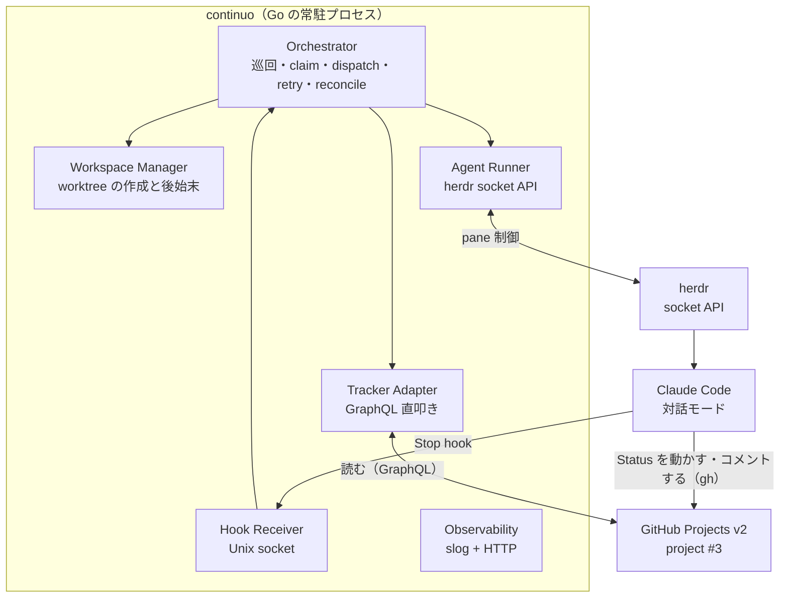
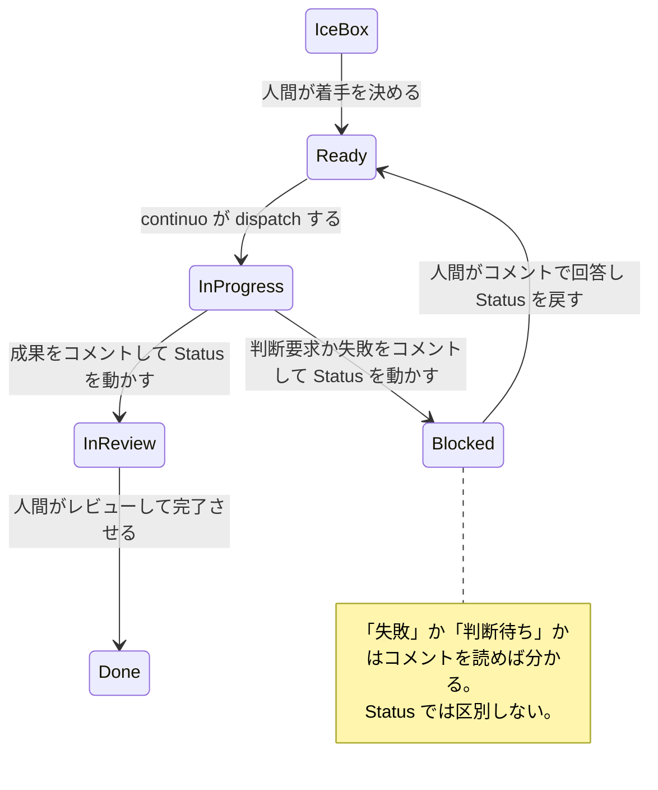

<!-- 目的: continuo（symphony 仕様準拠のタスクオーケストレーター、Go 実装）の具体設計 -->

# continuo の設計

最終更新: 2026-08-17

## この文書は何か

**`continuo` の設計を確定させるための文書である。**実装に着手する前に、人間の許可を得るための提示物でもある。

**`continuo` とは何か。**GitHub Projects v2 のボード1枚を見張り、`Ready` の issue ごとに worktree を用意し、herdr のペインで Claude Code を対話モードで起動して作業させ、完了までを面倒見る**常駐プロセス**である。Go で書く。名前は**通奏低音**（basso continuo）に由来する（[docs/naming.md](../naming.md)）。

**準拠する仕様は [openai/symphony](https://github.com/openai/symphony) の `SPEC.md`**（Apache-2.0、2312行。手元の写しは [docs/spec/symphony/SPEC.md](../spec/symphony/SPEC.md)）。

### この設計の入力になった先行調査

**2026-08-04 から 08-17 にかけて、既存のタスクオーケストレーターを選定し、そのうち [tomoasleep/herdr-symphony](https://github.com/tomoasleep/herdr-symphony) を実際に動かして完了検知の欠陥を特定した調査がある。**本文ではこれを**先行調査**と呼ぶ。herdr-symphony 自体は 2026-08-13 に不採用が確定している。

**先行調査の記録は別の非公開リポジトリにある。**この文書からは参照できないので、**必要な結論はすべてここに転記してある。**

**先行調査が出した要件は9つある。**本文ではこの短縮名で参照する。

| 短縮名 | 内容 | 根拠 |
| --- | --- | --- |
| **完了検知の3層を分ける** | 「作業が止まったか」「タスクが完了したか」「何をしたか」を混ぜない | `SPEC.md` 10.3 / 16.5 |
| **turn ループを持つ** | issue が active な限り同じセッションへ継続の指示を送り、上限で打ち切る | `SPEC.md` 7.1 / 16.5 / 6.4 |
| **完了の真実の源はトラッカー** | Status を動かすのはエージェント。orchestrator は読むだけ | `SPEC.md` 11.5 / 7.1 |
| **無反応を検知する** | 一定時間なにも起きなければ worker を止めてリトライを積む | `SPEC.md` 8.5 |
| **分類不能を作業中とみなさない** | 状態を判定できないことは「作業中」ではない。時間切れまで待たない | herdr の公開ドキュメント |
| **再起動時にトラッカーと整合を取る** | プロセスが落ちても「実行中」のまま取り残される issue を作らない | `SPEC.md` 14.3 |
| **成果と判断要求は issue のコメントに残す** | worktree も端末の画面も消えうる。コメントだけが確実に残る | `SPEC.md` 11.5 |
| **worktree と branch を本体が片付ける** | 使い終わったものが単調増加し、消すのが人間の仕事になっていた | 仕様に規定なし。運用上の必須要件 |
| **識別子の正規化を一元化する** | 設定ファイル側に文字を潰す回避策を書かせない | 仕様に規定なし |

---

## 1. 実機検証で確定したこと（2026-08-17）

****先行調査** が「設計に入る前に潰せ」としていた未確認事項を、実機で全部潰した。**

### 1-1. 検証の方法

**本リポジトリと `~/.claude/settings.json` を一切触らずに検証した。**scratchpad に使い捨ての git リポジトリを作り、そこから worktree を切って、その worktree の `.claude/settings.local.json` にフックを仕掛けた。**continuo の実運用と同じ形**（worktree ごとに settings.local.json を置く）である。

| 項目 | 値 |
| --- | --- |
| Claude Code | 2.1.233 |
| herdr | 0.8.0 |
| Go | 1.26.1 darwin/arm64 |
| 検証の置き場所 | scratchpad の使い捨て git リポジトリ + そこから切った worktree 2つ |
| 仕掛けたフック | `SessionStart` / `UserPromptSubmit` / `PreToolUse`(Task) / `PostToolUse`(Task) / `SubagentStart` / `SubagentStop` / `Stop` / `SessionEnd` / `Notification` |
| 観測方法 | 各フックが stdin の JSON をそのまま JSONL に追記する python スクリプト |
| 後始末 | ペイン close → `git worktree remove --force` → ディレクトリ削除。**完了済み** |

**生の観測記録は [tmp/continuo/hooks_probe_20260817.jsonl](../evidence/hooks_probe_20260817.jsonl) にある。`tmp/` は .gitignore 済みで消えうるため、要点はすべてこの文書に転記してある。**

### 1-2. 結論 — hooks は使える。端末表示の解析は不要になった

| 未確認だったこと | 結果 |
| --- | --- |
| **フックが実際に発火するか** | **発火する。**`SubagentStart` / `SubagentStop` / `Stop` の3つとも観測した |
| **`Stop` が、バックグラウンド処理が残った状態でも発火するか** | **発火する。**ただし**残っている処理が `background_tasks` に入って渡ってくる** |
| **`background_tasks` / `stop_hook_active` / `agent_transcript_path` は実在するか** | **3つとも実在した。**公式ドキュメントで裏が取れていなかったが、実機で確認できた |
| **worktree に置いた `.claude/settings.local.json` のフックが効くか** | **効く。**`.git` がディレクトリではなくファイル（gitdir 参照）である worktree でも効いた |

### 1-3. turn の終わりの判定基準が確定した

**`Stop` フックが発火し、かつ `background_tasks` が空配列であること。**これが turn の終わりである。

**観測した時系列（原文の抜粋）。**

```text
11:38:31.265  SessionStart
11:38:58.663  UserPromptSubmit        ← 人間（continuo）がプロンプトを送った
11:39:07.411  PreToolUse-Task
11:39:09.485  PostToolUse-Task
11:39:09.485  SubagentStart
11:39:11.415  Stop                      background_tasks=['subagent:running']   ← まだ終わっていない
11:39:24.808  SubagentStop              background_tasks=['subagent:running']
11:39:26.720  UserPromptSubmit        ← Claude Code が自動投入した <task-notification>
11:39:30.075  Stop                      background_tasks=[]                     ← 本当に終わった
11:40:13.288  UserPromptSubmit        ← continuo が次のプロンプトを送った
11:40:17.478  Stop                      background_tasks=['shell:running']      ← まだ終わっていない
11:41:01.313  UserPromptSubmit        ← Claude Code が自動投入した <task-notification>
11:41:03.455  Stop                      background_tasks=[]                     ← 本当に終わった
11:41:17.999  SessionStart            ← 2つ目の worktree で起動
```

**`background_tasks` の中身の原文。**

```json
[{"id": "a1f9f743842d397e1", "type": "subagent", "status": "running",
  "description": "ディレクトリ調査", "agent_type": "Explore"}]
```

```json
[{"id": "bmr1ksf9i", "type": "shell", "status": "running",
  "description": "45秒スリープをバックグラウンド実行", "command": "sleep 45"}]
```

**subagent（`"type": "subagent"`）もバックグラウンドの shell（`"type": "shell"`）も、同じ `background_tasks` に載る。**したがって片方だけを数える必要はない。

**これで **先行調査** の「画面内容で判定する」設計は不要になった。**herdr の判定ルール（manifest）を差し替える必要も無い。**端末表示の解析はフックが使えなくなった場合の代替として記録に残すだけとする。**

**`SubagentStart` と `SubagentStop` の差し引きも不要である。**`background_tasks` がその答えを直接持っている。**むしろ `SubagentStop` 時点の `background_tasks` には自分自身がまだ `running` として入っていた**（上の時系列の 11:39:24）。**差し引きを自前でやると間違える。`Stop` の `background_tasks` だけを見ること。**

### 1-4. フックに渡ってくる項目（実測）

**イベントごとに項目が違う。**以下は実際に渡ってきたものだけを列挙している。

| イベント | 渡ってきた項目 |
| --- | --- |
| `SessionStart` | `session_id` / `transcript_path` / `cwd` / `hook_event_name` / `source` / `model` |
| `UserPromptSubmit` | 上記 + `permission_mode` / `prompt` / `prompt_id`（`model` は無し） |
| `PreToolUse` | `session_id` / `transcript_path` / `cwd` / `hook_event_name` / `permission_mode` / `prompt_id` / `effort` / `tool_name` / `tool_input` / `tool_use_id` |
| `PostToolUse` | 上記 + `tool_response` / `duration_ms` |
| `SubagentStart` | `session_id` / `transcript_path` / `cwd` / `hook_event_name` / `prompt_id` / **`agent_id`** / **`agent_type`** |
| `SubagentStop` | 上記 + **`agent_transcript_path`** / `background_tasks` / `last_assistant_message` / `stop_hook_active` / `permission_mode` / `effort` / `session_crons` |
| `Stop` | `session_id` / `transcript_path` / `cwd` / `hook_event_name` / `prompt_id` / `permission_mode` / `effort` / **`background_tasks`** / **`last_assistant_message`** / **`stop_hook_active`** / `session_crons` |

**`Stop` の `last_assistant_message` に、そのターンの最終応答が丸ごと入る。**実測値の例:

```text
ファイル一覧: `.claude/`（内部に settings.local.json）、`.git`（worktree リンクファイル 175B）、
`README.md`（63B）、`sample.txt`（20B）
sample.txt の中身: `alpha` / `bravo` / `charlie` の3行（末尾改行あり、計20バイト）
探索は Explore エージェント1つで完了、通常ファイルは README.md と sample.txt のみです
```

**これは設計を1箇所変える。****先行調査** は、エージェントがコメントを残さずに止まった場合のフォールバックとして「会話ログから抽出 → 画面バッファを読む」という順序を定めていた。**`Stop` の `last_assistant_message` がその両方より上位の手段になる。**会話ログの直接パースは公式ドキュメントが禁じている（内部仕様でバージョン間で変わる）ので、**この項目が使えることの価値は大きい。**

### 1-5. フックの実行環境（実測）

**cwd は worktree のパスそのものだった。**環境変数も渡ってくる。

| 環境変数 | 実測値の例 | continuo にとっての意味 |
| --- | --- | --- |
| `CLAUDE_PROJECT_DIR` | worktree の絶対パス | **どの issue のセッションかを識別できる** |
| `CLAUDE_CODE_SESSION_ID` | `e042974e-…` | `SPEC.md` の `session_id` に相当するものとして使える |
| `CLAUDE_PID` | `41460` | プロセスの生存確認に使える |
| `CLAUDE_CODE_MESSAGING_SOCKET` | `/tmp/cc-socks/41460.sock` | **未解析。**外部から問い合わせられるかは不明。**設計の前提にしない** |
| `CLAUDE_ENV_FILE` | `~/.claude/session-env/<session_id>/sessionstart-hook-1.sh` | 未解析 |
| `CLAUDECODE` | `1` | — |

> **`CLAUDE_CODE_MESSAGING_SOCKET` を設計に取り込まない。**存在は観測したが、プロトコルも安定性も分かっていない。[未解析の仕組みを正として扱わない]という方針に従う。

### 1-6. 信頼確認プロンプトの扱い — 無人運用の最大の障害だった

**新しいディレクトリで Claude Code を起動すると、"Is this a project you created or one you trust?" という信頼確認で止まる。**キー入力を待つため、**無人運用ではここで全部止まる。**プランファイルにこの記述は無かった。

**実測した画面（原文）。**

```text
 Quick safety check: Is this a project you created or one you trust?
 ⚠ This folder pre-approves 9 tool permissions in .claude/settings.local.json:
   Bash(ls:*), Bash(cat:*), Bash(echo:*), Bash(sleep:*), Bash(pwd), Agent, Read,
 Glob, and 1 more
 ❯ 1. Yes, I trust this folder
   2. No, exit
```

**ここで分かったことが2つある。**

**1つ目。`.claude/settings.local.json` は信頼確認の前に読まれている。**「9個の権限を事前承認している」と画面が具体的に述べている。**設定が無視されているわけではない。**

**2つ目。信頼は worktree 単位ではなく git リポジトリ単位で記録される。**`~/.claude.json` の `projects` を検証の前後で比較したところ、登録されたのは**メインの作業ディレクトリ1件だけ**だった。worktree 2つはどちらも登録されていない。

```text
/…/scratchpad/hooks-probe/main -> hasTrustDialogAccepted = True
（wt-87 と wt-88 は projects に現れない）
```

**そして2つ目の worktree で起動したときは、信頼確認も権限の事前承認警告も出ずに、そのまま入力待ちになった。**

**これが continuo の設計に与える影響。**

| 内容 |
| --- |
| **リポジトリごとに1度だけ、人間がそのリポジトリで Claude Code を起動して信頼を承認しておけば、そこから切る worktree では確認が出ない** |
| **continuo は起動前に、対象リポジトリが信頼済みかを確認する仕組みを持つべきである。**未承認のリポジトリで起動すると無人運用が止まる |
| **`--dangerously-skip-permissions` は使わない。**信頼の承認は人間が1度やれば済む |

> **transcript の置き場所は worktree 単位だった。**`~/.claude/projects/` の下に worktree ごとのディレクトリができる。信頼はリポジトリ単位、transcript は worktree 単位で、**粒度が違う。**

### 1-7. subagent とバックグラウンド処理の完了は Claude Code が自分で拾う

**観測した事実。**subagent が終わると、Claude Code が自分自身に `<task-notification>` というプロンプトを自動投入する。バックグラウンドの shell が終わったときも同じだった。

```text
11:39:24.808  SubagentStop
11:39:26.720  UserPromptSubmit   prompt = <task-notification><task-id>a1f9f743842d397e1</task-id>…<status>completed</status>…
11:39:30.075  Stop               background_tasks=[]
```

**したがって continuo は、subagent の完了を待つために追加のプロンプトを送る必要が無い。**待っていれば `background_tasks` が空の `Stop` が来る。**これは turn の消費を無駄に増やさないという点で重要である。**

### 1-8. 検証で残した痕跡

| 痕跡 | 扱い |
| --- | --- |
| `~/.claude.json` の `projects` に、使い捨てリポジトリのエントリが1件残った | **消していない。**このファイルの書き換えはリスクがあるため人間の判断を仰ぐ。ディレクトリ自体は削除済みなので無害である |
| `~/.claude/projects/` に transcript のディレクトリが2件できた | **消さない。**[CLAUDE.md の絶対制約](../../CLAUDE.md)（`~/.claude/projects/` 配下を消さない）に従う |
| 本リポジトリの `.claude/settings.local.json` | **触っていない。**`{}` のまま。確認済み |
| 本リポジトリの git worktree | **増やしていない。**確認済み |
| herdr のペイン | **検証用の2つとも close 済み。**元の構成に戻ったことを確認済み |

---

## 2. 調査で確定した外部の事実（2026-08-17）

**設計の前に、continuo が乗る3つの外部システムを実測した。**設計判断はすべてここから導かれる。

### 2-1. herdr の socket API

| 分かったこと | 設計への影響 |
| --- | --- |
| **Unix domain socket + 改行区切り JSON。認証もハンドシェイクも無い。**JSON-RPC 2.0 ではない。リクエストは `{id, method, params}` の3つとも必須で、`id` は文字列必須、`params` は空でも `{}` が要る | Go の `net.Dial("unix")` + `encoding/json` で足りる。ライブラリ追加ゼロ |
| socket のパスは環境変数 `HERDR_SOCKET_PATH` で pane 内のプロセスに注入される。既定は `~/.config/herdr/herdr.sock` | continuo は環境変数を最優先で読む。socket の探索ロジックを自前で持たない |
| **1コネクション = 1リクエスト。**応答を1行返した直後にサーバがコネクションを閉じる | コネクションプールを作れない。RPC は毎回 connect し直す |
| **`events.subscribe` だけが長寿命ストリーム。**ただし接続時に過去の event を再生し、配信が毎秒 9〜10 件に律速される | **`pane.updated` と `pane.scroll_changed` を購読してはいけない**（追いつかない）。`session.snapshot` で現在状態を確定させてから、低頻度の event だけ購読する |
| **`events.wait` は agent の状態変化しか受け付けない。**schema には19種の待機条件が定義されているが、他を投げると拒否される | schema を鵜呑みにしてコード生成すると実行時に落ちる |
| **agent 名は `^[a-z][a-z0-9_-]{0,31}$` に限定される。**issue の URL は入らない | ****先行調査** の「ペイン名を issue の URL にする」は成立しない。**設計を差し替える（2-4 と 3-3） |
| agent の状態は `idle` / `working` / `blocked` / `done` / `unknown` の5値。**`done` は「idle だが、その tab がまだ人間に見られていない」**という意味で、CLI や API で読んでも「見た」ことにならない | **continuo は tab をフォーカスしないので、実運用ではほぼ常に `done` 側になる。**完了検知は `idle` と `done` の両方を受理する。`unknown` は完了ではない |
| **`worktree.remove` は branch を消さない。**引数は path でも branch でもなく `workspace_id` である | **branch の後始末は continuo が `git branch -D` を自分で叩く**（worktree と branch を本体が片付ける） |
| **`pane.report_agent` で、実プロセスを起動せずに任意の pane を「agent が居る pane」として登録できる** | **統合テストで実際に Claude Code を起動せずに状態遷移を再現できる。**テストのコストが劇的に下がる |
| pane の `agent_session` から **Claude Code のセッション UUID が取れる** | hooks が渡す `session_id` と突き合わせられる（3-2 の要） |

### 2-2. GitHub Projects v2

| 分かったこと | 設計への影響 |
| --- | --- |
| **`gh project item-list --limit 100` は1回で 102 point を消費する。**GraphQL を手書きすれば同じ内容が 1 point。上限は 5,000 point/時 | **`gh project` サブコマンドを本体で使ってはいけない。**30秒間隔だと上限の2.4倍を消費して破綻する。**GraphQL を直接叩く** |
| `ProjectV2.items(query:)` のサーバ側フィルタ1本で、Status 指定・複数 Status の OR・所属リポジトリ・カスタムフィールドまで1リクエストで取れる | 巡回は1リクエストで済む。Status ごとに分ける必要が無い |
| **選択肢名を間違えると、エラーを出さずに 0 件を返す** | **これが最大の落とし穴。**人間が UI で Status を改名すると、continuo は無言で「対象0件」と判断し続けキューが永久に止まる。**起動時に選択肢名を照合して、合わなければ起動を止める** |
| item は node ID で直接取り直せる（1 point）。Status の値そのものが `createdAt` / `updatedAt` を持つ | 実行中 issue の再取得はボード全体を舐め直さずに済む。「In Progress のまま N 分動いていない」をボードの値だけで判定できる |
| `content.repository.nameWithOwner` と `defaultBranchRef.name` が同じリクエストで取れる | **作業ディレクトリの決定に必要な情報が巡回1回で揃う** |
| draft issue は `type: DRAFT_ISSUE` で現れ、**repository を持たない** | **type が ISSUE でない item は明示的にスキップしてログに残す。**拾うと dispatch が原因不明で失敗し続ける |
| エージェントが `gh issue comment` で書いたコメントは、**author が人間のアカウントになり、人間が手で書いたものと区別できない** | **コメント本文の先頭に固定マーカーを書かせて判別する。**さもないと turn ループの継続指示にエージェント自身の出力が混入する |
| Status 更新は `gh project item-edit 3 --owner maimuzo --url <issue URL> --field "Status" --value "In Review"` の形で書ける。**node ID を1つも埋め込まなくてよい**（gh 2.97.0 以降） | **プロンプトに埋め込むのは issue の URL だけでよい。**project ID / field ID / option ID を事前解決する処理が丸ごと不要になる |

### 2-3. project #3 の実測構成 — 過去の記録と食い違っている

****先行調査** の記載は現状と合っていない。訂正する。**

| 項目 | プランファイルの記載 | 2026-08-17 の実測 |
| --- | --- | --- |
| Status の選択肢 | Backlog / Blocked を含む | **`Ice Box` / `Ready` / `In Progress` / `In Review` / `Done` の5つ。`Backlog` も `Blocked` も存在しない** |
| item 数 | 98件 | **104件** |
| リポジトリ数 | 8 | **5** |
| Priority | — | **P0〜P3 の4択が定義されているが、104件すべて未設定** |
| Ready の件数 | — | **0件** |
| Status 未設定の item | — | **4件**（どの Status フィルタにも一致せず放置される） |

**ここから2つの論点が出る。どちらも人間の判断が要る**（第4節）。

1. **失敗状態を置く Status が無い。**`Blocked` が存在しない
2. **Priority が全件未設定なので、順序づけが機能しない。**ボードの並び順に落ちる

### 2-4. Claude Code の hooks（第1節の実測に加えて分かったこと）

| 分かったこと | 設計への影響 |
| --- | --- |
| **信頼していないフォルダでは hook が保留される。**`~/.claude/settings.json` に置いたものも含む | **continuo の turn 終了検知が1つも動かない状態が起こりうる。**起動前の検査に「対象リポジトリが信頼登録されているか」を入れる（3-6） |
| hooks は settings の階層をまたいでマージされ、**実行中のセッションにもファイル監視で再読み込みされる** | worktree ごとに hook を書き換える運用が成立する |
| hook の設定を外部から問い合わせる CLI は無い（`claude hooks` は存在しない） | continuo 自身が「書いた設定が効いているか」を確かめる手段は、**実際に hook が飛んでくるかどうかだけ**である |
| **`background_tasks` は「タスクレジストリに到達できるとき」存在する。**到達できない場合に項目が無い可能性が原文に残されている | **`background_tasks` が欠けている `Stop` を「空配列」と同一視してはいけない。**欠けていたら判定不能として扱う |
| `Stop` は人間の中断では発火せず、API エラーでは別のイベントに振り替わる | **`Stop` だけを張ると取りこぼす。**無反応の検知を併用する |

### 2-5. Go の実装スタック

**外部依存は YAML パーサ1本だけにできる。**残りは標準ライブラリで足りる。

| 用途 | 決定 | 理由 |
| --- | --- | --- |
| YAML front matter | **`github.com/goccy/go-yaml`（MIT、依存ゼロ）を使う** | `gopkg.in/yaml.v3` はリポジトリが archive 済みで更新が止まっている。goccy はエラーに行・桁・ソース抜粋を出すので、`SPEC.md` 6.2 が要求する「オペレータに見えるエラー」を自前の整形コードなしで満たせる |
| front matter の切り出し | **ライブラリを使わない。**標準の `strings` / `bytes` で足りる | 15行程度で書ける。`SPEC.md` 5.5 のエラー分類を自前の関数境界に対応づけられる |
| テンプレート | **`text/template` + `Option("missingkey=error")`** | `SPEC.md` 5.4 の *"Unknown variables MUST fail rendering"*（**訳:** 未知の変数はレンダリングを失敗させなければならない）を満たせることを実測で確認済み |
| — その穴 | **`index` 組み込み関数だけ素通りする。`Funcs` で上書きして塞ぐ** | テンプレート構築を1つのコンストラクタに閉じ込め、そこ以外で `template.New` を呼ばせない |
| — 入力の型 | **`map[string]any` に固定する** | struct にすると `text/template` が struct tag を見ないため `{{.issue.title}}` のような小文字表記が書けなくなる |
| SQLite | **使わない** | `SPEC.md` 14.3 が scheduler の状態を意図的に in-memory と定めている。turn 数・リトライ回数は Go の struct で持つ |
| ファイル監視 | **fsnotify を使わない。`stat` + 内容ハッシュで足りる** | `SPEC.md` 6.2 が「監視が取りこぼした場合に備えて防御的に再検証せよ」と要求しているので、どのみちこの処理は要る。4KB のファイルで1回 18.5µs |
| 構造化ログ | **標準の `log/slog`（TextHandler）** | `SPEC.md` 13.1 の `key=value` 形式と必須項目の付与をそのまま満たす |
| HTTP サーバ | **標準の `net/http`** | Go 1.22 以降の `ServeMux` で `SPEC.md` 13.7 を router なしで書ける。**ルートは `GET /{$}` と書く**（`GET /` だと前方一致の catch-all になり存在しないパスに 200 を返す） |
| CLI | **標準の `flag`** | 必要なフラグは `--port` だけ。**ただし位置引数のあとのフラグを `flag` が黙って無視するので、残余引数の検査を自前で入れる** |
| テスト | **標準の `testing`。`testing/synctest` で poll loop と backoff を実時間ゼロで検証する** | 時計の抽象化インタフェースを自前で作る必要がない |

**この構成で macOS から Linux 向けに `CGO_ENABLED=0` の static binary をクロスコンパイルできることを実測済み。**cgo を要求する依存を1本でも入れるとこれが崩れる。

---

## 3. 設計

### 3-1. 全体構成



**矢印の向きが設計の要である。**continuo はボードを**読むだけ**で、Status を動かすのはエージェント自身である（`SPEC.md` 11.5）。

### 3-2. 判断1 — turn の終わりは hooks から continuo へ直接通知させる

**これが設計の中心である。**

**採る形。**worktree を作るときに `.claude/settings.local.json` を書き込み、`Stop` フックから continuo 自身を呼ばせる。

```json
{
  "hooks": {
    "Stop": [{ "hooks": [{ "type": "command",
      "command": "continuo hook --socket /path/to/continuo.sock --run <run_id>" }] }],
    "SessionStart": [{ "hooks": [{ "type": "command",
      "command": "continuo hook --socket /path/to/continuo.sock --run <run_id>" }] }]
  }
}
```

`continuo hook` は**標準入力の JSON をそのまま socket へ転送して終了するだけ**の薄いサブコマンドである。continuo 本体がそれを受けて状態機械を進める。

**なぜこの形か。**

| | hooks から continuo へ直通（採用） | herdr の `agent_status` を見る（不採用） | 画面の内容を読む（不採用） |
| --- | --- | --- | --- |
| 何に依存するか | **hook の JSON スキーマだけ** | herdr の画面検出ルール（正規表現の集合） | Claude Code の画面表示 |
| subagent 待ちを completed と誤判定するか | **しない。**`background_tasks` に入っている | **する**（作者自身が公開記事で報告している） | 進捗行のパターン次第 |
| 成果の中身が取れるか | **取れる**（`last_assistant_message`） | 取れない | 画面バッファから部分的に |
| Claude Code の更新で壊れるか | hook のスキーマが変われば壊れる | **画面表示が変わると壊れる**（manifest のコメントに前例が記録されている） | **同上** |
| 実測で確認したか | **した**（第1節） | 誤判定の存在を作者が報告 | 進捗行で区別できることは確認したが、肝心の誤判定状態を再現できていない |

**判定の規則。**

```text
Stop フックを受け取ったとき:
  background_tasks の項目が欠けている
    → 判定不能。turn の終わりとみなさない（連続したら stall 検知へ）
  background_tasks が空でない
    → まだ動いている。何もしない
  background_tasks が空配列
    → turn が終わった。トラッカーを見に行く
```

**herdr の `agent_status` はフォールバックとして残す。**hook が飛んでこないまま stall 検知の閾値を超えたとき、`agent_status` を見て「pane が消えたのか、エージェントが固まったのか」を切り分ける。

> ****先行調査** の「画面の内容で判定する」設計は撤回する。**herdr の判定ルール（manifest）を差し替える案も不要になった。

### 3-3. 判断2 — 走行を指す識別子を、消えない3箇所に書く

**herdr-symphony の失敗の根は「走行中のエージェントを指す唯一の識別子が RAM 上の pane ID だけ」だったことである。**そこから多重起動の防止・再起動時の復元・キャンセル・後片付けが**同時に**成立しなくなっていた。

**どこに書けるかを実測で洗った結果、herdr の保存先には信頼できるものとできないものがある。**

| 書ける場所 | herdr サーバの再起動をまたぐか | 他の使い手に壊されるか | 長さの制限 |
| --- | --- | --- | --- |
| **pane の label** | **残る** | 上書きは可能だが層構造は無い | **観測されず**（65536文字が無傷で往復した） |
| **pane の cwd** | **残る** | 変わらない | — |
| **workspace ID / tab ID / pane ID** | **残る** | 変わらない | — |
| pane の metadata の tokens | **消える** | **壊される。**キーは pane 全体で1スロットしかなく、別の使い手が同じキーを書くと前の値が失われる。しかもその使い手の TTL が切れるとキーごと消滅し、元の値は復活しない | **80文字で無言で切られる**（エラーにならない） |
| pane の title / state_labels | **消える** | 使い手ごとの層になっており、上の層が失効すると下が復活する | — |
| pane を作るときに渡した環境変数 | **消える** | — | **そもそも herdr の API から読み戻せない** |
| agent 名 | **残らない**（再起動後に生きている agent へ自動では戻らない） | 重複は拒否される | **32文字**（`^[a-z][a-z0-9_-]{0,31}$`） |

**したがって continuo は、次の3本立てで走行を識別する。**

| # | 何を | どこに | 何のために |
| --- | --- | --- | --- |
| 1 | **issue の URL** | **pane の label** | **再起動後の復元の主キー。**長さ制限が無く、herdr の再起動をまたいで残る唯一の自由文字列である |
| 2 | **worktree のパスに issue 番号を含める** | **pane の cwd** | **label と独立した第2の経路。**`worktree.create` の path 指定が効くことを実測で確認したので、continuo が置き場所を決め打ちできる |
| 3 | **Claude Code のセッション UUID を continuo が先に決める**（`--session-id`） | 起動引数と continuo の in-memory 状態 | **hook から届く通知がどの run のものかを、hook 側に何も書かせずに判別できる** |

**metadata の tokens は「起動後に自分で貼り直す揮発キャッシュ」として扱う。**復元の根拠にしない。書くときはキーに `continuo_` の接頭辞を付け、**値が80文字を超えないことを continuo 側で検査する**（超えても herdr はエラーを返さず黙って切る）。

**agent 名は「人間が端末で見分けるためのもの」に役割を限定する。**`^[a-z][a-z0-9_-]{0,31}$` に収まる派生名（例: `continuo-yukikaki-87`）を使い、**名前から元の issue を復元しようとしない。**

> ****先行調査** の「ペイン名を issue の URL にし、turn 数も書き足す」は撤回する。**agent 名に URL は入らず、turn 数を書き足す先（tokens）は再起動で消えることを実測で確認した。**turn 数の復元は諦める**（`SPEC.md` 14.3 も *"It does not mean retry timers, running sessions, or live worker state survive process restart."* — **訳:** リトライのタイマー、実行中のセッション、稼働中の worker の状態がプロセスの再起動を生き延びることを意味しない — と明記している）。

### 3-4. 判断3 — 状態は in-memory。永続化層を作らない

`SPEC.md` 14.3 に従い、**scheduler の状態は意図的に in-memory にする。**SQLite も JSON ファイルも作らない。

**再起動時の復元手順。**

```text
1. トラッカーから running_state（In Progress）の item を全部取る
2. herdr から pane と agent の一覧を取る
3. pane の label / metadata / cwd から issue を逆引きし、item と突き合わせる
4. 突き合わせが付いた   → その run を引き継ぐ（turn 数は復元できないので 1 から数え直す）
5. 突き合わせが付かない → 設定に従って dispatch_state（Ready）へ戻すか failure_state へ落とす。
                          どちらに倒したかを必ずログに残す（再起動時にトラッカーと整合を取る）
```

**turn 数が復元できない点は受け入れる。**`SPEC.md` 14.3 が *"It does not mean retry timers, running sessions, or live worker state survive process restart."*（**訳:** リトライのタイマー、実行中のセッション、稼働中の worker の状態がプロセスの再起動を生き延びることを意味しない）と明記している。

### 3-5. 判断4 — 完了検知の3層（完了検知の3層を分ける）

| 層 | 何で知るか | 誰が発生させるか |
| --- | --- | --- |
| **turn が終わったか** | **`Stop` フック + `background_tasks` が空** | **Claude Code の実行基盤**（機械的） |
| **タスクが完了したか** | **ボードの Status が active でなくなったこと** | エージェント |
| **何をしたか** | **issue のコメント。**取れなければ `Stop` の `last_assistant_message` | エージェント |

**3つを混ぜない。**turn が終わっただけでは完了ではない。トラッカーを見に行く契機にすぎない。

**成果のフォールバックの順序が変わった。****先行調査** は「会話ログから抽出 → 画面バッファを読む」としていたが、**`Stop` の `last_assistant_message` がその両方より上位になる。**会話ログの直接パースは公式ドキュメントが禁じている（内部仕様でバージョン間で変わる）。

### 3-6. 判断5 — 起動時の検査を厚くする

**無言で止まる経路が多いので、起動時に全部潰す。**1つでも失敗したら起動を止める。

| 検査 | なぜ必要か |
| --- | --- |
| **Status の選択肢名が設定と一致するか** | **合わないと GraphQL がエラーを出さずに 0 件を返し、キューが永久に止まる** |
| `gh` のバージョンが 2.97.0 以上か | エージェントに実行させる `gh project item-edit` の名前指定形が使えない |
| `gh auth status` の scope に project が含まれるか | ボードを読めない |
| **対象リポジトリが Claude Code に信頼登録されているか** | **信頼していないフォルダでは hook が1つも動かない。**turn 終了検知が全滅する |
| herdr の socket に到達でき、protocol が想定内か | 通信できない |
| **設定ファイルの未知キーと不正値** | 書いたつもりの設定が効いていないことに気づけない |

### 3-7. 判断6 — 識別子の正規化を型で強制する（識別子の正規化を一元化する）

**「外部へ渡す名前を作る関数」を1本だけ用意し、その戻り値の型でしか外部コマンドへ渡せないようにする。**

```go
// 正規化を通った名前だけがこの型になる。外部コマンドの引数はこの型しか受けない。
type SafeName string

func Normalize(raw string) (SafeName, []Warning)
```

**利用者がテンプレートで branch 名を書いた場合も、展開結果を必ずこの関数に通す。**herdr-symphony はここで正規化を迂回する経路があり、コロンを含む識別子で失敗していた。

**正規化で情報が落ちる場合（非 ASCII が全部潰れて issue 番号しか残らない等）は警告として記録する。黙って別名にしない。**

### 3-8. 判断7 — turn ループ（turn ループを持つ）

`SPEC.md` 7.1 / 16.5 に従う。

```text
1 回目の turn : 完全なタスクプロンプト（issue の本文・既存コメント・gh のコマンド・完了の作法）
2 回目以降    : 継続の指示のみ。原文は送り直さない
                「この確認は n 回目です。あと m 回で打ち切ります」を必ず入れる
打ち切り      : max_turns（既定 20）に達したら failure_state へ落とす。
                時間切れ（turn timeout）とは別の終了理由として記録する
正常終了後    : 約1秒の continuation retry を挟んで issue がまだ active かを再確認する
```

**残り回数を伝える理由。**書かないと、打ち切りがエージェントにとって予測不能な突然死になる。伝えれば締めに向かう判断ができる。

### 3-9. 判断8 — worktree と branch の後始末（worktree と branch を本体が片付ける）

| 手順 | 内容 |
| --- | --- |
| 1 | issue が active でなくなった時点で片付けを始める |
| 2 | **コミットされていない変更が残っていないか確認する。**残っていれば消さずに警告として記録し、issue のコメントに残す |
| 3 | `worktree.remove` を herdr の socket API 経由で呼ぶ。**引数は path でも branch でもなく workspace の ID である**（実測） |
| — その制約 | **herdr が workspace として開いていない worktree は、この API では消せない。**continuo が worktree だけ作って workspace を閉じてしまうと片付けられなくなる。**workspace を閉じるのは worktree を消したあとにする** |
| 4 | **branch は herdr が消さないので、continuo が `git branch -D` を自分で叩く**（実測） |
| 5 | 設定で片付け全体を無効にできるようにする（デバッグ時に中身を見たい場合がある） |
| 6 | 起動時に、実行中でない worktree が残っていれば一覧できるようにする |

**削除に失敗しても turn ループや dispatch を止めない。**

### 3-10. 判断9 — 実行中の Status も「作業中の状態」に含める

**これは設計の急所である。見落とすと、continuo は dispatch した直後に自分の worker を殺す。**

`SPEC.md` 8.5 Part B（行 831-839）は、実行中の issue について毎巡回で次の判定をすると定めている。

> - If tracker state is terminal: terminate worker and clean workspace.
> - If tracker state is still active and routable: update the in-memory issue snapshot.
> - **If tracker state is neither active nor terminal: terminate worker without workspace cleanup.**

**訳:** トラッカーの状態が terminal なら worker を止めて workspace を掃除する。まだ active で routable なら手元の issue のスナップショットを更新する。**active でも terminal でもないなら、workspace を掃除せずに worker を止める。**

**continuo は dispatch のときに Status を `In Progress` へ動かす。**このとき「作業中の状態」を `Ready` だけにしておくと、**`In Progress` は active でも terminal でもない**ことになり、次の巡回で自分が起動した worker を必ず終了させる。

**したがって「作業中の状態」に `Ready` と `In Progress` の両方を入れる。**

```yaml
active_states: ["Ready", "In Progress"]
terminal_states: ["Done"]
```

**「では同じ issue を二重に dispatch しないのか」という懸念には、仕様が別の答えを用意している。**`SPEC.md` 7.4（行 728）は *"`claimed` and `running` checks are REQUIRED before launching any worker."*（**訳:** どの worker を起動する前にも `claimed` と `running` の検査が REQUIRED である）と定めている。**重複の防止は状態の絞り込みではなく claim で行う。**

**この設計にすると、再起動時のトラッカーとの整合が自動的に解ける。**再起動後、`In Progress` の issue は候補に上がる。claim は in-memory なので消えている。したがって保存済みの worktree を再利用して再 dispatch される。**特別な復旧処理を書かなくてよい。**

> **herdr-symphony の運用では「作業中の状態」を `Ready` だけにしていた。**この設定を引き継いではならない。

**`In Review` と `Blocked` は terminal に入れない。**入れると、その時点で worktree が消えて「人間が回答して `Ready` へ戻し、作業成果を引き継いで再開する」経路（成果と判断要求は issue のコメントに残す）が壊れる。**worktree を消す契機は独立した設定で持つ**（3-9）。

### 3-11. 判断10 — 無人運用で人間の入力を待つ箇所を全部潰す

**キー入力を待つ画面が1つでも出れば、その issue は永久に止まる。**調査で9種類が見つかった。**そのうち continuo が必ず手を打つべきものは4つである。**

| 止まる箇所 | 打つ手 |
| --- | --- |
| **権限の確認** | **`--permission-mode dontAsk` で起動する。**公式ドキュメントが *"the session never waits for input"*（**訳:** そのセッションは決して入力を待たない）と書いている唯一のモードである。**`--dangerously-skip-permissions` は使わない** |
| — なぜ `auto` では駄目か | **`auto` は判定器が3回連続または通算20回ブロックすると、確認を求める方式に戻る。**閾値は設定できない。**利用者の `~/.claude/settings.json` は現在 `auto` になっているので、continuo は起動フラグで必ず上書きする** |
| **フォルダの信頼確認** | **リポジトリごとに人間が1度だけ承認しておく。**continuo は起動時に「承認済みか」を `~/.claude.json` から**読み取って**検査し、未承認なら dispatch しない。**書き換えはしない**（4-3 で実測により決着） |
| **レートリミット** | **`CLAUDE_CODE_RETRY_WATCHDOG=1` を環境変数で渡す。**公式ドキュメントが「リセット時刻まで待って自動的に再開する」と書いている。**これが「枠回復で自動再開」を Claude Code 側で実現する唯一の公式手段である** |
| — その副作用 | **待っている間 pane は生きたままである。**continuo の stall 検知がこれを異常とみなして殺さないよう、レートリミットで待機中であることを別途判定する必要がある |
| **`claude --worktree` の終了時プロンプト** | **`--worktree` を使わない。**continuo が自分で worktree を作り、そのディレクトリを cwd にして起動する |

**`dontAsk` は「許可リストに無いものは全部拒否」である。**したがって `permissions.allow` の作り込みが品質を決める。最低限 `"Bash(gh:*)"` と `"Bash(git:*)"` が要る。**パイプや `&&` で連結したコマンドは各要素が個別に許可されていないと通らない**ので、粒度を細かくしすぎると詰まる。

**止まりはしないが黙って壊れるものもある。**信頼していないフォルダでは、subagent の frontmatter に書いた hook、プラグイン、追加のマーケットプレースが**ダイアログも出さずに無効化される。**信頼の事前登録はここでも効く。

### 3-12. 判断11 — hook をどう届けるか

**2つの経路がある。**

| | worktree に `.claude/settings.local.json` を置く | **`--settings` で外部のファイルを指す** |
| --- | --- | --- |
| worktree が汚れるか | **汚れる。**`.gitignore` の手当てと、削除前に消す手間が要る | **汚れない** |
| issue ごとに書き分けが要るか | 要る | **要らない。**pane を作るときに環境変数で issue を渡せば、hook スクリプトは1本で済む |
| 実測したか | **した**（第1節。効くことを確認済み） | **していない** |

**`--settings` の経路を第一候補にする。**worktree に continuo の痕跡を残さない方針（worktree と branch を本体が片付ける / 識別子の正規化を一元化する）と一致する。**ただし未検証なので、実装の最初に確かめる。**効かなければ実測済みの経路へ倒す。

**hook スクリプトに issue を教える手段。**pane を作るときの環境変数で `CONTINUO_RUN_ID` と `CONTINUO_SOCKET` を渡す。**環境変数は herdr の API から読み戻せない**ので復元の鍵にはできないが、pane の中のプロセスからは見える。

### 3-13. 判断12 — トラッカーの値をどう正規化するか

| 項目 | 決定 | 理由 |
| --- | --- | --- |
| **issue の一意な名前** | **`<owner>/<repo>#<番号>`**（例 `maimuzo/koetsumugi#188`） | 1枚のボードに5リポジトリが載るので `#188` だけでは一意でない。`SPEC.md` 4.1.1 は名前空間をまたぐ場合の曖昧さ解消を MUST としている |
| **dispatch に使う ID** | **project item の ID** | `SPEC.md` 4.1.1 が *"It MAY be a project-item or board-entry ID instead of the provider's underlying ticket ID."`（**訳:** プロバイダ本来のチケット ID ではなく、project item や board entry の ID であってもよい）と明示的に許している |
| **Priority の写像** | **`P0→1` / `P1→2` / `P2→3` / `P3→4`** | `SPEC.md` 8.2 は `1..4` を最優先バケットとする。**素直に数字を抜くと `P0` が `0` になり、「1..4 以外」として最後に回る。**最優先の issue が最後に実行される |
| **draft issue** | **明示的にスキップしてログに残す** | リポジトリを持たないので作業ディレクトリを決められない。拾うと原因不明で dispatch が失敗し続ける |
| **Status 未設定の item**（実測で4件ある） | **一覧の取得では省略してログに残す。ID 指定の取り直しではエラーにする** | `SPEC.md` 11.1 が「一覧は SHOULD で省略、ID 指定は MUST で失敗」と分けている。**勝手に既定値へ読み替えてはならない**（`SPEC.md` 11.3） |
| **Status の大文字小文字** | **比較は大文字小文字を無視する。表示はボードの綴りをそのまま保つ** | `SPEC.md` 5.3.1 / 11.3 |

### 3-14. 判断13 — turn の数え方

**continuo 自身がプロンプトを送った回数だけを数える。**

**理由。**Claude Code は subagent やバックグラウンドの処理が終わると、**自分自身に `<task-notification>` を投入する**（第1節 1-7 の実測）。これは新しい turn として現れるが、**continuo が送ったものではない。**hook が渡す turn の識別子で数えると、`max_turns` に不当に早く到達する。

**したがって `SPEC.md` 4.1.6 の `turn_count` は、continuo の送信回数で数える。**hook が渡す識別子はログの相関づけにのみ使う。

**これは **先行調査** の要件「エージェントへの追加のプロンプト送信は、すべて turn の消費として扱う」の正しい読み方を確定させる。**「エージェントへの」ではなく「**continuo からの**」送信を数える。

### 3-15. 取得できないもの — トークンの計上

**`SPEC.md` 13.5 が定めるトークンの計上は、hooks からは取れない。**`Stop` のペイロードにトークン関連の項目が1つも無いことを実測で確認した。

**満たせなくなる仕様の要求を名指しする。**

| 仕様の箇所 | 内容 |
| --- | --- |
| 4.1.6 / 4.1.8 | セッションごと・全体のトークン集計 |
| 13.3 | 実行時スナップショットの `codex_totals` |
| 13.7.2 | HTTP API の `codex_totals` |
| 17.6 | 「トークンとレートリミットの集計が正しく保たれること」のテスト |

**代替の経路が1つある。**Claude Code の statusline に渡されるデータに、コンテキスト使用量とレートリミットの情報が含まれている。**ただし未検証なので、設計上は「取れないもの」として扱い、取れたら足す。**

**レートリミットの値そのものは、OAuth の usage API を直接叩けば取れる。**これはエージェントに依存しないので、statusline が使えなくても動く。`SPEC.md` 8.4 の指数バックオフではなく、**リセット時刻までの固定待ち**にする。

---

## 4. 人間が決めたこと（2026-08-17）

### 4-1. Status の構成 — `Ice Box` を未着手の置き場にし、`Blocked` を足す

**人間の決定。**

| 決定 | 内容 |
| --- | --- |
| **`Ice Box` の位置づけ** | **未着手の置き場として使う**（かつて `Backlog` と呼んでいたものの代わり） |
| **`Blocked`** | **Status の選択肢に追加する** |

**追加は人間が GitHub の画面から行う必要がある。continuo も AI も API で追加してはならない。**

**理由。**`updateProjectV2Field` の選択肢の指定は**全件置き換え**として扱われる。1つ足すだけでも、GitHub 側が全部の選択肢に**新しい ID を採番し直す。**その結果、item が参照していた古い ID が無効になり、**設定済みの Status が全部 `null` に落ちる。**2026-08-10 に使い捨ての project で実測されている。

**project #3 は104件中100件に Status が入っている。**API で追加すれば、その100件が消える。

**追加後の状態遷移。**



**worktree を消す契機は `Done` だけにする。**`In Review` と `Blocked` では消さない。消すと、人間が回答して `Ready` へ戻したときに作業成果が失われる。

### 4-2. 実行順序 — ボードの並び順は使えるが、ボードの設定変更が前提になる

**人間の決定。**

> ボードの並び順で良い。ただし、**ボードの並び順を AI が変更でき、GitHub のポイントも問題なさそうな場合に限る。**

**この2つの条件を調べた結果、どちらも満たされる。ただし別の障害が見つかった。**

#### 条件は両方とも満たされる

| 条件 | 結果 |
| --- | --- |
| **並び順を機械的に書き換えられるか** | **できる。**`updateProjectV2ItemPosition` という mutation が実在する。引数は project の ID・item の ID・「どの item の直後に置くか」の3つだけで、3つ目を省略すると先頭へ移る。**ただし `gh` にサブコマンドは無いので GraphQL を手書きする** |
| **コストは収まるか** | **収まる。**読み取りは104件相当を1リクエスト1 point で実測した。書き込みも1件1 point の計算で、104件を全部並べ替えても1時間あたりの上限 5,000 point の約2%である。continuo の巡回（30秒間隔で毎時240 point）と合算しても7%に届かない |
| — ただし | **変更を伴うリクエストの間は最低1秒空けることが求められている。**104件の全並べ替えに約2分かかる。日に数回の一括反映なら問題にならないが、**issue が更新されるたびに並べ替える設計は避ける** |

> **mutation は実際には実行していない。**schema と公式ドキュメントで確認しただけである。**書き込みコストの1 point も導出であって実測ではない。**仮に5 point でも104件で520 point（10.4%）なので結論は変わらない。

#### 見つかった障害 — いまのボードでは人間がドラッグで並べ替えられない

**project #3 の board view は2枚あり、どちらも Priority で sort が設定されている。**GitHub の仕様として、**sort されている board では column 内の item を手でドラッグして並べ替えられない。**

**つまり、いまのままでは「人間がボードで順序を決める」という操作そのものができない。**

**しかも Priority は104件すべて未設定である。**sort の基準になる値が空なので、**Priority による整列は実質的に効いていない。**

#### あわせて分かったこと

| # | 内容 |
| --- | --- |
| 1 | **並び順は project 全体で1本しかない。**view ごとには存在せず、view の sort 設定は API が返す順序に一切反映されない。**したがって continuo が「どの view の順序を見るか」を設定で持つ必要は無い** |
| 2 | **position は数値として読めない。**取得できるのは「並んだ順」だけである。「この item は何番目か」を知るには全件を読んで自分で数えるしかない |

#### 採る案

**Priority を粗い区分として使い、同じ Priority の中の細かい順序を並び順で決める。**

continuo は `status:Ready` で絞った item を並び順つきで1リクエストで読み、**Priority を第1のキー、並び順を第2のキー**にして自前で整列する。

**この案なら、いまのボードの設定を変えなくても動く。**Priority が全件未設定の現状では、実質的に並び順だけで決まる。

### 4-5. 判断をお願いしたいこと — board view の sort を外すか

**いまのままでも continuo は動く。**この判断は「人間がボードのカードをドラッグして順序を決めたいか」にだけ関わる。

| 案 | 内容 | 失うもの |
| --- | --- | --- |
| **A** | **何もしない** | 人間がドラッグで順序を決められない。順序を変えるには GraphQL を叩くスキルを使うことになる |
| B | **既存の board view 2枚の sort を外す** | Priority による自動整列を失う。**ただし Priority は全件未設定なので、いま失うものは実質ない。**group by Priority は残せるので column 分けは維持できる（この組み合わせが実際に動くかは未確認） |
| C | **sort の無い board view を1枚新設する** | 既存の view を触らずに済む。**view の新設も本番ボードへの書き込みなので許可が要る** |

### 4-3. `~/.claude.json` の書き換えは不要である（2026-08-17 に実測で決着）

**結論。continuo は `~/.claude.json` を書き換えない。**リポジトリごとに人間が1度だけ信頼を承認すれば、そこから切るすべての worktree で確認が出ない。

#### なぜこれが論点になったか

**Claude Code は、初めて開くディレクトリで「このフォルダを信頼するか」と聞いてくる。**キー入力を待つので、**無人運用ではそこで止まる。**

さらに悪いことに、**信頼していないフォルダでは hook が保留される。**continuo は `Stop` フックで turn の終わりを検知する設計なので、**信頼されていないと完了検知が丸ごと働かない。**

**continuo は issue ごとに新しい worktree を作る。**もし信頼が worktree 単位で記録されるなら、**issue のたびに確認が出て止まる。**回避する公式手段は `~/.claude.json` の `projects["<パス>"].hasTrustDialogAccepted` に `true` を書き込むことだけで、CLI のサブコマンドも起動フラグも環境変数も存在しない。

**そのファイルは利用者のグローバル設定であり、認証情報を含む全設定が同居している**（実測で83のトップレベルキー、97KB）。**常駐プロセスがそこを自動で書き換えてよいのか**が論点だった。

#### 実測で確かめたこと

**調査の報告と、こちらの実機観測が食い違っていたので、使い捨ての git リポジトリで決着させた。**

| 手順 | 結果 |
| --- | --- |
| 1. 使い捨ての git リポジトリ `main` を作り、そこから worktree を2つ切る（`wt-a` は設定ファイルなし、`wt-b` は `permissions.allow` を持つ `.claude/settings.local.json` あり） | — |
| 2. **`wt-a` で Claude Code を起動** | **信頼確認が出た** |
| 3. 承認して `~/.claude.json` を見る | **記録されたのは `main` だった。**`wt-a` は登録されていない |
| 4. **`wt-b` で Claude Code を起動** | **信頼確認が出なかった** |

**ここから2つのことが確定した。**

| 確定したこと | 崩れた説 |
| --- | --- |
| **信頼キーは git の共通ディレクトリ（メインの作業ディレクトリ）で決まる。**worktree 単位ではない | 調査は「worktree 内で `git rev-parse --show-toplevel` が worktree 自身を返すので、worktree ごとに別の信頼キーになる」と述べていた。**`--show-toplevel` が worktree 自身を返すことは実測で確認したが、Claude Code はそれを信頼キーに使っていない** |
| **`permissions.allow` を持つ設定ファイルがあっても、信頼確認は再表示されない**（Claude Code 2.1.233） | 調査は「親を信頼済みでも `permissions.allow` があれば再表示される」と述べていた |

#### したがって continuo はどうするか

| 決定 | 内容 |
| --- | --- |
| **`~/.claude.json` を書き換えない** | 常駐プロセスが利用者のグローバル設定を触るリスクを負わない |
| **起動時に「対象リポジトリが信頼済みか」を検査する** | `~/.claude.json` の `projects` を**読み取って**確認する |
| **未承認のリポジトリは dispatch しない** | 起動しても hook が働かず、完了検知が沈黙するため。**人間に知らせる**（ログと、必要なら issue のコメント） |
| 人間が1度だけやること | **そのリポジトリで Claude Code を1回起動して信頼を承認する。**リポジトリごとに1回だけでよい |

> **この結論は Claude Code 2.1.233 での観測に基づく。**信頼キーの決め方は公式ドキュメントに明記されていないため、**バージョンが上がったら再確認する。**検査を持つ設計にしてあるので、挙動が変われば「未承認」として検知される。

### 4-4. 検証で `~/.claude.json` に残ったエントリ — 削除済み

**人間の決定。**「検証で勝手に増やしたものは、勝手に消して良い」

**2026-08-17 に削除した。**バックアップを `/tmp/claude-json-backup-20260817-215520.json` に取ってから、`projects` の該当1件だけを消して書き戻した。トップレベルのキー数（83）と認証情報が無傷であることを確認済み。

**`~/.claude/projects/` の下にできた transcript のディレクトリ2件は消していない。**[CLAUDE.md](../../CLAUDE.md) が絶対制約として「`~/.claude/projects/` 配下を消さない」と定めているためである。残っても無害である。

---

## 5. 設定ファイルの案

**`SPEC.md` 5.3 の front matter スキーマをベースにする。**仕様に由来するキーは名前を変えず、独自のキーは別のセクションに分ける。

```yaml
---
# ===== 仕様に由来するキー（SPEC.md 5.3。名前を変えない）=====
tracker:
  kind: github_projects_v2
  provider:                                 # アダプタが所有する。仕様は中身を規定しない
    owner: maimuzo
    project_number: 3
    status_field: Status
    priority_field: Priority
    priority_map: { P0: 1, P1: 2, P2: 3, P3: 4 }   # 独自。SPEC 8.2 の 1..4 へ写像する
    comments:                               # 独自。作業開始時に既存コメントを渡す
      fetch: true
      max: 50
      order: oldest_first
      exclude_bots: true
  required_labels: []
  active_states: ["Ready", "In Progress"]   # In Progress を必ず含める（3-10）
  terminal_states: ["Done"]                 # In Review を入れない（3-9 / 3-10）

polling:
  interval_ms: 30000

workspace:
  root: ~/continuo/worktrees

hooks:                                      # ここは workspace の hook であり Claude Code の hook ではない
  after_create: null
  before_run: null
  after_run: null
  before_remove: null
  timeout_ms: 60000

agent:
  max_concurrent_agents: 2
  max_turns: 20
  max_retry_backoff_ms: 300000

# ===== 仕様の codex セクションの置き換え（SPEC.md 5.3.6 に対応。中身は全面差し替え）=====
claude:
  kind: claude                              # herdr に渡す agent の種別
  permission_mode: dontAsk                  # 3-11。入力を待たない唯一のモード
  env:
    CLAUDE_CODE_RETRY_WATCHDOG: "1"         # 3-11。枠回復で自動再開する唯一の公式手段
  turn_timeout_ms: 3600000                  # 仕様と同名・同義（無音が続く上限）
  read_timeout_ms: 5000                     # 対象は herdr の socket API の応答
  stall_timeout_ms: 300000                  # 0 以下で無効
  startup_timeout_ms: 60000                 # 独自。herdr の agent 起動の待ち時間
  hook_bridge:                              # 独自。turn 終了検知の実体（3-12）
    mode: settings_flag                     # settings_flag | worktree_local
    listen: unix:///run/continuo/hooks.sock

# ===== herdr 連携（仕様に対応物が無い。全部独自）=====
herdr:
  socket: $HERDR_SOCKET_PATH
  protocol: 19
  worktree:
    create_via_herdr: true
    branch_template: "continuo/{{.Issue.Owner}}-{{.Issue.Repo}}-{{.Issue.Number}}"
    base: main

# ===== continuo 独自の運用要件 =====
naming:                                     # 3-7
  warn_on_information_loss: true

cleanup:                                    # 3-9
  enabled: true
  on_states: ["Done"]
  require_clean_worktree: true
  delete_branch: true
  sweep_on_startup: true

rate_limit:                                 # 3-15。仕様の範囲外
  source: oauth_usage_api
  pause_above_percent: 95
  poll_interval_ms: 300000

trust:                                      # 3-11 / 4-3。SPEC 6.3 の preflight の拡張
  require_repo_trusted: true
  write_trust_entry: false                  # 4-3 の判断待ち
  on_untrusted: skip_and_comment

restart:                                    # 3-4 / 3-10
  recover_from_pane_labels: true
  orphan_running_action: redispatch

server:                                     # SPEC 13.7 の任意拡張。キー名は仕様どおり
  port: 0
---
```

**落とすキー。**`codex.command`（起動が herdr 経由になるため）、`codex.thread_sandbox` / `codex.turn_sandbox_policy`（Claude Code に対応物が無い）。

---

## 6. 実装に入る前に潰すこと

**設計の分岐を左右するものが上にある。**

| # | 潰すこと | 何が変わるか | 確かめ方 |
| --- | --- | --- | --- |
| **1** | **`--settings` で外部のファイルを指す経路で hook が効くか**（3-12） | 効かなければ worktree に `.claude/settings.local.json` を置く経路に倒す。worktree が汚れる | 使い捨ての worktree で、外部に置いた設定ファイルを指して起動し、`Stop` が飛ぶかを見る |
| **2** | **`--permission-mode dontAsk` で `gh` と git が実際に通るか**（3-11） | 通らなければ `permissions.allow` の粒度を作り直す。パイプや `&&` の連結で詰まる可能性がある | 使い捨ての worktree で `gh issue view` と `git status` を実行させる |
| **3** | **`--session-id` で continuo が先に決めた UUID が、hook の `session_id` として届くか**（3-3） | 届かなければ、走行の識別を pane の label と cwd の2本立てに減らす | 使い捨ての worktree で `--session-id` を指定して起動し、hook のペイロードと突き合わせる |
| **4** | **ボードの並び順を API から書き換えられるか、コストは収まるか**（4-2） | 満たされなければ Priority フィールドを使う方式に戻る。運用開始前に104件へ Priority を入れる作業が要る | 調査中 |
| 5 | `CLAUDE_CODE_RETRY_WATCHDOG=1` が実際にレートリミットから復帰させるか | 復帰しなければ、continuo 側で待って再 dispatch する経路が要る | 枠を使い切った状態でないと確かめられない。**運用に入ってから観測する** |
| 6 | statusline の経路でトークンの計上が取れるか（3-15） | 取れれば `SPEC.md` 13.5 の要求を満たせる | statusline のスクリプトを仕掛けて渡されるデータを見る |
| 7 | `Stop` フックが `decision: "block"` を返して turn を継続させられるか | 使う予定は無いが、`stop_hook_active` の意味を確定させるために知っておく | 使い捨ての worktree で試す |
| 8 | `agent_id` が `background_tasks` の `id` と一致することの一般性 | 今回は一致した。**1件の観測なので一般化しない** | subagent を複数同時に起動して観測する |

---

## 7. 実装の順序

**先に骨を通し、あとから肉を付ける。**各段階の終わりに動くものが残るようにする。

| 段階 | 作るもの | 終わったときに何ができるか |
| --- | --- | --- |
| **1** | 設定の読み込み（front matter + 本文）、正規化、構造化ログ、CLI | 設定を読んで検証し、エラーを人間に見える形で出せる |
| **2** | herdr の socket クライアント | pane を作り、agent を起動し、状態を読み、pane を閉じられる |
| **3** | トラッカーのアダプタ（GraphQL 直叩き） | ボードから issue を取り、ID 指定で取り直せる。起動時の選択肢名の照合ができる |
| **4** | hook の受け口（Unix socket）と `continuo hook` サブコマンド | Claude Code の `Stop` を受け取れる |
| **5** | workspace の管理（worktree の作成、信頼の検査、後始末） | issue ごとに worktree を用意し、終わったら片付けられる |
| **6** | orchestrator（巡回・claim・dispatch・turn ループ・reconcile・retry） | **1件の issue を最初から最後まで通せる** |
| **7** | 再起動時の復元 | プロセスを落として再起動しても、取り残される issue が出ない |
| **8** | 任意の HTTP ダッシュボード | 走行状況を人間が見られる |

**テストは第2段階から入れる。**herdr は実プロセスを起動せずに pane を「agent が居る」と登録できるので、**Claude Code を起動しない統合テストが書ける。**時間に依存する処理は Go 1.26 の `testing/synctest` で実時間ゼロで検証する。

**受け入れの基準は `SPEC.md` 第17節から採る。**ただし第10節（Codex のプロトコル）に対応する 17.5 はほぼ全部が適用外になる。代わりに「hook が届かないときに stall として扱えること」「`background_tasks` が空でない `Stop` を turn の終わりとみなさないこと」を足す。
