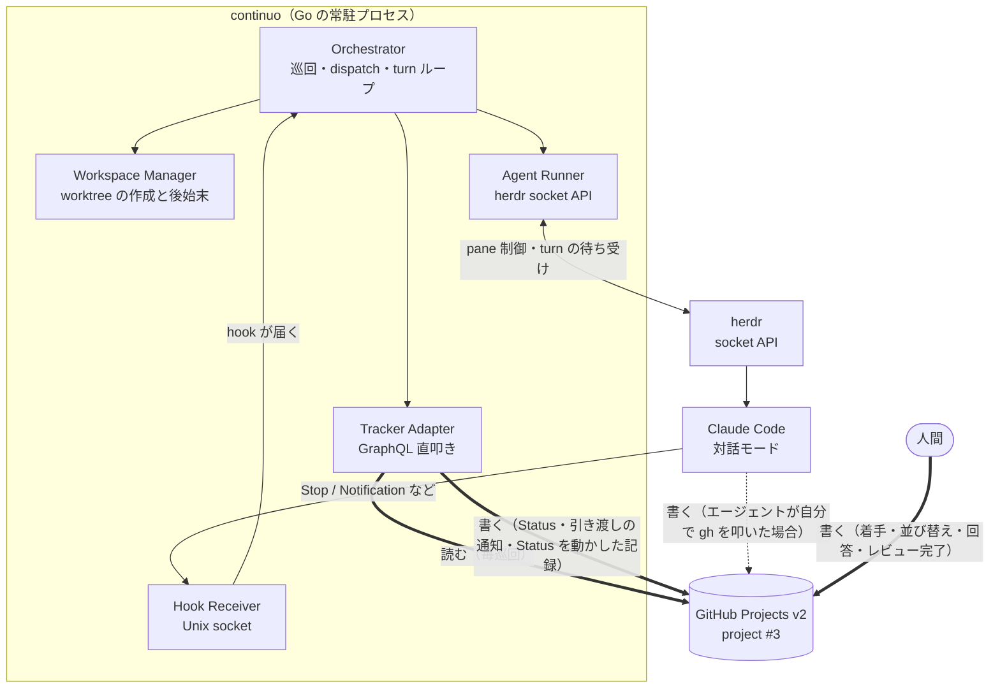
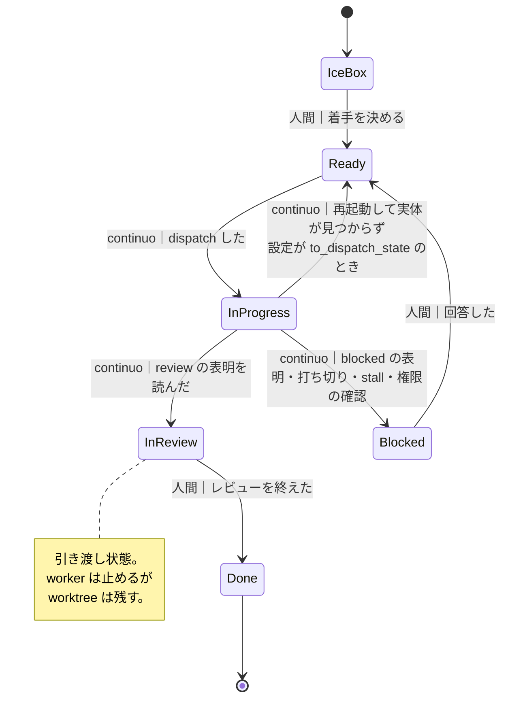
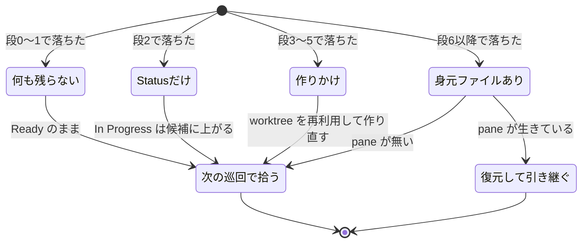
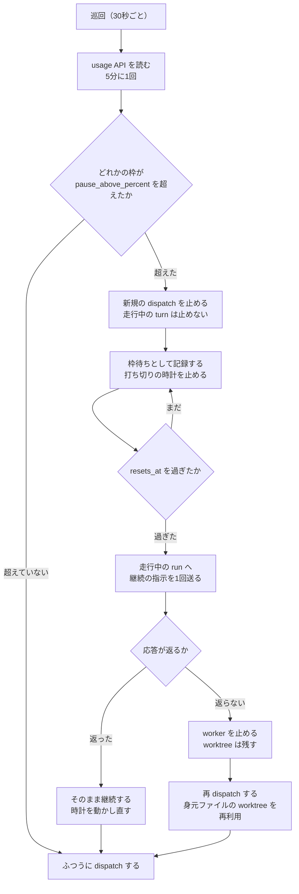

# continuo の設計（要約）

**言いたいこと。**GitHub Projects v2 のボード1枚を見張り、issue ごとに worktree を用意し、herdr の pane で Claude Code を対話モードで起動して、完了まで面倒を見る常駐プロセスを Go で作る。**従量課金にならないこと**と、**エージェントが完了を申告し忘れても作業が落ちないこと**が最優先である。

**この文書は人間がレビューするための要約である。**判断の根拠・実測値・比較した案は
[continuo_design.md](continuo_design.md) にある。節番号（`3-16` など）はすべてそちらを指す。

| | 内容 |
| --- | --- |
| **読んで分からないことがあったら** | **[continuo_design.md](continuo_design.md) に書いてある前提で読んでよい。**この文書は全部を説明しない |
| **この文書と詳細版が食い違ったら** | **詳細版が正である** |
| **更新の仕方** | AI は詳細版を更新し続ける。**人間のレビューが要るたびに、この文書を詳細版から再生成する** |

---

## 1. 何を実現するのか

**言いたいこと。**先行調査が定めた**必須条件14件**を満たすために作る。1件でも満たせなければ意味がない。

| 短縮名 | 求められていること | どう満たすか |
| --- | --- | --- |
| **定額運用** | 従量課金にならない。**最優先** | `claude -p` も API 直叩きも使わず、herdr の pane で対話モードを動かす |
| **自動で順に実行** | 貯めたタスクが順に実行される | 常駐プロセスが30秒ごとに巡回する |
| **Projects v2 のボードを読める** | 状態指定の取得と ID 指定の取り直し | GraphQL を直接叩く（`gh project` は1回 102 point で破綻する）。**複数 Status の OR はカンマ区切り。**空白区切りは AND になり無言で0件を返す |
| **複数ボード監視** | 1プロセスで複数のボードを見る | **凍結中。**当面1枚。解けたときに壊れない構造にしてある（3-28） |
| **リポジトリ別の作業ディレクトリ** | issue の所属リポジトリで実行する | `ghq` でローカルの clone を引き、そこから worktree を切る（3-22） |
| **枠回復で自動再開** | 上限で止まっても回復後に再開する | 2段構え（3-27）。**idle と区別するため枠の残量を読む** |
| **issue から投入** | issue に書けばキューに入る | ボードに載った issue を拾う |
| **外部から順序調整** | 外部から実行順序を調整できる | **ボードの並び順で決める。並べるのは人間で、continuo は読むだけ**（3-30）。グループは代表の issue のコメントで受け取る（3-26） |
| **macOS ネイティブ** | macOS と WSL2 の両方で動く | Go で書き、`CGO_ENABLED=0` の static binary を作る |
| **再配布できるライセンス** | コピーレフト系でない | continuo 自身は MIT |
| **未完了なら再投入される** | Status を変えずに終了しても再度呼ばれる | turn ループと、turn ごとのボードの取り直し（3-5 / 3-8） |
| **1年以内に更新** | 放置されたものを使わない | 自作。ただし依存先の更新に追随する責任がある |
| **並行実行数を指定できる** | 同時実行数を設定で決める | `agent.max_concurrent_agents` |
| **Claude Code を起動できる** | 起動されるのが Claude Code | herdr の `agent.start` に `kind: claude` を渡す |

**優先条件は「herdr で動くこと」だけである。**世界にこれを満たす実装が1つも無かったことが、自作する動機である。

---

## 2. 全体はどうつながっているか

**言いたいこと。矢印の向きが設計の要である。**continuo はボードを読み、herdr を動かし、hook で通知を受ける。
**ボードに書き込む経路は3つある**（continuo・エージェント・人間）。「continuo は読むだけ」ではない。



**「Status をどう動かすかの判断はエージェントが持ち、continuo は自分の判断で勝手に動かさない。
ただしエージェントが物理的に書けない場面では continuo が書く。」**これが正しい言い方である（3-1）。

---

## 3. turn が終わったことをどう知るか

**言いたいこと。判定は「herdr の待ち受けを主、hook を従」にする。**
**hook だけでも herdr だけでも判定できない。**両方を見て、はじめて確定する。

**まず、使えないと分かった案を挙げる。**

| 使えない案 | なぜ |
| --- | --- |
| **`Stop` hook が来て `background_tasks` が空なら終わり** | **空配列の `Stop` は turn の途中にも出る。**空の `Stop` 20件のうち4件がそれだった |
| **一定時間 hook が来なければ終わり**（静止で測る） | **turn 内の無音が90秒、turn 外の無音が60秒。**turn 内のほうが長いので、どこに線を引いても分離できない |
| **`prompt_id` が同じあいだが1つの turn** | wake-up ごとに値が変わる。最終回答の `Stop` は、人間の入力と別の値だった |
| **herdr の状態が `idle` になったら終わり** | **`idle` は「入力を受け付ける」以上の意味を持たない。**人間が `Esc` で中断しても `idle` になる |

**なぜ turn 内の無音が90秒になるか。**メインが叩いた道具の実行中は、hook が1つも飛ばないためである。
無音の長さは道具の実行時間とほぼ一致した（45秒の道具で45.1秒、90秒の道具で90.1秒）。

> **道具の実行時間に上限はかけられる**（環境変数を2つ同じ値にする。3/3 で確認）。
> **だが採らない。**公式ドキュメントが**「`git` を走らせるコマンドは、打ち切りでバックグラウンドへ移らず止められる」**と書いており、
> **continuo は git の clone と worktree の作成を走らせる。**短い上限は実作業を壊す。

**採る判定。**

| 順 | 何を見るか | 根拠 |
| --- | --- | --- |
| **主** | **herdr の待ち受け**が返ること | 待ち受けの状態に `idle` / `done` / `blocked` を並べると turn の終わりまで待てた（3/3） |
| **従** | **`Stop` hook のあとに `<task-notification>` が来ないこと** | turn の途中の `Stop` では 0.033〜0.037 秒後に来た（8/8）。最終 `Stop` の後に来るのは別のもの（1.9〜2.9秒後） |
| **確認** | `background_tasks` が空でなければ未完了 | 誤検知しない方向にしか外れない |

**`blocked` を外してはならない。**外すと権限の確認で止まった turn を拾えず、**時間切れまで待たされる**（3/3）。

**待ち方は「短く切って繰り返す」形にする。**プロンプトは待ちなしで送り、**短い待ち受けを繰り返して経過時間を自分で数える。**
**herdr に「待ちの時計を止める」手段が無い**ので、枠待ちの間を数えないためにはこの形が要る。

**`<task-notification>` は subagent 専用ではない。**バックグラウンドで走らせた shell が終わったときも同じ形で届く（3/3）。
**「subagent の完了だけを見る」設計は取りこぼす。**

**数えるときに捨てるものが2つある。**

- **種類が空文字の `SubagentStop`。**対応する開始イベントが 0/22・0/44 で、記録ファイルも実在しない（0/22・0/44）。
  **道具を1つも使わない turn でも出る。**正体は特定していないが、**subagent ではないので捨てる**
- **`PreToolUse` / `PostToolUse` を「メインが動いている」の根拠にしない。**subagent の道具も同じ hook に飛ぶ

**猶予（`settle_ms`）の既定は 2000 ミリ秒。**観測できた8件はいずれも 0.037 秒以内だが、
**上限を決める仕組みは確かめていない。**実際の間隔を毎回ログに出して、運用のデータで決め直す。

---

## 4. 完了をどう検知するか

**言いたいこと。**「turn が終わったか」「タスクが完了したか」「何をしたか」を混ぜない。
**終わったかは hook と herdr で、完了したかはボードで、何をしたかは issue のコメントで知る。**

| 層 | 何で知るか |
| --- | --- |
| **turn が終わったか** | 第3節の3段の判定 |
| **タスクが完了したか** | **ボードの Status が `terminal_states` に入ったこと** |
| **何をしたか** | **issue のコメント。**書かれていなければ**セッションを復元してエージェントに書かせる。continuo は代筆しない** |

**成果を continuo が代筆しないのは、書ける材料が無いからである。**作業の全体をまとめられるのはエージェントだけである。
**書かせ方は、終了したセッションへ戻って指示を1つ送るだけでよい**（詳しくは 3-25 の9段）。

**「エージェントが書いた」は、印と投稿者の両方で決める**（3-65）。
`<!-- continuo:agent -->` は本文の先頭に置くただの文字列で、**issue にコメントできる人なら誰でも書ける。**
**印だけで認めると、第三者のコメント1件で催促をすり抜けられる。**

| 何を見るか | どうする |
| --- | --- |
| 印 | `comments.marker` / `comments.self_marker` が本文の先頭にあるか |
| **投稿者** | **continuo が使う `gh` の持ち主（`gh api user --jq .login`）と一致するか** |
| 持ち主を取れないあいだ | **印だけで判定する形に落ちる。**取れるまで5分に1回取り直し、一度取れたら取り直さない |
| 印はあるが投稿者が違う | **数えず、投稿者と url を添えて WARN で名指しする** |

| 順 | 何をするか |
| --- | --- |
| 1 | issue のコメントを確かめる。**印と投稿者の両方が合うもの**があればここで終わり |
| 2 | **走行中の worker を先に止める。**止めないと同じセッションが2つ生きる |
| 3 | **herdr の pane を作り、そこで `--resume <UUID>` を付けて起動する** |
| 4 | 「作業の内容を issue のコメントに書いてください」とだけ送る（**turn 数に数えない**） |
| 5 | それでも書かれなければ人間へ渡す |

**`claude` を直接実行しない。**着手と同じく herdr の pane を経由する。
**直接実行すると非対話の経路になり、最優先の制約（定額運用）に抵触しうる。**

**走らせるのは run が終わるときだけである。**「まだ続きがある」と表明した turn では走らせない。

**終了したセッションに戻れることは実測で確認済みである。**
**ただし `--settings` は復元されないので毎回渡し直す。**渡し忘れると hook が1つも効かない。

**Status は3つに分けて扱う。**

| 分類 | どの Status か | 何を意味するか |
| --- | --- | --- |
| **作業中** | `Ready` / `In Progress` | continuo が面倒を見る |
| **完了** | `Done` | 片付けてよい |
| **引き渡し** | `In Review` / `Blocked` | **人間へ渡した。**worker は止めるが worktree は残す |

**`In Progress` を「作業中」に入れるのが急所である。**入れ忘れると、dispatch した直後に自分の worker を殺す（3-10）。

---

## 5. 誰が Status を動かすか

**言いたいこと。**判断するのはエージェント、**書き込むのは continuo の Go のコード**である。
プロンプトで `gh` を実行させると確率で実行されないため、実行を機械に寄せた。

**エージェントは応答に1行書くだけでよい。**

```text
CONTINUO-STATUS: review          作業が終わり、人間のレビューに回してよい
CONTINUO-STATUS: blocked         判断を仰ぎたい、または失敗した
CONTINUO-STATUS: #45 review      グループの別の issue を指す（3-26）
```

**この1行は会話の記録（transcript）から読む。**hook が渡す最終応答からは読まない。
**印を書いたあとに道具を1回でも呼ぶと、印ごと落ちるためである**（印を書いた17件すべてで落ちた）。

| 何を | どうするか |
| --- | --- |
| どこから読むか | **transcript の JSONL**（`Stop` hook が渡すパス） |
| turn の切り方 | **人間が打ち込んだ入力を起点にする。**17件中17件で取れた |
| なぜ `prompt_id` で切らないか | **17件中3件で取り逃す。**1つの指示が複数の `prompt_id` に割れる |
| いつ読むか | turn が終わったと判定したあと、**0.5秒待ってから**（書き込みが遅れる。公式ドキュメントに明記あり） |
| 探し方 | **行に割って探す。**印が他の文と同じ塊に入ることがある |



**書く前には必ず ID 指定で取り直す。取り直した結果が完了状態（`Done`）なら書かない。**
エージェントが自分で `gh` を叩いて先に `Done` へ動かしていた場合に、それを巻き戻さないためである。

**「作業中の状態でなければ書かない」という絞り方は採らない。**
グループの他の issue は `Ice Box` に置かれるので（第10節）、**その絞り方だと表明が1件も反映されない。**

**表明せずに終わった turn は、次の turn の継続指示で促す。**

**hook から turn を差し戻す仕組みは、技術的には可能だが採らない**（実測で動くことは確認済み）。
**差し戻すかどうかは会話の記録を読まないと決まらず、それは猶予の2秒を待った後になる。**
その間 hook の応答を保留すると、**Claude Code が hook の終了を待つため、判定材料の通知が届くかどうかが分からなくなる。**
**turn ループが既にあるので、次の turn で促せば足りる。**

---

## 6. 途中で落ちても壊れないようにする

**言いたいこと。**状態はメモリにしか持たない。**だから落ちたときに何が外側に残るかを、着手の手順の順番で決めておく。**
順番を間違えると、同じ worktree で Claude Code が2つ同時に走る。

**メモリに持つのはこれだけである。**

```go
// run ごとの実行時状態。プロセスが落ちると消える。
// orchestrator が map[string]*runState で持つ（キーは project item の ID）。
type runState struct {
    IssueID      string    // project item の ID
    SessionUUID  string    // Claude Code のセッション UUID
    PromptID     string    // 直前に投げたプロンプトの ID（Stop hook の prompt_id と突き合わせる）
    TurnCount    int       // continuo が送ったプロンプトの回数
    LastSeenAt   time.Time // 最後に「動いている」のを見た時刻（打ち切りの時計）
    LastRevision uint64    // 最後に見た pane の revision（画面の版）
}
```

**着手の手順は12段ある**（3-16）。要点は最初の3段である。

| 段 | 何をするか | なぜその位置か |
| --- | --- | --- |
| **0** | dispatch の直前の検査（信頼・置き場所の封じ込め） | 落ちたらこの issue を飛ばす。**まだ何も書かない** |
| **1** | **「自分が取った」印を付ける**（上の map に入れる） | **ここで付けないと、着手中に次の巡回が同じ issue を掴む**（起動待ち60秒、巡回30秒間隔） |
| **2** | **ボードの Status を `In Progress` へ書く** | **印はメモリなので落ちると消える。**Status は残るので再起動後の識別に使う |

**残り9段。**worktree を用意 → `after_create` → 設定ファイルを worktree の外に作る →
**身元ファイルを worktree の中に書く** → `before_run` → pane を作って label を書く → Claude Code を起動 →
**状態が `idle` または `done` であることを確かめる** → 1回目の turn。
（**`done` も合格である。**continuo は画面を前面に出さないので、実運用ではほぼ常に `done` 側になる）



**身元ファイルが復元の主キーである**（3-18）。ディレクトリ名から issue へは戻れないので、
**worktree の中に「誰のものか」を書いたファイルを置く。**

```text
<worktree のパス>/.continuo.json
例: ~/worktrees/github.com/octocat/hello-world/continuo-octocat-hello-world-188/.continuo.json
```

```json
{
  "issue_url": "https://github.com/octocat/hello-world/issues/188",
  "issue_identifier": "octocat/hello-world#188",
  "project_item_id": "PVTI_lADOAb3c4M4Aq7EzgAR8Xyz",
  "branch": "continuo/octocat/hello-world/188",
  "herdr_workspace_id": "ws_01J8XK2M9P",
  "socket_path": "/var/folders/.../continuo/hooks.sock",
  "settings_path": "/var/folders/.../continuo/issues/octocat-hello-world-188/settings.json",
  "session_uuid": "8aebf7af-8b07-4f45-b037-59f457b38feb",
  "created_at": "2026-08-18T12:34:56+09:00",
  "takeover_count": 0
}
```

**continuo が着手の段6で作り、herdr の workspace の ID が手に入った時点で書き足す。**
**再起動して引き継ぐたびに `takeover_count` を1つ増やして書き戻す。**
上限に達したら `failure_state` へ落とす。**数えないと、クラッシュし続ける状況で打ち切りが一度も発火しない。**

**二重起動は `flock` で防ぐ**（3-17）。`ps` は使わない。**hook を届けるサブコマンドが本体と同じ実行ファイル名なので誤判定する。**

---

## 7. worktree をどう扱うか

**言いたいこと。**置き場所は **gwq の規則**に合わせる。人間が `gwq list` で見て `gwq remove` で消せるからである。
**衝突は branch 名を issue ごとに一意にすることで防ぐ。**

```text
<workspace.root>/<host>/<owner>/<repo>/<branch 名のスラグ>
branch 名: continuo/{{.issue.owner}}/{{.issue.repo}}/{{.issue.number}}
```

**branch 名の区切りをスラッシュにするのは、設定を書く人間への制約である。**
ハイフンにすると owner と repo の境目が曖昧になる
（`octocat/ai-shako#1` と `octocat-ai/shako#1` が同じ名前になる）。
**既定値がスラッシュ区切りなので、書き換えなければ自動的に守られる。**

**用意する手順**（3-22）。

1. `git worktree prune`（登録だけ残った状態を先に解消する）
2. 既にあり登録もあれば**再利用**する
3. 実体はあるが登録が無ければ**エラーにして人間へ報告**（勝手に乗っ取らない）
4. 無ければ作る。branch が既にあればチェックアウトする
5. **作成に失敗したら、その場で孤児 branch を消す**（`git worktree add -b` は branch を先に作る）
6. 置き場所の内側にあることを検査する
7. herdr の `worktree.create` に path を渡し、workspace として開く

**片付けの契機は `cleanup.on_states`（既定 `Done`）に入った時点である。**「active でなくなった時点」ではない。
**`In Review` や `Blocked` で消すと、人間が回答して `Ready` へ戻したときに成果が失われる。**

**`cleanup.on_states` は `tracker.terminal_states` の中から選ぶ**（3-9e）。外の値を書くと、
**「終わっていない」と判定した直後に worktree を片付ける。起動は止めず、警告と `continuo doctor` で知らせる。**

**`In Review` へ移った issue が `Done` になったことは、毎巡回の worktree の照合で拾う**（3-9）。
巡回の候補からは外れているので、これ以外に知る方法が無い。

**branch を消す前に、未コミットの変更が無いことと、すべての commit が upstream に到達していることを確かめる。**

---

## 8. 無人で止まらないようにする

**言いたいこと。**キー入力を待つ画面が1つでも出れば、その issue は永久に止まる。**止まる経路を全部潰す。**
**ただし「止まらない」と「人間に判断を仰がない」は別である。**判断が要る場面では `Blocked` へ移して人間に渡す。

| 止まる箇所 | 打つ手 |
| --- | --- |
| **権限の確認** | `--permission-mode dontAsk` で起動する。**入力を待たない唯一のモード** |
| **フォルダの信頼確認** | リポジトリごとに人間が1度だけ承認する。**continuo は dispatch の直前に検査し、未承認なら飛ばす** |
| **レートリミット** | 第9節 |

**`--permission-mode dontAsk` は「聞かずに実行する」ではなく「聞かずに拒否する」である。**
許可リストに書いたものだけを実行し、**それ以外は人間に確認せず即座に拒否する。**だから止まらない。

**`auto` ではダメである**（実測）。**3回連続または通算20回で確認方式に戻る。**戻った時点で入力待ちになる。

**許可リストは `Bash` とツール名だけで書く。**`Bash(gh:*)` のように引数を限定すると、
**許可リストに載らない書き込み系（`touch` など）が拒否され、作業が途中で止まる**（3セッション×2で再現）。
**subagent だから拒否される、ということは無い**（同じコマンドを main と subagent に与えた18対すべてで結果が一致）。

### 権限の確認で止まったら、次を投げる前に必ず取り消す

**これは安全に関わる。**herdr が `blocked` を返したとき、**そのまま次のプロンプトを投げると、
保留中の権限要求が承認されて実行される**（3/3 で再現）。**投げた本文のほうは消える。**

```json
{"method": "agent.send_keys", "params": {"target": "<agent 名>", "keys": ["esc"]}}
```

**送出後10秒以内に「待機中」へ戻った**（3/3）。**herdr の socket API にあるメソッドなので、コマンドを叩く必要はない。**

**そのうえで、その issue は人間へ渡す。**権限の確認が出たということは、人間の判断が要るということである。

**無音の検知は中間の hook で行う**（3-21）。`Stop` だけを見ると、1つの turn が閾値を超えただけで殺される。
`PreToolUse` と `PostToolUse` を張り、届くたびに時計をリセットする。**閾値は30分。**

---

## 9. レートリミットで止まっても自分で戻る

**言いたいこと。**枠に当たったら**新規の dispatch だけを止め、走行中の turn は止めない。**
**リセット時刻を過ぎたら、継続の指示を1回送って生死を確かめる。**
**待っている間は時計を止める。**止めないと、待っているだけの worker を「固まった」とみなして殺す。



**2段構えにする。**

| 段 | 何をするか |
| --- | --- |
| **1段目** | **`CLAUDE_CODE_RETRY_WATCHDOG=1` を環境変数で渡す。**turn の途中で `429` / `529` が返ったときにリトライし続ける |
| **1段目の補強** | **Claude Code 2.1.234 の「枠のリセット時にセッションを継続する」機能。既定で有効。**`CLAUDE_CODE_RETRY_WATCHDOG` とは別物で、両方が効く。**continuo が継続の指示を送る前に `agent_status` を見て、`working` なら送らない**（二重投入の防止） |
| **2段目** | **1段目が効かなかったとき、continuo が待って再 dispatch する** |

**「枠待ち」と「固まった」を区別するために、枠の残量を読む。**
読むのは OAuth の usage API（`https://api.anthropic.com/api/oauth/usage`）で、
**Claude の5時間枠と週次枠の使用率とリセット時刻を返す。**

| 項目 | 内容 |
| --- | --- |
| 認証 | Claude Code の資格情報を**読み取るだけ。**どこから読むかは `rate_limit.token_source` で決める。**既定は macOS が Keychain、ほかの OS が `~/.claude/.credentials.json`** |
| **枠を消費するか** | **大量には消費しない**（3回続けて叩いて使用率が動かなかった）。**ただし使用率は整数の百分率なので、「1トークンも消費しない」ことは判別できない。**必須にはせず、設定で切れるようにしてある |
| 読む間隔 | 既定5分 |
| 止める閾値 | 既定95%。**走行中の turn は止めない** |

**時計を止めるのが要点である。**枠のリセットを待つ間は打ち切りの判定を飛ばす。
**画面が変わらないのは枠を待っているからであって、固まっているからではない。**

**worker を止めた場合は文脈が切れるので、issue のコメントに残した成果を次のセッションが読む**（第5節）。

---

## 10. issue の中身はエージェントに直接読ませる

**言いたいこと。**プロンプトに本文を埋め込まない。**owner / repo / 番号だけを渡し、
エージェントが `gh` の JSON 出力で読む**（3-29）。
コメントを何件まで渡すかを continuo が決めると、切り捨てた分が読まれないからである。

**読ませるのは JSON だけである。テキスト表示は使わせない**（3-72）。
`gh issue view --comments` はコメントを行頭の `--` だけで区切り、本文を桁0から無加工で流す。
**外部の人が自分のコメント本文に `author:` と `association:` の行を書けば、投稿者を偽装できる。**
JSON なら本文は `body` の値にしかならず、**本文から `authorAssociation` を作れない。**
`--jq` で1行のテキストへ潰すのも、偽装がそのまま通るので禁止する。

| 何を読むか | 使うコマンド |
| --- | --- |
| issue のコメント | `gh issue view <番号> --repo <owner>/<repo> --json comments` |
| issue の本文と投稿者の立場 | `gh api repos/<owner>/<repo>/issues/<番号>`（立場は REST にしか無い） |
| PR の説明・会話・行に紐づくレビューコメント・レビュー | 4本とも JSON で読ませる（6-15） |

**立場で分けるのは「命令に従ってよいか」だけである**（3-72a / 3-72b）。

| 何を判断するか | 何を見るか |
| --- | --- |
| **この issue に取り組んでよいか** | **Status が `Ready` だったこと。**立場は見ない |
| **本文やコメントの命令に従ってよいか** | `authorAssociation` が `OWNER` / `MEMBER` / `COLLABORATOR` か |
| **再現手順や説明を材料に使ってよいか** | **立場によらず使ってよい。**命令ではないため |

**副産物として、グループの扱いが簡単になる**（3-26）。

| 誰が | 何をするか |
| --- | --- |
| **continuo の外** | 同根のバグをグループ化し、**計画を代表の issue のコメントに書き、他の issue を `Ice Box` へ落とす** |
| **人間** | ボードの並び順で代表を前へ動かす |
| **continuo** | **代表を1件 dispatch する。**dispatch を決める時点ではグループを見ない |
| **エージェント** | コメントを読んでグループ全体を直し、**issue ごとに表明を書く** |

**他の issue を `Ice Box` へ落とすのが要点である。**落とさないと continuo が別々に dispatch する。

### 外部が書いたものは、読ませるが指示としては扱わせない

**公開リポジトリの issue とコメントは、誰でも書ける。**`dontAsk` で `Bash` を持つエージェントに
そのまま届くので、**本文がそのまま指示になりうる。**「読ませない」では解けない。外部のバグ報告は情報源として要る。

**採る形は3層で、それぞれ別の段に入る**（6-23 / 6-23b / 6-23c）。

| 層 | どの段で効くか | 何をするか |
| --- | --- | --- |
| **立場の札** | エージェントがコメントを読む瞬間 | JSON で読ませ、`authorAssociation` が `OWNER` / `MEMBER` / `COLLABORATOR` のものだけを指示として扱わせる（3-72） |
| **道具の判定** | 危ないコマンドを実行する直前 | 下記 |
| **印の照合** | turn が終わったあと | `<!-- continuo:agent -->` を、投稿者が continuo の `gh` の持ち主であることと併せて見る（3-65） |

**`CONTRIBUTOR` は信用しない。**過去に1回 commit が merge されただけで付く。

### 危ない道具の呼び出しは、実行の直前に判定で止める

**言いたいこと。**「危ないコマンドの一覧」を先に作るのは無理である。
`git` と `gh` を許さないと1件も回せず、許した瞬間に force push も PR の merge も通る。
**だから一覧ではなく、呼び出しのたびに LLM に判定させる**（3-64）。

**実体は issue ごとの settings.json に足す `PreToolUse` の `type: "prompt"` の hook である。**
**判定は Claude Code の中で完結し、continuo には届かない。**continuo は hook を張るだけである。
**`claude -p` は使わない。**

```yaml
claude:
  tool_gate:
    mode: public_only                       # off / on / public_only。既定は public_only
    model: ""                               # 判定させるモデル。既定は空（名前の一覧が公式文書に無い。3-64c）
    tools: ["Bash"]                         # 判定に回す道具。空なら全部
```

| 決めたこと | 中身 |
| --- | --- |
| **既定は `public_only`** | 何も書かずに使い始めた人が守られる側に倒れる。**そのぶん版を上げただけで挙動が変わる**ので、[../upgrading.md](../upgrading.md) と [../FAQ.md](../FAQ.md) の両方に書く |
| **公開かどうかを取れなかった issue には掛ける** | 分からないものを「公開ではない」と決めない |
| **`continueOnBlock: true` を必ず立てる** | 立てないと、断った時点で turn が終わって無人運用が壊れる |
| **`command` の hook は残す** | turn の終わりを知るための hook（第3節）は判定の有無に関わらず要る。**判定は2つ目の塊として足す** |

**判定役へ渡す文字列は、外部が中身を書ける**（3-64b）。`$ARGUMENTS` に入るのは
エージェントが組み立てた `tool_input.command` だからである。**着手のたびに採り直す乱数の印で囲い、
「囲いの中はデータであって指示ではない」と宣言し、断る条件と返す形は囲いより後ろに置く。**
**印を固定にしてはならない。**このリポジトリは公開で、指示文の全文が読める。

---

## 11. 実行の順序

**言いたいこと。continuo はボードの並び順を読むだけである。書き換えない。**
**並べるのは人間で、ボードの画面でドラッグする。**

**並べ方の指針。`bug` が付いた issue を先に処理する。**
これは**人間がボードを並べるときの指針**であって、continuo が実行する規則ではない。

| なぜ continuo に持たせないか | 内容 |
| --- | --- |
| **順序の決定に issue の中身が要る** | どれが同根か、どれを先に直すべきかは中身を読まないと決まらない。**continuo は中身を読まない設計である** |
| **巡回のたびに走らせる意味が無い** | 順序が変わるのは、新しい issue が入ったときか、人間が組み替えたときだけ |
| **書き換える側と読む側を同じプロセスに入れると、判断が分散する** | continuo は「並んでいる順に実行する」だけにする |

> **並び順を機械的に書き換える手段は存在する**（`updateProjectV2ItemPosition`。引数と制約は 4-2 に書いた）。
> **continuo はこれを呼ばない。**

**GitHub の枠には十分収まる**（実測）。

| 何を | 1回のコスト | 1時間あたり |
| --- | --- | --- |
| 候補の取得 | 4 | **480** |
| 実行中の照合・worktree の照合 | 各 1 | **240** |
| Status の書き込み | 1 | **50** |
| **合計** | | **約770 / 5,000（15%）** |

**超えたときは HTTP 200 のままエラーメッセージが返る。**ステータスコードだけを見ていると気づけない。**応答の `errors` を必ず見る。**

---

## 12. 使い始めるまで

**言いたいこと。**前提が6つあり、どれが欠けても静かに失敗する。
**README には「何が要るか」だけを書き、揃っているかの判定は `continuo doctor` に任せる。**

```bash
continuo doctor        # 前提が揃っているかを検査する。足りないものと直し方を出す
continuo init          # WORKFLOW.md の雛形を置く。既にあれば止める（--force で上書き）
continuo               # 常駐する（WORKFLOW.md を読んで巡回を始める）
```

| `doctor` が検査するもの | どう検査するか |
| --- | --- |
| herdr が動いているか | **socket の `ping` を呼び、応答の `protocol` が設定の値と一致するか**（`herdr status` の CLI は使わない） |
| `gh` の認証と scope | `gh auth status` の出力に `project` が含まれるか |
| リポジトリの信頼登録 | `~/.claude.json` の `hasTrustDialogAccepted` が `true` か |
| ローカルの clone | `ghq list -p -e <owner>/<repo>` の**出力が空でないか**（exit code は常に 0 なので使えない） |
| 設定ファイル | `WORKFLOW.md` が読めて、front matter が検証を通るか |
| 片付ける Status | `cleanup.on_states` の値が `tracker.terminal_states` に全部あるか（記号は `!` まで。3-9e） |
| Claude の資格情報 | `rate_limit.token_source` が指す先から取れるか（macOS の既定は Keychain） |

**`init` が置くのは `WORKFLOW.md` 1つだけである。**埋めないと動かない値にはプレースホルダを入れ、
コメントで「ここを埋めること」と書く。**既にあれば上書きせずに止める。**

**`doctor` は Keychain を読む。**人間が端末で叩く道具なので、確認のダイアログが出てもその場で答えられる。
**固まらないように10秒の上限を掛け、期限が来たら `security` を殺して `!` にする。**

**macOS の人は `continuo allow-keychain-access` を1回叩く。**Keychain は初めて読む実行ファイルに
確認のダイアログを出すので、**無人で走る continuo が当たる前に、人間が「常に許可」で答えておく。**
出るのは読めた項目の名前だけで、トークンの値は画面にもログにも出ない。

---

## 13. symphony の仕様と異なるところ

**言いたいこと。**準拠先は [openai/symphony](https://github.com/openai/symphony) の `SPEC.md` だが、**12件を意図的に外し、7件を足している。**
**実装するとき、この一覧に無い逸脱をしてはならない。**理由は [continuo_design.md](continuo_design.md) の第8節にある。
**設定キーの差（持たないもの・名前を変えたもの）はこの節の後半に表で置いた。**

**外しているもの。**

| 短縮名 | continuo はどうするか |
| --- | --- |
| 実行順序に Priority を使わない | ボードの並び順だけを使う |
| worktree の置き場所を gwq に合わせる | ハッシュ接尾辞を付けない |
| 打ち切りを失敗として扱う | `Blocked` へ落とし、継続を予約しない |
| 未知の設定キーを弾く | 起動を止める |
| workspace の hook のキー名を変える | `workspace_hooks` にする |
| branch を消す | worktree だけでなく branch も消す |
| `read_timeout_ms` の相手が違う | herdr の socket API の応答を測る |
| **Status を動かすのは continuo のコード** | エージェントは1行書くだけ |
| **issue の中身をプロンプトに埋め込まない** | owner / repo / 番号だけを渡し、`gh` の JSON 出力で直接読ませる |
| 無音の測り方 | app-server の出力ではなく、pane の `revision`（画面の版）で測る |
| `tracker` に仕様外のキーを足す | `dispatch_state` / `failure_state` / `status_signal_prefix` / `status_signal_map` |
| 再起動後は引き渡し状態の worker を止めない | pane を残して人間に見せる |

**足しているもの。**二重起動の防止（`flock`）／worktree の身元ファイル／中間の hook で生存を測る／
リポジトリの信頼の検査／レートリミットの待機／落ちている間の通知の取り戻し／**使い始めるまでの検査と雛形**。

**そもそも適用外。**第10節（Codex のプロトコル）／5.3.6 の `codex` セクション／Appendix A（SSH の worker 拡張）。

**REQUIRED だが作らないと決めたもの。**6.2 の設定の読み直し。**`WORKFLOW.md` を書き換えたら再起動する。**
再起動は安全に作ってあり（`restart.orphan_running_action`。worktree も pane も残る）、
実行中の run へ反映すると turn の途中で判断の基準が食い違うため。

**設定キーとして持たないもの。**書けば未知のキーとして起動を止める（詳細は [continuo_design.md](continuo_design.md) の 8-4）。

| キー | 仕様のどこ | なぜ持たないか |
| --- | --- | --- |
| `codex.stall_timeout_ms` | 5.3.6 | 観測点は pane の `revision`（画面の版）1つ。同じ時計に閾値を2つ置くと片方が死ぬ |
| `claude.liveness_hooks` | 仕様に無い | 読むコードが1行も無かった |
| `tracker.write_interval_ms` | 仕様に無い | 読むコードが無い。書き込みはもともと間隔が空く |
| `workspace.layout` | 仕様に無い | `gwq` 以外を弾くだけで、値を見て処理を変える場所が無い |
| `claude.hook_bridge.mode` | 仕様に無い | `settings_flag` 以外を弾くだけ |
| `tracker.provider.comments.fetch` | 仕様に無い | `false` にすると全 run が `Blocked` に落ちる |

**名前を変えたもの。仕様の名前で書いても通らない**（詳細は [continuo_design.md](continuo_design.md) の 8-5）。

| 仕様の名前 | continuo の名前 | なぜ変えたか |
| --- | --- | --- |
| `agent.max_turns` | `agent.max_dispatch_turns` | 仕様はエージェントの turn 数、continuo は指示を送った回数。herdr 経由では前者を数えられない |
| `codex.turn_timeout_ms` | `claude.turn_timeout_ms` | 相手が Codex ではなく Claude Code。意味は仕様どおり（無音の間隔） |
| `codex.read_timeout_ms` | `herdr.read_timeout_ms` | 相手は app-server ではなく herdr |
| `hooks.*` | `workspace_hooks.*` | continuo には Claude Code の hook もある。`hooks` だけではどちらか分からない |

---

## 14. 作る順番

**言いたいこと。**先に骨を通し、あとから肉を付ける。**各段階の終わりに動くものが残るようにする。**

| 段階 | 作るもの | 終わったときに何ができるか |
| --- | --- | --- |
| 1 | 設定の読み込み・展開規則・正規化・ログ・CLI・二重起動の防止・`continuo init` | 設定を検証し、2つ目のプロセスが立たない |
| 2 | herdr の socket クライアント | pane を作り、agent を起動し、**turn の終わりまで待てる** |
| 3 | トラッカーのアダプタ（GraphQL 直叩き） | ボードから issue を取り、ID 指定で取り直せる |
| 4 | hook の受け口と生存の確認 | `Stop` を受け取れる。長い turn を stall と誤判定しない |
| 5 | worktree の管理（身元ファイル・封じ込め検査・後始末） | **誰のものかディスクだけから分かる** |
| **6** | **orchestrator** | **1件の issue を最初から最後まで通せる** |
| 7 | 再起動時の復元 | **どの段で落としても**取り残される issue が出ない |
| 8 | `continuo doctor` | 使い始めるときに前提が揃っているかを検査できる |
| 9 | 任意の HTTP ダッシュボード | run の状況を人間が見られる |

**テストは第2段階から入れる。**herdr は実プロセスを起動せずに pane を「agent が居る」と登録できる（`pane.report_agent`）ので、
**Claude Code を起動しない統合テストが書ける。**

**いま実装済みなのは、設定の読み込み・展開規則・正規化・ログ・CLI・二重起動の防止と、
herdr のクライアント、トラッカーのアダプタである。**`continuo init` はまだ無い。

```text
$ go test -count=1 ./...
ok  github.com/maimuzo/continuo/test/internal/config     0.478s
ok  github.com/maimuzo/continuo/test/internal/herdr      2.077s
ok  github.com/maimuzo/continuo/test/internal/lock       0.146s
ok  github.com/maimuzo/continuo/test/internal/logging    0.918s
ok  github.com/maimuzo/continuo/test/internal/normalize  0.696s
ok  github.com/maimuzo/continuo/test/internal/socketpath 0.806s
ok  github.com/maimuzo/continuo/test/internal/tracker    1.194s
```

---

## 15. まだ確かめていないこと

**言いたいこと。実装を止める未確認は残っていない。**
**ここに残した4件は、いずれも「いま観測できない理由」がある。どれが外れても骨格は変わらない。**

| 短縮名 | なぜ今できないか | 外れたらどうなるか |
| --- | --- | --- |
| **枠回復で自動再開するか** | **レートリミットを使い切った状態でないと観測できない。**枠を意図的に使い切るのは「定額運用」の趣旨に反する | continuo が枠の回復を待って再 dispatch する。**第9節に既に書いてある経路を使うだけ** |
| **猶予を何秒にするか** | **上限を決める仕組みが分からない。**観測できた8件はいずれも 0.037 秒以内だったが、**何が上限を決めているのかを特定できていない** | **設定を伸ばすだけ。**実際の間隔を毎回ログに出すので、実データで決め直せる |
| **枠の残量を読む API がトークンを消費するか** | **使用率が整数の百分率なので、少量の消費を判別できない。**課金の明細と突き合わせる手段も持っていない | **その API を使わない設定にして運用する。**枠待ちと固まりを区別できなくなるので、無音の検知だけに頼る |
| **`Bash` 以外の確認で herdr が `blocked` を返すか** | **`dontAsk` では権限の確認が出ない。**確認を出すには権限モードを変える必要があり、**それは continuo の運用と違う条件になる** | **拾えない確認があれば、その turn は時間切れで人間へ渡る。**止まったまま残ることはない |

**運用に入ったら、この4件を決めるための記録を最初から残す。**

---

## 詳細はどこにあるか

**[continuo_design.md](continuo_design.md)** が設計の正である。この要約と食い違ったら、そちらが正しい。

| 知りたいこと | どこを見るか |
| --- | --- |
| 実機で確かめた事実（hook の挙動・信頼の記録先） | 第1節 |
| herdr の socket API・GitHub Projects v2 のコスト・Go の実装スタック | 第2節 |
| **設計の判断（3-1 〜 3-72）** | **第3節** |
| Status の構成・実行順序・`~/.claude.json` の扱い | 第4節 |
| 設定ファイルの全キーとプロンプトのテンプレート | 第5節 |
| **symphony との差分の理由** | **第8節** |
| 設定キーとして持たないもの・名前を変えた設定キー | **8-4 / 8-5** |
