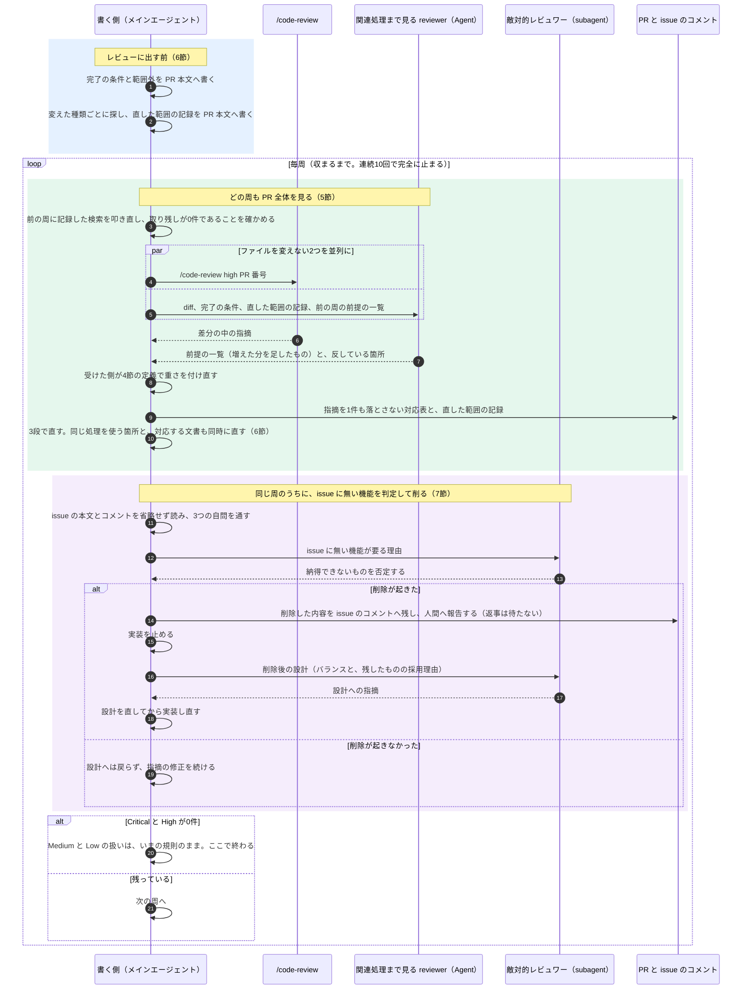

<!-- 目的: レビューの周回が収まらない原因を実測と調査から特定し、プラグイン化を含めて何をどう直すかを人間に確認する -->

# レビューループを1〜2周で収める計画

**この計画は実装済みである。**PR #276（レビューの回し方を利用者の指示書へ入れ、回数の規則を毎周へ揃える）として 2026-09-20 にマージした。
**以下は、決めた時点（2026-09-15 から 09-20）の記録である。**

**行番号・件数・「いまはこうなっている」の記述は、決めた時点のものである。**
**その後、この計画自身の実装でファイルが書き換わっているので、いまの実物とは合わない。**
**いまどうなっているかは、実物を開いて確かめること。**この文書は、そのとき何を見て何を決めたかを残すためにある。
**ただし、この pull request が変えた2ファイル**（[internal/prompt/builtin.md](../../internal/prompt/builtin.md) と [docs/plans/continuo_design.md](continuo_design.md)）
**を指す行番号のリンクだけは、いまの実物へ当て直している。**開けなくなると、記録として読めないためである。
**それ以外を指すリンク**（`CLAUDE.md` / `.claude/` / `docs/releasing.md`）**は、`df36f9d7` の位置のままである。**
**数値は決めた時点のもので、commit は `df36f9d7`（2026-09-16）である。**`docs/plans/review-loop-efficiency/research/` の下も同じ時点である。
**ただし、`research/` の下で「2026-09-22 に数え直した」と書いてある行だけは、いまの値である。**
**ファイルの場所は、どの階層のものかが分かる形で書く**（`.claude/rules/` なのか `.claude/skills/` なのか `docs/plans/` なのか）。この文書の中の相対パスは、すべて continuo リポジトリの根（`~/Sources/github/continuo/`）からのものである。

| 元資料（`docs/plans/review-loop-efficiency/research/` の下） | 中身 |
| --- | --- |
| [01_inventory_repo.md](review-loop-efficiency/research/01_inventory_repo.md) ／ [02_inventory_memory_plugins.md](review-loop-efficiency/research/02_inventory_memory_plugins.md) | レビューループを定義している箇所の全件（リポジトリの中／メモリとプラグイン） |
| [03_empirical_pr_rounds.md](review-loop-efficiency/research/03_empirical_pr_rounds.md) | 実際に何周回ったか、Critical と High 217件の原因の分類 |
| [04_anthropic_official.md](review-loop-efficiency/research/04_anthropic_official.md) ／ [05_industry_tools_blogs.md](review-loop-efficiency/research/05_industry_tools_blogs.md) ／ [06_academic.md](review-loop-efficiency/research/06_academic.md) ／ [07_sibling_fix_prevention.md](review-loop-efficiency/research/07_sibling_fix_prevention.md) | Anthropic 公式／各社と実務家／学術研究／修正漏れの防止 |
| [08_plan_review_round1.md](review-loop-efficiency/research/08_plan_review_round1.md) ／ [09_plan_review_round2.md](review-loop-efficiency/research/09_plan_review_round2.md) | この計画への1周目・2周目のレビューと対応表 |
| [10_hook_scoping.md](review-loop-efficiency/research/10_hook_scoping.md) ／ [11_plugin_packaging.md](review-loop-efficiency/research/11_plugin_packaging.md) ／ [12_proposal_effectiveness.md](review-loop-efficiency/research/12_proposal_effectiveness.md) | hook を無人のセッションで止める方法／プラグイン化の制約／提案ごとの効果の検証 |

**`docs/plans/review-loop-efficiency/research/03_work/` は commit しない。**公開コメントの写しで、個人の絶対パスを含むコメントが入っている。

---

## 0. 決めてほしいこと

**言いたいこと。**決めてほしいことは4つ残っている（4節・5節・7節は決定済み）。効果の検証（[12](review-loop-efficiency/research/12_proposal_effectiveness.md)）で「要らない」と出た2つは、この一覧から外して11節へ移した。
各節に**前提（いまどうなっているか）と経緯（なぜこの質問が出たか）**を書いた。
「当たる原因」は、周回の多い5本の Critical と High 217件のうち、その手が当たる群である。

| 決めること | 推奨 | 当たる原因（217件中） | 根拠の強さ |
| --- | --- | --- | --- |
| **4節: 重さの4つの定義を置き、受けた側が毎回付け直す** | 決定済み。`internal/prompt/builtin.md` に置く | 収束の判定（Critical と High が0件）の材料そのもの | 定義は人間が決定済み |
| **5節: 「関連処理まで見る reviewer」を毎周1つ足す** | 人間が決定済み。決めごとは残っていない | 同様の箇所の確かめ漏れ74件（最大の群） | 実測（03）＋外部の複数の出典 |
| **6節: 指摘を直すときの3段**（指摘の箇所 → 同じ処理を使っている箇所 → 対応する文書） | 入れる | 同様の箇所の確かめ漏れ74件と、直しが生んだ49件 | 手順は人間が決定済み。記録の形は実測（03）から |
| **7節: issue に無い機能を削る判定と削除を、毎回、書く側（メインエージェント）が主語で行う** | 人間が決定済み。決めごとは残っていない | 守りを足した結果の欠陥9件と、前の周と逆を求める往復19件 | 人間の決定 |
| **8節: 3つの行き先への振り分け**（continuo 開発用 / continuo 利用者用 / 全プロジェクト共通） | 人間が決定済み。残るのは issue.md の分割線の確認1点 | 写しの食い違い4件＋読み込み量 | 人間の決定＋公式文書 |
| **9節: continuo のセッションで hook を止める仕組み**（3案から選ぶ） | 環境変数で無人の印を渡す | 費用（レビューの原因には当たらない） | 公式文書で確認済み。実機では未確認 |
| **10節: 消すもの（写しとメモリ）と、進め方（issue を立てて PR を出す）** | 消す。issue を1件立てる | 写しの食い違い4件 | 実測（03）と、issue の起票の規則 |

---

## 1. 何が起きているか

**言いたいこと。**「20回ぐらい」は実測では控えめだった。issue 1件の設計レビューと実装レビューを足すと、22件中6件が20周を超え、最大は62周である。
PR 1本の実装レビューだけでも最大36周で、10周以上が111本中11本ある。
周回の多い上位2本では、High が周を追っても1〜7件を上下し、減っていない。

| 合否の線 | 届いた数 | 最大 |
| --- | --- | --- |
| PR 1本の実装レビューが1〜2周 | 111本中76本 | 36周 |
| issue 1件の設計レビュー＋実装レビューが1〜2周 | 22件中2件 | 62周 |

| 原因（217件中。上位5本のコメントの本文だけで分類。diff は読んでいない） | 件数 |
| --- | --- |
| 同様の箇所の確かめ漏れ（修正漏れ52・参照のずれ18・写しの食い違い4） | 74件（34.1%） |
| 直しが生んだ（直しが持ち込んだ21・前の周と逆を求める往復19・守りを足した結果の欠陥9） | 49件（22.6%） |
| 「直さない」と決めた指摘が残り続けた（同じ指摘の再指摘23ほか） | 35件（16.1%） |
| 前の周から在った見落とし（見落とし15・直しが浅い2） | 17件（7.8%） |
| 起点（比べる前の周が無い。初回9・作り直しで入った6） | 15件（6.9%） |
| その他（手続き3・分類できない24） | 27件（12.4%） |

- 1周目の Critical と High の件数と総周回数の関係は弱い（順位相関 0.18）。36周の PR も1周目は1件だった
- `/code-review` の起動231回のうち、high を明示が108回、level を付けなかったのが123回。low・medium・xhigh・max は0回

---

## 2. どこに何が書いてあるか

**言いたいこと。**レビューループの定義は、continuo リポジトリの5ファイル・メモリ19ファイル・プラグインに散らばっている。
**起動時に読み込まれるのは 2,468行・159,837バイト**（`CLAUDE.md` 774行＋`.claude/rules/` の8本 1,694行）で、そのうちレビューループが673行（27%）である。
公式文書の目安は「CLAUDE.md 1枚あたり200行未満」で、決めた時点では3.9倍だった。

| 場所（continuo リポジトリの根からの相対パス） | 何を定義しているか |
| --- | --- |
| [CLAUDE.md:394-560](../../CLAUDE.md#L394-L560) | `/code-review` を必ず通す。結果の目印を CI・リリース前の検査が数える |
| [CLAUDE.md](../../CLAUDE.md) | 「収まっている」の定義、収まったら最大1周、3・6・9回目の6段、連続10回で止まる |
| [.claude/rules/design-review.md:1-246](../../.claude/rules/design-review.md#L1-L246) | 設計レビューの9段、レビュワーの選び方、根拠を否定できるなら直さない、回数の写し |
| [.claude/skills/worker-briefing/SKILL.md:1-519](../../.claude/skills/worker-briefing/SKILL.md#L1-L519) | worker への前置き。2-5（同じものを数える）・2-6（1回で全部挙げる）・2-7（合理的根拠） |
| [.claude/skills/pr-review-and-merge/SKILL.md:1-325](../../.claude/skills/pr-review-and-merge/SKILL.md#L1-L325) | `/code-review` の叩き方、結果の貼り方、マージまでの段取り |
| `.claude/hooks/block-merge-without-review.py`（**2026-09-21 に廃止。**リンクを外した） ／ [.github/workflows/review-gate.yml](../../.github/workflows/review-gate.yml) ／ [scripts/check-release-ready.sh](../../scripts/check-release-ready.sh) | 目印の位置と投稿者だけを数える。周回数と重さは見ない |
| [internal/prompt/builtin.md:104-258](../../internal/prompt/builtin.md#L104-L258) | continuo が起動するエージェントの計画レビューと判断票（製品の一部。利用者向け） |
| `~/.claude/projects/（このリポジトリ）/memory/` の19ファイル | うち6ファイルと索引1行が、現行の規則と逆のことを言っている |
| `~/.claude/plugins/marketplaces/maimuzo-marketplace/plugins/` の各プラグイン | general-claude-md の手順5（変更のたびに code-reviewer と security-reviewer）、co-review、cosper-team、auto-debug |
| [.claude/settings.json](../../.claude/settings.json) の hooks | 返答の形を検査する Stop hook 2本（`.claude/hooks/check-reply-clarity.py` と `check-verified-commands.py`）。**プラグインではない** |
| `~/.claude/plugins/marketplaces/maimuzo-marketplace/plugins/maimuzo-chat-response/hooks/` | 返答の5段構成を検査する Stop hook 1本。**プラグインなので、プラグインを切れば止まる** |

---

## 3. なぜ収まらないか

**言いたいこと。**原因の多くは「見つける力」ではなく「直し方」と「周の回し方」にある。前の周から在った見落としは7.8%しかない。
いちばん多い修正漏れ（52件・24.0%）は、**同じ前提が語を変えて別の箇所に残る形**で、文字列の検索だけでは届かない。
下の「規則の穴」は規則の文面を読んだ推定で、それが原因だと測ったものではない。

| 原因 | 規則の穴（推定） | 直す節 |
| --- | --- | --- |
| 同様の箇所の確かめ漏れ 74件 | [.claude/skills/worker-briefing/SKILL.md:183-254](../../.claude/skills/worker-briefing/SKILL.md#L183-L254)（2-5）は数え方を書くが、**数えた結果を次の周で叩き直さない。**削除や状態の追加のときに何を探すかの行も無い | 5節・6節 |
| 直しが生んだ 49件 | 直し方を指摘の文面から採る。前の周の判断と逆を求められても両方の根拠を並べない。守りを足す直しをその場で入れる | 6節 |
| 「直さない」が残り続けた 35件 | `/code-review` には前の周の対応表を渡せない（[.claude/rules/design-review.md:143-146](../../.claude/rules/design-review.md#L143-L146) が自分でそう書いている） | 6節（受けた側で突き合わせる） |
| 前から在った見落とし 17件 | 1周目に読む reviewer が `/code-review` の1つだけ | 5節 |
| 重さの基準が、開発者向けの側に無い | **利用者向けの指示書には4段の定義が在る**（[internal/prompt/builtin.md:717-722](../../internal/prompt/builtin.md#L717-L722)）。**`.claude/` と `CLAUDE.md` には無く、**対応表を書く本人が付けている | 4節 |
| 余計な機能を削る判定が3回に1度 | 4・5回目と7・8回目は、issue に無い機能が入っていても判定しない。判定の主語も、メインエージェントではなく subagent になっている | 7節 |

**「同じ前提が語を変えて残る」とは何か。**実測の例を1つ挙げる。
[03 の 2-3](review-loop-efficiency/research/03_empirical_pr_rounds.md) に全部ある。

- 直した前提は「レートリミットの値は、1回の判定の中で1回だけ読む」だった
- その前提に反する箇所が、**5つの周に分かれて7件**出た。指摘の本文に共通する語は1つも無く、出てくる関数名は毎回違う（`quotaSnapshot` と `quotaForBid`／`isQuotaWaiting` と `quotaResetAt`／`newWorkBlocked` と `logNewWorkBlocked`／…）
- **だから `git grep` で同じ文字列を探しても見つからない。**探すには「前提を1文にして、その前提に立つ箇所を意味で探す」しかない

---

## 4. 決まったこと: 重さの4つの定義は、組み込みの指示書に在るものを正とする

**前提。**利用者向けの指示書には、4段の定義が既に在る（[internal/prompt/builtin.md:717-722](../../internal/prompt/builtin.md#L717-L722) の表。この pull request の前から `origin/main` に在る）。
**無いのは開発者向けの側である。**`Critical とは|重大度|深刻さ|severity` で `.claude/` と `CLAUDE.md` を検索しても0件で、開発者はどの重さを付けるかを自分で決めている。
**決めたこと。**`.claude/` に2枚目の定義を置かない。**正は組み込みの指示書の1箇所だけにする**（8-2 の表が「`maimuzo-dev-core` への review-loop スキルの新設は取りやめ」を人間の決定として記録している）。
**経緯。**「収まっている」は Critical と High が0件と決まっているのに、その2つを何で決めるかが無いので、判定が定義の無いラベルに乗っている。人間からこの指摘を受けて、定義が出された。

**人間が決めた定義（原文）。**

> criticalは必ず修正が必要なもの。利用者にとって利用をやめる程度に悪影響があるもの
> highは修正しなくても動くが、利用者または運営者に直接害または不利益があるもの
> midは使い勝手が悪いが運用でカバーできる程度のもの
> lowは本当に些細なもの
> という定義にする。
> これはレビューする側の定義に関わらず、レビューを受けた側がこの基準で再評価して振り分けること。
> レビューに使用するスキルやエージェントにより、事前に定義がされているかもしれないので、それを鵜呑みにせず、レビューされた側が判断すること。

**採らなかった案。**この定義を、continuo リポジトリの `.claude/rules/review-loop.md`（新しく作る1枚）と `CLAUDE.md` の短い節に置く。
**そう考えた理由。**`/code-review` は subagent として走り、その初期の文脈には CLAUDE.md と project rules が入るが、**skill の本文は入らない**（公式文書。8節）。プラグインの skill へ移すとレビュワーに届かない。
**採らなかった理由。**`.claude/` へ置くと、組み込みの指示書に既に在る定義と合わせて**正が2つになる。**
**レビュワーへ届ける経路は、この新しい1枚でなくても足りる**（`CLAUDE.md` の短い節から組み込みの指示書の表を指せばよい）。
**上の「決めたこと」が正である。**この案は採らない。

**あわせて確定した方針（人間の指示。原文）。**

> まず、レビューすべきは差分だけではない。
> 差分を中心に関連処理も含めてレビューすべきだ。
> なので、既存なのかPRで修正したのかは関係ない。

**だから「この PR が持ち込んでいない既存の欠陥は直さない」という線引きは置かない。**
前の版に書いていたその線引きは取り下げた（11節）。[CLAUDE.md:551](../../CLAUDE.md#L551)（範囲外は Critical と High を直さない理由にならない）は、いまのまま残る。

**決まったこと。**

| 何を | どこに置くか |
| --- | --- |
| **重さの4つの定義**（critical / high / mid / low の本文） | **[internal/prompt/builtin.md](../../internal/prompt/builtin.md)。**continuo の利用者全員に届く |
| **「レビュワーが付けた重さは鵜呑みにしない。受けた側が、この4つの定義で毎回付け直す」** | 同じところ |

**リポジトリの rules には置かない。**`/code-review` に届くのは CLAUDE.md と rules だけだが、**重さを付け直すのはレビュワーではなく受けた側（メインエージェント）である。**
**レビュワーへ定義が届かなくても成立する。**

---

## 5. 決まったこと: 「関連処理まで見る reviewer」を毎周1つ足す

**前提。**`/code-review` は**どの周でも差分しか見ない。**同梱スキルの agent は `Focus only on the diff itself without reading extra context.`（訳: 余計な文脈を読まず差分だけに集中せよ）と `Only look for issues that fall within the changed code.`（訳: 変更されたコードの中に入る問題だけを探せ）で縛られている（[research/04_anthropic_official.md](review-loop-efficiency/research/04_anthropic_official.md) の 360-382行）。
**周目による違いは無い。**2周目以降に周辺まで見える仕組みは、公式にも同梱スキルにも無い。

**経緯。**人間の方針が「差分を中心に、関連処理も含めてレビューする」である以上、**差分の外を見る担当を毎周置くほかに形が無い。**
実測でも最大の群が「同様の箇所の確かめ漏れ74件（34.1%）」で、[research/07_sibling_fix_prevention.md:311](review-loop-efficiency/research/07_sibling_fix_prevention.md#L311) が引く Hatton 2008（308件の点検。1人で53%、2人組で76%。チェックリストを足しても成果は有意に変わらなかった）は、**書く側の手順を足すのではなく人を足すことを支持している。**

**決まったこと。**

| 何を | どうするか |
| --- | --- |
| **走らせる周** | **毎周。**1周目だけにしない |
| **何を使うか** | Agent ツールの `general-purpose`（Bash を持つので `git grep` を叩ける。`maimuzo-from-ecc:architect` は Bash を持たないことがあり、これができない） |
| **走らせ方** | **`/code-review` と並列。**どちらもファイルを変えないので、直列にする理由が無い |

**その reviewer がやること。**

| 順 | 何をするか |
| --- | --- |
| 1 | 差分が触れた**処理・関数・設定・前提**を1つずつ書き出す |
| 2 | それを使っている箇所と、同じ前提に立つ箇所を、`git grep` の文字列一致と意味の両方で探す |
| 3 | 食い違っている箇所を挙げる。**直し方の文面は書かない** |

**直す前に、使い捨てのプランを書いて、自分で検討し直す。**置き場所は `/tmp/fix-plan-<pull request 番号>-<何周目>.md` で、**リポジトリには置かない。**書く内容と段取りは `maimuzo-dev-core` の `general-claude-md` スキルにある。**狙いは、書き出したものを自分で読み直すことで、指摘の文面ではなく自分の直し方を目の前に並べ、関連する箇所とその直しが新しく壊す箇所を、実装する前に見つけることである。**

**見てほしい場所があるときは、レビュワーを1つ増やす。**

| どちらか | 渡すもの |
| --- | --- |
| **全体を見るレビュワー** | **名指しをしない。**前の周に何を直したかも渡さない |
| **重点を見るレビュワー** | **名指しした場所と、そこを直した理由を渡す** |

**両方の指摘を1つの対応表にまとめる。**同じ指摘が両方から出たら1件として数える。
**実測（2026-09-19）。**10周のあいだ、毎周「見てほしい場所」を1人に渡していた。**前の周に直した場所の欠陥は毎周見つかったが、まだ触っていない場所の欠陥は、周が進んでから出た。**

**直す前に、影響範囲を対応表と同じコメントへ書く。**

| 何を書くか | 中身 |
| --- | --- |
| **この直しが変える入力** | どの形の入力の判定が変わるか（変わらないものも書く） |
| **同じことをしている別の場所** | 同じ判定を別に実装している箇所があるか。あるなら、そこも同じ turn で直す |
| **直したあとに流す入力** | 前の周までに集めた入力を全部流し、判定が変わっていないことを確かめる |

**別のファイルは作らない。**対応表は既に pull request のコメントへ貼る決まりがあり、**そこへ列を足すほうが、新しいファイルを1つ増やすより守られる。**

**2周目以降は、前の周に作った前提の一覧を渡す。**reviewer は一覧を作り直さず、**その周で増えた差分の分だけを足し、一覧と食い違う箇所を挙げる。**
`/code-review` にはプロンプトを渡す口が無いが、Agent ツールで立てる reviewer には渡せる。

**規則の直し。**[PR #256](https://github.com/maimuzo/continuo/pull/256)（同じ issue のレビューと修正を同時に走らせない規則を足す（要約の1行も読み違えを塞ぐ形へ）。対応する issue は無い）が入ると、[.claude/rules/parallel-work.md](../../.claude/rules/parallel-work.md) に「1つの issue からは1つだけ」が足される。
**そこへ「ファイルを変えない reviewer どうしなら並列にしてよい」という例外を1行足す。**
**レビューと修正を同時に走らせない禁止は、そのまま残す。**禁止の理由は「レビュワーが見ているものが、その最中に書き換わる」ことであり、**読むだけの reviewer を2つ走らせてもファイルは1バイトも変わらない。**

**測っていないこと。**「reviewer を足すと周回が何周減るか」は測っていない。当たる群が74件だと分かっているだけである。
**外部の裏付け。**Anthropic の code-review プラグインは4つの agent を並列に、Cursor の Bugbot は複数のパスを並列に走らせて束ねている（解決率 52%→70%超）。GitHub Copilot は合議に変えて、対応された High のコメントが47%増えた。

---

## 6. 決めごと: 指摘を直すときの3段

**前提。**いまの規則は「対応表を書いてから直す」「同じ誤りが他に無いかを数える」までで、**数えた結果を次の周で確かめる段が無い。**
**経緯。**実測で最大の群が「同様の箇所の確かめ漏れ74件」、2番目が「直しが生んだ49件」だった。人間から、直す側の手順で解決する案が出た。

**人間が示した手順（原文）。**

> - 指摘を受けて直すと決めた部分はもちろん直す
> - 同時に、似たような処理や同じ機能または関数を使っている箇所が無いか確認し、同時に修正する
> - 最後に、この修正部分について、ドキュメント上の修正箇所がないか確認して修正する

**提案。**この3段を規則にし、**各段で「探した方法と当たった件数」を対応表と同じコメントに書く。**

| 段 | 何をするか | 記録に書くこと |
| --- | --- | --- |
| **1** | 指摘された箇所を直す | 直したファイルと行 |
| **2** | 同じ処理・同じ関数・同じ機能を使っている箇所を探し、**同時に直す** | 探し方（`git grep` の語と、意味で探させたときの依頼文）、当たった件数、直した件数 |
| **3** | その修正に対応する文書（FAQ・設計文書・README・雛形・コード中のコメント）を探し、**同時に直す** | 同上 |

**なぜ記録まで求めるか。**チェックリストの行を足しても点検の成果は変わらなかった、という実測がある（Hatton 2008。[07](review-loop-efficiency/research/07_sibling_fix_prevention.md) が要約経由で読んだもの）。
**行を足すだけにせず、探し方と件数を残し、次の周の頭でその検索を叩き直す。**

**あわせて提案する2つ**（3段とは別に、可否を決めてよい）。

- **指摘に付いてきた「こう直せ」の文面を、そのまま入れない。**何が起きるかと根拠だけを受け取り、直し方は自分で書く（往復19件・持ち込み21件。根拠は外部の1例）
- **守り・段・条件・欄・設定を足さないと直らない指摘は、その場で入れない。**対応表に「仕組みを足す直し」と書き、issue が求めることに入るかを先に判定する（膨張9件）

**2段目と3段目で何を探すかの目安。**いまの 2-5 の表に、実測で出た4行を足す。

| 何を変えたか | 何を探すか |
| --- | --- |
| 設定・関数・節・ファイルを消した、名前を変えた | 残った参照（文書・コメント・要約版・テスト・雛形）。意図して残すものは理由を書く |
| 状態や欄を足した | その状態を作る・戻す・写す経路の全部 |
| 値を読む回数・順番の前提を変えた | 同じ値を読む箇所の全部（関数名が違っても） |
| 規則や説明の前提を変えた | その前提に立つ文。語が違うので意味で探す |

**決めてほしいこと。**3段を規則にしてよいか。あわせて提案する2つも入れるか（「文面を採らない」の根拠は外部の1例だけである）。

---

## 7. 決まったこと: issue に無い機能を削る判定と削除を、毎回、書く側が主語で行う

**前提。**いまは、issue が求めていない機能が入っていないかを調べて削る手順を、3・6・9回目にだけ通している（[CLAUDE.md:640-661](../../CLAUDE.md#L640-L661) の6段と、[CLAUDE.md](../../CLAUDE.md) の4段）。
**その4段の段1は、目的を取り出す subagent を立て、diff を見せない形になっている。**理由は「diff を見せると、出来上がったものに引きずられる」である。

**人間の決定（原文）。**

> 設計レビューループや実装レビューループ時に、今は3回ごとにissueに記載されている以外の機能が必要かどうかを判断するため、コードを書いたAIが合理的理由を整理し、レビュワーを説得できなかったら、その機能を削除するという部分について、3回ごとではなく毎回実施するようにして

> これについて、レビューする側だけじゃなく、コードを書く側についても以下の観点を持って実施するようにして
>
> * issueで直接リクエストされてない機能については、本当に必要なのか自らを疑い、調査漏れしてるだけで他のプランファイル内もしくはコメント内に答えが明白なのではないか
> * 今までの経緯を把握できてなかったり前提を間違えている可能性はないか
> * 大元となるコメントセッションjsonlを確認したりプランファイルや他のissueや該当issueのコメントを読み直したり人間に前提を確認するべきではないか、という

### 7-1. 毎周やること（新しい形）

| 順 | 誰が | 何をするか |
| --- | --- | --- |
| **1** | **メインエージェント** | 対になる issue の本文とコメントを**省略せずに全部読む**（件数を数えてから読む）。関連するプランファイル・設計文書・他の issue も辿る |
| **2** | **メインエージェント** | 上の3つの自問を通す。**issue が直接求めていない機能について、本当に必要かを自分で疑う。**答えが既にプランファイルやコメントにあるのではないか、経緯や前提を取り違えていないかを確かめる |
| **3** | **メインエージェント** | 「分からない」が残るなら、下の順で読み直す。それでも定まらなければ**人間に確認して待つ** |
| **4** | **メインエージェント** | それでも issue に無い機能が要ると判断したなら、**その理由をまとめる** |
| **5** | **敵対的レビュワー（subagent）** | issue と理由を読み、**落とすために読む。**納得できなければ否定する |
| **6** | **メインエージェント** | 説得できなかった機能を削除し、削除内容を issue のコメントへ残す。経緯を人間へ報告する（返事は待たない） |

**段3で読み直す順。**

| 順 | 読み直す先 |
| --- | --- |
| 1 | 対になる issue のコメント全部（省略せずに） |
| 2 | 関連するプランファイル（`docs/plans/` の下）と設計文書 |
| 3 | 関連する他の issue と pull request のコメント |
| 4 | 元になった会話のセッションの記録（`~/.claude/projects/（このリポジトリ）/*.jsonl`。**読むだけ。1バイトも変更・削除しない**） |
| 5 | それでも前提が定まらなければ、**人間に確認する**（ここだけは返事を待つ。人間の了解済み） |

### 7-2. 目的を取り出す subagent は立てない（変更点）

**いまの4段の段1（目的の確認役の subagent。diff を見せない）は廃止する。**理由は3つある。

| なぜ廃止するか | 中身 |
| --- | --- |
| **二重になる** | 7-1 の段1で、メインエージェントが issue とコメントを省略せず読む。**同じものを subagent にもう一度読ませることになる** |
| **文脈が切れる** | subagent は別の文脈で走るので、**そこで読んだ経緯は本体に残らない。**判断するのは本体なので、本体が読むほうが強い |
| **引きずられ対策は、レビュワー側で足りる** | 段5の敵対的レビュワーが issue を自分で読み、**落とすために読む。**目的を取り出す役を別に立てなくても、実装に引きずられない目が1つ入る |

### 7-3. 設計から見直すのは、削除が起きた周だけ

**決まったこと（原文）。**

> 判定して不要なものが出て削除した場合は、毎回設計から見直せ。不要なものが含まれている設計のまま進めるな。削除することで全体の設計のバランスが崩れないか、採用理由に影響はないかなどを見直せ。
> 判定して不要なものがなく削除しない場合は、設計まで戻る必要ない。そのまま修正しろ

**発火の条件は、回数ではなく「その周で削除が起きたか」である。**

| その周の判定の結果 | 次に何をするか |
| --- | --- |
| **不要なものがあり、削除した** | **実装を止め、設計から見直す。**見るのは2点。削除で**設計全体のバランスが崩れていないか**と、**残したものの採用理由が変わっていないか**。見直した設計を敵対的レビューへ通してから実装し直し、次の周を回す |
| **不要なものが無く、削除しなかった** | **設計まで戻らない。**指摘の修正をそのまま続け、次の周を回す |

**なぜ削除を条件にするか。**削除は設計の一部を取り去る行為なので、**取り去った後の設計は、誰もレビューしていないものになる。**
残した機能が「削ったものと組で要る」と説明されていた場合、その採用理由は成り立たなくなる。
**回数で区切ると、不要なものを消した設計のまま最大2周進むことになる。**

**要らなくなるもの。**この仕組みから **3・6・9回目という回数の条件は消える。**判定と削除は毎周、設計の見直しは削除が起きた周だけである。
**連続10回で完全に止まる線は、そのまま残す**（[CLAUDE.md](../../CLAUDE.md) の「絶対条件：3回ごとに issue と実装を突き合わせ直す。連続10回で完全に止まる」）。

**直す箇所（2026-09-18 に数え直した）。**`3・6・9` が19行、`3回ごと` が10行、`6段` が21行。重なりを除くと **40行**である。内訳は [CLAUDE.md](../../CLAUDE.md) 23行、[.claude/rules/design-review.md](../../.claude/rules/design-review.md) 11行、[.claude/skills/pr-review-and-merge/SKILL.md](../../.claude/skills/pr-review-and-merge/SKILL.md) 5行、[.claude/skills/worker-briefing/SKILL.md](../../.claude/skills/worker-briefing/SKILL.md) 1行。
**書き換えの中身。**回数で通す表（3・6・9回目のあとに6段を通す）を丸ごと落とし、**毎周の判定・削除と、削除が起きたときの設計の見直し**に置き換える。
**利用者向けの指示書には、回数・収束・停止の定義が既に在る**（[internal/prompt/builtin.md:888-890](../../internal/prompt/builtin.md#L888-L890) の 5-6）。**`3・6・9` は0件だが、「連続10回」は在る。**
**回数の決まりを直すときは、[internal/prompt/builtin.md](../../internal/prompt/builtin.md) も開くこと。**開かないと、利用者向けと開発者向けで回数の決まりが食い違ったまま残る。
**「削除が起きた周だけ設計へ戻る」も、利用者向けの指示書に既に在る**（`origin/main` の時点から。`削除が起きた周` で1件）。**足す必要は無い。**

## 8. 決まったこと: 3つの行き先へ振り分ける

**前提（人間が決めた大前提）。**いま `~/Sources/github/continuo/.claude/` に置いてあるものは、**うまく動くかを試すために置いてあるだけで、continuo の機能として提供しているものではない。**
**だから「外部の貢献者に効かなくなる」は、残す理由にならない。**

**3つの行き先。**

| 行き先 | 何を置くか | 実体 |
| --- | --- | --- |
| **continuo 自体を開発するためのもの** | このリポジトリを直すときにだけ効く決まり | `~/Sources/github/continuo/.claude/` の下 |
| **continuo の利用者のためのもの** | continuo が起動したエージェントが必ず読む指示 | [internal/prompt/builtin.md](../../internal/prompt/builtin.md)（Go の中の固定のプロンプト） |
| **maimuzo が他のプロジェクトでも使うもの** | 全プロジェクト共通の決まり | `~/Sources/github/maimuzo-claude-plugins/` のプラグイン |

### 8-1. 設計から実装までの構造は、continuo の標準に組み込む

**人間の決定。**設計 → 人間確認 → 設計レビューループ → 実装 → 実装レビューループという構造は、**continuo の標準構造として [internal/prompt/builtin.md](../../internal/prompt/builtin.md) に書く。**
プロジェクトごとの細部は、**そのプロジェクトの CLAUDE.md と、WORKFLOW.md の 4-4（[internal/prompt/builtin.md:495-497](../../internal/prompt/builtin.md#L495-L497) の差し込み口）**で表す。

**どちらが持つかの切り分け。**

| builtin.md（利用者全員に届く） | プロジェクトごと（CLAUDE.md と WORKFLOW.md 4-4） |
| --- | --- |
| 段取りそのもの（設計 → 人間確認 → 設計レビュー → 実装 → 実装レビュー） | **どの subagent・スキル・プラグインへレビューを頼むか** |
| 収束の定義（Critical と High が0件）、収まったあと最大1周、連続10回で完全に止まる | **プランファイルの置き場所と書き方** |
| 毎周、issue に無い機能を判定して削ること。削除が起きた周は設計から見直すこと | **issue と pull request のコメントの書き方、図の書き方** |
| 直すときの3段（指摘の箇所 → 同じ処理を使う箇所 → 対応する文書） | **その repo の CI が数える目印の追加** |
| レビューの範囲（差分だけでなく関連処理）と、関連処理を見る reviewer を毎周立てること | **カンバンの運用**（Status の名前、project の番号） |
| 対応表の列と、貼る先・1行目の目印 | **リリースの手順** |
| worker へ何を渡すか | **言葉づかいと禁止語** |

### 8-2. ファイルごとの行き先（断りの無い行は、人間が指定したもの）

| いまの場所 | 行き先 |
| --- | --- |
| [.claude/rules/design-review.md](../../.claude/rules/design-review.md) | **builtin.md** |
| [.claude/skills/pr-review-and-merge/SKILL.md](../../.claude/skills/pr-review-and-merge/SKILL.md) | **builtin.md** |
| [.claude/skills/worker-briefing/SKILL.md](../../.claude/skills/worker-briefing/SKILL.md) | **builtin.md**（下の 8-3 のとおり書き直す） |
| [.claude/rules/issue.md](../../.claude/rules/issue.md) の一部 | **builtin.md** |
| [.claude/rules/issue.md](../../.claude/rules/issue.md) の残り | **maimuzo-dev-core の general-claude-md スキル** |
| [.claude/rules/plugins.md](../../.claude/rules/plugins.md) | **同上** |
| [.claude/rules/worktree.md](../../.claude/rules/worktree.md) | **同上** |
| [.claude/rules/parallel-work.md](../../.claude/rules/parallel-work.md) | **同上** |
| [.claude/rules/plan-file.md](../../.claude/rules/plan-file.md) | **maimuzo-dev-core の docs-standard スキル** |
| [.claude/rules/reporting.md](../../.claude/rules/reporting.md) | **maimuzo-chat-response プラグイン。**このプラグインは本文だけを持ち、hook は持たない |
| [.claude/rules/release.md](../../.claude/rules/release.md) | **削除。**[docs/releasing.md](../releasing.md) を正にし、[CLAUDE.md](../../CLAUDE.md) の参照を張り替える（下の 8-2a）。**この1行だけは AI の判定で、人間はまだ見ていない** |
| 設計レビューと実装レビューの回し方 | **builtin.md。**`maimuzo-dev-core` への review-loop スキルの新設は取りやめ（人間の決定） |
| `.claude/hooks/block-merge-without-review.py`（**2026-09-21 に廃止。**リンクを外した） | **削除。**必ずレビューを通すことは CI で担保する |
| `.claude/hooks/check-reply-clarity.py`（**2026-09-20 に移設済み。**リンクを外した） | **maimuzo-chat-response-hook-clarity プラグインを新設** |
| `.claude/hooks/check-verified-commands.py`（**2026-09-20 に移設済み。**リンクを外した） | **maimuzo-chat-response-hook-verified-commands プラグインを新設** |
| メモリ（`~/.claude/projects/（このリポジトリ）/memory/`） | **上のどれかへ移したうえで、全部消す** |

**hook は1本につきプラグイン1つにする。**副作用が強いので、要らなくなったらプラグインごと外せる形にする。

**`block-merge-without-review.py` を消す前に、その穴は塞いだ。**
**2026-09-21 に branch の保護設定で `enforce_admins` を有効にした**（人間の決定）。
**repository の管理者も、必須の検査8本が緑にならないとマージできない。**
それまでは管理者だけが赤いままマージできたので、CI は「最後の門」になれていなかった。
**設定の手順と確認は [CONTRIBUTING.md](../../CONTRIBUTING.md) に、
外れていないことの検査は [scripts/check-release-ready.sh](../../scripts/check-release-ready.sh) にある。**

**規則をリポジトリから消すと、clone した人には見えなくなる。それでよい**（人間の決定、2026-09-21）。
**このリポジトリは OSS だが、`.claude/` の規則は maimuzo の開発環境向けであって、
clone した人が従うものではない。**外部の貢献者が読むのは [CONTRIBUTING.md](../../CONTRIBUTING.md) である。

**既存の `maimuzo-chat-response` が持っている Stop hook（`hooks/check-reply-structure.py`。5段構成の検査）は廃止する。**
`.claude/hooks/check-reply-clarity.py`（**2026-09-20 に移設済み**）が同じ5段を検査したうえで、名札・引用の長さ・名乗り・区切り線も見ているので、**clarity に一本化する。**

### 8-2a. `.claude/rules/release.md` は skill にせず、消す

**言いたいこと。**この1本だけは、行き先を skill から削除へ変えた。
**手順の正は [docs/releasing.md](../releasing.md) にあり、規則の側は手順を1つも持っていないためである。**
**写し直すと、正が2つになる。**

**採る形。**[.claude/rules/release.md](../../.claude/rules/release.md) を消し、
[CLAUDE.md](../../CLAUDE.md) の「リリースの手順」が [docs/releasing.md](../releasing.md) を直接指すようにする。

**なぜ skill にしないか。**

| 何 | 中身 |
| --- | --- |
| **中身が案内だけである** | [.claude/rules/release.md](../../.claude/rules/release.md) は「[docs/releasing.md](../releasing.md) のとおりに行うこと」と、そこから3点を抜き出した要約しか持たない。**手順は1つも持っていない** |
| **正を2つにしない** | 規則自身が「**手順の正はあちらであり、この規則は手順を持たない。同じ工程を2つの文書が持つと、緩いほうへ流れる**」と書いている。**skill にしても、この理由はそのまま当たる** |
| **[docs/releasing.md](../releasing.md) は公開の文書である** | [SECURITY.md](../../SECURITY.md) からも辿れる。**利用者への約束の裏付けがそこにある**ので、内輪の skill へ移すと辿れなくなる |
| **skill は「呼ばれたときに読むもの」である** | リリースは人間が始める作業で、[docs/releasing.md](../releasing.md) を開くところから始まる。**skill を挟む段が増えるだけである** |

### 8-3. worker-briefing は、書き直してから移す

**人間の指摘。**[.claude/skills/worker-briefing/SKILL.md](../../.claude/skills/worker-briefing/SKILL.md)（`df36f9d7` の時点で490行）は書いてあることが整理されていない。
**builtin.md へまとめるときは、次の3つだけを、初見で1通りにしか読めない短さで書く。**

| 何を | 中身 |
| --- | --- |
| **どんな目的で worker を呼ぶか** | 事実を集める / レビューする / 実装する |
| **どこまでの文脈を渡すか** | 目的・経緯・人間が出した方向調整の原文・関連するファイルのパス |
| **どうやって渡すか** | ファイルへ書いて絶対パスを渡す。プロンプトへ写さない |

**書き出す前に、伝える必要があるものを絞る。**曖昧な言い回しと、読み手によって解釈が変わる表現を置かない。

### 8-4. 進め方（人間の決定）

| 何を | どうするか |
| --- | --- |
| issue を立てるか | **立てない。**このセッションでそのまま作業する |
| `~/Sources/github/maimuzo-claude-plugins/` | **feature branch を切って作業し、pull request にする** |
| メモリ | 移した先の対応表を10節に残してから、**全部消す** |

---

## 9. 決めごと: continuo のセッションで hook を止める仕組み

**前提。**返答の形を検査する Stop hook は3本ある。**2本は continuo リポジトリの [.claude/settings.json](../../.claude/settings.json) が張っていて、プラグインではない。**1本だけがプラグイン（`maimuzo-chat-response`）である。
**経緯。**人間から「continuo から呼ばれた無人のセッションでは、チャット応答を検査する hook は無駄なコストでしかない。同じディレクトリで並行して動く、直接起動のセッションとは区別したい」という指示が出た。

| 案 | 何をするか | 3本とも止まるか | 変えるもの・及ぶ範囲 |
| --- | --- | --- | --- |
| **環境変数で無人の印を渡す（推奨）** | WORKFLOW.md の `claude.env` に印を1つ足す → continuo が issue ごとの設定ファイルの `env` に書く → hook スクリプトが先頭でそれを見て、何もせずに終了する | **止まる** | hook スクリプト（maimuzo の環境）と WORKFLOW.md の1行。**continuo の Go のコードは変えない**（`claude.env` は既にある: [internal/config/types.go:457-458](../../internal/config/types.go#L457-L458) と [internal/orchestrator/settings.go:393](../../internal/orchestrator/settings.go#L393)）。利用者には及ばない |
| プラグインをセッション単位で切る | continuo が書く設定ファイルに `enabledPlugins` を入れて、そのプラグインだけ false にする | **いまは1本だけ**（3本ともプラグインへ移せば全部） | continuo の Go に新しい設定キーが要る。**利用者（不特定多数）に及ぶ** |
| すべての hook を切る | セッションの設定に `disableAllHooks: true` を入れる | 止まるが、**continuo 自身の Stop hook も止まる** | **採らない。**公式文書が「設定に残したまま個別の hook だけを無効にする方法は無い」と書いている。continuo が turn の終わりを受け取れなくなり、本体からは検知できない |

**公式文書で確かめた根拠。**

- `env` は "Set environment variables for every session **and its subprocesses**"（セッションとその子プロセスに環境変数を設定する）
- hook は "A hook process inherits the parent environment"（hook のプロセスは親の環境を引き継ぐ）
- `--safe-mode` と `--bare` も却下する。CLAUDE.md・skills・plugins・hooks を丸ごと読み込まなくなる

**決めてほしいこと。**
1. **どの案にするか**（推奨は環境変数）
2. **印の名前。**`CONTINUO_UNATTENDED` は continuo 本体が定めた変数だと誤読されうる（読むのは maimuzo の hook スクリプトだけで、continuo のコードは読まない）。`CLAUDE_HOOKS_UNATTENDED` などの案もある

**実機では未確認。**`claude.env` の値が hook の環境変数に実際に届くかは、`printenv` を1回叩けば確かめられる。最初に1回試す。

---

## 10. 決めごと: 消すものと、進め方

**前提。**同じ定義の写しが、continuo リポジトリの中に12件（「ここには写さない」と書いた直後の要点の写しを含む）とメモリに6ファイル＋索引1行ある。
**経緯。**人間から「プラグイン化が終わったら、同じ事が書いてある既存のファイルは削除もしくは内容削減して。memory も同じ」という指示が出た。

| 消すもの | いつ |
| --- | --- |
| continuo リポジトリの中の写し（「最大1周」3箇所、「3・6・9／10回」7箇所、書式の崩れ3箇所） | **プラグインが動いてから** |
| メモリの6ファイル（上限3回のまま・対応表が5列・人間の返事を待つ・消さず人間に確認・目印の無い設計レビューの記録・議論して決める）と索引の1行 | **プラグインが動いてから** |
| [.claude/rules/design-review.md](../../.claude/rules/design-review.md) と [.claude/skills/pr-review-and-merge/SKILL.md](../../.claude/skills/pr-review-and-merge/SKILL.md) の中の、手順の写し | **プラグインが動いてから** |
| **「Medium と Low は follow-up の issue へ切り出す」という記述**（[CLAUDE.md](../../CLAUDE.md) の417・528・562・564・568・613行、[.claude/rules/design-review.md](../../.claude/rules/design-review.md) の136・165行、[.claude/skills/pr-review-and-merge/SKILL.md](../../.claude/skills/pr-review-and-merge/SKILL.md) の184行の計9行） | **プラグインを待たず、規則の PR で消す**（下の理由） |

**「follow-up の issue へ切り出す」を消す理由（人間の指示）。**

> CLAUDE.md の「コードレビュー記録フロー」の6行と、.claude/rules/design-review.md の2行では、どれも「Medium と Low は follow-up の issue へ切り出す」と書いているが、こんな対応は認めていない。この表現のせいで、issue内で修正すべきことを新たなissueを書き出して解決しようとしている。

**置き換える文。**「**Medium と Low は、簡単に直るならその issue の中で直す。それ以外は放置する。新しい issue へ切り出さない。**直さないと決めた理由は、対応表に書く。」
**人間が挙げた8行のほかに、[.claude/skills/pr-review-and-merge/SKILL.md:182](../../.claude/skills/pr-review-and-merge/SKILL.md#L182) にも同じ文があった**（`git grep 'follow-up'` で数えた。リポジトリ全体では、ほかに [README.md:51](../../README.md#L51) が別の意味で使っているだけである）。
**2026-09-05 に決めた「最後の1周で出た Medium と Low はもう直さない」は、そのまま残る。**直さないと決めた理由を対応表に書いて終える形に変わるだけである。

**進め方の提案。**

1. この計画に人間の承認をもらう
2. **issue を1件立てる**（[.claude/rules/issue.md](../../.claude/rules/issue.md) と、AI の独断の起票を禁じるメモリがあるので、**人間の許可が要る**）
3. プラグインを `~/Sources/github/maimuzo-claude-plugins` で作り、PR を出す（**編集用の clone は導入済みの写しより古い。先に `git pull` が要る**）
4. ~~continuo リポジトリ側は、`.claude/rules/review-loop.md`（重さの定義と目印と1行の案内）だけを足す PR を出す~~ **← 採らなかった。**上の4節の「決めたこと」を見よ
5. **動くことを確かめてから**、上の表のものを消す PR を出す

---

## 11. 採らなかった案

**言いたいこと。**1つ前の版に入れていた2つを、効果の検証（[12](review-loop-efficiency/research/12_proposal_effectiveness.md)）の結果で落とした。
どちらも「効果の実測が無い」「別の決めごとを連れてくる」「いまの規則で達成できる」の3つに当たる。
人間の「意味のないものが含まれている気がしている」という見立ては当たっていた。

| 落とした案 | 落とした理由 |
| --- | --- |
| **「この PR が持ち込んでいない既存の欠陥は直さない」という線引き** | **人間の方針で否定された**（「レビューすべきは差分だけではない。…既存なのかPRで修正したのかは関係ない」）。実測でも、この線引きは最大の群（修正漏れ52件）を規則の側で落としていた |
| **2周続けて減らなければ、3の倍数を待たずに6段を通す** | **7節の決定で要らなくなった。**issue に無い機能を削る判定を毎回行うので、通す回を選ぶ規則そのものが無くなる |
| **2周目以降は差分だけを見る** | **人間の方針（差分を中心に関連処理も含めてレビューする）と逆向きである。**加えて、効果の実測が1件も見つからず、反証が2件あった（再レビューで解決済みのコメントを繰り返す／差分レビューでも前から在ったコードへ新しい指摘が5周）。当たるのは再指摘23件だが、実測では減る周は上位5本で最大2周。前提の「`/code-review` に2つの SHA を渡せるか」も未確認。**いまの規則（受けた側が前の周の対応表と突き合わせる）で達成できる** |
| **指摘を確かめる subagent を立てる** | 人間が「レビューを受けた側がこの基準で再評価して振り分ける」と決めたので、その仕事を別の agent へ移す形と衝突する。当たるのはレビュワーの誤り5件（2.3%）だけ。**1周ごとに1体増えるので、周に比例して費用が増える唯一の案だった** |
| **測る10本だけ、収まったあとに PR 全体を1回読み直す** | 差分だけの再レビューを採らないので、見逃しを測る必要そのものが無くなった |
| レビュワーへの指示をさらに強める | 徹底させる規則を足したあとも、10周以上の PR が出ている。1人への指示だけで「別のレビュワーでも同じ結果」を得た研究は見つからなかった |
| 見つける側に「重いものだけ出せ」と言う | Opus 5 の公式文書は「文字どおり少なく出す」と書く。Greptile もプロンプトで軽い指摘を減らすと重い指摘まで減った |
| 書く側に「もう一度確かめろ」を足す | Opus 5 では過剰な検証になり、品質を上げずに費用だけ増える |
| 回数の上限を下げる（10回を5回へ） | 原因が変わらないので、止まって人間に返る PR が増えるだけ |
| OSS やツール（CodeRabbit・Greptile・Semgrep など）を入れる | 人間の指示で対象外 |
| 管理サービスの Code Review や `claude -p` で回す | 従量課金になる |

---

## 12. 効き目の測り方

**言いたいこと。**規則を変えたあとの PR 10本で測る。線は「2周以内が9本以上、4周以上が0本」である。
いまの割合（111本中76本）のままでも「10本中9本以上」に届く確率は約13%なので、5本では測らない。
設計レビューも issue 10件そろうまで判定しない。

| 何を記録するか | どこへ |
| --- | --- |
| 何周目か、`/code-review` の level | レビュー結果のコメントの見出し |
| Critical / High / Medium / Low の件数（4節の定義で、受けた側が付け直したもの） | 対応表 |
| 指摘ごとの分類（前の周に在った／直しが持ち込んだ／修正漏れ／往復／再指摘） | 対応表の「分類」の列に値を足す |
| 直した範囲の記録（3段それぞれの探し方・当たった件数・直した件数）と、次の周での叩き直しの結果 | 対応表と同じコメント |

**線に届かなかったら、この計画へ戻る。**残った分類から、どの節が効いていないかを決める。

---

## 13. 測っていないこと・危険

- **`claude.env` の値が hook の環境変数に実際に届くか**（9節）。最初に1回 `printenv` で確かめる
- **`/code-review` が `.claude/rules/` を読むか。**公式文書は subagent の初期の文脈に project rules が入ると書くが、`/code-review` で実際に効くかは測っていない（4節の置き場所の前提）
- 1周目に reviewer を1つ足した費用と、周が減る節約のどちらが大きいか
- 原因の分類は、上位5本のコメントの本文だけにもとづき、diff を読んでいない
- 研究の数値のうち、オーケストレーターが要旨で確かめたのは2本だけ。ほかは worker が要約経由で読んだもの（[06](review-loop-efficiency/research/06_academic.md) と [07](review-loop-efficiency/research/07_sibling_fix_prevention.md)）
- [PR #267](https://github.com/maimuzo/continuo/pull/267)（人間が pane で直接続けるあいだ continuo が手を出さない Status を足す）と [PR #272](https://github.com/maimuzo/continuo/pull/272)（設計と spec と rules から経緯を外し、報告の形を話題ごとの節に変える（文書とテストだけ））は、同じ節を書き換える。中身は worker の読みで、オーケストレーターは確かめていない

---

## 14. 新しい流れ（図）

**言いたいこと。**変わるのは4か所である。関連処理まで見る reviewer を毎周1つ足すこと、直すときに3段（指摘の箇所・同じ処理を使う箇所・対応する文書）を通して記録し次の周で叩き直すこと、issue に無い機能の判定と削除を毎周行うこと、削除が起きた周だけ設計から見直すことである。
どの周も読む範囲は PR 全体で、前の周からの差分には狭めない。
重さは、レビュワーが何を付けていても、受けた側が4節の定義で付け直す。

