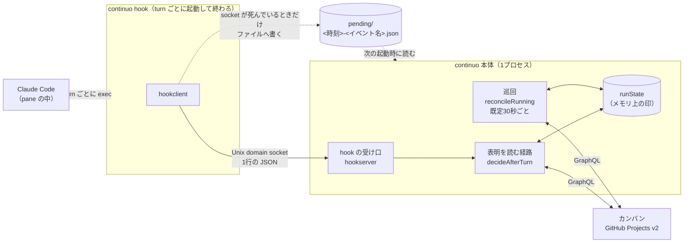
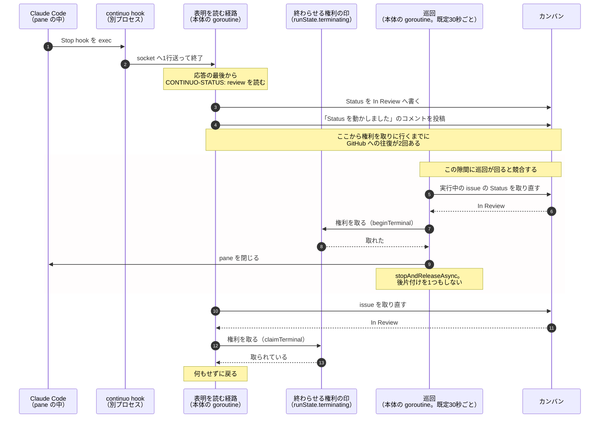

# イベントがどのプロセスを通って届くか

**この文書が答えること。**
**「表明を読む経路」と「巡回」は同じプロセスの中にいて、メモリを共有している。**
**hook だけが別プロセスで、Unix domain socket を通る。**

---

## 1. プロセスは2種類しかない

| 何 | プロセス | 何をするか |
| --- | --- | --- |
| **continuo 本体** | **1つだけ**（`flock(2)` で二重起動を止める） | 巡回・表明の読み取り・後片付けを、**同じプロセスの中の goroutine で回す** |
| **`continuo hook`** | **turn ごとに起動して、すぐ終わる** | 標準入力を読んで socket へ1行送るだけ |

**Claude Code が turn ごとに `continuo hook` を exec する。**
そのコマンド行は [internal/orchestrator/settings.go:352-353](../../internal/orchestrator/settings.go#L352-L353) が組み立てて、
issue ごとの設定ファイルへ書く。

```
<continuo のパス> hook --socket <socket のパス> --pending-dir <逃がし先のパス>
```

---

## 2. 全体の絵



**巡回と表明を読む経路は、`runState` という同じメモリを見ている。**
**ファイルにも DB にも書いていない**（[internal/orchestrator/runstate.go:47](../../internal/orchestrator/runstate.go#L47)。「プロセスが落ちると消える。永続化層は作らない」）。

**ファイルを使うのは1箇所だけである。**
**hook が socket へ届かなかったときの逃がし先**（設計 3-19）。
**そこへ書かれたものは、continuo が次に起動したときに読む。**動いている continuo は読まない。

---

## 3. エージェントが「終わりました」と言ったとき



**赤い枠が、後片付けが飛ぶ窓である。**

---

## 4. 巡回は Status ごとに違うことをする

| カンバンの Status | 巡回が呼ぶもの | 後片付けをするか |
| --- | --- | --- |
| **終端**（`Done`） | `finishRunAsync`（[internal/orchestrator/lifecycle.go:539](../../internal/orchestrator/lifecycle.go#L539)） | **する。4つとも** |
| **引き渡し**（`In Review` / `Blocked`） | `stopAndReleaseAsync`（[internal/orchestrator/lifecycle.go:716](../../internal/orchestrator/lifecycle.go#L716)） | **しない** |

**どちらも `go func()` で別のスレッドへ逃がしている。**巡回のループは止まらない。

**引き渡しのときに後片付けをしない理由は、コードにこう書いてある**
（[internal/orchestrator/lifecycle.go:722-725](../../internal/orchestrator/lifecycle.go#L722-L725)）。

> **この run は既に終わったものとして扱われている（Status は動かした、コメントも投稿した）。**

**「人間が動かしたのだから、continuo がやることは残っていない」という前提である。**
**continuo 自身が書いたときには、この前提が成り立たない。**

---

## 5. 後片付けとは何か

**`finishRunClaimed`（[internal/orchestrator/lifecycle.go:556-582](../../internal/orchestrator/lifecycle.go#L556-L582)）が8つやる。**
**巡回の `stopAndReleaseAsync` は、そのうち3つしかやらない。**

| 順 | 何をするか | 巡回はやるか |
| --- | --- | --- |
| 1 | ログ「run を終えます」 | **やらない** |
| 2 | 失敗したときだけ Status を落とす | やらない（失敗ではないので不要） |
| 3 | **エージェントがコメントを書いたか確かめる**（`ensureAgentComment`） | **やらない** |
| 4 | run のあとに走らせるものがあれば走らせる | やる |
| 5 | worker を止める | やる |
| 6 | 失敗の回数を消す | **やらない** |
| 7 | **片付ける Status なら worktree を片付ける** | **やらない** |
| 8 | 印から外す | やる |

**3 が最大1時間かかることがある。**
エージェントがコメントを書き忘れていたら、セッションを復元して書かせるためである
（[internal/orchestrator/comment.go:185-188](../../internal/orchestrator/comment.go#L185-L188)。
`claude.turn_timeout_ms` の既定は1時間）。

**だから同期では呼べない。**ただし `finishRunAsync` は別スレッドへ逃がしているので、**巡回のループは止まらない。**

---

## 6. 判断を間違えないために

| よくある誤解 | 実際 |
| --- | --- |
| **「巡回と表明を読む経路は別プロセスだから、状態を共有できない」** | **同じプロセスである。**`runState` を共有している |
| **「hook も同じプロセスだから、直接呼べる」** | **別プロセスである。**socket を通る |
| **「巡回は後片付けができない」** | **終端のときは既にやっている。**引き渡しのときだけやらない |
| **「巡回に寄せるとループが止まる」** | **止まらない。**`go func()` で逃がしている |
| **「状態はファイルに書いてある」** | **書いていない。**プロセスが落ちると消える。ファイルは hook の逃がし先だけ |
