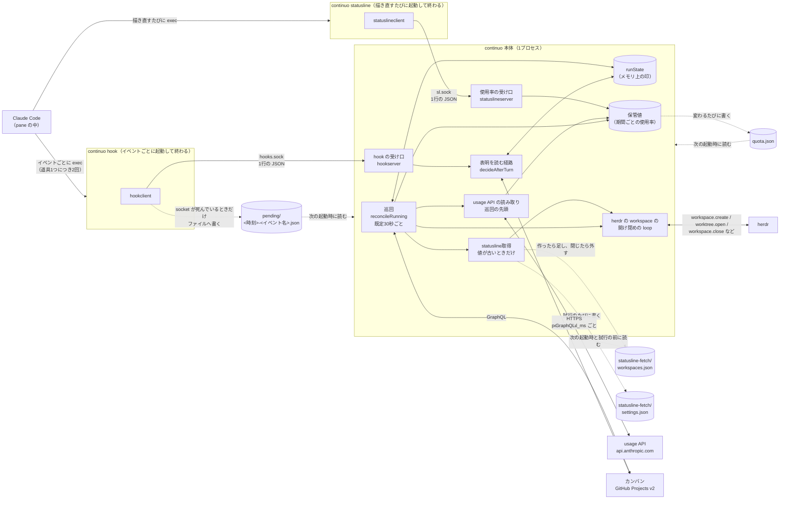
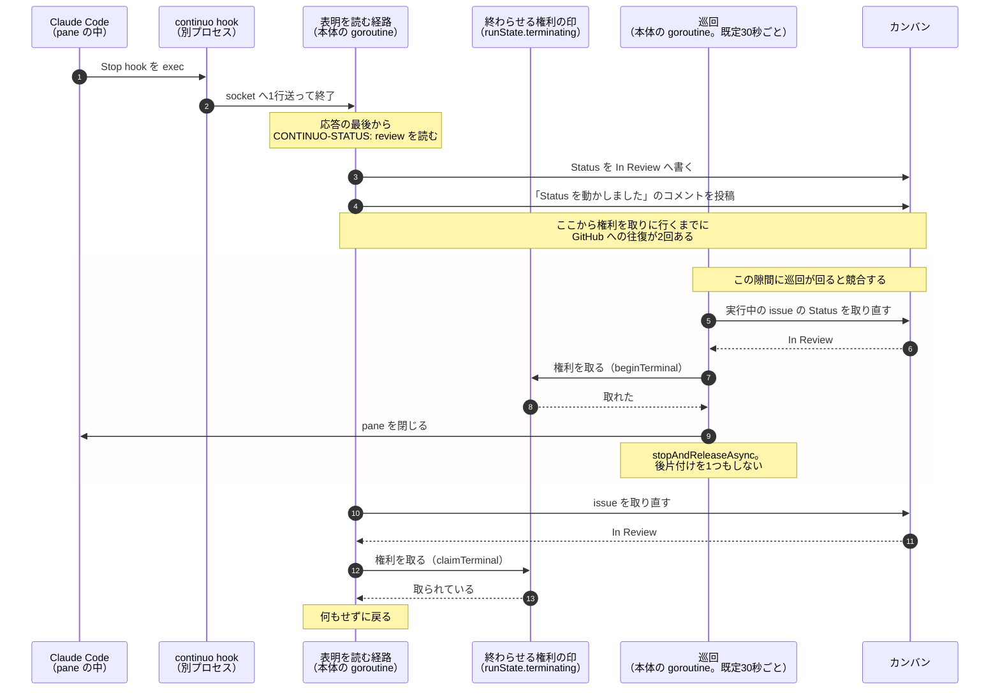

# イベントがどのプロセスを通って届くか

**この文書が答えること。**
**「表明を読む経路」と「巡回」は同じプロセスの中にいて、メモリを共有している。**
**hook とステータスラインのコマンドだけが別プロセスで、それぞれ別の Unix domain socket を通る。**

---

## 1. プロセスは3種類しかない

| 何 | プロセス | 何をするか |
| --- | --- | --- |
| **continuo 本体** | **ロックファイル1本につき1つ**（`flock(2)` で二重起動を止める。`--id <名前>` を付けるとロックが分かれ、1台で2本以上動く。設計 3-17b） | 巡回・表明の読み取り・後片付けを、**同じプロセスの中の goroutine で回す** |
| **`continuo hook`** | **イベントが起きるたびに起動して、すぐ終わる** | 標準入力を読んで hook の socket（`hooks.sock`）へ1行送るだけ |
| **`continuo statusline`** | **Claude Code がステータスラインを描き直すたびに起動して、すぐ終わる**（`rate_limit.source` が `none` でなく、`sl.sock` を開けているときだけ。issue #284） | 標準入力から使用率を取り出して使用率の socket（`sl.sock`）へ1行送り、標準出力へ固定の `continuo` を出すだけ |

**Claude Code がイベントのたびに `continuo hook` を exec する。**

**turn ごとではない。**continuo が issue ごとの設定ファイルへ登録する hook は8種類あり
（[internal/orchestrator/settings.go:128-135](../../internal/orchestrator/settings.go#L128-L135)）、
**そのうち `PreToolUse` と `PostToolUse` は matcher が `*` である。**
**つまり、エージェントが道具を1つ叩くたびに2回起動する。**

    Stop / UserPromptSubmit / SubagentStop / SubagentStart / Notification / SessionStart   … 節目ごとに1回
    PreToolUse / PostToolUse（matcher は `*`）                                             … 道具を叩くたびに1回ずつ

そのコマンド行は [internal/orchestrator/settings.go:387-388](../../internal/orchestrator/settings.go#L387-L388) が組み立てて、
issue ごとの設定ファイルへ書く。

```
<continuo のパス> hook --socket <socket のパス> --pending-dir <逃がし先のパス>
```

**Claude Code は、ステータスラインを描き直すたびに `continuo statusline` を exec する。**
描き直すのは API の応答のあとなどで、**何もしていない間は走らない**（2026-09-25 の実測。設計 3-27）。
そのコマンド行は [internal/orchestrator/settings.go:100-108](../../internal/orchestrator/settings.go#L100-L108) が組み立てて、
同じ設定ファイルの `statusLine` へ書く。**statusline取得**（値が古いときに continuo が短い haiku を起動して値を取りに行くこと）も、
別の設定ファイル（`statusline-fetch/settings.json`）で同じコマンド行を使う。

```
<continuo のパス> statusline --socket <sl.sock のパス>
```

**`continuo statusline` は hook の socket へ送らない。**hook の socket は、`session_id` が知っている run のものなら stall の時計を進め直すので、
ステータスラインの行を混ぜると、固まった run を止められなくなる（設計 3-23）。**逃がし先も持たない。**送れなければ何も書かずに終了コード 0 で終わる。

**usage API はプロセスを増やさない。**`rate_limit.source: oauth_usage_api`（既定）では、continuo 本体の巡回が、その先頭で usage API を HTTPS で読む（`poll_interval_ms` ごと）。
**ステータスラインは、usage API が誤りのあいだの受け口である**（設計 3-27）。issue の pane の値は、どの状態でも同じ保管値へ入る。statusline取得を開くのは、usage API が誤りで値が古いときだけである。

---

## 2. 全体の絵


```mermaid
flowchart LR
    subgraph P1["continuo 本体（1プロセス）"]
        direction TB
        R["巡回<br/>reconcileRunning<br/>既定30秒ごと"]
        T["表明を読む経路<br/>decideAfterTurn"]
        M[("runState<br/>（メモリ上の印）")]
        HS["hook の受け口<br/>hookserver"]
        SS["使用率の受け口<br/>statuslineserver"]
        Q[("保管値<br/>（期間ごとの使用率）")]
        SF["statusline取得<br/>値が古いときだけ"]
        UA["usage API の読み取り<br/>巡回の先頭"]
        L["herdr の workspace の<br/>開け閉めの loop"]
        R <--> M
        T <--> M
        HS --> T
        SS --> Q
        R --> UA
        UA --> Q
        R --> Q
        R --> SF
        SF --> L
        R --> L
    end

    subgraph P2["continuo hook（イベントごとに起動して終わる）"]
        HC["hookclient"]
    end

    subgraph P3["continuo statusline（描き直すたびに起動して終わる）"]
        SC["statuslineclient"]
    end

    A["Claude Code<br/>（pane の中）"] -->|"イベントごとに exec<br/>（道具1つにつき2回）"| P2
    A -->|"描き直すたびに exec"| P3
    HC -->|"hooks.sock<br/>1行の JSON"| HS
    SC -->|"sl.sock<br/>1行の JSON"| SS
    HC -.->|"socket が死んでいるときだけ<br/>ファイルへ書く"| F[("pending/<br/>&lt;時刻&gt;-&lt;イベント名&gt;.json")]
    F -.->|"次の起動時に読む"| P1
    Q -.->|"変わるたびに書く"| QF[("quota.json")]
    QF -.->|"次の起動時に読む"| P1
    SF -.->|"作ったら足し、閉じたら外す"| WF[("statusline-fetch/<br/>workspaces.json")]
    WF -.->|"次の起動時と試行の前に読む"| P1
    SF -.->|"試行のたびに書く"| SJ[("statusline-fetch/<br/>settings.json")]
    L <-->|"workspace.create / worktree.open /<br/>workspace.close など"| HD["herdr"]
    UA <-->|"HTTPS<br/>poll_interval_ms ごと"| API["usage API<br/>api.anthropic.com"]
    R <-->|"GraphQL"| K["カンバン<br/>GitHub Projects v2"]
    T <-->|"GraphQL"| K
```

**巡回と表明を読む経路は、`runState` という同じメモリを見ている。**
**ファイルにも DB にも書いていない**（[internal/orchestrator/runstate.go:64](../../internal/orchestrator/runstate.go#L64)。「プロセスが落ちると消える。永続化層は作らない」）。

**ただし、ファイルに書いているものが5つある。**`runState` の話と混ぜてはならない。
**どれも `<実行時ディレクトリ>`（hook の socket を置くディレクトリ）の下か worktree の中にあり、復元に使うのは身元ファイルだけである。**

| 何を | どこへ | 誰がいつ読むか |
| --- | --- | --- |
| **worktree の身元**（どの issue の worktree か） | **`<worktree>/.continuo.json`**（`workspace.identity_file` で名前を変えられる。既定は [internal/config/default.go:151](../../internal/config/default.go#L151)） | **動いている continuo が、巡回のたびに読み直す**（[internal/workspace/scan.go:45](../../internal/workspace/scan.go#L45) の `ReadIdentity`） |
| **hook が socket へ届かなかったときの逃がし先**（設計 3-19） | `pending/<時刻>-<イベント名>.json` | **continuo が次に起動したときに読む。**動いている continuo は読まない |
| **使用率の保管値**（期間ごとの使用率と `resets_at`。設計 3-4b・3-27） | `<実行時ディレクトリ>/quota.json` | **continuo が次に起動したときに、`sl.sock` を開く前に読む。**動いている continuo は書くだけで読まない。上限の最中に立て直しても、回復待ちの判定を効かせるため |
| **閉じ残しの statusline取得用の workspace の ID**（設計 3-4b） | `<実行時ディレクトリ>/statusline-fetch/workspaces.json` | **continuo が起動したとき（復元の前）と、statusline取得を始める前に読み、閉じる** |
| **statusline取得用の設定ファイル**（`statusLine` と `env` だけ。設計 3-12） | `<実行時ディレクトリ>/statusline-fetch/settings.json` | **continuo は読まない。**statusline取得で起動する Claude Code が `--settings` で読む。試行のたびに書き直す |

**身元ファイルがあるので、continuo は落ちて上がり直しても、どの worktree がどの issue のものかを取り戻せる。**
**取り戻せないのは `runState` が持っている途中の状態のほうである**（何回目の試行か、いつ最後にコメントを見たか、など）。

---

## 3. エージェントが「終わりました」と言ったとき


```mermaid
sequenceDiagram
    autonumber
    participant A as Claude Code<br/>（pane の中）
    participant H as continuo hook<br/>（別プロセス）
    participant T as 表明を読む経路<br/>（本体の goroutine）
    participant G as 終わらせる権利の印<br/>（runState.terminating）
    participant R as 巡回<br/>（本体の goroutine。既定30秒ごと）
    participant K as カンバン

    A->>H: Stop hook を exec
    H->>T: socket へ1行送って終了
    Note over T: 応答の最後から<br/>CONTINUO-STATUS: review を読む
    T->>K: Status を In Review へ書く
    T->>K: 「Status を動かしました」のコメントを投稿
    Note over T,K: ここから権利を取りに行くまでに<br/>GitHub への往復が2回ある

    rect rgba(255, 235, 235, 0.1)
        Note over R,K: この隙間に巡回が回ると競合する
        R->>K: 実行中の issue の Status を取り直す
        K-->>R: In Review
        R->>G: 権利を取る（beginTerminal）
        G-->>R: 取れた
        R->>A: pane を閉じる
        Note over R: stopAndReleaseAsync。<br/>後片付けを1つもしない
    end

    T->>K: issue を取り直す
    K-->>T: In Review
    T->>G: 権利を取る（claimTerminal）
    G-->>T: 取られている
    Note over T: 何もせずに戻る
```

**赤い枠が、後片付けが飛ぶ窓である。**

---

## 4. 巡回は Status ごとに違うことをする

| カンバンの Status | 巡回が呼ぶもの | 後片付けをするか |
| --- | --- | --- |
| **終端**（`Done`） | `finishRunAsync`（[internal/orchestrator/lifecycle.go:602](../../internal/orchestrator/lifecycle.go#L602)） | **する。4つとも** |
| **引き渡し**（`In Review` / `Blocked`） | `stopAndReleaseAsync`（[internal/orchestrator/lifecycle.go:880](../../internal/orchestrator/lifecycle.go#L880)） | **しない** |

**どちらも `go func()` で別のスレッドへ逃がしている。**巡回のループは止まらない。

**引き渡しのときに後片付けをしない理由は、コードにこう書いてある**
（[internal/orchestrator/lifecycle.go:905-908](../../internal/orchestrator/lifecycle.go#L905-L908)）。

> **この run は既に終わったものとして扱われている（Status は動かした、コメントも投稿した）。**

**「人間が動かしたのだから、continuo がやることは残っていない」という前提である。**
**continuo 自身が書いたときには、この前提が成り立たない。**

---

## 5. 後片付けとは何か

**`finishRunClaimed`（[internal/orchestrator/lifecycle.go:622-677](../../internal/orchestrator/lifecycle.go#L622-L677)）が9つやる。**
**巡回の `stopAndReleaseAsync` は、そのうち3つしかやらない。**

| 順 | 何をするか | 巡回はやるか |
| --- | --- | --- |
| 1 | ログ「run を終えます」 | **やらない** |
| 2 | **バックグラウンド処理の申告を1度見て、動いていれば待つ**（`waitForBackgroundTasks`。設計 3-81） | **やらない** |
| 3 | 失敗したときだけ Status を落とす | やらない（失敗ではないので不要） |
| 4 | **エージェントがコメントを書いたか確かめる**（`ensureAgentComment`） | **やらない** |
| 5 | run のあとに走らせるものがあれば走らせる | やる |
| 6 | worker を止める | やる |
| 7 | 失敗の回数を消す | **やらない** |
| 8 | **片付ける Status なら worktree を片付ける** | **やらない** |
| 9 | 印から外す | やる |

**4 が最大1時間かかることがある。**
エージェントがコメントを書き忘れていたら、セッションを復元して書かせるためである
（[internal/orchestrator/comment.go:305-314](../../internal/orchestrator/comment.go#L305-L314)。
`claude.turn_timeout_ms` の既定は1時間）。

**だから同期では呼べない。**ただし `finishRunAsync` は別スレッドへ逃がしているので、**巡回のループは止まらない。**

---

## 6. 判断を間違えないために

| よくある誤解 | 実際 |
| --- | --- |
| **「巡回と表明を読む経路は別プロセスだから、状態を共有できない」** | **同じプロセスである。**`runState` を共有している |
| **「hook も同じプロセスだから、直接呼べる」** | **別プロセスである。**socket を通る。`continuo statusline` も同じく別プロセスである |
| **「巡回は後片付けができない」** | **終端のときは既にやっている。**引き渡しのときだけやらない |
| **「巡回に寄せるとループが止まる」** | **止まらない。**`go func()` で逃がしている |
| **「状態はファイルに書いてある」** | **`runState` は書いていない。**プロセスが落ちると消える。**ただし worktree の身元は `<worktree>/.continuo.json` に書いてあり、巡回のたびに読み直している** |
| **「hook は turn ごとに1回だけ起動する」** | **道具を1つ叩くたびに `PreToolUse` と `PostToolUse` で2回起動する。**matcher が `*` である（[internal/orchestrator/settings.go:134-135](../../internal/orchestrator/settings.go#L134-L135)） |
| **「ステータスラインの行も hook の socket に届く」** | **別の socket（`sl.sock`）である。**`continuo statusline` は `continuo hook` とは別のプロセスで、run の状態（hook の時刻・stall の時計）へ何も書かない（設計 3-27） |
