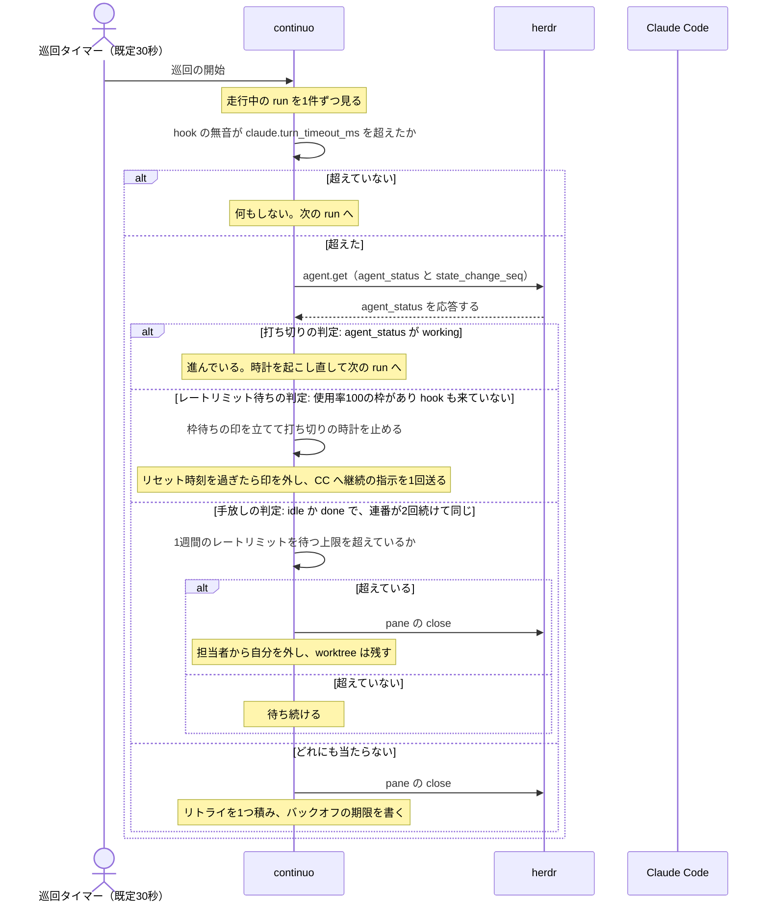

# turn の終わりと「止まっている」の検知

**この文書は、continuo が「Claude Code の pane は止まっているか」を判断するために使える信号を、
1つずつ測って並べたものである。**

---

## 0. この文書の使い方

**言いたいこと。**この判定は、レビューのたびに同じ境目で Critical を出していた。
**条件が確定していなかったので、指摘のたびに場当たりで均衡を動かしていた。**
**この文書は、その条件を確定させるための土台である。**
**周回数と件数は書かない**（[.claude/rules/reporting.md](../../.claude/rules/reporting.md) の
「数字は、合否の線とセットでしか出さない」。労力の量は品質の根拠にならない）。
**この文書の変更の履歴も書かない。**周ごとの判断は、対になる issue のコメントに残す
（[CLAUDE.md](../../CLAUDE.md) の「コードレビュー記録フロー」）。**ここに置くのは、いまの条件と測り方だけである。**

| 何 | どうするか |
| --- | --- |
| **誰が読むか** | **この issue に限らない。**「止まっているか」を判断する必要が出た全ての作業で読む |
| **何が書いてあるか** | **使える信号の全部**（3節。8つ）。**測って書いた6つ**（3-1〜3-6）**は「何を答えるか」「どう測ったか」「結果」「限界」の4つを揃える。****continuo が自分で持つ2つ**（3-7 の時計と 3-8 の subagent の一覧）**は、測るのではなくコードを読んで書く**ので「どう測ったか」を持たない |
| **なぜ手法まで書くか** | **同じ調査を何度もやり直しているためである。**この文書だけで再検証できる形にする |
| **間違いを見つけたら** | **その場で直す。**測り直した日付と、叩いたコマンドを添える |
| **実装へのリンクを直したら** | **中身で検算する。**行が空でないことを見るだけでは足りない（2026-09-08 に17本が隣の門へ着地していた。下のコマンド） |
| **測っていないことは** | **「測っていない」と書く。**空欄にしない |

**実装へのリンクを検算するコマンド。**
**この文書は `internal/` の行番号を70本以上で根拠にしている。**
**行を足すと、その下を指すものが全部ずれる。**

**リポジトリの根で叩くこと。**パスを相対で組み立てている。

```sh
python3 - <<'EOF'
import re, pathlib
DOC = "docs/spec/turn_end_detect_mechanizm.md"
doc = pathlib.Path(DOC).read_text(encoding="utf-8")
# markdown link と、括弧やバッククォートの中の裸の参照の両方を拾う
# 範囲リンク（#L619-L643）は終わりの行も見る
# **空行・区切り行だけでは足りない。**`//` だけ・`}` だけの行に着地していると、
# **位置は合っているのに、開いても何も分からない**（8周目に5本見つかった）
pat = re.compile(r'(?:\.\./\.\./)?(internal/[a-z/]*\.go|[a-z_]+\.go)[:#]L?(\d+)(?:-L?(\d+))?')
seen = set()
for m in pat.finditer(doc):
    f = m.group(1)
    cands = [pathlib.Path(f)] if "/" in f else sorted(pathlib.Path("internal").rglob(f))
    hit = [c for c in cands if c.exists()]
    if len(hit) != 1:
        print(f"!! ファイルが{'無い' if not hit else '2つ以上ある'} {f} → {hit}")
        continue
    lines = hit[0].read_text(encoding="utf-8").split("\n")
    for a in [int(x) for x in (m.group(2), m.group(3)) if x]:
        if (hit[0], a) in seen:
            continue
        seen.add((hit[0], a))
        if a > len(lines):
            print(f"!! 行が無い {hit[0]}:{a}（{len(lines)} 行しかない）")
            continue
        body = lines[a-1].strip()
        # **範囲の終わりは `}` に着地してよい。**始まりと単独の参照は、中身のある行を指すこと
        start = (a == int(m.group(2)))
        if start and body in ("", "//", "}"):
            print(f"!! 中身が無い行を指している {hit[0]}:{a}（{body!r}）")
            continue
        print(f"{hit[0]}:{a} | {body[:70]}")
EOF
```

**出た行を目で読むこと。**「空行でない」で通してはならない。
**2026-09-08 に、`(reconcile.go:765)` のような裸の参照が1本、隣の門を指したまま残っていた。**
**markdown link だけを見る版の検算では拾えなかった。**だから上の版は両方を拾う。
**行が無いものは飛ばす**（最初の版は `IndexError` で落ち、残りを1本も検査しなかった）。
**範囲リンクは終わりの行も見る。**2026-09-08 の版は開始行だけを見ており、
**47本の範囲リンクの終わりが1本も検査されていなかった。**
**基底名だけを書いた参照は、当たるファイルが2つ以上あれば止める**（`internal/` には `handoff.go` が2本ある）。

**ずれていたら、目印の文字列**（関数名・`if` の条件・コメントの1行）**で測り直して貼り直す。**
**機械的に何行ずらす、は誤りである。**ずれ幅は場所ごとに違う。

**行番号を、ファイル名なしで書いてはならない。**
`lifecycle.go:573`・`697`・`761` のように2つ目以降を裸にすると、**上のコマンドが1本も拾わない。**
**毎回 `internal/orchestrator/lifecycle.go:702` と書ききること。**長くなっても、検算に載るほうが大事である。

**実測の環境。**特記が無ければ、次のとおりである。

| 何 | 値 |
| --- | --- |
| 測った日 | 2026-09-08 |
| herdr | **0.8.2**（`herdr --version`） |
| Claude Code | **2.1.263**（`claude --version`） |
| herdr のソース | **0.9.0 を clone した**（`v0.8.2` の tag は公開されていない）。**判定に使う点は実機でも裏を取ってある** |

**herdr のソースの取り方。**この文書は herdr のソースのファイル名と行番号を15箇所で根拠にしている
（検索パターン `src/[a-z_/]*\.rs:[0-9]*` で、重複を除いた `file:line` が15）。
**同じものを手元に出すコマンドを、ここに置く。**

```sh
git clone --depth 1 --branch v0.9.0 https://github.com/herdrdev/herdr.git
```

**行番号は upstream で動く。**版が違うときは、行番号ではなく**関数名と文字列**で探すこと
（例: `osc_title_working` / `full_lifecycle_hook_authority` / `state_change_seq`）。
**ずれていたら、この文書の側を測り直して直す。**

**Claude Code の公式ドキュメントの取り方。**この文書は `hooks.md` と `interactive-mode.md` の行番号を
**7箇所**で根拠にしている（重複を除いた `file:line` の組では10）。
**`sub-agents.md` と `hooks-guide.md` は行番号を持たない**（6節が「3ファイル6204行で0件」と総行数だけを使う）。
**この checkout には1本も入っていない**（検索パターン `**/interactive*.md`、対象パスはリポジトリ全体で0件）。
**測ったのは docs.claude.com の版である**（2026-09-08 時点。Claude Code 2.1.263）。

| ファイル | どこから取るか |
| --- | --- |
| `hooks.md` | https://docs.claude.com/en/docs/claude-code/hooks.md |
| `hooks-guide.md` | https://docs.claude.com/en/docs/claude-code/hooks-guide.md |
| `interactive-mode.md` | https://docs.claude.com/en/docs/claude-code/interactive-mode.md |
| `sub-agents.md` | https://docs.claude.com/en/docs/claude-code/sub-agents.md |

**こちらも行番号は版で動く。**`Usage limit reached` や `stop_hook_active` のような
**原文の文字列で探すこと。**

---

## 1. 用語

**一般的でない語を、先に定義する。**

| 語 | 意味 |
| --- | --- |
| **pane** | herdr が管理する画面の1枚。continuo はここで Claude Code を起動する |
| **turn** | Claude Code へ1回指示を送ってから、その応答が終わるまで |
| **枠** | Claude の定額プランの上限。**3種類ある**（5時間ごと／1週間の全体／1週間のモデル別） |
| **余裕値** | `100 − 使用率 − マージン`。0以下なら「余裕が無い」 |
| **手放す** | その issue の担当者から自分を外し、他の機械が入札し直せる状態へ戻すこと |
| **打ち切る** | 固まったと判断して worker を止め、リトライを積むこと |
| **枠待ちの印** | その run が枠の回復を待っている、という continuo 側の記録。**打ち切りの時計を止める** |
| **無音** | **「hook が来ていない」ではない。**`LastSeenAt`（打ち切りの時計）から経った時間である。この時計は **run を作った時点**・hook・turn を送った時点・枠待ちを外した時点・`agent_status` が `working` だったのを確かめた時点の**5つ**で進む（3-7） |
| **閾値** | `claude.turn_timeout_ms`（既定 3600000 ミリ秒＝1時間）。**0以下にすると打ち切りを行わない**（4-6） |
| **巡回** | continuo が全部の run を上から順に見て回ること。**間隔は `polling.interval_ms`（既定 30000 ミリ秒＝30秒。[internal/config/default.go](../../internal/config/default.go)）。**この文書の「1巡回ぶん」「2巡回（既定60秒）」は、全部この値である |
| **面倒を見ている** | 手放しの側が「この run はこちらで始末する」と名乗ること。**名乗った run は、同じ巡回の打ち切りが飛ばす**（4-4） |

---

## 2. 判定が要る場面は3つある。混ぜてはならない

**4節が条件を確定させるのは、この3つである。**

| 問い | 誰が使うか | 誤るとどうなるか |
| --- | --- | --- |
| **打ち切りの判定（この run は進んでいるか）** | 打ち切り（`checkStalls`）。**毎巡回・全 run** | 進んでいる run を殺す／固まった run を放置する |
| **手放しの判定（この pane は完全に止まっているか）** | レートリミットが尽きた run の手放し（`paneStopped`）。**まれ** | 動いている pane を閉じて書きかけを失う／永久に手放せない |
| **レートリミット待ちの判定（この run がレートリミットで止まっているか）** | 枠待ちの印（`isQuotaWaiting`） | 打ち切りの時計を止めるべきでない run で止める／止めるべき run で止めない |

**この3つを1つの関数で答えようとして、過去に失敗している**（5節。9行10件）。

**3つが1回の巡回でどう並ぶか。**



**3つの順番は入れ替えられない。**
**打ち切りの判定を先に置く理由は 4-1 にある**（レートリミット待ちの判定を先に置くと、
1時間を超える1回の道具の呼び出しの最中に、正常な run が枠待ちと名乗る）。

### 2-1. `agent_status` を読んで進退を決める場所は、この3つだけではない

**4節の条件は、上の3つにしか当てはまらない。**
**下の7箇所は、同じ信号を読んでいるが、別の問いに答えている。**
**4節をそのまま持ち込んではならない。**

**実測（2026-09-08）。**検索パターン
`AgentStatusWorking\|AgentStatusIdle\|AgentStatusDone\|AgentStatusBlocked`、
対象パス `internal/orchestrator/`（`_test.go` を除く）。**17行・9関数。**
うち2関数が打ち切りの判定（`checkStalls`）と手放しの判定（`paneStopped`）なので、**下の表は残り7つである。**
**レートリミット待ちの判定 は1行も当たらない。**`isQuotaWaitingWith` は `agent_status` を読まず、
使用率と `runIdleForTurnTimeout` だけで決める
（[internal/orchestrator/turn.go](../../internal/orchestrator/turn.go)）。

| どこ | 何を決めるか | どこへ倒すか | 読めなかったら |
| --- | --- | --- | --- |
| **`confirmStartup`**（[internal/orchestrator/dispatch.go](../../internal/orchestrator/dispatch.go)） | 起動できたと見なすか、`agent.start` をやり直すか | **`idle`/`done` かつ `interactive_ready` が成功。**`working` と `unknown` はどちらも `herdr.startup_timeout_ms` まで待つが、**超えたときの向きが逆である**——`working` は包まないので**やり直さない**（同じ関数の `working` の枝）、`unknown` は `ErrStartupRetryable` を包むので**やり直す**（同じ関数の `default:`。`unknown` はここで受ける。`case herdr.AgentStatusUnknown` は無い）。`blocked` は `esc` を送って失敗 | **3通りに割れる。**(一) `agent_not_found` で、作業中にしか出ない hook が届いていれば `ErrStartupBusy`（やり直さない。同じ関数の `agent_not_found` の枝）。(二) `agent_not_found` で届いていなければ `ErrStartupRetryable`（やり直す）。**(三) それ以外の読み取り失敗は包まないので、やり直さずに失敗する**（同じ関数の `case err != nil:`。`agent_not_found` 以外の読み取り失敗） |
| **`sendTurn`**（[internal/orchestrator/turn.go](../../internal/orchestrator/turn.go)） | 待ち受けが返った直後、引き渡すか turn の終わりを確かめるか | `blocked` なら引き渡し。**それ以外は全部 `confirmTurnEnd` へ**（`working` と `unknown` も。「想定外なので `Stop` を確かめてから判断する」） | — |
| **`afterWaitTimeout` の待ち直し**（[internal/orchestrator/turn.go](../../internal/orchestrator/turn.go)） | 枠待ちの最中に待ちを終えるか | `blocked` なら引き渡し。`idle` かつ `Stop` を受けていれば終わり | — |
| **`confirmTurnEnd`**（[internal/orchestrator/turn.go](../../internal/orchestrator/turn.go)） | 差し戻して書き直させている最中を、終わったと読むか | **順に3つ見る。**(一) 枠待ちなら待ちへ。(二) `blocked` なら引き渡し。**(三) 書き直しを待っている窓でだけ、`working` でなければ turn の終わりとして進む** | **進む側**（(三) の条件に `stErr != nil` が入っている） |
| **`stillWorkingAfterStop`**（[internal/orchestrator/turn.go](../../internal/orchestrator/turn.go)） | 空の `Stop` のあと turn を終えるか、待ち直すか | `working` なら**待ち直す** | 終える側 |
| **`afterQuotaReset`**（[internal/orchestrator/turn.go](../../internal/orchestrator/turn.go) の `afterQuotaReset`） | 枠明けに継続の指示を送るか | **`idle`/`done` が「送ってよい」。`working` は「送らない」。`blocked` は引き渡しへ回る**（同じ関数の `switch`） | **送る側** |
| **復元の引き継ぎ**（[internal/orchestrator/restore.go](../../internal/orchestrator/restore.go)） | 再起動後、その pane をどう引き継ぐか | **`idle`/`done` は引き継いで turn を送る**（同じ経路の `needsPrompt = true`。いちばん普通の経路）。`working` なら引き継ぐが turn は送らず、終わりを待つ。**`blocked` は `failure_state` へ落としてから pane を閉じる**（同じ経路の `blocked` の枝。turn を送ると保留中の権限要求が承認されるため） | **pane を閉じる**（同じ経路の `default:`。`unknown` も同じ枝。**`failure_state` へは落とさない**） |

**`blocked` は3通りに扱われている。**打ち切りの判定 は打ち切り、手放しの判定 は「止まっているに含めない」、
**復元は `failure_state` へ落とす。**揃えようとするときは、3つとも見ること。

**倒す向きは3通りある。**同じ信号の同じ失敗が、問いごとに違う解決をされている。

| 向き | どこ |
| --- | --- |
| **`working` が「進んでいる」** | 打ち切りの判定・`stillWorkingAfterStop`・`confirmTurnEnd` |
| **`idle`/`done` が「止まっている」** | 打ち切りの判定・手放しの判定 |
| **`idle`/`done` が「介入してよい」** | **`afterQuotaReset`。**読めなかったときも「送る側」へ倒す |

**これは誤りではない。**問いが違うので、間違えたときの損も違う。
**`confirmTurnEnd` の `working` でなければ進む**を打ち切りの判定・手放しの判定 に合わせて書き換えてはならない。
**差し戻して書き直させている最中を「終わった」と読むことになる**——5-1 の 2026-09-02 の事故である。

**5節の9行10件のうち、打ち切りの判定・手放しの判定・レートリミット待ちの判定 に属するのは4件である。**
**残りは、この表の場所と、turn の終わりの判定と、subagent の追跡で起きている。**
**条件を強くしても、その6件は塞がらない。**

---

## 3. 使える信号

### 3-1. herdr の `agent_status`

**何を答えるか。**herdr が画面と端末タイトルを正規表現で照合した結果。

| 値 | 意味（herdr のソースの doc コメント） |
| --- | --- |
| `idle` | エージェントが終わり、プロンプトが見えていて、何も起きていない。**かつ tab が人間に見られた** |
| `done` | **`idle` と同じ状態のうち、tab がまだ人間に見られていないもの** |
| `working` | エージェントが実際に働いている／処理している |
| `blocked` | 人間の入力を必要としていて、返答待ちで止まっている |
| `unknown` | **ただのシェル、または認識できないプログラム。**agent を特定できていない pane だけ |

**どう測ったか。**herdr のソース `src/detect/mod.rs:11-20`（`AgentState`）と
`src/app/api_helpers.rs:96-107`（`pane_agent_status`）を読んだ。
**`Done` は `AgentState` に無く、API へ出すときに `(Idle, seen=false)` から作られる。**

```rust
// src/app/api_helpers.rs:96-107
match (state, seen) {
    (AgentState::Idle, false) => AgentStatus::Done,
    (AgentState::Idle, true)  => AgentStatus::Idle,
    (AgentState::Working, _)  => AgentStatus::Working,
    (AgentState::Blocked, _)  => AgentStatus::Blocked,
    (AgentState::Unknown, _)  => AgentStatus::Unknown,
}
```

**限界が2つある。**

**(一) 時間のしきい値が1つも無い。**判定は画面と端末タイトルの照合だけである。
`src/detect/` の本番コードに時間の定数は無い（`git grep -c "Duration\|Instant" -- src/detect/` が返すのは
`src/detect/mod.rs` の3行だけで、それは `#[cfg(test)]` の中）。
**つまり「何秒黙っていたら idle」ではない。**

**(二) どの規則にも当たらなかったときの既定値が `idle` である。**
`src/detect/manifest.rs:498` の `fallback_explain` が、Claude と分かっている pane では `AgentState::Idle` を返す
（**`529-533` がその分岐**。tag `v0.8.2` で測り直した。2026-09-09。**以前この文書は `565-573` と書いていたが、
そこは別の関数だった**）。
**「本当にプロンプトが見えている `idle`」と「herdr が読めなかった `idle`」が、`agent.get` の戻り値では区別できない。**

**(三) 判定表は herdr のバイナリに入っていない。**`https://herdr.dev/agent-detection/index.toml` から落ちてきて、
`~/.local/state/herdr/agent-detection/remote/claude.toml` に置かれ、**そちらが優先される**
（`src/detect/manifest_update.rs:16` の `DEFAULT_CATALOG_URL`、`src/main.rs:163-164` の `manifest_check`。既定で有効）。
**つまり herdr の版を固定しても、判定の中身は変わる。**

| 何 | 版 | ルールの本数 |
| --- | --- | --- |
| **0.8.2 のバイナリに同梱** | 2026.08.13.1 | 12本 |
| **この機械でいま使われている** | **2026.09.04.1** | **16本** |

**(四) 2026-09-04 より前は、サブエージェント待ち・bash の完了待ちで `idle` が返っていた。**
**足された4本のうち3本が `working` を出すためのもので**（`live_turn_working` / `background_agents_working` /
`background_mcp_task_working`）**、古い表には `working` を出せるルールが2本しか無かった。**
**OSC のタイトルの回転記号が唯一の頼りで、それが取れない瞬間は `live_prompt_box`（idle）が勝っていた。**
**人間が「サブエージェント待ちで idle になっているのをよく見る」と報告しており**（2026-09-09。issue #173）**、
herdr 側が3本を足したこと自体が、その誤判定が実在した証拠である。**

**(五) いまも `idle` に落ちる経路が5つ残っている。**

| 経路 | 中身 |
| --- | --- |
| **OSC のタイトルが消える** | エージェントの process が変わると `clear_agent_osc_state()` が呼ばれる（`src/pane.rs:835`） |
| **OSC のタイトルが上書きされる** | 保持するのは最後の1本だけ。**pane の中の別のプログラムが設定すると置き換わる** |
| **作業中の行が末尾12行から外れる** | 2本のルールが見るのは `bottom_non_empty_lines(12)` だけ |
| **Claude Code の表示の文言が変わる** | 3本とも文言の正規表現で当てている |
| **遷移の保留が効かない** | `working` → `idle` の保留は最大700ミリ秒だが、条件が `!visible_idle` なので、**入力欄が見えている `idle` は保留されず即座に公開される**（`src/pane/agent_detection.rs:47-51`） |

**(六) `done` は人間の視線で消える。**`done` は `(Idle, seen=false)` から作られるので、
`agent.focus` / `pane.focus` を叩くか、**人間が herdr の画面でそのタブを見ると `idle` へ変わり、二度と戻らない**
（`src/app/agents.rs:82`、`src/app/api/panes.rs:177`、`src/app/actions.rs:3110-3115`）。
**そのとき `state_change_seq` は動かない**ので、変わったことにも気づけない。
**continuo は `agent.focus` も `pane.focus` も叩いていない**（検索パターン `AgentFocus\|agent\.focus\|PaneFocus\|pane\.focus`、
対象パス `internal/`、`_test.go` を除いて0件）。

**長い1回のツール呼び出しで黙っている間は `working` のままである。**
**実測（2026-09-08。herdr 0.8.2）：**測る pane で `go test` を1回叩かせながら、その pane の agent を2秒おきに60回読み、
**60サンプル全部が `working` だった。**

**測り直すときの手順。**

**shell の background job では測れない。**`working` の根拠は
**Claude Code が端末タイトルへ書くスピナー1文字**であり（4-1 の限界(二)）、
**`go test ./... &` はその1文字を書かない。**
**測る対象の pane で走っている Claude Code に、長いツール呼び出しを1つやらせること。**

| 順 | 何をするか |
| --- | --- |
| **1** | **測る pane の Claude Code に、時間のかかる道具を1つ叩かせる**（例: `go test ./...` を Bash で。**その pane の Claude Code 自身に叩かせる。**別の pane や shell の `&` ではない） |
| **2** | **測る Claude Code とは別のところから、下のループでその agent を読む。**herdr の socket へ届く shell ならどこでもよい（別の pane でも、pane の外の端末でもよい）。**測る Claude Code 自身に読ませてはならない。**読んでいる間その Claude Code は道具を叩けず、段1 が成り立たなくなる |

```sh
# <agent 名> は herdr agent list で引く。ループを回すのは別の pane である
for i in $(seq 60); do
  herdr agent get "<agent 名>" --json | python3 -c 'import json,sys; print(json.load(sys.stdin)["agent"]["agent_status"])'
  sleep 2
done | sort | uniq -c
```

**このループの形は、結果から組み直したものである。**2026-09-08 に叩いた1行そのものは記録していない。
**次に測る人は、上の形で測って、結果と一緒にコマンドも残すこと。**

**6節が残している宿題**（`Task`（subagent）・`WebFetch`・MCP の呼び出し中も `working` か）**も、
段1 で叩かせる道具をそれへ替えれば、同じ形で測れる。**
**`Task` は shell から起動できないので、必ず Claude Code に叩かせること。**

### 3-2. herdr の `revision`（画面の版）— **continuo の使い方では動かない**

**何を答えるか。****画面ではない。**端末タイトルから装飾を落とした本文が変わった回数である。

**どう測ったか。**

```sh
# 3秒おきに40回、2分間（2026-09-08）。3-3 の state_change_seq も、この40サンプルから取った
for i in $(seq 40); do
  herdr agent list --json \
    | python3 -c 'import json,sys
for a in json.load(sys.stdin)["agents"]:
    print(a["name"], a["agent_status"], a.get("revision"), a.get("state_change_seq"))'
  sleep 3
done
```

**この形も、結果から組み直したものである。**叩いた1行そのものは記録していない。

| agent | 2分間の観測 | `revision` | `state_change_seq` |
| --- | --- | --- | --- |
| `continuo-continuo-246` | 40回とも `working` | **ずっと 1** | ずっと 1378 |
| `continuo-continuo-245` | 40回とも `working` | **ずっと 1** | ずっと 1382 |
| `continuo-continuo-173` | 12回 `working` → 28回 `done` | **ずっと 1** | **1384 → 1385** |

**なぜ動かないか。**herdr のソース上、`revision` を増やす経路は3つしかない。

| 場所 | 何が起きたとき |
| --- | --- |
| `src/terminal/state.rs:227-241` | **端末タイトルの、装飾を落とした本文が変わったとき** |
| `src/app/api/panes.rs:1732-1740` | `pane.report_metadata` で揮発性の付加情報が書き換わったとき |
| `src/app/actions.rs:425-432` | その付加情報が TTL で消えたとき |

**continuo は `pane.report_metadata` を呼ばない**（`git grep -n "report_metadata" -- internal/` は型のコメントだけ）。
**だから continuo にとって `revision` は端末タイトルの本文の版そのものである。**

落とす装飾は、点字1文字か `·✢✳✶✻✽◐◓◑◒` の10文字（`src/terminal/title.rs:1-23`）。
**`agent_status` が `working` を出す根拠にしている、まさにその文字である。**

**continuo は端末タイトルを設定しない**（`git grep -n 'terminal_title\|SetTitle' -- internal/` は読み取り用の型だけ）。
**書いているのは Claude Code 自身で、continuo の pane では `<owner>/<repo>#<番号>` を最後まで変えない。**

**「恒真」とは書かない。**同じ機械の対話用の pane は `revision: 2` を返した
（タイトルの本文が会話の要約で、途中で1度変わったため）。
**正しくは「continuo の使い方では動かない」である。**
**これは仕組みの保証ではなく、いまの Claude Code の振る舞いの観測である。**

### 3-3. herdr の `state_change_seq`（状態が変わった連番）

**何を答えるか。**その agent の状態が最後に変わった時点の通し番号。

**どう測ったか。**上の40サンプルに加えて、ソースで裏を取った。

```rust
// src/app/actions.rs:1874-1879
if change.previous_state != change.state {
    self.next_agent_state_change_seq += 1;
    if let Some(terminal) = self.terminals.get_mut(&terminal_id) {
        terminal.last_agent_state_change_seq = Some(self.next_agent_state_change_seq);
    }
}
```

**通し番号そのものは全体で1本である**（実測で 1378 / 1382 / 1384 と別々なのはそのため）。
**だが刻み直すのは、状態が実際に変わった当の terminal だけである。**
**他の agent が動いても、この agent の値は動かない。**

**`idle` と `done` の行き来では動かない。**あの2つの違いは `pane.seen`（人間がその tab を見たか）で、
**内部の状態は同じ `Idle` である**（3-1 の表）。**人間が herdr の画面を覗いても、この連番は動かない。**

**`agent.get` でも返る。**実測（2026-09-08）。

```
$ herdr agent get continuo-continuo-173
  返ってきた欄（2026-09-09 に全部を数え直した。14欄）:
    agent, agent_session, agent_status, cwd, focused, foreground_cwd,
    interactive_ready, name, pane_id, revision, state_change_seq, tab_id,
    terminal_id, terminal_title, terminal_title_stripped, workspace_id
  state_change_seq = 1448
  revision = 1
  agent_status = working
```

**`...` で省いてはならない。**省いた位置に `terminal_title` と `terminal_title_stripped` が入っており、
**8周目はそこを「型宣言があるから返るはず」と書いて、測らずに結論を出していた**（4-1 の限界(二)）。

**`pane.list` では返らない。**実測で、`pane` の欄は
`agent_status` / `cwd` / `focused` / `foreground_cwd` / `pane_id` / `revision` / `scroll` / `tab_id` / `terminal_id` / `workspace_id` の10個だけだった。
**復元の経路は pane から読むので、そこでは連番を取れない。**

**限界が2つある。**

**(一) `working` が続いている間は動かない。**上の40サンプルで、働き続けた2つは2分間まったく動かなかった。
**「動いているか」ではなく「状態が変わっていないか」を答える信号である。**

**(二) `omitempty` である**（`internal/herdr/types.go` の `json:"state_change_seq,omitempty"`）。
**欄を返さない herdr の版では、全 agent が 0 として読まれる。**
**0 を「変わっていない」と読むと、`revision` と同じ恒真へ戻る。**

**pane の shell を作り直すと、その pane の連番だけが 0 へ戻る**
（`src/terminal/state.rs:2061` の `clear_agent_runtime_identity_after_respawn` が
`last_agent_state_change_seq` を `None` にし、API では 0 として出る。2026-09-09 に tag `v0.8.2` で確認）。
**herdr 全体の再起動だけではない。**

**herdr を再起動すると 0 から振り直される**（`src/app/mod.rs:487` と `src/app/state.rs:1059` の
`next_agent_state_change_seq: 0`）。**continuo は再起動を検知できない。**

### 3-4. herdr の `agent.explain`

**何を答えるか。**判定の内訳。**「本当に `idle`」と「規則に当たらなかった `idle`」を見分けられる唯一の口である。**

**どう測ったか。**

```
$ herdr agent explain continuo-continuo-173 --json
```

| 欄 | 何を答えるか | 実測値 |
| --- | --- | --- |
| **`fallback_reason`** | **どの規則にも当たらなかったか。**当たっていれば `null` | `null` |
| **`matched_rule`** | 当たった規則（`id` / `priority` / `region` / `state`） | `{"id":"osc_title_working","priority":1100,…}` |
| **`screen_detection_skipped`** | 画面からの検知を飛ばしたか | `false` |
| `visible_idle` / `visible_working` / `visible_blocker` | 画面から直接そう見えたか | `false` / `true` / `false` |

**`fallback_reason` が `null` でないのは2通りだけである**（`src/detect/manifest.rs`）。
`"unknown_agent"`（agent のラベルを解釈できない）と
`DEFAULT_KNOWN_AGENT_IDLE_FALLBACK`（**どの規則にも当たらず、既知の agent なので `Idle` を返した**）。

**限界が2つある。**

**(一) `screen_detection_skipped` は Claude では常に偽である。**
`src/app/agents.rs:387` が `terminal.full_lifecycle_hook_authority_active()` を渡し、
`src/detect/mod.rs:316-326` の `full_lifecycle_hook_authority` は
pi / omp / mastracode / opencode / kilo / kimi の6つしか真にしない。**`claude` は入っていない。**
**判定の条件に足しても、1度も真偽を分けない。**

**(二) agent を引けないときは `agent_not_found` を返す**（`src/app/api/agents.rs:246-262`）。
**`agent.get` と同じ誤りで返るので、「読めない」の見分けには使えない。**

### 3-5. `agent.read` で読んだ画面の本文

**何を答えるか。****唯一の本物の内容の信号である。**

**どう測ったか。**`--source visible` で読んだ本文の sha256 を、4秒おきに3回取った。

```sh
for i in 1 2 3; do
  herdr agent read "<agent 名>" --source visible | shasum -a 256 | cut -c1-16
  sleep 4
done
```

**`w4:p7` は、そのとき人間が対話に使っていた pane の識別子である。**環境ごとに違う。

**この行を再現する手順は書けていない。**上のループは `herdr agent read "<agent 名>"` を叩くが、
**人間が対話に使っている pane には continuo が付けた agent 名が無い。**
**`herdr agent read` が pane の識別子を受け付けるかどうかは測っていない**（6節）。
**受け付けないなら、この行は別の道で取り直すことになる。**

| 対象 | `agent_status` | 3回のハッシュ（先頭16文字） |
| --- | --- | --- |
| `continuo-continuo-245` | **working** | `74f60d7d21e12e52` / `fabf70fc55b98976` / `f17e9fd3f735f6f8`（**3回とも違う**） |
| `w4:p7`（人間が対話中の pane） | **idle** | `b54a50efd070f64a` / 同じ / 同じ（**3回とも同じ**） |

**働いている pane では4秒で本文が変わり、止まっている pane では変わらない。**

**限界が3つある。**

**(一) 戻り値の `revision` は使えない。**herdr が 0 を固定で入れている
（`src/app/api/agents.rs:237` と `src/app/api/panes.rs:1522`）。**自分でハッシュを取る必要がある。**

**(二) 「止まっているのに変わる」を測っていない。**
画面の下段には `⏵⏵ don't ask on … · ← 3 agents · ↓ to manage` のような行があり、
**背景の agent が増減すると、メインの turn が1バイトも進んでいなくても変わる。**
**真を返し続けると、打ち切りが永久に効かなくなる。**

**(三) `idle` の観測は、人間が対話に使っている pane で取った。**
**continuo が起動した pane が `idle` のときは測れていない**（測った時点で3つとも `working` だった）。

### 3-6. Claude Code の hook

**何を答えるか。****「エージェントが動いた」ことの、いちばん確かな証拠である。**
**ただし「動いていない」は答えられない。**hook はツールが終わってから飛ぶので、
長い1回のツール呼び出しの最中は1件も来ない。

**continuo が張っているのは8種類である**（`internal/orchestrator/settings.go` の `hookEventNames`）。
`Stop` / `UserPromptSubmit` / `SubagentStop` / `SubagentStart` / `Notification` /
`SessionStart` / `PreToolUse`（matcher `*`）/ `PostToolUse`（matcher `*`）。

**hook の無音では、原理的に判定できない。**2026-08-18 の実測。
**出典は [docs/plans/continuo_design.md:279-285](../plans/continuo_design.md#L279-L285) の 1-3 である**
（この文書の他の箇所が「`SPEC.md` 10.6」と書き分けているので、「設計」とだけ書いてはならない）。

- **道具の実行中は hook が1つも飛ばない。**45秒の道具で 45.107〜45.116 秒、90秒の道具で 90.115 秒
- **turn が終わったあとの無音は 60.040〜60.058 秒で `Notification`（`idle_prompt`）に破られる**（12回中12回）
- **turn 内の無音（90秒）が turn 外の無音（60秒）を追い越すので、どこに線を引いても分離できない**

**これが 4-0 の「hook の無音は単独では使えない」の根拠である。**

**どう測ったか。****叩いたコマンドは記録されていない。**
[docs/plans/continuo_design.md:279-285](../plans/continuo_design.md#L279-L285) にも結果しか無い。
**この文書で、手法を再現できない唯一の実測である。**

**測り直すときの形。**hook は continuo の socket へ届くので、**受け側で時刻を取る。**

| 順 | 何をするか |
| --- | --- |
| **1** | continuo を `--log-level debug` で起動し、hook を受けた時刻をログから拾えるようにする |
| **2** | **turn 内の無音**を測る: Claude Code に `sleep 45` と `sleep 90` を Bash で叩かせ、**その前後の hook の時刻の差**を取る |
| **3** | **turn 外の無音**を測る: turn が終わってから、`Notification`（`idle_prompt`）が届くまでの時刻の差を取る。**12回繰り返す** |

**この形も、結果から組み直したものである。**2026-08-18 に叩いた1行は残っていない。
**次に測る人は、結果と一緒にコマンドも残すこと。**

**枠を待つ間は、その60秒の心拍も止まる。**公式 `hooks.md` 2228行。

> Expect `idle_prompt` about 60 seconds after Claude finishes responding, and only if you haven't typed since.
> **Claude Code doesn't send `idle_prompt` while it waits for a claude.ai usage limit to reset.**
> When the wait ends on its own, one of the `quota_auto_resume_*` types fires instead.
>
> **訳。**`idle_prompt` は Claude が応答を終えて約60秒後に来る。それ以降タイプしていない場合に限る。
> **claude.ai の利用上限のリセットを待っている間、Claude Code は `idle_prompt` を送らない。**
> **待ちが自然に終わったときは、代わりに `quota_auto_resume_*` のいずれかが飛ぶ。**

**枠で turn が終わっても `Stop` は飛ばない。**公式 `hooks.md` 2464-2466行。

> Runs when the main Claude Code agent has finished responding. Does not run if
> the stoppage occurred due to a user interrupt. **API errors fire StopFailure instead.**

**`StopFailure` の `error` に `rate_limit` が入る**（`hooks.md` 322 / 2574 / 2584行）。
**continuo は `StopFailure` を張っていない**（`git grep -c StopFailure -- internal/` が0）。
**`-- internal/` を落としてはならない。**この文書自身が当たって非0を返す。

**ただし、対話モードでは turn が終わらない。**公式 `interactive-mode.md` 606行。

> When a claude.ai usage limit stops Claude mid-task, **Claude Code waits in the open session**
> and continues the task on its own after the limit resets.
> **Automatic continue is on by default in interactive sessions signed in with a claude.ai subscription.**
> Requires Claude Code v2.1.234 or later.

**待ちが明けたことは `Notification` で届く**（`hooks.md` 313 / 2212-2214行。**「同」と書かない。**この節は2つの文書から引いている）。

| 型 | 意味 |
| --- | --- |
| `quota_auto_resume_fired` | 上限で止めた作業を続ける |
| **`quota_auto_resume_stale`** | **リセットが、機械が約30分より長く眠っている間に起きた。Claude Code は続けずに `Enter` を待つ** |
| `quota_auto_resume_disabled` | 待ちを終えるが、作業を続けない |

**continuo は `Notification` を matcher 無しで張っているので、この3つは既に届いている。**
**`git grep -c quota_auto_resume -- internal/` が0件。読まずに捨てている。**
**ここでも `-- internal/` を落とさない。**この文書自身が当たる。

### 3-7. continuo が自分で持っている時計

| 何 | 何を答えるか | 進む条件 |
| --- | --- | --- |
| **`LastSeenAt`** | 打ち切りの時計 | **run を作った時点**（[internal/orchestrator/runstate.go](../../internal/orchestrator/runstate.go)）／hook を受けた／turn を送った／枠待ちを外した／**`agent_status` が `working` だったのを確かめた**（`noteWorking`）。**枠待ちの間は進めない** |
| **`LastHookAt`** | 最後に hook を受けた時刻 | **どの hook でも進む**（`SessionStart` と `Notification` を含む） |
| **`LastBusyHookAt`** | **turn を処理している間にしか出ない hook** を最後に受けた時刻 | `UserPromptSubmit` / `PreToolUse` / `PostToolUse` / `SubagentStart` / `SubagentStop` / `Stop` の6つだけ。**turn をまたいで持ち越す** |
| **`hookSeenThisTurn`** | この turn で hook を1件でも受けたか | **`beginTurn` が毎 turn 偽へ戻す** |

**`hookSeenThisTurn` の落とし穴。**`runIdleForTurnTimeout` はこれを先に見て、
**偽なら経過を測らずに「進んでいない」と答える。**
**`beginTurn` が毎 turn 偽へ戻すので、指示を送った直後は必ずそう読まれる。**

### 3-8. continuo が持っている、走行中の subagent の一覧

**何を答えるか。****人間が与えた「止まっている」の定義に、いちばん直接に答える信号である。**

> 今paneの内容が動いていたらそれが止まるまで待って**(つまりそのセッションのサブエージェントを含め完全停止するまで待って)**、止まったらすぐに担当を変更して…

**実体。**[internal/orchestrator/runstate.go](../../internal/orchestrator/runstate.go) の `runningSubagentList`。
**2つの map を足したものを返す**（[internal/orchestrator/runstate.go](../../internal/orchestrator/runstate.go)）。

| 入口 | 何が書くか |
| --- | --- |
| `runningSubagents` | `SubagentStart` の hook で足し、`SubagentStop` で外す |
| **`backgroundSubagents`** | **`background_tasks` を載せて届いた hook**（[internal/orchestrator/runstate.go](../../internal/orchestrator/runstate.go) の `setBackgroundSubagentsLocked`）。**`SubagentStart` を1件も受けていない run でも、ここが埋まる** |

**2つ目を落として読んではならない。**5-2 の1件目（2026-08-27）は、
**`SubagentStop` 自身が、いま終わったその subagent を `background_tasks` に `running` のまま載せて届けた**事故である。
**あれは `backgroundSubagents` の側で起きている。**

**手放しの判定（手放し）には使えない。**一度は3つ目の条件にして、取り下げた（5-2 の**2件目**。2026-09-07）。
**一覧を空にする経路は4つあり、4つとも hook か次の turn で駆動する。**

| 空にする経路 | どこ |
| --- | --- |
| 次の turn を始める | [internal/orchestrator/runstate.go](../../internal/orchestrator/runstate.go)（`beginTurn`） |
| **`SubagentStop` を受ける** | [internal/orchestrator/runstate.go](../../internal/orchestrator/runstate.go) の `noteSubagentStop`（2つの map から `delete` する）。**`background_tasks` を受け直す `noteHook` ではない。**あちらは `SubagentStop` に限っては印を**残す**側で、`noteHook` のコメントがその理由を書いている（5-2 の1件目） |
| **`Stop` が `background_tasks` を空で載せて届く** | [internal/orchestrator/runstate.go](../../internal/orchestrator/runstate.go)（`resetSubagentsLocked`） |
| **`background_tasks` が空で届く**（`Stop` に限らない） | [internal/orchestrator/runstate.go](../../internal/orchestrator/runstate.go)（`backgroundSubagents` だけを nil にする） |

**枠待ちの最中は、4つとも起きない。**次の turn は枠が明けるまで送られず、hook も来ないためである
（[internal/orchestrator/reconcile.go](../../internal/orchestrator/reconcile.go) の `paneStopped` の「`runningSubagentList()` は使えない」の注 が
「`runningSubagentList()` は使えない」と書いている）。
**枠が尽きた瞬間に subagent が走っていた run は、一覧が永久に空にならない。**

**それでも、いまも使っている場所が1つある。**
[internal/orchestrator/turn.go](../../internal/orchestrator/turn.go) が、
`blocked` で人間へ引き渡す直前に `waitForRunningSubagents`
（[internal/orchestrator/turn.go](../../internal/orchestrator/turn.go)）を呼ぶ。
**5-2 の「取り下げた」は、手放しの判定 の条件から外したという意味であって、コードから消したという意味ではない。**

**限界。**上と同じ理由で、**枠待ちの最中に subagent を抱えた run が `blocked` へ落ちると、
`waitForRunningSubagents` は猶予（`claude.poll_wait_ms`。既定30秒）を丸ごと使い切ってから
「走行中のまま `esc` を送ります」を出す**（[internal/orchestrator/turn.go](../../internal/orchestrator/turn.go)）。
**これは 5-2 の記録から導ける帰結であって、実際に観測したものではない。**

**2-1 の表には出てこない。**あの表は `agent_status` の定数を検索して作ったので、
**`agent_status` を読まない判定は構造上1つも入らない**（レートリミット待ちの判定 も同じ理由で入っていない）。

---

## 4. 確定した条件

**言いたいこと。**3つの問いは、答える信号が別々である。**1つの信号で3つに答えようとしたのが、10件の失敗の原因である。**
**`agent_status` が、いちばん大事な区別（働いている／入力を待っている）を単独で付けられる。**
**しかも、その値は既に手元にある。**

### 4-0. 信号と問いの対応

| 信号 | 打ち切りの判定 | 手放しの判定 | レートリミット待ちの判定 |
| --- | --- | --- | --- |
| **`agent_status`** | **使える。**`working` なら進んでいる | **使える。**`idle` / `done` が必要条件 | 使えない |
| **`state_change_seq`** | **使えない**（`working` が続く間は動かない） | **使える。**「その間に状態が変わっていない」を証明する | 使えない |
| **`revision`** | **使えない**（continuo の pane では動かない） | **使えない**（同上） | 使えない |
| **hook の無音** | **単独では使えない**（turn 内90秒 > turn 外60秒） | 補助として使える | **使えない**（枠待ち中は心拍も止まる） |
| **`agent.read` の本文** | **使えるはずだが、危険側を測っていない** | **判定したい状態そのもので測っていない**（`idle` の観測は人間が使う pane で取った。3-5 の限界(三)） | 使えない |
| **使用量 API** | 使えない | 使えない | **使える**（いま使っている） |
| **`quota_auto_resume_*`** | 使えない | 使えない | **使えるが、読んでいない** |

### 4-1. 打ち切りの判定「この run は進んでいるか」

**確定した条件。**

```
agent_status が working                         →  進んでいる。段2 へ行かずに次の run へ
agent.get が誤りを返した                        →  進んでいない側へ倒し、段2 へ
それ以外（idle / done / blocked / unknown）     →  進んでいない。段2 へ

段2: 枠待ちか（4-3）                            →  枠待ちなら印を立てて次の run へ。打ち切らない
段3: 枠待ちでもない                             →  打ち切る
```

**この箱は `paneStopped` の契約ではなく、`checkStalls` の段1 である。**
**4-2 と同じく、その前に門がある。**

#### 上の箱は段1 だけである。打ち切りまでには、いくつもの門と段2 がある

**`checkStalls` は、`agent.get` を呼ぶ前にいくつもの `continue` を通す**
（[internal/orchestrator/reconcile.go](../../internal/orchestrator/reconcile.go) の `checkStalls`）。
**箱だけを実装すると、それらと段2 が落ちる。**
**件数は書かない**（実装レビュー3周目の MEDIUM。増えたときにここだけ古くなる）。

| 門 | 無いとどうなるか |
| --- | --- |
| **人間が引き取っていない**（`DirectChatMode`） | 人間が話している pane を閉じ、`failure_state` を書く。**direct chat を抜けた次の巡回で pane が消える** |
| **枠待ちの印が立っていない** | 枠明けを待っている run を打ち切る |
| **別の経路が終わらせている最中でない**（`terminalBusy`） | 終わらせる処理と打ち切りが同じ run を取り合う |
| **手放しが面倒を見ていない**（`releasing`） | **90〜99%の帯で、打ち切りが毎回先に殺し、手放しが1回も成立しない。**枠が足りないだけの issue が `failure_state` へ落ちる（5-3 の事故） |
| **バックオフ中でない** | リトライ待ちの run を毎巡回また打ち切る |
| **agent 名を持ち、`LastSeenAt` がゼロでない** | まだ起動していない run を打ち切る |
| **無音が閾値を超えている** | **turn を送った直後の run を打ち切る** |

**そして段1 のあとに段2 がある**（[internal/orchestrator/reconcile.go](../../internal/orchestrator/reconcile.go) の `checkStalls` の段2（`isQuotaWaitingWith`））。
**枠待ちなら印を立てて次の run へ進み、打ち切らない。**
**実際に打ち切るのは、段2 を通り抜けた先の
[internal/orchestrator/reconcile.go](../../internal/orchestrator/reconcile.go) の `checkStalls` の `abandonRunAsync` の `abandonRunAsync` である。**

**2つ目の門を落とすと、この issue が直そうとしている症状そのものが戻る。**

**根拠。**`agent_status` は、長いツール呼び出しの最中でも `working` を返す。
**実測：**`go test` を走らせながら2秒おきに60回読み、**60サンプル全部が `working` だった。**
**これが「1つの指示に何時間かかっても打ち切らない」という約束を果たす唯一の信号である。**

**実装した**（2026-09-08。issue #173）。
[internal/orchestrator/reconcile.go](../../internal/orchestrator/reconcile.go) の `checkStalls` の段1（`agent_status` が `working` か） が
`agentInfo` の応答の `agent.AgentStatus` を見て、`working` なら
[internal/orchestrator/runstate.go](../../internal/orchestrator/runstate.go) の
`noteWorking` で `LastSeenAt` を進め、その巡回を飛ばす。
**`agent.get` を追加で叩いてはいない。**同じ応答を、ログに載せる代わりに判定へ回しただけである。

**それまでは、この値をログの1行に載せるだけで、判定には `agent.Revision` を使っていた。**
**あれは continuo の pane では動かない**（3-2）。
**つまり、正しい値を手に持ったまま、動かない値で判定していた。**

#### 読めなかったときは、打ち切る側へ倒す。手放しの判定と逆である

**4-2 は「読めなかった」と「止まっている」を必ず分ける。打ち切りの判定 は分けない。**
**わざとである。**間違えたときに失うものが逆だからである。

| 問い | 読めなかったら | 間違えたときに失うもの |
| --- | --- | --- |
| **打ち切りの判定（打ち切り）** | **打ち切る側へ倒す**（[internal/orchestrator/reconcile.go](../../internal/orchestrator/reconcile.go) の `checkStalls` の「状態を読めなかった」枝 が `Warn` を出して段2 へ落とす。**打ち切るのは段2 を通り抜けた先である**） | worker が止まり、リトライが1つ積まれる。**担当も worktree もこの機械に残る** |
| **手放しの判定（手放し）** | **手放さない側**（4-2） | `git push`・担当者・pane・会話の文脈。**取り返しがつかない** |

**そのうえで、読み取りの失敗だけで打ち切ることはない。**
**入口に「無音が閾値を超えた」の門があり**（[internal/orchestrator/reconcile.go](../../internal/orchestrator/reconcile.go) の `checkStalls` の無音の門）、
**hook が1件でも届いていれば `LastSeenAt` が進むので、そこまで落ちてこない。**
**そのあとにも段2（枠待ちか）がある。**

**ただし、その救済が効かない場面が1つある。**
**5-1 の2026-09-05 は「動いている本人の hook を捨てていた」事故である。**
**hook が届かない事故と `agent.get` の失敗が重なると、動いている run が打ち切られる。**
**重なった実例は観測していない。**

#### 限界(一): `working` の見た目のまま固まった run は、誰も止めない

`agent_status` は画面への正規表現の照合だけで決まり、**時間の閾値を1つも持たない**（3-1）。
Claude Code の process が1回のツール呼び出しの途中で固まっても、
画面には `esc to interrupt` の行が残るので、herdr は `working` を返し続ける。

**打ち切りが飛ばされるだけではない。**手放しの側も、`agent_status` を見る前に落ちる
（[internal/orchestrator/reconcile.go](../../internal/orchestrator/reconcile.go) の `releaseQuotaWaitExceeded` の無音の門は
`LastBusyHookAt`——turn を処理している間にしか出ない hook を最後に受けた時刻——を見ており、
**固まった Claude Code はその直前まで hook を出していたはずだからである**）。
**4-2 の条件を緩めても手放せない。**
**その run は pane とスロットを握ったまま、continuo を再起動するまで残る。**

**この形を承知のうえで採っている。**逆にすると、**長い1回のツール呼び出しを毎回殺す**——
それが 5-1 の6件の症状そのものだからである。
**時間の閾値で救うなら、`working` が続いた時間の上限を別に持つことになる。**
**その値は測っていない**（6 の「測っていないこと」）。

#### 限界(二): `working` の根拠は、端末タイトルのスピナー1文字である

**この文書の4つの記述を並べると出てくる。**

| どこ | 何と書いてあるか |
| --- | --- |
| 3-2 | 落とす装飾は、点字1文字か `·✢✳✶✻✽◐◓◑◒` の10文字（`src/terminal/title.rs:1-23`） |
| 3-4 の実測 | `matched_rule` が `{"id":"osc_title_working","priority":1100,…}` |
| 3-1 の限界(二) | **どの規則にも当たらなかったときの既定値が `idle` である** |
| 3-1 の限界(一) | **時間のしきい値が1つも無い** |

**つまり、Claude Code が端末タイトルへ書くスピナーの文字が変わるか消えると、
`osc_title_working` が当たらなくなる可能性がある。**

**「必ず `idle` へ落ちる」とまでは言えない。**3-4 の同じ実測が、
そのとき `visible_working` が `true`、`screen_detection_skipped` が `false` だったと記録している。
**画面の側の規則が受け皿になるかどうかは測っていない**（6節）。
**受け皿にならなければ、既定値の `idle` が返り続け、その run は「それ以外」に入って閾値のあとで打ち切られる。**

**どこまで悪いか。****この変更の前とまったく同じ振る舞いに戻るだけである。**
`revision` は continuo の pane では永久に動かなかったので（3-2）、
**「長いツール呼び出しの run を、閾値のあとで必ず打ち切る」は、2026-09-08 まで実際にそうなっていた。**
**新しく下回るわけではない。**それでも、**いま唯一の防波堤がその1文字に乗っている**ことは変わらない。

**`terminal_title` の2つの欄では見分けられない**（2026-09-09 に実測）。

**欄は返ってくる。**`agent.get` も `agent.list` も `terminal_title` と `terminal_title_stripped` を詰めて返す
（herdr 0.8.2。**この文書で唯一、`agent.get` の応答を直接見て確かめた欄である**）。
**これは 4-1 が既に読んでいる応答そのもので、RPC を1本も増やさずに読める**
（[internal/orchestrator/turn.go](../../internal/orchestrator/turn.go) の
`agentInfo` が `got.Agent` を丸ごと返す）。

**だが「2つが違えば `working`」は成り立たない。**

```sh
herdr agent list --json   # 2026-09-09。herdr 0.8.2。6つの agent
```

| `agent_status` | 落ちた文字 | 何件 |
| --- | --- | --- |
| **`idle`** | **`✳ `** | 3 |
| **`working`** | **`◐ `** | 3 |

**6つとも2欄が違った。**`✳` も `◐` も、herdr が `src/terminal/title.rs` で落とす11文字（点字1文字＋10文字）に入っている。
**つまり「装飾が1文字落ちた」は `idle` でも起きる。**
**見分けるには、落ちた文字が `◐◓◑◒` のどれかであることまで見る必要がある。**
**それは herdr が中でやっている照合を、continuo 側でもう一度・より細かくやり直すことである。**
**同じ1文字への依存が、より強くなる。**

**だから、この口は採らない。**
**`agent.explain` の `fallback_reason`**（3-4）**が、いまも唯一の見分ける口である。**
**そちらも採らない。**「`osc_title_working` が当たらなくなる」頻度を測っていないので、
**判定を1つ増やす価値を測れない**（6節）。

#### 限界(三): `blocked`（人間の入力待ち）も打ち切る

**4-2 は `blocked` を「止まっている」に含めない。**閉じると確認の画面ごと消えるためである。
**打ち切りの判定 は含める。**「それ以外」に入るので、閾値のあとで pane を閉じる。

**振る舞いを変えない。**`blocked` を打ち切りからも外すと、
**その run を止める者が1人もいなくなる**（手放しも `blocked` を通さない）。
**turn ループが生きていれば、そちらが先に拾って引き渡しへ回す**
（[internal/orchestrator/turn.go](../../internal/orchestrator/turn.go)）。
**`checkStalls` まで落ちてくるのは、ほとんどが turn ループの死んでいる run である**（4-5 の #1）。

**例外が1つある。**turn ループが `blocked` を拾うと、`esc` を送る前に走っている subagent を待つ
（[internal/orchestrator/turn.go](../../internal/orchestrator/turn.go) の `afterWaitTimeout` → [internal/orchestrator/turn.go](../../internal/orchestrator/turn.go) の `afterQuotaReset`）。
**猶予は `claude.poll_wait_ms`（既定30秒）で、その間 run は印に残る。**
**無音が既に閾値を超えていれば、その30秒に巡回が入り、打ち切りまで到達しうる。**
**二重には走らない**（`beginTerminal` を両方が同期で取る。4-4）。
**起きる条件は狭い**（`blocked` に落ちる直前まで、既定1時間 hook が1件も来ていないこと）。**実例は観測していない。**
**この猶予を伸ばす変更を「安全」と判断してはならない。**
**打ち切りは、そこでの最後の安全網である。**

**`state_change_seq` を打ち切りの判定 に使ってはならない。**
`working` が続く間は動かないので、**長いツール呼び出しでは `revision` と同じく恒真である。**
**そのうえ、状態が往復する run**（巡回のたびに `idle` → `working` → `idle`）**では毎回動くので、
永久に打ち切れなくなる。**

### 4-2. 手放しの判定「この pane は完全に止まっているか」

**確定した条件。**

```
agent_status が idle か done                 かつ
state_change_seq が2回続けて同じ             かつ
その連番が 0 でない                          →  止まっている
```

**根拠。**

| 条件 | なぜ要るか |
| --- | --- |
| **`agent_status` が `idle` か `done`** | **`working` / `blocked` / `unknown` は「止まっている」ではない。**`blocked` を閉じると確認の画面ごと消える。`unknown` は「読めなかった」である |
| **連番が2回続けて同じ** | **`agent_status` だけでは、30秒あけた2回の読み取りの間に `working` の山が入っていても気づけない。**連番なら、間に1度でも状態が変われば値が動く |
| **連番が 0 でない** | **`omitempty` なので、欄を返さない herdr の版では全 agent が 0 になる。**0 を「同じ」と読むと恒真へ戻る |

**subagent は、この3条件に1つも現れない。**
**人間が与えた定義は「そのセッションのサブエージェントを含め完全停止するまで待って」である**（3-8）。
**それを受け持たせているのは `agent_status` である**——subagent の出力も同じ pane へ出るので、
何かが動いているあいだ herdr は `working` を返す、という前提に立っている。
**その前提は測っていない**（6節。残っているのは「subagent 実行中も Claude Code が端末タイトルへスピナーを書き続けるか」の1点）。
**外れると、走っている subagent を書きかけごと閉じる**——5-1 の「subagent 2つが走っている最中に `esc` を送った」件（2026-08-27）と同じ損失である。
**走行中の一覧そのものを条件へ戻してはならない**（3-8。枠待ちの最中は空にならない）。

**「読めなかった」と「止まっている」を、必ず分ける。**
`agent.get` が誤りを返したとき、`agent_status` が `working` / `blocked` / `unknown` のとき、
連番が 0 のとき——**この3つは「止まっている」ではない。**
**そして「面倒を見ている」とも名乗らない。**名乗ると打ち切りからも守ることになり、止める者が1人もいなくなる。

**`agent.explain` は要らない。**「読めなかった `idle`」を見分けられるが、
**`screen_detection_skipped` は Claude では常に偽で、`fallback_reason` は `agent_not_found` の場面では返らない。**
**判定を1つ増やすだけの価値が測れていない。**

#### 上の3条件は `paneStopped` の契約であって、手放しの条件ではない

**手放しは、`paneStopped` を呼ぶ前にいくつもの門を通す**
（[internal/orchestrator/reconcile.go](../../internal/orchestrator/reconcile.go) の `releaseQuotaWaitExceeded`）。
**門を落として上の3条件だけを実装すると、健全な run を手放す。**

**門の一覧と件数は、設計 3-27 の「段0 へ入る前に外すもの」の表が持つ**（`docs/plans/continuo_design.md`）。
**ここには写さない。**
**2026-09-29 に、この表と設計の表が別の7つを持っている状態が見つかった。**
**写した表は、片方だけ直ると必ず食い違う。**

**この節が持つのは、門ごとの「無いとどうなるか」だけである。**
**設計の表の順番で並べる。**

| 順 | 門 | 無いとどうなるか |
| --- | --- | --- |
| 1 | **人間が引き取っていない** | **人間が pane で黙って読んでいるだけで手放す。**書きかけの木で `after_run`（利用者が書いた `git push`）が走り、担当者が外れ、`released` が出て、**別の機械の入札を呼ぶ。**`stopWorker` の門では防げない（あれは pane を閉じないだけである） |
| 2 | **agent 名を持っている** | まだ起動していない run を手放す |
| 3 | **別の経路が終わらせている最中でない** | `finishRun` の途中で pane が閉じた run へ `agent.get` を投げ、run ごとに1回の info を使い切る |
| 4 | **バックオフ中でない** | **打ち切られて pane を閉じた run へ `agent.get` を投げ続ける。**毎巡回1行ずつログが積まれる（4-5 の #5 が減らそうとしているものである） |
| 5 | **1回目の指示をまだ送り始めていない** | **`beginTurn` を通るまでの窓で手放す。**その run は agent 名を持っているが、まだ1回も指示を投げていない。**`awaitFirst` の周は `beginTurn` を通らない**ので、走っている turn が終わるまでこの門の内側にいる |
| 6 | **1週間の枠の余裕が無く、待つ上限を超えている** | **枠と無関係に手放す。**手放しは枠のための仕組みである |
| 7 | **`LastSeenAt` がゼロでない** | 時計を持たない run で、経過を 1970 年から測る |
| 8 | **`LastBusyHookAt` からの無音が閾値に達している／`runIdleForTurnTimeout` が真** | **指示を送った直後の run が「進んでいない」と読まれ、`idle` が2回続いた時点で手放される。**turn の開始から2巡回（既定60秒）である。**見るのは `LastSeenAt` ではない**——あれは `clearWaitingQuota` も進めるので、**5時間の枠が明けるたびにこの門が `claude.turn_timeout_ms` ぶん再武装し、`weekly_wait_limit_minutes` に何を書いても手放しがそのぶん遠のく** |
| 9 | **打ち切りを切っている機械では、余裕が無くなってからの経過が上限を超えている** | `claude.turn_timeout_ms` が0以下の機械で、**時間の物差しが1つも残らない。**枠の余裕が無くなった瞬間に、動いている run を手放す。**これは床であって、turn の進み具合は見ていない**（4-5 の #10） |

**どの門に検査が在るかを、変異で測った**（2026-09-29。門を1本だけ外して `go test ./test/...` を回した）。

| 門 | 1本だけ外したときの検査 |
| --- | --- |
| 1 人間が引き取っていない | **緑**（`handoff.go` の段1 の直前にもう1本あるので、両方外したときだけ落ちる） |
| 2 agent 名を持っている | **赤**（`TestQuota_画面を持っていないrunは手放さない`） |
| 3 別の経路が終わらせている最中でない | **緑**（検査が無い。**外から `terminalBusy` の状態を作る手立てが無い**） |
| 4 バックオフ中でない | **緑**（検査が無い。**外から `BackoffUntil` を立てるには stall を1回起こす必要があり、この判定と両立しない**） |
| 5 1回目の指示をまだ送り始めていない | **赤**（`TestQuota_1回目の指示をまだ送り始めていないrunは手放さない`） |
| 6 1週間の枠の余裕が無く、上限を超えている | **赤**（`TestQuota_リセット時刻が読めず経過も溜まっていなければ手放さない`） |
| 7 `LastSeenAt` がゼロでない | **緑**（**いまは到達不能である。**ゼロが入る経路が将来できたときのための門） |
| 8 無音が閾値に達している | **緑**（`if` が2本あるので、両方外したときだけ落ちる。`TestQuota_忙しいhookを受けた直後のrunは手放さない`） |
| 9 打ち切りを切っている機械の床 | **赤**（`TestQuota_打ち切りを切っている機械では経過が上限を超えるまで手放さない`） |

**3と4には検査が無い。**外からその状態を作る手立てが無いためである。

**手放しの最中に turn の結末を処理しない待ち**（`turn.go` の `waitWhileTerminating`）**にも検査が無い。**
**待ちを2箇所とも外して `go test ./test/...` を回したが、落ちたのは差分の外の1件だけだった**
（2026-09-29 に測った）。**理由は、その窓を検査から作れないことである。**
`terminating` を外から立てる入り口が無く（`AbortTerminalForHumanForTest` は立てた直後に打ち切りまで走る）、
**その印が立っているあいだに turn の結末を作るには、`Stop` hook と印の両方を同じ窓へ入れる必要がある。**
**入り口を足せば測れる。**`fakeTracker.HoldUpdate`（「書き込みの途中」を掴む関門。既に9本の検査が使っている）
と同じ形で、**手放しの読み取りの側で待たせる関門を1本足せばよい。**
**7周目の時点では足していない。**足すなら、この窓のための検査を1本書くこと。
**「門を外すと落ちる検査を足した」と書くときは、その門だけを外して測ること**
（2026-09-29 に、冗長な相手がある門について「1本外しても落ちる」と誤って申告した）。

**1つ目と8つ目がいちばん効く。**
**1つ目**（人間が引き取っていない）**を落とすと、人間が話している pane で `git push` が走り、担当が外れる。**
**8つ目**（無音が閾値に達している）**を落とすと、別の機械が入札し直し、同じ worktree に2本目の Claude Code が立つ。**
**`internal/orchestrator/reconcile.go` へのリンクは、この文書では行番号を書かない**
（2026-09-29 に決めた）。**関数名と門の名前で指す。**
**理由は実測である。**同じ pull request の中で2周続けて、付け替えた行番号が
**同じ commit の別の編集でずれた**（コメントを6行消した／門を1つ足した）。
**「実装へのリンクを直したら中身で検算する」という規則を置いても、
編集とリンクの直しが同じ commit に入るかぎり、検算のあとにずれる。**

**以前は5つの表で、行番号でコードを指していた。**
**行番号は、同じ pull request が同じファイルを編集するたびにずれる**（2周で2回ずれた）。
**だから行番号は書かない。**関数名と、設計の表の順番で指す。

### 4-3. レートリミット待ちの判定「この run はレートリミットで止まっているのか」

**確定した条件（いまのまま）。**

```
使用率100の枠がある  かつ  runIdleForTurnTimeout が真  →  枠待ち
```

**`runIdleForTurnTimeout` は「閾値のあいだ hook が来ていない」ではない。**
[internal/orchestrator/turn.go](../../internal/orchestrator/turn.go) は
**`hookSeenThisTurn` が偽なら、経過を測らずに真を返す。**
`beginTurn` が毎 turn 偽へ戻すので、**指示を送った直後は必ず真である**（3-7 の落とし穴）。

**それでも枠待ちと誤判定しないのは、外側に門があるからである。**
`checkStalls` は [internal/orchestrator/reconcile.go](../../internal/orchestrator/reconcile.go) の `checkStalls` の無音の門で
無音が閾値を超えたことを確かめてから、この判定へ入る。
**この述語を別の場所から呼ぶときは、同じ門を自分で置くこと。**
**置かないと、指示を送った直後の run が枠待ちと名乗り、打ち切りの時計が止まったまま戻らない。**

#### 印を立てる場所は2つある。述語を呼ぶ3箇所のうち2つには無音の門が無い

**印（`setWaitingQuota`）を立てるのは、巡回と turn ループの2箇所である。**
**述語（`isQuotaWaiting`）を呼ぶのは3箇所で、うち2つは無音の門を持たない。**

**実測（2026-09-08）。**検索パターン `setWaitingQuota|isQuotaWaiting`、
対象パス `internal/orchestrator/`（`_test.go` を除く）。

| どこ | 無音の門 | 何をするか |
| --- | --- | --- |
| **巡回**（[internal/orchestrator/reconcile.go](../../internal/orchestrator/reconcile.go) の `checkStalls` の段2（`isQuotaWaitingWith`）） | **ある**（同じ関数の無音の門。段2 より前にある） | 印を立てて、打ち切りの時計を止める |
| **待ち受けが時間切れになったとき**（[internal/orchestrator/turn.go](../../internal/orchestrator/turn.go)） | **無い** | 述語が真なら印を立て、枠明けまで待つ |
| **turn の終わりを確かめる窓**（[internal/orchestrator/turn.go](../../internal/orchestrator/turn.go)） | **無い** | 述語が真なら枠待ちの待ちへ移る |

**下の2つに門が無い理由は、同じではない。**

| どこ | 何が守っているか |
| --- | --- |
| [internal/orchestrator/turn.go](../../internal/orchestrator/turn.go) | **窓そのものが `claude.turn_timeout_ms` である。**閾値ぶん待ち切ったあとに呼んでいる |
| [internal/orchestrator/turn.go](../../internal/orchestrator/turn.go) | **窓は `settle_ms`（既定2秒）か `poll_wait_ms`（既定30秒）で、閾値ではない。**守っているのは「そこへ着くのは `Stop` を1件でも受けた turn だけ」という性質であり、**そのとき `hookSeenThisTurn` は真なので、`runIdleForTurnTimeout` は経過を実際に測る。****ただし、これが成り立つのは `strictFirstWait = true` で入った turn だけである**（[internal/orchestrator/turn.go](../../internal/orchestrator/turn.go) の `confirmTurnEnd` の `firstWait` が `firstWait := strictFirstWait` と受けるので、偽で入ると同じ関数の待ち受けの枝を素通りする）。**偽で入る3箇所は、下の「塞げていない経路」で数え直している** |

**「窓が閉じたから安全」ではない。**2秒の窓でも免除が成り立つ、と読んではならない。
**免除が成り立つ条件は次の2つで、どちらかを満たすことである。**

```
その経路に着く時点で hookSeenThisTurn が真になっている      （経過を実際に測る）
または、既に claude.turn_timeout_ms を待ち切っている        （門と同じことをした）
```

**新しく `isQuotaWaiting` を呼ぶ場所を足すときは、この2つのどちらかを確かめること。**
**どちらも満たさない場所から呼ぶと、`hookSeenThisTurn` が偽の run に枠待ちの印が立つ。**
**そのとき打ち切りの時計は止まったまま戻らない。**

**塞げていない経路は1つである。**
**`confirmTurnEnd` を `strictFirstWait = false` で呼ぶのは3箇所で、免除が成り立たないのは1つだけである**
（検索パターン `confirmTurnEnd\(`、対象パス `internal/orchestrator/`。`_test.go` を除く）。

| 呼び出し | 免除は成り立つか |
| --- | --- |
| [internal/orchestrator/turn.go](../../internal/orchestrator/turn.go) の `sendTurn`（`agent.prompt` が timeout で返った枝） | **成り立つ。**直前の `agent.prompt` を `claude.turn_timeout_ms` で待ち切っている |
| [internal/orchestrator/turn.go](../../internal/orchestrator/turn.go) の `confirmTurnEnd`（待ち受けが空振りした枝。そこから `afterWaitTimeout` → `afterQuotaReset`） | **入口による。**`afterQuotaReset` を呼ぶのは `afterWaitTimeout` の中だけで、その入口は2つある。
**1つ目は [internal/orchestrator/turn.go](../../internal/orchestrator/turn.go) の `sendTurn`（`agent.prompt` が timeout で返った枝）で、
そこから来たなら `claude.turn_timeout_ms` を待ち切っているので成り立つ。**
**2つ目は [internal/orchestrator/turn.go](../../internal/orchestrator/turn.go) の `confirmTurnEnd`（待ち受けが空振りした枝）で、
そこから来たなら、その `confirmTurnEnd` をどの入口が呼んだかしだいである |
| [internal/orchestrator/turn.go](../../internal/orchestrator/turn.go)（引き継いだ run の枝） | **成り立たない。**turn を1度も送らないので `beginTurn` が呼ばれず、`hookSeenThisTurn` が偽のまま |

**`hookSeenThisTurn` は「枠待ちの間に hook を受けたか」ではない。**
**偽へ戻すのは [internal/orchestrator/runstate.go](../../internal/orchestrator/runstate.go) の2箇所である**
（`beginTurn` と、`discardTurnBoundaryLocked`——direct chat の出入りで呼ばれる。設計 3-83i）。
**「1行だけ」と書いていたが、それは誤りである**（2026-09-29 に直した。
**行番号で指していたリンクが別の行へずれていたので、数え上げも確かめられていなかった**）。
**turn を送る経路で戻すのは `beginTurn` だけである。**
**turn を送ったあと道具が1回でも走れば真になり、そのあと枠が尽きても真のままである。**
**だから `afterQuotaReset` を「枠待ちの間は hook が来ないので偽」と説明してはならない。**

**残る1つへ着く原因は3つある。**再起動で `working` の pane を引き継いだとき
（[internal/orchestrator/restore.go](../../internal/orchestrator/restore.go)）、
`turnTransient` のあと（[internal/orchestrator/turn.go](../../internal/orchestrator/turn.go)）、
起動の確認が `ErrStartupBusy` へ倒れたとき（[internal/orchestrator/dispatch.go](../../internal/orchestrator/dispatch.go)）。
**3つ目だけは、その経路自体が「作業中の hook が届いている」ことを条件にしているので、免除が成り立つ。**

**つまり、再起動で引き継いだ、実際に動いている run に、30秒で枠待ちの印が立ちうる。**
**実例は観測していない**（6節に載せた）。**印が立っても打ち切りの時計が止まるだけで、
枠が明ければ `clearQuotaWaitWhenBack` が外す。**

**この表の作り方に注意すること。**上の 4-3 の表は `afterWaitTimeout` を
「窓そのものが `claude.turn_timeout_ms` である」と説明しているが、
**`afterWaitTimeout` の呼び出しは2つあり**（[internal/orchestrator/turn.go](../../internal/orchestrator/turn.go) と
[internal/orchestrator/turn.go](../../internal/orchestrator/turn.go)。
**`grep` が拾う3つ目は `func (o *Orchestrator) afterWaitTimeout` の宣言そのもので、呼び出しではない**）**、
前者だけが `agent.prompt` を閾値で待ち切ったあとで、後者の窓は `settle_ms` か `poll_wait_ms` である。**
**呼び出し元が複数ある述語を「1つだけ見て安全と書く」のが、この節で2度起きた誤りである。**

**この節が数えている述語は2つある。**表は `setWaitingQuota` と `isQuotaWaiting` を数えたが、
**門を要求している述語は `runIdleForTurnTimeout` である。**
それを直接呼ぶのは [internal/orchestrator/turn.go](../../internal/orchestrator/turn.go) と
[internal/orchestrator/reconcile.go](../../internal/orchestrator/reconcile.go) の `releaseQuotaWaitExceeded` の `runIdleForTurnTimeout` の門 の2箇所で、
**後者は上の門を自分で置いている**（[internal/orchestrator/reconcile.go](../../internal/orchestrator/reconcile.go) の `releaseQuotaWaitExceeded` の無音の門）。

#### `checkStalls` では、`working` がレートリミット待ちの判定を短絡する

**打ち切りの段1 が `working` を見つけると `continue` するので、段2 のレートリミット待ちの判定 へ落ちてこない**
（[internal/orchestrator/reconcile.go](../../internal/orchestrator/reconcile.go) の `checkStalls` の段1（`agent_status` が `working` か））。
**そのうえ `noteWorking` が `LastSeenAt` を進めるので、次の巡回では入口の門も超えられない。**

**つまり、枠待ちの pane が herdr に `working` と見えている場合、
巡回の側では枠待ちの印が永久に立たない。**
**その pane がどう見えるかは測っていない**（6節の1行目）。
**turn ループ側の2箇所は `agent_status` を見ないので、そちらでは立つ。**
**印が立てば打ち切りの時計は止まるので、実害は「巡回のログに枠待ちが出ない」ことである。**
**線を余裕値へ下げてはならない。**使用率90%では Claude Code は普通に応答する。
**そこで打ち切りの時計を止めると、本当に固まった run が5時間の枠が90%を割るまで殺されない。**
**既定では最大6時間、スロットと pane を握り続ける。**

**将来、`quota_auto_resume_*` を読めば、この推測は要らなくなる。**
**既に届いているのに読み捨てている**（3-6）。**とくに `quota_auto_resume_stale` は
「リセットは済んだが `Enter` を待って止まっている」を意味し、使用量の API からは
「回復した」としか見えない状態である。**

### 4-4. 3つの判定が同じ run を取り合わないための決まり

**打ち切りの判定 と手放しの判定 は、同じ巡回で同じ run を触る。**過去の Critical はここに集中している。

| 決まり | なぜ |
| --- | --- |
| **「面倒を見ている」と名乗れるのは、手放しの判定が `idle`/`done` と連番を読めたときだけ** | それ以外は手放しの経路で二度と進まない。**打ち切りに任せないと、止める者がいなくなる** |
| **守るのは、1回目の観測の直後の1巡回だけ** | 2回目以降も守ると、状態が往復する run が永久に守られる |
| **手放しを撃ったあとは守らない** | 撃って失敗し続ける run を守ると、打ち切りもリトライも `failure_state` も来ない |
| **枠の写しは、1回の巡回で1回だけ読む** | 2回読むと、判定した写しとログに出す数字が別の読み取りから作られる |
| **段1（`working` か）を段2（枠待ちか）より前に置く** | 枠待ちの2条件は「枠を待っている」と「長い1つの仕事をしている」を区別できない。**後ろに置くと、正常に走っている run が枠待ちと名乗り、打ち切りの時計が止まったまま戻らない**（[internal/orchestrator/reconcile.go](../../internal/orchestrator/reconcile.go) の `checkStalls` の段1（`agent_status` が `working` か）） |

#### 上の決まりは、同時発火を防いでいない。防いでいるのは `beginTerminal` である

**3行目の「手放しを撃ったあとは守らない」は、撃った run を打ち切りの本体まで落とす。**
その run は `WaitingQuota`（90〜99%の帯では偽）・
`releasing`（**下の `handling` と同じ `map` である。**[internal/orchestrator/reconcile.go](../../internal/orchestrator/reconcile.go) の `reconcileWorktrees` が `handling` を作る場所 で `handling` として作り、
[internal/orchestrator/reconcile.go](../../internal/orchestrator/reconcile.go) の `checkStalls` が `releasing` として受ける場所 が `releasing` として受ける。撃った run は入っていない）・
無音の閾値（既に超えている）・`agent_status`（`idle`/`done`。撃つ条件そのもの）・
`isQuotaWaitingWith`（100%未満なので偽）**を全部通り、`abandonRunAsync` に到達する。**

**二重に走らないのは、手放しも打ち切りも `beginTerminal()` を同期で取るからである。**
[internal/orchestrator/runstate.go](../../internal/orchestrator/runstate.go) が
`terminating || Finished` を見て `terminalTaken` を返し、**2人目は何もせずに戻る。**

**呼び出しは6箇所ある**（検索パターン `beginTerminal\(\)`、対象パス `internal/`。`_test.go` を除く。
定義を除いて6行）。

| どこ | 何のために取るか |
| --- | --- |
| [internal/orchestrator/handoff.go](../../internal/orchestrator/handoff.go) | 枠が尽きた run の手放し |
| [internal/orchestrator/lifecycle.go](../../internal/orchestrator/lifecycle.go) | **巡回の側の**打ち切り |
| [internal/orchestrator/runstate.go](../../internal/orchestrator/runstate.go) | `claimTerminal`。**書き戻しを待って取り直す唯一の経路である。****呼び出しは6箇所**（検索パターン `claimTerminal\(ctx\)`、対象パス `internal/orchestrator/`。`_test.go` を除く）——`internal/orchestrator/lifecycle.go:558`（`finishRun`）/ `internal/orchestrator/lifecycle.go:648`（`failRun`）/ `internal/orchestrator/lifecycle.go:685`（`abandonRun`）、`internal/orchestrator/handoff.go:1417`、`internal/orchestrator/dispatch.go:876`、`internal/orchestrator/unknownstate.go:587`。**打ち切りの入口は、巡回の側とここの2つある** |
| [internal/orchestrator/lifecycle.go](../../internal/orchestrator/lifecycle.go) | 正常な終了 |
| [internal/orchestrator/lifecycle.go](../../internal/orchestrator/lifecycle.go) | `stopAndReleaseAsync`。**worktree を残したまま worker を止めて印から外す。**Status は動かさない。呼ぶのは巡回の3箇所で、うち1つが引き渡し（[internal/orchestrator/reconcile.go](../../internal/orchestrator/reconcile.go) の 引き渡しの `stopAndReleaseAsync`） |
| [internal/orchestrator/unknownstate.go](../../internal/orchestrator/unknownstate.go) | 状態を読めなくなった run の始末 |

**戻り値は3つある。**[internal/orchestrator/runstate.go](../../internal/orchestrator/runstate.go) が
`rewriting` のとき `terminalRewriting` を返す。
**そのときの振る舞いは、呼び出し側で2つに割れる。**

| 呼び出し側 | `terminalRewriting` を受けたら |
| --- | --- |
| **巡回の5箇所**（`internal/orchestrator/handoff.go:710` / `internal/orchestrator/lifecycle.go:578`・`internal/orchestrator/lifecycle.go:702`・`internal/orchestrator/lifecycle.go:766` / `internal/orchestrator/unknownstate.go:552`） | **`!= terminalClaimed` で黙って戻る。**その巡回では走らない |
| **`claimTerminal`**（[internal/orchestrator/runstate.go](../../internal/orchestrator/runstate.go)） | **書き戻しの終わりを待ってから取り直す。**`switch` に `terminalRewriting` の枝が無いので、下の `select` へ落ちる |

**つまり「書き戻しの間はどの経路も止まる」ではない。**
**turn ループ側の打ち切り**（`abandonRun`）**は、書き戻しが終わった直後に走る。**
**待たずに戻ると、turn の上限に達した run が Status も動かさず、
引き渡しのコメントも出さず、印も外れないまま残る**
（[internal/orchestrator/runstate.go](../../internal/orchestrator/runstate.go) がそう書いている）。

**この節を読んで実装する人は、その集合だけを作ってはならない。**
**それだけだと、5-3 が記録した事故——打ち切りと手放しが競走し、
枠が足りないだけの issue が `failure_state` へ落ちる——がそのまま戻る。**

### 4-5. 10件の検証の結果（2026-09-08）

**follow-up として切り出そうとしたものを、この issue の中で検証した。**
**2件は「起きない」だった。**

| # | 何を疑ったか | 判定 | 中身 | いまどうなっているか |
| --- | --- | --- | --- | --- |
| **1** | turn ループが戻ったまま起き直せない | **条件付きで起きる** | turn ループは死ぬ。既定では打ち切りが1時間後に拾う。**`claude.turn_timeout_ms` が0以下の機械では誰も拾わない** | **残っている。**4-6 に書いた |
| **2** | 枠が短いと、信頼していないリポジトリの案内が出ない | **起きない** | **未信頼は `Dispatchable == false` になり、枠の門より前の枝で `preflight` を通る**（`internal/orchestrator/dispatch.go:522-533`）。**隙間は信頼のキャッシュの30秒だけ** | **直すものが無い** |
| **3** | `released` を書けなくても成功を返す | **起きる**（人間が情報を失う） | **`Reason` は機械が読まない**（読み手は `From` だけ）。**失うのは「push 済みか」を人間が grep する1行である** | **直した。**commit `232150a`。その場の1行に帰結を書いた |
| **4** | カンバンから消えた issue で毎巡回 WARN | **その原因では起きない** | `reconcileRunning` が先に印を取り、終わらせる印を同期で押さえる。**毎巡回の WARN は「GitHub が読めない」ときに出る** | **直すものが無い** |
| **5** | 同じ run に `agent.get` を2回叩く | **起きる** | **90〜99%の帯で2回。**しかも同じ run について `Info` と `Warn` が並び、2つの障害に見える | **残っている。**`handling` に入るのは「止まっていない、かつ初回」の run だけなので、`working`/`blocked`/`unknown`/読み取り失敗の run と、手放しを撃った run は、いまも2回叩かれる |
| **6** | ユースケース記述が消した関数を指す | **起きる** | **3箇所。**うち「入札の線をどう引くか」の判断は仕様の中身も食い違っている（「最大を採る」と書いてあるが、実装は「余裕の無い枠が1つでもあるか」の選言） | **直した。**[docs/spec/usecases/particular_case/](../../docs/spec/usecases/particular_case/) の下の4本——`issue の担当を入札で決める` / `issue を1件処理する` / `レートリミットで待って再開する` / `本家のリポジトリへ PR を出す`——の `*.rucm.md`（ユースケース記述）と `*.judge_log.md`（その判断の記録）を書き直し、`*.cfg.json`（そこから機械が作る中間形式）を再生成した |
| **7** | 枠で turn が終わったことを知る手段が無い | **条件付きで起きる** | **API キー・クラウドプロバイダ・従量課金では確実に `StopFailure` が飛ぶ**（`interactive-mode.md:649` が「待つべきリセットが無い」と明記）。**中間の4条件は公式ドキュメントに書かれておらず、確定できなかった** | **残っている。**6節に「実測していない」として載せた |
| **8** | 枠の待ちが明けたことを hook から知らない | **起きる** | **`Notification` を matcher 無しで張っているので届いている。**`quota_auto_resume` は continuo のコードに0件 | **残っている。**4-3 が「将来これを読めば推測は要らなくなる」と書いている |
| **9** | 長いツール呼び出しで打ち切られる | **起きる** | **防ぐ信号が2つ在る。**`agent_status`（**同じ応答に既に入っている**）と `agent.read`（**クライアントは実装済みで本番の呼び出しが0件**） | **直した。**commit `4df2108`。4-1 が `agent_status` を使う |
| **10** | 打ち切りを切っている機械で健全な run を手放す | **起きうる**（**帯が狭くなった**） | **床を入れた**（2026-09-09）。`WeeklyShortSince` からの経過が `weekly_wait_limit_minutes` を超えるまで手放さない（4-2 の表の8つ目）。**だから「物差しが1つも残らない」ではない。****残っているのは精度である**——床は「枠の余裕が無くなってからの経過」なので、turn の進み具合を見ていない | **床で狭めた。**害が出るのは `claude.turn_timeout_ms` を0以下にして、**かつ** `weekly_wait_limit_minutes` を短くした機械だけである（どちらも既定ではない）。**どうするかは人間の判断で、pull request の本文に3択を書いた** |

**この10件の検証で、4節の条件が決まった。**とくに9番目である。
**`agent_status` を判定に使えば、長いツール呼び出しを守れる。**その値は既に手元にある。

**10件のうち5件が残っている**（#1 / #5 / #7 / #8 / #10）**。**
**どれも issue を立てていない。**人間が「全部この issue の中でやれ」と決めたので、
**この表が唯一の記録である。**

### 4-6. 打ち切りを切っている機械（`claude.turn_timeout_ms` が0以下）

**`SPEC.md` 8.4 の流儀に合わせて、0以下なら打ち切りを行わない。**
**その機械では、上の3つの問いのうち打ち切りの判定が丸ごと消え、手放しの判定の門が1つ外れる。**

| 何が | どうなるか |
| --- | --- |
| **打ち切りの判定** | [internal/orchestrator/reconcile.go](../../internal/orchestrator/reconcile.go) の `checkStalls` の `if silence <= 0 { return }` で、巡回ごと飛ぶ |
| **手放しの判定 の時間の門** | [internal/orchestrator/reconcile.go](../../internal/orchestrator/reconcile.go) の `releaseQuotaWaitExceeded` の無音の門2本 の `silence > 0` と `!stallOff` が両方偽になる（`stallOff` は巡回の先頭で1回だけ作るローカル変数である。`stallDetectionOff()` は呼び出し元が0件になったので消した）。**`if` は2本だが、4-2 の表では2本で1つの門として数えている。****外れる門は1つである** |
| **残る条件** | **4-2 の表のうち、外れるのは8つ目（無音の門）だけである。**残りは全部残る（人間が引き取っていない／agent 名を持っている／別の経路が終わらせている最中でない／バックオフ中でない／**1回目の指示を送り始めている**／**1週間の枠の余裕が無い**／`LastSeenAt` がゼロでない）。**そのうえで、9つ目の床が効く**——`WeeklyShortSince`（この run が1週間の余裕の無さを最初に見た時刻）からの経過が `weekly_wait_limit_minutes` を超えるまで手放さない。**だから「時間の物差しが1つも残らない」ではない。**そのうえで、`agent_status` が `idle`/`done`・連番が2回続けて同じ |

**無音の門は外れる**（4-5 の #10）。**代わりに床が効く**——`WeeklyShortSince` からの経過が `weekly_wait_limit_minutes` を超えるまで手放さない。**それを承知で、手放しだけは効かせている。**
**効かせないと、`weekly_wait_limit_minutes` がその設定の機械で一度も効かない。**

**turn と turn のあいだが伸びる経路は2つある**（4-5 の #10）。
**「30〜60秒」ではない。**1つ目の待ちは `Stop` が来るまで繰り返すので、**上限が無い。**
**打ち切りが効いていれば、そのどれでも `claude.turn_timeout_ms` が受け止める。切っていると受け止める者がいない。**

| 経路 | どこ | 何秒空くか |
| --- | --- | --- |
| **turn の終わりを確かめる待ち受けが空振りする** | [internal/orchestrator/turn.go](../../internal/orchestrator/turn.go) の `confirmTurnEnd` の `patience` | **`poll_wait_ms`（既定30秒）ごとに、`Stop` が来るまで繰り返す。**上限は無い（同じ関数の `for {` と、その中の `continue`） |
| **枠明けに継続の指示を送らず、hook を待つ** | [internal/orchestrator/turn.go](../../internal/orchestrator/turn.go) の `working` の枝 | 同上 |

**2行目も、窓に入った時点では `agent_status` が `working` なので、`paneStopped` は通さない。**
**それでも一覧に残すのは、`working` が放っておけば `idle` へ落ちるからである。**
**30秒の窓のあいだに `idle` が2回続けば、手放しは撃てる。**
**`blocked` は自分では解けない**（[internal/orchestrator/turn.go](../../internal/orchestrator/turn.go) が
「確認の画面は自分では消えないので、待っても解けない」と書いている）**ので、そちらは撃てない。**
**「その窓のあいだ `idle`/`done` になりうるか」が、この一覧へ入れてよいかの基準である。**

**`blocked` の引き渡しの前に subagent を待つ経路**（[internal/orchestrator/turn.go](../../internal/orchestrator/turn.go)。3-8）**は、
この一覧に入れてはならない。**その30秒のあいだ `agent_status` は `blocked` であり、
**`paneStopped` は `idle` と `done` しか通さない**（[internal/orchestrator/reconcile.go](../../internal/orchestrator/reconcile.go) の `paneStopped` の「`idle` と `done` しか通さない」判定）。
**手放しは1回も撃てないので、#10 の症状を起こせない。**
**ここを短くしても #10 は1ミリも動かず、5-1 の「subagent 2つが走っている最中に `esc` を送った」件（2026-08-27）が塞いだ穴だけが開く。**

**塞げていない組み合わせが1つある。**
**`state_change_seq` を返さない herdr の版**（連番が 0）**と、この設定が重なると、
`paneStopped` は「判定できない。打ち切りに任せる」と答えるが、任せる先が存在しない。**
**その run は手放されもせず打ち切られもせず、pane とスロットを握ったまま残る。**
**実例は観測していない**（6節に載せた）。

---

## 5. 過去に判定を誤った実例

**9行10件である。**動いている run を殺したのが5行6件（うち1行が2件）、
止まっている run を動いていると読んだのが3行3件、線の引き方の誤りが1行1件である。
**以下「9行10件」と数える。**

**調べ方。**`git log --oneline --all -- internal/orchestrator/reconcile.go internal/orchestrator/turn.go`（55件）と
`git log --all --grep="stall\|画面の版\|打ち切" -i`（25件）から12件の commit 本文を読み、
`gh issue list --state all --limit 300` を「打ち切/stall/手放/pane/hook/turn/固ま/止ま/殺/枠/誤」で絞った18件の
うち11件の本文とコメントを読んだ。あわせて `~/.claude/projects/` の continuo 関連24ディレクトリを
`agent_not_found` で絞り、当たった17ファイルから2026-09-05 の生ログを取り出した。

### 5-1. 動いている run を殺した（5行6件）

| いつ | 何が起きたか | そのとき何がどうだったか | どう直したか |
| --- | --- | --- | --- |
| **2026-09-05**（2件） | 復帰した Claude Code が起動1.06秒後から `git merge` のコンフリクト解消をしていたのに、**「起動していない」と判断して pane を閉じた。**`MERGE_HEAD` と未解決の4ファイルが残った | **`agent_status` は取れていない**（`agent.get` が `agent_not_found`）。**画面は動いていた。****hook も来ていた**（`PreToolUse` / `PostToolUse` が3件）。ただし直前に hook の宛先を新しいセッション識別子へ張り替えており、**動いている本人の hook を捨てていた** | **直った。**issue #235 に対する PR #241（v0.1.15） |
| **2026-08-27** | Claude Code が `background_tasks` を載せた `Stop`（＝「まだ動いています」という本人の申告）を送ったのに、**空配列でないという理由で読み捨て、2秒後に pane を閉じた** | **hook は来ていた。**`agent_status` は見ていない。**バックグラウンド処理が走っていた。****issue に残った文面は「Stop hook から continuo へ通知が届きませんでした」で、事実と逆だった** | **直った。**issue #77 に対する PR #97。**4日後に同じ穴をもう1つ塞いでいる**（`settle_ms` の窓に届いた走行中の `Stop` も捨てていた） |
| **2026-09-02** | `Stop` hook が差し戻して書き直させている最中を「turn が終わった」と読み、**Status を動かし、次の指示を送っていた** | **`agent_status` は `working`**（0.1秒刻みで n=168 を取り、`idle` へ落ちる瞬間は1度も観測されなかった）。**画面の版は動いていた。**`stop_hook_active` の欄は受け取っていたが、読んでいる箇所が1行も無かった | **直った。**commit `d75235e`。**settle の窓が閉じた瞬間に herdr へ1回聞き、`working` なら待ち直す** |
| **2026-08-27** | サブエージェント2つが走っている最中に esc を送って人間へ引き渡した。**4件中3件まで編集を終えていて、4件目で止まった** | **`agent_status` は `blocked`。**親の transcript はサブエージェント起動で止まっていた。**`SubagentStart` は届いていたが、読む行が1つも無かった** | **直った。**issue #65 に対する PR #71 |
| **2026-08-21** | **`turn_timeout_ms` を「turn の総時間」として実装していた。**1回の指示で数時間かかることは普通にあるので、**動いていても打ち切っていた** | 沈黙かどうかを見る信号を1つも持っていなかった | **直った。**commit `e90e682`。`SPEC.md` 10.6 は「turn の流れが動いている間の**最大の沈黙の間隔**。**総実行時間の上限ではない**」と定めている。**そのとき採った信号は画面の版だったが、2026-09-08 に `agent_status` へ替えた**（4-1） |

### 5-2. 止まっている run を動いていると読んだ（3行3件）

| いつ | 何がそう見せたか | どう直したか |
| --- | --- | --- |
| **2026-08-27** | **`SubagentStop` 自身が、いま終わったその subagent を `status: running` のまま `background_tasks` に載せて届く。**印を下ろす経路が1つ足りず、残り続けた | **直った。**commit `fe4c9a9` |
| **2026-09-07** | 手放しの条件に「走っているサブエージェントが無い」を入れていた。**あの一覧を空にする経路は4つあり**（3-8 に並べた）**、4つとも hook か次の turn で駆動するので、枠待ちの最中は1つも起きない。**永久に「走っている」と見えた | **直った。**commit `d858c0e`。条件を取り下げ、`agent_status` に受け持たせた |
| **2026-09-07** | 画面の版を `LastRevision` と比べていた。**あれを書くのは着手のときと巡回の stall 検知だけで、枠待ちの run では stall 検知が走らない。**凍りついた値と比べるので永久に不一致だった | **直った。**commit `2a2e60d`。**手放しの判定が自分で読んだ値だけを覚える形にした** |

### 5-3. 線の引き方の誤り（1行1件）

**2026-09-06〜09-07。**「枠待ちの印を立てる線」と「手放しの線」が別々にあり、
**使用率90〜99の帯では、run が枠待ちにならないまま手放しの条件だけを満たした。**
そこで打ち切り（retry を積む）と手放し（担当を外す）が競走し、
**どちらが勝つかで、枠が足りないだけの issue が `failure_state` へ落ちた。**

**1度は線を1本へ揃えようとしたが、取り下げた。**
**使用率90%で打ち切りの時計を止めると、本当に固まった run が5時間の枠が90%を割るまで殺されない。**
**既定では最大6時間、スロットと pane を握り続ける。**

### 5-4. 9行10件に共通する形

**3つある。**

| 形 | 何件で起きたか |
| --- | --- |
| **1つの信号を、それが答えていない問いの答えとして読んだ** | **10件とも** |
| **印を立てる経路より、下ろす経路のほうが少ない** | 5-2 の3件 |
| **読めなかったことを「止まっている」と読んだ** | 5-1 の1件目 |

**とくに1つ目である。**`agent_not_found` は「herdr が登録していない」であって「起動していない」ではない。
hook の無音は「ツールが長い」と区別できない。`background_tasks` が空の `Stop` は
「止まってよいか hook に尋ねた」であって「終わった」ではない。`agent_status` が `idle` なのは
「枠を待っている」でも同じになる。

**だから「止まっている」と言ってよい条件は、単一の信号では書けない。**

---

## 6. 測っていないこと

**空欄にしない。次に調べる人が、ここから始められるようにする。**

| 何 | なぜ測れていないか |
| --- | --- |
| **枠待ちの pane が、herdr にどの状態で見えるか** | 枠が尽きた状態を意図的に作れない。**画面には `Usage limit reached · continuing automatically at 3:45pm · esc to cancel` が出る**（公式 `interactive-mode.md` 608-612行）が、**herdr の `live_blocked_form` は `contains` と `any` の AND なので当たらない**（`any` が `enter to confirm` か `enter to select` を求める） |
| **`agent.read` の本文が「止まっているのに変わる」場面があるか** | 3-5 の限界(二) |
| **continuo の pane が `idle` のときの、画面の本文の安定性** | 3-5 の限界(三) |
| **`StopFailure` が実際に飛ぶ条件** | 対話モード＋claude.ai のサブスクリプション＋v2.1.234 以降では飛ばないと読めるが、**API キーや古い版では飛びうる。**実測していない |
| **サブエージェントがキャンセルされたとき `SubagentStop` が飛ぶか** | 公式ドキュメントに記述が無い（`hooks.md` / `sub-agents.md` / `hooks-guide.md` の3ファイル6204行で0件） |
| **`working` の見た目のまま固まった Claude Code が、実際にどれくらいの頻度で起きるか** | **意図的に作れない。**process を `SIGSTOP` で止めれば画面は固まるが、それは実運用の壊れ方と同じとは言えない。**頻度が分からないので、`working` が続いた時間の上限（4-1 の限界(一)）を何分に置くべきかも決められない** |
| **herdr の `osc_title_working` が当たらなくなる頻度** | **Claude Code の端末タイトルの書き方が変わったときにだけ起きるので、こちらから作れない。**頻度が分からないので、見分ける判定を1つ増やす価値を測れない（4-1 の限界(二)） |
| **`osc_title_working` が外れたとき、画面の側の規則が受け皿になるか** | **上と同じ理由で作れない。**3-4 の実測は、`osc_title_working` が当たっている瞬間に `visible_working` も `true` だったことしか示していない。**タイトルの規則が外れたときに画面の規則だけで `working` を返すかは、測っていない**（4-1 の限界(二)） |
| **`herdr agent read` が pane の識別子を受け付けるか** | **測っていない。**3-5 の表の2行目（人間が対話に使っている pane）には continuo が付けた agent 名が無いので、**あの行を再現する手順が書けていない** |
| **`agent_not_found` が返る条件と頻度** | **4-1 が「読めない＝打ち切る」を採っているので、判定の安全性を直接左右する。**3-4 の限界(二)が存在に触れているだけで、**いつ返るかは測っていない。**5-1 の2026-09-05 の直接の原因である |
| **subagent が走っている最中も、Claude Code が端末タイトルへスピナーを書き続けるか** | **`working` の決め方そのものは測ってある**（3-4 の `matched_rule` が `osc_title_working`。4-1 の限界(二)）。**残っているのはこの1点だけである。**3-1 の実測は Bash の1コマンド（`go test`）で取ったもので、`Task`（subagent）・`WebFetch`・MCP の呼び出し中は測っていない。**外れると、枠が尽きた run の subagent を書きかけごと閉じる**（[internal/orchestrator/reconcile.go](../../internal/orchestrator/reconcile.go) の `paneStopped` の「`idle` と `done` しか通さない」判定 が、この前提の上に立っている） |
| **引き継いだ run の `confirmTurnEnd` から、`hookSeenThisTurn` が偽のまま枠待ちの印が立つ経路が実際に起きるか** | **再起動で `working` の pane を引き継ぎ、かつ枠が満杯という状態を作れない。**4-3 の末尾に書いた経路である。**起きても打ち切りの時計が止まるだけで、枠が明ければ印は外れる** |
| **herdr を再起動したあとの `state_change_seq`** | **3-3 が「0 から振り直される。continuo は再起動を検知できない」と書いている。**4-2 の「2回続けて同じ連番」は、2回が同じ番号空間にあることを前提にしている。**その前提が崩れる場面で何が返るかを測っていない** |
| **`quota_auto_resume_*` が実際に届くか** | **3-6 は「既に届いている」と書いているが、根拠は matcher の設定だけである。**受信した記録は取っていない。**4-3 は、この断定の上に将来の計画を立てている** |
| **`state_change_seq` を返さない herdr の版と、打ち切りを切っている機械の組み合わせ** | **両方をそろえた環境を作っていない。**その組み合わせでは run を止める者が1人もいなくなる（4-6） |
