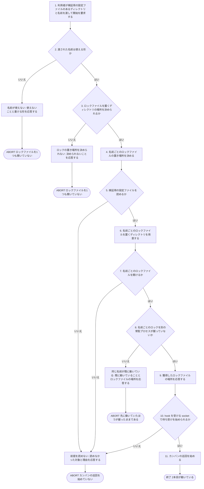
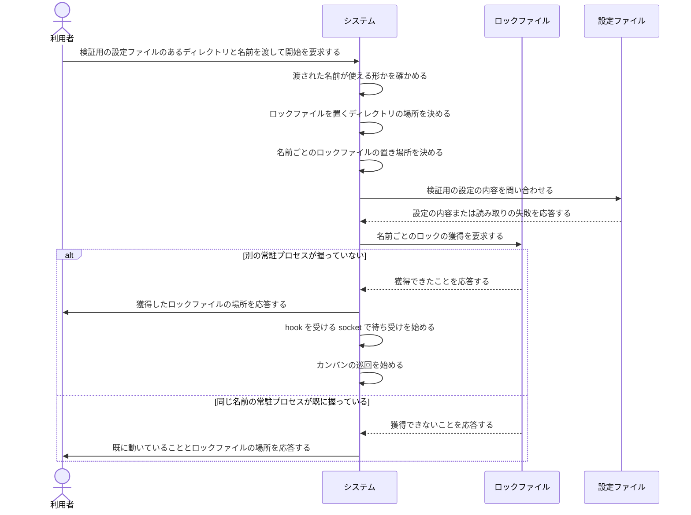

# ユースケース: 1台で2本目を動かす

## 根拠資料

- `docs/plans/continuo_design.md` の「3-17. 二重起動は flock で防ぐ。ロックは機械で1本、`--id` を付けたときだけ分かれる」（ロックの置き場所を決める3段の順番・socket の置き場所から導かない理由・`runtime.lock_file` を読み続ける理由・人が書いたパスの親を作らない理由）
- `docs/plans/continuo_design.md` の「3-17b. `--id` が分けるのはロックだけである」（残り4つを検証用の `WORKFLOW.md` で分ける理由・分け忘れたときに起きること）
- `docs/plans/continuo_design.md` の「3-17c. `continuo abandon` は、常駐している側と同じ場所を見る」（`--id` と `WORKFLOW.md` のパスを両方渡す理由）
- `docs/plans/continuo_design.md` の「3-17d. `--id` に書ける名前を絞る」（使える文字と長さ・名前の検査をホームディレクトリより先に通す理由）
- `internal/instance/instance.go` の `Resolve` / `ValidateID` / `validIDShape` / `Root` / `EnsureLockDir` / `Layout.LockPath` / `IsInvalidID`
- `internal/daemon/daemon.go` の `Run` / `ResolveLockFilePath` / `EnsureLockFileDir`
- `internal/cli/cli.go` の `runMain` / `checkInstanceID` / `instanceErrorKey`
- `internal/lock/lock.go` の `Acquire` / `ErrAlreadyRunning`
- `docs/releasing.md` の「実機で issue を1件通す」（本番を止めずに検証用を並べる手順）

## 何のためのユースケースか

**本番の continuo を止めずに、検証用の continuo をもう1本動かすためのものである。**
[docs/releasing.md](../../../releasing.md) が「実機で issue を1件通す」をリリース前の必須の検査にしており、
**そのあいだ本番を止めたくない。**

**一般の利用者向けの機能ではない。**開発者が版を確かめるあいだだけ使う。

## 何が `--id` で分かれ、何が設定で分かれるか

**`--id` が分けるのは二重起動防止のロックだけである。**残りは検証用の `WORKFLOW.md` で書き換える。

| 分ける対象 | どうやって分けるか |
| --- | --- |
| 二重起動防止のロック | `--id <名前>` を付ける（`~/.continuo/id/<名前>/continuo.lock` になる） |
| worktree の置き場所 | 検証用の `WORKFLOW.md` の `workspace.root` |
| hook を受ける socket | 同じく `claude.hook_bridge.listen` |
| branch 名 | 同じく `herdr.worktree.branch_template` |
| カンバン | 検証用のカンバンを別に用意する（本番と別の project 番号） |

**`--id` から自動で導かない。**導くと、利用者が設定に書いた値と continuo が実際に使う値が食い違い、
**設定を読んだだけでは、どこに worktree ができるのかが分からなくなる。**

## ロックの置き場所を決める3段

| 順 | 何を書いたか | ロックの場所 |
| --- | --- | --- |
| 1 | `--id <名前>` を付けた | `~/.continuo/id/<名前>/continuo.lock` |
| 2 | `runtime.lock_file` を書いた | そこに書いた絶対パス |
| 3 | どちらも無い | `~/.continuo/continuo.lock` |

**hook を受ける socket の置き場所からは導かない。**socket の場所は環境変数と
`claude.hook_bridge.listen` で動くので、**そこから導くと socket を分けただけで
2本目が黙って起動できてしまう。**

## RUCM

```rucm
USE CASE NAME: 1台で2本目を動かす
BRIEF DESCRIPTION: 利用者は検証用の設定ファイルのあるディレクトリと名前を渡して、2本目の常駐プロセスの開始を要求する。システムは渡された名前が使える形かを検査し、その名前ごとのロックファイルの置き場所を決めて、置き場所を用意してからロックを獲得する。システムは同じ名前のロックを別の常駐プロセスが握っていれば起動を止める。システムは獲得したロックファイルの場所を利用者に応答し、検証用の設定ファイルが指す hook を受ける socket で待ち受けを始める。
PRECONDITION: 利用者は検証用の設定ファイルを別のディレクトリに用意している。検証用の設定ファイルでは worktree の置き場所と hook を受ける socket と branch 名の規則が本番と分けてある。検証用の設定ファイルは本番とは別のカンバンを指している。
PRIMARY ACTOR: 利用者
SECONDARY ACTORS: なし
DEPENDENCY: なし
GENERALIZATION: なし

BASIC FLOW:
1. 利用者はシステムに検証用の設定ファイルのあるディレクトリと名前を渡して2本目の常駐プロセスの開始を要求する。
2. システムは VALIDATES THAT 渡された名前が小文字の英数字で始まり以降が小文字の英数字とハイフンだけであり長さが上限以内である。
3. システムは VALIDATES THAT ロックファイルを置く continuo のディレクトリの場所を決められる。
4. システムは渡された名前から名前ごとのロックファイルの置き場所を決める。
5. システムは VALIDATES THAT 検証用の設定ファイルを読める。
6. システムは名前ごとのロックファイルを置くディレクトリを用意する。
7. システムは VALIDATES THAT 名前ごとのロックファイルを開ける。
8. システムは VALIDATES THAT 名前ごとのロックを別の常駐プロセスが握っていない。
9. システムは利用者に獲得したロックファイルの場所を応答する。
10. システムは VALIDATES THAT 検証用の設定ファイルが指す hook を受ける socket で待ち受けを始められる。
11. システムは検証用の設定ファイルが指すカンバンの巡回を始める。
POSTCONDITION: 名前ごとのロックファイルを握っている。本番の常駐プロセスが握っているロックファイルには触れていない。獲得したロックファイルの場所が出力されている。検証用の設定ファイルが指す hook を受ける socket で待ち受けている。

SPECIFIC ALTERNATIVE FLOW 名前が使えない:
RFS BASIC FLOW 2
1. システムは利用者に渡された名前が使えないことと書ける形を応答する。
2. ABORT
POSTCONDITION: システムはロックファイルを1つも開いていない。システムはディレクトリを1つも作っていない。渡された名前が使えないことが出力されている。

SPECIFIC ALTERNATIVE FLOW ロックの置き場所を決められない:
RFS BASIC FLOW 3
1. システムは利用者にロックファイルの置き場所を決められないことを応答する。
2. ABORT
POSTCONDITION: システムはロックファイルを1つも開いていない。渡された名前が使えないという文言は出力されていない。

BOUNDED ALTERNATIVE FLOW 前提を読めない:
RFS BASIC FLOW 5,7,10
1. システムは利用者に読めなかった対象と理由を応答する。
2. ABORT
POSTCONDITION: システムはカンバンの巡回を始めていない。読めなかった対象と理由が出力されている。

SPECIFIC ALTERNATIVE FLOW 同じ名前が既に動いている:
RFS BASIC FLOW 8
1. システムは利用者に同じ名前の常駐プロセスが既に動いていることとロックファイルの場所を応答する。
2. ABORT
POSTCONDITION: システムはカンバンの巡回を始めていない。先に動いていた常駐プロセスはロックファイルを握ったままである。同じ名前の常駐プロセスが既に動いていることが出力されている。
```

## フローチャート



## シーケンス図


