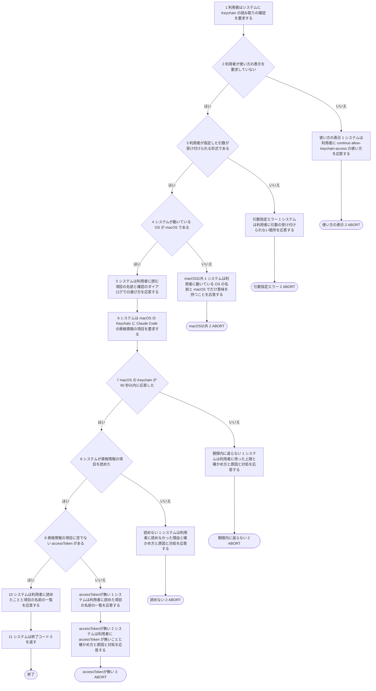
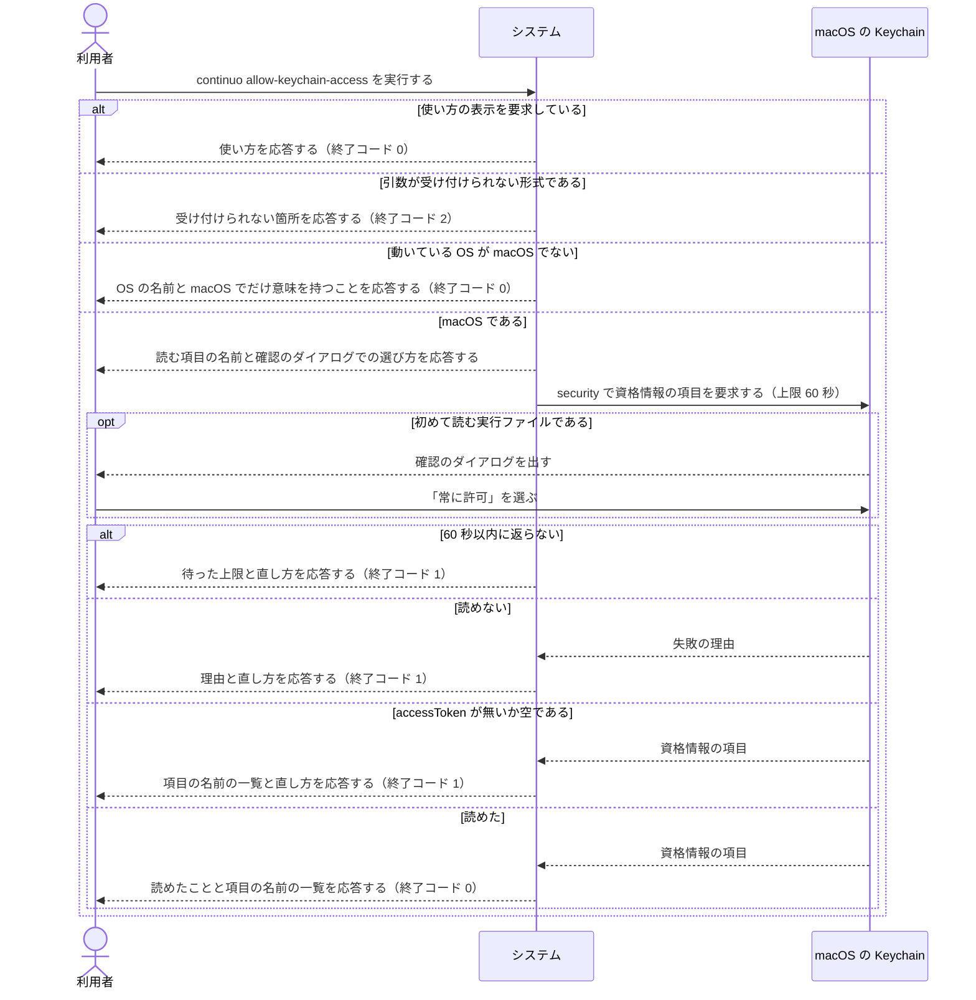

# ユースケース: Keychainの読み取りを許可する

## 根拠資料

- `docs/plans/continuo_design.md` の「3-15. トークンの計上は transcript から取る」の中の段落「macOS の資格情報は Keychain から読む」（初めて読む実行ファイルには確認のダイアログが出る。このコマンドで1回読んで「常に許可」を選ばせる。待つ上限は60秒。値は出さない）
- `docs/plans/continuo_design.md` の「3-34b. 人間に見せるエラーは、原因と対処を必ず書く」（確かめ方・よくある原因・対処を出す）
- `docs/plans/continuo_design.md` の「3-32. 使い始めるまでの手順」（このコマンドを叩く場面）
- `internal/cli/cli.go` の `runAllowKeychainAccess` / `printKeychainFailure` / `parseErrorExitCode`
- `internal/ratelimit/keychain.go` の `ProbeKeychain` / `runSecurity` / `securityStderr` / `parseAccessToken`、定数 `AllowAccessTimeout` / `KeychainService`、`ErrKeychainTimeout`

`continuo allow-keychain-access` は、設定ファイル（`WORKFLOW.md`）を読まない。読む先は Keychain の1項目（`Claude Code-credentials`）に決まっている。

## このコマンドが要る理由

macOS の Keychain は、初めて読む実行ファイルに確認のダイアログを出す。
常駐している continuo がそのダイアログに当たると、答える人が居ないまま、レートリミットの読み取りの期限が切れる。
利用者が端末に居るうちに1回読み、ダイアログで「常に許可」を選ぶのが、このコマンドの役目である。

## 終了コードの分け方

`internal/cli/cli.go` の `runAllowKeychainAccess` が決める。

| 終了コード | どんなときに返るか |
| --- | --- |
| 0 | 読めて `accessToken` が在った。または、macOS 以外だったので何もしなかった。または、使い方の表示 |
| 1 | `security` が60秒以内に返らなかった。読めなかった。読めたが `accessToken` が無いか空だった |
| 2 | 引数の指定が誤っている（知らないフラグ、位置引数） |

## 応答に載るもの

| 応答 | 段 | 出力先 | 何が載るか |
| --- | --- | --- | --- |
| macOS 以外であること | 代替フロー `macOS以外` | 標準出力 | 動いている OS の名前と、このコマンドが macOS でだけ意味を持つこと |
| 読む前の案内 | 基本フローの段5 | 標準出力 | 読む項目の名前（`Claude Code-credentials`）と、ダイアログが出たら「常に許可」を選ぶこと |
| 読めた結果 | 基本フローの段10 | 標準出力 | 読めたことと、項目の名前の一覧（昇順）。値は1つも載らない |
| 返ってこなかった | 代替フロー `期限内に返らない` | 標準出力 | 待った上限（60秒）、確かめ方、よくある原因、対処 |
| 読めなかった | 代替フロー `読めない` | 標準出力 | `security` が返した理由、確かめ方、よくある原因、対処 |
| `accessToken` が無い | 代替フロー `accessTokenが無い` | 標準出力 | 読めた項目の名前の一覧、確かめ方、よくある原因、対処 |
| 使い方・引数の誤り | 代替フロー `使い方の表示`・`引数指定エラー` | 標準エラー | 使い方、または受け付けられない箇所 |

## 段8 の検証が偽になる理由

どれも、標準出力に理由と直し方を出して終了コード 1 で終わる（代替フロー `読めない`）。
`internal/ratelimit/keychain.go` の `runSecurity` と `ProbeKeychain` が、この順に確かめる。

| 理由 | どの関数が返すか | 段6・段7 を通るか |
| --- | --- | --- |
| `security` が PATH に無い | `runSecurity` | 通らない。`security` を起動する前に決まるので、Keychain へは何も要求せず、待ちもしない。段5 の案内は出たあとである |
| `security` が異常終了した（項目が無い、利用者がダイアログで拒否した、など）。標準エラーの先頭200文字を理由に載せる | `runSecurity` | 通る |
| 標準出力を JSON として読めない | `ProbeKeychain` | 通る |
| JSON に `claudeAiOauth` が無い | `ProbeKeychain` | 通る |
| `claudeAiOauth` は在るが、`accessToken` が文字列でない（数や配列など）。理由の文面は「JSON として読めない」と同じである | `ProbeKeychain`（`parseAccessToken` が誤りを返す） | 通る |

`security` が PATH に無いときは、段6 の要求と段7 の待ちが起きないまま、段8 の検証が偽になる。
応答も終了コードも `読めない` のほかの理由と同じで、流れを分けないので、段にも代替フローにもしていない。
基本フローの段6・段7 と、代替フロー `読めない` の事後条件は、この場合を除いて読む。
`accessToken` が文字列で、空のとき・キーが無いときは、段8 は真で、段9 が偽になる（代替フロー `accessTokenが無い`）。

`runSecurity` は、呼び出し側が打ち切ったとき（`ErrKeychainCanceled`）も誤りを返す。
`runAllowKeychainAccess` は打ち切られない文脈（`context.Background()`）を渡すので、このコマンドからは起きない。段にも代替フローにもしていない。

## テストの当て方

7本の経路の全部にテストを付けてある。置き場所は2つある。

| ファイル | 何を差し替えているか |
| --- | --- |
| `test/internal/cli/Keychainの読み取りを許可する_test.go` | OS の名前（`Deps.GOOS`）と Keychain を読む関数（`Deps.ProbeKeychain`）を差し替え、`cli.RunWith` を直に呼ぶ。どの OS でも走る |
| `test/internal/ratelimit/Keychainの読み取りを許可する_test.go` | `continuo` をビルドして起動し、PATH の先頭に偽の `security` を置く。Keychain を読む経路の2本は macOS でだけ走り、macOS 以外の経路の1本は macOS 以外でだけ走る |

本物の Keychain と本物の確認のダイアログは、どのテストも通さない。ダイアログは人間が答えるもので、答えを機械で入れる手段が無い。
ダイアログが出たまま返ってこない場合は、Keychain を読む関数が `ErrKeychainTimeout` を返す形で確かめている。

## RUCM

```rucm
USE CASE NAME: Keychainの読み取りを許可する
BRIEF DESCRIPTION: 利用者は continuo allow-keychain-access を実行する。システムは macOS の Keychain から Claude Code の資格情報の項目を1回読む。利用者は macOS が出す確認のダイアログで読み取りを許可する。システムは読めた項目の名前を応答する。
PRECONDITION: 利用者は continuo の実行ファイルを実行できる。
PRIMARY ACTOR: 利用者
SECONDARY ACTORS: macOS の Keychain
DEPENDENCY: なし
GENERALIZATION: なし

BASIC FLOW:
1. 利用者はシステムに Keychain の読み取りの確認を要求する。
2. システムは VALIDATES THAT 利用者が使い方の表示を要求していない。
3. システムは VALIDATES THAT 利用者が指定した引数が受け付けられる形式である。
4. システムは VALIDATES THAT システムが動いている OS が macOS である。
5. システムは利用者に読む項目の名前と確認のダイアログでの選び方を応答する。
6. システムは macOS の Keychain に Claude Code の資格情報の項目を要求する。
7. システムは VALIDATES THAT macOS の Keychain が 60 秒以内に応答した。
8. システムは VALIDATES THAT システムが資格情報の項目を読めた。
9. システムは VALIDATES THAT 資格情報の項目に空でない accessToken がある。
10. システムは利用者に読めたことと項目の名前の一覧を応答する。
11. システムは終了コード 0 を返す。
POSTCONDITION: システムは macOS の Keychain の資格情報の項目を1回読んでいる。項目の名前の一覧は標準出力に出ている。項目の値は標準出力にも標準エラーにも出ていない。終了コード 0 が返っている。

SPECIFIC ALTERNATIVE FLOW 使い方の表示:
RFS BASIC FLOW 2
1. システムは利用者に continuo allow-keychain-access の使い方を応答する。
2. ABORT
POSTCONDITION: システムは macOS の Keychain を読んでいない。使い方は標準エラーに出ている。終了コード 0 が返っている。

SPECIFIC ALTERNATIVE FLOW 引数指定エラー:
RFS BASIC FLOW 3
1. システムは利用者に引数の受け付けられない箇所を応答する。
2. ABORT
POSTCONDITION: システムは macOS の Keychain を読んでいない。理由は標準エラーに出ている。終了コード 2 が返っている。

SPECIFIC ALTERNATIVE FLOW macOS以外:
RFS BASIC FLOW 4
1. システムは利用者に動いている OS の名前と macOS でだけ意味を持つことを応答する。
2. ABORT
POSTCONDITION: システムは Keychain を読むコマンドを起動していない。応答は標準出力に出ている。終了コード 0 が返っている。

SPECIFIC ALTERNATIVE FLOW 期限内に返らない:
RFS BASIC FLOW 7
1. システムは利用者に待った上限と確かめ方と原因と対処を応答する。
2. ABORT
POSTCONDITION: システムは Keychain を読むコマンドを止めている。応答は標準出力に出ている。項目の値は出ていない。終了コード 1 が返っている。

SPECIFIC ALTERNATIVE FLOW 読めない:
RFS BASIC FLOW 8
1. システムは利用者に読めなかった理由と確かめ方と原因と対処を応答する。
2. ABORT
POSTCONDITION: 応答は標準出力に出ている。項目の値は出ていない。終了コード 1 が返っている。security が PATH に無かったときは、システムは Keychain を読むコマンドを起動していない。

SPECIFIC ALTERNATIVE FLOW accessTokenが無い:
RFS BASIC FLOW 9
1. システムは利用者に読めた項目の名前の一覧を応答する。
2. システムは利用者に accessToken が無いことと確かめ方と原因と対処を応答する。
3. ABORT
POSTCONDITION: 応答は標準出力に出ている。項目の値は出ていない。終了コード 1 が返っている。
```

## フローチャート



## シーケンス図


