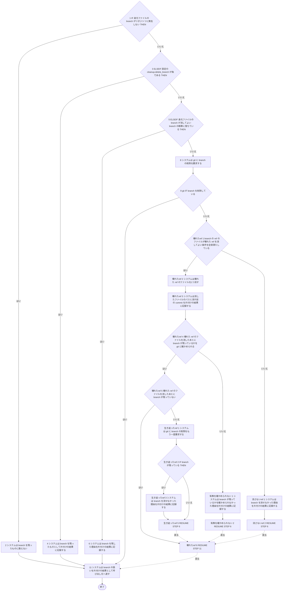
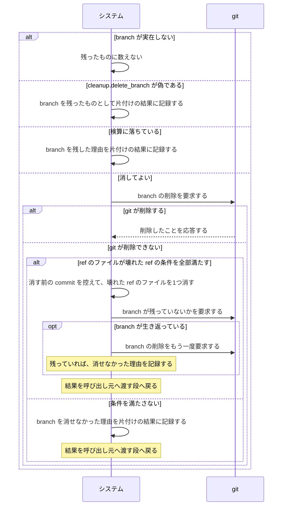

# ユースケース: branchを始末する

> **worktree を消したあとに行う、branch の始末だけを書いた記述である。**
> `worktreeとbranchを片付ける` が `INCLUDE USE CASE` で引く。実装は `internal/workspace/cleanup.go` の `Cleanup` の中の branch の `switch` と、
> `internal/workspace/git.go` の `gitBranchDelete` である。片付けを起こす契機（巡回・turn の終わり・復元・起動時の掃除・`continuo abandon`）のどれでも同じ動きをする。
>
> **この記述は、どう終わっても呼び出し元を止めない。**branch が残っても、`Cleanup` は残ったことを片付けの結果に記録して、設定ファイルの削除へ進む。
> そのため呼び出し元と1本に書くと、branch の結末と前後の段の結末の掛け算で経路が増える。分けて書く。
>
> **「片付けの結果に記録する」とは、`CleanupResult` の `Leftovers`（残ったもの）か `Notices`（continuo が自分で行ったこと）へ積むことである。**
> この2つの並びを画面へ1行ずつ出すのは `continuo abandon` だけである。巡回と `cleanupPath` は読まない。同じ内容は `Cleanup` の中のログに出る。

## 根拠資料

- `docs/plans/continuo_design.md` の「3-9. worktree と branch の後始末」（手順4）
- `docs/plans/continuo_design.md` の「3-22b. 壊れた ref を消してよい条件」と「3-22c. 壊れた ref を消したあとに確かめること」
- `docs/plans/continuo_design.md` の「3-37-8. 実在しない branch を「残っている」と言わない」
- `internal/workspace/cleanup.go` の `Cleanup`（branch の `switch`）/ `deletableBranch` / `brokenRefBranchAt` / `CleanupResult`
- `internal/workspace/git.go` の `gitBranchExists` / `gitWorktreeHeadAt` / `gitBranchDelete` / `confirmBranchGone`
- `internal/workspace/brokenref.go` の `brokenBranchRef` / `pruneBrokenBranchRef` / `brokenRefTip`

## RUCM

```rucm
USE CASE NAME: branchを始末する
BRIEF DESCRIPTION: システムは worktree を消したあとに、身元ファイルの branch を始末する。システムはリポジトリに実在しない branch を残ったものに数えない。システムは設定の cleanup.delete_branch が偽であれば branch を残す。システムは消してよいと検算できない branch を残す。システムは消してよい branch の削除を git に要求する。システムは git が消せない壊れた ref のファイルを消す。
PRECONDITION: システムは worktree の実体を消している。システムは worktree を消す前に身元ファイルの branch を消してよいかを判定している。
PRIMARY ACTOR: 巡回タイマー
SECONDARY ACTORS: git
DEPENDENCY: なし
GENERALIZATION: なし

BASIC FLOW:
1. IF 身元ファイルの branch がリポジトリに実在しない THEN
2.   システムは branch を残ったものに数えない。
3. ELSEIF 設定の cleanup.delete_branch が偽である THEN
4.   システムは branch を残ったものとして片付けの結果に記録する。
5. ELSEIF 身元ファイルの branch が消してよい branch の検算に落ちている THEN
6.   システムは branch を残した理由を片付けの結果に記録する。
7. ELSE
8.   システムは git に branch の削除を要求する。
9.   システムは VALIDATES THAT git が branch を削除している。
10. ENDIF
11. システムは branch の扱いを片付けの結果として呼び出し元へ渡す。
POSTCONDITION: branch の扱いが片付けの結果に入っている。片付けの結果は呼び出し元へ渡っている。branch は、git か壊れた ref の始末が消していれば無い。branch は、設定の cleanup.delete_branch が偽であるか検算に落ちているか消せなかった場合は残っている。残っている branch は片付けの結果に記録されている。リポジトリに実在しない branch は片付けの結果に記録されていない。

SPECIFIC ALTERNATIVE FLOW 壊れたref:
RFS BASIC FLOW 9
1. システムは VALIDATES THAT branch の ref のファイルが壊れた ref を消してよい条件を全部満たしている。
2. システムは壊れた ref のファイルを1つ消す。
3. システムは消したファイルのパスと消す前の commit を片付けの結果に記録する。
4. システムは VALIDATES THAT 壊れた ref のファイルを消したあとに branch が残っているかを git に確かめられる。
5. システムは VALIDATES THAT 壊れた ref のファイルを消したあとに branch が残っていない。
6. RESUME STEP 11
POSTCONDITION: branch は無い。壊れた ref のファイルは消えている。packed-refs は書き換えていない。消したファイルのパスが片付けの結果に記録されている。

SPECIFIC ALTERNATIVE FLOW 消さないref:
RFS 壊れたref 1
1. システムは branch を消せなかった理由を片付けの結果に記録する。
2. RESUME STEP 6
POSTCONDITION: branch は残っている。ref のファイルは1バイトも消えていない。branch を消せなかった理由が片付けの結果に記録されている。

SPECIFIC ALTERNATIVE FLOW 生き返ったref:
RFS 壊れたref 5
1. システムは git に branch の削除をもう一度要求する。
2. IF branch が残っている THEN
3.   システムは branch を消せなかった理由を片付けの結果に記録する。
4. ENDIF
5. RESUME STEP 6
POSTCONDITION: 壊れた ref のファイルは消えている。packed-refs は書き換えていない。branch は、もう一度の削除が通っていれば無い。branch が残っていれば、消せなかった理由が片付けの結果に記録されている。

SPECIFIC ALTERNATIVE FLOW 有無を確かめられない:
RFS 壊れたref 4
1. システムは branch が残っているかを確かめられなかった理由を片付けの結果に記録する。
2. RESUME STEP 6
POSTCONDITION: 壊れた ref のファイルは消えている。packed-refs は書き換えていない。システムは git に branch の削除をもう一度要求していない。branch が残っているかは分からない。確かめられなかった理由が片付けの結果に記録されている。
```

## branch の扱いは4通りある

**判定は worktree を消す前（`worktreeとbranchを片付ける` の段14）に行い、結果をこの記述の段1 で使う。**git に現物を答えさせる検査は、worktree が在るうちにしかできない。

| 段 | 条件 | どうするか | 完了のログ |
| --- | --- | --- | --- |
| 1 | branch がリポジトリに実在しない | **残ったものに数えない。**着手が `git worktree add` で失敗し続けた worktree には branch が1度も作られていない（issue #27） | `branch は元からありませんでした` |
| 3 | `cleanup.delete_branch` が偽 | 消さずに、残ったものとして記録する | `branch は残しました` |
| 5 | 検算に落ちている | 消さずに、理由を添えて記録する | `branch は残しました` |
| 7 | 上のどれでもない | `git branch -D` を要求する | 消せたら `worktree と branch を片付けました`。消せなければ `branch は残しました` |

**検算に落ちるのは次のときである**（`internal/workspace/cleanup.go` の `deletableBranch`）。身元ファイルは worktree の直下にあり、エージェントが書き換えられるので、どれも消さない側に倒す。

- 身元ファイルに branch が書かれていない
- リポジトリを名指しできない（clone を引けない・共通ディレクトリをどこからも引けない）
- branch 名が正規化で変わる
- `herdr.worktree.branch_template` に変数が無く、接頭辞を決められない
- branch 名が接頭辞で始まらない
- worktree がチェックアウトしている branch を引けない、または身元ファイルの branch と一致しない

**実在の検査は、接頭辞の検査のあと、現物との突き合わせの前にある。**git が実在を答えられなかったときは「無い」とは言わず、現物との突き合わせへ進む。

## 壊れた ref は branch の削除では消えない

**言いたいこと。**`refs/heads/<branch>` のファイルが読めない状態になっていると、`git branch -D` は断る。その branch は誰にも消せない。
そこで段9 の検証が偽になったとき、`壊れたref` がファイルとして消す経路を試す（設計 3-22b）。

**`壊れたref` へ入るのは、`git branch -D` が失敗したときだけである。**`git branch -D` を要求するのは段7 の ELSE の中なので、
**`cleanup.delete_branch` が偽なら、壊れた ref のファイルも消えない。**

**消してよい条件は7つで、全部を満たすときだけ消す**（`internal/workspace/brokenref.go` の `brokenBranchRef`）。
接頭辞で始まる・refname として正しい・`show-ref` が失敗する・`rev-parse` が失敗する・解決後のパスが `refs/heads` の内側に在る・通常のファイルである・中身が ref として読めない。
**packed-refs は1バイトも触らない。**判定のあとでファイルが書き換わっていたら消さない。

**条件を満たさないときは `消さないref` へ分かれる。**壊れた ref ではない理由で `git branch -D` が失敗したときも、ここへ来る。
branch を消せなかった理由を片付けの結果に記録し、WARN `branch を消せませんでした` を出して、この記述を終える。呼び出し元は設定ファイルの削除へ進む。

**壊れた ref を「実在しない」と読み替えない。**worktree を消す前の実在の検査（`git show-ref --verify --quiet`）は、壊れた ref にも終了コード 1 を返す（実測: 2026-08-25、git 2.50.1）。
そこで実在の検査が「無い」と答えたときは、壊れた ref かどうかを先に見る。`<共通ディレクトリ>/worktrees/<名前>/HEAD` の symref を直接読み、
その worktree が本当にその branch を指していて、ref のファイルが上の条件を満たすなら、「実在しない」ではなく「消してよい」と判定する。
`git worktree list --porcelain` が branch を答えず detached でもないときも、同じ判定を使う。

**消す前に、指していた commit を控える。**`<共通ディレクトリ>/logs/refs/heads/<branch>` の最後の行に、最後の SHA が残っている。読めたら、戻せるコマンドを片付けの結果に記録する。

**ファイルを消しただけでは branch が消えたことにならない。**その branch が packed-refs にも載っていると、loose を消した瞬間に packed 側が生き返る。
消したあとに存在を確かめ直し（`壊れたref` の段4）、生き返っていたら `生き返ったref` が `git branch -D` を1回だけ撃ち直す。それでも残れば、消せなかった理由を記録する。

## フローチャート



## シーケンス図


