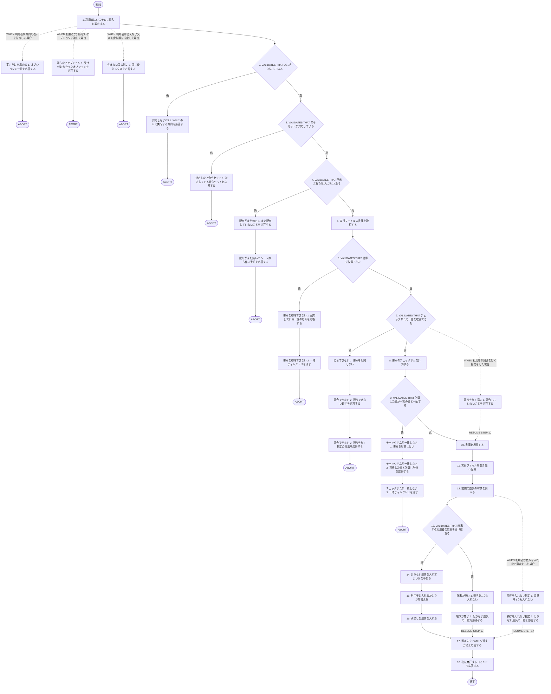
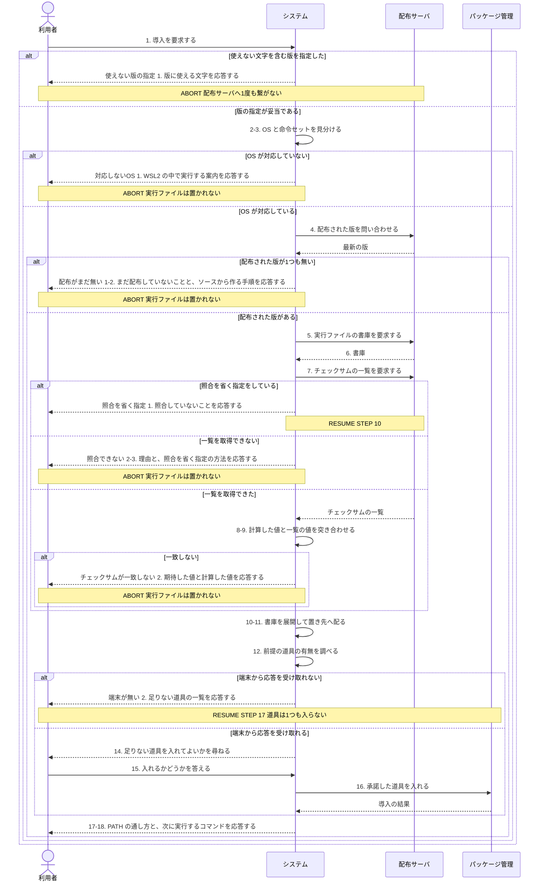

<!-- 目的: ネットワークインストーラーで continuo を導入するまでの流れを RUCM で定義する -->

# ユースケース: continuo を入れる

## 根拠資料

- `docs/plans/continuo_design.md#3-36`（入れ方はネットワークインストーラーの1行にする。3つの部品と、道具が足りないときの扱い）
- `docs/plans/continuo_design.md#3-32b`（Windows ネイティブに対応しない理由）
- `install.sh`（`detect_platform` / `resolve_version` / `install_binary` / `check_deps` / `ask`）
- `.github/workflows/release.yml`（タグを打つとビルドして release へ載せる）
- `README.ja.md`（「入れる」の節）

## RUCM

```rucm
USE CASE NAME: continuo を入れる
BRIEF DESCRIPTION: 利用者はネットワークインストーラーを実行する。システムは利用環境に合う実行ファイルを配布物から取り、チェックサムを照合できたときだけ置き先へ配る。システムは前提の道具の不足を調べ、利用者に尋ねてから入れる。
PRECONDITION: 利用者の手元に curl または wget がある。利用者の手元に tar がある。
PRIMARY ACTOR: 利用者
SECONDARY ACTORS: 配布サーバ、パッケージ管理
DEPENDENCY: なし
GENERALIZATION: なし

BASIC FLOW:
1. 利用者はシステムに導入を要求する。
2. システムは VALIDATES THAT 利用者の OS が対応している。
3. システムは VALIDATES THAT 利用者の命令セットが対応している。
4. システムは VALIDATES THAT 配布された版が1つ以上ある。
5. システムは実行ファイルの書庫を取得する。
6. システムは VALIDATES THAT 書庫を取得できた。
7. システムは VALIDATES THAT チェックサムの一覧を取得できた。
8. システムは書庫のチェックサムを計算する。
9. システムは VALIDATES THAT 計算した値が一覧の値と一致する。
10. システムは書庫を展開する。
11. システムは実行ファイルを置き先へ配る。
12. システムは前提の道具の有無を調べる。
13. システムは VALIDATES THAT 端末から利用者の応答を受け取れる。
14. システムは利用者に足りない道具を入れてよいかを尋ねる。
15. 利用者はシステムに入れるかどうかを答える。
16. システムは利用者が承諾した道具を入れる。
17. システムは利用者に置き先を PATH へ通す方法を応答する。
18. システムは利用者に次に実行するコマンドを応答する。
POSTCONDITION: 置き先に continuo の実行ファイルがある。実行ファイルに実行の権限が付いている。利用者は次に実行するコマンドを読める。一時ディレクトリは残っていない。

SPECIFIC ALTERNATIVE FLOW 対応しないOS:
RFS BASIC FLOW 2
1. システムは利用者に WSL2 の中で実行する案内を応答する。
2. ABORT
POSTCONDITION: 実行ファイルは置かれていない。利用者は WSL2 を使う案内を読める。

SPECIFIC ALTERNATIVE FLOW 対応しない命令セット:
RFS BASIC FLOW 3
1. システムは利用者に対応している命令セットを応答する。
2. ABORT
POSTCONDITION: 実行ファイルは置かれていない。利用者は対応している命令セットを読める。

SPECIFIC ALTERNATIVE FLOW 配布がまだ無い:
RFS BASIC FLOW 4
1. システムは利用者にまだ配布していないことを応答する。
2. システムは利用者にソースから作る手順を応答する。
3. ABORT
POSTCONDITION: 実行ファイルは置かれていない。利用者はソースから作る手順を読める。

SPECIFIC ALTERNATIVE FLOW 書庫を取得できない:
RFS BASIC FLOW 6
1. システムは利用者に配布している一覧の場所を応答する。
2. システムは一時ディレクトリを消す。
3. ABORT
POSTCONDITION: 実行ファイルは置かれていない。一時ディレクトリは残っていない。

SPECIFIC ALTERNATIVE FLOW 照合できない:
RFS BASIC FLOW 7
1. システムは書庫を展開しない。
2. システムは利用者に照合できない理由を応答する。
3. システムは利用者に照合を省く指定の方法を応答する。
4. ABORT
POSTCONDITION: 実行ファイルは置かれていない。一時ディレクトリは残っていない。利用者は照合を省く指定の方法を読める。

SPECIFIC ALTERNATIVE FLOW チェックサムが一致しない:
RFS BASIC FLOW 9
1. システムは書庫を展開しない。
2. システムは利用者に期待した値と計算した値を応答する。
3. システムは一時ディレクトリを消す。
4. ABORT
POSTCONDITION: 実行ファイルは置かれていない。一時ディレクトリは残っていない。利用者は取得をやり直す案内を読める。

SPECIFIC ALTERNATIVE FLOW 端末が無い:
RFS BASIC FLOW 13
1. システムは道具を1つも入れない。
2. システムは利用者に足りない道具の一覧を応答する。
3. RESUME STEP 17
POSTCONDITION: 置き先に continuo の実行ファイルがある。道具は1つも入っていない。利用者は足りない道具の一覧を読める。

GLOBAL ALTERNATIVE FLOW 依存を入れない指定:
BRANCH FROM BASIC FLOW 12
WHEN 利用者が依存を入れない指定をした場合
1. システムは道具を1つも入れない。
2. システムは利用者に足りない道具の一覧を応答する。
3. RESUME STEP 17
POSTCONDITION: 置き先に continuo の実行ファイルがある。道具は1つも入っていない。利用者は足りない道具の一覧を読める。

GLOBAL ALTERNATIVE FLOW 照合を省く指定:
BRANCH FROM BASIC FLOW 7
WHEN 利用者が照合を省く指定をした場合
1. システムは利用者に照合していないことを応答する。
2. RESUME STEP 10
POSTCONDITION: 置き先に continuo の実行ファイルがある。利用者はチェックサムを照合していないことを読める。

GLOBAL ALTERNATIVE FLOW 使えない版の指定:
BRANCH FROM BASIC FLOW 1
WHEN 利用者が使えない文字を含む版を指定した場合
1. システムは利用者に版に使える文字を応答する。
2. ABORT
POSTCONDITION: 実行ファイルは置かれていない。配布サーバへの取得は1度も行われていない。

GLOBAL ALTERNATIVE FLOW 案内だけを求める:
BRANCH FROM BASIC FLOW 1
WHEN 利用者が案内の表示を指定した場合
1. システムは利用者にオプションの一覧を応答する。
2. ABORT
POSTCONDITION: 実行ファイルは置かれていない。利用者はオプションの一覧を読める。

GLOBAL ALTERNATIVE FLOW 知らないオプション:
BRANCH FROM BASIC FLOW 1
WHEN 利用者が知らないオプションを渡した場合
1. システムは利用者に受け付けなかったオプションを応答する。
2. ABORT
POSTCONDITION: 実行ファイルは置かれていない。配布サーバへの取得は1度も行われていない。
```

## フローチャート



## シーケンス図


