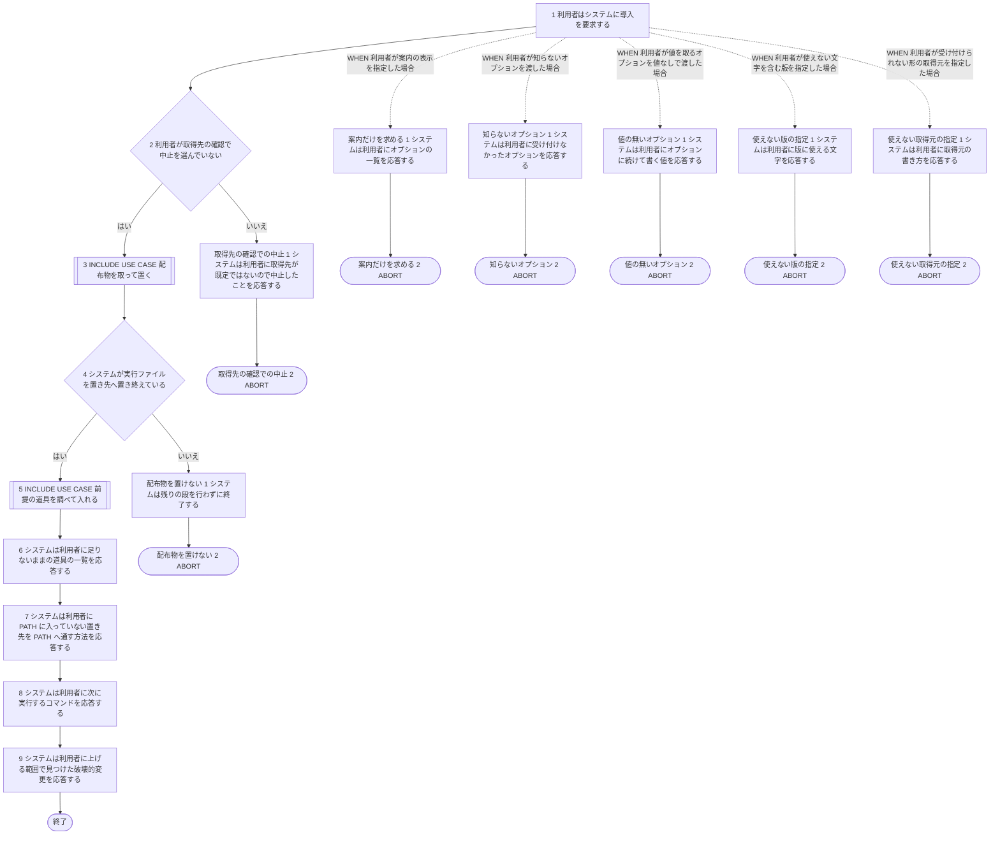
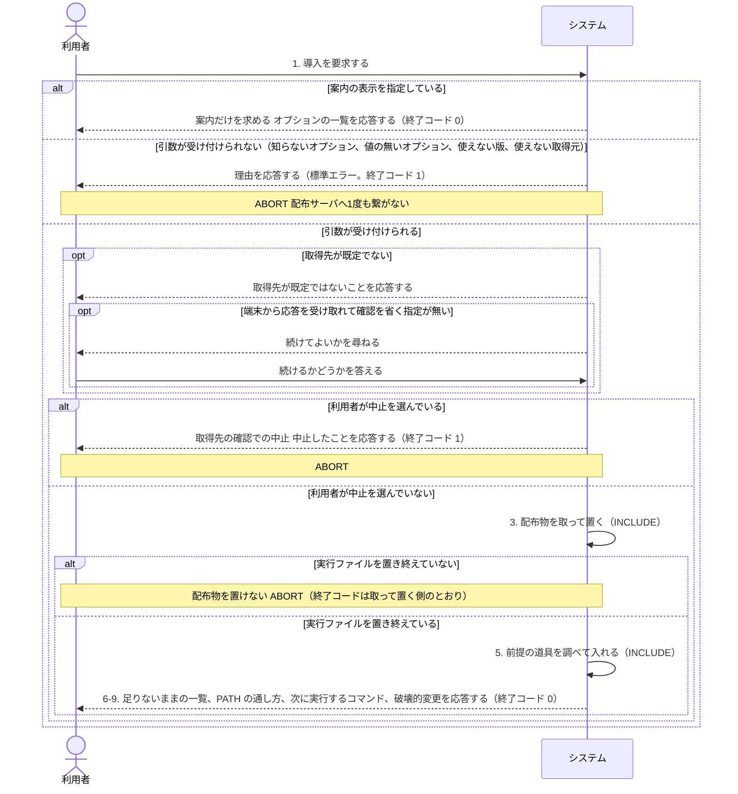

# ユースケース: continuo を入れる

> **ネットワークインストーラー（`install.sh`）の1回の実行の、全体の流れを書いた記述である。**
> 実行ファイルを取って置く段は `配布物を取って置く`、足りない道具を1つずつ扱う段は `前提の道具を調べて入れる` に書いてあり、
> この記述が `INCLUDE USE CASE` で引く。1本に書くと、取って置く段の分岐と道具1つごとの分岐の掛け算で経路が増える（190本になった）。分けて書く。

## 根拠資料

- `docs/plans/continuo_design.md` の「3-36. 入れ方は、ネットワークインストーラーの1行にする」
- `install.sh` の引数を解釈する `while`、`main`、`set_urls`、`ask`、`die`、`warn`、`say`
- `install.sh` の `report_breaking`
- `.github/workflows/release.yml`（タグを打つとビルドして release へ載せる）
- `README.ja.md` の「インストール」

## オプションと、どこに効くか

| オプション | 何が変わるか | どこに書いてあるか |
| --- | --- | --- |
| `--help` / `-h` | 案内を出して終わる。配布サーバへ繋がない | 任意時点の代替フロー `案内だけを求める` |
| `--version V` | 最新の版を問い合わせない。使えない文字を含めば止まる | `配布物を取って置く` の表「入れる版の決め方」 / 任意時点の代替フロー `使えない版の指定` |
| `--repo O/R` | 取得元を変える。既定と違えば、取得先が既定でない扱いになる | 下の表 / 任意時点の代替フロー `使えない取得元の指定` |
| `--base-url U` / `--api-url U` | 取得先を差し替える（テスト用） | 下の表 |
| `--insecure-no-checksum` | **照合を省かない。**照合できなかったときにだけ、警告して続ける | `配布物を取って置く` の表「チェックサムを照合できないとき」 |
| `--no-deps` | 足りない道具を1つも入れない | `前提の道具を調べて入れる` |
| `--yes` / `-y` | 尋ねずに「はい」として進む | 下の表 / `前提の道具を調べて入れる` |
| `--dir DIR` | 置き先を変える。流れは変わらない | 無い（入力の値が変わるだけ） |
| 値を取るオプションの値が無い | 止まる | 任意時点の代替フロー `値の無いオプション` |
| 上のどれでもない | 止まる | 任意時点の代替フロー `知らないオプション` |

**引数は、書かれた順に1つずつ解釈する。**`--help` は、それより前に誤ったオプションが無いときにだけ案内を出す。

## 取得先が既定でないとき、続けるかどうか

`install.sh` の `main` は、取得先が既定でなければ注意を標準出力へ出してから `ask` で尋ねる。
**尋ねる文言は、標準出力にも標準エラーにも出ない。**`ask` は問いを `/dev/tty` へ直接書き、答えも `/dev/tty` から読む。
**止まるのは最後の2行だけである。**残りは、注意が出ること以外、取得先が既定の実行と同じ段を通る。だから rucm ブロックでは、段2 の検証1つにしてある。

| 状況 | 尋ねるか | どうなるか |
| --- | --- | --- |
| 取得先が既定である | 尋ねない | 続ける。注意も出ない |
| 既定でなく、`--yes` を指定している | 尋ねない | 続ける |
| 既定でなく、端末を開けない（`curl … \| sh` を無人で流した実行。テストもここを通る） | 尋ねない | 続ける |
| 既定でなく、端末を開けて、利用者が `y` / `Y` / `yes` / `YES` と答える | 尋ねる | 続ける |
| 既定でなく、端末を開けて、利用者がそれ以外を答える（答えを読めない場合を含む） | 尋ねる | 止まる（代替フロー `取得先の確認での中止`） |
| 既定でなく、端末を読めるが書けない | 尋ねない（問いを書けないので `ask` が「いいえ」を返す） | 止まる（代替フロー `取得先の確認での中止`）。`main` は端末を読めるかだけを見て、止めるかどうかを決める |

**取得先が既定でない実行では、HTTPS の強制が外れ、配布物の出所の確認も行わない。**

## 最後の案内は、当てはまるものだけが出る

| 段 | 出る条件 |
| --- | --- |
| 6（足りないままの道具の一覧） | 1つ以上在るときだけ出る。中身は `前提の道具を調べて入れる` が決める（入れなかった `git` / `gh` / `ghq` と、足りない `herdr` / `claude`） |
| 7（PATH の通し方） | 置き先が PATH に入っていないときだけ出る |
| 8（次に実行するコマンド） | いつも出る |
| 9（破壊的変更） | 上げる範囲に破壊的変更が見つかったときだけ出る |

## 終了コードと出力先

| 終わり方 | 終了コード | 出力先 |
| --- | --- | --- |
| 最後まで進む | 0 | 案内は標準出力。警告（`warn`）は標準エラー |
| `--help` | 0 | 標準出力 |
| `die` で止まる | 1 | 理由（`エラー:` で始まる1行）は標準エラー。その前の案内は標準出力 |
| `配布物を取って置く` の中で止まる | 1（中断は 130 か 143） | `配布物を取って置く` の各代替フローの事後条件のとおり |

## RUCM

```rucm
USE CASE NAME: continuo を入れる
BRIEF DESCRIPTION: 利用者はネットワークインストーラーを実行する。システムは引数を解釈する。システムは配布物を取って置く。システムは前提の道具を調べて入れる。システムは利用者に次に実行するコマンドを応答する。
PRECONDITION: 利用者の手元に curl または wget がある。
PRIMARY ACTOR: 利用者
SECONDARY ACTORS: なし
DEPENDENCY: INCLUDE USE CASE 配布物を取って置く、INCLUDE USE CASE 前提の道具を調べて入れる
GENERALIZATION: なし

BASIC FLOW:
1. 利用者はシステムに導入を要求する。
2. システムは VALIDATES THAT 利用者が取得先の確認で中止を選んでいない。
3. INCLUDE USE CASE 配布物を取って置く
4. システムは VALIDATES THAT システムが実行ファイルを置き先へ置き終えている。
5. INCLUDE USE CASE 前提の道具を調べて入れる
6. システムは利用者に足りないままの道具の一覧を応答する。
7. システムは利用者に PATH に入っていない置き先を PATH へ通す方法を応答する。
8. システムは利用者に次に実行するコマンドを応答する。
9. システムは利用者に上げる範囲で見つけた破壊的変更を応答する。
POSTCONDITION: 置き先に入れる版の continuo の実行ファイルがある。利用者は次に実行するコマンドを読める。取得先が既定でない実行では、取得先が既定ではないことが標準出力に出ている。案内は標準出力に出ている。終了コード 0 が返っている。

SPECIFIC ALTERNATIVE FLOW 取得先の確認での中止:
RFS BASIC FLOW 2
1. システムは利用者に取得先が既定ではないので中止したことを応答する。
2. ABORT
POSTCONDITION: システムは置き先に実行ファイルを置いていない。システムは配布サーバに何も要求していない。取得先が既定ではないことは標準出力に出ている。続けてよいかを尋ねる文言は端末へ直接出ている。尋ねる文言は標準出力にも標準エラーにも出ていない。端末を読めて端末へ書けない実行では、システムは利用者に尋ねていない。中止した理由は標準エラーに出ている。終了コード 1 が返っている。

SPECIFIC ALTERNATIVE FLOW 配布物を置けない:
RFS BASIC FLOW 4
1. システムは残りの段を行わずに終了する。
2. ABORT
POSTCONDITION: システムは置き先に入れる版の実行ファイルを置いていない。システムは前提の道具を調べていない。システムは次に実行するコマンドを応答していない。応答と終了コードは、配布物を取って置く処理が止まった代替フローの事後条件のとおりである。

GLOBAL ALTERNATIVE FLOW 案内だけを求める:
BRANCH FROM BASIC FLOW 1
WHEN 利用者が案内の表示を指定した場合
1. システムは利用者にオプションの一覧を応答する。
2. ABORT
POSTCONDITION: システムは置き先に実行ファイルを置いていない。システムは配布サーバに何も要求していない。オプションの一覧は標準出力に出ている。終了コード 0 が返っている。

GLOBAL ALTERNATIVE FLOW 知らないオプション:
BRANCH FROM BASIC FLOW 1
WHEN 利用者が知らないオプションを渡した場合
1. システムは利用者に受け付けなかったオプションを応答する。
2. ABORT
POSTCONDITION: システムは置き先に実行ファイルを置いていない。システムは配布サーバに何も要求していない。理由は標準エラーに出ている。終了コード 1 が返っている。

GLOBAL ALTERNATIVE FLOW 値の無いオプション:
BRANCH FROM BASIC FLOW 1
WHEN 利用者が値を取るオプションを値なしで渡した場合
1. システムは利用者にオプションに続けて書く値を応答する。
2. ABORT
POSTCONDITION: システムは置き先に実行ファイルを置いていない。システムは配布サーバに何も要求していない。理由は標準エラーに出ている。終了コード 1 が返っている。

GLOBAL ALTERNATIVE FLOW 使えない版の指定:
BRANCH FROM BASIC FLOW 1
WHEN 利用者が使えない文字を含む版を指定した場合
1. システムは利用者に版に使える文字を応答する。
2. ABORT
POSTCONDITION: システムは置き先に実行ファイルを置いていない。システムは配布サーバに何も要求していない。理由は標準エラーに出ている。終了コード 1 が返っている。

GLOBAL ALTERNATIVE FLOW 使えない取得元の指定:
BRANCH FROM BASIC FLOW 1
WHEN 利用者が受け付けられない形の取得元を指定した場合
1. システムは利用者に取得元の書き方を応答する。
2. ABORT
POSTCONDITION: システムは置き先に実行ファイルを置いていない。システムは配布サーバに何も要求していない。理由は標準エラーに出ている。終了コード 1 が返っている。
```

## フローチャート


```mermaid
flowchart TD
    BS1["1 利用者はシステムに導入を要求する"]
    BS2{"2 利用者が取得先の確認で中止を選んでいない"}
    BS3[["3 INCLUDE USE CASE 配布物を取って置く"]]
    BS4{"4 システムが実行ファイルを置き先へ置き終えている"}
    BS5[["5 INCLUDE USE CASE 前提の道具を調べて入れる"]]
    BS6["6 システムは利用者に足りないままの道具の一覧を応答する"]
    BS7["7 システムは利用者に PATH に入っていない置き先を PATH へ通す方法を応答する"]
    BS8["8 システムは利用者に次に実行するコマンドを応答する"]
    BS9["9 システムは利用者に上げる範囲で見つけた破壊的変更を応答する"]
    A1S1["取得先の確認での中止 1 システムは利用者に取得先が既定ではないので中止したことを応答する"]
    A1S2(["取得先の確認での中止 2 ABORT"])
    A2S1["配布物を置けない 1 システムは残りの段を行わずに終了する"]
    A2S2(["配布物を置けない 2 ABORT"])
    A3S1["案内だけを求める 1 システムは利用者にオプションの一覧を応答する"]
    A3S2(["案内だけを求める 2 ABORT"])
    A4S1["知らないオプション 1 システムは利用者に受け付けなかったオプションを応答する"]
    A4S2(["知らないオプション 2 ABORT"])
    A5S1["値の無いオプション 1 システムは利用者にオプションに続けて書く値を応答する"]
    A5S2(["値の無いオプション 2 ABORT"])
    A6S1["使えない版の指定 1 システムは利用者に版に使える文字を応答する"]
    A6S2(["使えない版の指定 2 ABORT"])
    A7S1["使えない取得元の指定 1 システムは利用者に取得元の書き方を応答する"]
    A7S2(["使えない取得元の指定 2 ABORT"])
    BS1 --> BS2
    BS1 -. "WHEN 利用者が案内の表示を指定した場合" .-> A3S1
    BS1 -. "WHEN 利用者が知らないオプションを渡した場合" .-> A4S1
    BS1 -. "WHEN 利用者が値を取るオプションを値なしで渡した場合" .-> A5S1
    BS1 -. "WHEN 利用者が使えない文字を含む版を指定した場合" .-> A6S1
    BS1 -. "WHEN 利用者が受け付けられない形の取得元を指定した場合" .-> A7S1
    BS2 -- はい --> BS3
    BS2 -- いいえ --> A1S1
    BS3 --> BS4
    BS4 -- はい --> BS5
    BS4 -- いいえ --> A2S1
    BS5 --> BS6
    BS6 --> BS7
    BS7 --> BS8
    BS8 --> BS9
    A1S1 --> A1S2
    A2S1 --> A2S2
    A3S1 --> A3S2
    A4S1 --> A4S2
    A5S1 --> A5S2
    A6S1 --> A6S2
    A7S1 --> A7S2
    BS9 --> END(["終了"])
```

## シーケンス図


```mermaid
sequenceDiagram
    actor USER as 利用者
    participant SYS as システム

    USER->>SYS: 1. 導入を要求する
    alt 案内の表示を指定している
        SYS-->>USER: 案内だけを求める オプションの一覧を応答する（終了コード 0）
    else 引数が受け付けられない（知らないオプション、値の無いオプション、使えない版、使えない取得元）
        SYS-->>USER: 理由を応答する（標準エラー。終了コード 1）
        Note over USER,SYS: ABORT 配布サーバへ1度も繋がない
    else 引数が受け付けられる
        opt 取得先が既定でない
            SYS-->>USER: 取得先が既定ではないことを応答する
            opt 端末から応答を受け取れて確認を省く指定が無い
                SYS-->>USER: 続けてよいかを尋ねる
                USER->>SYS: 続けるかどうかを答える
            end
        end
        alt 利用者が中止を選んでいる
            SYS-->>USER: 取得先の確認での中止 中止したことを応答する（終了コード 1）
            Note over USER,SYS: ABORT
        else 利用者が中止を選んでいない
            SYS->>SYS: 3. 配布物を取って置く（INCLUDE）
            alt 実行ファイルを置き終えていない
                Note over USER,SYS: 配布物を置けない ABORT（終了コードは取って置く側のとおり）
            else 実行ファイルを置き終えている
                SYS->>SYS: 5. 前提の道具を調べて入れる（INCLUDE）
                SYS-->>USER: 6-9. 足りないままの一覧、PATH の通し方、次に実行するコマンド、破壊的変更を応答する（終了コード 0）
            end
        end
    end
```
