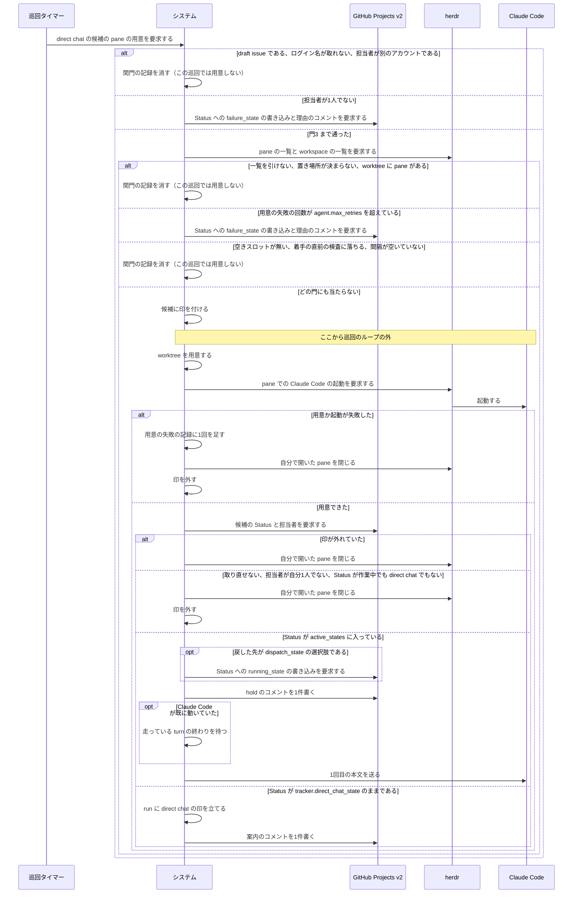

# ユースケース: directchatのpaneを用意する

## 根拠資料

- `docs/plans/continuo_design.md` の「3-83b. direct chat の候補は、専用の1パスへ分ける」（候補を2つに分け、direct chat の側を先に走らせる）
- `docs/plans/continuo_design.md` の「3-83c. pane を用意するかどうかを決める門」（門1〜門7）
- `docs/plans/continuo_design.md` の「3-83d. pane と worktree を用意する — 用意の段1〜段3」（踏む段と踏まない段、外れ方の表）
- `docs/plans/continuo_design.md` の「3-83h. direct chat に入れるのは、担当者が1人で、それが自分のアカウントのときだけ」（判定の表と、`failure_state` を書く経路）
- `internal/orchestrator/orchestrator.go` の `Tick`（`splitDirectChatCandidates` と `prepareDirectChatPanes` を呼ぶ場所）
- `internal/orchestrator/directchat.go` の `prepareDirectChatPanes` / `judgeDirectChatAssignees` / `directChatPanes` / `directChatPaneExists` / `beginDirectChatSetupLimitWrite` / `directChatSetupBackoff` / `setUpDirectChat` / `failDirectChatSetup` / `noteDirectChatSetupFailure` / `forgetDirectChatSetupFailuresNotIn` / `finishDirectChatSetup` / `abandonDirectChatSetup` / `closeDirectChatSetupPane` / `writeDirectChatAssigneeFailureAsync` / `writeDirectChatFailure` / `postDirectChatReady` / `postDirectChatHold` / `writeRunningStateOnReturn`
- `internal/orchestrator/dispatch.go` の `preflight` / `startRunFromWorktree`
- `internal/orchestrator/comment.go` の `postStatusMove`（Status を動かした記録のコメント）
- `internal/orchestrator/orchestrator.go` の `wakeRuns` と `internal/orchestrator/handoff.go` の `handoffLostOnResume`（1回目の本文を送る前に、担当を1回だけ確かめる）

この記述は [人間がpaneに入って直接続ける.rucm.md](人間がpaneに入って直接続ける.rucm.md) から `INCLUDE USE CASE` で引かれる。
**分けた理由は経路の数である。**pane を用意するかどうかの門（見送りと `failure_state` の書き込みで11通り）と用意の結末（9通り）を、引く側の出口（戻す・完了へ動かす・ほかへ動かす）と1本に書くと、掛け算になる。
引く側は、この記述が終わったあとに run が direct chat の印を持っているかだけを見る。

## 記述の中の語が指すもの

| 記述の語 | 実装 | 何を指すか |
| --- | --- | --- |
| 候補 | `prepareDirectChatPanes` の `candidates` の1件 | この巡回の候補の取得で返った issue のうち、Status が `tracker.direct_chat_state` のもの |
| 印 | `Orchestrator` の `runs` | 「この issue は自分が取った」という、常駐プロセスのメモリ上の記録。印を持つ issue を run と呼ぶ |
| direct chat の印 | `runState` の `directChatMode` | 「人間が pane で直接続けている」という、run の上の記録 |
| 用意の失敗の記録 | `Orchestrator` の `directChatSetupFailures` | この候補の pane の用意が続けて落ちた回数・最後に落ちた時刻・理由。通常の着手の失敗の記録とは別に持つ。消える場面は下の「用意の失敗の記録が消える場面」に在る |
| 自分で開いた pane | `runState` の `PaneID` | この用意が `worktree.open` で新しく開かせた pane。既に開いていた pane は含まない |
| 判定に使う Status | `finishDirectChatSetup` の `decided` | 用意を終える前に取り直した Status と、用意の最中に巡回が見た Status のうち、見た時刻が新しいほう |

## 段にしていない門と分岐

| 実装の分岐 | 段にしない理由 |
| --- | --- |
| 門1（既に印を持っている） | 事前条件に寄せた。印を持つ issue は、引く側の記述の段2 の真の側が扱う |
| この巡回で着手が許されていない（`dispatchAllowed` が偽） | 事前条件に寄せた。`prepareDirectChatPanes` は呼ばれない |
| `o.claim` が偽を返す（段14） | 門1（印を持っていない）を見たあと、段14 までに同じ issue の印が増えたときだけ起きる。門1 から段14 までは巡回の同じ goroutine の中で続けて行う。偽なら、その候補は何もせずに次の候補へ移る |
| 止める合図を受けた（`ctx.Err()`） | 常駐を止める流れは `巡回が回っているあいだに常駐を止める.rucm.md` に在る |

## 用意の失敗の記録が消える場面

記録は常駐プロセスのメモリにだけ在る。消えるのは次の3つの場面である。3つ目は流れを分けないので、段にせず、ここに書く。

| 場面 | どこで消すか |
| --- | --- |
| 用意が成功した（段18） | `setUpDirectChat` |
| `用意の失敗が上限を超えた` で、`failure_state` を実際に書けた | `prepareDirectChatPanes` が立てた書く経路 |
| その issue が、この巡回の direct chat の候補に無い（利用者がカードをほかの Status へ動かした、など）。段1 の先頭で、候補に無い issue の記録を全部消す | `prepareDirectChatPanes` の先頭の `forgetDirectChatSetupFailuresNotIn` |

3つ目があるので、利用者がカードをいったん direct chat の外へ動かして戻すと、回数は0から数え直しになる。
候補の取得に失敗した巡回と、着手が許されていない巡回では、段1 に来ないので消えない。

## failure_state を書く経路の結末

段3 の代替フロー `担当者が1人でない` と、段10 の代替フロー `用意の失敗が上限を超えた` は、同じ関数（`writeDirectChatFailure`）で書く。
どちらも巡回のループの外（別の goroutine）で書き、巡回は結果を待たない。結末がどれでも、この記述の流れは変わらないので、段にせず表に書く。

| 結末 | 何が起きるか |
| --- | --- |
| 同じ候補へ書いている最中である | この巡回では2本目を立てない（Debug を1行出す） |
| カンバンの Status の選択肢の写しが空である | 書かない。WARN を1行出す。候補が次の巡回でも direct chat の候補なら、次の巡回でやり直す |
| GitHub への書き込みが誤りを返した | WARN を1行出す。候補が次の巡回でも direct chat の候補なら、次の巡回でやり直す |
| 書く直前に取り直した Status が `tracker.direct_chat_state` でなかった（人間が動かした・別の機械が先に書いた・未設定） | 書かない。コメントも書かない。やり直さない。`用意の失敗が上限を超えた` では、用意の失敗の記録はこの時点では残り、候補から外れた巡回で消える |
| 書けた | Status が `failure_state` になる。issue へ理由のコメントを1件書く（投稿が誤りを返したら WARN を1行出して終える。コメントは増えない）。`用意の失敗が上限を超えた` では、用意の失敗の記録を消す |

## 応答の投稿が失敗したとき

| 段 | 失敗したとき |
| --- | --- |
| 段25（案内のコメント） | WARN を1行出して終える。pane は用意できている。draft issue には書かない |
| `用意中に作業中へ戻された` の段3（`running_state`） | 選択肢の写しが空・書き込みの誤りなら WARN を1行出して続ける（Status は `dispatch_state` のまま残る）。書く直前に取り直した Status が `dispatch_state` でなければ書かない |
| `用意中に作業中へ戻された` の段5（hold のコメント） | 自分のログイン名が取れない・投稿の誤りなら WARN を1行出して続ける |

`用意中に作業中へ戻された` の段3 で Status を実際に書き換えたときは、issue へ Status を動かした記録のコメントを1件書く（`writeRunningStateOnReturn` が呼ぶ `postStatusMove`）。段5 の hold のコメントとは別の1件である。
この投稿が誤りを返したときは、WARN を1行出して続ける。流れを分けないので、段にしていない。

## 1回目の本文を送る手前で run が終わる場合

`用意中に作業中へ戻された` の段9 は、段5 までの書き込みが終わったあとの巡回が行う。その手前で次のどれかに当たると、1回目の本文は届かない。
どれも pane の用意に固有の動きではなく、通常の run が指示を受け取る手前で通る検査である。中身は引き先の記述に在るので、段にも代替フローにもせず、表に書く。
この代替フローの事後条件のうち「run は印を持っている」と「1回目の本文を受け取っている」は、この表のどれにも当たらなかったときだけ成り立つ。

| 場合 | どこで決まるか | どうなるか |
| --- | --- | --- |
| 確かめると、担当が別のアカウントへ移っていた（pane の用意は入札を通らないので、用意した run は担当を1度も確かめていない） | 段5 のあとの巡回の `wakeRuns`（`handoffLostOnResume`） | `after_run` を走らせずに pane を閉じ、印を外す。`issueを1件処理する.rucm.md` の `担当が移った` と同じ扱いである |
| 戻した先は `active_states` に入っているが、issue が dispatch できない | 段5 のあとの巡回の `reconcileRunning`（用意の最中の run は飛ばすので、用意を終えたあとの巡回で当たる） | pane を閉じて印を外す。worktree は残す |
| 1回目の本文を組み立てられない・herdr が送信を受け付けない | 段9 の `turnLoop` | `issueを1件処理する.rucm.md` の `本文の組み立ての失敗`・`送信の失敗`・`一時的な送信の失敗` と同じ扱いである |

用意したばかりの run の turn 数は0なので、turn 数の上限（`agent.max_dispatch_turns`）には当たらない。

## テストの当て方

20本の経路のうち、18本にテストを当ててある（`test/internal/orchestrator/directchatのpaneを用意する_test.go`）。
テストは、偽の herdr と偽の tracker を相手に、本物の git で worktree を作って通す。当てていない2本と、その理由は次のとおり。

| 経路 | テストを書かない理由 |
| --- | --- |
| P005（`用意中に作業中へ戻された`。戻した先が `dispatch_state` でなく、Claude Code が既に動いていた） | この代替フローの2つの分岐（`running_state` を書くか・turn の終わりを待つか）は、実装の別々の箇所（`writeRunningStateOnReturn` と `finishDirectChatSetup` の `busy` の枝）が互いを見ずに決める。残りの3つの組み合わせ（P003・P004・P006）にテストを当ててあり、どちらの分岐も真と偽の両方を通している。4つ目の組み合わせに新しい動きは無く、効果が薄い |
| P008（`印が外れていた`） | 用意の最中（Claude Code の起動を待つあいだ）に、ほかの処理がこの run の印を外した場合である。巡回の照合（`reconcileRunning`）と指示を送る処理（`wakeRuns`）は用意中の run を飛ばし、stall の検知（`checkStalls`）は巡回が用意の最中でも立てる direct chat の印で飛ばす。偽の herdr と偽の tracker の操作だけで、用意の最中に印を外す手順を組み立てられなかった。作るには、印を外から外すテスト専用の入口を実装へ足すことになる |

P008 の後始末（自分で開いた pane を ID で閉じる `closeDirectChatSetupPane`）は、`用意が落ちた`（P009）と `用意を取りやめる`（P002・P007）のテストが同じ関数で通している。

## RUCM

```rucm
USE CASE NAME: directchatのpaneを用意する
BRIEF DESCRIPTION: 巡回タイマーは巡回を起こす。システムは Status が tracker.direct_chat_state の候補について pane を用意するかを門で決める。システムは worktree と pane を用意して Claude Code を起動する。システムは指示を送らずに run に direct chat の印を立てる。
PRECONDITION: システムは常駐している。この巡回では着手が許されている。カンバンに tracker.direct_chat_state の選択肢がある。候補の Status は tracker.direct_chat_state の選択肢である。システムは候補の印を持っていない。
PRIMARY ACTOR: 巡回タイマー
SECONDARY ACTORS: GitHub Projects v2、herdr、Claude Code
DEPENDENCY: なし
GENERALIZATION: なし

BASIC FLOW:
1. 巡回タイマーはシステムに direct chat の候補の pane の用意を要求する。
2. システムは VALIDATES THAT 候補が draft issue でない。
3. システムは VALIDATES THAT 候補の担当者が1人である。
4. システムは VALIDATES THAT システムが自分のログイン名を取れる。
5. システムは VALIDATES THAT 候補の担当者がシステムのアカウントである。
6. システムは herdr に pane の一覧と workspace の一覧を要求する。
7. システムは VALIDATES THAT herdr が pane の一覧と workspace の一覧を返した。
8. システムは VALIDATES THAT 候補の worktree の置き場所が決まる。
9. システムは VALIDATES THAT 候補の worktree に pane が1枚もない。
10. システムは VALIDATES THAT 用意の失敗の回数が agent.max_retries を超えていない。
11. システムは VALIDATES THAT 実行中の run の数が agent.max_concurrent_agents に達していない。
12. システムは VALIDATES THAT 候補が着手の直前の検査を通る。
13. システムは VALIDATES THAT 直前の用意の失敗から次に試すまでの間隔が空いている。
14. システムは候補に印を付ける。
15. システムは候補の worktree を用意する。
16. システムは herdr に worktree の pane での Claude Code の起動を要求する。
17. システムは VALIDATES THAT worktree の用意と Claude Code の起動が失敗していない。
18. システムは用意の失敗の記録を消す。
19. システムは GitHub Projects v2 に候補の Status と担当者を要求する。
20. システムは VALIDATES THAT 印が用意を始めた run のものである。
21. システムは VALIDATES THAT GitHub Projects v2 が候補の Status と担当者を返した。
22. システムは VALIDATES THAT 判定に使う Status が active_states に入っていない。
23. システムは VALIDATES THAT 判定に使う Status が tracker.direct_chat_state の選択肢であり、かつ担当者が1人であり、かつ担当者が別のアカウントでない。
24. システムは run に direct chat の印を立てる。
25. システムは issue に pane を用意したことの案内のコメントを1件書く。
POSTCONDITION: worktree と pane がある。pane で Claude Code が起動している。システムは Claude Code に指示を1つも送っていない。候補の Status は tracker.direct_chat_state の選択肢のままである。run は印と direct chat の印を持っている。案内のコメントを投稿できたときは、issue に案内のコメントが1件増えている。用意の失敗の記録は消えている。

BOUNDED ALTERNATIVE FLOW この巡回では用意しない:
RFS BASIC FLOW 2,4,5,7,8,9,11,12,13
1. システムは候補の関門の記録を消す。
2. ABORT
POSTCONDITION: システムは候補に印を付けていない。システムはカンバンへ書いていない。システムは pane を開いていない。候補の worktree に既にある pane は閉じていない。候補が次の巡回でも direct chat の候補なら、システムは次の巡回で同じ門をもう一度見る。

SPECIFIC ALTERNATIVE FLOW 担当者が1人でない:
RFS BASIC FLOW 3
1. システムは GitHub Projects v2 に候補の Status への failure_state の選択肢の書き込みと理由のコメントを要求する。
2. システムは候補の関門の記録を消す。
3. ABORT
POSTCONDITION: システムは候補に印を付けていない。システムは pane を開いていない。書けたときは、候補の Status は failure_state の選択肢である。書けて、かつコメントを投稿できたときは、issue に担当者を1人にする案内のコメントが1件増えている。書けなかったときは、システムは候補の Status を変えておらず、コメントも書いていない。

SPECIFIC ALTERNATIVE FLOW 用意の失敗が上限を超えた:
RFS BASIC FLOW 10
1. システムは候補の関門の記録を消す。
2. システムは GitHub Projects v2 に候補の Status への failure_state の選択肢の書き込みと理由のコメントを要求する。
3. ABORT
POSTCONDITION: システムは候補に印を付けていない。システムは pane を開いていない。書けたときは、候補の Status は failure_state の選択肢であり、用意の失敗の記録は消えている。書けて、かつコメントを投稿できたときは、issue に用意が落ちた理由のコメントが1件増えている。書けなかったときは、システムは候補の Status を変えておらず、コメントも書いておらず、用意の失敗の記録は、候補が direct chat の候補から外れる巡回まで残っている。

SPECIFIC ALTERNATIVE FLOW 用意が落ちた:
RFS BASIC FLOW 17
1. システムは用意の失敗の記録に1回を足す。
2. システムは herdr の自分で開いた pane を閉じる。
3. システムは印を外す。
4. ABORT
POSTCONDITION: システムはカンバンへ書いていない。候補の Status は tracker.direct_chat_state の選択肢のままである。自分で開いた pane は閉じている。印は外れている。用意の失敗の記録は1回増えている。作った worktree は残っている。

SPECIFIC ALTERNATIVE FLOW 印が外れていた:
RFS BASIC FLOW 20
1. システムは herdr の自分で開いた pane を閉じる。
2. ABORT
POSTCONDITION: 自分で開いた pane は閉じている。システムは run に direct chat の印を立てていない。システムは issue に案内のコメントを書いていない。作った worktree は残っている。

BOUNDED ALTERNATIVE FLOW 用意を取りやめる:
RFS BASIC FLOW 21,23
1. システムは herdr の自分で開いた pane を閉じる。
2. システムは印を外す。
3. ABORT
POSTCONDITION: 自分で開いた pane は閉じている。印は外れている。システムはカンバンへ書いていない。システムは issue に案内のコメントを書いていない。用意の失敗の記録は増えていない。作った worktree は残っている。

SPECIFIC ALTERNATIVE FLOW 用意中に作業中へ戻された:
RFS BASIC FLOW 22
1. システムは run の direct chat の印を下ろす。
2. IF 判定に使う Status が dispatch_state の選択肢である THEN
3.   システムは GitHub Projects v2 に issue の Status への running_state の選択肢の書き込みを要求する。
4. ENDIF
5. システムは issue に hold のコメントを1件書く。
6. IF Claude Code が用意の時点で既に動いていた THEN
7.   システムは走っている turn の終わりを待つ。
8. ENDIF
9. システムは Claude Code に1回目の本文を送る。
10. ABORT
POSTCONDITION: run は direct chat の印を持っていない。システムは issue に案内のコメントを書いていない。本文の「1回目の本文を送る手前で run が終わる場合」の表に当たらなかったときは、run は印を持っており、Claude Code は1回目の本文を受け取っている。戻した先が dispatch_state の選択肢であり、かつ running_state の書き込みが書けたときは、issue の Status は running_state の選択肢である。
```

## フローチャート

```mermaid
flowchart TD
    BS1["1 巡回タイマーはシステムに direct chat の候補の pane の用意を要求する"]
    BS2{"2 候補が draft issue でない"}
    BS3{"3 候補の担当者が1人である"}
    BS4{"4 システムが自分のログイン名を取れる"}
    BS5{"5 候補の担当者がシステムのアカウントである"}
    BS6["6 システムは herdr に pane の一覧と workspace の一覧を要求する"]
    BS7{"7 herdr が pane の一覧と workspace の一覧を返した"}
    BS8{"8 候補の worktree の置き場所が決まる"}
    BS9{"9 候補の worktree に pane が1枚もない"}
    BS10{"10 用意の失敗の回数が agent.max_retries を超えていない"}
    BS11{"11 実行中の run の数が agent.max_concurrent_agents に達していない"}
    BS12{"12 候補が着手の直前の検査を通る"}
    BS13{"13 直前の用意の失敗から次に試すまでの間隔が空いている"}
    BS14["14 システムは候補に印を付ける"]
    BS15["15 システムは候補の worktree を用意する"]
    BS16["16 システムは herdr に worktree の pane での Claude Code の起動を要求する"]
    BS17{"17 worktree の用意と Claude Code の起動が失敗していない"}
    BS18["18 システムは用意の失敗の記録を消す"]
    BS19["19 システムは GitHub Projects v2 に候補の Status と担当者を要求する"]
    BS20{"20 印が用意を始めた run のものである"}
    BS21{"21 GitHub Projects v2 が候補の Status と担当者を返した"}
    BS22{"22 判定に使う Status が active_states に入っていない"}
    BS23{"23 判定に使う Status が tracker.direct_chat_state の選択肢であり、かつ担当者が1人であり、かつ担当者が別のアカウントでない"}
    BS24["24 システムは run に direct chat の印を立てる"]
    BS25["25 システムは issue に pane を用意したことの案内のコメントを1件書く"]
    A1S1["この巡回では用意しない 1 システムは候補の関門の記録を消す"]
    A1S2(["この巡回では用意しない 2 ABORT"])
    A2S1["担当者が1人でない 1 システムは GitHub Projects v2 に候補の Status への failure_state の選択肢の書き込みと理由のコメントを要求する"]
    A2S2["担当者が1人でない 2 システムは候補の関門の記録を消す"]
    A2S3(["担当者が1人でない 3 ABORT"])
    A3S1["用意の失敗が上限を超えた 1 システムは候補の関門の記録を消す"]
    A3S2["用意の失敗が上限を超えた 2 システムは GitHub Projects v2 に候補の Status への failure_state の選択肢の書き込みと理由のコメントを要求する"]
    A3S3(["用意の失敗が上限を超えた 3 ABORT"])
    A4S1["用意が落ちた 1 システムは用意の失敗の記録に1回を足す"]
    A4S2["用意が落ちた 2 システムは herdr の自分で開いた pane を閉じる"]
    A4S3["用意が落ちた 3 システムは印を外す"]
    A4S4(["用意が落ちた 4 ABORT"])
    A5S1["印が外れていた 1 システムは herdr の自分で開いた pane を閉じる"]
    A5S2(["印が外れていた 2 ABORT"])
    A6S1["用意を取りやめる 1 システムは herdr の自分で開いた pane を閉じる"]
    A6S2["用意を取りやめる 2 システムは印を外す"]
    A6S3(["用意を取りやめる 3 ABORT"])
    A7S1["用意中に作業中へ戻された 1 システムは run の direct chat の印を下ろす"]
    A7S2{"用意中に作業中へ戻された 2 IF 判定に使う Status が dispatch_state の選択肢である THEN"}
    A7S3["用意中に作業中へ戻された 3 システムは GitHub Projects v2 に issue の Status への running_state の選択肢の書き込みを要求する"]
    A7S5["用意中に作業中へ戻された 5 システムは issue に hold のコメントを1件書く"]
    A7S6{"用意中に作業中へ戻された 6 IF Claude Code が用意の時点で既に動いていた THEN"}
    A7S7["用意中に作業中へ戻された 7 システムは走っている turn の終わりを待つ"]
    A7S9["用意中に作業中へ戻された 9 システムは Claude Code に1回目の本文を送る"]
    A7S10(["用意中に作業中へ戻された 10 ABORT"])
    BS1 --> BS2
    BS2 -- はい --> BS3
    BS2 -- いいえ --> A1S1
    BS3 -- はい --> BS4
    BS3 -- いいえ --> A2S1
    BS4 -- はい --> BS5
    BS4 -- いいえ --> A1S1
    BS5 -- はい --> BS6
    BS5 -- いいえ --> A1S1
    BS6 --> BS7
    BS7 -- はい --> BS8
    BS7 -- いいえ --> A1S1
    BS8 -- はい --> BS9
    BS8 -- いいえ --> A1S1
    BS9 -- はい --> BS10
    BS9 -- いいえ --> A1S1
    BS10 -- はい --> BS11
    BS10 -- いいえ --> A3S1
    BS11 -- はい --> BS12
    BS11 -- いいえ --> A1S1
    BS12 -- はい --> BS13
    BS12 -- いいえ --> A1S1
    BS13 -- はい --> BS14
    BS13 -- いいえ --> A1S1
    BS14 --> BS15
    BS15 --> BS16
    BS16 --> BS17
    BS17 -- はい --> BS18
    BS17 -- いいえ --> A4S1
    BS18 --> BS19
    BS19 --> BS20
    BS20 -- はい --> BS21
    BS20 -- いいえ --> A5S1
    BS21 -- はい --> BS22
    BS21 -- いいえ --> A6S1
    BS22 -- はい --> BS23
    BS22 -- いいえ --> A7S1
    BS23 -- はい --> BS24
    BS23 -- いいえ --> A6S1
    BS24 --> BS25
    A1S1 --> A1S2
    A2S1 --> A2S2
    A2S2 --> A2S3
    A3S1 --> A3S2
    A3S2 --> A3S3
    A4S1 --> A4S2
    A4S2 --> A4S3
    A4S3 --> A4S4
    A5S1 --> A5S2
    A6S1 --> A6S2
    A6S2 --> A6S3
    A7S1 --> A7S2
    A7S2 -- はい --> A7S3
    A7S2 -- いいえ --> A7S5
    A7S3 --> A7S5
    A7S5 --> A7S6
    A7S6 -- はい --> A7S7
    A7S6 -- いいえ --> A7S9
    A7S7 --> A7S9
    A7S9 --> A7S10
    BS25 --> END(["終了"])
```



## シーケンス図


