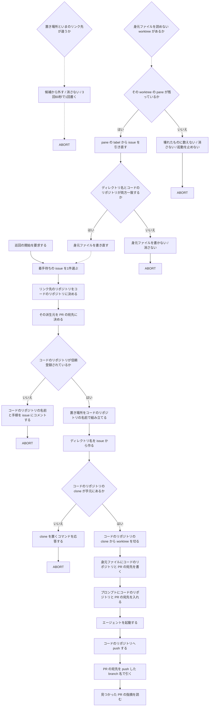
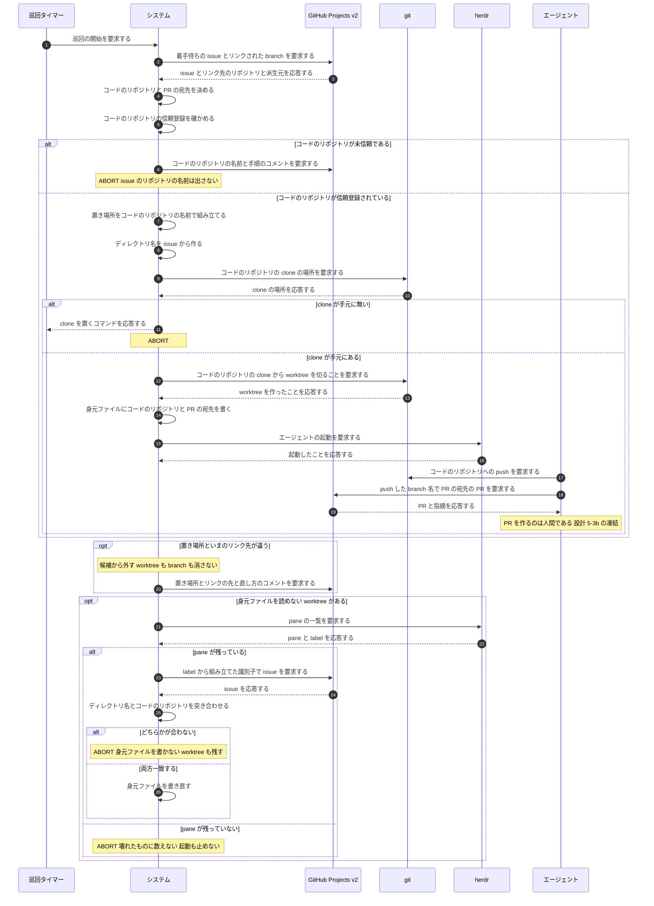

# ユースケース: issue とコードが別のリポジトリにある issue に着手する

## 根拠資料

- `docs/plans/impl/issue144_branch_and_push.md`（1 / 7 / 7b / 8 / 8b / 8b2 / 8c / 8c2 / 11c / 11d / 11f / 12b / 13b）
- `docs/plans/continuo_design.md#3-22`（worktree の置き場所は4階層に固定する）
- `docs/plans/continuo_design.md#3-49`（身元ファイルを読めない worktree の扱いと復元）
- `docs/plans/continuo_design.md#4-3`（信頼の鍵は clone の実体のパスである）
- `internal/workspace/layout.go` の `Locate`
- `internal/workspace/prepare.go` の `Prepare`、`CheckWorktreeUsable`
- `internal/workspace/broken.go` の `PathClueOf`、`ScanBroken`
- `internal/workspace/issuebranch.go` の `FindIssueBranch`
- `internal/orchestrator/dispatch.go` の `preflight`、`noteUntrusted`
- `internal/orchestrator/restore.go` の `pathAgrees`、`issueAgreesWithPath`、`recoveryClues`、`slugAgrees`
- `internal/orchestrator/coderepo.go` の `noteCodeRepoMismatch`
- `internal/abandon/abandon.go` の `pathAgrees`

## RUCM

```rucm
USE CASE NAME: issue とコードが別のリポジトリにある issue に着手する
BRIEF DESCRIPTION: 巡回タイマーが巡回を起こす。システムは issue にリンクされた branch のリポジトリをコードのリポジトリとして扱い、その clone から worktree を切ってエージェントを起動する。エージェントはコードのリポジトリへ push し、その派生元にある PR を branch 名で引いて指摘を読む。
PRECONDITION: システムは常駐している。issue は非公開のリポジトリにあり、直すコードはその fork にある。利用者は fork の branch を issue の Development にリンクしている。利用者は fork の clone を手元に置き、fork を Claude Code に信頼登録している。設定の herdr.worktree.base は null である。
PRIMARY ACTOR: 巡回タイマー
SECONDARY ACTORS: GitHub Projects v2、git、herdr、エージェント
DEPENDENCY: なし
GENERALIZATION: なし

BASIC FLOW:
1. 巡回タイマーはシステムに巡回の開始を要求する。
2. システムはカンバンから着手待ちの issue を1件選ぶ。
3. システムはリンクされた branch のリポジトリをコードのリポジトリに決める。
4. システムはコードのリポジトリの派生元を PR の宛先に決める。
5. システムは VALIDATES THAT コードのリポジトリが Claude Code に信頼登録されている。
6. システムは worktree の置き場所をコードのリポジトリの名前で組み立てる。
7. システムは worktree のディレクトリ名を issue から作る。
8. システムは VALIDATES THAT コードのリポジトリの clone が手元にある。
9. システムはコードのリポジトリの clone から worktree を切る。
10. システムは身元ファイルにコードのリポジトリと PR の宛先を書く。
11. システムはエージェントへ送るプロンプトにコードのリポジトリと PR の宛先を入れる。
12. システムはエージェントを起動する。
13. エージェントはコードのリポジトリへ成果を push する。
14. エージェントは PR の宛先のリポジトリを、push した branch の名前で引く。
15. エージェントは見つかった PR の指摘を読む。
POSTCONDITION: worktree は置き場所の `<host>/<コードのリポジトリの owner>/<コードのリポジトリの repo>/<issue から作ったディレクトリ名>` にある。身元ファイルにコードのリポジトリと PR の宛先がある。成果はコードのリポジトリの branch にある。エージェントは PR の宛先の PR を読める。issue のリポジトリにはコメント以外を1バイトも書き込んでいない。

SPECIFIC ALTERNATIVE FLOW コードのリポジトリが未信頼:
RFS BASIC FLOW 5
1. システムは issue に着手しない。
2. システムは issue に、コードのリポジトリの名前と信頼登録の手順をコメントする。
3. ABORT
POSTCONDITION: worktree は作られていない。issue に、コードのリポジトリの名前を名指しした案内が1件ある。同じコードのリポジトリでは、その案内は二度書かれない。

SPECIFIC ALTERNATIVE FLOW コードのリポジトリのcloneが無い:
RFS BASIC FLOW 8
1. システムは worktree を作らない。
2. システムは利用者にコードのリポジトリの clone を置くコマンドを応答する。
3. ABORT
POSTCONDITION: worktree は作られていない。issue のリポジトリの clone は探しに行っていない。

GLOBAL ALTERNATIVE FLOW 置き場所とリンクの食い違い:
BRANCH FROM BASIC FLOW 6
WHEN 既にある worktree の置き場所が、いまリンクされているコードのリポジトリと違う場合
1. システムはその worktree を候補から外す。
2. システムは worktree も branch も消さない。
3. IF 同じ理由で3回続けて止め、かつ最初に止めてから60秒たっている THEN
4.   システムは issue に、置き場所とリンクの先と直し方を1件コメントする。
5. ENDIF
6. システムは利用者に食い違いをログで応答する。
7. ABORT
POSTCONDITION: worktree は残っている。branch は残っている。issue の Status は変わっていない。3回・60秒の条件を満たした場合、issue に直し方のコメントが1件ある。

GLOBAL ALTERNATIVE FLOW 身元ファイルの復元:
BRANCH FROM BASIC FLOW 2
WHEN 置き場所に身元ファイルを読めない worktree があり、その worktree を cwd に持つ pane が残っている場合
1. システムは pane の label から issue の owner とリポジトリ名と番号を取り出す。
2. システムはその識別子でカンバンから issue を引き直す。
3. システムは VALIDATES THAT 引き直した issue から作ったディレクトリ名が、目の前のディレクトリ名と一致する。
4. システムは VALIDATES THAT 引き直した issue のコードのリポジトリが、置き場所の名前と一致する。
5. システムは身元ファイルを書き直す。
6. RESUME STEP 2
POSTCONDITION: worktree に身元ファイルがある。worktree も branch も1バイトも消えていない。次の巡回からその worktree はふつうの候補になる。

SPECIFIC ALTERNATIVE FLOW ディレクトリ名が合わない:
RFS 身元ファイルの復元 3
1. システムは身元ファイルを書かない。
2. システムは worktree を消さない。
3. システムは利用者に、目の前のディレクトリ名と引き直した issue から作った名前をログで応答する。
4. ABORT
POSTCONDITION: 身元ファイルは無いままである。worktree は残っている。branch は残っている。

SPECIFIC ALTERNATIVE FLOW コードのリポジトリが合わない:
RFS 身元ファイルの復元 4
1. システムは身元ファイルを書かない。
2. システムは worktree を消さない。
3. システムは利用者に、置き場所の名前と引き直した issue のコードのリポジトリをログで応答する。
4. ABORT
POSTCONDITION: 身元ファイルは無いままである。worktree は残っている。branch は残っている。

GLOBAL ALTERNATIVE FLOW 手掛かりが1つも無い:
BRANCH FROM BASIC FLOW 2
WHEN 置き場所に身元ファイルを読めない worktree があり、その worktree を cwd に持つ pane も残っていない場合
1. システムはその worktree を壊れたものに数えない。
2. システムは worktree を消さない。
3. システムは起動を止めない。
4. ABORT
POSTCONDITION: worktree は残っている。branch は残っている。システムは起動を続けている。その worktree は報告にも復元にも出ない。
```

## 置き場所はコードのリポジトリで切り、ディレクトリ名は issue から作る

**言いたいこと。**置き場所の4階層は変えない。
**2・3階層目に入るものだけを、issue のリポジトリからコードのリポジトリへ移す。**

```text
<workspace.root>/<host>/<コードのリポジトリの owner>/<コードのリポジトリの repo>/<issue から作ったディレクトリ名>
```

| 階層 | 何が入るか |
| --- | --- |
| `<host>` | コードのリポジトリの URL のホスト部 |
| `<owner>/<repo>` | **コードのリポジトリ** |
| ディレクトリ名 | **issue から作ったもの**（`herdr.worktree.branch_template` の既定は issue の owner・repo・番号を含む） |

**なぜコードのリポジトリで切るのか。**worktree は fork の clone から切るので、
**パスが issue のリポジトリのままだと「パスから引いた clone」と
「git が答えた共通ディレクトリ」の突き合わせが必ず落ちる。**
**検算を緩めるのではなく、パスの意味を「コードの置き場所」に揃える。**

**5階層目は足さない。**足すと、既にある worktree が全部「置き場所の規則に合わない」になる。

## 照合の相手を2段に分ける

**言いたいこと。**「このパスは本当にこの issue のものか」を、
**その時点で手に入る材料だけで確かめる。**

| どこで | 何と何を比べるか |
| --- | --- |
| **カンバンを引く前** | **最下層のディレクトリ名**と、**身元ファイルが名乗る issue から作り直した名前** |
| **カンバンを引いたあと** | **置き場所の2・3階層目**と、**カンバンが答えたコードのリポジトリ** |

**カンバンを引く前にコードのリポジトリと比べることはできない。**
その照合は「カンバンを引き直した結果」を入力に取るので、
**先に書くと、答えが1件も無い状態で毎回落ち、cross-repo の worktree は一度も引き継がれない。**

**ディレクトリ名の比較は弱くない。**既定のテンプレートは issue の owner・repo・番号を含むので、
**身元ファイルの issue を差し替えると、作り直した名前がディレクトリ名と合わなくなる。**

## 身元ファイルの3つの値は、判断に1つも使わない

**言いたいこと。**身元ファイルは worktree の直下にあり、**エージェントが書き換えられる。**
だから判断に使う値はカンバンから取り直す。

| キー | 何が入るか | 誰が読むか |
| --- | --- | --- |
| `code_repo` | コードのリポジトリ | **人間だけ** |
| `pr_target` | PR の宛先 | **人間だけ** |
| `linked_branch` | base に使ったリンクされた branch の生の名前 | **人間だけ** |

**候補を絞る手掛かりにも使わない。**使うと、書き換えるだけで候補から外せてしまう。

## 信頼を確かめる相手はコードのリポジトリである

**言いたいこと。**信頼の鍵は clone の実体のパスであり、
**Claude Code が開くのはコードのリポジトリの worktree である。**

**issue のリポジトリは信頼登録されていなくてよい。**そこでは1行も実行しない。

**通知の鍵もコードのリポジトリで持つ。**issue のリポジトリで持つと、
**同じ issue のリポジトリに属する別々の fork の未信頼が1つに潰れ、2つ目が通知されない。**
**案内の本文にもコードのリポジトリの名前を出す。**出さないと
「issue のリポジトリが信頼登録されていません」という**間違った直し方**が人間に届く。

## PR を作るのはエージェントではない

**言いたいこと。**設計 5-3b は「エージェントに PR を作らせない」で凍結している。
**この形でも解かない。****PR を作るのは人間である。**

**エージェントがやるのは3つだけである。**

| 順 | 何をするか |
| --- | --- |
| 1 | コードのリポジトリ（fork）へ push する |
| 2 | **PR の宛先を、push した branch の名前で引く** |
| 3 | 見つかった PR の指摘に答え、もう一度 push する |

**凍結を解くかどうかは人間が決める。**解かないうちは、**PR が出るまでこのユースケースの
後半（指摘に答える）が一度も動かない。**その待ちは人間が引き受ける。

## PR は宛先の側で探す

**言いたいこと。**PR は派生元（upstream）にあり、issue のリポジトリには無い。
**別のリポジトリの PR は issue に紐づかない。**

**だから、push した branch の名前で引く口を1つ足す。**

```text
gh api "repos/<PR の宛先>/pulls?state=all&head=<コードのリポジトリの owner>:<push した branch 名>"
```

**issue のコメントを読む口は1文字も変えない。**あちらは issue のリポジトリのままである。

## 手掛かりが1つも無い worktree では、起動を止めない

**言いたいこと。**身元ファイルも pane も無い cross-repo の worktree は、
**「壊れたもの」に数えない。**数えると `workspace.on_broken_worktree` の既定で起動が止まる。

**なぜ数えられないか。**ディレクトリ名は issue から作られるが、その上の階層は
コードのリポジトリである。**2つが違うので、ディレクトリ名から issue の番号を切り出せない。**
pane が残っていればそちらから引けるが、**pane も無ければ手掛かりが1つも無い。**

**残る帰結を書いておく。**その worktree は報告にも復元にも出ない。
**そのかわり起動は止まらず、worktree も branch も1バイトも消えない。**
**出口は2つある。**身元ファイルを手で書くか、成果を push してから worktree を手で消すかである。

**この穴が開くのは、着手の途中で落ちたあとに人間が pane を閉じた場合だけである。**

## `continuo abandon` はカンバンを引かない

**言いたいこと。**abandon は片付けの途中で落ちた後始末に使う道具であり、
**issue がカンバンから外れていても動かなければならない。**

**照合はディレクトリ名だけで足りる。**置き場所の owner とリポジトリ名は比べない
（そこにはコードのリポジトリが入るので、人間が打った issue の owner とは一致しない）。

**branch を探す clone は、照合を通った worktree のパスの2・3階層目から取る。**
**パスはエージェントが書き換えられない**ので、身元ファイルの `code_repo` は使わない。
**worktree が1件も無いときは issue のリポジトリで引く。**手掛かりがパスしか無いのに、
そのパスが無いからである。**clone が見つからなければ「調べられなかった」と言って branch を残す。**

## フローチャート



## シーケンス図


