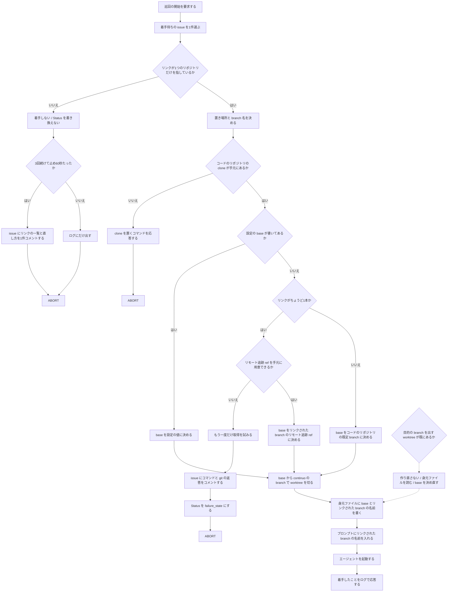
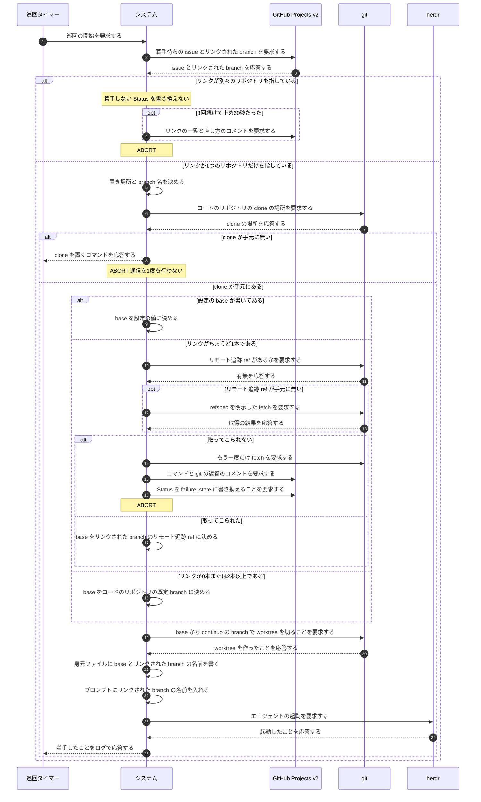

# ユースケース: issue にリンクされた branch を起点にして着手する

## 根拠資料

- `docs/plans/impl/issue144_branch_and_push.md`（1 / 5 / 10 / 10b / 11 / 11a / 11b / 11c / 11d / 11e）
- `docs/plans/continuo_design.md#3-22`（worktree の置き場所と、base を決める順番）
- `docs/plans/continuo_design.md#3-34b`（判定できない事情は failure_state と issue のコメントで人間へ渡す）
- `docs/plans/continuo_design.md#3-68`（ログだけにしない。3回・60秒で1回だけ書く）
- `internal/tracker/coderepo.go` の `resolveCodeRepo`
- `internal/tracker/query.go` の `mapRawItemToIssue`
- `internal/workspace/prepare.go` の `Prepare`、`resolveBase`、`ensureLinkedBranch`
- `internal/workspace/git.go` の `gitRemoteBranchRefExists`、`gitFetchLinkedBranch`
- `internal/orchestrator/dispatch.go` の `preflight`、`toIssueRef`
- `internal/orchestrator/coderepo.go` の `noteCodeRepoUndecided`
- `internal/orchestrator/prompt.go` の `renderFirstPrompt`

## RUCM

```rucm
USE CASE NAME: issue にリンクされた branch を起点にして着手する
BRIEF DESCRIPTION: 巡回タイマーが巡回を起こす。システムは issue にリンクされた branch を読み、その branch を手元へ取ってきて base にし、continuo の branch で worktree を切ってエージェントを起動する。リンクが無い issue は今までどおり既定 branch から切る。
PRECONDITION: システムは常駐している。カンバンに Status が active_states の issue が1件以上ある。設定の herdr.worktree.base は null である。利用者は GitHub の issue 画面の Development で branch をリンクしているか、1本もリンクしていない。
PRIMARY ACTOR: 巡回タイマー
SECONDARY ACTORS: GitHub Projects v2、git、herdr
DEPENDENCY: なし
GENERALIZATION: なし

BASIC FLOW:
1. 巡回タイマーはシステムに巡回の開始を要求する。
2. システムはカンバンから着手待ちの issue を1件選ぶ。
3. システムは VALIDATES THAT その issue にリンクされた branch が1つのリポジトリだけを指している。
4. システムは worktree の置き場所と branch 名を決める。
5. システムは VALIDATES THAT コードのリポジトリの clone が手元にある。
6. IF リンクされた branch がちょうど1本である THEN
7.   システムは VALIDATES THAT リンクされた branch のリモート追跡 ref を手元に用意できる。
8.   システムは base をそのリンクされた branch のリモート追跡 ref に決める。
9. ELSE
10.   システムは base をコードのリポジトリの既定 branch に決める。
11. ENDIF
12. システムは base から continuo の branch で worktree を切る。
13. システムは身元ファイルに base とリンクされた branch の名前を書く。
14. システムはエージェントへ送るプロンプトにリンクされた branch の名前を入れる。
15. システムはエージェントを起動する。
16. システムは利用者に着手したことをログで応答する。
POSTCONDITION: worktree は置き場所にある。worktree が出している branch は continuo が決めた名前である。リンクが1本だった場合、worktree の中身はその branch の先端である。身元ファイルに base とリンクされた branch の名前がある。issue の Status は running_state である。エージェントは起動している。

SPECIFIC ALTERNATIVE FLOW リンクが別々のリポジトリ:
RFS BASIC FLOW 3
1. システムは issue に着手しない。
2. システムはカンバンの Status を書き換えない。
3. IF 同じ理由で3回続けて止め、かつ最初に止めてから60秒たっている THEN
4.   システムは issue にリンクの一覧と直し方を1件コメントする。
5. ENDIF
6. システムは利用者に着手しない理由をログで応答する。
7. ABORT
POSTCONDITION: worktree は作られていない。issue の Status は変わっていない。3回・60秒の条件を満たした場合、issue にリンクの一覧と直し方のコメントが1件ある。同じ起動のあいだ、同じ理由のコメントは増えない。

SPECIFIC ALTERNATIVE FLOW cloneが手元に無い:
RFS BASIC FLOW 5
1. システムは worktree を作らない。
2. システムは通信を1度も行わない。
3. システムは利用者に clone を置くコマンドを応答する。
4. ABORT
POSTCONDITION: worktree は作られていない。リンクされた branch を取りに行っていない。

SPECIFIC ALTERNATIVE FLOW リンクされたbranchを取ってこられない:
RFS BASIC FLOW 7
1. システムはもう一度だけ取得を試みる。
2. システムは worktree を作らない。
3. システムは issue に、実行したコマンドと git が言ったことと直し方をコメントする。
4. システムはカンバンの Status を failure_state に書き換える。
5. ABORT
POSTCONDITION: worktree は作られていない。issue に実行したコマンドと git が言ったことのコメントがある。issue の Status は failure_state である。利用者が回線か認証を直して Status を戻せば、次の巡回でもう一度取りに行く。

GLOBAL ALTERNATIVE FLOW 設定のbaseが書いてある:
BRANCH FROM BASIC FLOW 6
WHEN 設定の herdr.worktree.base に branch 名が書いてある場合
1. システムは base を設定に書かれた branch に決める。
2. システムはリンクされた branch を取りに行かない。
3. RESUME STEP 12
POSTCONDITION: base は設定に書かれた branch である。リンクされた branch を取りに行っていない。

GLOBAL ALTERNATIVE FLOW 既存worktreeの再利用:
BRANCH FROM BASIC FLOW 12
WHEN 目的の置き場所に、目的の branch を出している worktree が既にある場合
1. システムは worktree を作り直さない。
2. システムは既にある身元ファイルを読む。
3. システムは base を決め直す。
4. RESUME STEP 13
POSTCONDITION: worktree は作り直されていない。身元ファイルに base がある。片付けの判定が base を使える。
```

## リンクの本数で振る舞いが変わる

**言いたいこと。**リンクは0本・1本・2本以上の3通りしかない。
**2本以上が別々のリポジトリを指していたときだけ、着手しない。**それ以外は必ず値が決まる。

| リンクの本数 | base に何を使うか |
| --- | --- |
| **0本** | 今までどおり。設定の値、無ければコードのリポジトリの既定 branch |
| **1本** | **その branch のリモート追跡 ref**（`origin/<名前>`） |
| **2本以上・全部同じリポジトリ** | **リンクを使わない。**コードのリポジトリの既定 branch |
| **2本以上・別々のリポジトリ** | **決めない。着手しない**（代替フロー リンクが別々のリポジトリ） |
| **取得の窓に収まらない本数** | **決めない。着手しない。**窓の外が別のリポジトリでないと言えない |

**2本以上のときにリンクの1本目を残さない。**残すと、プロンプトへ渡す branch 名にその1本目が載り、
**エージェントが押し付けられた branch へ push する。**

## base には `origin/` を付ける

**言いたいこと。**base として返した名前は、worktree を切る起点と、片付けの差分の判定の
両方に渡る。**どちらもローカルに無い名前を解決できない。**

**だから `origin/<リンクされた branch>` を返す。**
**身元ファイルの `linked_branch` には `origin/` を付けない**（プロンプトへ渡す push 先の候補は
生の branch 名である）。**この2つは形が違う。**

## 取りに行くのは worktree を作る直前だけ

**言いたいこと。**巡回のたびに通信すると、遅い回線で巡回が詰まる。
**叩くのは3つの条件が全部そろったときだけである。**

| 条件 | 理由 |
| --- | --- |
| リンクされた branch が base に選ばれた | 設定の base も既定 branch も手元にある |
| その branch のリモート追跡 ref が手元に無い | あるなら通信しない |
| 着手の段0 ではない | 段0 はカンバンの候補ぜんぶに毎巡回で走る。**候補の数だけ通信が増える** |

**refspec を明示した形だけを叩く。**素の `git fetch origin <名前>` は、
`--single-branch` で作られた clone では FETCH_HEAD しか動かさず、
**リモート追跡 ref を作らないので worktree が切れない。**

## 取ってこられなかったときは、黙って飛ばさない

**言いたいこと。**回線か認証の問題であり、**放っておいても直らない。**
Status を動かして issue へ書き、人間に渡す。

| 何 | どうするか |
| --- | --- |
| **やり直し** | **1回だけ。**間隔は1秒 |
| **上限** | `workspace.fetch_timeout_ms`（既定 30000 ミリ秒） |
| **2回落ちたら** | issue へコメントし、Status を `failure_state` にする |

**3回・60秒を待たない。**Status が動くこと自体が記録になるので、
**同じ issue で二度書かれることはない。**

## 着手しない経路は、issue へ1回だけ書く

**言いたいこと。**「リンクが別々のリポジトリ」は Status を1バイトも動かさない。
**動かさないので、書かないと誰にも届かない。**

| 何 | どうするか |
| --- | --- |
| 印の置き場所 | **メモリだけ。**再起動すると消えるので「1回の起動につき1回」になる |
| 鍵 | **issue の識別子と理由の種類の組** |
| いつ書くか | **同じ理由で3回続けて止め、かつ最初に止めてから60秒たったとき** |
| 通ったら | **印を消す。**直したあと再発したら、もう一度知らせる |

**1回目で書かない。**カンバンの候補一覧は GitHub のサーバ側の検索結果であり、
**索引の反映が遅れて1巡回だけ答えが揺れることがある。**
**揺れただけの issue に誤った案内が1件残る。消す手段は無い。**

## worktree の branch は、リンク先に置き換えない

**言いたいこと。**リンクは「どこから始めるか」であって「どこへ出すか」ではない。
**worktree が出す branch は continuo が決めた名前のままである。**

**置き換えると、次の巡回で「別の branch を出している」と判定され、
その issue に二度と着手できなくなる。**

**push 先の既定も変えない。**リンクされた branch の名前はプロンプトへ渡すが、
**「必ずそこへ push しろ」とは書かない。**base と push 先を同じものに固定すると、
1つの issue で PR を複数出す形が書けなくなる。

## フローチャート



## シーケンス図


