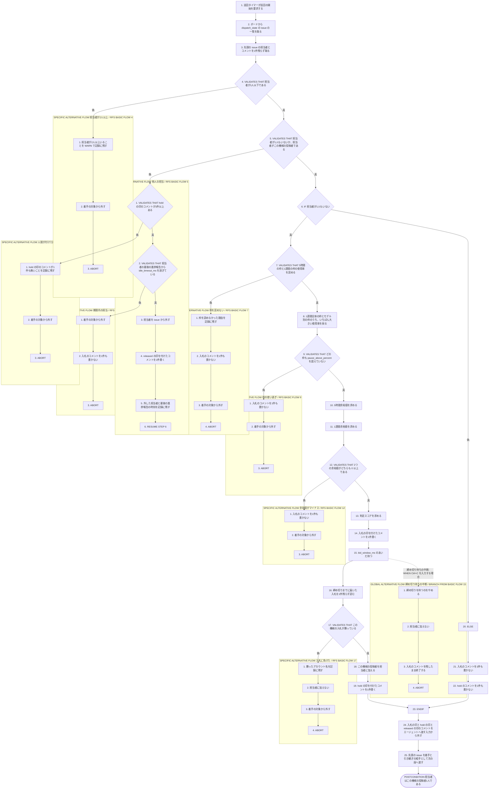
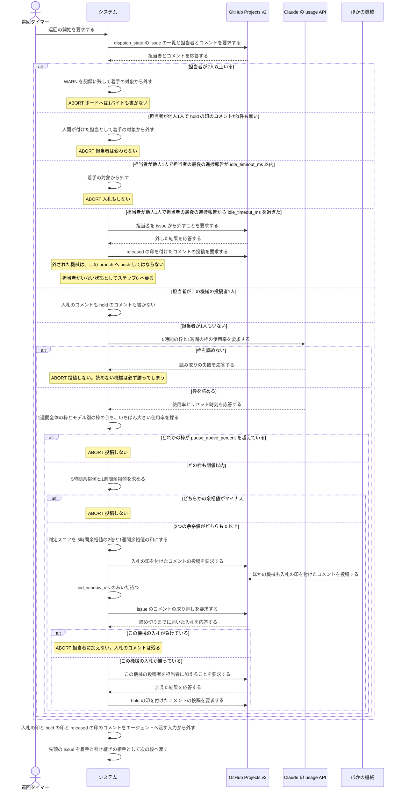

# ユースケース: issue の担当を入札で決める

## 根拠資料

- `docs/plans/continuo_design.md#3-77`（余裕値の出し方。判定スコア・投稿するかどうか・勝者の決め方・`bid_window_ms`）
- `docs/plans/continuo_design.md#3-77a`（入札のコメントの形と、エージェントへ渡す前に外すこと）
- `docs/plans/continuo_design.md#3-77b`（担当は assignee で持ち、期限は hold のコメントで持つ。見えているものと、その扱い）
- `docs/plans/continuo_design.md#3-77c`（期限が切れたときに担当が移る先と、そのとき失われるもの）
- `docs/plans/continuo_design.md#3-27`（枠の読み方と `rate_limit.pause_above_percent`）
- `docs/plans/continuo_design.md#3-16`（着手の段の順番。担当が決まったあとに続く段）
- `internal/ratelimit/ratelimit.go` の `Reader.Fetch`、`Snapshot`、`Snapshot.MaxPercent`
- `internal/orchestrator/orchestrator.go` の `dispatchPaused`
- `internal/tracker/query.go` の `rawUserConn`（`assignees` を運んでいる）、`commentsQueryTemplate`、`defaultCommentsPerFetch`
- `internal/config/default.go` の `Marker`、`SelfMarker`（エージェントへ渡すコメントの目印）

## RUCM

```rucm
USE CASE NAME: issue の担当を入札で決める
BRIEF DESCRIPTION: 巡回タイマーが巡回を起こす。システムは候補の先頭の issue の担当者を読み、担当者がいなければ枠の余裕値から判定スコアを出して入札のコメントを1件書く。システムは締め切りまで待って届いた入札をすべて読み、判定スコアがいちばん大きい機械が自分であれば自分を担当者に加えて hold のコメントを1件書く。システムは期限の切れた担当を外したときは、担当が外れたことを知らせる released のコメントを1件書く。システムは担当者が自分の issue には入札せず、そのまま着手と引き継ぎへ渡す。
PRECONDITION: システムは常駐している。システムはロックファイルの flock を取っている。ボードの Status の選択肢名は設定と一致する。ボードの dispatch_state の Status に issue が1件以上ある。同じボードを見張っている機械が1台以上ある。
PRIMARY ACTOR: 巡回タイマー
SECONDARY ACTORS: GitHub Projects v2、Claude の usage API、ほかの機械
DEPENDENCY: なし
GENERALIZATION: なし

BASIC FLOW:
1. 巡回タイマーはシステムに巡回の開始を要求する。
2. システムはボードから dispatch_state の issue の一覧を取る。
3. システムは先頭の issue の担当者と、issue のコメントを1件残らず取る。
4. システムは VALIDATES THAT 先頭の issue の担当者が1人以下である。
5. システムは VALIDATES THAT 先頭の issue に担当者が1人もいないか、担当者がこの機械の投稿者である。
6. IF 先頭の issue に担当者が1人もいない THEN
7.   システムは VALIDATES THAT Claude の usage API から5時間の枠と1週間の枠の使用率を読める。
8.   システムは1週間全体の枠とモデル別の枠のうち、いちばん大きい使用率を1週間の使用率にする。
9.   システムは VALIDATES THAT どの枠の使用率も rate_limit.pause_above_percent を超えていない。
10.   システムは5時間余裕値を、100 から5時間の使用率と5時間マージンを引いた値にする。
11.   システムは1週間余裕値を、100 から1週間の使用率と1週間マージンを引いた値にする。
12.   システムは VALIDATES THAT 5時間余裕値と1週間余裕値がどちらも 0 以上である。
13.   システムは判定スコアを、5時間余裕値の2倍と1週間余裕値の和にする。
14.   システムは5時間余裕値と1週間余裕値と判定スコアと投稿の時刻を書いた入札のコメントを、入札の印を先頭に置いて issue に1件書く。
15.   システムは bid_window_ms のあいだ待つ。
16.   システムは issue のコメントを取り直し、締め切りまでに届いた入札の印のコメントを1件残らず読む。
17.   システムは VALIDATES THAT 判定スコアがこの機械の入札より大きい入札が1件も無く、判定スコアがこの機械の入札と等しい入札のうちいちばん先に投稿されたものがこの機械の入札である。
18.   システムはこの機械の投稿者を先頭の issue の担当者に加える。
19.   システムは担当者と branch の名前と時刻を書いた hold のコメントを、hold の印を先頭に置いて issue に1件書く。
20. ELSE
21.   システムは入札のコメントを1件も書かない。
22.   システムは hold のコメントを1件も書かない。
23. ENDIF
24. システムは入札の印と hold の印と released の印が先頭に付いたコメントを、エージェントへ渡す入力から外す。
25. システムは先頭の issue を、この機械が着手または引き継ぎを行う相手として次の段へ渡す。
POSTCONDITION: 先頭の issue の担当者はこの機械の投稿者1人である。担当者が1人もいなかった issue には、入札のコメントが1件と hold のコメントが1件増えている。期限の切れた担当を外してから入札した issue には、released のコメントも1件増えている。担当者がこの機械の投稿者だった issue には、コメントが1件も増えていない。issue の Status は変わっていない。エージェントへ渡す入力に入札の印と hold の印と released の印のコメントは1件も入っていない。

SPECIFIC ALTERNATIVE FLOW 担当者が2人以上:
RFS BASIC FLOW 4
1. システムは担当者が2人以上いることを WARN で記録に残す。
2. システムは先頭の issue を着手の対象から外す。
3. ABORT
POSTCONDITION: 担当者は1人も増えず、1人も減っていない。issue にコメントは1件も増えていない。ボードへは1バイトも書いていない。issue の Status は変わっていない。

SPECIFIC ALTERNATIVE FLOW 他人の担当:
RFS BASIC FLOW 5
1. システムは VALIDATES THAT 先頭の issue に hold の印が先頭に付いたコメントが1件以上ある。
2. システムは VALIDATES THAT 担当者が最後に書いた進捗報告の時刻から idle_timeout_ms を過ぎている。
3. システムは担当者を先頭の issue から外す。
4. システムは外した担当者のアカウント名と branch の名前と時刻を書いた released のコメントを、released の印を先頭に置いて issue に1件書く。
5. システムは外した担当者の名前と、担当者の最後の進捗報告の時刻を記録に残す。
6. RESUME STEP 6
POSTCONDITION: 先頭の issue に担当者は1人もいない。issue に released の印が先頭に付いたコメントが1件増えている。担当を外されたアカウントは、この branch へ push してはならないことを issue の上から読める。issue の Status は変わっていない。branch は残っている。

SPECIFIC ALTERNATIVE FLOW 人間が付けた担当:
RFS 他人の担当 1
1. システムは hold の印が先頭に付いたコメントが1件も無いことを記録に残す。
2. システムは先頭の issue を着手の対象から外す。
3. ABORT
POSTCONDITION: 担当者は人間が付けたまま変わっていない。issue にコメントは1件も増えていない。ボードへは1バイトも書いていない。issue の Status は変わっていない。

SPECIFIC ALTERNATIVE FLOW 期限内の担当:
RFS 他人の担当 2
1. システムは先頭の issue を着手の対象から外す。
2. システムは入札のコメントを1件も書かない。
3. ABORT
POSTCONDITION: 担当者はほかの機械の投稿者のまま変わっていない。issue にコメントは1件も増えていない。ボードへは1バイトも書いていない。issue の Status は変わっていない。

SPECIFIC ALTERNATIVE FLOW 枠を読めない:
RFS BASIC FLOW 7
1. システムは枠を読めなかった理由を記録に残す。
2. システムは入札のコメントを1件も書かない。
3. システムは先頭の issue を着手の対象から外す。
4. ABORT
POSTCONDITION: 先頭の issue に担当者は1人もいない。この機械は入札のコメントを1件も書いていない。期限の切れた担当を外してから来た経路では、released の印が先頭に付いたコメントが1件増えている。担当を外さずに来た経路では、issue にコメントは1件も増えていない。ほかの機械が書いた入札のコメントは残っている。issue の Status は変わっていない。

SPECIFIC ALTERNATIVE FLOW 枠の使い過ぎ:
RFS BASIC FLOW 9
1. システムは入札のコメントを1件も書かない。
2. システムは先頭の issue を着手の対象から外す。
3. ABORT
POSTCONDITION: 先頭の issue に担当者は1人もいない。この機械は入札のコメントを1件も書いていない。期限の切れた担当を外してから来た経路では、released の印が先頭に付いたコメントが1件増えている。担当を外さずに来た経路では、issue にコメントは1件も増えていない。ほかの機械が書いた入札のコメントは残っている。issue の Status は変わっていない。

SPECIFIC ALTERNATIVE FLOW 余裕値がマイナス:
RFS BASIC FLOW 12
1. システムは入札のコメントを1件も書かない。
2. システムは先頭の issue を着手の対象から外す。
3. ABORT
POSTCONDITION: 先頭の issue に担当者は1人もいない。この機械は入札のコメントを1件も書いていない。期限の切れた担当を外してから来た経路では、released の印が先頭に付いたコメントが1件増えている。担当を外さずに来た経路では、issue にコメントは1件も増えていない。ほかの機械が書いた入札のコメントは残っている。issue の Status は変わっていない。

SPECIFIC ALTERNATIVE FLOW 入札に負けた:
RFS BASIC FLOW 17
1. システムは判定スコアがいちばん大きい入札を書いたアカウント名を記録に残す。
2. システムはこの機械の投稿者を担当者に加えない。
3. システムは先頭の issue を着手の対象から外す。
4. ABORT
POSTCONDITION: 先頭の issue の担当者はこの機械の投稿者ではない。issue にはこの機械が書いた入札のコメントが1件だけ残っている。hold のコメントは1件も増えていない。期限の切れた担当を外してから来た経路では、released の印が先頭に付いたコメントが1件増えている。issue の Status は変わっていない。

GLOBAL ALTERNATIVE FLOW 締め切り待ちの中断:
BRANCH FROM BASIC FLOW 15
WHEN 利用者が continuo を動かしている端末で Ctrl+C を入力する場合
1. システムは締め切りを待つのをやめる。
2. システムはこの機械の投稿者を担当者に加えない。
3. システムは書き終えた入札のコメントを issue に残したまま終了する。
4. ABORT
POSTCONDITION: 先頭の issue に担当者は1人もいない。issue にはこの機械が書いた入札のコメントが1件残っている。この機械が書いた hold のコメントは1件も無い。期限の切れた担当を外してから来た経路では、released の印が先頭に付いたコメントが1件増えている。continuo は常駐していない。
```

## 担当は assignee で持ち、期限は hold のコメントで持つ

**言いたいこと。**担当者（assignee）が持ち場の札である。**hold の印が先頭に付いたコメントが
1件でもあることが、「その担当者は機械である」の唯一の証拠である。**
機械の一覧を持たなくてよい（設計 [3-77b](../../../plans/continuo_design.md)）。

| 見えているもの | どこで受けるか | どうするか |
| --- | --- | --- |
| 担当者が1人もいない | 基本フローのステップ6 の真の側 | 入札する |
| 担当者がこの機械の投稿者1人 | 基本フローのステップ6 の偽の側 | 入札せずに着手と引き継ぎへ進む |
| 担当者が他人1人＋hold あり＋期限内 | `期限内の担当` | 触らない。**入札もしない** |
| 担当者が他人1人＋hold あり＋期限切れ | `他人の担当` のステップ3〜6 | 担当を外し、released のコメントを1件書いて入札をやり直す |
| 担当者が他人1人＋hold が1件も無い | `人間が付けた担当` | 触らない。**人間が付けた担当である。WARN を出す**（issue #131） |
| 担当者が2人以上 | `担当者が2人以上` | 触らない。WARN を出す |

**hold の無い担当を奪わない。**この1点があるので、人間が誰かに割り当てた issue を
continuo が取り上げることはない。

## 期限は hold を書いた時刻からではなく、担当者の最後の進捗報告から数える

**言いたいこと。**hold のコメントは勝ったとき1件だけ書き、書き直さない。
**期限は「その担当者の進捗報告が最後に現れてから」で数える**（`他人の担当` のステップ2）。

| 数え方 | 進捗を書き続けている機械はどうなるか |
| --- | --- |
| hold を書いた時刻から数える | 18時間で担当を外される。**書き直しのコメントを定期的に足す羽目になる** |
| **担当者の最後の進捗報告から数える** | **担当を外されない。**進捗報告がそのまま期限を延ばす |

**だから hold のコメントは1件で足りる。**進捗報告が期限の役を兼ねる。

**数えるのは進捗報告だけである。**進捗報告とは、本文に `<!-- continuo:progress -->` が
入っているコメントのことである（設計 [5-3l](../../../plans/continuo_design.md)）。
**エージェントも continuo も人間も、同じ GitHub アカウントで投稿する。**
**投稿者だけで数えると、人間が無関係なコメントを1件書いただけで期限が18時間先へ延び、
黙り込んだエージェントを別の機械が拾い直せない。**

**進捗報告が1件も無いあいだは、hold のコメントが作られた時刻から数える。**
勝った直後には進捗報告が無いので、下限を置かないとその場で期限切れになる。

**18時間の意味。**終業時に PC を落とした人が翌朝に再開すれば、そのまま続けられる長さである。
**週末や休暇で進捗が止まったら、途中まで進んだ分は捨てて、別の機械が最初からやり直す。**

## 判定スコアの出し方と、投稿しない条件

**言いたいこと。**余裕値は使用率から作る。**使用率は「0% が未使用、100% が使い切り」で、
usage API が返す値そのものである**（`internal/ratelimit/ratelimit.go` の `Snapshot`）。

```
5時間余裕値  = 100 − 5時間の使用率 − 5時間マージン
1週間余裕値  = 100 − 1週間の使用率 − 1週間マージン
判定スコア   = 5時間余裕値 × 2 + 1週間余裕値
```

**1週間の使用率は、1週間全体の枠とモデル別の枠のうち、いちばん大きいものを採る**（ステップ8）。
モデル別の枠は一定量を使うまで現れないので、**現れないものは判定に入らない。**
最大を採れば自動的にそうなる。

**投稿しない条件は3つある。どれも「黙る」だけで、ほかの機械はこの機械を待たない。**

| 投稿しない条件 | どこで受けるか | なぜ投稿しないか |
| --- | --- | --- |
| 枠を読めなかった | `枠を読めない` | **読めないと使用率0（＝いちばん暇）に見え、必ず勝ってしまう** |
| どれかの枠の使用率が `rate_limit.pause_above_percent`（既定95）を超えた | `枠の使い過ぎ` | **この機械は入札に勝っても着手しない。**勝ったのに動かない機械が出ると、issue が誰にも着手されないまま止まる |
| 5時間余裕値と1週間余裕値のどちらかがマイナス | `余裕値がマイナス` | 処理する余裕が無いという意味である |

**マージンは `WORKFLOW.md` に持つ。**単位は %。「continuo のために残しておきたい割合」である。

## 締め切りと勝者の決め方

| 何を | どう決めるか |
| --- | --- |
| **締め切り** | `bid_window_ms`（既定3分）。**巡回の間隔（既定30秒）より十分長く取る。**位相がずれている機械も6回は巡回できる |
| **勝者** | 判定スコアがいちばん大きい機械 |
| **同点のとき** | **いちばん最初に投稿した機械** |

**勝者は届いた入札だけで決まる。**同じコメントの列を読んだ機械は同じ勝者に行き着くので、
**担当者を書く前にもう一度担当者を読み直す段は置かない。**

**入札のたびに新しいコメントを書く。**編集して使い回さない。

## 入札と hold と released のコメントを、エージェントに読ませない

**言いたいこと。**入札はコメントに書くが、**エージェントへ渡す入力には混ぜない**（ステップ24）。
外すのは `<!-- continuo:bid -->` と `<!-- continuo:hold -->` と `<!-- continuo:released -->` の3つだけで、
**`<!-- continuo:agent -->` と `<!-- continuo:self -->` は今までどおり渡す**
（`internal/config/default.go` の `Marker` と `SelfMarker`）。

**時刻は、その機械のタイムゾーンで書く。**日本で動いていれば `+09:00` を付ける。
**`Z`（協定世界時）に直さない。**人間がログと突き合わせるとき、手元の時計と合っているほうが読みやすい。

**書くコメントの実物。**

入札（勝つかどうかに関わらず、入札するたびに1件）。

```
<!-- continuo:bid -->
{"five_hour": 87, "weekly": 16, "score": 190, "at": "2026-08-29T16:45:00+09:00"}

**<アカウント名> がこの issue の担当に立候補しています。**上の JSON は、そのアカウントで動いている continuo にレートリミットの枠がどれだけ残っているかです。
**担当は約3分後に自動で決まります。**締め切りまでに届いた入札のうち、枠の余裕がいちばん大きいアカウントが担当になります。
```

**JSON の下に、人間が読む2行を置く**（released と同じ形）。
**待ち時間は `bid_window_ms` から出す。**分に切り上げるので、既定の 180000 ミリ秒は「約3分後」になる。
**0 のときは「締め切りを待たずに決まります」と書く。**

hold（勝ったとき1件だけ）。

```
<!-- continuo:hold -->
{"assignee":"<担当者のログイン名>","branch":"continuo/octocat/hello-world/188","at":"2026-08-29T18:45:00+09:00"}

**この issue の担当は <担当者のログイン名> に決まりました。**入札したアカウントのうち、レートリミットの枠の余裕がいちばん大きいものです。
**これから branch continuo/octocat/hello-world/188 で作業を始めます。**進捗はこの issue のコメントへ書きます。
```

**branch の名前を組み立てられなかったときは、名前を出さない文へ落とす。**
そのまま差し込むと「これから branch  で作業を始めます」と空白の穴が開く。

released（期限の切れた担当を外したとき1件だけ。`他人の担当` のステップ4）。

```
<!-- continuo:released -->
{"from":"<外した担当者のアカウント名>","branch":"continuo/octocat/hello-world/188","at":"2026-08-30T09:00:00+09:00"}

**この issue の担当は外れました。次の担当は入札で決め直します。**
**<外した担当者のアカウント名> のアカウントで走っていた作業は、この branch へ push しないでください。**
```

**入札と hold で足す文に `}` を入れてはならない。**読み取りは最初の `{` と**最後の `}`** の間を
切り出すので、あとに `}` が現れると JSON がそこまで伸びて壊れる。**壊れた入札は数に入らない。**

**`from` は、外した担当者のアカウント名である。**このコメントを書くのは外した側で、
**`from` に入るのは外された側なので、投稿者からは引けない。**だから欄として持つ。

**入札と hold には、自分で名乗る欄を置かない。**誰が書いたかは、GitHub がコメントに付ける
投稿者が答える。**本文に書くと、本文の値と投稿者という同じ事実の出どころが2つできる。**
**本文は第三者にも書けるので、他の continuo の名前を騙られると、
騙られたほうは以後1度も入札しなくなる。**

**引き継ぐアカウントは、この段では書かない。**外すのは入札をやり直す前なので、
**そのとき勝つ continuo はまだ決まっていない**（外した側が負けることもある）。
**次に誰が担当になったかは、あとから現れる hold のコメントの `assignee` で読める。**

**コメントは全部取る。**いまは新しい方から50件だけを取っている
（`internal/tracker/query.go` の `defaultCommentsPerFetch`）が、
**入札で押し流されると、エージェントが書いた報告が見えなくなる。**

**hold に branch の名前を入れる理由。**branch の名前は issue から一意に決まる
（`herdr.worktree.branch_template` の既定は
`continuo/{{.issue.owner}}/{{.issue.repo}}/{{.issue.number}}`）ので、
**担当が移っても同じ名前になる。****次の機械は、前の機械が push した続きから始められる。**
**それでも書くのは、人間がどこを見ればよいかを issue の上だけで分かるようにするためである。**

## 担当を外したら、外した側が released のコメントを書く

**言いたいこと。**担当を外された機械は、**その branch へ push してはならない**（設計 3-77c）。
**外された側は自分が外されたことを知らない**ので、外した側が issue に書く。

| 外された機械が、それを知る手立て | いつ効くか |
| --- | --- |
| 作業を再開するときに issue の担当者を読み直す | 落ちていた機械が翌朝に起動したとき |
| 走っている最中に `recheck_interval_ms`（既定1時間）ごとに issue の担当者を読み直す | 走り続けている機械が、その turn の終わりで止まるとき |

**どちらも「担当者が自分でなくなっている」ことを見て止まる。**
released のコメントは、**それを人間が issue の上だけで読めるようにするために書く**
（走っている最中の確かめ直しは `issue を1件処理する` が持つ）。

## 担当を外した issue の worktree と branch には手を出さない

**言いたいこと。**`他人の担当` が外すのは**担当者だけ**である。
**その機械の worktree も branch も、この機械からは触れない**（別の機械のディスクの中にある）。

| 外したあとに残るもの | 次の機械から見た扱い |
| --- | --- |
| 前の機械の worktree | **見えない。**新しい機械は自分の置き場所に worktree を作る |
| push 済みの commit | **branch の名前が同じなので、その続きから始まる** |
| push していない commit | **失われる。**だから生きている機械は進捗のコメントと一緒に push する |
| 会話の文脈 | **引き継げない。**新しいセッションで最初からになる |

## 締め切りを待つ途中で止められたら、入札のコメントは残る

**言いたいこと。**`締め切り待ちの中断` は入札のコメントを消さない。
**消しに行くには、消せたかどうかを確かめる往復がもう1回要る。**止められている最中に
ボードへ書きに行くのは、止めた人の指示と逆である。

**残しても害が無い。**入札のコメントには判定スコアと投稿の時刻しか書いていない。
落ちた機械が勝者になっても、**その機械は担当者を書かないので hold のコメントが現れない。**
ほかの機械から見ると「担当者が1人もいない issue」のままなので、次の巡回で入札がやり直される。

## フローチャート



## シーケンス図


