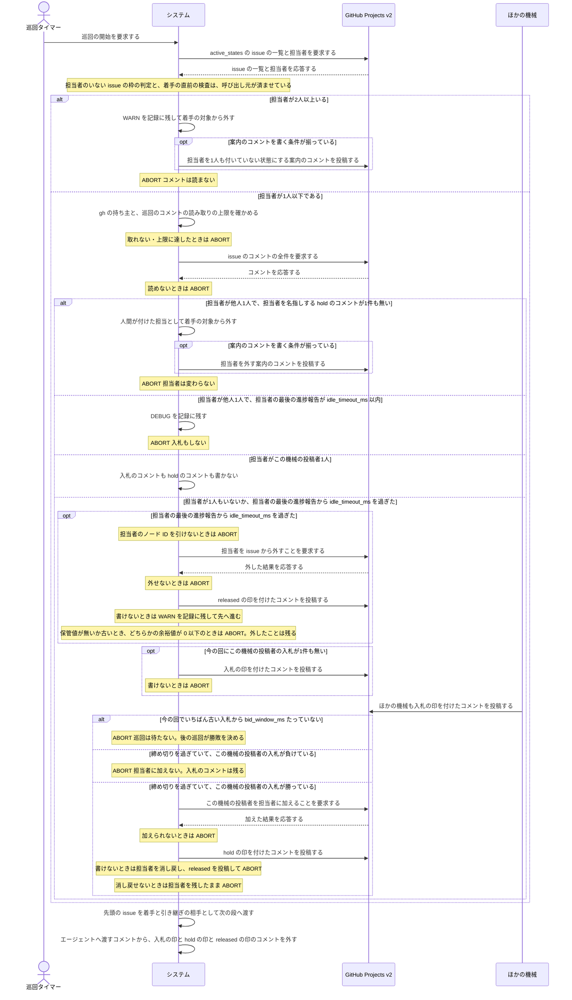

# ユースケース: issue の担当を入札で決める

## 根拠資料

- `docs/plans/continuo_design.md#3-77-0`（持ち回りで参加者を見分ける値。入札は投稿者、hold は本文の `assignee`、released は本文の `from`）
- `docs/plans/continuo_design.md#3-77`（余裕値の出し方。判定スコア・投稿するかどうか・勝者の決め方・`bid_window_ms`）
- `docs/plans/continuo_design.md#3-77a`（入札のコメントの形と、エージェントへ渡す前に外すこと）
- `docs/plans/continuo_design.md#3-77b`（担当は assignee で持ち、期限は hold のコメントで持つ。見えているものと、その扱い）
- `docs/plans/continuo_design.md#3-77c`（期限が切れたときに担当が移る先と、そのとき失われるもの）
- `docs/plans/continuo_design.md#3-27`（usage API と statusline の切り替え・保管値の規則・新しさの幅・statusline取得）
- `docs/plans/continuo_design.md#3-77i`（値が新しくなければ入札しない。usage API の次の読み取りか statusline取得で値が入ってから入札する）
- `docs/plans/continuo_design.md#3-4f`（巡回は、statusline取得の値が届いた知らせでも回す）
- `docs/plans/continuo_design.md#3-16`（着手の段の順番。担当が決まったあとに続く段）
- `docs/plans/continuo_design.md#3-77j`（入札を見送った理由を、既定のログの水準で1行出す）
- `internal/ratelimit/ratelimit.go` の `Snapshot`、`Snapshot.AnySelected`、`Snapshot.SelectedKinds`
- `internal/orchestrator/quota.go` の `quotaForBid`、`quotaFreshLocked`、`quotaRefreshInterval`、`OnAPISnapshot`
- `internal/orchestrator/handoff.go` の `handoffGate`、`evaluateBidWith`、`releaseExpiredAssignee`、`assigneeIDOf`、`bidForIssue`、`postBid`、`undoHandoffAcquire`、`releaseOwnAssignee`、`removeOwnAssignee`、`takeHandoffFetch`、`viewerIdentity`
- `internal/orchestrator/gate.go` の `noteGate`、`postGateNotice`、`gateNoticedIn`
- `internal/handoff/assess.go` の `Assess`、`LatestHoldFor`、`RoundStart`、`HasBidBy`
- `internal/handoff/handoff.go` の `Evaluate`、`WeeklyPercent`、`Short`、`ShortWeekly`、`ThresholdPercent`、`RoundBids`、`Deadline`、`BidsBefore`、`Winner`
- `internal/orchestrator/dispatch.go` の `dispatchCandidates`、`newWorkBlockedWith`、`logNewWorkBlocked`、`preflight`
- `internal/orchestrator/orchestrator.go` の `Run`、`Tick`、`pollAPI`
- `internal/tracker/query.go` の `rawUserConn`（`assignees` を運んでいる）、`commentsQueryTemplate`、`defaultCommentsPerFetch`、`maxCommentPages`
- `internal/tracker/adapter.go` の `FetchAllComments`、`keepNewestUnmarked`
- `internal/config/default.go` の `Marker`、`SelfMarker`（エージェントへ渡すコメントの目印）

## RUCM

```rucm
USE CASE NAME: issue の担当を入札で決める
BRIEF DESCRIPTION: 巡回タイマーが巡回を起こす。巡回は statusline取得の値が届いた知らせでも起きる。システムは候補の先頭の issue の担当者を読む。システムは担当者が1人もいない issue に、枠の余裕値から出した判定スコアを書いた入札のコメントを1件書く。システムは締め切りの前の巡回では担当者を決めない。システムは締め切りを過ぎた巡回で今の回の入札を比べ、判定スコアがいちばん大きい入札がこの機械の投稿者の入札であれば、この機械の投稿者を担当者に加えて hold のコメントを1件書く。システムは期限の切れた担当を外したときは、担当が外れたことを知らせる released のコメントを1件書く。システムは担当者がこの機械の投稿者である issue には入札せず、そのまま着手と引き継ぎへ渡す。
PRECONDITION: システムは常駐している。システムはロックファイルの flock を取っている。ボードの Status の選択肢名は設定と一致する。ボードの active_states の Status に issue が1件以上ある。先頭の issue は draft issue ではない。この機械に空きスロットがある。担当者が1人もいない先頭の issue は、呼び出し元の枠の判定を通っている。先頭の issue は着手の直前の検査を通っている。同じボードを見張っている機械が1台以上ある。
PRIMARY ACTOR: 巡回タイマー
SECONDARY ACTORS: GitHub Projects v2、ほかの機械
DEPENDENCY: なし
GENERALIZATION: なし

BASIC FLOW:
1. 巡回タイマーはシステムに巡回の開始を要求する。
2. システムはボードから active_states の issue の一覧を、各 issue の担当者と一緒に取る。
3. システムは VALIDATES THAT 先頭の issue の担当者が1人以下である。
4. システムは保管している使用率とマージンから、入札できるかを判定する。
5. システムは gh からこの機械の投稿者のアカウント名を取る。
6. システムは VALIDATES THAT システムがこの機械の投稿者のアカウント名を持っている。
7. システムは VALIDATES THAT この巡回でコメントを読んだ issue の数が10件より少ない。
8. システムは GitHub Projects v2 に先頭の issue のコメントの全件を要求する。
9. システムは VALIDATES THAT GitHub Projects v2 が先頭の issue のコメントを応答する。
10. システムは VALIDATES THAT 先頭の issue に担当者が1人もいないか、担当者がこの機械の投稿者である。
11. IF 先頭の issue に担当者が1人もいない THEN
12.   IF 今の回の入札にこの機械の投稿者の入札が1件も無い THEN
13.     システムは5時間余裕値と1週間余裕値と判定スコアと投稿の時刻を書いた入札のコメントを、入札の印を先頭に置いて issue に1件書く。
14.     システムは VALIDATES THAT GitHub Projects v2 が入札のコメントを受け付ける。
15.   ENDIF
16.   システムは VALIDATES THAT 今の回でいちばん古い入札の投稿の時刻から bid_window_ms 以上たっている。
17.   システムは今の回の入札のうち、締め切りまでに届いた入札を比べる。
18.   システムは VALIDATES THAT 締め切りまでに届いた入札のうち、判定スコアがいちばん大きく、同点の中でいちばん先に投稿された入札が、この機械の投稿者の入札である。
19.   システムは GitHub Projects v2 に、この機械の投稿者を先頭の issue の担当者に加えることを要求する。
20.   システムは VALIDATES THAT GitHub Projects v2 がこの機械の投稿者を担当者に加える。
21.   システムは担当者と branch の名前と時刻を書いた hold のコメントを、hold の印を先頭に置いて issue に1件書く。
22.   システムは VALIDATES THAT GitHub Projects v2 が hold のコメントを受け付ける。
23. ELSE
24.   システムは入札のコメントを1件も書かない。
25.   システムは hold のコメントを1件も書かない。
26. ENDIF
27. システムは先頭の issue を、この機械が着手または引き継ぎを行う相手として次の段へ渡す。
28. システムはエージェントへ渡すコメントから、入札の印と hold の印と released の印が先頭に付いたコメントを外す。
POSTCONDITION: 先頭の issue の担当者はこの機械の投稿者1人である。担当者が1人もいなかった issue には、今の回にこの機械の投稿者の入札のコメントが1件と hold のコメントが1件ある。期限の切れた担当を外してから入札した issue には、GitHub Projects v2 が受け付けた released のコメントが1件増えている。担当者がこの機械の投稿者だった issue には、コメントが1件も増えていない。issue の Status は変わっていない。エージェントへ渡す入力に入札の印と hold の印と released の印のコメントは1件も入っていない。

SPECIFIC ALTERNATIVE FLOW 担当者が2人以上:
RFS BASIC FLOW 3
1. システムは担当者が2人以上いることを WARN で記録に残す。
2. IF 案内のコメントを書く条件が揃っている THEN
3.   システムは担当者を1人も付いていない状態にする案内のコメントを issue に1件書く。
4. ENDIF
5. システムは先頭の issue を着手の対象から外す。
6. ABORT
POSTCONDITION: 担当者は1人も増えず、1人も減っていない。入札のコメントと hold のコメントと released のコメントは1件も増えていない。案内のコメントは、書く条件が揃った巡回で1件だけ増えている。システムは先頭の issue のコメントを読んでいない。issue の Status は変わっていない。

SPECIFIC ALTERNATIVE FLOW 投稿者を取れない:
RFS BASIC FLOW 6
1. システムは gh の持ち主を取れないので着手しないことを WARN で記録に残す。
2. システムは先頭の issue を着手の対象から外す。
3. ABORT
POSTCONDITION: 担当者は変わっていない。issue にコメントは1件も増えていない。システムは先頭の issue のコメントを読んでいない。issue の Status は変わっていない。次の巡回が同じ判定をやり直す。

SPECIFIC ALTERNATIVE FLOW コメントの読み取りの上限:
RFS BASIC FLOW 7
1. システムはコメントの読み取りが巡回の上限に達したことを INFO で記録に残す。
2. システムはこの巡回で残りの候補を1件も見ない。
3. ABORT
POSTCONDITION: 担当者は変わっていない。issue にコメントは1件も増えていない。システムは先頭の issue のコメントを読んでいない。issue の Status は変わっていない。次の巡回が候補の先頭から見直す。

SPECIFIC ALTERNATIVE FLOW コメントを読めない:
RFS BASIC FLOW 9
1. システムはコメントを読めないので着手しないことを WARN で記録に残す。
2. システムは先頭の issue を着手の対象から外す。
3. ABORT
POSTCONDITION: 担当者は変わっていない。issue にコメントは1件も増えていない。issue の Status は変わっていない。次の巡回が同じ判定をやり直す。

SPECIFIC ALTERNATIVE FLOW 他人の担当:
RFS BASIC FLOW 10
1. システムは VALIDATES THAT 先頭の issue に、担当者を名指しする hold のコメントが1件以上ある。
2. システムは VALIDATES THAT 担当者が最後に書いた進捗報告の時刻から idle_timeout_ms を過ぎている。
3. システムは VALIDATES THAT 候補の一覧が担当者のノード ID を持っている。
4. システムは GitHub Projects v2 に担当者を先頭の issue から外すことを要求する。
5. システムは VALIDATES THAT GitHub Projects v2 が担当者を先頭の issue から外す。
6. システムは外した担当者の名前と、担当者の最後の進捗報告の時刻を記録に残す。
7. システムは GitHub Projects v2 に、外した担当者のアカウント名と branch の名前と時刻を書いた released のコメントを、released の印を先頭に置いて issue に1件書くことを要求する。
8. システムは VALIDATES THAT システムが入札に使ってよい使用率を持っていて、5時間余裕値と1週間余裕値がどちらも 0 より大きい。
9. RESUME STEP 12
POSTCONDITION: 先頭の issue に担当者は1人もいない。GitHub Projects v2 が released のコメントを受け付けた場合、issue に released の印が先頭に付いたコメントが1件増えている。GitHub Projects v2 が released のコメントを受け付けなかった場合、システムは WARN を記録に残していて、released のコメントは1件も増えていない。担当を外されたアカウントは、released のコメントがある issue の上から、この branch へ push してはならないことを読める。issue の Status は変わっていない。branch は残っている。

SPECIFIC ALTERNATIVE FLOW 人間が付けた担当:
RFS 他人の担当 1
1. システムは担当者を名指しする hold のコメントが1件も無いことと、担当者を外せば着手することを WARN で記録に残す。
2. IF 案内のコメントを書く条件が揃っている THEN
3.   システムは担当者を外す案内のコメントを issue に1件書く。
4. ENDIF
5. システムは先頭の issue を着手の対象から外す。
6. ABORT
POSTCONDITION: 担当者は人間が付けたまま変わっていない。入札のコメントと hold のコメントと released のコメントは1件も増えていない。案内のコメントは、書く条件が揃った巡回で1件だけ増えている。issue の Status は変わっていない。

SPECIFIC ALTERNATIVE FLOW 期限内の担当:
RFS 他人の担当 2
1. システムはほかの機械が期限内で担当していることを DEBUG で記録に残す。
2. システムは先頭の issue を着手の対象から外す。
3. システムは入札のコメントを1件も書かない。
4. ABORT
POSTCONDITION: 担当者はほかの機械の投稿者のまま変わっていない。issue にコメントは1件も増えていない。ボードへは1バイトも書いていない。issue の Status は変わっていない。

BOUNDED ALTERNATIVE FLOW 担当を外せない:
RFS 他人の担当 3,5
1. システムは期限の切れた担当を外せないことを WARN で記録に残す。
2. システムは released のコメントを1件も書かない。
3. システムは先頭の issue を着手の対象から外す。
4. ABORT
POSTCONDITION: 担当者はほかの機械の投稿者のまま変わっていない。issue にコメントは1件も増えていない。issue の Status は変わっていない。次の巡回が同じ判定をやり直す。

SPECIFIC ALTERNATIVE FLOW 外したあと入札できない:
RFS 他人の担当 8
1. システムは入札しない理由を INFO で記録に残す。
2. システムは入札のコメントを1件も書かない。
3. システムは先頭の issue を着手の対象から外す。
4. ABORT
POSTCONDITION: 先頭の issue に担当者は1人もいない。GitHub Projects v2 が released のコメントを受け付けた場合、issue に released の印が先頭に付いたコメントが1件増えている。この機械は入札のコメントを1件も書いていない。issue の Status は変わっていない。入札できる機械が次の巡回で先頭の issue を拾う。

SPECIFIC ALTERNATIVE FLOW 入札を書けない:
RFS BASIC FLOW 14
1. システムは入札のコメントを書けないことを WARN で記録に残す。
2. システムは先頭の issue を着手の対象から外す。
3. ABORT
POSTCONDITION: 先頭の issue に担当者は1人もいない。この機械は入札のコメントを1件も書いていない。期限の切れた担当を外してから来た経路では、GitHub Projects v2 が受け付けた released のコメントが1件増えている。issue の Status は変わっていない。次の巡回が入札をやり直す。

SPECIFIC ALTERNATIVE FLOW 締め切り前:
RFS BASIC FLOW 16
1. システムは締め切りを待つことを DEBUG で記録に残す。
2. システムはこの機械の投稿者を担当者に加えない。
3. システムは先頭の issue を着手の対象から外す。
4. ABORT
POSTCONDITION: 先頭の issue に担当者は1人もいない。今の回にこの機械の投稿者の入札のコメントが1件ある。hold のコメントは1件も増えていない。期限の切れた担当を外してから来た経路では、GitHub Projects v2 が受け付けた released のコメントが1件増えている。巡回は締め切りを待たずに次の候補へ進んでいる。締め切りを過ぎた後の巡回が勝敗を決める。

SPECIFIC ALTERNATIVE FLOW 入札に負けた:
RFS BASIC FLOW 18
1. システムは判定スコアがいちばん大きい入札を書いたアカウント名を記録に残す。
2. システムはこの機械の投稿者を担当者に加えない。
3. システムは先頭の issue を着手の対象から外す。
4. ABORT
POSTCONDITION: 先頭の issue の担当者はこの機械の投稿者ではない。今の回にこの機械の投稿者の入札のコメントが1件ある。hold のコメントは1件も増えていない。期限の切れた担当を外してから来た経路では、GitHub Projects v2 が受け付けた released のコメントが1件増えている。issue の Status は変わっていない。

SPECIFIC ALTERNATIVE FLOW 担当者を書けない:
RFS BASIC FLOW 20
1. システムは入札に勝ったが担当者を書けないことを WARN で記録に残す。
2. システムは hold のコメントを1件も書かない。
3. システムは先頭の issue を着手の対象から外す。
4. ABORT
POSTCONDITION: 先頭の issue に担当者は1人もいない。今の回にこの機械の投稿者の入札のコメントが1件ある。hold のコメントは1件も増えていない。issue の Status は変わっていない。次の巡回が同じ判定をやり直す。

SPECIFIC ALTERNATIVE FLOW holdを書けない:
RFS BASIC FLOW 22
1. システムは hold のコメントを書けないので着手を見送ることを WARN で記録に残す。
2. システムは GitHub Projects v2 に、この機械の投稿者を先頭の issue の担当者から外すことを要求する。
3. システムは VALIDATES THAT GitHub Projects v2 がこの機械の投稿者を先頭の issue の担当者から外す。
4. システムは GitHub Projects v2 に、この機械の投稿者のアカウント名と branch の名前と時刻を書いた released のコメントを、released の印を先頭に置いて issue に1件書くことを要求する。
5. システムは先頭の issue を着手の対象から外す。
6. ABORT
POSTCONDITION: システムは先頭の issue に着手していない。hold のコメントは1件も増えていない。先頭の issue に担当者は1人もいない。GitHub Projects v2 が released のコメントを受け付けた場合、released のコメントが1件増えている。GitHub Projects v2 が released のコメントを受け付けなかった場合、システムは WARN を記録に残していて、released のコメントは1件も増えていない。issue の Status は変わっていない。次の巡回が入札をやり直す。

SPECIFIC ALTERNATIVE FLOW 担当者を消し戻せない:
RFS holdを書けない 3
1. システムは書いた担当者を消し戻せないことを WARN で記録に残す。
2. システムは released のコメントを1件も書かない。
3. システムは先頭の issue を着手の対象から外す。
4. ABORT
POSTCONDITION: システムは先頭の issue に着手していない。先頭の issue の担当者はこの機械の投稿者のまま残っている。hold のコメントと released のコメントは1件も増えていない。issue の Status は変わっていない。次の巡回は担当者がこの機械の投稿者である issue として、入札せずに着手へ進む。
```

## 担当は assignee で持ち、期限は hold のコメントで持つ

**言いたいこと。**担当者（assignee）が持ち場の札である。**hold の印が先頭に付いたコメントが
1件でもあることが、「その担当者は機械である」の唯一の証拠である。**
機械の一覧を持たなくてよい（設計 [3-77b](../../../plans/continuo_design.md)）。

| 見えているもの | どこで受けるか | どうするか |
| --- | --- | --- |
| 担当者が1人もいない | 基本フローのステップ11 の真の側 | 入札する |
| 担当者がこの機械の投稿者1人 | 基本フローのステップ11 の偽の側 | 入札せずに着手と引き継ぎへ進む |
| 担当者が他人1人＋その担当者を名指しする hold あり＋期限内 | `期限内の担当` | 触らない。**入札もしない** |
| 担当者が他人1人＋その担当者を名指しする hold あり＋期限切れ | `他人の担当` のステップ3〜9 | 担当を外し、released のコメントを1件書くことを要求して入札をやり直す（基本フローのステップ12 の「今の回にこの機械の投稿者の入札が在るか」の判定へ戻る） |
| 担当者が他人1人＋その担当者を名指しする hold が1件も無い | `人間が付けた担当` | 触らない。**人間が付けた担当である。WARN を出す**（issue #131）。条件が揃えば案内のコメントを1件書く |
| 担当者が2人以上 | `担当者が2人以上` | 触らない。WARN を出す。コメントは読まない。条件が揃えば案内のコメントを1件書く |

**hold は、いまの担当者を名指しするものだけを数える**（`internal/handoff/assess.go` の `LatestHoldFor`）。
機械が外れたあとに人間が自分を担当者にしたとき、古い機械の hold を証拠に数えないためである。

**判定の順番は、読み取りの少ない順である**（`internal/orchestrator/dispatch.go` の `dispatchCandidates` と、`internal/orchestrator/handoff.go` の `handoffGate`）。

| 順 | 何を見るか | どこで見るか | どの記述が持つか |
| --- | --- | --- | --- |
| 1 | 空きスロット | `dispatchCandidates` | `issue を1件処理する`（このユースケースの前提） |
| 2 | 担当者のいない issue に、この機械が入札できるか（保管値だけで決まる） | `dispatchCandidates` の `newWorkBlockedWith` | `issue を1件処理する` の `枠の余裕なし`（このユースケースの前提） |
| 3 | 着手の直前の検査（信頼登録・worktree の置き場所） | `dispatchCandidates` が呼ぶ `preflight` | `issue を1件処理する`（このユースケースの前提） |
| 4 | 担当者の人数 | `handoffGate` | このユースケースの基本フローのステップ3 |
| 5 | gh の持ち主・コメントを読む数の上限・コメントの全件 | `handoffGate` | このユースケースの基本フローのステップ5〜9 |

**担当者のいない issue を枠で落とす門は、このユースケースより前にある**（`dispatchCandidates`。着手の直前の検査よりも前）。
**だから、このユースケースへ来た担当者のいない issue は、必ず入札できる。**`handoffGate` は同じ巡回の同じ写しで同じ判定（`handoff.Evaluate`）をもう一度行うので、答えは変わらない。
**このユースケースの中で枠の判定が効くのは、期限の切れた担当を外したあとだけである**（`外したあと入札できない`）。担当者のいる issue は、枠に余裕が無くても呼び出し元の門を通るためである。
担当者の人数は、候補の一覧に付いてきた担当者だけで決まるので、コメントを読む前に済ませる。
コメントを読むのは、そこを通った issue だけである。**1回の巡回でコメントを読む issue は10件までで、
上限に達した巡回は残りの候補を見ない**（`コメントの読み取りの上限`）。

## 触らないと決めた issue には、案内のコメントを1回だけ書く

**言いたいこと。**`担当者が2人以上` と `人間が付けた担当` は、WARN のほかに、issue へ案内のコメントを書くことがある。
**書く条件は次の全部が揃ったときである**（`internal/orchestrator/gate.go` の `noteGate` と `postGateNotice`）。

| 条件 | 中身 |
| --- | --- |
| 設定 | `tracker.provider.handoff.on_assignee_gate` が既定（issue へも書く）のままである。WARN だけにする値なら書かない |
| 回数と時間 | 同じ理由で3回以上続けて止めていて、最初に止めてから60秒以上たっている |
| まだ書いていない | この起動のあいだに、同じ理由の案内を書いていない |
| `担当者が2人以上` だけの条件 | gh の持ち主を取れていて、担当者にこの機械の投稿者が混じっていない（混じっていれば、別の機械の担当かどうかを切り分けられないので書かない） |
| `人間が付けた担当` だけの条件 | 読んだコメントに前の起動で書いた案内が無く、コメントを古い側まで読み切れている |

**hold の無い担当を奪わない。**この1点があるので、人間が誰かに割り当てた issue を
continuo が取り上げることはない。

## 期限は hold を書いた時刻からではなく、担当者の最後の進捗報告から数える

**言いたいこと。**hold のコメントは勝ったとき1件だけ書き、書き直さない。
**期限は「その担当者の進捗報告が最後に現れてから」で数える**（`他人の担当` のステップ2）。

| 数え方 | 進捗を書き続けている機械はどうなるか |
| --- | --- |
| hold を書いた時刻から数える | 18時間で担当を外される。**書き直しのコメントを定期的に足す羽目になる** |
| **担当者の最後の進捗報告から数える** | **担当を外されない。**進捗報告がそのまま期限を延ばす |

**だから hold のコメントは1件で足りる。**進捗報告が期限の役を兼ねる。

**数えるのは進捗報告だけである。**進捗報告とは、本文に `<!-- continuo:progress -->` が
入っているコメントのことである（設計 [5-3l](../../../plans/continuo_design.md)）。
**エージェントも continuo も人間も、同じ GitHub アカウントで投稿する。**
**投稿者だけで数えると、人間が無関係なコメントを1件書いただけで期限が18時間先へ延び、
黙り込んだエージェントを別の機械が拾い直せない。**

**進捗報告が1件も無いあいだは、hold のコメントが作られた時刻から数える。**
勝った直後には進捗報告が無いので、下限を置かないとその場で期限切れになる。

**18時間の意味。**終業時に PC を落とした人が翌朝に再開すれば、そのまま続けられる長さである。
**週末や休暇で進捗が止まったら、途中まで進んだ分は捨てて、別の機械が最初からやり直す。**

## 判定スコアの出し方と、投稿しない条件

**言いたいこと。**余裕値は使用率から作る。**使用率は「0% が未使用、100% が使い切り」で、
usage API が返す値と、Claude Code のステータスラインが運ぶ `used_percentage` そのものである**（`internal/ratelimit/ratelimit.go` の `Snapshot`。設計 3-27）。

```
5時間余裕値  = 100 − 5時間の使用率 − 5時間マージン
1週間余裕値  = 100 − 1週間の使用率 − 1週間マージン
判定スコア   = 5時間余裕値 × 2 + 1週間余裕値
```

**1週間の使用率は、1週間全体の枠とモデル別の枠（`weekly_scoped`）のうち、いちばん大きいものを採る**（ステップ4。`internal/handoff/handoff.go` の `WeeklyPercent`）。
**モデル別の枠は最初から `limits` に現れる。**「一定量を使うまで現れない」ではない（issue #199）。
**使っていなければ `percent: 0` で返り、`resets_at` は `null` である**（2026-08-29 の実測。設計 3-15 のサンプル）。
**だから最大を採れば、使っていない枠は自動的に判定へ効かない。**
**モデル別の枠は usage API しか運ばない**（設計 3-77）。`rate_limit.source: statusline` では保管値に入らず、
`oauth_usage_api` で usage API が誤りのあいだは更新されない（保管値に残っている値をそのまま使う）。

**投稿しない条件は2つある。どれも「黙る」だけで、ほかの機械はこの機械を待たない。**
**担当者のいない issue では、呼び出し元の門がこの2つを先に見て落とす**（`issue を1件処理する` の `枠の余裕なし`）。**このユースケースの中で受けるのは、期限の切れた担当を外したあとの判定だけである**（`外したあと入札できない`）。

| 投稿しない条件 | なぜ投稿しないか |
| --- | --- |
| 枠を読めなかった（保管値が無い、または古い） | **読めないと使用率0（＝いちばん暇）に見え、必ず勝ってしまう**。古い値も同じで、正直に読めている機械に必ず勝つ（設計 3-77i） |
| 5時間余裕値と1週間余裕値のどちらかが0以下 | 処理する余裕が無いという意味である。**0 も含める。**マージンをちょうど食い潰した状態であり、そこから着手すると人間のための取り置きへ食い込む |

**呼び出し元の門は、2つとも、既定のログの水準で1行出す**（issue #173。`logNewWorkBlocked`）。
**出すのは巡回につき1回で、枠が実際に落とした最初の issue のところである**（`internal/orchestrator/dispatch.go` の `dispatchCandidates`）。
**担当者のいない issue は、この判定で落ちるとコメントを1件も読まれない。**
**期限の切れた担当を外したあとで同じ判定に落ちたときは、issue ごとに INFO を1行出す**（`外したあと入札できない`。外したことと released のコメントは残る）。
**以前は担当者のいない issue で `Debug` にしか出ておらず、利用者からは
「continuo は動いているのに `Ready` の issue が動かない」としか見えなかった。**
**門も1本に揃えた**（人間の決定。2026-09-06。issue #173）。
**以前は `rate_limit.pause_above_percent`（既定95）を見る段がもう1つあったが、
既定（マージン10）では、担当者のいない issue には余裕値が先に効くので、95%のこちらが効いていたのは、担当が自分の issue の着手だけだった（96%以上で、その巡回の着手を全部やめていた）。キーを消したので、96%以上でも担当が自分の issue は着手する。**
**いまは余裕値だけが仕事を取るかを決める。**`rate_limit.pause_above_percent` はキーごと消えた。
**statusline取得を開くかの判定も同じ余裕値の線を使う。**

**マージンは `WORKFLOW.md` に持つ。**単位は %。「continuo のために残しておきたい割合」である。
**キーは `tracker.provider.handoff.five_hour_margin_percent` と `tracker.provider.handoff.weekly_margin_percent` である**（既定はどちらも 10）。
**`rate_limit` の下ではない。**

## 値が古ければ、usage API か statusline取得で値が入ってから入札する

**言いたいこと。**入札の段は保管値を読むだけで、誰にも問い合わせない。**保管値が新しいときだけ入札する**（設計 3-77i）。担当者のいない issue では呼び出し元の門が、期限の切れた担当を外したあとでは `他人の担当` のステップ8 が、同じ判定で受ける。
**rucm ブロックの「入札に使ってよい使用率を持っている」は、保管値が新しいことを指す。**`rate_limit.source: none` のときは、使用率を読まずに 0 として扱うので、いつでも持っているものとして通る。
**保管値へ値を入れるのは、巡回の先頭の usage API の読み取り（`rate_limit.source: oauth_usage_api` のとき）と、ステータスラインの行である**（設計 3-27）。

| 何を | どうするか |
| --- | --- |
| 「値が新しい」とは | 新しさの時刻（usage API の成功した応答か、使用率を持つ新しい応答の行を最後に受けた時刻）から新しさの幅を過ぎておらず、保管値のどの期間もリセット時刻を過ぎていないこと（`internal/orchestrator/quota.go` の `quotaFreshLocked`） |
| 新しさの幅 | usage API の直前の試しが成功なら `max(rate_limit.refresh_interval_ms, rate_limit.poll_interval_ms + polling.interval_ms)`。それ以外（`source: statusline`・usage API が誤りで statusline へ切り替えているとき）は `rate_limit.refresh_interval_ms`（既定5分）（`quotaRefreshInterval`） |
| usage API が誤りに変わったとき | 新しさの幅が `rate_limit.refresh_interval_ms` へ縮み、既定ではその時点で古い扱いになって入札を見送る。statusline取得か pane の行で値が入れば再開する（設計 3-77） |
| 値が新しくないとき | その巡回では入札しない（`issue を1件処理する` の `枠の余裕なし`。期限の切れた担当を外したあとなら `外したあと入札できない`）。`source: statusline` か、usage API が誤りで切り替えているなら、巡回の最後に開く条件を見て statusline取得を開く（`maybeStartStatuslineFetch`）。usage API が読めているなら、次の読み取り（`rate_limit.poll_interval_ms` ごと）を待つ |
| statusline取得の値が届いたとき | 巡回のループへ知らせ、巡回を1回すぐ回して入札する（設計 3-4f） |
| `rate_limit.source: none` のとき | 枠を見ずに入札する。**「読めなかった」とはみなさない**（`internal/orchestrator/handoff.go` の `evaluateBidWith`）。使用率を 0 として余裕値を出すので、枠の判定は必ず通る |

## 締め切りと勝者の決め方

| 何を | どう決めるか |
| --- | --- |
| **締め切り** | 今の回でいちばん古い入札の投稿の時刻に `bid_window_ms`（既定3分）を足した時刻（`internal/handoff/handoff.go` の `Deadline`）。**巡回の間隔（既定30秒）より十分長く取る。**位相がずれている機械も6回は巡回できる |
| **今の回** | いちばん新しい hold か released のコメントより後に書かれた入札（`RoundStart`）。締め切りから更に `bid_window_ms` を過ぎても担当者が決まらなかった回は捨て、そのあとの入札から数え直す（`RoundBids`） |
| **比べる入札** | 今の回の入札のうち、締め切りまでに投稿されたもの（`BidsBefore`） |
| **勝者** | 判定スコアがいちばん大きい機械 |
| **同点のとき** | **いちばん最初に投稿した機械。**投稿の時刻も同じなら、アカウント名が辞書順で小さい機械（`Winner`） |

**巡回は締め切りを待たない**（`internal/orchestrator/handoff.go` の `bidForIssue`）。
入札を書いた巡回は、締め切りの前であれば担当者を決めずに次の候補へ進む（`締め切り前`）。
**締め切りは issue のコメントから読めるので、待っていることを記憶に持たない。**
締め切りを過ぎた後の巡回がもう一度同じ issue を見て、今の回に自分の入札が在ることを確かめ（ステップ12 の偽の側）、勝敗を決める。

**入札を書いた巡回がそのまま勝敗を決める場合が2つある**（ステップ12 の真の側からステップ16 を通る）。

| 場合 | 何が起きるか |
| --- | --- |
| `bid_window_ms` が 0 | 締め切りが、いちばん古い入札の投稿の時刻そのものになる。入札を書いた巡回が、届いている入札を比べて勝敗を決める |
| `bid_window_ms` が 0 より大きく、今の回にほかの機械の入札が既に在り、その入札の締め切りを過ぎている | 締め切りは、いちばん古い入札の投稿の時刻から数える。この機械がいま書いた入札は締め切りより後なので、比べる入札に入らない（`BidsBefore`）。**入札を書いた巡回で `入札に負けた` へ進む** |

2つ目の場合が起きるのは、勝者が担当者を書かないまま、締め切りから更に `bid_window_ms` の猶予がまだ残っているあいだである（猶予を過ぎた回は `RoundBids` が捨てる）。

**勝者は届いた入札だけで決まる。**同じコメントの列を読んだ機械は同じ勝者に行き着くので、
**担当者を書く前にもう一度担当者を読み直す段は置かない。**

**入札のたびに新しいコメントを書く。**編集して使い回さない。

## 入札と hold と released のコメントを、エージェントに読ませない

**言いたいこと。**入札はコメントに書くが、**エージェントへ渡す入力には混ぜない**（ステップ28。外すのは、エージェントへ渡すコメントを取る `internal/tracker/adapter.go` の `keepNewestUnmarked` である）。
外すのは `<!-- continuo:bid -->` と `<!-- continuo:hold -->` と `<!-- continuo:released -->` の3つだけで、
**`<!-- continuo:agent -->` と `<!-- continuo:self -->` は今までどおり渡す**
（`internal/config/default.go` の `Marker` と `SelfMarker`）。

**時刻は、その機械のタイムゾーンで書く。**日本で動いていれば `+09:00` を付ける。
**`Z`（協定世界時）に直さない。**人間がログと突き合わせるとき、手元の時計と合っているほうが読みやすい。

**書くコメントの実物。**

入札（勝つかどうかに関わらず、入札するたびに1件）。

```
<!-- continuo:bid -->
{"five_hour": 87, "weekly": 16, "score": 190, "at": "2026-08-29T16:45:00+09:00"}

**<アカウント名> がこの issue の担当に立候補しています。**上の JSON は、そのアカウントで動いている continuo にレートリミットの枠がどれだけ残っているかです。
**担当は約3分後に自動で決まります。**締め切りまでに届いた入札のうち、枠の余裕がいちばん大きいアカウントが担当になります。
```

**JSON の下に、人間が読む2行を置く**（released と同じ形）。
**待ち時間は `bid_window_ms` から出す。**分に切り上げるので、既定の 180000 ミリ秒は「約3分後」になる。
**0 のときは「締め切りを待たずに決まります」と書く。**

hold（勝ったとき1件だけ）。

```
<!-- continuo:hold -->
{"assignee":"<担当者のログイン名>","branch":"continuo/octocat/hello-world/188","at":"2026-08-29T18:45:00+09:00"}

**この issue の担当は <担当者のログイン名> に決まりました。**入札したアカウントのうち、レートリミットの枠の余裕がいちばん大きいものです。
**これから branch continuo/octocat/hello-world/188 で作業を始めます。**進捗はこの issue のコメントへ書きます。
```

**branch の名前を組み立てられなかったときは、名前を出さない文へ落とす。**
そのまま差し込むと「これから branch  で作業を始めます」と空白の穴が開く。

released（期限の切れた担当を外したとき1件だけ。`他人の担当` のステップ7）。

```
<!-- continuo:released -->
{"from":"<外した担当者のアカウント名>","branch":"continuo/octocat/hello-world/188","at":"2026-08-30T09:00:00+09:00"}

**この issue の担当は外れました。次の担当は入札で決め直します。**
**<外した担当者のアカウント名> のアカウントで走っていた作業は、この branch へ push しないでください。**
```

**入札と hold で足す文に `}` を入れてはならない。**読み取りは最初の `{` と**最後の `}`** の間を
切り出すので、あとに `}` が現れると JSON がそこまで伸びて壊れる。**壊れた入札は数に入らない。**

**`from` は、外した担当者のアカウント名である。**このコメントを書くのは外した側で、
**`from` に入るのは、ふつうは外された側なので、投稿者からは引けない。**
**着手をやめて自分で消し戻すときだけは、投稿者と同じ値になる。**片方で代われない以上、欄として持つ。

**入札には、自分で名乗る欄を置かない。**誰が書いたかは、GitHub がコメントに付ける投稿者が答える。
**本文にも書くと、本文の値と投稿者という同じ事実の出どころが2つできる。**
**本文は第三者にも書けるので、他の continuo の名前を騙られると、
騙られたほうはその回は入札しない。**

**hold の `assignee` と released の `from` は、欄として持つ。**
**`assignee` は、`LatestHoldFor` が issue の担当者と突き合わせるための値である。**コメントの投稿者では代われない。
**利用者が issue の画面で担当の分かれ方を確かめられるのは、そこから来る効用であって、理由ではない。**
**`from` は、ふつうは投稿者とは別のアカウントを指すので、投稿者からは引けない**（すぐ上の段）。
**着手をやめて自分で消し戻すときだけは、投稿者と同じ値になる。**片方で代われない以上、欄として持つ。

**引き継ぐアカウントは、この段では書かない。**外すのは入札をやり直す前なので、
**そのとき勝つ continuo はまだ決まっていない**（外した側が負けることもある）。
**次に誰が担当になったかは、あとから現れる hold のコメントの `assignee` で読める。**

**持ち回りの判定では、コメントを全部取る**（`internal/tracker/adapter.go` の `FetchAllComments`。ページ送りの上限は `internal/tracker/query.go` の `maxCommentPages`）。
**エージェントへ渡すコメントは、印の付いたものを外してから新しい方の `tracker.provider.comments.max` 件を残す**
（未設定なら `defaultCommentsPerFetch` の50件）。**印の付いたものを数に入れると、入札で押し流されて、エージェントが書いた報告が見えなくなる。**

**hold に branch の名前を入れる理由。**branch の名前は issue から一意に決まる
（`herdr.worktree.branch_template` の既定は
`continuo/{{.issue.owner}}/{{.issue.repo}}/{{.issue.number}}`）ので、
**担当が移っても同じ名前になる。****次の機械は、前の機械が push した続きから始められる。**
**それでも書くのは、人間がどこを見ればよいかを issue の上だけで分かるようにするためである。**

## 担当を外したら、外した側が released のコメントを書く

**言いたいこと。**担当を外された機械は、**その branch へ push してはならない**（設計 3-77c）。
**外された側は自分が外されたことを知らない**ので、外した側が issue に書く。

| 外された機械が、それを知る手立て | いつ効くか |
| --- | --- |
| 作業を再開するときに issue の担当者を読み直す | 落ちていた機械が翌朝に起動したとき |
| 走っている最中に `recheck_interval_ms`（既定1時間）ごとに issue の担当者を読み直す | 走り続けている機械が、その turn の終わりで止まるとき |

**どちらも「担当者が自分でなくなっている」ことを見て止まる。**
released のコメントは、**それを人間が issue の上だけで読めるようにするために書く**
（走っている最中の確かめ直しは `issue を1件処理する` が持つ）。

## 担当を外した issue の worktree と branch には手を出さない

**言いたいこと。**`他人の担当` が外すのは**担当者だけ**である。
**その機械の worktree も branch も、この機械からは触れない**（別の機械のディスクの中にある）。

| 外したあとに残るもの | 次の機械から見た扱い |
| --- | --- |
| 前の機械の worktree | **見えない。**新しい機械は自分の置き場所に worktree を作る |
| push 済みの commit | **branch の名前が同じなので、その続きから始まる** |
| push していない commit | **失われる。**だから生きている機械は進捗のコメントと一緒に push する |
| 会話の文脈 | **引き継げない。**新しいセッションで最初からになる |

## 入札を書いたあとで担当者にならなかったら、入札のコメントは残る

**言いたいこと。**入札のコメントは消さない。`締め切り前`・`入札に負けた`・`担当者を書けない` のどれで終わっても、
この機械が書いた入札のコメントは issue に残る。

**残しても害が無い。**入札のコメントには判定スコアと投稿の時刻しか書いていない。
勝者になった機械が担当者を書かないまま止まっても、**hold のコメントが現れない。**
ほかの機械から見ると「担当者が1人もいない issue」のままである。
**締め切りから更に `bid_window_ms` を過ぎると、その回の入札は捨てられ、入札がやり直される**（`internal/handoff/handoff.go` の `RoundBids`）。

**hold を書けなかったときだけは、書いた担当者を消し戻す**（`holdを書けない`。`internal/orchestrator/handoff.go` の `undoHandoffAcquire`）。
担当者はあるが hold が無い状態は、別のアカウントの continuo からは `人間が付けた担当` に見え、期限で外せなくなるためである。
消し戻すときは、`from` にこの機械の投稿者を書いた released のコメントを1件書く。
**担当者を外す要求が失敗したときは、担当者を残したまま released を書かずに戻る**（`担当者を消し戻せない`。`removeOwnAssignee`）。
**そのときは、担当者はあるが hold は無い状態のまま残る。**この機械は次の巡回で「担当者がこの機械の投稿者1人」と読んで着手へ進むが、hold は無いままである。

## 失敗しても先へ進む分岐と、その書き方

**言いたいこと。**失敗しても終わり方が変わらない分岐は、rucm ブロックの段にせず、ここに書く。終わり方かそのあと通る段が変わる分岐は段にした。

| 分岐 | 実装が何をするか | どこに書いたか |
| --- | --- | --- |
| 期限の切れた担当を外したあと、released のコメントを書けない（`releaseExpiredAssignee`） | WARN を記録に残して入札へ進む。担当は既に外れているので、入札を止めない | `他人の担当` のステップ7 を「書くことを要求する」とし、POSTCONDITION に両方の結果を書いた |
| 上の場合の、今の回の数え方 | 書けなかった released は回の区切りに使わない。回の区切りは古い hold のままになる。**古い hold より後に、この機械の投稿者の入札が猶予の内に残っていれば、入札を書かずに締め切りの判定へ進む**（基本フローのステップ12 の偽の側） | `他人の担当` の戻り先を、入札を書く段ではなくステップ12 の判定にした |
| released のコメントを書けた場合の、今の回の数え方 | いま書いた released が回の区切りになる。今の回の入札は0件なので、ステップ12 は必ず真の側へ進む | 同上 |
| hold を書けずに担当者を消し戻したあと、released のコメントを書けない（`removeOwnAssignee`） | WARN を記録に残す。担当者は外れたままである | `holdを書けない` のステップ4 を「書くことを要求する」とし、POSTCONDITION に両方の結果を書いた |
| 期限の切れた担当者のノード ID を候補の一覧から引けない（`assigneeIDOf`） | 担当者を外す要求を出さずに WARN を記録に残す | `他人の担当` のステップ3 の検証にし、`担当を外せない` へ入る2つ目の入口にした（要求を出す段を通らない） |
| 担当者が2人以上で、gh の持ち主を取れない／担当者にこの機械の投稿者が混じっている | 案内のコメントを書かない | 「案内のコメントを書く条件」の表 |

## フローチャート


```mermaid
flowchart TD
    BS1["1 巡回タイマーはシステムに巡回の開始を要求する"]
    BS2["2 システムはボードから active_states の issue の一覧を、各 issue の担当者と一緒に取る"]
    BS3{"3 先頭の issue の担当者が1人以下である"}
    BS4["4 システムは保管している使用率とマージンから、入札できるかを判定する"]
    BS5["5 システムは gh からこの機械の投稿者のアカウント名を取る"]
    BS6{"6 システムがこの機械の投稿者のアカウント名を持っている"}
    BS7{"7 この巡回でコメントを読んだ issue の数が10件より少ない"}
    BS8["8 システムは GitHub Projects v2 に先頭の issue のコメントの全件を要求する"]
    BS9{"9 GitHub Projects v2 が先頭の issue のコメントを応答する"}
    BS10{"10 先頭の issue に担当者が1人もいないか、担当者がこの機械の投稿者である"}
    BS11{"11 IF 先頭の issue に担当者が1人もいない THEN"}
    BS12{"12 IF 今の回の入札にこの機械の投稿者の入札が1件も無い THEN"}
    BS13["13 システムは5時間余裕値と1週間余裕値と判定スコアと投稿の時刻を書いた入札のコメントを、入札の印を先頭に置いて issue に1件書く"]
    BS14{"14 GitHub Projects v2 が入札のコメントを受け付ける"}
    BS16{"16 今の回でいちばん古い入札の投稿の時刻から bid_window_ms 以上たっている"}
    BS17["17 システムは今の回の入札のうち、締め切りまでに届いた入札を比べる"]
    BS18{"18 締め切りまでに届いた入札のうち、判定スコアがいちばん大きく、同点の中でいちばん先に投稿された入札が、この機械の投稿者の入札である"}
    BS19["19 システムは GitHub Projects v2 に、この機械の投稿者を先頭の issue の担当者に加えることを要求する"]
    BS20{"20 GitHub Projects v2 がこの機械の投稿者を担当者に加える"}
    BS21["21 システムは担当者と branch の名前と時刻を書いた hold のコメントを、hold の印を先頭に置いて issue に1件書く"]
    BS22{"22 GitHub Projects v2 が hold のコメントを受け付ける"}
    BS24["24 システムは入札のコメントを1件も書かない"]
    BS25["25 システムは hold のコメントを1件も書かない"]
    BS27["27 システムは先頭の issue を、この機械が着手または引き継ぎを行う相手として次の段へ渡す"]
    BS28["28 システムはエージェントへ渡すコメントから、入札の印と hold の印と released の印が先頭に付いたコメントを外す"]
    A1S1["担当者が2人以上 1 システムは担当者が2人以上いることを WARN で記録に残す"]
    A1S2{"担当者が2人以上 2 IF 案内のコメントを書く条件が揃っている THEN"}
    A1S3["担当者が2人以上 3 システムは担当者を1人も付いていない状態にする案内のコメントを issue に1件書く"]
    A1S5["担当者が2人以上 5 システムは先頭の issue を着手の対象から外す"]
    A1S6(["担当者が2人以上 6 ABORT"])
    A2S1["投稿者を取れない 1 システムは gh の持ち主を取れないので着手しないことを WARN で記録に残す"]
    A2S2["投稿者を取れない 2 システムは先頭の issue を着手の対象から外す"]
    A2S3(["投稿者を取れない 3 ABORT"])
    A3S1["コメントの読み取りの上限 1 システムはコメントの読み取りが巡回の上限に達したことを INFO で記録に残す"]
    A3S2["コメントの読み取りの上限 2 システムはこの巡回で残りの候補を1件も見ない"]
    A3S3(["コメントの読み取りの上限 3 ABORT"])
    A4S1["コメントを読めない 1 システムはコメントを読めないので着手しないことを WARN で記録に残す"]
    A4S2["コメントを読めない 2 システムは先頭の issue を着手の対象から外す"]
    A4S3(["コメントを読めない 3 ABORT"])
    A5S1{"他人の担当 1 先頭の issue に、担当者を名指しする hold のコメントが1件以上ある"}
    A5S2{"他人の担当 2 担当者が最後に書いた進捗報告の時刻から idle_timeout_ms を過ぎている"}
    A5S3{"他人の担当 3 候補の一覧が担当者のノード ID を持っている"}
    A5S4["他人の担当 4 システムは GitHub Projects v2 に担当者を先頭の issue から外すことを要求する"]
    A5S5{"他人の担当 5 GitHub Projects v2 が担当者を先頭の issue から外す"}
    A5S6["他人の担当 6 システムは外した担当者の名前と、担当者の最後の進捗報告の時刻を記録に残す"]
    A5S7["他人の担当 7 システムは GitHub Projects v2 に、外した担当者のアカウント名と branch の名前と時刻を書いた released のコメントを、released の印を先頭に置いて issue に1件書くことを要求する"]
    A5S8{"他人の担当 8 システムが入札に使ってよい使用率を持っていて、5時間余裕値と1週間余裕値がどちらも 0 より大きい"}
    A5S9["他人の担当 9 RESUME STEP 12"]
    A6S1["人間が付けた担当 1 システムは担当者を名指しする hold のコメントが1件も無いことと、担当者を外せば着手することを WARN で記録に残す"]
    A6S2{"人間が付けた担当 2 IF 案内のコメントを書く条件が揃っている THEN"}
    A6S3["人間が付けた担当 3 システムは担当者を外す案内のコメントを issue に1件書く"]
    A6S5["人間が付けた担当 5 システムは先頭の issue を着手の対象から外す"]
    A6S6(["人間が付けた担当 6 ABORT"])
    A7S1["期限内の担当 1 システムはほかの機械が期限内で担当していることを DEBUG で記録に残す"]
    A7S2["期限内の担当 2 システムは先頭の issue を着手の対象から外す"]
    A7S3["期限内の担当 3 システムは入札のコメントを1件も書かない"]
    A7S4(["期限内の担当 4 ABORT"])
    A8S1["担当を外せない 1 システムは期限の切れた担当を外せないことを WARN で記録に残す"]
    A8S2["担当を外せない 2 システムは released のコメントを1件も書かない"]
    A8S3["担当を外せない 3 システムは先頭の issue を着手の対象から外す"]
    A8S4(["担当を外せない 4 ABORT"])
    A9S1["外したあと入札できない 1 システムは入札しない理由を INFO で記録に残す"]
    A9S2["外したあと入札できない 2 システムは入札のコメントを1件も書かない"]
    A9S3["外したあと入札できない 3 システムは先頭の issue を着手の対象から外す"]
    A9S4(["外したあと入札できない 4 ABORT"])
    A10S1["入札を書けない 1 システムは入札のコメントを書けないことを WARN で記録に残す"]
    A10S2["入札を書けない 2 システムは先頭の issue を着手の対象から外す"]
    A10S3(["入札を書けない 3 ABORT"])
    A11S1["締め切り前 1 システムは締め切りを待つことを DEBUG で記録に残す"]
    A11S2["締め切り前 2 システムはこの機械の投稿者を担当者に加えない"]
    A11S3["締め切り前 3 システムは先頭の issue を着手の対象から外す"]
    A11S4(["締め切り前 4 ABORT"])
    A12S1["入札に負けた 1 システムは判定スコアがいちばん大きい入札を書いたアカウント名を記録に残す"]
    A12S2["入札に負けた 2 システムはこの機械の投稿者を担当者に加えない"]
    A12S3["入札に負けた 3 システムは先頭の issue を着手の対象から外す"]
    A12S4(["入札に負けた 4 ABORT"])
    A13S1["担当者を書けない 1 システムは入札に勝ったが担当者を書けないことを WARN で記録に残す"]
    A13S2["担当者を書けない 2 システムは hold のコメントを1件も書かない"]
    A13S3["担当者を書けない 3 システムは先頭の issue を着手の対象から外す"]
    A13S4(["担当者を書けない 4 ABORT"])
    A14S1["holdを書けない 1 システムは hold のコメントを書けないので着手を見送ることを WARN で記録に残す"]
    A14S2["holdを書けない 2 システムは GitHub Projects v2 に、この機械の投稿者を先頭の issue の担当者から外すことを要求する"]
    A14S3{"holdを書けない 3 GitHub Projects v2 がこの機械の投稿者を先頭の issue の担当者から外す"}
    A14S4["holdを書けない 4 システムは GitHub Projects v2 に、この機械の投稿者のアカウント名と branch の名前と時刻を書いた released のコメントを、released の印を先頭に置いて issue に1件書くことを要求する"]
    A14S5["holdを書けない 5 システムは先頭の issue を着手の対象から外す"]
    A14S6(["holdを書けない 6 ABORT"])
    A15S1["担当者を消し戻せない 1 システムは書いた担当者を消し戻せないことを WARN で記録に残す"]
    A15S2["担当者を消し戻せない 2 システムは released のコメントを1件も書かない"]
    A15S3["担当者を消し戻せない 3 システムは先頭の issue を着手の対象から外す"]
    A15S4(["担当者を消し戻せない 4 ABORT"])
    BS1 --> BS2
    BS2 --> BS3
    BS3 -- はい --> BS4
    BS3 -- いいえ --> A1S1
    BS4 --> BS5
    BS5 --> BS6
    BS6 -- はい --> BS7
    BS6 -- いいえ --> A2S1
    BS7 -- はい --> BS8
    BS7 -- いいえ --> A3S1
    BS8 --> BS9
    BS9 -- はい --> BS10
    BS9 -- いいえ --> A4S1
    BS10 -- はい --> BS11
    BS10 -- いいえ --> A5S1
    BS11 -- はい --> BS12
    BS11 -- いいえ --> BS24
    BS12 -- はい --> BS13
    BS12 -- いいえ --> BS16
    BS13 --> BS14
    BS14 -- はい --> BS16
    BS14 -- いいえ --> A10S1
    BS16 -- はい --> BS17
    BS16 -- いいえ --> A11S1
    BS17 --> BS18
    BS18 -- はい --> BS19
    BS18 -- いいえ --> A12S1
    BS19 --> BS20
    BS20 -- はい --> BS21
    BS20 -- いいえ --> A13S1
    BS21 --> BS22
    BS22 -- はい --> BS27
    BS22 -- いいえ --> A14S1
    BS24 --> BS25
    BS25 --> BS27
    BS27 --> BS28
    A1S1 --> A1S2
    A1S2 -- はい --> A1S3
    A1S2 -- いいえ --> A1S5
    A1S3 --> A1S5
    A1S5 --> A1S6
    A2S1 --> A2S2
    A2S2 --> A2S3
    A3S1 --> A3S2
    A3S2 --> A3S3
    A4S1 --> A4S2
    A4S2 --> A4S3
    A5S1 -- はい --> A5S2
    A5S1 -- いいえ --> A6S1
    A5S2 -- はい --> A5S3
    A5S2 -- いいえ --> A7S1
    A5S3 -- はい --> A5S4
    A5S3 -- いいえ --> A8S1
    A5S4 --> A5S5
    A5S5 -- はい --> A5S6
    A5S5 -- いいえ --> A8S1
    A5S6 --> A5S7
    A5S7 --> A5S8
    A5S8 -- はい --> A5S9
    A5S8 -- いいえ --> A9S1
    A5S9 -. "戻る" .-> BS12
    A6S1 --> A6S2
    A6S2 -- はい --> A6S3
    A6S2 -- いいえ --> A6S5
    A6S3 --> A6S5
    A6S5 --> A6S6
    A7S1 --> A7S2
    A7S2 --> A7S3
    A7S3 --> A7S4
    A8S1 --> A8S2
    A8S2 --> A8S3
    A8S3 --> A8S4
    A9S1 --> A9S2
    A9S2 --> A9S3
    A9S3 --> A9S4
    A10S1 --> A10S2
    A10S2 --> A10S3
    A11S1 --> A11S2
    A11S2 --> A11S3
    A11S3 --> A11S4
    A12S1 --> A12S2
    A12S2 --> A12S3
    A12S3 --> A12S4
    A13S1 --> A13S2
    A13S2 --> A13S3
    A13S3 --> A13S4
    A14S1 --> A14S2
    A14S2 --> A14S3
    A14S3 -- はい --> A14S4
    A14S3 -- いいえ --> A15S1
    A14S4 --> A14S5
    A14S5 --> A14S6
    A15S1 --> A15S2
    A15S2 --> A15S3
    A15S3 --> A15S4
    BS28 --> END(["終了"])
```

## シーケンス図


```mermaid
sequenceDiagram
    actor T as 巡回タイマー
    participant S as システム
    participant GH as GitHub Projects v2
    participant M as ほかの機械

    T->>S: 巡回の開始を要求する
    S->>GH: active_states の issue の一覧と担当者を要求する
    GH-->>S: issue の一覧と担当者を応答する
    Note over S: 担当者のいない issue の枠の判定と、着手の直前の検査は、呼び出し元が済ませている
    alt 担当者が2人以上いる
        S->>S: WARN を記録に残して着手の対象から外す
        opt 案内のコメントを書く条件が揃っている
            S->>GH: 担当者を1人も付いていない状態にする案内のコメントを投稿する
        end
        Note over S: ABORT コメントは読まない
    else 担当者が1人以下である
        S->>S: gh の持ち主と、巡回のコメントの読み取りの上限を確かめる
        Note over S: 取れない・上限に達したときは ABORT
        S->>GH: issue のコメントの全件を要求する
        GH-->>S: コメントを応答する
        Note over S: 読めないときは ABORT
        alt 担当者が他人1人で、担当者を名指しする hold のコメントが1件も無い
            S->>S: 人間が付けた担当として着手の対象から外す
            opt 案内のコメントを書く条件が揃っている
                S->>GH: 担当者を外す案内のコメントを投稿する
            end
            Note over S: ABORT 担当者は変わらない
        else 担当者が他人1人で、担当者の最後の進捗報告が idle_timeout_ms 以内
            S->>S: DEBUG を記録に残す
            Note over S: ABORT 入札もしない
        else 担当者がこの機械の投稿者1人
            S->>S: 入札のコメントも hold のコメントも書かない
        else 担当者が1人もいないか、担当者の最後の進捗報告から idle_timeout_ms を過ぎた
            opt 担当者の最後の進捗報告から idle_timeout_ms を過ぎた
                Note over S: 担当者のノード ID を引けないときは ABORT
                S->>GH: 担当者を issue から外すことを要求する
                GH-->>S: 外した結果を応答する
                Note over S: 外せないときは ABORT
                S->>GH: released の印を付けたコメントを投稿する
                Note over S: 書けないときは WARN を記録に残して先へ進む
                Note over S: 保管値が無いか古いとき、どちらかの余裕値が 0 以下のときは ABORT。外したことは残る
            end
            opt 今の回にこの機械の投稿者の入札が1件も無い
                S->>GH: 入札の印を付けたコメントを投稿する
                Note over S: 書けないときは ABORT
            end
            M->>GH: ほかの機械も入札の印を付けたコメントを投稿する
            alt 今の回でいちばん古い入札から bid_window_ms たっていない
                Note over S: ABORT 巡回は待たない。後の巡回が勝敗を決める
            else 締め切りを過ぎていて、この機械の投稿者の入札が負けている
                Note over S: ABORT 担当者に加えない。入札のコメントは残る
            else 締め切りを過ぎていて、この機械の投稿者の入札が勝っている
                S->>GH: この機械の投稿者を担当者に加えることを要求する
                GH-->>S: 加えた結果を応答する
                Note over S: 加えられないときは ABORT
                S->>GH: hold の印を付けたコメントを投稿する
                Note over S: 書けないときは担当者を消し戻し、released を投稿して ABORT
                Note over S: 消し戻せないときは担当者を残したまま ABORT
            end
        end
    end
    S->>S: 先頭の issue を着手と引き継ぎの相手として次の段へ渡す
    S->>S: エージェントへ渡すコメントから、入札の印と hold の印と released の印のコメントを外す
```
