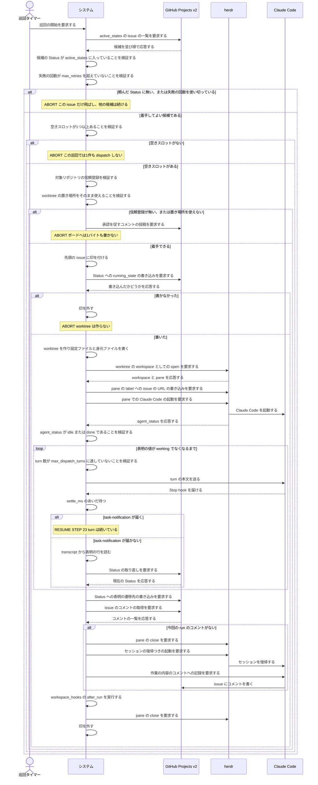

<!-- 目的: continuo が issue を1件取り、worker を立て、turn ループを回して表明どおりに Status を動かすまでを RUCM で定義する -->

# ユースケース: issue を1件処理する

## 根拠資料

- `docs/plans/continuo_design.md#3-2`（turn の終わりの判定の規則。settle_ms と task-notification）
- `docs/plans/continuo_design.md#3-5`（完了検知の3層と、1つの turn で何が起きるか）
- `docs/plans/continuo_design.md#3-6`（dispatch の直前に issue ごとに検査するもの）
- `docs/plans/continuo_design.md#3-8`（turn ループ。1回目の本文と継続の指示、max_dispatch_turns）
- `docs/plans/continuo_design.md#3-16`（着手の手順の順番。段-1 から段11）
- `docs/plans/continuo_design.md#3-18`（worktree の身元ファイル）
- `docs/plans/continuo_design.md#3-21`（打ち切りは「画面の版」で測る）
- `docs/plans/continuo_design.md#3-25`（表明を transcript から読む。コメントが無かったらセッションを復元して書かせる）
- `docs/plans/continuo_design.md#3-34`（候補の絞り込みはサーバ側の検索であり、書いた値の反映が遅れる）
- `docs/plans/continuo_design.md#4-1`（誰がどの遷移を起こすか）
- `internal/orchestrator/dispatch.go` の `dispatchCandidates`、`claimForDispatch`、`preflight`、`startRun`、`confirmStartup`
- `internal/orchestrator/failure.go` の `noteFailure`、`skipByFailure`
- `internal/orchestrator/turn.go` の `turnLoop`、`sendTurn`、`confirmTurnEnd`
- `internal/orchestrator/lifecycle.go` の `handleTurnEnd`、`readSignals`、`applySignals`、`finishRun`
- `internal/orchestrator/comment.go` の `ensureAgentComment`
- `internal/orchestrator/signal.go` の `ParseSignals`
- `internal/workspace/prepare.go` の `CheckWorktreeUsable`、`Prepare`
- `internal/tracker/adapter.go` の `dropUnrequestedStates`、`UpdateStatus`

## RUCM

```rucm
USE CASE NAME: issue を1件処理する
BRIEF DESCRIPTION: 巡回タイマーが巡回を起こす。システムはボードから候補を取り、着手できることを確かめてから先頭の1件に印を付けて worktree と worker を用意する。システムは turn を送り、Stop hook で turn の終わりを判定し、transcript の表明を読む。システムは表明の値どおりにボードの Status を書き、worker を止める。
PRECONDITION: システムは常駐している。システムはロックファイルの flock を取っている。ボードの Status の選択肢名は設定と一致する。ボードの dispatch_state の Status に issue が1件以上ある。herdr は待ち受けている。
PRIMARY ACTOR: 巡回タイマー
SECONDARY ACTORS: GitHub Projects v2、herdr、Claude Code
DEPENDENCY: なし
GENERALIZATION: なし

BASIC FLOW:
1. 巡回タイマーはシステムに巡回の開始を要求する。
2. システムはボードから active_states の issue の一覧を取る。
3. システムは VALIDATES THAT 先頭の issue の Status が active_states に入っている。
4. システムは VALIDATES THAT 先頭の issue の失敗の回数が max_retries を超えていない。
5. システムは VALIDATES THAT 空きスロットが1つ以上ある。
6. システムは VALIDATES THAT 先頭の issue の対象リポジトリが Claude Code に信頼登録されている。
7. システムは VALIDATES THAT 先頭の issue の worktree の置き場所をそのまま使える。
8. システムは先頭の issue に印を付ける。
9. システムは VALIDATES THAT ボードの issue の Status が terminal_states にも failure_state にも入っていない。
10. システムはボードの issue の Status に running_state の選択肢を書く。
11. システムは workspace.root の下に issue の worktree を作る。
12. システムは worktree の絶対パスとリポジトリ本体の作業ディレクトリを渡して workspace として開く。
13. システムは Claude Code の設定ファイルを worktree の外に書く。
14. システムは worktree の中に身元ファイルを書く。
15. システムは herdr に workspace の pane の一覧を要求する。
16. システムは pane の label に issue の URL を書く。
17. システムは VALIDATES THAT pane が Claude Code の起動を受け付ける。
18. システムは pane で Claude Code を起動する。
19. システムは VALIDATES THAT Claude Code の agent_status が idle または done であり、かつ interactive_ready が真である。
20. DO
21.   システムは VALIDATES THAT turn 数が max_dispatch_turns に達していない。
22.   システムは Claude Code に turn の本文を送る。
23.   システムは Claude Code の Stop hook を受ける。
24.   システムは settle_ms のあいだ待つ。
25.   システムは VALIDATES THAT settle_ms のあいだに task-notification で始まる UserPromptSubmit が届かない。
26.   システムは transcript から表明の行を読む。
27.   システムはボードの issue の Status を ID 指定で取り直す。
28. UNTIL 表明の値が working でない
29. システムはボードの issue の Status に表明の値の遷移先の選択肢を書く。
30. システムは VALIDATES THAT issue に今回の run が書いたコメントがある。
31. システムは workspace_hooks の after_run を実行する。
32. システムは herdr の pane を閉じる。
33. システムは印を外す。
POSTCONDITION: issue の Status は表明の値の遷移先の選択肢である。issue にエージェントが書いたコメントが1件以上ある。herdr の pane は閉じている。印は外れている。worktree と branch は残っている。

SPECIFIC ALTERNATIVE FLOW 頼んでいないStatus:
RFS BASIC FLOW 3
1. システムはこの issue を dispatch の対象から外す。
2. システムは頼んだ Status に無い候補が返ったことを記録に残す。
3. ABORT
POSTCONDITION: issue の Status はボードにある選択肢のままである。ボードへは1バイトも書いていない。他の候補の dispatch は続いている。

SPECIFIC ALTERNATIVE FLOW 失敗の繰り返し:
RFS BASIC FLOW 4
1. システムはこの issue を dispatch の対象から外す。
2. ABORT
POSTCONDITION: issue の Status はボードにある選択肢のままである。worktree は作られていない。印は付いていない。

SPECIFIC ALTERNATIVE FLOW 空きスロット不足:
RFS BASIC FLOW 5
1. システムはこの巡回で issue を1件も dispatch しない。
2. ABORT
POSTCONDITION: 印の件数は変わっていない。issue の Status は dispatch_state の選択肢のままである。worktree は作られていない。

SPECIFIC ALTERNATIVE FLOW 未信頼のリポジトリ:
RFS BASIC FLOW 6
1. システムは issue を dispatch の対象から外す。
2. システムは issue に信頼登録の承認を促すコメントを1件書く。
3. システムは対象リポジトリを通知済みとして記録する。
4. ABORT
POSTCONDITION: issue の Status は dispatch_state の選択肢のままである。worktree は作られていない。issue に信頼登録の承認を促すコメントが1件ある。

SPECIFIC ALTERNATIVE FLOW 使えないworktree:
RFS BASIC FLOW 7
1. システムはこの issue を dispatch の対象から外す。
2. システムは置き場所をそのまま使えない理由を記録に残す。
3. ABORT
POSTCONDITION: issue の Status は dispatch_state の選択肢のままである。ボードへは1バイトも書いていない。worktree は作られていない。

SPECIFIC ALTERNATIVE FLOW 書かずに取りやめる:
RFS BASIC FLOW 9
1. システムは印を外す。
2. ABORT
POSTCONDITION: issue の Status はボードにある選択肢のままである。worktree は作られていない。issue にコメントは付いていない。

SPECIFIC ALTERNATIVE FLOW 起動直後の確認画面:
RFS BASIC FLOW 19
1. システムは pane に esc のキー入力を送る。
2. システムはボードの issue の Status に failure_state の選択肢を書く。
3. システムは herdr の pane を閉じる。
4. システムは印を外す。
5. ABORT
POSTCONDITION: issue の Status は failure_state の選択肢である。turn の本文は Claude Code に届いていない。worktree は残っている。

SPECIFIC ALTERNATIVE FLOW 起動の待ち直し:
RFS BASIC FLOW 19
1. システムは 500 ミリ秒待つ。
2. システムは VALIDATES THAT 起動を待ち始めてから herdr.startup_timeout_ms が経っていない。
3. システムは pane で Claude Code をもう一度起動する。
4. RESUME STEP 19
POSTCONDITION: Claude Code が入力を受け付けられるようになるまで待ち続けている。turn の本文はまだ送っていない。

SPECIFIC ALTERNATIVE FLOW 起動の断念:
RFS 起動の待ち直し 2
1. システムは agent.max_retries の回数まで、バックオフしてから着手をやり直す。
2. システムはボードの issue の Status に failure_state の選択肢を書く。
3. システムは issue に起動できなかった理由を1件コメントする。
4. システムは herdr の pane を閉じる。
5. システムは印を外す。
6. ABORT
POSTCONDITION: issue の Status は failure_state の選択肢である。turn の本文は Claude Code に届いていない。worktree は残っている。

SPECIFIC ALTERNATIVE FLOW paneがまだ使えない:
RFS BASIC FLOW 17
1. システムは 500 ミリ秒待つ。
2. システムは VALIDATES THAT pane を待ち始めてから 30 秒が経っていない。
3. RESUME STEP 17
POSTCONDITION: pane が起動を受け付けるまで待ち続けている。Claude Code はまだ起動していない。

SPECIFIC ALTERNATIVE FLOW paneの断念:
RFS paneがまだ使えない 2
1. システムはボードの issue の Status に failure_state の選択肢を書く。
2. システムは issue に pane が使えなかった理由を1件コメントする。
3. システムは herdr の pane を閉じる。
4. システムは印を外す。
5. ABORT
POSTCONDITION: issue の Status は failure_state の選択肢である。Claude Code は起動していない。worktree は残っている。

SPECIFIC ALTERNATIVE FLOW 上限での打ち切り:
RFS BASIC FLOW 21
1. システムはボードの issue の Status に failure_state の選択肢を書く。
2. システムは issue に打ち切りの理由を1件コメントする。
3. システムは herdr の pane を閉じる。
4. システムは印を外す。
5. ABORT
POSTCONDITION: issue の Status は failure_state の選択肢である。turn 数は max_dispatch_turns と等しい。worktree は残っている。issue に打ち切りの理由のコメントが1件ある。

SPECIFIC ALTERNATIVE FLOW turnの継続:
RFS BASIC FLOW 25
1. システムは turn がまだ続いているとみなす。
2. RESUME STEP 23
POSTCONDITION: turn 数は増えていない。システムは次の Stop hook を待っている。issue の Status は running_state の選択肢のままである。

SPECIFIC ALTERNATIVE FLOW コメントの取り戻し:
RFS BASIC FLOW 30
1. システムは herdr の pane を閉じる。
2. システムは身元ファイルからセッション UUID と設定ファイルのパスを読む。
3. システムは pane で Claude Code をセッション UUID の復帰つきで起動する。
4. システムは Claude Code に作業の内容の issue のコメントへの記録を要求する。
5. システムは issue のコメントを読み直す。
6. システムは VALIDATES THAT issue に今回の run が書いたコメントがある。
7. RESUME STEP 31
POSTCONDITION: issue にエージェントが書いたコメントが1件以上ある。turn 数は増えていない。issue の Status は表明の値の遷移先の選択肢である。

SPECIFIC ALTERNATIVE FLOW コメントの取り戻しの失敗:
RFS コメントの取り戻し 6
1. システムはボードの issue の Status に failure_state の選択肢を書く。
2. システムは herdr の pane を閉じる。
3. システムは印を外す。
4. ABORT
POSTCONDITION: issue の Status は failure_state の選択肢である。issue にエージェントが書いたコメントがない。worktree は残っている。

GLOBAL ALTERNATIVE FLOW 権限の確認:
BRANCH FROM BASIC FLOW 22
WHEN herdr の待ち受けが blocked を返した場合
1. システムは pane に esc のキー入力を送る。
2. システムはボードの issue の Status に failure_state の選択肢を書く。
3. システムは herdr の pane を閉じる。
4. システムは印を外す。
5. ABORT
POSTCONDITION: issue の Status は failure_state の選択肢である。保留中の権限の要求は取り消されている。worktree は残っている。

GLOBAL ALTERNATIVE FLOW 無音の打ち切り:
BRANCH FROM BASIC FLOW 23
WHEN turn_timeout_ms のあいだ hook が1件も届かず、画面の版も増えない場合
1. システムは herdr に agent_status と pane の画面の版を要求する。
2. システムは herdr の pane を閉じる。
3. システムはリトライの回数を1つ増やす。
4. システムはバックオフの期限を印に書く。
5. ABORT
POSTCONDITION: herdr の pane は閉じている。印は残っている。issue の Status は running_state の選択肢のままである。worktree は残っている。
```

## 着手の段と、落ちたときに外側へ残るもの

**Status を先に書くことが、外部に残る唯一の印である**（設計 3-16）。
**だから、着手が確定して失敗する検査はステップ10 より前に置く**（ステップ3・4・7）。

| 落ちた段 | 外側に残るもの | 次の巡回でどうなるか |
| --- | --- | --- |
| ステップ3 から7 | 何も残らない | issue はボードにある Status のままなので、直せばまた候補に上がる |
| ステップ8 の直後 | 何も残らない | issue は dispatch_state のままなので候補に上がる |
| ステップ10 の直後 | ボードの Status だけ | running_state は active_states に入るので候補に上がる |
| ステップ11 から17 の途中 | Status と作りかけの worktree | worktree を再利用して着手をやり直す |
| ステップ14 の直後 | 身元ファイル | 再起動したときに身元が分かる |

## ステップ12 がリポジトリ本体も渡す理由

**`worktree.open` の `cwd` は外せない。**省くと herdr が `worktree_not_found` で断り、
worktree のパスを渡すと `linked_worktree_source` で断る（実測: 2026-08-25、
[test/live/herdr_test.go](test/live/herdr_test.go)）。

**その代わり、herdr は workspace を2つ開く。**worktree のぶんと、リポジトリ本体のぶん
（**リポジトリの親 workspace**）である。**`worktree.remove` は後者を閉じない**ので、
閉じるのは continuo の仕事になる（片付け側の条件は
[worktree と branch を片付ける.rucm.md](worktree%20と%20branch%20を片付ける.rucm.md) にある）。

**そのためステップ12 の前後で `workspace.list` を読む。**前は「この呼び出しより前から
親があったか」を見るため、後ろは「無かったなら、いま開いた親の ID」を控えるためである。
**控えた ID はステップ14 の身元ファイルへ書く**（`herdr_repo_workspace_id`）。
**前からあったなら人間が開いたものなので、控えず、二度と触らない。**

## 候補を飛ばす3つの検査

**候補の一覧は GitHub のサーバ側の検索結果であり、そのまま信じてはならない**（設計 3-34）。

| 検査 | 何を見るか | 落ちたらどうするか |
| --- | --- | --- |
| ステップ3 | issue の Status が active_states に入っているか | その issue だけ飛ばす。他の候補は続ける |
| ステップ4 | 失敗の回数が max_retries を超えていないか | 人間が Status を動かすまで拾わない |
| ステップ7 | 目的のパスに実体があるのに git の登録が無いか | Status を1バイトも書かずに飛ばす |

## turn の終わりの判定

| Stop hook の `background_tasks` | どう扱うか |
| --- | --- |
| 空でない | まだ動いている。turn の終わりとして扱わない |
| 項目が欠けている | 判定できない。turn の終わりとみなさない |
| 空配列 | settle_ms のあいだ待ち、task-notification が届かなければ turn の終わりとする |

## フローチャート

```mermaid
flowchart TD
    B1["1. 巡回タイマーが巡回の開始を要求する"]
    B2["2. ボードから active_states の issue の一覧を取る"]
    B3{"3. VALIDATES THAT Status が active_states に入っている"}
    B4{"4. VALIDATES THAT 失敗の回数が max_retries を超えていない"}
    B5{"5. VALIDATES THAT 空きスロットが1つ以上ある"}
    B6{"6. VALIDATES THAT 対象リポジトリが信頼登録されている"}
    B7{"7. VALIDATES THAT worktree の置き場所をそのまま使える"}
    B8["8. 先頭の issue に印を付ける"]
    B9{"9. VALIDATES THAT Status が terminal_states にも failure_state にも入っていない"}
    B10["10. Status に running_state を書く"]
    B11["11. worktree を作る"]
    B12["12. worktree の絶対パスとリポジトリ本体を渡して herdr の workspace として開く"]
    B13["13. 設定ファイルを worktree の外に書く"]
    B14["14. 身元ファイルを書く"]
    B15["15. workspace の pane の一覧を要求する"]
    B16["16. pane の label に issue の URL を書く"]
    B17{"17. VALIDATES THAT pane が起動を受け付ける"}
    B18["18. pane で Claude Code を起動する"]
    B19{"19. VALIDATES THAT agent_status が idle か done で interactive_ready が真"}
    B20["20. DO"]
    B21{"21. VALIDATES THAT turn 数が max_dispatch_turns に達していない"}
    B22["22. turn の本文を送る"]
    B23["23. Stop hook を受ける"]
    B24["24. settle_ms のあいだ待つ"]
    B25{"25. VALIDATES THAT task-notification が届かない"}
    B26["26. transcript から表明の行を読む"]
    B27["27. Status を ID 指定で取り直す"]
    B28{"28. UNTIL 表明の値が working でない"}
    B29["29. Status に表明の遷移先を書く"]
    B30{"30. VALIDATES THAT 今回の run のコメントがある"}
    B31["31. workspace_hooks の after_run を実行する"]
    B32["32. herdr の pane を閉じる"]
    B33["33. 印を外す"]
    BPOST(["POSTCONDITION 表明どおりに Status が動き worker が止まっている"])

    B1 --> B2 --> B3
    B3 -- 偽 --> F12S1
    B3 -- 真 --> B4
    B4 -- 偽 --> F13S1
    B4 -- 真 --> B5
    B5 -- 偽 --> F1S1
    B5 -- 真 --> B6
    B6 -- 偽 --> F2S1
    B6 -- 真 --> B7
    B7 -- 偽 --> F14S1
    B7 -- 真 --> B8 --> B9
    B9 -- 偽 --> F15S1
    B9 -- 真 --> B10 --> B11 --> B12 --> B13 --> B14 --> B15 --> B16 --> B17
    B17 -- 偽 --> F8S1
    B17 -- 真 --> B18 --> B19
    B19 -- 偽 --> F3S1
    B19 -- 真 --> B20 --> B21
    B21 -- 偽 --> F4S1
    B21 -- 真 --> B22 --> B23 --> B24 --> B25
    B25 -- 偽 --> F5S1
    B25 -- 真 --> B26 --> B27 --> B28
    B28 -- 偽 --> B21
    B28 -- 真 --> B29 --> B30
    B30 -- 偽 --> F6S1
    B30 -- 真 --> B31 --> B32 --> B33 --> BPOST
    B22 -. "権限の確認: WHEN blocked が返った場合" .-> G1S1
    B23 -. "無音の打ち切り: WHEN hook も画面の版も動かない場合" .-> G2S1

    subgraph SAF12 ["SPECIFIC ALTERNATIVE FLOW 頼んでいないStatus / RFS BASIC FLOW 3"]
        F12S1["1. この issue を dispatch の対象から外す"] --> F12S2["2. 頼んだ Status に無い候補が返ったことを記録に残す"] --> F12S3["3. ABORT"]
    end

    subgraph SAF13 ["SPECIFIC ALTERNATIVE FLOW 失敗の繰り返し / RFS BASIC FLOW 4"]
        F13S1["1. この issue を dispatch の対象から外す"] --> F13S2["2. ABORT"]
    end

    subgraph SAF1 ["SPECIFIC ALTERNATIVE FLOW 空きスロット不足 / RFS BASIC FLOW 5"]
        F1S1["1. この巡回で1件も dispatch しない"] --> F1S2["2. ABORT"]
    end

    subgraph SAF2 ["SPECIFIC ALTERNATIVE FLOW 未信頼のリポジトリ / RFS BASIC FLOW 6"]
        F2S1["1. dispatch の対象から外す"] --> F2S2["2. 承認を促すコメントを1件書く"] --> F2S3["3. 通知済みとして記録する"] --> F2S4["4. ABORT"]
    end

    subgraph SAF14 ["SPECIFIC ALTERNATIVE FLOW 使えないworktree / RFS BASIC FLOW 7"]
        F14S1["1. この issue を dispatch の対象から外す"] --> F14S2["2. 使えない理由を記録に残す"] --> F14S3["3. ABORT"]
    end

    subgraph SAF15 ["SPECIFIC ALTERNATIVE FLOW 書かずに取りやめる / RFS BASIC FLOW 9"]
        F15S1["1. 印を外す"] --> F15S2["2. ABORT"]
    end

    subgraph SAF8 ["SPECIFIC ALTERNATIVE FLOW paneがまだ使えない / RFS BASIC FLOW 17"]
        F8S1["1. 500 ミリ秒待つ"] --> F8S2{"2. VALIDATES THAT 30 秒が経っていない"}
        F8S2 -- 真 --> F8S3["3. RESUME STEP 17"]
    end

    subgraph SAF9 ["SPECIFIC ALTERNATIVE FLOW paneの断念 / RFS paneがまだ使えない 2"]
        F9S1["1. Status に failure_state を書く"] --> F9S2["2. pane が使えなかった理由をコメントする"] --> F9S3["3. pane を閉じる"] --> F9S4["4. 印を外す"] --> F9S5["5. ABORT"]
    end

    subgraph SAF3 ["SPECIFIC ALTERNATIVE FLOW 起動直後の確認画面 / RFS BASIC FLOW 19"]
        F3S1["1. pane に esc を送る"] --> F3S2["2. Status に failure_state を書く"] --> F3S3["3. pane を閉じる"] --> F3S4["4. 印を外す"] --> F3S5["5. ABORT"]
    end

    subgraph SAF10 ["SPECIFIC ALTERNATIVE FLOW 起動の待ち直し / RFS BASIC FLOW 19"]
        F10S1["1. 500 ミリ秒待つ"] --> F10S2{"2. VALIDATES THAT startup_timeout_ms が経っていない"}
        F10S2 -- 真 --> F10S3["3. もう一度 Claude Code を起動する"] --> F10S4["4. RESUME STEP 19"]
    end

    subgraph SAF11 ["SPECIFIC ALTERNATIVE FLOW 起動の断念 / RFS 起動の待ち直し 2"]
        F11S1["1. max_retries までバックオフして着手をやり直す"] --> F11S2["2. Status に failure_state を書く"] --> F11S3["3. 起動できなかった理由をコメントする"] --> F11S4["4. pane を閉じる"] --> F11S5["5. 印を外す"] --> F11S6["6. ABORT"]
    end

    subgraph SAF4 ["SPECIFIC ALTERNATIVE FLOW 上限での打ち切り / RFS BASIC FLOW 21"]
        F4S1["1. Status に failure_state を書く"] --> F4S2["2. 打ち切りの理由をコメントする"] --> F4S3["3. pane を閉じる"] --> F4S4["4. 印を外す"] --> F4S5["5. ABORT"]
    end

    subgraph SAF5 ["SPECIFIC ALTERNATIVE FLOW turnの継続 / RFS BASIC FLOW 25"]
        F5S1["1. turn がまだ続いているとみなす"] --> F5S2["2. RESUME STEP 23"]
    end

    subgraph SAF6 ["SPECIFIC ALTERNATIVE FLOW コメントの取り戻し / RFS BASIC FLOW 30"]
        F6S1["1. pane を閉じる"] --> F6S2["2. セッション UUID と設定ファイルのパスを読む"] --> F6S3["3. セッションの復帰つきで起動する"] --> F6S4["4. コメントへの記録を要求する"] --> F6S5["5. コメントを読み直す"] --> F6S6{"6. VALIDATES THAT コメントがある"}
        F6S6 -- 真 --> F6S7["7. RESUME STEP 31"]
    end

    subgraph SAF7 ["SPECIFIC ALTERNATIVE FLOW コメントの取り戻しの失敗 / RFS コメントの取り戻し 6"]
        F7S1["1. Status に failure_state を書く"] --> F7S2["2. pane を閉じる"] --> F7S3["3. 印を外す"] --> F7S4["4. ABORT"]
    end

    subgraph GAF1 ["GLOBAL ALTERNATIVE FLOW 権限の確認 / BRANCH FROM BASIC FLOW 22"]
        G1S1["1. pane に esc を送る"] --> G1S2["2. Status に failure_state を書く"] --> G1S3["3. pane を閉じる"] --> G1S4["4. 印を外す"] --> G1S5["5. ABORT"]
    end

    subgraph GAF2 ["GLOBAL ALTERNATIVE FLOW 無音の打ち切り / BRANCH FROM BASIC FLOW 23"]
        G2S1["1. agent_status と画面の版を要求する"] --> G2S2["2. pane を閉じる"] --> G2S3["3. リトライの回数を1つ増やす"] --> G2S4["4. バックオフの期限を印に書く"] --> G2S5["5. ABORT"]
    end

    F8S2 -- 偽 --> F9S1
    F8S3 --> B17
    F10S2 -- 偽 --> F11S1
    F10S4 --> B19
    F5S2 --> B23
    F6S6 -- 偽 --> F7S1
    F6S7 --> B31
```



## シーケンス図


