# ユースケース: issue を1件処理する

## 根拠資料

- `docs/plans/continuo_design.md#3-2`（turn の終わりの判定の規則。settle_ms と task-notification）
- `docs/plans/continuo_design.md#3-3b`（再着手は前回のセッションへ復帰する。戻れなければ新しいセッションで始め直す）
- `docs/plans/continuo_design.md#3-5`（完了検知の3層と、1つの turn で何が起きるか）
- `docs/plans/continuo_design.md#3-6`（dispatch の直前に issue ごとに検査するもの）
- `docs/plans/continuo_design.md#3-8`（turn ループ。1回目の本文と継続の指示、max_dispatch_turns）
- `docs/plans/continuo_design.md#3-16`（着手の手順の順番。段-1 から段11）
- `docs/plans/continuo_design.md#3-18`（worktree の身元ファイル）
- `docs/plans/continuo_design.md#3-21`（打ち切りは「画面の版」で測る）
- `docs/plans/continuo_design.md#3-23`（hook の中身は外部入力であり、そのまま信じない）
- `docs/plans/continuo_design.md#3-25`（表明を transcript から読む。コメントが無かったらセッションを復元して書かせる）
- `docs/plans/continuo_design.md#3-34`（候補の絞り込みはサーバ側の検索であり、書いた値の反映が遅れる）
- `docs/plans/continuo_design.md#3-77`（余裕値の出し方と、投稿するかどうか）
- `docs/plans/continuo_design.md#3-77b`（担当は assignee で持ち、期限は hold のコメントで持つ）
- `docs/plans/continuo_design.md#3-77c`（走っている最中の担当の確かめ直しと `recheck_interval_ms`。担当を外された機械は push してはならない）
- `docs/plans/continuo_design.md#4-1`（誰がどの遷移を起こすか）
- `internal/orchestrator/dispatch.go` の `dispatchCandidates`、`hasRequiredLabels`、`claimForDispatch`、`preflight`、`startRun`、`runStartOrFail`、`launchClaude`、`restartWithNewSession`、`confirmStartup`、`confirmStartupWithRestart`
- `internal/orchestrator/failure.go` の `noteFailure`、`skipByFailure`
- `internal/orchestrator/turn.go` の `startTurnLoop`、`turnLoop`、`buildTurnText`、`sendTurn`、`afterWaitTimeout`、`confirmTurnEnd`、`turnSendFailed` と `turnTransient`
- `internal/orchestrator/hookinput.go` の `sanitizeHookEvent`、`acceptHookCwd`
- `internal/orchestrator/lifecycle.go` の `handleTurnEnd`、`refreshIssue`、`readSignals`、`applySignals`、`finishRun`、`failRun`、`abandonRunClaimed`
- `internal/orchestrator/reconcile.go` の `checkStalls`
- `internal/orchestrator/comment.go` の `ensureAgentComment`、`failCommentRecovery`、`postStatusMove`
- `internal/orchestrator/signal.go` の `ParseSignals`
- `internal/workspace/prepare.go` の `CheckWorktreeUsable`、`checkBranchFree`、`Prepare`
- `internal/tracker/adapter.go` の `dropUnrequestedStates`、`UpdateStatus`
- `internal/tracker/query.go` の `foldStatus`（Status 名の比較の正規化）

## RUCM

```rucm
USE CASE NAME: issue を1件処理する
BRIEF DESCRIPTION: 巡回タイマーが巡回を起こす。システムはボードから候補を取り、着手できることを確かめ、入札で担当を決めてから先頭の1件に印を付けて worktree と worker を用意する。システムは既存の身元ファイルを読んでどのセッションで起動するかを決め、復帰つきの起動が完了しなければ会話を捨てて新しいセッションで立て直す。システムは turn を送り、Stop hook で turn の終わりを判定し、transcript の表明を読む。システムは走っている最中も recheck_interval_ms ごとに担当が自分のままかを確かめる。システムは表明の値どおりにボードの Status を書き、worker を止める。
PRECONDITION: システムは常駐している。システムはロックファイルの flock を取っている。ボードの Status の選択肢名は設定と一致する。ボードの dispatch_state の Status に issue が1件以上ある。herdr は待ち受けている。
PRIMARY ACTOR: 巡回タイマー
SECONDARY ACTORS: GitHub Projects v2、herdr、Claude Code、ほかの機械
DEPENDENCY: INCLUDE USE CASE issue の担当を入札で決める
GENERALIZATION: なし

BASIC FLOW:
1. 巡回タイマーはシステムに巡回の開始を要求する。
2. システムはボードから active_states の issue の一覧を取る。
3. システムは VALIDATES THAT 先頭の issue に別の run の印が付いていない。
4. システムは VALIDATES THAT 先頭の issue の Status が active_states に入っている。
5. システムは VALIDATES THAT 先頭の issue の失敗の回数が max_retries を超えていない。
6. システムは VALIDATES THAT 先頭の issue が required_labels をすべて持っている。
7. システムは VALIDATES THAT 空きスロットが1つ以上ある。
8. システムは VALIDATES THAT 先頭の issue の対象リポジトリが Claude Code に信頼登録されている。
9. システムは VALIDATES THAT 先頭の issue の worktree の置き場所をそのまま使える。
10. システムは VALIDATES THAT 先頭の issue の branch を置き場所以外の worktree が使っていない。
11. INCLUDE USE CASE issue の担当を入札で決める
12. システムは先頭の issue に印を付ける。
13. システムは VALIDATES THAT ID 指定で取り直したボードの issue の Status が active_states に入っている。
14. システムはボードの issue の Status に running_state の選択肢を書く。
15. システムは Status を動かした記録を issue にコメントする。
16. システムは workspace.root の下に issue の worktree を作る。
17. システムは再利用する worktree の中の既存の身元ファイルを読み、身元ファイルが無いか読めなければ新規の着手として扱う。
18. システムは worktree の絶対パスとリポジトリ本体の作業ディレクトリを渡して workspace として開き、その label に owner/repo/issues/N を書く。
19. システムは Claude Code の設定ファイルを worktree の外に書く。
20. システムは、読んだ身元ファイルに前回のセッション UUID があれば前回のセッション UUID への復帰つきの起動フラグを使うと決め、無ければ新しく採番したセッション UUID の指定つきの起動フラグを使うと決める。
21. システムは worktree の中に、起動に使うセッション UUID を書いた身元ファイルを書く。
22. システムは herdr に workspace の pane の一覧を要求する。
23. システムは pane の label に owner/repo/issues/N を書く。
24. システムは VALIDATES THAT pane が Claude Code の起動を受け付ける。
25. システムは pane で Claude Code をいま選ばれている起動フラグで起動する。
26. システムは VALIDATES THAT Claude Code の agent_status が idle または done であり、かつ interactive_ready が真である。
27. システムは VALIDATES THAT この run の turn ループが1本も走っていない。
28. DO
29.   システムは VALIDATES THAT turn 数が max_dispatch_turns に達していない。
30.   システムは VALIDATES THAT turn の本文を組み立てられる。
31.   システムは Claude Code に turn の本文を送る。
32.   システムは VALIDATES THAT herdr の待ち受けが返ってから settle_ms のあいだに Claude Code の Stop hook が届く。
33.   システムは Claude Code の Stop hook を受ける。
34.   システムは VALIDATES THAT 受けた Stop hook の cwd が worktree の内側である。
35.   システムは settle_ms のあいだ待つ。
36.   システムは VALIDATES THAT settle_ms のあいだに task-notification で始まる UserPromptSubmit が届かない。
37.   システムは transcript から表明の行を読む。
38.   システムは、担当を前に確かめてから recheck_interval_ms を過ぎていれば、issue のコメントを1件残らず取り直す。
39.   システムは VALIDATES THAT issue の担当者がこの機械の投稿者のままである。
40.   システムはボードの issue の Status を ID 指定で取り直す。
41.   システムは VALIDATES THAT 取り直した issue がボードから見えている。
42. UNTIL 表明の値が working でない
43. システムはボードの issue の Status に表明の値の遷移先の選択肢を書く。
44. システムは Status を動かした記録を issue にコメントする。
45. システムは VALIDATES THAT issue に今回の run が書いたコメントがある。
46. システムは workspace_hooks の after_run を実行する。
47. システムは herdr の pane を閉じる。
48. システムは印を外す。
POSTCONDITION: issue の Status は表明の値の遷移先の選択肢である。issue の担当者はこの機械の投稿者1人のままである。issue にエージェントが書いたコメントが1件以上ある。herdr の pane は閉じている。印は外れている。worktree と branch は残っている。

SPECIFIC ALTERNATIVE FLOW 走行中のissue:
RFS BASIC FLOW 3
1. システムはこの issue を dispatch の対象から外す。
2. ABORT
POSTCONDITION: 先に印を取った run は走り続けている。ボードへは1バイトも書いていない。印の件数は変わっていない。

SPECIFIC ALTERNATIVE FLOW 頼んでいないStatus:
RFS BASIC FLOW 4
1. システムはこの issue を dispatch の対象から外す。
2. システムは頼んだ Status に無い候補が返ったことを記録に残す。
3. ABORT
POSTCONDITION: issue の Status はボードにある選択肢のままである。ボードへは1バイトも書いていない。他の候補の dispatch は続いている。

SPECIFIC ALTERNATIVE FLOW 失敗の繰り返し:
RFS BASIC FLOW 5
1. システムはこの issue を dispatch の対象から外す。
2. ABORT
POSTCONDITION: issue の Status はボードにある選択肢のままである。worktree は作られていない。印は付いていない。

SPECIFIC ALTERNATIVE FLOW ラベルの不足:
RFS BASIC FLOW 6
1. システムはこの issue を dispatch の対象から外す。
2. ABORT
POSTCONDITION: issue の Status はボードにある選択肢のままである。ボードへは1バイトも書いていない。worktree は作られていない。

SPECIFIC ALTERNATIVE FLOW 空きスロット不足:
RFS BASIC FLOW 7
1. システムはこの巡回で issue を1件も dispatch しない。
2. ABORT
POSTCONDITION: 印の件数は変わっていない。issue の Status は dispatch_state の選択肢のままである。worktree は作られていない。

SPECIFIC ALTERNATIVE FLOW 未信頼のリポジトリ:
RFS BASIC FLOW 8
1. システムは issue を dispatch の対象から外す。
2. システムは issue に信頼登録の承認を促すコメントを1件書く。
3. システムは対象リポジトリを通知済みとして記録する。
4. ABORT
POSTCONDITION: issue の Status は dispatch_state の選択肢のままである。worktree は作られていない。issue に信頼登録の承認を促すコメントが1件ある。

SPECIFIC ALTERNATIVE FLOW 使えないworktree:
RFS BASIC FLOW 9
1. システムはこの issue を dispatch の対象から外す。
2. システムは置き場所をそのまま使えない理由を記録に残す。
3. ABORT
POSTCONDITION: issue の Status は dispatch_state の選択肢のままである。ボードへは1バイトも書いていない。worktree は作られていない。

SPECIFIC ALTERNATIVE FLOW 使われているbranch:
RFS BASIC FLOW 10
1. システムはこの issue を dispatch の対象から外す。
2. システムは branch を使っている worktree の場所と片付けの手順を記録に残す。
3. ABORT
POSTCONDITION: issue の Status は dispatch_state の選択肢のままである。ボードへは1バイトも書いていない。worktree は作られていない。branch を使っている worktree は残っている。

SPECIFIC ALTERNATIVE FLOW 書かずに取りやめる:
RFS BASIC FLOW 13
1. システムは印を外す。
2. ABORT
POSTCONDITION: issue の Status はボードにある選択肢のままである。worktree は作られていない。issue にコメントは付いていない。

SPECIFIC ALTERNATIVE FLOW 起動直後の確認画面:
RFS BASIC FLOW 26
1. システムは pane に esc のキー入力を送る。
2. システムはボードの issue の Status に failure_state の選択肢を書く。
3. システムは herdr の pane を閉じる。
4. システムは印を外す。
5. ABORT
POSTCONDITION: issue の Status は failure_state の選択肢である。turn の本文は Claude Code に届いていない。worktree は残っている。止まった起動は新しいセッション UUID の指定つきの起動である。

SPECIFIC ALTERNATIVE FLOW 起動の待ち直し:
RFS BASIC FLOW 26
1. システムは 500 ミリ秒待つ。
2. システムは VALIDATES THAT 起動を待ち始めてから herdr.startup_timeout_ms が経っていない。
3. システムは pane で Claude Code を、直前と同じ起動フラグでもう一度起動する。
4. RESUME STEP 26
POSTCONDITION: Claude Code が入力を受け付けられるようになるまで待ち続けている。turn の本文はまだ送っていない。もう一度渡す起動フラグは直前と同じ値であり、復帰つきの起動なら復帰つきのまま送り直す。issue の Status は running_state の選択肢のままである。herdr の pane は開いたままである。印は残っている。worktree は残っている。

SPECIFIC ALTERNATIVE FLOW 起動の断念:
RFS 起動の待ち直し 2
1. システムは agent.max_retries の回数まで、バックオフしてから着手をやり直す。
2. システムはボードの issue の Status に failure_state の選択肢を書く。
3. システムは issue に起動できなかった理由を1件コメントする。
4. システムは herdr の pane を閉じる。
5. システムは印を外す。
6. ABORT
POSTCONDITION: issue の Status は failure_state の選択肢である。turn の本文は Claude Code に届いていない。worktree は残っている。断念した起動は新しいセッション UUID の指定つきの起動である。

SPECIFIC ALTERNATIVE FLOW paneがまだ使えない:
RFS BASIC FLOW 24
1. システムは 500 ミリ秒待つ。
2. システムは VALIDATES THAT pane を待ち始めてから 30 秒が経っていない。
3. RESUME STEP 24
POSTCONDITION: pane が起動を受け付けるまで待ち続けている。この pane で新しい Claude Code はまだ起動していない。復帰の失敗から戻ってきた場合に pane へ残っているものは、復帰つきの起動が完了しなかった理由で決まる。起動直後の確認の画面で止まっていた場合は、確認の画面を esc で畳んだ前の Claude Code が pane を占めたままである。herdr.startup_timeout_ms の経過で終わった場合は、確認の画面を畳んでいない前の Claude Code が pane を占めたままである。

SPECIFIC ALTERNATIVE FLOW paneの断念:
RFS paneがまだ使えない 2
1. システムはボードの issue の Status に failure_state の選択肢を書く。
2. システムは issue に pane が使えなかった理由を1件コメントする。
3. システムは herdr の pane を閉じる。
4. システムは印を外す。
5. ABORT
POSTCONDITION: issue の Status は failure_state の選択肢である。この pane で新しい Claude Code は起動していない。断念した起動は新しいセッション UUID の指定つきの起動である。herdr の pane を閉じたので、確認の画面を畳んだ前の Claude Code が残っていた場合も、その pane ごと終わっている。worktree は残っている。

SPECIFIC ALTERNATIVE FLOW turnループの重なり:
RFS BASIC FLOW 27
1. システムは次の巡回で turn を送り直す印を立てる。
2. ABORT
POSTCONDITION: 印は残っている。issue の Status は running_state の選択肢のままである。turn の本文は Claude Code に届いていない。worktree は残っている。

SPECIFIC ALTERNATIVE FLOW 上限での打ち切り:
RFS BASIC FLOW 29
1. システムはボードの issue の Status に failure_state の選択肢を書く。
2. システムは issue に打ち切りの理由を1件コメントする。
3. システムは herdr の pane を閉じる。
4. システムは印を外す。
5. ABORT
POSTCONDITION: issue の Status は failure_state の選択肢である。turn 数は max_dispatch_turns と等しい。worktree は残っている。issue に打ち切りの理由のコメントが1件ある。

SPECIFIC ALTERNATIVE FLOW 本文の組み立ての失敗:
RFS BASIC FLOW 30
1. システムはボードの issue の Status に failure_state の選択肢を書く。
2. システムは issue にテンプレートの直し方を1件コメントする。
3. システムは workspace_hooks の after_run を実行する。
4. システムは herdr の pane を閉じる。
5. システムは印を外す。
6. ABORT
POSTCONDITION: issue の Status は failure_state の選択肢である。この turn の本文は Claude Code に届いていない。印は外れている。worktree は残っている。

SPECIFIC ALTERNATIVE FLOW turnの終わりの取りこぼし:
RFS BASIC FLOW 32
1. システムは VALIDATES THAT リトライの回数が agent.max_retries に達していない。
2. システムは workspace_hooks の after_run を実行する。
3. システムは herdr の pane を閉じる。
4. システムはリトライの回数を1つ増やす。
5. システムはバックオフの期限を印に書く。
6. ABORT
POSTCONDITION: herdr の pane は閉じている。印は残っている。issue の Status は running_state の選択肢のままである。worktree は残っている。

SPECIFIC ALTERNATIVE FLOW リトライの尽き:
RFS turnの終わりの取りこぼし 1
1. システムはボードの issue の Status に failure_state の選択肢を書く。
2. システムは issue に打ち切りの理由を1件コメントする。
3. システムは issue に今回の run が書いたコメントを確かめる段を通す。
4. システムは workspace_hooks の after_run を実行する。
5. システムは herdr の pane を閉じる。
6. システムは印を外す。
7. ABORT
POSTCONDITION: issue の Status は failure_state の選択肢である。印は外れている。issue に打ち切りの理由のコメントが1件ある。worktree は残っている。

SPECIFIC ALTERNATIVE FLOW 騙りのhook:
RFS BASIC FLOW 34
1. システムはこの hook を捨てる。
2. システムは捨てた理由と session_id を記録に残す。
3. RESUME STEP 33
POSTCONDITION: turn 数は増えていない。システムは次の Stop hook を待っている。issue の Status は running_state の選択肢のままである。

SPECIFIC ALTERNATIVE FLOW turnの継続:
RFS BASIC FLOW 36
1. システムは turn がまだ続いているとみなす。
2. RESUME STEP 33
POSTCONDITION: turn 数は増えていない。システムは次の Stop hook を待っている。issue の Status は running_state の選択肢のままである。

SPECIFIC ALTERNATIVE FLOW 担当が移った:
RFS BASIC FLOW 39
1. システムは担当が移った先の機械の名前と、released の印が先頭に付いたコメントの中身を記録に残す。
2. システムは branch へ1バイトも push しない。
3. システムは workspace_hooks の after_run を実行する。
4. システムは herdr の pane を閉じる。
5. システムは印を外す。
6. ABORT
POSTCONDITION: issue の担当者はこの機械の投稿者ではない。この機械は branch へ1バイトも push していない。turn はこの turn の終わりで止まっている。issue の Status は running_state の選択肢のままである。herdr の pane は閉じている。印は外れている。worktree は残っている。

SPECIFIC ALTERNATIVE FLOW ボードから消えたissue:
RFS BASIC FLOW 41
1. システムは issue がボードから見えなくなったことを記録に残す。
2. システムは workspace_hooks の after_run を実行する。
3. システムは herdr の pane を閉じる。
4. システムはリトライの回数を1つ増やす。
5. システムはバックオフの期限を印に書く。
6. ABORT
POSTCONDITION: herdr の pane は閉じている。印は残っている。issue はボードから見えていない。worktree は残っている。

SPECIFIC ALTERNATIVE FLOW コメントの取り戻し:
RFS BASIC FLOW 45
1. システムは herdr の pane を閉じる。
2. システムは VALIDATES THAT 身元ファイルからセッション UUID と設定ファイルのパスを読める。
3. システムは worktree の絶対パスとリポジトリ本体の作業ディレクトリを渡して workspace として開き直し、その中の pane を pane.list で引く。
4. システムは VALIDATES THAT pane で Claude Code をセッション UUID の復帰つきで起動でき、agent_status が idle または done になる。
5. システムは Claude Code に作業の内容の issue のコメントへの記録を要求する。
6. システムは issue のコメントを読み直す。
7. システムは VALIDATES THAT issue に今回の run が書いたコメントがある。
8. RESUME STEP 46
POSTCONDITION: issue にエージェントが書いたコメントが1件以上ある。turn 数は増えていない。issue の Status は表明の値の遷移先の選択肢である。

SPECIFIC ALTERNATIVE FLOW コメントの取り戻しの失敗:
RFS コメントの取り戻し 7
1. システムは herdr の pane を閉じる。
2. システムはボードの issue の Status に failure_state の選択肢を書く。
3. システムは、引き渡しの通知をまだ1件も書いていなければ、issue に成果を人間に確かめてほしいことを1件コメントする。
4. システムは印を外す。
5. ABORT
POSTCONDITION: issue の Status は failure_state の選択肢である。issue にエージェントが書いたコメントがない。issue に人間へ引き渡す通知のコメントが1件だけある。打ち切りや失敗で先に理由を書いていた場合は、その1件が残り、成果の確認の依頼は書き足さない。herdr の pane は閉じている。印は外れている。worktree は残っている。

SPECIFIC ALTERNATIVE FLOW 取り戻しの復帰の失敗:
RFS コメントの取り戻し 4
1. システムは復帰できなかった理由を記録に残す。
2. システムは herdr の pane を閉じる。
3. システムはボードの issue の Status に failure_state の選択肢を書く。
4. システムは、引き渡しの通知をまだ1件も書いていなければ、issue に成果を人間に確かめてほしいことを1件コメントする。
5. システムは印を外す。
6. ABORT
POSTCONDITION: issue の Status は failure_state の選択肢である。issue にエージェントが書いたコメントがない。issue に人間へ引き渡す通知のコメントが1件だけある。打ち切りや失敗で先に理由を書いていた場合は、その1件が残り、成果の確認の依頼は書き足さない。着手のときと違って、新しいセッション UUID での立て直しは行わない。herdr の pane は閉じている。印は外れている。worktree は残っている。

SPECIFIC ALTERNATIVE FLOW 復元の断念:
RFS コメントの取り戻し 2
1. システムは復元の材料が足りない理由を記録に残す。
2. RESUME STEP 8
POSTCONDITION: issue にエージェントが書いたコメントがない。issue の Status は表明の値の遷移先の選択肢である。片付けは続いている。

GLOBAL ALTERNATIVE FLOW 壊れたref:
BRANCH FROM BASIC FLOW 16
WHEN branch の ref が読めず git が worktree を作れず、まだその ref のファイルを消していない場合
1. システムは VALIDATES THAT 壊れた ref が branch_template の接頭辞で始まり refs/heads の下の通常のファイルであり中身が ref として読めない。
2. システムは壊れた ref のファイルを1つ消す。
3. システムは消したファイルのパスと消した理由を記録に残す。
4. RESUME STEP 16
POSTCONDITION: 壊れた ref のファイルは消えている。packed-refs は書き換えていない。issue の Status は running_state の選択肢のままである。

SPECIFIC ALTERNATIVE FLOW 消さないref:
RFS 壊れたref 1
1. システムはボードの issue の Status に failure_state の選択肢を書く。
2. システムは issue に worktree を用意できなかった理由を1件コメントする。
3. システムは印を外す。
4. ABORT
POSTCONDITION: ref のファイルは1バイトも消えていない。issue の Status は failure_state の選択肢である。worktree は作られていない。

GLOBAL ALTERNATIVE FLOW 着手の途中の失敗:
BRANCH FROM BASIC FLOW 16
WHEN worktree の用意から Claude Code の起動までのあいだに git・ghq・herdr の呼び出しが、壊れた ref でも pane の受け付け待ちでも復帰つきの起動の失敗でもない理由で失敗した場合
1. システムはボードの issue の Status に failure_state の選択肢を書く。
2. システムは issue に失敗した段と直し方を1件コメントする。
3. システムは workspace_hooks の after_run を実行する。
4. システムは herdr の pane を閉じる。
5. システムは印を外す。
6. ABORT
POSTCONDITION: issue の Status は failure_state の選択肢である。issue に失敗の理由のコメントが1件ある。herdr の pane は閉じている。印は外れている。作りかけの worktree は残っている。

GLOBAL ALTERNATIVE FLOW 復帰の失敗:
BRANCH FROM BASIC FLOW 24,25
WHEN 復帰つきの起動が、pane が 30 秒受け付けないままでも前回のセッションの不在でも起動直後の確認の画面でも herdr.startup_timeout_ms の経過でも、理由を問わず完了しなかった場合
1. システムは新しいセッション UUID を採番する。
2. システムは hook の引き当ての索引を新しいセッション UUID へ張り替える。
3. システムはトークンの集計の基準を作り直す。
4. システムは身元ファイルのセッション UUID を新しいセッション UUID へ書き直し、書き直せなければ警告を記録に残して先へ進む。
5. システムは復帰できなかったセッション UUID と新しいセッション UUID と失敗の理由を記録に残す。
6. システムは起動フラグを新しいセッション UUID の指定つきへ差し替える。
7. システムは前の Claude Code を止めずに同じ pane を使い続ける。
8. RESUME STEP 24
POSTCONDITION: 立て直しの起動はまだ1回も呼んでいない。hook の引き当ての索引は新しいセッション UUID だけを指しているので、前回のセッション UUID を名乗る hook はどの run のものでもないとして捨てられる。前の Claude Code を止める手立てが無いので、起動直後の確認の画面で止まっていた場合は、確認の画面だけを esc で畳んだ Claude Code が同じ pane に残り、その pane は起動を受け付けない。身元ファイルのセッション UUID は、書き直せていれば新しいセッション UUID であり、書き直せなければ前回のセッション UUID のままである。issue の Status は running_state の選択肢のままである。herdr の pane は開いたままである。印は残っている。worktree は残っている。

GLOBAL ALTERNATIVE FLOW 権限の確認:
BRANCH FROM BASIC FLOW 31
WHEN herdr の待ち受けが blocked を返した場合
1. システムは pane に esc のキー入力を送る。
2. システムはボードの issue の Status に failure_state の選択肢を書く。
3. システムは herdr の pane を閉じる。
4. システムは印を外す。
5. ABORT
POSTCONDITION: issue の Status は failure_state の選択肢である。保留中の権限の要求は取り消されている。worktree は残っている。

GLOBAL ALTERNATIVE FLOW 送信の失敗:
BRANCH FROM BASIC FLOW 31
WHEN herdr が指示の送信そのものを断った場合
1. システムは herdr の pane を閉じる。
2. システムはリトライの回数を1つ増やす。
3. システムはバックオフの期限を印に書く。
4. ABORT
POSTCONDITION: turn の本文は Claude Code に届いていない。herdr の pane は閉じている。印は残っている。issue の Status は running_state の選択肢のままである。worktree は残っている。

GLOBAL ALTERNATIVE FLOW 無音の打ち切り:
BRANCH FROM BASIC FLOW 33
WHEN turn_timeout_ms のあいだ hook が1件も届かず、画面の版も増えない場合
1. システムは herdr に agent_status と pane の画面の版を要求する。
2. システムは herdr の pane を閉じる。
3. システムはリトライの回数を1つ増やす。
4. システムはバックオフの期限を印に書く。
5. ABORT
POSTCONDITION: herdr の pane は閉じている。印は残っている。issue の Status は running_state の選択肢のままである。worktree は残っている。

GLOBAL ALTERNATIVE FLOW 既に同じStatus:
BRANCH FROM BASIC FLOW 43
WHEN 取り直した Status が表明の値の遷移先の選択肢と同じ場合
1. システムはボードへ書き込まない。
2. RESUME STEP 45
POSTCONDITION: issue の Status は表明の値の遷移先の選択肢である。ボードへは1バイトも書いていない。

GLOBAL ALTERNATIVE FLOW 一時的な送信の失敗:
BRANCH FROM BASIC FLOW 31
WHEN herdr の呼び出しが一時的な理由で失敗した場合
1. システムは turn の本文が Claude Code に届いたかどうかを判断しない。
2. システムは turn の本文を送り直さない。
3. システムは run に turn の終わりを待ち直す印を立てる。
4. ABORT
POSTCONDITION: 印は残っている。リトライの回数は増えていない。herdr の pane は閉じていない。issue の Status は running_state の選択肢のままである。worktree は残っている。
```

## 段は名前で指す

**この節から下の本文は、段を番号ではなく名前で指す。**段を1つ足すと以降の番号が全部ずれ、
**本文のほうは黙ったまま嘘になる。**名前は上の `rucm` ブロックの本文から取る。
`RFS` と `RESUME STEP` の番号は RUCM の文法そのものなので、そちらは番号のままである。

## 担当を決めるのは、印を付けるより前である

**言いたいこと。**同じボードを複数の機械が見張るので、**着手してよいのは担当者になった1台だけである。**
だから「担当を入札で決める」の段（`INCLUDE USE CASE issue の担当を入札で決める`）を、
**「印を付ける」より前に置く**（設計 [3-77b](../../../plans/continuo_design.md)）。

| どこに置くか | 何が起きるか |
| --- | --- |
| **印を付けるより前（採った）** | 担当になれなかった機械は、**ボードへ1バイトも書かずに降りる** |
| 印を付けたあと | 負けた機械が Status を running_state へ動かしてから降りる。**ボードに嘘の running が残る** |
| worktree を作ったあと | 負けた機械の worktree と branch が残る。**片付けが人間の仕事になる** |

**入札の段は、この機械が担当者になるか、降りるかのどちらかで終わる。**
降りる側の経路は入札のユースケースが持っているので、こちらには代替フローを置かない。

**入札には既定3分（`bid_window_ms`）かかる。**空きスロットの検査（「空きスロットを見る」の段）を
入札より前に置いてあるのは、**枠が空いていない機械が3分待ってから降りるのを避けるため**である。

## 走っている最中も、担当が自分のままかを確かめる

**言いたいこと。**担当者の最後のコメントから `idle_timeout_ms`（既定18時間）が過ぎると、
**ほかの機械がこの issue の担当を外して拾い直す**（設計 [3-77c](../../../plans/continuo_design.md)）。
**外された機械は、その branch へ push してはならない。**

| いつ確かめるか | どうやって | 担当が移っていたら |
| --- | --- | --- |
| **turn の終わりごと**（`recheck_interval_ms` を過ぎていれば） | issue のコメントを1件残らず取り直し、担当者を読む | `担当が移った` へ入り、**その turn の終わりで止まる** |
| 作業を再開するとき | 同じくコメントを全部読み直す | 着手の対象から外す（`夜に機械を落として翌朝に担当を続ける`） |

**既定は1時間である。**

```yaml
tracker:
  provider:
    handoff:
      recheck_interval_ms: 3600000   # 走っている最中に担当を確かめ直す間隔。既定は1時間
```

**turn の途中では止めない。**Claude Code は turn の途中で止められないので、
**止められる場所は turn の終わりしかない。**だから確かめる段も turn の終わり
（「transcript から表明の行を読む」の直後）に置く。

**`担当が移った` は branch へ push しない。**push していない変更は失われるが、
**worktree は1バイトも消さない。**取り出せる唯一の場所が、その機械のディスクだからである。

## 着手の段と、落ちたときに外側へ残るもの

**Status を先に書くことが、外部に残る唯一の印である**（設計 3-16）。
**だから、着手が確定して失敗する検査は「running_state を書く」の段より前に置く**
（「候補の Status が active_states か見る」「失敗の回数を見る」「worktree の置き場所を見る」「branch の使われ方を見る」の4段）。

| 落ちた段 | 外側に残るもの | 次の巡回でどうなるか |
| --- | --- | --- |
| 「別の run の印を見る」から「branch の使われ方を見る」まで | 何も残らない | issue はボードにある Status のままなので、直せばまた候補に上がる |
| 「担当を入札で決める」 | 入札のコメントと、勝ったときの担当者と hold のコメント | 勝てば次の段へ進む。負ければ担当者を書かないので、次の巡回で入札がやり直される |
| 「印を付ける」の直後 | 何も残らない | issue は dispatch_state のままなので候補に上がる |
| 「running_state を書く」の直後 | ボードの Status だけ | running_state は active_states に入るので候補に上がる |
| 「running_state を書いた記録をコメントする」の直後 | Status と、動かした記録のコメント | 同上。記録が残るので、誰がいつ動かしたかは追える |
| 「worktree を作る」から「pane の受け付けを見る」までの途中 | Status と作りかけの worktree | worktree を再利用して着手をやり直す |
| 「身元ファイルを書く」の直後 | 身元ファイル | 再起動したときに身元が分かる |

## 「workspace として開く」の段がリポジトリ本体も渡す理由

**`worktree.open` の `cwd` は外せない。**省くと herdr が `worktree_not_found` で断り、
worktree のパスを渡すと `linked_worktree_source` で断る（実測: 2026-08-25、
[test/live/herdr_test.go](test/live/herdr_test.go)）。

**その代わり、herdr は workspace を2つ開く。**worktree のぶんと、リポジトリ本体のぶん
（**リポジトリの親 workspace**）である。**`worktree.remove` は後者を閉じない**ので、
閉じるのは continuo の仕事になる（片付け側の条件は
[worktree と branch を片付ける.rucm.md](worktree%20と%20branch%20を片付ける.rucm.md) にある）。

**そのため「workspace として開く」の段の前後で `workspace.list` を読む。**前は「この呼び出しより前から
親があったか」を見るため、後ろは「無かったなら、いま開いた親の ID」を控えるためである。
**控えた ID は「身元ファイルを書く」の段で身元ファイルへ書く**（`herdr_repo_workspace_id`）。
**前からあったなら人間が開いたものなので、控えず、二度と触らない。**

## 復帰つきの起動は、失敗の理由を問わず捨てて立て直す

**言いたいこと。**「Claude Code を起動する」の段が復帰つきの起動なら、**どんな理由で完了しなくても**
会話を丸ごと捨て、新しいセッション UUID で立て直す（代替フロー `復帰の失敗`）。
**だから ABORT で抜ける `起動直後の確認画面`・`起動の断念`・`paneの断念` の3本は、
新しいセッション UUID の指定つきの起動でだけ通る。**

| 復帰つきの起動が完了しなかった理由 | どこを通ってどこへ行くか |
| --- | --- |
| pane が `agent_pane_busy` を30秒返し続けた | `paneがまだ使えない` で30秒粘ったのち、**`paneの断念` へは進まずに** `復帰の失敗` が受け取り、「pane の受け付けを見る」の段からやり直す |
| `agent.start` が起動の待ちで timeout を返した | **`起動の待ち直し` を1回も通らずに** `復帰の失敗` が受け取り、「pane の受け付けを見る」の段からやり直す |
| 起動直後の確認の画面が出た | **`起動の待ち直し` を1回も通らずに** `復帰の失敗` が受け取り、「pane の受け付けを見る」の段からやり直す |
| `agent.start` は通ったが、起動の確認が期限まで idle にならなかった | `起動の待ち直し` で期限まで粘ったのち `復帰の失敗` が受け取り、「pane の受け付けを見る」の段からやり直す |

**新しいセッション UUID の指定つきの起動は、`起動直後の確認画面`・`起動の待ち直し`・`起動の断念`・
`paneがまだ使えない`・`paneの断念` のどれかへ進む。**

**pane の30秒が `paneの断念` で終わらない理由。**pane の粘りは `AgentStartWithRetry` の中にあり、
**その戻り値は `startRun` の `if startErr != nil && resumeUUID != ""` へ落ちる**
（`internal/orchestrator/dispatch.go`）。**エラーの種類を見ていないので、`agent_pane_busy` を
30秒返され続けた場合も、復帰つきの起動なら立て直しへ回る。**だから `復帰の失敗` は
「pane の受け付けを見る」の段からも枝を出している（`BRANCH FROM BASIC FLOW 24,25`）。

**`agent.start` がエラーを返した場合に `起動の待ち直し` を通らない理由。**`launchClaude` は
`AgentStartWithRetry` が返したエラーをその場で返し、**待ち直しを持つ `confirmStartupWithRestart` を
1度も呼ばない**（`internal/orchestrator/dispatch.go`）。

**確認の画面が `起動の待ち直し` を通らない理由。**`confirmStartup` は `blocked` を見たら `esc` を送って
**やり直せない形のエラーで即座に戻り**、`confirmStartupWithRestart` はそれを見て期限を待たずに返す
（`internal/orchestrator/dispatch.go` の `if !errors.Is(err, ErrStartupRetryable)`）。

**`起動の待ち直し` は、起動の確認が期限まで idle にならない理由なら両方の起動で通る。**
ABORT で抜ける `起動直後の確認画面`・`起動の断念`・`paneの断念` だけが、
新しいセッション UUID の指定つきの起動に限られる（復帰つきなら `復帰の失敗` が先に受け取るためである）。

**見分けているのは `internal/orchestrator/dispatch.go` の `startRun` の1行だけである**
（`if startErr != nil && resumeUUID != ""`）。**エラーの種類を見ていない。**
確認の画面で止まっても（`agent_status` が `blocked`）、`herdr.startup_timeout_ms` が経っても、
前回のセッションが見つからなくても、同じ枝へ入る。

**待ち直しの起動は、直前と同じ起動フラグで送り直す**
（`confirmStartupWithRestart` は初回と同じ `params` を渡す）。**再着手ではその引数に `--resume` が
入っているので、待ち直しの起動も復帰つきである。**新しいセッション UUID の指定つきなら、
渡す UUID も同じ値である。設計 [3-3](../../../plans/continuo_design.md) は
「一度使ったセッション UUID をもう一度 `--session-id` に渡すと
`Session ID ... is already in use.` で起動に失敗する」と実測している。
**送り直しに入るのは `agent.get` が `agent_not_found` を返したときである**
（`confirmStartup` がやり直せる形で期限を待たずに戻る唯一の枝。`internal/orchestrator/dispatch.go`。
`blocked` も期限を待たずに戻るが、そちらはやり直さずにそのまま返る）。
**`agent_not_found` は「Claude Code が1文字も起動していない」ことを意味するので、
その UUID のセッションはまだ無く、同じ値を渡し直せる。**

**`agent_status` が `unknown` のままの場合と `interactive_ready` が偽のままの場合は、
`agent.start` を送り直さない。**`confirmStartup` が 500 ミリ秒ごとに見直しながら
`herdr.startup_timeout_ms` まで待ち、期限が来たら `起動の断念` へ進む。
**送り直しが失敗しても run は捨てない。**`confirmStartupWithRestart` はやり直しの
`agent.start` の失敗を警告1行に落とし、期限まで確認を続ける。

## 立て直しが通るかは、前の Claude Code が pane に残るかで割れる

**言いたいこと。**立て直しは前の Claude Code を止めずに同じ pane で行うので、
**前が残っている場合は立て直しの起動そのものを受け付けてもらえない。**
だから `復帰の失敗` は「立て直した」と言い切らず、「pane の受け付けを見る」の段へ戻す。

**continuo は agent を止められない。**`internal/herdr/agent.go` が定義する method は
`agent.start` / `prompt` / `read` / `get` / `list` / `wait` / `rename` / `send_keys` の8つで、
止める method が無い。`startRun` は同じ pane と同じ agent 名で `launchClaude` をもう一度通す。

| 復帰つきの起動が完了しなかった理由 | pane に何が残るか | 立て直しの起動 |
| --- | --- | --- |
| 前回のセッションが消えていた | `claude --resume` が落ち、シェルのプロンプトへ戻る | 受け付けられる |
| 起動直後の確認の画面で止まった | `esc` で画面だけを畳んだ Claude Code が前面で走り続ける | **受け付けられない** |
| 起動の確認が期限まで idle にならなかった | 前の Claude Code が前面で走り続けているか、落ちてシェルのプロンプトへ戻っているかのどちらか | **呼んでみるまで分からない** |

**受け付けられない理由。**herdr の `agent.start` は「対話プロンプトに来ていて、前面で走る
コマンドも editor も agent も無い pane」を要求する。herdr 0.8.2 の `herdr --skill` の原文は
"An available shell pane must be at its interactive prompt, with the shell itself in the
foreground and no foreground command, editor, or agent running."（**訳:** 使えるシェルの pane とは、
**対話プロンプトに来ていて、シェル自身が前面にあり、前面で走るコマンドも editor も agent も
無いものである**）。**占められた pane へ投げると `agent_pane_busy`
（`agent target pane <pane の ID> is not an available shell`）が返る**
（herdr 0.8.2 で実測: 2026-08-27。pane で `sleep 180` を走らせてから `agent start` を呼んだ）。

**だから `復帰の失敗` の RESUME 先は「pane の受け付けを見る」の段である。**確認の画面で止まっていた場合は
そこで落ち、`paneがまだ使えない` で30秒粘ったのち `paneの断念` へ進む。
**`paneの断念` が pane を閉じるので、残っていた前の Claude Code もそこで終わる。**

**その30秒のあいだ、pane に残った Claude Code の hook は捨てられる。**`復帰の失敗` は hook の
索引を新しいセッション UUID へ張り替えており（`bindSession` は同じ run の古い結び付きを消してから
書く）、**pane に残っているのは前回のセッション UUID を名乗る Claude Code である。**
`OnHook` は索引に無い `session_id` に偽を返し、hookserver がその hook を捨てる。

**身元ファイルを書き直せなくても止まらない。**`restartWithNewSession` は `SetSessionUUID` の
失敗を警告1行にして先へ進む。**そのときは前回のセッション UUID が身元ファイルに残るので、
次の再着手はもう一度同じ死んだ UUID へ復帰しにいく。**`復帰の失敗` の事後条件は、
書き直せた場合と書き直せなかった場合の両方を書いてある。

## コメントの取り戻しの復帰は、立て直さずに人間へ渡す

**言いたいこと。**`コメントの取り戻し` も `--resume` で復帰するが、**着手と違って
新しいセッション UUID では立て直さない。**復帰できなければ `failure_state` へ落とす
（代替フロー `取り戻しの復帰の失敗`）。

**同じ原因で助からない。**着手の `復帰の失敗` を起こすのは「`~/.claude/projects/` の
セッションが消えている」ことであり、**取り戻しは同じセッションへ戻ろうとする。**
`internal/orchestrator/comment.go` の `ensureAgentComment` は、`agent.start` が失敗しても
`confirmStartup` が落ち着かなくても `failCommentRecovery` を呼ぶ。

**立て直さないのは、立て直しても書かせるものが無いからである。**新しいセッションには会話が
1つも無く、**continuo は成果の要約を代筆しない**（設計 3-25 / 3-29）。だから人間へ
「worktree の中身と `git log` を見て確かめてほしい」と渡す。

**渡し方は issue へのコメント1件である。**`failCommentRecovery` は **pane を閉じ、Status を
`failure_state` へ落としてから**、`postHandoffComment` でその1件を書く（この順である）。
**通知は1つの run につき1件だけ書ける**（`takeHandoffPost`）。`取り戻しの復帰の失敗` と
`コメントの取り戻しの失敗` の段の並びは、この順に合わせてある。

**打ち切りから来た場合は、この経路が通知を書き足さない。**`リトライの尽き` は
`abandonRunClaimed` が打ち切りの理由で通知の枠を取ってから「run のコメントの有無を見る」の段を通す。
**枠は1件しか無いので、`postHandoffComment` は2件目を投稿せずにログへ落とす。**
だから2本の失敗のフローの段は「まだ1件も書いていなければ」と条件を付けてあり、
事後条件も「1件だけある」と書いてある。**この並びを崩すと、stall で打ち切った本当の理由が
issue に1文字も残らない**（`test/internal/orchestrator/audit_fixes_test.go` の
`TestAbandon_打ち切りのときissueに残る理由が本当の理由である` がそれを確かめている）。

## 候補を飛ばす6つの検査

**候補の一覧は GitHub のサーバ側の検索結果であり、そのまま信じてはならない**（設計 3-34）。

| 検査の段 | 何を見るか | 落ちたらどうするか |
| --- | --- | --- |
| 別の run の印を見る | その issue に別の run の印が既に付いていないか | その issue だけ飛ばす。走っている run はそのまま |
| 候補の Status が active_states か見る | issue の Status が active_states に入っているか | その issue だけ飛ばす。他の候補は続ける |
| 失敗の回数を見る | 失敗の回数が max_retries を超えていないか | 人間が Status を動かすまで拾わない |
| required_labels を見る | required_labels をすべて持っているか | その issue だけ飛ばす。ボードへは1バイトも書かない |
| worktree の置き場所を見る | 目的のパスに実体があるのに git の登録が無いか | Status を1バイトも書かずに飛ばす |
| branch の使われ方を見る | その branch を置き場所以外の worktree が使っていないか | Status を1バイトも書かずに飛ばす |

**「branch の使われ方を見る」の段は、目的のパスに何も無くても落ちる。**git は1つの branch を2つの worktree に
出せないので、別の場所の worktree がその branch を出していると、「worktree を作る」の段の
`git worktree add` が `fatal: '<branch>' is already used by worktree at '<別のパス>'` で
必ず失敗する。**片付けは `continuo abandon <issue の URL>` の出番である**
（[着手を取り消す.rucm.md](%E7%9D%80%E6%89%8B%E3%82%92%E5%8F%96%E3%82%8A%E6%B6%88%E3%81%99.rucm.md)）。

## 壊れた ref に出会ったら、その1ファイルを消してやり直す

**言いたいこと。**`refs/heads/<branch>` のファイルが読めない状態になると、
「worktree を作る」の段は何度やり直しても `reference broken` で失敗し、その issue には二度と着手できない。
**git のコマンドでは消せないので、continuo がファイルとして1つ消して、1回だけやり直す。**

**消してよい条件は設計 [3-22b](../../../plans/continuo_design.md) にある7つで、全部を満たすときだけ消す。**
とくに `herdr.worktree.branch_template` から作った接頭辞（既定は `continuo/`）で始まる名前だけを
対象にし、`git show-ref --verify` が通る正常な branch には触らない。
**中身が SHA や `ref: ` として読めるなら消さない。**読めるものを消せば、その情報が失われる。
**途中のシンボリックリンクを解決したうえで** `refs/heads` の内側に収まっていることを確かめる。
**packed-refs は1バイトも触らない。**

**やり直しは1回だけである。**2回目も失敗したら、そのままの失敗として `failure_state` へ落とす。

**packed-refs 側の ref が生き返ることがある。**その branch が packed-refs にも載っていると、
loose を消した瞬間に packed 側が有効になり、**やり直しはその（古いかもしれない）commit の
チェックアウトになる。**どちらだったのかを記録に残す。

**別の branch 名へ逃げる案は採れない。**置き場所も branch 名も issue 番号から決まる（設計 3-22）ので、
名前を変えると片付け・復元・`continuo abandon` がその issue の worktree を引けなくなる。

## turn の終わりの判定

| Stop hook の `background_tasks` | どう扱うか |
| --- | --- |
| 空でない | まだ動いている。turn の終わりとして扱わない |
| 項目が欠けている | 判定できない。turn の終わりとみなさない |
| 空配列 | settle_ms のあいだ待ち、task-notification が届かなければ turn の終わりとする |

**hook の中身はエージェントが書き換えられる外部入力である**（設計 3-23）。
run を引くのは `session_id` だけなので、**`cwd` がその run の worktree の外にある hook は、
その1件ごと捨てる**（「hook の cwd を見る」の段）。**捨てても turn の終わりの待ちは続く。**
`cwd` が空の hook と、worktree のパスをまだ知らない run は判定できないので通す。

## 既に目的の Status なら、書きに行かない

**言いたいこと。**同じ値を書いても GitHub 側では遷移が起きず、**timeline に1行も残らない。**
continuo のログにだけ「書き込みました」が出るので、あとから「誰がいつ Status を動かしたか」を
突き合わせるとき、**continuo が書いたはずの時刻に記録が無い**という形になる。

**だから「表明の遷移先を書く」の段は、書く前に取り直した値が書こうとしている値と同じなら、書き込みを送らない。**
比較は前後の空白と大文字小文字を無視する（`internal/tracker/query.go` の `foldStatus`）。
無駄な API の呼び出しが1回減るのは副産物であり、主目的はログと timeline を食い違わせないことである。

**送らなかったときは、「表明の遷移先を書いた記録をコメントする」の段の「何から何へ動かしたか」のコメントも書かない。**
ボードが動いていないので、書けば嘘の記録になる。代替フロー「既に同じStatus」が
「run のコメントの有無を見る」の段へ戻すのはそのためである。判断に使うのは `StatusWrite.Wrote` であり、
`internal/orchestrator/comment.go` の `postStatusMove` が偽なら投稿しない。

**それでも「Status を動かせた」として扱う。**着手や失敗の記録は、書き込みの API を呼んだかどうかではなく
**目的の Status になっているか**で決める（`internal/tracker/adapter.go` の `UpdateStatus` が返す
`StatusWrite.Reached`）。ここを「書かなかった」として扱うと、`active_states` に `running_state` が
入っている構成（雛形の既定は `["Ready", "In Progress"]`）で、
**既に `running_state` だった issue に着手できなくなる。**

## turn を送れなかったときは、2つに分ける

**言いたいこと。**herdr へ送れなかったことと、Stop hook が届かなかったことは別である。
**混ぜると、1文字も届いていないのに「agent が待機状態になったと答えた」と issue に残る。**

| 何が起きたか | どう扱うか | issue と印はどうなるか |
| --- | --- | --- |
| herdr の呼び出しが**一時的な理由**で失敗した（再起動・socket の一瞬の不通・応答の遅れ） | run を諦めない。turn の終わりを待ち直す印を立てて抜ける | 印は残る。リトライは増えない |
| herdr が**送信そのものを断った**（pane が消えている・agent が受け取れない） | run を手放す。届いていないことを明記した理由を残す | 印は残る。リトライを1つ積む |
| 待ち受けが返ったのに **Stop hook が来ない** | run を手放す。設定ファイルの hook を確かめさせる理由を残す | 印は残る。リトライを1つ積む |
| **画面の版が turn_timeout_ms のあいだ増えない** | 巡回の停滞の検知が run を手放す | 印は残る。リトライを1つ積む |

**一時的な失敗でも `agent.prompt` を送り直さない。**届いていたかどうかは分からず、
届いていた場合に送り直すと turn が二重に投入される。**黙って止まりもしない。**
画面が動かないままなら、巡回の停滞の検知が `claude.turn_timeout_ms` の沈黙で拾う。

## リトライを積むフローは、尽きたときだけ人間へ渡す

**言いたいこと。**リトライを積む出口は4つあるが、**尽きたときの後始末は1本しかない。**
だから `リトライの尽き` は1箇所にだけ書き、残りの3つはそこへ落ちる同じ枝として扱う。

| リトライを積む出口 | 何が起きたか |
| --- | --- |
| `turnの終わりの取りこぼし` | 待ち受けが返ったのに settle_ms のあいだ Stop hook が来なかった |
| `送信の失敗` | herdr が指示の送信そのものを断った |
| `無音の打ち切り` | 画面の版が turn_timeout_ms のあいだ増えなかった |
| `ボードから消えたissue` | turn の終わりに ID 指定で取り直したら、ボードから返らなかった |

**尽きたときだけ、Status を failure_state へ落とし、理由を1件コメントし、印を外す。**
**その順番は変えられない。**引き渡しの通知は1つの run につき1件しか投稿できないので、
コメントの取り戻しより先に本当の理由が投稿枠を取らなければならない。

## フローチャート

```mermaid
flowchart TD
    B1["1. 巡回タイマーが巡回の開始を要求する"]
    B2["2. ボードから active_states の issue の一覧を取る"]
    B3{"3. VALIDATES THAT 別の run の印が付いていない"}
    B4{"4. VALIDATES THAT Status が active_states に入っている"}
    B5{"5. VALIDATES THAT 失敗の回数が max_retries を超えていない"}
    B6{"6. VALIDATES THAT required_labels をすべて持っている"}
    B7{"7. VALIDATES THAT 空きスロットが1つ以上ある"}
    B8{"8. VALIDATES THAT 対象リポジトリが信頼登録されている"}
    B9{"9. VALIDATES THAT worktree の置き場所をそのまま使える"}
    B10{"10. VALIDATES THAT branch を置き場所以外の worktree が使っていない"}
    B11["11. INCLUDE USE CASE issue の担当を入札で決める"]
    B12["12. 先頭の issue に印を付ける"]
    B13{"13. VALIDATES THAT 取り直した Status が active_states に入っている"}
    B14["14. Status に running_state を書く"]
    B15["15. Status を動かした記録を issue にコメントする"]
    B16["16. worktree を作る"]
    B17["17. 再利用する worktree の既存の身元ファイルを読む"]
    B18["18. worktree の絶対パスとリポジトリ本体を渡して開き label に owner/repo/issues/N を書く"]
    B19["19. 設定ファイルを worktree の外に書く"]
    B20["20. 復帰つきか新しいセッションの指定つきか、起動フラグを決める"]
    B21["21. 起動に使うセッション UUID を書いた身元ファイルを書く"]
    B22["22. workspace の pane の一覧を要求する"]
    B23["23. pane の label に owner/repo/issues/N を書く"]
    B24{"24. VALIDATES THAT pane が起動を受け付ける"}
    B25["25. いま選ばれている起動フラグで Claude Code を起動する"]
    B26{"26. VALIDATES THAT agent_status が idle か done で interactive_ready が真"}
    B27{"27. VALIDATES THAT turn ループが1本も走っていない"}
    B28["28. DO"]
    B29{"29. VALIDATES THAT turn 数が max_dispatch_turns に達していない"}
    B30{"30. VALIDATES THAT turn の本文を組み立てられる"}
    B31["31. turn の本文を送る"]
    B32{"32. VALIDATES THAT 待ち受けが返ってから settle_ms のあいだに Stop hook が届く"}
    B33["33. Stop hook を受ける"]
    B34{"34. VALIDATES THAT Stop hook の cwd が worktree の内側である"}
    B35["35. settle_ms のあいだ待つ"]
    B36{"36. VALIDATES THAT task-notification が届かない"}
    B37["37. transcript から表明の行を読む"]
    B38["38. recheck_interval_ms を過ぎていれば issue のコメントを1件残らず取り直す"]
    B39{"39. VALIDATES THAT 担当者がこの機械の投稿者のままである"}
    B40["40. Status を ID 指定で取り直す"]
    B41{"41. VALIDATES THAT 取り直した issue がボードから見えている"}
    B42{"42. UNTIL 表明の値が working でない"}
    B43["43. Status に表明の遷移先を書く"]
    B44["44. Status を動かした記録を issue にコメントする"]
    B45{"45. VALIDATES THAT 今回の run のコメントがある"}
    B46["46. workspace_hooks の after_run を実行する"]
    B47["47. herdr の pane を閉じる"]
    B48["48. 印を外す"]
    BPOST(["POSTCONDITION 表明どおりに Status が動き worker が止まっている"])

    B1 --> B2 --> B3
    B3 -- 偽 --> N01S1
    B3 -- 真 --> B4
    B4 -- 偽 --> N02S1
    B4 -- 真 --> B5
    B5 -- 偽 --> N03S1
    B5 -- 真 --> B6
    B6 -- 偽 --> N04S1
    B6 -- 真 --> B7
    B7 -- 偽 --> N05S1
    B7 -- 真 --> B8
    B8 -- 偽 --> N06S1
    B8 -- 真 --> B9
    B9 -- 偽 --> N07S1
    B9 -- 真 --> B10
    B10 -- 偽 --> N08S1
    B10 -- 真 --> B11 --> B12 --> B13
    B13 -- 偽 --> N09S1
    B13 -- 真 --> B14 --> B15 --> B16 --> B17 --> B18 --> B19 --> B20 --> B21 --> B22 --> B23 --> B24
    B24 -- 偽 --> N13S1
    B24 -- 真 --> B25 --> B26
    B26 -- 偽 --> N10S1
    B26 -- 偽 --> N11S1
    B26 -- 真 --> B27
    B27 -- 偽 --> N15S1
    B27 -- 真 --> B28 --> B29
    B29 -- 偽 --> N16S1
    B29 -- 真 --> B30
    B30 -- 偽 --> N17S1
    B30 -- 真 --> B31 --> B32
    B32 -- 偽 --> N18S1
    B32 -- 真 --> B33 --> B34
    B34 -- 偽 --> N20S1
    B34 -- 真 --> B35 --> B36
    B36 -- 偽 --> N21S1
    B36 -- 真 --> B37 --> B38 --> B39
    B39 -- 偽 --> N36S1
    B39 -- 真 --> B40 --> B41
    B41 -- 偽 --> N22S1
    B41 -- 真 --> B42
    B42 -- 偽 --> B29
    B42 -- 真 --> B43 --> B44 --> B45
    B45 -- 偽 --> N23S1
    B45 -- 真 --> B46 --> B47 --> B48 --> BPOST
    B16 -. "壊れたref: WHEN ref が読めず worktree を作れない場合" .-> N25S1
    B16 -. "着手の途中の失敗: WHEN git・ghq・herdr の呼び出しが失敗した場合" .-> N27S1
    B24 -. "復帰の失敗: WHEN 復帰つきの起動が理由を問わず完了しなかった場合" .-> N34S1
    B25 -. "復帰の失敗: WHEN 復帰つきの起動が理由を問わず完了しなかった場合" .-> N34S1
    B31 -. "権限の確認: WHEN blocked が返った場合" .-> N28S1
    B31 -. "送信の失敗: WHEN herdr が送信そのものを断った場合" .-> N29S1
    B31 -. "一時的な送信の失敗: WHEN herdr の呼び出しが一時的な理由で失敗した場合" .-> N31S1
    B33 -. "無音の打ち切り: WHEN hook も画面の版も動かない場合" .-> N30S1
    B43 -. "既に同じStatus: WHEN 取り直した Status が遷移先と同じ場合" .-> N33S1

    subgraph SG01 ["SPECIFIC ALTERNATIVE FLOW 走行中のissue / RFS BASIC FLOW 3"]
        N01S1["1. この issue を dispatch の対象から外す"] --> N01S2["2. ABORT"]
    end

    subgraph SG02 ["SPECIFIC ALTERNATIVE FLOW 頼んでいないStatus / RFS BASIC FLOW 4"]
        N02S1["1. この issue を dispatch の対象から外す"] --> N02S2["2. 頼んだ Status に無い候補が返ったことを記録に残す"] --> N02S3["3. ABORT"]
    end

    subgraph SG03 ["SPECIFIC ALTERNATIVE FLOW 失敗の繰り返し / RFS BASIC FLOW 5"]
        N03S1["1. この issue を dispatch の対象から外す"] --> N03S2["2. ABORT"]
    end

    subgraph SG04 ["SPECIFIC ALTERNATIVE FLOW ラベルの不足 / RFS BASIC FLOW 6"]
        N04S1["1. この issue を dispatch の対象から外す"] --> N04S2["2. ABORT"]
    end

    subgraph SG05 ["SPECIFIC ALTERNATIVE FLOW 空きスロット不足 / RFS BASIC FLOW 7"]
        N05S1["1. この巡回で1件も dispatch しない"] --> N05S2["2. ABORT"]
    end

    subgraph SG06 ["SPECIFIC ALTERNATIVE FLOW 未信頼のリポジトリ / RFS BASIC FLOW 8"]
        N06S1["1. dispatch の対象から外す"] --> N06S2["2. 承認を促すコメントを1件書く"] --> N06S3["3. 通知済みとして記録する"] --> N06S4["4. ABORT"]
    end

    subgraph SG07 ["SPECIFIC ALTERNATIVE FLOW 使えないworktree / RFS BASIC FLOW 9"]
        N07S1["1. この issue を dispatch の対象から外す"] --> N07S2["2. 使えない理由を記録に残す"] --> N07S3["3. ABORT"]
    end

    subgraph SG08 ["SPECIFIC ALTERNATIVE FLOW 使われているbranch / RFS BASIC FLOW 10"]
        N08S1["1. この issue を dispatch の対象から外す"] --> N08S2["2. branch を使っている worktree の場所と片付けの手順を記録に残す"] --> N08S3["3. ABORT"]
    end

    subgraph SG09 ["SPECIFIC ALTERNATIVE FLOW 書かずに取りやめる / RFS BASIC FLOW 13"]
        N09S1["1. 印を外す"] --> N09S2["2. ABORT"]
    end

    subgraph SG10 ["SPECIFIC ALTERNATIVE FLOW 起動直後の確認画面 / RFS BASIC FLOW 26"]
        N10S1["1. pane に esc を送る"] --> N10S2["2. Status に failure_state を書く"] --> N10S3["3. pane を閉じる"] --> N10S4["4. 印を外す"] --> N10S5["5. ABORT"]
    end

    subgraph SG11 ["SPECIFIC ALTERNATIVE FLOW 起動の待ち直し / RFS BASIC FLOW 26"]
        N11S1["1. 500 ミリ秒待つ"] --> N11S2{"2. VALIDATES THAT startup_timeout_ms が経っていない"}
        N11S2 -- 真 --> N11S3["3. 直前と同じ起動フラグでもう一度起動する"] --> N11S4["4. RESUME STEP 26"]
    end

    subgraph SG12 ["SPECIFIC ALTERNATIVE FLOW 起動の断念 / RFS 起動の待ち直し 2"]
        N12S1["1. max_retries までバックオフして着手をやり直す"] --> N12S2["2. Status に failure_state を書く"] --> N12S3["3. 起動できなかった理由をコメントする"] --> N12S4["4. pane を閉じる"] --> N12S5["5. 印を外す"] --> N12S6["6. ABORT"]
    end

    subgraph SG13 ["SPECIFIC ALTERNATIVE FLOW paneがまだ使えない / RFS BASIC FLOW 24"]
        N13S1["1. 500 ミリ秒待つ"] --> N13S2{"2. VALIDATES THAT 30 秒が経っていない"}
        N13S2 -- 真 --> N13S3["3. RESUME STEP 24"]
    end

    subgraph SG14 ["SPECIFIC ALTERNATIVE FLOW paneの断念 / RFS paneがまだ使えない 2"]
        N14S1["1. Status に failure_state を書く"] --> N14S2["2. pane が使えなかった理由をコメントする"] --> N14S3["3. pane を閉じる"] --> N14S4["4. 印を外す"] --> N14S5["5. ABORT"]
    end

    subgraph SG15 ["SPECIFIC ALTERNATIVE FLOW turnループの重なり / RFS BASIC FLOW 27"]
        N15S1["1. 次の巡回で turn を送り直す印を立てる"] --> N15S2["2. ABORT"]
    end

    subgraph SG16 ["SPECIFIC ALTERNATIVE FLOW 上限での打ち切り / RFS BASIC FLOW 29"]
        N16S1["1. Status に failure_state を書く"] --> N16S2["2. 打ち切りの理由をコメントする"] --> N16S3["3. pane を閉じる"] --> N16S4["4. 印を外す"] --> N16S5["5. ABORT"]
    end

    subgraph SG17 ["SPECIFIC ALTERNATIVE FLOW 本文の組み立ての失敗 / RFS BASIC FLOW 30"]
        N17S1["1. Status に failure_state を書く"] --> N17S2["2. テンプレートの直し方をコメントする"] --> N17S3["3. after_run を実行する"] --> N17S4["4. pane を閉じる"] --> N17S5["5. 印を外す"] --> N17S6["6. ABORT"]
    end

    subgraph SG18 ["SPECIFIC ALTERNATIVE FLOW turnの終わりの取りこぼし / RFS BASIC FLOW 32"]
        N18S1{"1. VALIDATES THAT リトライの回数が max_retries に達していない"}
        N18S1 -- 真 --> N18S2["2. after_run を実行する"] --> N18S3["3. pane を閉じる"] --> N18S4["4. リトライの回数を1つ増やす"] --> N18S5["5. バックオフの期限を印に書く"] --> N18S6["6. ABORT"]
    end

    subgraph SG19 ["SPECIFIC ALTERNATIVE FLOW リトライの尽き / RFS turnの終わりの取りこぼし 1"]
        N19S1["1. Status に failure_state を書く"] --> N19S2["2. 打ち切りの理由をコメントする"] --> N19S3["3. 今回の run のコメントを確かめる段を通す"] --> N19S4["4. after_run を実行する"] --> N19S5["5. pane を閉じる"] --> N19S6["6. 印を外す"] --> N19S7["7. ABORT"]
    end

    subgraph SG20 ["SPECIFIC ALTERNATIVE FLOW 騙りのhook / RFS BASIC FLOW 34"]
        N20S1["1. この hook を捨てる"] --> N20S2["2. 捨てた理由と session_id を記録に残す"] --> N20S3["3. RESUME STEP 33"]
    end

    subgraph SG21 ["SPECIFIC ALTERNATIVE FLOW turnの継続 / RFS BASIC FLOW 36"]
        N21S1["1. turn がまだ続いているとみなす"] --> N21S2["2. RESUME STEP 33"]
    end

    subgraph SG36 ["SPECIFIC ALTERNATIVE FLOW 担当が移った / RFS BASIC FLOW 39"]
        N36S1["1. 担当が移った先の機械の名前と released のコメントを記録に残す"] --> N36S2["2. branch へ1バイトも push しない"] --> N36S3["3. after_run を実行する"] --> N36S4["4. pane を閉じる"] --> N36S5["5. 印を外す"] --> N36S6["6. ABORT"]
    end

    subgraph SG22 ["SPECIFIC ALTERNATIVE FLOW ボードから消えたissue / RFS BASIC FLOW 41"]
        N22S1["1. ボードから見えなくなったことを記録に残す"] --> N22S2["2. after_run を実行する"] --> N22S3["3. pane を閉じる"] --> N22S4["4. リトライの回数を1つ増やす"] --> N22S5["5. バックオフの期限を印に書く"] --> N22S6["6. ABORT"]
    end

    subgraph SG23 ["SPECIFIC ALTERNATIVE FLOW コメントの取り戻し / RFS BASIC FLOW 45"]
        N23S1["1. pane を閉じる"] --> N23S2{"2. VALIDATES THAT セッション UUID と設定ファイルのパスを読める"}
        N23S2 -- 真 --> N23S3["3. worktree とリポジトリ本体を渡して開き直し pane を引く"] --> N23S4{"4. VALIDATES THAT 復帰つきで起動でき idle か done になる"}
        N23S4 -- 真 --> N23S5["5. コメントへの記録を要求する"] --> N23S6["6. コメントを読み直す"] --> N23S7{"7. VALIDATES THAT コメントがある"}
        N23S7 -- 真 --> N23S8["8. RESUME STEP 46"]
    end

    subgraph SG24 ["SPECIFIC ALTERNATIVE FLOW コメントの取り戻しの失敗 / RFS コメントの取り戻し 7"]
        N24S1["1. pane を閉じる"] --> N24S2["2. Status に failure_state を書く"] --> N24S3["3. 成果を確かめてほしいことをコメントする"] --> N24S4["4. 印を外す"] --> N24S5["5. ABORT"]
    end

    subgraph SG25 ["GLOBAL ALTERNATIVE FLOW 壊れたref / BRANCH FROM BASIC FLOW 16"]
        N25S1{"1. VALIDATES THAT continuo の接頭辞で始まる refs/heads の下の通常のファイルで中身が読めない"}
        N25S1 -- 真 --> N25S2["2. 壊れた ref のファイルを1つ消す"] --> N25S3["3. 消したパスと理由を記録に残す"] --> N25S4["4. RESUME STEP 16"]
    end

    subgraph SG26 ["SPECIFIC ALTERNATIVE FLOW 消さないref / RFS 壊れたref 1"]
        N26S1["1. Status に failure_state を書く"] --> N26S2["2. 用意できなかった理由をコメントする"] --> N26S3["3. 印を外す"] --> N26S4["4. ABORT"]
    end

    subgraph SG27 ["GLOBAL ALTERNATIVE FLOW 着手の途中の失敗 / BRANCH FROM BASIC FLOW 16"]
        N27S1["1. Status に failure_state を書く"] --> N27S2["2. 失敗した段と直し方をコメントする"] --> N27S3["3. after_run を実行する"] --> N27S4["4. pane を閉じる"] --> N27S5["5. 印を外す"] --> N27S6["6. ABORT"]
    end

    subgraph SG28 ["GLOBAL ALTERNATIVE FLOW 権限の確認 / BRANCH FROM BASIC FLOW 31"]
        N28S1["1. pane に esc を送る"] --> N28S2["2. Status に failure_state を書く"] --> N28S3["3. pane を閉じる"] --> N28S4["4. 印を外す"] --> N28S5["5. ABORT"]
    end

    subgraph SG29 ["GLOBAL ALTERNATIVE FLOW 送信の失敗 / BRANCH FROM BASIC FLOW 31"]
        N29S1["1. pane を閉じる"] --> N29S2["2. リトライの回数を1つ増やす"] --> N29S3["3. バックオフの期限を印に書く"] --> N29S4["4. ABORT"]
    end

    subgraph SG30 ["GLOBAL ALTERNATIVE FLOW 無音の打ち切り / BRANCH FROM BASIC FLOW 33"]
        N30S1["1. agent_status と画面の版を要求する"] --> N30S2["2. pane を閉じる"] --> N30S3["3. リトライの回数を1つ増やす"] --> N30S4["4. バックオフの期限を印に書く"] --> N30S5["5. ABORT"]
    end

    subgraph SG31 ["GLOBAL ALTERNATIVE FLOW 一時的な送信の失敗 / BRANCH FROM BASIC FLOW 31"]
        N31S1["1. 本文が届いたかどうかを判断しない"] --> N31S2["2. 本文を送り直さない"] --> N31S3["3. turn の終わりを待ち直す印を立てる"] --> N31S4["4. ABORT"]
    end

    subgraph SG32 ["SPECIFIC ALTERNATIVE FLOW 復元の断念 / RFS コメントの取り戻し 2"]
        N32S1["1. 復元の材料が足りない理由を記録に残す"] --> N32S2["2. RESUME STEP 8"]
    end

    subgraph SG33 ["GLOBAL ALTERNATIVE FLOW 既に同じStatus / BRANCH FROM BASIC FLOW 43"]
        N33S1["1. ボードへ書き込まない"] --> N33S2["2. RESUME STEP 45"]
    end

    subgraph SG34 ["GLOBAL ALTERNATIVE FLOW 復帰の失敗 / BRANCH FROM BASIC FLOW 24,25"]
        N34S1["1. 新しいセッション UUID を採番する"] --> N34S2["2. hook の引き当ての索引を新しいセッション UUID へ張り替える"] --> N34S3["3. トークンの集計の基準を作り直す"] --> N34S4["4. 身元ファイルのセッション UUID を書き直し、書き直せなければ警告を残す"] --> N34S5["5. 復帰できなかった UUID と新しい UUID と理由を記録に残す"] --> N34S6["6. 起動フラグを新しいセッション UUID の指定つきへ差し替える"] --> N34S7["7. 前の Claude Code を止めずに同じ pane を使い続ける"] --> N34S8["8. RESUME STEP 24"]
    end

    subgraph SG35 ["SPECIFIC ALTERNATIVE FLOW 取り戻しの復帰の失敗 / RFS コメントの取り戻し 4"]
        N35S1["1. 復帰できなかった理由を記録に残す"] --> N35S2["2. pane を閉じる"] --> N35S3["3. Status に failure_state を書く"] --> N35S4["4. 成果を確かめてほしいことをコメントする"] --> N35S5["5. 印を外す"] --> N35S6["6. ABORT"]
    end

    N13S2 -- 偽 --> N14S1
    N13S3 --> B24
    N11S2 -- 偽 --> N12S1
    N11S4 --> B26
    N18S1 -- 偽 --> N19S1
    N20S3 --> B33
    N21S2 --> B33
    N23S4 -- 偽 --> N35S1
    N23S7 -- 偽 --> N24S1
    N23S8 --> B46
    N25S1 -- 偽 --> N26S1
    N25S4 --> B16
    N23S2 -- 偽 --> N32S1
    N32S2 --> N23S8
    N33S2 --> B45
    N34S8 --> B24
```



## シーケンス図

```mermaid
sequenceDiagram
    actor T as 巡回タイマー
    participant S as システム
    participant GH as GitHub Projects v2
    participant H as herdr
    participant CC as Claude Code
    participant M as ほかの機械

    T->>S: 巡回の開始を要求する
    S->>GH: active_states の issue の一覧を要求する
    GH-->>S: 候補を並び順で応答する
    S->>S: 別の run の印が付いていないことを検証する
    S->>S: 候補の Status が active_states に入っていることを検証する
    S->>S: 失敗の回数が max_retries を超えていないことを検証する
    S->>S: required_labels をすべて持っていることを検証する
    alt 印が付いている、頼んだ Status に無い、失敗の回数を使い切っている、またはラベルが足りない
        Note over S: ABORT この issue だけ飛ばし、他の候補は続ける
    else 着手してよい候補である
        S->>S: 空きスロットが1つ以上あることを検証する
        alt 空きスロットがない
            Note over S: ABORT この巡回では1件も dispatch しない
        else 空きスロットがある
            S->>S: 対象リポジトリの信頼登録を検証する
            S->>S: worktree の置き場所をそのまま使えることを検証する
            S->>S: branch を置き場所以外の worktree が使っていないことを検証する
            alt 信頼登録が無い、置き場所を使えない、または branch が使われている
                S->>GH: 承認を促すコメントの投稿を要求する
                Note over S: ABORT ボードへは1バイトも書かない
            else 着手できる
                Note over S,GH: INCLUDE USE CASE issue の担当を入札で決める
                S->>GH: 入札の印を付けたコメントの投稿を要求する
                M->>GH: ほかの機械も入札の印を付けたコメントを投稿する
                S->>GH: 締め切りのあとの入札の読み直しを要求する
                GH-->>S: 届いた入札を応答する
                S->>GH: 勝ったときの担当者への追加と hold の印を付けたコメントの投稿を要求する
                S->>S: 先頭の issue に印を付ける
                S->>GH: Status への running_state の書き込みを要求する
                GH-->>S: 書き込んだかどうかを応答する
                alt 書かなかった
                    S->>S: 印を外す
                    Note over S: ABORT worktree は作らない
                else 書いた
                    S->>GH: 何から何へ動かしたかのコメントの投稿を要求する
                    alt branch の ref が読めず worktree を作れない
                        S->>S: 壊れた ref のファイルを1つ消して worktree の作成を1回だけやり直す
                    end
                    S->>S: worktree を作り、再利用なら既存の身元ファイルを読む
                    S->>H: worktree の workspace としての open と label の書き込みを要求する
                    H-->>S: workspace と pane を応答する
                    S->>S: 設定ファイルを書き、読んだ身元ファイルから起動フラグを決める
                    S->>S: 起動に使うセッション UUID を身元ファイルへ書く
                    S->>H: pane の label への owner/repo/issues/N の書き込みを要求する
                    alt 起動フラグが前回のセッション UUID への復帰つきである
                        S->>H: 前回のセッション UUID への復帰つきの起動を要求する
                        alt 復帰つきの起動が完了しない
                            H-->>S: 起動が完了しなかったことを応答する
                            S->>S: 新しいセッション UUID を採番する
                            S->>S: hook の引き当ての索引を新しいセッション UUID へ張り替える
                            S->>S: トークンの集計の基準を作り直す
                            S->>S: 身元ファイルのセッション UUID を書き直す
                            S->>S: 前の Claude Code を止めずに同じ pane を使い続ける
                            S->>H: 同じ pane での新しいセッション UUID の指定つきの起動を要求する
                            alt 確認の画面を畳んだ前の Claude Code が pane に残っている
                                H-->>S: 使えるシェルの pane ではないと30秒のあいだ応答し続ける
                                S->>GH: Status への failure_state の書き込みを要求する
                                S->>H: pane の close を要求する
                                Note over S: ABORT 残っていた前の Claude Code も pane ごと終わる
                            else pane がシェルのプロンプトへ戻っている
                                H->>CC: 会話履歴を持たないセッションで Claude Code を起動する
                            end
                        else 復帰つきの起動が完了する
                            H->>CC: 前回のセッションを復帰して会話履歴を引き継ぐ
                        end
                    else 起動フラグが新しいセッション UUID の指定つきである
                        S->>H: 新しく採番したセッション UUID の指定つきの起動を要求する
                        H->>CC: 会話履歴を持たないセッションで Claude Code を起動する
                    end
                    H-->>S: agent_status を応答する
                    S->>S: agent_status が idle または done であることを検証する
                    alt 着手の途中で git・ghq・herdr の呼び出しが失敗する
                        S->>GH: Status への failure_state の書き込みを要求する
                        Note over S: ABORT 失敗した段と直し方を1件コメントする
                    end
                    S->>S: この run の turn ループが1本も走っていないことを検証する
                    alt 前の turn ループがまだ走っている
                        S->>S: 次の巡回で turn を送り直す印を立てる
                        Note over S: ABORT turn の本文は送らない
                    end
                    loop 表明の値が working でなくなるまで
                        S->>S: turn 数が max_dispatch_turns に達していないことを検証する
                        S->>S: turn の本文を組み立てられることを検証する
                        alt テンプレートを変数展開できない
                            S->>GH: Status への failure_state の書き込みを要求する
                            Note over S: ABORT この turn の本文は届いていない
                        end
                        S->>CC: turn の本文を送る
                        alt herdr が送信そのものを断る
                            S->>H: pane の close を要求する
                            Note over S: ABORT 本文は届いていない。リトライを1つ積む
                        end
                        S->>S: 待ち受けが返ってから settle_ms のあいだに Stop hook が届くことを検証する
                        alt Stop hook が届かない
                            S->>H: pane の close を要求する
                            Note over S: ABORT リトライを1つ積む。尽きていれば人間へ渡す
                        end
                        CC-->>S: Stop hook を届ける
                        S->>S: Stop hook の cwd が worktree の内側であることを検証する
                        alt cwd が worktree の外である
                            Note over S: RESUME STEP 33 この hook を捨てて待ち直す
                        end
                        S->>S: settle_ms のあいだ待つ
                        alt task-notification が届く
                            Note over S: RESUME STEP 33 turn は続いている
                        else task-notification が届かない
                            S->>S: transcript から表明の行を読む
                            S->>GH: recheck_interval_ms を過ぎていれば issue のコメントの取り直しを要求する
                            GH-->>S: 担当者と released の印のコメントを応答する
                            alt 担当者がこの機械の投稿者でなくなっている
                                S->>H: pane の close を要求する
                                Note over S: ABORT この turn の終わりで止まる。branch へは push しない
                            end
                            S->>GH: Status の取り直しを要求する
                            GH-->>S: 現在の Status を応答する
                            alt issue がボードから返らない
                                S->>H: pane の close を要求する
                                Note over S: ABORT リトライを1つ積む
                            end
                        end
                    end
                    alt 取り直した Status が既に表明の遷移先と同じ
                        Note over S: 書き込みを送らない。記録のコメントも書かない
                    else 取り直した Status が表明の遷移先と違う
                        S->>GH: Status への表明の遷移先の書き込みを要求する
                        S->>GH: 何から何へ動かしたかのコメントの投稿を要求する
                    end
                    S->>GH: issue のコメントの取得を要求する
                    GH-->>S: コメントの一覧を応答する
                    alt 今回の run のコメントがない
                        S->>H: pane の close を要求する
                        S->>S: 身元ファイルからセッション UUID と設定ファイルのパスを読む
                        alt 復元の材料が足りない
                            Note over S: 復元をあきらめて片付けへ進む
                        end
                        S->>H: worktree とリポジトリ本体を渡した workspace の open を要求する
                        H-->>S: workspace と pane を応答する
                        S->>H: セッションの復帰つきの起動を要求する
                        alt 復帰つきの起動が完了しない
                            H-->>S: 起動が完了しなかったことを応答する
                            S->>H: pane の close を要求する
                            S->>GH: Status への failure_state の書き込みを要求する
                            S->>GH: 成果を確かめてほしい通知のコメントの投稿を要求する
                            Note over S: ABORT 着手と違って新しいセッションでは立て直さない
                        else 復帰つきの起動が完了する
                            H->>CC: セッションを復帰する
                            S->>CC: 作業の内容のコメントへの記録を要求する
                            CC->>GH: issue にコメントを書く
                        end
                    end
                    S->>S: workspace_hooks の after_run を実行する
                    S->>H: pane の close を要求する
                    S->>S: 印を外す
                end
            end
        end
    end
```


