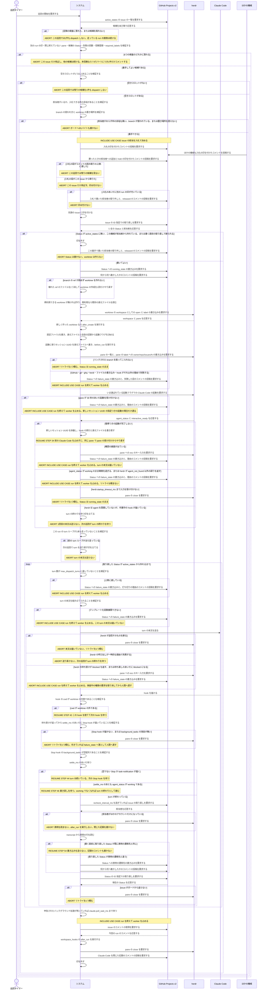

# ユースケース: issue を1件処理する

## 根拠資料

- `docs/plans/continuo_design.md#3-2`（turn の終わりの判定の規則。settle_ms と task-notification）
- `docs/plans/continuo_design.md#3-3b`（再着手は前回のセッションへ復帰する。戻れなければ新しいセッションで始め直す）
- `docs/plans/continuo_design.md#3-5`（完了検知の3層と、1つの turn で何が起きるか）
- `docs/plans/continuo_design.md#3-6`（dispatch の直前に issue ごとに検査するもの）
- `docs/plans/continuo_design.md#3-8`（turn ループ。1回目の本文と継続の指示、max_dispatch_turns）
- `docs/plans/continuo_design.md#3-85`（pane を閉じるたびに閉じた記録を書き、次の起動の最初のメッセージに人間のコメントを付ける）
- `docs/plans/continuo_design.md#3-16`（着手の手順の順番。段-1 から段11）
- `docs/plans/continuo_design.md#3-18`（worktree の身元ファイル）
- `docs/plans/continuo_design.md#3-21`（打ち切りは `agent_status` で測る）
- `docs/plans/continuo_design.md#3-23`（hook の中身は外部入力であり、そのまま信じない）
- `docs/plans/continuo_design.md#3-25`（表明を transcript から読む。コメントが無かったらセッションを復元して書かせる）
- `docs/plans/continuo_design.md#3-34`（候補の絞り込みはサーバ側の検索であり、書いた値の反映が遅れる）
- `docs/plans/continuo_design.md#3-77`（余裕値の出し方と、投稿するかどうか）
- `docs/plans/continuo_design.md#3-77b`（担当は assignee で持ち、期限は hold のコメントで持つ）
- `docs/plans/continuo_design.md#3-77c`（走っている最中の担当の確かめ直しと `recheck_interval_ms`。担当を外された機械は push してはならない）
- `docs/plans/continuo_design.md#4-1`（誰がどの遷移を起こすか）
- `docs/plans/continuo_design.md#3-4f`（巡回は、statusline取得の値が届いた知らせでも回す）
- `docs/plans/continuo_design.md#3-4c`（herdr の workspace の開け閉めは、1つの loop で1つずつ行う。statusline取得の workspace が開いている clone では着手の `worktree.open` が後に回る）
- `docs/plans/continuo_design.md#3-3c`（会話の記録が無いセッション UUID へは復帰しない）
- `docs/plans/continuo_design.md#3-22d`（リンクされた branch を取ってこられない着手は、人間へ渡さずにやり直す）
- `docs/plans/continuo_design.md#3-79`（空の Stop のあともエージェントが動いていれば、turn の終わりとしない）
- `docs/plans/continuo_design.md#3-80`（herdr が agent を登録していなくても、作業中の hook が届いていれば走っているとみなす）
- `docs/plans/continuo_design.md#3-81`（run を終える前に、バックグラウンド処理の申告を1度見る）
- `docs/plans/continuo_design.md#3-83f`（pane を閉じ終えていない issue には着手しない）
- `internal/orchestrator/dispatch.go` の `dispatchCandidates`、`missingRequiredLabels`、`freeSlotBlocker`、`claimForDispatch`、`preflight`、`noteUntrusted`、`dispatchStatusAllowed`、`ownAssigneeLostSinceSnapshot`、`startRun`、`startRunFromWorktree`、`runStartOrFail`、`launchClaude`、`restartWithNewSession`、`resolvePane`、`confirmStartup`、`confirmStartupWithRestart`
- `internal/orchestrator/failure.go` の `noteFailure`、`skipByFailure`
- `internal/orchestrator/turn.go` の `startTurnLoop`、`turnLoop`、`buildTurnText`、`sendTurn`、`afterWaitTimeout`、`confirmTurnEnd`、`awaitStop`、`stillWorkingAfterStop`、`turnSendFailed` と `turnTransient` と `turnStopUnreadable`
- `internal/orchestrator/orchestrator.go` の `Tick`、`OnHook`、`wakeRuns`
- `internal/orchestrator/hookinput.go` の `sanitizeHookEvent`、`acceptHookCwd`
- `internal/orchestrator/lifecycle.go` の `handleTurnEnd`、`decideAfterTurn`、`refreshIssue`、`readSignals`、`applySignals`、`finishRunClaimed`、`failRun`、`abandonRunClaimed`、`waitForBackgroundTasks`、`stopWorker`、`runAfterRunOK`
- `internal/orchestrator/handoff.go` の `handoffLostOnTurnEnd`、`verifyHandoff`、`logReleasedRecord`、`stopHandoffLostClaimed`、`undoHandoffAcquire`
- `internal/orchestrator/reconcile.go` の `checkStalls`
- `internal/orchestrator/comment.go` の `ensureAgentComment`、`hasRunComment`、`failCommentRecovery`、`failCommentRecoveryBusy`、`postStatusMove`
- `internal/orchestrator/relay.go` の `settleClosedRecord`
- `internal/orchestrator/transcript.go` の `mayResumeSession`
- `internal/orchestrator/signal.go` の `ParseSignals`
- `internal/herdr/agent.go` の `AgentStartWithRetry`
- `internal/workspace/prepare.go` の `CheckWorktreeUsable`、`checkBranchFree`、`Prepare`、`openWorktreeInHerdr`
- `internal/workspace/git.go` の `gitWorktreeAdd`、`gitEnsureRemoteBranch`
- `internal/workspace/hooks.go` の `RunHook`、`RunAfterRunOnce`
- `internal/tracker/query.go` の `Dispatchable` を決める箇所（信頼登録の判定を候補の取得のときに畳み込む）
- `internal/workspace/serial.go` の `cloneKey`、`run`（statusline取得の workspace が押さえた clone を待つ）
- `internal/tracker/adapter.go` の `dropUnrequestedStates`、`UpdateStatus`
- `internal/tracker/query.go` の `foldStatus`（Status 名の比較の正規化）

## RUCM

```rucm
USE CASE NAME: issue を1件処理する
BRIEF DESCRIPTION: 巡回タイマーが巡回を起こす。巡回は statusline取得の値が届いた知らせでも起きる。システムはボードから候補を取り、着手できることを確かめ、入札で担当を決めてから先頭の1件に印を付けて worktree と worker を用意する。システムは既存の身元ファイルを読んでどのセッションで起動するかを決め、復帰つきの起動が完了しなければ会話を捨てて新しいセッションで立て直す。システムは turn を送り、Stop hook で turn の終わりを判定する。システムは turn の終わりごとに、担当が自分のままかを recheck_interval_ms に1回確かめ、transcript の表明を読み、表明の値どおりにボードの Status を書く。システムは取り直した Status が active_states から外れたら、run を終えて worker を止める。
PRECONDITION: システムは常駐している。システムはロックファイルの flock を取っている。ボードの Status の選択肢名は設定と一致する。ボードの active_states の Status に issue が1件以上ある。herdr は待ち受けている。
PRIMARY ACTOR: 巡回タイマー
SECONDARY ACTORS: GitHub Projects v2、herdr、Claude Code、ほかの機械
DEPENDENCY: INCLUDE USE CASE issue の担当を入札で決める、INCLUDE USE CASE run を終えて worker を止める
GENERALIZATION: なし

BASIC FLOW:
1. 巡回タイマーはシステムに巡回の開始を要求する。
2. システムはボードから active_states の issue の一覧を取る。
3. システムは VALIDATES THAT 定期の検査に落ちておらず、かつ候補の一覧を取れている。
4. システムは VALIDATES THAT 先頭の issue に別の run の印が付いていない。
5. システムは VALIDATES THAT 先頭の issue の worktree の pane を閉じる処理が残っていない。
6. システムは VALIDATES THAT 先頭の issue の Status が active_states に入っている。
7. システムは VALIDATES THAT 先頭の issue の失敗の回数が max_retries を超えていない。
8. システムは VALIDATES THAT 先頭の issue の対象リポジトリが Claude Code に信頼登録されている。
9. システムは VALIDATES THAT 先頭の issue が required_labels をすべて持っている。
10. システムは VALIDATES THAT 空きスロットが1つ以上ある。
11. システムは VALIDATES THAT 先頭の issue に担当者がいるか、システムが入札できる枠の余裕を持っている。
12. システムは VALIDATES THAT 先頭の issue の branch を置き場所以外の worktree が使っていない。
13. システムは VALIDATES THAT 先頭の issue の worktree の置き場所をそのまま使える。
14. INCLUDE USE CASE issue の担当を入札で決める
15. システムは VALIDATES THAT 入札の段が、この巡回のコメントの読み取りの上限に達して巡回の残りを打ち切っていない。
16. システムは VALIDATES THAT 入札の段が、先頭の issue をこの機械が着手する相手として渡している。
17. システムは VALIDATES THAT 入札のあいだに、先頭の issue に別の run の印が付いていない。
18. システムは先頭の issue に印を付ける。
19. システムは VALIDATES THAT ID 指定で取り直したボードの issue の Status が active_states に入っている。
20. システムは VALIDATES THAT この着手がバックオフ明けのやり直しであるか、候補の一覧で担当者だったこの機械の投稿者が、取り直した issue の担当者から外れていない。
21. システムは VALIDATES THAT 書く直前に取り直した issue がボードから見えており、かつ Status が running_state を書いてはいけない Status に入っていない。
22. システムは、書く直前に取り直した Status が running_state でなければ、ボードの issue の Status に running_state の選択肢を書く。
23. システムは、Status を書き込んだ場合に、Status を動かした記録を issue にコメントする。
24. システムは、置き場所に再利用できる worktree が無い場合に、workspace.root の下に issue の worktree を作る。
25. システムは再利用する worktree の中の既存の身元ファイルを読み、身元ファイルが無いか読めなければ新規の着手として扱う。
26. システムは、同じリポジトリ本体で statusline取得用の workspace が開いていれば閉じるのを待ってから、worktree の絶対パスとリポジトリ本体の作業ディレクトリを渡して workspace として開き、その label に owner/repo/issues/N を書く。
27. システムは、worktree を新しく作った場合に、workspace_hooks の after_create を実行する。
28. システムは Claude Code の設定ファイルを worktree の外に書く。
29. システムは、読んだ身元ファイルに前回のセッション UUID があり、その会話の記録が在れば前回のセッション UUID への復帰つきの起動フラグを使うと決め、そうでなければ新しく採番したセッション UUID の指定つきの起動フラグを使うと決める。
30. システムは worktree の中に、起動に使うセッション UUID を書いた身元ファイルを書く。
31. システムは workspace_hooks の before_run を実行する。
32. システムは herdr に workspace の pane の一覧を要求する。
33. システムは pane の label に owner/repo/issues/N を書く。
34. システムは VALIDATES THAT pane が Claude Code の起動を受け付ける。
35. システムは pane で Claude Code をいま選ばれている起動フラグで起動する。
36. システムは VALIDATES THAT Claude Code の agent_status が idle または done であり、かつ interactive_ready が真である。
37. システムは VALIDATES THAT この run の turn ループが1本も走っていない。
38. DO
39.   システムは VALIDATES THAT turn 数が max_dispatch_turns に達していない。
40.   システムは VALIDATES THAT turn の本文を組み立てられる。
41.   システムは Claude Code に turn の本文を送る。
42.   システムは VALIDATES THAT Claude Code から届いた hook の cwd が worktree の内側である。
43.   システムは VALIDATES THAT herdr の待ち受けが返ってから settle_ms のあいだに、background_tasks の項目を持つ Stop hook が届いている。
44.   システムは Claude Code の Stop hook を受ける。
45.   システムは VALIDATES THAT 受けた Stop hook の background_tasks が空配列である。
46.   システムは settle_ms のあいだ待つ。
47.   システムは VALIDATES THAT settle_ms のあいだに task-notification で始まる UserPromptSubmit も background_tasks が空でない Stop hook も届かない。
48.   システムは VALIDATES THAT settle_ms が過ぎた時点の agent_status が working でない。
49.   システムは、担当を前に確かめてから recheck_interval_ms を過ぎていれば、issue を ID 指定で取り直す。
50.   システムは VALIDATES THAT 取り直した issue の担当者が、ほかのアカウントだけになっていない。
51.   システムは transcript から表明の行を読む。
52.   システムは、表明の値に遷移先が決まっていれば、ボードの issue の Status に表明の値の遷移先の選択肢を書く。
53.   システムは Status を動かした記録を issue にコメントする。
54.   システムはボードの issue の Status を ID 指定で取り直す。
55.   システムは VALIDATES THAT 取り直した issue がボードから見えている。
56. UNTIL 取り直した issue の Status が active_states に入っていない
57. システムは、Stop hook が申告したバックグラウンド処理が残っていれば、申告が空になるのを claude.poll_wait_ms まで待つ。
58. INCLUDE USE CASE run を終えて worker を止める
POSTCONDITION: issue の担当者はこの機械の投稿者1人のままである。印は外れている。run を終える段が成果のコメントを確かめられた場合は、issue の Status は表明の値の遷移先の選択肢であり、issue にエージェントが書いたコメントが1件以上あり、herdr の pane は閉じており、issue に Claude Code を閉じた記録のコメントが1件増えている。run を終える段が代替フローで終わった場合は、Status とコメントと pane は、run を終えて worker を止める の代替フローの事後条件のとおりである。遷移先の選択肢が cleanup.on_states に入っていなければ、worktree と branch は残っている。

SPECIFIC ALTERNATIVE FLOW 巡回のdispatchの見送り:
RFS BASIC FLOW 3
1. システムは dispatch を見送る理由を記録に残す。
2. システムはこの巡回で issue を1件も dispatch しない。
3. ABORT
POSTCONDITION: ボードへは1バイトも書いていない。印の件数は変わっていない。走っている run の照合と片付けと停滞の検知は、同じ巡回で続いている。

SPECIFIC ALTERNATIVE FLOW 走行中のissue:
RFS BASIC FLOW 4
1. システムはこの issue を dispatch の対象から外す。
2. ABORT
POSTCONDITION: 先に印を取った run は走り続けている。ボードへは1バイトも書いていない。印の件数は変わっていない。他の候補の dispatch は続いている。

SPECIFIC ALTERNATIVE FLOW 閉じ終えていないpane:
RFS BASIC FLOW 5
1. システムはこの issue を dispatch の対象から外す。
2. システムは pane をまだ閉じ終えていないのでこの巡回では着手しないことを記録に残す。
3. ABORT
POSTCONDITION: issue の Status はボードにある選択肢のままである。ボードへは1バイトも書いていない。印は付いていない。閉じる前の pane へ Claude Code の起動を要求していない。他の候補の dispatch は続いている。

SPECIFIC ALTERNATIVE FLOW 頼んでいないStatus:
RFS BASIC FLOW 6
1. システムはこの issue を dispatch の対象から外す。
2. システムは頼んだ Status に無い候補が返ったことを記録に残す。
3. ABORT
POSTCONDITION: issue の Status はボードにある選択肢のままである。ボードへは1バイトも書いていない。他の候補の dispatch は続いている。

SPECIFIC ALTERNATIVE FLOW 失敗の繰り返し:
RFS BASIC FLOW 7
1. システムはこの issue を dispatch の対象から外す。
2. システムは、まだ知らせていなければ、これ以上は拾わないことを記録に残す。
3. ABORT
POSTCONDITION: issue の Status はボードにある選択肢のままである。worktree は作られていない。印は付いていない。failure_state を書けていた失敗では、人間がボードの Status を動かすまで、システムはこの issue を拾わない。failure_state を書けなかった失敗では、最後の失敗から agent.max_retry_backoff_ms が過ぎると、システムは失敗の記録を消して拾い直す。

SPECIFIC ALTERNATIVE FLOW 未信頼のリポジトリ:
RFS BASIC FLOW 8
1. システムは issue を dispatch の対象から外す。
2. システムは、対象リポジトリをまだ通知済みにしておらず、かつ issue が draft issue でなければ、対象リポジトリの信頼登録を引き直す。
3. システムは、引き直しても信頼登録が無ければ、対象リポジトリを通知済みとして記録する。
4. システムは、通知済みにしたのが今回であり、かつ trust.on_untrusted が skip_and_comment であれば、issue に信頼登録の承認を促すコメントを1件書く。
5. ABORT
POSTCONDITION: issue の Status はボードにある選択肢のままである。worktree は作られていない。印は付いていない。信頼登録の承認を促すコメントは、対象リポジトリにつき1件だけである。

SPECIFIC ALTERNATIVE FLOW ラベルの不足:
RFS BASIC FLOW 9
1. システムはこの issue を dispatch の対象から外す。
2. システムは、足りないラベルの組み合わせをまだ知らせていなければ、足りないラベルを記録に残す。
3. ABORT
POSTCONDITION: issue の Status はボードにある選択肢のままである。ボードへは1バイトも書いていない。worktree は作られていない。

SPECIFIC ALTERNATIVE FLOW 空きスロット不足:
RFS BASIC FLOW 10
1. システムは上限に達した設定の名前を記録に残す。
2. システムはこの巡回で残りの候補を1件も dispatch しない。
3. ABORT
POSTCONDITION: 印の件数は変わっていない。issue の Status はボードにある選択肢のままである。worktree は作られていない。

SPECIFIC ALTERNATIVE FLOW 枠の余裕なし:
RFS BASIC FLOW 11
1. システムは、この巡回でまだ記録していなければ、入札の要る issue に着手しない理由と使用率を記録に残す。
2. システムはこの issue を dispatch の対象から外す。
3. ABORT
POSTCONDITION: issue の Status はボードにある選択肢のままである。ボードへは1バイトも書いていない。入札のコメントは書いていない。branch の使われ方と worktree の置き場所は検査していない。他の候補の dispatch は続いている。

SPECIFIC ALTERNATIVE FLOW 使われているbranch:
RFS BASIC FLOW 12
1. システムはこの issue を dispatch の対象から外す。
2. システムは branch を使っている worktree の場所と片付けの手順を記録に残す。
3. ABORT
POSTCONDITION: issue の Status はボードにある選択肢のままである。ボードへは1バイトも書いていない。worktree は作られていない。branch を使っている worktree は残っている。

SPECIFIC ALTERNATIVE FLOW 使えないworktree:
RFS BASIC FLOW 13
1. システムはこの issue を dispatch の対象から外す。
2. システムは置き場所をそのまま使えない理由を記録に残す。
3. ABORT
POSTCONDITION: issue の Status はボードにある選択肢のままである。ボードへは1バイトも書いていない。worktree は作られていない。

SPECIFIC ALTERNATIVE FLOW 入札での巡回の打ち切り:
RFS BASIC FLOW 15
1. システムはこの巡回で残りの候補を1件も見ない。
2. ABORT
POSTCONDITION: 印の件数は変わっていない。issue の Status はボードにある選択肢のままである。worktree は作っていない。入札の段が書いたものは、入札の記述の事後条件のとおりである。残りの候補は、次の巡回で上から見直す。

SPECIFIC ALTERNATIVE FLOW 入札で降りた:
RFS BASIC FLOW 16
1. システムはこの issue を dispatch の対象から外す。
2. ABORT
POSTCONDITION: システムは印を付けていない。システムは issue の Status を書いていない。worktree は作っていない。入札の段が issue に書いたコメントと担当者は、入札の記述の事後条件のとおりである。他の候補の dispatch は続いている。

SPECIFIC ALTERNATIVE FLOW 印の取り損ね:
RFS BASIC FLOW 17
1. システムは、この巡回の入札で担当者を書いていれば、書いた担当者を issue から外す。
2. システムは、担当者を外せた場合に、released の印を先頭に置いたコメントを issue に1件書く。
3. ABORT
POSTCONDITION: システムは新しい印を付けていない。issue の Status はボードにある選択肢のままである。worktree は作られていない。担当者を外せなかった場合は、書いた担当者が issue に残っている。他の候補の dispatch は続いている。

BOUNDED ALTERNATIVE FLOW 書かずに取りやめる:
RFS BASIC FLOW 19,20,21
1. システムは印を外す。
2. システムは、この着手で担当者を書いており、かつ direct_chat_state へ動かされた issue のやり直しでなければ、書いた担当者を issue から外す。
3. システムは、担当者を外せた場合に、released の印を先頭に置いたコメントを issue に1件書く。
4. ABORT
POSTCONDITION: issue の Status はボードにある選択肢のままである。システムはこの着手で worktree を作っていない。やり直しの着手では、前の着手で作った worktree が残っている。issue に Status を動かした記録のコメントは付いていない。issue に人間へ引き渡す通知のコメントは付いていない。印は外れている。担当者を外せなかった場合は、書いた担当者が issue に残っている。

GLOBAL ALTERNATIVE FLOW 壊れたref:
BRANCH FROM BASIC FLOW 24
WHEN branch の ref が読めず git が worktree を作れず、まだその ref のファイルを消していない場合
1. システムは VALIDATES THAT 壊れた ref が branch_template の接頭辞で始まり refs/heads の下の通常のファイルであり中身が ref として読めない。
2. システムは壊れた ref のファイルを1つ消す。
3. システムは消したファイルのパスと消した理由を記録に残す。
4. RESUME STEP 24
POSTCONDITION: 壊れた ref のファイルは消えている。packed-refs は書き換えていない。issue の Status は running_state の選択肢のままである。

SPECIFIC ALTERNATIVE FLOW 消さないref:
RFS 壊れたref 1
1. システムはボードの issue の Status に failure_state の選択肢を書く。
2. システムは issue の失敗の回数を1つ増やす。
3. システムは issue に worktree を用意できなかった理由を1件コメントする。
4. INCLUDE USE CASE run を終えて worker を止める
5. ABORT
POSTCONDITION: ref のファイルは1バイトも消えていない。issue の Status は failure_state の選択肢である。worktree は作られていない。印は外れている。

GLOBAL ALTERNATIVE FLOW worktreeの用意のやり直し:
BRANCH FROM BASIC FLOW 24
WHEN issue にリンクされた branch を remote から取ってこられず、worktree の用意が待てば通る見込みのある理由で失敗した場合
1. システムは失敗の理由を記録に残す。
2. システムはリトライの回数を1つ増やす。
3. システムはバックオフの期限を印に書く。
4. ABORT
POSTCONDITION: issue の Status は running_state の選択肢のままである。システムはこの着手で worktree を作っていない。herdr の pane は開いていない。印は残っている。バックオフが明けた巡回が、着手の直前の検査から着手をやり直す。この事後条件は、リトライの回数が agent.max_retries に達していない場合のものである。達していた場合は、リトライの尽きと同じ段を通る。

GLOBAL ALTERNATIVE FLOW 着手の途中の失敗:
BRANCH FROM BASIC FLOW 22,24,27,28,29,30,31,32,33,35
WHEN running_state の書き込みから Claude Code の起動までのあいだに、GitHub・git・ghq・herdr の呼び出しか、ファイルの書き込みか、復帰の失敗の中での採番を含むセッション UUID の採番か、workspace_hooks の after_create か before_run が、壊れた ref でも待てば通る見込みのある理由でも pane の受け付け待ちでも復帰つきの起動の失敗でもない理由で失敗した場合
1. システムはボードの issue の Status に failure_state の選択肢を書く。
2. システムは issue の失敗の回数を1つ増やす。
3. システムは issue に失敗した段と直し方を1件コメントする。
4. INCLUDE USE CASE run を終えて worker を止める
5. ABORT
POSTCONDITION: issue の Status は failure_state の選択肢である。issue に失敗の理由のコメントが1件ある。印は外れている。作りかけの worktree は残っている。turn の本文は Claude Code に届いていない。pane を引く前に失敗した場合は、herdr の workspace と pane は開いたまま残る。running_state の書き込みそのものが失敗した場合は、worktree は作られていない。

SPECIFIC ALTERNATIVE FLOW paneがまだ使えない:
RFS BASIC FLOW 34
1. システムは VALIDATES THAT pane を待ち始めてから 30 秒が経っていない。
2. システムは 500 ミリ秒待つ。
3. RESUME STEP 34
POSTCONDITION: pane が起動を受け付けるまで待ち続けている。この pane で新しい Claude Code はまだ起動していない。復帰の失敗から戻ってきた場合に pane へ残っているものは、復帰つきの起動が完了しなかった理由で決まる。起動直後の確認の画面で止まっていた場合は、確認の画面を esc で畳んだ前の Claude Code が pane を占めたままである。herdr.startup_timeout_ms の経過で終わった場合は、確認の画面を畳んでいない前の Claude Code が pane を占めたままである。

SPECIFIC ALTERNATIVE FLOW paneの断念:
RFS paneがまだ使えない 1
1. システムはボードの issue の Status に failure_state の選択肢を書く。
2. システムは issue の失敗の回数を1つ増やす。
3. システムは issue に pane が使えなかった理由を1件コメントする。
4. INCLUDE USE CASE run を終えて worker を止める
5. ABORT
POSTCONDITION: issue の Status は failure_state の選択肢である。この pane で新しい Claude Code は起動していない。断念した起動は新しいセッション UUID の指定つきの起動である。herdr の pane を閉じたので、確認の画面を畳んだ前の Claude Code が残っていた場合も、その pane ごと終わっている。印は外れている。worktree は残っている。

SPECIFIC ALTERNATIVE FLOW 起動直後の確認画面:
RFS BASIC FLOW 36
1. システムは pane に esc のキー入力を送る。
2. システムはボードの issue の Status に failure_state の選択肢を書く。
3. システムは issue の失敗の回数を1つ増やす。
4. システムは issue に起動直後の確認の画面で止まった理由を1件コメントする。
5. INCLUDE USE CASE run を終えて worker を止める
6. ABORT
POSTCONDITION: issue の Status は failure_state の選択肢である。issue に失敗の理由のコメントが1件ある。turn の本文は Claude Code に届いていない。herdr の pane は閉じている。印は外れている。worktree は残っている。止まった起動は新しいセッション UUID の指定つきの起動である。

SPECIFIC ALTERNATIVE FLOW 起動の待ち直し:
RFS BASIC FLOW 36
1. システムは VALIDATES THAT herdr が agent_not_found 以外の誤りを返しておらず、かつ agent_status が working のまま herdr.startup_timeout_ms を過ぎていない。
2. システムは VALIDATES THAT 最初に起動を確かめ始めてから herdr.startup_timeout_ms が経っていない。
3. システムは 500 ミリ秒待つ。
4. システムは、herdr が agent を登録しておらず、かつ run から作業中の hook が1件も届いていなければ、pane で Claude Code を直前と同じ起動フラグでもう一度起動する。
5. RESUME STEP 36
POSTCONDITION: Claude Code が入力を受け付けられるようになるまで待ち続けている。turn の本文はまだ送っていない。もう一度渡す起動フラグは直前と同じ値であり、復帰つきの起動なら復帰つきのまま送り直す。issue の Status は running_state の選択肢のままである。herdr の pane は開いたままである。印は残っている。worktree は残っている。

SPECIFIC ALTERNATIVE FLOW 起動の確認の失敗:
RFS 起動の待ち直し 1
1. システムはボードの issue の Status に failure_state の選択肢を書く。
2. システムは issue の失敗の回数を1つ増やす。
3. システムは issue に起動を確かめられなかった理由を1件コメントする。
4. INCLUDE USE CASE run を終えて worker を止める
5. ABORT
POSTCONDITION: issue の Status は failure_state の選択肢である。issue に失敗の理由のコメントが1件ある。リトライの回数は増えていない。turn の本文は Claude Code に届いていない。herdr の pane は閉じている。印は外れている。worktree は残っている。失敗した起動は新しいセッション UUID の指定つきの起動である。

SPECIFIC ALTERNATIVE FLOW 起動の断念:
RFS 起動の待ち直し 2
1. システムは workspace_hooks の after_run を実行する。
2. システムは herdr の pane を閉じる。
3. システムは、閉じた pane で Claude Code の起動が成功していたときだけ、Claude Code を閉じた記録を issue に1件コメントする。
4. システムはリトライの回数を1つ増やす。
5. システムはバックオフの期限を印に書く。
6. ABORT
POSTCONDITION: issue の Status は running_state の選択肢のままである。turn の本文は Claude Code に届いていない。herdr の pane は閉じている。印は残っている。worktree は残っている。バックオフが明けた巡回が、着手の直前の検査から着手をやり直す。断念した起動は新しいセッション UUID の指定つきの起動である。この事後条件は、リトライの回数が agent.max_retries に達していない場合のものである。達していた場合は、リトライの尽きと同じ段を通る。

SPECIFIC ALTERNATIVE FLOW 未登録のまま作業中:
RFS BASIC FLOW 36
1. システムは herdr が agent を登録していないまま作業中の hook が届いていることを記録に残す。
2. システムは Claude Code に1回目の turn の本文を送らない。
3. システムは run に turn の終わりを待つ印を立てる。
4. ABORT
POSTCONDITION: Claude Code は pane の中で走っている。hook の引き当ての索引は張り替えていない。issue の Status は running_state の選択肢のままである。herdr の pane は開いたままである。印は残っている。worktree は残っている。次の巡回が turn ループを起こし、turn を送らずに走っている turn の終わりを待つ。1回目の turn の本文は、走っている turn が終わった次の周で送る。

GLOBAL ALTERNATIVE FLOW 復帰の失敗:
BRANCH FROM BASIC FLOW 34,35,36
WHEN 復帰つきの起動が、pane が 30 秒受け付けないままでも前回のセッションの不在でも起動直後の確認の画面でも herdr.startup_timeout_ms の経過でも、herdr が agent を登録していないまま作業中の hook が届いている場合を除いて、理由を問わず完了しなかった場合
1. システムは新しいセッション UUID を採番する。
2. システムは hook の引き当ての索引を新しいセッション UUID へ張り替える。
3. システムはトークンの集計の基準を作り直す。
4. システムは身元ファイルのセッション UUID を新しいセッション UUID へ書き直し、書き直せなければ警告を記録に残して先へ進む。
5. システムは復帰できなかったセッション UUID と新しいセッション UUID と失敗の理由を記録に残す。
6. システムは起動フラグを新しいセッション UUID の指定つきへ差し替える。
7. システムは前の Claude Code を止めずに同じ pane を使い続ける。
8. RESUME STEP 34
POSTCONDITION: 立て直しの起動はまだ1回も呼んでいない。hook の引き当ての索引は新しいセッション UUID だけを指しているので、前回のセッション UUID を名乗る hook はどの run のものでもないとして捨てられる。前の Claude Code を止める手立てが無いので、起動直後の確認の画面で止まっていた場合は、確認の画面だけを esc で畳んだ Claude Code が同じ pane に残り、その pane は起動を受け付けない。身元ファイルのセッション UUID は、書き直せていれば新しいセッション UUID であり、書き直せなければ前回のセッション UUID のままである。issue の Status は running_state の選択肢のままである。herdr の pane は開いたままである。印は残っている。worktree は残っている。

SPECIFIC ALTERNATIVE FLOW turnループの重なり:
RFS BASIC FLOW 37
1. システムは次の巡回で turn を送り直す印を立てる。
2. ABORT
POSTCONDITION: 印は残っている。issue の Status は running_state の選択肢のままである。turn の本文は Claude Code に届いていない。herdr の pane は開いたままである。worktree は残っている。

SPECIFIC ALTERNATIVE FLOW 上限での打ち切り:
RFS BASIC FLOW 39
1. システムは、Stop hook が申告したバックグラウンド処理が残っていれば、申告が空になるのを claude.poll_wait_ms まで待つ。
2. システムはボードの issue の Status に failure_state の選択肢を書く。
3. システムは issue に打ち切りの理由を1件コメントする。
4. INCLUDE USE CASE run を終えて worker を止める
5. ABORT
POSTCONDITION: issue の Status は failure_state の選択肢である。turn 数は max_dispatch_turns と等しい。herdr の pane は閉じている。印は外れている。worktree は残っている。issue に打ち切りの理由のコメントが1件ある。

SPECIFIC ALTERNATIVE FLOW 本文の組み立ての失敗:
RFS BASIC FLOW 40
1. システムはボードの issue の Status に failure_state の選択肢を書く。
2. システムは issue の失敗の回数を1つ増やす。
3. システムは issue にテンプレートの直し方を1件コメントする。
4. INCLUDE USE CASE run を終えて worker を止める
5. ABORT
POSTCONDITION: issue の Status は failure_state の選択肢である。この turn の本文は Claude Code に届いていない。herdr の pane は閉じている。印は外れている。worktree は残っている。

GLOBAL ALTERNATIVE FLOW 権限の確認:
BRANCH FROM BASIC FLOW 41,44
WHEN herdr の待ち受けが blocked を返すか、Stop hook を待ち直しているあいだに agent_status が blocked になった場合
1. システムは走っている subagent が終わるのを claude.poll_wait_ms まで待つ。
2. システムは pane に esc のキー入力を送る。
3. システムはボードの issue の Status に failure_state の選択肢を書く。
4. システムは issue に権限の確認で止まった理由を1件コメントする。
5. INCLUDE USE CASE run を終えて worker を止める
6. ABORT
POSTCONDITION: issue の Status は failure_state の選択肢である。保留中の権限の要求は取り消されている。herdr の pane は閉じている。印は外れている。worktree は残っている。

GLOBAL ALTERNATIVE FLOW 送信の失敗:
BRANCH FROM BASIC FLOW 41
WHEN herdr が指示の送信そのものを断った場合
1. システムは workspace_hooks の after_run を実行する。
2. システムは herdr の pane を閉じる。
3. システムは Claude Code を閉じた記録を issue に1件コメントする。
4. システムはリトライの回数を1つ増やす。
5. システムはバックオフの期限を印に書く。
6. ABORT
POSTCONDITION: turn の本文は Claude Code に届いていない。herdr の pane は閉じている。印は残っている。issue の Status は running_state の選択肢のままである。worktree は残っている。この事後条件は、リトライの回数が agent.max_retries に達していない場合のものである。達していた場合は、リトライの尽きと同じ段を通る。

GLOBAL ALTERNATIVE FLOW 一時的な送信の失敗:
BRANCH FROM BASIC FLOW 41
WHEN herdr の呼び出しが一時的な理由で失敗した場合
1. システムは turn の本文が Claude Code に届いたかどうかを判断しない。
2. システムは turn の本文を送り直さない。
3. システムは run に turn の終わりを待ち直す印を立てる。
4. ABORT
POSTCONDITION: 印は残っている。リトライの回数は増えていない。herdr の pane は閉じていない。issue の Status は running_state の選択肢のままである。worktree は残っている。次の巡回が turn ループを起こし、turn を送らずに turn の終わりを待つ。

SPECIFIC ALTERNATIVE FLOW 騙りのhook:
RFS BASIC FLOW 42
1. システムはこの hook を捨てる。
2. システムは捨てた理由と session_id を記録に残す。
3. RESUME STEP 42
POSTCONDITION: 捨てた hook は Stop hook の到着に数えていない。turn 数は増えていない。システムは次の hook を待っている。issue の Status は running_state の選択肢のままである。

SPECIFIC ALTERNATIVE FLOW turnの終わりの取りこぼし:
RFS BASIC FLOW 43
1. システムは VALIDATES THAT リトライの回数が agent.max_retries に達していない。
2. システムは workspace_hooks の after_run を実行する。
3. システムは herdr の pane を閉じる。
4. システムは Claude Code を閉じた記録を issue に1件コメントする。
5. システムはリトライの回数を1つ増やす。
6. システムはバックオフの期限を印に書く。
7. ABORT
POSTCONDITION: herdr の pane は閉じている。印は残っている。issue の Status は running_state の選択肢のままである。worktree は残っている。バックオフが明けた巡回が、着手の直前の検査から着手をやり直す。

SPECIFIC ALTERNATIVE FLOW リトライの尽き:
RFS turnの終わりの取りこぼし 1
1. システムはボードの issue の Status に failure_state の選択肢を書く。
2. システムは issue の失敗の回数を1つ増やす。
3. システムは issue に打ち切りの理由を1件コメントする。
4. INCLUDE USE CASE run を終えて worker を止める
5. ABORT
POSTCONDITION: issue の Status は failure_state の選択肢である。印は外れている。herdr の pane は閉じている。issue に打ち切りの理由のコメントが1件ある。worktree は残っている。

GLOBAL ALTERNATIVE FLOW 無音の打ち切り:
BRANCH FROM BASIC FLOW 44
WHEN claude.turn_timeout_ms のあいだ run が進んだ形跡が無く、herdr が返す agent_status が working でない場合
1. システムは herdr に agent_status を要求する。
2. システムは workspace_hooks の after_run を実行する。
3. システムは herdr の pane を閉じる。
4. システムは Claude Code を閉じた記録を issue に1件コメントする。
5. システムはリトライの回数を1つ増やす。
6. システムはバックオフの期限を印に書く。
7. ABORT
POSTCONDITION: herdr の pane は閉じている。印は残っている。issue の Status は running_state の選択肢のままである。worktree は残っている。この事後条件は、リトライの回数が agent.max_retries に達していない場合のものである。達していた場合は、リトライの尽きと同じ段を通る。

BOUNDED ALTERNATIVE FLOW turnの継続:
RFS BASIC FLOW 45,47
1. システムは turn がまだ続いているとみなす。
2. RESUME STEP 44
POSTCONDITION: turn 数は増えていない。システムは次の Stop hook を待っている。issue の Status は running_state の選択肢のままである。herdr の pane は開いたままである。印は残っている。

SPECIFIC ALTERNATIVE FLOW 書き直しの待ち:
RFS BASIC FLOW 48
1. システムは受けた空の Stop hook を turn の終わりとして扱わない。
2. RESUME STEP 46
POSTCONDITION: turn 数は増えていない。システムは settle_ms ごとに agent_status を見直している。新しい Stop hook が届かないまま agent_status が working でなくなれば、システムは turn の終わりとして先へ進む。issue の Status は running_state の選択肢のままである。herdr の pane は開いたままである。印は残っている。

SPECIFIC ALTERNATIVE FLOW 担当が移った:
RFS BASIC FLOW 50
1. システムは issue のコメントを1件残らず取り直す。
2. システムは担当が移った先のアカウント名と、この機械の担当を外した released の印が先頭に付いたコメントの中身を記録に残す。
3. システムは workspace_hooks の after_run を実行しない。
4. システムは herdr の pane を閉じる。
5. システムは Claude Code を閉じた記録を issue に書かない。
6. システムは印を外す。
7. ABORT
POSTCONDITION: issue の担当者はこの機械の投稿者ではない。この機械は branch へ1バイトも push していない。システムはこの turn の表明を読んでいない。issue の Status は running_state の選択肢のままである。herdr の pane は閉じている。issue に Claude Code を閉じた記録のコメントは増えていない。印は外れている。worktree は残っている。

GLOBAL ALTERNATIVE FLOW 既に同じStatus:
BRANCH FROM BASIC FLOW 52
WHEN 書く直前に取り直した Status が表明の値の遷移先の選択肢と同じ場合
1. システムはボードへ書き込まない。
2. RESUME STEP 54
POSTCONDITION: issue の Status は表明の値の遷移先の選択肢である。ボードへは1バイトも書いていない。Status を動かした記録のコメントは増えていない。

SPECIFIC ALTERNATIVE FLOW ボードから消えたissue:
RFS BASIC FLOW 55
1. システムは issue がボードから見えなくなったことを記録に残す。
2. システムは workspace_hooks の after_run を実行する。
3. システムは herdr の pane を閉じる。
4. システムは Claude Code を閉じた記録を issue に1件コメントする。
5. システムはリトライの回数を1つ増やす。
6. システムはバックオフの期限を印に書く。
7. ABORT
POSTCONDITION: herdr の pane は閉じている。印は残っている。issue はボードから見えていない。worktree は残っている。この事後条件は、リトライの回数が agent.max_retries に達していない場合のものである。達していた場合は、リトライの尽きと同じ段を通る。
```

## 段は名前で指す

**この節から下の本文は、段を番号ではなく名前で指す。**段を1つ足すと以降の番号が全部ずれ、
**本文のほうは黙ったまま嘘になる。**名前は上の `rucm` ブロックの本文から取る。
`RFS` と `RESUME STEP` の番号は RUCM の文法そのものなので、そちらは番号のままである。

## 担当を決めるのは、印を付けるより前である

**言いたいこと。**同じボードを複数の機械が見張るので、**着手してよいのは担当者になった1台だけである。**
だから「担当を入札で決める」の段（`INCLUDE USE CASE issue の担当を入札で決める`）を、
**「印を付ける」より前に置く**（設計 [3-77b](../../../plans/continuo_design.md)）。

| どこに置くか | 何が起きるか |
| --- | --- |
| **印を付けるより前（採った）** | 担当になれなかった機械は、**ボードへ1バイトも書かずに降りる** |
| 印を付けたあと | 負けた機械が Status を running_state へ動かしてから降りる。**ボードに嘘の running が残る** |
| worktree を作ったあと | 負けた機械の worktree と branch が残る。**片付けが人間の仕事になる** |

**入札の段の終わり方は3通りあり、こちらは直後の2段で受ける**（`internal/orchestrator/dispatch.go` の `dispatchCandidates`）。
降りる理由そのもの（負けた・期限内の担当がいる・人間が付けた担当である、など）は入札の記述が持つ。こちらが持つのは、降りたあとに何が続くかだけである。

| 入札の段の終わり方 | こちらの受け方 | 実装 |
| --- | --- | --- |
| この機械が着手する相手として渡す | 「印を付ける」の段へ進む | `decision.proceed` が真 |
| その issue だけ降りる | `入札で降りた`。印を付けずに、次の候補へ進む | `decision.proceed` が偽で `continue` |
| 巡回の残りを打ち切る（コメントの読み取りが巡回の上限に達した） | `入札での巡回の打ち切り`。残りの候補も見ない。`空きスロット不足` と同じ終わり方である | `decision.stop` が真で `break` |

**入札には既定3分（`bid_window_ms`）かかる。**空きスロットの検査（「空きスロットを見る」の段）を
入札より前に置いてあるのは、**枠が空いていない機械が3分待ってから降りるのを避けるため**である。

## 走っている最中も、担当が自分のままかを確かめる

**言いたいこと。**担当者の最後の進捗報告から `idle_timeout_ms`（既定18時間）が過ぎると、
**ほかの機械がこの issue の担当を外して拾い直す**（設計 [3-77c](../../../plans/continuo_design.md)）。
**外された機械は、その branch へ push してはならない。**

| いつ確かめるか | どうやって | 担当が移っていたら |
| --- | --- | --- |
| **turn の終わりごと**（`recheck_interval_ms` を過ぎていれば） | issue を ID 指定で取り直し、担当者を読む | `担当が移った` へ入り、**その turn の終わりで止まる** |
| 作業を再開するとき | 同じく担当者を読む | 着手の対象から外す（`夜に機械を落として翌朝に担当を続ける`） |

**既定は1時間である。**

```yaml
tracker:
  provider:
    handoff:
      recheck_interval_ms: 3600000   # 走っている最中に担当を確かめ直す間隔。既定は1時間
```

**turn の途中では止めない。**Claude Code は turn の途中で止められないので、
**止められる場所は turn の終わりしかない。**だから確かめる段も turn の終わりに置く。
**表明を読むより前である**（`internal/orchestrator/lifecycle.go` の `handleTurnEnd` は、
`handoffLostOnTurnEnd` を `readSignals` より先に呼ぶ）。**担当が移っていたら、その turn の表明は読まず、
Status も書かない。**

**判定に使うのは担当者だけである**（`internal/orchestrator/handoff.go` の `verifyHandoff`）。
担当者が1人もいないときと、issue を取り直せなかったときは、止めない。
**コメントを読むのは、担当が移ったと決まったあとである。**外された記録をログへ残すためだけに読む。

**`担当が移った` は `workspace_hooks.after_run` を実行しない**（`stopHandoffLostClaimed`）。
`after_run` は利用者が書いた任意のコマンドで、`git push` を書いている人がいる。
担当を外された機械が push すると、新しい担当の機械が書いた続きと衝突する。
**だから branch へは1バイトも push されない。**push していない変更は remote に載らないが、
**worktree は1バイトも消さない。**取り出せる唯一の場所が、その機械のディスクだからである。

## 着手の段と、落ちたときに外側へ残るもの

**Status を先に書くことが、外部に残る唯一の印である**（設計 3-16）。
**だから、着手が確定して失敗する検査は「running_state を書く」の段より前に置く**
（「候補の Status が active_states か見る」「失敗の回数を見る」「branch の使われ方を見る」「worktree の置き場所を見る」の4段）。

| 落ちた段 | 外側に残るもの | 次の巡回でどうなるか |
| --- | --- | --- |
| 「別の run の印を見る」から「worktree の置き場所を見る」まで | 何も残らない | issue はボードにある Status のままなので、直せばまた候補に上がる |
| 「担当を入札で決める」 | 入札のコメントと、勝ったときの担当者と hold のコメント | 勝てば次の段へ進む。負ければ担当者を書かないので、次の巡回で入札がやり直される |
| 「印を付ける」の直後 | 何も残らない | issue は dispatch_state のままなので候補に上がる |
| 「running_state を書く」の直後 | ボードの Status だけ | running_state は active_states に入るので候補に上がる |
| 「running_state を書いた記録をコメントする」の直後 | Status と、動かした記録のコメント | 同上。記録が残るので、誰がいつ動かしたかは追える |
| 「worktree を作る」から「pane の受け付けを見る」までの途中 | Status と作りかけの worktree | worktree を再利用して着手をやり直す |
| 「after_create を実行する」「before_run を実行する」 | hook が外へ書いたもの | `after_create` は worktree を新しく作ったときだけ走るので、やり直しでは走らない。`before_run` はやり直しのたびに走る |
| 「身元ファイルを書く」の直後 | 身元ファイル | 再起動したときに身元が分かる |

## 「workspace として開く」の段がリポジトリ本体も渡す理由

**`worktree.open` の `cwd` は外せない。**省いても、worktree のパスを渡しても herdr が断る
（**返るコードは herdr の版で変わる。**0.8.x は省いたときだけ `worktree_not_found`、
0.9.1 は両方 `linked_worktree_source`。実測: 2026-08-25 と 2026-09-29、
[test/live/herdr_test.go](../../../../test/live/herdr_test.go)）。

**その代わり、herdr は workspace を2つ開く。**worktree のぶんと、リポジトリ本体のぶん
（**リポジトリの親 workspace**）である。**`worktree.remove` は後者を閉じない**ので、
閉じるのは continuo の仕事になる（片付け側の条件は
[worktree と branch を片付ける.rucm.md](worktree%20と%20branch%20を片付ける.rucm.md) にある）。

**そのため「workspace として開く」の段の前後で `workspace.list` を読む。**前は「この呼び出しより前から
親があったか」を見るため、後ろは「無かったなら、いま開いた親の ID」を控えるためである。
**控えた ID は「身元ファイルを書く」の段で身元ファイルへ書く**（`herdr_repo_workspace_id`）。
**前からあったなら人間が開いたものなので、控えず、二度と触らない。**

## 「workspace として開く」の段は、statusline取得の workspace が閉じるのを待つ

**言いたいこと。**同じリポジトリ本体で statusline取得用の workspace が開いている間に `worktree.open` をすると、
herdr はその workspace を issue の親にしてしまい、閉じられなくなる（設計 3-4c。herdr 0.9.1 の実測）。
**だから herdr の workspace の開け閉めを1つの loop に通し、statusline取得の workspace が押さえた
リポジトリ本体では、「workspace として開く」の段が閉じるまで後に回る**
（`internal/workspace/serial.go` の `cloneKey` と `run`、`internal/workspace/prepare.go` の `Prepare`）。
コメントの取り戻しの「workspace として開き直す」の段（[run を終えて worker を止める.rucm.md](run%20を終えて%20worker%20を止める.rucm.md)）も `Prepare` を通るので、同じく待つ。

**段は足さない。**待つのは開く前の順番だけで、開いた結果も、そのあとの段も変わらない。

## 復帰つきの起動は、失敗の理由を問わず捨てて立て直す

**言いたいこと。**「Claude Code を起動する」の段が復帰つきの起動なら、**どんな理由で完了しなくても**
会話を丸ごと捨て、新しいセッション UUID で立て直す（代替フロー `復帰の失敗`）。
**例外は1つだけである。**herdr が agent を登録していないまま作業中の hook が届いている場合は、
復帰そのものは成功しているので、立て直さずに `未登録のまま作業中` へ進む（下の「hook が届いていたら送り直さない」）。
**だから ABORT で抜ける `起動直後の確認画面`・`起動の断念`・`paneの断念` の3本は、
新しいセッション UUID の指定つきの起動でだけ通る。**

| 復帰つきの起動が完了しなかった理由 | どこを通ってどこへ行くか |
| --- | --- |
| pane が `agent_pane_busy` を30秒返し続けた | `paneがまだ使えない` で30秒粘ったのち、**`paneの断念` へは進まずに** `復帰の失敗` が受け取り、「pane の受け付けを見る」の段からやり直す |
| `agent.start` が起動の待ちで timeout を返した | **`起動の待ち直し` を1回も通らずに** `復帰の失敗` が受け取り、「pane の受け付けを見る」の段からやり直す |
| 起動直後の確認の画面が出た | **`起動の待ち直し` を1回も通らずに** `復帰の失敗` が受け取り、「pane の受け付けを見る」の段からやり直す |
| `agent.start` は通ったが、起動の確認が期限まで idle にならなかった | `起動の待ち直し` で期限まで粘ったのち `復帰の失敗` が受け取り、「pane の受け付けを見る」の段からやり直す |

**新しいセッション UUID の指定つきの起動は、`起動直後の確認画面`・`起動の待ち直し`・`起動の断念`・
`paneがまだ使えない`・`paneの断念` のどれかへ進む。**

**pane の30秒が `paneの断念` で終わらない理由。**pane の粘りは `AgentStartWithRetry` の中にあり、
**その戻り値は `startRunFromWorktree` の `startErr != nil && !errors.Is(startErr, ErrStartupBusy) && resumeUUID != ""` へ落ちる**
（`internal/orchestrator/dispatch.go`）。**見ているエラーの種類は `ErrStartupBusy` の1つだけなので、`agent_pane_busy` を
30秒返され続けた場合も、復帰つきの起動なら立て直しへ回る。**だから `復帰の失敗` は
「pane の受け付けを見る」「Claude Code を起動する」「起動の完了を見る」の3つの段から枝を出している
（`BRANCH FROM BASIC FLOW 34,35,36`）。

| 分岐元の段 | そこで起きる、復帰つきの起動の失敗 |
| --- | --- |
| pane の受け付けを見る | pane が `agent_pane_busy` を30秒返し続けた |
| Claude Code を起動する | `agent.start` がそれ以外の誤りを返した（前回のセッションが消えていて、起動の待ちが timeout になった場合を含む） |
| 起動の完了を見る | 確認の画面が出た。`herdr.startup_timeout_ms` まで入力を受け付けなかった |

**3つ目を落とすと、確認の画面と期限切れが、復帰つきの起動でも `起動直後の確認画面` と `起動の断念` へ進むように読める。**
実装では `launchClaude` が返したエラーを同じ1行が受けるので、その2つも立て直しへ回る。

**`agent.start` がエラーを返した場合に `起動の待ち直し` を通らない理由。**`launchClaude` は
`AgentStartWithRetry` が返したエラーをその場で返し、**待ち直しを持つ `confirmStartupWithRestart` を
1度も呼ばない**（`internal/orchestrator/dispatch.go`）。

**確認の画面が `起動の待ち直し` を通らない理由。**`confirmStartup` は `blocked` を見たら `esc` を送って
**やり直せない形のエラーで即座に戻り**、`confirmStartupWithRestart` はそれを見て期限を待たずに返す
（`internal/orchestrator/dispatch.go` の `if !errors.Is(err, ErrStartupRetryable)`）。

**`起動の待ち直し` は、起動の確認が期限まで idle にならない理由なら両方の起動で通る。**
ABORT で抜ける `起動直後の確認画面`・`起動の断念`・`paneの断念` だけが、
新しいセッション UUID の指定つきの起動に限られる（復帰つきなら `復帰の失敗` が先に受け取るためである）。

**見分けているのは `internal/orchestrator/dispatch.go` の `startRunFromWorktree` の1行だけである。**
**その1行はエラーの種類を1つだけ見る。**「herdr は agent を登録していないが Claude Code は
走っている」を表す番兵（`ErrStartupBusy`。設計 3-80）だけを、この枝から外す。
**外さないと、復帰そのものは成功しているのに立て直しへ回り、
動いている本人の hook の宛先が張り替えられる。**それ以外の種類は、これまでどおり見ていない。
確認の画面で止まっても（`agent_status` が `blocked`）、`herdr.startup_timeout_ms` が経っても、
前回のセッションが見つからなくても、同じ枝へ入る。

**待ち直しの起動は、直前と同じ起動フラグで送り直す**
（`confirmStartupWithRestart` は初回と同じ `params` を渡す）。**再着手ではその引数に `--resume` が
入っているので、待ち直しの起動も復帰つきである。**新しいセッション UUID の指定つきなら、
渡す UUID も同じ値である。設計 [3-3](../../../plans/continuo_design.md) は
「一度使ったセッション UUID をもう一度 `--session-id` に渡すと
`Session ID ... is already in use.` で起動に失敗する」と実測している。
**送り直しに入るのは、`agent.get` が `agent_not_found` を返し、
かつ、その run から hook が1件も届いていないときである**
（`confirmStartup` がやり直せる形で期限を待たずに戻る唯一の枝。`internal/orchestrator/dispatch.go`。
`blocked` も期限を待たずに戻るが、そちらはやり直さずにそのまま返る）。
**そのとき Claude Code は1文字も起動していないので、その UUID のセッションはまだ無く、
同じ値を渡し直せる。**

**hook が届いていたら送り直さない**（設計 [3-80](../../../plans/continuo_design.md)）。
**herdr が agent を登録するのは、入力待ちの画面を見分けたときである。**
起動直後から作業を始めた Claude Code はその画面を出さないので、**生きていても
`agent_not_found` が返り続ける。**そこへ送り直すと pane を Claude Code が埋めているので
`agent_pane_busy` が返り続け、**復帰つきの起動では `復帰の失敗` が動いている本人の
hook の宛先を張り替えてしまう。****待たない。**`ErrStartupBusy` でその場に戻り、`startRunFromWorktree` が1回目の指示を送らずに
「turn の終わりを待つ」印を立てる（代替フロー `未登録のまま作業中`）。**走っている turn の終わりは turn ループが hook だけで待つ。**
**ここで待つと、同じ巡回で印を付けた他の issue が1つも着手されないまま止まる**（設計 3-80）。

**`agent_status` が `unknown` のままの場合と `interactive_ready` が偽のままの場合は、
`agent.start` を送り直さない。**`confirmStartup` が 500 ミリ秒ごとに見直しながら
`herdr.startup_timeout_ms` まで待ち、期限が来たら `起動の断念` へ進む。
**`起動の断念` は人間へ渡さない。**`runStartOrFail` は `ErrStartupRetryable` を見て `abandonRun` を呼ぶので、
リトライを1つ積み、Status は `running_state` のまま、バックオフが明けた巡回で着手をやり直す。

**期限は、`agent.start` をやり直すたびに数え直しになる部分がある。**やり直すかどうかを決める期限（`confirmStartupWithRestart`）は
最初に起動を確かめ始めた時刻から数えるが、1回の確認の中の待ち（`confirmStartup`）は、呼ばれるたびにそこから
`herdr.startup_timeout_ms` を数える。`agent_not_found` で `agent.start` をやり直した直後の確認が `unknown` のまま続くと、
合計の待ちは最大で `herdr.startup_timeout_ms` の約2倍になる。
`failure_state` へ落ちるのは、リトライの回数が `agent.max_retries` に達していたときだけである（`リトライの尽き` と同じ段）。

**`agent_status` が `working` のまま期限を過ぎた場合は、やり直さない。**`confirmStartup` は
`ErrStartupRetryable` を包まないエラーを返すので、`runStartOrFail` が `failRun` を呼ぶ。
この経路は `起動の確認の失敗` が受け持つ。`agent.get` が `agent_not_found` 以外の誤りを返した場合も同じで、
こちらは期限を待たずに落ちる。**`起動の待ち直し` の最初の段が、この2つを `起動の断念` から見分ける。**
**送り直しが失敗しても run は捨てない。**`confirmStartupWithRestart` はやり直しの
`agent.start` の失敗を警告1行に落とし、期限まで確認を続ける。

## 立て直しが通るかは、前の Claude Code が pane に残るかで割れる

**言いたいこと。**立て直しは前の Claude Code を止めずに同じ pane で行うので、
**前が残っている場合は立て直しの起動そのものを受け付けてもらえない。**
だから `復帰の失敗` は「立て直した」と言い切らず、「pane の受け付けを見る」の段へ戻す。

**continuo は agent を止められない。**`internal/herdr/agent.go` が定義する method は
`agent.start` / `prompt` / `read` / `get` / `list` / `wait` / `rename` / `send_keys` の8つで、
止める method が無い。`startRunFromWorktree` は同じ pane と同じ agent 名で `launchClaude` をもう一度通す。

| 復帰つきの起動が完了しなかった理由 | pane に何が残るか | 立て直しの起動 |
| --- | --- | --- |
| 前回のセッションが消えていた | `claude --resume` が落ち、シェルのプロンプトへ戻る | 受け付けられる |
| 起動直後の確認の画面で止まった | `esc` で画面だけを畳んだ Claude Code が前面で走り続ける | **受け付けられない** |
| 起動の確認が期限まで idle にならなかった | 前の Claude Code が前面で走り続けているか、落ちてシェルのプロンプトへ戻っているかのどちらか | **呼んでみるまで分からない** |

**受け付けられない理由。**herdr の `agent.start` は「対話プロンプトに来ていて、前面で走る
コマンドも editor も agent も無い pane」を要求する。herdr 0.8.2 の `herdr --skill` の原文は
"An available shell pane must be at its interactive prompt, with the shell itself in the
foreground and no foreground command, editor, or agent running."（**訳:** 使えるシェルの pane とは、
**対話プロンプトに来ていて、シェル自身が前面にあり、前面で走るコマンドも editor も agent も
無いものである**）。**占められた pane へ投げると `agent_pane_busy`
（`agent target pane <pane の ID> is not an available shell`）が返る**
（herdr 0.8.2 で実測: 2026-08-27。pane で `sleep 180` を走らせてから `agent start` を呼んだ）。

**だから `復帰の失敗` の RESUME 先は「pane の受け付けを見る」の段である。**確認の画面で止まっていた場合は
そこで落ち、`paneがまだ使えない` で30秒粘ったのち `paneの断念` へ進む。
**`paneの断念` が pane を閉じるので、残っていた前の Claude Code もそこで終わる。**

**その30秒のあいだ、pane に残った Claude Code の hook は捨てられる。**`復帰の失敗` は hook の
索引を新しいセッション UUID へ張り替えており（`bindSession` は同じ run の古い結び付きを消してから
書く）、**pane に残っているのは前回のセッション UUID を名乗る Claude Code である。**
`OnHook` は索引に無い `session_id` に偽を返し、hookserver がその hook を捨てる。

**身元ファイルを書き直せなくても止まらない。**`restartWithNewSession` は `SetSessionUUID` の
失敗を警告1行にして先へ進む。**そのときは前回のセッション UUID が身元ファイルに残るので、
次の再着手はもう一度同じ死んだ UUID へ復帰しにいく。**`復帰の失敗` の事後条件は、
書き直せた場合と書き直せなかった場合の両方を書いてある。

## run を終える段は、別の記述が持つ

**言いたいこと。**成果のコメントを確かめる段から印を外す段までは、
[run を終えて worker を止める.rucm.md](run%20を終えて%20worker%20を止める.rucm.md) に書いてある。
`コメントの取り戻し`・`復元の断念`・`取り戻しの復帰の失敗`・`コメントの取り戻しの失敗` の4本も、そちらへ移した。

**引く場所は2種類ある。**基本フローの最後の段と、人間へ渡して終える代替フローの終わりである
（`消さないref`・`着手の途中の失敗`・`paneの断念`・`起動直後の確認画面`・`起動の確認の失敗`・`上限での打ち切り`・
`本文の組み立ての失敗`・`権限の確認`・`リトライの尽き`）。**1つの記述に書くと、こちらの枝とあちらの枝が掛け算になる。**

**リトライを積む出口と `担当が移った` は、引かない。**成果のコメントを確かめないためである。
after_run と pane を閉じる段を、フローの中に自分で持つ。

## 候補を飛ばす9つの検査

**候補の一覧は GitHub のサーバ側の検索結果であり、そのまま信じてはならない**（設計 3-34）。
**並びは `internal/orchestrator/dispatch.go` の `dispatchCandidates` の順である。**

**その前に、巡回そのものが dispatch を見送ることがある**（代替フロー `巡回のdispatchの見送り`）。
定期の検査（Status の選択肢名の照合と gh の認証。`tracker.verify_states_every` 回に1回）に落ちた巡回と、
候補の一覧を取れなかった巡回である（`internal/orchestrator/orchestrator.go` の `Tick`、`verifyPeriodically`）。
走っている run の照合・片付け・停滞の検知・turn ループの起こし直しは、その巡回でも行う。

| 検査の段 | 何を見るか | 落ちたらどうするか |
| --- | --- | --- |
| 別の run の印を見る | その issue に別の run の印が既に付いていないか | その issue だけ飛ばす。走っている run はそのまま |
| 閉じ終えていない pane を見る | その issue の worktree の pane を閉じる処理が残っていないか（設計 3-83f） | その issue だけ飛ばす。閉じ終えた次の巡回で着手する |
| 候補の Status が active_states か見る | issue の Status が active_states に入っているか | その issue だけ飛ばす。他の候補は続ける |
| 失敗の回数を見る | 失敗の回数が max_retries を超えていないか | 人間が Status を動かすまで拾わない |
| 信頼登録を見る | 対象リポジトリが Claude Code に信頼登録されているか | その issue だけ飛ばす。コメントはリポジトリにつき1件だけ書く |
| required_labels を見る | required_labels をすべて持っているか | その issue だけ飛ばす。ボードへは1バイトも書かない |
| 枠の余裕を見る | 担当者のいない issue について、入札できる枠の余裕があるか（空きスロットの検査のあと） | その issue だけ飛ばす。理由は巡回につき1回だけ記録に残す。担当者のいる issue は通す |
| branch の使われ方を見る | その branch を置き場所以外の worktree が使っていないか | Status を1バイトも書かずに飛ばす |
| worktree の置き場所を見る | 目的のパスに実体があるのに git の登録が無いか。別の branch を出しているか。どの branch にも載っていないか | Status を1バイトも書かずに飛ばす |

**空きスロットの検査は、required_labels の検査と枠の余裕の検査のあいだにある。**落ちたら、その issue だけでなく残りの候補も飛ばす。

**枠の余裕の検査を、入札の記述ではなくこちらに置いた理由。**判定そのものは入札と同じ（`handoff.Evaluate`）だが、
`dispatchCandidates` はこれを `preflight` より前で見る。**担当者がいなくて枠に余裕が無い issue は、
branch の検査も置き場所の検査も通らずに落ちる。**入札の段（`INCLUDE USE CASE issue の担当を入札で決める`）は
その2つの検査のあとにあるので、入札の側に書くと、通っていない検査を通ったことになる。
担当者のいる issue を通すのは、期限切れの担当を外す経路と、再起動のあとの拾い直しが、入札の段の中にあるためである。

**信頼登録の検査の結果は3通りある**（代替フロー `未信頼のリポジトリ` の中。終わり方はどれも「その issue を飛ばす」である）。

| 引き直した結果 | することは |
| --- | --- |
| 信頼登録が無い | 通知済みとして記録する。`trust.on_untrusted` が `skip_and_comment` で、draft issue でなければ、コメントを1件書く |
| 引き直しそのものが失敗した | 警告を記録に残すだけである。通知済みにしない |
| 信頼登録が付いていた（候補を取ったあとで付いた） | 通知済みの記録を消す。この巡回では飛ばし、次の巡回で着手する |

対象リポジトリが既に通知済みなら、引き直さない（呼ぶたびに git を1プロセス起こすためである）。

**信頼登録の検査は2回ある。**1回目は候補を取るときで、tracker が信頼の判定を `Dispatchable` に畳み込む。
`dispatchCandidates` は `Dispatchable` が偽の候補を、required_labels の検査より前で落とす（このとき `preflight` を呼んで、
人間へ知らせるコメントを書く）。2回目は空きスロットの検査のあとの `preflight` で、同じ判定をその場で引き直す。
**基本フローの「信頼登録を見る」の段は、先に効く1回目の位置に置いてある。**
`trust.require_repo_trusted` が偽なら、どちらの検査も行わない。draft issue は owner も repo も持たないので、コメントを書かずに飛ばす。

**「branch の使われ方を見る」が「worktree の置き場所を見る」より先である**（`internal/workspace/prepare.go` の
`CheckWorktreeUsable` は、目的のパスを `os.Stat` で見る前に `checkBranchFree` を呼ぶ）。
worktree の置き場所を決められない場合と、置き場所が `workspace.root` の内側に収まらない場合も、
`使えないworktree` と同じ扱いである（警告を1行出して、その issue だけ飛ばす）。

**「branch の使われ方を見る」の段は、目的のパスに何も無くても落ちる。**git は1つの branch を2つの worktree に
出せないので、別の場所の worktree がその branch を出していると、「worktree を作る」の段の
`git worktree add` が `fatal: '<branch>' is already used by worktree at '<別のパス>'` で
必ず失敗する。**片付けは `continuo abandon <issue の URL>` の出番である**
（[着手を取り消す.rucm.md](%E7%9D%80%E6%89%8B%E3%82%92%E5%8F%96%E3%82%8A%E6%B6%88%E3%81%99.rucm.md)）。

## 印を付けてから running_state を書くまでに、着手を取りやめる

**言いたいこと。**印を付けたあとでも、Status を書く前なら、ボードに何も残さずに降りられる
（代替フロー `書かずに取りやめる`。`internal/orchestrator/dispatch.go` の `startRun` と `runStartOrFail`）。

| 分岐元の段 | 何を見たか |
| --- | --- |
| 取り直した Status が active_states か見る | ID 指定で取り直した Status が `active_states` に無い。取り直しが失敗した。item が見えない |
| 取り直した担当者を見る | 候補の写しでは自分が担当だったのに、取り直したら担当者にいない。**バックオフ明けのやり直しでは見ない** |
| 書く直前の取り直しを見る | `UpdateStatus` が書く直前に取り直したら、item が見えないか、書いてはいけない Status（`terminal_states`・`failure_state`・`dispatch_state`・`direct_chat_state`・表明の遷移先）に入っていた |

**担当者の消し戻しには、段にしていない分岐がある。**

| 何が起きたか | 実装がすること |
| --- | --- |
| この着手で担当者を書いていない（もともと自分が担当だった） | 消し戻さない |
| やり直しで、取り直した Status が `direct_chat_state` だった | 消し戻さない。released も書かない。人間が担当のまま引き取ったので、次の巡回で direct chat の用意が pane を作る |
| 担当者を外せた | released の印を先頭に置いたコメントを1件書く。コメントを書けなくても、警告を残して終える |
| 担当者を外せなかった。gh の持ち主を取れなかった | 警告を記録に残す。担当者は issue に残る |

**`印の取り損ね` も同じ消し戻しを通る。**入札のあいだに同じ issue へ別の run の印が付いた場合で、印を付けていないので、外す印が無い。

## 着手の途中で失敗する段

**言いたいこと。**running_state を書く段から Claude Code を起動する段までのどこで失敗しても、
`runStartOrFail` が `failRun` を呼び、同じ並びで終える（代替フロー `着手の途中の失敗`）。

| 分岐元の段 | 何が失敗するか |
| --- | --- |
| running_state を書く | `UpdateStatus` の誤り |
| worktree を作る | clone を引けない。base を決められない。`git worktree add` の失敗。置き場所の検査。`worktree.open` の失敗 |
| after_create を実行する | hook の失敗 |
| 設定ファイルを書く | ファイルの書き込みの失敗 |
| 起動フラグを決める | セッション UUID の採番の失敗 |
| 身元ファイルを書く | ファイルの書き込みの失敗 |
| before_run を実行する | hook の失敗 |
| pane の一覧を取る | `pane.list` の失敗。pane が1つでない |
| pane の label を書く | `pane.rename` の失敗 |
| Claude Code を起動する | agent 名を決められない。`agent.start` が `agent_pane_busy` 以外の誤りを返した（新しいセッション UUID の指定つきの起動の場合） |
| （`復帰の失敗` の中） | 立て直しのためのセッション UUID の採番の失敗。分岐元は「起動フラグを決める」の段の採番の失敗と同じ扱いにして、枝を足していない |

「workspace として開く」の段は、「worktree を作る」の段と同じ `Prepare` の呼び出しの中にあるので、分岐元には並べていない。

## 壊れた ref に出会ったら、その1ファイルを消してやり直す

**言いたいこと。**`refs/heads/<branch>` のファイルが読めない状態になると、
「worktree を作る」の段は何度やり直しても `reference broken` で失敗し、その issue には二度と着手できない。
**git のコマンドでは消せないので、continuo がファイルとして1つ消して、1回だけやり直す。**

**消してよい条件は設計 [3-22b](../../../plans/continuo_design.md) にある7つで、全部を満たすときだけ消す。**
とくに `herdr.worktree.branch_template` から作った接頭辞（既定は `continuo/`）で始まる名前だけを
対象にし、`git show-ref --verify` が通る正常な branch には触らない。
**中身が SHA や `ref: ` として読めるなら消さない。**読めるものを消せば、その情報が失われる。
**途中のシンボリックリンクを解決したうえで** `refs/heads` の内側に収まっていることを確かめる。
**packed-refs は1バイトも触らない。**

**やり直しは1回だけである。**2回目も失敗したら、そのままの失敗として `failure_state` へ落とす。

**packed-refs 側の ref が生き返ることがある。**その branch が packed-refs にも載っていると、
loose を消した瞬間に packed 側が有効になり、**やり直しはその（古いかもしれない）commit の
チェックアウトになる。**どちらだったのかを記録に残す。

**別の branch 名へ逃げる案は採れない。**置き場所も branch 名も issue 番号から決まる（設計 3-22）ので、
名前を変えると片付け・復元・`continuo abandon` がその issue の worktree を引けなくなる。

## turn の終わりの判定

| Stop hook の `background_tasks` | どう扱うか | どのフローか |
| --- | --- | --- |
| 空でない | まだ動いている。turn の終わりとして扱わない。次の Stop hook を待つ | `turnの継続` |
| 項目が欠けている | 判定できない。turn の終わりとみなさない。待ち受けが返った直後の settle_ms のあいだに、読める Stop hook が1件も届かなければ run を手放す | `turnの終わりの取りこぼし` |
| 空配列 | settle_ms のあいだ待つ。task-notification も、空でない Stop hook も届かず、agent_status が working でもなければ、turn の終わりとする | 基本フロー |

**turn の終わりとせずに待ち直す段は3つあり、戻り先が2通りある**（`internal/orchestrator/turn.go` の `confirmTurnEnd`）。

| 分岐元の段 | 何を見たか | フローと戻り先 |
| --- | --- | --- |
| Stop hook の background_tasks を見る | 受けた Stop hook の `background_tasks` が空でなかった | `turnの継続`。「Stop hook を受ける」の段へ戻る |
| task-notification の不着を見る | 空の Stop hook のあとの settle_ms のあいだに、task-notification か、空でない Stop hook が届いた | `turnの継続`。「Stop hook を受ける」の段へ戻る |
| settle_ms のあとの agent_status を見る | 空の Stop hook から settle_ms 待っても、herdr が `working` を返した（Stop hook が差し戻して、応答を書き直している。設計 3-79） | `書き直しの待ち`。「settle_ms のあいだ待つ」の段へ戻る |

**`書き直しの待ち` だけは、新しい Stop hook を受けずに turn を終えることがある。**書き直しは推測であり、
待ち直しのあいだは settle_ms ごとに `agent_status` を読む。新しい Stop hook が来ないまま `working` でなくなれば、
推測が外れているので、turn の終わりとして先へ進む。戻り先を「settle_ms のあいだ待つ」の段にしたのは、
そこから「settle_ms のあとの agent_status を見る」の段をもう一度通り、真なら基本フローがそのまま先へ進むためである。

**待ち直しのあいだに `agent_status` が `blocked` になったら、`権限の確認` へ入る。**
だから `権限の確認` は、「turn の本文を送る」の段と「Stop hook を受ける」の段の両方から枝を出している。

**`turnの終わりの取りこぼし` の理由は2つあり、issue に残す文面が違う。**1件も届かなかった場合は
「Stop hook から通知が届かなかった」、届いたが `background_tasks` の項目が無かった場合は
「届いたが判断できなかった」と書く（`turnStalled` と `turnStopUnreadable`）。後始末の段は同じなので、フローは1本である。

## turn の終わりに行う段の順番

**言いたいこと。**turn が終わるたびに、次の順で行う（`internal/orchestrator/lifecycle.go` の `handleTurnEnd`）。
**Status を書くのは毎 turn であり、turn ループを抜けてからではない。**

| 順 | 段 | 実装 |
| --- | --- | --- |
| 0 | 人間が引き取っていないかを見る（引き取っていたら、表明を読まずに turn ループを終える） | `handleTurnEnd` の先頭 |
| 1 | 担当が自分のままかを確かめる（`recheck_interval_ms` に1回） | `handoffLostOnTurnEnd` |
| 2 | transcript から表明の行を読む | `readSignals` |
| 3 | 表明の値に遷移先が決まっていれば、Status を書く | `applySignals` |
| 4 | 書き込んだなら、動かした記録をコメントする | `postStatusMove` |
| 5 | Status を ID 指定で取り直す | `refreshIssue` |
| 6 | 取り直した Status で、続けるか終えるかを決める | `decideAfterTurn` |

**turn ループを抜ける条件は、表明の値ではなく、取り直した Status である。**`active_states` に入っていれば次の turn を送り、
入っていなければ run を終える。表明が `working` のとき（`status_signal_map` の値が null）は、順3 で書かず、順4 のコメントも書かない。
Status は `running_state` のままなので、次の turn へ進む。**表明の行が1行も無いときも同じである。**次の turn の継続の指示で、表明を促す。

**順2〜順5 の失敗は、終わり方を変えない。**どれも警告を記録に残して、次の順へ進む。

| 何が起きたか | 実装がすること | どこか |
| --- | --- | --- |
| 表明の値が `status_signal_map` に無い | その行を無視する。Status は書かない | `applySignals` |
| 表明の値の遷移先が null である（既定の `working`） | Status を書かない | `applySignals` |
| Status の書き込みが誤りを返した | 警告を残して、取り直しへ進む | `applySignals` |
| transcript のパスが分からない。表明の行が見つからない | 表明なしとして扱い、次の turn の指示で促す | `readSignals` |
| Status の取り直しが誤りを返した | 着手したときの古い写しで、順6 の判定を続ける | `refreshIssue` |
| 担当を確かめる取り直しが誤りを返した | 判定しない。run は止めない。次の turn の終わりにもう一度試す | `verifyHandoff` |

## turn ループが、後始末をせずに抜ける枝

**言いたいこと。**基本フローの UNTIL のあとは「run を終える」だが、**turn ループは run を終えずに抜けることがある。**
どれも pane を閉じず、印も外さない。**rucm ブロックには書いていない。**direct chat と、止められたときの話で、
この記述の終わり方（Status・pane・印・worktree）を1つも変えないためである。

| どこで見るか | 何を見たか | 実装がすること |
| --- | --- | --- |
| turn を送る前（ループの先頭） | 止められている。別の経路が run を終わらせ終えた | 何もせずに抜ける |
| turn を送る前 | 別の経路が run を終わらせている最中である | 抜けずに 500 ミリ秒ごとに見直す |
| turn を送る前 | run が direct chat に入っている | 1文字も送らずに抜ける |
| turn を送る前 | 控えの Status が `direct_chat_state` である | 送る印を立て直して抜ける（作業中の Status へ戻した巡回で送る） |
| turn を送る前 | 待ちを打ち切るコンテキストが切れている（direct chat へ入って、また抜けたあと） | 送る印を立て直して抜ける（次の巡回が turn ループを起こし直す） |
| 本文を組み立てたあと、送る直前（人間のコメントを読んだ場合だけ） | 上の5つと同じものを、もう一度見る（止められた・終わらせた・終わらせている最中・direct chat・控えの Status・コンテキスト） | 同じ5通りで抜ける。終わらせている最中の場合は、待たずに抜ける |
| 待ち受けから戻ったあと | 別の経路が run を終わらせ終えた。止められている | 何もせずに抜ける（次の起動で引き継ぐ） |
| 待ち受けから戻ったあと | 待っている間に人間が引き取った | pane を閉じずに抜ける |
| turn の終わり（順0） | 人間が引き取っている | 表明を読まずに抜ける |
| turn の終わり（順6） | 取り直した Status が `direct_chat_state` である | 後始末をせずに、送る印を立てて抜ける（次の巡回が direct chat へ入れる） |

**turn ループが待ち受けを打ち切らずに待ち直す枝もある。**`agent.prompt` の待ちが `claude.turn_timeout_ms` で timeout しても、
枠待ちでなければ、打ち切らずに Stop hook を待ち直す（`sendTurn`）。打ち切るかどうかは、巡回の停滞の検知だけが決める（`無音の打ち切り`）。
**枠待ちの扱い**（待ち受けが timeout したとき、Stop hook を待ち直しているとき）は
[レートリミットで待って再開する.rucm.md](レートリミットで待って再開する.rucm.md) が受け持つ。

**取り直した Status が設定に無い Status のとき・`cleanup.on_states` のときの扱いも、この記述には書いていない。**
設定に無い Status の扱いは [人間に判断を渡す.rucm.md](人間に判断を渡す.rucm.md) が、
片付けは [worktree と branch を片付ける.rucm.md](worktree%20と%20branch%20を片付ける.rucm.md) が受け持つ。
基本フローの事後条件が「遷移先の選択肢が cleanup.on_states に入っていなければ」と条件を付けているのは、そのためである。

**hook の中身はエージェントが書き換えられる外部入力である**（設計 3-23）。
run を引くのは `session_id` だけなので、**`cwd` がその run の worktree の外にある hook は、
その1件ごと捨てる**（「hook の cwd を見る」の段）。**捨てても turn の終わりの待ちは続く。**
**検査は hook を受けた入口で行う**（`internal/orchestrator/orchestrator.go` の `OnHook`）。
**捨てた hook は、Stop hook の到着に数えない。**捨てた hook が唯一の Stop hook だった場合は、
待ち受けが返ったあとに `turnの終わりの取りこぼし` へ進む。
`cwd` が空の hook と、worktree のパスをまだ知らない run は判定できないので通す。

## 既に目的の Status なら、書きに行かない

**言いたいこと。**同じ値を書いても GitHub 側では遷移が起きず、**timeline に1行も残らない。**
continuo のログにだけ「書き込みました」が出るので、あとから「誰がいつ Status を動かしたか」を
突き合わせるとき、**continuo が書いたはずの時刻に記録が無い**という形になる。

**だから「表明の遷移先を書く」の段は、書く前に取り直した値が書こうとしている値と同じなら、書き込みを送らない。**
比較は前後の空白と大文字小文字を無視する（`internal/tracker/query.go` の `foldStatus`）。
無駄な API の呼び出しが1回減るのは副産物であり、主目的はログと timeline を食い違わせないことである。

**送らなかったときは、「表明の遷移先を書いた記録をコメントする」の段の「何から何へ動かしたか」のコメントも書かない。**
ボードが動いていないので、書けば嘘の記録になる。代替フロー「既に同じStatus」が
「Status を ID 指定で取り直す」の段へ戻すのはそのためである。判断に使うのは `StatusWrite.Wrote` であり、
`internal/orchestrator/comment.go` の `postStatusMove` が偽なら投稿しない。

**それでも「Status を動かせた」として扱う。**着手や失敗の記録は、書き込みの API を呼んだかどうかではなく
**目的の Status になっているか**で決める（`internal/tracker/adapter.go` の `UpdateStatus` が返す
`StatusWrite.Reached`）。ここを「書かなかった」として扱うと、`active_states` に `running_state` が
入っている構成（雛形の既定は `["Ready", "In Progress"]`）で、
**既に `running_state` だった issue に着手できなくなる。**

## turn を送れなかったときは、2つに分ける

**言いたいこと。**herdr へ送れなかったことと、Stop hook が届かなかったことは別である。
**混ぜると、1文字も届いていないのに「agent が待機状態になったと答えた」と issue に残る。**

| 何が起きたか | どう扱うか | issue と印はどうなるか |
| --- | --- | --- |
| herdr の呼び出しが**一時的な理由**で失敗した（再起動・socket の一瞬の不通・応答の遅れ） | run を諦めない。turn の終わりを待ち直す印を立てて抜ける | 印は残る。リトライは増えない |
| herdr が**送信そのものを断った**（pane が消えている・agent が受け取れない） | run を手放す。届いていないことを明記した理由を残す | 印は残る。リトライを1つ積む |
| 待ち受けが返ったのに **Stop hook が来ない** | run を手放す。設定ファイルの hook を確かめさせる理由を残す | 印は残る。リトライを1つ積む |
| **turn_timeout_ms のあいだ run が進んだ形跡が無く、その時点で agent_status が working でない** | 巡回の停滞の検知が run を手放す | 印は残る。リトライを1つ積む |

**一時的な失敗でも `agent.prompt` を送り直さない。**届いていたかどうかは分からず、
届いていた場合に送り直すと turn が二重に投入される。**黙って止まりもしない。**
進んだ形跡が無いままなら、巡回の停滞の検知が `claude.turn_timeout_ms` の沈黙で拾う。

## リトライを積むフローは、尽きたときだけ人間へ渡す

**言いたいこと。**リトライを積む出口は6つあるが、**尽きたときの後始末は1本しかない**
（`internal/orchestrator/lifecycle.go` の `abandonRunClaimed`）。
だから `リトライの尽き` は1箇所にだけ書き、残りの5つはそこへ落ちる同じ枝として扱う。
**残りの5つの事後条件は、リトライが残っている場合のものである。**事後条件の最後にそう書いてある。

| リトライを積む出口 | 何が起きたか |
| --- | --- |
| `worktreeの用意のやり直し` | issue にリンクされた branch を remote から取ってこられなかった（設計 3-22d） |
| `起動の断念` | `herdr.startup_timeout_ms` まで、Claude Code が入力を受け付けられるようにならなかった |
| `turnの終わりの取りこぼし` | 待ち受けが返ったのに settle_ms のあいだ、読める Stop hook が来なかった |
| `送信の失敗` | herdr が指示の送信そのものを断った |
| `無音の打ち切り` | turn_timeout_ms のあいだ run が進んだ形跡が無く、その時点で agent_status が working でなかった |
| `ボードから消えたissue` | turn の終わりに ID 指定で取り直したら、ボードから返らなかった |

**リトライが残っているときの段は、6つとも同じである。**`after_run` を実行し、pane を閉じ、閉じた記録を書き、
リトライの回数を1つ増やし、バックオフの期限を印に書く。`worktreeの用意のやり直し` だけは worktree も pane もまだ無いので、
`after_run` と pane の段を持たない。

## 人間へ渡して終えるフローは、同じ並びで終える

**言いたいこと。**`failure_state` へ落として終えるフローは、実装では `failRun`・`finishRunClaimed`・`abandonRunClaimed` の
どれかを通る。3つとも並びは同じである。

| 順 | 段 | 条件 |
| --- | --- | --- |
| 1 | Status に failure_state を書く | |
| 2 | 理由を1件コメントする（引き渡しの通知） | 1つの run につき1件だけ |
| 3 | 今回の run が書いたコメントを確かめる（無ければ `コメントの取り戻し`） | turn を1回以上送った run だけ。draft issue と、direct chat から `terminal_states` へ直接抜けた run では行わない |
| 4 | `workspace_hooks.after_run` を実行する | worktree のパスを持ち、`after_run` が設定されているときだけ |
| 5 | pane を閉じる | pane を引き終えているときだけ |
| 6 | Claude Code を閉じた記録を書く | 下の「pane を閉じたら、閉じた記録を書く」 |
| 7 | 印を外す | |

**順3 から順7 は、`INCLUDE USE CASE run を終えて worker を止める` の1段で書いてある。**
着手の途中で落ちたフロー（`消さないref`・`着手の途中の失敗`・`paneの断念`・`起動直後の確認画面`・`起動の確認の失敗`）は、
**初めての着手なら**、働き始めた時刻をまだ持っていないので、あちらの代替フロー `確かめないrun` を通る。
**バックオフ明けのやり直しの着手では、そうとは限らない。**前の着手で turn を送った run は、働き始めた時刻を持ったままである
（`beginAttempt` は戻さない）。その run がやり直しの着手の途中で落ちると、成果のコメントを確かめ、無ければ `コメントの取り戻し` へ入る。

**失敗の回数を増やすのは、順1 の直後である。**`failRun` と、リトライが尽きた側の `abandonRunClaimed` が、
failure_state を書いた直後に issue ごとの失敗の回数を1つ増やす（`noteFailure`。書けたかどうかも一緒に控える）。
基本フローの「失敗の回数を見る」の段と `失敗の繰り返し` が読むのは、この回数である。
**`上限での打ち切り` と `権限の確認` は増やさない**（`finishRunClaimed` は `noteFailure` を呼ばない）。
最後まで通った run は、pane を閉じたあとに失敗の記録を消す（`finishRunClaimed` の `forgetFailure`）。リトライを積む出口は、増やしも消しもしない。

**基本フローの最後の INCLUDE が代替フローで終わった場合。**基本フローの事後条件は、引いた先の終わり方で変わる。

| 引いた先の終わり方 | Status | エージェントのコメント |
| --- | --- | --- |
| 基本フロー、または `コメントの取り戻し` の成功 | 表明の値の遷移先 | 1件以上ある |
| `確かめないrun`（draft issue・direct chat から直接抜けた run） | 表明の値の遷移先 | 確かめていない |
| `復元の断念` | 表明の値の遷移先 | 無い。人間への通知も無い |
| `取り戻しの復帰の失敗`・`コメントの取り戻しの失敗` | failure_state（遷移先が `terminal_states` か `direct_chat_state` なら書かない） | 無い。成果を確かめてほしい通知が1件ある |

## バックオフが明けた run は、検査から入り直す

**言いたいこと。**リトライを積んだ run は、印を持ったままバックオフを待つ。**明けた巡回は、基本フローの先頭からではなく、
途中から入り直す**（`internal/orchestrator/reconcile.go` の `resumeBackoff`、`internal/orchestrator/dispatch.go` の `redispatch`）。
rucm ブロックには入口を足していない。基本フローの段のうち、通るものと通らないものが在るだけだからである。

| 段 | やり直しの着手では |
| --- | --- |
| 候補の一覧を取る 〜 required_labels を見る、空きスロットを見る、枠の余裕を見る | **通らない。**印を持っているので、候補としては `走行中のissue` で飛ばされる。定期の検査に落ちた巡回では、やり直しも見送る |
| 信頼登録を見る、branch の使われ方を見る、worktree の置き場所を見る | **通る**（`preflight`） |
| 担当を入札で決める、印を付ける | **通らない** |
| 取り直した Status が active_states か見る | 通る |
| 取り直した担当者を見る | **通らない**（やり直しでは見ない） |
| 書く直前の取り直しを見る 以降 | 通る。worktree は再利用し、身元ファイルの引き継いだ回数を1つ増やす。送るのは1回目の本文である |

**検査に落ちたやり直しは、何もせずに戻る。**バックオフの期限は過去の値のまま残るので、同じ巡回の停滞の検知が、
閉じた pane の agent を引いて誤りを受け、**その run をもう1度打ち切る**（`無音の打ち切り` と同じ後始末）。
検査に落ち続けると、Claude Code を1度も起動しないままリトライが減り、使い切ると `リトライの尽き` で failure_state へ落ちる。

**尽きたときだけ、Status を failure_state へ落とし、理由を1件コメントし、印を外す。**
**その順番は変えられない。**引き渡しの通知は1つの run につき1件しか投稿できないので、
コメントの取り戻しより先に本当の理由が投稿枠を取らなければならない。

## pane を閉じたら、閉じた記録を書く

**Claude Code を起動した pane を閉じた段のあとには、「Claude Code を閉じました」のコメント（1行目が `<!-- continuo:closed -->`）を1件書く段を置いた**（設計 3-85c）。
次に Claude Code を起動するとき、この記録より後に人間が書いたコメントを最初のメッセージに付けて渡すための境目である。
**書くのは、relay が有効なとき（既定の `auto` で、`agent.relay_trusted_comments` が真で、`self_marker` が空でない）だけである。**
記述を読みやすくするため、各段にはこの条件を書いていない。**担当者が他人のアカウントのとき・pane を閉じ損ねたときも書かない。**
**draft issue にも書かない**（コメントできない。`internal/orchestrator/relay.go` の `recordWorkerClosed`）。

| 閉じ方 | 記録 |
| --- | --- |
| 起動を確かめる前の閉じ方（「起動直後の確認画面」「起動の断念」「paneの断念」「着手の途中の失敗」） | **その pane で Claude Code の起動が成功していたときだけ書く**（起動していない pane で書くと、人間の許可が一度も渡らないまま境目より前へ押し出される） |
| 「担当が移った」 | **書かない。**担当を外された機械は issue へ書かない（設計 3-77c） |
| 「コメントの取り戻し」の最初の閉じ方（[run を終えて worker を止める.rucm.md](run%20を終えて%20worker%20を止める.rucm.md)） | **書かずに保留する。**取り戻しのあとで閉じたとき（`コメントの取り戻し` の2度目の閉じ方か、取り戻しの失敗の段）に書く。復元をあきらめたときは、閉じる pane が無くても、保留していた記録を書く（設計 3-85d。`internal/orchestrator/relay.go` の `settleClosedRecord`） |
| それ以外 | 書く |

## フローチャート

```mermaid
flowchart TD
    BS1["1 巡回タイマーはシステムに巡回の開始を要求する"]
    BS2["2 システムはボードから active_states の issue の一覧を取る"]
    BS3{"3 定期の検査に落ちておらず、かつ候補の一覧を取れている"}
    BS4{"4 先頭の issue に別の run の印が付いていない"}
    BS5{"5 先頭の issue の worktree の pane を閉じる処理が残っていない"}
    BS6{"6 先頭の issue の Status が active_states に入っている"}
    BS7{"7 先頭の issue の失敗の回数が max_retries を超えていない"}
    BS8{"8 先頭の issue の対象リポジトリが Claude Code に信頼登録されている"}
    BS9{"9 先頭の issue が required_labels をすべて持っている"}
    BS10{"10 空きスロットが1つ以上ある"}
    BS11{"11 先頭の issue に担当者がいるか、システムが入札できる枠の余裕を持っている"}
    BS12{"12 先頭の issue の branch を置き場所以外の worktree が使っていない"}
    BS13{"13 先頭の issue の worktree の置き場所をそのまま使える"}
    BS14[["14 INCLUDE USE CASE issue の担当を入札で決める"]]
    BS15{"15 入札の段が、この巡回のコメントの読み取りの上限に達して巡回の残りを打ち切っていない"}
    BS16{"16 入札の段が、先頭の issue をこの機械が着手する相手として渡している"}
    BS17{"17 入札のあいだに、先頭の issue に別の run の印が付いていない"}
    BS18["18 システムは先頭の issue に印を付ける"]
    BS19{"19 ID 指定で取り直したボードの issue の Status が active_states に入っている"}
    BS20{"20 この着手がバックオフ明けのやり直しであるか、候補の一覧で担当者だったこの機械の投稿者が、取り直した issue の担当者から外れていない"}
    BS21{"21 書く直前に取り直した issue がボードから見えており、かつ Status が running_state を書いてはいけない Status に入っていない"}
    BS22["22 システムは、書く直前に取り直した Status が running_state でなければ、ボードの issue の Status に running_state の選択肢を書く"]
    BS23["23 システムは、Status を書き込んだ場合に、Status を動かした記録を issue にコメントする"]
    BS24["24 システムは、置き場所に再利用できる worktree が無い場合に、workspace.root の下に issue の worktree を作る"]
    BS25["25 システムは再利用する worktree の中の既存の身元ファイルを読み、身元ファイルが無いか読めなければ新規の着手として扱う"]
    BS26["26 システムは、同じリポジトリ本体で statusline取得用の workspace が開いていれば閉じるのを待ってから、worktree の絶対パスとリポジトリ本体の作業ディレクトリを渡して workspace として開き、その label に owner/repo/issues/N を書く"]
    BS27["27 システムは、worktree を新しく作った場合に、workspace_hooks の after_create を実行する"]
    BS28["28 システムは Claude Code の設定ファイルを worktree の外に書く"]
    BS29["29 システムは、読んだ身元ファイルに前回のセッション UUID があり、その会話の記録が在れば前回のセッション UUID への復帰つきの起動フラグを使うと決め、そうでなければ新しく採番したセッション UUID の指定つきの起動フラグを使うと決める"]
    BS30["30 システムは worktree の中に、起動に使うセッション UUID を書いた身元ファイルを書く"]
    BS31["31 システムは workspace_hooks の before_run を実行する"]
    BS32["32 システムは herdr に workspace の pane の一覧を要求する"]
    BS33["33 システムは pane の label に owner/repo/issues/N を書く"]
    BS34{"34 pane が Claude Code の起動を受け付ける"}
    BS35["35 システムは pane で Claude Code をいま選ばれている起動フラグで起動する"]
    BS36{"36 Claude Code の agent_status が idle または done であり、かつ interactive_ready が真である"}
    BS37{"37 この run の turn ループが1本も走っていない"}
    BS39{"39 turn 数が max_dispatch_turns に達していない"}
    BS40{"40 turn の本文を組み立てられる"}
    BS41["41 システムは Claude Code に turn の本文を送る"]
    BS42{"42 Claude Code から届いた hook の cwd が worktree の内側である"}
    BS43{"43 herdr の待ち受けが返ってから settle_ms のあいだに、background_tasks の項目を持つ Stop hook が届いている"}
    BS44["44 システムは Claude Code の Stop hook を受ける"]
    BS45{"45 受けた Stop hook の background_tasks が空配列である"}
    BS46["46 システムは settle_ms のあいだ待つ"]
    BS47{"47 settle_ms のあいだに task-notification で始まる UserPromptSubmit も background_tasks が空でない Stop hook も届かない"}
    BS48{"48 settle_ms が過ぎた時点の agent_status が working でない"}
    BS49["49 システムは、担当を前に確かめてから recheck_interval_ms を過ぎていれば、issue を ID 指定で取り直す"]
    BS50{"50 取り直した issue の担当者が、ほかのアカウントだけになっていない"}
    BS51["51 システムは transcript から表明の行を読む"]
    BS52["52 システムは、表明の値に遷移先が決まっていれば、ボードの issue の Status に表明の値の遷移先の選択肢を書く"]
    BS53["53 システムは Status を動かした記録を issue にコメントする"]
    BS54["54 システムはボードの issue の Status を ID 指定で取り直す"]
    BS55{"55 取り直した issue がボードから見えている"}
    BS56{"56 UNTIL 取り直した issue の Status が active_states に入っていない"}
    BS57["57 システムは、Stop hook が申告したバックグラウンド処理が残っていれば、申告が空になるのを claude.poll_wait_ms まで待つ"]
    BS58[["58 INCLUDE USE CASE run を終えて worker を止める"]]
    A1S1["巡回のdispatchの見送り 1 システムは dispatch を見送る理由を記録に残す"]
    A1S2["巡回のdispatchの見送り 2 システムはこの巡回で issue を1件も dispatch しない"]
    A1S3(["巡回のdispatchの見送り 3 ABORT"])
    A2S1["走行中のissue 1 システムはこの issue を dispatch の対象から外す"]
    A2S2(["走行中のissue 2 ABORT"])
    A3S1["閉じ終えていないpane 1 システムはこの issue を dispatch の対象から外す"]
    A3S2["閉じ終えていないpane 2 システムは pane をまだ閉じ終えていないのでこの巡回では着手しないことを記録に残す"]
    A3S3(["閉じ終えていないpane 3 ABORT"])
    A4S1["頼んでいないStatus 1 システムはこの issue を dispatch の対象から外す"]
    A4S2["頼んでいないStatus 2 システムは頼んだ Status に無い候補が返ったことを記録に残す"]
    A4S3(["頼んでいないStatus 3 ABORT"])
    A5S1["失敗の繰り返し 1 システムはこの issue を dispatch の対象から外す"]
    A5S2["失敗の繰り返し 2 システムは、まだ知らせていなければ、これ以上は拾わないことを記録に残す"]
    A5S3(["失敗の繰り返し 3 ABORT"])
    A6S1["未信頼のリポジトリ 1 システムは issue を dispatch の対象から外す"]
    A6S2["未信頼のリポジトリ 2 システムは、対象リポジトリをまだ通知済みにしておらず、かつ issue が draft issue でなければ、対象リポジトリの信頼登録を引き直す"]
    A6S3["未信頼のリポジトリ 3 システムは、引き直しても信頼登録が無ければ、対象リポジトリを通知済みとして記録する"]
    A6S4["未信頼のリポジトリ 4 システムは、通知済みにしたのが今回であり、かつ trust.on_untrusted が skip_and_comment であれば、issue に信頼登録の承認を促すコメントを1件書く"]
    A6S5(["未信頼のリポジトリ 5 ABORT"])
    A7S1["ラベルの不足 1 システムはこの issue を dispatch の対象から外す"]
    A7S2["ラベルの不足 2 システムは、足りないラベルの組み合わせをまだ知らせていなければ、足りないラベルを記録に残す"]
    A7S3(["ラベルの不足 3 ABORT"])
    A8S1["空きスロット不足 1 システムは上限に達した設定の名前を記録に残す"]
    A8S2["空きスロット不足 2 システムはこの巡回で残りの候補を1件も dispatch しない"]
    A8S3(["空きスロット不足 3 ABORT"])
    A9S1["枠の余裕なし 1 システムは、この巡回でまだ記録していなければ、入札の要る issue に着手しない理由と使用率を記録に残す"]
    A9S2["枠の余裕なし 2 システムはこの issue を dispatch の対象から外す"]
    A9S3(["枠の余裕なし 3 ABORT"])
    A10S1["使われているbranch 1 システムはこの issue を dispatch の対象から外す"]
    A10S2["使われているbranch 2 システムは branch を使っている worktree の場所と片付けの手順を記録に残す"]
    A10S3(["使われているbranch 3 ABORT"])
    A11S1["使えないworktree 1 システムはこの issue を dispatch の対象から外す"]
    A11S2["使えないworktree 2 システムは置き場所をそのまま使えない理由を記録に残す"]
    A11S3(["使えないworktree 3 ABORT"])
    A12S1["入札での巡回の打ち切り 1 システムはこの巡回で残りの候補を1件も見ない"]
    A12S2(["入札での巡回の打ち切り 2 ABORT"])
    A13S1["入札で降りた 1 システムはこの issue を dispatch の対象から外す"]
    A13S2(["入札で降りた 2 ABORT"])
    A14S1["印の取り損ね 1 システムは、この巡回の入札で担当者を書いていれば、書いた担当者を issue から外す"]
    A14S2["印の取り損ね 2 システムは、担当者を外せた場合に、released の印を先頭に置いたコメントを issue に1件書く"]
    A14S3(["印の取り損ね 3 ABORT"])
    A15S1["書かずに取りやめる 1 システムは印を外す"]
    A15S2["書かずに取りやめる 2 システムは、この着手で担当者を書いており、かつ direct_chat_state へ動かされた issue のやり直しでなければ、書いた担当者を issue から外す"]
    A15S3["書かずに取りやめる 3 システムは、担当者を外せた場合に、released の印を先頭に置いたコメントを issue に1件書く"]
    A15S4(["書かずに取りやめる 4 ABORT"])
    A16S1{"壊れたref 1 壊れた ref が branch_template の接頭辞で始まり refs/heads の下の通常のファイルであり中身が ref として読めない"}
    A16S2["壊れたref 2 システムは壊れた ref のファイルを1つ消す"]
    A16S3["壊れたref 3 システムは消したファイルのパスと消した理由を記録に残す"]
    A16S4["壊れたref 4 RESUME STEP 24"]
    A17S1["消さないref 1 システムはボードの issue の Status に failure_state の選択肢を書く"]
    A17S2["消さないref 2 システムは issue の失敗の回数を1つ増やす"]
    A17S3["消さないref 3 システムは issue に worktree を用意できなかった理由を1件コメントする"]
    A17S4[["消さないref 4 INCLUDE USE CASE run を終えて worker を止める"]]
    A17S5(["消さないref 5 ABORT"])
    A18S1["worktreeの用意のやり直し 1 システムは失敗の理由を記録に残す"]
    A18S2["worktreeの用意のやり直し 2 システムはリトライの回数を1つ増やす"]
    A18S3["worktreeの用意のやり直し 3 システムはバックオフの期限を印に書く"]
    A18S4(["worktreeの用意のやり直し 4 ABORT"])
    A19S1["着手の途中の失敗 1 システムはボードの issue の Status に failure_state の選択肢を書く"]
    A19S2["着手の途中の失敗 2 システムは issue の失敗の回数を1つ増やす"]
    A19S3["着手の途中の失敗 3 システムは issue に失敗した段と直し方を1件コメントする"]
    A19S4[["着手の途中の失敗 4 INCLUDE USE CASE run を終えて worker を止める"]]
    A19S5(["着手の途中の失敗 5 ABORT"])
    A20S1{"paneがまだ使えない 1 pane を待ち始めてから 30 秒が経っていない"}
    A20S2["paneがまだ使えない 2 システムは 500 ミリ秒待つ"]
    A20S3["paneがまだ使えない 3 RESUME STEP 34"]
    A21S1["paneの断念 1 システムはボードの issue の Status に failure_state の選択肢を書く"]
    A21S2["paneの断念 2 システムは issue の失敗の回数を1つ増やす"]
    A21S3["paneの断念 3 システムは issue に pane が使えなかった理由を1件コメントする"]
    A21S4[["paneの断念 4 INCLUDE USE CASE run を終えて worker を止める"]]
    A21S5(["paneの断念 5 ABORT"])
    A22S1["起動直後の確認画面 1 システムは pane に esc のキー入力を送る"]
    A22S2["起動直後の確認画面 2 システムはボードの issue の Status に failure_state の選択肢を書く"]
    A22S3["起動直後の確認画面 3 システムは issue の失敗の回数を1つ増やす"]
    A22S4["起動直後の確認画面 4 システムは issue に起動直後の確認の画面で止まった理由を1件コメントする"]
    A22S5[["起動直後の確認画面 5 INCLUDE USE CASE run を終えて worker を止める"]]
    A22S6(["起動直後の確認画面 6 ABORT"])
    A23S1{"起動の待ち直し 1 herdr が agent_not_found 以外の誤りを返しておらず、かつ agent_status が working のまま herdr.startup_timeout_ms を過ぎていない"}
    A23S2{"起動の待ち直し 2 最初に起動を確かめ始めてから herdr.startup_timeout_ms が経っていない"}
    A23S3["起動の待ち直し 3 システムは 500 ミリ秒待つ"]
    A23S4["起動の待ち直し 4 システムは、herdr が agent を登録しておらず、かつ run から作業中の hook が1件も届いていなければ、pane で Claude Code を直前と同じ起動フラグでもう一度起動する"]
    A23S5["起動の待ち直し 5 RESUME STEP 36"]
    A24S1["起動の確認の失敗 1 システムはボードの issue の Status に failure_state の選択肢を書く"]
    A24S2["起動の確認の失敗 2 システムは issue の失敗の回数を1つ増やす"]
    A24S3["起動の確認の失敗 3 システムは issue に起動を確かめられなかった理由を1件コメントする"]
    A24S4[["起動の確認の失敗 4 INCLUDE USE CASE run を終えて worker を止める"]]
    A24S5(["起動の確認の失敗 5 ABORT"])
    A25S1["起動の断念 1 システムは workspace_hooks の after_run を実行する"]
    A25S2["起動の断念 2 システムは herdr の pane を閉じる"]
    A25S3["起動の断念 3 システムは、閉じた pane で Claude Code の起動が成功していたときだけ、Claude Code を閉じた記録を issue に1件コメントする"]
    A25S4["起動の断念 4 システムはリトライの回数を1つ増やす"]
    A25S5["起動の断念 5 システムはバックオフの期限を印に書く"]
    A25S6(["起動の断念 6 ABORT"])
    A26S1["未登録のまま作業中 1 システムは herdr が agent を登録していないまま作業中の hook が届いていることを記録に残す"]
    A26S2["未登録のまま作業中 2 システムは Claude Code に1回目の turn の本文を送らない"]
    A26S3["未登録のまま作業中 3 システムは run に turn の終わりを待つ印を立てる"]
    A26S4(["未登録のまま作業中 4 ABORT"])
    A27S1["復帰の失敗 1 システムは新しいセッション UUID を採番する"]
    A27S2["復帰の失敗 2 システムは hook の引き当ての索引を新しいセッション UUID へ張り替える"]
    A27S3["復帰の失敗 3 システムはトークンの集計の基準を作り直す"]
    A27S4["復帰の失敗 4 システムは身元ファイルのセッション UUID を新しいセッション UUID へ書き直し、書き直せなければ警告を記録に残して先へ進む"]
    A27S5["復帰の失敗 5 システムは復帰できなかったセッション UUID と新しいセッション UUID と失敗の理由を記録に残す"]
    A27S6["復帰の失敗 6 システムは起動フラグを新しいセッション UUID の指定つきへ差し替える"]
    A27S7["復帰の失敗 7 システムは前の Claude Code を止めずに同じ pane を使い続ける"]
    A27S8["復帰の失敗 8 RESUME STEP 34"]
    A28S1["turnループの重なり 1 システムは次の巡回で turn を送り直す印を立てる"]
    A28S2(["turnループの重なり 2 ABORT"])
    A29S1["上限での打ち切り 1 システムは、Stop hook が申告したバックグラウンド処理が残っていれば、申告が空になるのを claude.poll_wait_ms まで待つ"]
    A29S2["上限での打ち切り 2 システムはボードの issue の Status に failure_state の選択肢を書く"]
    A29S3["上限での打ち切り 3 システムは issue に打ち切りの理由を1件コメントする"]
    A29S4[["上限での打ち切り 4 INCLUDE USE CASE run を終えて worker を止める"]]
    A29S5(["上限での打ち切り 5 ABORT"])
    A30S1["本文の組み立ての失敗 1 システムはボードの issue の Status に failure_state の選択肢を書く"]
    A30S2["本文の組み立ての失敗 2 システムは issue の失敗の回数を1つ増やす"]
    A30S3["本文の組み立ての失敗 3 システムは issue にテンプレートの直し方を1件コメントする"]
    A30S4[["本文の組み立ての失敗 4 INCLUDE USE CASE run を終えて worker を止める"]]
    A30S5(["本文の組み立ての失敗 5 ABORT"])
    A31S1["権限の確認 1 システムは走っている subagent が終わるのを claude.poll_wait_ms まで待つ"]
    A31S2["権限の確認 2 システムは pane に esc のキー入力を送る"]
    A31S3["権限の確認 3 システムはボードの issue の Status に failure_state の選択肢を書く"]
    A31S4["権限の確認 4 システムは issue に権限の確認で止まった理由を1件コメントする"]
    A31S5[["権限の確認 5 INCLUDE USE CASE run を終えて worker を止める"]]
    A31S6(["権限の確認 6 ABORT"])
    A32S1["送信の失敗 1 システムは workspace_hooks の after_run を実行する"]
    A32S2["送信の失敗 2 システムは herdr の pane を閉じる"]
    A32S3["送信の失敗 3 システムは Claude Code を閉じた記録を issue に1件コメントする"]
    A32S4["送信の失敗 4 システムはリトライの回数を1つ増やす"]
    A32S5["送信の失敗 5 システムはバックオフの期限を印に書く"]
    A32S6(["送信の失敗 6 ABORT"])
    A33S1["一時的な送信の失敗 1 システムは turn の本文が Claude Code に届いたかどうかを判断しない"]
    A33S2["一時的な送信の失敗 2 システムは turn の本文を送り直さない"]
    A33S3["一時的な送信の失敗 3 システムは run に turn の終わりを待ち直す印を立てる"]
    A33S4(["一時的な送信の失敗 4 ABORT"])
    A34S1["騙りのhook 1 システムはこの hook を捨てる"]
    A34S2["騙りのhook 2 システムは捨てた理由と session_id を記録に残す"]
    A34S3["騙りのhook 3 RESUME STEP 42"]
    A35S1{"turnの終わりの取りこぼし 1 リトライの回数が agent.max_retries に達していない"}
    A35S2["turnの終わりの取りこぼし 2 システムは workspace_hooks の after_run を実行する"]
    A35S3["turnの終わりの取りこぼし 3 システムは herdr の pane を閉じる"]
    A35S4["turnの終わりの取りこぼし 4 システムは Claude Code を閉じた記録を issue に1件コメントする"]
    A35S5["turnの終わりの取りこぼし 5 システムはリトライの回数を1つ増やす"]
    A35S6["turnの終わりの取りこぼし 6 システムはバックオフの期限を印に書く"]
    A35S7(["turnの終わりの取りこぼし 7 ABORT"])
    A36S1["リトライの尽き 1 システムはボードの issue の Status に failure_state の選択肢を書く"]
    A36S2["リトライの尽き 2 システムは issue の失敗の回数を1つ増やす"]
    A36S3["リトライの尽き 3 システムは issue に打ち切りの理由を1件コメントする"]
    A36S4[["リトライの尽き 4 INCLUDE USE CASE run を終えて worker を止める"]]
    A36S5(["リトライの尽き 5 ABORT"])
    A37S1["無音の打ち切り 1 システムは herdr に agent_status を要求する"]
    A37S2["無音の打ち切り 2 システムは workspace_hooks の after_run を実行する"]
    A37S3["無音の打ち切り 3 システムは herdr の pane を閉じる"]
    A37S4["無音の打ち切り 4 システムは Claude Code を閉じた記録を issue に1件コメントする"]
    A37S5["無音の打ち切り 5 システムはリトライの回数を1つ増やす"]
    A37S6["無音の打ち切り 6 システムはバックオフの期限を印に書く"]
    A37S7(["無音の打ち切り 7 ABORT"])
    A38S1["turnの継続 1 システムは turn がまだ続いているとみなす"]
    A38S2["turnの継続 2 RESUME STEP 44"]
    A39S1["書き直しの待ち 1 システムは受けた空の Stop hook を turn の終わりとして扱わない"]
    A39S2["書き直しの待ち 2 RESUME STEP 46"]
    A40S1["担当が移った 1 システムは issue のコメントを1件残らず取り直す"]
    A40S2["担当が移った 2 システムは担当が移った先のアカウント名と、この機械の担当を外した released の印が先頭に付いたコメントの中身を記録に残す"]
    A40S3["担当が移った 3 システムは workspace_hooks の after_run を実行しない"]
    A40S4["担当が移った 4 システムは herdr の pane を閉じる"]
    A40S5["担当が移った 5 システムは Claude Code を閉じた記録を issue に書かない"]
    A40S6["担当が移った 6 システムは印を外す"]
    A40S7(["担当が移った 7 ABORT"])
    A41S1["既に同じStatus 1 システムはボードへ書き込まない"]
    A41S2["既に同じStatus 2 RESUME STEP 54"]
    A42S1["ボードから消えたissue 1 システムは issue がボードから見えなくなったことを記録に残す"]
    A42S2["ボードから消えたissue 2 システムは workspace_hooks の after_run を実行する"]
    A42S3["ボードから消えたissue 3 システムは herdr の pane を閉じる"]
    A42S4["ボードから消えたissue 4 システムは Claude Code を閉じた記録を issue に1件コメントする"]
    A42S5["ボードから消えたissue 5 システムはリトライの回数を1つ増やす"]
    A42S6["ボードから消えたissue 6 システムはバックオフの期限を印に書く"]
    A42S7(["ボードから消えたissue 7 ABORT"])
    BS1 --> BS2
    BS2 --> BS3
    BS3 -- はい --> BS4
    BS3 -- いいえ --> A1S1
    BS4 -- はい --> BS5
    BS4 -- いいえ --> A2S1
    BS5 -- はい --> BS6
    BS5 -- いいえ --> A3S1
    BS6 -- はい --> BS7
    BS6 -- いいえ --> A4S1
    BS7 -- はい --> BS8
    BS7 -- いいえ --> A5S1
    BS8 -- はい --> BS9
    BS8 -- いいえ --> A6S1
    BS9 -- はい --> BS10
    BS9 -- いいえ --> A7S1
    BS10 -- はい --> BS11
    BS10 -- いいえ --> A8S1
    BS11 -- はい --> BS12
    BS11 -- いいえ --> A9S1
    BS12 -- はい --> BS13
    BS12 -- いいえ --> A10S1
    BS13 -- はい --> BS14
    BS13 -- いいえ --> A11S1
    BS14 --> BS15
    BS15 -- はい --> BS16
    BS15 -- いいえ --> A12S1
    BS16 -- はい --> BS17
    BS16 -- いいえ --> A13S1
    BS17 -- はい --> BS18
    BS17 -- いいえ --> A14S1
    BS18 --> BS19
    BS19 -- はい --> BS20
    BS19 -- いいえ --> A15S1
    BS20 -- はい --> BS21
    BS20 -- いいえ --> A15S1
    BS21 -- はい --> BS22
    BS21 -- いいえ --> A15S1
    BS22 --> BS23
    BS22 -. "WHEN running_state の書き込みから Claude Code の起動までのあいだに、GitHub・git・ghq・herdr の呼び出しか、ファイルの書き込みか、復帰の失敗の中での採番を含むセッション UUID の採番か、workspace_hooks の after_create か before_run が、壊れた ref でも待てば通る見込みのある理由でも pane の受け付け待ちでも復帰つきの起動の失敗でもない理由で失敗した場合" .-> A19S1
    BS23 --> BS24
    BS24 --> BS25
    BS24 -. "WHEN branch の ref が読めず git が worktree を作れず、まだその ref のファイルを消していない場合" .-> A16S1
    BS24 -. "WHEN issue にリンクされた branch を remote から取ってこられず、worktree の用意が待てば通る見込みのある理由で失敗した場合" .-> A18S1
    BS24 -. "WHEN running_state の書き込みから Claude Code の起動までのあいだに、GitHub・git・ghq・herdr の呼び出しか、ファイルの書き込みか、復帰の失敗の中での採番を含むセッション UUID の採番か、workspace_hooks の after_create か before_run が、壊れた ref でも待てば通る見込みのある理由でも pane の受け付け待ちでも復帰つきの起動の失敗でもない理由で失敗した場合" .-> A19S1
    BS25 --> BS26
    BS26 --> BS27
    BS27 --> BS28
    BS27 -. "WHEN running_state の書き込みから Claude Code の起動までのあいだに、GitHub・git・ghq・herdr の呼び出しか、ファイルの書き込みか、復帰の失敗の中での採番を含むセッション UUID の採番か、workspace_hooks の after_create か before_run が、壊れた ref でも待てば通る見込みのある理由でも pane の受け付け待ちでも復帰つきの起動の失敗でもない理由で失敗した場合" .-> A19S1
    BS28 --> BS29
    BS28 -. "WHEN running_state の書き込みから Claude Code の起動までのあいだに、GitHub・git・ghq・herdr の呼び出しか、ファイルの書き込みか、復帰の失敗の中での採番を含むセッション UUID の採番か、workspace_hooks の after_create か before_run が、壊れた ref でも待てば通る見込みのある理由でも pane の受け付け待ちでも復帰つきの起動の失敗でもない理由で失敗した場合" .-> A19S1
    BS29 --> BS30
    BS29 -. "WHEN running_state の書き込みから Claude Code の起動までのあいだに、GitHub・git・ghq・herdr の呼び出しか、ファイルの書き込みか、復帰の失敗の中での採番を含むセッション UUID の採番か、workspace_hooks の after_create か before_run が、壊れた ref でも待てば通る見込みのある理由でも pane の受け付け待ちでも復帰つきの起動の失敗でもない理由で失敗した場合" .-> A19S1
    BS30 --> BS31
    BS30 -. "WHEN running_state の書き込みから Claude Code の起動までのあいだに、GitHub・git・ghq・herdr の呼び出しか、ファイルの書き込みか、復帰の失敗の中での採番を含むセッション UUID の採番か、workspace_hooks の after_create か before_run が、壊れた ref でも待てば通る見込みのある理由でも pane の受け付け待ちでも復帰つきの起動の失敗でもない理由で失敗した場合" .-> A19S1
    BS31 --> BS32
    BS31 -. "WHEN running_state の書き込みから Claude Code の起動までのあいだに、GitHub・git・ghq・herdr の呼び出しか、ファイルの書き込みか、復帰の失敗の中での採番を含むセッション UUID の採番か、workspace_hooks の after_create か before_run が、壊れた ref でも待てば通る見込みのある理由でも pane の受け付け待ちでも復帰つきの起動の失敗でもない理由で失敗した場合" .-> A19S1
    BS32 --> BS33
    BS32 -. "WHEN running_state の書き込みから Claude Code の起動までのあいだに、GitHub・git・ghq・herdr の呼び出しか、ファイルの書き込みか、復帰の失敗の中での採番を含むセッション UUID の採番か、workspace_hooks の after_create か before_run が、壊れた ref でも待てば通る見込みのある理由でも pane の受け付け待ちでも復帰つきの起動の失敗でもない理由で失敗した場合" .-> A19S1
    BS33 --> BS34
    BS33 -. "WHEN running_state の書き込みから Claude Code の起動までのあいだに、GitHub・git・ghq・herdr の呼び出しか、ファイルの書き込みか、復帰の失敗の中での採番を含むセッション UUID の採番か、workspace_hooks の after_create か before_run が、壊れた ref でも待てば通る見込みのある理由でも pane の受け付け待ちでも復帰つきの起動の失敗でもない理由で失敗した場合" .-> A19S1
    BS34 -- はい --> BS35
    BS34 -- いいえ --> A20S1
    BS34 -. "WHEN 復帰つきの起動が、pane が 30 秒受け付けないままでも前回のセッションの不在でも起動直後の確認の画面でも herdr.startup_timeout_ms の経過でも、herdr が agent を登録していないまま作業中の hook が届いている場合を除いて、理由を問わず完了しなかった場合" .-> A27S1
    BS35 --> BS36
    BS35 -. "WHEN running_state の書き込みから Claude Code の起動までのあいだに、GitHub・git・ghq・herdr の呼び出しか、ファイルの書き込みか、復帰の失敗の中での採番を含むセッション UUID の採番か、workspace_hooks の after_create か before_run が、壊れた ref でも待てば通る見込みのある理由でも pane の受け付け待ちでも復帰つきの起動の失敗でもない理由で失敗した場合" .-> A19S1
    BS35 -. "WHEN 復帰つきの起動が、pane が 30 秒受け付けないままでも前回のセッションの不在でも起動直後の確認の画面でも herdr.startup_timeout_ms の経過でも、herdr が agent を登録していないまま作業中の hook が届いている場合を除いて、理由を問わず完了しなかった場合" .-> A27S1
    BS36 -- はい --> BS37
    BS36 -- いいえ --> A22S1
    BS36 -- いいえ --> A23S1
    BS36 -- いいえ --> A26S1
    BS36 -. "WHEN 復帰つきの起動が、pane が 30 秒受け付けないままでも前回のセッションの不在でも起動直後の確認の画面でも herdr.startup_timeout_ms の経過でも、herdr が agent を登録していないまま作業中の hook が届いている場合を除いて、理由を問わず完了しなかった場合" .-> A27S1
    BS37 -- はい --> BS39
    BS37 -- いいえ --> A28S1
    BS39 -- はい --> BS40
    BS39 -- いいえ --> A29S1
    BS40 -- はい --> BS41
    BS40 -- いいえ --> A30S1
    BS41 --> BS42
    BS41 -. "WHEN herdr の待ち受けが blocked を返すか、Stop hook を待ち直しているあいだに agent_status が blocked になった場合" .-> A31S1
    BS41 -. "WHEN herdr が指示の送信そのものを断った場合" .-> A32S1
    BS41 -. "WHEN herdr の呼び出しが一時的な理由で失敗した場合" .-> A33S1
    BS42 -- はい --> BS43
    BS42 -- いいえ --> A34S1
    BS43 -- はい --> BS44
    BS43 -- いいえ --> A35S1
    BS44 --> BS45
    BS44 -. "WHEN herdr の待ち受けが blocked を返すか、Stop hook を待ち直しているあいだに agent_status が blocked になった場合" .-> A31S1
    BS44 -. "WHEN claude.turn_timeout_ms のあいだ run が進んだ形跡が無く、herdr が返す agent_status が working でない場合" .-> A37S1
    BS45 -- はい --> BS46
    BS45 -- いいえ --> A38S1
    BS46 --> BS47
    BS47 -- はい --> BS48
    BS47 -- いいえ --> A38S1
    BS48 -- はい --> BS49
    BS48 -- いいえ --> A39S1
    BS49 --> BS50
    BS50 -- はい --> BS51
    BS50 -- いいえ --> A40S1
    BS51 --> BS52
    BS52 --> BS53
    BS52 -. "WHEN 書く直前に取り直した Status が表明の値の遷移先の選択肢と同じ場合" .-> A41S1
    BS53 --> BS54
    BS54 --> BS55
    BS55 -- はい --> BS56
    BS55 -- いいえ --> A42S1
    BS56 -- はい --> BS57
    BS56 -. "繰り返す" .-> BS39
    BS57 --> BS58
    A1S1 --> A1S2
    A1S2 --> A1S3
    A2S1 --> A2S2
    A3S1 --> A3S2
    A3S2 --> A3S3
    A4S1 --> A4S2
    A4S2 --> A4S3
    A5S1 --> A5S2
    A5S2 --> A5S3
    A6S1 --> A6S2
    A6S2 --> A6S3
    A6S3 --> A6S4
    A6S4 --> A6S5
    A7S1 --> A7S2
    A7S2 --> A7S3
    A8S1 --> A8S2
    A8S2 --> A8S3
    A9S1 --> A9S2
    A9S2 --> A9S3
    A10S1 --> A10S2
    A10S2 --> A10S3
    A11S1 --> A11S2
    A11S2 --> A11S3
    A12S1 --> A12S2
    A13S1 --> A13S2
    A14S1 --> A14S2
    A14S2 --> A14S3
    A15S1 --> A15S2
    A15S2 --> A15S3
    A15S3 --> A15S4
    A16S1 -- はい --> A16S2
    A16S1 -- いいえ --> A17S1
    A16S2 --> A16S3
    A16S3 --> A16S4
    A16S4 -. "戻る" .-> BS24
    A17S1 --> A17S2
    A17S2 --> A17S3
    A17S3 --> A17S4
    A17S4 --> A17S5
    A18S1 --> A18S2
    A18S2 --> A18S3
    A18S3 --> A18S4
    A19S1 --> A19S2
    A19S2 --> A19S3
    A19S3 --> A19S4
    A19S4 --> A19S5
    A20S1 -- はい --> A20S2
    A20S1 -- いいえ --> A21S1
    A20S2 --> A20S3
    A20S3 -. "戻る" .-> BS34
    A21S1 --> A21S2
    A21S2 --> A21S3
    A21S3 --> A21S4
    A21S4 --> A21S5
    A22S1 --> A22S2
    A22S2 --> A22S3
    A22S3 --> A22S4
    A22S4 --> A22S5
    A22S5 --> A22S6
    A23S1 -- はい --> A23S2
    A23S1 -- いいえ --> A24S1
    A23S2 -- はい --> A23S3
    A23S2 -- いいえ --> A25S1
    A23S3 --> A23S4
    A23S4 --> A23S5
    A23S5 -. "戻る" .-> BS36
    A24S1 --> A24S2
    A24S2 --> A24S3
    A24S3 --> A24S4
    A24S4 --> A24S5
    A25S1 --> A25S2
    A25S2 --> A25S3
    A25S3 --> A25S4
    A25S4 --> A25S5
    A25S5 --> A25S6
    A26S1 --> A26S2
    A26S2 --> A26S3
    A26S3 --> A26S4
    A27S1 --> A27S2
    A27S2 --> A27S3
    A27S3 --> A27S4
    A27S4 --> A27S5
    A27S5 --> A27S6
    A27S6 --> A27S7
    A27S7 --> A27S8
    A27S8 -. "戻る" .-> BS34
    A28S1 --> A28S2
    A29S1 --> A29S2
    A29S2 --> A29S3
    A29S3 --> A29S4
    A29S4 --> A29S5
    A30S1 --> A30S2
    A30S2 --> A30S3
    A30S3 --> A30S4
    A30S4 --> A30S5
    A31S1 --> A31S2
    A31S2 --> A31S3
    A31S3 --> A31S4
    A31S4 --> A31S5
    A31S5 --> A31S6
    A32S1 --> A32S2
    A32S2 --> A32S3
    A32S3 --> A32S4
    A32S4 --> A32S5
    A32S5 --> A32S6
    A33S1 --> A33S2
    A33S2 --> A33S3
    A33S3 --> A33S4
    A34S1 --> A34S2
    A34S2 --> A34S3
    A34S3 -. "戻る" .-> BS42
    A35S1 -- はい --> A35S2
    A35S1 -- いいえ --> A36S1
    A35S2 --> A35S3
    A35S3 --> A35S4
    A35S4 --> A35S5
    A35S5 --> A35S6
    A35S6 --> A35S7
    A36S1 --> A36S2
    A36S2 --> A36S3
    A36S3 --> A36S4
    A36S4 --> A36S5
    A37S1 --> A37S2
    A37S2 --> A37S3
    A37S3 --> A37S4
    A37S4 --> A37S5
    A37S5 --> A37S6
    A37S6 --> A37S7
    A38S1 --> A38S2
    A38S2 -. "戻る" .-> BS44
    A39S1 --> A39S2
    A39S2 -. "戻る" .-> BS46
    A40S1 --> A40S2
    A40S2 --> A40S3
    A40S3 --> A40S4
    A40S4 --> A40S5
    A40S5 --> A40S6
    A40S6 --> A40S7
    A41S1 --> A41S2
    A41S2 -. "戻る" .-> BS54
    A42S1 --> A42S2
    A42S2 --> A42S3
    A42S3 --> A42S4
    A42S4 --> A42S5
    A42S5 --> A42S6
    A42S6 --> A42S7
    BS58 --> END(["終了"])
```

## シーケンス図


```mermaid
sequenceDiagram
    actor T as 巡回タイマー
    participant S as システム
    participant GH as GitHub Projects v2
    participant H as herdr
    participant CC as Claude Code
    participant M as ほかの機械

    T->>S: 巡回の開始を要求する
    S->>GH: active_states の issue の一覧を要求する
    GH-->>S: 候補を並び順で応答する
    alt 定期の検査に落ちた、または候補を取れない
        Note over S: ABORT この巡回では1件も dispatch しない。走っている run の面倒は続ける
    end
    S->>S: 別の run の印・閉じ終えていない pane・候補の Status・失敗の回数・信頼登録・required_labels を検証する
    alt 6つの検査のどれかに落ちる
        Note over S: ABORT この issue だけ飛ばし、他の候補は続ける。未信頼ならリポジトリにつき1件だけコメントする
    else 着手してよい候補である
        S->>S: 空きスロットが1つ以上あることを検証する
        alt 空きスロットがない
            Note over S: ABORT この巡回では残りの候補を1件も dispatch しない
        else 空きスロットがある
            S->>S: 担当者がいるか、入札できる枠の余裕があることを検証する
            S->>S: branch の使われ方と worktree の置き場所を検証する
            alt 担当者がおらず枠の余裕も無い、branch が使われている、または置き場所を使えない
                Note over S: ABORT ボードへは1バイトも書かない
            else 着手できる
                Note over S,GH: INCLUDE USE CASE issue の担当を入札で決める
                S->>GH: 入札の印を付けたコメントの投稿を要求する
                M->>GH: ほかの機械も入札の印を付けたコメントを投稿する
                S->>GH: 勝ったときの担当者への追加と hold の印を付けたコメントの投稿を要求する
                alt 入札の段がコメントの読み取りの上限に達した
                    Note over S: ABORT この巡回では残りの候補を見ない
                else 入札の段がこの issue から降りた
                    Note over S: ABORT この issue だけ飛ばす。印は付けない
                end
                alt 入札のあいだに別の run の印が付いている
                    S->>GH: 入札で書いた担当者の取り外しと、released のコメントの投稿を要求する
                    Note over S: ABORT 印は付けない
                end
                S->>S: 先頭の issue に印を付ける
                S->>GH: issue の ID 指定での取り直しを要求する
                GH-->>S: いまの Status と担当者を応答する
                alt Status が active_states に無い、この機械が担当者から外れている、または書く直前の取り直しで断られる
                    S->>S: 印を外す
                    S->>GH: この着手で書いた担当者の取り外しと、released のコメントの投稿を要求する
                    Note over S: ABORT Status は書かない。worktree は作らない
                else 書いてよい
                    S->>GH: Status への running_state の書き込みを要求する
                    S->>GH: 何から何へ動かしたかのコメントの投稿を要求する
                    alt branch の ref が読めず worktree を作れない
                        S->>S: 壊れた ref のファイルを1つ消して worktree の作成を1回だけやり直す
                    end
                    S->>S: 再利用できる worktree が無ければ作り、再利用なら既存の身元ファイルを読む
                    S->>H: worktree の workspace としての open と label の書き込みを要求する
                    H-->>S: workspace と pane を応答する
                    S->>S: 新しく作った worktree なら after_create を実行する
                    S->>S: 設定ファイルを書き、身元ファイルと会話の記録から起動フラグを決める
                    S->>S: 起動に使うセッション UUID を身元ファイルへ書き、before_run を実行する
                    S->>H: pane の一覧と、pane の label への owner/repo/issues/N の書き込みを要求する
                    alt リンクされた branch を取ってこられない
                        Note over S: ABORT リトライを1つ積む。Status は running_state のまま
                    else GitHub・git・ghq・herdr・ファイルの書き込み・hook がそれ以外の理由で失敗する
                        S->>GH: Status への failure_state の書き込みと、失敗した段のコメントの投稿を要求する
                        Note over S: ABORT INCLUDE USE CASE run を終えて worker を止める
                    end
                    S->>H: いま選ばれている起動フラグでの Claude Code の起動を要求する
                    alt pane が 30 秒のあいだ起動を受け付けない
                        S->>GH: Status への failure_state の書き込みと、理由のコメントの投稿を要求する
                        Note over S: ABORT INCLUDE USE CASE run を終えて worker を止める。新しいセッション UUID の指定つきの起動の場合だけ通る
                    end
                    H-->>S: agent_status と interactive_ready を応答する
                    alt 復帰つきの起動が完了しない
                        S->>S: 新しいセッション UUID を採番し、hook の索引と身元ファイルを書き直す
                        Note over S: RESUME STEP 34 前の Claude Code を止めずに、同じ pane で pane の受け付けからやり直す
                    else 確認の画面が出ている
                        S->>H: pane への esc のキー入力を要求する
                        S->>GH: Status への failure_state の書き込みと、理由のコメントの投稿を要求する
                        Note over S: ABORT INCLUDE USE CASE run を終えて worker を止める。turn の本文は届いていない
                    else agent_status が working のまま期限を過ぎる、または herdr が agent_not_found 以外の誤りを返す
                        S->>GH: Status への failure_state の書き込みと、理由のコメントの投稿を要求する
                        Note over S: ABORT INCLUDE USE CASE run を終えて worker を止める。リトライは積まない
                    else herdr.startup_timeout_ms まで入力を受け付けない
                        S->>H: pane の close を要求する
                        Note over S: ABORT リトライを1つ積む。Status は running_state のまま
                    else herdr は agent を登録していないが、作業中の hook が届いている
                        S->>S: turn の終わりを待つ印を立てる
                        Note over S: ABORT 1回目の本文は送らない。次の巡回が turn の終わりを待つ
                    end
                    S->>S: この run の turn ループが1本も走っていないことを検証する
                    alt 前の turn ループがまだ走っている
                        S->>S: 次の巡回で turn を送り直す印を立てる
                        Note over S: ABORT turn の本文は送らない
                    end
                    loop 取り直した Status が active_states から外れるまで
                        S->>S: turn 数が max_dispatch_turns に達していないことを検証する
                        alt 上限に達している
                            S->>GH: Status への failure_state の書き込みと、打ち切りの理由のコメントの投稿を要求する
                            Note over S: ABORT INCLUDE USE CASE run を終えて worker を止める
                        end
                        S->>S: turn の本文を組み立てられることを検証する
                        alt テンプレートを変数展開できない
                            S->>GH: Status への failure_state の書き込みを要求する
                            Note over S: ABORT INCLUDE USE CASE run を終えて worker を止める。この turn の本文は届いていない
                        end
                        S->>CC: turn の本文を送る
                        alt herdr が送信そのものを断る
                            S->>H: pane の close を要求する
                            Note over S: ABORT 本文は届いていない。リトライを1つ積む
                        else herdr の呼び出しが一時的な理由で失敗する
                            Note over S: ABORT 送り直さない。次の巡回が turn の終わりを待つ
                        else herdr の待ち受けが blocked を返す、または待ち直しのあいだに blocked になる
                            S->>H: pane への esc のキー入力を要求する
                            S->>GH: Status への failure_state の書き込みを要求する
                            Note over S: ABORT INCLUDE USE CASE run を終えて worker を止める。保留中の権限の要求を取り消してから人間へ渡す
                        end
                        CC-->>S: hook を届ける
                        S->>S: hook の cwd が worktree の内側であることを検証する
                        alt cwd が worktree の外である
                            Note over S: RESUME STEP 42 この hook を捨てて次の hook を待つ
                        end
                        S->>S: 待ち受けが返ってから settle_ms のあいだに Stop hook が届いていることを検証する
                        alt Stop hook が届かない、または background_tasks の項目が無い
                            S->>H: pane の close を要求する
                            Note over S: ABORT リトライを1つ積む。尽きていれば failure_state へ落として人間へ渡す
                        end
                        S->>S: Stop hook の background_tasks が空配列であることを検証する
                        S->>S: settle_ms のあいだ待つ
                        alt 空でない Stop か task-notification が届く
                            Note over S: RESUME STEP 44 turn は続いている。次の Stop hook を待つ
                        else settle_ms のあとも agent_status が working である
                            Note over S: RESUME STEP 46 書き直しを待つ。working でなくなれば turn の終わりとして進む
                        else turn が終わっている
                            S->>GH: recheck_interval_ms を過ぎていれば issue の取り直しを要求する
                            GH-->>S: 担当者を応答する
                            alt 担当者がほかのアカウントだけになっている
                                S->>H: pane の close を要求する
                                Note over S: ABORT 表明を読まない。after_run を実行しない。閉じた記録を書かない
                            end
                            S->>S: transcript から表明の行を読む
                            alt 書く直前に取り直した Status が既に表明の遷移先と同じ
                                Note over S: RESUME STEP 54 書き込みを送らない。記録のコメントも書かない
                            else 取り直した Status が表明の遷移先と違う
                                S->>GH: Status への表明の遷移先の書き込みを要求する
                                S->>GH: 何から何へ動かしたかのコメントの投稿を要求する
                            end
                            S->>GH: Status の ID 指定での取り直しを要求する
                            GH-->>S: 現在の Status を応答する
                            alt issue がボードから返らない
                                S->>H: pane の close を要求する
                                Note over S: ABORT リトライを1つ積む
                            end
                        end
                    end
                    S->>S: 申告されたバックグラウンド処理が残っていれば claude.poll_wait_ms まで待つ
                    Note over S,GH: INCLUDE USE CASE run を終えて worker を止める
                    S->>GH: issue のコメントの取得を要求する
                    GH-->>S: 今回の run のコメントを応答する
                    S->>S: workspace_hooks の after_run を実行する
                    S->>H: pane の close を要求する
                    S->>GH: Claude Code を閉じた記録のコメントの投稿を要求する
                    S->>S: 印を外す
                end
            end
        end
    end
```
