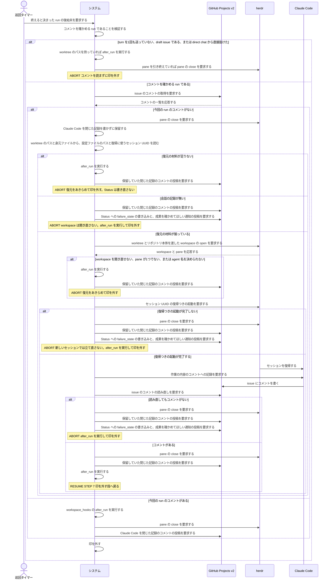
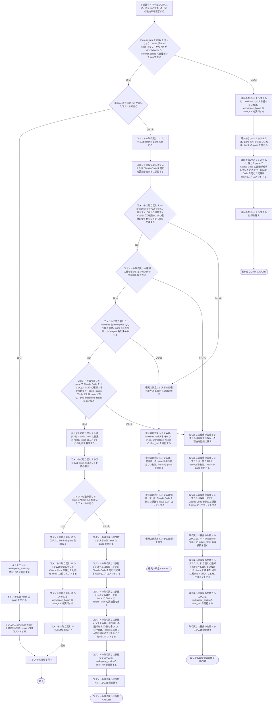

# ユースケース: run を終えて worker を止める

## 根拠資料

- `docs/plans/continuo_design.md#3-25`（表明を transcript から読む。コメントが無かったらセッションを復元して書かせる。9段）
- `docs/plans/continuo_design.md#3-29`（continuo は成果の要約を代筆しない）
- `docs/plans/continuo_design.md#3-3c`（会話の記録が無いセッション UUID へは復帰しない）
- `docs/plans/continuo_design.md#3-80`（herdr が agent を登録していなくても、作業中の hook が届いていれば走っているとみなす）
- `docs/plans/continuo_design.md#3-83f`（人間が direct chat へ引き取っていたら、終わらせる処理をやめる）
- `docs/plans/continuo_design.md#3-85`（pane を閉じるたびに、閉じた記録を書く）
- `docs/plans/continuo_design.md#3-9`（after_run は run の終わりに1回だけ実行する）
- `internal/orchestrator/lifecycle.go` の `finishRunClaimed`、`failRun`、`abandonRunClaimed`、`stopWorker`、`runAfterRunOK`、`postHandoffComment`
- `internal/orchestrator/comment.go` の `ensureAgentComment`、`hasRunComment`、`failCommentRecovery`、`failCommentRecoveryBusy`、`recordRepoWorkspace`、`stoppedWhileRecovering`
- `internal/orchestrator/relay.go` の `settleClosedRecord`、`recordWorkerClosed`
- `internal/orchestrator/transcript.go` の `mayResumeSession`
- `internal/orchestrator/directchat.go` の `abortTerminalForHuman`
- `internal/orchestrator/dispatch.go` の `resolvePane`、`confirmStartup`
- `internal/workspace/prepare.go` の `Prepare`

この記述は [issue を1件処理する.rucm.md](issue%20を1件処理する.rucm.md) から `INCLUDE USE CASE` で引かれる。
**分けた理由は経路の数である。**run を終える段を呼ぶ場所は、あちらの基本フローの終わりと、人間へ渡して終える代替フローの全部である。
1つの記述に書くと、あちらの枝とこちらの枝（`コメントの取り戻し` の5通り）が掛け算になる。

## RUCM

```rucm
USE CASE NAME: run を終えて worker を止める
BRIEF DESCRIPTION: システムは終えると決めた run について、エージェントが成果のコメントを書いたかを確かめる。コメントが無ければ、システムはセッションを復元してエージェントに書かせる。システムは workspace_hooks の after_run を実行し、herdr の pane を閉じ、Claude Code を閉じた記録を書き、印を外す。
PRECONDITION: システムは run を終えると決めている。run は終わらせる処理の印を取っている。人間へ渡して終える run では、システムは failure_state の書き込みと引き渡しの通知を済ませている。run は direct chat に入っていない。
PRIMARY ACTOR: 巡回タイマー
SECONDARY ACTORS: GitHub Projects v2、herdr、Claude Code
DEPENDENCY: なし
GENERALIZATION: なし

BASIC FLOW:
1. 巡回タイマーはシステムに、終えると決まった run の後始末を要求する。
2. システムは VALIDATES THAT run が turn を1回以上送っており、issue が draft issue でなく、かつ run が direct chat から terminal_states へ直接抜けた run でない。
3. システムは VALIDATES THAT issue に今回の run が書いたコメントがある。
4. システムは workspace_hooks の after_run を実行する。
5. システムは herdr の pane を閉じる。
6. システムは Claude Code を閉じた記録を issue に1件コメントする。
7. システムは印を外す。
POSTCONDITION: issue にエージェントが今回の run で書いたコメントが1件以上ある。herdr の pane は閉じている。issue に Claude Code を閉じた記録のコメントが1件増えている。印は外れている。issue の Status が cleanup.on_states に入っていなければ、worktree と branch は残っている。

SPECIFIC ALTERNATIVE FLOW 確かめないrun:
RFS BASIC FLOW 2
1. システムは、worktree のパスを持っていれば、workspace_hooks の after_run を実行する。
2. システムは、pane を引き終えていれば、herdr の pane を閉じる。
3. システムは、閉じた pane で Claude Code の起動が成功していたときだけ、Claude Code を閉じた記録を issue に1件コメントする。
4. システムは印を外す。
5. ABORT
POSTCONDITION: システムは issue のコメントを読んでいない。システムはセッションを復元していない。印は外れている。worktree は残っている。pane を引く前に着手が失敗していた run では、herdr の workspace と pane は開いたまま残る。

SPECIFIC ALTERNATIVE FLOW コメントの取り戻し:
RFS BASIC FLOW 3
1. システムは herdr の pane を閉じる。
2. システムは Claude Code を閉じた記録を書かずに保留する。
3. システムは VALIDATES THAT run が worktree のパスを持ち、身元ファイルから設定ファイルのパスを読め、かつ復帰に使うセッション UUID が決まる。
4. システムは VALIDATES THAT 復帰に使うセッション UUID の会話の記録が在る。
5. システムは VALIDATES THAT worktree を workspace として開き直せ、pane を1つ引け、かつ agent 名を決められる。
6. システムは VALIDATES THAT pane で Claude Code をセッション UUID の復帰つきで起動でき、agent_status が idle または done になり、かつ interactive_ready が真になる。
7. システムは Claude Code に作業の内容の issue のコメントへの記録を要求する。
8. システムは issue のコメントを読み直す。
9. システムは VALIDATES THAT issue に今回の run が書いたコメントがある。
10. システムは herdr の pane を閉じる。
11. システムは保留していた Claude Code を閉じた記録を issue に1件コメントする。
12. システムは workspace_hooks の after_run を実行する。
13. RESUME STEP 7
POSTCONDITION: issue にエージェントが書いたコメントが1件以上ある。turn 数は増えていない。システムは issue の Status を書き直していない。herdr の pane は閉じている。Claude Code を閉じた記録は、取り戻しのあとで pane を閉じたときの1件だけである。

BOUNDED ALTERNATIVE FLOW 復元の断念:
RFS コメントの取り戻し 3,5
1. システムは復元をやめる理由を記録に残す。
2. システムは、worktree のパスを持っていれば、workspace_hooks の after_run を実行する。
3. システムは、開き直した pane を引き終えていれば、herdr の pane を閉じる。
4. システムは保留していた Claude Code を閉じた記録を issue に1件コメントする。
5. システムは印を外す。
6. ABORT
POSTCONDITION: issue にエージェントが書いたコメントがない。システムは issue の Status を書き直していない。issue に人間へ引き渡す通知のコメントは増えていない。システムは Claude Code に本文を1文字も送っていない。印は外れている。worktree は残っている。pane を1つに決められずに復元をやめた場合は、開き直した workspace の pane は開いたまま残る。

BOUNDED ALTERNATIVE FLOW 取り戻しの復帰の失敗:
RFS コメントの取り戻し 4,6
1. システムは復帰できなかった理由を記録に残す。
2. システムは、開き直した pane があれば、herdr の pane を閉じる。
3. システムは保留していた Claude Code を閉じた記録を issue に1件コメントする。
4. システムはボードの issue の Status に failure_state の選択肢を書く。
5. システムは、引き渡しの通知をまだ1件も書いていなければ、issue に成果を人間に確かめてほしいことを1件コメントする。
6. システムは workspace_hooks の after_run を実行する。
7. システムは印を外す。
8. ABORT
POSTCONDITION: issue の Status は failure_state の選択肢である。issue にエージェントが書いたコメントがない。issue に人間へ引き渡す通知のコメントが1件だけある。打ち切りや失敗で先に理由を書いていた場合は、その1件が残り、成果の確認の依頼は書き足さない。着手のときと違って、新しいセッション UUID での立て直しは行わない。システムは Claude Code に本文を1文字も送っていない。herdr の pane は閉じている。印は外れている。worktree は残っている。

SPECIFIC ALTERNATIVE FLOW コメントの取り戻しの失敗:
RFS コメントの取り戻し 9
1. システムは herdr の pane を閉じる。
2. システムは保留していた Claude Code を閉じた記録を issue に1件コメントする。
3. システムはボードの issue の Status に failure_state の選択肢を書く。
4. システムは、引き渡しの通知をまだ1件も書いていなければ、issue に成果を人間に確かめてほしいことを1件コメントする。
5. システムは workspace_hooks の after_run を実行する。
6. システムは印を外す。
7. ABORT
POSTCONDITION: issue の Status は failure_state の選択肢である。issue にエージェントが書いたコメントがない。issue に人間へ引き渡す通知のコメントが1件だけある。打ち切りや失敗で先に理由を書いていた場合は、その1件が残り、成果の確認の依頼は書き足さない。herdr の pane は閉じている。印は外れている。worktree は残っている。
```

## この記述を呼ぶ3つの関数と、その違い

**言いたいこと。**run を終える段は、`internal/orchestrator/lifecycle.go` の3つの関数の後半に、同じ並びで在る。
この記述は、3つに共通する並び（`ensureAgentComment` → `runAfterRun` → `stopWorker` → `release`）を書いている。

| 関数 | いつ呼ばれるか | この記述より前にすること | 共通の並びのほかにすること |
| --- | --- | --- | --- |
| `finishRunClaimed` | 取り直した Status が active_states から外れた。turn 数の上限に達した。権限の確認で止まった | バックグラウンド処理の申告を待つ。人間へ渡すときは failure_state を書き、引き渡しの通知を書く | pane を閉じたあとに失敗の記録を消し、Status を取り直す。`cleanup.on_states` に入っていれば worktree と branch を片付ける |
| `failRun` | 着手の途中の失敗。本文の組み立ての失敗 | failure_state を書き、失敗を数え、引き渡しの通知を書く | なし |
| `abandonRunClaimed`（リトライが尽きた側） | リトライを積む出口で、リトライの回数が `agent.max_retries` に達していた | failure_state を書き、失敗を数え、引き渡しの通知を書く | なし |

**片付けは、この記述には書いていない。**[worktree と branch を片付ける.rucm.md](worktree%20と%20branch%20を片付ける.rucm.md) が受け持つ。
基本フローの事後条件が「cleanup.on_states に入っていなければ」と条件を付けているのは、そのためである。

## 段にしていない分岐

**言いたいこと。**次の分岐は、終わり方も、そのあと通る段も変えないので、段にしていない。

| 何が起きたか | 実装がすること | どこか |
| --- | --- | --- |
| `after_run` が設定されていない。worktree のパスを持っていない。この worktree で既に走らせてある | `after_run` を実行せずに次の段へ進む | `runAfterRunOK` |
| `after_run` が失敗した | 警告を記録に残して次の段へ進む | `runAfterRunOK` |
| pane を閉じ損ねた | 警告を記録に残す。閉じた記録を書かない。保留していた記録も捨てる。印は外す | `stopWorker`、`settleClosedRecord` |
| 閉じようとした pane が既に無かった | 閉じたものとして扱い、閉じた記録を書く | `stopWorker`、`paneAlreadyGone` |
| relay が無効である。issue が draft issue である。担当者がほかのアカウント1人である | 閉じた記録を書かない | `recordWorkerClosed` |
| issue のコメントを読めなかった | 書かれていないものとして扱い、`コメントの取り戻し` へ進む | `hasRunComment` |
| 人間へ渡す2本のフロー（`取り戻しの復帰の失敗`・`コメントの取り戻しの失敗`）の「failure_state を書く」で、取り直した Status が `terminal_states` か `tracker.direct_chat_state` に入っている | Status を書かない。引き渡しの通知からあとの段はそのまま続く（`完了` で終える run の成果の報告が無かった場合がこれである） | `failCommentRecovery`、`protectedStates` |
| 同じ2本のフローの「failure_state を書く」で、Status が既に `failure_state` である（打ち切りや上限で先に落としてある） | 書き込みを省く | `UpdateStatus` |
| コメントに印は付いているが、投稿者が gh の持ち主と違う | 警告を記録に残し、エージェントが書いたものとして数えない | `hasRunComment` |
| 途中経過の報告と計画のコメントしか無い | 成果のコメントとして数えない | `hasRunComment` |
| 記録を要求する指示を herdr へ送れなかった | 警告を記録に残して、コメントを読み直す段へ進む | `ensureAgentComment` |
| 開き直しで親の workspace を新しく開かせた | 親の workspace の ID を身元ファイルへ控える | `recordRepoWorkspace` |

**後始末を途中でやめる分岐が2つある。**どちらも、この記述の代替フローにはしていない。

| 何が起きたか | 実装がすること | どこか |
| --- | --- | --- |
| 人間が issue を direct_chat_state へ動かしていた | 終わらせる処理をやめる。pane を閉じず、印も外さない。入口・引き渡しの通知の直前・コメントを確かめた直後・印を外す直前と、取り戻しの中の5箇所で見る | `abortTerminalForHuman`（設計 3-83f） |
| continuo が止められた（ctx が切れた） | 取り戻しを途中でやめて戻る。pane は期限つきで閉じる。コメントの依頼は次の起動に回す | `stoppedWhileRecovering`、`stopWorker` |

## コメントを確かめない run

**言いたいこと。**成果のコメントを確かめるのは、書かせる材料がある run だけである（代替フロー `確かめないrun`）。

| コメントを確かめない場合 | 理由 |
| --- | --- |
| turn を1回も送っていない | 会話が1つも無いセッションを復元しても、書かせる材料が無い。着手の途中で落ちた run がこれである |
| issue が draft issue である | draft issue にはコメントできない |
| direct chat から `terminal_states` へ直接抜けた run である | 人間が Claude Code を終了させてから動かした出口である。書かせに行くと、終了させたものを立て直すことになる（設計 3-83g） |

**リトライが残っている run も、コメントを確かめない。**その run はこの記述を通らない
（[issue を1件処理する.rucm.md](issue%20を1件処理する.rucm.md) のリトライを積む出口が、after_run と pane を閉じる段を自分で持つ）。

## コメントの取り戻しの復帰は、立て直さずに人間へ渡す

**言いたいこと。**`コメントの取り戻し` も `--resume` で復帰するが、**着手と違って
新しいセッション UUID では立て直さない。**復帰できなければ `failure_state` へ落とす
（代替フロー `取り戻しの復帰の失敗`）。

**同じ原因で助からない。**着手の `復帰の失敗` を起こすのは「`~/.claude/projects/` の
セッションが消えている」ことであり、**取り戻しは同じセッションへ戻ろうとする。**
`internal/orchestrator/comment.go` の `ensureAgentComment` は、次の4つのどれでも人間へ渡す。

| 何が起きたか | 分岐元の段 | 呼ぶ関数 |
| --- | --- | --- |
| 復帰に使うセッション UUID の会話の記録が無い（`mayResumeSession` が偽） | 会話の記録が在るかを見る | `failCommentRecovery` |
| `agent.start` が失敗した | 復帰つきの起動の完了を見る | `failCommentRecovery` |
| 起動の確認が落ち着かなかった | 復帰つきの起動の完了を見る | `failCommentRecovery` |
| 復元した Claude Code が既に走っていた（`ErrStartupBusy`） | 復帰つきの起動の完了を見る | `failCommentRecoveryBusy`（通知の文面だけが違う） |

**会話の記録が無いときは、workspace を開き直さない。**検査は身元ファイルを読んだ直後にあり、
`Prepare` より前である。だから `取り戻しの復帰の失敗` の「pane を閉じる」の段は「開き直した pane があれば」と書いてある。

**立て直さないのは、立て直しても書かせるものが無いからである。**新しいセッションには会話が
1つも無く、**continuo は成果の要約を代筆しない**（設計 3-25 / 3-29）。だから人間へ
「worktree の中身と `git log` を見て確かめてほしい」と渡す。

**渡し方は issue へのコメント1件である。**`failCommentRecovery` は **pane を閉じ、Status を
`failure_state` へ落としてから**、`postHandoffComment` でその1件を書く（この順である）。
**そのあと呼び出し側へ戻り、`after_run` を実行してから印を外す。**
**通知は1つの run につき1件だけ書ける**（`takeHandoffPost`）。

**打ち切りから来た場合は、この経路が通知を書き足さない。**リトライが尽きた run は
`abandonRunClaimed` が打ち切りの理由で通知の枠を取ってから、この記述へ入る。
**枠は1件しか無いので、`postHandoffComment` は2件目を投稿せずにログへ落とす。**
だから2本の失敗のフローの段は「まだ1件も書いていなければ」と条件を付けてあり、
事後条件も「1件だけある」と書いてある。**この並びを崩すと、stall で打ち切った本当の理由が
issue に1文字も残らない**（`test/internal/orchestrator/audit_fixes_test.go` の
`Test_issueを1件処理する_P014_打ち切りのときissueに残る理由が本当の理由である` がそれを確かめている）。

## 復元をあきらめる経路は、人間へ渡さない

**言いたいこと。**復元の材料が足りないときは、`failure_state` へ落とし直さずに、後始末を続ける（代替フロー `復元の断念`）。
`ensureAgentComment` は警告を1行出して戻り、呼び出し側が `after_run` を実行して印を外す。**Status は書き直さず、通知も書かない。**

| 分岐元の段 | 何が起きたか | pane |
| --- | --- | --- |
| 身元ファイルを読めるかを見る | run が worktree のパスを持っていない | 開き直していない |
| 身元ファイルを読めるかを見る | 身元ファイルを読めない。設定ファイルのパスが空である。復帰に使うセッション UUID が run にも身元ファイルにも無い | 開き直していない |
| workspace を開き直せるかを見る | `Prepare` が失敗した | 開き直していない |
| workspace を開き直せるかを見る | workspace の pane が1つでない。`pane.list` が失敗した | **開き直した pane は閉じない**（run が pane の ID を控える前に戻る） |
| workspace を開き直せるかを見る | agent 名を決められない | 引き終えた pane を、呼び出し側の `stopWorker` が閉じる |

**保留していた閉じた記録は、閉じる pane が無くても書く**（`stopWorker` が `settleClosedRecord` を呼ぶ）。
最初の閉じ方で止めた Claude Code はもう動いていないので、書かないと境目が前の run に残る。

## 「workspace として開き直す」の段

**`worktree.open` を自分で呼ばず、着手と同じ `Prepare` を通す。**`cwd` にリポジトリ本体を渡さないと herdr が断り、
その clone の場所を知っているのは `Prepare` だけである。同じリポジトリ本体で statusline取得用の workspace が開いていれば、
着手のときと同じく、閉じるのを待ってから開く（設計 3-4c。`internal/workspace/serial.go` の `run`）。

## シーケンス図



## フローチャート


