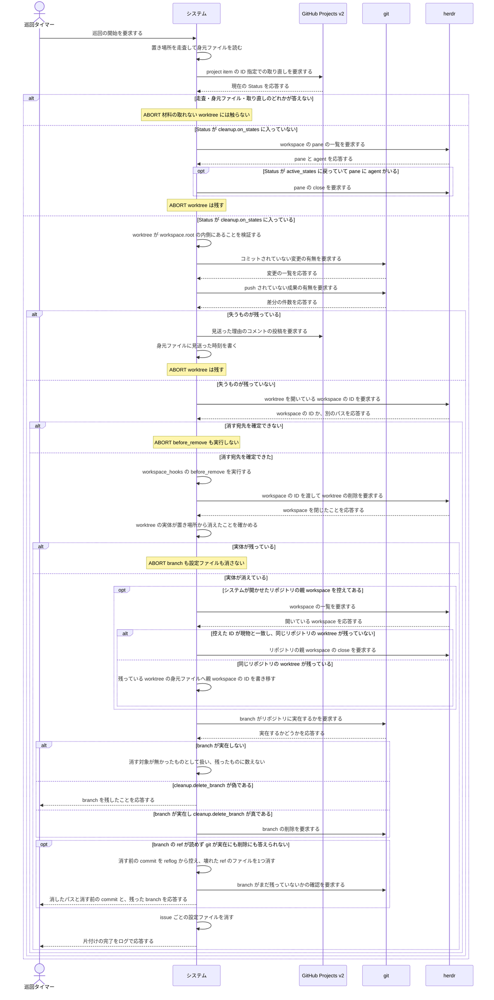

# ユースケース: worktree と branch を片付ける

## 根拠資料

- `docs/plans/continuo_design.md#3-9`（後始末の手順0 から手順7b）
- `docs/plans/continuo_design.md#3-18`（身元ファイル。片付けを見送った時刻）
- `docs/plans/continuo_design.md#3-20`（worktree が置き場所の内側にあることを検査する）
- `docs/plans/continuo_design.md#3-22`（worktree の置き場所は gwq の規則に合わせる）
- `docs/plans/continuo_design.md#4-1`（worktree を消す契機は Done だけにする）
- `docs/plans/continuo_design.md#8-1`（branch を消す。仕様は workspace のディレクトリだけを消す）
- `internal/workspace/cleanup.go` の `ShouldCleanup`、`Cleanup`、`effectiveBase`、`resolveWorkspaceID`、`deletableBranch`、`removeWorktree`、`removeWorktreeByHand`
- `internal/workspace/git.go` の `gitBranchExists`
- `internal/workspace/sweep.go` と `internal/workspace/scan.go`
- `internal/orchestrator/reconcile.go` の `reconcileWorktrees`、`closeOrphanPane`
- `internal/orchestrator/lifecycle.go` の `cleanupWorktree`、`cleanupPath`

## RUCM

```rucm
USE CASE NAME: worktree と branch を片付ける
BRIEF DESCRIPTION: 巡回タイマーが巡回を起こす。システムは worktree の身元ファイルを読み、ボードの Status をまとめて取り直す。システムは Status が cleanup.on_states に入った worktree について、失うものが残っていないことを確かめてから worktree と branch と設定ファイルを消す。
PRECONDITION: システムは常駐している。worktree の置き場所に身元ファイルを持つ worktree が1つ以上ある。利用者はボードの issue の Status を cleanup.on_states の選択肢へ動かしている。設定の cleanup.enabled は true である。
PRIMARY ACTOR: 巡回タイマー
SECONDARY ACTORS: GitHub Projects v2、herdr、git
DEPENDENCY: なし
GENERALIZATION: なし

BASIC FLOW:
1. 巡回タイマーはシステムに巡回の開始を要求する。
2. システムは VALIDATES THAT worktree の置き場所を走査できる。
3. システムは VALIDATES THAT worktree の中の身元ファイルを読める。
4. システムは VALIDATES THAT ボードを project item の ID 指定でまとめて取り直せる。
5. システムは VALIDATES THAT 取り直した Status が cleanup.on_states に入っている。
6. システムは VALIDATES THAT worktree が workspace.root の内側にある。
7. システムは VALIDATES THAT worktree にコミットされていない変更がなく、その判定ができている。
8. システムは VALIDATES THAT branch に push されていない成果がなく、その判定ができている。
9. システムは VALIDATES THAT worktree を消す宛先の herdr workspace を確定できる。
10. システムは workspace_hooks の before_remove を実行する。
11. システムは herdr に workspace の ID を渡して worktree の削除を要求し、実体が残っていれば worktree のディレクトリを消し、実体の無い登録がその1件だけであれば git の worktree の登録を掃除する。
12. システムは VALIDATES THAT worktree の実体が置き場所から消えている。
13. IF システムが開かせたリポジトリの親 workspace が身元ファイルに控えてある THEN
14.   システムは herdr に workspace の一覧を要求する。
15.   IF 控えた ID の workspace がそのリポジトリ本体を開いている THEN
16.     IF 同じリポジトリの worktree の workspace が1つも残っていない THEN
17.       システムは herdr にリポジトリの親 workspace を閉じることを要求する。
18.     ELSE
19.       システムは同じリポジトリの残っている worktree のうち、置き場所の内側にあって身元ファイルを読めて親 workspace の ID をまだ持っていないものすべてへ、その ID を書き移す。
20.     ENDIF
21.   ENDIF
22. ENDIF
23. IF 身元ファイルに書かれた branch がリポジトリに実在しない THEN
24.   システムは branch を消す対象が無かったものとして扱い、残ったものに数えない。
25. ELSEIF 設定の cleanup.delete_branch が偽である THEN
26.   システムは branch を残し、残ったものとして利用者に伝える。
27. ELSE
28.   システムはリポジトリ側の worktree の一覧で branch の現物を確かめ、git に branch の削除を要求する。
29. ENDIF
30. システムは issue ごとの Claude Code の設定ファイルを消す。
31. システムは利用者に片付けの完了をログで応答する。
POSTCONDITION: worktree は置き場所に無い。branch は、設定の cleanup.delete_branch が真であれば無い（元から無かった場合を含む）。偽であれば残っており、残ったものとして利用者に伝えている。herdr の workspace は閉じている。システムが開かせたリポジトリの親 workspace は、同じリポジトリの worktree が残っていなければ閉じている。残っていた場合は、その worktree の身元ファイルが親 workspace の ID を持っている。人間が開いたリポジトリの workspace は開いたままである。issue ごとの Claude Code の設定ファイルは無い。issue の Status は変わっていない。印の集合は変わっていない。

BOUNDED ALTERNATIVE FLOW 材料を取れない:
RFS BASIC FLOW 2,3,4
1. システムは材料を取れなかった worktree を消さない。
2. システムは利用者に材料を取れない理由をログで応答する。
3. ABORT
POSTCONDITION: worktree は残っている。branch は残っている。issue にコメントは増えていない。身元ファイルは書き換えられていない。次の巡回が同じ worktree をもう一度調べられる。

SPECIFIC ALTERNATIVE FLOW 片付けの対象外:
RFS BASIC FLOW 5
1. システムは worktree を残す。
2. システムは herdr に workspace の pane の一覧を要求する。
3. IF Status が active_states に入っていて pane に agent がいる THEN
4.   システムは herdr の pane を閉じる。
5. ENDIF
6. ABORT
POSTCONDITION: worktree は残っている。branch は残っている。issue の Status は変わっていない。active_states に戻った worktree の pane は閉じている。

SPECIFIC ALTERNATIVE FLOW 置き場所の外:
RFS BASIC FLOW 6
1. システムは worktree を1つも消さない。
2. システムは利用者に封じ込め検査の失敗をログで応答する。
3. ABORT
POSTCONDITION: worktree は残っている。branch は残っている。置き場所の外のディレクトリは1つも消えていない。

SPECIFIC ALTERNATIVE FLOW 未コミットの変更:
RFS BASIC FLOW 7
1. システムは worktree を消さない。
2. システムは issue に片付けを見送った理由を1件コメントする。
3. システムは身元ファイルに片付けを見送った時刻を書く。
4. ABORT
POSTCONDITION: worktree は残っている。branch は残っている。issue に片付けを見送った理由のコメントが1件ある。身元ファイルに片付けを見送った時刻がある。

SPECIFIC ALTERNATIVE FLOW 未pushの成果:
RFS BASIC FLOW 8
1. システムは worktree を消さない。
2. システムは issue に片付けを見送った理由を1件コメントする。
3. システムは身元ファイルに片付けを見送った時刻を書く。
4. ABORT
POSTCONDITION: worktree は残っている。branch は残っている。issue に片付けを見送った理由のコメントが1件ある。次の巡回では同じ理由のコメントが増えない。

SPECIFIC ALTERNATIVE FLOW 宛先が定まらない:
RFS BASIC FLOW 9
1. システムは worktree を消さない。
2. システムは workspace_hooks の before_remove を実行しない。
3. システムは利用者に宛先が定まらない理由をログで応答する。
4. ABORT
POSTCONDITION: worktree は残っている。branch は残っている。before_remove は実行していない。herdr の workspace は1つも閉じていない。issue ごとの Claude Code の設定ファイルは残っている。

SPECIFIC ALTERNATIVE FLOW 消せないworktree:
RFS BASIC FLOW 12
1. システムは branch の削除を要求しない。
2. システムは issue ごとの Claude Code の設定ファイルを消さない。
3. システムは利用者に worktree を消せない理由をログで応答する。
4. ABORT
POSTCONDITION: worktree は消し切れずに残っている。branch は残っている。issue ごとの Claude Code の設定ファイルは残っている。workspace_hooks の before_remove は実行済みである。リポジトリの親 workspace は閉じていない。

GLOBAL ALTERNATIVE FLOW 壊れたref:
BRANCH FROM BASIC FLOW 23
WHEN branch の ref が読めず git が branch の実在にも削除にも答えられない場合
1. システムは VALIDATES THAT 壊れた ref が branch_template の接頭辞で始まり refs/heads の下の通常のファイルであり中身が ref として読めない。
2. システムは壊れた ref のファイルを1つ消す。
3. システムは消したファイルのパスと消す前の commit と消した理由を利用者に応答する。
4. システムは VALIDATES THAT 消したあとに branch が残っていない。
5. システムは branch の始末の結果を利用者に応答する。
6. RESUME STEP 30
POSTCONDITION: branch は無い。壊れた ref のファイルは消えている。packed-refs は書き換えていない。

SPECIFIC ALTERNATIVE FLOW 消さないref:
RFS 壊れたref 1
1. システムは branch を残す。
2. RESUME STEP 5
POSTCONDITION: branch は残っている。ref のファイルは1バイトも消えていない。worktree は置き場所に無い。

SPECIFIC ALTERNATIVE FLOW 生き返ったref:
RFS 壊れたref 4
1. システムは branch をもう一度消すことを要求する。
2. システムは残った branch を利用者に応答する。
3. RESUME STEP 6
POSTCONDITION: 壊れた ref のファイルは消えている。branch が残ったなら、残ったものとして利用者に伝えている。

GLOBAL ALTERNATIVE FLOW 片付けの無効:
BRANCH FROM BASIC FLOW 5
WHEN 設定の cleanup.enabled が false である場合
1. システムは片付けを1つも行わない。
2. システムは issue にコメントを書かない。
3. システムは利用者に片付けを行わないことをログで応答する。
4. ABORT
POSTCONDITION: worktree は残っている。branch は残っている。issue にコメントは増えていない。
```

## 失うものがあるかを2つの検査で見る

**手順7 と手順8 は両方通す**（設計 3-9）。片方だけでは失うものを見落とす。

| 検査 | 何を見るか | 消してよい条件 |
| --- | --- | --- |
| コミットされていない変更 | `git status --porcelain` の出力 | 出力が空である。未追跡のファイルも数に入れる |
| push されていない成果（upstream がある） | `git rev-list --count @{u}..HEAD` | 出力が 0 である |
| push されていない成果（upstream が無い） | base からの差分 | 差分が無い |

**git が答えられないときは「消してよい」に丸めない。**worktree の `.git` が壊れていると
`git -C <worktree> …` は1つも通らない（issue #23）。**そのときは判定できなかったことを
見送りの理由に積む。**エラーとして投げ返すと、`continuo abandon` が worktree の中身を
1行も見せられなくなる。

## 材料が揃わない巡回では、その worktree に触らない

**言いたいこと。**置き場所を走査できない・身元ファイルを読めない・ボードを取り直せない
のどれかが起きたら、**その worktree について何も決めない。**消さないし、issue にも書かない。

**採る扱い。**3つとも同じ終わり方（ログに理由を出して止まる）なので、
`BOUNDED ALTERNATIVE FLOW 材料を取れない` 1本にまとめる。

| 何が取れないか | 実装がどうするか |
| --- | --- |
| 置き場所（ステップ2） | 巡回のその回は worktree を1つも見ない |
| 身元ファイル（ステップ3） | その worktree だけを飛ばし、ほかは見る |
| ボードの Status（ステップ4） | 巡回のその回は片付けを1つも行わない |

**見送りのコメントを issue へ書かない。**書く相手（issue）が分からない場合が混ざっており、
**次の巡回で材料が揃えば、そのまま片付けへ進める。**同じ理由のコメントを毎巡回積むだけになる。

## 宛先が定まらないうちは before_remove も撃たない

**言いたいこと。**消す相手の herdr workspace を確定できないまま `before_remove` を実行すると、
**利用者のフックだけが走って worktree は残る。**確定を先、フックを後にする（ステップ9 → ステップ10）。

**止まる条件は2つある。**

| 条件 | なぜ止まるか |
| --- | --- |
| `create_via_herdr` が真なのに herdr のクライアントが無い | 消す手段そのものが無い |
| herdr が**別のパス**の worktree を答えた | 無関係の workspace を消しに行くことになる |

**「答えが無い」は止まる理由にしない。**`worktree.open` が断ったときと workspace の ID が
空だったときは `workspace.list` で探し直し、それでも見つからなければ**実体だけを片付ける**
（herdr workspace は残ったものとして人間へ出す）。

## worktree の実体が残ったまま先へ進まない

**言いたいこと。**`git worktree remove` も herdr の `worktree.remove` も自分の `os.RemoveAll` も
通らなかったとき、**そのまま branch と設定ファイルを消すと、中身のある worktree だけが取り残される。**

**採る扱い。**ステップ12 で実体が消えたことを確かめ、消えていなければ止まる。
**branch の削除も設定ファイルの削除も要求しない。**`before_remove` は既に走っているので、
そのことを人間へ言う。

**「要求が通った」を「消えた」と読み替えない。**herdr も git も「消した」と答えて
消えていないことがある（実測: 2026-08-25）ので、**実体を自分で見て決める。**

## 消せなかったときに、消せる分まで諦めない

**言いたいこと。**`git worktree remove` は、worktree の `.git` が壊れていると
`validation failed, cannot remove working tree` で必ず断る（実測: 2026-08-25）。
**断られたまま終わると、その worktree だけが永久に残る。**

**採る扱い。**要求が断られたときと、**断られていないのに実体が残っているとき**は、
worktree のディレクトリを自分で消し、残った herdr workspace を `workspace.close` で閉じる
（ステップ11）。
**消えたかどうかは必ず自分で確かめる。**herdr も git も「消した」と答えて消えていないことがある。

**`git worktree prune` は、実体の無い登録がその1件だけのときにしか撃たない。**
prune はリポジトリ全体に効くので、**利用者がディレクトリごと移した worktree の登録も
一緒に落とす。**落とされた側の branch は git に守られなくなり、あとの `git branch -D` が
通ってしまう。ほかにもあるなら撃たず、**登録が残ったことと、掃除するコマンドを画面へ出す。**

**リポジトリを検算できないときは branch に触らない。**clone を人間が移した・消した環境では、
どの branch を消してよいかを確かめる手立てが無い。**worktree のディレクトリと
herdr workspace はリポジトリを知らなくても消せる**ので、そこまではやって、残したものを言う。

## 壊れた ref は branch の削除では消えない

**言いたいこと。**`refs/heads/<branch>` のファイルが読めない状態になっていると、
`git branch -D` は `error: branch '<名前>' not found` で断る。**その branch は誰にも消せない。**
そこで GLOBAL ALTERNATIVE FLOW `壊れたref` が、ファイルとして消す経路を持つ（設計 [3-22b](../../../plans/continuo_design.md)）。

**消してよい条件は設計 3-22b にある5つで、全部を満たすときだけ消す。**
とくに `herdr.worktree.branch_template` から作った接頭辞で始まる名前だけを対象にし、
**packed-refs は1バイトも触らない。**

**壊れた ref を「実在しない」と読み替えてはならない。**ステップ23 の実在の検査
（`git show-ref --verify --quiet refs/heads/<名前>`）は、**壊れた ref にも
終了コード 1 を返す**（実測: 2026-08-25、git 2.50.1）。**そこを「元から無かった」に
丸めると、壊れた ref のファイルが誰にも消されないまま残る。**そこで実在の検査が
「無い」と答えたときは、**壊れた ref かどうかを先に見てから**答えを決める。

**ref が壊れていると、branch の検算そのものが答えを出せない。**
`git worktree list --porcelain` はその worktree について
`HEAD 0000000000000000000000000000000000000000` の行だけを出し、`branch` の行も
`detached` の行も出さない（実測: 2026-08-25）。**そこで「git が branch を1つも答えず、
detached でもない」ときに限り、壊れた ref の判定を検算の答えの代わりに使う。**
**detached HEAD の worktree でも branch 名は空になる**ので、そこを混ぜない。
**そのうえで `<共通ディレクトリ>/worktrees/<名前>/HEAD` の symref を直接読み**、
その worktree が本当にその branch を指していることを確かめる。

**消す前に、指していた commit を控える。**`<共通ディレクトリ>/logs/refs/heads/<branch>` の
最後の行に、最後の SHA がそのまま残っている。**読めたら、戻せるコマンドを利用者に伝える。**

**ファイルを消しただけでは branch が消えたことにならない。**その branch が packed-refs にも
載っていると、loose を消した瞬間に packed 側が生き返る。**消したあとに存在を確かめ直し、
生き返っていたら消し直す。**消し切れなければ「片付けた」とは言わず、残ったものとして伝える。

## リポジトリの親 workspace を閉じる条件

**`worktree.open` は herdr の workspace を2つ開く**（issue #19）。worktree のぶんと、
`cwd` に渡したリポジトリのぶん（**リポジトリの親 workspace**）である。
**`worktree.remove` は後者を閉じない**ので、閉じるのは continuo の仕事になる。

**`cwd` を外す案は採れない。**herdr が `worktree_not_found` で断る（実測: 2026-08-25、
[test/live/herdr_test.go](test/live/herdr_test.go)）。`cwd` に worktree のパスを渡す案も
`linked_worktree_source` で断られる。**親は herdr の必須の親である。**

**閉じてよい条件は2つあり、両方満たすときだけ閉じる**（ステップ13〜22）。

| 条件 | 落とすと何が起きるか |
| --- | --- |
| continuo がその親を開かせたこと | 人間が自分で開いた workspace を閉じ、その人の pane が消える |
| 同じリポジトリの worktree の workspace が1つも残っていないこと | 別の issue が使っている pane が消える |

**2つ目が要るのは、親を閉じると配下の worktree の workspace と pane も一緒に消えるからである**
（実測: 2026-08-25）。1つ目の判定は身元ファイルの `herdr_repo_workspace_id` で持つ。
**その値は herdr の現物と突き合わせてから使う**（worktree の直下にあり、エージェントが
書き換えられるため）。

## 閉じずに残したら、閉じる責任を残った worktree へ渡す

**言いたいこと。**閉じずに残したまま自分の身元ファイルを消すと、**その親 workspace は
誰にも閉じられない。**残っている worktree の身元ファイルへ ID を書き移す（ステップ19）。

**何が問題だったか。**リポジトリの親を控えるのは、**それを最初に開かせた1つの issue だけ**
である（2件目以降は「自分より先からあった」と見て空文字を書く）。その1件が先に片付くと、
ID はどこにも残らない。`agent.max_concurrent_agents` の既定は2なので、
**同じリポジトリの issue を2件並行して走らせれば、ふつうに起きる。**
issue #19 で直したはずの「issue 1件につき1つ溜まる」が、並行実行のときだけ元に戻る。

**採る扱い。**

| 何を | どうするか |
| --- | --- |
| 渡す相手 | 同じリポジトリに属し、**置き場所の内側にあって身元ファイルを読める** worktree の**全部** |
| 既に ID を持っている worktree | **上書きしない**（別のリポジトリの親を閉じにいく身元ファイルを作らないため） |
| 1件も渡せなかったとき | 手で閉じてほしいことをログに残す |

**1つだけに渡さない。**渡した先の片付けが途中で落ちれば、そこで責任が消える。
**全部が持っていれば、最後に片付いた1つが閉じる**（それより前の片付けは
「まだ他の worktree がある」ので閉じずに書き直すだけである）。

## `cleanup.delete_branch` が偽なら1本も消さない

**言いたいこと。**設定で「branch は消すな」と言われているなら、片付けも起動時の掃除も
**1本も消さない。**壊れた ref だけは消す、という例外も作らない。

| どの経路が消しうるか | 設定が偽のときどうするか |
| --- | --- |
| 片付け（ステップ23〜29） | 消さずに、残ったものとして利用者に伝える |
| 起動時の孤児 branch の掃除 | **1本も消さない。**壊れた ref も消さない |

**なぜ起動時の掃除にも要るか。**片付けが残した branch は、(1) 接頭辞に一致し
(2) どの worktree も出しておらず (3) 実行中の run も無いので、**掃除の3条件を全部満たす。**
設定を見ない掃除は、**次に continuo を起動しただけでその branch を強制削除で消す。**
`continuo abandon --force` で片付けた worktree の branch には未 push の commit が
載っていることがあり、消えれば reflog を掘る以外に戻す手立てが無い。

**起動時の掃除の手順は
[再起動して実行中の issue を引き継ぐ.rucm.md](%E5%86%8D%E8%B5%B7%E5%8B%95%E3%81%97%E3%81%A6%E5%AE%9F%E8%A1%8C%E4%B8%AD%E3%81%AE%20issue%20%E3%82%92%E5%BC%95%E3%81%8D%E7%B6%99%E3%81%90.rucm.md)
にある**（起動の手順の一部であり、巡回の片付けとは契機が違う）。

## 実在しない branch を「残っている」と言わない

**言いたいこと。**着手が `git worktree add` で失敗し続けると、**ディレクトリだけが残って
branch は1度も作られない。**そこを片付けたとき「branch が残っています」と出すと、
**利用者は存在しないものを探して消しに行く**（issue #27）。

**採る扱い。**`git branch -D` に渡す前に `git show-ref --verify refs/heads/<名前>` で
**実在するかを見る**（ステップ23）。

| 実在するか | どうするか |
| --- | --- |
| 実在しない | **残ったものに数えない。**画面にも出さない（消す対象が無かっただけである） |
| 実在する | いままでどおり現物と突き合わせ、消せなければ理由を出す |
| **確かめられない**（リポジトリを名指しできない・git が答えない） | **「無い」とは言わない。**いままでどおり残ったものとして出す |
| **ref が壊れている** | **「無い」とは言わない。**壊れた ref のファイルとして片付ける（上の節） |

**`cleanup.delete_branch` が false でも同じである。**設定で消さないことにしていても、
**元から無いものを「残っています」と言う理由は無い。**

## 片付けが始まる契機は3つある

| 契機 | 誰が起こすか | 参照 |
| --- | --- | --- |
| turn が終わって Status が cleanup.on_states になっていた | システム | 設計 3-9 の手順1 |
| 巡回で worktree の身元ファイルを照合した | システム | 設計 3-9 の手順7 |
| 起動時の掃除で cleanup.on_states の issue を取った | システム | 設計 3-9 の手順6 |

## フローチャート

```mermaid
flowchart TD
    B1["1. 巡回タイマーが巡回の開始を要求する"]
    B2{"2. VALIDATES THAT 置き場所を走査できる"}
    B3{"3. VALIDATES THAT 身元ファイルを読める"}
    B4{"4. VALIDATES THAT ボードを ID 指定でまとめて取り直せる"}
    B5{"5. VALIDATES THAT Status が cleanup.on_states に入っている"}
    B6{"6. VALIDATES THAT worktree が workspace.root の内側にある"}
    B7{"7. VALIDATES THAT コミットされていない変更がなく判定ができている"}
    B8{"8. VALIDATES THAT push されていない成果がなく判定ができている"}
    B9{"9. VALIDATES THAT 消す宛先の herdr workspace を確定できる"}
    B10["10. workspace_hooks の before_remove を実行する"]
    B11["11. worktree の削除を要求し残っていれば自分で消し登録がその1件だけなら掃除する"]
    B12{"12. VALIDATES THAT worktree の実体が置き場所から消えている"}
    B13{"13. IF 開かせた親 workspace を控えてある"}
    B14["14. workspace の一覧を要求する"]
    B15{"15. IF 控えた ID が現物と一致する"}
    B16{"16. IF 同じリポジトリの worktree が残っていない"}
    B17["17. リポジトリの親 workspace を閉じることを要求する"]
    B18["18. ELSE"]
    B19["19. 残っている worktree の身元ファイルへ親 workspace の ID を書き移す"]
    B20["20. ENDIF"]
    B21["21. ENDIF"]
    B22["22. ENDIF"]
    B23{"23. IF 身元ファイルの branch がリポジトリに実在しない"}
    B24["24. 消す対象が無かったものとして扱い残ったものに数えない"]
    B25{"25. ELSEIF cleanup.delete_branch が偽である"}
    B26["26. branch を残し残ったものとして伝える"]
    B27["27. ELSE"]
    B28["28. リポジトリ側で branch の現物を確かめて削除を要求する"]
    B29["29. ENDIF"]
    B30["30. issue ごとの設定ファイルを消す"]
    B31["31. 片付けの完了をログで応答する"]
    BPOST(["POSTCONDITION worktree が無く branch は設定どおりに始末されている"])

    B1 --> B2
    B2 -- 偽 --> N1S1
    B2 -- 真 --> B3
    B3 -- 偽 --> N1S1
    B3 -- 真 --> B4
    B4 -- 偽 --> N1S1
    B4 -- 真 --> B5
    B5 -- 偽 --> F1S1
    B5 -- 真 --> B6
    B6 -- 偽 --> F2S1
    B6 -- 真 --> B7
    B7 -- 偽 --> F3S1
    B7 -- 真 --> B8
    B8 -- 偽 --> F4S1
    B8 -- 真 --> B9
    B9 -- 偽 --> F7S1
    B9 -- 真 --> B10 --> B11 --> B12
    B12 -- 偽 --> F8S1
    B12 -- 真 --> B13
    B13 -- 偽 --> B22
    B13 -- 真 --> B14 --> B15
    B15 -- 偽 --> B21
    B15 -- 真 --> B16
    B16 -- 真 --> B17 --> B20
    B16 -- 偽 --> B18 --> B19 --> B20
    B20 --> B21
    B21 --> B22
    B22 --> B23
    B23 -- 真 --> B24 --> B29
    B23 -- 偽 --> B25
    B25 -- 真 --> B26 --> B29
    B25 -- 偽 --> B27 --> B28 --> B29
    B29 --> B30 --> B31 --> BPOST
    B5 -. "片付けの無効: WHEN cleanup.enabled が false の場合" .-> G1S1
    B23 -. "壊れたref: WHEN ref が読めず branch の実在にも削除にも答えられない場合" .-> G2S1

    subgraph BND1 ["BOUNDED ALTERNATIVE FLOW 材料を取れない / RFS BASIC FLOW 2,3,4"]
        N1S1["1. 材料を取れなかった worktree を消さない"] --> N1S2["2. 材料を取れない理由をログで応答する"] --> N1S3["3. ABORT"]
    end

    subgraph SAF1 ["SPECIFIC ALTERNATIVE FLOW 片付けの対象外 / RFS BASIC FLOW 5"]
        F1S1["1. worktree を残す"] --> F1S2["2. workspace の pane の一覧を要求する"] --> F1S3{"3. IF active_states に戻っていて pane に agent がいる"}
        F1S3 -- 真 --> F1S4["4. pane を閉じる"] --> F1S5["5. ENDIF"]
        F1S3 -- 偽 --> F1S5
        F1S5 --> F1S6["6. ABORT"]
    end

    subgraph SAF2 ["SPECIFIC ALTERNATIVE FLOW 置き場所の外 / RFS BASIC FLOW 6"]
        F2S1["1. worktree を1つも消さない"] --> F2S2["2. 封じ込め検査の失敗をログで応答する"] --> F2S3["3. ABORT"]
    end

    subgraph SAF3 ["SPECIFIC ALTERNATIVE FLOW 未コミットの変更 / RFS BASIC FLOW 7"]
        F3S1["1. worktree を消さない"] --> F3S2["2. 見送った理由を1件コメントする"] --> F3S3["3. 身元ファイルに見送った時刻を書く"] --> F3S4["4. ABORT"]
    end

    subgraph SAF4 ["SPECIFIC ALTERNATIVE FLOW 未pushの成果 / RFS BASIC FLOW 8"]
        F4S1["1. worktree を消さない"] --> F4S2["2. 見送った理由を1件コメントする"] --> F4S3["3. 身元ファイルに見送った時刻を書く"] --> F4S4["4. ABORT"]
    end

    subgraph SAF7 ["SPECIFIC ALTERNATIVE FLOW 宛先が定まらない / RFS BASIC FLOW 9"]
        F7S1["1. worktree を消さない"] --> F7S2["2. before_remove を実行しない"] --> F7S3["3. 宛先が定まらない理由をログで応答する"] --> F7S4["4. ABORT"]
    end

    subgraph SAF8 ["SPECIFIC ALTERNATIVE FLOW 消せないworktree / RFS BASIC FLOW 12"]
        F8S1["1. branch の削除を要求しない"] --> F8S2["2. issue ごとの設定ファイルを消さない"] --> F8S3["3. worktree を消せない理由をログで応答する"] --> F8S4["4. ABORT"]
    end

    subgraph GAF1 ["GLOBAL ALTERNATIVE FLOW 片付けの無効 / BRANCH FROM BASIC FLOW 5"]
        G1S1["1. 片付けを1つも行わない"] --> G1S2["2. issue にコメントを書かない"] --> G1S3["3. 片付けを行わないことをログで応答する"] --> G1S4["4. ABORT"]
    end

    subgraph GAF2 ["GLOBAL ALTERNATIVE FLOW 壊れたref / BRANCH FROM BASIC FLOW 23"]
        G2S1{"1. VALIDATES THAT continuo の接頭辞で始まる refs/heads の下の通常のファイルで中身が読めない"}
        G2S1 -- 真 --> G2S2["2. 壊れた ref のファイルを1つ消す"] --> G2S3["3. 消したパスと消す前の commit と理由を応答する"] --> G2S4{"4. VALIDATES THAT 消したあとに branch が残っていない"}
        G2S4 -- 真 --> G2S5["5. branch の始末の結果を応答する"] --> G2S6["6. RESUME STEP 30"]
    end

    subgraph SAF5 ["SPECIFIC ALTERNATIVE FLOW 消さないref / RFS 壊れたref 1"]
        F5S1["1. branch を残す"] --> F5S2["2. RESUME STEP 5"]
    end

    subgraph SAF6 ["SPECIFIC ALTERNATIVE FLOW 生き返ったref / RFS 壊れたref 4"]
        F6S1["1. branch をもう一度消すことを要求する"] --> F6S2["2. 残った branch を応答する"] --> F6S3["3. RESUME STEP 6"]
    end

    G2S1 -- 偽 --> F5S1
    F5S2 --> G2S5
    G2S4 -- 偽 --> F6S1
    F6S3 --> G2S6
    G2S6 --> B30
```



## シーケンス図


