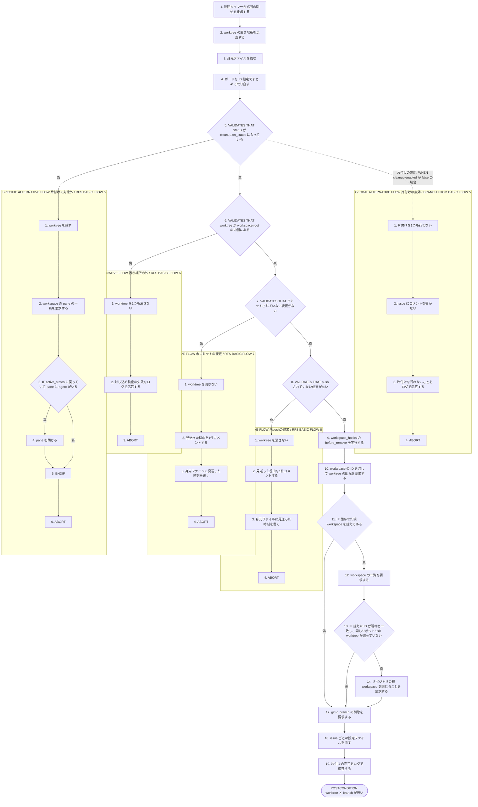
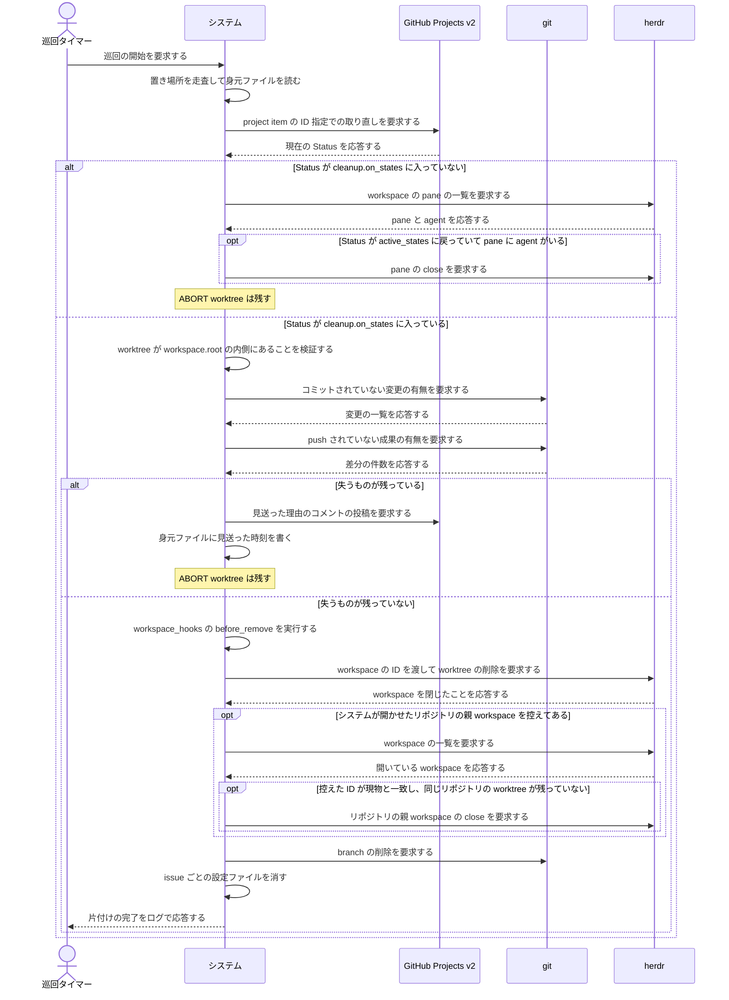

<!-- 目的: Status が cleanup.on_states に入った issue の worktree と branch を continuo が片付けるまでを RUCM で定義する -->

# ユースケース: worktree と branch を片付ける

## 根拠資料

- `docs/plans/continuo_design.md#3-9`（後始末の手順0 から手順7b）
- `docs/plans/continuo_design.md#3-18`（身元ファイル。片付けを見送った時刻）
- `docs/plans/continuo_design.md#3-20`（worktree が置き場所の内側にあることを検査する）
- `docs/plans/continuo_design.md#3-22`（worktree の置き場所は gwq の規則に合わせる）
- `docs/plans/continuo_design.md#4-1`（worktree を消す契機は Done だけにする）
- `docs/plans/continuo_design.md#8-1`（branch を消す。仕様は workspace のディレクトリだけを消す）
- `internal/workspace/cleanup.go` の `ShouldCleanup`、`Cleanup`、`effectiveBase`、`resolveWorkspaceID`
- `internal/workspace/sweep.go` と `internal/workspace/scan.go`
- `internal/orchestrator/reconcile.go` の `reconcileWorktrees`、`closeOrphanPane`
- `internal/orchestrator/lifecycle.go` の `cleanupWorktree`、`cleanupPath`

## RUCM

```rucm
USE CASE NAME: worktree と branch を片付ける
BRIEF DESCRIPTION: 巡回タイマーが巡回を起こす。システムは worktree の身元ファイルを読み、ボードの Status をまとめて取り直す。システムは Status が cleanup.on_states に入った worktree について、失うものが残っていないことを確かめてから worktree と branch と設定ファイルを消す。
PRECONDITION: システムは常駐している。worktree の置き場所に身元ファイルを持つ worktree が1つ以上ある。利用者はボードの issue の Status を cleanup.on_states の選択肢へ動かしている。設定の cleanup.enabled は true である。
PRIMARY ACTOR: 巡回タイマー
SECONDARY ACTORS: GitHub Projects v2、herdr、git
DEPENDENCY: なし
GENERALIZATION: なし

BASIC FLOW:
1. 巡回タイマーはシステムに巡回の開始を要求する。
2. システムは worktree の置き場所を走査する。
3. システムは worktree の中の身元ファイルを読む。
4. システムはボードを project item の ID 指定でまとめて取り直す。
5. システムは VALIDATES THAT 取り直した Status が cleanup.on_states に入っている。
6. システムは VALIDATES THAT worktree が workspace.root の内側にある。
7. システムは VALIDATES THAT worktree にコミットされていない変更がない。
8. システムは VALIDATES THAT branch に push されていない成果がない。
9. システムは workspace_hooks の before_remove を実行する。
10. システムは herdr に workspace の ID を渡して worktree の削除を要求する。
11. IF システムが開かせたリポジトリの親 workspace が身元ファイルに控えてある THEN
12.   システムは herdr に workspace の一覧を要求する。
13.   IF 控えた ID の workspace がそのリポジトリ本体を開いていて、同じリポジトリの worktree の workspace が1つも残っていない THEN
14.     システムは herdr にリポジトリの親 workspace を閉じることを要求する。
15.   ENDIF
16. ENDIF
17. システムは git に branch の削除を要求する。
18. システムは issue ごとの Claude Code の設定ファイルを消す。
19. システムは利用者に片付けの完了をログで応答する。
POSTCONDITION: worktree は置き場所に無い。branch は無い。herdr の workspace は閉じている。システムが開かせたリポジトリの親 workspace は、同じリポジトリの worktree が残っていなければ閉じている。人間が開いたリポジトリの workspace は開いたままである。issue ごとの Claude Code の設定ファイルは無い。issue の Status は変わっていない。印の集合は変わっていない。

SPECIFIC ALTERNATIVE FLOW 片付けの対象外:
RFS BASIC FLOW 5
1. システムは worktree を残す。
2. システムは herdr に workspace の pane の一覧を要求する。
3. IF Status が active_states に入っていて pane に agent がいる THEN
4.   システムは herdr の pane を閉じる。
5. ENDIF
6. ABORT
POSTCONDITION: worktree は残っている。branch は残っている。issue の Status は変わっていない。active_states に戻った worktree の pane は閉じている。

SPECIFIC ALTERNATIVE FLOW 置き場所の外:
RFS BASIC FLOW 6
1. システムは worktree を1つも消さない。
2. システムは利用者に封じ込め検査の失敗をログで応答する。
3. ABORT
POSTCONDITION: worktree は残っている。branch は残っている。置き場所の外のディレクトリは1つも消えていない。

SPECIFIC ALTERNATIVE FLOW 未コミットの変更:
RFS BASIC FLOW 7
1. システムは worktree を消さない。
2. システムは issue に片付けを見送った理由を1件コメントする。
3. システムは身元ファイルに片付けを見送った時刻を書く。
4. ABORT
POSTCONDITION: worktree は残っている。branch は残っている。issue に片付けを見送った理由のコメントが1件ある。身元ファイルに片付けを見送った時刻がある。

SPECIFIC ALTERNATIVE FLOW 未pushの成果:
RFS BASIC FLOW 8
1. システムは worktree を消さない。
2. システムは issue に片付けを見送った理由を1件コメントする。
3. システムは身元ファイルに片付けを見送った時刻を書く。
4. ABORT
POSTCONDITION: worktree は残っている。branch は残っている。issue に片付けを見送った理由のコメントが1件ある。次の巡回では同じ理由のコメントが増えない。

GLOBAL ALTERNATIVE FLOW 片付けの無効:
BRANCH FROM BASIC FLOW 5
WHEN 設定の cleanup.enabled が false である場合
1. システムは片付けを1つも行わない。
2. システムは issue にコメントを書かない。
3. システムは利用者に片付けを行わないことをログで応答する。
4. ABORT
POSTCONDITION: worktree は残っている。branch は残っている。issue にコメントは増えていない。
```

## 失うものがあるかを2つの検査で見る

**手順7 と手順8 は両方通す**（設計 3-9）。片方だけでは失うものを見落とす。

| 検査 | 何を見るか | 消してよい条件 |
| --- | --- | --- |
| コミットされていない変更 | `git status --porcelain` の出力 | 出力が空である。未追跡のファイルも数に入れる |
| push されていない成果（upstream がある） | `git rev-list --count @{u}..HEAD` | 出力が 0 である |
| push されていない成果（upstream が無い） | base からの差分 | 差分が無い |

## リポジトリの親 workspace を閉じる条件

**`worktree.open` は herdr の workspace を2つ開く**（issue #19）。worktree のぶんと、
`cwd` に渡したリポジトリのぶん（**リポジトリの親 workspace**）である。
**`worktree.remove` は後者を閉じない**ので、閉じるのは continuo の仕事になる。

**`cwd` を外す案は採れない。**herdr が `worktree_not_found` で断る（実測: 2026-08-25、
[test/live/herdr_test.go](test/live/herdr_test.go)）。`cwd` に worktree のパスを渡す案も
`linked_worktree_source` で断られる。**親は herdr の必須の親である。**

**閉じてよい条件は2つあり、両方満たすときだけ閉じる**（ステップ11〜16）。

| 条件 | 落とすと何が起きるか |
| --- | --- |
| continuo がその親を開かせたこと | 人間が自分で開いた workspace を閉じ、その人の pane が消える |
| 同じリポジトリの worktree の workspace が1つも残っていないこと | 別の issue が使っている pane が消える |

**2つ目が要るのは、親を閉じると配下の worktree の workspace と pane も一緒に消えるからである**
（実測: 2026-08-25）。1つ目の判定は身元ファイルの `herdr_repo_workspace_id` で持つ。
**その値は herdr の現物と突き合わせてから使う**（worktree の直下にあり、エージェントが
書き換えられるため）。

## 片付けが始まる契機は3つある

| 契機 | 誰が起こすか | 参照 |
| --- | --- | --- |
| turn が終わって Status が cleanup.on_states になっていた | システム | 設計 3-9 の手順1 |
| 巡回で worktree の身元ファイルを照合した | システム | 設計 3-9 の手順7 |
| 起動時の掃除で cleanup.on_states の issue を取った | システム | 設計 3-9 の手順6 |

## フローチャート



## シーケンス図


