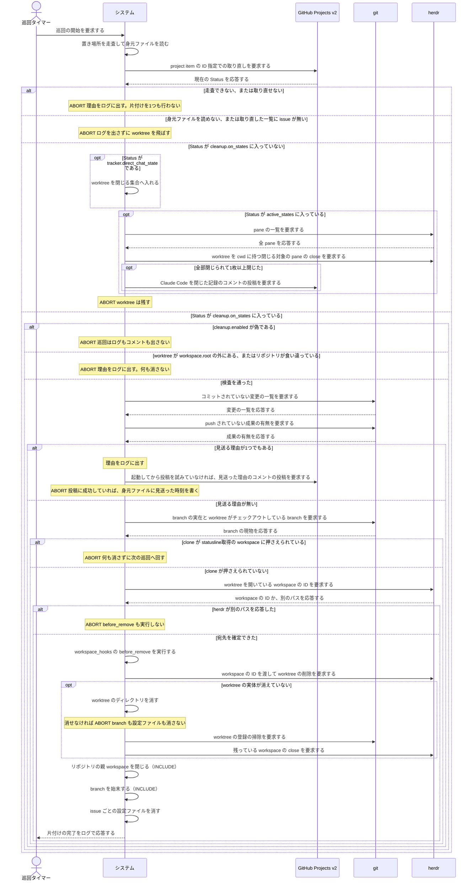

# ユースケース: worktree と branch を片付ける

> **この記述は、巡回が起こす片付けを書いている。**実装の入口は `internal/orchestrator/reconcile.go` の `reconcileWorktrees` で、
> 実行中の印に入っていない worktree を1つずつ調べ、Status が `cleanup.on_states` に入っていれば
> `internal/workspace/cleanup.go` の `Cleanup` を呼ぶ。**記述の対象は worktree 1つである。**巡回は同じ手順を worktree の数だけ繰り返す。
> そこで実装が「この worktree を飛ばして次の worktree へ進む」ところは、この記述では `ABORT`（この worktree についてはここで終わる）と書く。
>
> **片付けを起こす契機は、巡回のほかに4つある**（turn の終わり・復元・起動時の掃除・`continuo abandon`）。
> どれも同じ `Cleanup` を通るので、基本フローの「置き場所の内側にあることを確かめる」段から後ろは共通である。
> **違うのは、見送ったときにコメントを書くか・何をログに出すか・clone が押さえられているときに待つか、である。**
> 違いは下の「片付けを起こす契機は5つある」の表に書く。
>
> **worktree を消したあとの2つの始末は、別の記述に分けてある。**リポジトリの親 workspace は
> [リポジトリの親 workspace を閉じる.rucm.md](リポジトリの親%20workspace%20を閉じる.rucm.md)、branch は
> [branch を始末する.rucm.md](branch%20を始末する.rucm.md) に書く。どちらも失敗しても止まらずに次の段へ進むので、
> 1本に書くと、worktree の消え方・親 workspace の結末・branch の結末の掛け算で経路が増える。

## 根拠資料

- `docs/plans/continuo_design.md` の「3-9. worktree と branch の後始末」（手順1 から手順7b。手順7 が巡回の片付け）
- `docs/plans/continuo_design.md` の「3-83f. 印を外す道は、門とは別に6本ある」（閉じる集合）
- `docs/plans/continuo_design.md` の「3-85c. 閉じた記録を書く場所と、書かない場所」
- `docs/plans/continuo_design.md` の「6-17. 片付けの RUCM は、止まる経路を3つ足して11本にする」
- `internal/orchestrator/reconcile.go` の `reconcileWorktrees` / `closeOrphanPane` / `recordOrphanClosed`
- `internal/orchestrator/lifecycle.go` の `cleanupPath` / `cleanupWorktree` / `finishRunClaimed`（巡回ではない契機）
- `internal/orchestrator/restore.go` の `cleanupInto`、`internal/orchestrator/sweep.go` の `sweepFinishedWorktrees`、`internal/abandon/abandon.go` の `remove`（巡回ではない契機）
- `internal/workspace/scan.go` の `Scan`
- `internal/workspace/cleanup.go` の `ShouldCleanup` / `Cleanup` / `leftoverReasons` / `effectiveBase` / `deletableBranch` / `resolveWorkspaceID` / `fallbackWorkspaceID` / `removeWorktree` / `requestWorktreeRemoval` / `removeWorktreeByHand` / `closeWorktreeWorkspace` / `removeSettingsFile`
- `internal/workspace/repo.go` の `verifiedRepo`
- `internal/workspace/serial.go` の `tryRun`（`ErrCloneBusy`）

## RUCM

```rucm
USE CASE NAME: worktree と branch を片付ける
BRIEF DESCRIPTION: 巡回タイマーが巡回を起こす。巡回は statusline取得の値が届いた知らせでも起きる。システムは実行中の印に入っていない worktree の身元ファイルを読む。システムはボードの Status をまとめて取り直す。システムは Status が cleanup.on_states に入った worktree について、失うものが残っていないことを確かめる。システムは worktree を消す。システムはリポジトリの親 workspace と branch の始末を別の記述に任せる。システムは issue ごとの Claude Code の設定ファイルを消す。
PRECONDITION: システムは常駐している。worktree の置き場所に worktree が1つある。worktree の issue は実行中の印に入っていない。設定の herdr.worktree.create_via_herdr は真である。設定の cleanup.require_clean_worktree は真である。設定の cleanup.require_pushed は真である。
PRIMARY ACTOR: 巡回タイマー
SECONDARY ACTORS: GitHub Projects v2、herdr、git
DEPENDENCY: INCLUDE USE CASE リポジトリの親 workspace を閉じる、INCLUDE USE CASE branch を始末する
GENERALIZATION: なし

BASIC FLOW:
1. 巡回タイマーはシステムに巡回の開始を要求する。
2. システムは VALIDATES THAT worktree の置き場所を走査できる。
3. システムは VALIDATES THAT worktree の中の身元ファイルを読める。
4. システムは GitHub Projects v2 に project item の ID を渡して issue の取り直しを要求する。
5. システムは VALIDATES THAT GitHub Projects v2 が取り直した issue の一覧を応答する。
6. システムは VALIDATES THAT 取り直した issue の一覧に worktree の issue が入っている。
7. システムは VALIDATES THAT 取り直した Status が cleanup.on_states に入っている。
8. システムは VALIDATES THAT 設定の cleanup.enabled が真である。
9. システムは VALIDATES THAT worktree が workspace.root の内側にある。
10. システムは VALIDATES THAT worktree の .git が指すリポジトリが置き場所のパスから決めた clone と食い違っていない。
11. システムは git にコミットされていない変更の一覧を要求する。
12. システムは git に push されていない成果の有無を要求する。
13. システムは VALIDATES THAT 見送る理由が1つも無い。
14. システムは身元ファイルの branch を消してよいかを判定する。
15. システムは VALIDATES THAT リポジトリ本体の clone が statusline取得の workspace に押さえられていない。
16. システムは herdr に worktree を開いている workspace の ID を要求する。
17. システムは VALIDATES THAT herdr が別のパスの worktree を応答していない。
18. システムは workspace_hooks の before_remove を実行する。
19. システムは herdr に workspace の ID を渡して worktree の削除を要求する。
20. IF worktree の実体が herdr への要求で消えていない THEN
21.   システムは worktree のディレクトリを消す。
22.   システムは VALIDATES THAT worktree のディレクトリの削除が成功している。
23.   システムは git の worktree の登録の掃除を試みる。
24.   システムは herdr に残っている worktree の workspace の close を要求する。
25. ENDIF
26. INCLUDE USE CASE リポジトリの親 workspace を閉じる
27. INCLUDE USE CASE branch を始末する
28. システムは issue ごとの Claude Code の設定ファイルを消す。
29. システムは利用者に片付けの完了をログで応答する。
POSTCONDITION: worktree は置き場所に無い。worktree の herdr workspace は閉じている。リポジトリの親 workspace の扱いは、リポジトリの親 workspace を閉じる の事後条件のとおりである。branch の扱いは、branch を始末する の事後条件のとおりである。issue ごとの Claude Code の設定ファイルは無い。issue の Status は変わっていない。issue にコメントは増えていない。

BOUNDED ALTERNATIVE FLOW 材料を取れない:
RFS BASIC FLOW 2,5
1. システムは worktree を1つも消さない。
2. システムは利用者に材料を取れない理由をログで応答する。
3. ABORT
POSTCONDITION: worktree は残っている。branch は残っている。issue にコメントは増えていない。身元ファイルは書き換えられていない。巡回は片付けを1つも行わずに終わっている。次の巡回が同じ worktree をもう一度調べる。

SPECIFIC ALTERNATIVE FLOW 身元ファイルを読めない:
RFS BASIC FLOW 3
1. システムは身元ファイルを読めない worktree を消さない。
2. ABORT
POSTCONDITION: worktree は残っている。branch は残っている。issue にコメントは増えていない。システムは身元ファイルを読めないことをログに出していない。巡回はほかの worktree の照合を続けている。

SPECIFIC ALTERNATIVE FLOW 見えないissue:
RFS BASIC FLOW 6
1. システムは worktree を消さない。
2. ABORT
POSTCONDITION: worktree は残っている。branch は残っている。pane は閉じていない。issue にコメントは増えていない。システムはログを出していない。

SPECIFIC ALTERNATIVE FLOW 片付けの対象外:
RFS BASIC FLOW 7
1. IF Status が tracker.direct_chat_state である THEN
2.   システムは worktree を閉じる集合へ入れる。
3. ELSEIF Status が active_states に入っている THEN
4.   システムは herdr に pane の一覧を要求する。
5.   システムは worktree を cwd に持つ閉じる対象の pane を閉じる。
6.   IF システムが閉じる対象の pane を全部閉じていて、閉じた pane が1枚以上ある THEN
7.     システムは issue に Claude Code を閉じた記録を1件コメントする。
8.   ENDIF
9. ENDIF
10. ABORT
POSTCONDITION: worktree は残っている。branch は残っている。issue の Status は変わっていない。Status が active_states に入っていれば、システムは worktree を cwd に持つ閉じる対象の pane の close を要求している。pane を全部閉じられて1枚以上閉じた場合は、issue に Claude Code を閉じた記録のコメントが1件増えている。Status が active_states にも tracker.direct_chat_state にも入っていなければ、システムは herdr に何も要求していない。

SPECIFIC ALTERNATIVE FLOW 片付けの無効:
RFS BASIC FLOW 8
1. システムは片付けを1つも行わない。
2. ABORT
POSTCONDITION: worktree は残っている。branch は残っている。issue にコメントは増えていない。巡回は片付けを行わないことをログに出していない。

SPECIFIC ALTERNATIVE FLOW 置き場所の外:
RFS BASIC FLOW 9
1. システムは worktree を1つも消さない。
2. システムは利用者に封じ込め検査の失敗をログで応答する。
3. ABORT
POSTCONDITION: worktree は残っている。branch は残っている。置き場所の外のディレクトリは1つも消えていない。システムは herdr に何も要求していない。

SPECIFIC ALTERNATIVE FLOW リポジトリの食い違い:
RFS BASIC FLOW 10
1. システムは worktree を消さない。
2. システムは利用者にリポジトリの食い違いをログで応答する。
3. ABORT
POSTCONDITION: worktree は残っている。branch は残っている。システムは herdr に何も要求していない。issue にコメントは増えていない。

SPECIFIC ALTERNATIVE FLOW 失うものが残っている:
RFS BASIC FLOW 13
1. システムは worktree を消さない。
2. システムは利用者に見送る理由をログで応答する。
3. システムは、身元ファイルに片付けを見送った時刻が無く、起動してからこの worktree について見送りのコメントの投稿を試みていなければ、issue に片付けを見送った理由を1件コメントする。
4. システムは、コメントの投稿に成功していれば、身元ファイルに片付けを見送った時刻を書く。
5. ABORT
POSTCONDITION: worktree は残っている。branch は残っている。issue に片付けを見送った理由のコメントが増えるのは、巡回が投稿に成功した1回だけである。投稿に成功していれば、身元ファイルに片付けを見送った時刻が入っている。次の巡回が同じ判定をもう一度行い、見送る理由をもう一度ログに出すが、コメントは重ねて書かない。

SPECIFIC ALTERNATIVE FLOW cloneが押さえられている:
RFS BASIC FLOW 15
1. システムは worktree を消さない。
2. システムは利用者に片付けを次の巡回へ回すことをログで応答する。
3. ABORT
POSTCONDITION: worktree は残っている。branch は残っている。workspace_hooks の before_remove は実行していない。システムは herdr に worktree を開いている workspace の ID を要求していない。次の巡回が同じ worktree の片付けをやり直す。

SPECIFIC ALTERNATIVE FLOW 宛先が定まらない:
RFS BASIC FLOW 17
1. システムは worktree を消さない。
2. システムは利用者に宛先が定まらない理由をログで応答する。
3. ABORT
POSTCONDITION: worktree は残っている。branch は残っている。workspace_hooks の before_remove は実行していない。システムは herdr に worktree の削除を要求していない。issue ごとの Claude Code の設定ファイルは残っている。

SPECIFIC ALTERNATIVE FLOW 消せないworktree:
RFS BASIC FLOW 22
1. システムは branch の削除を要求しない。
2. システムは issue ごとの Claude Code の設定ファイルを消さない。
3. システムは利用者に worktree を消せない理由をログで応答する。
4. ABORT
POSTCONDITION: worktree は消し切れずに残っている。branch は残っている。issue ごとの Claude Code の設定ファイルは残っている。workspace_hooks の before_remove は実行済みである。システムはリポジトリの親 workspace を閉じる を行っていない。システムは branch を始末する を行っていない。
```

## 片付けを起こす契機は5つある

**この記述の基本フローと代替フローは、1行目の「巡回」を書いている。**ほかの4つは、段1〜7（worktree を見つけて Status を確かめるまで）が契機ごとに違い、段8 から後ろは同じ `Cleanup` を通る。

| 契機 | 実装の入口 | 渡す base | clone が押さえられているとき | 見送り・失敗を誰へ出すか |
| --- | --- | --- | --- | --- |
| **巡回**（この記述） | `internal/orchestrator/reconcile.go` の `reconcileWorktrees` | 渡さない（身元ファイルの `base` で補う） | **待たない。**何も消さずに次の巡回へ回す | ログと、issue へのコメント1件（投稿を試みるのは、起動してから worktree 1つにつき1回だけ） |
| turn の終わり | `internal/orchestrator/lifecycle.go` の `finishRunClaimed` → `cleanupWorktree` → `cleanupPath` | run が持っている base | 待つ | ログと、issue へのコメント1件 |
| 復元 | `internal/orchestrator/restore.go` の `cleanupInto` → `cleanupPath` | 渡さない | 待つ | ログと、issue へのコメント1件 |
| 起動時の掃除 | `internal/orchestrator/sweep.go` の `sweepFinishedWorktrees` → `cleanupPath` | 渡さない | 待つ | ログと、issue へのコメント1件 |
| `continuo abandon` | `internal/abandon/abandon.go` の `remove` | 渡さない | 待つ | 画面（標準出力と標準エラー）。ログは出ない |

**`continuo abandon` のほかの4つの契機が、見送りをコメントする。**`Cleanup` が返した `ShouldComment` が真（身元ファイルの `cleanup_deferred_at` がゼロ値）で、
issue のノード ID が分かるときに、「worktree を片付けずに残しました」のコメントを1件書く。**投稿に成功したあとで** `MarkCleanupDeferred` が身元ファイルへ時刻を書くので、2回目からは書かない。
本文を組み立てて投稿し、時刻を書く部分は、`internal/orchestrator/lifecycle.go` の `postCleanupDeferred` の1か所に在り、巡回も `cleanupPath` もそこを通る。

**巡回からの投稿は、やり直さない**（`internal/orchestrator/reconcile.go` の `noticeDeferredOnPatrol`）。投稿がエラーを返しても、書かれなかったとは限らないためである
（設計 3-85 の「`addComment` は同じものを2回書くことがあるので、やり直さない」と同じ理由）。システムは「投稿を試みた worktree のパス」の集合をメモリに持ち、
巡回は、パスが集合に無いときだけ投稿を試みる。成否に関わらず、試みた時点で集合へ入れる。run の終わりの `cleanupPath` が投稿した worktree も集合へ入るので、巡回から2件目は出ない。

| 何が起きたか | 巡回がすること |
| --- | --- |
| 投稿に成功した | 身元ファイルへ時刻を書く。再起動のあとも、`ShouldComment` が偽になるので書かない |
| 投稿に失敗した | WARN `片付けを見送った通知を投稿できませんでした` を1行出す。**その process のあいだ、巡回からはやり直さない。**時刻は書かない。次に試みるのは、その worktree に再着手したあとの見送りか、再起動のあとの最初の巡回か、起動時の掃除である |
| 取り直した issue が、worktree の置き場所と違うリポジトリのものである | WARN を1行出して投稿しない。集合へ入れる（同じ WARN を巡回のたびに繰り返さない）。身元ファイルの `project_item_id` はエージェントが書き換えられるので、照らさないと無関係の issue にコメントが付く（`OwnerRepoOf`） |
| issue が draft issue である | 投稿しない（コメントできない） |

**集合から外すのは、次の2つのときだけである。**

| いつ | 理由 |
| --- | --- |
| その worktree に着手したとき（`internal/orchestrator/dispatch.go` の `startRunFromWorktree`） | 再着手は新しい run である。着手は身元ファイルの見送った時刻も消すので（`MergeForReuse`）、やり直した issue の次の見送りでは、もう一度コメントが付く |
| 巡回の走査に、そのパスが出てこなくなったとき（worktree が消えた） | 残すと、同じパスに作り直した worktree の見送りが黙ったままになる。実行中の run が握っている worktree は、走査に出てくるので外さない |

**巡回は、投稿が終わるまで待つ**（`closedRecordWriteTimeout` の10秒の期限。待つのは worktree 1つにつき1回だけである）。

**見送ったときの WARN（`Cleanup` 自身が出す `worktree を消さずに残しました`）は、直したあとも巡回のたびに出る。**1回にしたのは、issue へのコメントだけである。

| 何が起きたか | 巡回が出すもの | `cleanupPath` を通る契機が出すもの |
| --- | --- | --- |
| `cleanup.enabled` が偽 | **何も出さない** | WARN `worktree を片付けずに残しました`（理由つき）。コメントは書かない |
| 失うものが残っている | `Cleanup` の WARN `worktree を消さずに残しました`（毎巡回）。**起動してから1回だけ issue へのコメントを試み、成功したら身元ファイルへ時刻を書く** | 同じ WARN に加えて WARN `worktree を片付けずに残しました`。**1回目だけ issue へコメントし、身元ファイルへ時刻を書く** |
| git が答えない（壊れた worktree） | 上の WARN の `next_steps` に、人間が次にすることが入る | 上に加えて WARN `壊れた worktree です。次にこれをしてください` を手順の数だけ出す |
| `Cleanup` がエラーを返した | WARN `取り残された worktree を片付けられません` | WARN `worktree を片付けられません` |
| clone が押さえられている | INFO。次の巡回へ回す | 起きない（押さえが外れるまで待つ） |
| 片付けた | `Cleanup` の INFO（branch の扱いで3通り）と INFO `取り残された worktree を片付けました` | `Cleanup` の INFO と、`cleanupPath` の INFO（branch の扱いで3通り） |

**`continuo abandon` は `Force` を真で渡す。**`cleanup.enabled` の検査と、失うものの検査（段11〜13）を飛ばす。
封じ込め検査・リポジトリの検算・branch の検算・herdr workspace の検算は飛ばさない。
**片付けの結果に記録した「残ったもの」（`Leftovers`）と「continuo が自分で行ったこと」（`Notices`）を画面へ1行ずつ出すのは、`continuo abandon` だけである。**
巡回と `cleanupPath` は、この2つの並びを読まない。同じ内容は `Cleanup` の中のログに出る。

## 巡回が触らない worktree

**言いたいこと。**巡回は、材料が揃わない worktree と、自分の持ち場でない worktree について何も決めない。消さないし、issue にも書かない。

| 何が起きたか | 実装がどうするか | ログ | この記述のどこか |
| --- | --- | --- | --- |
| 置き場所を走査できない | その回は worktree を1つも見ない | WARN | `材料を取れない`（段2） |
| 身元ファイルが無い | 走査の結果に入れない（人間が置いた worktree かもしれない） | 出さない | 事前条件の外 |
| 身元ファイルが壊れている | その worktree だけを飛ばす | **出さない** | `身元ファイルを読めない`（段3） |
| issue が実行中の印に入っている | その worktree だけを飛ばす（実行中の照合が見る） | 出さない | 事前条件の外 |
| ボードを取り直せない | その回は片付けを1つも行わない | WARN | `材料を取れない`（段5） |
| 取り直した一覧に issue が無い | その worktree だけを飛ばす。**勝手に消さない** | 出さない | `見えないissue`（段6） |

**この表の場合は、見送りのコメントを issue へ書かない。**書く相手（issue）が分からない場合が混ざっており、次の巡回で材料が揃えば、そのまま片付けへ進める。

**`Cleanup` も、封じ込め検査（段9）のすぐあとで身元ファイルを読み直す。**読めなければエラーを返して止まり、何も消さない。
巡回では、走査のあとに身元ファイルが壊れたときにしか起きないので、この記述には段を置いていない。

## Status が片付けの対象でないとき

**`片付けの対象外` は、worktree を残したうえで、Status によって3通りに分かれる。**

| Status | 実装がどうするか |
| --- | --- |
| `tracker.direct_chat_state` | その worktree を**閉じる集合**（agent 名を問わず pane を閉じる worktree の集合。設計 3-83f）へ入れる。**pane は閉じない。**herdr へは何も要求しない |
| `active_states` に入っている | herdr に **pane の一覧を絞り込みなしで**要求し、cwd がその worktree を指す pane を閉じる |
| どちらでもない（`In Review`・`Blocked` など） | **何もしない。**pane の一覧も要求しない |

**`tracker.direct_chat_state` と `active_states` は重ならない**（`internal/config/states.go` の `DirectChatConflicts` が起動時に断る）ので、1行目と2行目が同時に当たることは無い。

**閉じる対象の pane。**通常は agent 名のある pane だけである。その worktree が閉じる集合に入っているときは、agent 名の無い pane と、
その worktree を開いている herdr workspace の pane（cwd を問わない）も閉じる。このときだけ herdr に workspace の一覧も要求する。
全部閉じられたら、その worktree を閉じる集合から外す。

**pane の一覧を取れないとき・worktree のパスを解決できないときは、WARN を出して1枚も閉じない。**閉じ損ねた pane は次の巡回でやり直す。

**閉じた記録を書くのは、閉じる対象を全部閉じられ、1枚以上閉じたときだけである**（設計 3-85c）。
次に Claude Code を起動するとき、この記録より後に人間が書いたコメントを最初のメッセージに付けて渡すための境目である。
巡回の中で書き終えるまで待つ（10秒の期限で1回）。書くのは relay が有効なときだけで、担当者が他人のアカウントのときと、
取り直した issue が worktree の置き場所と違うリポジトリのときは書かない。

**worktree を消す基本フローでは書かない。**`worktree.remove` と後始末の `workspace.close` は pane を `pane.close` で閉じないためである。

## 失うものがあるかを2つの検査で見る

**段11 と段12 は両方行い、理由を集めてから段13 で1回だけ判定する**（設計 3-9）。片方だけでは失うものを見落とす。
理由が1つでもあれば `失うものが残っている` へ分かれる。**どちらの検査で止まったかは、ログに出る理由の文面で分かる。**

| 検査 | 何を見るか | 消してよい条件 |
| --- | --- | --- |
| コミットされていない変更（段11） | `git status --porcelain -uall` の出力。continuo が置いた身元ファイルは数えない | 出力が空である。未追跡のファイルも数に入れる |
| push されていない成果（段12 の1段目） | `git for-each-ref --count=1 --contains HEAD refs/remotes/` | 1行でも返る。HEAD は remote に載っている |
| push されていない成果（段12 の3段目。1段目が偽で upstream が無い） | base からの差分 | 差分が無い |

**1段目が偽で upstream が在れば、base と差分が無くても見送る。**upstream との差の件数は、見送る理由の文面を作るためだけに見る。
**1段目が偽で upstream も base も無ければ、判定できないので見送る。**巡回は base を渡さないので、身元ファイルの `base` で補う。

**設定で検査を飛ばせる。**`cleanup.require_clean_worktree` が偽なら段11 を行わず、`cleanup.require_pushed` が偽なら段12 を行わない。
既定はどちらも真で、この記述は真の場合を書いている（事前条件）。

**git が答えられないときは「消してよい」に丸めない。**worktree の `.git` が壊れていると `git -C <worktree> …` は1つも通らない。
そのときは判定できなかったことを見送りの理由に積み、人間が次にすることを添える。エラーとして投げ返すと、`continuo abandon` が worktree の中身を1行も見せられなくなる。

## リポジトリを検算できないときと、食い違っているとき

**言いたいこと。**「調べられない」と「食い違っている」は別である。止まるのは食い違っているときだけである（段10）。

| 状態 | 実装がどうするか |
| --- | --- |
| worktree の `.git` が指すリポジトリが、置き場所のパスと ghq から決めた clone と食い違う | **1バイトも消さずに止まる**（`リポジトリの食い違い`）。消す相手を取り違えている可能性がある |
| clone を引けない・共通ディレクトリをどこからも引けない | **止まらない。**WARN を出し、branch には触らずに worktree と herdr workspace だけを片付ける。branch は `branch を始末する` の「検算に落ちている」の枝へ入る |
| worktree の `.git` が壊れている | clone のほうにリポジトリを答えさせて続ける |

## clone が押さえられているときは次の巡回へ回す

**言いたいこと。**同じリポジトリ本体で statusline取得の workspace が開いていると、その clone は閉じるまで押さえられる。
巡回の中で待つと、止まった run の検知と着手が止まる。**巡回の片付けだけは待たず、何も消さずに次の巡回へ回す**（段15）。

**ここより前の段は、どれも何も消さない**（封じ込め検査・身元ファイルの読み取り・リポジトリの検算・見送りの判定・branch の検算）。
`cloneが押さえられている` は、ほかの「飛ばす」分岐と同じく ABORT で終わる（実装は INFO を出して次の worktree へ進む）。次の巡回が同じ worktree を最初から調べ直す。

## 宛先が定まらないうちは before_remove も実行しない

**言いたいこと。**消す相手の herdr workspace を確定できないまま `before_remove` を実行すると、利用者のフックだけが走って worktree は残る。確定を先、フックを後にする（段16・17 → 段18）。

**止まる条件は2つある。**

| 条件 | なぜ止まるか |
| --- | --- |
| herdr が**別のパス**の worktree を答えた | 無関係の workspace を消しに行くことになる |
| `create_via_herdr` が真なのに herdr のクライアントが無い | 消す手段そのものが無い |

**「答えが無い」は止まる理由にしない。**`worktree.open` が断ったときと workspace の ID が空だったときは `workspace.list` で探し直し、
それでも見つからなければ宛先を空のまま進む。段19 の要求は通らないので、段20 の IF が真になり、実体を自分で消す。

**`herdr.worktree.create_via_herdr` が偽のとき**（この記述の事前条件の外）は、段15〜17 を行わず、段19 で herdr の代わりに git へ `git worktree remove` を要求する。段24 も行わない。

**`before_remove` が失敗しても止まらない。**WARN を出して段19 へ進む。

## worktree の実体が残ったまま先へ進まない

**言いたいこと。**herdr も git も「消した」と答えて消えていないことがある（実測: 2026-08-25）。**実体を自分で見て決める**（段20）。

**段20 の IF が真になるのは、herdr が要求を断ったときと、断られていないのに実体が残っているときである。**
`git worktree remove` は worktree の `.git` が壊れていると必ず断る。断られたまま終わると、その worktree だけが永久に残る。
そこで worktree のディレクトリを自分で消す（段21）。**消せなかったときだけ止まる**（`消せないworktree`）。branch の削除も設定ファイルの削除も要求しない。

**段23 の登録の掃除（`git worktree prune`）は、実体の無い登録がその1件だけのときにしか要求しない。**
prune はリポジトリ全体に効くので、利用者がディレクトリごと移した worktree の登録も一緒に落とす。
次のときは要求せず、登録が残ったことを片付けの結果に記録して先へ進む。

| 状態 | 記録する内容 |
| --- | --- |
| リポジトリを名指しできない | 登録が残ったこと |
| 登録の一覧を引けない | 引けなかった理由と、掃除するコマンド |
| 実体の無い登録がほかにも在る | ほかの登録の一覧と、掃除するコマンド |
| prune が失敗した | 失敗の理由と、掃除するコマンド |

**段24 が close を要求するのは、その worktree を開いている herdr workspace が一覧に残っているときだけである。**宛先は `workspace.list` の `checkout_path` で引く。
一覧を引けない・close が失敗したときは、片付けの結果に記録して先へ進む。

## worktree を消したあとの段は、前の段の結末で分かれない

**段26（親 workspace）と段27（branch）は、どう終わっても段28 へ進む。**引いた2本の記述の中で閉じられなかった・消せなかったときも、
`Cleanup` は WARN を出すか片付けの結果に記録するだけで、設定ファイルの削除（段28）へ進む。**段28 と段29 は、2本の結末で分岐しない。**

**段29 のログの文面だけは、branch の結末で変わる。**`Cleanup` の INFO は `worktree と branch を片付けました`・
`worktree を片付けました（branch は元からありませんでした）`・`worktree を片付けました（branch は残しました）` の3通りである。
出す・出さないは変わらないので、段は1つにしてある。巡回はそのあとに INFO `取り残された worktree を片付けました` を1行足す。

**branch を消してよいかの判定（段14）は、この記述に残してある。**git に現物を答えさせる検査は worktree が在るうちにしかできないので、
実装は worktree を消す前に判定し、結果を `branch を始末する` が使う。判定の中身は、そちらの記述に書く。

## 設定ファイルを消す条件

**段28 は、身元ファイルの `settings_path` が issue ごとの設定ファイルの置き場所の内側に在るときだけ消す。**
`settings_path` もエージェントが書き換えられる値である。空のとき・置き場所が分からないとき・置き場所の外のときは消さない（後ろの2つは WARN を出す）。消せなくても片付けは止めない。

## フローチャート


```mermaid
flowchart TD
    BS1["1 巡回タイマーはシステムに巡回の開始を要求する"]
    BS2{"2 worktree の置き場所を走査できる"}
    BS3{"3 worktree の中の身元ファイルを読める"}
    BS4["4 システムは GitHub Projects v2 に project item の ID を渡して issue の取り直しを要求する"]
    BS5{"5 GitHub Projects v2 が取り直した issue の一覧を応答する"}
    BS6{"6 取り直した issue の一覧に worktree の issue が入っている"}
    BS7{"7 取り直した Status が cleanup.on_states に入っている"}
    BS8{"8 設定の cleanup.enabled が真である"}
    BS9{"9 worktree が workspace.root の内側にある"}
    BS10{"10 worktree の .git が指すリポジトリが置き場所のパスから決めた clone と食い違っていない"}
    BS11["11 システムは git にコミットされていない変更の一覧を要求する"]
    BS12["12 システムは git に push されていない成果の有無を要求する"]
    BS13{"13 見送る理由が1つも無い"}
    BS14["14 システムは身元ファイルの branch を消してよいかを判定する"]
    BS15{"15 リポジトリ本体の clone が statusline取得の workspace に押さえられていない"}
    BS16["16 システムは herdr に worktree を開いている workspace の ID を要求する"]
    BS17{"17 herdr が別のパスの worktree を応答していない"}
    BS18["18 システムは workspace_hooks の before_remove を実行する"]
    BS19["19 システムは herdr に workspace の ID を渡して worktree の削除を要求する"]
    BS20{"20 IF worktree の実体が herdr への要求で消えていない THEN"}
    BS21["21 システムは worktree のディレクトリを消す"]
    BS22{"22 worktree のディレクトリの削除が成功している"}
    BS23["23 システムは git の worktree の登録の掃除を試みる"]
    BS24["24 システムは herdr に残っている worktree の workspace の close を要求する"]
    BS26[["26 INCLUDE USE CASE リポジトリの親 workspace を閉じる"]]
    BS27[["27 INCLUDE USE CASE branch を始末する"]]
    BS28["28 システムは issue ごとの Claude Code の設定ファイルを消す"]
    BS29["29 システムは利用者に片付けの完了をログで応答する"]
    A1S1["材料を取れない 1 システムは worktree を1つも消さない"]
    A1S2["材料を取れない 2 システムは利用者に材料を取れない理由をログで応答する"]
    A1S3(["材料を取れない 3 ABORT"])
    A2S1["身元ファイルを読めない 1 システムは身元ファイルを読めない worktree を消さない"]
    A2S2(["身元ファイルを読めない 2 ABORT"])
    A3S1["見えないissue 1 システムは worktree を消さない"]
    A3S2(["見えないissue 2 ABORT"])
    A4S1{"片付けの対象外 1 IF Status が tracker.direct_chat_state である THEN"}
    A4S2["片付けの対象外 2 システムは worktree を閉じる集合へ入れる"]
    A4S3{"片付けの対象外 3 ELSEIF Status が active_states に入っている THEN"}
    A4S4["片付けの対象外 4 システムは herdr に pane の一覧を要求する"]
    A4S5["片付けの対象外 5 システムは worktree を cwd に持つ閉じる対象の pane を閉じる"]
    A4S6{"片付けの対象外 6 IF システムが閉じる対象の pane を全部閉じていて、閉じた pane が1枚以上ある THEN"}
    A4S7["片付けの対象外 7 システムは issue に Claude Code を閉じた記録を1件コメントする"]
    A4S10(["片付けの対象外 10 ABORT"])
    A5S1["片付けの無効 1 システムは片付けを1つも行わない"]
    A5S2(["片付けの無効 2 ABORT"])
    A6S1["置き場所の外 1 システムは worktree を1つも消さない"]
    A6S2["置き場所の外 2 システムは利用者に封じ込め検査の失敗をログで応答する"]
    A6S3(["置き場所の外 3 ABORT"])
    A7S1["リポジトリの食い違い 1 システムは worktree を消さない"]
    A7S2["リポジトリの食い違い 2 システムは利用者にリポジトリの食い違いをログで応答する"]
    A7S3(["リポジトリの食い違い 3 ABORT"])
    A8S1["失うものが残っている 1 システムは worktree を消さない"]
    A8S2["失うものが残っている 2 システムは利用者に見送る理由をログで応答する"]
    A8S3["失うものが残っている 3 システムは、身元ファイルに片付けを見送った時刻が無く、起動してからこの worktree について見送りのコメントの投稿を試みていなければ、issue に片付けを見送った理由を1件コメントする"]
    A8S4["失うものが残っている 4 システムは、コメントの投稿に成功していれば、身元ファイルに片付けを見送った時刻を書く"]
    A8S5(["失うものが残っている 5 ABORT"])
    A9S1["cloneが押さえられている 1 システムは worktree を消さない"]
    A9S2["cloneが押さえられている 2 システムは利用者に片付けを次の巡回へ回すことをログで応答する"]
    A9S3(["cloneが押さえられている 3 ABORT"])
    A10S1["宛先が定まらない 1 システムは worktree を消さない"]
    A10S2["宛先が定まらない 2 システムは利用者に宛先が定まらない理由をログで応答する"]
    A10S3(["宛先が定まらない 3 ABORT"])
    A11S1["消せないworktree 1 システムは branch の削除を要求しない"]
    A11S2["消せないworktree 2 システムは issue ごとの Claude Code の設定ファイルを消さない"]
    A11S3["消せないworktree 3 システムは利用者に worktree を消せない理由をログで応答する"]
    A11S4(["消せないworktree 4 ABORT"])
    BS1 --> BS2
    BS2 -- はい --> BS3
    BS2 -- いいえ --> A1S1
    BS3 -- はい --> BS4
    BS3 -- いいえ --> A2S1
    BS4 --> BS5
    BS5 -- はい --> BS6
    BS5 -- いいえ --> A1S1
    BS6 -- はい --> BS7
    BS6 -- いいえ --> A3S1
    BS7 -- はい --> BS8
    BS7 -- いいえ --> A4S1
    BS8 -- はい --> BS9
    BS8 -- いいえ --> A5S1
    BS9 -- はい --> BS10
    BS9 -- いいえ --> A6S1
    BS10 -- はい --> BS11
    BS10 -- いいえ --> A7S1
    BS11 --> BS12
    BS12 --> BS13
    BS13 -- はい --> BS14
    BS13 -- いいえ --> A8S1
    BS14 --> BS15
    BS15 -- はい --> BS16
    BS15 -- いいえ --> A9S1
    BS16 --> BS17
    BS17 -- はい --> BS18
    BS17 -- いいえ --> A10S1
    BS18 --> BS19
    BS19 --> BS20
    BS20 -- はい --> BS21
    BS20 -- いいえ --> BS26
    BS21 --> BS22
    BS22 -- はい --> BS23
    BS22 -- いいえ --> A11S1
    BS23 --> BS24
    BS24 --> BS26
    BS26 --> BS27
    BS27 --> BS28
    BS28 --> BS29
    A1S1 --> A1S2
    A1S2 --> A1S3
    A2S1 --> A2S2
    A3S1 --> A3S2
    A4S1 -- はい --> A4S2
    A4S1 -- いいえ --> A4S3
    A4S2 --> A4S10
    A4S3 -- はい --> A4S4
    A4S3 -- いいえ --> A4S10
    A4S4 --> A4S5
    A4S5 --> A4S6
    A4S6 -- はい --> A4S7
    A4S6 -- いいえ --> A4S10
    A4S7 --> A4S10
    A5S1 --> A5S2
    A6S1 --> A6S2
    A6S2 --> A6S3
    A7S1 --> A7S2
    A7S2 --> A7S3
    A8S1 --> A8S2
    A8S2 --> A8S3
    A8S3 --> A8S4
    A8S4 --> A8S5
    A9S1 --> A9S2
    A9S2 --> A9S3
    A10S1 --> A10S2
    A10S2 --> A10S3
    A11S1 --> A11S2
    A11S2 --> A11S3
    A11S3 --> A11S4
    BS29 --> END(["終了"])
```

## シーケンス図


```mermaid
sequenceDiagram
    actor T as 巡回タイマー
    participant S as システム
    participant GH as GitHub Projects v2
    participant G as git
    participant H as herdr

    T->>S: 巡回の開始を要求する
    S->>S: 置き場所を走査して身元ファイルを読む
    S->>GH: project item の ID 指定での取り直しを要求する
    GH-->>S: 現在の Status を応答する
    alt 走査できない、または取り直せない
        Note over S: ABORT 理由をログに出す。片付けを1つも行わない
    else 身元ファイルを読めない、または取り直した一覧に issue が無い
        Note over S: ABORT ログを出さずに worktree を飛ばす
    else Status が cleanup.on_states に入っていない
        opt Status が tracker.direct_chat_state である
            S->>S: worktree を閉じる集合へ入れる
        end
        opt Status が active_states に入っている
            S->>H: pane の一覧を要求する
            H-->>S: 全 pane を応答する
            S->>H: worktree を cwd に持つ閉じる対象の pane の close を要求する
            opt 全部閉じられて1枚以上閉じた
                S->>GH: Claude Code を閉じた記録のコメントの投稿を要求する
            end
        end
        Note over S: ABORT worktree は残す
    else Status が cleanup.on_states に入っている
        alt cleanup.enabled が偽である
            Note over S: ABORT 巡回はログもコメントも出さない
        else worktree が workspace.root の外にある、またはリポジトリが食い違っている
            Note over S: ABORT 理由をログに出す。何も消さない
        else 検査を通った
            S->>G: コミットされていない変更の一覧を要求する
            G-->>S: 変更の一覧を応答する
            S->>G: push されていない成果の有無を要求する
            G-->>S: 成果の有無を応答する
            alt 見送る理由が1つでもある
                Note over S: 理由をログに出す
                S->>GH: 起動してから投稿を試みていなければ、見送った理由のコメントの投稿を要求する
                Note over S: ABORT 投稿に成功していれば、身元ファイルに見送った時刻を書く
            else 見送る理由が無い
                S->>G: branch の実在と worktree がチェックアウトしている branch を要求する
                G-->>S: branch の現物を応答する
                alt clone が statusline取得の workspace に押さえられている
                    Note over S: ABORT 何も消さずに次の巡回へ回す
                else clone が押さえられていない
                    S->>H: worktree を開いている workspace の ID を要求する
                    H-->>S: workspace の ID か、別のパスを応答する
                    alt herdr が別のパスを応答した
                        Note over S: ABORT before_remove も実行しない
                    else 宛先を確定できた
                        S->>S: workspace_hooks の before_remove を実行する
                        S->>H: workspace の ID を渡して worktree の削除を要求する
                        opt worktree の実体が消えていない
                            S->>S: worktree のディレクトリを消す
                            Note over S: 消せなければ ABORT branch も設定ファイルも消さない
                            S->>G: worktree の登録の掃除を要求する
                            S->>H: 残っている workspace の close を要求する
                        end
                        S->>S: リポジトリの親 workspace を閉じる（INCLUDE）
                        S->>S: branch を始末する（INCLUDE）
                        S->>S: issue ごとの設定ファイルを消す
                        S-->>T: 片付けの完了をログで応答する
                    end
                end
            end
        end
    end
```
