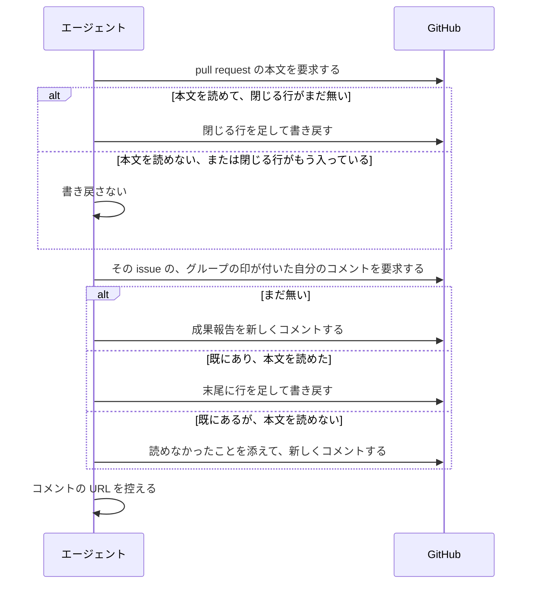
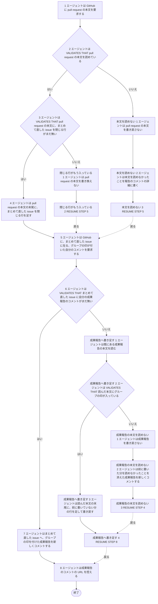

# ユースケース: まとめて直したissueへ成果を書く

> **この記述からテストコードは作らない。**
> 段を行うのはエージェント（Claude Code）で、指示書の文面を読んで動く。エージェントを起動して段を通す自動テストは、レートリミットを使い、結果も毎回同じにならない。
> 文面に何が書いてあるかは `test/internal/prompt/` の `TestTemplate_…` が確かめている。
> `check_update_tests.py` が出す `[W1]`（テスト未生成パス）は、ここでは想定どおりである。

## 根拠資料

- `internal/prompt/builtin.md` の 7-2（まとめて直したとき）、3-7（終わりを書く）、5-5（公開の場へ書いてはいけない3つ）
- `docs/plans/continuo_design.md#3-26`（issue のグループは、代表の issue のコメントで受け取る）

## この記述は何のためにあるか

**エージェントが `builtin.md` の 7-2 をどう使うかを、記録として残すためである。テストは持たない。**
主体はエージェントであり、Claude Code の中で起きることをテストから観測する手立てが無い（`claude -p` は使用禁止のため）。

`指示書に沿ってissueを1件仕上げる` の代替フロー `まとめて直した` が、この記述を取り込む。
**この記述は、まとめて直した issue 1件ぶんである。**取り込む側が、issue の数だけ繰り返す。

## 書く対象

| issue | 書くか |
| --- | --- |
| 担当の issue 以外で、`review` か `blocked` を表明する、同じリポジトリの issue | 書く |
| 担当の issue | ここでは書かない（3-7 で1件書く） |
| 別のリポジトリの issue | 書かない |
| `working` を表明する issue | 書かない |

## RUCM

```rucm
USE CASE NAME: まとめて直したissueへ成果を書く
BRIEF DESCRIPTION: エージェントは pull request の本文に、まとめて直した issue 1件を閉じる行を足す。エージェントはまとめて直した issue 1件に、グループの印を付けた成果報告を1件書く。エージェントは書いたコメントの URL を控える。
PRECONDITION: エージェントは担当の issue と同じリポジトリの別の issue をまとめて直している。pull request がある。エージェントは担当の issue の成果のコメントをまだ書いていない。
PRIMARY ACTOR: エージェント
SECONDARY ACTORS: GitHub
DEPENDENCY: なし
GENERALIZATION: なし

BASIC FLOW:
1. エージェントは GitHub に pull request の本文を要求する。
2. エージェントは VALIDATES THAT pull request の本文を読めている。
3. エージェントは VALIDATES THAT pull request の本文に、まとめて直した issue を閉じる行がまだ無い。
4. エージェントは pull request の本文の末尾に、まとめて直した issue を閉じる行を足す。
5. エージェントは GitHub に、まとめて直した issue に在る、グループの印が付いた自分のコメントを要求する。
6. エージェントは VALIDATES THAT まとめて直した issue に自分の成果報告のコメントがまだ無い。
7. エージェントはまとめて直した issue へ、グループの印を付けた成果報告を新しくコメントする。
8. エージェントは成果報告のコメントの URL を控える。
POSTCONDITION: pull request の本文に、まとめて直した issue を閉じる行がある。まとめて直した issue に、グループの印が付いた成果報告がある。エージェントは成果報告のコメントの URL を控えている。

SPECIFIC ALTERNATIVE FLOW 本文を読めない:
RFS BASIC FLOW 2
1. エージェントは pull request の本文を書き戻さない。
2. エージェントは本文を読めなかったことを報告のコメントの詳細に書く。
3. RESUME STEP 5
POSTCONDITION: pull request の本文は変わっていない。元の閉じる行と説明は消えていない。

SPECIFIC ALTERNATIVE FLOW 閉じる行がもう入っている:
RFS BASIC FLOW 3
1. エージェントは pull request の本文を書き換えない。
2. RESUME STEP 5
POSTCONDITION: pull request の本文に同じ閉じる行は1行だけである。

SPECIFIC ALTERNATIVE FLOW 成果報告へ書き足す:
RFS BASIC FLOW 6
1. エージェントは既にある成果報告の本文を読む。
2. エージェントは VALIDATES THAT 読んだ本文にグループの印が入っている。
3. エージェントは読んだ本文の末尾に、前に書いていない分の行を足して書き戻す。
4. RESUME STEP 8
POSTCONDITION: まとめて直した issue の成果報告は1件のままである。成果報告に今回の分の行が足されている。

SPECIFIC ALTERNATIVE FLOW 成果報告の本文を読めない:
RFS 成果報告へ書き足す 2
1. エージェントは成果報告を書き戻さない。
2. エージェントは前に書いた分を読めなかったことを添えた成果報告を新しくコメントする。
3. RESUME STEP 4
POSTCONDITION: まとめて直した issue の成果報告が1件増えている。前の成果報告の本文は壊れていない。
```

## 成果報告の中身

先頭の印は `<!-- continuo:group -->` である。`<!-- continuo:agent -->` と `<!-- continuo:progress -->` は付けない。

| 表明 | 新しく書くときの行 | 書き足すときの行 |
| --- | --- | --- |
| `review` | 何を直したか・触ったファイル・pull request の URL | 前に書いていない分と、pull request の URL |
| `blocked` | どこまで見たか・なぜ止まったか。pull request の URL は書かない | 行頭に「止まりました:」を付ける。pull request の URL は書かない |

書き足すときに足すものが無ければ、何も書かない。その場合も、既にある成果報告の URL を控える。

**コメントの ID を取れない場合**（段5 が返した URL から数字を取り出せない）は、`成果報告の本文を読めない` と同じ扱いである。書き戻さずに、新しく1件コメントする。

## 相互作用



## フローチャート


