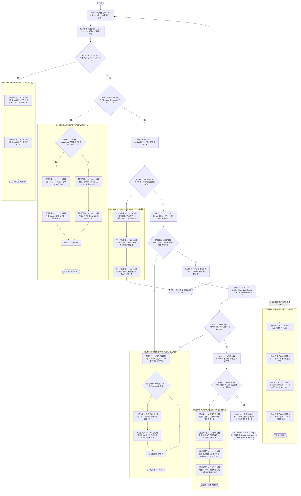
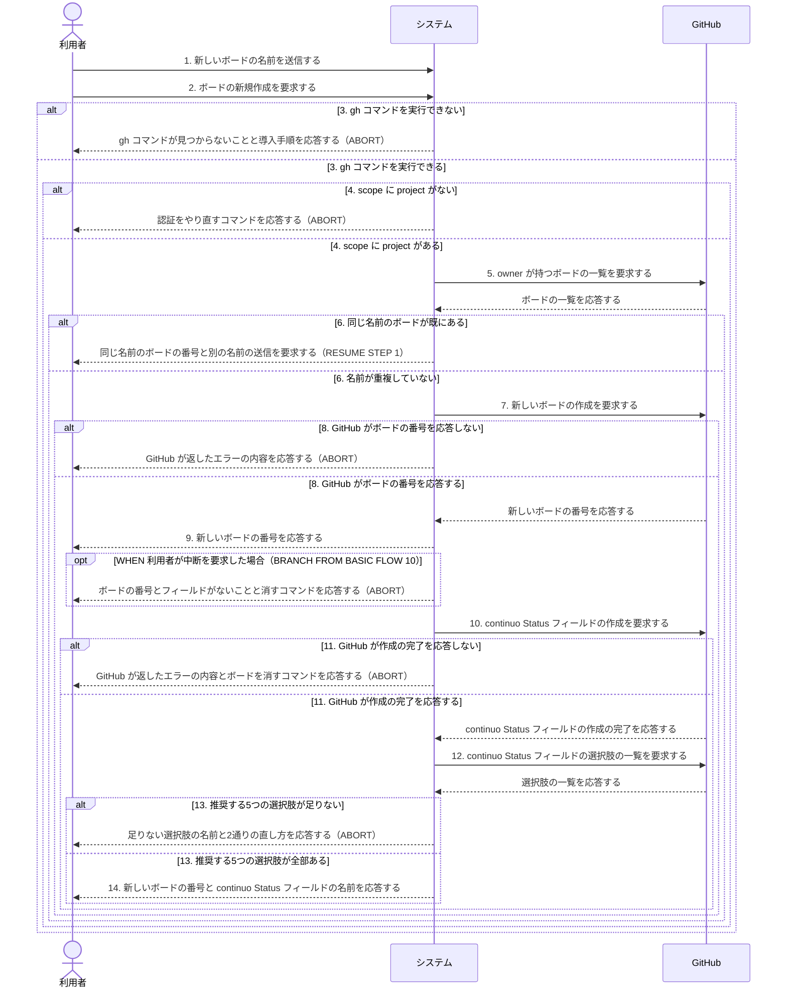

# ユースケース: ボードを新規に用意する

## 根拠資料

- [docs/plans/continuo_design.md](../../../plans/continuo_design.md) 3-34「ボードは既存のものに合わせる」（新規に作る場合／専用フィールドを使ってよい／無言の失敗を検知する2段構え）
- [docs/plans/continuo_design.md](../../../plans/continuo_design.md) 3-32「使い始めるまでの手順」（`continuo doctor` が検査するもの／`gh auth status` の読み方を1つに決める／`continuo init` は利用者に手で埋めさせない）
- [docs/plans/continuo_design.md](../../../plans/continuo_design.md) 5-2「front matter（設定）」（`status_field` / `active_states` / `dispatch_state` / `running_state` / `failure_state` / `terminal_states`）
- [docs/plans/continuo_design.md](../../../plans/continuo_design.md) 4-1「Status の構成」
- [docs/trying_it_out.md](../../../trying_it_out.md) 段2「使い捨てのボードを作る」
- [internal/scaffold/detect.go](../../../../internal/scaffold/detect.go) の `detectProject`（`gh project list --format json` の候補件数で分岐する）
- [internal/doctor/checks.go](../../../../internal/doctor/checks.go)

## RUCM

```rucm
USE CASE NAME: ボードを新規に用意する
BRIEF DESCRIPTION: 利用者が continuo に見張らせるボードを GitHub Projects v2 に新しく作る。システムは利用者の手元で gh コマンドを実行するコマンド環境である。システムは GitHub に新しいボードを作る。システムは continuo が推奨する5つの選択肢を持つ continuo Status フィールドを新しく作る。システムは GitHub が組み込みで作る Status フィールドに触らない。
PRECONDITION: 利用者は GitHub のアカウントを持っている。利用者はボードを作る owner を決めている。利用者は continuo の実行ファイルをビルドしている。
PRIMARY ACTOR: 利用者
SECONDARY ACTORS: GitHub
DEPENDENCY: なし
GENERALIZATION: なし

BASIC FLOW:
1. 利用者はシステムに新しいボードの名前を送信する。
2. 利用者はシステムにボードの新規作成を要求する。
3. システムは VALIDATES THAT gh コマンドを実行できる。
4. システムは VALIDATES THAT gh の有効なアカウントのトークンの scope に project が単独の要素として含まれている。
5. システムは GitHub に owner が持つボードの一覧を要求する。
6. システムは VALIDATES THAT 新しいボードの名前が既存のボードの名前と重複していない。
7. システムは GitHub に新しいボードの作成を要求する。
8. システムは VALIDATES THAT GitHub が新しいボードの番号を応答する。
9. システムは利用者に新しいボードの番号を応答する。
10. システムは GitHub に continuo Status フィールドの作成を要求する。
11. システムは VALIDATES THAT GitHub が continuo Status フィールドの作成の完了を応答する。
12. システムは GitHub に continuo Status フィールドの選択肢の一覧を要求する。
13. システムは VALIDATES THAT continuo が推奨する5つの選択肢が continuo Status フィールドに全部ある。
14. システムは利用者に新しいボードの番号と continuo Status フィールドの名前を応答する。
POSTCONDITION: 新しいボードが GitHub にある。continuo Status フィールドが新しいボードにある。continuo Status フィールドの選択肢は Ready と In Progress と In Review と Blocked と Done の5つである。GitHub が組み込みで作る Status フィールドの選択肢は Todo と In Progress と Done の3つのままである。新しいボードの番号と continuo Status フィールドの名前が利用者に表示されている。

SPECIFIC ALTERNATIVE FLOW gh未導入:
RFS BASIC FLOW 3
1. システムは利用者に gh コマンドが見つからないことを応答する。
2. システムは利用者に gh の導入手順を応答する。
3. ABORT
POSTCONDITION: 新しいボードは作成されていない。gh の導入手順が利用者に表示されている。

SPECIFIC ALTERNATIVE FLOW 認証不足:
RFS BASIC FLOW 4
1. IF gh が github.com の有効なアカウントを持っている THEN
2.   システムは利用者にトークンの scope に project がないことを応答する。
3.   システムは利用者に scope を足すコマンドを応答する。
4. ELSE
5.   システムは利用者に gh が github.com のアカウントを持っていないことを応答する。
6.   システムは利用者に scope を指定してログインするコマンドを応答する。
7. ENDIF
8. ABORT
POSTCONDITION: 新しいボードは作成されていない。gh の認証をやり直すコマンドが利用者に表示されている。

SPECIFIC ALTERNATIVE FLOW ボード名重複:
RFS BASIC FLOW 6
1. システムは利用者に同じ名前のボードが既にあることを応答する。
2. システムは利用者に同じ名前のボードの番号を応答する。
3. システムは利用者に別の名前を送信するよう要求する。
4. RESUME STEP 1
POSTCONDITION: 新しいボードは作成されていない。同じ名前のボードの番号が利用者に表示されている。

BOUNDED ALTERNATIVE FLOW 作成失敗:
RFS BASIC FLOW 8,11
1. システムは利用者に GitHub が返したエラーの内容を応答する。
2. IF 新しいボードが GitHub にある THEN
3.   システムは利用者に新しいボードの番号を応答する。
4.   システムは利用者に新しいボードを消すコマンドを応答する。
5. ENDIF
6. ABORT
POSTCONDITION: continuo Status フィールドは作成されていない。GitHub が返したエラーの内容が利用者に表示されている。

SPECIFIC ALTERNATIVE FLOW 選択肢不足:
RFS BASIC FLOW 13
1. システムは利用者に continuo Status フィールドに足りない選択肢の名前を応答する。
2. システムは利用者に GitHub の画面から選択肢を足す手順を応答する。
3. システムは利用者に選択肢を足す API を使わないことを応答する。
4. システムは利用者に対象にする Status を Todo と In Progress に縮める設定の書き方を応答する。
5. ABORT
POSTCONDITION: 新しいボードが GitHub にある。continuo Status フィールドに足りない選択肢がある。足りない選択肢の名前と2通りの直し方が利用者に表示されている。

GLOBAL ALTERNATIVE FLOW 中断:
BRANCH FROM BASIC FLOW 10
WHEN 利用者がボードの作成の途中で中断を要求した場合
1. システムは GitHub への要求を打ち切る。
2. システムは利用者に新しいボードの番号を応答する。
3. システムは利用者に continuo Status フィールドがないことを応答する。
4. システムは利用者に新しいボードを消すコマンドを応答する。
5. ABORT
POSTCONDITION: 新しいボードが GitHub にある。continuo Status フィールドは作成されていない。新しいボードの番号と新しいボードを消すコマンドが利用者に表示されている。
```

## フローチャート



## シーケンス図


