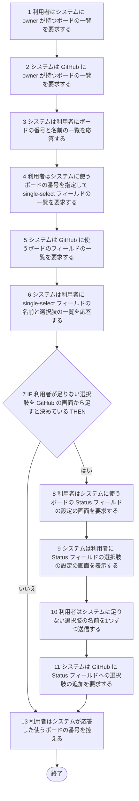
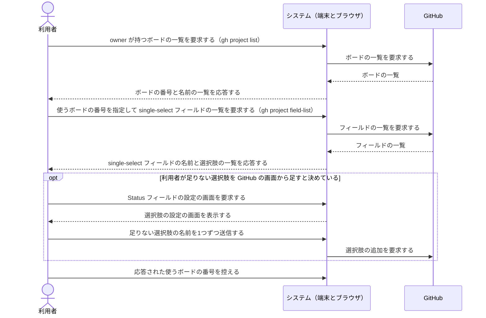

# ユースケース: ボードを新規に用意する

> **これは人間が `gh` と GitHub の画面で行う手順の記録である。continuo の仕様ではない。**
>
> **continuo にボードを作る機能は無い。**`README.ja.md` と `docs/trying_it_out.md` のとおり、
> continuo は既にあるカンバンに後から足して使う。足りない Status の選択肢があるときだけ、人間が GitHub の画面で足す。
>
> **したがって、この記述からテストコードは作らない。**
> `check_update_tests.py` が出す `[W1]`（テスト未生成パス）は、ここでは想定どおりである。
>
> **記述の名前は「新規に用意する」のままだが、中身は「使うボードを確かめ、足りない選択肢を足す」である。**
> ボードそのものを作る手順は、いまの `README.ja.md` と `docs/trying_it_out.md` に無いので、段として書いていない。
>
> **実装と文書は「カンバン」と呼ぶ。この記述は「ボード」と呼ぶ。**同じものである（GitHub Projects v2 の1枚）。

## 根拠資料

- `README.ja.md` の「必要なもの」（カンバンには Status の選択肢が5つ要る。足りないぶんは GitHub の画面から足す。名前は何でもよい）
- `README.ja.md` の「使い方」（continuo はカンバンを作らない。いま使っているカンバンをそのまま使う）
- `docs/trying_it_out.md` の「先に知っておくこと」（カンバンは作らない）
- `docs/trying_it_out.md` の「段2. 使うカンバンを確かめる（作らない）」と、その下の「足りない選択肢があったとき」「専用のフィールドを使ってもよい」
- `docs/trying_it_out.md` の「段4. Status の割り当てを合わせる」の「手で書き換えることもできる」（選択肢を足さずに設定を縮める例）
- `docs/plans/continuo_design.md` の「3-34. カンバンは既存のものに合わせる」（「使い方ごとの用意」「新規に作る場合」）

## RUCM

```rucm
USE CASE NAME: ボードを新規に用意する
BRIEF DESCRIPTION: 利用者は continuo に見張らせるボードを決める。システムは利用者の手元の端末とブラウザである。システムは gh コマンドを実行する。システムは GitHub の画面を表示する。利用者は使うボードの Status フィールドの選択肢を確かめる。利用者は足りない選択肢を GitHub の画面から足す。
PRECONDITION: 利用者は GitHub Projects v2 のボードを1枚以上持っている。利用者は gh auth login -s project を実行済みである。
PRIMARY ACTOR: 利用者
SECONDARY ACTORS: GitHub
DEPENDENCY: なし
GENERALIZATION: なし

BASIC FLOW:
1. 利用者はシステムに owner が持つボードの一覧を要求する。
2. システムは GitHub に owner が持つボードの一覧を要求する。
3. システムは利用者にボードの番号と名前の一覧を応答する。
4. 利用者はシステムに使うボードの番号を指定して single-select フィールドの一覧を要求する。
5. システムは GitHub に使うボードのフィールドの一覧を要求する。
6. システムは利用者に single-select フィールドの名前と選択肢の一覧を応答する。
7. IF 利用者が足りない選択肢を GitHub の画面から足すと決めている THEN
8.   利用者はシステムに使うボードの Status フィールドの設定の画面を要求する。
9.   システムは利用者に Status フィールドの選択肢の設定の画面を表示する。
10.   利用者はシステムに足りない選択肢の名前を1つずつ送信する。
11.   システムは GitHub に Status フィールドへの選択肢の追加を要求する。
12. ENDIF
13. 利用者はシステムが応答した使うボードの番号を控える。
POSTCONDITION: 利用者は使うボードの番号を控えている。GitHub の画面から足した選択肢が Status フィールドにある。既にあった選択肢の名前は変わっていない。ボードの item に設定済みの Status は変わっていない。システムは API で選択肢を足していない。システムはボードを作っていない。
```

## 選択肢が足りるかどうかの見方

`docs/trying_it_out.md` の段2 と `README.ja.md` の「必要なもの」が書いている見方である。continuo が確かめるのではなく、利用者が基本フロー 6 の一覧を読んで決める。

| Status フィールドの状態 | 利用者がすること | 基本フローのどこを通るか |
| --- | --- | --- |
| 選択肢が5つ以上ある | 何も足さない。そのまま使う | 7 の IF を偽で抜ける |
| 選択肢が足りない（GitHub の既定は `Todo` / `In Progress` / `Done` の3つ） | GitHub の画面から足す。名前は何でもよい | 8〜11 |
| 選択肢が足りないが、足せない（足したくない） | 何も足さない。`WORKFLOW.md` を、実在する選択肢名だけで回るように手で書き換える（`docs/trying_it_out.md` の「手で書き換えることもできる」） | 7 の IF を偽で抜ける |

役割との対応づけは、この記述の外である。`既存のボードの Status を割り当てる.rucm.md`（`continuo setup`）が行う。

## rucm ブロックに段として書いていないこと

- **ボードを作る手順。**いまの `README.ja.md` と `docs/trying_it_out.md` に、ボードを作るコマンドも画面の手順も無い。
  `docs/plans/continuo_design.md` の 3-34 は「使い捨ての検証」と「無ければ新規1枚」を挙げるが、作る手順は書いていない。
- **専用のフィールドを作る手順。**`docs/trying_it_out.md` の段2 は、`tracker.provider.status_field` に組み込みの `Status` 以外の名前を書いてよいと述べる。
  フィールドを作る手順は書いていない（同じ段が「専用フィールドを実際には作っていない」と断っている）。
- **選択肢を API で足さないこと。**足す API は `updateProjectV2Field` しか無い。選択肢の指定を全件の置き換えとして扱うので、設定済みの Status の値が全部消える。
  `docs/trying_it_out.md` の段2 と `README.ja.md` は、必ず GitHub の画面から足すと書いている。
- **画面の辿り方。**`README.ja.md` は「カンバンの `Settings` → 左の `Custom fields` の `Status` → `Options` の下の `Add option...` → `Add`」、
  `docs/trying_it_out.md` は「カンバンを開く → 右上の `⋯` → `Settings` → 左の `Status` → `+ Add option`」と書いている。2つの文書で表記が違うので、基本フロー 8〜11 は画面の部品の名前を書いていない。
- **gh や GitHub が失敗した場合。**この段で gh が失敗したときの扱いは、`docs/trying_it_out.md` の段2 にも `README.ja.md` にも無い。代替フローは書いていない。

## フローチャート


```mermaid
flowchart TD
    BS1["1 利用者はシステムに owner が持つボードの一覧を要求する"]
    BS2["2 システムは GitHub に owner が持つボードの一覧を要求する"]
    BS3["3 システムは利用者にボードの番号と名前の一覧を応答する"]
    BS4["4 利用者はシステムに使うボードの番号を指定して single-select フィールドの一覧を要求する"]
    BS5["5 システムは GitHub に使うボードのフィールドの一覧を要求する"]
    BS6["6 システムは利用者に single-select フィールドの名前と選択肢の一覧を応答する"]
    BS7{"7 IF 利用者が足りない選択肢を GitHub の画面から足すと決めている THEN"}
    BS8["8 利用者はシステムに使うボードの Status フィールドの設定の画面を要求する"]
    BS9["9 システムは利用者に Status フィールドの選択肢の設定の画面を表示する"]
    BS10["10 利用者はシステムに足りない選択肢の名前を1つずつ送信する"]
    BS11["11 システムは GitHub に Status フィールドへの選択肢の追加を要求する"]
    BS13["13 利用者はシステムが応答した使うボードの番号を控える"]
    BS1 --> BS2
    BS2 --> BS3
    BS3 --> BS4
    BS4 --> BS5
    BS5 --> BS6
    BS6 --> BS7
    BS7 -- はい --> BS8
    BS7 -- いいえ --> BS13
    BS8 --> BS9
    BS9 --> BS10
    BS10 --> BS11
    BS11 --> BS13
    BS13 --> END(["終了"])
```

## シーケンス図


```mermaid
sequenceDiagram
    actor User as 利用者
    participant Sys as システム（端末とブラウザ）
    participant GH as GitHub

    User->>Sys: owner が持つボードの一覧を要求する（gh project list）
    Sys->>GH: ボードの一覧を要求する
    GH-->>Sys: ボードの一覧
    Sys-->>User: ボードの番号と名前の一覧を応答する
    User->>Sys: 使うボードの番号を指定して single-select フィールドの一覧を要求する（gh project field-list）
    Sys->>GH: フィールドの一覧を要求する
    GH-->>Sys: フィールドの一覧
    Sys-->>User: single-select フィールドの名前と選択肢の一覧を応答する
    opt 利用者が足りない選択肢を GitHub の画面から足すと決めている
        User->>Sys: Status フィールドの設定の画面を要求する
        Sys-->>User: 選択肢の設定の画面を表示する
        User->>Sys: 足りない選択肢の名前を1つずつ送信する
        Sys->>GH: 選択肢の追加を要求する
    end
    User->>Sys: 応答された使うボードの番号を控える
```
