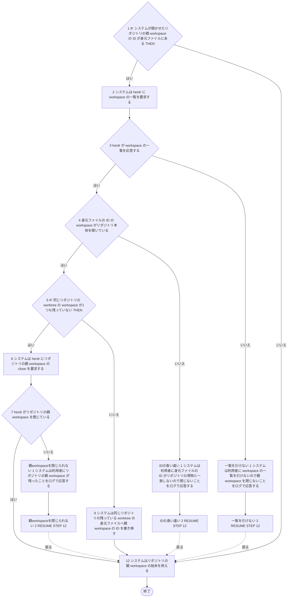
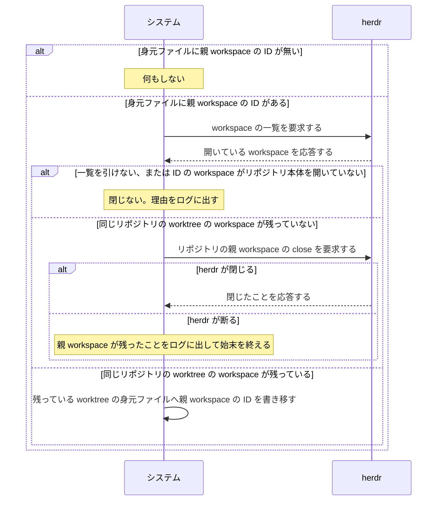

# ユースケース: リポジトリの親 workspace を閉じる

> **worktree を消した直後に行う、リポジトリの親 workspace の始末だけを書いた記述である。**
> `worktree と branch を片付ける` が `INCLUDE USE CASE` で引く。実装は `internal/workspace/repoworkspace.go` の `closeRepoWorkspace` で、
> `internal/workspace/cleanup.go` の `Cleanup` が worktree を消したすぐあとに呼ぶ。片付けを起こす契機（巡回・turn の終わり・復元・起動時の掃除・`continuo abandon`）のどれでも同じ動きをする。
>
> **この記述は、どう終わっても呼び出し元を止めない。**閉じられなくても、閉じる責任を渡せなくても、`closeRepoWorkspace` は値を返さず、
> 呼び出し元は次の段へ進む。そのため呼び出し元と1本に書くと、親 workspace の結末と後ろの段の結末の掛け算で経路が増える。分けて書く。

## 根拠資料

- `docs/plans/continuo_design.md` の「3-9b. リポジトリの親 workspace を閉じる条件（段3b）」
- `docs/plans/continuo_design.md` の「3-9d. 親 workspace を閉じずに残したら、閉じる責任を残った worktree へ渡す」
- `internal/workspace/repoworkspace.go` の `closeRepoWorkspace` / `closeRepoWorkspaceLocked` / `handOverRepoWorkspace` / `findRepoWorkspace` / `otherWorktreeOf`
- `internal/workspace/cleanup.go` の `Cleanup`（呼び出し元）
- `test/live/herdr_test.go` の `TestLive_WorkspaceClose_配下があると親は断られ何も消えない`（herdr 0.9.0 以降の実測）

## RUCM

```rucm
USE CASE NAME: リポジトリの親 workspace を閉じる
BRIEF DESCRIPTION: システムは worktree を消したあとに、システムが開かせたリポジトリの親 workspace を閉じる。システムは身元ファイルの ID を herdr の現物と突き合わせる。システムは同じリポジトリの worktree の workspace が残っていれば親 workspace を閉じない。システムは閉じなかった親 workspace の ID を残っている worktree の身元ファイルへ書き移す。
PRECONDITION: システムは worktree の実体を消している。システムは worktree を消す前に身元ファイルを読んでいる。システムは herdr のクライアントを持っている。
PRIMARY ACTOR: 巡回タイマー
SECONDARY ACTORS: herdr
DEPENDENCY: なし
GENERALIZATION: なし

BASIC FLOW:
1. IF システムが開かせたリポジトリの親 workspace の ID が身元ファイルにある THEN
2.   システムは herdr に workspace の一覧を要求する。
3.   システムは VALIDATES THAT herdr が workspace の一覧を応答する。
4.   システムは VALIDATES THAT 身元ファイルの ID の workspace がリポジトリ本体を開いている。
5.   IF 同じリポジトリの worktree の workspace が1つも残っていない THEN
6.     システムは herdr にリポジトリの親 workspace の close を要求する。
7.     システムは VALIDATES THAT herdr がリポジトリの親 workspace を閉じている。
8.   ELSE
9.     システムは同じリポジトリの残っている worktree の身元ファイルへ親 workspace の ID を書き移す。
10.   ENDIF
11. ENDIF
12. システムはリポジトリの親 workspace の始末を終える。
POSTCONDITION: システムはリポジトリの親 workspace の始末を終えている。呼び出し元は次の段へ進む。システムが開かせたリポジトリの親 workspace は、herdr が close の要求を受け付けていれば閉じている。同じリポジトリの worktree の workspace が残っていれば、親 workspace は開いたままである。システムが ID を書き移した worktree の身元ファイルは親 workspace の ID を持っている。身元ファイルに ID が無ければ、システムは herdr に何も要求していない。人間が開いたリポジトリの workspace は開いたままである。

SPECIFIC ALTERNATIVE FLOW 一覧を引けない:
RFS BASIC FLOW 3
1. システムは利用者に workspace の一覧を引けないので親 workspace を閉じないことをログで応答する。
2. RESUME STEP 12
POSTCONDITION: リポジトリの親 workspace は開いたままである。システムは herdr に close を要求していない。システムは親 workspace の ID を書き移していない。

SPECIFIC ALTERNATIVE FLOW IDの食い違い:
RFS BASIC FLOW 4
1. システムは利用者に身元ファイルの ID がリポジトリの現物と一致しないので閉じないことをログで応答する。
2. RESUME STEP 12
POSTCONDITION: 身元ファイルの ID の workspace は開いたままである。システムは herdr に close を要求していない。システムは親 workspace の ID を書き移していない。

SPECIFIC ALTERNATIVE FLOW 親workspaceを閉じられない:
RFS BASIC FLOW 7
1. システムは利用者にリポジトリの親 workspace が残ったことをログで応答する。
2. RESUME STEP 12
POSTCONDITION: リポジトリの親 workspace は開いたままである。システムは親 workspace の ID を残っている worktree の身元ファイルへ書き移していない。
```

## 6通りの終わり方

| 段 | 条件 | どうするか | ログ |
| --- | --- | --- | --- |
| 1 が偽 | 身元ファイルに `herdr_repo_workspace_id` が無い（人間が先に開いていた・2件目以降の worktree） | **何もしない。**herdr へ何も要求しない | 出さない |
| 3 が偽 | `workspace.list` を引けない（`一覧を引けない`） | 閉じない | WARN |
| 4 が偽 | その ID の workspace がリポジトリ本体を開いていない（`IDの食い違い`） | 閉じない | WARN |
| 5 が真 | 同じリポジトリの worktree の workspace が残っていない | 親 workspace の close を要求する | 閉じたら INFO |
| 7 が偽 | herdr が close を断った、または close が失敗した（`親workspaceを閉じられない`） | 閉じられないまま戻る。ID も書き移さない | WARN |
| 5 が偽 | 同じリポジトリの worktree の workspace が残っている | 閉じずに、ID を残っている worktree へ書き移す | INFO |

**失敗の3つ（一覧を応答する・ID の workspace がリポジトリ本体を開いている・親 workspace を閉じている、の検証の偽の側）は、どれも WARN を出して同じように戻る。**実装は値を返さず、呼び出し元は次の段へ進む。だから3つとも最後の段（始末を終える）へ戻している。

**最後の段（リポジトリの親 workspace の始末を終える）は、呼び出し元へ戻ることを表す。**`closeRepoWorkspace` は値を返さない。呼び出し元は結末を見ずに次の段へ進む。

**事前条件の「herdr のクライアントを持っている」が偽のとき**は、身元ファイルに親 workspace の ID が無いときと同じく何もしない。

**一覧を引いてから閉じるまでは、1つの仕事として直列に行う。**その順番が来ないまま止まったとき（取り消し・終了）は、WARN を出して何も閉じない。

## 閉じてよい条件は2つある

**`worktree.open` は herdr の workspace を2つ開く**（issue #19）。worktree のぶんと、`cwd` に渡したリポジトリのぶん（**リポジトリの親 workspace**）である。
`worktree.remove` は後者を閉じないので、閉じるのは continuo の仕事になる。

**`cwd` を外す案は採れない。**herdr が断る（返るコードは版で変わる。0.8.x は `worktree_not_found`、0.9.1 は `linked_worktree_source`。
実測: 2026-08-25 と 2026-09-29、`test/live/herdr_test.go` の `TestLive_WorktreeOpen_cwdはリポジトリ本体しか受け付けない`）。

**閉じてよい条件は2つあり、両方満たすときだけ閉じる。**

| 条件 | 落とすと何が起きるか |
| --- | --- |
| continuo がその親を開かせたこと（身元ファイルの `herdr_repo_workspace_id` が空でない） | 人間が自分で開いた workspace を閉じ、その人の pane が消える |
| 同じリポジトリの worktree の workspace が1つも残っていないこと | herdr 0.8.x では、別の issue が使っている pane が消える |

**2つ目の理由は herdr の版で変わる。**0.8.x は、親を閉じると配下の worktree の workspace と pane も一緒に消える（実測: 2026-08-25）。
**0.9.0 以降は、配下に worktree の workspace が在る親の close を `workspace_group_close_required` で断り、何も閉じない**（実測: 2026-09-24、`test/live/herdr_test.go` の `TestLive_WorkspaceClose_配下があると親は断られ何も消えない`）。

**身元ファイルの ID は herdr の現物と突き合わせてから使う**（ID の workspace がリポジトリ本体を開いている、の検証）。身元ファイルは worktree の直下にあり、エージェントが書き換えられる。
`workspace.list` を引けないときと、その ID の workspace がリポジトリ本体を開いていないときは、WARN を出して閉じない（`一覧を引けない` と `IDの食い違い`）。

**close が断られても片付けは止めない**（`親workspaceを閉じられない`）。worktree はもう消えているので、WARN を出してこの記述を終え、呼び出し元は次の段（branch の始末）へ進む。
0.9.0 以降で断られるのは、主に、一覧を引いてから閉じるまでの間に別の worktree が開いたときである。**このときは閉じる責任を渡さない。**

## 閉じずに残したら、閉じる責任を残った worktree へ渡す

**言いたいこと。**閉じずに残したまま自分の身元ファイルを消すと、その親 workspace は誰にも閉じられない。残っている worktree の身元ファイルへ ID を書き移す（同じリポジトリの worktree の workspace が残っているときの枝）。

| 何を | どうするか |
| --- | --- |
| 渡す相手 | 同じリポジトリに属し、**置き場所の内側にあって身元ファイルを読める** worktree の**全部** |
| 既に ID を持っている worktree | **上書きしない**（別のリポジトリの親を閉じにいく身元ファイルを作らないため） |
| 1件も渡せなかったとき | WARN を出す |

**1つだけに渡さない。**渡した先の片付けが途中で落ちれば、そこで責任が消える。全部が持っていれば、最後に片付いた1つが閉じる。

## フローチャート



## シーケンス図


