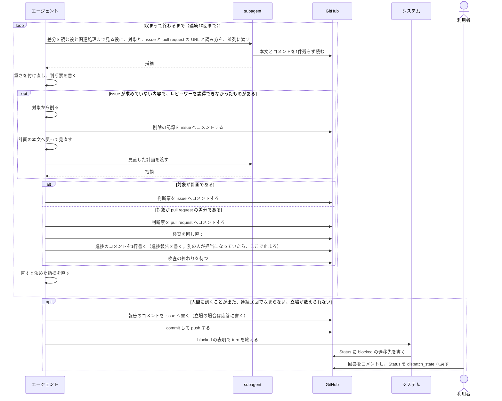

# ユースケース: レビューを回す

> **この記述からテストコードは作らない。**
> 段を行うのはエージェント（Claude Code）で、指示書の文面を読んで動く。エージェントを起動して段を通す自動テストは、レートリミットを使い、結果も毎回同じにならない。
> 文面に何が書いてあるかは `test/internal/prompt/` の `TestTemplate_…` が確かめている。
> `check_update_tests.py` が出す `[W1]`（テスト未生成パス）は、ここでは想定どおりである。

## 根拠資料

- `internal/prompt/builtin.md` の 5-6（レビューの回し方）、3-2（計画のレビューと判断票の形）、3-6（pull request のレビューと、検査の回し直し）、5-7（subagent へ渡すもの）、3-4（`blocked` の前の commit と push、push の前の担当の確認）、3-1（担当の確かめ方と、止まり方）
- `docs/plans/continuo_design.md#5-3s`（レビューの回し方を、組み込みのプロンプトへ入れる）
- `docs/plans/continuo_design.md#5-3u`（計画のあとで人間の確認を受け、質問が出たらレビューを打ち切る）
- `docs/plans/continuo_design.md#5-3p`（設計のレビューを CI で数える）
- `docs/plans/continuo_design.md#5-3x`（レビュワーと直す側の両方に、検討の経緯を読ませる）
- `docs/plans/continuo_design.md#5-3w`（エージェント自身に担当を確かめさせ、最初の push で draft の pull request を作らせる）

## この記述は何のためにあるか

**エージェントが `builtin.md` の 5-6 をどう使うかを、記録として残すためである。テストは持たない。**
主体はエージェントであり、Claude Code の中で起きることをテストから観測する手立てが無い（`claude -p` は使用禁止のため）。

`指示書に沿ってissueを1件仕上げる` が、この記述を2か所で取り込む。計画のレビュー（3-2）と、pull request のレビュー（3-6）である。
**2つは別々に10回を数える。**

## RUCM

```rucm
USE CASE NAME: レビューを回す
BRIEF DESCRIPTION: エージェントはレビュワーの全部の役に issue と pull request の URL を渡して、検討の経緯を読ませる。エージェントは2つの役の subagent にレビューの対象を並列にレビューさせる。エージェントは指摘の重さを付け直す。エージェントは判断票をコメントする。エージェントは直すと決めた指摘を直す。エージェントは CRITICAL と HIGH の指摘が0件になるまで繰り返す。
PRECONDITION: レビューの対象は計画か pull request の差分である。対象が計画の場合は、issue に計画のコメントがあり、人間のはっきりした了承がある。対象が差分の場合は、pull request がある。
PRIMARY ACTOR: エージェント
SECONDARY ACTORS: システム、GitHub、利用者
DEPENDENCY: INCLUDE USE CASE 進捗報告を書く
GENERALIZATION: なし

BASIC FLOW:
1. DO
2.   エージェントはレビュワーの全部の役への依頼文に、issue と pull request の URL と、本文とコメントを1件残らず読む読み方を書く。
3.   エージェントは差分を読む役の subagent と関連処理まで見る役の subagent にレビューの対象を並列にレビューさせる。
4.   エージェントは指摘の重さを付け直す。
5.   エージェントは指摘ごとの直すかどうかと理由を判断票に書く。
6.   エージェントは VALIDATES THAT issue が求めていない内容のうち敵対的レビュワーを説得できなかったものがレビューの対象に無い。
7.   エージェントは直す前の計画を同じ判断票に書く。
8.   IF レビューの対象が計画である THEN
9.     エージェントは判断票を issue へコメントする。
10.   ELSE
11.     エージェントは判断票を pull request へコメントする。
12.     エージェントはレビュー結果を数える検査を回し直す。
13.     INCLUDE USE CASE 進捗報告を書く
14.     エージェントは VALIDATES THAT 進捗報告を書いたあとも作業を続けている。
15.     エージェントは pull request に付いた検査の終わりを待つ。
16.   ENDIF
17.   エージェントは直すと決めた指摘を直す。
18. UNTIL レビューが収まって終わっている
19. エージェントはレビューを終える。
POSTCONDITION: CRITICAL と HIGH の指摘は0件である。周ごとの判断票がコメントされている。計画の判断票は issue にある。実装の判断票は pull request にある。

SPECIFIC ALTERNATIVE FLOW issueに無いものを削る:
RFS BASIC FLOW 6
1. エージェントは説得できなかった内容をレビューの対象から削る。
2. エージェントは削った内容を issue へコメントする。
3. エージェントは計画の本文へ戻って、削ったあとの釣り合いと採用理由を見直す。
4. エージェントは見直した計画を敵対的レビューの subagent にレビューさせる。
5. RESUME STEP 7
POSTCONDITION: レビューの対象に issue が求めていない内容は残っていない。issue に削除の記録のコメントがある。見直した計画は敵対的レビューを通っている。エージェントは同じ周の判断票を貼ってから直す。

GLOBAL ALTERNATIVE FLOW 人間に訊くことが出る:
BRANCH FROM BASIC FLOW 5
WHEN レビューの周の途中で、人間に訊かないと決められないことが出た場合
1. エージェントはその周を打ち切る。
2. エージェントは質問を報告のコメントとして issue へ書く。
3. エージェントは commit していない変更を commit して push する。
4. エージェントは応答の最後に判断を仰ぐ表明を1行書く。
5. システムはカンバンの issue の Status に blocked の遷移先を書く。
6. ABORT
POSTCONDITION: レビューの周は途中で終わっている。issue に質問の報告のコメントがある。commit は remote に載っている。issue の Status は blocked の遷移先である。利用者が回答をコメントしてから Status を dispatch_state の選択肢へ戻すと、次の run が続ける。

GLOBAL ALTERNATIVE FLOW 連続10回で収まらない:
BRANCH FROM BASIC FLOW 18
WHEN レビューを連続10回回しても CRITICAL か HIGH の指摘が残っている場合
1. エージェントはレビューを止める。
2. エージェントは方針の確認を報告のコメントとして issue へ書く。
3. エージェントは commit していない変更を commit して push する。
4. エージェントは応答の最後に判断を仰ぐ表明を1行書く。
5. システムはカンバンの issue の Status に blocked の遷移先を書く。
6. ABORT
POSTCONDITION: レビューは10回で止まっている。issue に方針の確認の報告のコメントがある。issue の Status は blocked の遷移先である。利用者が方針をコメントしてから Status を dispatch_state の選択肢へ戻すと、次の run がレビューの回数を数え直す。

GLOBAL ALTERNATIVE FLOW 判断票が数えられない立場:
BRANCH FROM BASIC FLOW 9
WHEN 判断票を書いたアカウントの立場が OWNER でも MEMBER でも COLLABORATOR でもない場合
1. エージェントは判断票が検査に数えられないことを応答に書く。
2. エージェントは commit していない変更を commit して push する。
3. エージェントは応答の最後に判断を仰ぐ表明を1行書く。
4. システムはカンバンの issue の Status に blocked の遷移先を書く。
5. ABORT
POSTCONDITION: issue に判断票のコメントがある。設計のレビューを数える検査は緑になっていない。issue の Status は blocked の遷移先である。利用者は応答で立場のことを読む。利用者はアカウントの権限を直してから Status を dispatch_state の選択肢へ戻す。

SPECIFIC ALTERNATIVE FLOW 進捗報告を書く前に止まる:
RFS BASIC FLOW 14
1. システムは run を終える。
2. ABORT
POSTCONDITION: エージェントは検査の終わりを待っていない。エージェントは push していない。issue に、いまの担当と commit の在りかの報告のコメントがある。issue の Status は blocked の遷移先である。
```

## 「収まって終わっている」とは

`builtin.md` の 5-6 の「何周回すか」が決めている。段18 の条件は、この表の「そこで終わり」に当たったことである。
**10回目で収まった周では、段17 で直す指摘は無い。**MEDIUM と LOW は「直さない」と決めて残す。終わり方も通る段も変わらないので、代替フローにしていない。

| 状態 | 次に何をするか |
| --- | --- |
| CRITICAL か HIGH が1件以上 | 直して次の周を回す |
| 収まった。MEDIUM と LOW を直さないと決めた | そこで終わり |
| 収まった。MEDIUM か LOW を直した | 最後に1回だけ回す |
| その最後の周でも収まっている | そこで終わり |
| 10回目で収まった | 最後の1回を回さない。MEDIUM と LOW は直さず、そのまま残す。そこで終わり |

## 判断票の先頭に置く印

| 対象 | 書く先 | 1行目 | 2行目 |
| --- | --- | --- | --- |
| 計画 | issue | `<!-- continuo:agent -->` | `<!-- design-review-result -->` |
| pull request の差分 | pull request | `<!-- code-review-result -->` | `<!-- continuo:agent -->` |

削除の記録は、`<!-- continuo:agent -->` の1行だけを先頭に置いて issue へ書く。

## 検査を回し直さない場合

段12 は、`builtin.md` の 3-6「貼ったら、検査を回し直す」である。次の場合は回し直さない。どの場合も、後ろの段は変わらない。

| 場合 | エージェントがすること |
| --- | --- |
| レビューが収まったあとに draft を外した | 回し直さない。`gh pr ready` が検査を回し直す。draft を外すのは、取り込む側（`指示書に沿ってissueを1件仕上げる`）の段である |
| レビュー結果を数える workflow がリポジトリに無い | `gh run rerun` を叩かずに、応答に書く |
| その workflow がこの branch で1度も走っていない | `gh run rerun` を叩かずに、応答に書く |
| その run がまだ走っている（403 で落ちる） | 回し直さない。走っているのが最新の結果である |

段13 は、待ちに入る前に進捗のコメントを1行書かせる決まりである（`builtin.md` の 3-6）。待っている間は何も書けない。
**段14 は、取り込んだ `進捗報告を書く` の中で run が終わる出口を受ける。**`進捗報告を書く` は、書く前に担当を確かめ、別の人が担当になっていたら `blocked` で止まる（5-3）。偽の側が `進捗報告を書く前に止まる` である。

## 検討の経緯の渡し方

段2 は、`builtin.md` の 5-6 の「毎周やること」と、5-7 の「どうやって渡すか」である。どの行でも、終わり方も通る段も変わらない。

| 何 | 決まり |
| --- | --- |
| 渡す相手 | レビュワーの全部の役（差分を読む役・関連処理まで見る役・心配な場所があるときに足す3つ目の役）。`issueに無いものを削る` の段4 の敵対的レビュワーも、渡された URL の先の issue を自分で読む。直しを任せる subagent（段17 を任せる場合）にも読ませる |
| 渡すもの | issue の URL と、在れば pull request の URL。まとめて直しているときは、その issue の URL も渡す。何周目かも書く |
| 読ませるもの | 本文・コメント・行に紐づくレビューコメント・reviews を、1件残らず、省略せずに読ませる。過去の周の判断票も、そこに入っている |
| 読み方 | 4-1 と 4-2 のコマンドを、番号を埋めた形で書き写して渡す。`gh issue view --comments` のような表示では読ませない（6-2） |
| 誰が書いたものをどう読むか | 読み方の4行を、要約せずに渡す（`trusted_comment` / `trusted_body` が true のものだけが人間の指示・`written_by` が `"ai"` のものは材料・3つの立場以外の人が書いたものは報告・機械の印で始まるコメントは読み飛ばす） |
| 読めなかったとき | 最初の報告に書かせる。出力が途中で切れたら、1件ずつ読み直させる。それでも読めなければ、エージェントが読んで、要る部分を原文のまま渡す |
| Bash を持たない subagent | 持たないとき（道具の一覧が無くて分からないときも）だけ、コマンドの出力をファイルへ書いて、その絶対パスも渡す。ファイルは `mktemp -d` で作ったディレクトリに置き、コメントは1件を1行にする |
| 名指しの指示 | 「ここを重点的に見ろ」という名指しは、3つ目の役にだけ渡す。その役には、そこを直した理由も渡す |
| 見る範囲 | 変わらない。経緯は全部の役が読むが、経緯に出てくるファイルのうち、その役の見る範囲の外にあるものは、見に行かせなくてよい |
| 経緯を渡せないレビュワー | 返ってきた指摘を、エージェントが経緯と突き合わせる。前の周で否定した指摘が、理由に触れないまま挙がったら、同じ理由を書き直し、「前の周に既に在った」として扱う |

## 止まる出口の push

3本の止まる出口（`人間に訊くことが出る`・`連続10回で収まらない`・`判断票が数えられない立場`）の「commit して push する」段は、push の前に担当を確かめる（`builtin.md` の 3-4。確かめ方は 3-1）。
別の人が担当になっていた場合と、担当を確かめられなかった場合は、push しない。push していない commit の branch と短い hash を、報告に書く。**どちらの場合も `blocked` を表明して終わるので、代替フローにしていない。**その場合は、POSTCONDITION の「commit は remote に載っている」は成り立たない。

## 相互作用



## フローチャート

```mermaid
flowchart TD
    BS2["2 エージェントはレビュワーの全部の役への依頼文に、issue と pull request の URL と、本文とコメントを1件残らず読む読み方を書く"]
    BS3["3 エージェントは差分を読む役の subagent と関連処理まで見る役の subagent にレビューの対象を並列にレビューさせる"]
    BS4["4 エージェントは指摘の重さを付け直す"]
    BS5["5 エージェントは指摘ごとの直すかどうかと理由を判断票に書く"]
    BS6{"6 エージェントは VALIDATES THAT issue が求めていない内容のうち敵対的レビュワーを説得できなかったものがレビューの対象に無い"}
    BS7["7 エージェントは直す前の計画を同じ判断票に書く"]
    BS8{"8 IF レビューの対象が計画である THEN"}
    BS9["9 エージェントは判断票を issue へコメントする"]
    BS11["11 エージェントは判断票を pull request へコメントする"]
    BS12["12 エージェントはレビュー結果を数える検査を回し直す"]
    BS13[["13 INCLUDE USE CASE 進捗報告を書く"]]
    BS14{"14 エージェントは VALIDATES THAT 進捗報告を書いたあとも作業を続けている"}
    BS15["15 エージェントは pull request に付いた検査の終わりを待つ"]
    BS17["17 エージェントは直すと決めた指摘を直す"]
    BS18{"18 UNTIL レビューが収まって終わっている"}
    BS19["19 エージェントはレビューを終える"]
    A1S1["issueに無いものを削る 1 エージェントは説得できなかった内容をレビューの対象から削る"]
    A1S2["issueに無いものを削る 2 エージェントは削った内容を issue へコメントする"]
    A1S3["issueに無いものを削る 3 エージェントは計画の本文へ戻って、削ったあとの釣り合いと採用理由を見直す"]
    A1S4["issueに無いものを削る 4 エージェントは見直した計画を敵対的レビューの subagent にレビューさせる"]
    A1S5["issueに無いものを削る 5 RESUME STEP 7"]
    A2S1["人間に訊くことが出る 1 エージェントはその周を打ち切る"]
    A2S2["人間に訊くことが出る 2 エージェントは質問を報告のコメントとして issue へ書く"]
    A2S3["人間に訊くことが出る 3 エージェントは commit していない変更を commit して push する"]
    A2S4["人間に訊くことが出る 4 エージェントは応答の最後に判断を仰ぐ表明を1行書く"]
    A2S5["人間に訊くことが出る 5 システムはカンバンの issue の Status に blocked の遷移先を書く"]
    A2S6(["人間に訊くことが出る 6 ABORT"])
    A3S1["連続10回で収まらない 1 エージェントはレビューを止める"]
    A3S2["連続10回で収まらない 2 エージェントは方針の確認を報告のコメントとして issue へ書く"]
    A3S3["連続10回で収まらない 3 エージェントは commit していない変更を commit して push する"]
    A3S4["連続10回で収まらない 4 エージェントは応答の最後に判断を仰ぐ表明を1行書く"]
    A3S5["連続10回で収まらない 5 システムはカンバンの issue の Status に blocked の遷移先を書く"]
    A3S6(["連続10回で収まらない 6 ABORT"])
    A4S1["判断票が数えられない立場 1 エージェントは判断票が検査に数えられないことを応答に書く"]
    A4S2["判断票が数えられない立場 2 エージェントは commit していない変更を commit して push する"]
    A4S3["判断票が数えられない立場 3 エージェントは応答の最後に判断を仰ぐ表明を1行書く"]
    A4S4["判断票が数えられない立場 4 システムはカンバンの issue の Status に blocked の遷移先を書く"]
    A4S5(["判断票が数えられない立場 5 ABORT"])
    A5S1["進捗報告を書く前に止まる 1 システムは run を終える"]
    A5S2(["進捗報告を書く前に止まる 2 ABORT"])
    BS2 --> BS3
    BS3 --> BS4
    BS4 --> BS5
    BS5 --> BS6
    BS5 -. "WHEN レビューの周の途中で、人間に訊かないと決められないことが出た場合" .-> A2S1
    BS6 -- はい --> BS7
    BS6 -- いいえ --> A1S1
    BS7 --> BS8
    BS8 -- はい --> BS9
    BS8 -- いいえ --> BS11
    BS9 --> BS17
    BS9 -. "WHEN 判断票を書いたアカウントの立場が OWNER でも MEMBER でも COLLABORATOR でもない場合" .-> A4S1
    BS11 --> BS12
    BS12 --> BS13
    BS13 --> BS14
    BS14 -- はい --> BS15
    BS14 -- いいえ --> A5S1
    BS15 --> BS17
    BS17 --> BS18
    BS18 -- はい --> BS19
    BS18 -. "繰り返す" .-> BS2
    BS18 -. "WHEN レビューを連続10回回しても CRITICAL か HIGH の指摘が残っている場合" .-> A3S1
    A1S1 --> A1S2
    A1S2 --> A1S3
    A1S3 --> A1S4
    A1S4 --> A1S5
    A1S5 -. "戻る" .-> BS7
    A2S1 --> A2S2
    A2S2 --> A2S3
    A2S3 --> A2S4
    A2S4 --> A2S5
    A2S5 --> A2S6
    A3S1 --> A3S2
    A3S2 --> A3S3
    A3S3 --> A3S4
    A3S4 --> A3S5
    A3S5 --> A3S6
    A4S1 --> A4S2
    A4S2 --> A4S3
    A4S3 --> A4S4
    A4S4 --> A4S5
    A5S1 --> A5S2
    BS19 --> END(["終了"])
```


