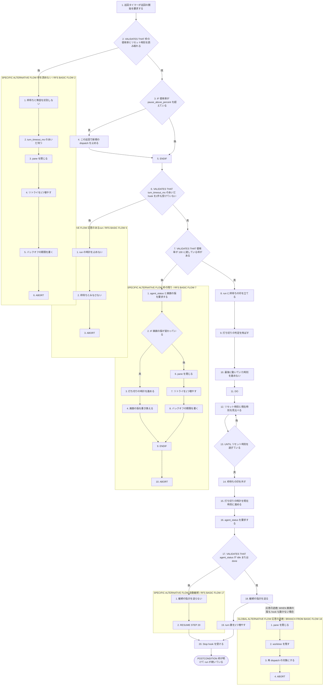
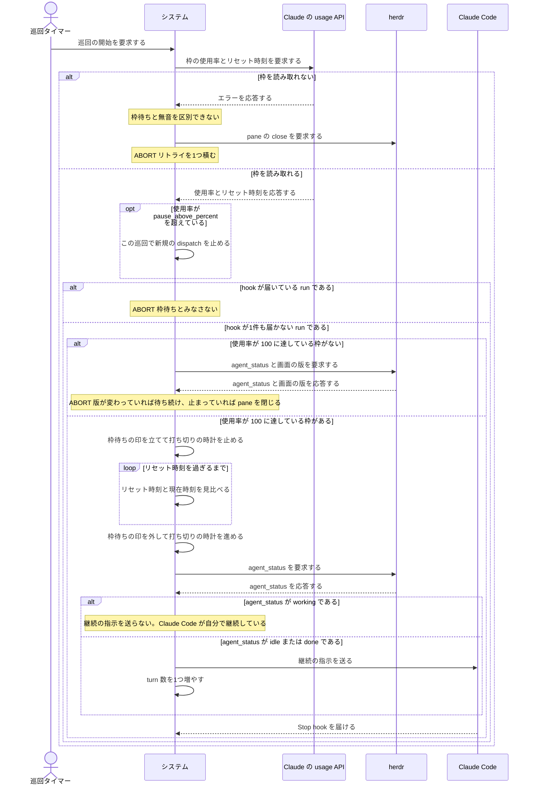

# ユースケース: レートリミットで待って再開する

## 根拠資料

- `docs/plans/continuo_design.md#3-11`（`CLAUDE_CODE_RETRY_WATCHDOG` を環境変数で渡す）
- `docs/plans/continuo_design.md#3-15`（枠の使用率とリセット時刻の読み取り）
- `docs/plans/continuo_design.md#3-21`（打ち切りの時計は中間の hook と画面の版でリセットする）
- `docs/plans/continuo_design.md#3-27`（レートリミットで止まっても自分で再開する。2条件と評価順）
- `docs/plans/continuo_design.md#5-2`（`rate_limit` の設定キー）
- `internal/orchestrator/turn.go` の `isQuotaWaiting`、`quotaAtFull`、`quotaResetAt`、`afterWaitTimeout`、`afterQuotaReset`
- `internal/orchestrator/reconcile.go` の `checkStalls`
- `internal/orchestrator/orchestrator.go` の `pollQuota`、`dispatchPaused`
- `internal/ratelimit/ratelimit.go`

## RUCM

```rucm
USE CASE NAME: レートリミットで待って再開する
BRIEF DESCRIPTION: 巡回タイマーが巡回を起こす。システムは枠の使用率とリセット時刻を読み、枠を使い切った run に枠待ちの印を立てて打ち切りの判定を飛ばす。システムはリセット時刻を過ぎたら印を外し、agent_status を見てから継続の指示を1回送る。
PRECONDITION: システムは常駐している。走行中の run が1件以上ある。設定の rate_limit.source は none ではない。issue の Status は running_state の選択肢である。
PRIMARY ACTOR: 巡回タイマー
SECONDARY ACTORS: Claude の usage API、herdr、Claude Code
DEPENDENCY: なし
GENERALIZATION: なし

BASIC FLOW:
1. 巡回タイマーはシステムに巡回の開始を要求する。
2. システムは VALIDATES THAT Claude の usage API から枠の使用率とリセット時刻を読み取れる。
3. IF どれかの枠の使用率が pause_above_percent を超えている THEN
4.   システムはこの巡回で新規の dispatch を止める。
5. ENDIF
6. システムは VALIDATES THAT 走行中の run が turn_timeout_ms のあいだ hook を1件も受けていない。
7. システムは VALIDATES THAT 使用率が 100 に達している枠がある。
8. システムは run に枠待ちの印を立てる。
9. システムは run の打ち切りの判定を飛ばす。
10. システムは run の最後に動いていた時刻を進めない。
11. DO
12.   システムは枠のリセット時刻と現在時刻を巡回のたびに見比べる。
13. UNTIL 枠のリセット時刻を過ぎている
14. システムは run から枠待ちの印を外す。
15. システムは run の打ち切りの時計を現在時刻に進める。
16. システムは herdr に run の agent_status を要求する。
17. システムは VALIDATES THAT agent_status が idle または done である。
18. システムは Claude Code に継続の指示を送る。
19. システムは run の turn 数を1つ増やす。
20. システムは Claude Code の Stop hook を受ける。
POSTCONDITION: run の枠待ちの印は外れている。run の打ち切りの判定は再び効いている。run の turn 数は1つ増えている。issue の Status は running_state の選択肢のままである。herdr の pane は閉じていない。worktree は残っている。

SPECIFIC ALTERNATIVE FLOW 枠を読めない:
RFS BASIC FLOW 2
1. システムは枠待ちと無音を区別しない。
2. システムは turn_timeout_ms のあいだ待つ。
3. システムは herdr の pane を閉じる。
4. システムはリトライの回数を1つ増やす。
5. システムはバックオフの期限を印に書く。
6. ABORT
POSTCONDITION: herdr の pane は閉じている。印は残っている。issue の Status は running_state の選択肢のままである。worktree は残っている。

SPECIFIC ALTERNATIVE FLOW 応答のあるrun:
RFS BASIC FLOW 6
1. システムは run の時計を止めない。
2. システムは run を枠待ちとみなさない。
3. ABORT
POSTCONDITION: run の枠待ちの印は立っていない。run の打ち切りの判定は効いている。run の turn は続いている。

SPECIFIC ALTERNATIVE FLOW 枠の残り:
RFS BASIC FLOW 7
1. システムは herdr に run の agent_status と pane の画面の版を要求する。
2. IF 画面の版が前に見た値から変わっている THEN
3.   システムは run の打ち切りの時計を現在時刻に進める。
4.   システムは run の画面の版を新しい値に書き換える。
5. ELSE
6.   システムは herdr の pane を閉じる。
7.   システムはリトライの回数を1つ増やす。
8.   システムはバックオフの期限を印に書く。
9. ENDIF
10. ABORT
POSTCONDITION: run の枠待ちの印は立っていない。画面の版が変わっていた run は動いている。画面の版が止まっていた run の herdr の pane は閉じている。issue の Status は running_state の選択肢のままである。

SPECIFIC ALTERNATIVE FLOW 自動継続:
RFS BASIC FLOW 17
1. システムは継続の指示を送らない。
2. RESUME STEP 20
POSTCONDITION: run の turn 数は増えていない。Claude Code は自分で継続している。投げた本文が消える二重投入は起きていない。

GLOBAL ALTERNATIVE FLOW 応答の途絶:
BRANCH FROM BASIC FLOW 18
WHEN 継続の指示を送っても turn_timeout_ms のあいだ画面の版も hook も動かない場合
1. システムは herdr の pane を閉じる。
2. システムは worktree を残す。
3. システムは issue を再 dispatch の対象にする。
4. ABORT
POSTCONDITION: herdr の pane は閉じている。worktree は残っている。issue の Status は running_state の選択肢のままである。印は残っている。
```

## 2つの判定を分ける

**`pause_above_percent` を超えただけでは枠待ちとみなさない**（設計 3-27）。

| 判定 | 条件 | 何が起きるか |
| --- | --- | --- |
| 新規の dispatch を止める | どれかの枠の使用率が pause_above_percent を超えた | 新しい issue を取らない。走行中の turn は止めない。時計も止めない |
| この run は枠待ちである | 使用率が 100 に達している枠がある。かつ、その run から turn_timeout_ms のあいだ hook が届かない | 打ち切りの判定を飛ばす |

## 枠明けに継続の指示を送ってよいか

**Claude Code 2.1.234 は枠のリセット時にセッションを自動で継続する**（設計 3-27）。

| agent_status | どうするか |
| --- | --- |
| idle または done | 送る。Claude Code は継続していない |
| working | 送らない。Claude Code が自分で継続している。Stop hook を待つ |
| blocked | 送らない。esc を送ってから failure_state へ落とす |

## フローチャート



## シーケンス図


