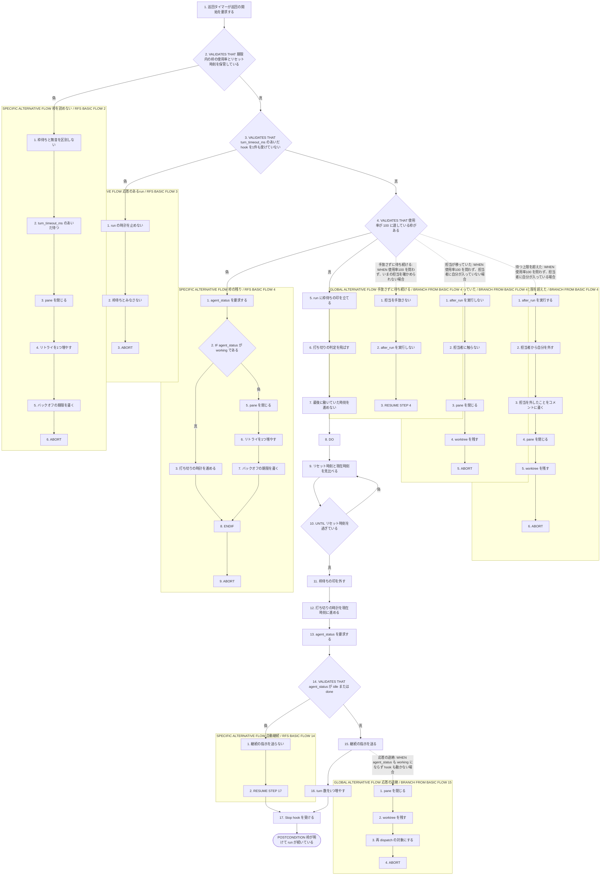
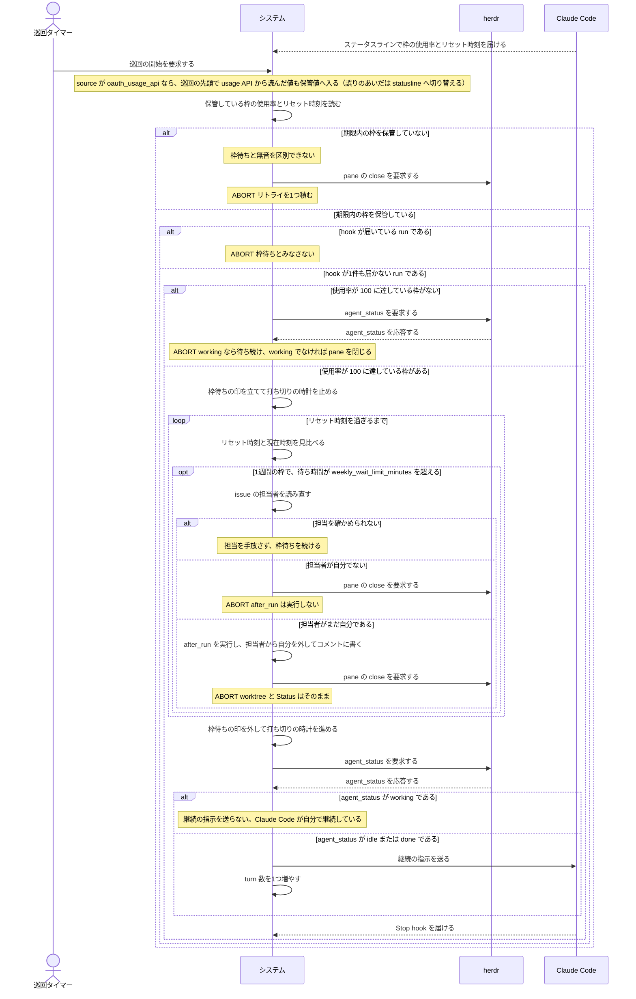

# ユースケース: レートリミットで待って再開する

## 根拠資料

- `docs/plans/continuo_design.md#3-11`（`CLAUDE_CODE_RETRY_WATCHDOG` を環境変数で渡す）
- `docs/plans/continuo_design.md#3-4f`（巡回は、statusline取得の値が届いた知らせでも回る）
- `docs/plans/continuo_design.md#3-15`（使用率とリセット時刻の読み取り）
- `docs/plans/continuo_design.md#3-21`（打ち切りの時計は中間の hook と画面の版でリセットする）
- `docs/plans/continuo_design.md#3-27`（レートリミットで止まっても自分で再開する。2条件と評価順・usage API と statusline の切り替え・保管値の規則・statusline取得）
- `docs/plans/continuo_design.md#3-77i`（回復待ちと待つ上限は、新しさを問わずに保管値を使い続ける。新しさで止めるのは入札だけである）
- `docs/plans/continuo_design.md#5-2`（`rate_limit` の設定キー）
- `internal/orchestrator/turn.go` の `isQuotaWaiting`、`quotaFull`、`quotaResetAt`、`afterWaitTimeout`、`afterQuotaReset`
- `internal/orchestrator/reconcile.go` の `checkStalls`
- `internal/orchestrator/orchestrator.go` の `Run`、`Tick`、`pollAPI`
- `internal/orchestrator/quota.go` の `OnAPISnapshot`、`OnStatusline`、`quotaSnapshot`
- `internal/orchestrator/statuslinefetch.go` の `maybeStartStatuslineFetch`
- `internal/handoff/handoff.go` の `Full`、`Short`、`ShortWeekly`（余裕が無い枠を選ぶ、唯一の線）
- `internal/orchestrator/reconcile.go` の `releaseQuotaWaitExceeded`、`paneStopped`（手放しの唯一の入口）
- `internal/orchestrator/handoff.go` の `weeklyWaitExceededWith`、`releaseBecauseQuotaWaitAsync`
- `internal/ratelimit/ratelimit.go` の `Snapshot`

## RUCM

```rucm
USE CASE NAME: レートリミットで待って再開する
BRIEF DESCRIPTION: 巡回タイマーが巡回を起こす。巡回は statusline取得の値が届いた知らせでも起きる。システムは Claude の usage API か Claude Code のステータスラインから受けて保管している枠の使用率とリセット時刻を読み、枠を使い切った run に枠待ちの印を立てて打ち切りの判定を飛ばす。システムはリセット時刻を過ぎたら印を外し、agent_status を見てから継続の指示を1回送る。
PRECONDITION: システムは常駐している。走行中の run が1件以上ある。設定の rate_limit.source は none ではない。issue の Status は running_state の選択肢である。
PRIMARY ACTOR: 巡回タイマー
SECONDARY ACTORS: herdr、Claude Code
DEPENDENCY: なし
GENERALIZATION: なし

BASIC FLOW:
1. 巡回タイマーはシステムに巡回の開始を要求する。
2. システムは VALIDATES THAT Claude の usage API か Claude Code のステータスラインから受けた枠の使用率とリセット時刻のうち、リセット時刻を過ぎていないものを保管している。
3. システムは VALIDATES THAT 走行中の run が turn_timeout_ms のあいだ hook を1件も受けていない。
4. システムは VALIDATES THAT 使用率が 100 に達している枠がある。
5. システムは run に枠待ちの印を立てる。
6. システムは run の打ち切りの判定を飛ばす。
7. システムは run の最後に動いていた時刻を進めない。
8. DO
9.   システムは枠のリセット時刻と現在時刻を巡回のたびに見比べる。
10. UNTIL 枠のリセット時刻を過ぎている
11. システムは run から枠待ちの印を外す。
12. システムは run の打ち切りの時計を現在時刻に進める。
13. システムは herdr に run の agent_status を要求する。
14. システムは VALIDATES THAT agent_status が idle または done である。
15. システムは Claude Code に継続の指示を送る。
16. システムは run の turn 数を1つ増やす。
17. システムは Claude Code の Stop hook を受ける。
POSTCONDITION: run の枠待ちの印は外れている。run の打ち切りの判定は再び効いている。run の turn 数は1つ増えている。issue の Status は running_state の選択肢のままである。herdr の pane は閉じていない。worktree は残っている。

SPECIFIC ALTERNATIVE FLOW 枠を読めない:
RFS BASIC FLOW 2
1. システムは枠待ちと無音を区別しない。
2. システムは turn_timeout_ms のあいだ待つ。
3. システムは herdr の pane を閉じる。
4. システムはリトライの回数を1つ増やす。
5. システムはバックオフの期限を印に書く。
6. ABORT
POSTCONDITION: herdr の pane は閉じている。印は残っている。issue の Status は running_state の選択肢のままである。worktree は残っている。

SPECIFIC ALTERNATIVE FLOW 応答のあるrun:
RFS BASIC FLOW 3
1. システムは run の時計を止めない。
2. システムは run を枠待ちとみなさない。
3. ABORT
POSTCONDITION: run の枠待ちの印は立っていない。run の打ち切りの判定は効いている。run の turn は続いている。

SPECIFIC ALTERNATIVE FLOW 枠の残り:
RFS BASIC FLOW 4
1. システムは herdr に run の agent_status を要求する。
2. IF agent_status が working である THEN
3.   システムは run の打ち切りの時計を現在時刻に進める。
4. ELSE
5.   システムは herdr の pane を閉じる。
6.   システムはリトライの回数を1つ増やす。
7.   システムはバックオフの期限を印に書く。
8. ENDIF
9. ABORT
POSTCONDITION: run の枠待ちの印は立っていない。agent_status が working だった run は動いている。working でなかった run の herdr の pane は閉じている。issue の Status は running_state の選択肢のままである。

SPECIFIC ALTERNATIVE FLOW 自動継続:
RFS BASIC FLOW 14
1. システムは継続の指示を送らない。
2. RESUME STEP 17
POSTCONDITION: run の turn 数は増えていない。Claude Code は自分で継続している。投げた本文が消える二重投入は起きていない。

GLOBAL ALTERNATIVE FLOW 手放さずに待ち続ける:
BRANCH FROM BASIC FLOW 4
WHEN 使用率が 100 に達しているかを問わず、余裕値が 0 以下の枠に1週間の枠が含まれ、その枠が明けるまでの待ち時間が weekly_wait_limit_minutes を超え、pane が完全に止まっているが、いまの担当を確かめられない場合
1. システムは担当を手放さない。
2. システムは workspace_hooks.after_run を実行しない。
3. RESUME STEP 4
POSTCONDITION: herdr の pane は閉じていない。issue の担当者は自分のままである。worktree は残っている。issue の Status は running_state の選択肢のままである。

GLOBAL ALTERNATIVE FLOW 担当が移っていた:
BRANCH FROM BASIC FLOW 4
WHEN 使用率が 100 に達しているかを問わず、余裕値が 0 以下の枠に1週間の枠が含まれ、その枠が明けるまでの待ち時間が weekly_wait_limit_minutes を超え、pane が完全に止まっており、issue の担当者に自分が入っていない場合
1. システムは workspace_hooks.after_run を実行しない。
2. システムは issue の担当者に触らない。
3. システムは herdr の pane を閉じる。
4. システムは worktree を残す。
5. ABORT
POSTCONDITION: herdr の pane は閉じている。issue の担当者は別の機械のままである。worktree は残っている。issue の Status は running_state の選択肢のままである。

GLOBAL ALTERNATIVE FLOW 待つ上限を超えた:
BRANCH FROM BASIC FLOW 4
WHEN 使用率が 100 に達しているかを問わず、余裕値が 0 以下の枠に1週間の枠が含まれ、その枠が明けるまでの待ち時間が weekly_wait_limit_minutes を超え、pane が完全に止まっており、issue の担当者に自分が入っている場合
1. システムは workspace_hooks.after_run を実行する。
2. システムは issue の担当者から自分を外す。
3. システムは担当を外したことを issue のコメントに書く。
4. システムは herdr の pane を閉じる。
5. システムは worktree を残す。
6. ABORT
POSTCONDITION: herdr の pane は閉じている。issue の担当者から自分は外れている。worktree は残っている。issue の Status は running_state の選択肢のままである。

GLOBAL ALTERNATIVE FLOW 応答の途絶:
BRANCH FROM BASIC FLOW 15
WHEN 継続の指示を送っても turn_timeout_ms のあいだ agent_status も working にならず hook も動かない場合
1. システムは herdr の pane を閉じる。
2. システムは worktree を残す。
3. システムは issue を再 dispatch の対象にする。
4. ABORT
POSTCONDITION: herdr の pane は閉じている。worktree は残っている。issue の Status は running_state の選択肢のままである。印は残っている。
```

## 2つの判定を分ける

**線は2本である。問いが2つあるからである**（2026-09-06 の6段の段4 で確定。設計 3-27）。
**枠待ちの印は「使用率100」、新しい仕事を取るかと1週間の枠を待つ上限は「余裕値が0以下」。**
**`rate_limit.pause_above_percent` は、仕事を取るかを決める門から消えた**
（人間の決定。2026-09-06。issue #173）。**余裕値と同じことを2つの閾値で言っていて、
既定（マージン10）では余裕値が90%で先に効くため、95%のこちらは一度も発火していなかった。**
**キーごと消えた。**statusline取得を開くかの判定も同じ余裕値の線を使う
（`internal/orchestrator/statuslinefetch.go` の `statuslineFetchPointless`）。

| 判定 | 条件 | 何が起きるか |
| --- | --- | --- |
| 新規の着手を止める | **余裕値が 0 以下の枠がある**（`余裕値が0以下`）か、**使用率を1件も読めていない**（`枠を読めない`） | 入札の要る issue を取らない。**担当が既に自分にある issue は取る。**走行中の turn は止めない。時計も止めない。**どちらの理由で止めたかを、既定のログの水準で1行出す**（issue #173） |
| この run は枠待ちである | 使い切っている枠（使用率100）がある。かつ、その run から turn_timeout_ms のあいだ hook が届かない | 打ち切りの判定を飛ばす |
| 担当を手放す | 余裕値が 0 以下の枠に1週間の枠が含まれ、待ち時間が weekly_wait_limit_minutes を超える。**かつ pane が完全に止まっている**（agent の状態の連番が変わらず、agent_status が idle か done）。かつ担当者に自分が入っている。**枠待ちの印は見ない** | after_run を走らせ、担当者から自分を外し、pane を閉じる。worktree と Status はそのまま |
| 確かめられないので手放さない | 上の条件に当たるが、issue かコメントを読めない | 何もしない。枠待ちの印はそのまま。次の巡回でやり直す |
| まだ止まっていないので手放さない | 上の条件に当たるが、pane が動いている（agent_status が working / blocked / unknown、または agent の状態の連番が2回続けて同じでない） | 何もしない。**止まるまで待つ。**`weekly_wait_limit_minutes` を超過しうる |
| 担当が移っているので手放さない | 上の条件に当たるが、issue の担当者に自分が入っていない | after_run を走らせずに pane を閉じる。担当者にもコメントにも触らない |

## 使用率は保管値から読む

**ステップ2 は保管値を読むだけで、その場で問い合わせない**（設計 3-27）。保管値へ値を入れる口は2つある。

- **usage API。**`rate_limit.source: oauth_usage_api`（既定）なら、巡回の先頭で `rate_limit.poll_interval_ms`（既定5分）ごとに読む（`internal/orchestrator/orchestrator.go` の `pollAPI`、`internal/orchestrator/quota.go` の `OnAPISnapshot`）。**誤りのあいだは statusline へ切り替える**
- **ステータスライン。**continuo が起動する Claude Code のステータスラインが運ぶ `rate_limits` を `continuo statusline` が `sl.sock` へ送る（`OnStatusline`）。issue の pane の値は、`oauth_usage_api` でも usage API の次の読み取りを待たずに入る

システムは期間（5時間・7日・モデル別の週次枠 `weekly_scoped`）ごとに値を1つだけ保管する。**`weekly_scoped` は usage API しか運ばない。**

| 何を | どうするか |
| --- | --- |
| ステップ2 で読むもの | 保管値のうち、リセット時刻を過ぎていない期間（`quotaSnapshot`）。**新しさは問わない**（設計 3-77i。同じ期間の中で値は下がらない） |
| 保管値が無いとき | `枠を読めない` へ進む。枠待ちと無音を区別できない |
| 値が古いとき | `source: statusline` か、usage API が誤りで切り替えているなら、巡回の最後に開く条件を見て statusline取得を開く（`maybeStartStatuslineFetch`）。**巡回の中で値を待たない** |
| statusline取得の値が届いたとき | 巡回のループへ知らせ、巡回を1回すぐ回す（設計 3-4f） |
| 使用率が 100 の期間（`weekly_scoped` を除く）が期限内にあるとき | statusline取得を開かない。上限の最中は断られるだけで値は変わらない。**`weekly_scoped` に余裕が無いときも開かない**（ステータスラインに無いので、開いても判定が変わらない） |
| `weekly_scoped` | ステップ3 の閾値とステップ7 の上限の判定に含める。`quota.json` から読み戻すのは `oauth_usage_api` のときだけ |

## 枠明けに継続の指示を送ってよいか

**Claude Code 2.1.234 は枠のリセット時にセッションを自動で継続する**（設計 3-27）。

| agent_status | どうするか |
| --- | --- |
| idle または done | 送る。Claude Code は継続していない |
| working | 送らない。Claude Code が自分で継続している。Stop hook を待つ |
| blocked | 送らない。esc を送ってから failure_state へ落とす |

## フローチャート


```mermaid
flowchart TD
    B1["1. 巡回タイマーが巡回の開始を要求する"]
    B2{"2. VALIDATES THAT 期限内の枠の使用率とリセット時刻を保管している"}
    B3{"3. VALIDATES THAT turn_timeout_ms のあいだ hook を1件も受けていない"}
    B4{"4. VALIDATES THAT 使用率が 100 に達している枠がある"}
    B5["5. run に枠待ちの印を立てる"]
    B6["6. 打ち切りの判定を飛ばす"]
    B7["7. 最後に動いていた時刻を進めない"]
    B8["8. DO"]
    B9["9. リセット時刻と現在時刻を見比べる"]
    B10{"10. UNTIL リセット時刻を過ぎている"}
    B11["11. 枠待ちの印を外す"]
    B12["12. 打ち切りの時計を現在時刻に進める"]
    B13["13. agent_status を要求する"]
    B14{"14. VALIDATES THAT agent_status が idle または done"}
    B15["15. 継続の指示を送る"]
    B16["16. turn 数を1つ増やす"]
    B17["17. Stop hook を受ける"]
    BPOST(["POSTCONDITION 枠が明けて run が続いている"])

    B1 --> B2
    B2 -- 偽 --> F1S1
    B2 -- 真 --> B3
    B3 -- 偽 --> F2S1
    B3 -- 真 --> B4
    B4 -- 偽 --> F3S1
    B4 -- 真 --> B5 --> B6 --> B7 --> B8 --> B9 --> B10
    B10 -- 偽 --> B9
    B10 -- 真 --> B11 --> B12 --> B13 --> B14
    B14 -- 偽 --> F4S1
    B14 -- 真 --> B15 --> B16 --> B17 --> BPOST
    B4 -. "手放さずに待ち続ける: WHEN 使用率100 を問わず、いまの担当を確かめられない場合" .-> G3S1
    B4 -. "担当が移っていた: WHEN 使用率100 を問わず、担当者に自分が入っていない場合" .-> G4S1
    B4 -. "待つ上限を超えた: WHEN 使用率100 を問わず、担当者に自分が入っている場合" .-> G2S1
    B15 -. "応答の途絶: WHEN agent_status も working にならず hook も動かない場合" .-> G1S1

    subgraph SAF1 ["SPECIFIC ALTERNATIVE FLOW 枠を読めない / RFS BASIC FLOW 2"]
        F1S1["1. 枠待ちと無音を区別しない"] --> F1S2["2. turn_timeout_ms のあいだ待つ"] --> F1S3["3. pane を閉じる"] --> F1S4["4. リトライを1つ増やす"] --> F1S5["5. バックオフの期限を書く"] --> F1S6["6. ABORT"]
    end

    subgraph SAF2 ["SPECIFIC ALTERNATIVE FLOW 応答のあるrun / RFS BASIC FLOW 3"]
        F2S1["1. run の時計を止めない"] --> F2S2["2. 枠待ちとみなさない"] --> F2S3["3. ABORT"]
    end

    subgraph SAF3 ["SPECIFIC ALTERNATIVE FLOW 枠の残り / RFS BASIC FLOW 4"]
        F3S1["1. agent_status を要求する"] --> F3S2{"2. IF agent_status が working である"}
        F3S2 -- 真 --> F3S3["3. 打ち切りの時計を進める"] --> F3S8["8. ENDIF"]
        F3S2 -- 偽 --> F3S5["5. pane を閉じる"] --> F3S6["6. リトライを1つ増やす"] --> F3S7["7. バックオフの期限を書く"] --> F3S8
        F3S8 --> F3S9["9. ABORT"]
    end

    subgraph SAF4 ["SPECIFIC ALTERNATIVE FLOW 自動継続 / RFS BASIC FLOW 14"]
        F4S1["1. 継続の指示を送らない"] --> F4S2["2. RESUME STEP 17"]
    end

    subgraph GAF3 ["GLOBAL ALTERNATIVE FLOW 手放さずに待ち続ける / BRANCH FROM BASIC FLOW 4"]
        G3S1["1. 担当を手放さない"] --> G3S2["2. after_run を実行しない"] --> G3S3["3. RESUME STEP 4"]
    end

    subgraph GAF4 ["GLOBAL ALTERNATIVE FLOW 担当が移っていた / BRANCH FROM BASIC FLOW 4"]
        G4S1["1. after_run を実行しない"] --> G4S2["2. 担当者に触らない"] --> G4S3["3. pane を閉じる"] --> G4S4["4. worktree を残す"] --> G4S5["5. ABORT"]
    end

    subgraph GAF2 ["GLOBAL ALTERNATIVE FLOW 待つ上限を超えた / BRANCH FROM BASIC FLOW 4"]
        G2S1["1. after_run を実行する"] --> G2S2["2. 担当者から自分を外す"] --> G2S3["3. 担当を外したことをコメントに書く"] --> G2S4["4. pane を閉じる"] --> G2S5["5. worktree を残す"] --> G2S6["6. ABORT"]
    end

    subgraph GAF1 ["GLOBAL ALTERNATIVE FLOW 応答の途絶 / BRANCH FROM BASIC FLOW 15"]
        G1S1["1. pane を閉じる"] --> G1S2["2. worktree を残す"] --> G1S3["3. 再 dispatch の対象にする"] --> G1S4["4. ABORT"]
    end

    F4S2 --> B17
```

## シーケンス図


```mermaid
sequenceDiagram
    actor T as 巡回タイマー
    participant S as システム
    participant H as herdr
    participant CC as Claude Code

    CC-->>S: ステータスラインで枠の使用率とリセット時刻を届ける
    T->>S: 巡回の開始を要求する
    Note over S: source が oauth_usage_api なら、巡回の先頭で usage API から読んだ値も保管値へ入る（誤りのあいだは statusline へ切り替える）
    S->>S: 保管している枠の使用率とリセット時刻を読む
    alt 期限内の枠を保管していない
        Note over S: 枠待ちと無音を区別できない
        S->>H: pane の close を要求する
        Note over S: ABORT リトライを1つ積む
    else 期限内の枠を保管している
        alt hook が届いている run である
            Note over S: ABORT 枠待ちとみなさない
        else hook が1件も届かない run である
            alt 使用率が 100 に達している枠がない
                S->>H: agent_status を要求する
                H-->>S: agent_status を応答する
                Note over S: ABORT working なら待ち続け、working でなければ pane を閉じる
            else 使用率が 100 に達している枠がある
                S->>S: 枠待ちの印を立てて打ち切りの時計を止める
                loop リセット時刻を過ぎるまで
                    S->>S: リセット時刻と現在時刻を見比べる
                    opt 1週間の枠で、待ち時間が weekly_wait_limit_minutes を超える
                        S->>S: issue の担当者を読み直す
                        alt 担当を確かめられない
                            Note over S: 担当を手放さず、枠待ちを続ける
                        else 担当者が自分でない
                            S->>H: pane の close を要求する
                            Note over S: ABORT after_run は実行しない
                        else 担当者がまだ自分である
                            S->>S: after_run を実行し、担当者から自分を外してコメントに書く
                            S->>H: pane の close を要求する
                            Note over S: ABORT worktree と Status はそのまま
                        end
                    end
                end
                S->>S: 枠待ちの印を外して打ち切りの時計を進める
                S->>H: agent_status を要求する
                H-->>S: agent_status を応答する
                alt agent_status が working である
                    Note over S: 継続の指示を送らない。Claude Code が自分で継続している
                else agent_status が idle または done である
                    S->>CC: 継続の指示を送る
                    S->>S: turn 数を1つ増やす
                end
                CC-->>S: Stop hook を届ける
            end
        end
    end
```
