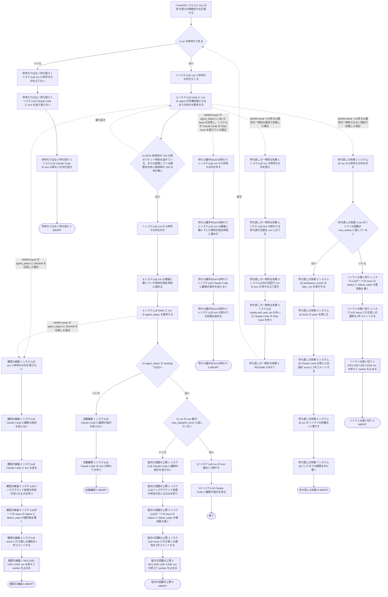
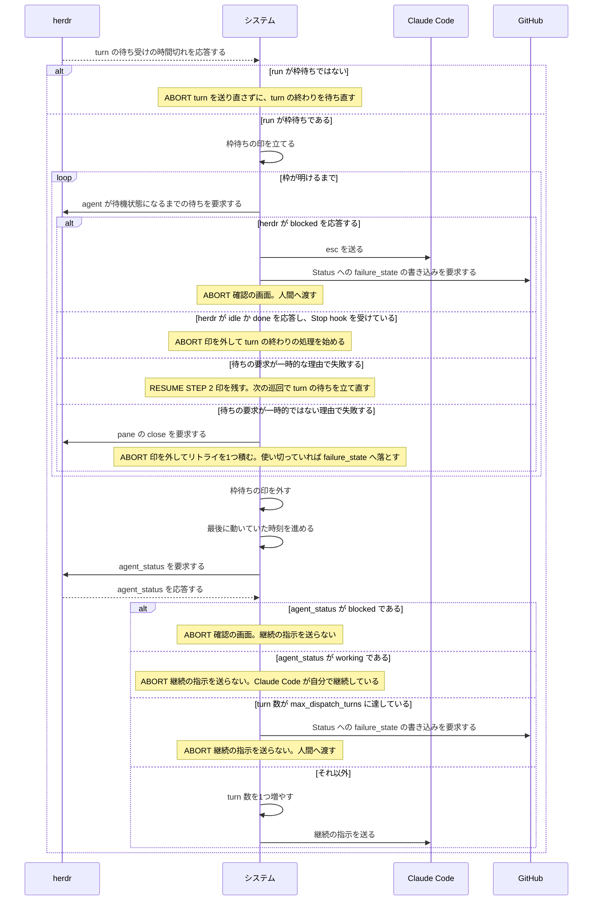

# ユースケース: レートリミットで待って再開する

> **レートリミットの扱いのうち、turn の待ち（`afterWaitTimeout` → `afterQuotaReset` → `turnLoop`）が行う側だけを書いた記述である。**
> 巡回が行う側（枠待ちの run の打ち切りを止める・1週間の枠を待つ上限で担当を手放す）は `枠待ちの run の打ち切りを止める` に在る。
> 2つは別の goroutine が独立に行うので、1本に並べると経路が掛け算で増える。分けて書く（人間の決定。2026-10-02）。
>
> **継続の指示を送るのは、この記述の側だけである。**巡回は送らない。
> **`failure_state` へ落として人間へ渡す処理（`finishRun`）と、pane を閉じてリトライを積む処理（`abandonRun`）は、
> `issue を1件処理する` と同じ実装を通る。**この記述には、枠待ちから出る入口と、終わったときの状態だけを書く。

## 根拠資料

- `docs/plans/continuo_design.md#3-2`（turn の終わりの判定の規則。待ち受けが時間切れで返ったら枠待ちかを見る）
- `docs/plans/continuo_design.md#3-11`（`blocked` は esc を送ってから人間へ渡す。`CLAUDE_CODE_RETRY_WATCHDOG` を環境変数で渡す）
- `docs/plans/continuo_design.md#3-21`（打ち切りは `agent_status` で測る）
- `docs/plans/continuo_design.md#3-27`（レートリミットで止まっても自分で再開する。2条件・枠明けの `agent_status` の分岐・継続の指示を turn 数に数える）
- `docs/plans/continuo_design.md#3-48`（herdr の一時的な失敗では run を諦めない）
- `docs/plans/continuo_design.md#3-77i`（回復待ちの判定は、新しさを問わずに保管値を使い続ける）
- `internal/orchestrator/turn.go` の `sendTurn`、`confirmTurnEnd`（枠待ちへ入る2つの入口）、`afterWaitTimeout`（印を立て、枠が明けるのを待つ）、`afterQuotaReset`（枠明けの `agent_status` の分岐）、`turnLoop`（`max_dispatch_turns` の検査と、結末ごとの分岐）、`buildTurnText`、`selfStoppedTurn`、`isQuotaWaiting`、`runIdleForTurnTimeout`、`quotaFull`、`quotaResetAt`
- `internal/orchestrator/runstate.go` の `setWaitingQuota`、`clearWaitingQuota`（印を外すと同時に時計を進める）、`beginTurn`（turn 数を増やす）、`addRetry`
- `internal/orchestrator/lifecycle.go` の `finishRun`、`finishRunClaimed`、`waitForBackgroundTasks`、`abandonRun`、`abandonRunClaimed`、`stopWorker`
- `internal/orchestrator/orchestrator.go` の `wakeRuns`（畳んだ turn ループを次の巡回で立て直す）
- `internal/orchestrator/reconcile.go` の `clearQuotaWaitWhenBack`（turn の待ちが畳まれているあいだは、巡回だけが印を外す）
- `internal/orchestrator/quota.go` の `quotaSnapshot`
- `internal/orchestrator/prompt.go` の `BuildContinuationPrompt`

## RUCM

```rucm
USE CASE NAME: レートリミットで待って再開する
BRIEF DESCRIPTION: herdr が turn の待ち受けの時間切れを応答する。システムは保管している枠の使用率と run の無音を見て、run が枠待ちであるかを確かめる。システムは run に枠待ちの印を立てる。システムは枠が明けるまで herdr に待ちを要求する。システムは枠が明けたら枠待ちの印を外す。システムは agent_status を見てから継続の指示を1回送る。
PRECONDITION: システムは常駐している。システムは Claude Code に turn を送って、herdr の待ち受けの応答を待っている。run は direct chat に入っていない。設定の rate_limit.source は none ではない。issue の Status は running_state の選択肢である。failure_state の選択肢は cleanup.on_states に入っていない。
PRIMARY ACTOR: herdr
SECONDARY ACTORS: Claude Code
DEPENDENCY: INCLUDE USE CASE run を終えて worker を止める
GENERALIZATION: なし

BASIC FLOW:
1. herdrはシステムに turn の待ち受けの時間切れを応答する。
2. システムは VALIDATES THAT run が枠待ちである。
3. システムは run に枠待ちの印を立てる。
4. DO
5.   システムは herdr に run の agent が待機状態になるまでの待ちを要求する。
6. UNTIL 使用率が 100 の枠のリセット時刻を過ぎている、または保管している期限内の枠に使用率が 100 の枠が無い
7. システムは run から枠待ちの印を外す。
8. システムは run の最後に動いていた時刻を現在時刻に進める。
9. システムは herdr に run の agent_status を要求する。
10. システムは VALIDATES THAT agent_status が working ではない。
11. システムは VALIDATES THAT run の turn 数が max_dispatch_turns に達していない。
12. システムは run の turn 数を1つ増やす。
13. システムは Claude Code に継続の指示を送る。
POSTCONDITION: run の枠待ちの印は外れている。run の turn 数は1つ増えている。Claude Code は継続の指示を1回受けている。issue の Status は running_state の選択肢のままである。herdr の pane は閉じていない。worktree は残っている。

SPECIFIC ALTERNATIVE FLOW 枠待ちではない待ち受け:
RFS BASIC FLOW 2
1. システムは run に枠待ちの印を立てない。
2. システムは Claude Code に turn を送り直さない。
3. システムは Claude Code の turn の終わりを待ち直す。
4. ABORT
POSTCONDITION: run の枠待ちの印は立っていない。run の turn 数は増えていない。herdr の pane は閉じていない。run の打ち切りの判定は効いている。

SPECIFIC ALTERNATIVE FLOW 自動継続:
RFS BASIC FLOW 10
1. システムは Claude Code に継続の指示を送らない。
2. システムは Claude Code の turn の終わりを待つ。
3. ABORT
POSTCONDITION: run の枠待ちの印は外れている。run の turn 数は増えていない。Claude Code は自分で継続している。投げた本文が消える二重投入は起きていない。herdr の pane は閉じていない。

SPECIFIC ALTERNATIVE FLOW 指示の回数の上限:
RFS BASIC FLOW 11
1. システムは Claude Code に継続の指示を送らない。
2. システムはバックグラウンド処理の申告が空になるのを待つ。
3. システムはボードの issue の Status に failure_state の選択肢を書く。
4. システムは issue に引き渡しの通知を1件コメントする。
5. INCLUDE USE CASE run を終えて worker を止める
6. ABORT
POSTCONDITION: run の turn 数は増えていない。issue の Status は failure_state の選択肢である。issue に引き渡しの通知のコメントが1件ある。印は外れている。worktree は残っている。

GLOBAL ALTERNATIVE FLOW 確認の画面:
BRANCH FROM BASIC FLOW 5,9
WHEN herdr が agent_status に blocked を応答した場合
1. システムは run に枠待ちの印を残さない。
2. システムは Claude Code に継続の指示を送らない。
3. システムは Claude Code に esc を送る。
4. システムはバックグラウンド処理の申告が空になるのを待つ。
5. システムはボードの issue の Status に failure_state の選択肢を書く。
6. システムは issue に引き渡しの通知を1件コメントする。
7. INCLUDE USE CASE run を終えて worker を止める
8. ABORT
POSTCONDITION: run の枠待ちの印は外れている。Claude Code は継続の指示を受けていない。issue の Status は failure_state の選択肢である。issue に引き渡しの通知のコメントが1件ある。印は外れている。worktree は残っている。

GLOBAL ALTERNATIVE FLOW 待ちの最中のturnの終わり:
BRANCH FROM BASIC FLOW 5
WHEN herdr が agent_status に idle か done を応答し、システムが Claude Code の Stop hook を受けている場合
1. システムは run から枠待ちの印を外す。
2. システムは run の最後に動いていた時刻を現在時刻に進める。
3. システムは Claude Code に継続の指示を送らない。
4. システムは turn の終わりの処理を始める。
5. ABORT
POSTCONDITION: run の枠待ちの印は外れている。run の turn 数は増えていない。Claude Code は継続の指示を受けていない。herdr の pane は閉じていない。

GLOBAL ALTERNATIVE FLOW 待ち直しの一時的な失敗:
BRANCH FROM BASIC FLOW 5
WHEN herdr への待ちの要求が一時的な理由で失敗した場合
1. システムは run の枠待ちの印を残す。
2. システムは turn の終わりを待ち直す合図を run に立てる。
3. システムは次の巡回で run の turn の待ちを立て直す。
4. システムは claude.poll_wait_ms のあいだ Claude Code の Stop hook を待つ。
5. RESUME STEP 2
POSTCONDITION: run の枠待ちの印は立っている。run のリトライの回数は増えていない。Claude Code は継続の指示を受けていない。herdr の pane は閉じていない。

GLOBAL ALTERNATIVE FLOW 待ち直しの失敗:
BRANCH FROM BASIC FLOW 5
WHEN herdr への待ちの要求が一時的ではない理由で失敗した場合
1. システムは run から枠待ちの印を外す。
2. システムは VALIDATES THAT run のリトライの回数が max_retries に達していない。
3. システムは workspace_hooks の after_run を実行する。
4. システムは herdr の pane を閉じる。
5. システムは Claude Code を閉じた記録を issue に1件コメントする。
6. システムは run のリトライの回数を1つ増やす。
7. システムはバックオフの期限を印に書く。
8. ABORT
POSTCONDITION: run の枠待ちの印は外れている。run のリトライの回数は1つ増えている。印は残っている。issue の Status は running_state の選択肢のままである。worktree は残っている。

SPECIFIC ALTERNATIVE FLOW リトライの使い切り:
RFS 待ち直しの失敗 2
1. システムはボードの issue の Status に failure_state の選択肢を書く。
2. システムは issue に引き渡しの通知を1件コメントする。
3. INCLUDE USE CASE run を終えて worker を止める
4. ABORT
POSTCONDITION: run の枠待ちの印は外れている。issue の Status は failure_state の選択肢である。issue に引き渡しの通知のコメントが1件ある。印は外れている。worktree は残っている。
```

## この記述で使う言葉

| 語 | 何を指すか |
| --- | --- |
| **turn の待ち受け** | `agent.prompt` に付けた待ち（`until` = `claude.wait_until`、`timeout_ms` = `claude.turn_timeout_ms`）。時間切れは herdr が `timeout` の誤りとして応答する |
| **run が枠待ちである** | 次の2つが同時に成り立つこと（`isQuotaWaiting`）。**(1)** 保管している期限内の枠に使用率が 100 の枠がある。**(2)** その run がこの turn で hook を1件も受けていないか、最後に動いていた時刻から `claude.turn_timeout_ms` が過ぎている |
| **枠待ちの印** | run が持つ `WaitingQuota`。立っているあいだ、巡回はその run の打ち切りの判定を飛ばす（`枠待ちの run の打ち切りを止める`） |
| **印** | 走行中の run の登録（`o.runs`）。**枠待ちの印とは別物である** |
| **枠が明ける** | 「使用率が 100 の枠のリセット時刻を過ぎた」か「保管している期限内の枠に使用率が 100 の枠が無くなった」のどちらかが成り立つこと |
| **継続の指示** | turn ループが2回目以降に送る本文（`BuildContinuationPrompt`） |

## 段にしていない分岐

**終わり方も、そのあと通る段も変わらない分岐は、段にせずここへ置く。**

| どこで | 何が起きるか | どうなるか |
| --- | --- | --- |
| 段1 | 入口がもう1つある。`Stop` を待ち直している最中（`confirmTurnEnd`）に、`claude.poll_wait_ms` のあいだ `Stop` が来なかったとき | 同じ `isQuotaWaiting` を見て、真なら段3 から通る。偽なら `blocked` を見てから待ち続ける |
| 段2 | 2つの条件のどちらが欠けても | `枠待ちではない待ち受け` へ進む。**ここでは打ち切らない。**打ち切るかどうかは巡回だけが決める |
| 段3 | 巡回が先に同じ印を立てている（`枠待ちの run の打ち切りを止める` の段6） | 立て直すだけで、結果は同じである |
| 段5 | herdr が待ちの時間切れを応答する（`claude.poll_wait_ms`） | 失敗として扱わず、段6 へ進む |
| 段5 | herdr が idle か done を応答したが、`Stop` hook を受けていない | 何もせず段6 へ進む。**`agent.wait` はいまの状態が `until` に含まれると即座に返る**ので、1周あたり `claude.poll_wait_ms` は必ず空ける |
| 段5 | continuo 自身が worker を止めていた（`selfStoppedTurn`）、または停止を求められている | 何も書かずに turn の待ちを抜ける。別の経路がその run を終わらせている最中である |
| 段9 | herdr が `agent.get` に誤りを返す | WARN を1行出して、送る側へ進む（段10 の真の側） |
| 段9 | agent_status が idle・done・unknown である | 送る側へ進む（段10 の真の側） |
| 段11 と段12 のあいだ | 継続の指示ではなく1回目の本文を送る run（まだ1回目を送り始めていない run）で、本文の組み立てに失敗する | `failure_state` へ落とす（`failRun`）。`issue を1件処理する` の `本文の組み立ての失敗` が受け持つ |
| `確認の画面` の段3 より前 | 走っている subagent が終わるのを `claude.poll_wait_ms` まで待つ | `issue を1件処理する` の `権限の確認` が受け持つ |
| `待ち直しの失敗` の「pane を閉じる」 | herdr が pane を閉じ損ねる | **閉じた記録を書かない。**保留も捨てる（`settleClosedRecord`）。あとの段はそのまま続く |
| `指示の回数の上限`・`確認の画面` の INCLUDE の中、印を外す前 | 取り直した Status が `cleanup.on_states` に入っている | worktree と branch を片付ける（`finishRunClaimed`）。**前提で外した**（`failure_state` は `cleanup.on_states` に入っていない） |
| `指示の回数の上限`・`確認の画面`・`リトライの使い切り` の INCLUDE | 成果の報告が無く、書かせ直しにも失敗する | `run を終えて worker を止める` の代替フローが受け持つ。Status は既に `failure_state` で、通知も投稿済みなので、どちらも重ねて書かれない |

## 巡回だけが印を外す場合

**turn の待ちが `待ち直しの一時的な失敗` で畳まれているあいだに枠が明けると、印を外すのは巡回だけになる**
（`枠待ちの run の打ち切りを止める` の段10）。**そのとき継続の指示は送られない。**

| 順 | 誰が | 何をするか |
| --- | --- | --- |
| 1 | turn の待ち | herdr へ届かず、印を残したまま turn ループを畳む（`turnTransient`） |
| 2 | 次の巡回 | turn ループを「turn を送らずに待つ」形で立て直す（`wakeRuns`） |
| 3 | 立て直した turn ループ | `Stop` を `claude.poll_wait_ms`（既定30秒）のあいだ待ち切ってから、枠待ちかを見る（`confirmTurnEnd`） |
| 4 | 立て直した turn ループ | 枠待ちなら、この記述の段3 から通り直す |

**窓は「畳まれてから、次の巡回 + `claude.poll_wait_ms`」までである。**この窓の中で枠が明けると、順3 の時点で枠待ちではないので、
turn ループは `Stop` を待ち続ける。印を外した時刻から `claude.turn_timeout_ms` のあいだ進んだ形跡が無ければ、
巡回がその run を打ち切ってリトライを積む（`枠待ちの run の打ち切りを止める` の `枠の残り`）。バックオフが明けた再 dispatch が続きを受け持つ。

**継続の指示を送ったあとに応答が無い run にも、専用の分岐は無い。**次の待ち受けの時間切れで、この記述を段1 からもう一度通る。

## 枠明けに継続の指示を送ってよいか

**Claude Code 2.1.234 は枠のリセット時にセッションを自動で継続する**（設計 3-27）。
段9 で読んだ `agent_status` で分かれる（`internal/orchestrator/turn.go` の `afterQuotaReset`）。

| agent_status | どうするか | この記述のどこか |
| --- | --- | --- |
| idle または done | 送る。Claude Code は継続していない | 基本フロー |
| unknown | 送る | 基本フロー |
| 読めなかった（herdr が誤りを返した） | 送る。WARN を1行出す | 基本フロー |
| working | 送らない。Claude Code が自分で継続している。turn の終わりを待つ | `自動継続` |
| blocked | 送らない。esc を送ってから failure_state へ落とす | `確認の画面` |

**`確認の画面` の細部（走っている subagent を待つ・引き渡しの通知の文面）は、`issue を1件処理する` が受け持つ。**
この記述には、枠待ちから出る入口と、終わったときの状態だけを書いた。

## フローチャート


```mermaid
flowchart TD
    BS1["1 herdrはシステムに turn の待ち受けの時間切れを応答する"]
    BS2{"2 run が枠待ちである"}
    BS3["3 システムは run に枠待ちの印を立てる"]
    BS5["5 システムは herdr に run の agent が待機状態になるまでの待ちを要求する"]
    BS6{"6 UNTIL 使用率が 100 の枠のリセット時刻を過ぎている、または保管している期限内の枠に使用率が 100 の枠が無い"}
    BS7["7 システムは run から枠待ちの印を外す"]
    BS8["8 システムは run の最後に動いていた時刻を現在時刻に進める"]
    BS9["9 システムは herdr に run の agent_status を要求する"]
    BS10{"10 agent_status が working ではない"}
    BS11{"11 run の turn 数が max_dispatch_turns に達していない"}
    BS12["12 システムは run の turn 数を1つ増やす"]
    BS13["13 システムは Claude Code に継続の指示を送る"]
    A1S1["枠待ちではない待ち受け 1 システムは run に枠待ちの印を立てない"]
    A1S2["枠待ちではない待ち受け 2 システムは Claude Code に turn を送り直さない"]
    A1S3["枠待ちではない待ち受け 3 システムは Claude Code の turn の終わりを待ち直す"]
    A1S4(["枠待ちではない待ち受け 4 ABORT"])
    A2S1["自動継続 1 システムは Claude Code に継続の指示を送らない"]
    A2S2["自動継続 2 システムは Claude Code の turn の終わりを待つ"]
    A2S3(["自動継続 3 ABORT"])
    A3S1["指示の回数の上限 1 システムは Claude Code に継続の指示を送らない"]
    A3S2["指示の回数の上限 2 システムはバックグラウンド処理の申告が空になるのを待つ"]
    A3S3["指示の回数の上限 3 システムはボードの issue の Status に failure_state の選択肢を書く"]
    A3S4["指示の回数の上限 4 システムは issue に引き渡しの通知を1件コメントする"]
    A3S5[["指示の回数の上限 5 INCLUDE USE CASE run を終えて worker を止める"]]
    A3S6(["指示の回数の上限 6 ABORT"])
    A4S1["確認の画面 1 システムは run に枠待ちの印を残さない"]
    A4S2["確認の画面 2 システムは Claude Code に継続の指示を送らない"]
    A4S3["確認の画面 3 システムは Claude Code に esc を送る"]
    A4S4["確認の画面 4 システムはバックグラウンド処理の申告が空になるのを待つ"]
    A4S5["確認の画面 5 システムはボードの issue の Status に failure_state の選択肢を書く"]
    A4S6["確認の画面 6 システムは issue に引き渡しの通知を1件コメントする"]
    A4S7[["確認の画面 7 INCLUDE USE CASE run を終えて worker を止める"]]
    A4S8(["確認の画面 8 ABORT"])
    A5S1["待ちの最中のturnの終わり 1 システムは run から枠待ちの印を外す"]
    A5S2["待ちの最中のturnの終わり 2 システムは run の最後に動いていた時刻を現在時刻に進める"]
    A5S3["待ちの最中のturnの終わり 3 システムは Claude Code に継続の指示を送らない"]
    A5S4["待ちの最中のturnの終わり 4 システムは turn の終わりの処理を始める"]
    A5S5(["待ちの最中のturnの終わり 5 ABORT"])
    A6S1["待ち直しの一時的な失敗 1 システムは run の枠待ちの印を残す"]
    A6S2["待ち直しの一時的な失敗 2 システムは turn の終わりを待ち直す合図を run に立てる"]
    A6S3["待ち直しの一時的な失敗 3 システムは次の巡回で run の turn の待ちを立て直す"]
    A6S4["待ち直しの一時的な失敗 4 システムは claude.poll_wait_ms のあいだ Claude Code の Stop hook を待つ"]
    A6S5["待ち直しの一時的な失敗 5 RESUME STEP 2"]
    A7S1["待ち直しの失敗 1 システムは run から枠待ちの印を外す"]
    A7S2{"待ち直しの失敗 2 run のリトライの回数が max_retries に達していない"}
    A7S3["待ち直しの失敗 3 システムは workspace_hooks の after_run を実行する"]
    A7S4["待ち直しの失敗 4 システムは herdr の pane を閉じる"]
    A7S5["待ち直しの失敗 5 システムは Claude Code を閉じた記録を issue に1件コメントする"]
    A7S6["待ち直しの失敗 6 システムは run のリトライの回数を1つ増やす"]
    A7S7["待ち直しの失敗 7 システムはバックオフの期限を印に書く"]
    A7S8(["待ち直しの失敗 8 ABORT"])
    A8S1["リトライの使い切り 1 システムはボードの issue の Status に failure_state の選択肢を書く"]
    A8S2["リトライの使い切り 2 システムは issue に引き渡しの通知を1件コメントする"]
    A8S3[["リトライの使い切り 3 INCLUDE USE CASE run を終えて worker を止める"]]
    A8S4(["リトライの使い切り 4 ABORT"])
    BS1 --> BS2
    BS2 -- はい --> BS3
    BS2 -- いいえ --> A1S1
    BS3 --> BS5
    BS5 --> BS6
    BS5 -. "WHEN herdr が agent_status に blocked を応答した場合" .-> A4S1
    BS5 -. "WHEN herdr が agent_status に idle か done を応答し、システムが Claude Code の Stop hook を受けている場合" .-> A5S1
    BS5 -. "WHEN herdr への待ちの要求が一時的な理由で失敗した場合" .-> A6S1
    BS5 -. "WHEN herdr への待ちの要求が一時的ではない理由で失敗した場合" .-> A7S1
    BS6 -- はい --> BS7
    BS6 -. "繰り返す" .-> BS5
    BS7 --> BS8
    BS8 --> BS9
    BS9 --> BS10
    BS9 -. "WHEN herdr が agent_status に blocked を応答した場合" .-> A4S1
    BS10 -- はい --> BS11
    BS10 -- いいえ --> A2S1
    BS11 -- はい --> BS12
    BS11 -- いいえ --> A3S1
    BS12 --> BS13
    A1S1 --> A1S2
    A1S2 --> A1S3
    A1S3 --> A1S4
    A2S1 --> A2S2
    A2S2 --> A2S3
    A3S1 --> A3S2
    A3S2 --> A3S3
    A3S3 --> A3S4
    A3S4 --> A3S5
    A3S5 --> A3S6
    A4S1 --> A4S2
    A4S2 --> A4S3
    A4S3 --> A4S4
    A4S4 --> A4S5
    A4S5 --> A4S6
    A4S6 --> A4S7
    A4S7 --> A4S8
    A5S1 --> A5S2
    A5S2 --> A5S3
    A5S3 --> A5S4
    A5S4 --> A5S5
    A6S1 --> A6S2
    A6S2 --> A6S3
    A6S3 --> A6S4
    A6S4 --> A6S5
    A6S5 -. "戻る" .-> BS2
    A7S1 --> A7S2
    A7S2 -- はい --> A7S3
    A7S2 -- いいえ --> A8S1
    A7S3 --> A7S4
    A7S4 --> A7S5
    A7S5 --> A7S6
    A7S6 --> A7S7
    A7S7 --> A7S8
    A8S1 --> A8S2
    A8S2 --> A8S3
    A8S3 --> A8S4
    BS13 --> END(["終了"])
```

## シーケンス図


```mermaid
sequenceDiagram
    participant H as herdr
    participant S as システム
    participant CC as Claude Code
    participant GH as GitHub

    H-->>S: turn の待ち受けの時間切れを応答する
    alt run が枠待ちではない
        Note over S: ABORT turn を送り直さずに、turn の終わりを待ち直す
    else run が枠待ちである
        S->>S: 枠待ちの印を立てる
        loop 枠が明けるまで
            S->>H: agent が待機状態になるまでの待ちを要求する
            alt herdr が blocked を応答する
                S->>CC: esc を送る
                S->>GH: Status への failure_state の書き込みを要求する
                Note over S: ABORT 確認の画面。人間へ渡す
            else herdr が idle か done を応答し、Stop hook を受けている
                Note over S: ABORT 印を外して turn の終わりの処理を始める
            else 待ちの要求が一時的な理由で失敗する
                Note over S: RESUME STEP 2 印を残す。次の巡回で turn の待ちを立て直す
            else 待ちの要求が一時的ではない理由で失敗する
                S->>H: pane の close を要求する
                Note over S: ABORT 印を外してリトライを1つ積む。使い切っていれば failure_state へ落とす
            end
        end
        S->>S: 枠待ちの印を外す
        S->>S: 最後に動いていた時刻を進める
        S->>H: agent_status を要求する
        H-->>S: agent_status を応答する
        alt agent_status が blocked である
            Note over S: ABORT 確認の画面。継続の指示を送らない
        else agent_status が working である
            Note over S: ABORT 継続の指示を送らない。Claude Code が自分で継続している
        else turn 数が max_dispatch_turns に達している
            S->>GH: Status への failure_state の書き込みを要求する
            Note over S: ABORT 継続の指示を送らない。人間へ渡す
        else それ以外
            S->>S: turn 数を1つ増やす
            S->>CC: 継続の指示を送る
        end
    end
```
