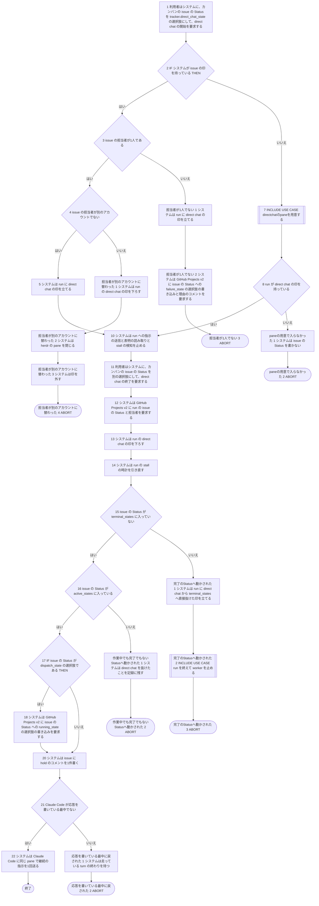
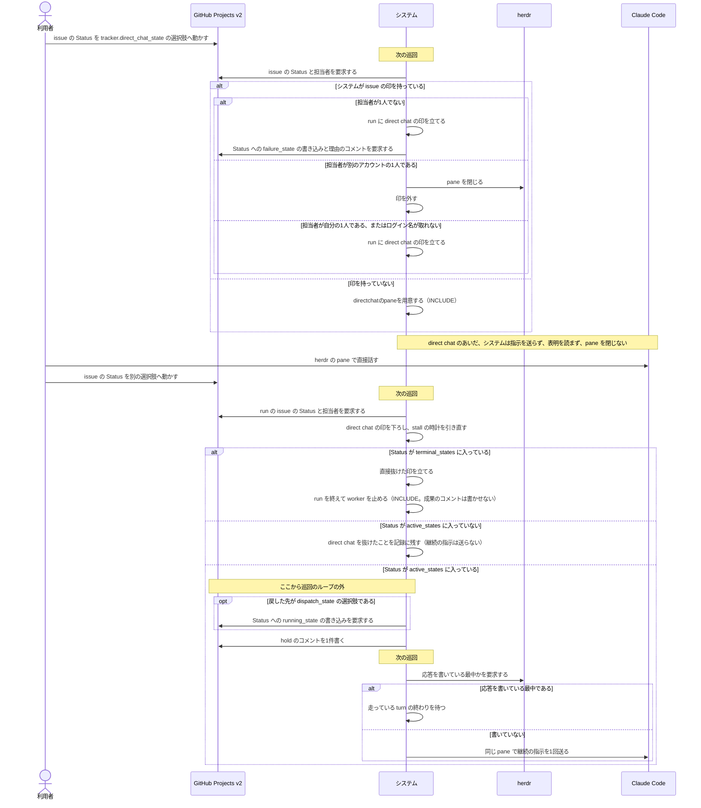

# ユースケース: 人間がpaneに入って直接続ける

## 根拠資料

- `docs/plans/continuo_design.md` の「3-83. direct chat — 人間が pane で直接続けるあいだ、continuo は手を出さない」（direct chat のあいだにしないことの表、既定値、カンバンに選択肢が無いときの扱い）
- `docs/plans/continuo_design.md` の「3-83b. direct chat の候補は、専用の1パスへ分ける」（巡回の段1〜段5）
- `docs/plans/continuo_design.md` の「3-83f. 印を外す道は、門とは別に6本ある」（終わらせる処理をやめる判定、送る側が控えの Status でも見ること）
- `docs/plans/continuo_design.md` の「3-83g. direct chat から出るとき — 出口と後始末」（出口の表）
- `docs/plans/continuo_design.md` の「3-83h. direct chat に入れるのは、担当者が1人で、それが自分のアカウントのときだけ」（判定の表、手を離す経路、戻したときの hold）
- `docs/plans/continuo_design.md` の「3-83i. 戻したときに捨てるもの3つと、引き直す時計1つ」
- `internal/orchestrator/reconcile.go` の `reconcileRunning` / `updateDirectChatMode` / `enterDirectChat` / `checkStalls`
- `internal/orchestrator/directchat.go` の `judgeDirectChatAssignees` / `writeDirectChatAssigneeFailureAsync` / `writeDirectChatFailure` / `letGoOfDirectChatAsync` / `returnFromDirectChatAsync` / `writeRunningStateOnReturn` / `directChatReturnState` / `postDirectChatHold` / `abortTerminalForHuman` / `cardInDirectChat`
- `internal/orchestrator/orchestrator.go` の `wakeRuns` / `candidateStates`
- `internal/orchestrator/turn.go` の `turnLoop`（direct chat の run へ送らない判定と、送る直前に応答を書いている最中かを見る判定）
- `internal/orchestrator/lifecycle.go` の `handleTurnEnd` / `decideAfterTurn` / `stopWorker` / `stopAndReleaseAsync`
- `internal/orchestrator/runstate.go` の `enterDirectChatMode` / `leaveDirectChatMode` / `setDirectExitToTerminal`

continuo がまだ着手していない issue（印を持っていない issue）を direct chat へ動かしたときの pane の用意は、[directchatのpaneを用意する.rucm.md](directchatのpaneを用意する.rucm.md) に書いてある。この記述は `INCLUDE USE CASE` で引く。
完了の Status へ動かされたあとの後始末は、[run を終えて worker を止める.rucm.md](run%20を終えて%20worker%20を止める.rucm.md) を引く。

## 記述の中の語が指すもの

| 記述の語 | 実装 | 何を指すか |
| --- | --- | --- |
| direct chat | `tracker.direct_chat_state`（既定 `Direct Chat`） | 人間が herdr の pane に入って Claude Code と直接話すあいだ、continuo が手を出さない状態。カンバンの Status の選択肢1つで表す |
| 印 | `Orchestrator` の `runs` | 「この issue は自分が取った」という、常駐プロセスのメモリ上の記録。印を持つ issue を run と呼ぶ |
| direct chat の印 | `runState` の `directChatMode` | 「人間が pane で直接続けている」という、run の上の記録。立っているあいだ、下の表のことをしない |
| 継続の指示 | 組み込みの指示書の継続の本文 | 1回目の本文を送り終えた run へ送る、続きを促す指示。1回目の本文をまだ送っていない run（`SendFirstPrompt` が真）へは、1回目の本文を送る |
| hold のコメント | `handoff.FormatDirectChatHold` | 担当の持ち回りで「この機械が担当を持っている」と読まれる、issue のコメント。戻した時点から数え直す |

## direct chat の印が立っているあいだに、システムがしないこと

基本フローの段10 の中身である。どれも run の流れを分けないので、段にせず表に書く。

| しないこと | どこで止めているか |
| --- | --- |
| Claude Code へ指示を送る | `wakeRuns` と `turnLoop` の先頭。印だけでなく、控えの Status が direct chat のときも送らない（`cardInDirectChat`） |
| turn の終わりに表明を読んで Status を動かす | `handleTurnEnd` の先頭。turn の終わりのほうが巡回より先に direct chat を見たときは、`decideAfterTurn` が後始末をせずに戻る |
| 画面が止まっている run を打ち切る（stall の検知）・レートリミット待ちの上限で手放す | `checkStalls` |
| pane を閉じる | `stopWorker` の入口の門 |
| 印を外す | `stopAndReleaseAsync` の入口の門。issue がカンバンから見えなくなった巡回でも外さない |
| 走っていた終わらせる処理を続ける | `abortTerminalForHuman`。その pane で Claude Code の起動が済んでいれば、終わらせる処理をやめて印を残す。済んでいなければ、自分で開いた pane を閉じて印を外し、次の巡回で pane を用意し直す |
| Status を書く | 例外は、担当者が1人でないときに `failure_state` を書く経路だけである（段3 の代替フロー） |

## 担当者の判定は、direct chat のあいだ毎巡回当てる

段3 と段4 の検証は、direct chat へ入る巡回だけでなく、入ったあとの巡回でも毎回行う（`updateDirectChatMode`）。
入ったあとで担当者が0人・2人以上・別の1人になったときも、段3・段4 の代替フローと同じ流れになる。

| 担当者 | 印を持つ機械がすること |
| --- | --- |
| 1人で、自分のアカウント | direct chat の印を立てる（段5） |
| 1人だが、自分のログイン名が取れない | direct chat の印を立てる（段5）。判定できないあいだは、指示を送らない側へ倒す |
| 0人か2人以上 | direct chat の印を立て、`failure_state` を書きに行く（`担当者が1人でない`） |
| 1人で、別のアカウント | 手を離す（`担当者が別のアカウントに替わった`） |

## failure_state を書く経路の結末

`担当者が1人でない` の段2 は、巡回のループの外で書く。結末がどれでも、この記述の流れは変わらない。
結末の表は [directchatのpaneを用意する.rucm.md](directchatのpaneを用意する.rucm.md) の「failure_state を書く経路の結末」に在る（同じ関数 `writeDirectChatFailure` で書く）。

## 段18・段20 が失敗したとき

どちらも巡回のループの外で行い、失敗しても継続の指示は送る。段にせず表に書く。

| 段 | 失敗の内容 | どうなるか |
| --- | --- | --- |
| 段18（`running_state` の書き込み） | カンバンの Status の選択肢の写しが空・書き込みの誤り | WARN を1行出して続ける。次の巡回で書き直さない |
| 段18 | 書く直前に取り直した Status が `dispatch_state` でなかった | 書かない。人間が動かした値を上書きしない |
| 段20（hold のコメント） | 自分のログイン名が取れない・投稿の誤り | WARN を1行出して続ける |

段21 の検証（応答を書いている最中か）で、herdr から状態を読めなかったときは、送る側に倒す（段22 へ進む）。

## 段にしていない分岐

| 実装の分岐 | 段にしない理由 |
| --- | --- |
| `tracker.direct_chat_state` が空・カンバンに選択肢が無い | 事前条件に寄せた。選択肢が無ければ、利用者は段1 の操作ができない。選択肢が無いとき、システムは候補の取得にその Status を足さず、WARN を1回だけ出す（`candidateStates`） |
| 巡回が実行中の issue を取り直せない | この巡回では direct chat の出入りを決めない。次の巡回で同じ段を行う。`issue を1件処理する.rucm.md` の巡回の照合の扱いである |
| 完了の Status を書いたのがカンバンの自動化である | `完了のStatusへ動かされた` は、利用者が動かした場合を書いている。自動化が書いた場合の待ち方は `issue を1件処理する.rucm.md` に在る |
| 手を離すときに、別の終わらせる処理が既に走っている | `letGoOfDirectChatAsync` は何もせずに返る。走っている側が片付ける |

## テストの当て方

15本の経路のうち、8本にテストを当ててある（`test/internal/orchestrator/人間がpaneに入って直接続ける_test.go`）。当てていない7本と、その理由は次のとおり。

| 経路 | テストを書かない理由 |
| --- | --- |
| P002（印を持っていて、`dispatch_state` へ戻し、応答を書いている最中だった） | 段17 の分岐（`running_state` を書くか）と段21 の分岐（応答を書いている最中か）は、実装の別々の関数（`writeRunningStateOnReturn` と `turnLoop`）が互いを見ずに決める。残りの3つの組み合わせ（P001・P003・P004）にテストを当ててあり、どちらの分岐も真と偽の両方を通している。4つ目の組み合わせに新しい動きは無く、効果が薄い |
| P010〜P014（段2 の偽の側、つまり pane の用意から入り、段12 から先で分かれる5本） | 段11 から先の動きは、direct chat へ入った道（段2 の真か偽か）で変わらない。どちらの道でも同じ関数（`updateDirectChatMode`）を通り、実装は入った道を覚えていない。P011〜P014 と同じ出口には、段2 の真の側（順に P003〜P006）でテストを当ててある。P010 は、真の側の P002 と同じ組み合わせで、同じ理由で当てていない。偽の側には、基本の出口（P009。`dispatch_state` へ戻すと `running_state` を書き、継続の指示が届く）の1本を当てて、入った道と出口が繋がることを確かめている。偽の側は本物の git で worktree を作るので、同じ出口をもう一度通す効果は薄い |
| P015（`paneの用意で入らなかった`） | 引いた記述 `directchatのpaneを用意する` の打ち切りの経路そのものである。打ち切りの19本のうち17本に、引いた記述の側でテストを当ててある。この記述の側で足す段は「Status を書かない」だけで、引いた記述のテストが同じことを見ている |

direct chat のあいだにしないこと（上の表）のうち、stall の検知を飛ばすこと・表明を読まないこと・終わらせる処理をやめることは、direct chat へ入ったところで終わるテスト（`test/internal/orchestrator/direct_chat_test.go` と `direct_chat_setup_test.go`）が確かめている。
経路の終わりまでは通さないので、経路の番号は付けていない。

## RUCM

```rucm
USE CASE NAME: 人間がpaneに入って直接続ける
BRIEF DESCRIPTION: 利用者はカンバンの issue の Status を tracker.direct_chat_state の選択肢へ動かす。システムは Claude Code への指示の送信を止める。システムは pane と worktree を残す。利用者は herdr の pane で Claude Code と直接話す。利用者が Status を作業中の選択肢へ戻すと、システムは同じ pane へ継続の指示を送る。
PRECONDITION: システムは常駐している。tracker.direct_chat_state に Status 名が設定されている。カンバンに tracker.direct_chat_state の選択肢がある。
PRIMARY ACTOR: 利用者
SECONDARY ACTORS: GitHub Projects v2、herdr、Claude Code
DEPENDENCY: INCLUDE USE CASE directchatのpaneを用意する、INCLUDE USE CASE run を終えて worker を止める
GENERALIZATION: なし

BASIC FLOW:
1. 利用者はシステムに、カンバンの issue の Status を tracker.direct_chat_state の選択肢にして、direct chat の開始を要求する。
2. IF システムが issue の印を持っている THEN
3.   システムは VALIDATES THAT issue の担当者が1人である。
4.   システムは VALIDATES THAT issue の担当者が別のアカウントでない。
5.   システムは run に direct chat の印を立てる。
6. ELSE
7.   INCLUDE USE CASE directchatのpaneを用意する
8.   システムは VALIDATES THAT run が direct chat の印を持っている。
9. ENDIF
10. システムは run への指示の送信と表明の読み取りと stall の検知を止める。
11. 利用者はシステムに、カンバンの issue の Status を別の選択肢にして、direct chat の終了を要求する。
12. システムは GitHub Projects v2 に run の issue の Status と担当者を要求する。
13. システムは run の direct chat の印を下ろす。
14. システムは run の stall の時計を引き直す。
15. システムは VALIDATES THAT issue の Status が terminal_states に入っていない。
16. システムは VALIDATES THAT issue の Status が active_states に入っている。
17. IF issue の Status が dispatch_state の選択肢である THEN
18.   システムは GitHub Projects v2 に issue の Status への running_state の選択肢の書き込みを要求する。
19. ENDIF
20. システムは issue に hold のコメントを1件書く。
21. システムは VALIDATES THAT Claude Code が応答を書いている最中でない。
22. システムは Claude Code に同じ pane で継続の指示を1回送る。
POSTCONDITION: pane は direct chat の前と同じ pane である。システムは direct chat のあいだ pane を閉じていない。システムは direct chat のあいだ Claude Code に指示を送っていない。run は印を持っている。run は direct chat の印を持っていない。Claude Code は継続の指示を1回受け取っている。turn 数は数え直していない。戻した先が dispatch_state の選択肢だったときは、issue の Status は running_state の選択肢である。

SPECIFIC ALTERNATIVE FLOW 担当者が1人でない:
RFS BASIC FLOW 3
1. システムは run に direct chat の印を立てる。
2. システムは GitHub Projects v2 に issue の Status への failure_state の選択肢の書き込みと理由のコメントを要求する。
3. ABORT
POSTCONDITION: システムは Claude Code に指示を送っていない。書けたときは、issue の Status は failure_state の選択肢であり、issue に担当者を1人にする案内のコメントが1件増えており、システムは次の巡回で pane を閉じて印を外す。書けなかったときは、issue の Status は変わっておらず、run は direct chat の印を持ったままであり、システムは次の巡回でもう一度書く。worktree は残っている。

SPECIFIC ALTERNATIVE FLOW 担当者が別のアカウントに替わった:
RFS BASIC FLOW 4
1. システムは run の direct chat の印を下ろす。
2. システムは herdr の pane を閉じる。
3. システムは印を外す。
4. ABORT
POSTCONDITION: pane は閉じている。印は外れている。システムは issue の Status を書いていない。システムは issue にコメントを書いていない。システムは workspace_hooks の after_run を実行していない。システムは push していない。worktree は残っている。

SPECIFIC ALTERNATIVE FLOW paneの用意で入らなかった:
RFS BASIC FLOW 8
1. システムは issue の Status を書かない。
2. ABORT
POSTCONDITION: directchatのpaneを用意する の打ち切りの代替フローの事後条件が成り立っている。run は direct chat の印を持っていない。

SPECIFIC ALTERNATIVE FLOW 完了のStatusへ動かされた:
RFS BASIC FLOW 15
1. システムは run に direct chat から terminal_states へ直接抜けた印を立てる。
2. INCLUDE USE CASE run を終えて worker を止める
3. ABORT
POSTCONDITION: システムは Claude Code に成果のコメントの記録を要求していない。システムは Claude Code を立て直していない。pane は閉じている。印は外れている。issue の Status が cleanup.on_states に入っていなければ、worktree は残っている。

SPECIFIC ALTERNATIVE FLOW 作業中でも完了でもないStatusへ動かされた:
RFS BASIC FLOW 16
1. システムは direct chat を抜けたことを記録に残す。
2. ABORT
POSTCONDITION: run は direct chat の印を持っていない。システムは Claude Code に継続の指示を送っていない。システムは issue の Status を書いていない。同じ巡回の照合が、動かされた先の Status の通常の扱いを行う。

SPECIFIC ALTERNATIVE FLOW 応答を書いている最中に戻された:
RFS BASIC FLOW 21
1. システムは走っている turn の終わりを待つ。
2. ABORT
POSTCONDITION: システムは走っている turn が終わるまで Claude Code に指示を送っていない。pane は閉じていない。run は印を持っている。run は direct chat の印を持っていない。システムは走っている turn の終わりを通常の run の turn の終わりと同じに扱う。
```

## フローチャート



## シーケンス図


