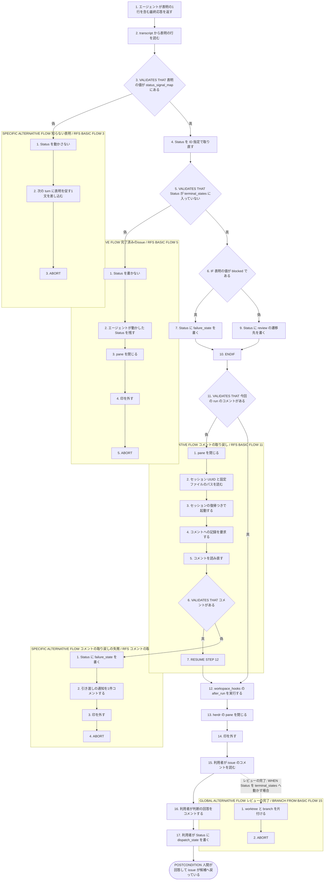
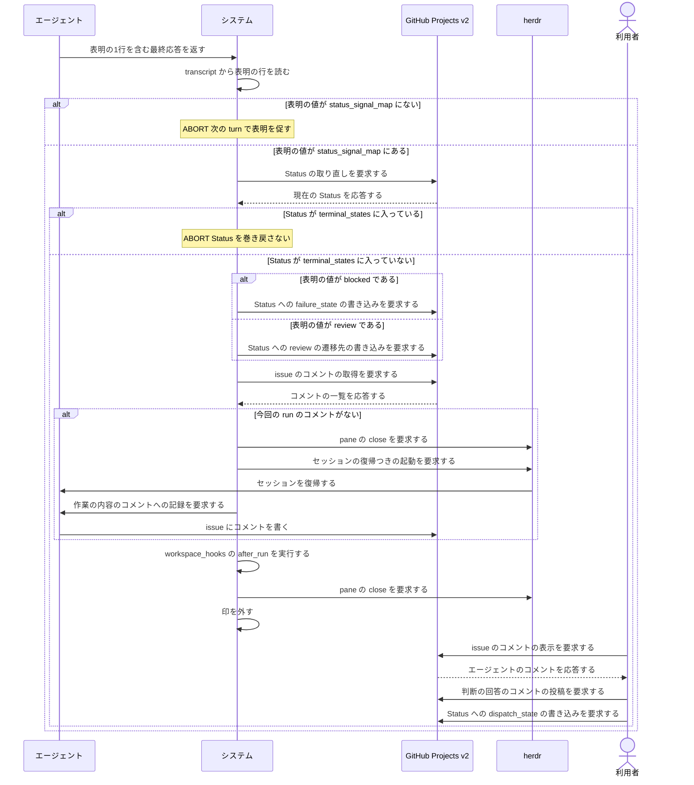

<!-- 目的: エージェントの表明を受けて continuo が worker を止め、worktree を残したまま人間へ判断を渡すまでを RUCM で定義する -->

# ユースケース: 人間に判断を渡す

## 根拠資料

- `docs/plans/continuo_design.md#3-5`（完了検知の3層。引き渡しは worker を止めるが worktree は残す）
- `docs/plans/continuo_design.md#3-11`（権限で拒否されたら blocked を出す）
- `docs/plans/continuo_design.md#3-25`（表明を transcript から読む。コメントが無かったらセッションを復元して書かせる）
- `docs/plans/continuo_design.md#3-26`（表明の書式の拡張。対象付きの行）
- `docs/plans/continuo_design.md#4-1`（誰がどの遷移を起こすか。Blocked から Ready へ戻すのは人間）
- `docs/plans/continuo_design.md#8-1`（再起動後は引き渡し状態の worker を止めない）
- `internal/orchestrator/lifecycle.go` の `handleTurnEnd`、`applySignals`、`lookupSignalTarget`、`finishRun`、`postHandoffComment`
- `internal/orchestrator/signal.go` の `ParseSignals`
- `internal/orchestrator/comment.go` の `ensureAgentComment`、`hasRunComment`
- `internal/tracker/adapter.go` の `UpdateStatus`

## RUCM

```rucm
USE CASE NAME: 人間に判断を渡す
BRIEF DESCRIPTION: エージェントが最終応答に表明の1行を書く。システムは transcript から表明を読み、ボードの Status を引き渡しの選択肢へ動かす。システムはエージェントのコメントを確かめてから worker を止め、worktree を残す。利用者はコメントを読んで回答し、Status を dispatch_state へ戻す。
PRECONDITION: システムは常駐している。issue の Status は running_state の選択肢である。issue は印の集合に入っている。herdr の pane でエージェントが動いている。
PRIMARY ACTOR: エージェント
SECONDARY ACTORS: GitHub Projects v2、herdr、利用者
DEPENDENCY: なし
GENERALIZATION: なし

BASIC FLOW:
1. エージェントはシステムに表明の1行を含む最終応答を返す。
2. システムは transcript から表明の行を読む。
3. システムは VALIDATES THAT 表明の値が status_signal_map にある。
4. システムはボードの issue の Status を ID 指定で取り直す。
5. システムは VALIDATES THAT 取り直した Status が terminal_states に入っていない。
6. IF 表明の値が blocked である THEN
7.   システムはボードの issue の Status に failure_state の選択肢を書く。
8. ELSE
9.   システムはボードの issue の Status に review の遷移先の選択肢を書く。
10. ENDIF
11. システムは VALIDATES THAT issue に今回の run が書いたコメントがある。
12. システムは workspace_hooks の after_run を実行する。
13. システムは herdr の pane を閉じる。
14. システムは印を外す。
15. 利用者はボードの issue のコメントを読む。
16. 利用者はボードの issue に判断の回答をコメントする。
17. 利用者はボードの issue の Status に dispatch_state の選択肢を書く。
POSTCONDITION: issue の Status は dispatch_state の選択肢である。issue にエージェントのコメントと利用者の回答のコメントがある。herdr の pane は閉じている。worktree と branch は残っている。印は外れている。

SPECIFIC ALTERNATIVE FLOW 知らない表明:
RFS BASIC FLOW 3
1. システムはボードの issue の Status を動かさない。
2. システムは次の turn の継続の指示に表明を促す1文を差し込む。
3. ABORT
POSTCONDITION: issue の Status は running_state の選択肢のままである。herdr の pane は閉じていない。次の turn の本文に表明を促す1文がある。

SPECIFIC ALTERNATIVE FLOW 完了済みのissue:
RFS BASIC FLOW 5
1. システムはボードの issue の Status を書かない。
2. システムはエージェントが動かした Status をそのまま残す。
3. システムは herdr の pane を閉じる。
4. システムは印を外す。
5. ABORT
POSTCONDITION: issue の Status は terminal_states の選択肢のままである。continuo は Status を巻き戻していない。herdr の pane は閉じている。

SPECIFIC ALTERNATIVE FLOW コメントの取り戻し:
RFS BASIC FLOW 11
1. システムは herdr の pane を閉じる。
2. システムは身元ファイルからセッション UUID と設定ファイルのパスを読む。
3. システムは pane でエージェントのセッションをセッション UUID で復帰させる。
4. システムはエージェントに作業の内容の issue のコメントへの記録を要求する。
5. システムは issue のコメントを読み直す。
6. システムは VALIDATES THAT issue に今回の run が書いたコメントがある。
7. RESUME STEP 12
POSTCONDITION: issue にエージェントが書いたコメントが1件以上ある。issue の Status は引き渡しの選択肢のままである。worktree は残っている。

SPECIFIC ALTERNATIVE FLOW コメントの取り戻しの失敗:
RFS コメントの取り戻し 6
1. システムはボードの issue の Status に failure_state の選択肢を書く。
2. システムは issue に引き渡しの通知を1件コメントする。
3. システムは印を外す。
4. ABORT
POSTCONDITION: issue の Status は failure_state の選択肢である。issue に引き渡しの通知のコメントが1件ある。issue にエージェントが書いたコメントがない。worktree は残っている。

GLOBAL ALTERNATIVE FLOW レビューの完了:
BRANCH FROM BASIC FLOW 15
WHEN 利用者が判断の回答の代わりに issue の Status を terminal_states の選択肢へ動かす場合
1. システムは worktree と branch を片付ける。
2. ABORT
POSTCONDITION: issue の Status は terminal_states の選択肢である。worktree は置き場所に無い。branch は無い。印は外れている。
```

## この記述で使う言葉

**エージェント**とは、worker の中で動いている Claude Code のセッションである（設計 3-1 の worker の定義）。
Status をどう動かすかの判断を持つのはエージェントであり、ボードへ書くのはシステムである（設計 3-25）。

## 引き渡しが起きる4つの契機

**引き渡しとは「worker を止めて worktree を残し、人間の操作を待つこと」である**（設計 3-5）。

| 契機 | Status の遷移先 | 引き渡しの通知のコメント |
| --- | --- | --- |
| 表明が review である | review の遷移先（In Review） | 書かない。エージェントのコメントが記録である |
| 表明が blocked である | failure_state（Blocked） | 書かない。エージェントのコメントが記録である |
| max_turns に達した | failure_state（Blocked） | continuo が1件書く |
| 画面が止まったまま打ち切られ、リトライを使い切った | failure_state（Blocked） | continuo が1件書く |

## 人間が戻したあとに何が起きるか

| 人間の操作 | 次の巡回でシステムが行うこと |
| --- | --- |
| Status を dispatch_state（Ready）へ戻す | 候補に上がる。worktree を再利用して再 dispatch する |
| Status を terminal_states（Done）へ動かす | worktree と branch を片付ける |
| Status を動かさない | 何もしない。worktree と pane を残したままにする |

## フローチャート



## シーケンス図


