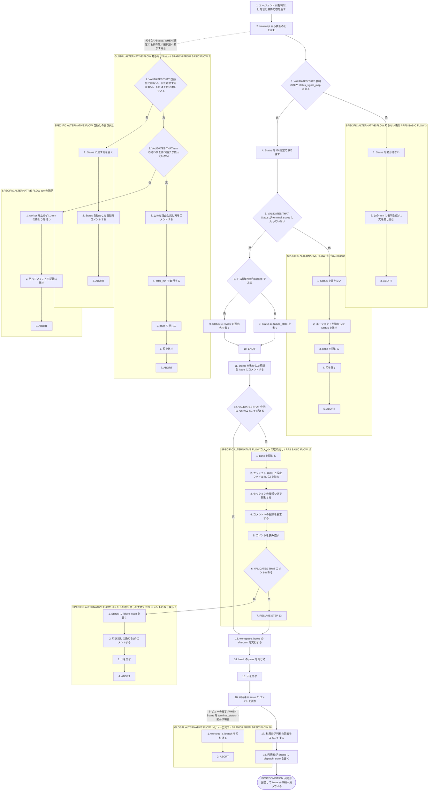
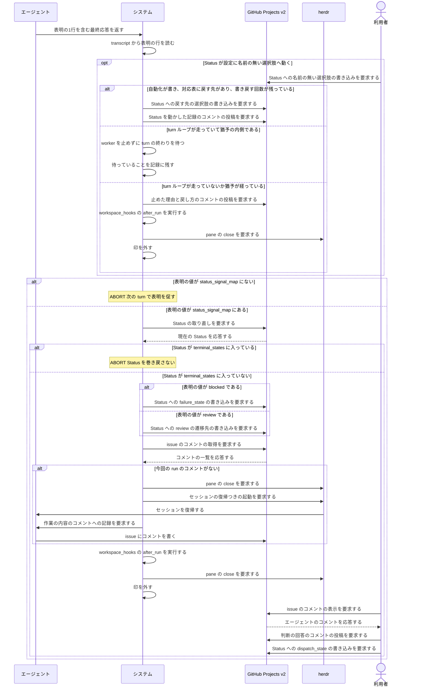

# ユースケース: 人間に判断を渡す

## 根拠資料

- `docs/plans/continuo_design.md#3-5`（完了検知の3層。引き渡しは worker を止めるが worktree は残す）
- `docs/plans/continuo_design.md#3-11`（権限で拒否されたら blocked を出す）
- `docs/plans/continuo_design.md#3-25`（表明を transcript から読む。コメントが無かったらセッションを復元して書かせる）
- `docs/plans/continuo_design.md#3-26`（表明の書式の拡張。対象付きの行）
- `docs/plans/continuo_design.md#4-1`（誰がどの遷移を起こすか。Blocked から Ready へ戻すのは人間）
- `docs/plans/continuo_design.md#8-1`（再起動後は引き渡し状態の worker を止めない）
- `docs/plans/continuo_design.md#3-50`（知らない Status で止めるときは理由を残し、turn の終わりを待つ）
- `docs/plans/continuo_design.md#2-6`（ボードの自動化が動かした Status は `actor` の型でしか見分けられない）
- `docs/plans/continuo_design.md#3-54`（自動化が動かした Status では worker を止めず、本来の Status へ戻す）
- `internal/orchestrator/unknownstate.go` の `computeKnownStates`、`handleUnknownState`、`stopForUnknownStateAsync`、`finishRunUnknownState`、`unknownStateReason`、`claimAutomatedRewrite`、`rewriteAutomatedStateAsync`、`rewriteAutomatedState`、`automatedStateHint`
- `internal/orchestrator/runstate.go` の `claimAutomatedRewrite`、`releaseAutomatedRewrite`、`beginTerminal`、`endTerminal`
- `internal/config/validate.go` の `validateAutomatedStateRewrite`
- `internal/config/states.go` の `AutomatedRewriteTargets`、`StatesNamedInConfig`
- `internal/tracker/query.go` の `judgeStatusAuthor`、`statusChangedTimelineFragment`
- `internal/orchestrator/reconcile.go` の `reconcileRunning`
- `internal/orchestrator/lifecycle.go` の `handleTurnEnd`、`decideAfterTurn`、`rewriteAndDecide`、`applySignals`、`lookupSignalTarget`、`finishRun`、`postHandoffComment`
- `internal/orchestrator/signal.go` の `ParseSignals`
- `internal/orchestrator/comment.go` の `ensureAgentComment`、`hasRunComment`
- `internal/tracker/adapter.go` の `UpdateStatus`

## RUCM

```rucm
USE CASE NAME: 人間に判断を渡す
BRIEF DESCRIPTION: エージェントが最終応答に表明の1行を書く。システムは transcript から表明を読み、ボードの Status を引き渡しの選択肢へ動かす。システムはエージェントのコメントを確かめてから worker を止め、worktree を残す。利用者はコメントを読んで回答し、Status を dispatch_state へ戻す。
PRECONDITION: システムは常駐している。issue の Status は running_state の選択肢である。issue は印の集合に入っている。herdr の pane でエージェントが動いている。
PRIMARY ACTOR: エージェント
SECONDARY ACTORS: GitHub Projects v2、herdr、利用者
DEPENDENCY: なし
GENERALIZATION: なし

BASIC FLOW:
1. エージェントはシステムに表明の1行を含む最終応答を返す。
2. システムは transcript から表明の行を読む。
3. システムは VALIDATES THAT 表明の値が status_signal_map にある。
4. システムはボードの issue の Status を ID 指定で取り直す。
5. システムは VALIDATES THAT 取り直した Status が terminal_states に入っていない。
6. IF 表明の値が blocked である THEN
7.   システムはボードの issue の Status に failure_state の選択肢を書く。
8. ELSE
9.   システムはボードの issue の Status に review の遷移先の選択肢を書く。
10. ENDIF
11. システムは Status を動かした記録を issue にコメントする。
12. システムは VALIDATES THAT issue に今回の run が書いたコメントがある。
13. システムは workspace_hooks の after_run を実行する。
14. システムは herdr の pane を閉じる。
15. システムは印を外す。
16. 利用者はボードの issue のコメントを読む。
17. 利用者はボードの issue に判断の回答をコメントする。
18. 利用者はボードの issue の Status に dispatch_state の選択肢を書く。
POSTCONDITION: issue の Status は dispatch_state の選択肢である。issue にエージェントのコメントと利用者の回答のコメントがある。herdr の pane は閉じている。worktree と branch は残っている。印は外れている。

SPECIFIC ALTERNATIVE FLOW 知らない表明:
RFS BASIC FLOW 3
1. システムはボードの issue の Status を動かさない。
2. システムは次の turn の継続の指示に表明を促す1文を差し込む。
3. ABORT
POSTCONDITION: issue の Status は running_state の選択肢のままである。herdr の pane は閉じていない。次の turn の本文に表明を促す1文がある。

SPECIFIC ALTERNATIVE FLOW 完了済みのissue:
RFS BASIC FLOW 5
1. システムはボードの issue の Status を書かない。
2. システムはエージェントが動かした Status をそのまま残す。
3. システムは herdr の pane を閉じる。
4. システムは印を外す。
5. ABORT
POSTCONDITION: issue の Status は terminal_states の選択肢のままである。continuo は Status を巻き戻していない。herdr の pane は閉じている。

SPECIFIC ALTERNATIVE FLOW コメントの取り戻し:
RFS BASIC FLOW 12
1. システムは herdr の pane を閉じる。
2. システムは身元ファイルからセッション UUID と設定ファイルのパスを読む。
3. システムは pane でエージェントのセッションをセッション UUID で復帰させる。
4. システムはエージェントに作業の内容の issue のコメントへの記録を要求する。
5. システムは issue のコメントを読み直す。
6. システムは VALIDATES THAT issue に今回の run が書いたコメントがある。
7. RESUME STEP 13
POSTCONDITION: issue にエージェントが書いたコメントが1件以上ある。issue の Status は引き渡しの選択肢のままである。worktree は残っている。

SPECIFIC ALTERNATIVE FLOW コメントの取り戻しの失敗:
RFS コメントの取り戻し 6
1. システムはボードの issue の Status に failure_state の選択肢を書く。
2. システムは issue に引き渡しの通知を1件コメントする。
3. システムは印を外す。
4. ABORT
POSTCONDITION: issue の Status は failure_state の選択肢である。issue に引き渡しの通知のコメントが1件ある。issue にエージェントが書いたコメントがない。worktree は残っている。

GLOBAL ALTERNATIVE FLOW 知らないStatus:
BRANCH FROM BASIC FLOW 2
WHEN issue の Status が設定に名前の無い選択肢へ動く場合
1. システムは VALIDATES THAT その Status を書いたのがボードの自動化ではない、または対応表に戻す先が無い、または書き戻した回数が上限に達している。
2. システムは VALIDATES THAT turn の終わりを待つ猶予が残っていない。
3. システムは issue に動いた先の Status と止めた理由と戻し方のコメントを1件書く。
4. システムは workspace_hooks の after_run を実行する。
5. システムは herdr の pane を閉じる。
6. システムは印を外す。
7. ABORT
POSTCONDITION: issue の Status は動かされた選択肢のままである。issue に止めた理由のコメントが1件ある。herdr の pane は閉じている。worktree は残っている。印は外れている。

SPECIFIC ALTERNATIVE FLOW 自動化の書き戻し:
RFS 知らないStatus 1
1. システムはボードの issue の Status に戻す先の選択肢を書く。
2. システムは Status を動かした記録を issue にコメントする。
3. ABORT
POSTCONDITION: issue の Status は戻す先の選択肢である。issue に Status を動かした記録のコメントが1件ある。herdr の pane は閉じていない。worktree は残っている。印は残っている。

SPECIFIC ALTERNATIVE FLOW turnの猶予:
RFS 知らないStatus 2
1. システムは worker を止めずに turn の終わりを待つ。
2. システムは turn の終わりを待っていることを記録に残す。
3. ABORT
POSTCONDITION: issue の Status は動かされた選択肢のままである。herdr の pane は閉じていない。印は残っている。issue にコメントは付いていない。

GLOBAL ALTERNATIVE FLOW レビューの完了:
BRANCH FROM BASIC FLOW 16
WHEN 利用者が判断の回答の代わりに issue の Status を terminal_states の選択肢へ動かす場合
1. システムは worktree と branch を片付ける。
2. ABORT
POSTCONDITION: issue の Status は terminal_states の選択肢である。worktree は置き場所に無い。branch は無い。印は外れている。
```

## この記述で使う言葉

**エージェント**とは、worker の中で動いている Claude Code のセッションである（設計 3-1 の worker の定義）。
Status をどう動かすかの判断を持つのはエージェントであり、ボードへ書くのはシステムである（設計 3-25）。

## 引き渡しが起きる5つの契機

**引き渡しとは「worker を止めて worktree を残し、人間の操作を待つこと」である**（設計 3-5）。

| 契機 | Status の遷移先 | 引き渡しの通知のコメント |
| --- | --- | --- |
| 表明が review である | review の遷移先（In Review） | 書かない。エージェントのコメントが記録である |
| 表明が blocked である | failure_state（Blocked） | 書かない。エージェントのコメントが記録である |
| max_dispatch_turns に達した | failure_state（Blocked） | continuo が1件書く |
| 画面が止まったまま打ち切られ、リトライを使い切った | failure_state（Blocked） | continuo が1件書く |
| 設定に名前の無い Status へ動かされた | **動かさない**（利用者の操作を巻き戻さない） | continuo が1件書く |

**ボードの自動化が名前の無い Status へ動かした場合は、引き渡しにならない**（設計 3-54）。
対応表に戻す先があれば書き戻し、**worker は止めない。**

## Status を動かしたら、何から何へ動かしたかを残す（設計 3-29）

**言いたいこと。**continuo がボードへ書き込んだときは、**何から何へ動かしたのかを issue に残す。**
**書き込みが起きなかったときは残さない。**

**引き渡しの通知を出す経路では、独立したコメントを作らない。**通知の本文に1行入れる。
**同じことを言うコメントが2件並ぶのを避けるためである。**

| 契機 | 遷移をどこに書くか |
| --- | --- |
| 表明が review / blocked である | **独立したコメントを1件書く**（引き渡しの通知は出ない経路である） |
| max_dispatch_turns に達した | 引き渡しの通知の本文に1行入れる |
| 画面が止まったまま打ち切られ、リトライを使い切った | 引き渡しの通知の本文に1行入れる |
| 設定に名前の無い Status へ動かされた | **どこにも書かない。**動かしたのは利用者であって continuo ではない |
| ボードの自動化が動かしたので書き戻した | **独立したコメントを1件書く**（書いたのは continuo である。設計 3-54） |

**独立したコメントの本文はこの形である。**`tracker.comments.self_marker` は投稿する側が付ける。

```text
<!-- continuo:self -->
Status を **In Progress → In Review** へ動かしました。

- なぜ: 担当している Claude Code が `CONTINUO-STATUS: review` と表明したためです
- いつ: 2026-08-26 14:03 (JST)
- 書いたのは continuo です（人間の操作ではありません）
```

**引き渡しの通知に入る1行はこれである。**

```text
Status を **In Progress → Blocked** へ動かしました。
```

**「何から」は、書き込む直前に ID 指定で取り直した Status である。**巡回で読んだ時点の値ではない。
**古い値を書くと、この記録そのものが嘘をつく。**

## 設定に名前の無い Status を見つけたとき（設計 3-50）

**設定に名前の無い Status とは、`active_states` / `terminal_states` / `running_state` /
`dispatch_state` / `failure_state` / `status_signal_map` の遷移先のどれにも出てこない Status である。**
`In Review` と `Blocked` は名前が出てくるので、この扱いにはならない。

**「猶予が残っている」とは、次の3つがすべて成り立つことである。**

| 何 | 猶予が残る条件 |
| --- | --- |
| `unknown_state_grace_ms` | 0 より大きい |
| 経過 | 名前の無い Status を最初に見てから、その長さが経っていない |
| turn ループ | 走っている（走っていなければ、待っても表明は出てこない） |

**猶予が残っているあいだは止めない。**turn が終わっても名前の無い Status のままなら、
その場で止める（`finishRunUnknownState`）。

**待つと、利用者が本気で止めたいときに止まるのが turn 1回ぶん遅れる。**
だから待っているあいだ、そのことを記録に残す。

## 書いたのがボードの自動化なら、止めずに戻す（設計 3-54）

**エージェントが PR を作ると、ボードの組み込みの自動化が Status を動かす。**
それを利用者の引き渡しと読むと、**システムが自分のエージェントを turn の途中で殺す**（issue #33）。
**猶予の判定より前に、書いたのが誰かを見る。**

**判定は次の式である。**`Bot` はボードの自動化、`User` は利用者かシステム自身である。

```
自動化が動かした = (actor.__typename == "Bot") || wasAutomated
```

**`wasAutomated` だけでは見分けられない。**組み込みの自動化が動かしたときも偽が返る（設計 2-6 の実測）。

**書き戻すのは、次の3つがすべて成り立つときだけである。**

| 何 | 書き戻す条件 |
| --- | --- |
| 書いた主体 | ボードの自動化である（利用者が動かしたものは戻さない） |
| `automated_state_rewrite` | 動いた先の Status からの戻す先が書いてある |
| 書き戻した回数 | その Status について上限（3回）に達していない |

**1つでも欠ければ、いままでどおり猶予を置いて止める。**
**書き戻しに失敗しても止めない。**次の巡回で拾い直す。

**書き戻した回数を数えるのは、ボードが実際に動いたときだけである。**
通信が失敗した・item がもう見えない・既にその値だった、のいずれでも回数は戻す。
**戻さないと、書き込みが3回失敗しただけで上限に達し、押し合いが1度も起きていない run が止まる。**

**戻す先は `active_states` に入っていなければならない**（`config.Validate` が起動前に要求する）。
`terminal_states` や `cleanup.on_states` を戻す先にすると、
**書き戻した瞬間に run が終わるか worktree が消える。**

**書き戻したあと、戻した先の Status で「終わりかどうか」を判定し直す。**
終わりの判定は書き戻しの前に済んでおり、書き戻しはそのあとで Status を変えるためである。

## 人間が戻したあとに何が起きるか

| 人間の操作 | 次の巡回でシステムが行うこと |
| --- | --- |
| Status を dispatch_state（Ready）へ戻す | 候補に上がる。worktree を再利用して再 dispatch する |
| Status を terminal_states（Done）へ動かす | worktree と branch を片付ける |
| Status を動かさない | 何もしない。worktree と pane を残したままにする |

## フローチャート



## シーケンス図


