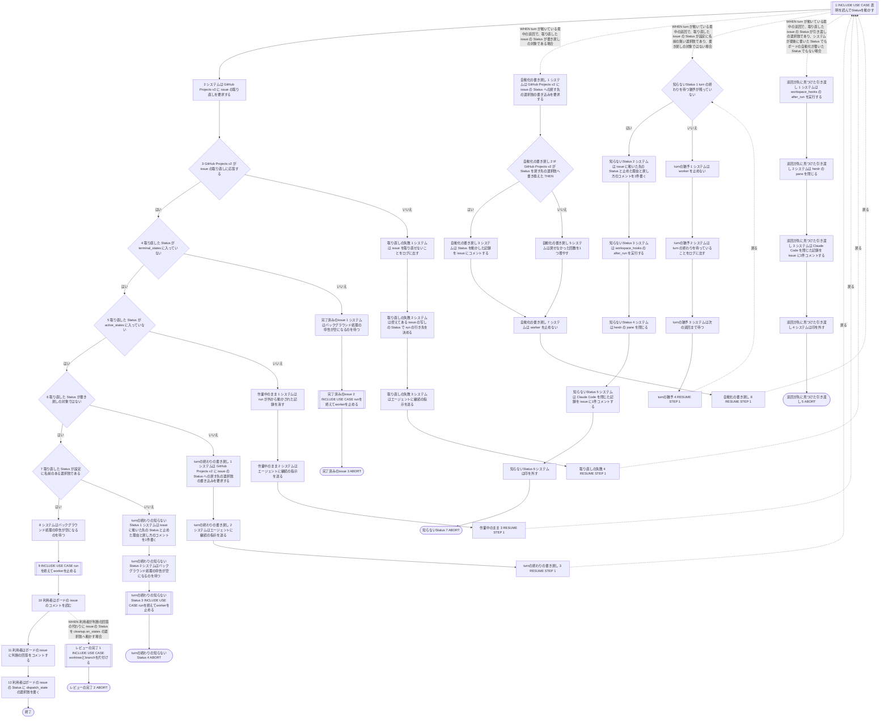
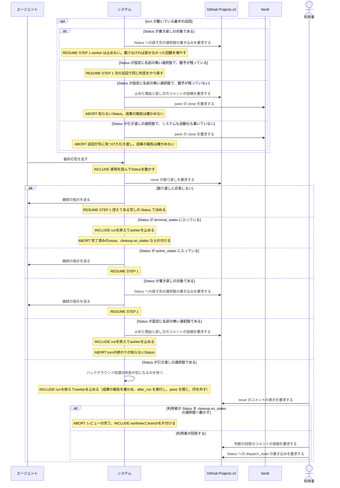

# ユースケース: 人間に判断を渡す

> **turn の終わりの処理のうち、後半（取り直した Status で run の行き先を決める。`refreshIssue` → `decideAfterTurn` → `finishRun`）を書いた記述である。**
> 前半（表明を読んでStatusを動かす）は `表明を読んでStatusを動かす` に分け、段1 で `INCLUDE USE CASE` で引く。
> 成果の報告を確かめてから worker を止めて印を外す段は、`issueを1件処理する` と共通の `runを終えてworkerを止める` を引く（人間の決定。2026-10-02）。
>
> **実装は、表明で書いた値を信じない。**取り直した Status だけで行き先を決める。
> だから、表明が無くても Status が引き渡しの選択肢なら（エージェントが `gh` で自分で動かした・利用者が動かした）、基本フローを通る。
>
> **run を終える処理（`finishRun`）は、`issueを1件処理する` と同じ実装を通る。**

## 根拠資料

- `docs/plans/continuo_design.md#3-5`（完了検知の3層。引き渡しは worker を止めるが worktree は残す）
- `docs/plans/continuo_design.md#3-11`（権限で拒否されたら blocked を出す）
- `docs/plans/continuo_design.md#3-85`（pane を閉じるたびに閉じた記録を書き、そのあとに利用者が書いたコメントを次の起動の最初のメッセージに付ける）
- `docs/plans/continuo_design.md#3-25`（表明を transcript から読む。コメントが無かったらセッションを復元して書かせる）
- `docs/plans/continuo_design.md#4-1`（誰がどの遷移を起こすか。Blocked から Ready へ戻すのは人間）
- `docs/plans/continuo_design.md#8-1`（再起動後は引き渡し状態の worker を止めない）
- `docs/plans/continuo_design.md#3-50`（知らない Status で止めるときは理由を残し、turn の終わりを待つ）
- `docs/plans/continuo_design.md#2-6`（ボードの自動化が動かした Status は `actor` の型でしか見分けられない）
- `docs/plans/continuo_design.md#3-54`（自動化が動かした Status では worker を止めず、本来の Status へ戻す）
- `docs/plans/continuo_design.md#3-55`（戻す先は `active_states` に限る。終端へは書き戻さない）
- `docs/plans/continuo_design.md#3-56`（書き戻しが止まらなくなる形を、4つとも塞ぐ）
- `docs/plans/continuo_design.md#3-57b`（止めたときの案内は、貼ってもそのまま起動する直し方だけを1つ出す）
- `docs/plans/continuo_design.md#3-58`（書き戻しの印と「終わらせる処理」の印を分ける）
- `docs/plans/continuo_design.md#3-74`（自動化が書いた終端と引き渡しの Status では、turn の終わりを待つ）、`#3-74c`（continuo 自身が書いた Status は、turn の終わりの経路に任せる）
- `internal/orchestrator/lifecycle.go` の `handleTurnEnd`、`refreshIssue`、`decideAfterTurn`、`rewriteAndDecide`、`finishRun`、`finishRunClaimed`、`waitForBackgroundTasks`、`runAfterRun`、`stopWorker`、`cleanupWorktree`、`stopAndReleaseAsync`、`postHandoffComment`
- `internal/orchestrator/unknownstate.go` の `handleUnknownState`、`holdForOwnMove`、`holdForAutomatedMove`、`claimAutomatedRewrite`、`rewriteAutomatedStateAsync`、`rewriteAutomatedState`、`stopForUnknownStateAsync`、`finishRunUnknownState`、`unknownStateReason`、`willCleanupState`
- `internal/orchestrator/reconcile.go` の `reconcileRunning`（turn の途中の巡回）、`reconcileWorktrees`（引き渡したあとに `cleanup.on_states` へ動いた worktree を片付ける）
- `internal/orchestrator/runstate.go` の `rewriteClaim`、`claimAutomatedRewrite`、`noteAutomatedRewriteFailure`、`expireAutomatedRewriteFailures`、`beginTerminal`、`claimTerminal`、`beginRewrite`、`endRewrite`
- `internal/orchestrator/turn.go` の `turnLoop`、`buildTurnText`
- `internal/orchestrator/relay.go` の `settleClosedRecord`
- `internal/workspace/cleanup.go` の `ShouldCleanup`
- `internal/config/validate.go` の `validateAutomatedStateRewrite`
- `internal/tracker/adapter.go` の `UpdateStatus`

## RUCM

```rucm
USE CASE NAME: 人間に判断を渡す
BRIEF DESCRIPTION: エージェントの turn が終わる。システムは表明を読んで Status を動かす。システムはボードの issue を取り直す。システムは取り直した Status が引き渡しの選択肢であれば、成果の報告を確かめてから worker を止め、worktree を残す。利用者はコメントを読んで回答し、Status を dispatch_state へ戻す。
PRECONDITION: システムは常駐している。issue の Status は running_state の選択肢である。issue は印の集合に入っている。herdr の pane でエージェントが動いている。run は direct chat に入っていない。issue の担当者は自分のままである。引き渡しの選択肢は cleanup.on_states に入っていない。
PRIMARY ACTOR: エージェント
SECONDARY ACTORS: GitHub Projects v2、herdr、利用者
DEPENDENCY: INCLUDE USE CASE 表明を読んでStatusを動かす、INCLUDE USE CASE runを終えてworkerを止める、INCLUDE USE CASE worktreeとbranchを片付ける
GENERALIZATION: なし

BASIC FLOW:
1. INCLUDE USE CASE 表明を読んでStatusを動かす
2. システムは GitHub Projects v2 に issue の取り直しを要求する。
3. システムは VALIDATES THAT GitHub Projects v2 が issue の取り直しに応答する。
4. システムは VALIDATES THAT 取り直した Status が terminal_states に入っていない。
5. システムは VALIDATES THAT 取り直した Status が active_states に入っていない。
6. システムは VALIDATES THAT 取り直した Status が書き戻しの対象ではない。
7. システムは VALIDATES THAT 取り直した Status が設定に名前のある選択肢である。
8. システムはバックグラウンド処理の申告が空になるのを待つ。
9. INCLUDE USE CASE runを終えてworkerを止める
10. 利用者はボードの issue のコメントを読む。
11. 利用者はボードの issue に判断の回答をコメントする。
12. 利用者はボードの issue の Status に dispatch_state の選択肢を書く。
POSTCONDITION: issue の Status は dispatch_state の選択肢である。issue に利用者の回答のコメントがある。herdr の pane は閉じている。worktree と branch は残っている。印は外れている。

SPECIFIC ALTERNATIVE FLOW 取り直しの失敗:
RFS BASIC FLOW 3
1. システムは issue を取り直せないことをログに出す。
2. システムは控えてある issue の写しの Status で run の行き先を決める。
3. システムはエージェントに継続の指示を送る。
4. RESUME STEP 1
POSTCONDITION: 控えてある issue の写しの Status は active_states の選択肢である。エージェントは継続の指示を受けている。herdr の pane は閉じていない。印は残っている。

SPECIFIC ALTERNATIVE FLOW 完了済みのissue:
RFS BASIC FLOW 4
1. システムはバックグラウンド処理の申告が空になるのを待つ。
2. INCLUDE USE CASE runを終えてworkerを止める
3. ABORT
POSTCONDITION: システムは Status を巻き戻していない。印は外れている。取り直した Status が cleanup.on_states に入っている場合、システムは worktree と branch の片付けを済ませている。

SPECIFIC ALTERNATIVE FLOW 作業中のまま:
RFS BASIC FLOW 5
1. システムは run が外から動かされた記録を消す。
2. システムはエージェントに継続の指示を送る。
3. RESUME STEP 1
POSTCONDITION: issue の Status は active_states の選択肢のままである。エージェントは継続の指示を受けている。herdr の pane は閉じていない。印は残っている。

SPECIFIC ALTERNATIVE FLOW turnの終わりの書き戻し:
RFS BASIC FLOW 6
1. システムは GitHub Projects v2 に issue の Status への戻す先の選択肢の書き込みを要求する。
2. システムはエージェントに継続の指示を送る。
3. RESUME STEP 1
POSTCONDITION: エージェントは継続の指示を受けている。herdr の pane は閉じていない。印は残っている。worktree は残っている。

SPECIFIC ALTERNATIVE FLOW turnの終わりの知らないStatus:
RFS BASIC FLOW 7
1. システムは issue に動いた先の Status と止めた理由と戻し方のコメントを1件書く。
2. システムはバックグラウンド処理の申告が空になるのを待つ。
3. INCLUDE USE CASE runを終えてworkerを止める
4. ABORT
POSTCONDITION: issue に止めた理由のコメントが1件ある。システムは動かされた Status を巻き戻していない。印は外れている。

GLOBAL ALTERNATIVE FLOW 自動化の書き戻し:
BRANCH FROM BASIC FLOW 1
WHEN turn が動いている最中の巡回で、取り直した issue の Status が書き戻しの対象である場合
1. システムは GitHub Projects v2 に issue の Status への戻す先の選択肢の書き込みを要求する。
2. IF GitHub Projects v2 が Status を戻す先の選択肢へ書き換えた THEN
3.   システムは Status を動かした記録を issue にコメントする。
4. ELSE
5.   システムは戻せなかった回数を1つ増やす。
6. ENDIF
7. システムは worker を止めない。
8. RESUME STEP 1
POSTCONDITION: herdr の pane は閉じていない。印は残っている。worktree は残っている。Status を戻す先の選択肢へ書き換えた場合、issue に Status を動かした記録のコメントが1件ある。

GLOBAL ALTERNATIVE FLOW 知らないStatus:
BRANCH FROM BASIC FLOW 1
WHEN turn が動いている最中の巡回で、取り直した issue の Status が設定に名前の無い選択肢であり、書き戻しの対象ではない場合
1. システムは VALIDATES THAT turn の終わりを待つ猶予が残っていない。
2. システムは issue に動いた先の Status と止めた理由と戻し方のコメントを1件書く。
3. システムは workspace_hooks の after_run を実行する。
4. システムは herdr の pane を閉じる。
5. システムは Claude Code を閉じた記録を issue に1件コメントする。
6. システムは印を外す。
7. ABORT
POSTCONDITION: issue の Status は動かされた選択肢のままである。issue に止めた理由のコメントが1件ある。herdr の pane は閉じている。印は外れている。システムは worktree を片付けていない。システムは成果の報告を確かめていない。

SPECIFIC ALTERNATIVE FLOW turnの猶予:
RFS 知らないStatus 1
1. システムは worker を止めない。
2. システムは turn の終わりを待っていることをログに出す。
3. システムは次の巡回まで待つ。
4. RESUME STEP 1
POSTCONDITION: issue の Status は動かされた選択肢のままである。herdr の pane は閉じていない。印は残っている。issue にコメントは増えていない。

GLOBAL ALTERNATIVE FLOW 巡回が先に見つけた引き渡し:
BRANCH FROM BASIC FLOW 1
WHEN turn が動いている最中の巡回で、取り直した issue の Status が引き渡しの選択肢であり、システムが最後に書いた Status でもボードの自動化が書いた Status でもない場合
1. システムは workspace_hooks の after_run を実行する。
2. システムは herdr の pane を閉じる。
3. システムは Claude Code を閉じた記録を issue に1件コメントする。
4. システムは印を外す。
5. ABORT
POSTCONDITION: issue の Status は引き渡しの選択肢のままである。herdr の pane は閉じている。印は外れている。worktree は残っている。システムは成果の報告を確かめていない。システムはバックグラウンド処理の申告を待っていない。

GLOBAL ALTERNATIVE FLOW レビューの完了:
BRANCH FROM BASIC FLOW 10
WHEN 利用者が判断の回答の代わりに issue の Status を cleanup.on_states の選択肢へ動かす場合
1. INCLUDE USE CASE worktreeとbranchを片付ける
2. ABORT
POSTCONDITION: issue の Status は cleanup.on_states の選択肢である。印は外れている。失うものが残っていない worktree と branch は消えている。
```

## この記述で使う言葉

**エージェント**とは、worker の中で動いている Claude Code のセッションである（設計 3-1 の worker の定義）。
Status をどう動かすかの判断を持つのはエージェントであり、ボードへ書くのはシステムである（設計 3-25）。

| 語 | 何を指すか |
| --- | --- |
| **引き渡しの選択肢** | 設定に名前が出てくるが、`active_states` にも `terminal_states` にも `tracker.direct_chat_state` にも入っていない Status（既定では `In Review` と `Blocked`） |
| **書き戻しの対象** | 設定に名前の無い Status で、次の4つが揃うもの。書いたのがボードの自動化である・`tracker.automated_state_rewrite` に戻す先がある・書き戻した回数が上限（3回）に達していない・戻せなかった回数が上限（3回）に達していない（`claimAutomatedRewrite`） |
| **印** | 走行中の run の登録（`o.runs`）。外れるとスロットが空く |

## 引き渡しが起きる5つの契機

**引き渡しとは「worker を止めて worktree を残し、人間の操作を待つこと」である**（設計 3-5）。

| 契機 | Status の遷移先 | 引き渡しの通知のコメント |
| --- | --- | --- |
| 表明が review である | review の遷移先（In Review） | 書かない。エージェントのコメントが記録である |
| 表明が blocked である | `status_signal_map` の `blocked` の値（既定は Blocked） | 書かない。エージェントのコメントが記録である |
| max_dispatch_turns に達した | failure_state（Blocked） | continuo が1件書く |
| 進んだ形跡が無いまま打ち切られ、リトライを使い切った | failure_state（Blocked） | continuo が1件書く |
| 設定に名前の無い Status へ動かされた | **動かさない**（利用者の操作を巻き戻さない） | continuo が1件書く |

**ボードの自動化が名前の無い Status へ動かした場合は、引き渡しにならない**（設計 3-54）。
対応表に戻す先があれば書き戻し、**worker は止めない。**

**表明で動かす先は、`review` も `blocked` も `tracker.status_signal_map` の値である**（`表明を読んでStatusを動かす`）。
`tracker.failure_state` を書くのは、continuo が自分で打ち切ったとき（表の3行目と4行目）と、`runを終えてworkerを止める` の `取り戻しの復帰の失敗` と `コメントの取り戻しの失敗` である。

## 取り直した Status と行き先

**turn の終わりの行き先は、取り直した Status だけで決まる**（`internal/orchestrator/lifecycle.go` の `decideAfterTurn`）。見る順は次のとおりである。

| 順 | 取り直した Status | 何が起きるか | この記述のどこか |
| --- | --- | --- | --- |
| 1 | `tracker.direct_chat_state` | 後始末をせずに戻り、次の巡回が direct chat へ入れる | 前提で外した（設計 3-83） |
| 2 | `terminal_states` | run を終える。`cleanup.on_states` なら worktree も片付ける | `完了済みのissue` |
| 3 | `active_states` | 次の turn を送る | `作業中のまま` |
| 4 | 設定に名前が無く、書き戻しの対象である | 戻す先を書いて、次の turn を送る | `turnの終わりの書き戻し` |
| 5 | 設定に名前が無く、書き戻しの対象でない | 理由を issue に書いて run を終える | `turnの終わりの知らないStatus` |
| 6 | それ以外（引き渡しの選択肢） | 成果の報告を確かめて worker を止め、worktree を残す | 基本フロー |

**順6 は、表明で動かした場合に限らない。**エージェントが `gh` で自分で `Blocked` へ動かした場合も、利用者が turn の途中で動かして turn の終わりが先に来た場合も、同じ段を通る。

## 巡回が turn の途中で先に見つけたとき

**turn が動いているあいだも、巡回は30秒ごとに issue を取り直す**（`internal/orchestrator/reconcile.go` の `reconcileRunning`）。
**巡回が先に止めた run は、成果の報告を確かめない。**turn の終わりの処理（基本フロー）とは通る段が違う。

| 巡回が見た Status | 条件 | 何が起きるか | この記述のどこか |
| --- | --- | --- | --- |
| 引き渡しの選択肢 | continuo が最後に書いた値と同じで、turn ループが走っていて、猶予（`tracker.unknown_state_grace_ms`）の内側 | 手を出さない。turn の終わりの処理に任せる（`holdForOwnMove`） | 基本フロー（turn の終わりが先に来る） |
| 引き渡しの選択肢 | 書いたのがボードの自動化で、turn ループが走っていて、猶予の内側 | 手を出さない（`holdForAutomatedMove`） | 基本フロー |
| 引き渡しの選択肢 | 上の2つのどちらでもない（利用者が動かした・エージェントが `gh` で動かした・猶予を過ぎた） | **after_run → pane を閉じる → 印を外す、だけを行う**（`stopAndReleaseAsync`）。バックグラウンド処理の申告を待たず、成果の報告も確かめない | `巡回が先に見つけた引き渡し` |
| 設定に名前が無い | 書き戻しの対象である | 書き戻す。worker は止めない | `自動化の書き戻し` |
| 設定に名前が無い | 書き戻しの対象でなく、猶予が残っている | 止めない。次の巡回で同じ判定をやり直す | `turnの猶予` |
| 設定に名前が無い | 書き戻しの対象でなく、猶予が残っていない | 理由を issue に書いて止める | `知らないStatus` |
| `terminal_states` | 書いたのが自動化でない、または猶予を過ぎた | run を終える（成果の報告は確かめる。`finishRunAsync`） | `issueを1件処理する` |

## 段にしていない分岐

**終わり方も、そのあと通る段も変わらない分岐は、段にせずここへ置く。**

| どこで | 何が起きるか | どうなるか |
| --- | --- | --- |
| 段1 より前（表明を読む前） | 担当者が自分でなくなっている（`tracker.provider.handoff.recheck_interval_ms` に1回だけ確かめる） | after_run を走らせずに pane を閉じる。`issueを1件処理する` の `担当が移った` が受け持つ（前提で外した） |
| 段3 | 取り直した issue がボードから見えない | リトライを積んで pane を閉じる（使い切っていれば `failure_state`）。`issueを1件処理する` の `ボードから消えたissue` が受け持つ |
| `取り直しの失敗` の段2 | 控えてある写しの Status が `active_states` でない | 段4 以降と同じ判定を、その値で通る。**控えは、最後の巡回か、前の turn の終わりが取り直した値である。**表明で引き渡しの選択肢へ書けた直後でも、控えが `running_state` のままなら次の turn を送る（ボードは引き渡しの選択肢、run は走り続ける。次の巡回が `巡回が先に見つけた引き渡し` か基本フローで拾う） |
| `作業中のまま`・`取り直しの失敗`・`turnの終わりの書き戻し` の「継続の指示を送る」 | turn 数が `agent.max_dispatch_turns` に達している | 送らずに `failure_state` へ落とす。`issueを1件処理する` の `上限での打ち切り` が受け持つ |
| `作業中のまま` の「継続の指示を送る」 | 前の turn に表明の行が1行も無かった | 継続の指示に、表明を促す1文が足される（`表明を読んでStatusを動かす` の `表明なし`） |
| `turnの終わりの書き戻し` の段1 | 書き込みが失敗する、既にその値である、item が見えない | どれも run を続け、次の turn を送る。記録のコメントは、ボードが実際に動いたときだけ書く |
| `turnの終わりの書き戻し` の段1 | 利用者が `terminal_states` か `tracker.direct_chat_state` へ動かしていて、書き込みを断られる | その Status で、段4 以降と同じ判定を通る（次の turn は送らない） |
| `turnの終わりの書き戻し` の入口 | 巡回からの書き戻しが既に飛んでいる | 書かずに次の turn を送る。終わらせる処理が走っているなら、turn ループを止めるだけである |
| `自動化の書き戻し` の入口 | 書き戻しの印を取れない（終わらせる処理が走っている・別の書き戻しが飛んでいる） | **書き込みを要求しない。**確保した回数を返して戻る |
| `自動化の書き戻し` の段2 | 既に戻す先の値である／利用者が `terminal_states` か `tracker.direct_chat_state` へ動かしていて断られる | 記録を書かない。**戻せなかった回数にも数えない**（段4 の側ではない）。次の巡回が取り直して判定する |
| `自動化の書き戻し` の段5 | 「戻す先の選択肢がボードに無い」という誤りである | 回数を1つではなく上限ぶん足す（1回で人間へ渡す） |
| `自動化の書き戻し` のあと | 戻せなかった回数が上限に達している | 次の巡回では書き戻しの対象でなくなり、`知らないStatus` へ進む。**5分おきに1度だけ、もう一度試す** |
| `知らないStatus`・`巡回が先に見つけた引き渡し` の「pane を閉じる」 | herdr が pane を閉じ損ねる | **閉じた記録を書かない。**保留も捨てる（`settleClosedRecord`）。あとの段はそのまま続く |
| 段9・`完了済みのissue`・`turnの終わりの知らないStatus` の INCLUDE の中、印を外す前 | 取り直した Status が `cleanup.on_states` に入っている | worktree と branch を片付ける（`finishRunClaimed` だけが行う。`runを終えてworkerを止める` は片付けを段に持たないので、ここに書く）。基本フローでは**前提で外した**（引き渡しの選択肢は `cleanup.on_states` に入っていない） |
| 段9・`turnの終わりの知らないStatus`・`完了済みのissue` の INCLUDE | `runを終えてworkerを止める` が `確かめないrun` で終わる（draft issue、direct chat から直接終端へ抜けた run など） | 成果の報告を確かめずに、after_run → pane を閉じる → 印を外す、まで済ませて終わる。そのあとの段（利用者の段・ABORT）は変わらない |
| 段9・`turnの終わりの知らないStatus`・`完了済みのissue` の INCLUDE | 段9・`turnの終わりの知らないStatus`・`完了済みのissue` の INCLUDE | `runを終えてworkerを止める` が `復元の断念`・`取り戻しの復帰の失敗`・`コメントの取り戻しの失敗` のどれかで終わる | **Status が `failure_state` へ書き換わる**（`terminal_states` のときは書かない）。`turnの終わりの知らないStatus` では、止めた理由の通知を先に投稿しているので、失敗の通知は投稿されない |
| `知らないStatus` のあと | 動いた先の Status が `cleanup.on_states` に入っている | 止めた巡回では片付けない。印が外れたあとの巡回が片付ける（`reconcileWorktrees`） |

## Status を動かしたら、何から何へ動かしたかを残す（設計 3-29）

**言いたいこと。**continuo がボードへ書き込んだときは、**何から何へ動かしたのかを issue に残す。**
**書き込みが起きなかったときは残さない。**

**引き渡しの通知を出す経路では、独立したコメントを作らない。**通知の本文に1行入れる。
**同じことを言うコメントが2件並ぶのを避けるためである。**

| 契機 | 遷移をどこに書くか |
| --- | --- |
| 表明が review / blocked である | **独立したコメントを1件書く**（引き渡しの通知は出ない経路である） |
| max_dispatch_turns に達した | 引き渡しの通知の本文に1行入れる |
| 進んだ形跡が無いまま打ち切られ、リトライを使い切った | 引き渡しの通知の本文に1行入れる |
| 設定に名前の無い Status へ動かされた | **どこにも書かない。**動かしたのは利用者であって continuo ではない |
| ボードの自動化が動かしたので書き戻した | **独立したコメントを1件書く**（書いたのは continuo である。設計 3-54） |

**独立したコメントの本文はこの形である。**`tracker.comments.self_marker` は投稿する側が付ける。

```text
<!-- continuo:self -->
Status を **In Progress → In Review** へ動かしました。

- なぜ: 担当している Claude Code が `CONTINUO-STATUS: review` と表明したためです
- いつ: 2026-08-26 14:03 (JST)
- 書いたのは continuo です（人間の操作ではありません）
```

**引き渡しの通知に入る1行はこれである。**

```text
Status を **In Progress → Blocked** へ動かしました。
```

**「何から」は、書き込む直前に ID 指定で取り直した Status である。**巡回で読んだ時点の値ではない。
**古い値を書くと、この記録そのものが嘘をつく。**

## 設定に名前の無い Status を見つけたとき（設計 3-50）

**設定に名前の無い Status とは、`active_states` / `terminal_states` / `running_state` /
`dispatch_state` / `failure_state` / `status_signal_map` の遷移先のどれにも出てこない Status である。**
`In Review` と `Blocked` は名前が出てくるので、この扱いにはならない。

**「猶予が残っている」とは、次の3つがすべて成り立つことである。**

| 何 | 猶予が残る条件 |
| --- | --- |
| `unknown_state_grace_ms` | 0 より大きい |
| 経過 | 名前の無い Status を最初に見てから、その長さが経っていない |
| turn ループ | 走っている（走っていなければ、待っても表明は出てこない） |

**猶予が残っているあいだは止めない。**次の巡回が同じ判定を頭からやり直す（`turnの猶予`）。
**turn が終わっても名前の無い Status のままなら、その場で止める**（`finishRunUnknownState`。`turnの終わりの知らないStatus`）。

**巡回が止めた run の worktree は、止めた巡回では片付けない。**動いた先の Status が `cleanup.on_states` に入っていれば、
印が外れたあとの巡回が片付ける（`reconcileWorktrees`）。**turn の終わりに止めた run は、その場で片付ける**（`finishRunClaimed`）。

**待つと、利用者が本気で止めたいときに止まるのが turn 1回ぶん遅れる。**
だから待っているあいだ、そのことを記録に残す。

## 書いたのがボードの自動化なら、止めずに戻す（設計 3-54）

**エージェントが PR を作ると、ボードの組み込みの自動化が Status を動かす。**
それを利用者の引き渡しと読むと、**システムが自分のエージェントを turn の途中で殺す**（issue #33）。
**猶予の判定より前に、書いたのが誰かを見る。**

**判定は次の式である。**`Bot` はボードの自動化、`User` は利用者かシステム自身である。

```
自動化が動かした = (actor.__typename == "Bot") || wasAutomated
```

**`wasAutomated` だけでは見分けられない。**組み込みの自動化が動かしたときも偽が返る（設計 2-6 の実測）。

**書き戻すのは、次の4つがすべて成り立つときだけである。**

| 何 | 書き戻す条件 |
| --- | --- |
| 書いた主体 | ボードの自動化である（利用者が動かしたものは戻さない） |
| `automated_state_rewrite` | 動いた先の Status からの戻す先が書いてある |
| 書き戻した回数 | その Status について上限（3回）に達していない |
| 戻せなかった回数 | その Status について上限（3回）に達していない |

**1つでも欠ければ、いままでどおり猶予を置いて止める。**
**書き戻しに失敗しても、その場では止めない。**戻せなかった回数を数え、次の巡回が同じ判定を頭からやり直す（`自動化の書き戻し` の ELSE の側）。
**turn の終わりに書き戻すときは、書き込みが失敗しても run を続け、次の turn を送る**（`rewriteAndDecide`。`turnの終わりの書き戻し`）。

**書き戻した回数を数えるのは、ボードが実際に動いたときだけである。**
通信が失敗した・item がもう見えない・既にその値だった、のいずれでも回数は戻す。
**戻さないと、書き込みが3回失敗しただけで上限に達し、押し合いが1度も起きていない run が止まる。**

**そのかわり、「戻せなかった」は別に数える。**回数を戻すだけだと、
**毎回失敗する書き込みを巡回のたびに永久に打ち続けることになる**
（猶予の時計はその手前で戻ってしまうので始まらない）。
**上限に達したら書き戻しをやめ、猶予を置いて利用者へ渡す。**
これが起きるのは、**利用者がボードから戻す先の選択肢を消したとき**である。

**戻す先は `active_states` に入っていなければならない**（設定の検査が起動前に要求する）。
`terminal_states` や `cleanup.on_states` を戻す先にすると、
**書き戻した瞬間に run が終わるか worktree が消える。**
**したがって、書き戻せたときの行き先はいつも「次の turn へ」である。**

**書き戻せなかったときは、書き込みが取り直した Status で判定し直す。**
利用者が `terminal_states` へ動かしていると書き戻しは断られるので、
**その値で判定しないと、終わった issue へ次の指示を送る。**

## 人間が戻したあとに何が起きるか

| 人間の操作 | 次の巡回でシステムが行うこと |
| --- | --- |
| Status を dispatch_state（Ready）へ戻す | 候補に上がる。worktree を再利用して再 dispatch する |
| Status を `cleanup.on_states`（既定は Done）へ動かす | worktree と branch を片付ける（`レビューの完了`。判定は `terminal_states` ではなく `cleanup.on_states` で行う） |
| Status を動かさない | 何もしない。**pane は既に閉じている。**残るのは worktree と branch である |

## フローチャート


```mermaid
flowchart TD
    BS1[["1 INCLUDE USE CASE 表明を読んでStatusを動かす"]]
    BS2["2 システムは GitHub Projects v2 に issue の取り直しを要求する"]
    BS3{"3 GitHub Projects v2 が issue の取り直しに応答する"}
    BS4{"4 取り直した Status が terminal_states に入っていない"}
    BS5{"5 取り直した Status が active_states に入っていない"}
    BS6{"6 取り直した Status が書き戻しの対象ではない"}
    BS7{"7 取り直した Status が設定に名前のある選択肢である"}
    BS8["8 システムはバックグラウンド処理の申告が空になるのを待つ"]
    BS9[["9 INCLUDE USE CASE runを終えてworkerを止める"]]
    BS10["10 利用者はボードの issue のコメントを読む"]
    BS11["11 利用者はボードの issue に判断の回答をコメントする"]
    BS12["12 利用者はボードの issue の Status に dispatch_state の選択肢を書く"]
    A1S1["取り直しの失敗 1 システムは issue を取り直せないことをログに出す"]
    A1S2["取り直しの失敗 2 システムは控えてある issue の写しの Status で run の行き先を決める"]
    A1S3["取り直しの失敗 3 システムはエージェントに継続の指示を送る"]
    A1S4["取り直しの失敗 4 RESUME STEP 1"]
    A2S1["完了済みのissue 1 システムはバックグラウンド処理の申告が空になるのを待つ"]
    A2S2[["完了済みのissue 2 INCLUDE USE CASE runを終えてworkerを止める"]]
    A2S3(["完了済みのissue 3 ABORT"])
    A3S1["作業中のまま 1 システムは run が外から動かされた記録を消す"]
    A3S2["作業中のまま 2 システムはエージェントに継続の指示を送る"]
    A3S3["作業中のまま 3 RESUME STEP 1"]
    A4S1["turnの終わりの書き戻し 1 システムは GitHub Projects v2 に issue の Status への戻す先の選択肢の書き込みを要求する"]
    A4S2["turnの終わりの書き戻し 2 システムはエージェントに継続の指示を送る"]
    A4S3["turnの終わりの書き戻し 3 RESUME STEP 1"]
    A5S1["turnの終わりの知らないStatus 1 システムは issue に動いた先の Status と止めた理由と戻し方のコメントを1件書く"]
    A5S2["turnの終わりの知らないStatus 2 システムはバックグラウンド処理の申告が空になるのを待つ"]
    A5S3[["turnの終わりの知らないStatus 3 INCLUDE USE CASE runを終えてworkerを止める"]]
    A5S4(["turnの終わりの知らないStatus 4 ABORT"])
    A6S1["自動化の書き戻し 1 システムは GitHub Projects v2 に issue の Status への戻す先の選択肢の書き込みを要求する"]
    A6S2{"自動化の書き戻し 2 IF GitHub Projects v2 が Status を戻す先の選択肢へ書き換えた THEN"}
    A6S3["自動化の書き戻し 3 システムは Status を動かした記録を issue にコメントする"]
    A6S5["自動化の書き戻し 5 システムは戻せなかった回数を1つ増やす"]
    A6S7["自動化の書き戻し 7 システムは worker を止めない"]
    A6S8["自動化の書き戻し 8 RESUME STEP 1"]
    A7S1{"知らないStatus 1 turn の終わりを待つ猶予が残っていない"}
    A7S2["知らないStatus 2 システムは issue に動いた先の Status と止めた理由と戻し方のコメントを1件書く"]
    A7S3["知らないStatus 3 システムは workspace_hooks の after_run を実行する"]
    A7S4["知らないStatus 4 システムは herdr の pane を閉じる"]
    A7S5["知らないStatus 5 システムは Claude Code を閉じた記録を issue に1件コメントする"]
    A7S6["知らないStatus 6 システムは印を外す"]
    A7S7(["知らないStatus 7 ABORT"])
    A8S1["turnの猶予 1 システムは worker を止めない"]
    A8S2["turnの猶予 2 システムは turn の終わりを待っていることをログに出す"]
    A8S3["turnの猶予 3 システムは次の巡回まで待つ"]
    A8S4["turnの猶予 4 RESUME STEP 1"]
    A9S1["巡回が先に見つけた引き渡し 1 システムは workspace_hooks の after_run を実行する"]
    A9S2["巡回が先に見つけた引き渡し 2 システムは herdr の pane を閉じる"]
    A9S3["巡回が先に見つけた引き渡し 3 システムは Claude Code を閉じた記録を issue に1件コメントする"]
    A9S4["巡回が先に見つけた引き渡し 4 システムは印を外す"]
    A9S5(["巡回が先に見つけた引き渡し 5 ABORT"])
    A10S1[["レビューの完了 1 INCLUDE USE CASE worktreeとbranchを片付ける"]]
    A10S2(["レビューの完了 2 ABORT"])
    BS1 --> BS2
    BS1 -. "WHEN turn が動いている最中の巡回で、取り直した issue の Status が書き戻しの対象である場合" .-> A6S1
    BS1 -. "WHEN turn が動いている最中の巡回で、取り直した issue の Status が設定に名前の無い選択肢であり、書き戻しの対象ではない場合" .-> A7S1
    BS1 -. "WHEN turn が動いている最中の巡回で、取り直した issue の Status が引き渡しの選択肢であり、システムが最後に書いた Status でもボードの自動化が書いた Status でもない場合" .-> A9S1
    BS2 --> BS3
    BS3 -- はい --> BS4
    BS3 -- いいえ --> A1S1
    BS4 -- はい --> BS5
    BS4 -- いいえ --> A2S1
    BS5 -- はい --> BS6
    BS5 -- いいえ --> A3S1
    BS6 -- はい --> BS7
    BS6 -- いいえ --> A4S1
    BS7 -- はい --> BS8
    BS7 -- いいえ --> A5S1
    BS8 --> BS9
    BS9 --> BS10
    BS10 --> BS11
    BS10 -. "WHEN 利用者が判断の回答の代わりに issue の Status を cleanup.on_states の選択肢へ動かす場合" .-> A10S1
    BS11 --> BS12
    A1S1 --> A1S2
    A1S2 --> A1S3
    A1S3 --> A1S4
    A1S4 -. "戻る" .-> BS1
    A2S1 --> A2S2
    A2S2 --> A2S3
    A3S1 --> A3S2
    A3S2 --> A3S3
    A3S3 -. "戻る" .-> BS1
    A4S1 --> A4S2
    A4S2 --> A4S3
    A4S3 -. "戻る" .-> BS1
    A5S1 --> A5S2
    A5S2 --> A5S3
    A5S3 --> A5S4
    A6S1 --> A6S2
    A6S2 -- はい --> A6S3
    A6S2 -- いいえ --> A6S5
    A6S3 --> A6S7
    A6S5 --> A6S7
    A6S7 --> A6S8
    A6S8 -. "戻る" .-> BS1
    A7S1 -- はい --> A7S2
    A7S1 -- いいえ --> A8S1
    A7S2 --> A7S3
    A7S3 --> A7S4
    A7S4 --> A7S5
    A7S5 --> A7S6
    A7S6 --> A7S7
    A8S1 --> A8S2
    A8S2 --> A8S3
    A8S3 --> A8S4
    A8S4 -. "戻る" .-> A7S1
    A9S1 --> A9S2
    A9S2 --> A9S3
    A9S3 --> A9S4
    A9S4 --> A9S5
    A10S1 --> A10S2
    BS12 --> END(["終了"])
```

## シーケンス図


```mermaid
sequenceDiagram
    participant CC as エージェント
    participant S as システム
    participant GH as GitHub Projects v2
    participant H as herdr
    actor U as 利用者

    opt turn が動いている最中の巡回
        alt Status が書き戻しの対象である
            S->>GH: Status への戻す先の選択肢の書き込みを要求する
            Note over S: RESUME STEP 1 worker は止めない。書けなければ戻せなかった回数を増やす
        else Status が設定に名前の無い選択肢で、猶予が残っている
            Note over S: RESUME STEP 1 次の巡回で同じ判定をやり直す
        else Status が設定に名前の無い選択肢で、猶予が残っていない
            S->>GH: 止めた理由と戻し方のコメントの投稿を要求する
            S->>H: pane の close を要求する
            Note over S: ABORT 知らないStatus。成果の報告は確かめない
        else Status が引き渡しの選択肢で、システムも自動化も書いていない
            S->>H: pane の close を要求する
            Note over S: ABORT 巡回が先に見つけた引き渡し。成果の報告は確かめない
        end
    end
    CC->>S: 最終応答を返す
    Note over S: INCLUDE 表明を読んでStatusを動かす
    S->>GH: issue の取り直しを要求する
    alt 取り直しに応答しない
        S->>CC: 継続の指示を送る
        Note over S: RESUME STEP 1 控えてある写しの Status で決める
    else Status が terminal_states に入っている
        Note over S: INCLUDE runを終えてworkerを止める
        Note over S: ABORT 完了済みのissue。cleanup.on_states なら片付ける
    else Status が active_states に入っている
        S->>CC: 継続の指示を送る
        Note over S: RESUME STEP 1
    else Status が書き戻しの対象である
        S->>GH: Status への戻す先の選択肢の書き込みを要求する
        S->>CC: 継続の指示を送る
        Note over S: RESUME STEP 1
    else Status が設定に名前の無い選択肢である
        S->>GH: 止めた理由と戻し方のコメントの投稿を要求する
        Note over S: INCLUDE runを終えてworkerを止める
        Note over S: ABORT turnの終わりの知らないStatus
    else Status が引き渡しの選択肢である
        S->>S: バックグラウンド処理の申告が空になるのを待つ
        Note over S: INCLUDE runを終えてworkerを止める（成果の報告を確かめ、after_run を実行し、pane を閉じ、印を外す）
        U->>GH: issue のコメントの表示を要求する
        alt 利用者が Status を cleanup.on_states の選択肢へ動かす
            Note over S: ABORT レビューの完了。INCLUDE worktreeとbranchを片付ける
        else 利用者が回答する
            U->>GH: 判断の回答のコメントの投稿を要求する
            U->>GH: Status への dispatch_state の書き込みを要求する
        end
    end
```
