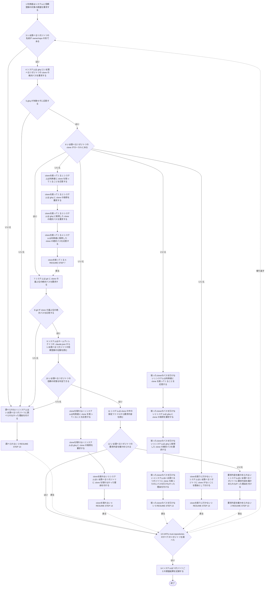
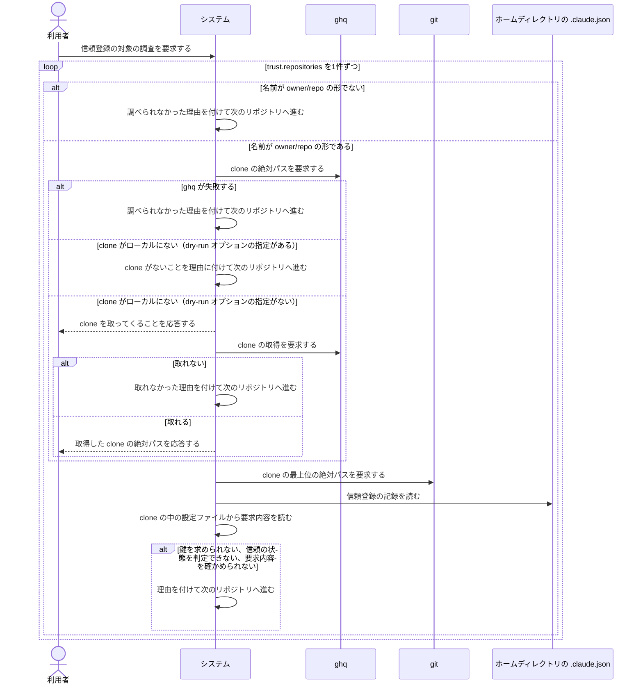

# ユースケース: 信頼登録の対象を調べる

> **`continuo trust` が、設定ファイルの `trust.repositories` に列挙されたリポジトリを1件ずつ調べる段だけを書いた記述である。**
> `対象リポジトリを信頼登録する` が `INCLUDE USE CASE` で引く。1件を調べられなくても止まらずに次へ進むので、
> 書き込みの段と1本の記述に書くと、調べ方の分かれ方と書き込みの結末の掛け算で経路が増える（1本のときは156本だった）。分けて書く。
>
> **この記述は、1件ごとの調査結果を呼び出し元へ渡すところまでである。**何も書き込まない。
> 調べられたリポジトリが0件のとき、調べられなかったリポジトリが残ったときにどうするかは、呼び出し元が決める。

## 根拠資料

- `docs/plans/continuo_design.md` の「3-33. 信頼の登録は、人間が列挙したものだけを対象にする」
- `docs/plans/continuo_design.md` の「3-33b. 信頼を渡す前に見せるものと、確かめられなかったときの扱い」（要求内容を確かめられなかったリポジトリは登録しない）
- `docs/plans/continuo_design.md` の「3-6. 起動時の検査を厚くする」（信頼を引く鍵の作り方の3段）
- `docs/plans/continuo_design.md` の「3-22. worktree の置き場所は gwq の規則に合わせる」（clone が無ければ `ghq get` で取る。`--dry-run` では取らない）
- `internal/trust/trust.go` の `Plan` / `inspect`、`Options` の `FetchClone`、`Entry` の `Actionable`
- `internal/trust/requirements.go` の `readRequirements`、`Requirements` の `Unconfirmed`
- `internal/trust/git.go` の `RunGitToplevel`
- `internal/workspace/git.go` の `RunGhqList` / `RunGhqGet`
- `internal/workspace/trust.go` の `CheckTrustForClonePath`
- `internal/cli/cli.go` の `runTrust`（呼び出し元。dry-run オプションの指定が無いときだけ、clone を取りに行く関数を渡す）

## 1件を諦めて次のリポジトリへ進む理由

基本フローの段3 から段12 は、`trust.repositories` の1件ぶんである（`internal/trust/trust.go` の `inspect`）。
どの理由でも、その1件だけを調べられなかったリポジトリにして、次のリポジトリへ進む。打ち切らない。

| 段 | 理由 | 代替フロー |
| --- | --- | --- |
| 3 | 名前が `owner/repo` の形でない（ghq に何も要求しない） | 調べられない |
| 5 | `ghq list -p -e` が失敗した | 調べられない |
| 6 | clone が無く、dry-run オプションの指定があるので取りに行かない | cloneを取りに行かない |
| 6 | clone が無く、`ghq get` で取れなかった | cloneを取れない |
| 6 | clone が無く、`ghq get` は成功したのに、`ghq list -p -e` を引き直しても clone のパスが出なかった（置き場所の設定の食い違い） | 取ったcloneのパスを引けない |
| 8 | `git rev-parse --path-format=absolute --show-toplevel` が失敗した | 調べられない |
| 10 | 信頼の状態を判定できなかった（判定の関数が先に `git rev-parse` をもう一度呼び、そこで失敗した。`~/.claude.json` を読めない。JSON として解析できない） | 調べられない |
| 12 | clone の中の `.claude/settings.json` か `.mcp.json` が、在るのに読めなかった | 要求内容を確かめられない |

段6 の検証が偽のとき（clone がローカルに無い）は、4本の代替フローのどれかへ進む。
dry-run オプションの指定があれば `cloneを取りに行かない`、無ければ取りに行く。取れてパスも引けたら `cloneを取ってくる`、取れなければ `cloneを取れない`、取れたのにパスを引けなければ `取ったcloneのパスを引けない` である。

## RUCM

```rucm
USE CASE NAME: 信頼登録の対象を調べる
BRIEF DESCRIPTION: システムは設定ファイルの trust.repositories に列挙されたリポジトリを1件ずつ調べる。システムは clone の絶対パスと信頼の鍵と信頼の状態と要求内容を調べる。システムは調べられなかったリポジトリに理由を付ける。システムは1件を調べられなくても打ち切らない。
PRECONDITION: 利用者は continuo trust を実行している。設定ファイルの trust.repositories にリポジトリが1件以上ある。ホームディレクトリの絶対パスが決まっている。
PRIMARY ACTOR: 利用者
SECONDARY ACTORS: ghq、git
DEPENDENCY: なし
GENERALIZATION: なし

BASIC FLOW:
1. 利用者はシステムに信頼登録の対象の調査を要求する。
2. DO
3.   システムは VALIDATES THAT いま調べるリポジトリの名前が owner/repo の形である。
4.   システムは ghq にいま調べるリポジトリの clone の絶対パスを要求する。
5.   システムは VALIDATES THAT ghq が失敗せずに応答する。
6.   システムは VALIDATES THAT いま調べるリポジトリの clone がローカルにある。
7.   システムは git に clone の最上位の絶対パスを要求する。
8.   システムは VALIDATES THAT git が clone の最上位の絶対パスを応答する。
9.   システムはホームディレクトリの .claude.json からいま調べるリポジトリの信頼登録の記録を読む。
10.   システムは VALIDATES THAT いま調べるリポジトリの信頼の状態を判定できる。
11.   システムは clone の中の設定ファイルから要求内容を読む。
12.   システムは VALIDATES THAT いま調べるリポジトリの要求内容を確かめられる。
13. UNTIL trust.repositories のすべてのリポジトリを調べた
14. システムはリポジトリごとの調査結果を記録する。
POSTCONDITION: trust.repositories のすべてのリポジトリに調査結果がある。調べられなかったリポジトリの調査結果には理由が付いている。ホームディレクトリの .claude.json は1バイトも変わっていない。

BOUNDED ALTERNATIVE FLOW 調べられない:
RFS BASIC FLOW 3,5,8,10
1. システムはいま調べるリポジトリに調べられなかった理由を付ける。
2. RESUME STEP 13
POSTCONDITION: いま調べたリポジトリは調べられなかったリポジトリである。残りのリポジトリの調査は続いている。ホームディレクトリの .claude.json は1バイトも変わっていない。

SPECIFIC ALTERNATIVE FLOW cloneを取ってくる:
RFS BASIC FLOW 6
1. システムは利用者に clone を取ってくることを応答する。
2. システムは ghq に clone の取得を要求する。
3. システムは ghq に取得した clone の絶対パスを要求する。
4. システムは利用者に取得した clone の絶対パスを応答する。
5. RESUME STEP 7
POSTCONDITION: 利用者は dry-run オプションを指定していない。いま調べるリポジトリの clone がローカルにある。取ってくることと取得した clone の絶対パスは標準出力に出ている。

SPECIFIC ALTERNATIVE FLOW cloneを取れない:
RFS BASIC FLOW 6
1. システムは利用者に clone を取ってくることを応答する。
2. システムは ghq に clone の取得を要求する。
3. システムはいま調べるリポジトリに clone を取れなかった理由を付ける。
4. RESUME STEP 13
POSTCONDITION: 利用者は dry-run オプションを指定していない。ghq は clone の取得に失敗している。いま調べたリポジトリは調べられなかったリポジトリである。残りのリポジトリの調査は続いている。

SPECIFIC ALTERNATIVE FLOW 取ったcloneのパスを引けない:
RFS BASIC FLOW 6
1. システムは利用者に clone を取ってくることを応答する。
2. システムは ghq に clone の取得を要求する。
3. システムは ghq に取得した clone の絶対パスを要求する。
4. システムはいま調べるリポジトリに clone を取ったのにパスを引けなかった理由を付ける。
5. RESUME STEP 13
POSTCONDITION: 利用者は dry-run オプションを指定していない。ghq は clone の取得に成功している。いま調べたリポジトリは調べられなかったリポジトリである。残りのリポジトリの調査は続いている。

SPECIFIC ALTERNATIVE FLOW cloneを取りに行かない:
RFS BASIC FLOW 6
1. システムはいま調べるリポジトリに clone がないことを理由として付ける。
2. RESUME STEP 13
POSTCONDITION: 利用者は dry-run オプションを指定している。システムは clone を取りに行っていない。いま調べたリポジトリは調べられなかったリポジトリである。残りのリポジトリの調査は続いている。

SPECIFIC ALTERNATIVE FLOW 要求内容を確かめられない:
RFS BASIC FLOW 12
1. システムはいま調べるリポジトリに要求内容を確かめられなかった理由を付ける。
2. RESUME STEP 13
POSTCONDITION: いま調べたリポジトリは調べられなかったリポジトリである。読めた範囲の要求内容は調査結果に残っている。残りのリポジトリの調査は続いている。
```

## フローチャート



## シーケンス図


