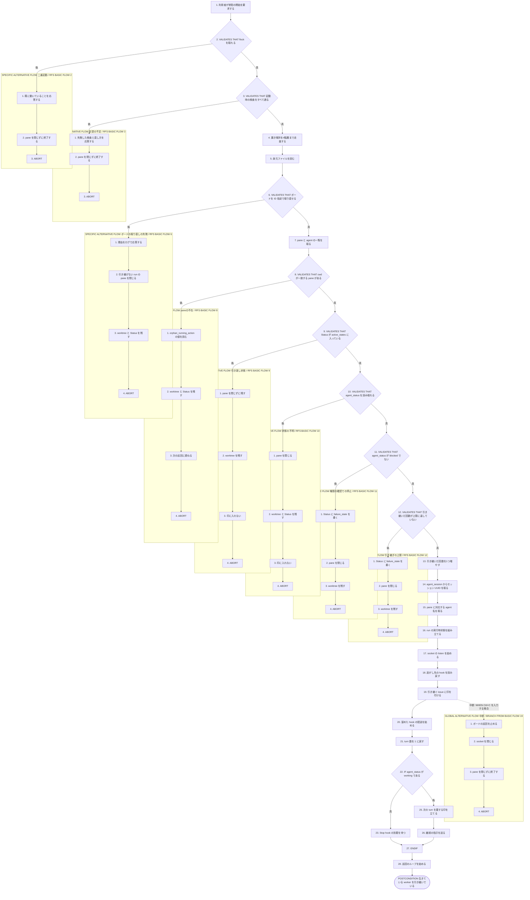
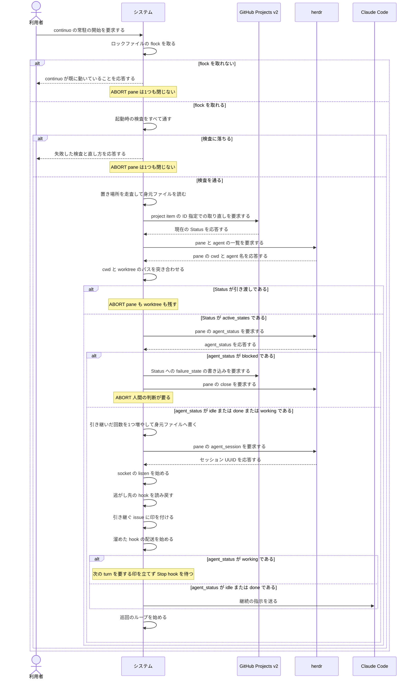

<!-- 目的: continuo を起動し直したときに、生きている worker を引き継ぐまでの9段を RUCM で定義する -->

# ユースケース: 再起動して実行中の issue を引き継ぐ

## 根拠資料

- `docs/plans/continuo_design.md#3-3`（run を指す識別子。セッション UUID は `--resume` で戻す）
- `docs/plans/continuo_design.md#3-4`（状態は in-memory。再起動時の復元手順の段1 から段9）
- `docs/plans/continuo_design.md#3-6`（起動時の検査。落ちても pane を閉じない）
- `docs/plans/continuo_design.md#3-17`（二重起動は flock で防ぐ）
- `docs/plans/continuo_design.md#3-18`（身元ファイルと引き継いだ回数）
- `docs/plans/continuo_design.md#3-19`（落ちている間に届かなかった通知を取り戻す）
- `docs/plans/continuo_design.md#8-1`（再起動後は引き渡し状態の worker を止めない）
- `internal/orchestrator/restore.go` の `Restore`、`scanIdentities`、`refetchByIdentities`、`matchPanes`、`decideOne`、`restoreWithoutPane`、`applyOrphanRunningAction`
- `internal/orchestrator/turn.go` の `startTurnLoop`
- `internal/workspace/scan.go` と `internal/workspace/identity.go`
- `internal/lock/lock.go`

## RUCM

```rucm
USE CASE NAME: 再起動して実行中の issue を引き継ぐ
BRIEF DESCRIPTION: 利用者は落ちた continuo を起動し直す。システムは worktree の身元ファイルとボードと herdr の pane を突き合わせ、生きている worker を1件引き継ぐ。システムは hook の socket を listen して逃がし先の hook を読み戻し、引き継いだ run に継続の指示を送る。
PRECONDITION: 前回の continuo のプロセスは終了している。worktree の置き場所に身元ファイルを持つ worktree が1つ以上ある。herdr は待ち受けている。前回の run の pane は生きている。
PRIMARY ACTOR: 利用者
SECONDARY ACTORS: GitHub Projects v2、herdr、Claude Code
DEPENDENCY: なし
GENERALIZATION: なし

BASIC FLOW:
1. 利用者はシステムに continuo の常駐の開始を要求する。
2. システムは VALIDATES THAT ロックファイルの flock を取れる。
3. システムは VALIDATES THAT 起動時の検査をすべて通る。
4. システムは worktree の置き場所を4階層まで走査する。
5. システムは worktree の中の身元ファイルを読む。
6. システムは VALIDATES THAT ボードを project item の ID 指定で取り直せる。
7. システムは herdr から pane と agent の一覧を取る。
8. システムは VALIDATES THAT worktree のパスと cwd が一致する pane がある。
9. システムは VALIDATES THAT 取り直した Status が active_states に入っている。
10. システムは VALIDATES THAT pane の agent_status を読み取れる。
11. システムは VALIDATES THAT agent_status が blocked でない。
12. システムは VALIDATES THAT 身元ファイルの引き継いだ回数が agent.max_takeover に達していない。
13. システムは身元ファイルの引き継いだ回数を1つ増やす。
14. システムは pane の agent_session からセッション UUID を取る。
15. システムは agent の一覧から pane に対応する agent 名を取る。
16. システムは run の実行時状態を組み立てる。
17. システムは hook を受ける socket の listen を始める。
18. システムは逃がし先に溜まった hook を読み戻す。
19. システムは引き継ぐ issue に印を付ける。
20. システムは溜めた hook の配送を始める。
21. システムは run の turn 数を 1 に戻す。
22. IF agent_status が working である THEN
23.   システムは Stop hook の到着を待つ。
24. ELSE
25.   システムは run に次の turn を要する印を立てる。
26.   システムは run に継続の指示を送る。
27. ENDIF
28. システムは巡回のループを始める。
POSTCONDITION: 引き継いだ issue は印の集合に入っている。身元ファイルの引き継いだ回数は1つ増えている。run の turn 数は 1 である。herdr の pane は閉じていない。worktree は残っている。issue の Status は running_state の選択肢のままである。

SPECIFIC ALTERNATIVE FLOW 二重起動:
RFS BASIC FLOW 2
1. システムは利用者に continuo が既に動いていることを応答する。
2. システムは herdr の pane を1つも閉じずに終了する。
3. ABORT
POSTCONDITION: 2つめの continuo のプロセスは終了している。1つめの continuo のプロセスは動いている。herdr の pane は閉じていない。

SPECIFIC ALTERNATIVE FLOW 前提の不足:
RFS BASIC FLOW 3
1. システムは利用者に失敗した検査の名前と直し方を応答する。
2. システムは herdr の pane を1つも閉じずに終了する。
3. ABORT
POSTCONDITION: continuo は常駐していない。herdr の pane は閉じていない。worktree は残っている。issue の Status は変わっていない。

SPECIFIC ALTERNATIVE FLOW ボードの取り直しの失敗:
RFS BASIC FLOW 6
1. システムは利用者に取り直しに失敗した理由をログで応答する。
2. システムは引き継げない run の herdr の pane を閉じる。
3. システムは worktree と issue の Status を残す。
4. ABORT
POSTCONDITION: herdr の pane は閉じている。worktree は残っている。issue の Status は running_state の選択肢のままである。continuo は常駐している。

SPECIFIC ALTERNATIVE FLOW paneの不在:
RFS BASIC FLOW 8
1. システムは restart.orphan_running_action の値を読む。
2. システムは worktree と issue の Status を残す。
3. システムは issue を次の巡回に委ねる。
4. ABORT
POSTCONDITION: issue は印の集合に入っていない。worktree は残っている。issue の Status は running_state の選択肢のままである。

SPECIFIC ALTERNATIVE FLOW 引き渡し状態:
RFS BASIC FLOW 9
1. システムは herdr の pane を閉じずに残す。
2. システムは worktree を残す。
3. システムは issue を印の集合に入れない。
4. ABORT
POSTCONDITION: herdr の pane は閉じていない。worktree は残っている。issue の Status は変わっていない。利用者は pane の中身を読める。

SPECIFIC ALTERNATIVE FLOW 状態の不明:
RFS BASIC FLOW 10
1. システムは herdr の pane を閉じる。
2. システムは worktree と issue の Status を残す。
3. システムは issue を印の集合に入れない。
4. ABORT
POSTCONDITION: herdr の pane は閉じている。worktree は残っている。issue の Status は running_state の選択肢のままである。

SPECIFIC ALTERNATIVE FLOW 権限の確認での停止:
RFS BASIC FLOW 11
1. システムはボードの issue の Status に failure_state の選択肢を書く。
2. システムは herdr の pane を閉じる。
3. システムは worktree を残す。
4. ABORT
POSTCONDITION: issue の Status は failure_state の選択肢である。herdr の pane は閉じている。保留中の権限の要求は pane ごと消えている。worktree は残っている。

SPECIFIC ALTERNATIVE FLOW 引き継ぎの上限:
RFS BASIC FLOW 12
1. システムはボードの issue の Status に failure_state の選択肢を書く。
2. システムは herdr の pane を閉じる。
3. システムは worktree を残す。
4. ABORT
POSTCONDITION: issue の Status は failure_state の選択肢である。continuo は turn を1回も送っていない。worktree は残っている。

GLOBAL ALTERNATIVE FLOW 中断:
BRANCH FROM BASIC FLOW 19
WHEN 利用者が continuo を動かしている端末で Ctrl+C を入力する場合
1. システムはボードの巡回を止める。
2. システムは hook を受ける socket を閉じる。
3. システムは herdr の pane を閉じずに終了する。
4. ABORT
POSTCONDITION: continuo は常駐していない。印の集合は失われている。herdr の pane は閉じていない。worktree は残っている。issue の Status は running_state の選択肢のままである。
```

## 引き継ぐかどうかを Status で決める

**取り直した Status で分岐する**（設計 3-4 の段5a）。

| 取り直した Status | どうするか |
| --- | --- |
| active_states | 引き継ぐ |
| cleanup.on_states | pane を閉じてから worktree と branch を片付ける |
| 引き渡し（In Review / Blocked） | pane も worktree も残す。印には入れない |
| 取り直しで見つからない | pane も worktree も残す。ログに出す |

## 引き継ぐと決めたあとに agent_status で分岐する

**Status だけで決めてはならない**（設計 3-4 の段5a2）。

| agent_status | どうするか |
| --- | --- |
| idle または done | 引き継いで継続の指示を送る |
| blocked | 引き継がない。failure_state へ落として pane を閉じる |
| working | 引き継ぐ。次の turn を要する印を立てず、Stop hook を待つ |
| 読み取れない | pane を閉じ、worktree と Status を残す |

## フローチャート



## シーケンス図


