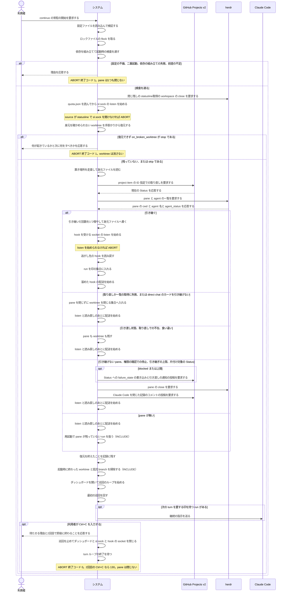

# ユースケース: 再起動して実行中の issue を引き継ぐ

## 根拠資料

- `docs/plans/continuo_design.md#3-3`（run を指す識別子。セッション UUID は `--resume` で戻す）
- `docs/plans/continuo_design.md#3-4`（状態は in-memory。再起動時の復元手順の段1 から段9。起動から復元までの順序の段3a と段3b。取り直しに失敗した run と direct chat のカードは pane を閉じない）
- `docs/plans/continuo_design.md#3-27`（usage API と statusline の切り替え・使用率の受け取り方・`quota.json`・statusline取得・statusline を使えないとき）
- `docs/plans/continuo_design.md#3-6`（起動時の検査。落ちても pane を閉じない）
- `docs/plans/continuo_design.md#3-17`（二重起動は flock で防ぐ）
- `docs/plans/continuo_design.md#3-18`（身元ファイルと引き継いだ回数）
- `docs/plans/continuo_design.md#3-19`（落ちている間に届かなかった通知を取り戻す）
- `docs/plans/continuo_design.md#3-23`（hook を受ける socket のパス。前回と違えば引き継がない）
- `docs/plans/continuo_design.md#8-1`（再起動後は引き渡し状態の worker を止めない）
- `docs/plans/continuo_design.md#3-83f`（agent 名を問わず閉じる worktree の集合）
- `docs/plans/continuo_design.md#3-83j`（再起動で direct chat のカードの pane を閉じない）
- `docs/plans/continuo_design.md#3-85c`（引き継がない pane を閉じたら、閉じた記録を書く）
- `docs/plans/continuo_design.md#3-49`（身元を確かめられない worktree の復元と、止まり方）
- `docs/plans/continuo_design.md#3-52`（Ctrl+C を受けたあとの後始末と、2回目の Ctrl+C）
- `internal/daemon/daemon.go` の `Run`（起動の段1 から段5）、`build`、`close`（後始末で `sl.sock` を hook の受け口より先に閉じる）、`WatchInterrupt`、`announceShutdown`
- `internal/cli/cli.go` の `runMain`（ログの出力先と終了コード）
- `internal/orchestrator/restore.go` の `Restore`、`handleBrokenWorktrees`、`recoverIdentity`、`slugAgrees`、`scanIdentities`、`pathAgrees`、`refetchByIdentities`、`matchPanes`、`closeExtraPanes`、`decideAdoptions`、`decideOne`、`issueAgreesWithPath`、`moveToFailure`、`closePaneInto`
- `internal/orchestrator/orchestrator.go` の `Adopt`、`Run`、`Tick`、`DisableStatusline`
- `internal/orchestrator/turn.go` の `startTurnLoop`
- `internal/orchestrator/directchat.go` の `addToCloseSet`
- `internal/orchestrator/relay.go` の `recordWorkerClosed`、`relayEnabled`
- `internal/orchestrator/statuslinefetch.go` の `PrepareStatusline`、`cleanupStatuslineLeftovers`
- `internal/orchestrator/quota.go` の `loadQuota`
- `internal/workspace/scan.go` の `Scan` と `internal/workspace/identity.go` の `IncrementTakeover`
- `internal/workspace/broken.go` の `ScanBroken`、`PathClueOf`、`NextSteps`
- `internal/lock/lock.go` の `Acquire`

起動時の掃除は `起動時に終わった worktree と孤児 branch を掃除する.rucm.md` に、pane が残っていない run の扱いは `再起動で pane が残っていない run を扱う.rucm.md` に書いてある。

## RUCM

```rucm
USE CASE NAME: 再起動して実行中の issue を引き継ぐ
BRIEF DESCRIPTION: 利用者は落ちた continuo を起動し直す。システムは worktree の身元ファイルとボードと herdr の pane を突き合わせ、前回の run を1件引き継ぐかどうかを決める。システムは hook の socket を listen して逃がし先の hook を読み戻し、引き継ぐと決めた run を印の集合に入れる。システムは起動時の掃除を済ませてから巡回を始める。
PRECONDITION: 前回の continuo のプロセスは終了している。worktree の置き場所に前回の run の worktree が1つある。
PRIMARY ACTOR: 利用者
SECONDARY ACTORS: GitHub Projects v2、herdr、Claude Code
DEPENDENCY: INCLUDE USE CASE 起動時に終わった worktree と孤児 branch を掃除する、INCLUDE USE CASE 再起動で pane が残っていない run を扱う
GENERALIZATION: なし

BASIC FLOW:
1. 利用者はシステムに continuo の常駐の開始を要求する。
2. システムは VALIDATES THAT 設定ファイルの読み込みと検証を通る。
3. システムは VALIDATES THAT ロックファイルの flock を取れる。
4. システムは VALIDATES THAT GitHub のトークンを取得して依存を組み立てられる。
5. システムは VALIDATES THAT 起動時の検査をすべて通る。
6. システムは閉じ残しの一覧にある statusline取得用の herdr の workspace を閉じる。
7. システムは rate_limit.source が none でなければ quota.json を読む。
8. システムは rate_limit.source が none でなければ sl.sock の listen を始める。
9. システムは VALIDATES THAT sl.sock の listen の結果で起動を続けられる。
10. システムは worktree の置き場所から身元を確かめられない worktree を探す。
11. システムは身元を確かめられない worktree の身元ファイルを、置き場所と herdr の pane の label とボードから書き直す。
12. システムは VALIDATES THAT 身元を確かめられない worktree が1つも残っていない。
13. システムは worktree の置き場所を4階層まで走査する。
14. システムは worktree の中の身元ファイルを読む。
15. システムは VALIDATES THAT 身元ファイルに project item の ID がある。
16. システムは VALIDATES THAT 身元ファイルが名乗る owner とリポジトリ名が worktree の置き場所の階層と一致する。
17. システムは VALIDATES THAT 同じ project item の ID を名乗る worktree のうち、作成時刻がいちばん新しい worktree である。
18. システムは VALIDATES THAT herdr から pane と agent の一覧を取れる。
19. システムは VALIDATES THAT worktree のパスと cwd が一致する pane がある。
20. システムは VALIDATES THAT ボードを project item の ID 指定で取り直せている。
21. システムは VALIDATES THAT 取り直した結果に身元ファイルの project item がある。
22. システムは VALIDATES THAT 取り直した issue の owner とリポジトリ名が worktree の置き場所の階層と一致する。
23. システムは VALIDATES THAT 取り直した Status が cleanup.on_states に入っていない。
24. システムは VALIDATES THAT 取り直した Status が active_states に入っている。
25. システムは VALIDATES THAT 身元ファイルの socket のパスが今回の hook を受ける socket のパスと一致する。
26. システムは VALIDATES THAT agent の一覧に pane に対応する agent 名がある。
27. システムは VALIDATES THAT pane の agent_session か身元ファイルからセッション UUID を取れる。
28. システムは VALIDATES THAT agent_status が idle と done と working と blocked のどれかである。
29. システムは VALIDATES THAT agent_status が blocked でない。
30. システムは VALIDATES THAT 身元ファイルの引き継いだ回数が agent.max_takeover に達していない。
31. システムは身元ファイルの引き継いだ回数を1つ増やす。
32. IF agent_status が working である THEN
33.   システムは run の実行時状態に turn の終わりを待つ印を入れる。
34. ELSE
35.   システムは run の実行時状態に次の turn を要する印を入れる。
36. ENDIF
37. システムは VALIDATES THAT hook を受ける socket の listen を始められる。
38. システムは逃がし先に溜まった hook を読み戻す。
39. システムは引き継ぐ run を印の集合と実行中の一覧に入れる。
40. システムは run の turn 数を 1 から数え直す。
41. システムは溜めた hook の配送を始める。
42. システムは復元を終えたことを記録に残す。
43. INCLUDE USE CASE 起動時に終わった worktree と孤児 branch を掃除する
44. システムは server.port が設定されていればダッシュボードを開く。
45. システムは巡回のループを始める。
46. システムは最初の巡回を回す。
POSTCONDITION: continuo は常駐している。hook を受ける socket は listen している。システムが引き継ぐと決めた run は印の集合に入っている。システムが引き継ぐと決めた run の herdr の pane は閉じていない。システムが引き継ぐと決めた run の branch は残っている。システムが引き継ぐと決めた run の turn 数は 1 から数え直している。最初の巡回は次の turn を要する印を持つ run に継続の指示を送る。最初の巡回は turn の終わりを待つ印を持つ run の Stop hook を待つ。

SPECIFIC ALTERNATIVE FLOW 設定の不備:
RFS BASIC FLOW 2
1. システムは利用者に起動できない理由を応答する。
2. ABORT
POSTCONDITION: continuo は常駐していない。システムはロックファイルの flock を取っていない。herdr の pane は閉じていない。理由は標準エラーに出ている。終了コード 1 が返っている。

SPECIFIC ALTERNATIVE FLOW 二重起動:
RFS BASIC FLOW 3
1. システムは利用者に continuo が既に動いていることを応答する。
2. システムは herdr の pane を1つも閉じずに終了する。
3. ABORT
POSTCONDITION: 2つめの continuo のプロセスは終了している。1つめの continuo のプロセスは動いている。herdr の pane は閉じていない。理由は標準エラーに出ている。終了コード 1 が返っている。

SPECIFIC ALTERNATIVE FLOW 依存の組み立ての失敗:
RFS BASIC FLOW 4
1. システムは利用者に依存を組み立てられない理由を応答する。
2. システムは herdr の pane を1つも閉じずに終了する。
3. ABORT
POSTCONDITION: continuo は常駐していない。herdr の pane は閉じていない。worktree は残っている。issue の Status は変わっていない。理由は標準エラーに出ている。終了コード 1 が返っている。

SPECIFIC ALTERNATIVE FLOW 前提の不足:
RFS BASIC FLOW 5
1. システムは利用者に失敗した検査の名前と直し方を応答する。
2. システムは herdr の pane を1つも閉じずに終了する。
3. ABORT
POSTCONDITION: continuo は常駐していない。herdr の pane は閉じていない。worktree は残っている。issue の Status は変わっていない。理由は標準エラーに出ている。終了コード 1 が返っている。

SPECIFIC ALTERNATIVE FLOW 使用率の受け口を開けない:
RFS BASIC FLOW 9
1. システムは利用者に rate_limit.source が statusline なのに sl.sock を開けない理由を応答する。
2. システムは herdr の pane を1つも閉じずに終了する。
3. ABORT
POSTCONDITION: continuo は常駐していない。herdr の pane は閉じていない。worktree は残っている。issue の Status は変わっていない。理由は標準エラーに出ている。終了コード 1 が返っている。

SPECIFIC ALTERNATIVE FLOW 復元できない壊れたworktree:
RFS BASIC FLOW 12
1. システムは利用者に何が起きているかと次に何をすべきかを応答する。
2. システムは VALIDATES THAT 設定の workspace.on_broken_worktree が skip である。
3. システムは壊れた worktree を引き継ぎの候補から外す。
4. システムは hook を受ける socket の listen を始める。
5. システムは逃がし先に溜まった hook を読み戻す。
6. RESUME STEP 41
POSTCONDITION: 壊れた worktree は残っている。システムはボードへ1バイトも書いていない。herdr の pane は閉じていない。issue は印の集合に入っていない。continuo は常駐している。

SPECIFIC ALTERNATIVE FLOW 壊れたworktreeでの停止:
RFS 復元できない壊れたworktree 2
1. システムは利用者に壊れた worktree の件数とパスを応答する。
2. システムは herdr の pane を1つも閉じずに終了する。
3. ABORT
POSTCONDITION: continuo は常駐していない。壊れた worktree は残っている。システムはボードへ1バイトも書いていない。herdr の pane は閉じていない。理由は標準エラーに出ている。終了コード 1 が返っている。

SPECIFIC ALTERNATIVE FLOW 項目IDの不在:
RFS BASIC FLOW 15
1. システムは身元ファイルに project item の ID が無いことを記録に残す。
2. システムは worktree を引き継ぎの候補から外す。
3. システムは hook を受ける socket の listen を始める。
4. システムは逃がし先に溜まった hook を読み戻す。
5. RESUME STEP 41
POSTCONDITION: worktree は残っている。システムはボードへ1バイトも書いていない。herdr の pane は閉じていない。issue は印の集合に入っていない。continuo は常駐している。

SPECIFIC ALTERNATIVE FLOW 名乗りの食い違い:
RFS BASIC FLOW 16
1. システムは置き場所の階層と身元ファイルの名乗りが食い違ったことを記録に残す。
2. システムは worktree を引き継ぎの候補から外す。
3. システムは hook を受ける socket の listen を始める。
4. システムは逃がし先に溜まった hook を読み戻す。
5. RESUME STEP 41
POSTCONDITION: worktree は残っている。システムはボードへ1バイトも書いていない。herdr の pane は閉じていない。issue は印の集合に入っていない。continuo は常駐している。

SPECIFIC ALTERNATIVE FLOW 重複した古いworktree:
RFS BASIC FLOW 17
1. システムは同じ issue の worktree が2つあることを記録に残す。
2. システムは作成時刻が古いほうの worktree を引き継ぎの候補から外す。
3. システムは古いほうの worktree を cwd に持つ herdr の pane を閉じる。
4. システムは hook を受ける socket の listen を始める。
5. システムは逃がし先に溜まった hook を読み戻す。
6. RESUME STEP 41
POSTCONDITION: 古いほうの worktree は残っている。古いほうの worktree の herdr の pane は閉じている。システムは Claude Code を閉じた記録のコメントを書いていない。issue の Status は変わっていない。continuo は常駐している。

SPECIFIC ALTERNATIVE FLOW ボードの取り直しの失敗:
RFS BASIC FLOW 20
1. システムは取り直しに失敗したので引き継がないことを記録に残す。
2. システムは herdr の pane を閉じずに残す。
3. システムは worktree を閉じる集合に入れる。
4. システムは hook を受ける socket の listen を始める。
5. システムは逃がし先に溜まった hook を読み戻す。
6. RESUME STEP 41
POSTCONDITION: herdr の pane は閉じていない。worktree は残っている。issue の Status は変わっていない。issue は印の集合に入っていない。worktree は閉じる集合に入っている。システムは Claude Code を閉じた記録のコメントを書いていない。continuo は常駐している。

SPECIFIC ALTERNATIVE FLOW 一覧の取得の失敗:
RFS BASIC FLOW 18
1. システムは pane が生きているかどうかの判断を保留する。
2. システムは herdr の pane を1つも閉じない。
3. システムは worktree を閉じる集合に入れる。
4. システムは hook を受ける socket の listen を始める。
5. システムは逃がし先に溜まった hook を読み戻す。
6. RESUME STEP 41
POSTCONDITION: herdr の pane は閉じていない。worktree は残っている。issue の Status は変わっていない。issue は印の集合に入っていない。worktree は閉じる集合に入っている。continuo は常駐している。

SPECIFIC ALTERNATIVE FLOW paneの不在:
RFS BASIC FLOW 19
1. システムは hook を受ける socket の listen を始める。
2. システムは逃がし先に溜まった hook を読み戻す。
3. システムは溜めた hook の配送を始める。
4. INCLUDE USE CASE 再起動で pane が残っていない run を扱う
5. RESUME STEP 42
POSTCONDITION: issue は印の集合に入っていない。herdr の pane は1つも閉じていない。continuo は常駐している。

SPECIFIC ALTERNATIVE FLOW 取り直しでの不在:
RFS BASIC FLOW 21
1. システムは取り直しで project item が見つからないことを記録に残す。
2. システムは herdr の pane と worktree を残す。
3. システムは hook を受ける socket の listen を始める。
4. システムは逃がし先に溜まった hook を読み戻す。
5. RESUME STEP 41
POSTCONDITION: herdr の pane は閉じていない。worktree は残っている。システムはボードへ1バイトも書いていない。issue は印の集合に入っていない。continuo は常駐している。

SPECIFIC ALTERNATIVE FLOW issueの取り違え:
RFS BASIC FLOW 22
1. システムは取り直した issue と置き場所の階層が食い違ったことを記録に残す。
2. システムは herdr の pane と worktree を残す。
3. システムは hook を受ける socket の listen を始める。
4. システムは逃がし先に溜まった hook を読み戻す。
5. RESUME STEP 41
POSTCONDITION: herdr の pane は閉じていない。worktree は残っている。取り直した issue の Status は変わっていない。issue は印の集合に入っていない。continuo は常駐している。

SPECIFIC ALTERNATIVE FLOW 片付け対象のStatus:
RFS BASIC FLOW 23
1. システムは herdr の pane を閉じる。
2. システムは Claude Code を閉じた記録を issue に1件コメントする。
3. システムは worktree と branch を片付ける。
4. システムは hook を受ける socket の listen を始める。
5. システムは逃がし先に溜まった hook を読み戻す。
6. RESUME STEP 41
POSTCONDITION: herdr の pane は閉じている。issue に Claude Code を閉じた記録のコメントが1件増えている。片付けの条件を満たした worktree は消えている。issue の Status は変わっていない。issue は印の集合に入っていない。continuo は常駐している。

SPECIFIC ALTERNATIVE FLOW 作業中でないStatus:
RFS BASIC FLOW 24
1. システムは VALIDATES THAT 取り直した Status が direct_chat_state である。
2. システムは VALIDATES THAT direct chat のカードの pane を引き継ぐ条件がすべて揃っている。
3. システムは身元ファイルの引き継いだ回数を1つ増やす。
4. システムは run の実行時状態に direct chat の印を入れる。
5. システムは hook を受ける socket の listen を始める。
6. システムは逃がし先に溜まった hook を読み戻す。
7. システムは引き継ぐ run を印の集合と実行中の一覧に入れる。
8. RESUME STEP 41
POSTCONDITION: issue は印の集合に入っている。run は direct chat の印を持っている。herdr の pane は閉じていない。システムは run に指示を1回も送らない。issue の Status は direct_chat_state の選択肢のままである。continuo は常駐している。

SPECIFIC ALTERNATIVE FLOW 引き渡し状態:
RFS 作業中でないStatus 1
1. システムは herdr の pane を閉じずに残す。
2. システムは worktree を残す。
3. システムは hook を受ける socket の listen を始める。
4. システムは逃がし先に溜まった hook を読み戻す。
5. RESUME STEP 8
POSTCONDITION: herdr の pane は閉じていない。worktree は残っている。issue の Status は変わっていない。issue は印の集合に入っていない。利用者は pane の中身を読める。continuo は常駐している。

SPECIFIC ALTERNATIVE FLOW directChatの見送り:
RFS 作業中でないStatus 2
1. システムは引き継げない理由を記録に残す。
2. システムは herdr の pane を閉じずに残す。
3. システムは worktree を閉じる集合に入れる。
4. システムは hook を受ける socket の listen を始める。
5. システムは逃がし先に溜まった hook を読み戻す。
6. RESUME STEP 8
POSTCONDITION: herdr の pane は閉じていない。worktree は残っている。issue の Status は direct_chat_state の選択肢のままである。システムは issue にコメントを書いていない。issue は印の集合に入っていない。worktree は閉じる集合に入っている。continuo は常駐している。

BOUNDED ALTERNATIVE FLOW 引き継げないpane:
RFS BASIC FLOW 25,26,27,28
1. システムは引き継げない理由を記録に残す。
2. システムは herdr の pane を閉じる。
3. システムは Claude Code を閉じた記録を issue に1件コメントする。
4. システムは hook を受ける socket の listen を始める。
5. システムは逃がし先に溜まった hook を読み戻す。
6. RESUME STEP 41
POSTCONDITION: herdr の pane は閉じている。issue に Claude Code を閉じた記録のコメントが1件増えている。worktree は残っている。issue の Status は変わっていない。issue は印の集合に入っていない。continuo は常駐している。

SPECIFIC ALTERNATIVE FLOW 権限の確認での停止:
RFS BASIC FLOW 29
1. システムはボードの issue の Status に failure_state の選択肢を書く。
2. システムは引き渡しの通知を issue に1件コメントする。
3. システムは herdr の pane を閉じる。
4. システムは Claude Code を閉じた記録を issue に1件コメントする。
5. システムは hook を受ける socket の listen を始める。
6. システムは逃がし先に溜まった hook を読み戻す。
7. RESUME STEP 41
POSTCONDITION: issue の Status は failure_state の選択肢である。herdr の pane は閉じている。issue に引き渡しの通知のコメントが1件増えている。issue に Claude Code を閉じた記録のコメントが1件増えている。保留中の権限の要求は pane ごと消えている。worktree は残っている。issue は印の集合に入っていない。continuo は常駐している。

SPECIFIC ALTERNATIVE FLOW 引き継ぎの上限:
RFS BASIC FLOW 30
1. システムはボードの issue の Status に failure_state の選択肢を書く。
2. システムは引き渡しの通知を issue に1件コメントする。
3. システムは herdr の pane を閉じる。
4. システムは Claude Code を閉じた記録を issue に1件コメントする。
5. システムは hook を受ける socket の listen を始める。
6. システムは逃がし先に溜まった hook を読み戻す。
7. RESUME STEP 41
POSTCONDITION: issue の Status は failure_state の選択肢である。herdr の pane は閉じている。issue に引き渡しの通知のコメントが1件増えている。issue に Claude Code を閉じた記録のコメントが1件増えている。continuo は turn を1回も送っていない。worktree は残っている。issue は印の集合に入っていない。continuo は常駐している。

SPECIFIC ALTERNATIVE FLOW hookの受け口を開けない:
RFS BASIC FLOW 37
1. システムは利用者に hook を受ける socket の listen を始められない理由を応答する。
2. システムは herdr の pane を1つも閉じずに終了する。
3. ABORT
POSTCONDITION: continuo は常駐していない。herdr の pane は閉じていない。worktree は残っている。身元ファイルの引き継いだ回数は1つ増えている。理由は標準エラーに出ている。終了コード 1 が返っている。

GLOBAL ALTERNATIVE FLOW 中断:
BRANCH FROM BASIC FLOW 39
WHEN 利用者が continuo を動かしている端末で Ctrl+C を入力する場合
1. システムは利用者に待たせる理由と、もう一度 Ctrl+C を押せば後始末を待たずに終わることを応答する。
2. システムはボードの巡回を止める。
3. システムはダッシュボードを閉じる。
4. システムは使用率を受ける sl.sock を閉じる。
5. システムは hook を受ける socket を閉じる。
6. システムは走行中の turn ループの終了を待つ。
7. システムは herdr の pane を閉じずに終了する。
8. ABORT
POSTCONDITION: continuo は常駐していない。印の集合は失われている。herdr の pane は閉じていない。worktree は残っている。issue の Status は変わっていない。終了コード 0 が返っている。

GLOBAL ALTERNATIVE FLOW 中断の連打:
BRANCH FROM 中断 3
WHEN 利用者が後始末の途中でもう一度 Ctrl+C を入力する場合
1. システムは利用者に後始末を待たずに終わることを応答する。
2. システムは herdr の pane を閉じずに終了する。
3. ABORT
POSTCONDITION: continuo は常駐していない。印の集合は失われている。herdr の pane は閉じていない。worktree は残っている。issue の Status は変わっていない。終了コード 130 が返っている。
```

## この記述が追うのは、前回の run の worktree 1件である

**言いたいこと。**起動の処理は置き場所の worktree を全件まとめて扱うが、引き継ぐかどうかは worktree ごとに決まる。
この記述は worktree 1件を追い、その1件を引き継がないと決めた経路も、起動を止めない限り基本フローへ戻す。

| 引き継がないと決めたあと、実装が次に行う段 | 戻り先 |
| --- | --- |
| hook を受ける socket の listen と逃がし先の読み戻し（代替フローの中に書いた）。そのあと配送の開始 | ステップ41 |
| pane が無い worktree の扱い（配送の開始のあとに行う。`再起動で pane が残っていない run を扱う` を引く）。そのあと復元の終わりの記録 | ステップ42 |

**ステップ39 と40（印の集合に入れる・turn 数を数え直す）は、引き継ぐ run にしか当てはまらない。**
引き継がない経路がステップ37 へ戻ると、この2段を通ることになる。だから listen と読み戻しは代替フローの中に書き、ステップ41 へ戻している。

**基本フローの事後条件は、ステップ41 以降へ戻ったどの経路でも成り立つ形で書いた。**
引き継いだ run についての条件は「システムが引き継ぐと決めた run は」で始めてある。引き継がない経路の結果は、それぞれの代替フローの事後条件に書いた。

## 起動を止める失敗

**どれも、理由をログ（標準エラー）へ出して終了コード 1 で終わる。herdr の pane は1つも閉じない。**

| 代替フロー | 実装のどこで止まるか |
| --- | --- |
| 設定の不備 | `Run` の段1。設定ファイルの読み込みと検証、`--id` の解決、送るプロンプトの変数の検査、GraphQL の接続先の検査、hook を受ける socket の置き場所の用意 |
| 二重起動 | `Run` の段2。ロックファイルを開けないときも同じ段で止まる（文言は「既に動いている」ではなく、ロックファイルを開けないことを言う） |
| 依存の組み立ての失敗 | `Run` の段2b（`build`）。`gh` が無い、トークンを取得できない、`rate_limit.source` が `statusline` で `sl.sock` のパスが長すぎる、など |
| 前提の不足 | `Run` の段3（起動時の検査） |
| 使用率の受け口を開けない | `Run` の段3b。`rate_limit.source` が `statusline` で `sl.sock` を開けないときだけ |
| 壊れたworktreeでの停止 | `handleBrokenWorktrees`。`workspace.on_broken_worktree` が `stop`（既定） |
| hookの受け口を開けない | `Restore` の段5d |

**hook を受ける socket の listen は、引き継がない経路でも同じ1回の呼び出しである。**
始められなければ、どの経路でも起動を止める。経路としては基本フローのステップ37 の分岐だけに出した。

## 取り直しの失敗を見るのは、pane の有無を見たあとである

**言いたいこと。**ボードの取り直しの要求は、herdr の一覧を取るより前に1回だけ送る（`Restore` の段3）。
**だが、その失敗を見るのは pane の有無を見たあとである**（`decideAdoptions` が pane の有無で振り分け、`decideOne` と `restoreWithoutPane` がそれぞれ失敗を見る）。
だからステップは、一覧（18）、pane の有無（19）、取り直せているか（20）の順に並べた。

| pane | 取り直し | 経路 |
| --- | --- | --- |
| 在る | 失敗 | `ボードの取り直しの失敗`。pane を閉じずに、worktree を閉じる集合へ入れる |
| 無い | 失敗 | `paneの不在` から引いた先の `取り直しの失敗`。閉じる集合へは入れない |
| 一覧を取れない | どちらでも | `一覧の取得の失敗`。候補を全部閉じる集合へ入れる |

## 引き継ぐかどうかを Status で決める

**取り直した Status で分岐する**（設計 3-4 の段5a）。pane が生きている worktree の表である。

| 取り直した Status | どうするか | 経路 |
| --- | --- | --- |
| cleanup.on_states | pane を閉じ、閉じた記録を書いてから worktree と branch を片付ける | 片付け対象のStatus |
| active_states | 引き継ぐ側。socket のパス・agent 名・セッション UUID・agent_status・引き継いだ回数を見る | 基本フロー |
| direct_chat_state | 引き継ぐ側。direct chat の印を立てて印の集合に入れる。指示は送らない | 作業中でないStatus |
| 引き渡し（In Review / Blocked など、上のどれでもない） | pane も worktree も残す。印には入れない | 引き渡し状態 |
| 取り直しで見つからない | pane も worktree も残す。ログに出す | 取り直しでの不在 |

**判定の順は cleanup.on_states、active_states、direct_chat_state の順である**（`decideOne` の `switch`）。

## 引き継ぐと決めたあとに agent_status で分岐する

**Status だけで決めてはならない**（設計 3-4 の段5a2）。

| agent_status | どうするか |
| --- | --- |
| idle または done | 引き継ぐ。次の turn を要する印を立てる。最初の巡回が継続の指示を送る |
| working | 引き継ぐ。次の turn を要する印を立てず、turn の終わりを待つ印を立てる。最初の巡回が Stop hook を待つ turn ループを起こす |
| blocked | 引き継がない。failure_state へ落として引き渡しの通知を書き、pane を閉じて閉じた記録を書く |
| 上のどれでもない | 引き継がない。pane を閉じて閉じた記録を書く。worktree と Status を残す |

**継続の指示を送るのも Stop hook を待つのも、復元の中ではない。**巡回の `Tick` が turn ループを起こす。
だから基本フローはステップ46（最初の巡回を回す）で終え、送ることと待つことは事後条件に書いた。

## pane を閉じる経路と、閉じない経路

**pane を閉じて、閉じた記録（「Claude Code を閉じました」のコメント）を書く経路**（設計 3-85c）。

| 経路 | 理由 |
| --- | --- |
| 引き継げないpane（ステップ25） | hook を受ける socket のパスが前回と違う |
| 引き継げないpane（ステップ26） | pane に agent 名が無い |
| 引き継げないpane（ステップ27） | セッション UUID を pane からも身元ファイルからも取れない |
| 引き継げないpane（ステップ28） | agent_status を判断できない |
| 権限の確認での停止 | agent_status が blocked。引き渡しの通知も1件書くので、コメントは最大2件増える |
| 引き継ぎの上限 | 引き継いだ回数が `agent.max_takeover` に達した。引き渡しの通知も1件書く |
| 片付け対象のStatus | Status が cleanup.on_states |

**閉じた記録は、relay が有効で（`claude.permission_mode` が `auto`、`agent.relay_trusted_comments` が真、`tracker.comments.self_marker` が空でない）、
担当者が他人のアカウント1人でないときだけ書く。**pane を閉じ損ねたときは書かない。閉じようとした pane が既に無かったときは書く。
**agent 名は見ない。**再起動のときは Claude Code が動いていたかが分からないので、書き漏らすより書くほうを取る。

**pane を閉じるが、閉じた記録を書かない経路。**

| 経路 | 理由 |
| --- | --- |
| 重複した古いworktree | 同じ issue の worktree が2つあり、作成時刻が古いほうに付いていた pane を閉じる。一覧を取れなかった起動では閉じない |

同じ worktree を cwd に持つ pane が2つ以上あるときは、pane の ID の昇順で1つだけ引き継ぎの相手にして、残りを閉じる（閉じた記録は書かない）。
経路には出していない。引き継ぐかどうかの判断は変わらないためである。

**pane を閉じずに、worktree を閉じる集合へ入れる経路**（設計 3-83f）。
閉じる集合に入った worktree の pane は、印を持たないまま Status が active_states へ戻った巡回が、agent 名を問わず閉じる。

| 経路 | 理由 |
| --- | --- |
| ボードの取り直しの失敗 | Status を読めていないので、direct chat のカードかどうかを知る手立てが無い。pane が生きている worktree だけがここへ来る。pane が無い worktree は `paneの不在` を通り、引いた先の `取り直しの失敗` が集合に入れずに次の巡回へ委ねる |
| 一覧の取得の失敗 | pane があるかどうかが分からない。`restart.orphan_running_action` も動かさない |
| directChatの見送り | direct chat のカードでは、引き継げなくても pane を1枚も閉じない。Status も書かず、通知も書かない |

**directChatの見送りに入る条件**は、基本フローのステップ25 から30 と同じ6つである
（socket のパスが前回と違う、agent 名が無い、セッション UUID を取れない、agent_status が blocked、agent_status を判断できない、引き継いだ回数が上限）。
direct chat の worktree に pane が2枚以上あって agent 名を持つものが1枚も無いときも、引き継がずに全部残して閉じる集合へ入れる（`closeExtraPanes`）。

**pane も worktree も残して、何にも入れない経路。**引き渡し状態、取り直しでの不在、issueの取り違え、名乗りの食い違い、項目IDの不在、復元できない壊れたworktree。

## pane が無い worktree は、配送を始めたあとに扱う

**言いたいこと。**`Restore` は pane の無い worktree を、溜めた hook の配送を始めたあとに扱う（設計 3-4 の段8）。
だから `paneの不在` は listen・読み戻し・配送の開始を代替フローの中に書き、扱いそのものは
`再起動で pane が残っていない run を扱う` を引いてから、ステップ42 へ戻す。

**取り直した Status と `restart.orphan_running_action` の値による6通りの扱いは、引いた先の記述が正である。**
どの扱いでも起動は止まらず、run は印の集合に入らない。

## 身元を確かめられない worktree は、復元してから引き継ぎに入る

**言いたいこと。**着手は worktree を作ってから身元ファイルを書く（設計 3-16 の段6〜段9）ので、
**その間で落ちると身元ファイルの無い worktree ができる。**壊れたのではなく書き終える前に
落ちただけなので、**置き場所とボードから組み立て直せる**（設計 3-49）。
**実装はこれを、置き場所の走査（ステップ13）より前に行う**（ステップ10 から12）。

| 手掛かり | 実体 | 書き換えられるか |
| --- | --- | --- |
| 置き場所のパス | `<root>/<host>/<owner>/<repo>/<スラグ>`。スラグに issue の番号が入る | **書き換えられない** |
| herdr の pane の label | `owner/repo/issues/N` | **書き換えられる** |
| ボードの issue | 上の2つで作った `<owner>/<repo>#<番号>` で1件だけ引き直す | — |

**最後に必ず裏を取る。**引き直した issue からスラグを作り直し、目の前のディレクトリ名と
一致することを確かめる。ここを外すと、**pane の label を書き換えるだけで、別の issue の
worktree として復元させられる。**

**復元できなければ `workspace.on_broken_worktree` に従う**（既定は `stop`）。
**どちらの値でも worktree は1バイトも消さない。**
身元を確かめられない worktree が1件も無ければ、ステップ11 は何もしない（herdr も呼ばない）。

## 使用率の受け口は、復元より前に開く

**言いたいこと。**ステップ6 から9 は、起動時の検査のあと・復元の前に置く（設計 3-4 の段3a と段3b）。

| ステップ | なぜ復元より前か |
| --- | --- |
| 6. 閉じ残しの statusline取得用の workspace を閉じる | 残したまま復元の片付けが同じ clone で `worktree.open` をすると、その workspace が issue の親にされ、閉じられなくなる。**`rate_limit.source` によらず閉じる** |
| 7. `quota.json` を読む | 上限の最中に立て直しても、復元した run の枠待ちの判定を効かせるため。`sl.sock` の listen より先に読むのは、届いたばかりの新しい値を読み込みで上書きしないため |
| 8. `sl.sock` の listen を始める | `rate_limit.source` が `oauth_usage_api`（既定）でも `statusline` でも行う |

**ステップ9 の偽の側は、`rate_limit.source` が `statusline` で `sl.sock` を開けないときだけである。**
`oauth_usage_api` で開けないときは WARN を出して起動を続け、statusline を使わずに usage API だけで動く
（`internal/daemon/daemon.go` の `Run` が `DisableStatusline` を呼ぶ。復元が issue ごとの設定ファイルを書く前に呼ぶので、
開いていない `sl.sock` を statusLine に書かない）。`none` のときは開かない。この2つは、ステップ9 の真の側である。
閉じられなかった workspace は一覧に残して起動を続け、`quota.json` が読めなければ捨てて起動を続ける。

## 起動時の掃除は、引き継ぎが終わってから走らせる

**言いたいこと。**先に走らせると、**これから引き継ぐ run の branch を孤児と判定して消す。**
だから掃除はステップ43、印を組み立て終えて復元を終えたあとに置く。

**掃除の中身（設定による3通りと、消してよい branch の3条件）は `起動時に終わった worktree と孤児 branch を掃除する` が正である。**
どの結果でも起動は止まらず、ステップ44 へ進む。

**掃除の対象は、復元の走査で候補に採った worktree と、重複で採らなかった worktree だけである。**
名乗りの食い違い・項目IDの不在・壊れた worktree は対象に入らない。

## 経路に出していない失敗

**どれも WARN を出して、次の段へそのまま進む。**後ろの段が1つも変わらないので、経路には出していない。

| どこで | 何が起きるか |
| --- | --- |
| ステップ31 | 引き継いだ回数を身元ファイルへ書き戻せない。引き継ぎは続ける |
| ステップ38 | 逃がし先の読み戻しに失敗する。起動は続ける |
| ステップ44 | ダッシュボードを開けない。ダッシュボード無しで続ける |
| pane を閉じる段 | pane を閉じられない。閉じた記録を書かない |
| failure_state を書く段 | Status の書き込みが誤りを返す。引き渡しの通知を書かない。書く直前に取り直した Status が terminal_states か direct_chat_state に入っていれば（`protectedStates`）、Status は書かずに引き渡しの通知だけを書く |
| ステップ13 | 置き場所を走査できない。引き継げる run は無いものとして起動を続ける |

## フローチャート


```mermaid
flowchart TD
    BS1["1 利用者はシステムに continuo の常駐の開始を要求する"]
    BS2{"2 設定ファイルの読み込みと検証を通る"}
    BS3{"3 ロックファイルの flock を取れる"}
    BS4{"4 GitHub のトークンを取得して依存を組み立てられる"}
    BS5{"5 起動時の検査をすべて通る"}
    BS6["6 システムは閉じ残しの一覧にある statusline取得用の herdr の workspace を閉じる"]
    BS7["7 システムは rate_limit.source が none でなければ quota.json を読む"]
    BS8["8 システムは rate_limit.source が none でなければ sl.sock の listen を始める"]
    BS9{"9 sl.sock の listen の結果で起動を続けられる"}
    BS10["10 システムは worktree の置き場所から身元を確かめられない worktree を探す"]
    BS11["11 システムは身元を確かめられない worktree の身元ファイルを、置き場所と herdr の pane の label とボードから書き直す"]
    BS12{"12 身元を確かめられない worktree が1つも残っていない"}
    BS13["13 システムは worktree の置き場所を4階層まで走査する"]
    BS14["14 システムは worktree の中の身元ファイルを読む"]
    BS15{"15 身元ファイルに project item の ID がある"}
    BS16{"16 身元ファイルが名乗る owner とリポジトリ名が worktree の置き場所の階層と一致する"}
    BS17{"17 同じ project item の ID を名乗る worktree のうち、作成時刻がいちばん新しい worktree である"}
    BS18{"18 herdr から pane と agent の一覧を取れる"}
    BS19{"19 worktree のパスと cwd が一致する pane がある"}
    BS20{"20 ボードを project item の ID 指定で取り直せている"}
    BS21{"21 取り直した結果に身元ファイルの project item がある"}
    BS22{"22 取り直した issue の owner とリポジトリ名が worktree の置き場所の階層と一致する"}
    BS23{"23 取り直した Status が cleanup.on_states に入っていない"}
    BS24{"24 取り直した Status が active_states に入っている"}
    BS25{"25 身元ファイルの socket のパスが今回の hook を受ける socket のパスと一致する"}
    BS26{"26 agent の一覧に pane に対応する agent 名がある"}
    BS27{"27 pane の agent_session か身元ファイルからセッション UUID を取れる"}
    BS28{"28 agent_status が idle と done と working と blocked のどれかである"}
    BS29{"29 agent_status が blocked でない"}
    BS30{"30 身元ファイルの引き継いだ回数が agent.max_takeover に達していない"}
    BS31["31 システムは身元ファイルの引き継いだ回数を1つ増やす"]
    BS32{"32 IF agent_status が working である THEN"}
    BS33["33 システムは run の実行時状態に turn の終わりを待つ印を入れる"]
    BS35["35 システムは run の実行時状態に次の turn を要する印を入れる"]
    BS37{"37 hook を受ける socket の listen を始められる"}
    BS38["38 システムは逃がし先に溜まった hook を読み戻す"]
    BS39["39 システムは引き継ぐ run を印の集合と実行中の一覧に入れる"]
    BS40["40 システムは run の turn 数を 1 から数え直す"]
    BS41["41 システムは溜めた hook の配送を始める"]
    BS42["42 システムは復元を終えたことを記録に残す"]
    BS43[["43 INCLUDE USE CASE 起動時に終わった worktree と孤児 branch を掃除する"]]
    BS44["44 システムは server.port が設定されていればダッシュボードを開く"]
    BS45["45 システムは巡回のループを始める"]
    BS46["46 システムは最初の巡回を回す"]
    A1S1["設定の不備 1 システムは利用者に起動できない理由を応答する"]
    A1S2(["設定の不備 2 ABORT"])
    A2S1["二重起動 1 システムは利用者に continuo が既に動いていることを応答する"]
    A2S2["二重起動 2 システムは herdr の pane を1つも閉じずに終了する"]
    A2S3(["二重起動 3 ABORT"])
    A3S1["依存の組み立ての失敗 1 システムは利用者に依存を組み立てられない理由を応答する"]
    A3S2["依存の組み立ての失敗 2 システムは herdr の pane を1つも閉じずに終了する"]
    A3S3(["依存の組み立ての失敗 3 ABORT"])
    A4S1["前提の不足 1 システムは利用者に失敗した検査の名前と直し方を応答する"]
    A4S2["前提の不足 2 システムは herdr の pane を1つも閉じずに終了する"]
    A4S3(["前提の不足 3 ABORT"])
    A5S1["使用率の受け口を開けない 1 システムは利用者に rate_limit.source が statusline なのに sl.sock を開けない理由を応答する"]
    A5S2["使用率の受け口を開けない 2 システムは herdr の pane を1つも閉じずに終了する"]
    A5S3(["使用率の受け口を開けない 3 ABORT"])
    A6S1["復元できない壊れたworktree 1 システムは利用者に何が起きているかと次に何をすべきかを応答する"]
    A6S2{"復元できない壊れたworktree 2 設定の workspace.on_broken_worktree が skip である"}
    A6S3["復元できない壊れたworktree 3 システムは壊れた worktree を引き継ぎの候補から外す"]
    A6S4["復元できない壊れたworktree 4 システムは hook を受ける socket の listen を始める"]
    A6S5["復元できない壊れたworktree 5 システムは逃がし先に溜まった hook を読み戻す"]
    A6S6["復元できない壊れたworktree 6 RESUME STEP 41"]
    A7S1["壊れたworktreeでの停止 1 システムは利用者に壊れた worktree の件数とパスを応答する"]
    A7S2["壊れたworktreeでの停止 2 システムは herdr の pane を1つも閉じずに終了する"]
    A7S3(["壊れたworktreeでの停止 3 ABORT"])
    A8S1["項目IDの不在 1 システムは身元ファイルに project item の ID が無いことを記録に残す"]
    A8S2["項目IDの不在 2 システムは worktree を引き継ぎの候補から外す"]
    A8S3["項目IDの不在 3 システムは hook を受ける socket の listen を始める"]
    A8S4["項目IDの不在 4 システムは逃がし先に溜まった hook を読み戻す"]
    A8S5["項目IDの不在 5 RESUME STEP 41"]
    A9S1["名乗りの食い違い 1 システムは置き場所の階層と身元ファイルの名乗りが食い違ったことを記録に残す"]
    A9S2["名乗りの食い違い 2 システムは worktree を引き継ぎの候補から外す"]
    A9S3["名乗りの食い違い 3 システムは hook を受ける socket の listen を始める"]
    A9S4["名乗りの食い違い 4 システムは逃がし先に溜まった hook を読み戻す"]
    A9S5["名乗りの食い違い 5 RESUME STEP 41"]
    A10S1["重複した古いworktree 1 システムは同じ issue の worktree が2つあることを記録に残す"]
    A10S2["重複した古いworktree 2 システムは作成時刻が古いほうの worktree を引き継ぎの候補から外す"]
    A10S3["重複した古いworktree 3 システムは古いほうの worktree を cwd に持つ herdr の pane を閉じる"]
    A10S4["重複した古いworktree 4 システムは hook を受ける socket の listen を始める"]
    A10S5["重複した古いworktree 5 システムは逃がし先に溜まった hook を読み戻す"]
    A10S6["重複した古いworktree 6 RESUME STEP 41"]
    A11S1["ボードの取り直しの失敗 1 システムは取り直しに失敗したので引き継がないことを記録に残す"]
    A11S2["ボードの取り直しの失敗 2 システムは herdr の pane を閉じずに残す"]
    A11S3["ボードの取り直しの失敗 3 システムは worktree を閉じる集合に入れる"]
    A11S4["ボードの取り直しの失敗 4 システムは hook を受ける socket の listen を始める"]
    A11S5["ボードの取り直しの失敗 5 システムは逃がし先に溜まった hook を読み戻す"]
    A11S6["ボードの取り直しの失敗 6 RESUME STEP 41"]
    A12S1["一覧の取得の失敗 1 システムは pane が生きているかどうかの判断を保留する"]
    A12S2["一覧の取得の失敗 2 システムは herdr の pane を1つも閉じない"]
    A12S3["一覧の取得の失敗 3 システムは worktree を閉じる集合に入れる"]
    A12S4["一覧の取得の失敗 4 システムは hook を受ける socket の listen を始める"]
    A12S5["一覧の取得の失敗 5 システムは逃がし先に溜まった hook を読み戻す"]
    A12S6["一覧の取得の失敗 6 RESUME STEP 41"]
    A13S1["paneの不在 1 システムは hook を受ける socket の listen を始める"]
    A13S2["paneの不在 2 システムは逃がし先に溜まった hook を読み戻す"]
    A13S3["paneの不在 3 システムは溜めた hook の配送を始める"]
    A13S4[["paneの不在 4 INCLUDE USE CASE 再起動で pane が残っていない run を扱う"]]
    A13S5["paneの不在 5 RESUME STEP 42"]
    A14S1["取り直しでの不在 1 システムは取り直しで project item が見つからないことを記録に残す"]
    A14S2["取り直しでの不在 2 システムは herdr の pane と worktree を残す"]
    A14S3["取り直しでの不在 3 システムは hook を受ける socket の listen を始める"]
    A14S4["取り直しでの不在 4 システムは逃がし先に溜まった hook を読み戻す"]
    A14S5["取り直しでの不在 5 RESUME STEP 41"]
    A15S1["issueの取り違え 1 システムは取り直した issue と置き場所の階層が食い違ったことを記録に残す"]
    A15S2["issueの取り違え 2 システムは herdr の pane と worktree を残す"]
    A15S3["issueの取り違え 3 システムは hook を受ける socket の listen を始める"]
    A15S4["issueの取り違え 4 システムは逃がし先に溜まった hook を読み戻す"]
    A15S5["issueの取り違え 5 RESUME STEP 41"]
    A16S1["片付け対象のStatus 1 システムは herdr の pane を閉じる"]
    A16S2["片付け対象のStatus 2 システムは Claude Code を閉じた記録を issue に1件コメントする"]
    A16S3["片付け対象のStatus 3 システムは worktree と branch を片付ける"]
    A16S4["片付け対象のStatus 4 システムは hook を受ける socket の listen を始める"]
    A16S5["片付け対象のStatus 5 システムは逃がし先に溜まった hook を読み戻す"]
    A16S6["片付け対象のStatus 6 RESUME STEP 41"]
    A17S1{"作業中でないStatus 1 取り直した Status が direct_chat_state である"}
    A17S2{"作業中でないStatus 2 direct chat のカードの pane を引き継ぐ条件がすべて揃っている"}
    A17S3["作業中でないStatus 3 システムは身元ファイルの引き継いだ回数を1つ増やす"]
    A17S4["作業中でないStatus 4 システムは run の実行時状態に direct chat の印を入れる"]
    A17S5["作業中でないStatus 5 システムは hook を受ける socket の listen を始める"]
    A17S6["作業中でないStatus 6 システムは逃がし先に溜まった hook を読み戻す"]
    A17S7["作業中でないStatus 7 システムは引き継ぐ run を印の集合と実行中の一覧に入れる"]
    A17S8["作業中でないStatus 8 RESUME STEP 41"]
    A18S1["引き渡し状態 1 システムは herdr の pane を閉じずに残す"]
    A18S2["引き渡し状態 2 システムは worktree を残す"]
    A18S3["引き渡し状態 3 システムは hook を受ける socket の listen を始める"]
    A18S4["引き渡し状態 4 システムは逃がし先に溜まった hook を読み戻す"]
    A18S5["引き渡し状態 5 RESUME STEP 8"]
    A19S1["directChatの見送り 1 システムは引き継げない理由を記録に残す"]
    A19S2["directChatの見送り 2 システムは herdr の pane を閉じずに残す"]
    A19S3["directChatの見送り 3 システムは worktree を閉じる集合に入れる"]
    A19S4["directChatの見送り 4 システムは hook を受ける socket の listen を始める"]
    A19S5["directChatの見送り 5 システムは逃がし先に溜まった hook を読み戻す"]
    A19S6["directChatの見送り 6 RESUME STEP 8"]
    A20S1["引き継げないpane 1 システムは引き継げない理由を記録に残す"]
    A20S2["引き継げないpane 2 システムは herdr の pane を閉じる"]
    A20S3["引き継げないpane 3 システムは Claude Code を閉じた記録を issue に1件コメントする"]
    A20S4["引き継げないpane 4 システムは hook を受ける socket の listen を始める"]
    A20S5["引き継げないpane 5 システムは逃がし先に溜まった hook を読み戻す"]
    A20S6["引き継げないpane 6 RESUME STEP 41"]
    A21S1["権限の確認での停止 1 システムはボードの issue の Status に failure_state の選択肢を書く"]
    A21S2["権限の確認での停止 2 システムは引き渡しの通知を issue に1件コメントする"]
    A21S3["権限の確認での停止 3 システムは herdr の pane を閉じる"]
    A21S4["権限の確認での停止 4 システムは Claude Code を閉じた記録を issue に1件コメントする"]
    A21S5["権限の確認での停止 5 システムは hook を受ける socket の listen を始める"]
    A21S6["権限の確認での停止 6 システムは逃がし先に溜まった hook を読み戻す"]
    A21S7["権限の確認での停止 7 RESUME STEP 41"]
    A22S1["引き継ぎの上限 1 システムはボードの issue の Status に failure_state の選択肢を書く"]
    A22S2["引き継ぎの上限 2 システムは引き渡しの通知を issue に1件コメントする"]
    A22S3["引き継ぎの上限 3 システムは herdr の pane を閉じる"]
    A22S4["引き継ぎの上限 4 システムは Claude Code を閉じた記録を issue に1件コメントする"]
    A22S5["引き継ぎの上限 5 システムは hook を受ける socket の listen を始める"]
    A22S6["引き継ぎの上限 6 システムは逃がし先に溜まった hook を読み戻す"]
    A22S7["引き継ぎの上限 7 RESUME STEP 41"]
    A23S1["hookの受け口を開けない 1 システムは利用者に hook を受ける socket の listen を始められない理由を応答する"]
    A23S2["hookの受け口を開けない 2 システムは herdr の pane を1つも閉じずに終了する"]
    A23S3(["hookの受け口を開けない 3 ABORT"])
    A24S1["中断 1 システムは利用者に待たせる理由と、もう一度 Ctrl+C を押せば後始末を待たずに終わることを応答する"]
    A24S2["中断 2 システムはボードの巡回を止める"]
    A24S3["中断 3 システムはダッシュボードを閉じる"]
    A24S4["中断 4 システムは使用率を受ける sl.sock を閉じる"]
    A24S5["中断 5 システムは hook を受ける socket を閉じる"]
    A24S6["中断 6 システムは走行中の turn ループの終了を待つ"]
    A24S7["中断 7 システムは herdr の pane を閉じずに終了する"]
    A24S8(["中断 8 ABORT"])
    A25S1["中断の連打 1 システムは利用者に後始末を待たずに終わることを応答する"]
    A25S2["中断の連打 2 システムは herdr の pane を閉じずに終了する"]
    A25S3(["中断の連打 3 ABORT"])
    BS1 --> BS2
    BS2 -- はい --> BS3
    BS2 -- いいえ --> A1S1
    BS3 -- はい --> BS4
    BS3 -- いいえ --> A2S1
    BS4 -- はい --> BS5
    BS4 -- いいえ --> A3S1
    BS5 -- はい --> BS6
    BS5 -- いいえ --> A4S1
    BS6 --> BS7
    BS7 --> BS8
    BS8 --> BS9
    BS9 -- はい --> BS10
    BS9 -- いいえ --> A5S1
    BS10 --> BS11
    BS11 --> BS12
    BS12 -- はい --> BS13
    BS12 -- いいえ --> A6S1
    BS13 --> BS14
    BS14 --> BS15
    BS15 -- はい --> BS16
    BS15 -- いいえ --> A8S1
    BS16 -- はい --> BS17
    BS16 -- いいえ --> A9S1
    BS17 -- はい --> BS18
    BS17 -- いいえ --> A10S1
    BS18 -- はい --> BS19
    BS18 -- いいえ --> A12S1
    BS19 -- はい --> BS20
    BS19 -- いいえ --> A13S1
    BS20 -- はい --> BS21
    BS20 -- いいえ --> A11S1
    BS21 -- はい --> BS22
    BS21 -- いいえ --> A14S1
    BS22 -- はい --> BS23
    BS22 -- いいえ --> A15S1
    BS23 -- はい --> BS24
    BS23 -- いいえ --> A16S1
    BS24 -- はい --> BS25
    BS24 -- いいえ --> A17S1
    BS25 -- はい --> BS26
    BS25 -- いいえ --> A20S1
    BS26 -- はい --> BS27
    BS26 -- いいえ --> A20S1
    BS27 -- はい --> BS28
    BS27 -- いいえ --> A20S1
    BS28 -- はい --> BS29
    BS28 -- いいえ --> A20S1
    BS29 -- はい --> BS30
    BS29 -- いいえ --> A21S1
    BS30 -- はい --> BS31
    BS30 -- いいえ --> A22S1
    BS31 --> BS32
    BS32 -- はい --> BS33
    BS32 -- いいえ --> BS35
    BS33 --> BS37
    BS35 --> BS37
    BS37 -- はい --> BS38
    BS37 -- いいえ --> A23S1
    BS38 --> BS39
    BS39 --> BS40
    BS39 -. "WHEN 利用者が continuo を動かしている端末で Ctrl+C を入力する場合" .-> A24S1
    BS40 --> BS41
    BS41 --> BS42
    BS42 --> BS43
    BS43 --> BS44
    BS44 --> BS45
    BS45 --> BS46
    A1S1 --> A1S2
    A2S1 --> A2S2
    A2S2 --> A2S3
    A3S1 --> A3S2
    A3S2 --> A3S3
    A4S1 --> A4S2
    A4S2 --> A4S3
    A5S1 --> A5S2
    A5S2 --> A5S3
    A6S1 --> A6S2
    A6S2 -- はい --> A6S3
    A6S2 -- いいえ --> A7S1
    A6S3 --> A6S4
    A6S4 --> A6S5
    A6S5 --> A6S6
    A6S6 -. "戻る" .-> BS41
    A7S1 --> A7S2
    A7S2 --> A7S3
    A8S1 --> A8S2
    A8S2 --> A8S3
    A8S3 --> A8S4
    A8S4 --> A8S5
    A8S5 -. "戻る" .-> BS41
    A9S1 --> A9S2
    A9S2 --> A9S3
    A9S3 --> A9S4
    A9S4 --> A9S5
    A9S5 -. "戻る" .-> BS41
    A10S1 --> A10S2
    A10S2 --> A10S3
    A10S3 --> A10S4
    A10S4 --> A10S5
    A10S5 --> A10S6
    A10S6 -. "戻る" .-> BS41
    A11S1 --> A11S2
    A11S2 --> A11S3
    A11S3 --> A11S4
    A11S4 --> A11S5
    A11S5 --> A11S6
    A11S6 -. "戻る" .-> BS41
    A12S1 --> A12S2
    A12S2 --> A12S3
    A12S3 --> A12S4
    A12S4 --> A12S5
    A12S5 --> A12S6
    A12S6 -. "戻る" .-> BS41
    A13S1 --> A13S2
    A13S2 --> A13S3
    A13S3 --> A13S4
    A13S4 --> A13S5
    A13S5 -. "戻る" .-> BS42
    A14S1 --> A14S2
    A14S2 --> A14S3
    A14S3 --> A14S4
    A14S4 --> A14S5
    A14S5 -. "戻る" .-> BS41
    A15S1 --> A15S2
    A15S2 --> A15S3
    A15S3 --> A15S4
    A15S4 --> A15S5
    A15S5 -. "戻る" .-> BS41
    A16S1 --> A16S2
    A16S2 --> A16S3
    A16S3 --> A16S4
    A16S4 --> A16S5
    A16S5 --> A16S6
    A16S6 -. "戻る" .-> BS41
    A17S1 -- はい --> A17S2
    A17S1 -- いいえ --> A18S1
    A17S2 -- はい --> A17S3
    A17S2 -- いいえ --> A19S1
    A17S3 --> A17S4
    A17S4 --> A17S5
    A17S5 --> A17S6
    A17S6 --> A17S7
    A17S7 --> A17S8
    A17S8 -. "戻る" .-> BS41
    A18S1 --> A18S2
    A18S2 --> A18S3
    A18S3 --> A18S4
    A18S4 --> A18S5
    A18S5 -. "戻る" .-> A17S8
    A19S1 --> A19S2
    A19S2 --> A19S3
    A19S3 --> A19S4
    A19S4 --> A19S5
    A19S5 --> A19S6
    A19S6 -. "戻る" .-> A17S8
    A20S1 --> A20S2
    A20S2 --> A20S3
    A20S3 --> A20S4
    A20S4 --> A20S5
    A20S5 --> A20S6
    A20S6 -. "戻る" .-> BS41
    A21S1 --> A21S2
    A21S2 --> A21S3
    A21S3 --> A21S4
    A21S4 --> A21S5
    A21S5 --> A21S6
    A21S6 --> A21S7
    A21S7 -. "戻る" .-> BS41
    A22S1 --> A22S2
    A22S2 --> A22S3
    A22S3 --> A22S4
    A22S4 --> A22S5
    A22S5 --> A22S6
    A22S6 --> A22S7
    A22S7 -. "戻る" .-> BS41
    A23S1 --> A23S2
    A23S2 --> A23S3
    A24S1 --> A24S2
    A24S2 --> A24S3
    A24S3 --> A24S4
    A24S3 -. "WHEN 利用者が後始末の途中でもう一度 Ctrl+C を入力する場合" .-> A25S1
    A24S4 --> A24S5
    A24S5 --> A24S6
    A24S6 --> A24S7
    A24S7 --> A24S8
    A25S1 --> A25S2
    A25S2 --> A25S3
    BS46 --> END(["終了"])
```

## シーケンス図


```mermaid
sequenceDiagram
    actor U as 利用者
    participant S as システム
    participant GH as GitHub Projects v2
    participant H as herdr
    participant CC as Claude Code

    U->>S: continuo の常駐の開始を要求する
    S->>S: 設定ファイルを読み込んで検証する
    S->>S: ロックファイルの flock を取る
    S->>S: 依存を組み立てて起動時の検査を通す
    alt 設定の不備、二重起動、依存の組み立ての失敗、前提の不足
        S-->>U: 理由を応答する
        Note over S: ABORT 終了コード 1。pane は1つも閉じない
    else 検査を通る
        S->>H: 閉じ残しの statusline取得の workspace の close を要求する
        S->>S: quota.json を読んでから sl.sock の listen を始める
        Note over S: source が statusline で sl.sock を開けなければ ABORT
        S->>S: 身元を確かめられない worktree を手掛かりから復元する
        alt 復元できず on_broken_worktree が stop である
            S-->>U: 何が起きているかと次に何をすべきかを応答する
            Note over S: ABORT 終了コード 1。worktree は消さない
        else 残っていない、または skip である
            S->>S: 置き場所を走査して身元ファイルを読む
            S->>GH: project item の ID 指定での取り直しを要求する
            GH-->>S: 現在の Status を応答する
            S->>H: pane と agent の一覧を要求する
            H-->>S: pane の cwd と agent 名と agent_status を応答する
            alt 引き継ぐ
                S->>S: 引き継いだ回数を1つ増やして身元ファイルへ書く
                S->>S: hook を受ける socket の listen を始める
                Note over S: listen を始められなければ ABORT
                S->>S: 逃がし先の hook を読み戻す
                S->>S: run を印の集合に入れる
                S->>S: 溜めた hook の配送を始める
            else 取り直しか一覧の取得に失敗、または direct chat のカードを引き継げない
                S->>S: pane を閉じずに worktree を閉じる集合へ入れる
                S->>S: listen と読み戻しのあとに配送を始める
            else 引き渡し状態、取り直しでの不在、食い違い
                S->>S: pane も worktree も残す
                S->>S: listen と読み戻しのあとに配送を始める
            else 引き継げない pane、権限の確認での停止、引き継ぎの上限、片付け対象の Status
                opt blocked または上限
                    S->>GH: Status への failure_state の書き込みと引き渡しの通知の投稿を要求する
                end
                S->>H: pane の close を要求する
                S->>GH: Claude Code を閉じた記録のコメントの投稿を要求する
                S->>S: listen と読み戻しのあとに配送を始める
            else pane が無い
                S->>S: listen と読み戻しのあとに配送を始める
                S->>S: 再起動で pane が残っていない run を扱う（INCLUDE）
            end
            S->>S: 復元を終えたことを記録に残す
            S->>S: 起動時に終わった worktree と孤児 branch を掃除する（INCLUDE）
            S->>S: ダッシュボードを開いて巡回のループを始める
            S->>S: 最初の巡回を回す
            opt 次の turn を要する印を持つ run がある
                S->>CC: 継続の指示を送る
            end
            opt 利用者が Ctrl+C を入力する
                S-->>U: 待たせる理由と2回目で即座に終わることを応答する
                S->>S: 巡回を止めてダッシュボードと sl.sock と hook の socket を閉じる
                S->>S: turn ループの終了を待つ
                Note over S: ABORT 終了コード 0。2回目の Ctrl+C なら 130。pane は閉じない
            end
        end
    end
```
