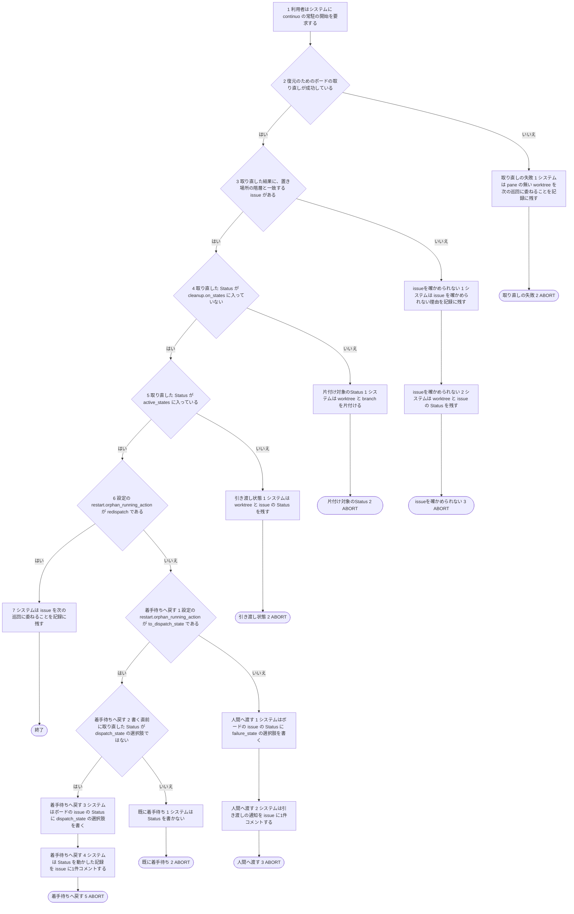
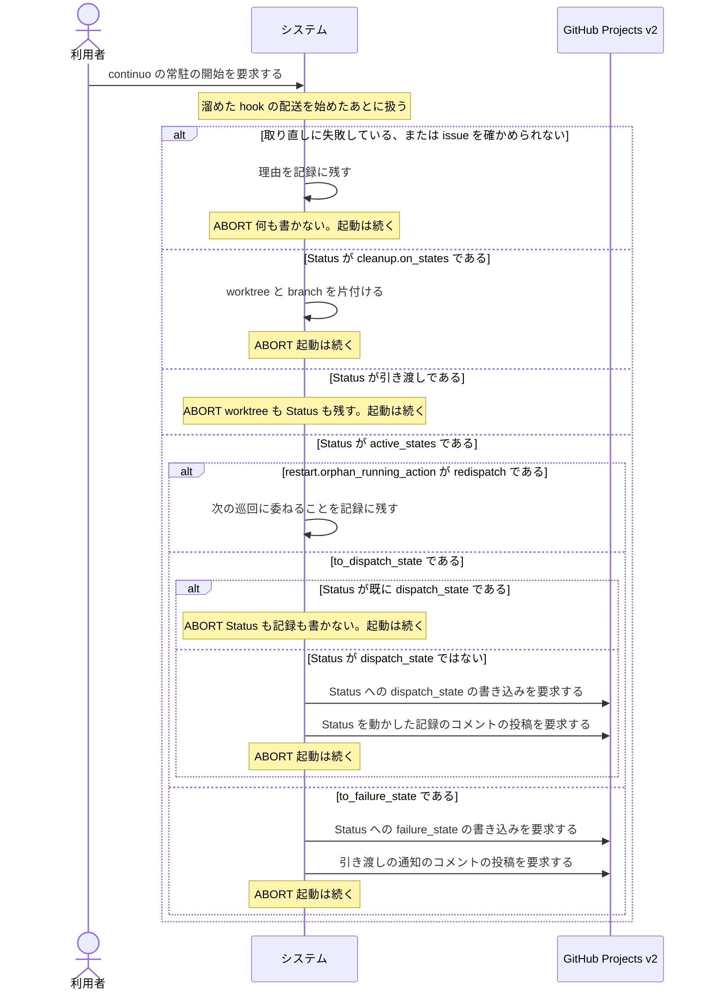

# ユースケース: 再起動で pane が残っていない run を扱う

> **continuo を起動し直したとき、身元ファイルを持つ worktree は在るのに、その worktree を cwd に持つ pane が無い run の扱いを書いた記述である。**
> `再起動して実行中の issue を引き継ぐ` の代替フロー `paneの不在` が `INCLUDE USE CASE` で引く。
> 扱いは取り直しの成否と取り直した Status と `restart.orphan_running_action` の値で分かれ、どれも起動を止めない。
> 呼び出し元の記述に書くと代替フローの入れ子が3段になるので、分けて書く。
>
> **この記述の代替フローが `ABORT` で終わるのは、この run の扱いがそこで終わるという意味である。**
> 起動は止まらない。呼び出し元は、どの終わり方でも次の段（復元を終えたことを記録に残す）へ進む。

## 根拠資料

- `docs/plans/continuo_design.md#3-4`（再起動時の復元手順の段8。pane の無い run は取り直した Status で分岐する。`restart.orphan_running_action` の3値）
- `docs/plans/continuo_design.md#3-29`（Status を動かした記録）
- `internal/orchestrator/restore.go` の `Restore`、`decideAdoptions`、`restoreWithoutPane`、`applyOrphanRunningAction`、`issueAgreesWithPath`、`moveToFailure`、`cleanupInto`
- `internal/orchestrator/comment.go` の `postStatusMove`

## RUCM

```rucm
USE CASE NAME: 再起動で pane が残っていない run を扱う
BRIEF DESCRIPTION: システムは起動し直したときに pane が残っていない run を、取り直した Status と restart.orphan_running_action の値で扱い分ける。システムは既定では何もせずに次の巡回へ委ねる。システムはどの扱いでも run を印の集合に入れない。
PRECONDITION: 利用者は continuo を起動し直している。worktree の置き場所に身元ファイルを持つ worktree がある。herdr に worktree を cwd に持つ pane が無い。システムは溜めた hook の配送を始めている。
PRIMARY ACTOR: 利用者
SECONDARY ACTORS: GitHub Projects v2
DEPENDENCY: なし
GENERALIZATION: なし

BASIC FLOW:
1. 利用者はシステムに continuo の常駐の開始を要求する。
2. システムは VALIDATES THAT 復元のためのボードの取り直しが成功している。
3. システムは VALIDATES THAT 取り直した結果に、置き場所の階層と一致する issue がある。
4. システムは VALIDATES THAT 取り直した Status が cleanup.on_states に入っていない。
5. システムは VALIDATES THAT 取り直した Status が active_states に入っている。
6. システムは VALIDATES THAT 設定の restart.orphan_running_action が redispatch である。
7. システムは issue を次の巡回に委ねることを記録に残す。
POSTCONDITION: issue は印の集合に入っていない。worktree は残っている。issue の Status は変わっていない。システムは issue にコメントを書いていない。次の巡回は issue を着手の候補に出す。

SPECIFIC ALTERNATIVE FLOW 取り直しの失敗:
RFS BASIC FLOW 2
1. システムは pane の無い worktree を次の巡回に委ねることを記録に残す。
2. ABORT
POSTCONDITION: issue は印の集合に入っていない。worktree は残っている。システムはボードへ1バイトも書いていない。

SPECIFIC ALTERNATIVE FLOW issueを確かめられない:
RFS BASIC FLOW 3
1. システムは issue を確かめられない理由を記録に残す。
2. システムは worktree と issue の Status を残す。
3. ABORT
POSTCONDITION: issue は印の集合に入っていない。worktree は残っている。システムはボードへ1バイトも書いていない。

SPECIFIC ALTERNATIVE FLOW 片付け対象のStatus:
RFS BASIC FLOW 4
1. システムは worktree と branch を片付ける。
2. ABORT
POSTCONDITION: issue は印の集合に入っていない。issue の Status は変わっていない。片付けの条件を満たした worktree は消えている。

SPECIFIC ALTERNATIVE FLOW 引き渡し状態:
RFS BASIC FLOW 5
1. システムは worktree と issue の Status を残す。
2. ABORT
POSTCONDITION: issue は印の集合に入っていない。worktree は残っている。issue の Status は変わっていない。システムは issue にコメントを書いていない。

SPECIFIC ALTERNATIVE FLOW 着手待ちへ戻す:
RFS BASIC FLOW 6
1. システムは VALIDATES THAT 設定の restart.orphan_running_action が to_dispatch_state である。
2. システムは VALIDATES THAT 書く直前に取り直した Status が dispatch_state の選択肢ではない。
3. システムはボードの issue の Status に dispatch_state の選択肢を書く。
4. システムは Status を動かした記録を issue に1件コメントする。
5. ABORT
POSTCONDITION: issue の Status は dispatch_state の選択肢である。issue に Status を動かした記録のコメントが1件増えている。issue は印の集合に入っていない。worktree は残っている。

SPECIFIC ALTERNATIVE FLOW 既に着手待ち:
RFS 着手待ちへ戻す 2
1. システムは Status を書かない。
2. ABORT
POSTCONDITION: issue の Status は dispatch_state の選択肢のままである。issue にコメントは増えていない。issue は印の集合に入っていない。worktree は残っている。

SPECIFIC ALTERNATIVE FLOW 人間へ渡す:
RFS 着手待ちへ戻す 1
1. システムはボードの issue の Status に failure_state の選択肢を書く。
2. システムは引き渡しの通知を issue に1件コメントする。
3. ABORT
POSTCONDITION: issue の Status は failure_state の選択肢である。issue に引き渡しの通知のコメントが1件増えている。issue は印の集合に入っていない。worktree は残っている。
```

## 取り直した Status と設定の値で分かれる

**言いたいこと。**pane が無いことを確かめられた run だけが、ここへ来る（設計 3-4 の段8）。
herdr から一覧を取れなかった起動では、この扱いを1件も行わない（呼び出し元の `一覧の取得の失敗`）。

| 取り直した Status | どうするか | 経路 |
| --- | --- | --- |
| 取り直しそのものに失敗した | 何もしない。次の巡回に委ねる | 取り直しの失敗 |
| 取り直しで見つからない、または置き場所と違うリポジトリの issue だった | 何もしない。ログに出す。勝手に消さない | issueを確かめられない |
| cleanup.on_states | worktree と branch を片付ける（`restart.orphan_running_action` は見ない） | 片付け対象のStatus |
| active_states で `redispatch`（既定） | 復元の中では何もしない。印にも入れず、次の巡回に委ねる | 基本フロー |
| active_states で `to_dispatch_state` | Status を dispatch_state へ戻し、Status を動かした記録を1件書く | 着手待ちへ戻す |
| active_states で `to_dispatch_state`、Status が既に dispatch_state | Status を書かない。記録も書かない | 既に着手待ち |
| active_states で `to_failure_state` | Status を failure_state へ落とし、引き渡しの通知を1件書く | 人間へ渡す |
| 上のどれでもない（引き渡し。direct_chat_state もここに入る） | 何もしない。Status を巻き戻さない | 引き渡し状態 |

**`redispatch` で、復元の中から dispatch してはならない。**着手の待ちで最大1時間止まる。
次の巡回は、Status が active_states のままのこの issue を候補に出し、同じ worktree で着手し直す。

**`restart.orphan_running_action` の値は、`to_dispatch_state` と `to_failure_state` のどちらでもなければ `redispatch` として扱う**（`applyOrphanRunningAction` の `switch` の `default`）。

**既定の設定では dispatch_state（着手待ち）も active_states に入っている。**だから pane の無い worktree の Status が既に dispatch_state のことがある。
そのとき `UpdateStatus` は書き込みを省き、`postStatusMove` は記録を書かない（`既に着手待ち`）。

**取り直しの失敗は、呼び出し元の `paneの不在` から来る。**呼び出し元は pane の有無を先に見るので、取り直しに失敗して pane も無い worktree はここへ届く。
worktree を閉じる集合へは入れない。

**経路に出していない失敗。**

| どこで | 何が起きるか |
| --- | --- |
| `着手待ちへ戻す` の Status を書く段 | 書き込みが誤りを返す。WARN を出し、記録のコメントは書かない。書く直前に取り直した Status が terminal_states に入っていれば（渡すのは `TerminalStates` だけ）、Status も記録も書かない |
| `人間へ渡す` の Status を書く段 | 書き込みが誤りを返す。WARN を出し、引き渡しの通知は書かない。書く直前に取り直した Status が terminal_states か direct_chat_state に入っていれば（`protectedStates`）、Status は書かずに引き渡しの通知だけを書く |
| `片付け対象のStatus` | 片付けの条件を満たさない worktree は `cleanupInto` が残す |

## フローチャート



## シーケンス図


