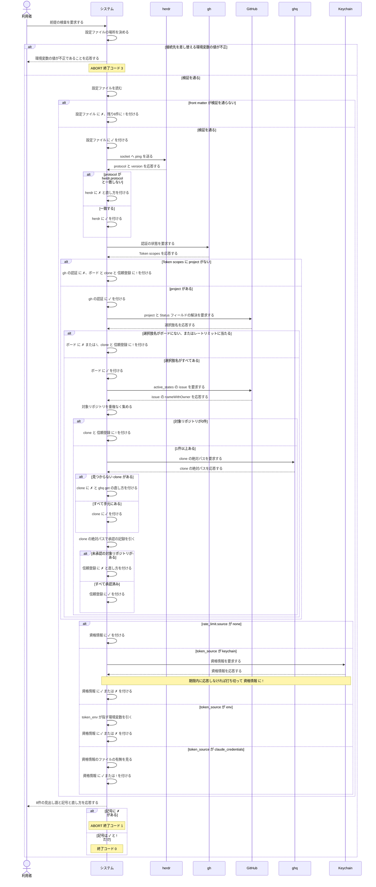

# ユースケース: 前提が揃っているかを検査する

## 根拠資料

- `docs/plans/continuo_design.md` の「3-32. 使い始めるまでの手順」（検査する7項目・記号の3値・依存の図・終了コード）
- `docs/plans/continuo_design.md` の「3-6. 起動時の検査を厚くする」（信頼を引く鍵の作り方・選択肢名の不一致が無言の0件になること）
- `docs/plans/continuo_design.md` の「3-34. ボードは既存のものに合わせる」（`status_field` と選択肢名の照合）
- `docs/plans/continuo_design.md` の「3-15. トークンの計上は transcript から取る」（macOS は Keychain から読むこと・待つ上限の分け方・`continuo allow-keychain-access`）
- `docs/plans/continuo_design.md` の「5-2. front matter（設定）」（`herdr.protocol` / `tracker.active_states` / `rate_limit.source` / `rate_limit.token_source` / `rate_limit.token_env`）
- `docs/trying_it_out.md` の「段6. 前提が揃っているかを検査する」（実際に叩いた出力）
- `internal/doctor/doctor.go` の `Run` / `withCheckTimeout` / `timedOut` / `collectRepos`
- `internal/doctor/checks.go` の `checkConfig` / `checkHerdr` / `checkGHAuth` / `checkBoard` / `boardFailure` / `checkClone` / `checkTrust` / `checkCredentials` / `checkKeychainCredentials`
- `internal/ratelimit/keychain.go` の `ProbeKeychain` / `runSecurity` / `DefaultKeychainTimeout`
- `internal/doctor/report.go` の `Symbol` / `worse` / `Counts` / `ExitCode` / `Write`
- `cmd/continuo/main.go` の `runDoctor` / `doctorInternalErrorExitCode`

## RUCM

```rucm
USE CASE NAME: 前提が揃っているかを検査する
BRIEF DESCRIPTION: 利用者は continuo doctor を実行する。システムは continuo が動くための前提を7項目にわたって検査する。システムは見出し語ごとに ✓ と ✗ と ! のいずれかの記号を付ける。システムは1件が失敗しても残りの検査を続ける。システムは記号に ✗ が1件でもあれば終了コード 1 を返す。
PRECONDITION: 利用者は continuo の実行ファイルを実行できる。実行するマシンの OS は macOS または Linux である。
PRIMARY ACTOR: 利用者
SECONDARY ACTORS: herdr、gh、ghq、GitHub、Keychain
DEPENDENCY: なし
GENERALIZATION: なし

BASIC FLOW:
1. 利用者はシステムに前提の検査を要求する。
2. システムは設定ファイルの場所を決める。
3. システムは VALIDATES THAT 接続先を差し替える環境変数の値が検証を通る。
4. システムは設定ファイルを読む。
5. システムは VALIDATES THAT 設定ファイルの front matter が検証を通る。
6. システムは見出し語「設定ファイル」に ✓ を付ける。
7. システムは設定の claude.kind の実行ファイルを PATH から探す。
8. システムは VALIDATES THAT claude.kind の実行ファイルが PATH にある。
9. システムは見出し語「claude」に ✓ を付ける。
10. システムは hook を受ける socket の置き場所を決める。
11. システムは VALIDATES THAT hook を受ける socket の置き場所を用意できる。
12. システムは見出し語「hook の置き場所」に ✓ を付ける。
13. システムは herdr の socket へ ping を送る。
14. システムは VALIDATES THAT ping の応答の protocol が設定の herdr.protocol と一致する。
15. システムは見出し語「herdr」に ✓ を付ける。
16. システムは gh に認証の状態を要求する。
17. システムは VALIDATES THAT github.com の有効なアカウントの Token scopes に project が単独の要素として並んでいる。
18. システムは見出し語「gh の認証」に ✓ を付ける。
19. システムは GitHub にボードの project と Status フィールドの解決を要求する。
20. システムは VALIDATES THAT 設定の active_states の選択肢名がボードにすべてある。
21. システムは見出し語「ボード」に ✓ を付ける。
22. システムは GitHub に active_states の issue を要求する。
23. システムは issue の nameWithOwner から対象リポジトリを重複なく集める。
24. システムは VALIDATES THAT 対象リポジトリが1件以上ある。
25. システムは ghq に対象リポジトリごとの clone の絶対パスを要求する。
26. システムは VALIDATES THAT 対象リポジトリのすべての clone が手元にある。
27. システムは見出し語「clone」に ✓ を付ける。
28. システムは clone の絶対パスで承認の記録を引く。
29. システムは VALIDATES THAT clone を引けた対象リポジトリのすべての絶対パスが承認済みである。
30. システムは見出し語「信頼登録」に ✓ を付ける。
31. IF 設定の rate_limit.source が none である THEN
32.   システムは見出し語「資格情報」に ✓ を付ける。
33. ELSEIF 設定の rate_limit.token_source が keychain である THEN
34.   システムは Keychain に資格情報を要求する。
35.   システムは VALIDATES THAT Keychain が期限内に応答する。
36.   システムは VALIDATES THAT Keychain の資格情報から空でない accessToken を取り出せる。
37.   システムは見出し語「資格情報」に ✓ を付ける。
38. ELSEIF 設定の rate_limit.token_source が env である THEN
39.   システムは VALIDATES THAT rate_limit.token_env が指す環境変数に空でない値が入っている。
40.   システムは見出し語「資格情報」に ✓ を付ける。
41. ELSE
42.   システムは VALIDATES THAT 資格情報のファイルが手元にある。
43.   システムは見出し語「資格情報」に ✓ を付ける。
44. ENDIF
45. システムは利用者に8件の見出し語と記号と直し方を応答する。
46. システムは VALIDATES THAT 8件の記号のすべてが ✓ または ! である。
47. システムは終了コード 0 を返す。
POSTCONDITION: 8件の見出し語のすべてに ✓ が付いている。検査結果が出力されている。終了コード 0 が返っている。

SPECIFIC ALTERNATIVE FLOW claudeの不在:
RFS BASIC FLOW 8
1. システムは見出し語「claude」に ✗ を付ける。
2. システムは利用者に Claude Code の入れ方を応答する。
3. システムは利用者に PATH の通った場所へ置くよう応答する。
4. RESUME STEP 10
POSTCONDITION: 見出し語「claude」に ✗ が付いている。残りの検査は続いている。利用者は Claude Code の入れ方を読める。

SPECIFIC ALTERNATIVE FLOW hookの置き場所を用意できない:
RFS BASIC FLOW 11
1. システムは見出し語「hook の置き場所」に ✗ を付ける。
2. システムは利用者に用意できなかった場所と理由を応答する。
3. システムは利用者に置き場所を変える環境変数を応答する。
4. RESUME STEP 13
POSTCONDITION: 見出し語「hook の置き場所」に ✗ が付いている。残りの検査は続いている。利用者は置き場所を変える方法を読める。

SPECIFIC ALTERNATIVE FLOW 接続先の指定が不正:
RFS BASIC FLOW 3
1. システムは利用者に接続先を差し替える環境変数の値が不正であることを応答する。
2. ABORT
POSTCONDITION: 検査結果は出力されていない。終了コード 3 が返っている。

SPECIFIC ALTERNATIVE FLOW 設定ファイルの不備:
RFS BASIC FLOW 5
1. システムは見出し語「設定ファイル」に ✗ を付ける。
2. システムは見出し語「設定ファイル」に continuo init での雛形の作成を直し方として添える。
3. システムは見出し語「herdr」に ! を付ける。
4. システムは見出し語「herdr」に照合する herdr.protocol が決まらないことを理由として添える。
5. システムは見出し語「gh の認証」に ! を付ける。
6. システムは見出し語「ボード」に ! を付ける。
7. システムは見出し語「clone」に ! を付ける。
8. システムは見出し語「信頼登録」に ! を付ける。
9. システムは見出し語「資格情報」に ! を付ける。
10. RESUME STEP 39
POSTCONDITION: 見出し語「設定ファイル」に ✗ が付いている。残りの6件の見出し語に ! が付いている。

SPECIFIC ALTERNATIVE FLOW herdrの不通:
RFS BASIC FLOW 14
1. IF herdr が protocol を応答している THEN
2.   システムは見出し語「herdr」に設定の herdr.protocol の修正を直し方として添える。
3. ELSE
4.   システムは見出し語「herdr」に herdr の待ち受けの確認を直し方として添える。
5. ENDIF
6. システムは見出し語「herdr」に ✗ を付ける。
7. RESUME STEP 10
POSTCONDITION: 見出し語「herdr」に ✗ が付いている。直し方が検査結果に載っている。

SPECIFIC ALTERNATIVE FLOW ghの認証の不足:
RFS BASIC FLOW 17
1. システムは見出し語「gh の認証」に ✗ を付ける。
2. システムは見出し語「gh の認証」に gh auth login のオプション project 付きでの実行を直し方として添える。
3. システムは見出し語「ボード」に ! を付ける。
4. システムは見出し語「clone」に ! を付ける。
5. システムは見出し語「信頼登録」に ! を付ける。
6. RESUME STEP 25
POSTCONDITION: 見出し語「gh の認証」に ✗ が付いている。見出し語「ボード」と見出し語「clone」と見出し語「信頼登録」に ! が付いている。

SPECIFIC ALTERNATIVE FLOW ボードの読み取り失敗:
RFS BASIC FLOW 20
1. IF 落ち方がレートリミットである THEN
2.   システムは見出し語「ボード」に ! を付ける。
3. ELSE
4.   システムは見出し語「ボード」に ✗ を付ける。
5. ENDIF
6. システムは見出し語「ボード」に落ち方に応じた直し方を添える。
7. システムは見出し語「clone」に ! を付ける。
8. システムは見出し語「信頼登録」に ! を付ける。
9. RESUME STEP 25
POSTCONDITION: 見出し語「ボード」に ✗ または ! が付いている。見出し語「clone」と見出し語「信頼登録」に ! が付いている。

SPECIFIC ALTERNATIVE FLOW 対象リポジトリが0件:
RFS BASIC FLOW 24
1. システムは見出し語「clone」に ! を付ける。
2. システムは見出し語「clone」に検査する対象がないことを理由として添える。
3. システムは見出し語「信頼登録」に ! を付ける。
4. システムは見出し語「信頼登録」に検査する対象がないことを理由として添える。
5. RESUME STEP 25
POSTCONDITION: 見出し語「clone」と見出し語「信頼登録」に ! が付いている。両方の見出し語に検査する対象がないことが理由として載っている。

SPECIFIC ALTERNATIVE FLOW cloneの不在:
RFS BASIC FLOW 26
1. システムは見出し語「clone」に ✗ を付ける。
2. システムは clone が見つからない対象リポジトリごとに ghq get の実行を直し方として添える。
3. システムは clone が見つからない対象リポジトリの信頼登録を確かめられないものとして数える。
4. RESUME STEP 22
POSTCONDITION: 見出し語「clone」に ✗ が付いている。clone が見つからない対象リポジトリの一覧が検査結果に載っている。

SPECIFIC ALTERNATIVE FLOW 信頼登録の不足:
RFS BASIC FLOW 29
1. システムは見出し語「信頼登録」に ✗ を付ける。
2. システムは未承認の対象リポジトリごとに Claude Code での信頼のダイアログの承認を直し方として添える。
3. RESUME STEP 25
POSTCONDITION: 見出し語「信頼登録」に ✗ が付いている。未承認の対象リポジトリの一覧が検査結果に載っている。

SPECIFIC ALTERNATIVE FLOW Keychainの応答の期限切れ:
RFS BASIC FLOW 35
1. システムは Keychain への問い合わせを打ち切る。
2. システムは見出し語「資格情報」に ! を付ける。
3. システムは見出し語「資格情報」に確認のダイアログが出たままである可能性を理由として添える。
4. システムは見出し語「資格情報」に continuo allow-keychain-access の実行と確認のダイアログでの常に許可の選択を直し方として添える。
5. RESUME STEP 39
POSTCONDITION: 見出し語「資格情報」に ! が付いている。Keychain への問い合わせは打ち切られている。直し方が検査結果に載っている。

SPECIFIC ALTERNATIVE FLOW Keychainの資格情報の不在:
RFS BASIC FLOW 36
1. システムは見出し語「資格情報」に ✗ を付ける。
2. システムは見出し語「資格情報」に Keychain の項目の名前を理由として添える。
3. システムは見出し語「資格情報」に continuo allow-keychain-access の実行と確認のダイアログでの常に許可の選択を直し方として添える。
4. RESUME STEP 39
POSTCONDITION: 見出し語「資格情報」に ✗ が付いている。Keychain の項目の名前が検査結果に載っている。読み取った値そのものは検査結果に載っていない。

SPECIFIC ALTERNATIVE FLOW 資格情報の環境変数の不在:
RFS BASIC FLOW 39
1. システムは見出し語「資格情報」に ✗ を付ける。
2. システムは見出し語「資格情報」に rate_limit.token_env が指す環境変数の設定を直し方として添える。
3. RESUME STEP 39
POSTCONDITION: 見出し語「資格情報」に ✗ が付いている。環境変数の名前が検査結果に載っている。

SPECIFIC ALTERNATIVE FLOW 資格情報のファイルの不在:
RFS BASIC FLOW 42
1. システムは見出し語「資格情報」に ! を付ける。
2. システムは見出し語「資格情報」に macOS では Keychain に資格情報が入っていることを理由として添える。
3. IF 実行するマシンの OS が macOS である THEN
4.   システムは見出し語「資格情報」に rate_limit.token_source を keychain にすることを直し方として添える。
5. ENDIF
6. RESUME STEP 39
POSTCONDITION: 見出し語「資格情報」に ! が付いている。資格情報のファイルの場所が検査結果に載っている。

SPECIFIC ALTERNATIVE FLOW 足りない前提がある:
RFS BASIC FLOW 46
1. システムは終了コード 1 を返す。
2. ABORT
POSTCONDITION: 検査結果が出力されている。1件以上の見出し語に ✗ が付いている。終了コード 1 が返っている。

GLOBAL ALTERNATIVE FLOW 検査の期限切れ:
BRANCH FROM BASIC FLOW 16
WHEN 検査の期限が切れた場合
1. システムは期限が切れた検査の見出し語に ! を付ける。
2. システムは期限が切れた検査の見出し語に時間内の応答がないことを理由として添える。
3. システムは残りの検査の見出し語に ! を付ける。
4. RESUME STEP 39
POSTCONDITION: 期限が切れた検査の見出し語に ! が付いている。残りの検査の見出し語に ! が付いている。
```

## フローチャート

```mermaid
flowchart TD
    S1["1. 利用者が前提の検査を要求する"]
    S2["2. 設定ファイルの場所を決める"]
    S3{"3. 接続先の環境変数の値は検証を通るか"}
    S4["4. 設定ファイルを読む"]
    S5{"5. front matter は検証を通るか"}
    S6["6. 見出し語 設定ファイル に ✓"]
    S7["7. claude.kind の実行ファイルを PATH から探す"]
    S8{"8. claude.kind の実行ファイルは PATH にあるか"}
    S9["9. 見出し語 claude に ✓"]
    CL1["claudeの不在 1. 見出し語 claude に ✗"]
    CL2["claudeの不在 2. Claude Code の入れ方を応答する"]
    CL3["claudeの不在 3. PATH の通った場所へ置くよう応答する"]
    S7["7. herdr の socket へ ping を送る"]
    S11{"11. protocol は herdr.protocol と一致するか"}
    S12["12. 見出し語 herdr に ✓"]
    S13["13. gh に認証の状態を要求する"]
    S14{"14. Token scopes に project が単独で並んでいるか"}
    S15["15. 見出し語 gh の認証 に ✓"]
    S16["16. GitHub に project と Status フィールドの解決を要求する"]
    S17{"17. active_states の選択肢名がボードにすべてあるか"}
    S18["18. 見出し語 ボード に ✓"]
    S19["19. GitHub に active_states の issue を要求する"]
    S20["20. nameWithOwner から対象リポジトリを重複なく集める"]
    S21{"21. 対象リポジトリが1件以上あるか"}
    S22["22. ghq に clone の絶対パスを要求する"]
    S23{"23. すべての clone が手元にあるか"}
    S24["24. 見出し語 clone に ✓"]
    S25["25. clone の絶対パスで承認の記録を引く"]
    S26{"26. すべての絶対パスが承認済みか"}
    S27["27. 見出し語 信頼登録 に ✓"]
    S28{"28. rate_limit.source は none か"}
    S29["29. 見出し語 資格情報 に ✓"]
    S30{"30. rate_limit.token_source は keychain か"}
    S31["31. Keychain に資格情報を要求する"]
    S32{"32. Keychain は期限内に応答するか"}
    S33{"33. 空でない accessToken を取り出せるか"}
    S34["34. 見出し語 資格情報 に ✓"]
    S35{"35. rate_limit.token_source は env か"}
    S36{"36. token_env が指す環境変数に値が入っているか"}
    S37["37. 見出し語 資格情報 に ✓"]
    S39{"39. 資格情報のファイルが手元にあるか"}
    S40["40. 見出し語 資格情報 に ✓"]
    S42["42. 8件の見出し語と記号と直し方を応答する"]
    S43{"43. 8件の記号のすべてが ✓ または ! か"}
    S44["44. 終了コード 0 を返す"]
    ENDOK(["終了コード 0"])

    EP1["接続先の指定が不正: 不正である旨を応答する"]
    EPEND(["ABORT 終了コード 3"])
    CF1["設定ファイルの不備: 設定ファイル に ✗、残り6件に !"]
    HD1{"herdrの不通: herdr が protocol を応答しているか"}
    HD2["herdr.protocol の修正を直し方に添える"]
    HD3["herdr の待ち受けの確認を直し方に添える"]
    HD4["見出し語 herdr に ✗"]
    GH1["ghの認証の不足: gh の認証 に ✗、ボード と clone と 信頼登録 に !"]
    BD1{"ボードの読み取り失敗: 落ち方はレートリミットか"}
    BD2["見出し語 ボード に !"]
    BD3["見出し語 ボード に ✗"]
    BD4["直し方を添え、clone と 信頼登録 に !"]
    RP1["対象リポジトリが0件: clone と 信頼登録 に !"]
    CL1["cloneの不在: clone に ✗、ghq get を直し方に添える"]
    TR1["信頼登録の不足: 信頼登録 に ✗、信頼のダイアログの承認を直し方に添える"]
    CR1["資格情報の環境変数の不在: 資格情報 に ✗"]
    CR2["資格情報のファイルの不在: 資格情報 に !、macOS なら keychain への切り替えを直し方に添える"]
    KC1["Keychainの応答の期限切れ: 問い合わせを打ち切り、資格情報 に !"]
    KC2["Keychainの資格情報の不在: 資格情報 に ✗、allow-keychain-access を直し方に添える"]
    MS1["足りない前提がある"]
    MSEND(["ABORT 終了コード 1"])
    TO1["検査の期限切れ: 期限が切れた検査と残りの検査に !"]

    S1 --> S2 --> S3
    S3 -->|"いいえ"| EP1 --> EPEND
    S3 -->|"はい"| S4 --> S5
    S5 -->|"いいえ"| CF1 --> S42
    S5 -->|"はい"| S6 --> S7 --> S11
    S11 -->|"いいえ"| HD1
    HD1 -->|"はい"| HD2 --> HD4
    HD1 -->|"いいえ"| HD3 --> HD4
    HD4 --> S13
    S11 -->|"はい"| S12 --> S13 --> S14
    S14 -->|"いいえ"| GH1 --> S28
    S14 -->|"はい"| S15 --> S16 --> S17
    S17 -->|"いいえ"| BD1
    BD1 -->|"はい"| BD2 --> BD4
    BD1 -->|"いいえ"| BD3 --> BD4
    BD4 --> S28
    S17 -->|"はい"| S18 --> S19 --> S20 --> S21
    S21 -->|"いいえ"| RP1 --> S28
    S21 -->|"はい"| S22 --> S23
    S23 -->|"いいえ"| CL1 --> S25
    S23 -->|"はい"| S24 --> S25 --> S26
    S26 -->|"いいえ"| TR1 --> S28
    S26 -->|"はい"| S27 --> S28
    S28 -->|"はい"| S29 --> S42
    S28 -->|"いいえ"| S30
    S30 -->|"はい"| S31 --> S32
    S32 -->|"いいえ"| KC1 --> S42
    S32 -->|"はい"| S33
    S33 -->|"いいえ"| KC2 --> S42
    S33 -->|"はい"| S34 --> S42
    S30 -->|"いいえ"| S35
    S35 -->|"はい"| S36
    S36 -->|"いいえ"| CR1 --> S42
    S36 -->|"はい"| S37 --> S42
    S35 -->|"いいえ"| S39
    S39 -->|"いいえ"| CR2 --> S42
    S39 -->|"はい"| S40 --> S42 --> S43
    S43 -->|"いいえ"| MS1 --> MSEND
    S43 -->|"はい"| S44 --> ENDOK
    S16 -.->|"WHEN 検査の期限が切れた場合"| TO1
    TO1 --> S42
```



## シーケンス図


