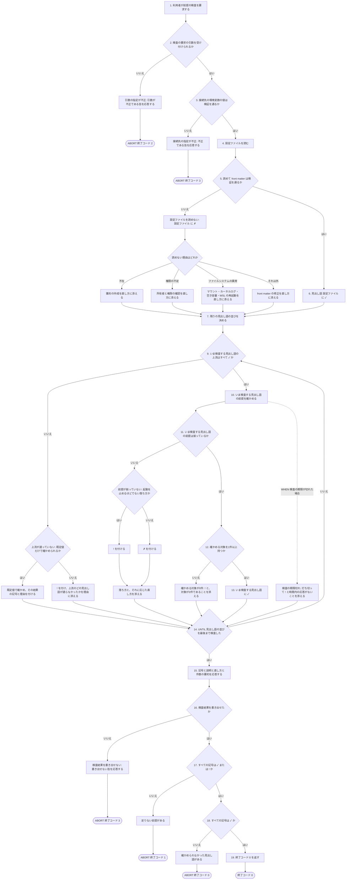
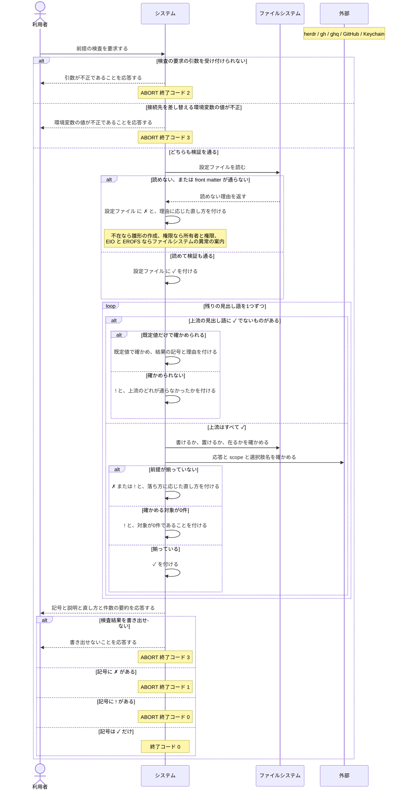

# ユースケース: 前提が揃っているかを検査する

## 根拠資料

- `docs/plans/continuo_design.md` の「3-32. 使い始めるまでの手順」（検査する見出し語・記号の3値・依存の図・終了コード）
- `docs/plans/continuo_design.md` の「3-6. 起動時の検査を厚くする」（信頼を引く鍵の作り方・選択肢名の不一致が無言の0件になること）
- `docs/plans/continuo_design.md` の「3-34. ボードは既存のものに合わせる」（`status_field` と選択肢名の照合）
- `docs/plans/continuo_design.md` の「3-9e. 片付ける Status は、終わったとみなす Status の中から選ぶ」（`cleanup.on_states` と `tracker.terminal_states` の関係・`!` にする理由）
- `docs/plans/continuo_design.md` の「3-15. トークンの計上は transcript から取る」（macOS は Keychain から読むこと・待つ上限の分け方・`continuo allow-keychain-access`）
- `docs/plans/continuo_design.md` の「6-3. RUCM に無いものはテストにもならない」（見出し語の並びを1周として書く理由）
- `docs/plans/continuo_design.md` の「6-11. 書けない場所を、起動する前に捕まえる」（実際に作って消す検査・既定値で走らせる検査）
- `docs/plans/continuo_design.md` の「6-12. 読めない理由で、案内を変える」（`EIO` と `EROFS` の読み分け）
- `docs/plans/continuo_design.md` の「6-14. 紛らわしい Status の組を、doctor が注意する」（紛らわしいの定義・`!` にする理由・副作用）
- `docs/plans/continuo_design.md` の「3-57. 対応表のキーはボードに実在しなくてよい」（`対応表のキー` を置く理由・`!` にする理由）
- `docs/plans/continuo_design.md` の「3-54. ボードの自動化が動かした Status では worker を止めず、本来の Status へ戻す」（`自動化` を置く理由・対応表が空だと走行中の run が止まること）
- `docs/plans/continuo_design.md` の「3-70. agent teams には対応しない」（`agent teams` を置く理由・読める出どころが2つだけであること・`!` にする理由）
- `docs/plans/continuo_design.md` の「5-2. front matter（設定）」（`herdr.protocol` / `tracker.active_states` / `workspace.root` / `rate_limit.source` / `rate_limit.token_source` / `rate_limit.token_env`）
- `docs/trying_it_out.md` の「段6. 前提が揃っているかを検査する」（実際に叩いた出力）
- `internal/doctor/doctor.go` の `Run` / `withCheckTimeout` / `timedOut` / `collectRepos`
- `internal/doctor/status_names.go` の `checkStatusNames` / `configuredStates` / `findConfusingPairs` / `confusionBetween`
- `internal/doctor/rewrite_keys.go` の `checkRewriteKeys`
- `internal/doctor/automations.go` の `checkAutomations` / `enabledWorkflowNames` / `workflowNotes`
- `internal/doctor/agentteams.go` の `checkAgentTeams` / `agentTeamsProblem` / `EnvAgentTeams`
- `internal/tracker/adapter.go` の `ProjectWorkflows`（カンバンの自動化。起動時の検査の応答から取る）
- `internal/config/states.go` の `RewriteKeysOutsideBoard`（対応表のキーとボードの選択肢の突き合わせ）
- `internal/doctor/checks.go` の `checkConfig` / `configRemedies` / `filesystemRemedies` / `writeRemedies` / `checkCleanupStates` / `checkClaude` / `checkRuntimeDir` / `checkClaudeHome` / `checkWorkspaceRoot` / `checkHerdr` / `checkGHAuth` / `checkBoard` / `boardFailure` / `checkClone` / `checkTrust` / `countDetail` / `checkCredentials` / `checkKeychainCredentials`
- `internal/config/states.go` の `CleanupStatesOutsideTerminal`（片付ける Status と終わったとみなす Status の突き合わせ）
- `internal/fsprobe/fsprobe.go` の `Classify` / `ProbeWritable` / `ProbeClaudeSessionEnv` / `CheckWritablePlaces`
- `internal/ratelimit/keychain.go` の `ProbeKeychain` / `runSecurity` / `DefaultKeychainTimeout`
- `internal/doctor/report.go` の `Symbol` / `worse` / `Counts` / `ExitCode` / `Write`
- `internal/cli/cli.go` の `runDoctor` / `parseErrorExitCode` / `doctorInternalErrorExitCode`

## 見出し語ごとに何を確かめるか

**基本フローは見出し語を1つずつ回す1周として書いてある。**何を確かめるかは見出し語ごとに違うので、
そこはこの表が正である。**上流**は「そこが `✓` でなければ確かめられないもの」、
**既定値**は「設定ファイルが読めなくても既定値だけで確かめられるか」である。

| 見出し語 | 何を確かめるか | 上流 |
| --- | --- | --- |
| 設定ファイル | WORKFLOW.md を読めて front matter が検証を通るか | なし |
| 片付けの状態 | `cleanup.on_states` の値が `tracker.terminal_states` に全部あるか（記号は `!` だけ） | 設定ファイル |
| claude | `claude.kind`（既定は `claude`）の実行ファイルが PATH にあるか | 既定値で確かめる |
| agent teams | `claude.env` と doctor を叩いたシェルの `CLAUDE_CODE_EXPERIMENTAL_AGENT_TEAMS` を見る（記号は `!` だけ） | 設定ファイル |
| hook の置き場所 | 決めた場所にディレクトリを作り、unix socket を listen できるか | 既定値で確かめる |
| Claude の設定 | `~/.claude/session-env` に使い捨てのディレクトリを作って消せるか | 設定を読まない |
| worktree の場所 | `workspace.root` に使い捨てのディレクトリを作って消せるか | 設定ファイル |
| herdr | ping の応答の protocol が `herdr.protocol` と一致するか | 設定ファイル |
| gh の認証 | Token scopes に `project` が単独の要素として並んでいるか | 設定ファイル |
| ボード | Bootstrap が通り、`active_states` の選択肢名がボードにすべてあるか | 設定ファイル・gh の認証 |
| Status の名前 | 設定に書いた Status と紛らわしい選択肢がボードに無いか（記号は `!` だけ） | ボード |
| 対応表のキー | `tracker.automated_state_rewrite` のキーがボードの Status の選択肢にあるか（記号は `!` だけ） | ボード |
| 自動化 | ボードの自動化が1つでも有効なのに `tracker.automated_state_rewrite` が空でないか（記号は `!` だけ） | ボード |
| clone | 対象リポジトリの clone が `ghq list -p -e` で見つかるか | ボード |
| 信頼登録 | clone の絶対パスが `~/.claude.json` で承認済みか | ボード |
| 資格情報 | `rate_limit` の設定に応じて、環境変数・ファイル・Keychain のいずれかから取れるか | 設定ファイル（記号を分けるだけで飛ばさない） |

**「Claude の設定」だけは設定ファイルの記号を見ない。**Claude Code は SessionStart hook を
走らせる前に `~/.claude/session-env/<session_id>/` を作り、continuo はその hook を必ず張る。
**ここが書けないと issue は1件も始まらない**ので、設定が読めていようがいまいが必ず確かめる。

**「片付けの状態」は外へ1バイトも問い合わせない。**設定の2つのキーを突き合わせるだけである。
**記号は `!` までで、`✗` にしない。**噛み合っていなくても continuo は起動して走る
（起こるのは「終わっていないと判定した直後に worktree を片付ける」ことである）。
**`cleanup.enabled` が偽なら前提が揃っているものとして扱う。**片付けそのものが走らないので、
噛み合っていなくても何も起きない。**大文字小文字と前後の空白だけの違いは同じ値とみなす。**

## 設定ファイルを読めないときの直し方の分け方

**読めない理由で直し方を変える。**理由を問わず雛形の作成を勧めると、
**ファイルシステムが壊れている利用者を「設定を作り直す」方向へ誘導することになる。**
その案内に従うと `continuo init` は「既にあります」で止まり、`--force` を足すと本物の設定を雛形で潰す。

| 読めない理由 | 直し方 |
| --- | --- |
| 設定ファイルが無い（ENOENT） | `continuo init` で雛形を置く |
| 権限が足りない（EACCES） | 所有者と権限を確かめる |
| ファイルシステムの異常（EIO / EROFS） | マウントの状態・カーネルログ・Windows 側の空き容量・`wsl --shutdown` のあとの再起動 |
| それ以外 | ファイルは読めているので front matter を直す |

## 確かめる対象が0件のとき

**ボードに issue が1件も無いのは、設定の誤りではない**（設計 3-32）。だから `✗` にしない。

`clone` と `信頼登録` の2つだけは、確かめる対象がボードの issue から決まる
（`internal/doctor/doctor.go` の `collectRepos` が `nameWithOwner` を重複なく集める）。
**ボードが空だと確かめるものが1件も無い**ので、この2つには `!` を付けて、終了コードに影響させない
（`internal/doctor/checks.go` の `checkClone` / `checkTrust`）。

**「0件だから通った」と書かない。**`✓` にすると、ボードを間違えて空のまま回している利用者に
「対象リポジトリは全部 clone 済みです」と伝えることになる。

## 終了コードの分け方

**「前提が足りない」と「doctor そのものが動けなかった」を、スクリプトから区別できるようにする。**
そのために4つに割ってある（`internal/cli/cli.go` の `runDoctor` / `doctorInternalErrorExitCode`）。

| 終了コード | どんなときに返るか | 検査結果 |
| --- | --- | --- |
| 0 | 記号が `✓` だけ、または `✓` と `!` だけ | 出ている |
| 1 | 記号に `✗` が1件以上ある | 出ている |
| 2 | 引数の指定が誤っている | 出ていない |
| 3 | 接続先の環境変数が不正、または検査結果を書き出せない | 出ていない |

**要約の1行は、記号の内訳で3通りに分かれる**（`internal/doctor/report.go` の `Write`）。
`✓` だけなら「前提はすべて揃っています」、`!` があるだけなら「足りないものはありません」、
`✗` があれば「N件に問題があります」である。**`!` だけのときを「問題があります」と書かない。**
対象が0件のボードもここへ来るので、設定の誤りでないものを誤りとして見せてしまう。

## RUCM

```rucm
USE CASE NAME: 前提が揃っているかを検査する
BRIEF DESCRIPTION: 利用者は continuo doctor を実行する。システムは continuo が動くための前提を見出し語ごとに1つずつ検査する。システムは見出し語ごとに ✓ と ✗ と ! のいずれかの記号を付ける。システムは1件が失敗しても残りの検査を続ける。システムは記号に ✗ が1件でもあれば終了コード 1 を返す。
PRECONDITION: 利用者は continuo の実行ファイルを実行できる。実行するマシンの OS は macOS または Linux である。
PRIMARY ACTOR: 利用者
SECONDARY ACTORS: ファイルシステム、herdr、gh、ghq、GitHub、Keychain
DEPENDENCY: なし
GENERALIZATION: なし

BASIC FLOW:
1. 利用者はシステムに前提の検査を要求する。
2. システムは VALIDATES THAT 検査の要求の引数を受け付けられる。
3. システムは VALIDATES THAT 接続先を差し替える環境変数の値が検証を通る。
4. システムは設定ファイルを読む。
5. システムは VALIDATES THAT 設定ファイルを読めて front matter が検証を通る。
6. システムは見出し語「設定ファイル」に ✓ を付ける。
7. システムは残りの見出し語の並びを決める。
8. DO
9.   システムは VALIDATES THAT いま検査する見出し語の上流の見出し語がすべて ✓ である。
10.   システムはいま検査する見出し語の前提を確かめる。
11.   システムは VALIDATES THAT いま検査する見出し語の前提が揃っている。
12.   システムは VALIDATES THAT いま検査する見出し語は確かめる対象を1件以上持つ。
13.   システムはいま検査する見出し語に ✓ を付ける。
14. UNTIL 見出し語の並びを最後まで検査した
15. システムは利用者に見出し語ごとの記号と説明と直し方と記号ごとの件数の要約を応答する。
16. システムは VALIDATES THAT 検査結果を書き出せた。
17. システムは VALIDATES THAT すべての見出し語の記号が ✓ または ! である。
18. システムは VALIDATES THAT すべての見出し語の記号が ✓ である。
19. システムは終了コード 0 を返す。
POSTCONDITION: すべての見出し語に ✓ が付いている。検査結果が出力されている。要約は前提がすべて揃っていることを伝えている。終了コード 0 が返っている。

SPECIFIC ALTERNATIVE FLOW 引数の指定が不正:
RFS BASIC FLOW 2
1. システムは利用者に検査の要求の引数が不正であることを応答する。
2. ABORT
POSTCONDITION: 検査結果は出力されていない。引数が不正であることが出力されている。終了コード 2 が返っている。

SPECIFIC ALTERNATIVE FLOW 接続先の指定が不正:
RFS BASIC FLOW 3
1. システムは利用者に接続先を差し替える環境変数の値が不正であることを応答する。
2. ABORT
POSTCONDITION: 検査結果は出力されていない。終了コード 3 が返っている。

SPECIFIC ALTERNATIVE FLOW 設定ファイルを読めない:
RFS BASIC FLOW 5
1. システムは見出し語「設定ファイル」に ✗ を付ける。
2. IF 読めない理由が設定ファイルの不在である THEN
3.   システムは見出し語「設定ファイル」に雛形の作成を直し方として添える。
4. ELSEIF 読めない理由が権限の不足である THEN
5.   システムは見出し語「設定ファイル」に所有者と権限の確認を直し方として添える。
6. ELSEIF 読めない理由がファイルシステムの異常である THEN
7.   システムは見出し語「設定ファイル」にファイルシステムの異常であることを理由として添える。
8.   システムは見出し語「設定ファイル」にマウントの状態とカーネルログの確認を直し方として添える。
9.   システムは見出し語「設定ファイル」に Windows 側の空き容量の確認を直し方として添える。
10.   システムは見出し語「設定ファイル」に WSL の停止と再起動を直し方として添える。
11. ELSE
12.   システムは見出し語「設定ファイル」に front matter の修正を直し方として添える。
13. ENDIF
14. RESUME STEP 7
POSTCONDITION: 見出し語「設定ファイル」に ✗ が付いている。直し方は読めない理由に応じたものだけが載っている。雛形の作成は設定ファイルが不在のときだけ載っている。残りの検査は続いている。

SPECIFIC ALTERNATIVE FLOW 上流が通っていない:
RFS BASIC FLOW 9
1. IF いま検査する見出し語を既定値だけで確かめられる THEN
2.   システムはいま検査する見出し語の前提を既定値で確かめる。
3.   システムはいま検査する見出し語に確かめた結果の記号を付ける。
4.   システムはいま検査する見出し語に既定値で確かめたことを理由として添える。
5. ELSE
6.   システムはいま検査する見出し語に ! を付ける。
7.   システムはいま検査する見出し語に上流のどの見出し語が通らなかったかを理由として添える。
8. ENDIF
9. RESUME STEP 14
POSTCONDITION: 既定値だけで確かめられる見出し語には ✓ または ✗ が付いている。それ以外の見出し語には ! が付いている。残りの検査は続いている。

SPECIFIC ALTERNATIVE FLOW 前提が揃っていない:
RFS BASIC FLOW 11
1. IF 落ち方が起動を止めるほどのものでない THEN
2.   システムはいま検査する見出し語に ! を付ける。
3. ELSE
4.   システムはいま検査する見出し語に ✗ を付ける。
5. ENDIF
6. システムはいま検査する見出し語に落ち方を理由として添える。
7. システムはいま検査する見出し語に落ち方に応じた直し方を添える。
8. RESUME STEP 14
POSTCONDITION: いま検査した見出し語に ✗ または ! が付いている。落ち方に応じた直し方が検査結果に載っている。残りの検査は続いている。

SPECIFIC ALTERNATIVE FLOW 確かめる対象が0件:
RFS BASIC FLOW 12
1. システムはいま検査する見出し語に ! を付ける。
2. システムはいま検査する見出し語に確かめる対象が0件であることを理由として添える。
3. RESUME STEP 14
POSTCONDITION: 確かめる対象が0件の見出し語に ! が付いている。対象が0件であることは終了コードに影響していない。残りの検査は続いている。

SPECIFIC ALTERNATIVE FLOW 検査結果を書き出せない:
RFS BASIC FLOW 16
1. システムは利用者に検査結果を書き出せないことを応答する。
2. ABORT
POSTCONDITION: 検査結果は書き出されていない。書き出せないことが出力されている。終了コード 3 が返っている。

SPECIFIC ALTERNATIVE FLOW 足りない前提がある:
RFS BASIC FLOW 17
1. システムは終了コード 1 を返す。
2. ABORT
POSTCONDITION: 検査結果が出力されている。1件以上の見出し語に ✗ が付いている。終了コード 1 が返っている。

SPECIFIC ALTERNATIVE FLOW 確かめられなかった見出し語がある:
RFS BASIC FLOW 18
1. システムは終了コード 0 を返す。
2. ABORT
POSTCONDITION: 検査結果が出力されている。1件以上の見出し語に ! が付いている。✗ が付いた見出し語は0件である。要約は確かめられなかった件数を伝えている。終了コード 0 が返っている。

GLOBAL ALTERNATIVE FLOW 検査の期限切れ:
BRANCH FROM BASIC FLOW 10
WHEN 検査の期限が切れた場合
1. システムはいま検査する見出し語への問い合わせを打ち切る。
2. システムはいま検査する見出し語に ! を付ける。
3. システムはいま検査する見出し語に時間内の応答がないことを理由として添える。
4. RESUME STEP 14
POSTCONDITION: 期限が切れた見出し語に ! が付いている。問い合わせは打ち切られている。残りの検査は続いている。
```

## フローチャート



## シーケンス図


