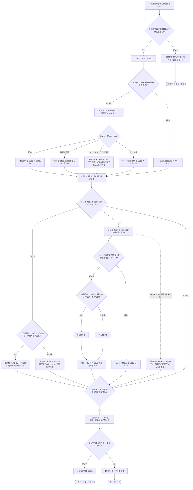
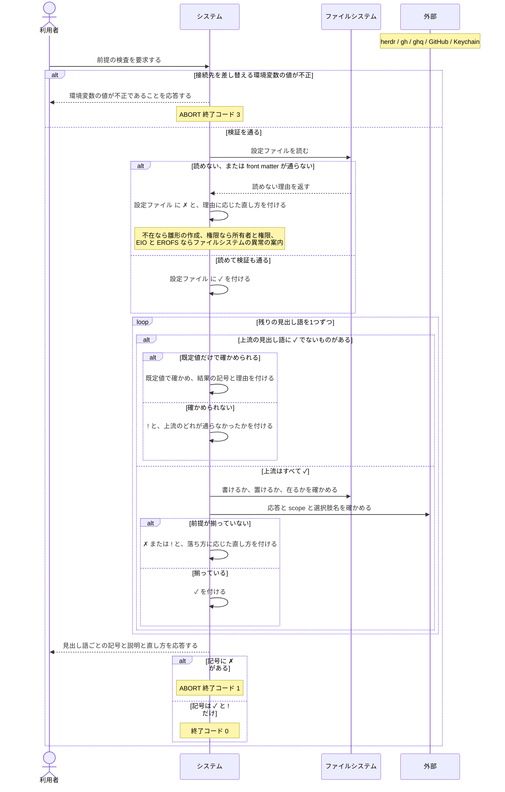

# ユースケース: 前提が揃っているかを検査する

## 根拠資料

- `docs/plans/continuo_design.md` の「3-32. 使い始めるまでの手順」（検査する見出し語・記号の3値・依存の図・終了コード）
- `docs/plans/continuo_design.md` の「3-6. 起動時の検査を厚くする」（信頼を引く鍵の作り方・選択肢名の不一致が無言の0件になること）
- `docs/plans/continuo_design.md` の「3-34. ボードは既存のものに合わせる」（`status_field` と選択肢名の照合）
- `docs/plans/continuo_design.md` の「3-15. トークンの計上は transcript から取る」（macOS は Keychain から読むこと・待つ上限の分け方・`continuo allow-keychain-access`）
- `docs/plans/continuo_design.md` の「6-3. RUCM に無いものはテストにもならない」（見出し語の並びを1周として書く理由）
- `docs/plans/continuo_design.md` の「6-10. 書けない場所を、起動する前に捕まえる」（実際に作って消す検査・既定値で走らせる検査）
- `docs/plans/continuo_design.md` の「6-11. 読めない理由で、案内を変える」（`EIO` と `EROFS` の読み分け）
- `docs/plans/continuo_design.md` の「5-2. front matter（設定）」（`herdr.protocol` / `tracker.active_states` / `workspace.root` / `rate_limit.source` / `rate_limit.token_source` / `rate_limit.token_env`）
- `docs/trying_it_out.md` の「段6. 前提が揃っているかを検査する」（実際に叩いた出力）
- `internal/doctor/doctor.go` の `Run` / `withCheckTimeout` / `timedOut` / `collectRepos`
- `internal/doctor/checks.go` の `checkConfig` / `configRemedies` / `filesystemRemedies` / `writeRemedies` / `checkClaude` / `checkRuntimeDir` / `checkClaudeHome` / `checkWorkspaceRoot` / `checkHerdr` / `checkGHAuth` / `checkBoard` / `boardFailure` / `checkClone` / `checkTrust` / `checkCredentials` / `checkKeychainCredentials`
- `internal/fsprobe/fsprobe.go` の `Classify` / `ProbeWritable` / `ProbeClaudeSessionEnv` / `CheckWritablePlaces`
- `internal/ratelimit/keychain.go` の `ProbeKeychain` / `runSecurity` / `DefaultKeychainTimeout`
- `internal/doctor/report.go` の `Symbol` / `worse` / `Counts` / `ExitCode` / `Write`
- `cmd/continuo/main.go` の `runDoctor` / `doctorInternalErrorExitCode`

## 見出し語ごとに何を確かめるか

**基本フローは見出し語を1つずつ回す1周として書いてある。**何を確かめるかは見出し語ごとに違うので、
そこはこの表が正である。**上流**は「そこが `✓` でなければ確かめられないもの」、
**既定値**は「設定ファイルが読めなくても既定値だけで確かめられるか」である。

| 見出し語 | 何を確かめるか | 上流 |
| --- | --- | --- |
| 設定ファイル | WORKFLOW.md を読めて front matter が検証を通るか | なし |
| claude | `claude.kind`（既定は `claude`）の実行ファイルが PATH にあるか | 既定値で確かめる |
| hook の置き場所 | 決めた場所にディレクトリを作り、unix socket を listen できるか | 既定値で確かめる |
| Claude の設定 | `~/.claude/session-env` に使い捨てのディレクトリを作って消せるか | 設定を読まない |
| worktree の場所 | `workspace.root` に使い捨てのディレクトリを作って消せるか | 設定ファイル |
| herdr | ping の応答の protocol が `herdr.protocol` と一致するか | 設定ファイル |
| gh の認証 | Token scopes に `project` が単独の要素として並んでいるか | 設定ファイル |
| ボード | Bootstrap が通り、`active_states` の選択肢名がボードにすべてあるか | 設定ファイル・gh の認証 |
| clone | 対象リポジトリの clone が `ghq list -p -e` で見つかるか | ボード |
| 信頼登録 | clone の絶対パスが `~/.claude.json` で承認済みか | ボード |
| 資格情報 | `rate_limit` の設定に応じて、環境変数・ファイル・Keychain のいずれかから取れるか | 設定ファイル（記号を分けるだけで飛ばさない） |

**「Claude の設定」だけは設定ファイルの記号を見ない。**Claude Code は SessionStart hook を
走らせる前に `~/.claude/session-env/<session_id>/` を作り、continuo はその hook を必ず張る。
**ここが書けないと issue は1件も始まらない**ので、設定が読めていようがいまいが必ず確かめる。

## 設定ファイルを読めないときの直し方の分け方

**読めない理由で直し方を変える。**理由を問わず雛形の作成を勧めると、
**ファイルシステムが壊れている利用者を「設定を作り直す」方向へ誘導することになる。**
その案内に従うと `continuo init` は「既にあります」で止まり、`--force` を足すと本物の設定を雛形で潰す。

| 読めない理由 | 直し方 |
| --- | --- |
| 設定ファイルが無い（ENOENT） | `continuo init` で雛形を置く |
| 権限が足りない（EACCES） | 所有者と権限を確かめる |
| ファイルシステムの異常（EIO / EROFS） | マウントの状態・カーネルログ・Windows 側の空き容量・`wsl --shutdown` のあとの再起動 |
| それ以外 | ファイルは読めているので front matter を直す |

## RUCM

```rucm
USE CASE NAME: 前提が揃っているかを検査する
BRIEF DESCRIPTION: 利用者は continuo doctor を実行する。システムは continuo が動くための前提を見出し語ごとに1つずつ検査する。システムは見出し語ごとに ✓ と ✗ と ! のいずれかの記号を付ける。システムは1件が失敗しても残りの検査を続ける。システムは記号に ✗ が1件でもあれば終了コード 1 を返す。
PRECONDITION: 利用者は continuo の実行ファイルを実行できる。実行するマシンの OS は macOS または Linux である。
PRIMARY ACTOR: 利用者
SECONDARY ACTORS: ファイルシステム、herdr、gh、ghq、GitHub、Keychain
DEPENDENCY: なし
GENERALIZATION: なし

BASIC FLOW:
1. 利用者はシステムに前提の検査を要求する。
2. システムは VALIDATES THAT 接続先を差し替える環境変数の値が検証を通る。
3. システムは設定ファイルを読む。
4. システムは VALIDATES THAT 設定ファイルを読めて front matter が検証を通る。
5. システムは見出し語「設定ファイル」に ✓ を付ける。
6. システムは残りの見出し語の並びを決める。
7. DO
8.   システムは VALIDATES THAT いま検査する見出し語の上流の見出し語がすべて ✓ である。
9.   システムはいま検査する見出し語の前提を確かめる。
10.   システムは VALIDATES THAT いま検査する見出し語の前提が揃っている。
11.   システムはいま検査する見出し語に ✓ を付ける。
12. UNTIL 見出し語の並びを最後まで検査した
13. システムは利用者に見出し語ごとの記号と説明と直し方を応答する。
14. システムは VALIDATES THAT すべての見出し語の記号が ✓ または ! である。
15. システムは終了コード 0 を返す。
POSTCONDITION: すべての見出し語に ✓ が付いている。検査結果が出力されている。終了コード 0 が返っている。

SPECIFIC ALTERNATIVE FLOW 接続先の指定が不正:
RFS BASIC FLOW 2
1. システムは利用者に接続先を差し替える環境変数の値が不正であることを応答する。
2. ABORT
POSTCONDITION: 検査結果は出力されていない。終了コード 3 が返っている。

SPECIFIC ALTERNATIVE FLOW 設定ファイルを読めない:
RFS BASIC FLOW 4
1. システムは見出し語「設定ファイル」に ✗ を付ける。
2. IF 読めない理由が設定ファイルの不在である THEN
3.   システムは見出し語「設定ファイル」に雛形の作成を直し方として添える。
4. ELSEIF 読めない理由が権限の不足である THEN
5.   システムは見出し語「設定ファイル」に所有者と権限の確認を直し方として添える。
6. ELSEIF 読めない理由がファイルシステムの異常である THEN
7.   システムは見出し語「設定ファイル」にファイルシステムの異常であることを理由として添える。
8.   システムは見出し語「設定ファイル」にマウントの状態とカーネルログの確認を直し方として添える。
9.   システムは見出し語「設定ファイル」に Windows 側の空き容量の確認を直し方として添える。
10.   システムは見出し語「設定ファイル」に WSL の停止と再起動を直し方として添える。
11. ELSE
12.   システムは見出し語「設定ファイル」に front matter の修正を直し方として添える。
13. ENDIF
14. RESUME STEP 6
POSTCONDITION: 見出し語「設定ファイル」に ✗ が付いている。直し方は読めない理由に応じたものだけが載っている。雛形の作成は設定ファイルが不在のときだけ載っている。残りの検査は続いている。

SPECIFIC ALTERNATIVE FLOW 上流が通っていない:
RFS BASIC FLOW 8
1. IF いま検査する見出し語を既定値だけで確かめられる THEN
2.   システムはいま検査する見出し語の前提を既定値で確かめる。
3.   システムはいま検査する見出し語に確かめた結果の記号を付ける。
4.   システムはいま検査する見出し語に既定値で確かめたことを理由として添える。
5. ELSE
6.   システムはいま検査する見出し語に ! を付ける。
7.   システムはいま検査する見出し語に上流のどの見出し語が通らなかったかを理由として添える。
8. ENDIF
9. RESUME STEP 12
POSTCONDITION: 既定値だけで確かめられる見出し語には ✓ または ✗ が付いている。それ以外の見出し語には ! が付いている。残りの検査は続いている。

SPECIFIC ALTERNATIVE FLOW 前提が揃っていない:
RFS BASIC FLOW 10
1. IF 落ち方が確かめられなかったものである THEN
2.   システムはいま検査する見出し語に ! を付ける。
3. ELSE
4.   システムはいま検査する見出し語に ✗ を付ける。
5. ENDIF
6. システムはいま検査する見出し語に落ち方を理由として添える。
7. システムはいま検査する見出し語に落ち方に応じた直し方を添える。
8. RESUME STEP 12
POSTCONDITION: いま検査した見出し語に ✗ または ! が付いている。落ち方に応じた直し方が検査結果に載っている。残りの検査は続いている。

SPECIFIC ALTERNATIVE FLOW 足りない前提がある:
RFS BASIC FLOW 14
1. システムは終了コード 1 を返す。
2. ABORT
POSTCONDITION: 検査結果が出力されている。1件以上の見出し語に ✗ が付いている。終了コード 1 が返っている。

GLOBAL ALTERNATIVE FLOW 検査の期限切れ:
BRANCH FROM BASIC FLOW 9
WHEN 検査の期限が切れた場合
1. システムはいま検査する見出し語への問い合わせを打ち切る。
2. システムはいま検査する見出し語に ! を付ける。
3. システムはいま検査する見出し語に時間内の応答がないことを理由として添える。
4. RESUME STEP 12
POSTCONDITION: 期限が切れた見出し語に ! が付いている。問い合わせは打ち切られている。残りの検査は続いている。
```

## フローチャート



## シーケンス図


