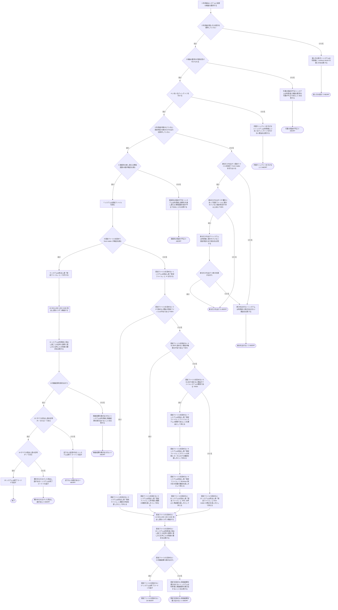
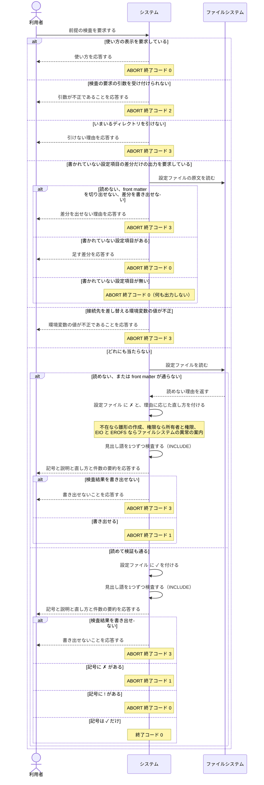

# ユースケース: 前提が揃っているかを検査する

## 根拠資料

- `docs/plans/continuo_design.md` の「3-32. 使い始めるまでの手順」（検査する見出し語・記号の3値・依存の図・終了コード）
- `docs/plans/continuo_design.md` の「3-6. 起動時の検査を厚くする」（信頼を引く鍵の作り方・選択肢名の不一致が無言の0件になること）
- `docs/plans/continuo_design.md` の「3-34. カンバンは既存のものに合わせる」（`status_field` と選択肢名の照合）
- `docs/plans/continuo_design.md` の「3-9e. 片付ける Status は、終わったとみなす Status の中から選ぶ」（`cleanup.on_states` と `tracker.terminal_states` の関係・`!` にする理由）
- `docs/plans/continuo_design.md` の「3-15. トークンの計上は transcript から取る」（macOS は Keychain から読むこと・待つ上限の分け方・`continuo allow-keychain-access`）
- `docs/plans/continuo_design.md` の「6-3. RUCM に無いものはテストにもならない」（見出し語の並びを1周として書く理由）
- `docs/plans/continuo_design.md` の「6-11. 書けない場所を、起動する前に捕まえる」（実際に作って消す検査・既定値で走らせる検査）
- `docs/plans/continuo_design.md` の「6-12. 読めない理由で、案内を変える」（`EIO` と `EROFS` の読み分け）
- `docs/plans/continuo_design.md` の「6-14. 紛らわしい Status の組を、doctor が注意する」（紛らわしいの定義・`!` にする理由・副作用）
- `docs/plans/continuo_design.md` の「3-57. 対応表のキーはカンバンに実在しなくてよい」（`対応表のキー` を置く理由・`!` にする理由）
- `docs/plans/continuo_design.md` の「3-54. 対応表のキーの Status へ動いたら worker を止めず、書いた主体を見ずに本来の Status へ戻す」（`自動化` を置く理由・対応表が空だと走行中の run が止まること）
- `docs/plans/continuo_design.md` の「3-70. agent teams には対応しない」（`agent teams` を置く理由・読める出どころが2つだけであること・`!` にする理由）
- `docs/plans/continuo_design.md` の「3-75. 版を上げて増えた設定項目を、doctor が知らせる」（`未記入の項目` を置く理由・`!` にする理由・`--missing-keys-patch` が差分だけを出す理由）
- `docs/plans/continuo_design.md` の「5-3c. 送るプロンプトを3つの断片から組み立てる」（`プロンプトの変数` が確かめる変数）
- `docs/plans/continuo_design.md` の「3-49. 身元を確かめられない worktree は、復元を試してから止まる。消さない」（`worktree の場所` が壊れた worktree も見る理由）
- `docs/plans/continuo_design.md` の「5-2. front matter（設定）」（`herdr.protocol` / `tracker.active_states` / `workspace.root` / `rate_limit.source` / `rate_limit.token_source` / `rate_limit.token_env`）
- `docs/trying_it_out.md` の「段6. 前提が揃っているかを検査する」（実際に叩いた出力）
- `internal/doctor/doctor.go` の `Run` / `withCheckTimeout` / `timedOut` / `collectRepos`
- `internal/doctor/status_names.go` の `checkStatusNames` / `checkDirectChatConflict` / `directChatOptionMissing` / `configuredStates` / `findConfusingPairs` / `confusionBetween`
- `internal/doctor/rewrite_keys.go` の `checkRewriteKeys`
- `internal/doctor/automations.go` の `checkAutomations` / `enabledWorkflowNames` / `workflowNotes`
- `internal/doctor/missing_keys.go` の `checkMissingKeys` / `missingKeyNotes`
- `internal/scaffold/missing_keys.go` の `MissingKeys`（`未記入の項目` と `--missing-keys-patch` が同じ判定を呼ぶ）
- `internal/doctor/agentteams.go` の `checkAgentTeams` / `agentTeamsProblem` / `EnvAgentTeams`
- `internal/tracker/adapter.go` の `FetchProjectWorkflows`（カンバンの自動化。**起動時の検査とは別のリクエストで取る**）
- `internal/config/states.go` の `RewriteKeysOutsideBoard`（対応表のキーとカンバンの選択肢の突き合わせ）
- `internal/doctor/checks.go` の `checkConfig` / `configRemedies` / `filesystemRemedies` / `writeRemedies` / `checkCleanupStates` / `checkPromptVariables` / `checkClaude` / `checkRuntimeDir` / `checkClaudeHome` / `checkWorkspaceRoot` / `brokenWorktreeResult` / `checkHerdr` / `checkGHAuth` / `checkBoard` / `boardFailure` / `checkClone` / `checkTrust` / `countDetail` / `checkCredentials` / `checkKeychainCredentials`
- `internal/config/states.go` の `CleanupStatesOutsideTerminal`（片付ける Status と終わったとみなす Status の突き合わせ）
- `internal/fsprobe/fsprobe.go` の `Classify` / `ProbeWritable` / `ProbeClaudeSessionEnv` / `CheckWritablePlaces`
- `internal/ratelimit/keychain.go` の `ProbeKeychain` / `runSecurity` / `DefaultKeychainTimeout`
- `internal/doctor/report.go` の `Symbol` / `worse` / `Counts` / `ExitCode` / `Write`
- `internal/cli/cli.go` の `runDoctor` / `runDoctorMissingKeysPatch` / `parseErrorExitCode` / `doctorInternalErrorExitCode`

## 見出し語ごとに何を確かめるか

**見出し語「設定ファイル」より後ろの見出し語は、1つずつ回す1周として書いてある**（`見出し語を1つずつ検査する.rucm.md`。この記述が `INCLUDE USE CASE` で引く）。
何を確かめるかは見出し語ごとに違うので、そこはこの表が正である。
**上流**の欄は「そこが `✓` でなければ確かめられないもの」である。
上流の欄の「既定値で確かめる」は、設定ファイルが読めなくても既定値だけで確かめる見出し語、
「設定を読まない」は、設定ファイルの記号を見ずに確かめる見出し語である。

**上流が通っていないときの `!` には、ふつう直し方が付かない。**`gh の認証` と `資格情報` だけは、
設定ファイルが通っていないときの `!` にも「先に設定ファイルを直す」という直し方が付く
（`internal/doctor/checks.go` の `checkGHAuth` / `checkCredentials`）。

| 見出し語 | 何を確かめるか | 上流 |
| --- | --- | --- |
| 設定ファイル | WORKFLOW.md を読めて front matter が検証を通るか | なし |
| 片付けの状態 | `cleanup.on_states` の値が `tracker.terminal_states` に全部あるか（記号は `!` だけ） | 設定ファイル |
| 未記入の項目 | 雛形にある設定項目が WORKFLOW.md に全部書かれているか（記号は `!` だけ。書かれていない項目の名前と、差分を読むコマンドと当てるコマンドを出す） | 設定ファイル |
| プロンプトの変数 | 送るプロンプトが、決められた変数だけを使っているか（誤りは `✗`。issue を1件も着手できないため） | 設定ファイル |
| claude | `claude.kind`（既定は `claude`）の実行ファイルが PATH にあるか | 既定値で確かめる |
| agent teams | `claude.env` と doctor を叩いたシェルの `CLAUDE_CODE_EXPERIMENTAL_AGENT_TEAMS` を見る（記号は `!` だけ） | 設定ファイル |
| hook の置き場所 | 決めた場所にディレクトリを作り、unix socket を listen できるか | 既定値で確かめる |
| Claude の設定 | `~/.claude/session-env` に使い捨てのディレクトリを作って消せるか | 設定を読まない |
| worktree の場所 | `workspace.root` に使い捨てのディレクトリを作って消せるか。書けたあと、身元を確かめられない worktree が残っていないかも見る（残っていて `workspace.on_broken_worktree` が `stop` なら `✗`、`skip` なら `✓` のまま内訳に出す） | 設定ファイル |
| herdr | ping の応答の protocol が `herdr.protocol` と一致するか | 設定ファイル |
| gh の認証 | `gh` が PATH にあるか（無ければ `✗` と、導入の直し方）。Token scopes に `project` が単独の要素として並んでいるか | 設定ファイル |
| カンバン | Bootstrap が通り、`active_states` の選択肢名がカンバンにすべてあるか | 設定ファイル・gh の認証 |
| Status の名前 | 設定に書いた Status と紛らわしい選択肢がカンバンに無いか（記号は `!` だけ）。あわせて direct chat の Status を2つ見る。(1) `tracker.direct_chat_state` がほかの役割の Status と重なっていないか。**これは設定とカンバンの上流より前に見るので、重なっていれば上流が通っていなくても専用の `!` になる。**(2) `tracker.direct_chat_state` の Status がカンバンの選択肢にあるか。無ければ、紛らわしい組が0件でも `!` になる | カンバン（direct chat の重なりの検査だけは上流を見ない） |
| 対応表のキー | `tracker.automated_state_rewrite` のキーがカンバンの Status の選択肢にあるか（記号は `!` だけ） | カンバン |
| 自動化 | カンバンの自動化が1つでも有効なのに `tracker.automated_state_rewrite` が空でないか（記号は `!` だけ）。名前が `Auto-add ` で始まる自動化は数えない。自動化の一覧を読めなかったときは、カンバンが `✓` でも `!` になる | カンバン |
| clone | `ghq` と `git` が PATH にあるか（無ければ `✗`。対象が0件でも先に見る）。対象リポジトリの clone が `ghq list -p -e` で見つかるか（`ghq list` が失敗したリポジトリは `!`。期限切れもここに入る） | カンバン |
| 信頼登録 | clone の絶対パスが `~/.claude.json` で承認済みか（未承認は `✗`）。clone が見つからなかったリポジトリ、判定できなかったリポジトリ、ホームディレクトリを引けないときは `!` | カンバン |
| 資格情報 | `rate_limit.source` が `oauth_usage_api`（既定）のときだけ、`rate_limit.token_source` に応じて環境変数・ファイル・Keychain のいずれかから取れるか。`statusline` と `none` は資格情報を読まないので `✓` | 設定ファイル（gh の認証やカンバンが通っていなくても飛ばさない） |

**「Claude の設定」だけは設定ファイルの記号を見ない。**Claude Code は SessionStart hook を
走らせる前に `~/.claude/session-env/<session_id>/` を作り、continuo はその hook を必ず張る。
**ここが書けないと issue は1件も始まらない**ので、設定が読めていようがいまいが必ず確かめる。

**「片付けの状態」は外へ1バイトも問い合わせない。**設定の2つのキーを突き合わせるだけである。
**記号は `!` までで、`✗` にしない。**噛み合っていなくても continuo は起動して走る
（起こるのは「終わっていないと判定した直後に worktree を片付ける」ことである）。
**`cleanup.enabled` が偽なら前提が揃っているものとして扱う。**片付けそのものが走らないので、
噛み合っていなくても何も起きない。**大文字小文字と前後の空白だけの違いは同じ値とみなす。**

## 設定ファイルを読めないときの直し方の分け方

**読めない理由で直し方を変える。**理由を問わず雛形の作成を勧めると、
**ファイルシステムが壊れている利用者を「設定を作り直す」方向へ誘導することになる。**
その案内に従うと `continuo init` は「既にあります」で止まり、`--force` を足すと本物の設定を雛形で潰す。

| 読めない理由 | 直し方 |
| --- | --- |
| 設定ファイルが無い（ENOENT） | `continuo init` で雛形を置く |
| 権限が足りない（EACCES） | 所有者と権限を確かめる |
| ファイルシステムの異常（EIO / EROFS） | マウントの状態・カーネルログ・Windows 側の空き容量・`wsl --shutdown` のあとの再起動 |
| それ以外 | ファイルは読めているので front matter を直す |

## 確かめる対象が0件のとき

**カンバンに issue が1件も無いのは、設定の誤りではない**（設計 3-32）。だから `✗` にしない。

`clone` と `信頼登録` の2つだけは、確かめる対象がカンバンの issue から決まる
（`internal/doctor/doctor.go` の `collectRepos` が `nameWithOwner` を重複なく集める）。
**カンバンが空だと確かめるものが1件も無い**ので、この2つには `!` を付けて、終了コードに影響させない
（`internal/doctor/checks.go` の `checkClone` / `checkTrust`）。

**「0件だから通った」と書かない。**`✓` にすると、カンバンを間違えて空のまま回している利用者に
「対象リポジトリは全部 clone 済みです」と伝えることになる。

## 終了コードの分け方

**「前提が足りない」と「doctor そのものが動けなかった」を、スクリプトから区別できるようにする。**
そのために4つに割ってある（`internal/cli/cli.go` の `runDoctor` / `runDoctorMissingKeysPatch` / `parseErrorExitCode` / `doctorInternalErrorExitCode`）。

| 終了コード | どんなときに返るか | 検査結果 |
| --- | --- | --- |
| 0 | 記号が `✓` だけ、または `✓` と `!` だけ | 出ている |
| 0 | 使い方の表示を要求した | 出ていない（使い方が標準エラーに出る） |
| 0 | `--missing-keys-patch` で差分を出した、または足す項目が無かった | 出ていない（差分だけが標準出力に出る。足す項目が無ければ何も出ない） |
| 1 | 記号に `✗` が1件以上ある | 出ている |
| 2 | 引数の指定が誤っている | 出ていない |
| 3 | いまいるディレクトリを引けない | 出ていない（理由が標準エラーに出る） |
| 3 | `--missing-keys-patch` で設定ファイルを読めない、front matter を切り出せない、差分を書き出せない | 出ていない（理由が標準エラーに出る） |
| 3 | 接続先の環境変数が不正、または検査結果を書き出せない | 出ていない |

**1 は「検査で `✗` が在った」だけを表す。**検査を1件も行わずに止まる場合は、どれも 3 である。
`--missing-keys-patch` は検査をしないので、1 を返さない（0 か 2 か 3）。

**`--missing-keys-patch` は検査を1つも行わない。**雛形と WORKFLOW.md の原文を突き合わせて、足す差分だけを標準出力へ出す。
外部（herdr・gh・ghq・GitHub）へは1回も出ない。接続先の環境変数の検証よりも前で分かれる。

**要約の1行は、記号の内訳で3通りに分かれる**（`internal/doctor/report.go` の `Write`）。
`✓` だけなら「前提はすべて揃っています」、`!` があるだけなら「足りないものはありません」、
`✗` があれば「N件に問題があります」である。**`!` だけのときを「問題があります」と書かない。**
対象が0件のカンバンもここへ来るので、設定の誤りでないものを誤りとして見せてしまう。

## RUCM

```rucm
USE CASE NAME: 前提が揃っているかを検査する
BRIEF DESCRIPTION: 利用者は continuo doctor を実行する。システムは continuo が動くための前提を見出し語ごとに1つずつ検査する。システムは見出し語ごとに ✓ と ✗ と ! のいずれかの記号を付ける。システムは1件が失敗しても残りの検査を続ける。システムは記号に ✗ が1件でもあれば終了コード 1 を返す。
PRECONDITION: 利用者は continuo の実行ファイルを実行できる。実行するマシンの OS は macOS または Linux である。
PRIMARY ACTOR: 利用者
SECONDARY ACTORS: ファイルシステム
DEPENDENCY: INCLUDE USE CASE 見出し語を1つずつ検査する
GENERALIZATION: なし

BASIC FLOW:
1. 利用者はシステムに前提の検査を要求する。
2. システムは VALIDATES THAT 利用者が使い方の表示を要求していない。
3. システムは VALIDATES THAT 検査の要求の引数を受け付けられる。
4. システムは VALIDATES THAT いまいるディレクトリを引ける。
5. システムは VALIDATES THAT 利用者が書かれていない設定項目の差分だけの出力を要求していない。
6. システムは VALIDATES THAT 接続先を差し替える環境変数の値が検証を通る。
7. システムは設定ファイルを読む。
8. システムは VALIDATES THAT 設定ファイルを読めて front matter が検証を通る。
9. システムは見出し語「設定ファイル」に ✓ を付ける。
10. INCLUDE USE CASE 見出し語を1つずつ検査する
11. システムは利用者に見出し語ごとの記号と説明と直し方と記号ごとの件数の要約を応答する。
12. システムは VALIDATES THAT 検査結果を書き出せた。
13. システムは VALIDATES THAT すべての見出し語の記号が ✓ または ! である。
14. システムは VALIDATES THAT すべての見出し語の記号が ✓ である。
15. システムは終了コード 0 を返す。
POSTCONDITION: すべての見出し語に ✓ が付いている。検査結果が標準出力に出ている。要約は前提がすべて揃っていることを伝えている。終了コード 0 が返っている。

SPECIFIC ALTERNATIVE FLOW 使い方の表示:
RFS BASIC FLOW 2
1. システムは利用者に continuo doctor の使い方を応答する。
2. ABORT
POSTCONDITION: 検査結果は出力されていない。システムは検査を1件も行っていない。使い方は標準エラーに出ている。終了コード 0 が返っている。

SPECIFIC ALTERNATIVE FLOW 引数の指定が不正:
RFS BASIC FLOW 3
1. システムは利用者に検査の要求の引数が不正であることを応答する。
2. ABORT
POSTCONDITION: 検査結果は出力されていない。引数が不正であることが標準エラーに出ている。終了コード 2 が返っている。

SPECIFIC ALTERNATIVE FLOW 作業ディレクトリを引けない:
RFS BASIC FLOW 4
1. システムは利用者にいまいるディレクトリを引けない理由を応答する。
2. ABORT
POSTCONDITION: 検査結果は出力されていない。システムは検査を1件も行っていない。理由は標準エラーに出ている。終了コード 3 が返っている。

SPECIFIC ALTERNATIVE FLOW 差分だけを出す:
RFS BASIC FLOW 5
1. システムは VALIDATES THAT 設定ファイルを読めて front matter を切り出せる。
2. IF 雛形にあって設定ファイルに書かれていない設定項目が1件以上ある THEN
3.   システムは利用者に書かれていない設定項目を足す差分を応答する。
4.   システムは VALIDATES THAT 差分を書き出せた。
5. ENDIF
6. ABORT
POSTCONDITION: システムは検査を1件も行っていない。システムは herdr と gh と ghq と GitHub に何も要求していない。システムは設定ファイルを書き換えていない。差分は標準出力に出ている。書かれていない設定項目が0件の実行では、システムは何も出力していない。終了コード 0 が返っている。

BOUNDED ALTERNATIVE FLOW 差分を出せない:
RFS 差分だけを出す 1,4
1. システムは利用者に差分を出せない理由を応答する。
2. ABORT
POSTCONDITION: システムは検査を1件も行っていない。システムは設定ファイルを書き換えていない。理由は標準エラーに出ている。終了コード 3 が返っている。

SPECIFIC ALTERNATIVE FLOW 接続先の指定が不正:
RFS BASIC FLOW 6
1. システムは利用者に接続先を差し替える環境変数の値が不正であることを応答する。
2. ABORT
POSTCONDITION: 検査結果は出力されていない。システムは検査を1件も行っていない。理由は標準エラーに出ている。終了コード 3 が返っている。

SPECIFIC ALTERNATIVE FLOW 設定ファイルを読めない:
RFS BASIC FLOW 8
1. システムは見出し語「設定ファイル」に ✗ を付ける。
2. IF 読めない理由が設定ファイルの不在である THEN
3.   システムは見出し語「設定ファイル」に雛形の作成を直し方として添える。
4. ELSEIF 読めない理由が権限の不足である THEN
5.   システムは見出し語「設定ファイル」に所有者と権限の確認を直し方として添える。
6. ELSEIF 読めない理由がファイルシステムの異常である THEN
7.   システムは見出し語「設定ファイル」にファイルシステムの異常であることを理由として添える。
8.   システムは見出し語「設定ファイル」にマウントの状態とカーネルログの確認を直し方として添える。
9.   システムは見出し語「設定ファイル」に Windows 側の空き容量の確認を直し方として添える。
10.   システムは見出し語「設定ファイル」に WSL の停止と再起動を直し方として添える。
11. ELSE
12.   システムは見出し語「設定ファイル」に front matter の修正を直し方として添える。
13. ENDIF
14. INCLUDE USE CASE 見出し語を1つずつ検査する
15. システムは利用者に見出し語ごとの記号と説明と直し方と記号ごとの件数の要約を応答する。
16. システムは VALIDATES THAT 検査結果を書き出せた。
17. システムは終了コード 1 を返す。
18. ABORT
POSTCONDITION: 見出し語「設定ファイル」に ✗ が付いている。直し方は読めない理由に応じたものだけが載っている。雛形の作成は設定ファイルが不在のときだけ載っている。システムは残りの見出し語も検査している。検査結果が標準出力に出ている。要約は問題がある件数を伝えている。終了コード 1 が返っている。

SPECIFIC ALTERNATIVE FLOW 設定を読めない検査結果を書き出せない:
RFS 設定ファイルを読めない 16
1. システムは利用者に検査結果を書き出せないことを応答する。
2. ABORT
POSTCONDITION: 検査結果は書き出されていない。書き出せないことが標準エラーに出ている。終了コード 3 が返っている。

SPECIFIC ALTERNATIVE FLOW 検査結果を書き出せない:
RFS BASIC FLOW 12
1. システムは利用者に検査結果を書き出せないことを応答する。
2. ABORT
POSTCONDITION: 検査結果は書き出されていない。書き出せないことが標準エラーに出ている。終了コード 3 が返っている。

SPECIFIC ALTERNATIVE FLOW 足りない前提がある:
RFS BASIC FLOW 13
1. システムは終了コード 1 を返す。
2. ABORT
POSTCONDITION: 検査結果が標準出力に出ている。1件以上の見出し語に ✗ が付いている。終了コード 1 が返っている。

SPECIFIC ALTERNATIVE FLOW 確かめられなかった見出し語がある:
RFS BASIC FLOW 14
1. システムは終了コード 0 を返す。
2. ABORT
POSTCONDITION: 検査結果が標準出力に出ている。1件以上の見出し語に ! が付いている。✗ が付いた見出し語は0件である。要約は確かめられなかった件数を伝えている。終了コード 0 が返っている。
```

## フローチャート


```mermaid
flowchart TD
    BS1["1 利用者はシステムに前提の検査を要求する"]
    BS2{"2 利用者が使い方の表示を要求していない"}
    BS3{"3 検査の要求の引数を受け付けられる"}
    BS4{"4 いまいるディレクトリを引ける"}
    BS5{"5 利用者が書かれていない設定項目の差分だけの出力を要求していない"}
    BS6{"6 接続先を差し替える環境変数の値が検証を通る"}
    BS7["7 システムは設定ファイルを読む"]
    BS8{"8 設定ファイルを読めて front matter が検証を通る"}
    BS9["9 システムは見出し語「設定ファイル」に ✓ を付ける"]
    BS10[["10 INCLUDE USE CASE 見出し語を1つずつ検査する"]]
    BS11["11 システムは利用者に見出し語ごとの記号と説明と直し方と記号ごとの件数の要約を応答する"]
    BS12{"12 検査結果を書き出せた"}
    BS13{"13 すべての見出し語の記号が ✓ または ! である"}
    BS14{"14 すべての見出し語の記号が ✓ である"}
    BS15["15 システムは終了コード 0 を返す"]
    A1S1["使い方の表示 1 システムは利用者に continuo doctor の使い方を応答する"]
    A1S2(["使い方の表示 2 ABORT"])
    A2S1["引数の指定が不正 1 システムは利用者に検査の要求の引数が不正であることを応答する"]
    A2S2(["引数の指定が不正 2 ABORT"])
    A3S1["作業ディレクトリを引けない 1 システムは利用者にいまいるディレクトリを引けない理由を応答する"]
    A3S2(["作業ディレクトリを引けない 2 ABORT"])
    A4S1{"差分だけを出す 1 設定ファイルを読めて front matter を切り出せる"}
    A4S2{"差分だけを出す 2 IF 雛形にあって設定ファイルに書かれていない設定項目が1件以上ある THEN"}
    A4S3["差分だけを出す 3 システムは利用者に書かれていない設定項目を足す差分を応答する"]
    A4S4{"差分だけを出す 4 差分を書き出せた"}
    A4S6(["差分だけを出す 6 ABORT"])
    A5S1["差分を出せない 1 システムは利用者に差分を出せない理由を応答する"]
    A5S2(["差分を出せない 2 ABORT"])
    A6S1["接続先の指定が不正 1 システムは利用者に接続先を差し替える環境変数の値が不正であることを応答する"]
    A6S2(["接続先の指定が不正 2 ABORT"])
    A7S1["設定ファイルを読めない 1 システムは見出し語「設定ファイル」に ✗ を付ける"]
    A7S2{"設定ファイルを読めない 2 IF 読めない理由が設定ファイルの不在である THEN"}
    A7S3["設定ファイルを読めない 3 システムは見出し語「設定ファイル」に雛形の作成を直し方として添える"]
    A7S4{"設定ファイルを読めない 4 ELSEIF 読めない理由が権限の不足である THEN"}
    A7S5["設定ファイルを読めない 5 システムは見出し語「設定ファイル」に所有者と権限の確認を直し方として添える"]
    A7S6{"設定ファイルを読めない 6 ELSEIF 読めない理由がファイルシステムの異常である THEN"}
    A7S7["設定ファイルを読めない 7 システムは見出し語「設定ファイル」にファイルシステムの異常であることを理由として添える"]
    A7S8["設定ファイルを読めない 8 システムは見出し語「設定ファイル」にマウントの状態とカーネルログの確認を直し方として添える"]
    A7S9["設定ファイルを読めない 9 システムは見出し語「設定ファイル」に Windows 側の空き容量の確認を直し方として添える"]
    A7S10["設定ファイルを読めない 10 システムは見出し語「設定ファイル」に WSL の停止と再起動を直し方として添える"]
    A7S12["設定ファイルを読めない 12 システムは見出し語「設定ファイル」に front matter の修正を直し方として添える"]
    A7S14[["設定ファイルを読めない 14 INCLUDE USE CASE 見出し語を1つずつ検査する"]]
    A7S15["設定ファイルを読めない 15 システムは利用者に見出し語ごとの記号と説明と直し方と記号ごとの件数の要約を応答する"]
    A7S16{"設定ファイルを読めない 16 検査結果を書き出せた"}
    A7S17["設定ファイルを読めない 17 システムは終了コード 1 を返す"]
    A7S18(["設定ファイルを読めない 18 ABORT"])
    A8S1["設定を読めない検査結果を書き出せない 1 システムは利用者に検査結果を書き出せないことを応答する"]
    A8S2(["設定を読めない検査結果を書き出せない 2 ABORT"])
    A9S1["検査結果を書き出せない 1 システムは利用者に検査結果を書き出せないことを応答する"]
    A9S2(["検査結果を書き出せない 2 ABORT"])
    A10S1["足りない前提がある 1 システムは終了コード 1 を返す"]
    A10S2(["足りない前提がある 2 ABORT"])
    A11S1["確かめられなかった見出し語がある 1 システムは終了コード 0 を返す"]
    A11S2(["確かめられなかった見出し語がある 2 ABORT"])
    BS1 --> BS2
    BS2 -- はい --> BS3
    BS2 -- いいえ --> A1S1
    BS3 -- はい --> BS4
    BS3 -- いいえ --> A2S1
    BS4 -- はい --> BS5
    BS4 -- いいえ --> A3S1
    BS5 -- はい --> BS6
    BS5 -- いいえ --> A4S1
    BS6 -- はい --> BS7
    BS6 -- いいえ --> A6S1
    BS7 --> BS8
    BS8 -- はい --> BS9
    BS8 -- いいえ --> A7S1
    BS9 --> BS10
    BS10 --> BS11
    BS11 --> BS12
    BS12 -- はい --> BS13
    BS12 -- いいえ --> A9S1
    BS13 -- はい --> BS14
    BS13 -- いいえ --> A10S1
    BS14 -- はい --> BS15
    BS14 -- いいえ --> A11S1
    A1S1 --> A1S2
    A2S1 --> A2S2
    A3S1 --> A3S2
    A4S1 -- はい --> A4S2
    A4S1 -- いいえ --> A5S1
    A4S2 -- はい --> A4S3
    A4S2 -- いいえ --> A4S6
    A4S3 --> A4S4
    A4S4 -- はい --> A4S6
    A4S4 -- いいえ --> A5S1
    A5S1 --> A5S2
    A6S1 --> A6S2
    A7S1 --> A7S2
    A7S2 -- はい --> A7S3
    A7S2 -- いいえ --> A7S4
    A7S3 --> A7S14
    A7S4 -- はい --> A7S5
    A7S4 -- いいえ --> A7S6
    A7S5 --> A7S14
    A7S6 -- はい --> A7S7
    A7S6 -- いいえ --> A7S12
    A7S7 --> A7S8
    A7S8 --> A7S9
    A7S9 --> A7S10
    A7S10 --> A7S14
    A7S12 --> A7S14
    A7S14 --> A7S15
    A7S15 --> A7S16
    A7S16 -- はい --> A7S17
    A7S16 -- いいえ --> A8S1
    A7S17 --> A7S18
    A8S1 --> A8S2
    A9S1 --> A9S2
    A10S1 --> A10S2
    A11S1 --> A11S2
    BS15 --> END(["終了"])
```

## シーケンス図


```mermaid
sequenceDiagram
    actor 利用者
    participant システム
    participant ファイルシステム

    利用者->>システム: 前提の検査を要求する

    alt 使い方の表示を要求している
        システム-->>利用者: 使い方を応答する
        Note over システム: ABORT 終了コード 0
    else 検査の要求の引数を受け付けられない
        システム-->>利用者: 引数が不正であることを応答する
        Note over システム: ABORT 終了コード 2
    else いまいるディレクトリを引けない
        システム-->>利用者: 引けない理由を応答する
        Note over システム: ABORT 終了コード 3
    else 書かれていない設定項目の差分だけの出力を要求している
        システム->>ファイルシステム: 設定ファイルの原文を読む
        alt 読めない、front matter を切り出せない、差分を書き出せない
            システム-->>利用者: 差分を出せない理由を応答する
            Note over システム: ABORT 終了コード 3
        else 書かれていない設定項目がある
            システム-->>利用者: 足す差分を応答する
            Note over システム: ABORT 終了コード 0
        else 書かれていない設定項目が無い
            Note over システム: ABORT 終了コード 0（何も出力しない）
        end
    else 接続先を差し替える環境変数の値が不正
        システム-->>利用者: 環境変数の値が不正であることを応答する
        Note over システム: ABORT 終了コード 3
    else どれにも当たらない
        システム->>ファイルシステム: 設定ファイルを読む
        alt 読めない、または front matter が通らない
            ファイルシステム-->>システム: 読めない理由を返す
            システム->>システム: 設定ファイル に ✗ と、理由に応じた直し方を付ける
            Note over システム: 不在なら雛形の作成、権限なら所有者と権限、<br/>EIO と EROFS ならファイルシステムの異常の案内
            システム->>システム: 見出し語を1つずつ検査する（INCLUDE）
            システム-->>利用者: 記号と説明と直し方と件数の要約を応答する
            alt 検査結果を書き出せない
                システム-->>利用者: 書き出せないことを応答する
                Note over システム: ABORT 終了コード 3
            else 書き出せる
                Note over システム: ABORT 終了コード 1
            end
        else 読めて検証も通る
            システム->>システム: 設定ファイル に ✓ を付ける
            システム->>システム: 見出し語を1つずつ検査する（INCLUDE）
            システム-->>利用者: 記号と説明と直し方と件数の要約を応答する
            alt 検査結果を書き出せない
                システム-->>利用者: 書き出せないことを応答する
                Note over システム: ABORT 終了コード 3
            else 記号に ✗ がある
                Note over システム: ABORT 終了コード 1
            else 記号に ! がある
                Note over システム: ABORT 終了コード 0
            else 記号は ✓ だけ
                Note over システム: 終了コード 0
            end
        end
    end
```
