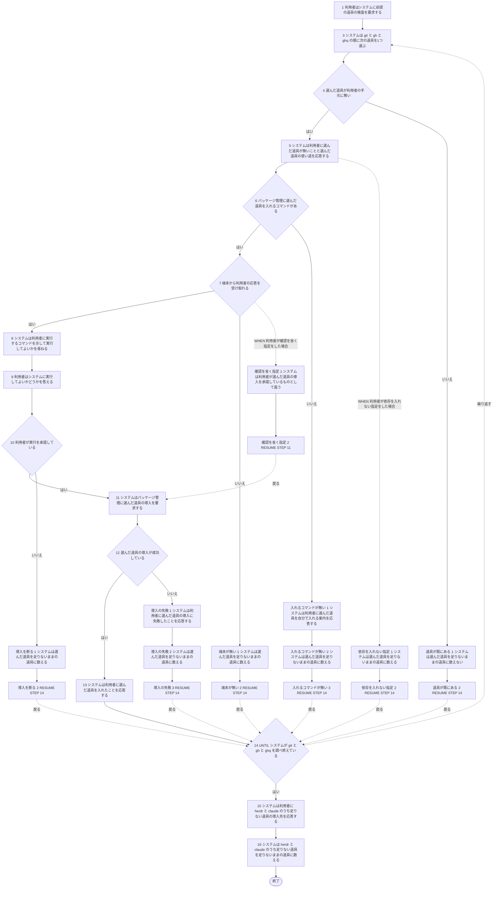
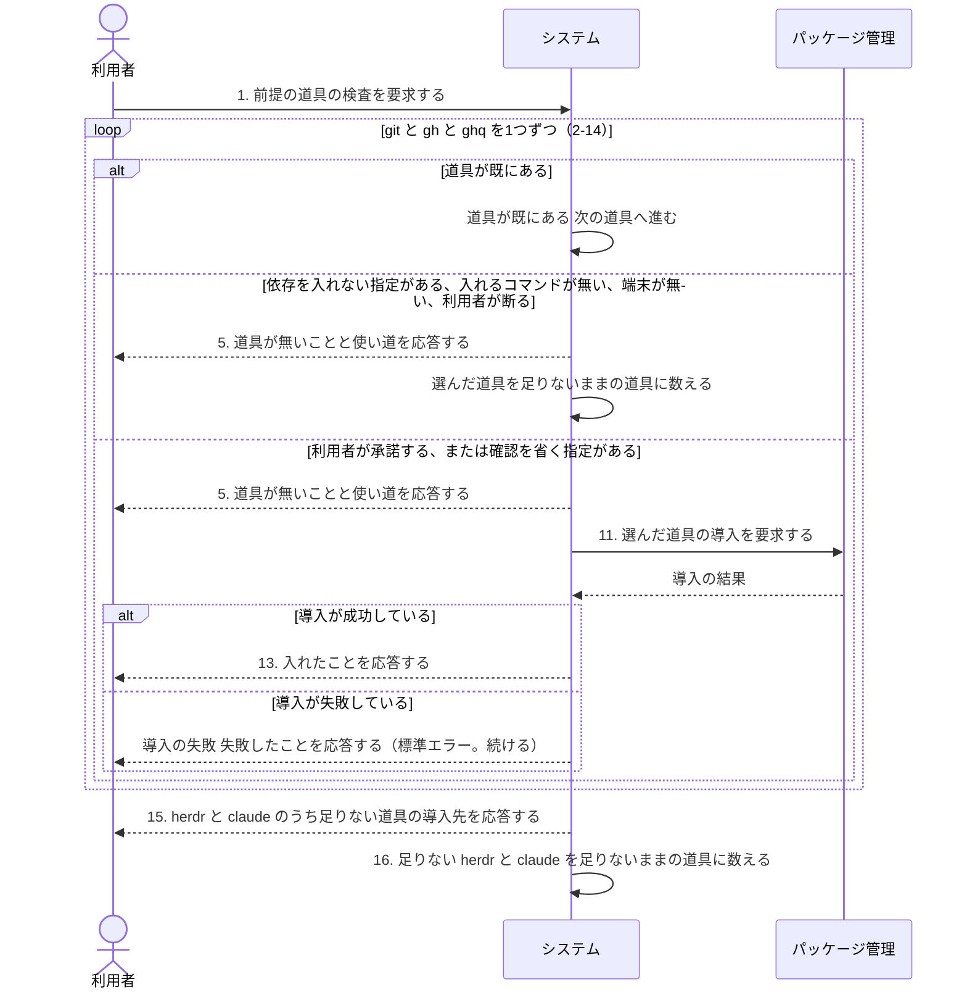

# ユースケース: 前提の道具を調べて入れる

> **ネットワークインストーラーのうち、足りない道具を1つずつ扱う段だけを書いた記述である。**
> `continuo を入れる` が `INCLUDE USE CASE` で引く。この段はどの分岐でも止まらないので、
> 実行ファイルを取って置く段（`配布物を取って置く`）と1本に書くと、道具1つごとの扱いとの掛け算で経路が増える。分けて書く。
>
> **この記述からテストコードは作らない。**
> どの経路を通るかが、テストを走らせる機械に入っている道具とパッケージ管理で変わり、1本の経路に決まらないためである。
> 道具の段を通しているテストは `test/install/install_test.go` の `TestInstall_端末が無ければ道具を1つも入れない` で、apt の在る Linux と macOS とで通る経路が違う。
> `check_update_tests.py` が出す `[W1]`（テスト未生成パス）は、ここでは想定どおりである。

## 根拠資料

- `docs/plans/continuo_design.md` の「3-36. 入れ方は、ネットワークインストーラーの1行にする」（道具が足りないとき・パイプで流し込まれても対話する）
- `install.sh` の `check_deps` / `pkg_manager` / `install_cmd_text` / `install_pkg` / `ask` / `have`

## 道具は1つずつ扱う

`install.sh` の `check_deps` は、`git` → `gh` → `ghq` の順に1つずつ調べる。rucm ブロックの段2〜14 の繰り返しが、この順である。
**道具ごとに結果が違ってよい**（`git` は入れ、`ghq` は入れるコマンドが無いので案内だけ、など）。

| 状況 | どうなるか | rucm ブロックのどこか |
| --- | --- | --- |
| 道具が既に在る | 何も出さずに次の道具へ進む | `道具が既にある` |
| `--no-deps` を指定している | 名前と使い道だけを出す。入れない | `依存を入れない指定` |
| 入れるコマンドが無い（パッケージ管理が見つからない。`ghq` は `brew` 以外では入れるコマンドが無い） | 自分で入れる案内を出す。尋ねない | `入れるコマンドが無い` |
| `--yes` を指定している | 尋ねずに入れる | `確認を省く指定` |
| 端末を開けない | 尋ねない。入れない | `端末が無い` |
| 利用者が断る（`y` / `Y` / `yes` / `YES` 以外の答え。答えを読めない場合を含む） | 入れない | `導入を断る` |
| 導入が失敗する | 警告を標準エラーへ出す。次の道具へ進む | `導入の失敗` |

**`herdr` と `claude` は入れない。**足りなければ、導入先を案内して（段15。両方在れば何も出ない）、足りないままの道具に数える（段16）。
**足りないままの道具の一覧は、入れなかった `git` / `gh` / `ghq` と、足りない `herdr` / `claude` を合わせたものである**（`check_deps` が `missing_manual` へ足す）。`continuo を入れる` の段6 が、この一覧を「まだ足りないもの」として出す。

**尋ねる文言（段8）は、標準出力にも標準エラーにも出ない。**`install.sh` の `ask` は、問いを `/dev/tty` へ直接書き、答えも `/dev/tty` から読む。

## RUCM

```rucm
USE CASE NAME: 前提の道具を調べて入れる
BRIEF DESCRIPTION: システムは git と gh と ghq の有無を1つずつ調べる。システムは利用者に尋ねてから足りない道具を入れる。システムは入れなかった道具を足りないままの道具に数える。システムは herdr と claude を入れずに導入先を案内する。システムはどの場合も打ち切らない。
PRECONDITION: 利用者はネットワークインストーラーを実行している。システムは実行ファイルを置き先へ置き終えている。
PRIMARY ACTOR: 利用者
SECONDARY ACTORS: パッケージ管理
DEPENDENCY: なし
GENERALIZATION: なし

BASIC FLOW:
1. 利用者はシステムに前提の道具の検査を要求する。
2. DO
3.   システムは git と gh と ghq の順に次の道具を1つ選ぶ。
4.   システムは VALIDATES THAT 選んだ道具が利用者の手元に無い。
5.   システムは利用者に選んだ道具が無いことと選んだ道具の使い道を応答する。
6.   システムは VALIDATES THAT パッケージ管理に選んだ道具を入れるコマンドがある。
7.   システムは VALIDATES THAT 端末から利用者の応答を受け取れる。
8.   システムは利用者に実行するコマンドを示して実行してよいかを尋ねる。
9.   利用者はシステムに実行してよいかどうかを答える。
10.   システムは VALIDATES THAT 利用者が実行を承諾している。
11.   システムはパッケージ管理に選んだ道具の導入を要求する。
12.   システムは VALIDATES THAT 選んだ道具の導入が成功している。
13.   システムは利用者に選んだ道具を入れたことを応答する。
14. UNTIL システムが git と gh と ghq を調べ終えている
15. システムは利用者に herdr と claude のうち足りない道具の導入先を応答する。
16. システムは herdr と claude のうち足りない道具を足りないままの道具に数える。
POSTCONDITION: システムは git と gh と ghq を全部調べ終えている。足りないままの道具の一覧が決まっている。足りないままの道具の一覧は、システムが入れなかった git と gh と ghq と、利用者の手元に無い herdr と claude である。システムは herdr と claude を入れていない。案内は標準出力に出ている。実行してよいかを尋ねる文言は端末へ直接出ている。尋ねる文言は標準出力にも標準エラーにも出ていない。システムは終了していない。

SPECIFIC ALTERNATIVE FLOW 道具が既にある:
RFS BASIC FLOW 4
1. システムは選んだ道具を足りないままの道具に数えない。
2. RESUME STEP 14
POSTCONDITION: システムは選んだ道具について何も応答していない。システムはパッケージ管理に何も要求していない。

SPECIFIC ALTERNATIVE FLOW 入れるコマンドが無い:
RFS BASIC FLOW 6
1. システムは利用者に選んだ道具を自分で入れる案内を応答する。
2. システムは選んだ道具を足りないままの道具に数える。
3. RESUME STEP 14
POSTCONDITION: システムは利用者に尋ねていない。システムはパッケージ管理に何も要求していない。選んだ道具が ghq である実行では、案内は標準出力に出ている。選んだ道具が git か gh である実行では、案内は標準エラーに出ている。

SPECIFIC ALTERNATIVE FLOW 端末が無い:
RFS BASIC FLOW 7
1. システムは選んだ道具を足りないままの道具に数える。
2. RESUME STEP 14
POSTCONDITION: システムは利用者に尋ねていない。システムはパッケージ管理に何も要求していない。

SPECIFIC ALTERNATIVE FLOW 導入を断る:
RFS BASIC FLOW 10
1. システムは選んだ道具を足りないままの道具に数える。
2. RESUME STEP 14
POSTCONDITION: システムはパッケージ管理に何も要求していない。

SPECIFIC ALTERNATIVE FLOW 導入の失敗:
RFS BASIC FLOW 12
1. システムは利用者に選んだ道具の導入に失敗したことを応答する。
2. システムは選んだ道具を足りないままの道具に数える。
3. RESUME STEP 14
POSTCONDITION: 導入に失敗したことは標準エラーに出ている。システムは導入を止めていない。

GLOBAL ALTERNATIVE FLOW 依存を入れない指定:
BRANCH FROM BASIC FLOW 5
WHEN 利用者が依存を入れない指定をした場合
1. システムは選んだ道具を足りないままの道具に数える。
2. RESUME STEP 14
POSTCONDITION: システムは利用者に尋ねていない。システムはパッケージ管理に何も要求していない。

GLOBAL ALTERNATIVE FLOW 確認を省く指定:
BRANCH FROM BASIC FLOW 7
WHEN 利用者が確認を省く指定をした場合
1. システムは利用者が選んだ道具の導入を承諾しているものとして扱う。
2. RESUME STEP 11
POSTCONDITION: システムは利用者に尋ねていない。システムは端末から応答を受け取れるかどうかを調べていない。
```

## フローチャート



## シーケンス図


