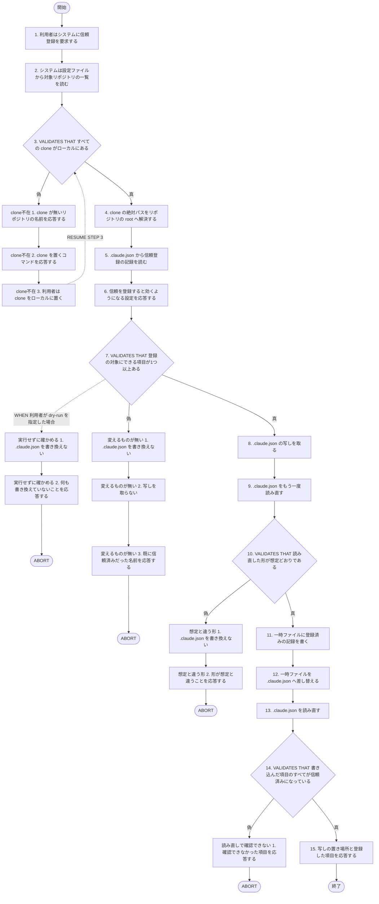
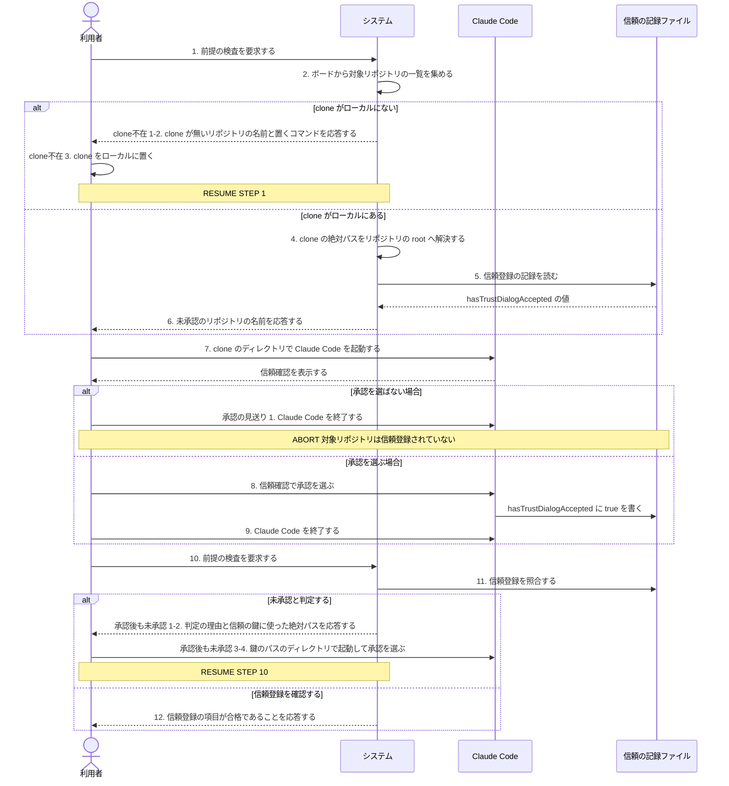

# ユースケース: 対象リポジトリを信頼登録する

## 根拠資料

- `docs/plans/continuo_design.md#1-6`（信頼確認プロンプトの扱い。信頼はリポジトリ単位で記録される実測）
- `docs/plans/continuo_design.md#3-6`（dispatch の直前の検査と、信頼を引く鍵の作り方の3段）
- `docs/plans/continuo_design.md#3-32`（`continuo doctor` の7項目。対象リポジトリはボードを読んで決める）
- `docs/plans/continuo_design.md#3-33`（信頼の登録を自動化しない）
- `docs/plans/continuo_design.md#4-3`（`~/.claude.json` を常駐ループから書き換えない。公式ドキュメントの原文）
- `docs/trying_it_out.md`（段3 フォルダの信頼を承認する / 段5 前提を検査する / 段6 issue を1件用意する）
- `internal/workspace/trust.go` の `CheckTrust` と `CheckTrustForClonePath`
- `internal/doctor/checks.go` の `checkTrust` と `checkClone`

## RUCM

```rucm
USE CASE NAME: 対象リポジトリを信頼登録する
BRIEF DESCRIPTION: 利用者は対象リポジトリの clone のディレクトリで Claude Code の信頼確認を承認する。システムは信頼登録の記録を読み取って検査の結果を利用者に応答する。
PRECONDITION: 利用者は continuo doctor を実行するディレクトリに WORKFLOW.md を置いている。ボードの active_states の Status に対象リポジトリの issue が1件以上ある。gh の認証は project の scope を含む。
PRIMARY ACTOR: 利用者
SECONDARY ACTORS: Claude Code
DEPENDENCY: なし
GENERALIZATION: なし

BASIC FLOW:
1. 利用者はシステムに信頼登録を要求する。
2. システムは設定ファイルから対象リポジトリの一覧を読む。
3. システムは VALIDATES THAT 対象リポジトリのすべての clone がローカルにある。
4. システムは clone の絶対パスをリポジトリの root へ解決する。
5. システムはホームディレクトリの .claude.json から信頼登録の記録を読む。
6. システムは利用者に信頼を登録すると効くようになる設定を応答する。
7. システムは VALIDATES THAT 登録の対象にできる項目が1つ以上ある。
8. システムはホームディレクトリの .claude.json の写しを取る。
9. システムはホームディレクトリの .claude.json をもう一度読み直す。
10. システムは VALIDATES THAT 読み直した .claude.json の形が想定どおりである。
11. システムは一時ファイルに登録済みの記録を書く。
12. システムは一時ファイルをホームディレクトリの .claude.json へ差し替える。
13. システムはホームディレクトリの .claude.json を読み直す。
14. システムは VALIDATES THAT 書き込んだ項目のすべてが信頼済みになっている。
15. システムは利用者に写しの置き場所と登録した項目を応答する。
POSTCONDITION: 対象リポジトリのすべてが Claude Code に信頼登録されている。ホームディレクトリに .claude.json の写しがある。continuo doctor の信頼登録の項目は ✓ である。

SPECIFIC ALTERNATIVE FLOW clone不在:
RFS BASIC FLOW 3
1. システムは利用者に clone が無いリポジトリの名前を応答する。
2. システムは利用者に clone を置くコマンドを応答する。
3. 利用者は対象リポジトリの clone をローカルに置く。
4. RESUME STEP 3
POSTCONDITION: 対象リポジトリの clone がローカルにある。clone が無かった検査では clone の項目が ✗ である。同じ検査では信頼登録の項目が ! である。

SPECIFIC ALTERNATIVE FLOW 変えるものが無い:
RFS BASIC FLOW 7
1. システムはホームディレクトリの .claude.json を書き換えない。
2. システムはホームディレクトリの .claude.json の写しを取らない。
3. システムは利用者に既に信頼済みだったリポジトリの名前を応答する。
4. ABORT
POSTCONDITION: ホームディレクトリの .claude.json は1バイトも変わっていない。写しは作られていない。

SPECIFIC ALTERNATIVE FLOW 想定と違う形:
RFS BASIC FLOW 10
1. システムはホームディレクトリの .claude.json を書き換えない。
2. システムは利用者に形が想定と違うことを応答する。
3. ABORT
POSTCONDITION: ホームディレクトリの .claude.json は1バイトも変わっていない。利用者は何が想定と違ったかを読める。

SPECIFIC ALTERNATIVE FLOW 読み直しで確認できない:
RFS BASIC FLOW 14
1. システムは利用者に書き込んだのに確認できなかった項目を応答する。
2. ABORT
POSTCONDITION: ホームディレクトリの .claude.json は書き換わっている。確認できなかった項目が表示されている。

GLOBAL ALTERNATIVE FLOW 実行せずに確かめる:
BRANCH FROM BASIC FLOW 7
WHEN 利用者が dry-run を指定した場合
1. システムはホームディレクトリの .claude.json を書き換えない。
2. システムは利用者に何も書き換えていないことを応答する。
3. ABORT
POSTCONDITION: ホームディレクトリの .claude.json は1バイトも変わっていない。利用者は何を許すことになるかを読める。
```

## フローチャート



## シーケンス図


